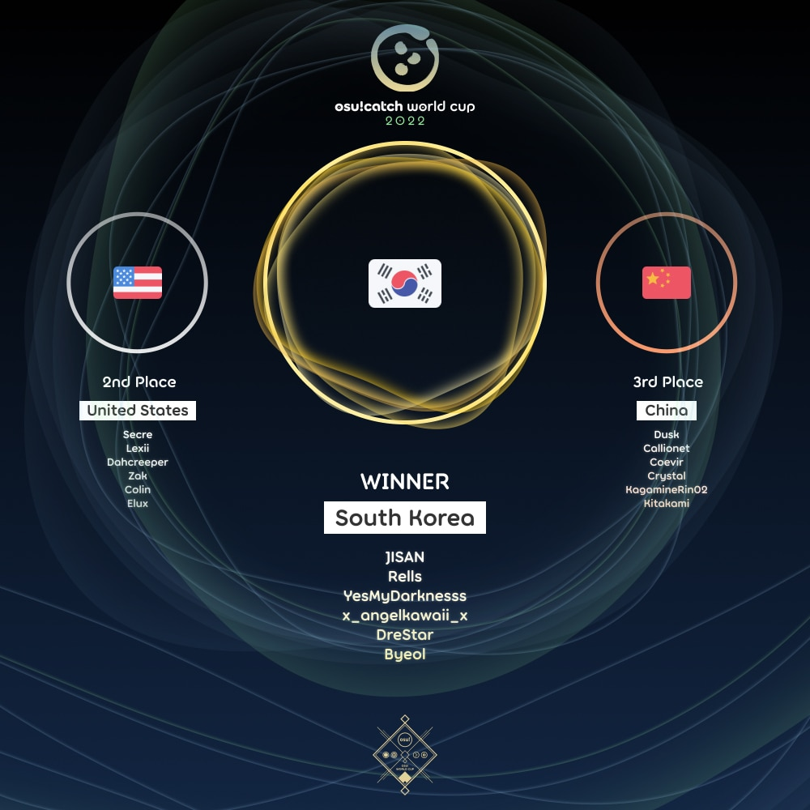

---
tags:
  - CWC
  - CWC2022
---

# osu!catch World Cup 2022

The **osu!catch World Cup 2022** (***CWC 2022***) was a country-based osu!catch tournament hosted by the [osu! team](/wiki/People/osu!_team). It was the eleventh instalment of the osu!catch World Cup.

## Tournament schedule

| Event | Timestamp |
| --: | :-- |
| Registration phase | 2022-04-21/2022-05-05 |
| Qualifier showcase | 2022-05-14 (14:00 UTC) |
| Qualifiers | 2022-05-21/2022-05-22 |
| Round of 32 | 2022-05-28/2022-05-29 |
| Round of 16 | 2022-06-04/2022-06-05 |
| Quarterfinals | 2022-06-11/2022-06-12 |
| Semifinals | 2022-06-18/2022-06-19 |
| Finals | 2022-06-25/2022-06-26 |
| Grand Finals | 2022-07-02/2022-07-03 |

## Prizes

The osu!catch World Cup 2022 offered a $2,000 cash prize pool and limited edition merch.

| Placing | Prizes |
| :-: | :-- |
|  | 48% of the prize pool, single-run merch, profile badge, **osu!catch Champion** user title for one year |
|  | 32% of the prize pool, single-run merch, profile badge |
|  | 20% of the prize pool, single-run merch, profile badge |

  

## Organisation

The osu!catch World Cup 2022 was run by the [osu! team](/wiki/People/osu!_team) and various community members.

| Position | Member(s) |
| :-- | :-- |
| Manager | ::{ flag=CA }:: [Azer](https://osu.ppy.sh/users/2155578), ::{ flag=US }:: [ChillierPear](https://osu.ppy.sh/users/9501251), ::{ flag=CN }:: [F D Flourite](https://osu.ppy.sh/users/2459589), ::{ flag=BR }:: [LeoFLT](https://osu.ppy.sh/users/3668779) |
| Mappool selector | ::{ flag=HK }:: [autofanboy](https://osu.ppy.sh/users/636114), ::{ flag=JP }:: [ekr](https://osu.ppy.sh/users/4497706), ::{ flag=CN }:: [F D Flourite](https://osu.ppy.sh/users/2459589), ::{ flag=CA }:: [wwwww](https://osu.ppy.sh/users/8434466), ::{ flag=TN }:: [-Ken](https://osu.ppy.sh/users/4430811) |
| Mappool quality assurance | ::{ flag=PH }:: [Bunnrei](https://osu.ppy.sh/users/829284), ::{ flag=ES }:: [Deif](https://osu.ppy.sh/users/318565), ::{ flag=GB }:: [JBHyperion](https://osu.ppy.sh/users/4879508), ::{ flag=PH }:: [Jemzuu](https://osu.ppy.sh/users/7890134), ::{ flag=DE }:: [Sanyi](https://osu.ppy.sh/users/7496029) |
| Mapper | ::{ flag=US }:: [Ascendance](https://osu.ppy.sh/users/2931883), ::{ flag=HK }:: [autofanboy](https://osu.ppy.sh/users/636114), ::{ flag=PH }:: [Bunnrei](https://osu.ppy.sh/users/829284), ::{ flag=AT }:: [Daletto](https://osu.ppy.sh/users/7592136), ::{ flag=ID }:: [Dapulezatos](https://osu.ppy.sh/users/8140944), ::{ flag=ES }:: [Deif](https://osu.ppy.sh/users/318565), ::{ flag=FR }:: [Emiru](https://osu.ppy.sh/users/3306180), ::{ flag=CN }:: [F D Flourite](https://osu.ppy.sh/users/2459589), ::{ flag=NL }:: [Greaper](https://osu.ppy.sh/users/2369776), ::{ flag=GB }:: [JBHyperion](https://osu.ppy.sh/users/4879508), ::{ flag=PH }:: [Jemzuu](https://osu.ppy.sh/users/7890134), ::{ flag=PH }:: [JierYagtama](https://osu.ppy.sh/users/7483452), ::{ flag=PL }:: [Mniam](https://osu.ppy.sh/users/6050530), ::{ flag=PH }:: [Nosuri](https://osu.ppy.sh/users/2150415), ::{ flag=DE }:: [Sanyi](https://osu.ppy.sh/users/7496029), ::{ flag=CN }:: [Souvenir](https://osu.ppy.sh/users/14057792), ::{ flag=PL }:: [Verti](https://osu.ppy.sh/users/10674528), ::{ flag=CA }:: [wwwww](https://osu.ppy.sh/users/8434466), ::{ flag=CN }:: [Yumeno Himiko](https://osu.ppy.sh/users/1806962), ::{ flag=TN }:: [-Ken](https://osu.ppy.sh/users/4430811), ::{ flag=PH }:: [-Rustyy](https://osu.ppy.sh/users/16355636) |
| Commentator | ::{ flag=US }:: [Dohland](https://osu.ppy.sh/users/5220511), ::{ flag=US }:: [Elux](https://osu.ppy.sh/users/12004983), ::{ flag=GB }:: [JBHyperion](https://osu.ppy.sh/users/4879508), ::{ flag=AU }:: [KWYJIBO](https://osu.ppy.sh/users/7178386), ::{ flag=US }:: [Lumenite-](https://osu.ppy.sh/users/6256027), ::{ flag=AU }:: [Maitoo](https://osu.ppy.sh/users/16899553), ::{ flag=RU }:: [Nelly](https://osu.ppy.sh/users/4741164), ::{ flag=NL }:: [Sartan](https://osu.ppy.sh/users/4100941), ::{ flag=US }:: [Secre](https://osu.ppy.sh/users/2306637), ::{ flag=US }:: [Snowleopard](https://osu.ppy.sh/users/3790227), ::{ flag=US }:: [Zak](https://osu.ppy.sh/users/1375955), ::{ flag=BE }:: [\[ Quinten \]](https://osu.ppy.sh/users/6283136) |
| Referee | ::{ flag=NL }:: [Albionthegreat](https://osu.ppy.sh/users/9853595), ::{ flag=AU }:: [Fairy Bread](https://osu.ppy.sh/users/8306102), ::{ flag=BR }:: [LeoFLT](https://osu.ppy.sh/users/3668779), ::{ flag=IN }:: [Speshimen](https://osu.ppy.sh/users/7720204), ::{ flag=US }:: [tigereyes144](https://osu.ppy.sh/users/6499811), ::{ flag=GB }:: [Yazzehh](https://osu.ppy.sh/users/7068973), ::{ flag=US }:: [\[K\]](https://osu.ppy.sh/users/16551387) |
| Statistician | ::{ flag=FI }:: [shdewz](https://osu.ppy.sh/users/10000899) |

## Links

- [Discussion thread](https://osu.ppy.sh/community/forums/topics/1562118)
- [Livestream](https://www.twitch.tv/osulive)
- [Challonge bracket](https://challonge.com/CWC22)
- [Pick'ems page](https://pickem.hwc.hr/tournaments/87) hosted by ::{ flag=DE }:: [hallowatcher](https://osu.ppy.sh/users/1874761)
- [Information spreadsheet](https://docs.google.com/spreadsheets/d/e/2PACX-1vRetD8MoopEqecAdBgPUlpXsbnqnu0posV0qh9Lxo130lScWtEx1Qe2uxdyIVx-HqtXdtEXD6Rtjs_V/pubhtml)

## Participants

|  | Country | Members |
| :-: | :-: | :-- |
| ::{ flag=DZ }:: | **Algeria** | **[nadvanlis](https://osu.ppy.sh/users/1402808)**, [Abdera7mane](https://osu.ppy.sh/users/20083587), [Demon-kira](https://osu.ppy.sh/users/20232838), [OkbinouTube](https://osu.ppy.sh/users/20799245) |
| ::{ flag=AR }:: | **Argentina** | **[Saikai](https://osu.ppy.sh/users/8172283)**, [SirGonzaxz](https://osu.ppy.sh/users/17309439), [Naarkz](https://osu.ppy.sh/users/19490380), [Karane](https://osu.ppy.sh/users/3093873), [DUKI MODODIABLO](https://osu.ppy.sh/users/5169874), [ryuiee](https://osu.ppy.sh/users/14685908) |
| ::{ flag=AU }:: | **Australia** | **[chickennando](https://osu.ppy.sh/users/5818665)**, [CrimsonPleaseee](https://osu.ppy.sh/users/3743985), [KWYJIBO](https://osu.ppy.sh/users/7178386), [pandaBear](https://osu.ppy.sh/users/107553), [Geniance](https://osu.ppy.sh/users/4229240), [Yubeki](https://osu.ppy.sh/users/7331416) |
| ::{ flag=BE }:: | **Belgium** | **[\[ Quinten \]](https://osu.ppy.sh/users/6283136)**, [\[ Zhiend \]](https://osu.ppy.sh/users/7474404), [\[ Ajia \]](https://osu.ppy.sh/users/17578266), [Cakenoob](https://osu.ppy.sh/users/6045522), [autolsfanboy](https://osu.ppy.sh/users/10742890), [Jezse](https://osu.ppy.sh/users/11390632) |
| ::{ flag=BR }:: | **Brazil** | **[Konohana Lucia](https://osu.ppy.sh/users/8642224)**, [ThanaR](https://osu.ppy.sh/users/3834323), [Acooler](https://osu.ppy.sh/users/5235352), [Predominador](https://osu.ppy.sh/users/4568537), [Makenshi](https://osu.ppy.sh/users/13111206), [Endou-](https://osu.ppy.sh/users/10792711) |
| ::{ flag=CA }:: | **Canada** | **[Katsuragi](https://osu.ppy.sh/users/3616480)**, [Ymiir](https://osu.ppy.sh/users/3922569), [fuhie](https://osu.ppy.sh/users/7620002), [Henrick](https://osu.ppy.sh/users/8840982), [WadBot](https://osu.ppy.sh/users/14571181), [Unlucky\_w](https://osu.ppy.sh/users/4820793) |
| ::{ flag=CL }:: | **Chile** | **[lineqtxz](https://osu.ppy.sh/users/989542)**, [eldnl](https://osu.ppy.sh/users/285756), [Aryssiel](https://osu.ppy.sh/users/2389481), [Lechu FAQ 35P](https://osu.ppy.sh/users/2872000), [Pekorrat](https://osu.ppy.sh/users/1250096), [Stark](https://osu.ppy.sh/users/1565036) |
| ::{ flag=CN }:: | **China** | **[Dusk](https://osu.ppy.sh/users/533210)**, [Callionet](https://osu.ppy.sh/users/3072921), [Coevir](https://osu.ppy.sh/users/3171965), [Crystal](https://osu.ppy.sh/users/1646397), [KagamineRin02](https://osu.ppy.sh/users/518503), [Kitakami](https://osu.ppy.sh/users/6347308) |
| ::{ flag=CO }:: | **Colombia** | **[Hojaldre](https://osu.ppy.sh/users/2573707)**, [Deley-](https://osu.ppy.sh/users/8291465), [God Gosu](https://osu.ppy.sh/users/7971842), [Juansy-](https://osu.ppy.sh/users/12588215), [Narnia](https://osu.ppy.sh/users/3600162), [HelpMePleasee](https://osu.ppy.sh/users/10835397) |
| ::{ flag=FI }:: | **Finland** | **[Nikolai](https://osu.ppy.sh/users/5302804)**, [Awsumi](https://osu.ppy.sh/users/4174308), [Bot\_Burger](https://osu.ppy.sh/users/6109660), [Mitenvoi](https://osu.ppy.sh/users/4278969), [JonZku](https://osu.ppy.sh/users/12740132), [Kurtsi](https://osu.ppy.sh/users/4222176) |
| ::{ flag=FR }:: | **France** | **[Holloh](https://osu.ppy.sh/users/7612994)**, [Ttobas](https://osu.ppy.sh/users/2084568), [Natsuko](https://osu.ppy.sh/users/8266817), [Boros](https://osu.ppy.sh/users/5490623), [Electr0o](https://osu.ppy.sh/users/9484428), [Noulayfe](https://osu.ppy.sh/users/4316542) |
| ::{ flag=DE }:: | **Germany** | **[NoteKuroi](https://osu.ppy.sh/users/186642)**, [Marvmallow](https://osu.ppy.sh/users/8403032), [Vinci007](https://osu.ppy.sh/users/5030297), [Inryuka](https://osu.ppy.sh/users/11635773), [-Nirfu-](https://osu.ppy.sh/users/7332050), [Ginoshi](https://osu.ppy.sh/users/5398106) |
| ::{ flag=ID }:: | **Indonesia** | **[Chroneko](https://osu.ppy.sh/users/5472877)**, [Dika312](https://osu.ppy.sh/users/741613), [Netamaru](https://osu.ppy.sh/users/1830361), [Madoka Ayukawa](https://osu.ppy.sh/users/1595221), [Urabe Mikoto](https://osu.ppy.sh/users/1272422), [LeWind](https://osu.ppy.sh/users/9718235) |
| ::{ flag=IL }:: | **Israel** | **[gal1](https://osu.ppy.sh/users/9424481)**, [LiL L1ghtMare](https://osu.ppy.sh/users/16782179), [Tourb0](https://osu.ppy.sh/users/19471527), [drhfff](https://osu.ppy.sh/users/20586082) |
| ::{ flag=IT }:: | **Italy** | **[Camme79](https://osu.ppy.sh/users/5220794)**, [ArMa79](https://osu.ppy.sh/users/4982799), [SirWaffle79](https://osu.ppy.sh/users/11754842), [Vito79](https://osu.ppy.sh/users/4039895), [sakhalin79](https://osu.ppy.sh/users/11158870), [Gnozza79](https://osu.ppy.sh/users/6438262) |
| ::{ flag=JP }:: | **Japan** | **[Molqus](https://osu.ppy.sh/users/1927193)**, [Snowwind](https://osu.ppy.sh/users/2163585), [Moja](https://osu.ppy.sh/users/3164010), [-Rindou-](https://osu.ppy.sh/users/7941971), [hiroshiki](https://osu.ppy.sh/users/2667256), [giru HD](https://osu.ppy.sh/users/707456) |
| ::{ flag=MY }:: | **Malaysia** | **[murutattack](https://osu.ppy.sh/users/4480237)**, [AstralLoki](https://osu.ppy.sh/users/14100384), [DTNLRiki](https://osu.ppy.sh/users/12382410), [Kagari](https://osu.ppy.sh/users/3366264), [Lute](https://osu.ppy.sh/users/4011799), [davidbeh\_97](https://osu.ppy.sh/users/4101818) |
| ::{ flag=MX }:: | **Mexico** | **[daxeroz](https://osu.ppy.sh/users/1170156)**, [Cowboy](https://osu.ppy.sh/users/1237535), [Cxlucha](https://osu.ppy.sh/users/5063961), [Firu](https://osu.ppy.sh/users/10516547), [ExGunt](https://osu.ppy.sh/users/20136125), [Muragaki](https://osu.ppy.sh/users/13195815) |
| ::{ flag=NL }:: | **Netherlands** | **[Chatie](https://osu.ppy.sh/users/6524765)**, [woodpamp](https://osu.ppy.sh/users/3809967), [Wesley](https://osu.ppy.sh/users/2407265), [KevKjef](https://osu.ppy.sh/users/9114235), [Fyunix](https://osu.ppy.sh/users/2503365), [\[ Christan \]](https://osu.ppy.sh/users/8170778) |
| ::{ flag=NZ }:: | **New Zealand** | **[Lay](https://osu.ppy.sh/users/3768185)**, [CTB Sakamata1](https://osu.ppy.sh/users/11735313), [LegoBoyWelly](https://osu.ppy.sh/users/24345309), [Nashiro](https://osu.ppy.sh/users/9740073) |
| ::{ flag=NO }:: | **Norway** | **[Mile](https://osu.ppy.sh/users/2760954)**, [Cameragod](https://osu.ppy.sh/users/4974088), [CyCeph](https://osu.ppy.sh/users/4586304), [Vanilla-](https://osu.ppy.sh/users/3400701), [Zazick](https://osu.ppy.sh/users/2569786), [Lanki](https://osu.ppy.sh/users/2535200) |
| ::{ flag=PH }:: | **Philippines** | **[Lobsterr](https://osu.ppy.sh/users/6575915)**, [Lawrence Angelo](https://osu.ppy.sh/users/10373568), [risu](https://osu.ppy.sh/users/18558246), [KumaRushia](https://osu.ppy.sh/users/23301957) |
| ::{ flag=PL }:: | **Poland** | **[BoberOfDarkness](https://osu.ppy.sh/users/3427748)**, [LechuCzechu88](https://osu.ppy.sh/users/5251714), [Kosmit](https://osu.ppy.sh/users/1749173), [Skyleia](https://osu.ppy.sh/users/2958293), [trig0n](https://osu.ppy.sh/users/3704228), [Mawers](https://osu.ppy.sh/users/14522883) |
| ::{ flag=PT }:: | **Portugal** | **[Tris](https://osu.ppy.sh/users/3821475)**, [DemiGod Yoxide](https://osu.ppy.sh/users/6205809), [GoncS](https://osu.ppy.sh/users/19423459), [Hiroto-](https://osu.ppy.sh/users/14917517), [Nelson](https://osu.ppy.sh/users/4095868), [Rosa](https://osu.ppy.sh/users/7385703) |
| ::{ flag=RU }:: | **Russian Federation** | **[Memoriola](https://osu.ppy.sh/users/6856387)**, [Nelly](https://osu.ppy.sh/users/4741164), [KitsunIvy](https://osu.ppy.sh/users/7055384), [\_Insomnia](https://osu.ppy.sh/users/8928855), [vafara](https://osu.ppy.sh/users/18917363) |
| ::{ flag=SG }:: | **Singapore** | **[He Ang CTB](https://osu.ppy.sh/users/2451381)**, [Accel](https://osu.ppy.sh/users/1169796), [\[Eun\]](https://osu.ppy.sh/users/3788536), [Kings](https://osu.ppy.sh/users/1016926), [Rubae](https://osu.ppy.sh/users/21105275), [Setsuen](https://osu.ppy.sh/users/2673742) |
| ::{ flag=KR }:: | **South Korea** | **[JISAN](https://osu.ppy.sh/users/3657951)**, [Rells](https://osu.ppy.sh/users/7937519), [YesMyDarknesss](https://osu.ppy.sh/users/4158549), [x\_angelkawaii\_x](https://osu.ppy.sh/users/566276), [DreStar](https://osu.ppy.sh/users/1808057), [Byeol](https://osu.ppy.sh/users/2754651) |
| ::{ flag=ES }:: | **Spain** | **[Patatitta](https://osu.ppy.sh/users/16294034)**, [Alepe](https://osu.ppy.sh/users/15273403), [Sprint-](https://osu.ppy.sh/users/13845399), [Anchoadae](https://osu.ppy.sh/users/22598202), [SirPantuflas](https://osu.ppy.sh/users/16163163), [skyres00](https://osu.ppy.sh/users/10158490) |
| ::{ flag=SE }:: | **Sweden** | **[Aceon](https://osu.ppy.sh/users/4452911)**, [\[ M e a k u \]](https://osu.ppy.sh/users/2747072), [DataPata](https://osu.ppy.sh/users/985360), [EclipZ](https://osu.ppy.sh/users/4586549), [Yukiteru Amano](https://osu.ppy.sh/users/1894511) |
| ::{ flag=CH }:: | **Switzerland** | **[ItsJ0el](https://osu.ppy.sh/users/5586377)**, [KiraKuroto](https://osu.ppy.sh/users/229191), [MC2BP](https://osu.ppy.sh/users/11296097), [xXMysteryXx](https://osu.ppy.sh/users/11475426) |
| ::{ flag=TW }:: | **Taiwan** | **[Beepu](https://osu.ppy.sh/users/4958376)**, [ZX123456](https://osu.ppy.sh/users/489271), [Sanami](https://osu.ppy.sh/users/1629471), [-Anya-](https://osu.ppy.sh/users/2455926), [Happiness Fish](https://osu.ppy.sh/users/4586766), [Extricate](https://osu.ppy.sh/users/4787989) |
| ::{ flag=TH }:: | **Thailand** | **[Azuria](https://osu.ppy.sh/users/16102533)**, [Mirimz](https://osu.ppy.sh/users/25792227), [Social Distance](https://osu.ppy.sh/users/17385454), [harlemshake555](https://osu.ppy.sh/users/7355319), [-TANAKITO-](https://osu.ppy.sh/users/6037121), [Char0n](https://osu.ppy.sh/users/17838855) |
| ::{ flag=TR }:: | **Turkey** | **[Zeus-](https://osu.ppy.sh/users/5464437)**, [1Haruki](https://osu.ppy.sh/users/11152537), [Fl4ndre Scarlet](https://osu.ppy.sh/users/4146243), [Mansek](https://osu.ppy.sh/users/10445862), [lorem ipsum](https://osu.ppy.sh/users/17130789), [shimu](https://osu.ppy.sh/users/14318796) |
| ::{ flag=UA }:: | **Ukraine** | **[\[-Nyaruko-\]](https://osu.ppy.sh/users/13712671)**, [Shadowbolts1](https://osu.ppy.sh/users/13962882), [Violet Feets](https://osu.ppy.sh/users/15558360), [bernkastel feet](https://osu.ppy.sh/users/13681464) |
| ::{ flag=GB }:: | **United Kingdom** | **[Withered Lotus](https://osu.ppy.sh/users/3546931)**, [Matt\_H](https://osu.ppy.sh/users/4067115), [Stats-Kun](https://osu.ppy.sh/users/8611935), [Zoggoth](https://osu.ppy.sh/users/2799946), [Litlas](https://osu.ppy.sh/users/5126518), [Tomato](https://osu.ppy.sh/users/9239206) |
| ::{ flag=US }:: | **United States** | **[Secre](https://osu.ppy.sh/users/2306637)**, [Lexii](https://osu.ppy.sh/users/7226149), [Dahcreeper](https://osu.ppy.sh/users/6926006), [Zak](https://osu.ppy.sh/users/1375955), [Colin](https://osu.ppy.sh/users/5502521), [Elux](https://osu.ppy.sh/users/12004983) |
| ::{ flag=VN }:: | **Vietnam** | **[Shu](https://osu.ppy.sh/users/4744615)**, [Stardust Prism](https://osu.ppy.sh/users/8525921), [Huytimeclock](https://osu.ppy.sh/users/10920086), [-Linglan Lily-](https://osu.ppy.sh/users/8738261), [Marota](https://osu.ppy.sh/users/10278890), [NamSPro](https://osu.ppy.sh/users/11387006) |

## Podium

## Mappools

**[Download the mappack here (145 MB)](https://drive.google.com/uc?id=1JtHyxS-ehyNU_QUOnD565rDPoCC1za38)**

### Grand Finals

- NoMod
  1. [katagiri - Angel's Salad ('Le mythe etendu' ver.) (Deif) \[Eternal Myth\]](https://osu.ppy.sh/beatmapsets/1794162#fruits/3677111)
  2. [Kagetora. - Hikitsuneno Mai (Emiru) \[EXCEED (CWC ver.)\]](https://osu.ppy.sh/beatmapsets/1794170#fruits/3677133)
  3. [Shinigiwa Satellite feat. Meramipop - Tensei Redemption (Crissa) \[Phantasm\]](https://osu.ppy.sh/beatmapsets/985141#fruits/2061194)
  4. [tokiwa - Kotodama Refrain (katagiri Bootleg) (Ducky-) \[\[nekomimi\]\]](https://osu.ppy.sh/beatmapsets/1605822#fruits/3279045)
- Hidden
  1. [Ice meets t+pazolite - Wicked Ceremony (autofanboy) \[Poltergeist in Sight\]](https://osu.ppy.sh/beatmapsets/1794175#fruits/3677152)
  2. [Memme - Chinese Restaurant (Yumeno Himiko) \[Overdose (CWC Ver.)\]](https://osu.ppy.sh/beatmapsets/1794196#fruits/3677183)
  3. [Akatsuki Records - WARNING x WARNING x WARNING (Hailie) \[Collab Extra\]](https://osu.ppy.sh/beatmapsets/755619#fruits/1593262)
- Hard Rock
  1. [Shadow Of Intent - The Return (Daletto) \[A living body so I can embrace and rejoice...\]](https://osu.ppy.sh/beatmapsets/1794186#fruits/3677168)
  2. [Se-U-Ra - The Endless for Traveler (JBHyperion) \[Adversity (CWC ver.)\]](https://osu.ppy.sh/beatmapsets/1794190#fruits/3677172)
  3. [Silent Siren - Soukai Rock (eLy) \[Dash!!\]](https://osu.ppy.sh/beatmapsets/422994#fruits/914220)
- Double Time
  1. [Minose Inori - TRUST IN ETERNITY (F D Flourite) \[ETERNITY\]](https://osu.ppy.sh/beatmapsets/1794217#fruits/3677251)
  2. [MYUKKE. - FULi AUTO BUSTER (FULi Ver) (Bunnrei) \[FULi OVER DOSER (FULi Ver)\]](https://osu.ppy.sh/beatmapsets/1794213#fruits/3677232)
  3. [Chino (CV: Inori Minase) - Mirai Puzzle (My Angel Ram) \[Cappuchino\]](https://osu.ppy.sh/beatmapsets/1547564#fruits/3162593)
  4. [Lockyn - Vapor (Blacky Design) \[Shining\]](https://osu.ppy.sh/beatmapsets/1203398#fruits/2505928)
- Mixed Mod
  1. [Camellia - \* Erm, could it be a Spatiotemporal ShockWAVE Syndrome...? (Ascendance) \[\* Ascenzuu's MAXIMUM\]](https://osu.ppy.sh/beatmapsets/1794202#fruits/3682229)
  2. [P-MODEL - LAB=01 (-Ken) \[Ken & Flourite's Mix\]](https://osu.ppy.sh/beatmapsets/1794200#fruits/3677204)
  3. [TEMPLIME - Neon Light (feat. TOTO HOSHIMIYA) (Mentai) \[Together Alone, Intoxicated by the Night\]](https://osu.ppy.sh/beatmapsets/1292247#fruits/2681970)
- Tiebreaker
  1. **[D-D-Dice vs. siromaru - Catch the Glory (Bunnrei) \[Grand Collab\]](https://osu.ppy.sh/beatmapsets/1794214#fruits/3677233)**

### Finals

**[Download the mappack here (119 MB)](https://drive.google.com/uc?id=1SCOM1YXo_Khgq7hPlpaD9PlUfBOIMVZ6)**

- NoMod
  1. [orangentle - Hopes and Dreams "A newer new home." (Bunnrei) \[Deluge\]](https://osu.ppy.sh/beatmapsets/1789525#fruits/3666749)
  2. [Tonari no Niwa wa Aoi (NIWASHI + Aoi) - Xb10r (Greaper) \[EXCEED\]](https://osu.ppy.sh/beatmapsets/1789437#fruits/3666577)
  3. [Imy - Countdown (jonathanlfj) \[Genesis\]](https://osu.ppy.sh/beatmapsets/1246683#fruits/2591255)
  4. [virkato - Waltz No. 17 in G minor, "Waltz of the Big dogs" (Kaifin) \[melloe & Kaifin's Kaiden\]](https://osu.ppy.sh/beatmapsets/727186#fruits/1535180)
- Hidden
  1. [xi - Parousia (Deif) \[Last Judgment (CWC ver.)\]](https://osu.ppy.sh/beatmapsets/1789435#fruits/3666568)
  2. [7\_7 - 724pp (Bunnrei) \[Inner Oni\]](https://osu.ppy.sh/beatmapsets/1789526#fruits/3666751)
  3. [Cranky - Bestrafung (Icekalt) \[Folter\]](https://osu.ppy.sh/beatmapsets/1633283#fruits/3333793)
- Hard Rock
  1. [meganeko - Feral (osu! edit) (Greaper) \[Astronomical\]](https://osu.ppy.sh/beatmapsets/1349805#fruits/2794697)
  2. [Jamie Christopherson - The Stains of Time (Maniac Agenda Mix) (Verti) \[AND IT WILL COME\]](https://osu.ppy.sh/beatmapsets/1789441#fruits/3666582)
  3. [OSTER project - Violet Rose (Down) \[Extra (#4)\]](https://osu.ppy.sh/beatmapsets/1178488#fruits/2457696)
- Double Time
  1. [KINEMA106 - Shinchoku Doudeshou (Sanyi) \[Overdose\]](https://osu.ppy.sh/beatmapsets/1789449#fruits/3666593)
  2. [Frums - Wavetapper (wwwww) \[PASTTHEDESIREFORUNDERSTANDING\]](https://osu.ppy.sh/beatmapsets/1789465#fruits/3666622)
  3. [Toyosaki Aki - MORE&MORE (Fycho) \[Insane\]](https://osu.ppy.sh/beatmapsets/125303#fruits/318975)
  4. [capsule - RGB (\_xyliac) \[Eternal\]](https://osu.ppy.sh/beatmapsets/1418131#fruits/2921856)
- Mixed Mod
  1. [HyuN feat. Syepias - CROSS SOUL (Souvenir) \[DESPAIR (CWC VER.)\]](https://osu.ppy.sh/beatmapsets/1789582#fruits/3666842)
  2. [BEMANI Sound Team "setup" - Ypsilon (F D Flourite) \[400\]](https://osu.ppy.sh/beatmapsets/1789455#fruits/3666602)
  3. [Aether Realm - Swampwitch (iamtickrate) \[Wrath of the Witch\]](https://osu.ppy.sh/beatmapsets/1556131#fruits/3178933)
- Tiebreaker
  1. **[ToYou & DJ Raisei - ADHD (Jemzuu) \[Rustyy & Jemzuu's Hyperactivity\]](https://osu.ppy.sh/beatmapsets/1789527#fruits/3666753)**

### Semifinals

**[Download the mappack here (144 MB)](https://drive.google.com/uc?id=17LYea7HNSBgsMfHBc9t5D9Fc5ODOHYaN)**

- NoMod
  1. [goreshit - broken promises/scattered dreams (Rocma) \[team south korea's overdose\]](https://osu.ppy.sh/beatmapsets/1265151#fruits/2629359)
  2. [DJ Noriken vs. MASAKI - QiXiN MAdN3ss 2153 (Jemzuu) \[ULTRA\]](https://osu.ppy.sh/beatmapsets/1784525#fruits/3654761)
  3. [Culprate - Beast (Vorso Remix) (Mir) \[Hunted\]](https://osu.ppy.sh/beatmapsets/1552826#fruits/3172759)
  4. [nameless - Toumei Elegy (Sotarks) \[Boundless Tragedy\]](https://osu.ppy.sh/beatmapsets/723730#fruits/1527884)
- Hidden
  1. [Rigel Theatre - Rinn Ding Dong (Cut Ver.) (F D Flourite) \[Ri Di Do\]](https://osu.ppy.sh/beatmapsets/1784443#fruits/3654622)
  2. [Igorrr - Cheval (JierYagtama) \[Chivalry\]](https://osu.ppy.sh/beatmapsets/1784726#fruits/3655311)
  3. [L.E.D.-G - SOUND OF GIALLARHORN (Flask) \[Ready for Takeoff\]](https://osu.ppy.sh/beatmapsets/1543402#fruits/3154808)
- Hard Rock
  1. [t+pazolite & Camellia feat. Nanahira - Boku no Yume, Mecha Kuso Mugen Waki (Verti) \[MECHA MECHA MECHA\]](https://osu.ppy.sh/beatmapsets/1784454#fruits/3654640)
  2. [HiTECH NINJA - Dolphika (Nosuri) \[MASTER\]](https://osu.ppy.sh/beatmapsets/1784557#fruits/3654830)
  3. [MY FIRST STORY - Smash Out!! (FCL) \[Extreme\]](https://osu.ppy.sh/beatmapsets/478289#fruits/1090928)
- Double Time
  1. [Lovejoy - Sex Sells (Crowley) \[loved yet lonely\]](https://osu.ppy.sh/beatmapsets/1467467#fruits/3013531)
  2. [Ardolf - Chromatic (autofanboy) \[Dynamicity\]](https://osu.ppy.sh/beatmapsets/1784544#fruits/3654803)
  3. [Shikata Akiko - Katayoku no Tori (IceKalt) \[Rio & Ice's Insane\]](https://osu.ppy.sh/beatmapsets/622500#fruits/1361543)
  4. [amazarashi - Sayonara Gokko (Kalibe) \[farewell\]](https://osu.ppy.sh/beatmapsets/932454#fruits/1946856)
- Mixed Mod
  1. [Monster Siren - MSR / Tooyama Akitaka - Fading Sky (Yumeno Himiko) \[From Darkness (CWC ver.)\]](https://osu.ppy.sh/beatmapsets/1784493#fruits/3654710)
  2. [Plum - Mad Piano Party (-Ken) \[Etude\]](https://osu.ppy.sh/beatmapsets/1784465#fruits/3654658)
  3. [Carpool Tunnel - Afterlight (\_Epreus) \[Expert\]](https://osu.ppy.sh/beatmapsets/1001546#fruits/2096611)
- Tiebreaker
  1. **[LeaF - Evanescent (extended ver.) (Bunnrei) \[Rei & Ascendance's Abstraction\]](https://osu.ppy.sh/beatmapsets/1784479#fruits/3654684)**

### Quarterfinals

**[Download the mappack here (138 MB)](https://drive.google.com/uc?id=1Fs2JRMaPBv0nYPvA6bC1qf6jSw68N50g)**

- NoMod
  1. [Reol - Saisaki (Dapuluous) \[Resolutions\]](https://osu.ppy.sh/beatmapsets/1779446#fruits/3644300)
  2. [BlackY - ARTEMiS (Jemzuu) \[PURiTY\]](https://osu.ppy.sh/beatmapsets/1779436#fruits/3644263)
  3. [Camellia - Ryuuseigun (ak74) \[Celine & taku's Extra\]](https://osu.ppy.sh/beatmapsets/1188437#fruits/2915338)
  4. [Toromaru - Enigma II (Shrukaghn) \[MAXIMUM\]](https://osu.ppy.sh/beatmapsets/1527919#fruits/3125641)
- Hidden
  1. [cosMo@BousouP - neu BSP style (Ascendance) \[ascenbot's exhaust CWC style\]](https://osu.ppy.sh/beatmapsets/1779445#fruits/3644299)
  2. [URBANGARDE - KIMI WA OKUMAGASO (JBHyperion) \[Untouchable\]](https://osu.ppy.sh/beatmapsets/1779476#fruits/3644367)
  3. [LukHash - GLITCH (Mao) \[DEFECT\]](https://osu.ppy.sh/beatmapsets/785774#fruits/1649675)
- Hard Rock
  1. [Feryquitous feat. Aitsuki Nakuru - Fake (Deif) \[Overdose\]](https://osu.ppy.sh/beatmapsets/1779452#fruits/3644314)
  2. [teaeye - Kimi ni (Mniam) \[Mniam & Rustyy's Feelings\]](https://osu.ppy.sh/beatmapsets/1779454#fruits/3644322)
  3. [HyuN - Wild Card (cococolaco) \[Extra\]](https://osu.ppy.sh/beatmapsets/891334#fruits/1863205)
- Double Time
  1. [Maeshima Mayu - Long shot (Verti) \[Greed\]](https://osu.ppy.sh/beatmapsets/1779463#fruits/3644333)
  2. [Silentroom - NULCTRL (Bunnrei) \[\CWC\2022\QF\_DT2\]](https://osu.ppy.sh/beatmapsets/1779483#fruits/3644382)
  3. [Kawada Mami - Wings of Courage -Sora o Koete- (Amateurre) \[Yuuki no Tsubasa\]](https://osu.ppy.sh/beatmapsets/1057765#fruits/2210918)
  4. [LOLUET - Sayonara Tender (Irohas) \[Insane\]](https://osu.ppy.sh/beatmapsets/1583099#fruits/3233294)
- Mixed Mod
  1. [Ponkichi - PPBQ (F D Flourite) \[Be Quiet... (CWC Edit.)\]](https://osu.ppy.sh/beatmapsets/1779471#fruits/3644354)
  2. [kors k - SigSig (AJT) \[Dream\]](https://osu.ppy.sh/beatmapsets/1615650#fruits/3298591)
- Tiebreaker
  1. **[Culprate & Zenji - Ghostmachine (Mniam) \[Collab Phantom\]](https://osu.ppy.sh/beatmapsets/1779478#fruits/3644369)**

### Round of 16

**[Download the mappack here (104 MB)](https://drive.google.com/uc?id=1ek2HFZvYTDLiEGR-S3xJwwNmyeyL5Sju)**

- NoMod
  1. [Nhato - Cosmica (Nosuri) \[Future\]](https://osu.ppy.sh/beatmapsets/1774456#fruits/3633387)
  2. [Seiryu - Time to Air (Ascendance) \[Black Another\]](https://osu.ppy.sh/beatmapsets/1774324#fruits/3632962)
  3. [KNOWER - Overtime (Mir) \[Ecstasy\]](https://osu.ppy.sh/beatmapsets/1170697#fruits/2442178)
  4. [solfa feat. Chata - Miracle infinity (toara) \[Miracle\]](https://osu.ppy.sh/beatmapsets/1607495#fruits/3282605)
- Hidden
  1. [Roce - Jishu (-Rustyy) \[Relentless\]](https://osu.ppy.sh/beatmapsets/1774484#fruits/3633464)
  2. [Origami Angel - The Title Track (Jemzuu) \[Crowley's Overdose\]](https://osu.ppy.sh/beatmapsets/1503591#fruits/3404571)
  3. [xi - ANiMA (Kalindraz) \[Oberum Primus\]](https://osu.ppy.sh/beatmapsets/441271#fruits/949234)
- Hard Rock
  1. [REOL - Konoyo Loading... (-Ken) \[Ken & AFB's Virtual Reality\]](https://osu.ppy.sh/beatmapsets/1774326#fruits/3632965)
  2. [Yu\_Asahina - eighth-slave (Bunnrei) \[over-dose\]](https://osu.ppy.sh/beatmapsets/1774353#fruits/3633055)
  3. [Jun Kuroda - Cybernetics (Altai) \[Heatwave's Insane\]](https://osu.ppy.sh/beatmapsets/1325579#fruits/2859329)
- Double Time
  1. [2ToneDisco x Cosmicosmo - Shoelaces (feat. Puniden) (autofanboy) \[Knots\]](https://osu.ppy.sh/beatmapsets/1774474#fruits/3633434)
  2. [Kobaryo - Cross The Finish Line \[feat. Nanahira\] (JBHyperion) \[Platter\]](https://osu.ppy.sh/beatmapsets/1774337#fruits/3632989)
  3. [Primastella - Koigokoro (Luerxa) \[Insane\]](https://osu.ppy.sh/beatmapsets/127712#fruits/323769)
  4. [Parov Stelar - Catgroove (Blue Dragon) \[Kuron's Insane\]](https://osu.ppy.sh/beatmapsets/144955#fruits/630739)
- Mixed Mod
  1. [Mili - Summoning 101 (JierYagtama) \[Jier & Mniam's Ritual\]](https://osu.ppy.sh/beatmapsets/1774772#fruits/3634242)
  2. [Dirty Androids - Egret and Willow (X Light) \[nika's Dove and Olive Extra\]](https://osu.ppy.sh/beatmapsets/1159124#fruits/2448956)
- Tiebreaker
  1. **[USAO - Extra Mode (Deif) \[Greaper & Deif's Another Episode\]](https://osu.ppy.sh/beatmapsets/1774332#fruits/3632973)**

### Round of 32

**[Download the mappack here (82 MB)](https://drive.google.com/uc?id=1dithcmw7fxXIqtGjNWA5ljgem8HSMwm8)**

- NoMod
  1. [sana - Kotoba no Iranai Yakusoku (Dapuluous) \[Everlasting Memories\]](https://osu.ppy.sh/beatmapsets/1769632#fruits/3622487)
  2. [cYsmix - Peer Gynt (Mniam) \[oVerdose\]](https://osu.ppy.sh/beatmapsets/1769575#fruits/3622391)
  3. [ZODIACSYNDICATE - Astraea no Soubei (wring) \[AngelHoney's ExtrA\]](https://osu.ppy.sh/beatmapsets/62788#fruits/441920)
  4. [Empty Peperoncino - Ame ni Utaeba (coco) \[Decaptin's Insane\]](https://osu.ppy.sh/beatmapsets/1385670#fruits/2862490)
- Hidden
  1. [YOASOBI - Yoru ni Kakeru (Bunnrei) \[Racing into the Night\]](https://osu.ppy.sh/beatmapsets/1769611#fruits/3622450)
  2. [Soken Masayoshi - A Long Fall (Ryuusei Aika) \[Time Traveler\]](https://osu.ppy.sh/beatmapsets/1266110#fruits/2631415)
- Hard Rock
  1. [onoken feat. moco - Light up my love!! (Ascendance) \[Special\]](https://osu.ppy.sh/beatmapsets/1769587#fruits/3622411)
  2. [Fractal Dreamers - Monolithia (Yugu) \[Insane\]](https://osu.ppy.sh/beatmapsets/982375#fruits/2073093)
- Double Time
  1. [Loki - Wizard's Tower (Verti) \[Platter\]](https://osu.ppy.sh/beatmapsets/1769773#fruits/3622817)
  2. [TWICE - Feel Special (Xetopia) \[Platter\]](https://osu.ppy.sh/beatmapsets/1108886#fruits/2331693)
  3. [Nanamori-chu \* Goraku-bu - Happy Time wa Owaranai (Cut Ver.) (-Keitaro) \[Insane\]](https://osu.ppy.sh/beatmapsets/1057015#fruits/2210722)
- Mixed Mod
  1. [Rigel Theatre - Maple Town Memories (F D Flourite) \[Maple Story\]](https://osu.ppy.sh/beatmapsets/1769594#fruits/3622419)
  2. [Nardis - HAPPY (-PC) \[Yokes' Insane: OVERJOYED\]](https://osu.ppy.sh/beatmapsets/790841#fruits/2085630)
- Tiebreaker
  1. **[La priere - Sore wa Sekai o Koete (Yumeno Himiko) \[Collab Overdose\]](https://osu.ppy.sh/beatmapsets/1769605#fruits/3622443)**

### Qualifiers

**[Download the mappack here (93 MB)](https://drive.google.com/uc?id=1lEUFkMvljWzub9IhE3lW0wGI9COU-2DO)**

- NoMod
  1. [Mia REGINA - I got it! (Slax Remix) (-Rustyy) \[Rustyy & Nosuri's Special\]](https://osu.ppy.sh/beatmapsets/1764078#fruits/3610710)
  2. [Christopher Larkin - Mantis Lords (0 K Remix) (JBHyperion) \[A Traitor's End\]](https://osu.ppy.sh/beatmapsets/1763744#fruits/3610043)
  3. [Rhodanthe\* - Yumeiro Parade (Doormat) \[Mosaic\]](https://osu.ppy.sh/beatmapsets/425957#fruits/920453)
- Hidden
  1. [siqlo - YInMn Blue (autofanboy) \[Artefact\]](https://osu.ppy.sh/beatmapsets/1763643#fruits/3609835)
  2. [isubokuro - Aun no Beats (Beren) \[Answer\]](https://osu.ppy.sh/beatmapsets/1153984#fruits/2408391)
- Hard Rock
  1. [MisomyL - Mukishitsu Sekai ni Irodori o (Bunnrei) \[Overdose\]](https://osu.ppy.sh/beatmapsets/1763991#fruits/3610504)
  2. [KINEMA106 - Juusou (Mordred) \[Yogurtt's Extra\]](https://osu.ppy.sh/beatmapsets/1301393#fruits/2709081)
- Double Time
  1. [WOODKID - Iron (Ascendance) \[Requiescat in Pace\]](https://osu.ppy.sh/beatmapsets/1763686#fruits/3609911)
  2. [Tatsh - Lunatic Tears... (Tatsh Remix) (Mordred) \[Insane\]](https://osu.ppy.sh/beatmapsets/1460718#fruits/3001358)

## Match results

### Grand Finals

Sunday, 3 July 2022:

| Team A |  |  | Team B | Match link |
| --: | :-: | :-: | :-- | :-- |
| China ::{ flag=CN }:: | 2 | **7** | ::{ flag=US }:: **United States** | [#1](https://osu.ppy.sh/community/matches/101973535) |
| **South Korea** ::{ flag=KR }:: | **7** | 4 | ::{ flag=US }:: United States | [#1](https://osu.ppy.sh/community/matches/101975304) |

### Finals

Detailed statistics for this round can be found [here](https://docs.google.com/spreadsheets/d/1VWBCL3vYoMv2IyvCrzEBFHprikHDhSv7YfQiotE0TyE?rm=minimal).

Saturday, 25 June 2022:

| Team A |  |  | Team B | Match link |
| --: | :-: | :-: | :-- | :-- |
| **Indonesia** ::{ flag=ID }:: | **7** | 5 | ::{ flag=CA }:: Canada | [#1](https://osu.ppy.sh/community/matches/101766015) |

Sunday, 26 June 2022:

| Team A |  |  | Team B | Match link |
| --: | :-: | :-: | :-- | :-- |
| China ::{ flag=CN }:: | 2 | **7** | ::{ flag=KR }:: **South Korea** | [#1](https://osu.ppy.sh/community/matches/101787479) |
| **United States** ::{ flag=US }:: | **7** | 2 | ::{ flag=FR }:: France | [#1](https://osu.ppy.sh/community/matches/101790173) |
| **United States** ::{ flag=US }:: | **7** | 4 | ::{ flag=ID }:: Indonesia | [#1](https://osu.ppy.sh/community/matches/101792244) |

### Semifinals

Detailed statistics for this round can be found [here](https://docs.google.com/spreadsheets/d/1hT_pDocqxzhq3yiKGylWTeNKvDiBig4Zb_J99Z84e7Q?rm=minimal).

Saturday, 18 June 2022:

| Team A |  |  | Team B | Match link |
| --: | :-: | :-: | :-- | :-- |
| **France** ::{ flag=FR }:: | **7** | 0 | ::{ flag=DE }:: Germany | [#1](https://osu.ppy.sh/community/matches/101572162) |
| Mexico ::{ flag=MX }:: | 2 | **7** | ::{ flag=IT }:: **Italy** | [#1](https://osu.ppy.sh/community/matches/101575255) |
| **Chile** ::{ flag=CL }:: | **7** | 1 | ::{ flag=RU }:: Russian Federation | [#1](https://osu.ppy.sh/community/matches/101578500) |
| Chile ::{ flag=CL }:: | 6 | **7** | ::{ flag=FR }:: **France** | [#1](https://osu.ppy.sh/community/matches/101580710) |
| **Canada** ::{ flag=CA }:: | **7** | 2 | ::{ flag=AU }:: Australia | [#1](https://osu.ppy.sh/community/matches/101584101) |

Sunday, 19 June 2022:

| Team A |  |  | Team B | Match link |
| --: | :-: | :-: | :-- | :-- |
| **China** ::{ flag=CN }:: | **7** | 4 | ::{ flag=ID }:: Indonesia | [#1](https://osu.ppy.sh/community/matches/101592281) |
| **South Korea** ::{ flag=KR }:: | **7** | 4 | ::{ flag=US }:: United States | [#1](https://osu.ppy.sh/community/matches/101600086) |
| **Canada** ::{ flag=CA }:: | **7** | 6 | ::{ flag=IT }:: Italy | [#1](https://osu.ppy.sh/community/matches/101607690) |

### Quarterfinals

Detailed statistics for this round can be found [here](https://docs.google.com/spreadsheets/d/18lk9qlRMAdu3I0o2eRNTGmwkE7hLkDKQ_49EcwUEwaE?rm=minimal).

Saturday, 11 June 2022:

| Team A |  |  | Team B | Match link |
| --: | :-: | :-: | :-- | :-- |
| **Russian Federation** ::{ flag=RU }:: | **6** | 0 | ::{ flag=JP }:: Japan | [#1](https://osu.ppy.sh/community/matches/101372214) |
| **Italy** ::{ flag=IT }:: | **6** | 3 | ::{ flag=BE }:: Belgium | [#1](https://osu.ppy.sh/community/matches/101377294) |
| **Taiwan** ::{ flag=TW }:: | **6** | 0 | ::{ flag=AR }:: Argentina | [#1](https://osu.ppy.sh/community/matches/101377316) |
| **Australia** ::{ flag=AU }:: | **6** | 2 | ::{ flag=FI }:: Finland | [#1](https://osu.ppy.sh/community/matches/101378135) |
| **Poland** ::{ flag=PL }:: | **6** | 1 | ::{ flag=NL }:: Netherlands | [#1](https://osu.ppy.sh/community/matches/101379007) |
| **Brazil** ::{ flag=BR }:: | **6** | 1 | ::{ flag=NO }:: Norway | [#1](https://osu.ppy.sh/community/matches/101380647) |
| **Russian Federation** ::{ flag=RU }:: | **6** | 4 | ::{ flag=PL }:: Poland | [#1](https://osu.ppy.sh/community/matches/101382298) |

Sunday, 12 June 2022:

| Team A |  |  | Team B | Match link |
| --: | :-: | :-: | :-- | :-- |
| **South Korea** ::{ flag=KR }:: | **6** | 0 | ::{ flag=MX }:: Mexico | [#1](https://osu.ppy.sh/community/matches/101395843) |
| **Germany** ::{ flag=DE }:: | **6** | 2 | ::{ flag=VN }:: Vietnam | [#1](https://osu.ppy.sh/community/matches/101401973) |
| **Singapore** ::{ flag=SG }:: | **6** | 2 | ::{ flag=SE }:: Sweden | [#1](https://osu.ppy.sh/community/matches/101403895) |
| Taiwan ::{ flag=TW }:: | 4 | **6** | ::{ flag=DE }:: **Germany** | [#1](https://osu.ppy.sh/community/matches/101403905) |
| **Australia** ::{ flag=AU }:: | **6** | 0 | ::{ flag=SG }:: Singapore | [#1](https://osu.ppy.sh/community/matches/101406354) |
| **China** ::{ flag=CN }:: | **6** | 1 | ::{ flag=FR }:: France | [#1](https://osu.ppy.sh/community/matches/101406415) |
| **Indonesia** ::{ flag=ID }:: | **6** | 2 | ::{ flag=CL }:: Chile | [#1](https://osu.ppy.sh/community/matches/101410862) |
| **Italy** ::{ flag=IT }:: | **6** | 0 | ::{ flag=BR }:: Brazil | [#1](https://osu.ppy.sh/community/matches/101412301) |
| **United States** ::{ flag=US }:: | **6** | 5 | ::{ flag=CA }:: Canada | [#1](https://osu.ppy.sh/community/matches/101415322) |

### Round of 16

Detailed statistics for this round can be found [here](https://docs.google.com/spreadsheets/d/1bH8pqehvCR6XrpHaCK9Bg40XimzhLVjvmdHi7Il3TbQ?rm=minimal).

Saturday, 4 June 2022:

| Team A |  |  | Team B | Match link |
| --: | :-: | :-: | :-- | :-- |
| **China** ::{ flag=CN }:: | **6** | 0 | ::{ flag=BR }:: Brazil | [#1](https://osu.ppy.sh/community/matches/101169653) |
| Ukraine ::{ flag=UA }:: | -1 | **0** | ::{ flag=BE }:: **Belgium** | *win by default* |
| Portugal ::{ flag=PT }:: | 1 | **6** | ::{ flag=FI }:: **Finland** | [#1](https://osu.ppy.sh/community/matches/101180356) |
| Malaysia ::{ flag=MY }:: | 0 | **6** | ::{ flag=AR }:: **Argentina** | [#1](https://osu.ppy.sh/community/matches/101181777) |
| **France** ::{ flag=FR }:: | **6** | 5 | ::{ flag=IT }:: Italy | [#1](https://osu.ppy.sh/community/matches/101183457) |
| **Canada** ::{ flag=CA }:: | **6** | 5 | ::{ flag=RU }:: Russian Federation | [#1](https://osu.ppy.sh/community/matches/101189382) |

Sunday, 5 June 2022:

| Team A |  |  | Team B | Match link |
| --: | :-: | :-: | :-- | :-- |
| Taiwan ::{ flag=TW }:: | 2 | **6** | ::{ flag=MX }:: **Mexico** | [#1](https://osu.ppy.sh/community/matches/101202757) |
| **South Korea** ::{ flag=KR }:: | **6** | 1 | ::{ flag=DE }:: Germany | [#1](https://osu.ppy.sh/community/matches/101208711) |
| Thailand ::{ flag=TH }:: | 1 | **6** | ::{ flag=NL }:: **Netherlands** | [#1](https://osu.ppy.sh/community/matches/101212181) |
| Israel ::{ flag=IL }:: | 0 | **6** | ::{ flag=JP }:: **Japan** | [#1](https://osu.ppy.sh/community/matches/101212822) |
| **Chile** ::{ flag=CL }:: | **6** | 3 | ::{ flag=AU }:: Australia | [#1](https://osu.ppy.sh/community/matches/101213575) |
| **Indonesia** ::{ flag=ID }:: | **6** | 1 | ::{ flag=SG }:: Singapore | [#1](https://osu.ppy.sh/community/matches/101214374) |
| Colombia ::{ flag=CO }:: | 2 | **6** | ::{ flag=VN }:: **Vietnam** | [#1](https://osu.ppy.sh/community/matches/101215161) |
| **United States** ::{ flag=US }:: | **6** | 1 | ::{ flag=PL }:: Poland | [#1](https://osu.ppy.sh/community/matches/101218313) |
| Turkey ::{ flag=TR }:: | 5 | **6** | ::{ flag=SE }:: **Sweden** | [#1](https://osu.ppy.sh/community/matches/101219706) |
| United Kingdom ::{ flag=GB }:: | 0 | **6** | ::{ flag=NO }:: **Norway** | [#1](https://osu.ppy.sh/community/matches/101219719) |

### Round of 32

Detailed statistics for this round can be found [here](https://docs.google.com/spreadsheets/d/1TXBAh_aZ7I-gVQ7nMNMl2KXOjr7sZGK5nS97dg1xf3Y?rm=minimal).

Saturday, 28 May 2022:

| Team A |  |  | Team B | Match link |
| --: | :-: | :-: | :-- | :-- |
| **China** ::{ flag=CN }:: | **5** | 0 | ::{ flag=IL }:: Israel | [#1](https://osu.ppy.sh/community/matches/100983046) |
| **France** ::{ flag=FR }:: | **5** | 0 | ::{ flag=TH }:: Thailand | [#1](https://osu.ppy.sh/community/matches/100984192) |
| **Singapore** ::{ flag=SG }:: | **5** | 1 | ::{ flag=AR }:: Argentina | [#1](https://osu.ppy.sh/community/matches/100988735) |
| **Canada** ::{ flag=CA }:: | **5** | 0 | ::{ flag=GB }:: United Kingdom | [#1](https://osu.ppy.sh/community/matches/100999540) |

Sunday, 29 May 2022:

| Team A |  |  | Team B | Match link |
| --: | :-: | :-: | :-- | :-- |
| **Brazil** ::{ flag=BR }:: | **5** | 1 | ::{ flag=JP }:: Japan | [#1](https://osu.ppy.sh/community/matches/101006356) |
| **Chile** ::{ flag=CL }:: | **5** | 0 | ::{ flag=CO }:: Colombia | [#1](https://osu.ppy.sh/community/matches/101007435) |
| Belgium ::{ flag=BE }:: | 2 | **5** | ::{ flag=PL }:: **Poland** | [#1](https://osu.ppy.sh/community/matches/101016819) |
| **South Korea** ::{ flag=KR }:: | **5** | 0 | ::{ flag=PT }:: Portugal | [#1](https://osu.ppy.sh/community/matches/101018119) |
| **Italy** ::{ flag=IT }:: | **5** | 1 | ::{ flag=NL }:: Netherlands | [#1](https://osu.ppy.sh/community/matches/101019335) |
| **Indonesia** ::{ flag=ID }:: | **5** | 0 | ::{ flag=MY }:: Malaysia | [#1](https://osu.ppy.sh/community/matches/101019418) |
| **Australia** ::{ flag=AU }:: | **5** | 1 | ::{ flag=VN }:: Vietnam | [#1](https://osu.ppy.sh/community/matches/101019454) |
| **Taiwan** ::{ flag=TW }:: | **5** | 1 | ::{ flag=TR }:: Turkey | [#1](https://osu.ppy.sh/community/matches/101019336) |
| **Russian Federation** ::{ flag=RU }:: | **5** | 1 | ::{ flag=NO }:: Norway | [#1](https://osu.ppy.sh/community/matches/101022550) |
| **United States** ::{ flag=US }:: | **5** | 0 | ::{ flag=UA }:: Ukraine | [#1](https://osu.ppy.sh/community/matches/101024434) |
| **Germany** ::{ flag=DE }:: | **5** | 4 | ::{ flag=FI }:: Finland | [#1](https://osu.ppy.sh/community/matches/101025686) |
| **Mexico** ::{ flag=MX }:: | **5** | 0 | ::{ flag=SE }:: Sweden | [#1](https://osu.ppy.sh/community/matches/101026998) |

### Qualifiers

The final standings for the Qualifier stage can be found in the following [spreadsheet](https://docs.google.com/spreadsheets/d/1FrNxtdV9tnG3n6SxnnsDJaYkr5x7DixN8dvl4TH6Kx8?rm=minimal). Detailed statistics for this round can be found [here](https://docs.google.com/spreadsheets/d/10rAEhiJH9smCfqYEfFVvk3pDm6VLR3tYhJNOB01LNJo?rm=minimal).

| Seed | Country | MAX% sum |
| :-: | :-- | :-- |
| #1 | ::{ flag=CN }:: China | 8.888 |
| #2 | ::{ flag=KR }:: South Korea | 8.795 |
| #3 | ::{ flag=US }:: United States | 8.787 |
| #4 | ::{ flag=ID }:: Indonesia | 8.755 |
| #5 | ::{ flag=CL }:: Chile | 8.69 |
| #6 | ::{ flag=CA }:: Canada | 8.688 |
| #7 | ::{ flag=TW }:: Taiwan | 8.629 |
| #8 | ::{ flag=FR }:: France | 8.608 |
| #9 | ::{ flag=IT }:: Italy | 8.556 |
| #10 | ::{ flag=MX }:: Mexico | 8.494 |
| #11 | ::{ flag=RU }:: Russian Federation | 8.478 |
| #12 | ::{ flag=AU }:: Australia | 8.261 |
| #13 | ::{ flag=SG }:: Singapore | 8.253 |
| #14 | ::{ flag=BE }:: Belgium | 8.222 |
| #15 | ::{ flag=DE }:: Germany | 8.189 |
| #16 | ::{ flag=BR }:: Brazil | 8.059 |
| #17 | ::{ flag=JP }:: Japan | 7.934 |
| #18 | ::{ flag=FI }:: Finland | 7.882 |
| #19 | ::{ flag=PL }:: Poland | 7.847 |
| #20 | ::{ flag=AR }:: Argentina | 7.648 |
| #21 | ::{ flag=VN }:: Vietnam | 7.574 |
| #22 | ::{ flag=NO }:: Norway | 7.538 |
| #23 | ::{ flag=SE }:: Sweden | 7.372 |
| #24 | ::{ flag=NL }:: Netherlands | 7.302 |
| #25 | ::{ flag=TH }:: Thailand | 7.285 |
| #26 | ::{ flag=TR }:: Turkey | 7.274 |
| #27 | ::{ flag=GB }:: United Kingdom | 7.199 |
| #28 | ::{ flag=CO }:: Colombia | 7.011 |
| #29 | ::{ flag=MY }:: Malaysia | 6.779 |
| #30 | ::{ flag=UA }:: Ukraine | 6.588 |
| #31 | ::{ flag=PT }:: Portugal | 6.445 |
| #32 | ::{ flag=IL }:: Israel | 6.173 |
| #33 | ::{ flag=ES }:: Spain | 5.982 |
| #34 | ::{ flag=NZ }:: New Zealand | 5.584 |
| #35 | ::{ flag=PH }:: Philippines | 5.286 |
| #36 | ::{ flag=DZ }:: Algeria | 4.722 |
| #37 | ::{ flag=CH }:: Switzerland | 4.452 |

## Ruleset

### Tournament rules

1. The osu!catch World Cup is a country-based 3 versus 3 team tournament, played on the osu!catch game mode.
2. Beatmap scoring is based on ScoreV2.
3. The maps for each round will be announced by the mappool selectors on the Sunday before the actual matches take place.
4. The match schedule will be settled by the Tournament Management (see above).
5. If no referee is available at match time, the match will be postponed.
6. Use of the Visual Settings to alter background dim or disable beatmap elements like storyboards and skins are allowed.
   - Custom skin elements must not be used to alter core gameplay elements or mechanics in unintended ways.
7. If a game ends in a draw, it will be nullified and the map will be replayed.
8. Teams may ask for a rematch if a team member encounters technical difficulties while playing.
   - "Lag spikes" are not considered a valid reason to nullify a beatmap.
   - If a rematch happens, the original roster for each team during that particular beatmap must remain the same. If that is not possible, e.g. by virtue of a technical issue, both teams will be allowed to swap rosters.
   - This rule is not to be abused. Referees may veto a rematch request if they find that this is the case.
9. Disconnects within 30 seconds or 25% of the beatmap length (whichever happens first) can be rematched, at the referee's discretion, as long as it is clearly communicated in the chatroom.
10. If a player disconnects, their scores will not be counted towards their team's total, unless adequate proof of said score is provided. The following are considered as acceptable proof:
    - Player point-of-view live stream snippets (commonly referred to as "clips" or "VODs"). The entirety of the play, along with the results screen must be clearly visible along with the affected player's score.
    - Replay files of the play, taken directly from the "Local scores" tab on the affected player's client (the timestamps must exactly match the time at which the game took place, as seen on the multiplayer lobby link).
    - Screenshots from other players taken directly in-game that show the affected player's score.
      - Screenshots from the results screen must clearly show the affected player's score. This is the preferred method.
      - Screenshots taken in-game at the time of disconnection may be accepted. Note that this method does not provide a one-to-one representation of that player's score. Using this method is not encouraged and it may be denied at the referee's discretion if the information provided is not sufficient to identify the player/score.
      - All screenshots **MUST** be taken using the game itself (using `Shift` + `F12`), that is, they must be hosted on the `https://osu.ppy.sh/` domain. Any other form of screenshot will be denied.
    - Player scores may be derived from the official stream as a last resort, in cases where the match is streamed.
11. If less than the minimum amount of required players are present at match time, the match can be postponed for up to 10 minutes. If after this period there are still not enough players for either team, a *win by default* will be declared for the side with the most members present.
    - The minimum amount of required players is the amount of players needed to play a beatmap without any vacant spots in the lobby (i.e. 3 participants must be present for the match to begin).
12. If a player disconnects between beatmaps and the team cannot provide a substitute, the match can be delayed for up to 10 minutes (limited to once per team, per match).
13. Exchanging players between games is allowed without limitations.
14. **The minimum size for a team is 4 players, and the maximum is 6.**
15. Players are expected to keep the match running fluently and without delays. Excessive match delays from the players' side may result in penalties being applied at the referee's discretion. Disrupting the match by foul play, insulting or provoking other players or staff, delaying the match, or other deliberate inappropriate misbehaviour are strictly prohibited, and will be punished accordingly.
16. All players and staff must be treated with respect. Instructions from the referees and the Tournament Management are to be followed. Decisions labelled as final are not to be objected.
17. The multiplayer chatrooms underlie the [osu! community rules](/wiki/Rules). All chat rules apply to the multiplayer chatrooms, too.
    - Breaking the chat rules may result in a silence. Silenced players cannot participate in multiplayer matches and must be exchanged for the duration of the punishment.
18. Penalties for violating the tournament rules include, but are not limited to:
    - Exclusion of specific players for one beatmap.
    - Exclusion of specific players for an entire match.
    - Declaring the match as forfeited, or as a win by default for the other team.
    - Disqualification from the entire tournament.
    - Disqualification from the current and future official tournaments, until appealed.
19. Referees may allow, at their discretion, lower or higher tolerances for timers.
20. The Tournament Management may request liveplays or recordings of individual players or teams at any point.
21. The Tournament Management reserves the right to modify these rules at any moment. Any such changes will be announced in advance.

### Tournament registration

1. Every user interested in joining their country's team signs up individually.
   - Tournament Management will create a list of potential candidates for a country's team.
   - Tournament Management will declare one candidate captain of their country's team.
2. The declared captain will then form their team from the candidate list of their country.
   - Captains are expected to choose team members with honesty and good will, with the aim of fielding the strongest team possible.
   - Captains are allowed to exclude themselves from the team list.
   - Captains are allowed to conduct and coordinate "tryouts", tests to gauge player aptitude, on their own terms.
   - Captains may choose, with the approval of the Tournament Management, at any time, to transfer their role to other prospective team members. Once given, only the new captain may assign the captaincy to another player.
3. To ensure valid registrations, every prospective participant will be manually checked by the [account support team](/wiki/People/Account_support_team), in a manner similar to the [tournament screening](/wiki/Tournaments/Official_support#tournament-screening) that is offered to community tournaments.
   - Every registered user will be assigned to their respective country's candidate list.
   - To be successfully accepted on the list, players are required to be placed #5000 or higher on the osu!catch global ranking, and not have violated the [osu! community rules](/wiki/Rules) within the last 12 months.
4. All successfully formed teams will be published after the Registration Phase.
   - A team should have at least 4 players registered to have the chance to play the Qualifier stage. This limitation may be change depending on the amount of signups.
   - The top 32 seeded teams will qualify to the Round of 32.
5. Tournament staff members are **not** allowed to play in the tournament, with the exception of commentators and streamers.

### Qualifier instructions

1. In the Qualifier stage, all teams will play a specific pool designed by the mappool selectors.
2. The mappool will contain 4 brackets: [NoMod](/wiki/Gameplay/Game_modifier#no-mod), [Hidden](/wiki/Gameplay/Game_modifier/Hidden), [Hard Rock](/wiki/Gameplay/Game_modifier/Hard_Rock), and [Double Time](/wiki/Gameplay/Game_modifier/Double_Time). There will be no tiebreakers for this stage.
3. The Qualifier pool will contain 9 maps. There will be 3 maps under the NoMod bracket, and 2 maps for the Hidden, Hard Rock, and Double Time brackets each.
4. Teams will play the mappool in two runs at a designated time.
   - Teams may skip individual maps or the second run altogether if they so desire.
5. The mappool **must** be played in the following order: NM1, NM2, NM3, HD1, HD2, HR1, HR2, DT1, DT2.
6. Each team must have 3 players for each map. They can be exchanged freely after each map is concluded.
7. A team's final score for a map is considered as the highest combined team score for that map (i.e. the sum of each individual player's score). Only the highest score out of the two runs will be used for seeding.
8. The seeding method used for Qualifiers will be %MAX — the highest combined team score for each map will receive 100% of the points (i.e. a numerical value of 1), and every other team will be awarded a percentage of that top score. The individual map percentages will be added together to compose that team's final score, which is then sorted from highest to lowest, highest being seed #1.
   - The exact formula that will be used for all teams (and for each map) is `Map percentage = Team score / MAX score`, where:
     - `Map percentage` is the percentage awarded to the current team
     - `Team score` is the score the current team achieved on the current map
     - `MAX score` is the highest score achieved for the current map
   - The final team score to be sorted is defined as `Final score = SUM(Map percentage)`, i.e. the sum of each map's `Map percentage`.
9. An optional 3-minute break will be offered between the first and second playthrough of the mappool.
10. All teams will play their qualifiers in separate rooms. It is suggested that teams do not broadcast or share their results publicly to avoid seed manipulation.
11. Only the top 32 seeded teams will advance to the Round of 32.
12. The Qualifier stage results will be published in this wiki article after all teams have played.

### Stage instructions

1. Following the Qualifier stage, a double elimination bracket will be played. This means that the winning team moves to the next stage while the loser gets moved to the losers bracket.
2. Teams in the losers bracket must play 2 matches each weekend starting from the Quarterfinals.
3. Teams that lose a match in the losers bracket are eliminated from the tournament.

### Win conditions

- In the Qualifier stage, teams need to place in the top 32 seeded teams in order to advance to the following double elimination stages.
- In the Round of 32, teams need to win 5 maps to win a match (best of 9).
- In the Round of 16 and Quarterfinals, teams need to win 6 maps to win a match (best of 11).
- In the Semifinals, Finals, and Grand Finals, teams need to win 7 maps to win a match (best of 13).

### Match instructions

1. A referee will create a multiplayer room 15 minutes before the scheduled match time. Players must join the lobby in that period.
   - The room settings are `Game mode: "osu!catch"`, `Team mode: "Team Vs"` and `Score mode: "ScoreV2"`. The room name must follow the pattern of `CWC2022: ({Red Team}) vs ({Blue Team})`. The team mentioned first in the room name must be the red team, the team mentioned second in the room name must be the blue team.
2. Each captain can ban **one beatmap** from the pool. These beatmaps can not be picked by any team for the entire duration of the match.
3. Both captains will alternate picking a beatmap from the mappool.
4. Each captain must use `!roll` once in `#multiplayer`.
   - The winner of the `!roll` starts picking the first beatmap of the match.
   - The loser of the `!roll` starts banning one beatmap, followed by the winner of the  `!roll` to ban a beatmap.
5. Teams will have 2 minutes to pick a beatmap and 2 minutes to get ready. If a team takes more time than allotted, the procedures adopted will be as follows:
   - For the first occurrence:
     - The team will receive a verbal warning from the referee
   - On subsequent occurrences:
     - For a pick timer: a random map will be chosen from the mappool using `!roll X`, where X is the number of maps that were neither picked nor banned, excluding the tiebreaker.
     - For a ready timer: the referee will issue the `!mp start 10` command, regardless of how many players from each team are present in the lobby, using `!mp kick` on any extra players for each team, starting from the top (i.e. the first valid player combination for each team will be forced to play the pick). The results for such games are to be taken as is.
   - Repeat offenders may receive further sanctions from the Tournament Management.
   - Each team will receive one "tactical timeout" of 2 minutes, to be used as extra time to pick or ban a beatmap. *The tactical timeout is optional.*
     - The tactical timeout may be called on a tiebreaker, provided that both teams' captains agree to it.

### Mappool instructions

1. There will be one mappool for each round of play.
2. Each mappool consists of 5 brackets: [NoMod](/wiki/Gameplay/Game_modifier#no-mod), [Hidden](/wiki/Gameplay/Game_modifier/No_Fail), [Hard Rock](/wiki/Gameplay/Game_modifier/Hard_Rock), [Double Time](/wiki/Gameplay/Game_modifier/Double_Time), and Mixed Mod.
3. The Qualifier stage mappool will consist of 9 maps, Round of 32 will consist of 14 maps, Round of 16 and Quarterfinals will consist of 17 maps, Semifinals, Finals and Grand Finals will consist of 18 maps.
4. Every mappool, except for the Qualifier stage, will contain a tiebreaker beatmap. It will only be played in case of a tie in the scoreline in the best of system, e.g. the scoreline is 4-4 and the match is best of 9, the tiebreaker shall be played.
5. **The [No Fail](/wiki/Gameplay/Game_modifier/No_Fail) mod will be enabled on all maps.**
6. When playing a map from the [Hard Rock](/wiki/Gameplay/Game_modifier/Hard_Rock) or [Double Time](/wiki/Gameplay/Game_modifier/Double_Time) pool, [Hidden](/wiki/Gameplay/Game_modifier/Hidden) can be used optionally by any player.
7. The Mixed Mod bracket will be played with FreeMod activated. Each player will be forced to choose one mod each, from a selection of [NoMod](/wiki/Gameplay/Game_modifier#no-mod), [Hidden](/wiki/Gameplay/Game_modifier/Hidden), and [Hard Rock](/wiki/Gameplay/Game_modifier/Hard_Rock). Each mod must be played by exactly one player (i.e. one player MUST pick NoMod, another player MUST pick Hidden, and the remaining player MUST pick Hard Rock).
   - The player using Hard Rock may choose to use Hidden and Hard Rock or just Hard Rock.
8. The tiebreaker can be played with no mods selected or with the [Hidden](/wiki/Gameplay/Game_modifier/Hidden) mod.

### Scheduling instructions

1. Each stage will be held on **a single weekend**.
2. Matches in Qualifiers will be held during specific time slots proposed by the tournament staff. Each team is free to choose a time slot in which they want to play.
   - **A team that doesn't pick a time slot by Wednesday, 18 May 23:59 UTC will be considered disqualified.**
3. All Bracket Stages will be held between Saturday 0:00 and Sunday 23:59 UTC+0.
4. Scheduling will be handled by the Tournament Management. Schedules will be released on the Sunday before the first matches of the stage. Tournament Management will try to create the schedule to respect the participants' time zones.
   - In the Semifinals and subsequent stages, team captains may inform Tournament Management if they expect a specific time slot to be unavailable in the following week. Schedule updates will be granted to the best of Management's abilities.
5. **Reschedules will only be considered if both teams agree to a time and communicate it to the Tournament Management, before Wednesday 23:59 UTC+0 of the week the match is to take place on.**
   - Reschedules may only be requested by a team captain.
   - Matches may not be scheduled to any time beyond **Sunday, 19:00 UTC+0** of the week they are to be played at.
   - **Do not ask for a reschedule unless it is absolutely needed. The Tournament Management reserves the right to deny any rescheduling request.**
6. Captains are responsible for their team's availability. Any mishaps resulting from a lack of transparency from a team are to be resolved internally, the Tournament Management will not intervene.
