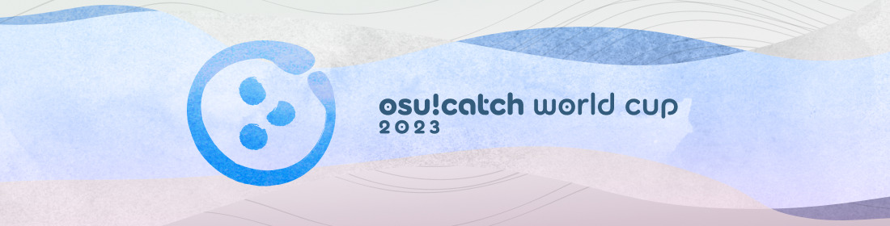
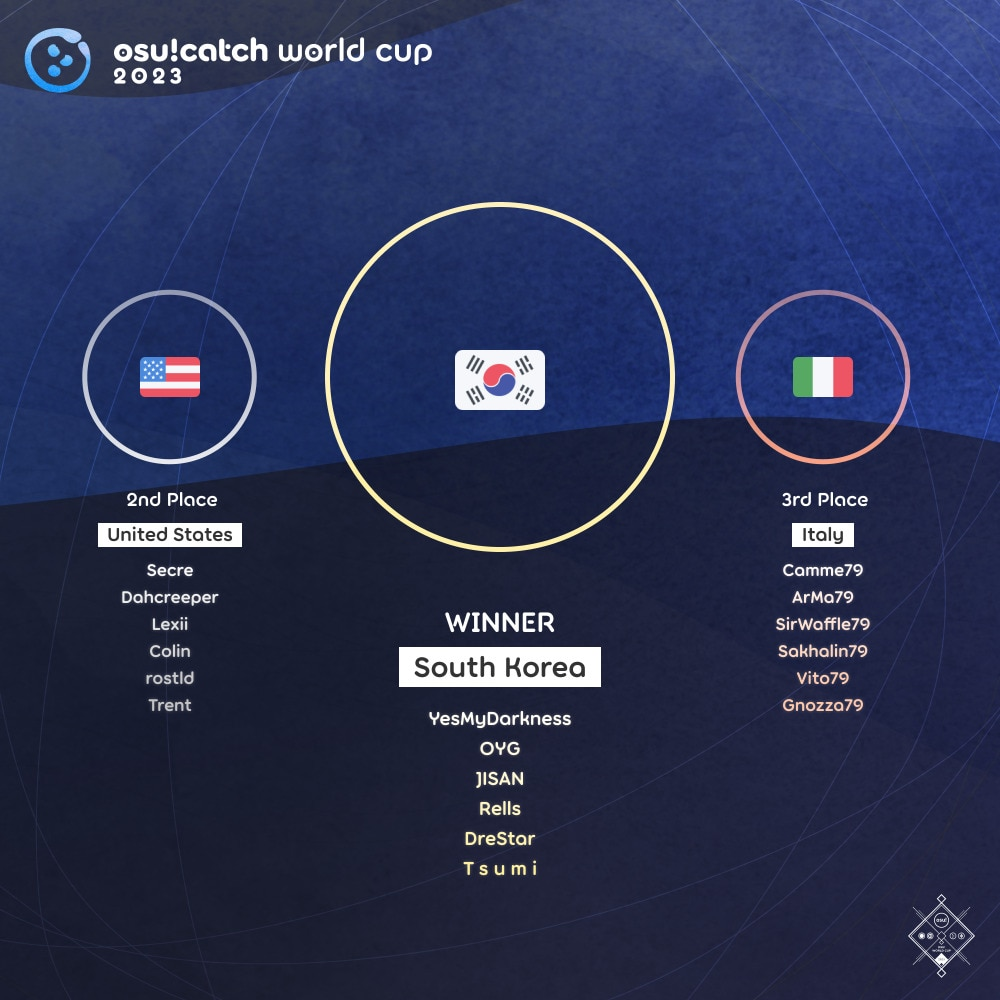

---
tags:
  - CWC
  - CWC2023
  - CWC 2023
---

# osu!catch World Cup 2023

The **osu!catch World Cup 2023** (***CWC 2023***) was a country-based osu!catch tournament hosted by the [osu! team](/wiki/People/osu!_team). It was the twelfth instalment of the osu!catch World Cup.

## Tournament schedule

| Event | Timestamp |
| --: | :-- |
| Registration phase | 2023-04-13/2023-04-26 (23:59 UTC) |
| Qualifier showcase | 2023-05-07 (14:00 UTC) |
| Qualifier stage | 2023-05-13/2023-05-14 |
| Round of 32 | 2023-05-20/2023-05-21 |
| Round of 16 | 2023-05-27/2023-05-28 |
| Quarterfinals | 2023-06-03/2023-06-04 |
| Semifinals | 2023-06-10/2023-06-11 |
| Finals | 2023-06-17/2023-06-18 |
| Grand Finals | 2023-06-24/2023-06-25 |

## Prizes

The osu!catch World Cup 2023 offered a minimum $2,000 cash prize pool and limited-edition merch. The prize pool was further increased to $2,231.22 from [community donations](https://opencollective.com/osu-tournaments/events/osu-catch-world-cup-2023-3aaa5a51).

| Placing | Prizes |
| :-: | :-- |
|  | 50% of the prize pool, single-run merch, profile badge, **osu!catch Champion** user title for one year |
|  | 30% of the prize pool, single-run merch, profile badge |
|  | 20% of the prize pool, single-run merch, profile badge |

  

## Organisation

The osu!catch World Cup 2023 was run by various community members.

| Position | Member(s) |
| :-- | :-- |
| Manager | ::{ flag=CA }:: [Azer](https://osu.ppy.sh/users/2155578), ::{ flag=US }:: [ChillierPear](https://osu.ppy.sh/users/9501251), ::{ flag=BR }:: [LeoFLT](https://osu.ppy.sh/users/3668779) |
| Mappool selector | ::{ flag=HK }:: [autofanboy](https://osu.ppy.sh/users/636114), ::{ flag=CN }:: [F D Flourite](https://osu.ppy.sh/users/2459589), ::{ flag=UA }:: [M0RU](https://osu.ppy.sh/users/13681464), ::{ flag=CA }:: [wwwww](https://osu.ppy.sh/users/8434466), ::{ flag=CA }:: [Yoshi\_green](https://osu.ppy.sh/users/1035891), ::{ flag=TN }:: [\-Ken](https://osu.ppy.sh/users/4430811) |
| Mappool playtester | ::{ flag=CN }:: [F D Flourite](https://osu.ppy.sh/users/2459589), ::{ flag=CN }:: [Coevir](https://osu.ppy.sh/users/3171965), ::{ flag=US }:: [GiGas](https://osu.ppy.sh/users/7300747), ::{ flag=NL }:: [Greaper](https://osu.ppy.sh/users/2369776), ::{ flag=PH }:: [Jemzuu](https://osu.ppy.sh/users/7890134), ::{ flag=PH }:: [JierYagtama](https://osu.ppy.sh/users/7483452), ::{ flag=RU }:: [Kimitakari](https://osu.ppy.sh/users/4741164), ::{ flag=HK }:: [Latifah-sama](https://osu.ppy.sh/users/1226238), ::{ flag=UA }:: [M0RU](https://osu.ppy.sh/users/13681464), ::{ flag=PL }:: [Mniam](https://osu.ppy.sh/users/6050530), ::{ flag=KR }:: [Motion](https://osu.ppy.sh/users/3885626), ::{ flag=FR }:: [Natsuko](https://osu.ppy.sh/users/8266817), ::{ flag=KR }:: [Rocma](https://osu.ppy.sh/users/566276), ::{ flag=PL }:: [Verti](https://osu.ppy.sh/users/10674528), ::{ flag=CA }:: [wwwww](https://osu.ppy.sh/users/8434466), ::{ flag=CA }:: [Yoshi\_green](https://osu.ppy.sh/users/1035891), ::{ flag=CL }:: [ZiRoX](https://osu.ppy.sh/users/200768),  ::{ flag=TN }:: [\-Ken](https://osu.ppy.sh/users/4430811) |
| Mapper | ::{ flag=HK }:: [4rcheR-](https://osu.ppy.sh/users/8846762), ::{ flag=US }:: [Ascendance](https://osu.ppy.sh/users/2931883), ::{ flag=HK }:: [autofanboy](https://osu.ppy.sh/users/636114), ::{ flag=ES }:: [Deif](https://osu.ppy.sh/users/318565), ::{ flag=DE }:: [Du5t](https://osu.ppy.sh/users/6053071), ::{ flag=ID }:: [Dika312](https://osu.ppy.sh/users/741613), ::{ flag=FR }:: [Emiru](https://osu.ppy.sh/users/3306180), ::{ flag=KR }:: [ExGon](https://osu.ppy.sh/users/214187), ::{ flag=CN }:: [F D Flourite](https://osu.ppy.sh/users/2459589),  ::{ flag=US }:: [GiGas](https://osu.ppy.sh/users/7300747), ::{ flag=NL }:: [Greaper](https://osu.ppy.sh/users/2369776), ::{ flag=GB }:: [JBHyperion](https://osu.ppy.sh/users/4879508), ::{ flag=PH }:: [Jemzuu](https://osu.ppy.sh/users/7890134), ::{ flag=PH }:: [JierYagtama](https://osu.ppy.sh/users/7483452), ::{ flag=RU }:: [Kimitakari](https://osu.ppy.sh/users/4741164), ::{ flag=UA }:: [M0RU](https://osu.ppy.sh/users/13681464), ::{ flag=PL }:: [Mniam](https://osu.ppy.sh/users/6050530), ::{ flag=FR }:: [Natsuko](https://osu.ppy.sh/users/8266817), ::{ flag=KR }:: [Rocma](https://osu.ppy.sh/users/566276), ::{ flag=ID }:: [Sololiquy](https://osu.ppy.sh/users/4350087), ::{ flag=PL }:: [Verti](https://osu.ppy.sh/users/10674528), ::{ flag=CA }:: [wwwww](https://osu.ppy.sh/users/8434466), ::{ flag=CA }:: [Yoshi\_green](https://osu.ppy.sh/users/1035891), ::{ flag=CN }:: [Yumeno Himiko](https://osu.ppy.sh/users/1806962), ::{ flag=CL }:: [ZiRoX](https://osu.ppy.sh/users/200768), ::{ flag=ID }:: [Zyzyx](https://osu.ppy.sh/users/2888013), ::{ flag=TN }:: [\-Ken](https://osu.ppy.sh/users/4430811) |
| Commentator | ::{ flag=IS }:: [Ash Ketchum](https://osu.ppy.sh/users/7297777), ::{ flag=US }:: [Dohland](https://osu.ppy.sh/users/5220511), ::{ flag=BE }:: [ElSkeffe](https://osu.ppy.sh/users/6283136), ::{ flag=US }:: [Elux](https://osu.ppy.sh/users/12004983), ::{ flag=AU }:: [ewong](https://osu.ppy.sh/users/16859546), ::{ flag=CA }:: [fuhie](https://osu.ppy.sh/users/7620002), ::{ flag=GB }:: [JBHyperion](https://osu.ppy.sh/users/4879508), ::{ flag=RU }:: [Kimitakari](https://osu.ppy.sh/users/4741164), ::{ flag=AU }:: [KWYJIBO](https://osu.ppy.sh/users/7178386), ::{ flag=US }:: [Lumenite\-](https://osu.ppy.sh/users/6256027), ::{ flag=AU }:: [Maitoo](https://osu.ppy.sh/users/16899553), ::{ flag=FR }:: [Realmas](https://osu.ppy.sh/users/6567640), ::{ flag=NL }:: [Sartan](https://osu.ppy.sh/users/4100941), ::{ flag=US }:: [Secre](https://osu.ppy.sh/users/2306637), ::{ flag=US }:: [Snowleopard](https://osu.ppy.sh/users/3790227), ::{ flag=US }:: [Zak](https://osu.ppy.sh/users/1375955) |
| Referee | ::{ flag=NL }:: [Albionthegreat](https://osu.ppy.sh/users/9853595), ::{ flag=AU }:: [Fairy Bread](https://osu.ppy.sh/users/8306102), ::{ flag=BR }:: [LeoFLT](https://osu.ppy.sh/users/3668779), ::{ flag=NL }:: [nik](https://osu.ppy.sh/users/10077264), ::{ flag=IN }:: [Speshimen](https://osu.ppy.sh/users/7720204), ::{ flag=US }:: [tigereyes144](https://osu.ppy.sh/users/6499811), ::{ flag=GB }:: [Yazzehh](https://osu.ppy.sh/users/7068973), ::{ flag=US }:: [\[K\]](https://osu.ppy.sh/users/16551387) |
| Statistician | ::{ flag=FI }:: [shdewz](https://osu.ppy.sh/users/10000899) |

## Links

- [Information spreadsheet](https://docs.google.com/spreadsheets/d/e/2PACX-1vSBYHOykPfOx6doMljKcQfjyrXmdVjEflIV2hpHJpH1uoDhk7OpE84QHIYG0oO8MytJ4RtrME9qJ_JF/pubhtml)
- [Weekly statistics spreadsheets](https://drive.google.com/drive/folders/1QwtsUUDxfhHoXG5fJb6hrWYiBIMa_LnH)
- [Discussion thread](https://osu.ppy.sh/community/forums/topics/1749802)
- [Livestream](https://www.twitch.tv/osulive)
- [Challonge bracket](https://challonge.com/CWC_2023)
- [Pick'ems page](https://pickem.hwc.hr/tournaments/115) hosted by ::{ flag=DE }:: [hallowatcher](https://osu.ppy.sh/users/1874761)

## Participants

|  | Country | Members |
| :-: | :-: | :-- |
| ::{ flag=AR }:: | **Argentina** | **[Saikai](https://osu.ppy.sh/users/8172283)**, [SirGonzaxz](https://osu.ppy.sh/users/17309439), [GamerYt500](https://osu.ppy.sh/users/19851602), [arxwaa](https://osu.ppy.sh/users/13916330), [wlfgrl](https://osu.ppy.sh/users/24598839), [Ambition-](https://osu.ppy.sh/users/6960376) |
| ::{ flag=AU }:: | **Australia** | **[KWYJIBO](https://osu.ppy.sh/users/7178386)**, [CrimsonPleaseee](https://osu.ppy.sh/users/3743985), [EzGon](https://osu.ppy.sh/users/5092777), [wangwangg](https://osu.ppy.sh/users/6416920), [Geniance](https://osu.ppy.sh/users/4229240), [pandaBear](https://osu.ppy.sh/users/107553) |
| ::{ flag=BE }:: | **Belgium** | **[my cutie](https://osu.ppy.sh/users/10742890)**, [\[ Zhiend \]](https://osu.ppy.sh/users/7474404), [ElSkeffe](https://osu.ppy.sh/users/6283136), [Jezse](https://osu.ppy.sh/users/11390632), [\[ Ajia \]](https://osu.ppy.sh/users/17578266), [Cakenoob](https://osu.ppy.sh/users/6045522) |
| ::{ flag=BR }:: | **Brazil** | **[Hanikawa Kurose](https://osu.ppy.sh/users/4533507)**, [Acooler](https://osu.ppy.sh/users/5235352), [ExNando](https://osu.ppy.sh/users/5960935), [Konohana Lucia](https://osu.ppy.sh/users/8642224), [Predominador](https://osu.ppy.sh/users/4568537), [-Overdose-](https://osu.ppy.sh/users/7749445) |
| ::{ flag=BG }:: | **Bulgaria** | **[iSuck](https://osu.ppy.sh/users/5951283)**, [Dekyoura](https://osu.ppy.sh/users/11156215), [ss033](https://osu.ppy.sh/users/14584167), [Azakriel](https://osu.ppy.sh/users/30653081), [- SkyRain -](https://osu.ppy.sh/users/2122520), [Makou](https://osu.ppy.sh/users/901896) |
| ::{ flag=CA }:: | **Canada** | **[Katsuragi](https://osu.ppy.sh/users/3616480)**, [Ymiir](https://osu.ppy.sh/users/3922569), [Henrick](https://osu.ppy.sh/users/8840982), [fuhie](https://osu.ppy.sh/users/7620002), [Unlucky\_w](https://osu.ppy.sh/users/4820793), [WadBot](https://osu.ppy.sh/users/14571181) |
| ::{ flag=CL }:: | **Chile** | **[Lechu FAQ 35P](https://osu.ppy.sh/users/2872000)**, [Aryssiel](https://osu.ppy.sh/users/2389481), [dont play ctb](https://osu.ppy.sh/users/7143968), [Stark](https://osu.ppy.sh/users/1565036), [eldnl](https://osu.ppy.sh/users/285756), [Pekorrat](https://osu.ppy.sh/users/1250096) |
| ::{ flag=CN }:: | **China** | **[\[Kaffu Chile\]](https://osu.ppy.sh/users/10681880)**, [-Yui](https://osu.ppy.sh/users/6649605), [Shiina Minatsu](https://osu.ppy.sh/users/3515458), [timezzzz](https://osu.ppy.sh/users/23006180), [\[Paw\]FIood](https://osu.ppy.sh/users/6336721), [Eta UMa](https://osu.ppy.sh/users/9740698) |
| ::{ flag=CO }:: | **Colombia** | **[HelpMePleasee](https://osu.ppy.sh/users/10835397)**, [Zyonii](https://osu.ppy.sh/users/9519851), [Juansy-](https://osu.ppy.sh/users/12588215), [Titan-](https://osu.ppy.sh/users/7855767), [Deley-](https://osu.ppy.sh/users/8291465), [Dakary-](https://osu.ppy.sh/users/18076539) |
| ::{ flag=DK }:: | **Denmark** | **[SharpN](https://osu.ppy.sh/users/4382076)**, [Kaare](https://osu.ppy.sh/users/4434640), [Captain](https://osu.ppy.sh/users/2563435), [Waffe latte](https://osu.ppy.sh/users/9699561), [tjukas](https://osu.ppy.sh/users/19132590) |
| ::{ flag=FI }:: | **Finland** | **[Nikolai](https://osu.ppy.sh/users/5302804)**, [Bot\_Burger](https://osu.ppy.sh/users/6109660), [JonZku](https://osu.ppy.sh/users/12740132), [VenenoG](https://osu.ppy.sh/users/12863098) |
| ::{ flag=FR }:: | **France** | **[Kasumi-sama](https://osu.ppy.sh/users/6177263)**, [Sounny](https://osu.ppy.sh/users/7326109), [monstratorfull](https://osu.ppy.sh/users/1872276), [bastoo0](https://osu.ppy.sh/users/4864877), [Kitsuka](https://osu.ppy.sh/users/10334943), [Realmas](https://osu.ppy.sh/users/6567640) |
| ::{ flag=DE }:: | **Germany** | **[NoteKuroi](https://osu.ppy.sh/users/186642)**, [Marvmallow](https://osu.ppy.sh/users/8403032), [Lume](https://osu.ppy.sh/users/4691991), [-Nirfu-](https://osu.ppy.sh/users/7332050), [Inryuka](https://osu.ppy.sh/users/11635773), [Ginoshi](https://osu.ppy.sh/users/5398106) |
| ::{ flag=HK }:: | **Hong Kong** | **[my angel auto](https://osu.ppy.sh/users/29503627)**, [Eu4ria](https://osu.ppy.sh/users/26695963), [fua](https://osu.ppy.sh/users/21138904), [I CAN FC](https://osu.ppy.sh/users/2086828), [littlepiggod](https://osu.ppy.sh/users/12331683), [SakaNaz](https://osu.ppy.sh/users/1784164) |
| ::{ flag=ID }:: | **Indonesia** | **[Chroneko](https://osu.ppy.sh/users/5472877)**, [Netamaru](https://osu.ppy.sh/users/1830361), [Urabe Mikoto](https://osu.ppy.sh/users/1272422), [Galaxi](https://osu.ppy.sh/users/2552435), [EpanPan](https://osu.ppy.sh/users/13194580), [Madoka Ayukawa](https://osu.ppy.sh/users/1595221) |
| ::{ flag=IT }:: | **Italy** | **[Camme79](https://osu.ppy.sh/users/5220794)**, [ArMa79](https://osu.ppy.sh/users/4982799), [SirWaffle79](https://osu.ppy.sh/users/11754842), [Sakhalin79](https://osu.ppy.sh/users/11158870), [Vito79](https://osu.ppy.sh/users/4039895), [Gnozza79](https://osu.ppy.sh/users/6438262) |
| ::{ flag=JP }:: | **Japan** | **[Molqus](https://osu.ppy.sh/users/1927193)**, [-Rindou-](https://osu.ppy.sh/users/7941971), [eisuke0530](https://osu.ppy.sh/users/9814770), [hiroshiki](https://osu.ppy.sh/users/2667256), [Snowwind](https://osu.ppy.sh/users/2163585), [yukinya](https://osu.ppy.sh/users/22136262) |
| ::{ flag=LV }:: | **Latvia** | **[AnApple7](https://osu.ppy.sh/users/12567935)**, [Soruki](https://osu.ppy.sh/users/11762423), [Xeltusha](https://osu.ppy.sh/users/25574167), [oFKors01](https://osu.ppy.sh/users/26522965), [Voxargenteae](https://osu.ppy.sh/users/10774235) |
| ::{ flag=MY }:: | **Malaysia** | **[AstralLoki](https://osu.ppy.sh/users/14100384)**, [Asteristia](https://osu.ppy.sh/users/9434933), [Future\_miku95](https://osu.ppy.sh/users/2351567), [DTNLRiki](https://osu.ppy.sh/users/12382410), [Kagari](https://osu.ppy.sh/users/3366264), [davidbeh\_97](https://osu.ppy.sh/users/4101818) |
| ::{ flag=MX }:: | **Mexico** | **[Firu](https://osu.ppy.sh/users/10516547)**, [Cowboy](https://osu.ppy.sh/users/1237535), [Cxlucha](https://osu.ppy.sh/users/5063961), [colorcaldo](https://osu.ppy.sh/users/10886499), [Muragaki](https://osu.ppy.sh/users/13195815) |
| ::{ flag=NL }:: | **Netherlands** | **[Chatie](https://osu.ppy.sh/users/6524765)**, [Dutchman](https://osu.ppy.sh/users/10552580), [woodpamp](https://osu.ppy.sh/users/3809967), [K 3 V R A L](https://osu.ppy.sh/users/9852829), [Roasted Chicken](https://osu.ppy.sh/users/9461160), [Wesley](https://osu.ppy.sh/users/2407265) |
| ::{ flag=NZ }:: | **New Zealand** | **[Kasumizawa-Miyu](https://osu.ppy.sh/users/24345309)**, [CTB Sakamata1](https://osu.ppy.sh/users/11735313), [Nashiro](https://osu.ppy.sh/users/9740073), [Wettham77](https://osu.ppy.sh/users/14476098), [Starwide](https://osu.ppy.sh/users/9926856), [Cipse](https://osu.ppy.sh/users/7928880) |
| ::{ flag=NO }:: | **Norway** | **[Mile](https://osu.ppy.sh/users/2760954)**, [Cameragod](https://osu.ppy.sh/users/4974088), [CyCeph](https://osu.ppy.sh/users/4586304), [Azeidith](https://osu.ppy.sh/users/2819676), [Benita](https://osu.ppy.sh/users/4023183), [Vanilla-](https://osu.ppy.sh/users/3400701) |
| ::{ flag=PE }:: | **Peru** | **[islux](https://osu.ppy.sh/users/5477873)**, [Lunati1kid](https://osu.ppy.sh/users/25723773), [-Kaeme](https://osu.ppy.sh/users/25029674), [CallingUp](https://osu.ppy.sh/users/18537045) |
| ::{ flag=PH }:: | **Philippines** | **[Roido](https://osu.ppy.sh/users/6829103)**, [Bunnrei](https://osu.ppy.sh/users/829284), [Crowley](https://osu.ppy.sh/users/6341006), [Maririn](https://osu.ppy.sh/users/1626093), [-Rustyy](https://osu.ppy.sh/users/16355636), [- Kielzu -](https://osu.ppy.sh/users/6221114) |
| ::{ flag=PL }:: | **Poland** | **[BoberOfDarkness](https://osu.ppy.sh/users/3427748)**, [-Filow-](https://osu.ppy.sh/users/3157472), [Jakkubon](https://osu.ppy.sh/users/3396013), [Phob](https://osu.ppy.sh/users/6069462), [Skyleia](https://osu.ppy.sh/users/2958293), [trig0n](https://osu.ppy.sh/users/3704228) |
| ::{ flag=RU }:: | **Russian Federation** | **[KitsunIvy](https://osu.ppy.sh/users/7055384)**, [ti gnida](https://osu.ppy.sh/users/14254962), [vafara](https://osu.ppy.sh/users/18917363), [cosilgam](https://osu.ppy.sh/users/15960747), [dark rainbow](https://osu.ppy.sh/users/10557830), [liquid\_boba](https://osu.ppy.sh/users/11694783) |
| ::{ flag=SG }:: | **Singapore** | **[Ekseff](https://osu.ppy.sh/users/13966422)**, [Setsuen](https://osu.ppy.sh/users/2673742), [BINGBANGBONG](https://osu.ppy.sh/users/26637518), [uniqly](https://osu.ppy.sh/users/8876527), [wwPP2020](https://osu.ppy.sh/users/28498328) |
| ::{ flag=KR }:: | **South Korea** | **[YesMyDarknesss](https://osu.ppy.sh/users/4158549)**, [OYG](https://osu.ppy.sh/users/7547506), [JISAN](https://osu.ppy.sh/users/3657951), [Rells](https://osu.ppy.sh/users/7937519), [DreStar](https://osu.ppy.sh/users/1808057), [T s u m i](https://osu.ppy.sh/users/4080520) |
| ::{ flag=ES }:: | **Spain** | **[Patatitta](https://osu.ppy.sh/users/16294034)**, [Sprint-](https://osu.ppy.sh/users/13845399), [Alepe](https://osu.ppy.sh/users/15273403), [Emoadae](https://osu.ppy.sh/users/22598202), [MusicDropZ](https://osu.ppy.sh/users/12759554), [skyres00](https://osu.ppy.sh/users/10158490) |
| ::{ flag=SE }:: | **Sweden** | **[Aceon](https://osu.ppy.sh/users/4452911)**, [DataPata](https://osu.ppy.sh/users/985360), [XiX1XiX1XiX1Xi](https://osu.ppy.sh/users/2205929), [Yukiteru Amano](https://osu.ppy.sh/users/1894511), [EclipZ](https://osu.ppy.sh/users/4586549), [Shameimaru](https://osu.ppy.sh/users/20340480) |
| ::{ flag=CH }:: | **Switzerland** | **[MC2BP](https://osu.ppy.sh/users/11296097)**, [Byjumbur](https://osu.ppy.sh/users/16568987), [xXMysteryXx](https://osu.ppy.sh/users/11475426), [JulivS7](https://osu.ppy.sh/users/26857159), [Aqoz](https://osu.ppy.sh/users/16579719) |
| ::{ flag=TW }:: | **Taiwan** | **[Beepu](https://osu.ppy.sh/users/4958376)**, [DoDoEbi](https://osu.ppy.sh/users/1177233), [ZX123456](https://osu.ppy.sh/users/489271), [Happiness Fish](https://osu.ppy.sh/users/4586766), [Nazrin on osu](https://osu.ppy.sh/users/2512267), [Pdog4ni](https://osu.ppy.sh/users/14581544) |
| ::{ flag=TH }:: | **Thailand** | **[RAISE MY SWORD](https://osu.ppy.sh/users/17385454)**, [EzyS](https://osu.ppy.sh/users/16271283), [N3Marry](https://osu.ppy.sh/users/13222425), [-TANAKITO-](https://osu.ppy.sh/users/6037121), [Char0n](https://osu.ppy.sh/users/17838855), [pattarachai\_12016](https://osu.ppy.sh/users/1465079) |
| ::{ flag=TR }:: | **Turkey** | **[lorem ipsum](https://osu.ppy.sh/users/17130789)**, [Alerr](https://osu.ppy.sh/users/11159192), [shimu](https://osu.ppy.sh/users/14318796), [LightningStorm](https://osu.ppy.sh/users/24658537), [IRyS My Beloved](https://osu.ppy.sh/users/23895020), [gorkem\_xd](https://osu.ppy.sh/users/27415754) |
| ::{ flag=GB }:: | **United Kingdom** | **[Withered Lotus](https://osu.ppy.sh/users/3546931)**, [Matt\_H](https://osu.ppy.sh/users/4067115), [Adisi](https://osu.ppy.sh/users/12182399), [Zoggoth](https://osu.ppy.sh/users/2799946), [Stats-Kun](https://osu.ppy.sh/users/8611935), [Tomato](https://osu.ppy.sh/users/9239206) |
| ::{ flag=US }:: | **United States** | **[Secre](https://osu.ppy.sh/users/2306637)**, [Dahcreeper](https://osu.ppy.sh/users/6926006), [Lexii](https://osu.ppy.sh/users/7226149), [Colin](https://osu.ppy.sh/users/5502521), [rostld](https://osu.ppy.sh/users/4365562), [Trent](https://osu.ppy.sh/users/3438241) |
| ::{ flag=VE }:: | **Venezuela** | **[Pcxdd Pcmia](https://osu.ppy.sh/users/10094025)**, [fabricioxd17](https://osu.ppy.sh/users/31366358), [jxrri](https://osu.ppy.sh/users/12686699), [luis royett](https://osu.ppy.sh/users/11251731) |
| ::{ flag=VN }:: | **Vietnam** | **[Shu](https://osu.ppy.sh/users/4744615)**, [Stardust Prism](https://osu.ppy.sh/users/8525921), [S h i g u r e](https://osu.ppy.sh/users/4372552), [mothernature](https://osu.ppy.sh/users/6403418), [Shiya](https://osu.ppy.sh/users/10378635), [\[ Primakien \]](https://osu.ppy.sh/users/23941998) |

The complete sign-up list can be found [here](https://gist.github.com/LeoFLT/1c2dcba0393cd177d4b9b97cb9ccc60a#file-cwc-2023-player-list-csv).

## Podium

## Mappools

### Grand Finals

**[Download the mappack here (171 MB)](https://drive.google.com/uc?id=1832UPtcqSB2FgiJaVqBAGFobJFL2TOHM)**

- No Mod
  1. [kanemiko - Cold Fusion (Jemzuu) \[Jemzuu vs. Zyzyx's Zenithal Synthesis\]](https://osu.ppy.sh/beatmapsets/2011522#fruits/4185823)
  2. [Juggernaut. - +:OLPHEUX:+ (Extended) (Emiru) \[† APOCALYPSIS †\]](https://osu.ppy.sh/beatmapsets/2011527#fruits/4185843)
  3. [Frums - Mdrqnxtagon (Mniam) \[Malicious Grin Of A Deathful Gaze\]](https://osu.ppy.sh/beatmapsets/2011529#fruits/4185846)
  4. [Mitsukiyo Remixed by Morimori Atsushi - Unwelcome School (MRM REMIX) (IOException) \[Hell Extra!!\]](https://osu.ppy.sh/beatmapsets/1927597#osu/3980676)
- Hidden
  1. [D-D-Dice - World's end loneliness (full ver.) (GiGas) \[Crowning Glory\]](https://osu.ppy.sh/beatmapsets/2011534#fruits/4185860)
  2. [w\_tre - Shannon's Theorem (Dika312) \[no thoughts, head empty\]](https://osu.ppy.sh/beatmapsets/2011536#fruits/4185862)
  3. [katagiri - UTAKATA (Yumeno Himiko) \[EXTRA\]](https://osu.ppy.sh/beatmapsets/2011537#fruits/4185863)
- Hard Rock
  1. [UNDEAD CORPORATION - Flowering Night Fever (Deif) \[Rocma & Deif's Private Vision\]](https://osu.ppy.sh/beatmapsets/2011555#fruits/4185885)
  2. [Novasonic - Another Lie (ExGon) \[CWC 2023 Grand Finals HR2\]](https://osu.ppy.sh/beatmapsets/2011573#fruits/4185916)
  3. [Link"0 feat. usagidenki - Uro no Yorishiro (Zyzyx) \[Imaginary Dreamer\]](https://osu.ppy.sh/beatmapsets/2011493#fruits/4185759)
- Double Time
  1. [Kitadani Hiroshi - OVER THE TOP (Ascendance) \[WILL OF D.\]](https://osu.ppy.sh/beatmapsets/2011549#fruits/4185879)
  2. [Riya - IMPULSE (Du5t) \[Instinct\]](https://osu.ppy.sh/beatmapsets/2011554#fruits/4185884)
  3. [LeaF - Queen Aluett (4rcheR-) \[OverdosE\]](https://osu.ppy.sh/beatmapsets/2011556#fruits/4185887)
  4. [ShinRa-Bansho - Marisa wa Taihen na Mono o Nusunde Ikimashita ShinRa-Bansho Ver (Dika312) \[Extra\]](https://osu.ppy.sh/beatmapsets/2011558#fruits/4185890)
- Mixed Mod
  1. [A-One feat. ayaponzu\* - Justice Monster (F D Flourite) \[KiRin\]](https://osu.ppy.sh/beatmapsets/2011565#fruits/4185898)
  2. [HyuN feat. LyuU - Cross Revolution (Rocma) \[Special\]](https://osu.ppy.sh/beatmapsets/2011559#fruits/4185891)
  3. [technoplanet feat. Haruno - End of Fairytale (autofanboy) \[Reality\]](https://osu.ppy.sh/beatmapsets/2011568#fruits/4185905)
- Tiebreaker
  1. **[Halv vs. kuro - Evreka (Ascendance) \[Chronosync\]](https://osu.ppy.sh/beatmapsets/2011570#fruits/4185911)**

### Finals

**[Download the mappack here (178 MB)](https://drive.google.com/uc?id=1M5tACgrL9Lc9VZv0q0COMysN6NIs6Wbd)**

- No Mod
  1. [Minstrel - Heian Alien (-Ken) \[Mysterious Collab\]](https://osu.ppy.sh/beatmapsets/2007941#fruits/4176765)
  2. [Aoi a.k.a. ALFOU - Fluctuate (2020 Remaster) (Greaper) \[Deluge\]](https://osu.ppy.sh/beatmapsets/2007951#fruits/4176786)
  3. [Ocular & Dictate - Temple (Deif) \[Architek\]](https://osu.ppy.sh/beatmapsets/2007947#fruits/4176778)
  4. [DUSTCELL - STIGMA (rollpan) \[RE:BORN\]](https://osu.ppy.sh/beatmapsets/1075658#osu/2250760)
- Hidden
  1. [Camellia - Compute It With Some Devilish Alcoholic Steampunk Engines (Rocma) \[Alcoholic Turbine (HV)\]](https://osu.ppy.sh/beatmapsets/2007949#fruits/4176784)
  2. [Tanchiky - TouchDown (autofanboy) \[KickOff\]](https://osu.ppy.sh/beatmapsets/2007950#fruits/4176785)
  3. [seatrus - ILLEGAL LEGACY (Deif) \[SAN\]](https://osu.ppy.sh/beatmapsets/2007954#fruits/4176793)
- Hard Rock
  1. [LV.4 - Chemical Diving (Rocma) \[Rocma & Dust's Acid Burst\]](https://osu.ppy.sh/beatmapsets/2026273#fruits/4221920)
  2. [Sobrem x Silentroom - Random (autofanboy) \[Yoshi x AFB's F2\]](https://osu.ppy.sh/beatmapsets/2007958#fruits/4176797)
  3. [LeaF - Ka (Natsuko) \[???????\u005F\u0030\u00D7????????\]](https://osu.ppy.sh/beatmapsets/2007973#fruits/4176821)
- Double Time
  1. [Mitsukiyo feat. Kano - Memories of Kindness (Sololiquy) \[Where All Miracles Begin\]](https://osu.ppy.sh/beatmapsets/1954433#fruits/4176811)
  2. [SoundTeMP - Bonjour Tristesse (ExGon) \[CWC 2023 Finals DT2\]](https://osu.ppy.sh/beatmapsets/2007978#fruits/4176826)
  3. [FujuniseikouyuuP - FREEDMAN (Yoshi\_green) \[SPEEDMAN\]](https://osu.ppy.sh/beatmapsets/2007964#fruits/4176805)
  4. [Monster Siren - MSR / DJ Okawari / Stephanie - Your Star (Yumeno Himiko) \[My Memories\]](https://osu.ppy.sh/beatmapsets/2007966#fruits/4176813)
- Mixed Mod
  1. [Camellia - GHOUL (Du5t) \[Resurgence\]](https://osu.ppy.sh/beatmapsets/2007971#fruits/4176819)
  2. [Susumu Hirasawa - Yume no Shima Shinen Kouen (Cut Ver.) (Mniam) \[Delusion\]](https://osu.ppy.sh/beatmapsets/2007970#fruits/4176818)
  3. [sasakure.UK x TJ.hangneil - World Ender (-Ken) \[Armageddon\]](https://osu.ppy.sh/beatmapsets/2007969#fruits/4176817)
- Tiebreaker
  1. **[xi - World Fragments III (Jemzuu) \[Jemzuu & Dika's Finale of Converging Realms\]](https://osu.ppy.sh/beatmapsets/2007938#fruits/4176760)**

### Semifinals

**[Download the mappack here (139 MB)](https://drive.google.com/uc?id=1aC_xzO1p4zX18LLy-U8NmBAH4Al-mZ-2)**

- No Mod
  1. [Laur feat. Risa Yuzuki - Megaera (Deif) \[Fury Sister\]](https://osu.ppy.sh/beatmapsets/2004073#fruits/4167656)
  2. [Ashrount - Ononokomachi (Jemzuu) \[Ethereal Enigma\]](https://osu.ppy.sh/beatmapsets/2004015#fruits/4167539)
  3. [M2U - PandorA (F D Flourite) \[Emerging DEmoN\]](https://osu.ppy.sh/beatmapsets/2004120#fruits/4167742)
  4. [Marmalade butcher - Amanita (Camo) \[X\]](https://osu.ppy.sh/beatmapsets/1473778#osu/3350946)
- Hidden
  1. [Feryquitous Vo. F9 - Monochrome Anomaly (Zyzyx) \[Zyx & AFB's Hidden Face\]](https://osu.ppy.sh/beatmapsets/2004101#fruits/4167703)
  2. [KAKU P-MODEL - SHAGAN DAISHI (Cut Ver.) (Deif) \[ZiRoX & Deif's Blind Eye\]](https://osu.ppy.sh/beatmapsets/2004087#fruits/4167682)
  3. [MYUKKE. - Anti Safety Zone (GiGas) \[GiGas & Ken's Zone\]](https://osu.ppy.sh/beatmapsets/2004086#fruits/4167678)
- Hard Rock
  1. [Kitamura Eri - Revolution \[re:i\] (Greaper) \[Overdose\]](https://osu.ppy.sh/beatmapsets/2004123#fruits/4167747)
  2. [ZUN - Taketori Hishou \~ Lunatic Princess (Rocma) \[Legacy of Lunatic Kingdom\]](https://osu.ppy.sh/beatmapsets/2004089#fruits/4167690)
  3. [EmoCosine - This Club is Not 4 U (short ver.) (Dika312) \[This Map is Not 4 U\]](https://osu.ppy.sh/beatmapsets/2004100#fruits/4167702)
- Double Time
  1. [SOUND HOLIC feat. YURiCa/Hanatan - VANISHING DREAM (Rocma) \[Endless Dream\]](https://osu.ppy.sh/beatmapsets/2004097#fruits/4167699)
  2. [Silentroom - Protoflicker (Yoshi\_green) \[Primordial Flash\]](https://osu.ppy.sh/beatmapsets/2004082#fruits/4167667)
  3. [Ardolf - Eternally Onward (4rcheR-) \[4FB's Overdose\]](https://osu.ppy.sh/beatmapsets/2004026#fruits/4167560)
  4. [Aethoro - Awakened (ExGon) \[CWC 2023 Semifinals DT4\]](https://osu.ppy.sh/beatmapsets/2004113#fruits/4167722)
- Mixed Mod
  1. [Reol - Gokusaishiki (Yumeno Himiko) \[#FFB2D9\]](https://osu.ppy.sh/beatmapsets/2004111#fruits/4167719)
  2. [lapix - Flamenco House (-Ken) \[Ole\]](https://osu.ppy.sh/beatmapsets/2004108#fruits/4167712)
  3. [0 K - Flux Turbulenti (JBHyperion) \[Disorder\]](https://osu.ppy.sh/beatmapsets/2004105#fruits/4167709)
- Tiebreaker
  1. **[lapix - You're Beautiful (Mniam) \[GG Yummy Tammy's Mesmerizing Collaboration\]](https://osu.ppy.sh/beatmapsets/2004114#fruits/4167727)**

### Quarterfinals

**[Download the mappack here (105 MB)](https://drive.google.com/uc?id=1MMerNLDcwXT4EkVT3L-RMnGbqGkJmi25)**

- No Mod
  1. [Neko Hacker - From Zero feat. Rika (Sololiquy) \[Nol\]](https://osu.ppy.sh/beatmapsets/2000368#fruits/4158946)
  2. [uma vs. Morimori Atsushi - Kibou no Hoshi wa Seishou ni Noboru (uma vs. Morimori Atsushi Remix) (Rocma) \[Pupa\]](https://osu.ppy.sh/beatmapsets/2000358#fruits/4158926)
  3. [Scott Lloyd Shelly - Underground Crimson (ExGon) \[Vertebra\]](https://osu.ppy.sh/beatmapsets/2000395#fruits/4158990)
  4. [Function Phantom - Integral Cube (Alphabet) \[Leibniz\]](https://osu.ppy.sh/beatmapsets/817932#osu/1715114)
- Hidden
  1. [Rigel Theatre - ECLIPSE (F D Flourite) \[I prefer VSCode\]](https://osu.ppy.sh/beatmapsets/2000364#fruits/4158940)
  2. [Akita Masanori - Alice a la mode (Dika312) \[L'heure du the\]](https://osu.ppy.sh/beatmapsets/2000362#fruits/4158938)
  3. [Frums - Jam with Pancake (Du5t) \[Breakfast Overdose\]](https://osu.ppy.sh/beatmapsets/2000391#fruits/4158978)
- Hard Rock
  1. [Sabaton - Twilight Of The Thunder God (Kimitakari) \[Kimitakari & M0RU's Ascension to Valhalla\]](https://osu.ppy.sh/beatmapsets/2000365#fruits/4158941)
  2. [KOAN Sound - Jongmyo (wwwww) \[Royal Ancestry\]](https://osu.ppy.sh/beatmapsets/2000393#fruits/4158987)
  3. [Toromaru - Erinyes (autofanboy) \[Vengeful Spirit\]](https://osu.ppy.sh/beatmapsets/2000438#fruits/4159091)
- Double Time
  1. [RSP - Sakura \~Anata ni Deaete Yokatta\~ (F D Flourite) \[Flouwite's Rain\]](https://osu.ppy.sh/beatmapsets/2000371#fruits/4158949)
  2. [polysha - Has not come yet (Jemzuu) \[Awaiting arrival\]](https://osu.ppy.sh/beatmapsets/2000480#fruits/4159250)
  3. [SEPHID - Critical Cannonball (Extended ver.) (Rocma) \[Lunatic\]](https://osu.ppy.sh/beatmapsets/2000373#fruits/4158953)
- Mixed Mod
  1. [COSIO(ZUNTATA) - FUJIN Rumble (Ascendance) \[MASTER\]](https://osu.ppy.sh/beatmapsets/2000410#fruits/4159019)
  2. [Mitsukiyo - Juu Rokuji no Hitoritabi (Mniam) \[Overdose\]](https://osu.ppy.sh/beatmapsets/2000381#fruits/4158965)
- Tiebreaker
  1. **[Gram vs. Kobaryo - Yggdrasil (Du5t) \[Du5t & Deif's Surge to Asgard\]](https://osu.ppy.sh/beatmapsets/2000386#fruits/4158972)**

### Round of 16

**[Download the mappack here (107 MB)](https://drive.google.com/uc?id=1rlDkVR1e90k9TJiKAy41kxla0o63-zh8)**

- No Mod
  1. [kessoku band - Karakara (Greaper) \[Overdose\]](https://osu.ppy.sh/beatmapsets/1996373#fruits/4149114)
  2. [onoken - felys final remix (Kimitakari) \[overdose (CWC Ver.)\]](https://osu.ppy.sh/beatmapsets/1996365#fruits/4149105)
  3. [Machine Girl - Ghost (Mniam) \[Mniam & Dika's Overdose\]](https://osu.ppy.sh/beatmapsets/1996369#fruits/4149109)
  4. [Origami Angel - Say Less (Rektygon) \[:)\]](https://osu.ppy.sh/beatmapsets/1772140#osu/3628200)
- Hidden
  1. [Flare - Pursuit (Toriningen Beat) (ExGon) \[CWC 2023 RO16 HD1\]](https://osu.ppy.sh/beatmapsets/1996380#fruits/4149130)
  2. [AAAA - parallel skydive (-Ken) \[FOUR DIMENSIONS\]](https://osu.ppy.sh/beatmapsets/1996372#fruits/4149112)
  3. [seatrus - Diossido di Carbonio (Yoshi\_green) \[Vivacissimo\]](https://osu.ppy.sh/beatmapsets/1996376#fruits/4149124)
- Hard Rock
  1. [ABSOLUTE CASTAWAY - Kaleido Parade (Deif) \[Matsuri\]](https://osu.ppy.sh/beatmapsets/1996382#fruits/4149132)
  2. [Boom Kitty & Ubi - Tokyo Takedown (-Ken) \[Invasion\]](https://osu.ppy.sh/beatmapsets/1996384#fruits/4149134)
  3. [Sota Fujimori - polygon (Rocma) \[overdose\]](https://osu.ppy.sh/beatmapsets/1996386#fruits/4149136)
- Double Time
  1. [Cosmicosmo & Slow Shudder - Superheart (autofanboy) \[Pulse\]](https://osu.ppy.sh/beatmapsets/1996486#fruits/4149349)
  2. [Mili - Milk (F D Flourite) \[Birth (CWC Ver.)\]](https://osu.ppy.sh/beatmapsets/1996389#fruits/4149139)
  3. [ARForest - Journey (Ascendance) \[Ascendance & Rocma's Rain\]](https://osu.ppy.sh/beatmapsets/1996539#fruits/4149433)
- Mixed Mod
  1. [Feint - We Won't Be Alone (feat. Laura Brehm) (JBHyperion) \[Together Forever!\]](https://osu.ppy.sh/beatmapsets/1996392#fruits/4149151)
  2. [Monster Siren - MSR / David Westbom - Dossoles Holiday (Yumeno Himiko) \[Rain\]](https://osu.ppy.sh/beatmapsets/1996395#fruits/4149155)
- Tiebreaker
  1. **[CANVAS feat. Quimaer - Carmina (Extended Mix) (Greaper) \[Yoshi & Greaper's Divine Judgement\]](https://osu.ppy.sh/beatmapsets/1996396#fruits/4149159)**

### Round of 32

**[Download the mappack here (94 MB)](https://drive.google.com/uc?id=10nkPTIHDEnaOv8bx8D5CbIJ_MHJ6h32J)**

- No Mod
  1. [nakotanmaru & PIKASONIC - Undersea Train (Sololiquy) \[Sink\]](https://osu.ppy.sh/beatmapsets/1992656#fruits/4140556)
  2. [MYTHOLOGIA by MLREC. - Ymir (Ascendance) \[Black Another\]](https://osu.ppy.sh/beatmapsets/1992652#fruits/4140549)
  3. [ACE+ - You Will Know Our Names (JierYagtama) \[Xenocatch Chronicles\]](https://osu.ppy.sh/beatmapsets/1992787#fruits/4140819)
  4. [kessoku band - Seishun Complex (\_kotachi\_) \[otudou's Extra\]](https://osu.ppy.sh/beatmapsets/1863866#osu/3864073)
- Hidden
  1. [MYUKKE. - OTTAMA GAZER (ZiRoX) \[Otter Looking For The Stars\]](https://osu.ppy.sh/beatmapsets/1992657#fruits/4140557)
  2. [my sound life - 02:15 (M0RU) \[rain (CWC ver.)\]](https://osu.ppy.sh/beatmapsets/1992673#fruits/4140582)
- Hard Rock
  1. [WOLFE - Through With You (wwwww) \[Permaban\]](https://osu.ppy.sh/beatmapsets/1992661#fruits/4140566)
  2. [Mili - Rubber Human (JBHyperion) \[Rain\]](https://osu.ppy.sh/beatmapsets/1992659#fruits/4140563)
- Double Time
  1. [Yellow Zebra - Melody! (Verti) \[real zebras aint yellow its just a skin from battlepass\]](https://osu.ppy.sh/beatmapsets/1992653#fruits/4140551)
  2. [Vospi - Reverence (Ascendance) \[Insane\]](https://osu.ppy.sh/beatmapsets/1992664#fruits/4140569)
  3. [Noisestorm - Barracuda (Mniam) \[Sphyraena\]](https://osu.ppy.sh/beatmapsets/1992666#fruits/4140571)
- Mixed Mod
  1. [Raimukun - Isysmonahy (osu! edit) (autofanboy) \[Rain\]](https://osu.ppy.sh/beatmapsets/1992679#fruits/4140589)
  2. [M2U - Quo Vadis (Yoshi\_green) \[Ad Lucem\]](https://osu.ppy.sh/beatmapsets/1992669#fruits/4140576)
- Tiebreaker
  1. **[BlackY feat. Risa Yuzuki - Gyakkoushite Touhikou (F D Flourite) \[Collab Overdose\]](https://osu.ppy.sh/beatmapsets/1992691#fruits/4140615)**

### Qualifiers

**[Download the mappack here (64 MB)](https://drive.google.com/u/0/uc?id=1fR6WWk_KFGTAMTCFNw2ZIOwB6g565qx1)**

- No Mod
  1. [cordelia - Setsuna <= Imitation (F D Flourite) \[Final Whim\]](https://osu.ppy.sh/beatmapsets/1988677#fruits/4131242)
  2. [USAO - Interstellar Travel (Jemzuu) \[Beyond Yoshi\]](https://osu.ppy.sh/beatmapsets/1988413#fruits/4130724)
  3. [Annabel - wormhole (Lince Cosmico) \[extra\]](https://osu.ppy.sh/beatmapsets/1884175#osu/4027941)
- Hidden
  1. [Denzel Curry - Walkin (Cold Blooded Soul Version) (JierYagtama) \[Cold Blooded Eyez (CWC Version)\]](https://osu.ppy.sh/beatmapsets/1988437#fruits/4130792)
  2. [Aoi vs. siqlo - Hacktivism (autofanboy) \[Denial of Service\]](https://osu.ppy.sh/beatmapsets/1988423#fruits/4130753)
- Hard Rock
  1. [Rohi - Kodoku Egoism (Rocma) \[Overdose\]](https://osu.ppy.sh/beatmapsets/1988421#fruits/4130743)
  2. [Hino Isuka - Mechanical Jager (Du5t) \[Automatic\]](https://osu.ppy.sh/beatmapsets/1988448#fruits/4130828)
- Double Time
  1. [Feint - Laurence (Kimitakari) \[Rain (CWC Ver.)\]](https://osu.ppy.sh/beatmapsets/1988617#fruits/4131124)
  2. [-45 - Rougoku STRIP (Deif) \[Cage\]](https://osu.ppy.sh/beatmapsets/1988438#fruits/4130793)

## Match results

### Grand Finals

Detailed statistics for this round can be found [here](https://docs.google.com/spreadsheets/d/1Rh9jgncktYogyI9dTSELQqXBcldbESpvVFnT5d9JNLA/edit?rm=minimal).

Friday, 23 June 2023:

| Team A |  |  | Team B | Match link | VOD link |  |
| --: | :-: | :-: | :-- | :-- | :-- | :-- |
| **United States** ::{ flag=US }:: | **7** | 4 | ::{ flag=IT }:: Italy | [#1](https://osu.ppy.sh/community/matches/109153239) | [#1](https://www.twitch.tv/videos/1854050976) | [^losers_finals] |

Sunday, 25 June 2023:

| Team A |  |  | Team B | Match link | VOD link |  |
| --: | :-: | :-: | :-- | :-- | :-- | :-- |
| South Korea ::{ flag=KR }:: | 5 | **7** | ::{ flag=US }:: **United States** | [#1](https://osu.ppy.sh/community/matches/109181821) | [#1](https://www.twitch.tv/videos/1855620476) | [^grand_finals] |
| United States ::{ flag=US }:: | 4 | **7** | ::{ flag=KR }:: **South Korea** | [#1](https://osu.ppy.sh/community/matches/109183237) | [#1](https://www.twitch.tv/videos/1855620476?t=1h21m3s) | [^bracket_reset] |

### Finals

Detailed statistics for this round can be found [here](https://docs.google.com/spreadsheets/d/1elex_3q05z9l9123ojlSDp8EZZCn8mF_Ym0xwCz4drw/edit?rm=minimal).

Saturday, 17 June 2023:

| Team A |  |  | Team B | Match link | VOD link |
| --: | :-: | :-: | :-- | :-- | :-- |
| **Italy** ::{ flag=IT }:: | **7** | 1 | ::{ flag=DE }:: Germany | [#1](https://osu.ppy.sh/community/matches/109047743) | [#1](https://www.twitch.tv/videos/1848950241) |
| **Philippines** ::{ flag=PH }:: | **7** | 3 | ::{ flag=PL }:: Poland | [#1](https://osu.ppy.sh/community/matches/109048006) | [#1](https://www.twitch.tv/videos/1848953468) |

Sunday, 18 June 2023:

| Team A |  |  | Team B | Match link | VOD link |
| --: | :-: | :-: | :-- | :-- | :-- |
| **Italy** ::{ flag=IT }:: | **7** | 1 | ::{ flag=PH }:: Philippines | [#1](https://osu.ppy.sh/community/matches/109063750) | [#1](https://www.twitch.tv/videos/1849426391) |
| United States ::{ flag=US }:: | 3 | **7** | ::{ flag=KR }:: **South Korea** | [#1](https://osu.ppy.sh/community/matches/109065918) | [#1](https://www.twitch.tv/videos/1849491766) |

### Semifinals

Detailed statistics for this round can be found [here](https://docs.google.com/spreadsheets/d/1ytiXLhV_vNzUKsPfFO6XUp8Qw48owP5MYhSNYZMjThU/edit?rm=minimal).

Saturday, 10 June 2023:

| Team A |  |  | Team B | Match link | VOD link |
| --: | :-: | :-: | :-- | :-- | :-- |
| **South Korea** ::{ flag=KR }:: | **7** | 2 | ::{ flag=IT }:: Italy | [#1](https://osu.ppy.sh/community/matches/108927476) | [#1](https://www.twitch.tv/videos/1842502502) |
| **Poland** ::{ flag=PL }:: | **7** | 0 | ::{ flag=BE }:: Belgium | [#1](https://osu.ppy.sh/community/matches/108931649) | [#1](https://www.twitch.tv/videos/1842880205) |
| Mexico ::{ flag=MX }:: | 0 | **7** | ::{ flag=TW }:: **Taiwan** | [#1](https://osu.ppy.sh/community/matches/108935742) | [#1](https://www.twitch.tv/videos/1842881800?t=1h29m47s) |
| **Canada** ::{ flag=CA }:: | **7** | 1 | ::{ flag=JP }:: Japan | [#1](https://osu.ppy.sh/community/matches/108935671) | [#1](https://www.twitch.tv/videos/1842924588) |
| Canada ::{ flag=CA }:: | 6 | **7** | ::{ flag=PL }:: **Poland** | [#1](https://osu.ppy.sh/community/matches/108937260) | [#1](https://www.twitch.tv/videos/1842925253) |
| Chile ::{ flag=CL }:: | 5 | **7** | ::{ flag=DE }:: **Germany** | [#1](https://osu.ppy.sh/community/matches/108937915) | [#1](https://www.twitch.tv/videos/1842931327) |

Sunday, 11 June 2023:

| Team A |  |  | Team B | Match link | VOD link |
| --: | :-: | :-: | :-- | :-- | :-- |
| **Germany** ::{ flag=DE }:: | **7** | 1 | ::{ flag=TW }:: Taiwan | [#1](https://osu.ppy.sh/community/matches/108951467) | [#1](https://www.twitch.tv/videos/1843627827) |
| **United States** ::{ flag=US }:: | **7** | 1 | ::{ flag=PH }:: Philippines | [#1](https://osu.ppy.sh/community/matches/108953604) | [#1](https://www.twitch.tv/videos/1843641489) |

### Quarterfinals

Detailed statistics for this round can be found [here](https://docs.google.com/spreadsheets/d/164mgjwVFm833GZMniT9SZBe7mkjNBjO1fDuHMhnDCdA/edit?rm=minimal).

Saturday, 3 June 2023:

| Team A |  |  | Team B | Match link | VOD link |
| --: | :-: | :-: | :-- | :-- | :-- |
| **Taiwan** ::{ flag=TW }:: | **6** | 0 | ::{ flag=SE }:: Sweden | [#1](https://osu.ppy.sh/community/matches/108815303) | [#1](https://www.twitch.tv/videos/1837068240) |
| **Germany** ::{ flag=DE }:: | **6** | 2 | ::{ flag=FR }:: France | [#1](https://osu.ppy.sh/community/matches/108815304) | [#1](https://www.twitch.tv/videos/1837056738) |
| **Finland** ::{ flag=FI }:: | **6** | 2 | ::{ flag=VN }:: Vietnam | [#1](https://osu.ppy.sh/community/matches/108817349) | [#1](https://www.twitch.tv/videos/1837065046) |
| Russian Federation ::{ flag=RU }:: | 4 | **6** | ::{ flag=JP }:: **Japan** | [#1](https://osu.ppy.sh/community/matches/108817409) | [#1](https://www.twitch.tv/videos/1837058695) |
| **Norway** ::{ flag=NO }:: | **6** | 1 | ::{ flag=DK }:: Denmark | [#1](https://osu.ppy.sh/community/matches/108817942) | [#1](https://www.twitch.tv/videos/1837065046?t=0h54m13s) |
| Argentina ::{ flag=AR }:: | 2 | **6** | ::{ flag=ID }:: **Indonesia** | [#1](https://osu.ppy.sh/community/matches/108818399) | [#1](https://www.twitch.tv/videos/1837065046?t=1h8m26s) |
| **Australia** ::{ flag=AU }:: | **6** | 0 | ::{ flag=GB }:: United Kingdom | [#1](https://osu.ppy.sh/community/matches/108819668) | [#1](https://www.twitch.tv/videos/1837065046?t=1h59m33s) |
| **Taiwan** ::{ flag=TW }:: | **6** | 2 | ::{ flag=NO }:: Norway | [#1](https://osu.ppy.sh/community/matches/108819736) | [#1](https://www.twitch.tv/videos/1837065046?t=2h37m41s) |
| Canada ::{ flag=CA }:: | 4 | **6** | ::{ flag=IT }:: **Italy** | [#1](https://osu.ppy.sh/community/matches/108819608) | [#1](https://www.twitch.tv/videos/1837060399) |
| Netherlands ::{ flag=NL }:: | 1 | **6** | ::{ flag=BE }:: **Belgium** | [#1](https://osu.ppy.sh/community/matches/108821796) | [#1](https://www.twitch.tv/videos/1837062552) |

Sunday, 4 June 2023:

| Team A |  |  | Team B | Match link | VOD link |
| --: | :-: | :-: | :-- | :-- | :-- |
| **United States** ::{ flag=US }:: | **6** | 0 | ::{ flag=MX }:: Mexico | [#1](https://osu.ppy.sh/community/matches/108828525) | [#1](https://www.twitch.tv/videos/1837254530) |
| **Japan** ::{ flag=JP }:: | **6** | 1 | ::{ flag=AU }:: Australia | [#1](https://osu.ppy.sh/community/matches/108833858) | [#1](https://www.twitch.tv/videos/1837510090) |
| **South Korea** ::{ flag=KR }:: | **6** | 0 | ::{ flag=PL }:: Poland | [#1](https://osu.ppy.sh/community/matches/108834600) | [#1](https://www.twitch.tv/videos/1837510090?t=0h49m36s) |
| **Germany** ::{ flag=DE }:: | **6** | 4 | ::{ flag=ID }:: Indonesia | [#1](https://osu.ppy.sh/community/matches/108836712) | [#1](https://www.twitch.tv/videos/1837823465) |
| Chile ::{ flag=CL }:: | 2 | **6** | ::{ flag=PH }:: **Philippines** | [#1](https://osu.ppy.sh/community/matches/108837687) | [#1](https://www.twitch.tv/videos/1837823465?t=0h57m19s) |
| **Belgium** ::{ flag=BE }:: | **6** | 4 | ::{ flag=FI }:: Finland | [#1](https://osu.ppy.sh/community/matches/108839782) | [#1](https://www.twitch.tv/videos/1837824429) |

### Round of 16

Detailed statistics for this round can be found [here](https://docs.google.com/spreadsheets/d/1zhU92LiUUCFXqR-DvwrVupf3draiHgzM24th2BUoszQ/edit?rm=minimal).

Saturday, 27 May 2023:

| Team A |  |  | Team B | Match link | VOD link |
| --: | :-: | :-: | :-- | :-- | :-- |
| New Zealand ::{ flag=NZ }:: | 0 | **6** | ::{ flag=FR }:: **France** | [#1](https://osu.ppy.sh/community/matches/108693176) | [#1](https://www.twitch.tv/videos/1830792607) |
| Hong Kong ::{ flag=HK }:: | 0 | **6** | ::{ flag=ID }:: **Indonesia** | [#1](https://osu.ppy.sh/community/matches/108693215) | [#1](https://www.twitch.tv/videos/1830795373) |
| **South Korea** ::{ flag=KR }:: | **6** | 1 | ::{ flag=NO }:: Norway | [#1](https://osu.ppy.sh/community/matches/108693866) | [#1](https://www.twitch.tv/videos/1830795373?t=0h45m40s) |
| China ::{ flag=CN }:: | 2 | **6** | ::{ flag=SE }:: **Sweden** | [#1](https://osu.ppy.sh/community/matches/108695670) | [#1](https://www.twitch.tv/videos/1830796286) |
| Spain ::{ flag=ES }:: | 1 | **6** | ::{ flag=VN }:: **Vietnam** | [#1](https://osu.ppy.sh/community/matches/108697882) | [#1](https://www.twitch.tv/videos/1830797277) |
| **Canada** ::{ flag=CA }:: | **6** | 0 | ::{ flag=AR }:: Argentina | [#1](https://osu.ppy.sh/community/matches/108701437) | [#1](https://www.twitch.tv/videos/1831594529?t=1h0m48s) |
| **Mexico** ::{ flag=MX }:: | **6** | 1 | ::{ flag=NL }:: Netherlands | [#1](https://osu.ppy.sh/community/matches/108704639) | [#1](https://www.twitch.tv/videos/1831624684) |

Sunday, 28 May 2023:

| Team A |  |  | Team B | Match link | VOD link |
| --: | :-: | :-: | :-- | :-- | :-- |
| **Chile** ::{ flag=CL }:: | **6** | 1 | ::{ flag=AU }:: Australia | [#1](https://osu.ppy.sh/community/matches/108707279) | [#1](https://www.twitch.tv/videos/1831625463) |
| Thailand ::{ flag=TH }:: | 1 | **6** | ::{ flag=JP }:: **Japan** | [#1](https://osu.ppy.sh/community/matches/108714928) | [#1](https://www.twitch.tv/videos/1831495461) |
| **Poland** ::{ flag=PL }:: | **6** | 2 | ::{ flag=TW }:: Taiwan | [#1](https://osu.ppy.sh/community/matches/108714955) | [#1](https://www.twitch.tv/videos/1831632223) |
| **Italy** ::{ flag=IT }:: | **6** | 2 | ::{ flag=DE }:: Germany | [#1](https://osu.ppy.sh/community/matches/108715852) | [#1](https://www.twitch.tv/videos/1831632223?t=1h3m30s) |
| **Philippines** ::{ flag=PH }:: | **6** | 0 | ::{ flag=RU }:: Russian Federation | [#1](https://osu.ppy.sh/community/matches/108717074) | [#1](https://www.twitch.tv/videos/1831632223?t=1h50m50s) |
| **United States** ::{ flag=US }:: | **6** | 3 | ::{ flag=FI }:: Finland | [#1](https://osu.ppy.sh/community/matches/108718043) | [#1](https://www.twitch.tv/videos/1831632223?t=2h35m17s) |
| **Denmark** ::{ flag=DK }:: | **6** | 5 | ::{ flag=CO }:: Colombia | [#1](https://osu.ppy.sh/community/matches/108721268) | [#1](https://www.twitch.tv/videos/1831884203) |
| Brazil ::{ flag=BR }:: | 5 | **6** | ::{ flag=GB }:: **United Kingdom** | [#1](https://osu.ppy.sh/community/matches/108722359) | [#1](https://www.twitch.tv/videos/1831884203?t=01h10m10s) |
| Peru ::{ flag=PE }:: | 0 | **6** | ::{ flag=BE }:: **Belgium** | [#1](https://osu.ppy.sh/community/matches/108722358) | [#1](https://www.twitch.tv/videos/1831769663) |

### Round of 32

Detailed statistics for this round can be found [here](https://docs.google.com/spreadsheets/d/1MEmjmz3cXaFWm6-MpAiOVBBr3b8iOlKL1WsEJEUA5vI/edit?rm=minimal).

Saturday, 20 May 2023:

| Team A |  |  | Team B | Match link | VOD link |
| --: | :-: | :-: | :-- | :-- | :-- |
| **Mexico** ::{ flag=MX }:: | **5** | 0 | ::{ flag=HK }:: Hong Kong | [#1](https://osu.ppy.sh/community/matches/108574037) | [#1](https://www.twitch.tv/videos/1824774924) |
| **South Korea** ::{ flag=KR }:: | **5** | 0 | ::{ flag=TH }:: Thailand | [#1](https://osu.ppy.sh/community/matches/108576372) | [#1](https://www.twitch.tv/videos/1824779038) |
| Japan ::{ flag=JP }:: | 3 | **5** | ::{ flag=NO }:: **Norway** | [#1](https://osu.ppy.sh/community/matches/108578422) | [#1](https://www.twitch.tv/videos/1824781546?t=0h59m52s) |
| **Taiwan** ::{ flag=TW }:: | **5** | 2 | ::{ flag=GB }:: United Kingdom | [#1](https://osu.ppy.sh/community/matches/108579304) | [#1](https://www.twitch.tv/videos/1824781546?t=1h59m49s) |
| **Chile** ::{ flag=CL }:: | **5** | 1 | ::{ flag=CN }:: China | [#1](https://osu.ppy.sh/community/matches/108580390) | [#1](https://www.twitch.tv/videos/1824781546?t=2h59m49s) |
| **Finland** ::{ flag=FI }:: | **5** | 2 | ::{ flag=FR }:: France | [#1](https://osu.ppy.sh/community/matches/108581597) | [#1](https://www.twitch.tv/videos/1824919347) |
| **Poland** ::{ flag=PL }:: | **5** | 3 | ::{ flag=BR }:: Brazil | [#1](https://osu.ppy.sh/community/matches/108584138) | [#1](https://www.twitch.tv/videos/1824920466) |

Sunday, 21 May 2023:

| Team A |  |  | Team B | Match link | VOD link |
| --: | :-: | :-: | :-- | :-- | :-- |
| **Canada** ::{ flag=CA }:: | **5** | 1 | ::{ flag=PE }:: Peru | [#1](https://osu.ppy.sh/community/matches/108591880) | [#1](https://www.twitch.tv/videos/1825546960) |
| **United States** ::{ flag=US }:: | **5** | 0 | ::{ flag=NZ }:: New Zealand | [#1](https://osu.ppy.sh/community/matches/108592468) | [#1](https://www.twitch.tv/videos/1825546960?t=0h59m34s) |
| **Philippines** ::{ flag=PH }:: | **5** | 2 | ::{ flag=DK }:: Denmark | [#1](https://osu.ppy.sh/community/matches/108597976) | [#1](https://www.twitch.tv/videos/1825968036) |
| **Australia** ::{ flag=AU }:: | **5** | 1 | ::{ flag=SE }:: Sweden | [#1](https://osu.ppy.sh/community/matches/108598712) | [#1](https://www.twitch.tv/videos/1825968036?t=0h50m23s) |
| Indonesia ::{ flag=ID }:: | 3 | **5** | ::{ flag=NL }:: **Netherlands** | [#1](https://osu.ppy.sh/community/matches/108599608) | [#1](https://www.twitch.tv/videos/1825968036?t=1h30m6s) |
| **Germany** ::{ flag=DE }:: | **5** | 0 | ::{ flag=VN }:: Vietnam | [#1](https://osu.ppy.sh/community/matches/108599650) | [#1](https://www.twitch.tv/videos/1825631630) |
| **Italy** ::{ flag=IT }:: | **5** | 1 | ::{ flag=ES }:: Spain | [#1](https://osu.ppy.sh/community/matches/108600660) | [#1](https://www.twitch.tv/videos/1825968036?t=2h30m2s) |
| Belgium ::{ flag=BE }:: | -1 | **0** | ::{ flag=AR }:: **Argentina** | *win by default* |  |
| **Russian Federation** ::{ flag=RU }:: | **5** | 0 | ::{ flag=CO }:: Colombia | [#1](https://osu.ppy.sh/community/matches/108604688) | [#1](https://www.twitch.tv/videos/1825970366) |

### Qualifiers

The final standings for the Qualifier stage can be found in the following [spreadsheet](https://docs.google.com/spreadsheets/d/1tS1PXP8o5BjPif_rcLcKBgos3QElvClEK3Z9_oBFoV0/edit?rm=minimal).

| Seed | Country | %MAX sum[^qualifiers-seeding] | avg. score[^qualifiers-tiebreaker] |
| :-: | :-- | :-- | :-- |
| #1 | ::{ flag=US }:: United States | 8.9341 | 2,939,318 |
| #2 | ::{ flag=KR }:: South Korea | 8.8544 | 2,913,168 |
| #3 | ::{ flag=CA }:: Canada | 8.8177 | 2,900,658 |
| #4 | ::{ flag=CL }:: Chile | 8.6883 | 2,858,252 |
| #5 | ::{ flag=PH }:: Philippines | 8.6645 | 2,850,017 |
| #6 | ::{ flag=IT }:: Italy | 8.6621 | 2,850,434 |
| #7 | ::{ flag=PL }:: Poland | 8.612 | 2,833,099 |
| #8 | ::{ flag=MX }:: Mexico | 8.4804 | 2,790,362 |
| #9 | ::{ flag=ID }:: Indonesia | 8.4704 | 2,786,752 |
| #10 | ::{ flag=TW }:: Taiwan | 8.4698 | 2,786,848 |
| #11 | ::{ flag=DE }:: Germany | 8.4592 | 2,784,271 |
| #12 | ::{ flag=RU }:: Russian Federation | 8.4491 | 2,779,605 |
| #13 | ::{ flag=AU }:: Australia | 8.3486 | 2,747,262 |
| #14 | ::{ flag=BE }:: Belgium | 8.1445 | 2,680,713 |
| #15 | ::{ flag=JP }:: Japan | 8.1301 | 2,675,826 |
| #16 | ::{ flag=FI }:: Finland | 8.0469 | 2,647,460 |
| #17 | ::{ flag=FR }:: France | 8.0407 | 2,646,263 |
| #18 | ::{ flag=NO }:: Norway | 8.0057 | 2,634,597 |
| #19 | ::{ flag=AR }:: Argentina | 7.6791 | 2,527,091 |
| #20 | ::{ flag=SE }:: Sweden | 7.6159 | 2,506,407 |
| #21 | ::{ flag=CO }:: Colombia | 7.6131 | 2,507,986 |
| #22 | ::{ flag=VN }:: Vietnam | 7.5498 | 2,486,495 |
| #23 | ::{ flag=GB }:: United Kingdom | 7.484 | 2,462,681 |
| #24 | ::{ flag=NL }:: Netherlands | 7.4704 | 2,459,272 |
| #25 | ::{ flag=HK }:: Hong Kong | 7.4563 | 2,454,403 |
| #26 | ::{ flag=BR }:: Brazil | 7.4347 | 2,447,229 |
| #27 | ::{ flag=ES }:: Spain | 7.177 | 2,362,428 |
| #28 | ::{ flag=DK }:: Denmark | 7.1731 | 2,362,231 |
| #29 | ::{ flag=CN }:: China | 7.1514 | 2,354,961 |
| #30 | ::{ flag=PE }:: Peru | 7.1114 | 2,340,726 |
| #31 | ::{ flag=TH }:: Thailand | 6.9226 | 2,277,755 |
| #32 | ::{ flag=NZ }:: New Zealand | 6.4413 | 2,119,004 |
| #33 | ::{ flag=MY }:: Malaysia | 6.4065 | 2,105,677 |
| #34 | ::{ flag=TR }:: Turkey | 5.9936 | 1,974,571 |
| #35 | ::{ flag=LV }:: Latvia | 5.9434 | 1,954,654 |
| #36 | ::{ flag=SG }:: Singapore | 5.8238 | 1,917,287 |
| #37 | ::{ flag=BG }:: Bulgaria | 4.6483 | 1,528,447 |
| #38 | ::{ flag=CH }:: Switzerland | 4.2334 | 1,393,838 |
| #39 | ::{ flag=VE }:: Venezuela | *DNP* | *DNP* |

## Ruleset

### Tournament rules

1. The osu!catch World Cup is a country-based 3 versus 3 double-elimination team tournament, played on the osu!catch game mode.
   - Players from countries or territories (as seen on their profile flag) that are under a protectorate or sovereign state may choose to play for that country **if** the country listed on their profile is unable to field enough players to form a valid team. Refer to [this article](https://wikipedia.org/wiki/Dependent_territory#Lists_of_dependent_territories) for an overview of the criteria that is adopted.
   - *Notice: While this competition is slated to have a double-elimination Round of 32 bracket, it may be scaled down to a Round of 16 format if the player pool is insufficient.*
2. Beatmap scoring is based on ScoreV2.
3. The minimum size for a team is 4 players, and the maximum is 6.
4. The beatmap list for each round will be announced by the mappool selectors on the official stream, on the Sunday before the matches take place.
5. The match schedules for each round will be announced by the tournament managers on this page, as well as the information sheet, on the Sunday before the matches take place.
6. Use of the Visual Settings to alter background dim or disable beatmap elements like storyboards and skins are allowed.
   - Custom skin elements must not be used to alter core gameplay elements or mechanics in unintended ways.
7. If less than the minimum amount of required players are present at match time, the match can be postponed for up to 10 minutes. If after this period there are still not enough players for either team, a *win by default* will be declared for the side with the most members present.
   - The minimum amount of required players is the amount of players needed to play a beatmap without any vacant spots in the lobby (i.e. at least 3 participants from each team must be present for the match to begin).
8. Exchanging players between games is allowed without limitations.
9. If a game ends in a draw, it will be nullified and the beatmap will be replayed.
10. Teams may ask for a rematch if a team member encounters technical issues while playing within 30 seconds or 25% of the beatmap drain length (whichever happens first) of the game's start. Referees may, at their discretion, veto this request.
    - "Lag spikes" are not considered a valid reason to rematch a beatmap.
    - The roster for each team during a rematch must remain the same as the original run. If that is not possible, e.g. by virtue of a technical issue that prevents a player from entering the lobby, both teams will be allowed to swap rosters.
    - This rule is not to be abused. Referees may veto a rematch request if they find that this is the case.
11. If a player disconnects mid-game, their scores will not be counted towards their team's total, unless adequate proof of said score is provided. The following are considered as acceptable proof:
    - Player point-of-view live stream snippets (commonly referred to as "clips" or "VODs"). The entirety of the play, along with the results screen must be clearly visible along with the affected player's score.
    - Replay files of the play, taken directly from the "Local scores" tab on the affected player's client (the timestamps must exactly match the time at which the game took place, as seen on the multiplayer lobby link).
    - Screenshots from other players taken directly in-game that show the affected player's score.
      - Screenshots from the results screen must clearly show the affected player's score. This is the preferred method.
      - Screenshots taken in-game at the time of disconnection may be accepted. Note that this method does not provide a one-to-one representation of that player's score. Using this method is not encouraged and it may be denied at the referee's discretion if the information provided is not sufficient to identify the player/score.
      - All screenshots **MUST** be taken using the game itself (using `Shift` + `F12`), that is, they must be hosted on the `https://osu.ppy.sh/` domain. Any other form of screenshot will be denied.
    - Player scores may be derived from the official stream as a last resort, in cases where the match is streamed.
12. Players are expected to keep the match running fluently and without delays. Excessive match delays from the players' side may result in penalties being applied by the tournament managers. Disrupting the match by foul play, insulting or provoking other players or staff, delaying the match, or other deliberate inappropriate misbehaviour are strictly prohibited, and will be punished accordingly.
13. All players and staff must be treated with respect. Instructions from the referees and the tournament managers are to be followed. Decisions labelled as final are not to be objected.
14. The multiplayer chatrooms underlie the [osu! community rules](/wiki/Rules). All chat rules apply to the multiplayer chatrooms where the matches will take place.
    - Breaking the chat rules may result in a silence. Silenced players cannot participate in multiplayer matches and must be exchanged for the duration of the punishment.
15. Penalties for violating the tournament rules include, but are not limited to:
    - Exclusion of specific players for one beatmap.
    - Exclusion of specific players for an entire match.
    - Declaring the match as forfeited, or as a win by default for the other team.
    - Disqualification from the entire tournament.
    - Disqualification from the current and future official tournaments, until appealed.
16. Referees may allow, at their discretion, lower or higher tolerances for timers.
17. The tournament managers may request liveplays or recordings of individual players or teams at any point in the tournament without prior warning.
18. The tournament managers reserve the right to modify these rules at any moment. Any such changes will be announced in advance.

### Tournament registration

1. Every user interested in joining their country's team signs up individually.
   - The tournament managers will create a list of potential candidates for a country's team.
   - The tournament managers will declare one candidate captain of their country's team.
   - The provisional captain will receive a private message on the osu! website containing further instructions, via the announcement feature, titled "osu!catch World Cup 2023 - Team {Country Name}".
2. The provisional captain will then form their team by selecting players from the candidate pool for their country.
   - Captains are expected to choose team members with honesty and good will, with the aim of fielding the strongest team possible.
   - Captains are allowed to exclude themselves from the team list.
   - Captains are allowed to conduct and coordinate "tryouts", tests to gauge player aptitude, on their own terms.
   - Captains are allowed, at any time, to transfer their role to other prospective team members. Once given, only the new captain may assign the captaincy to another player.
   - **Teams that do not not send their team list by May 4, 2023 (23:59 UTC) will be disqualified from the competition.**
3. To ensure valid registrations, every prospective participant will be manually checked by the [account support team](/wiki/People/Account_support_team), in a manner similar to the [tournament screening](/wiki/Tournaments/Official_support#tournament-screening) that is offered to community tournaments.
   - Every registered user will be assigned to their respective country's candidate list.
   - To be successfully accepted on the list, players are required to be placed #5000 or higher on the osu!catch global ranking, and not have violated the [osu! community rules](/wiki/Rules) within the last 12 months.
4. All successfully formed teams will be published after the registration phase on this page.
   - A team should have at least 4 players registered to have the chance to play the Qualifier stage.
5. Tournament staff members are **not** allowed to play in the tournament, with the exception of commentators and streamers.

### Qualifier instructions

1. In the Qualifier stage, all teams will play a specific pool designed by the mappool selectors.
2. The mappool will contain 4 brackets: [NoMod](/wiki/Gameplay/Game_modifier#no-mod), [Hidden](/wiki/Gameplay/Game_modifier/Hidden), [Hard Rock](/wiki/Gameplay/Game_modifier/Hard_Rock), and [Double Time](/wiki/Gameplay/Game_modifier/Double_Time). There will be no tiebreakers for this stage.
3. The Qualifier pool will consist of 9 maps. There will be 3 maps under the No Mod bracket, and 2 maps for the Hidden, Hard Rock, and Double Time brackets.
4. Teams will be asked to play the mappool twice at a designated time. The team's best playthrough will be used for seeding.
5. The mappool is to be played according to the order listed on this page.
   - Teams may skip playing any beatmap on their second run.
6. Each team must have 3 members play each map. They may be exchanged freely after a map is concluded.
7. An optional 3-minute break will be offered between the first and second playthrough of the mappool.
8. All teams will play their qualifiers in separate rooms. It is *suggested* that teams do not broadcast or share their results publicly to avoid seed manipulation.
   - Teams may be grouped into a singular room if there are not enough referees available at match time.
9. The seeding method used for Qualifiers will be %MAX — the highest combined team score for each map will receive 100% of the points (i.e. a numerical value of 1), and every other team will be awarded a percentage of that top score. The individual map percentages will be added together to compose that team's final score, which is then sorted from highest to lowest, highest being seed #1.
   - The exact formula that will be used for all teams (and for each map) is `Map percentage = Team score / MAX score`, where:
     - `Map percentage` is the percentage awarded to the current team
     - `Team score` is the score the current team achieved on the current map
     - `MAX score` is the highest score achieved for the current map
   - The final team score to be sorted is defined as `Final score = SUM(Map percentage)`, i.e. the sum of each map's `Map percentage`.
10. Only the top 32 seeded teams will advance to the Round of 32.

### Stage instructions

1. Following the Qualifiers, a double-elimination bracket will be played — for teams in the winners bracket, the winning team continues in the same bracket, while the losing team gets moved to the losers bracket, where any further defeats will eliminate the team from the competition.
2. Teams in the losers bracket must play up to 2 matches each weekend, starting from the Quarterfinals.

### Win conditions

- In the Qualifiers, teams need to place in the top 32 seeded teams in order to advance to the double-elimination stage.
- In the Round of 32, teams need to win 5 maps to win a match (best of 9).
- In the Round of 16 and Quarterfinals, teams need to win 6 maps to win a match (best of 11).
- In the Semifinals, Finals and Grand Finals, teams need to win 7 maps to win the match (best of 13).
  - *Note: for the Grand Finals match, the team that is coming from the winners bracket is required to win one "set", that is, one best of 13, to win the tournament. The team coming from the losers bracket, however, needs to win 2 sets.*

### Match instructions

1. A referee will create a multiplayer room 10 minutes before the scheduled match time. Teams must join the lobby in that period.
   - The room settings are `Game mode: "osu!catch"`, `Team mode: "Team Vs"` and `Score mode: "ScoreV2"`. The room name must follow the pattern of `CWC2023: ({Red Team}) VS ({Blue Team})`. The team mentioned first in the room name must be the red team, the team mentioned second in the room name must be the blue team.
2. Each team may ban **one beatmap** to be selected from the pool. These beatmaps can not be picked by any team for the entire duration of the match.
3. Each captain must use `!roll` once in the match's chatroom.
   - The winner of the `!roll` may choose to either pick first and ban second, or pick second and ban first.
   - The loser of the `!roll` will follow the remaining pick order.
4. After bans are decided, both teams will take turns in picking a beatmap from the mappool.
5. Teams will be allowed 2 minutes to pick a beatmap and 2 minutes to press the `Ready` button on their client. If a team takes more time than allotted for either action, the procedures adopted will be as follows:
   - For the first occurrence:
     - The team will receive a verbal warning from the referee; in addition, the referee may opt to forcefully use the team's tactical timeout to allow for the team to pick.
   - On subsequent occurrences:
     - For a pick timer: a random map will be chosen from the mappool using `!roll X`, where X is the number of beatmaps that were neither picked nor banned, excluding the tiebreaker.
     - For a ready timer: the referee will issue the `!mp start 10` command, regardless of how many players from each team are present in the lobby, using `!mp kick` on any extra players for each team, starting from the top (i.e. the first valid player combination for each team will be forced to play the pick). The results for such games are to be taken as is.
     - Repeat offenders may receive further sanctions from the tournament managers.
6. In the case of a team starting a map with less than the optimal number of players on their roster due to an unforeseen circumstance (e.g. a technical issue or unavoidable player absence), the team in question will be granted the right to fill their roster before play commences. The remainder of the original roster must stay the same, i.e. only player additions are allowed.
7. Each team will receive one "tactical timeout" of 2 minutes, to be used as extra time to pick, ban, or ready for a beatmap. *The tactical timeout is optional.*
   - The tactical timeout may be called on a tiebreaker, provided that both teams' captains agree to it.

### Mappool instructions

1. Every stage will have its own mappool.
2. Each mappool consists of 5 brackets: [NoMod](/wiki/Gameplay/Game_modifier#no-mod), [Hidden](/wiki/Gameplay/Game_modifier/Hidden), [Hard Rock](/wiki/Gameplay/Game_modifier/Hard_Rock), [Double Time](/wiki/Gameplay/Game_modifier/Double_Time) and Mixed Mod.
3. The mappool sizes are as follows:
   - Qualifiers: 9 beatmaps
   - Round of 32: 14 beatmaps
   - Round of 16 and Quarterfinals: 16 beatmaps
   - Semifinals, Finals, and Grand Finals: 18 beatmaps
4. Each mappool has one tiebreaker, except for the Qualifiers.
5. The No Mod bracket will be played with the [No Fail](/wiki/Gameplay/Game_modifier/No_Fail) mod activated.
6. The [Hidden](/wiki/Gameplay/Game_modifier/Hidden), [Hard Rock](/wiki/Gameplay/Game_modifier/Hard_Rock) and [Double Time](/wiki/Gameplay/Game_modifier/Double_Time) brackets will be played with the respective mods activated along with the No Fail mod.
7. When playing a map from the [Hard Rock](/wiki/Gameplay/Game_modifier/Hard_Rock) or [Double Time](/wiki/Gameplay/Game_modifier/Double_Time) pool, the [Hidden](/wiki/Gameplay/Game_modifier/Hidden) modification may be optionally used by any player.
8. The Mixed Mod bracket will be played with FreeMod activated. Each player will be forced to choose one mod each, from a selection of [NoMod](/wiki/Gameplay/Game_modifier#no-mod), [Hidden](/wiki/Gameplay/Game_modifier/Hidden), and [Hard Rock](/wiki/Gameplay/Game_modifier/Hard_Rock). Each mod must be played by exactly one player (i.e. one player MUST pick NoMod, another player MUST pick Hidden, and the remaining player MUST pick Hard Rock).
   - The player using Hard Rock may choose to use Hidden and Hard Rock or just Hard Rock.
9. Failed scores will be counted. To that end, the [No Fail](/wiki/Gameplay/Game_modifier/No_Fail) mod will be enforced on every beatmap.
   - Teams that purposefully disregard this instruction and team fail as a result will lose said game.
10. The tiebreaker will be played under FreeMod conditions, but players will be exempt from the mod requirement.

### Scheduling instructions

1. Each stage will be held on **a single weekend**.
2. Matches in Qualifiers will be held during specific time slots proposed by the tournament managers. Each team may choose a time slot in which they want to play.
   - **A team that does not pick a time slot by May 11, 2023 (23:59 UTC) will be considered disqualified.**
3. All bracket stages will be held between Saturday 00:00 and Sunday 19:00 UTC.
4. Match scheduling will be handled by the tournament managers. Schedules will be released on the Sunday before the first matches of the stage. The tournament managers will try to create the schedule to respect the participants' time zones.
   - In the Quarterfinals and subsequent stages, team captains may inform tournament managers if they expect a specific time slot to be unavailable in the following week.
5. **Reschedules will only be considered if both teams agree to a time and communicate it to the tournament managers, before Wednesday 23:59 UTC of the week the match is to take place on.**
   - Matches may not be scheduled to any time beyond **Sunday, 19:00 UTC** of the week they are to be played at.
   - **Do not ask for a reschedule unless it is absolutely necessary. The tournament managers reserve the right to deny any rescheduling request.**
   - Late reschedule requests will not be accepted under any circumstances.
6. Captains are responsible for their team's availability.

## Notes

[^qualifiers-seeding]: Used as the main seeding method
[^qualifiers-tiebreaker]: Used as a tiebreaker when two teams have the same MAX% sum
[^losers_finals]: Losers bracket Finals match
[^grand_finals]: Grand Finals match
[^bracket_reset]: Grand Finals bracket reset match
