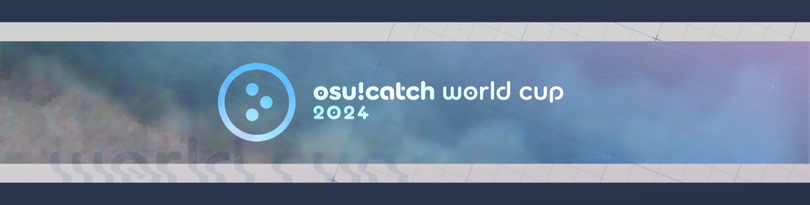
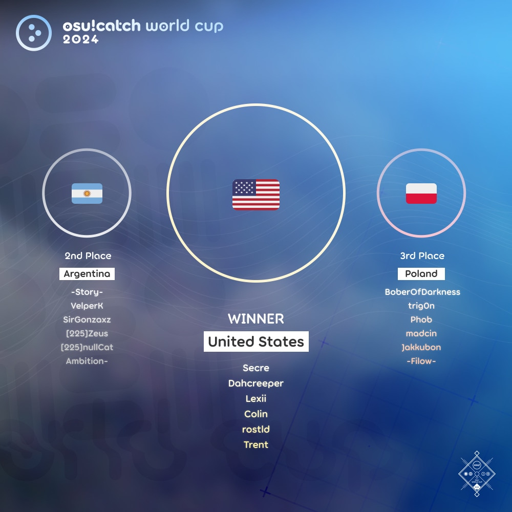

---
tags:
  - CWC
  - CWC2024
  - CWC 2024
---

# osu!catch World Cup 2024

The **osu!catch World Cup 2024** (***CWC 2024***) was a country-based osu!catch tournament hosted by the [osu! team](/wiki/People/osu!_team). It was the thirteenth instalment of the osu!catch World Cup.

## Tournament schedule

| Event | Timestamp |
| --: | :-- |
| Registration phase | 2024-04-18/2024-05-02 (23:59 UTC) |
| Qualifier showcase | 2024-05-12 (14:00 UTC) |
| Qualifier stage | 2024-05-18/2024-05-19 |
| Round of 32 | 2024-05-25/2024-05-26 |
| Round of 16 | 2024-06-01/2024-06-02 |
| Quarterfinals | 2024-06-08/2024-06-09 |
| Semifinals | 2024-06-15/2024-06-16 |
| Finals | 2024-06-22/2024-06-23 |
| Grand Finals | 2024-06-29/2024-06-30 |

## Prizes

The osu!catch World Cup 2024 offered a $2,534.24 cash prize pool and limited-edition merch.

| Placing | Prizes |
| :-: | :-- |
|  | 50% of the prize pool, single-run merch, profile badge, **osu!catch Champion** user title for one year |
|  | 30% of the prize pool, single-run merch, profile badge |
|  | 20% of the prize pool, single-run merch, profile badge |

  

## Organisation

The osu!catch World Cup 2024 was run by various community members.

| Position | Member(s) |
| :-- | :-- |
| Manager | ::{ flag=CA }:: [Azer](https://osu.ppy.sh/users/2155578), ::{ flag=US }:: [ChillierPear](https://osu.ppy.sh/users/9501251), ::{ flag=BR }:: [LeoFLT](https://osu.ppy.sh/users/3668779), ::{ flag=GB }:: [mangomizer](https://osu.ppy.sh/users/1893718) |
| Mappool selector | ::{ flag=CA }:: **[wwwww](https://osu.ppy.sh/users/8434466)**, ::{ flag=CA }:: **[Yoshi\_green](https://osu.ppy.sh/users/1035891)**, ::{ flag=HK }:: [autofanboy](https://osu.ppy.sh/users/636114), ::{ flag=PH }:: [Bunnrei](https://osu.ppy.sh/users/829284), ::{ flag=KR }:: [Spectator](https://osu.ppy.sh/users/702598) |
| Mappool quality assurance | ::{ flag=HK }:: [autofanboy](https://osu.ppy.sh/users/636114), ::{ flag=PH }:: [Bunnrei](https://osu.ppy.sh/users/829284), ::{ flag=KR }:: [ExGon](https://osu.ppy.sh/users/214187), ::{ flag=PH }:: [Jemzuu](https://osu.ppy.sh/users/7890134), ::{ flag=KR }:: [Spectator](https://osu.ppy.sh/users/702598), ::{ flag=CA }:: [wwwww](https://osu.ppy.sh/users/8434466), ::{ flag=CA }:: [Yoshi\_green](https://osu.ppy.sh/users/1035891), ::{ flag=CL }:: [ZiRoX](https://osu.ppy.sh/users/200768) |
| Mappool playtester | ::{ flag=CL }:: [Aryssiel](https://osu.ppy.sh/users/2389481), ::{ flag=US }:: [Blushing](https://osu.ppy.sh/users/5927823), ::{ flag=KR }:: [DreStar](https://osu.ppy.sh/users/1808057), ::{ flag=KR }:: [JISAN](https://osu.ppy.sh/users/3657951), ::{ flag=KR }:: [Motion](https://osu.ppy.sh/users/3885626) , ::{ flag=PH }:: [Roido](https://osu.ppy.sh/users/6829103), ::{ flag=ID }:: [Urabe Mikoto](https://osu.ppy.sh/users/1272422) |
| Mapper | ::{ flag=TN }:: [\-Ken](https://osu.ppy.sh/users/4430811), ::{ flag=TH }:: [\-Luminate](https://osu.ppy.sh/users/4778689), ::{ flag=PH }:: [\-Rustyy](https://osu.ppy.sh/users/16355636), ::{ flag=HK }:: [4rcheR\-](https://osu.ppy.sh/users/8846762), ::{ flag=US }:: [Ascendance](https://osu.ppy.sh/users/2931883), ::{ flag=HK }:: [autofanboy](https://osu.ppy.sh/users/636114), ::{ flag=HK }:: [BlackBN](https://osu.ppy.sh/users/6291741), ::{ flag=PH }:: [Bunnrei](https://osu.ppy.sh/users/829284), ::{ flag=PH }:: [Crowley](https://osu.ppy.sh/users/6341006), ::{ flag=AT }:: [Daletto](https://osu.ppy.sh/users/7592136), ::{ flag=ID }:: [Dapulezatos](https://osu.ppy.sh/users/8140944), ::{ flag=ES }:: [Deif](https://osu.ppy.sh/users/318565), ::{ flag=ID }:: [Dika312](https://osu.ppy.sh/users/741613), ::{ flag=KR }:: [ExGon](https://osu.ppy.sh/users/214187), ::{ flag=CN }:: [F D Flourite](https://osu.ppy.sh/users/2459589), ::{ flag=RU }:: [fayew](https://osu.ppy.sh/users/12498861), ::{ flag=US }:: [GiGas](https://osu.ppy.sh/users/7300747), ::{ flag=NL }:: [Greaper](https://osu.ppy.sh/users/2369776), ::{ flag=GB }:: [JBHyperion](https://osu.ppy.sh/users/4879508), ::{ flag=PH }:: [Jemzuu](https://osu.ppy.sh/users/7890134), ::{ flag=RU }:: [Lacrima](https://osu.ppy.sh/users/4915649), ::{ flag=US }:: [Liyac](https://osu.ppy.sh/users/4994598), ::{ flag=PL }:: [Malai](https://osu.ppy.sh/users/4863096), ::{ flag=PH }:: [midorijeon](https://osu.ppy.sh/users/10969875), ::{ flag=PL }:: [Mniam](https://osu.ppy.sh/users/6050530), ::{ flag=ID }:: [Mochi \-](https://osu.ppy.sh/users/20424806), ::{ flag=RU }:: [Morusya](https://osu.ppy.sh/users/13681464), ::{ flag=VE }:: [Mrbinking](https://osu.ppy.sh/users/6492475), ::{ flag=US }:: [Nidoking](https://osu.ppy.sh/users/7034422), ::{ flag=PH }:: [Nosuri](https://osu.ppy.sh/users/2150415), ::{ flag=DE }:: [rinkiha](https://osu.ppy.sh/users/10786819), ::{ flag=ID }:: [Sololiquy](https://osu.ppy.sh/users/4350087), ::{ flag=KR }:: [Spectator](https://osu.ppy.sh/users/702598), ::{ flag=CA }:: [wwwww](https://osu.ppy.sh/users/8434466), ::{ flag=CA }:: [Yoshi\_green](https://osu.ppy.sh/users/1035891), ::{ flag=RU }:: [yuinn](https://osu.ppy.sh/users/11239593), ::{ flag=CN }:: [Yumeno Himiko](https://osu.ppy.sh/users/1806962), ::{ flag=CL }:: [ZiRoX](https://osu.ppy.sh/users/200768), ::{ flag=ID }:: [Zyzyx](https://osu.ppy.sh/users/2888013) |
| Commentator | ::{ flag=IS }:: [Ash Ketchum](https://osu.ppy.sh/users/7297777), ::{ flag=US }:: [Dohland](https://osu.ppy.sh/users/5220511), ::{ flag=AU }:: [e wong](https://osu.ppy.sh/users/16859546), ::{ flag=BE }:: [ElSkeffe](https://osu.ppy.sh/users/6283136), ::{ flag=US }:: [Elux](https://osu.ppy.sh/users/12004983), ::{ flag=SE }:: [hypnoSpirA](https://osu.ppy.sh/users/1352257), ::{ flag=AU }:: [KWYJIBO](https://osu.ppy.sh/users/7178386), ::{ flag=AU }:: [Maitoo](https://osu.ppy.sh/users/16899553), ::{ flag=FR }:: [Realmas](https://osu.ppy.sh/users/6567640), ::{ flag=NL }:: [Sartan](https://osu.ppy.sh/users/4100941), ::{ flag=US }:: [Secre](https://osu.ppy.sh/users/2306637), ::{ flag=US }:: [Snowleopard](https://osu.ppy.sh/users/3790227), ::{ flag=US }:: [Toaph Daddy](https://osu.ppy.sh/users/7616811) |
| Referee | ::{ flag=US }:: [\[K\]](https://osu.ppy.sh/users/16551387), ::{ flag=FR }:: [Aidown](https://osu.ppy.sh/users/1522146), ::{ flag=NL }:: [Albionthegreat](https://osu.ppy.sh/users/9853595), ::{ flag=BR }:: [LeoFLT](https://osu.ppy.sh/users/3668779), ::{ flag=NL }:: [nik](https://osu.ppy.sh/users/10077264), ::{ flag=IN }:: [Speshimen](https://osu.ppy.sh/users/7720204), ::{ flag=US }:: [tigereyes144](https://osu.ppy.sh/users/6499811), ::{ flag=GB }:: [Yazzehh](https://osu.ppy.sh/users/7068973) |
| Statistician | ::{ flag=FI }:: **[shdewz](https://osu.ppy.sh/users/10000899)**, ::{ flag=BR }:: [LeoFLT](https://osu.ppy.sh/users/3668779) |
| Design coordinator | ::{ flag=CN }:: **[Sakura006](https://osu.ppy.sh/users/10365024)**, ::{ flag=CA }:: [kaetwo](https://osu.ppy.sh/users/1997719) |

## Links

- [Information spreadsheet](https://docs.google.com/spreadsheets/d/1OlBZgoymGYLMO39vJuCMBB_9whz79FudyQA7zYMMH_w?rm=minimal)
- [Weekly statistics spreadsheets](https://drive.google.com/drive/folders/14V9AReC5t47MFarkz8Ib4f5YlrjBGbZw)
- [Discussion thread](https://osu.ppy.sh/community/forums/topics/1911198)
- [Livestream](https://www.twitch.tv/osulive)
- [Tournament listing](https://osu.ppy.sh/community/tournaments/44)
- [Pick'ems page](https://pickem.hwc.hr/tournaments/142) hosted by ::{ flag=DE }:: [hallowatcher](https://osu.ppy.sh/users/1874761)
- [Challonge bracket](https://challonge.com/CWC2024)

## Participants

|  | Country | Members |
| :-: | :-: | :-- |
| ::{ flag=AR }:: | **Argentina** | **[-Story-](https://osu.ppy.sh/users/8172283)**, [VelperK](https://osu.ppy.sh/users/348467), [SirGonzaxz](https://osu.ppy.sh/users/17309439), [\[225\]Zeus](https://osu.ppy.sh/users/8329151), [\[225\]nullCat](https://osu.ppy.sh/users/17738253), [Ambition-](https://osu.ppy.sh/users/6960376) |
| ::{ flag=AU }:: | **Australia** | **[chickennando](https://osu.ppy.sh/users/5818665)**, [KWYJIBO](https://osu.ppy.sh/users/7178386), [CrimsonPleaseee](https://osu.ppy.sh/users/3743985), [Beerus](https://osu.ppy.sh/users/5529199), [TheTixTop](https://osu.ppy.sh/users/19236870), [Talicrons](https://osu.ppy.sh/users/6264535) |
| ::{ flag=AT }:: | **Austria** | **[Pepti](https://osu.ppy.sh/users/8408065)**, [Jinhwan](https://osu.ppy.sh/users/1902480), [qzoomee](https://osu.ppy.sh/users/3575682), [Volki](https://osu.ppy.sh/users/7118702) |
| ::{ flag=BE }:: | **Belgium** | **[ElSkeffe](https://osu.ppy.sh/users/6283136)**, [Jezse](https://osu.ppy.sh/users/11390632), [Emmenez moi](https://osu.ppy.sh/users/17578266), [\[ Zhiend \]](https://osu.ppy.sh/users/7474404), [my cutie](https://osu.ppy.sh/users/10742890), [Cakenoob](https://osu.ppy.sh/users/6045522) |
| ::{ flag=BG }:: | **Bulgaria** | **[Dekyoura](https://osu.ppy.sh/users/11156215)**, [Azakriel](https://osu.ppy.sh/users/30653081), [ss033](https://osu.ppy.sh/users/14584167), [Deadlest33](https://osu.ppy.sh/users/10712916) |
| ::{ flag=CA }:: | **Canada** | **[Katsuragi](https://osu.ppy.sh/users/3616480)**, [fuhie](https://osu.ppy.sh/users/7620002), [sularis](https://osu.ppy.sh/users/14571181), [Unlucky\_w](https://osu.ppy.sh/users/4820793), [Dea ex machina](https://osu.ppy.sh/users/3922569), [RedcXca](https://osu.ppy.sh/users/14056601) |
| ::{ flag=CL }:: | **Chile** | **[Lechu FAQ 35P](https://osu.ppy.sh/users/2872000)**, [Aryssiel](https://osu.ppy.sh/users/2389481), [Pekorrat](https://osu.ppy.sh/users/1250096), [Smukur](https://osu.ppy.sh/users/6434318), [Stark](https://osu.ppy.sh/users/1565036), [Thaemine](https://osu.ppy.sh/users/32442896) |
| ::{ flag=CN }:: | **China** | **[Nene Sakura](https://osu.ppy.sh/users/6701104)**, [Eta UMa](https://osu.ppy.sh/users/9740698), [-Yui](https://osu.ppy.sh/users/6649605), [Shiina Minatsu](https://osu.ppy.sh/users/3515458), [\[Paw\]Just\_MLN](https://osu.ppy.sh/users/8837858), [Seira-Nanamori](https://osu.ppy.sh/users/3407743) |
| ::{ flag=DK }:: | **Denmark** | **[Kaare](https://osu.ppy.sh/users/4434640)**, [Captain](https://osu.ppy.sh/users/2563435), [Noemark](https://osu.ppy.sh/users/12036156), [tjukas](https://osu.ppy.sh/users/19132590) |
| ::{ flag=EE }:: | **Estonia** | **[TuuGamer](https://osu.ppy.sh/users/17458994)**, [Sadu](https://osu.ppy.sh/users/16301262), [Dianthus](https://osu.ppy.sh/users/3606568), [-Nyaro](https://osu.ppy.sh/users/910100), [TkonicRabid](https://osu.ppy.sh/users/10480961) |
| ::{ flag=FI }:: | **Finland** | **[YERTI](https://osu.ppy.sh/users/1490757)**, [Veeti](https://osu.ppy.sh/users/12863098), [-Kaguya](https://osu.ppy.sh/users/5351518), [Leinou](https://osu.ppy.sh/users/7024526), [Tohtori G-piste](https://osu.ppy.sh/users/6109660), [JonZku](https://osu.ppy.sh/users/12740132) |
| ::{ flag=FR }:: | **France** | **[Electr0o](https://osu.ppy.sh/users/9484428)**, [Zelepha](https://osu.ppy.sh/users/6201167), [Holloh](https://osu.ppy.sh/users/7612994), [Noctalium](https://osu.ppy.sh/users/6488167), [Gwelawyr](https://osu.ppy.sh/users/2055184), [dotCore](https://osu.ppy.sh/users/8422828) |
| ::{ flag=DE }:: | **Germany** | **[Marvmallow](https://osu.ppy.sh/users/8403032)**, [Ginoshi](https://osu.ppy.sh/users/5398106), [Yuno4life](https://osu.ppy.sh/users/6477025), [Inryoku](https://osu.ppy.sh/users/6562920), [GinIkari](https://osu.ppy.sh/users/6083491), [- B e a t e r -](https://osu.ppy.sh/users/5238162) |
| ::{ flag=HK }:: | **Hong Kong** | **[my angel auto](https://osu.ppy.sh/users/29503627)**, [I CAN FC](https://osu.ppy.sh/users/2086828), [fua](https://osu.ppy.sh/users/21138904), [Black Spot](https://osu.ppy.sh/users/14890808) |
| ::{ flag=IS }:: | **Iceland** | **[Ash Ketchum](https://osu.ppy.sh/users/7297777)**, [kiriwi](https://osu.ppy.sh/users/6953927), [birkir](https://osu.ppy.sh/users/4348967), [Teini](https://osu.ppy.sh/users/14169321) |
| ::{ flag=ID }:: | **Indonesia** | **[Zvenx](https://osu.ppy.sh/users/14613788)**, [Chroneko](https://osu.ppy.sh/users/5472877), [Serestia](https://osu.ppy.sh/users/30511396), [Chiya--](https://osu.ppy.sh/users/7934854), [EpanPan](https://osu.ppy.sh/users/13194580), [Renessia](https://osu.ppy.sh/users/34606048) |
| ::{ flag=JP }:: | **Japan** | **[Molqus](https://osu.ppy.sh/users/1927193)**, [-Rindou-](https://osu.ppy.sh/users/7941971), [eisuke0530](https://osu.ppy.sh/users/9814770), [hiroshiki](https://osu.ppy.sh/users/2667256), [Melu](https://osu.ppy.sh/users/2624179), [S B K](https://osu.ppy.sh/users/29783499) |
| ::{ flag=LV }:: | **Latvia** | **[AnApple7](https://osu.ppy.sh/users/12567935)**, [Soruki](https://osu.ppy.sh/users/11762423), [Xeltusha](https://osu.ppy.sh/users/25574167), [Voxargenteae](https://osu.ppy.sh/users/10774235), [Joyy](https://osu.ppy.sh/users/14084526) |
| ::{ flag=MY }:: | **Malaysia** | **[kokomi on osu](https://osu.ppy.sh/users/12382410)**, [Moeruattack](https://osu.ppy.sh/users/4480237), [HyPerNekoChan](https://osu.ppy.sh/users/9626549), [Kagari](https://osu.ppy.sh/users/3366264), [Evirir](https://osu.ppy.sh/users/8126553), [Summerleopard](https://osu.ppy.sh/users/8437630) |
| ::{ flag=MX }:: | **Mexico** | **[Firu](https://osu.ppy.sh/users/10516547)**, [Cxlucha](https://osu.ppy.sh/users/5063961), [ArLuxZerRay](https://osu.ppy.sh/users/23996812), [ExGunt](https://osu.ppy.sh/users/20136125), [Astrea](https://osu.ppy.sh/users/3845678), [Agamalpa](https://osu.ppy.sh/users/15420662) |
| ::{ flag=NL }:: | **Netherlands** | **[Dutchman](https://osu.ppy.sh/users/10552580)**, [b-a-d-s123](https://osu.ppy.sh/users/3656717), [woodpamp](https://osu.ppy.sh/users/3809967), [Roasted Chicken](https://osu.ppy.sh/users/9461160), [Sartan](https://osu.ppy.sh/users/4100941), [Selo](https://osu.ppy.sh/users/3212806) |
| ::{ flag=NZ }:: | **New Zealand** | **[Kasumizawa-Miyu](https://osu.ppy.sh/users/24345309)**, [Starwide](https://osu.ppy.sh/users/9926856), [Nashiro](https://osu.ppy.sh/users/9740073), [Wettham77](https://osu.ppy.sh/users/14476098), [Cipse](https://osu.ppy.sh/users/7928880), [Trumpet](https://osu.ppy.sh/users/5405204) |
| ::{ flag=NO }:: | **Norway** | **[CyCeph](https://osu.ppy.sh/users/4586304)**, [Cameragod](https://osu.ppy.sh/users/4974088), [Azeidith](https://osu.ppy.sh/users/2819676), [Vikki](https://osu.ppy.sh/users/33305106), [Benita](https://osu.ppy.sh/users/4023183), [Lanki](https://osu.ppy.sh/users/2535200) |
| ::{ flag=PE }:: | **Peru** | **[islux](https://osu.ppy.sh/users/5477873)**, [Lunati1kid](https://osu.ppy.sh/users/25723773), [Boltico](https://osu.ppy.sh/users/5297904), [MauriciOSU](https://osu.ppy.sh/users/8199435), [Anthonyvfxfx](https://osu.ppy.sh/users/11548062), [GZone](https://osu.ppy.sh/users/10696269) |
| ::{ flag=PH }:: | **Philippines** | **[- Kielzu -](https://osu.ppy.sh/users/6221114)**, [liamggss](https://osu.ppy.sh/users/6829111), [\[ Potemkin \]](https://osu.ppy.sh/users/12410693), [Mawile](https://osu.ppy.sh/users/12256216), [-Isla-](https://osu.ppy.sh/users/17745759), [Chrisuly](https://osu.ppy.sh/users/12203613) |
| ::{ flag=PL }:: | **Poland** | **[BoberOfDarkness](https://osu.ppy.sh/users/3427748)**, [trig0n](https://osu.ppy.sh/users/3704228), [Phob](https://osu.ppy.sh/users/6069462), [madcin](https://osu.ppy.sh/users/2957534), [Jakkubon](https://osu.ppy.sh/users/3396013), [-Filow-](https://osu.ppy.sh/users/3157472) |
| ::{ flag=RU }:: | **Russian Federation** | **[Kimitakari](https://osu.ppy.sh/users/4741164)**, [KitsunIvy](https://osu.ppy.sh/users/7055384), [Segmentum](https://osu.ppy.sh/users/15389158), [ArthurEdikovich](https://osu.ppy.sh/users/18171621), [Nerris](https://osu.ppy.sh/users/11202866), [\_Rama](https://osu.ppy.sh/users/17021268) |
| ::{ flag=SG }:: | **Singapore** | **[Ekseff](https://osu.ppy.sh/users/13966422)**, [Setsuen](https://osu.ppy.sh/users/2673742), [uniqly](https://osu.ppy.sh/users/8876527), [Yiihao](https://osu.ppy.sh/users/8387373), [NoBudgetGuy](https://osu.ppy.sh/users/28498328) |
| ::{ flag=ES }:: | **Spain** | **[Eyminz](https://osu.ppy.sh/users/13845399)**, [Alepe](https://osu.ppy.sh/users/15273403), [MusicDropZ](https://osu.ppy.sh/users/12759554), [\[Ajoduro\]](https://osu.ppy.sh/users/19186799), [skyres00](https://osu.ppy.sh/users/10158490) |
| ::{ flag=SE }:: | **Sweden** | **[Aceon](https://osu.ppy.sh/users/4452911)**, [Shameimaru](https://osu.ppy.sh/users/20340480), [Setomi](https://osu.ppy.sh/users/2205929), [nc enjoyer](https://osu.ppy.sh/users/16669841), [DataPata](https://osu.ppy.sh/users/985360), [Eps](https://osu.ppy.sh/users/6511370) |
| ::{ flag=TW }:: | **Taiwan** | **[DoDoEbi](https://osu.ppy.sh/users/1177233)**, [\_Nanami](https://osu.ppy.sh/users/1929450), [Shimoe Koharu](https://osu.ppy.sh/users/2145160), [Happiness Fish](https://osu.ppy.sh/users/4586766), [Psc\_IceRain](https://osu.ppy.sh/users/3359485), [Minato Yukina](https://osu.ppy.sh/users/4133477) |
| ::{ flag=TH }:: | **Thailand** | **[EzyS](https://osu.ppy.sh/users/16271283)**, [N3Marry](https://osu.ppy.sh/users/13222425), [G1ilbert](https://osu.ppy.sh/users/7408055), [-TANAKITO-](https://osu.ppy.sh/users/6037121), [Bigkung2006](https://osu.ppy.sh/users/18837140), [ZeroKungz](https://osu.ppy.sh/users/23155757) |
| ::{ flag=TR }:: | **Turkey** | **[lorem ipsum](https://osu.ppy.sh/users/17130789)**, [shimu](https://osu.ppy.sh/users/14318796), [Teoman](https://osu.ppy.sh/users/29824043), [Yasi6n](https://osu.ppy.sh/users/17482520), [1Haruki](https://osu.ppy.sh/users/11152537), [Reha](https://osu.ppy.sh/users/5875463) |
| ::{ flag=GB }:: | **United Kingdom** | **[Withered Lotus](https://osu.ppy.sh/users/3546931)**, [Matt\_H](https://osu.ppy.sh/users/4067115), [Eliminate](https://osu.ppy.sh/users/9169747), [DarnedUrchin](https://osu.ppy.sh/users/4928846), [Stats-Kun](https://osu.ppy.sh/users/8611935), [Olib](https://osu.ppy.sh/users/4044289) |
| ::{ flag=US }:: | **United States** | **[Secre](https://osu.ppy.sh/users/2306637)**, [Dahcreeper](https://osu.ppy.sh/users/6926006), [Lexii](https://osu.ppy.sh/users/7226149), [Colin](https://osu.ppy.sh/users/5502521), [rostld](https://osu.ppy.sh/users/4365562), [Trent](https://osu.ppy.sh/users/3438241) |
| ::{ flag=VN }:: | **Vietnam** | **[Stardust Prism](https://osu.ppy.sh/users/8525921)**, [Shu](https://osu.ppy.sh/users/4744615), [NamSPro](https://osu.ppy.sh/users/11387006), [-Linglan Lily-](https://osu.ppy.sh/users/8738261), [\_Fubucky\_](https://osu.ppy.sh/users/4284567), [Beubaby](https://osu.ppy.sh/users/25679389) |

Captains are listed in **bold**.\
The complete sign-up list can be found [here](https://gist.github.com/LeoFLT/e6d212da04da41faffa8d0fc5366952e).

## Podium

## Mappools

### Grand Finals

**[Download the mappack here (195 MB)](https://packs.ppy.sh/P252%20-%20osu!catch%20World%20Cup%202024%3A%20Grand%20Finals.zip)**\
[View the showcase VOD here](https://www.twitch.tv/videos/2179927105)

- No Mod
  1. [Spire - Evening Sky Force (GiGas) \[Starfall Vangaurd\]](https://osu.ppy.sh/beatmapsets/2202779#fruits/4662219)
  2. [WangleLine - Journey to the Rabbit Moon Base (Bunnrei) \[^x^\]](https://osu.ppy.sh/beatmapsets/2202809#fruits/4662278)
  3. [Teinu - Valeriana / feat. Mai, Nurse Robot\_Type T (Sololiquy) \[Shatter\]](https://osu.ppy.sh/beatmapsets/2202783#fruits/4662225)
  4. [Marmalade butcher - Ushinahareru Runazuki (-NeBu-) \[Forever Going With The Flow (CWC Edit)\]](https://osu.ppy.sh/beatmapsets/1749081#fruits/3577912)
- Hidden
  1. [xi - Angelic Party (Spectator) \[Deluge\]](https://osu.ppy.sh/beatmapsets/2202799#fruits/4662256)
  2. [Rigel Theatre - Tir na nOg (F D Flourite) \[Dance Hall\]](https://osu.ppy.sh/beatmapsets/2202810#fruits/4662280)
  3. [RukaDesu & 5KiLOBYTE - DUALITY (autofanboy) \[RUSTYY & AFB'S DICHOTOMY\]](https://osu.ppy.sh/beatmapsets/2202858#fruits/4662378)
- Hard Rock
  1. [Angelmaker - What I Would Give (Daletto) \[I long to see you...\]](https://osu.ppy.sh/beatmapsets/2202800#fruits/4662258)
  2. [Tedjimo yomigY - Edelweiss (Mrbinking) \[Paradisal\]](https://osu.ppy.sh/beatmapsets/2202816#fruits/4662288)
  3. [beignet - Mint Comet (Dika312) \[Meteor Shower\]](https://osu.ppy.sh/beatmapsets/2202945#fruits/4662593)
- Double Time
  1. [MYTH & ROID - Paradisus-Paradoxum (Ascendance) \[Return by Death\]](https://osu.ppy.sh/beatmapsets/2202946#fruits/4662598)
  2. [Hoshimachi Suisei - BIBBIDIBA (Yoshi\_green) \[Director's Cut\]](https://osu.ppy.sh/beatmapsets/2202811#fruits/4662281)
  3. [Gram - Odin (Greaper) \[Overdose\]](https://osu.ppy.sh/beatmapsets/2202812#fruits/4662283)
  4. [Susumu Hirasawa - CODE-COSTARICA (ExGon) \[MixGon\]](https://osu.ppy.sh/beatmapsets/2202815#fruits/4662287)
- Mixed Mod
  1. [ptar124 - aqua regia (Deif) \[HNO3 + 3 HCl (CWC Ver.)\]](https://osu.ppy.sh/beatmapsets/2202817#fruits/4662289)
  2. [-45 - ADDicTiON4500000 (Lacrima) \[oVERDoSE (feat. fayew)\]](https://osu.ppy.sh/beatmapsets/2202822#fruits/4662298)
  3. [Ruby My Dear - A Dada (fayew) \[quack\]](https://osu.ppy.sh/beatmapsets/2202818#fruits/4662291)
- Tiebreaker
  1. **[Kou! - Frost Walker (Spectator) \[Glacial Collab\]](https://osu.ppy.sh/beatmapsets/2202823#fruits/4662299)**

### Finals

**[Download the mappack here (199 MB)](https://packs.ppy.sh/P251%20-%20osu!catch%20World%20Cup%202024%3A%20Finals.zip?1718599395)**\
[View the showcase VOD here](https://www.twitch.tv/videos/2173835340)

- No Mod
  1. [seatrus - CIRCVMZENITHAL:ARK (Yoshi\_green) \[YOSHI & RUSTYY'S PARH3LIC:CIRKLE\]](https://osu.ppy.sh/beatmapsets/2198766#fruits/4653068)
  2. [Laur - Cosmic Blaster (ExGon) \[CWC 2024 Finals NM2\]](https://osu.ppy.sh/beatmapsets/2198796#fruits/4653112)
  3. [A.SAKA - KAGUTSUCHI (Nidoking) \[The Flowers of Edo\]](https://osu.ppy.sh/beatmapsets/2198988#fruits/4653607)
  4. [Will Stetson - Kyu-kurarin (autofanboy) \[Camo's Pandemonium (CWC Edit)\]](https://osu.ppy.sh/beatmapsets/2198872#fruits/4653265)
- Hidden
  1. [25-ji, Nightcord de. x Hatsune Miku - Gehenna (-Rustyy) \[Rustyy & Mochi's Hopelessness\]](https://osu.ppy.sh/beatmapsets/2198786#fruits/4653094)
  2. [Kanno Yugo - Theme of Stone Ocean (Cut Ver.) (Crowley) \[Tell me how you feel\]](https://osu.ppy.sh/beatmapsets/2198958#fruits/4653546)
  3. [Culprate - Helter (wwwww) \[Capitulate\]](https://osu.ppy.sh/beatmapsets/2198816#fruits/4653147)
- Hard Rock
  1. [Curiowave - Arrival of X (Cut ver.) (rinkiha) \[Emergence\]](https://osu.ppy.sh/beatmapsets/2198791#fruits/4653099)
  2. [Cansol - 1,2,3,4! (autofanboy) \[Yoshi, Rei & AFB's Conundrum of Mathematics\]](https://osu.ppy.sh/beatmapsets/2198874#fruits/4653271)
  3. [Raimukun - Myths Orbis (Zyzyx) \[World's Ende (CWC ver.)\]](https://osu.ppy.sh/beatmapsets/2198812#fruits/4653138)
- Double Time
  1. [Monster Siren - Misty Memory (Night Version) (Yumeno Himiko) \[Day Day Dream\]](https://osu.ppy.sh/beatmapsets/2198833#fruits/4653187)
  2. [KNOWER - Time Traveler (autofanboy) \[Go Backwards!\]](https://osu.ppy.sh/beatmapsets/2198875#fruits/4653272)
  3. [ARForest - The Last Page (Ascendance) \[Final Chapter\]](https://osu.ppy.sh/beatmapsets/2198800#fruits/4653119)
  4. [Brown Eyed Girls - Brave New World (Mrbinking) \[Reversal\]](https://osu.ppy.sh/beatmapsets/2198802#fruits/4653121)
- Mixed Mod
  1. [katagiri - c0pyf0x (Bunnrei) \[0therside\]](https://osu.ppy.sh/beatmapsets/2198810#fruits/4653134)
  2. [AAAA + Umeboshi Chazuke - Cait Sith (Cut Ver.) (-Ken) \[Piano Party\]](https://osu.ppy.sh/beatmapsets/2198798#fruits/4653117)
  3. [Aoi - Neverlast (Jemzuu) \[Dreamin' Adventure!\]](https://osu.ppy.sh/beatmapsets/2198806#fruits/4653125)
- Tiebreaker
  1. **[Kyutatsuki - SOUND ARCHITECT (GiGas) \[GiGas & Jemzuu's Framework of Harmony\]](https://osu.ppy.sh/beatmapsets/2198809#fruits/4653132)**

### Semifinals

**[Download the mappack here (154 MB)](https://packs.ppy.sh/P250%20-%20osu!catch%20World%20Cup%202024%3A%20Semifinals.zip)**\
[View the showcase VOD here](https://www.twitch.tv/videos/2167854236)

- No Mod
  1. [Camellia feat. Mayumi Morinaga - re:||BIRTH (Bunnrei) \[Overload \[12.5\]\]](https://osu.ppy.sh/beatmapsets/2195010#fruits/4644233)
  2. [Juggernaut. - Rebellion (Jemzuu) \[Retaliation\]](https://osu.ppy.sh/beatmapsets/2195014#fruits/4644238)
  3. [Frums (unknown "lambda") - 19ZZ (Yoshi\_green) \[03NM\]](https://osu.ppy.sh/beatmapsets/2195034#fruits/4644283)
  4. [MisoilePunch - Mesheer (autofanboy) \[R3m's FINAL (CWC Ver.)\]](https://osu.ppy.sh/beatmapsets/2195020#fruits/4644247)
- Hidden
  1. [Luschka - unravel (Morusya) \[Knotted\]](https://osu.ppy.sh/beatmapsets/2195023#fruits/4644254)
  2. [Ito Kanako - Tataeshi Tatakai no Uta (F D Flourite) \[Proelium\]](https://osu.ppy.sh/beatmapsets/2195043#fruits/4644294)
  3. [Dictate & Silentroom - REBIRTH (Jemzuu) \[relapse\]](https://osu.ppy.sh/beatmapsets/2195032#fruits/4644279)
- Hard Rock
  1. [ELFENSJoN - Akayake no Majo (-Luminate) \[Malevolence\]](https://osu.ppy.sh/beatmapsets/2195113#fruits/4644437)
  2. [-45 - Reishiki (fayew) \[534B4942494449544F494C455452495A5A\]](https://osu.ppy.sh/beatmapsets/2195036#fruits/4644286)
  3. [Ardolf - SILVER BULLET (4rcheR-) \[DELUGE\]](https://osu.ppy.sh/beatmapsets/2195044#fruits/4644295)
- Double Time
  1. [Omoi - Nee William (BlackBN) \[Hey William!\]](https://osu.ppy.sh/beatmapsets/2195045#fruits/4644298)
  2. [-45 - Akaikutsu Nise (Deif) \[fayew vs. Deif's Endless Witch\]](https://osu.ppy.sh/beatmapsets/2195073#fruits/4644348)
  3. [CHON - Waterslide (rinkiha) \[Tranquil Sea\]](https://osu.ppy.sh/beatmapsets/2195049#fruits/4644303)
  4. [m-flo loves BoA - the Love Bug (Liyac) \[Moyac's Love Jonez\]](https://osu.ppy.sh/beatmapsets/2195051#fruits/4644305)
- Mixed Mod
  1. [IDONO KAWAZU - Toxin (Spectator) \[Deluge\]](https://osu.ppy.sh/beatmapsets/2195217#fruits/4644675)
  2. [0 K - Brilliant Silver, Shining Blade (JBHyperion) \[Claiomh Solais, The Radiant\]](https://osu.ppy.sh/beatmapsets/2195061#fruits/4644324)
  3. [BEMANI Sound Team "Yvya" - Vitrum (Yoshi\_green) \[Broken dreams\]](https://osu.ppy.sh/beatmapsets/2195058#fruits/4644312)
- Tiebreaker
  1. **[SOOOO - illloved (osu! Edit) (Mochi -) \[Excessive Misery\]](https://osu.ppy.sh/beatmapsets/2195067#fruits/4644340)**

### Quarterfinals

**[Download the mappack here (149 MB)](https://packs.ppy.sh/P249%20-%20osu!catch%20World%20Cup%202024%3A%20Quarterfinals.zip)**\
[View the showcase VOD here](https://www.twitch.tv/videos/2162029338)

- No Mod
  1. [BlackY feat. Risa Yuzuki - PARADOXY (Yoshi\_green) \[CATCH-22\]](https://osu.ppy.sh/beatmapsets/2191148#fruits/4634642)
  2. [HAGISOPH - Trip Coffee (-Rustyy) \[Frappuccino\]](https://osu.ppy.sh/beatmapsets/2191189#fruits/4634741)
  3. [Culprate - Junglist Acid (osu! Edit) (wwwww) \[Caustic\]](https://osu.ppy.sh/beatmapsets/2191197#fruits/4634752)
  4. [Imy - Divine's Game (Nao Tomori) \[Extra (CWC Edit)\]](https://osu.ppy.sh/beatmapsets/2191155#fruits/4634667)
- Hidden
  1. [ABSOLUTE CASTAWAY - step by step (Deif) \[The other side of the smile\]](https://osu.ppy.sh/beatmapsets/2191164#fruits/4634684)
  2. [Cansol - all over the street (Dika312) \[lost on the way\]](https://osu.ppy.sh/beatmapsets/2191165#fruits/4634690)
  3. [Redside - Sidequest (Zyzyx) \[Adventure\]](https://osu.ppy.sh/beatmapsets/2191180#fruits/4634728)
- Hard Rock
  1. [Ariabl'eyeS - Raison d'etre (Greaper) \[Reason\]](https://osu.ppy.sh/beatmapsets/2191169#fruits/4634698)
  2. [Qrispy Joybox - licca (Lacrima) \[overdose (cwc ver)\]](https://osu.ppy.sh/beatmapsets/2191172#fruits/4634714)
  3. [YUC'e - macaron moon (Nosuri) \[creamy\]](https://osu.ppy.sh/beatmapsets/2191179#fruits/4634727)
- Double Time
  1. [Ariabl'eyeS feat. Risa Yuzuki - Meimei Memoria (Dapulezatos) \[Cross-Dimensional Heartstrings\]](https://osu.ppy.sh/beatmapsets/2191244#fruits/4634876)
  2. [EmoCosine - Dream With Me (Jemzuu) \[Dreamy\]](https://osu.ppy.sh/beatmapsets/2191261#fruits/4634911)
  3. [Dimrain47 - The Prototype (Yoshi\_green) \[wip\]](https://osu.ppy.sh/beatmapsets/2191178#fruits/4634726)
- Mixed Mod
  1. [Falling In Reverse - Watch The World Burn (Daletto) \[Hypnotizing\]](https://osu.ppy.sh/beatmapsets/2191184#fruits/4634735)
  2. [Street vs. Sin:ck - Adamantite (autofanboy) \[Metallurgy\]](https://osu.ppy.sh/beatmapsets/2191260#fruits/4634910)
- Tiebreaker
  1. **[Sad Keyboard Guy & Gardens - Waking Shadows feat. eili (-Rustyy) \[Monochromatic Surge\]](https://osu.ppy.sh/beatmapsets/2191190#fruits/4634742)**

### Round of 16

**[Download the mappack here (109 MB)](https://packs.ppy.sh/P248%20-%20osu!catch%20World%20Cup%202024%3A%20Round%20of%2016.zip)**\
[View the showcase VOD here](https://www.twitch.tv/videos/2156057435)

- No Mod
  1. [airportexpress feat. Itsuneko - BIRTH (F D Flourite) \[Overdose (CWC Ver.)\]](https://osu.ppy.sh/beatmapsets/2187346#fruits/4624746)
  2. [P4koo - Altered Ego (-Luminate) \[Overdose\]](https://osu.ppy.sh/beatmapsets/2187381#fruits/4624811)
  3. [ALEPH - ULTRAVIOLET (rinkiha) \[LIGHTSURFER\]](https://osu.ppy.sh/beatmapsets/2187370#fruits/4624784)
  4. [MYUKKE. - Mach Roger (Tycani) \[TYCANI GOES TO PHOENIX, ARIZONA CWC SPECIAL VERSION EXTRAVAGANZA\]](https://osu.ppy.sh/beatmapsets/2187368#osu/4624782)
- Hidden
  1. [Good Kid - Osmosis (Crowley) \[Catalyst\]](https://osu.ppy.sh/beatmapsets/2187488#fruits/4625050)
  2. [technoplanet - Insomnia (autofanboy) \[Feigned Slumber\]](https://osu.ppy.sh/beatmapsets/2187441#fruits/4624959)
  3. [Scheol X M2U - Tanuki Step (Nosuri) \[Overdose\]](https://osu.ppy.sh/beatmapsets/2187379#fruits/4624807)
- Hard Rock
  1. [MisoilePunch \~Mikan Shirugake\~ - Whyte pain (Bunnrei) \[Overdose (CWC Ver.)\]](https://osu.ppy.sh/beatmapsets/2187385#fruits/4624818)
  2. [Sound Souler - Diminitive (ExGon) \[CWC 2024 RO16 HR2\]](https://osu.ppy.sh/beatmapsets/2187388#fruits/4624822)
  3. [Alkome - Mind Disorder (-Ken) \[Meltdown\]](https://osu.ppy.sh/beatmapsets/2187382#fruits/4624812)
- Double Time
  1. [ELFENSJoN - Okibi no Hate (4rcheR-) \[Rain\]](https://osu.ppy.sh/beatmapsets/2187458#fruits/4624995)
  2. [URBANGARDE - KAMING OUT (Cut Ver.) (ZiRoX) \[CONFESSION\]](https://osu.ppy.sh/beatmapsets/2187387#fruits/4624821)
  3. [32ki - Mesmerizer (Mniam) \[Shutdown\]](https://osu.ppy.sh/beatmapsets/2187391#fruits/4624826)
- Mixed Mod
  1. [kanone - MASAMUNE (Deif) \[Sharpness\]](https://osu.ppy.sh/beatmapsets/2187434#fruits/4624950)
  2. [Chroma - Genyo Ressha no Tabi (Bunnrei) \[Eastward\]](https://osu.ppy.sh/beatmapsets/2187393#fruits/4624828)
- Tiebreaker
  1. **[Culprate - Psychology of James Berland (wwwww) \[Culpability\]](https://osu.ppy.sh/beatmapsets/2187400#fruits/4624835)**

### Round of 32

**[Download the mappack here (99 MB)](https://packs.ppy.sh/P247%20-%20osu!catch%20World%20Cup%202024%3A%20Round%20of%2032.zip)**\
[View the showcase VOD here](https://www.twitch.tv/videos/2150173001?t=1h0m44s)

- No Mod
  1. [Fuki - DAYS (BlackBN) \[YOU\]](https://osu.ppy.sh/beatmapsets/2184377#fruits/4617105)
  2. [Aethral - It's Boss Time, dude (Malai) \[H3y b0$$\]](https://osu.ppy.sh/beatmapsets/2184034#fruits/4615516)
  3. [KARUT - 0068 opera yori ai o komete! Event BGM (Sololiquy) \[Aru\]](https://osu.ppy.sh/beatmapsets/2184033#fruits/4615512)
  4. [Boom Kitty - Any Other Way (feat. Ivy Marie) (autofanboy) \[Zelicz's Extra (CWC Ver.)\]](https://osu.ppy.sh/beatmapsets/2184055#osu/4615558)
- Hidden
  1. [Lindsey Stirling - V-Pop (Dapulezatos) \[Vibrancy\]](https://osu.ppy.sh/beatmapsets/2184059#fruits/4615567)
  2. [Kikuo - Yousei no Kiri (ZiRoX) \[Fae\]](https://osu.ppy.sh/beatmapsets/2184086#fruits/4615620)
- Hard Rock
  1. [Risa Yuzuki - Ironical Parade (wwwww) \[Yoshi\_gwwwwween's Rain\]](https://osu.ppy.sh/beatmapsets/2183882#fruits/4615165)
  2. [Amidst - Fate (Nosuri) \[Rain\]](https://osu.ppy.sh/beatmapsets/2184047#fruits/4615546)
- Double Time
  1. [BINI - Salamin, Salamin (Crowley) \[BINI\_Crowley & BINI\_Rustyy's Reflection\]](https://osu.ppy.sh/beatmapsets/2184044#fruits/4615540)
  2. [Mitchie M feat. Hatsune Miku - Suki! Yuki! Maji Magic (Yoshi\_green) \[Miracle!\]](https://osu.ppy.sh/beatmapsets/2184049#fruits/4615549)
  3. [SB\_YUNE - Dread of the grave -more fear- (yuinn) \[Battler Ushiromiya (CV: Morusya) vs Dlanor A. Knox (CV: yuinn) Collab Rain\]](https://osu.ppy.sh/beatmapsets/2184054#fruits/4615557)
- Mixed Mod
  1. [YOASOBI - Biri-Biri (Spectator) \[Overdose\]](https://osu.ppy.sh/beatmapsets/2184093#fruits/4615635)
  2. [M2U - Gypsy Tronic (Mrbinking) \[Endless Traversal\]](https://osu.ppy.sh/beatmapsets/2184097#fruits/4615639)
- Tiebreaker
  1. **[Sparxe - Zinnober (autofanboy) \[Avarice\]](https://osu.ppy.sh/beatmapsets/2184068#fruits/4615584)**

### Qualifiers

**[Download the mappack here (80 MB)](https://packs.ppy.sh/P246%20-%20osu!catch%20World%20Cup%202024%3A%20Qualifiers.zip?1715708394)**\
[View the showcase VOD here](https://www.twitch.tv/videos/2143953590)

- No Mod
  1. [Camellia - POLYBIUS GB SPEEDRUN (Glitchless 100% WR in 0:03:57) (Bunnrei) \[Qualifier NM1 Scorerun\]](https://osu.ppy.sh/beatmapsets/2180208#fruits/4605282)
  2. [Tsukidono - Luegner -Reboot Code- (Jemzuu) \[Cybernetic Collapse (CWC Ver.)\]](https://osu.ppy.sh/beatmapsets/2180218#fruits/4605315)
  3. [Imy - Egoist (autofanboy) \[Risen's Extra (CWC Ver.)\]](https://osu.ppy.sh/beatmapsets/2181321#osu/4608191)
- Hidden
  1. [mononofrog\_4sk feat. masazi - mayday B (Cut Ver.) (F D Flourite) \[aByss\]](https://osu.ppy.sh/beatmapsets/2180233#fruits/4605338)
  2. [siqlo - wholeheartedly (autofanboy) \[sincerity\]](https://osu.ppy.sh/beatmapsets/2180220#fruits/4605318)
- Hard Rock
  1. [Rohi - Kanata ni Mau wa Sakura no Senritsu (Deif) \[Cherry Blossom Melody\]](https://osu.ppy.sh/beatmapsets/2180222#fruits/4605320)
  2. [LeaF - I (Greaper) \[Terror\]](https://osu.ppy.sh/beatmapsets/2180230#fruits/4605335)
- Double Time
  1. [Risa Yuzuki - Yumemiru Milky Way feat. Aitsuki Nakuru (Dika312) \[Light Overdose (CWC)\]](https://osu.ppy.sh/beatmapsets/2180227#fruits/4605328)
  2. [lapix - Horizon Blue feat. Kanata.N (-Ken) \[The world beyond the everlasting lines\]](https://osu.ppy.sh/beatmapsets/2180225#fruits/4605325)

## Match results

### Grand Finals

Detailed statistics for this round can be found [here](https://docs.google.com/spreadsheets/d/1H3kbDDMeZCNk4d5n6_YzMNFT0OGM5rteYbWOk0H8g1w?rm=minimal).

Saturday, 29 June 2024:

| Team A |  |  | Team B | Match link | VOD link | Notes |
| --: | :-: | :-: | :-- | :-- | :-- | :-- |
| All-stars Red | 6 | **7** | **All-stars Blue** | [#1](https://osu.ppy.sh/community/matches/114483741) | [#1](https://www.twitch.tv/videos/2184855334) | Grand Finals Showmatch |
| **Argentina** ::{ flag=AR }:: | **7** | 4 | ::{ flag=PL }:: Poland | [#1](https://osu.ppy.sh/community/matches/114486761) | [#1](https://www.twitch.tv/videos/2184995652) |  |

Saturday, 29 June 2024:

| Team A |  |  | Team B | Match link | VOD link |
| --: | :-: | :-: | :-- | :-- | :-- |
| **United States** ::{ flag=US }:: | **7** | 4 | ::{ flag=AR }:: Argentina | [#1](https://osu.ppy.sh/community/matches/114501019) | [#1](https://www.twitch.tv/videos/2185967388) |

### Finals

Detailed statistics for this round can be found [here](https://docs.google.com/spreadsheets/d/1ptkxImpOSpHX6KRdJqq0cc531mEMIJtyhN6N5Z3aCgA?rm=minimal).

Saturday, 22 June 2024:

| Team A |  |  | Team B | Match link | VOD link | Notes |
| --: | :-: | :-: | :-- | :-- | :-- | :-- |
| Rookies | 3 | **7** | **Veterans** | [#1](https://osu.ppy.sh/community/matches/114394587) | [#1](https://www.twitch.tv/videos/2178762405) | Finals Showmatch |
| Chile ::{ flag=CL }:: | 6 | **7** | ::{ flag=PL }:: **Poland** | [#1](https://osu.ppy.sh/community/matches/114396602) | [#1](https://www.twitch.tv/videos/2179700308) |  |
| Finland ::{ flag=FI }:: | 1 | **7** | ::{ flag=CA }:: **Canada** | [#1](https://osu.ppy.sh/community/matches/114397895) | [#1](https://www.twitch.tv/videos/2178932936) |  |

Sunday, 23 June 2024:

| Team A |  |  | Team B | Match link | VOD link |
| --: | :-: | :-: | :-- | :-- | :-- |
| **United States** ::{ flag=US }:: | **7** | 1 | ::{ flag=AR }:: Argentina | [#1](https://osu.ppy.sh/community/matches/114411164) | [#1](https://www.twitch.tv/videos/2179785384) |
| Canada ::{ flag=CA }:: | 5 | **7** | ::{ flag=PL }:: **Poland** | [#1](https://osu.ppy.sh/community/matches/114411894) | [#1](https://www.twitch.tv/videos/2179927104) |

### Semifinals

Detailed statistics for this round can be found [here](https://docs.google.com/spreadsheets/d/1Ogp2FIN4-2f8hlx9-_j6rEuCYpkPjcFhrpjpmqdq-rM?rm=minimal).

Saturday, 15 June 2024:

| Team A |  |  | Team B | Match link | VOD link |
| --: | :-: | :-: | :-- | :-- | :-- |
| **Canada** ::{ flag=CA }:: | **7** | 1 | ::{ flag=AU }:: Australia | [#1](https://osu.ppy.sh/community/matches/114296540) | [#1](https://www.twitch.tv/videos/2172485852) |
| **France** ::{ flag=FR }:: | **7** | 2 | ::{ flag=ID }:: Indonesia | [#1](https://osu.ppy.sh/community/matches/114300774) | [#1](https://www.twitch.tv/videos/2172720355) |
| **Poland** ::{ flag=PL }:: | **7** | 0 | ::{ flag=JP }:: Japan | [#1](https://osu.ppy.sh/community/matches/114301052) | [#1](https://www.twitch.tv/videos/2172733922) |
| Russian Federation ::{ flag=RU }:: | 3 | **7** | ::{ flag=PE }:: **Peru** | [#1](https://osu.ppy.sh/community/matches/114303058) | [#1](https://www.twitch.tv/videos/2172850090) |
| **Argentina** ::{ flag=AR }:: | **7** | 2 | ::{ flag=FI }:: Finland | [#1](https://osu.ppy.sh/community/matches/114304682) | [#1](https://www.twitch.tv/videos/2172930270) |

Sunday, 16 June 2024:

| Team A |  |  | Team B | Match link | VOD link | Notes |
| --: | :-: | :-: | :-- | :-- | :-- | :-- |
| **Staff Red** | **7** | 6 | Staff Blue | [#1](https://osu.ppy.sh/community/matches/114315245) | [#1](https://www.twitch.tv/videos/2173679409) | Showmatch featuring CWC staff |
| France ::{ flag=FR }:: | 0 | **7** | ::{ flag=PL }:: **Poland** | [#1](https://osu.ppy.sh/community/matches/114317589) | [#1](https://www.twitch.tv/videos/2173689057) |  |
| **Canada** ::{ flag=CA }:: | **7** | 1 | ::{ flag=PE }:: Peru | [#1](https://osu.ppy.sh/community/matches/114319162) | [#1](https://www.twitch.tv/videos/2173786247) |  |
| **United States** ::{ flag=US }:: | **7** | 1 | ::{ flag=CL }:: Chile | [#1](https://osu.ppy.sh/community/matches/114319136) | [#1](https://www.twitch.tv/videos/2173784029) |  |

### Quarterfinals

Detailed statistics for this round can be found [here](https://docs.google.com/spreadsheets/d/1h0RnJWByRl_aQv3JdF-Jgrh3DYl8_sZH3FrA-0QfrsA?rm=minimal).

Friday, 7 June 2024:

| Team A |  |  | Team B | Match link | VOD link |
| --: | :-: | :-: | :-- | :-- | :-- |
| **Peru** ::{ flag=PE }:: | **6** | 0 | ::{ flag=NO }:: Norway | [#1](https://osu.ppy.sh/community/matches/114198067) | [#1](https://www.twitch.tv/videos/2166190818) |

Saturday, 8 June 2024:

| Team A |  |  | Team B | Match link | VOD link |
| --: | :-: | :-: | :-- | :-- | :-- |
| Australia ::{ flag=AU }:: | **0** | -1 | ::{ flag=TH }:: Thailand | *win by default* |  |
| **Japan** ::{ flag=JP }:: | **6** | 1 | ::{ flag=SE }:: Sweden | [#1](https://osu.ppy.sh/community/matches/114205909) | [#1](https://www.twitch.tv/videos/2166725536) |
| **Taiwan** ::{ flag=TW }:: | **6** | 0 | ::{ flag=PH }:: Philippines | [#1](https://osu.ppy.sh/community/matches/114206393) | [#1](https://www.twitch.tv/videos/2166781966) |
| **United Kingdom** ::{ flag=GB }:: | **6** | 0 | ::{ flag=NL }:: Netherlands | [#1](https://osu.ppy.sh/community/matches/114207101) | [#1](https://www.twitch.tv/videos/2166783658) |
| China ::{ flag=CN }:: | **0** | -1 | ::{ flag=MX }:: Mexico | *win by default* | [#1](https://www.twitch.tv/videos/2166802823) |
| Poland ::{ flag=PL }:: | 5 | **6** | ::{ flag=AR }:: **Argentina** | [#1](https://osu.ppy.sh/community/matches/114207882) | [#1](https://www.twitch.tv/videos/2166864724) |
| **Indonesia** ::{ flag=ID }:: | **6** | 0 | ::{ flag=ES }:: Spain | [#1](https://osu.ppy.sh/community/matches/114208654) | [#1](https://www.twitch.tv/videos/2166860730) |
| **Belgium** ::{ flag=BE }:: | **6** | 4 | ::{ flag=DE }:: Germany | [#1](https://osu.ppy.sh/community/matches/114209521) | [#1](https://www.twitch.tv/videos/2166934227) |
| **Peru** ::{ flag=PE }:: | **6** | 1 | ::{ flag=TW }:: Taiwan | [#1](https://osu.ppy.sh/community/matches/114210040) | [#1](https://www.twitch.tv/videos/2166931446) |
| Canada ::{ flag=CA }:: | 4 | **6** | ::{ flag=CL }:: **Chile** | [#1](https://osu.ppy.sh/community/matches/114213112) | [#1](https://www.twitch.tv/videos/2167163676) |

Sunday, 9 June 2024:

| Team A |  |  | Team B | Match link | VOD link |
| --: | :-: | :-: | :-- | :-- | :-- |
| China ::{ flag=CN }:: | 1 | **6** | ::{ flag=AU }:: **Australia** | [#1](https://osu.ppy.sh/community/matches/114221302) | [#1](https://www.twitch.tv/videos/2167590959) |
| **Japan** ::{ flag=JP }:: | **6** | 4 | ::{ flag=GB }:: United Kingdom | [#1](https://osu.ppy.sh/community/matches/114223278) | [#1](https://www.twitch.tv/videos/2167799363) |
| Belgium ::{ flag=BE }:: | 2 | **6** | ::{ flag=ID }:: **Indonesia** | [#1](https://osu.ppy.sh/community/matches/114224188) | [#1](https://www.twitch.tv/videos/2167799362) |
| **United States** ::{ flag=US }:: | **6** | 0 | ::{ flag=RU }:: Russian Federation | [#1](https://osu.ppy.sh/community/matches/114224829) | [#1](https://www.twitch.tv/videos/2167772461) |
| **Finland** ::{ flag=FI }:: | **6** | 3 | ::{ flag=FR }:: France | [#1](https://osu.ppy.sh/community/matches/114224870) | [#1](https://www.twitch.tv/videos/2167799364) |

### Round of 16

Detailed statistics for this round can be found [here](https://docs.google.com/spreadsheets/d/1h5lmWueI3c9sUhxFG2d3Gj-o3b11a0kuyzbeUTj5M_M?rm=minimal).

Friday, 31 May 2024:

| Team A |  |  | Team B | Match link | VOD link |
| --: | :-: | :-: | :-- | :-- | :-- |
| **France** ::{ flag=FR }:: | **6** | 4 | ::{ flag=CN }:: China | [#1](https://osu.ppy.sh/community/matches/114100845) | [#1](https://www.twitch.tv/videos/2160023397) |
| Malaysia ::{ flag=MY }:: | 0 | **6** | ::{ flag=DE }:: **Germany** | [#1](https://osu.ppy.sh/community/matches/114103211) | [#1](https://www.twitch.tv/videos/2160392109) |

Saturday, 1 June 2024:

| Team A |  |  | Team B | Match link | VOD link |
| --: | :-: | :-: | :-- | :-- | :-- |
| New Zealand ::{ flag=NZ }:: | 1 | **6** | ::{ flag=PH }:: **Philippines** | [#1](https://osu.ppy.sh/community/matches/114114205) | [#1](https://www.twitch.tv/videos/2160851670) |
| **Thailand** ::{ flag=TH }:: | **6** | 3 | ::{ flag=VN }:: Vietnam | [#1](https://osu.ppy.sh/community/matches/114116309) | [#1](https://www.twitch.tv/videos/2160919882) |
| **Canada** ::{ flag=CA }:: | **6** | 4 | ::{ flag=ID }:: Indonesia | [#1](https://osu.ppy.sh/community/matches/114117511) | [#1](https://www.twitch.tv/videos/2160992520) |
| Latvia ::{ flag=LV }:: | 4 | **6** | ::{ flag=NO }:: **Norway** | [#1](https://osu.ppy.sh/community/matches/114117957) | [#1](https://www.twitch.tv/videos/2160985006) |
| Iceland ::{ flag=IS }:: | 0 | **6** | ::{ flag=SE }:: **Sweden** | [#1](https://osu.ppy.sh/community/matches/114118387) | [#1](https://www.twitch.tv/videos/2161005168) |
| Estonia ::{ flag=EE }:: | 0 | **6** | ::{ flag=MX }:: **Mexico** | [#1](https://osu.ppy.sh/community/matches/114119626) | [#1](https://www.twitch.tv/videos/2161080872) |
| **Chile** ::{ flag=CL }:: | **6** | 0 | ::{ flag=BE }:: Belgium | [#1](https://osu.ppy.sh/community/matches/114120422) | [#1](https://www.twitch.tv/videos/2161115721) |

Sunday, 2 June 2024:

| Team A |  |  | Team B | Match link | VOD link |
| --: | :-: | :-: | :-- | :-- | :-- |
| **Finland** ::{ flag=FI }:: | **6** | 1 | ::{ flag=AU }:: Australia | [#1](https://osu.ppy.sh/community/matches/114129558) | [#1](https://www.twitch.tv/videos/2161654336) |
| Japan ::{ flag=JP }:: | 4 | **6** | ::{ flag=RU }:: **Russian Federation** | [#1](https://osu.ppy.sh/community/matches/114130972) | [#1](https://www.twitch.tv/videos/2161794497) |
| **Poland** ::{ flag=PL }:: | **6** | 0 | ::{ flag=TW }:: Taiwan | [#1](https://osu.ppy.sh/community/matches/114131758) | [#1](https://www.twitch.tv/videos/2161794496) |
| Denmark ::{ flag=DK }:: | 1 | **6** | ::{ flag=ES }:: **Spain** | [#1](https://osu.ppy.sh/community/matches/114134125) | [#1](https://www.twitch.tv/videos/2161924205) |
| **United States** ::{ flag=US }:: | **6** | 0 | ::{ flag=GB }:: United Kingdom | [#1](https://osu.ppy.sh/community/matches/114134114) | [#1](https://www.twitch.tv/videos/2161921646) |
| Turkey ::{ flag=TR }:: | 3 | **6** | ::{ flag=NL }:: **Netherlands** | [#1](https://osu.ppy.sh/community/matches/114134917) | [#1](https://www.twitch.tv/videos/2161956554) |
| **Argentina** ::{ flag=AR }:: | **6** | 3 | ::{ flag=PE }:: Peru | [#1](https://osu.ppy.sh/community/matches/114134907) | [#1](https://www.twitch.tv/videos/2161953804) |

### Round of 32

Detailed statistics for this round can be found [here](https://docs.google.com/spreadsheets/d/1b6O32CiIShnZO4JGDcWcJG0F0u4gb903GD2NX3ey4CI?rm=minimal).

Saturday, 25 May 2024:

| Team A |  |  | Team B | Match link | VOD link |
| --: | :-: | :-: | :-- | :-- | :-- |
| **Chile** ::{ flag=CL }:: | **5** | 0 | ::{ flag=NZ }:: New Zealand | [#1](https://osu.ppy.sh/community/matches/114018163) | [#1](https://www.twitch.tv/videos/2154777123) |
| Sweden ::{ flag=SE }:: | 1 | **5** | ::{ flag=AU }:: **Australia** | [#1](https://osu.ppy.sh/community/matches/114021160) | [#1](https://www.twitch.tv/videos/2154793570) |
| **Russian Federation** ::{ flag=RU }:: | **5** | 0 | ::{ flag=VN }:: Vietnam | [#1](https://osu.ppy.sh/community/matches/114022243) | [#1](https://www.twitch.tv/videos/2154895935) |
| **Indonesia** ::{ flag=ID }:: | **5** | 1 | ::{ flag=NO }:: Norway | [#1](https://osu.ppy.sh/community/matches/114022888) | [#1](https://www.twitch.tv/videos/2154895936) |
| **China** ::{ flag=CN }:: | **5** | 3 | ::{ flag=NL }:: Netherlands | [#1](https://osu.ppy.sh/community/matches/114022885) | [#1](https://www.twitch.tv/videos/2154892337) |
| **France** ::{ flag=FR }:: | **5** | 0 | ::{ flag=TR }:: Turkey | [#1](https://osu.ppy.sh/community/matches/114025391) | [#1](https://www.twitch.tv/videos/2155000665) |
| **Canada** ::{ flag=CA }:: | **5** | 1 | ::{ flag=LV }:: Latvia | [#1](https://osu.ppy.sh/community/matches/114026444) | [#1](https://www.twitch.tv/videos/2155052241) |
| **United Kingdom** ::{ flag=GB }:: | **5** | 0 | ::{ flag=MX }:: Mexico | [#1](https://osu.ppy.sh/community/matches/114028218) | [#1](https://www.twitch.tv/videos/2155147674) |

Sunday, 26 May 2024:

| Team A |  |  | Team B | Match link | VOD link |
| --: | :-: | :-: | :-- | :-- | :-- |
| **Belgium** ::{ flag=BE }:: | **5** | 2 | ::{ flag=PH }:: Philippines | [#1](https://osu.ppy.sh/community/matches/114036182) | [#1](https://www.twitch.tv/videos/2155665282) |
| **Taiwan** ::{ flag=TW }:: | **5** | 2 | ::{ flag=DE }:: Germany | [#1](https://osu.ppy.sh/community/matches/114037695) | [#1](https://www.twitch.tv/videos/2155768291) |
| **Japan** ::{ flag=JP }:: | **5** | 0 | ::{ flag=TH }:: Thailand | [#1](https://osu.ppy.sh/community/matches/114038355) | [#1](https://www.twitch.tv/videos/2155770591) |
| **Poland** ::{ flag=PL }:: | **5** | 0 | ::{ flag=MY }:: Malaysia | [#1](https://osu.ppy.sh/community/matches/114038359) | [#1](https://www.twitch.tv/videos/2155768290) |
| **Finland** ::{ flag=FI }:: | **5** | 0 | ::{ flag=IS }:: Iceland | [#1](https://osu.ppy.sh/community/matches/114040296) | [#1](https://www.twitch.tv/videos/2155890729) |
| **Argentina** ::{ flag=AR }:: | **5** | 2 | ::{ flag=DK }:: Denmark | [#1](https://osu.ppy.sh/community/matches/114040678) | [#1](https://www.twitch.tv/videos/2155904903) |
| **United States** ::{ flag=US }:: | **5** | 0 | ::{ flag=EE }:: Estonia | [#1](https://osu.ppy.sh/community/matches/114041434) | [#1](https://www.twitch.tv/videos/2155933230) |
| **Peru** ::{ flag=PE }:: | **5** | 0 | ::{ flag=ES }:: Spain | [#1](https://osu.ppy.sh/community/matches/114042256) | [#1](https://www.twitch.tv/videos/2155988827) |

### Qualifiers

The final standings for the Qualifier stage can be found in the following [spreadsheet](https://docs.google.com/spreadsheets/d/1mwWUUC29ateMam0BJTmyFvLkvAVprWjCkWSOMwdAwi0?rm=minimal).\
[View the Qualifier seed reveal VOD here](https://www.twitch.tv/videos/2150173001)

| Seed | Country | %MAX sum[^qualifiers-seeding] | avg. score[^qualifiers-tiebreaker] |
| :-: | :-- | --: | --: |
| #1 | ::{ flag=US }:: United States | 8.966 | 2,939,752 |
| #2 | ::{ flag=PL }:: Poland | 8.775 | 2,877,531 |
| #3 | ::{ flag=FI }:: Finland | 8.749 | 2,868,272 |
| #4 | ::{ flag=CA }:: Canada | 8.717 | 2,859,477 |
| #5 | ::{ flag=CL }:: Chile | 8.667 | 2,842,008 |
| #6 | ::{ flag=FR }:: France | 8.635 | 2,831,886 |
| #7 | ::{ flag=AR }:: Argentina | 8.616 | 2,825,710 |
| #8 | ::{ flag=JP }:: Japan | 8.408 | 2,758,068 |
| #9 | ::{ flag=RU }:: Russian Federation | 8.379 | 2,748,316 |
| #10 | ::{ flag=PE }:: Peru | 8.367 | 2,745,095 |
| #11 | ::{ flag=CN }:: China | 8.347 | 2,737,890 |
| #12 | ::{ flag=BE }:: Belgium | 8.332 | 2,732,675 |
| #13 | ::{ flag=ID }:: Indonesia | 8.322 | 2,728,902 |
| #14 | ::{ flag=SE }:: Sweden | 8.282 | 2,716,302 |
| #15 | ::{ flag=TW }:: Taiwan | 8.200 | 2,689,500 |
| #16 | ::{ flag=GB }:: United Kingdom | 8.143 | 2,671,665 |
| #17 | ::{ flag=MX }:: Mexico | 8.041 | 2,637,777 |
| #18 | ::{ flag=DE }:: Germany | 8.020 | 2,631,226 |
| #19 | ::{ flag=AU }:: Australia | 7.871 | 2,582,154 |
| #20 | ::{ flag=NO }:: Norway | 7.814 | 2,563,246 |
| #21 | ::{ flag=PH }:: Philippines | 7.79 | 2,555,711 |
| #22 | ::{ flag=NL }:: Netherlands | 7.745 | 2,541,554 |
| #23 | ::{ flag=ES }:: Spain | 7.408 | 2,430,075 |
| #24 | ::{ flag=VN }:: Vietnam | 7.331 | 2,405,819 |
| #25 | ::{ flag=TH }:: Thailand | 6.940 | 2,277,007 |
| #26 | ::{ flag=DK }:: Denmark | 6.754 | 2,215,590 |
| #27 | ::{ flag=TR }:: Turkey | 6.588 | 2,162,663 |
| #28 | ::{ flag=NZ }:: New Zealand | 6.483 | 2,126,254 |
| #29 | ::{ flag=LV }:: Latvia | 6.465 | 2,120,394 |
| #30 | ::{ flag=IS }:: Iceland | 6.436 | 2,109,321 |
| #31 | ::{ flag=MY }:: Malaysia | 6.215 | 2,039,032 |
| #32 | ::{ flag=EE }:: Estonia | 5.972 | 1,959,411 |
| #33 | ::{ flag=SG }:: Singapore | 5.852 | 1,918,407 |
| #34 | ::{ flag=AT }:: Austria | 5.699 | 1,869,718 |
| #35 | ::{ flag=BG }:: Bulgaria | 4.484 | 1,469,144 |
| #36 | ::{ flag=HK }:: Hong Kong | *DNP* | *DNP* |

## Ruleset

### Tournament rules

1. The osu!catch World Cup is a country-based 3 versus 3 double-elimination team tournament, played on the osu!catch game mode.
   - Players from countries or territories (as seen on their profile flag) that are under a protectorate or sovereign state may choose to play for that country **if** the country listed on their profile is unable to field enough players to form a valid team. Refer to [this article](https://wikipedia.org/wiki/Dependent_territory#Lists_of_dependent_territories) for an overview of the criteria that is adopted. Players that have participated under another country previously may continue to do so.
2. Beatmap scoring is based on ScoreV2.
3. The minimum size for a team is 4 players, and the maximum is 6.
4. The beatmap list for each round will be announced by the mappool selectors on the official stream, on the Sunday before the matches take place.
5. The match schedules for each round will be announced by the tournament managers on this page, as well as the information sheet, on the Sunday before the matches take place.
6. Use of the Visual Settings to alter background dim or disable beatmap elements like storyboards and skins are allowed.
   - Custom skin elements must not be used to alter core gameplay elements or mechanics in unintended ways.
7. If less than the minimum amount of required players are present at match time, the match can be postponed for up to 10 minutes. If after this period there are still not enough players for either team, a *win by default* will be declared for the side with the most members present.
   - The minimum amount of required players is the amount of players needed to play a beatmap without any vacant spots in the lobby (i.e. at least 3 participants from each team must be present for the match to begin).
8. Exchanging players between games is allowed without limitations.
9. If a game ends in a draw, it will be nullified and the beatmap will be replayed.
10. Teams may ask for a rematch if a team member encounters technical issues while playing within 30 seconds or 25% of the beatmap drain length (whichever happens first) of the game's start. Referees may do rematch independently of either team if reasonable evidence of a disconnect/tech issue exists. Referees may veto any rematch requests at their discretion.
    - "Lag spikes" are not considered a valid reason to rematch a beatmap.
    - The roster for each team during a rematch must remain the same as the original run. If that is not possible, e.g. by virtue of a technical issue that prevents a player from entering the lobby, both teams will be allowed to swap rosters.
    - This rule is not to be abused. Referees may veto a rematch request if they find that this is the case.
11. If a player disconnects mid-game, their scores will not be counted towards their team's total, unless adequate proof of said score is provided. The following are considered as acceptable proof:
    - Player point-of-view live stream snippets (commonly referred to as "clips" or "VODs"). The entirety of the play, along with the results screen must be clearly visible along with the affected player's score.
    - Replay files of the play, taken directly from the "Local scores" tab on the affected player's client (the timestamps must exactly match the time at which the game took place, as seen on the multiplayer lobby link).
    - Screenshots from other players taken directly in-game that show the affected player's score.
      - Screenshots from the results screen must clearly show the affected player's score. This is the preferred method.
      - Screenshots taken in-game at the time of disconnection may be accepted. Note that this method does not provide a one-to-one representation of that player's score. Using this method is not encouraged and it may be denied at the referee's discretion if the information provided is not sufficient to identify the player/score.
      - All screenshots **MUST** be taken using the game itself (using `Shift` + `F12`), that is, they must be hosted on the `https://osu.ppy.sh/` domain. Any other form of screenshot will be denied.
    - Player scores may be derived from the official stream as a last resort, in cases where the match is streamed.
12. Players are expected to keep the match running fluently and without delays. Excessive match delays from the players' side may result in penalties being applied by the tournament managers. Disrupting the match by foul play, insulting or provoking other players or staff, delaying the match, or other deliberate inappropriate misbehaviour are strictly prohibited, and will be punished accordingly.
13. All players and staff must be treated with respect. Instructions from the referees and the tournament managers are to be followed. Decisions labelled as final are not to be objected.
14. The multiplayer chatrooms underlie the [osu! community rules](/wiki/Rules). All chat rules apply to the multiplayer chatrooms where the matches will take place.
    - Breaking the chat rules may result in a silence. Silenced players cannot participate in multiplayer matches and must be exchanged for the duration of the punishment.
15. Penalties for violating the tournament rules include, but are not limited to:
    - Exclusion of specific players for one beatmap.
    - Exclusion of specific players for an entire match.
    - Declaring the match as forfeited, or as a win by default for the other team.
    - Disqualification from the entire tournament.
    - Disqualification from the current and future official tournaments, until appealed.
16. Referees may allow, at their discretion, lower or higher tolerances for timers.
17. The tournament managers may request liveplays or recordings of individual players or teams at any point in the tournament without prior warning.
18. The tournament managers will be responsible for receiving and investigating any tournament-related complaints.
19. The tournament managers reserve the right to modify these rules at any moment. Any such changes will be announced in advance.

### Tournament registration

1. Every user interested in joining their country's team signs up individually.
   - The tournament managers will create a list of potential candidates for a country's team.
   - The tournament managers will declare one candidate captain of their country's team.
   - The provisional captain will receive a private message on the osu! website containing further instructions, via the announcement feature, titled "osu!catch World Cup 2024 - Team {Country Name}".
2. The provisional captain will then form their team by selecting players from the candidate pool for their country.
   - Captains are expected to choose team members with honesty and good will, with the aim of fielding the strongest team possible.
   - Captains are expected to submit their finalised team list **before the deadline**.
   - Captains are allowed to exclude themselves from the team list.
   - Captains are allowed to conduct and coordinate "tryouts", tests to gauge player aptitude, on their own terms.
   - Captains are allowed, at any time, to transfer their role to other prospective team members. Once given, only the new captain may assign the captaincy to another player.
   - **Teams that do not send their team list by May 10, 23:59 UTC will be disqualified from the competition.**
3. To ensure valid registrations, every prospective participant will be manually checked by the [account support team](/wiki/People/Account_support_team), in a manner similar to the [tournament screening](/wiki/Tournaments/Official_support#tournament-screening) that is offered to community tournaments.
   - Every registered user will be assigned to their respective country's candidate list.
   - To be successfully accepted on the list, players are required to be placed #5000 or higher on the osu!catch global ranking, and not have violated the [osu! community rules](/wiki/Rules) within the last 12 months.
4. All successfully formed teams will be published after the registration phase on this page.
   - A team should have at least 4 players registered to have the chance to play the Qualifier stage.
5. Tournament staff members are **not** allowed to play in the tournament, with the exception of commentators and streamers.

### Qualifier instructions

1. In the Qualifier stage, all teams will play a specific pool designed by the mappool selectors.
2. The mappool will contain 4 brackets: [NoMod](/wiki/Gameplay/Game_modifier#no-mod), [Hidden](/wiki/Gameplay/Game_modifier/Hidden), [Hard Rock](/wiki/Gameplay/Game_modifier/Hard_Rock), and [Double Time](/wiki/Gameplay/Game_modifier/Double_Time). There will be no tiebreakers for this stage.
3. The Qualifier pool will consist of 9 maps. There will be 3 maps under the No Mod bracket, and 2 maps for the Hidden, Hard Rock, and Double Time brackets.
4. Teams will be asked to play the mappool twice at a designated time. The team's best playthrough will be used for seeding.
5. The mappool is to be played according to the order listed on this page.
   - Teams may skip playing any beatmap on their second run.
6. Each team must have 3 members play each map. They may be exchanged freely after a map is concluded.
7. An optional 3-minute break will be offered between the first and second playthrough of the mappool.
8. All teams will play their qualifiers in separate rooms. It is *suggested* that teams do not broadcast or share their results publicly to avoid seed manipulation.
   - Teams may be grouped into a singular room if there are not enough referees available at match time.
9. The seeding method used for Qualifiers will be %MAX — the highest combined team score for each map will receive 100% of the points (i.e. a numerical value of 1), and every other team will be awarded a percentage of that top score. The individual map percentages will be added together to compose that team's final score, which is then sorted from highest to lowest, highest being seed #1.
   - The exact formula that will be used for all teams (and for each map) is `Map percentage = Team score / MAX score`, where:
     - `Map percentage` is the percentage awarded to the current team
     - `Team score` is the score the current team achieved on the current map
     - `MAX score` is the highest score achieved for the current map
   - The final team score to be sorted is defined as `Final score = SUM(Map percentage)`, i.e. the sum of each map's `Map percentage`.
10. Only the top 32 seeded teams will advance to the Round of 32.

### Stage instructions

1. Following the Qualifiers, a double-elimination bracket will be played — for teams in the winners bracket, the winning team continues in the same bracket, while the losing team gets moved to the losers bracket, where any further defeats will eliminate the team from the competition.
2. Teams in the losers bracket must play up to 2 matches each weekend, starting from the Quarterfinals.

### Win conditions

- In the Qualifiers, teams need to place in the top 32 seeded teams in order to advance to the double-elimination stage.
- In the Round of 32, teams need to win 5 maps to win a match (best of 9).
- In the Round of 16 and Quarterfinals, teams need to win 6 maps to win a match (best of 11).
- In the Semifinals, Finals and Grand Finals, teams need to win 7 maps to win the match (best of 13).
  - *Note: for the Grand Finals match, the team that is coming from the winners bracket is required to win one "set", that is, one best of 13, to win the tournament. The team coming from the losers bracket, however, needs to win 2 sets.*

### Match instructions

1. A referee will create a multiplayer room 10 minutes before the scheduled match time. Teams must join the lobby in that period.
   - The room settings are `Game mode: "osu!catch"`, `Team mode: "Team Vs"` and `Score mode: "ScoreV2"`. The room name must follow the pattern of `CWC2024: ({Red Team}) VS ({Blue Team})`. The team mentioned first in the room name must be the red team, the team mentioned second in the room name must be the blue team.
2. Each captain must use `!roll` once in the match's chatroom. After the rolls are set, the pick and ban phase will have the following steps:
   - The winner of the `!roll` may choose to either pick first and ban second, or pick second and ban first.
   - The loser of the `!roll` will follow the remaining pick order.
3. After bans are decided, both teams will take turns in picking a beatmap from the mappool.
4. Teams will be allowed 2 minutes to pick a beatmap and 2 minutes to press the `Ready` button on their client. If a team takes more time than allotted for either action, the procedures adopted will be as follows:
   - For the first occurrence:
     - The team will receive a verbal warning from the referee; in addition, the referee may opt to forcefully use the team's tactical timeout to allow for the team to pick.
     - If the team does not pick a map within 15 seconds from when the timer expires, the referee will apply the procedure for subsequent occurrences listed below, i.e. a random pick will be used for a pick timer, and the match will be forcefully started for a ready timer.
   - On subsequent occurrences:
     - For a pick timer: a random map will be chosen from the mappool using `!roll X`, where X is the number of beatmaps that were neither picked nor banned, excluding the tiebreaker.
     - For a ready timer: the referee will issue the `!mp start 10` command, regardless of how many players from each team are present in the lobby, using `!mp kick` on any extra players for each team, starting from the top (i.e. the first valid player combination for each team will be forced to play the pick). The results for such games are to be taken as is.
     - Repeat offenders may receive further sanctions from the tournament managers.
5. In the case of a team starting a map with less than the optimal number of players on their roster due to an unforeseen circumstance (e.g. a technical issue or unavoidable player absence), the team in question will be granted the right to fill their roster before play commences. The remainder of the original roster must stay the same, i.e. only player additions are allowed.
6. Each team will receive one "tactical timeout" of 2 minutes, to be used as extra time to ban, pick, or ready for a beatmap. *The tactical timeout is optional.*
   - The tactical timeout may be called on a tiebreaker, provided that both teams' captains agree to it.

### Mappool instructions

1. Every stage will have its own mappool.
2. Each mappool consists of 5 brackets: [NoMod](/wiki/Gameplay/Game_modifier#no-mod), [Hidden](/wiki/Gameplay/Game_modifier/Hidden), [Hard Rock](/wiki/Gameplay/Game_modifier/Hard_Rock), [Double Time](/wiki/Gameplay/Game_modifier/Double_Time) and Mixed Mod.
3. The mappool sizes are as follows:
   - Qualifiers: 9 beatmaps
   - Round of 32: 14 beatmaps
   - Round of 16 and Quarterfinals: 16 beatmaps
   - Semifinals, Finals, and Grand Finals: 18 beatmaps
4. Each mappool has one tiebreaker, except for the Qualifiers.
5. The No Mod bracket will be played with the [No Fail](/wiki/Gameplay/Game_modifier/No_Fail) mod activated.
6. The [Hidden](/wiki/Gameplay/Game_modifier/Hidden), [Hard Rock](/wiki/Gameplay/Game_modifier/Hard_Rock) and [Double Time](/wiki/Gameplay/Game_modifier/Double_Time) brackets will be played with the respective mods activated along with the No Fail mod.
7. When playing a map from the [Hard Rock](/wiki/Gameplay/Game_modifier/Hard_Rock) or [Double Time](/wiki/Gameplay/Game_modifier/Double_Time) pool, the [Hidden](/wiki/Gameplay/Game_modifier/Hidden) modification may be optionally used by any player.
8. The Mixed Mod bracket will be played with FreeMod activated. Each player will be forced to choose one mod each, from a selection of [NoMod](/wiki/Gameplay/Game_modifier#no-mod), [Hidden](/wiki/Gameplay/Game_modifier/Hidden), and [Hard Rock](/wiki/Gameplay/Game_modifier/Hard_Rock). Each mod must be played by exactly one player (i.e. one player MUST pick NoMod, another player MUST pick Hidden, and the remaining player MUST pick Hard Rock).
   - The player using Hard Rock may choose to use Hidden and Hard Rock or just Hard Rock.
9. Failed scores will be counted. To that end, the [No Fail](/wiki/Gameplay/Game_modifier/No_Fail) mod will be enforced on every beatmap.
   - Teams that purposefully disregard this instruction and team fail as a result will lose said game.
10. The tiebreaker will be played under FreeMod conditions, but players are exempt from the mod requirement.

### Scheduling instructions

1. Each stage will be held on **a single weekend**.
2. Matches in Qualifiers will be held during specific time slots proposed by the tournament managers. Each team may choose a time slot in which they want to play.
   - **A team that does not pick a time slot by May 16, 2024 (23:59 UTC) will be considered disqualified.**
3. All bracket stage matches will be held between Saturday 00:00 and Sunday 19:00 UTC.
   - Other times may be available upon request, consult with the tournament managers for more information.
4. Match scheduling will be handled by the tournament managers. Schedules will be released on the Sunday before the first matches of the stage. The tournament managers will try to create the schedule to respect the participants' time zones.
   - In the Quarterfinals and subsequent stages, team captains may inform tournament managers if they expect a specific time slot to be unavailable in the following week.
5. **Reschedules will only be considered if both teams agree to a time and communicate it to the tournament managers, before Wednesday 23:59 UTC of the week the match is to take place on.**
   - Matches may not be scheduled to any time beyond **Sunday, 19:00 UTC** of the week they are to be played at.
   - **Do not ask for a reschedule unless it is absolutely necessary. The tournament managers reserve the right to deny any rescheduling request.**
   - Late reschedule requests will not be accepted under any circumstances.
6. Captains are responsible for managing their team's availability.

## Notes

[^qualifiers-seeding]: Used as the main seeding method
[^qualifiers-tiebreaker]: Used as a tiebreaker when two teams have the same MAX% sum
