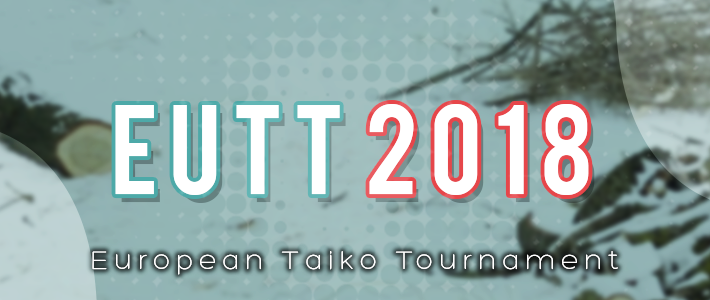

---
tags:
  - EUTT 2018
  - EUTT2018
---

# European Taiko Tournament 2018

The **European Taiko Tournament 2018** (***EUTT 2018***) was a 1v1 European double elimination osu!taiko tournament hosted by ::{ flag=US }:: [Backfire](https://osu.ppy.sh/users/263110). It was the first instalment of the European Taiko Tournament.

## Tournament schedule

| Event | Timestamp |
| --: | :-- |
| Registration phase | 2018-10-08/2018-10-27 |
| Live drawings | 2018-10-28 (13:00 UTC) |
| Round of 32 | 2018-11-03/2018-11-04 |
| Round of 16 | 2018-11-10/2018-11-11 |
| Quarterfinals | 2018-11-17/2018-11-18 |
| Semifinals | 2018-11-24/2018-11-25 |
| Finals | 2018-12-01/2018-12-02 |
| Grand Finals | 2018-12-07/2018-12-09 |

## Prizes

| Placing | Prize(s) |
| :-: | :-- |
|  | 15€, unique profile badge |
|  | 10€ |
|  | 5€ |

## Organisation

The European Taiko Tournament 2018 was run by various osu!taiko community members.

| Position | Member(s) |
| :-- | :-- |
| Manager | ::{ flag=US }:: [Backfire](https://osu.ppy.sh/users/263110), ::{ flag=FR }:: [Kasumii-sama](https://osu.ppy.sh/users/6177263) |
| Mappool selector | ::{ flag=DE }:: [Nepuri](https://osu.ppy.sh/users/6637817), ::{ flag=SE }:: [Raphalge](https://osu.ppy.sh/users/3918650), ::{ flag=US }:: [Backfire](https://osu.ppy.sh/users/263110) |
| Streamer | ::{ flag=DE }:: [Heamburger](https://osu.ppy.sh/users/4705120) |
| Commentator | ::{ flag=SE }:: [Raphalge](https://osu.ppy.sh/users/3918650), ::{ flag=GB }:: [Faithful](https://osu.ppy.sh/users/8283935), ::{ flag=US }:: [Das](https://osu.ppy.sh/users/3165416), ::{ flag=NZ }:: [sparxe](https://osu.ppy.sh/users/5750235), ::{ flag=US }:: [Backfire](https://osu.ppy.sh/users/263110) |
| Designer | ::{ flag=US }:: [Backfire](https://osu.ppy.sh/users/263110), ::{ flag=FI }:: [Micro](https://osu.ppy.sh/users/4801080) |
| Referee | ::{ flag=AU }:: [Cactie](https://osu.ppy.sh/users/5592409), ::{ flag=JP }:: [Briesmas](https://osu.ppy.sh/users/2865172), ::{ flag=US }:: [Backfire](https://osu.ppy.sh/users/263110), ::{ flag=FR }:: [Kasumii-sama](https://osu.ppy.sh/users/6177263) |
| Statistician | ::{ flag=FR }:: [Kasumii-sama](https://osu.ppy.sh/users/6177263) |
| Wiki editor | ::{ flag=ID }:: [fajar13k](https://osu.ppy.sh/users/7100002) |

## Links

- [Discussion thread](https://osu.ppy.sh/community/forums/topics/813769)
- [Livestream](https://www.twitch.tv/osutaikolive)
- [EUTT Discord server](https://discord.gg/5jb2eun)
- [Challonge brackets](https://challonge.com/4lhs6ms)
- **[Statistics sheet](https://docs.google.com/spreadsheets/d/e/2PACX-1vQ70QVoohFSUWL_InYhTzJ-I7kG56EnIcXRfgAGw9ciHVkQSp3JJfDcQHwi8xnbKWnKCWZlbuxsvzaW/pubhtml)**

## Participants

| Seed | Members |
| :-- | :-- |
| Top | ::{ flag=GB }:: [goheegy](https://osu.ppy.sh/users/8057655), ::{ flag=IT }:: [Ikkun](https://osu.ppy.sh/users/1059945), ::{ flag=ES }:: [AlvaroYL](https://osu.ppy.sh/users/6333166), ::{ flag=IT }:: [D3kuu](https://osu.ppy.sh/users/7807444), ::{ flag=TR }:: [frukoyurdakul](https://osu.ppy.sh/users/7612550), ::{ flag=FR }:: [Yona la loutre](https://osu.ppy.sh/users/7930622), ::{ flag=GB }:: [Horiiizon](https://osu.ppy.sh/users/8071438), ::{ flag=PT }:: [BabySnakes](https://osu.ppy.sh/users/4669728) |
| High | ::{ flag=DE }:: [Zetera](https://osu.ppy.sh/users/587737), ::{ flag=UA }:: [Don Omar](https://osu.ppy.sh/users/689414), ::{ flag=PL }:: [Acrith](https://osu.ppy.sh/users/389880), ::{ flag=CH }:: [Oui](https://osu.ppy.sh/users/5538419), ::{ flag=RU }:: [Naninub](https://osu.ppy.sh/users/8188876), ::{ flag=DE }:: [-Leafeon](https://osu.ppy.sh/users/6956922), ::{ flag=DE }:: [lukili846](https://osu.ppy.sh/users/6278008), ::{ flag=DE }:: [jleste](https://osu.ppy.sh/users/8275687) |
| Low | ::{ flag=RU }:: [DayzeekFeed](https://osu.ppy.sh/users/5009970), ::{ flag=GB }:: [Teezel](https://osu.ppy.sh/users/7528639), ::{ flag=GB }:: [Lno](https://osu.ppy.sh/users/1900787), ::{ flag=RU }:: [night\_flower](https://osu.ppy.sh/users/11574707), ::{ flag=GB }:: [Grimbow](https://osu.ppy.sh/users/1387762), ::{ flag=AT }:: [animexamera](https://osu.ppy.sh/users/7511357), ::{ flag=FR }:: [Chernobog](https://osu.ppy.sh/users/3317042), ::{ flag=FR }:: [maximaxiU](https://osu.ppy.sh/users/4069690) |
| Bottom | ::{ flag=PL }:: [\_SC0RP10N](https://osu.ppy.sh/users/9511518), ::{ flag=EE }:: [Kizma](https://osu.ppy.sh/users/8325847), ::{ flag=GB }:: [Ali161102](https://osu.ppy.sh/users/7582420), ::{ flag=PL }:: [Agresywny Arbuz](https://osu.ppy.sh/users/7056658), ::{ flag=SV }:: [\[Carl S\]](https://osu.ppy.sh/users/6230047), ::{ flag=DE }:: [Capu](https://osu.ppy.sh/users/2474015), ::{ flag=GB }:: [ControlPro](https://osu.ppy.sh/users/10633982), ::{ flag=ES }:: [alexinet232](https://osu.ppy.sh/users/5250153) |

## Podium

This competition has come to an end and resulted in the following podium:

| Placing | Player |
| :-: | :-- |
|  | ::{ flag=GB }:: [goheegy](https://osu.ppy.sh/users/8057655) |
|  | ::{ flag=IT }:: [Ikkun](https://osu.ppy.sh/users/1059945) |
|  | ::{ flag=ES }:: [AlvaroYL](https://osu.ppy.sh/users/6333166) |

## Mappools

### Grand Finals

**[Download the mappack here! (102 MB)](https://mega.nz/#!wkdSAQpZ!j7J6phL3sZnuhBOjhWeS9yoVMpfpCA8TiZSP11McLsg)**

- NoMod
  1. [Yuzuki Yukari MAYU - Hurting for a Very Hurtful Pain (cagalin, seiichiz) \[Collab pain\]](https://osu.ppy.sh/beatmapsets/308407#taiko/689693)
  2. [DJ Myosuke - Behemoth (agu) \[Nightmare Oni\]](https://osu.ppy.sh/beatmapsets/879183#taiko/1838648)
  3. [katagiri - Meshimase!! Nyan-Nyan Nightmare (Shallty) \[Nyan Nyan\]](https://osu.ppy.sh/beatmapsets/881574#taiko/1843187)
- NoMod EX
  1. [150P - Nisemono Chuuihou (Zetera) \[Majin Oni\]](https://osu.ppy.sh/beatmapsets/747785#taiko/1575566)
  2. [Cranky - Ran (tasuke912) \[TAIKO-HOLIC\]](https://osu.ppy.sh/beatmapsets/789553#taiko/1656937)
- Hidden
  1. [Rotteen - VEC LEGGENDARIA (TKS) \[Hell Oni\]](https://osu.ppy.sh/beatmapsets/472627#taiko/1009830)
  2. [kamome sano - Prepared Improvisation (tasuke912) \[Oni\]](https://osu.ppy.sh/beatmapsets/556358#taiko/1177487)
- HardRock
  1. [BLUE ENCOUNT - HOPE(Speed Up ver.) (Shallty) \[Hope Oni\]](https://osu.ppy.sh/beatmapsets/747842#taiko/1575675)
  2. [Zekk - Sugary Daydream (TKS) \[Hell Oni\]](https://osu.ppy.sh/beatmapsets/578489#taiko/1224835)
- DoubleTime
  1. [darkbluecat - Recordar (z411 remix) ft. Hatsune Miku (-Kazu-) \[Dysthemia\]](https://osu.ppy.sh/beatmapsets/611904#taiko/1733313)
  2. [Camellia feat. Nanahira - Amor De Verao (Tofu1222) \[Inner Oni\]](https://osu.ppy.sh/beatmapsets/746316#taiko/1573005)
- FreeMod
  1. [Hatsune Miku - Hatsune Miku no Shoushitsu -Gekijouban- (oiu850714) \[Taiko Inner Oni\]](https://osu.ppy.sh/beatmapsets/56778#taiko/171528)
  2. [Reizoko Cj - Dark Side (\_Rise) \[Rising Hatred\]](https://osu.ppy.sh/beatmapsets/503140#taiko/1070638)
  3. [TAROLIN - world.\[NOT\].excuse(nxc); (applerss) \[world.execute(me);\]](https://osu.ppy.sh/beatmapsets/724063#taiko/1528895)
- Tiebreaker
  1. **[RYUWAVE - RECOMPENSE NOIR (applerss) \[Darkness\]](https://osu.ppy.sh/beatmapsets/700876#taiko/1483626)**

### Finals

**[Download the mappack here! (67 MB)](https://mega.nz/#!dkEAHKIS!2CVFumwsaLgc9xcL6qCjFe2LC_zaTCUBbpnYTM9HHHI)**

- NoMod
  1. [The Flashbulb - Lawn Wake IX (yassu-) \[Chaos Oni\]](https://osu.ppy.sh/beatmapsets/662638#taiko/1402653)
  2. [Ennnn - Weyheyhey !! Darling! (rezi888, KitajimaYN) \[Rezi & Yuni's Taiko\]](https://osu.ppy.sh/beatmapsets/814524#taiko/1708066)
  3. [Rainbowdragoneyes - Gods Of War 2007 - 2010 (Nofool) \[Inner Oni\]](https://osu.ppy.sh/beatmapsets/831241#taiko/1741497)
- NoMod EX
  1. [Katagiri - Katagiri (7\_7) \[Katagiri\]](https://osu.ppy.sh/beatmapsets/734434#taiko/1549622)
  2. [Zekk - Swampgator (yyyyyyyyyyypetu) \[Pe'z Extra\]](https://osu.ppy.sh/beatmapsets/760492#taiko/1599424)
- Hidden
  1. [hanacco - Uchiage Hanabi, Doko kara Mirunen w (KitajimaYN) \[KTYN'S LATE FIRE\]](https://osu.ppy.sh/beatmapsets/815747#taiko/1759646)
  2. [Power of Nature - Oriental Mesia (goheegy) \[Oni\]](https://osu.ppy.sh/beatmapsets/760370#taiko/1599190)
- HardRock
  1. [t+pazolite - Muzik Overload (vzk) \[OVERLOAD\]](https://osu.ppy.sh/beatmapsets/703640#taiko/1488655)
  2. [Rotteen - UR Way (Coryn) \[Inner Owoni\]](https://osu.ppy.sh/beatmapsets/819308#taiko/1717773)
- DoubleTime
  1. [sasakure.UK - Atropos (tasuke912) \[Oni\]](https://osu.ppy.sh/beatmapsets/371179#taiko/813293)
  2. [Touno Sakura - PRIZM/CIRCUiT (yassu-) \[Inner Oni\]](https://osu.ppy.sh/beatmapsets/581045#taiko/1230038)
- FreeMod
  1. [Warak - Cosmic Invaders (strickluke, Astolfo) \[Collab Invasion\]](https://osu.ppy.sh/beatmapsets/753366#taiko/1586086)
  2. [Tina Cousins - Hymn (Nightcore Mix) (Aloda) \[Difficulty\]](https://osu.ppy.sh/beatmapsets/696467#taiko/1475287)
  3. [t+pazolite - Electric Butterfly (MetalStream) \[Level 01: A Natural Butterfly\]](https://osu.ppy.sh/beatmapsets/744469#taiko/1569679)
- Tiebreaker
  1. **[Xenon - ?63HiiraossHuikgoeH53? (-Kazu-, -\[ ix Ishida xi \]-) \[?InnerrOnI?\]](https://osu.ppy.sh/beatmapsets/816062#taiko/1711365)**

### Semifinals

**[Download the mappack here! (57 MB)](https://mega.nz/#!E4NDUSjQ!LWW10DnDnIPKeADOaeiQpBs9cA32N8fEfrZgfHa2i_8)**

- NoMod
  1. [Cardboard Box - ++ (Grimbow) \[Grim's N+\]](https://osu.ppy.sh/beatmapsets/572069#taiko/1213129)
  2. [Jin Senbonmatsu - Rock to Infinity (agu) \[Ura Oni\]](https://osu.ppy.sh/beatmapsets/744693#taiko/1570080)
  3. [t+pazolite - Kahatare doki no y waku (Best\_lolicon) \[BLc Oni\]](https://osu.ppy.sh/beatmapsets/815677#taiko/1710664)
- NoMod EX
  1. [Nightmare - Boulafacet (Skull Kid) \[Madness\]](https://osu.ppy.sh/beatmapsets/758439#taiko/1595346)
  2. [Lulickma - Vacuum Cleaner (7\_7) \[Souziki\]](https://osu.ppy.sh/beatmapsets/685280#taiko/1450263)
- Hidden
  1. [Kokomochi - Dainsleif (Osamix) \[Inner Oni\]](https://osu.ppy.sh/beatmapsets/707964#taiko/1496859)
  2. [DOUBLE HELIX - Our Faith (Faithful MTL Remix) (ztrike) \[zt's Inner Oni\]](https://osu.ppy.sh/beatmapsets/592748#taiko/1254160)
- HardRock
  1. [Nato - Yog-Sototh (guro) \[Outer God\]](https://osu.ppy.sh/beatmapsets/704640#taiko/1490596)
  2. [katagiri - Lu\*nya\*cy Act 2017 (HEKUSODASU) \[KUSOni\]](https://osu.ppy.sh/beatmapsets/835131#taiko/1749181)
- DoubleTime
  1. [Eve - Outsider (Raphalge) \[Inner Oni\]](https://osu.ppy.sh/beatmapsets/802114#taiko/1683531)
  2. [Shiron - Lunartic Dial (eterpay) \[Oni\]](https://osu.ppy.sh/beatmapsets/556533#taiko/1178428)
- FreeMod
  1. [AAAA Chazuke - Hop Step Adventure\* (TKS) \[Special\*\]](https://osu.ppy.sh/beatmapsets/466471#taiko/998269)
  2. [Kaneko Chiharu - Yuki Onna (sing216) \[Frozen Oni\]](https://osu.ppy.sh/beatmapsets/650949#taiko/1379236)
  3. [4nzu - Super Jackie (7\_7) \[Oni\]](https://osu.ppy.sh/beatmapsets/757347#taiko/1593257)
- Tiebreaker
  1. **[Kobaryo - Galaxy Friends (tpz Overheat Remix) (7\_7) \[Oni\]](https://osu.ppy.sh/beatmapsets/817306#taiko/1713881)**

### Quarterfinals

**[Download the mappack here! (91 MB)](https://mega.nz/#!448hnILB!CBkDuC8rPC1ZMboTt0eydpzyPZ2R4i-0cEwGl6OhAjo)**

- NoMod
  1. [The Black Dahlia Murder - What a Horrible Night to Have a Curse (xEchoAlertx) \[Simon's Quest\]](https://osu.ppy.sh/beatmapsets/637265#taiko/1352024)
  2. [Nekomata Master - Despair of ELFERIA (Arrival) \[Inner Oni\]](https://osu.ppy.sh/beatmapsets/624568#taiko/1316346)
  3. [Soleily - Silent Rush (MTDex) \[Silence\]](https://osu.ppy.sh/beatmapsets/814550#taiko/1708108)
- NoMod EX
  1. [yadorigi - PoppinCats!! (ztrike) \[Oni\]](https://osu.ppy.sh/beatmapsets/847810#taiko/1772999)
  2. [you - Hold Angel (Nishizumi) \[Inner Oni\]](https://osu.ppy.sh/beatmapsets/381103#taiko/1193146)
- Hidden
  1. [Remo Prototype \[CV: Hanamori Yumiri\] - Sendan Life (newyams99) \[Inner Oni\]](https://osu.ppy.sh/beatmapsets/452098#taiko/969783)
  2. [Chito (CV: Minase Inori), Yuuri (CV: Kubo Yurika) - More One Night (Assertive Hardcore Bootleg) \[long ver.\] (yyyyyyyyyyypetu) \[pet pok Night\]](https://osu.ppy.sh/beatmapsets/738394#taiko/1558347)
- HardRock
  1. [t+pazolite - Sneak Snake (R e i R i, R i n g o) \[Reiri & Ringo's Taiko\]](https://osu.ppy.sh/beatmapsets/304570#taiko/682323)
  2. [MASAKI - Scarlet Lance (ll-oscar) \[ll-taiko\]](https://osu.ppy.sh/beatmapsets/725296#taiko/1531405)
- DoubleTime
  1. [LeaF - Chronostasis (DakeDekaane) \[Oni\]](https://osu.ppy.sh/beatmapsets/193469#taiko/459654)
  2. [Miku Sawai - Colorful.(Asterisk DnB Remix) (Charlotte) \[Oni\]](https://osu.ppy.sh/beatmapsets/672223#taiko/1421041)
- FreeMod
  1. [Rainbowdragoneyes - Thrashbaath (Nofool) \[Inner Oni\]](https://osu.ppy.sh/beatmapsets/660882#taiko/1399261)
  2. [Nekomata Master - Good-Bye Chalon (Saturnalize) \[Kindred\]](https://osu.ppy.sh/beatmapsets/801994#taiko/1683339)
  3. [DJ Shimamura - Blaze it UP! (scumjunk) \[Oni\]](https://osu.ppy.sh/beatmapsets/594809#taiko/1257995)
- Tiebreaker
  1. **[sanj - last minute (sakuraburst remix) (\[Zeth\]) \[the withering existance\]](https://osu.ppy.sh/beatmapsets/835011#taiko/1748990)**

### Round of 16

**[Download the mappack here! (71 MB)](https://mega.nz/#!F90mjIgD!u2mYXJ5oyEWcwnzEYyXOHg0s5y7sfp69AKYYf_2_IOs)**

- NoMod
  1. [ILA - Devil In Wonderland (ZethZ161) \[Adventure!\]](https://osu.ppy.sh/beatmapsets/691057#taiko/1462461)
  2. [Fear, and Loathing in Las Vegas - Scream Hard as You Can (SKSalt) \[Inner Oni\]](https://osu.ppy.sh/beatmapsets/435096#taiko/937321)
  3. [nmk - sola (Ak1o) \[Inner Oni\]](https://osu.ppy.sh/beatmapsets/740805#taiko/1562772)
- NoMod EX
  1. [Croove - BRAIN STORM (Trapmaniac) \[Ura Oni\]](https://osu.ppy.sh/beatmapsets/807990#taiko/1695649)
  2. [C-Show - Invitation from Mr.C (myckoll) \[MyckOni\]](https://osu.ppy.sh/beatmapsets/543554#taiko/1152078)
- Hidden
  1. [BlackY - JEHANNEDARC (komasy) \[INNER ONI\]](https://osu.ppy.sh/beatmapsets/633361#taiko/1344250)
  2. [Chouchou P - White Prism (zkane2) \[Rainbow \[EUTT\]\]](https://puu.sh/BW9eQ/9b094f23bc.osz)
- HardRock
  1. [CyoucyoP feat.Hatsune Miku - End of the World (TKS) \[Inner Oni\]](https://osu.ppy.sh/beatmapsets/215476#taiko/506018)
  2. [USAO - Miracle 5ympho X (Gezoda) \[Gezo's Giga Oni\]](https://osu.ppy.sh/beatmapsets/137394#taiko/486191)
- DoubleTime
  1. [mafumafu - Yume no Mata Yume (newyams99) \[Inner Oni\]](https://osu.ppy.sh/beatmapsets/507212#taiko/1078887)
  2. [ClariS - Connect (Nardoxyribonucleic) \[Oni\]](https://osu.ppy.sh/beatmapsets/539122#taiko/1142412)
- FreeMod
  1. [ginkiha - eastward (yuzu\_\_rinrin) \[Inner Oni\]](https://osu.ppy.sh/beatmapsets/630364#taiko/1332295)
  2. [yumemidoll - Lyrith -Meikyuu Lyrith- (Rhytoly) \[Inner Oni\]](https://osu.ppy.sh/beatmapsets/704195#taiko/1489676)
  3. [Ryu\* - Sakura Mirage (TKS) \[Inner Oni\]](https://osu.ppy.sh/beatmapsets/296406#taiko/665527)
- Tiebreaker
  1. **[SANY-ON - BREAK RAIKORE (Backfire) \[Taikocalypse\]](https://osu.ppy.sh/beatmapsets/307533#taiko/687999)**

### Round of 32

- NoMod
  1. [Kola Kid - Spaceman (Kokatsu) \[Oni\]](https://osu.ppy.sh/beatmapsets/67703#taiko/282927)
  2. [t+pazolite - MEGAMEGA CUTiE BREAKiN'!!!!!!!!z (R i n g o) \[Ringo's Taiko\]](https://osu.ppy.sh/beatmapsets/138797#taiko/346597)
  3. [Jun.A - Shoujo Kisou Kyoku \~ Dream Battle (Consified) \[Elysium\]](https://osu.ppy.sh/beatmapsets/826788#taiko/1732686)
- NoMod EX
  1. [S.S.H - BassTest (Ak1o) \[TEST\]](https://osu.ppy.sh/beatmapsets/666764#taiko/1411059)
  2. [RoughSketch ft. Aikapin & Chiyoko - Hansel and Gretel (Taka030) \[Another Story\]](https://osu.ppy.sh/beatmapsets/758796#taiko/1595992)
- Hidden
  1. [Chito(CV:Minase Inori), Yuuri(CV:Kubo Yurika) - Ugoku Ugoku(YUKIYANAGI Remix) (rezi888) \[Taiko\]](https://osu.ppy.sh/beatmapsets/703805#taiko/1488954)
  2. [Himeringo - Yotsuya-san ni Yoroshiku (OnosakiHito) \[Ono's Taiko Oni\]](https://osu.ppy.sh/beatmapsets/100049#taiko/351995)
- HardRock
  1. [Nekomata Gekidan - AsiaN distractive (TKS) \[Inner Oni\]](https://osu.ppy.sh/beatmapsets/672802#taiko/1422127)
  2. [44teru-k - F.I (lepidopodus) \[lepido! - Taiko Oni\]](https://osu.ppy.sh/beatmapsets/25828#taiko/125530)
- DoubleTime
  1. [senya - Glass-like Psychology (spboxer3) \[Sp3's Taiko\]](https://osu.ppy.sh/beatmapsets/47713#taiko/149128)
  2. [fripSide - black bullet (Nardoxyribonucleic) \[Nardo's Oni\]](https://osu.ppy.sh/beatmapsets/80747#taiko/404232)
- FreeMod
  1. [Sariyajin - Ao no Senritsu (qoot8123) \[qoot8123's Inner Oni\]](https://osu.ppy.sh/beatmapsets/124500#taiko/361867)
  2. [L.E.D.-G - EXUSIA (XK2238) \[XK's Taiko Oni\]](https://osu.ppy.sh/beatmapsets/55040#taiko/196546)
  3. [LindaAI-CUE - Norudon2000 (OnosakiHito) \[Ura Oni\]](https://osu.ppy.sh/beatmapsets/335229#taiko/744297)
- Tiebreaker
  1. **[umio - one leaf (eiri-) \[photosynthesis\]](https://osu.ppy.sh/beatmapsets/825983#taiko/1731215)**

## Match results

### Grand Finals

Friday, 7 December 2018:

| Player 1 |  |  | Player 2 | Match link |
| --: | :-: | :-: | :-- | :-- |
| **Ikkun** ::{ flag=IT }:: | **6** | 3 | ::{ flag=ES }:: AlvaroYL | [#1](https://osu.ppy.sh/community/matches/47942813) |

Sunday, 9 December 2018:

| Player 1 |  |  | Player 2 | Match link |
| --: | :-: | :-: | :-- | :-- |
| **goheegy** ::{ flag=GB }:: | **6** | 0 | ::{ flag=IT }:: Ikkun | [#1](https://osu.ppy.sh/community/matches/47995456) |

### Finals

Saturday, 1 December 2018:

| Player 1 |  |  | Player 2 | Match link |
| --: | :-: | :-: | :-- | :-- |
| **goheegy** ::{ flag=GB }:: | **6** | 2 | ::{ flag=IT }:: Ikkun | [#1](https://osu.ppy.sh/community/matches/47806853) |
| **AlvaroYL** ::{ flag=ES }:: | **6** | 1 | ::{ flag=FR }:: Yona la loutre | [#1](https://osu.ppy.sh/community/matches/47804859) |
| **BabySnakes** ::{ flag=PT }:: | **6** | 1 | ::{ flag=TR }:: frukoyurdakul | [#1](https://osu.ppy.sh/community/matches/47812555) |

Sunday, 2 December 2018:

| Player 1 |  |  | Player 2 | Match link |
| --: | :-: | :-: | :-- | :-- |
| **AlvaroYL** ::{ flag=ES }:: | **6** | 2 | ::{ flag=PT }:: BabySnakes | [#1](https://osu.ppy.sh/community/matches/47838607) |

### Semifinals

Saturday, 24 November 2018:

| Player 1 |  |  | Player 2 | Match link |
| --: | :-: | :-: | :-- | :-- |
| **Yona la loutre** ::{ flag=FR }:: | **5** | 4 | ::{ flag=PL }:: Acrith | [#1](https://osu.ppy.sh/community/matches/47643110) |
| D3kuu ::{ flag=IT }:: | 0 | **5** | ::{ flag=RU }:: **DayzeekFeed** | *win by default* |
| **BabySnakes** ::{ flag=PT }:: | **5** | 0 | ::{ flag=DE }:: Zetera | [#1](https://osu.ppy.sh/community/matches/47647975) |
| **Horiiizon** ::{ flag=GB }:: | **5** | 0 | ::{ flag=GB }:: Lno | *win by default* |

Sunday, 25 November 2018:

| Player 1 |  |  | Player 2 | Match link |
| --: | :-: | :-: | :-- | :-- |
| **Yona la loutre** ::{ flag=FR }:: | **5** | 3 | ::{ flag=RU }:: DayzeekFeed | [#1](https://osu.ppy.sh/community/matches/47673741) |
| frukoyurdakul ::{ flag=TR }:: | 4 | **5** | ::{ flag=GB }:: **goheegy** | [#1](https://osu.ppy.sh/community/matches/47676655) |
| **Ikkun** ::{ flag=IT }:: | **5** | 3 | ::{ flag=ES }:: AlvaroYL | [#1](https://osu.ppy.sh/community/matches/47678634) |
| BabySnakes ::{ flag=PT }:: | **5** | 1 | ::{ flag=GB }:: Horiiizon | [#1](https://osu.ppy.sh/community/matches/47682738) |

### Quarterfinals

Saturday, 17 November 2018:

| Player 1 |  |  | Player 2 | Match link |
| --: | :-: | :-: | :-- | :-- |
| Yona la loutre ::{ flag=FR }:: | 0 | **5** | ::{ flag=GB }:: **goheegy** | *win by default* |
| Horiiizon ::{ flag=GB }:: | 1 | **5** | ::{ flag=IT }:: **Ikkun** | [#1](https://osu.ppy.sh/community/matches/47489874) |
| **lukili846** ::{ flag=DE }:: | **5** | 0 | ::{ flag=AT }:: animexamera | [#1](https://osu.ppy.sh/community/matches/47496896) |
| **Acrith** ::{ flag=PL }:: | **5** | 4 | ::{ flag=RU }:: Naninub | [#1](https://osu.ppy.sh/community/matches/47492274) |
| Oui ::{ flag=CH }:: | 0 | 0 | ::{ flag=GB }:: Teezel | *nullified* |
| **DayzeekFeed** ::{ flag=RU }:: | **5** | 0 | ::{ flag=FR }:: Chernobog | [#1](https://osu.ppy.sh/community/matches/47497153) |
| Don Omar ::{ flag=UA }:: | 0 | **5** | ::{ flag=PL }:: **\_SC0RP10N** | *win by default* |
| **Lno** ::{ flag=GB }:: | **5** | 1 | ::{ flag=GB }:: Grimbow | [#1](https://osu.ppy.sh/community/matches/47493556) |
| **-Leafeon** ::{ flag=DE }:: | **5** | 3 | ::{ flag=RU }:: night\_flower | [#1](https://osu.ppy.sh/community/matches/47493638) |

Sunday, 18 November 2018:

| Player 1 |  |  | Player 2 | Match link |
| --: | :-: | :-: | :-- | :-- |
| D3kuu ::{ flag=IT }:: | 2 | **5** | ::{ flag=TR }:: **frukoyurdakul** | [#1](https://osu.ppy.sh/community/matches/47520607) |
| BabySnakes ::{ flag=PT }:: | 4 | **5** | ::{ flag=ES }:: **AlvaroYL** | [#1](https://osu.ppy.sh/community/matches/47521716) |
| **Zetera** ::{ flag=DE }:: | **5** | 0 | ::{ flag=FR }:: maximaxiU | [#1](https://osu.ppy.sh/community/matches/47517887) |
| **lukili846** ::{ flag=DE }:: | **5** | 1 | ::{ flag=PL }:: Acrith | [#1](https://osu.ppy.sh/community/matches/47525243) |
| Oui ::{ flag=CH }:: | 0 | **5** | ::{ flag=RU }:: **DayzeekFeed** | *win by default* |
| \_SC0RP10N ::{ flag=PL }:: | 1 | **5** | ::{ flag=DE }:: **Zetera** | [#1](https://osu.ppy.sh/community/matches/47519362) |
| **Lno** ::{ flag=GB }:: | **5** | 4 | ::{ flag=DE }:: -Leafeon | [#1](https://osu.ppy.sh/community/matches/47520619) |

### Round of 16

Saturday, 10 November 2018:

| Player 1 |  |  | Player 2 | Match link |
| --: | :-: | :-: | :-- | :-- |
| **D3kuu** ::{ flag=IT }:: | **4** | 0 | ::{ flag=DE }:: -Leafeon | [#1](https://osu.ppy.sh/community/matches/47332883) |
| **frukoyurdakul** ::{ flag=TR }:: | **4** | 0 | ::{ flag=GB }:: Lno | *win by default* |
| **Yona la loutre** ::{ flag=FR }:: | **4** | 3 | ::{ flag=DE }:: Zetera | [#1](https://osu.ppy.sh/community/matches/47327934) |
| **goheegy** ::{ flag=GB }:: | **4** | 0 | ::{ flag=UA }:: Don Omar | *win by default* |
| **Horiiizon** ::{ flag=GB }:: | **4** | 0 | ::{ flag=RU }:: DayzeekFeed | [#1](https://osu.ppy.sh/community/matches/47334956) |
| **Ikkun** ::{ flag=IT }:: | **4** | 0 | ::{ flag=CH }:: Oui | [#1](https://osu.ppy.sh/community/matches/47336823) |
| **BabySnakes** ::{ flag=PT }:: | **4** | 2 | ::{ flag=PL }:: Acrith | [#1](https://osu.ppy.sh/community/matches/47329721) |
| Agresywny Arbuz ::{ flag=PL }:: | 2 | **4** | ::{ flag=AT }:: **animexamera** | [#1](https://osu.ppy.sh/community/matches/47331263) |
| \[Carl S\] ::{ flag=SV }:: | 0 | **4** | ::{ flag=RU }:: **Naninub** | *win by default* |
| Kizma ::{ flag=EE }:: | 1 | **4** | ::{ flag=GB }:: **Teezel** | [#1](https://osu.ppy.sh/community/matches/47325581) |
| Ali161102 ::{ flag=GB }:: | 1 | **4** | ::{ flag=FR }:: **Chernobog** | [#1](https://osu.ppy.sh/community/matches/47336910) |
| **\_SC0RP10N** ::{ flag=PL }:: | **4** | 0 | ::{ flag=DE }:: jleste | *win by default* |
| Capu ::{ flag=DE }:: | 0 | **4** | ::{ flag=FR }:: **maximaxiU** | [#1](https://osu.ppy.sh/community/matches/47329509) |
| alexinet232 ::{ flag=ES }:: | 0 | **4** | ::{ flag=GB }:: Grimbow | [#1](https://osu.ppy.sh/community/matches/47331393) |
| ControlPro ::{ flag=GB }:: | 1 | **4** | ::{ flag=RU }:: night\_flower | [#1](https://osu.ppy.sh/community/matches/47332907) |

Sunday, 11 November 2018:

| Player 1 |  |  | Player 2 | Match link |
| --: | :-: | :-: | :-- | :-- |
| **AlvaroYL** ::{ flag=ES }:: | **4** | 0 | ::{ flag=DE }:: lukili846 | [#1](https://osu.ppy.sh/community/matches/47356264) |

### Round of 32

Saturday, 3 November 2018:

| Player 1 |  |  | Player 2 | Match link |
| --: | :-: | :-: | :-- | :-- |
| **D3kuu** ::{ flag=IT }:: | **4** | 0 | ::{ flag=PL }:: Agresywny Arbuz | [#1](https://osu.ppy.sh/community/matches/47173837) |
| animexamera ::{ flag=AT }:: | 0 | **4** | ::{ flag=DE }:: **-Leafeon** | [#1](https://osu.ppy.sh/community/matches/47183611) |
| frukoyurdakul ::{ flag=TR }:: | 0 | 0 | ::{ flag=SV }:: \[Carl S\] | *nullified* |
| **Lno** ::{ flag=GB }:: | **4** | 2 | ::{ flag=RU }:: Naninub | [#1](https://osu.ppy.sh/community/matches/47176732) |
| **Yona la loutre** ::{ flag=FR }:: | **4** | 0 | ::{ flag=EE }:: Kizma | [#1](https://osu.ppy.sh/community/matches/47178332) |
| **Zetera** ::{ flag=DE }:: | **4** | 0 | ::{ flag=GB }:: Teezel | [#1](https://osu.ppy.sh/community/matches/47182397) |
| **goheegy** ::{ flag=GB }:: | **4** | 0 | ::{ flag=GB }:: Ali161102 | [#1](https://osu.ppy.sh/community/matches/47173854) |
| **Don Omar** ::{ flag=UA }:: | **4** | 2 | ::{ flag=FR }:: Chernobog | [#1](https://osu.ppy.sh/community/matches/47175042) |

Sunday, 4 November 2018:

| Player 1 |  |  | Player 2 | Match link |
| --: | :-: | :-: | :-- | :-- |
| **Horiiizon** ::{ flag=GB }:: | **4** | 0 | ::{ flag=PL }:: \_SC0RP10N | [#1](https://osu.ppy.sh/community/matches/47204200) |
| jleste ::{ flag=DE }:: | 1 | **4** | ::{ flag=RU }:: **DayzeekFeed** | [#1](https://osu.ppy.sh/community/matches/47205657) |
| Capu ::{ flag=DE }:: | 0 | **4** | ::{ flag=IT }:: **Ikkun** | [#1](https://osu.ppy.sh/community/matches/47206847) |
| **Oui** ::{ flag=CH }:: | **4** | 0 | ::{ flag=FR }:: maximaxiU | [#1](https://osu.ppy.sh/community/matches/47208185) |
| **BabySnakes** ::{ flag=PT }:: | **4** | 0 | ::{ flag=ES }:: alexinet232 | [#1](https://osu.ppy.sh/community/matches/47209702) |
| **Acrith** ::{ flag=PL }:: | **4** | 0 | ::{ flag=GB }:: Grimbow | *win by default* |
| **AlvaroYL** ::{ flag=ES }:: | **4** | 0 | ::{ flag=GB }:: ControlPro | [#1](https://osu.ppy.sh/community/matches/47213001) |
| **lukili846** ::{ flag=DE }:: | **4** | 0 | ::{ flag=RU }:: night\_flower | [#1](https://osu.ppy.sh/community/matches/47214217) |

## Ruleset

1. Only Players with a **European** or **Eurasian** flag on their account are allowed to register in this tournament.
2. Group Stage matches are seeded based on global rank at time of registration submission.
3. EUTT will have a double elimination structure with a loser bracket.
4. EUTT matches will be 1v1 Taiko in team style format with a point given to the highest score achieved in the **Score V2** system.
5. The win conditions for each stage are as follows.
   - In Round of 32 and Round of 16, it is Bo7: First to win 4 maps wins.
   - In Quarterfinals and Semifinals, it is Bo9: First to win 5 maps wins.
   - In Finals and Grand Finals, it is Bo11: First to win 6 maps wins.
6. **Score V2** will be used.
7. Map pools will contain 5 NoMod (3+2 EX), 2 HD, 2 HR, 2 DT, 3 FM, and 1 Tiebreaker.
8. Players must have at least 1 mod activated during the FreeMod pool.
9. You are allowed 1 map ban per match, this does not include the Tiebreaker.
10. Each player can choose to play up to 1 warm-up map. A warm-up must be shorter than 4 minutes. If both players agree to one warm-up, the duration must be shorter than 6 minutes.
11. `!roll` is used to determine who will get the first pick and the first ban. The winner of `!roll` will select the first map, whereas the loser will ban the first map.
12. Tiebreaker will be played if both players are 1 point away from winning. It will not be FreeMod.
13. In cases where a map results in a tie, the map is nullified and the Player who picked said map will pick another. (If the tiebreaker ends in a draw, the tiebreaker will be replayed under FM condition.)
14. If no staff or referee is available, the match will be postponed.
15. Players will have up to 15 minutes after the scheduled time to show up. Failure to show up without prior notice will result in a win by default.
16. Any modification of these rules will be announced.
