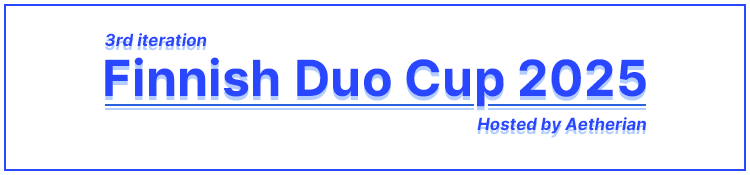

---
tags:
  - FDC2025
  - FDC
---

# Finnish Duo Cup 2025

The **Finnish Duo Cup 2025** (**FDC2025**) was a 2v2 double-elimination osu! tournament hosted by ::{ flag=FI }:: [Aetherian](https://osu.ppy.sh/users/6263040). The tournament required at least one of the players in each team to be from ::{ flag=FI }:: Finland or ::{ flag=AX }:: Åland. It was the third instalment of the Finnish Duo Cup.

## Tournament schedule

| Event | Timestamp |
| --: | :-- |
| Registration phase | 2024-12-12/2024-12-31 (18:00 UTC) |
| Qualifiers | 2025-01-11/2025-01-12 |
| Round of 32 | 2025-01-18/2025-01-19 |
| Round of 16 | 2025-01-25/2025-01-26 |
| Quarterfinals | 2025-02-01/2025-02-02 |
| Semifinals | 2025-02-08/2025-02-09 |
| Finals | 2025-02-15/2025-02-16 |
| Grand Finals | 2025-02-22/2025-02-23 |

## Prizes

| Placing | Prize(s) |
| :-: | :-- |
|  | Profile badge, profile banner |
|  | Profile banner |
|  | Profile banner |

## Organisation

The Finnish Duo Cup 2025 was run by various community members.

| Position | Member(s) |
| :-- | :-- |
| Host | ::{ flag=FI }:: [Aetherian](https://osu.ppy.sh/users/6263040) |
| Mappool selector | ::{ flag=FI }:: [Aetherian](https://osu.ppy.sh/users/6263040), ::{ flag=NL }:: [nik](https://osu.ppy.sh/users/10077264) |
| Mapper | ::{ flag=NL }:: [nik](https://osu.ppy.sh/users/10077264) |
| Mappool playtester | ::{ flag=FI }:: [yimi](https://osu.ppy.sh/users/12047944), ::{ flag=SE }:: [scylla](https://osu.ppy.sh/users/9405745), ::{ flag=US }:: [JoshuaGC](https://osu.ppy.sh/users/17636394), ::{ flag=DE }:: [Ezius](https://osu.ppy.sh/users/1861823), ::{ flag=FI }:: [nikulix](https://osu.ppy.sh/users/16502415), ::{ flag=DE }:: [KSN](https://osu.ppy.sh/users/5442251) |
| Streamer | ::{ flag=FI }:: [Aetherian](https://osu.ppy.sh/users/6263040), ::{ flag=FI }:: [shdewz](https://osu.ppy.sh/users/10000899), ::{ flag=RU }:: [RobotSkin\_](https://osu.ppy.sh/users/13820038) |
| Commentator | ::{ flag=FI }:: [Amasetic](https://osu.ppy.sh/users/11375251), ::{ flag=FI }:: [Nev-](https://osu.ppy.sh/users/11836334), ::{ flag=FI }:: [Roba](https://osu.ppy.sh/users/5210561), ::{ flag=FI }:: [house](https://osu.ppy.sh/users/15242810), ::{ flag=FI }:: [Marjus](https://osu.ppy.sh/users/10463344), ::{ flag=FI }:: [Mike Tyson](https://osu.ppy.sh/users/14764185), ::{ flag=ID }:: [BlankTap](https://osu.ppy.sh/users/10137131) |
| Designer | ::{ flag=FI }:: [Aetherian](https://osu.ppy.sh/users/6263040), ::{ flag=BG }:: [Lumeiii](https://osu.ppy.sh/users/24590750) |
| Referee | ::{ flag=FI }:: [Aetherian](https://osu.ppy.sh/users/6263040), ::{ flag=CL }:: [Isita](https://osu.ppy.sh/users/13973026), ::{ flag=FI }:: [AnjoK](https://osu.ppy.sh/users/9220667), ::{ flag=FI }:: [Laurakko](https://osu.ppy.sh/users/7253731), ::{ flag=DE }:: [Beuto](https://osu.ppy.sh/users/15115857), ::{ flag=RU }:: [RobotSkin\_](https://osu.ppy.sh/users/13820038), ::{ flag=DE }:: [TheHunter1](https://osu.ppy.sh/users/6496016), ::{ flag=FI }:: [nikulix](https://osu.ppy.sh/users/16502415) |

## Links

- **[Information spreadsheet](https://docs.google.com/spreadsheets/d/1cxQhtzad4zdV6etgEOMr5YopK6ZYdEt7WS8to_A40gY/edit?usp=sharing)**
- [Discussion thread](https://osu.ppy.sh/community/forums/topics/2014182?n=1)
- [Livestream](https://www.twitch.tv/aetherian_tournaments)
- [Challonge bracket](https://challonge.com/fdc2025)
- [Discord server](https://discord.gg/SagCfnzEvM)

## Participants

| Team | Members |
| :-: | :-- |
| oddloop | ::{ flag=FI }:: **[Kalanluu](https://osu.ppy.sh/users/2035254)**, ::{ flag=PL }:: [MALIZEWSKI](https://osu.ppy.sh/users/12408961) |
| carrot fields | ::{ flag=FI }:: **[Amasetic](https://osu.ppy.sh/users/11375251)**, ::{ flag=RU }:: [steisha](https://osu.ppy.sh/users/13951894) |
| bunny party | ::{ flag=FI }:: **[Eevert](https://osu.ppy.sh/users/12080544)**, ::{ flag=KR }:: [Amamya Kokoro](https://osu.ppy.sh/users/2511839) |
| terence | ::{ flag=FI }:: **[house](https://osu.ppy.sh/users/15242810)**, ::{ flag=NO }:: [NINERIK](https://osu.ppy.sh/users/10549880) |
| skibidi vessa | ::{ flag=PL }:: **[kiir0chii](https://osu.ppy.sh/users/9322480)**, ::{ flag=FI }:: [AllyrD](https://osu.ppy.sh/users/9561644) |
| Melon Boys | ::{ flag=FI }:: **[Isak-](https://osu.ppy.sh/users/8702650)**, ::{ flag=DK }:: [Sobu-](https://osu.ppy.sh/users/13872272) |
| Gorillamode | ::{ flag=FI }:: **[Marjus](https://osu.ppy.sh/users/10463344)**, ::{ flag=PH }:: [zonelouise](https://osu.ppy.sh/users/1492995) |
| mä rakastan sua | ::{ flag=FI }:: **[OhLivi](https://osu.ppy.sh/users/10762467)**, ::{ flag=SA }:: [3BDOOO](https://osu.ppy.sh/users/22461441) |
| might miss a match | ::{ flag=FI }:: **[Tabletti](https://osu.ppy.sh/users/9523661)**, ::{ flag=RO }:: [origin\_](https://osu.ppy.sh/users/15095811) |
| Karjalanpiirakka | ::{ flag=FI }:: **[savilju](https://osu.ppy.sh/users/8059468)**, ::{ flag=FI }:: [apisedo](https://osu.ppy.sh/users/11048151) |
| ballers will ball | ::{ flag=FI }:: **[shdewz](https://osu.ppy.sh/users/10000899)**, ::{ flag=US }:: [LightsOut](https://osu.ppy.sh/users/8581210) |
| Meow & Myouow :3 | ::{ flag=FI }:: **[juujep](https://osu.ppy.sh/users/12031584)**, ::{ flag=GB }:: [HAUNTE](https://osu.ppy.sh/users/7333471) |
| NATION | ::{ flag=FI }:: **[Nev-](https://osu.ppy.sh/users/11836334)**, ::{ flag=FI }:: [nemq](https://osu.ppy.sh/users/11644972) |
| Galaxy Destroyers | ::{ flag=FI }:: **[Mike Tyson](https://osu.ppy.sh/users/14764185)**, ::{ flag=SG }:: [qstronaut](https://osu.ppy.sh/users/10958852) |
| Suklaapallit | ::{ flag=RU }:: **[Endura](https://osu.ppy.sh/users/7774197)**, ::{ flag=FI }:: [Juska](https://osu.ppy.sh/users/12931502) |
| São Paulo | ::{ flag=BR }:: **[Kyulke](https://osu.ppy.sh/users/12620242)**, ::{ flag=FI }:: [Mayuri](https://osu.ppy.sh/users/18688473) |
| NO CLUE! | ::{ flag=FI }:: **[mind blowing](https://osu.ppy.sh/users/22396092)**, ::{ flag=US }:: [EthantrixV2](https://osu.ppy.sh/users/10634348) |
| Airline food | ::{ flag=FI }:: **[Roba](https://osu.ppy.sh/users/5210561)**, ::{ flag=CA }:: [D I O](https://osu.ppy.sh/users/3958619) |
| happy new year | ::{ flag=FI }:: **[-cyber](https://osu.ppy.sh/users/20132305)**, ::{ flag=AU }:: [5ixty](https://osu.ppy.sh/users/18321104) |
| 4444 | ::{ flag=FI }:: **[tkilele](https://osu.ppy.sh/users/9114796)**, ::{ flag=PL }:: [227](https://osu.ppy.sh/users/3741162) |
| bouquet | ::{ flag=FI }:: **[Aconite](https://osu.ppy.sh/users/15242660)**, ::{ flag=FI }:: [Shylily](https://osu.ppy.sh/users/20770163) |
| Anttola honor | ::{ flag=FI }:: **[makkara](https://osu.ppy.sh/users/19563871)**, ::{ flag=FI }:: [Naapuri](https://osu.ppy.sh/users/11706246) |
| drillaz | ::{ flag=FI }:: **[Wokki](https://osu.ppy.sh/users/15532703)**, ::{ flag=PL }:: [HopeRaven](https://osu.ppy.sh/users/8158905) |
| Schizo rizzzlers | ::{ flag=FI }:: **[NoTablet](https://osu.ppy.sh/users/10967148)**, ::{ flag=FI }:: [beea66](https://osu.ppy.sh/users/10708428) |
| No title | ::{ flag=FI }:: **[sph3re](https://osu.ppy.sh/users/21073465)**, ::{ flag=PL }:: [mouseANDtablet](https://osu.ppy.sh/users/22922042) |
| Mandelbrot set | ::{ flag=FI }:: **[Jokupoika24](https://osu.ppy.sh/users/17782643)**, ::{ flag=FI }:: [System Sun](https://osu.ppy.sh/users/3163106) |
| Lil bros | ::{ flag=FI }:: **[ImTK](https://osu.ppy.sh/users/11506206)**, ::{ flag=FI }:: [OG_PannuLappu](https://osu.ppy.sh/users/7295343) |

## Podium

This competition has come to an end and resulted in the following podium:

| Placing | Team |
| :-: | :-- |
|  | **oddloop** (::{ flag=FI }:: [Kalanluu](https://osu.ppy.sh/users/2035254), ::{ flag=PL }:: [MALISZEWSKI](https://osu.ppy.sh/users/12408961)) |
|  | **bunny party** (::{ flag=FI }:: [Eevert](https://osu.ppy.sh/users/12080544), ::{ flag=KR }:: [Amamya Kokoro](https://osu.ppy.sh/users/2511839)) |
|  | **terence** (::{ flag=FI }:: [house](https://osu.ppy.sh/users/15242810), ::{ flag=NO }:: [NINERIK](https://osu.ppy.sh/users/10549880)) |

## Mappools

### Grand Finals

**[Download the mappack here! (206 MB)](https://drive.google.com/file/d/1b1bOrRfA6KdWRS1n5-K14Wkk8kQr2Z7n/view?usp=drive_link)**

- No Mod
  1. [MY FIRST STORY feat. chelly (EGOIST) - 1,000,000 TIMES (Mistelse) [Over Again]](https://osu.ppy.sh/beatmapsets/1326561#osu/2748274)
  2. [CYLTIE. - Aphrodite (knowledgeking) [Aphrodisiac]](https://osu.ppy.sh/beatmapsets/1703758#osu/3481302)
  3. [Children Of Bodom - Tie My Rope (Mazzerin) [LMT's Expert]](https://osu.ppy.sh/beatmapsets/1073487#osu/2282368)
  4. [kanemiko - Electrolytes (captin1) [Isotonic]](https://osu.ppy.sh/beatmapsets/1575611#osu/3216836)
  5. [Eguchi Takahiro - silver temple (DeviousPanda) [mirage (ar6 edit)]](https://osu.ppy.sh/beatmapsets/1813873#osu/4100718)
- Hidden
  1. [Unlucky Morpheus - Dead Leaves Rising (IsomirDiAngelo) [Rakugo AR9.6]](https://osu.ppy.sh/beatmapsets/2032352#osu/4813310)
  2. [Camellia feat. Ninomae Ina'nis - Drenched in Air (R3m) [Ocean of Eternity]](https://osu.ppy.sh/beatmapsets/1968798#osu/4083586)
  3. [Isekaijoucho - Replica (Live Ver.) (Raijodo) [tkfkdgo]](https://osu.ppy.sh/beatmapsets/2095125#osu/4392963)
- Hard Rock
  1. [sokoninaru - saitei (AirinCat) [extreme]](https://osu.ppy.sh/beatmapsets/1883924#osu/3878798)
  2. [Zekk & poplavor - Gloomy Flash feat. mami (xLolicore-) [Illumination]](https://osu.ppy.sh/beatmapsets/1701910#osu/3477562)
  3. [KARUT - Glitch Street (Tycani) [Fallen Eden (Circle Circuit Championships Ver.)]](https://osu.ppy.sh/beatmapsets/1854718#osu/3811238)
- Double Time
  1. [Mazare & Philip Strand - Battlecry (Mako) [Fervor of Battle]](https://osu.ppy.sh/beatmapsets/1167000#osu/2434310)
  2. [Christina Vee - Caramelldansen (ft. RichaadEB) (xidorn) [forsta era tangentborden]](https://osu.ppy.sh/beatmapsets/2101527#osu/4408741)
  3. [BlackYooh vs. siromaru - BLACK or WHITE? (BluOxy) [INFINITE]](https://osu.ppy.sh/beatmapsets/248876#osu/637477)
  4. [CLIFF EDGE feat. Nakamura Maiko - The Distance (handsome) [Master]](https://osu.ppy.sh/beatmapsets/580375#osu/1228840)
- Free Mod
  1. [Reol - Gigantic O.T.N (sparhten) [Climax]](https://osu.ppy.sh/beatmapsets/1276362#osu/2651849)
  2. [Rings Of Saturn - Lalassu Xul (Val) [KurtZenN's Extreme]](https://osu.ppy.sh/beatmapsets/1560427#osu/3677314)
  3. [Down - DeviousPanda (Down) [Extra]](https://osu.ppy.sh/beatmapsets/1789325#osu/3666374)
  4. [wowaka - World's End Dancehall (Deppyforce) [Yokes' Expert]](https://osu.ppy.sh/beatmapsets/1737165#osu/3727749)
- Tiebreaker
  1. **[Ludicin - Echoes of Memoria (hehe) [Hypermnesia]](https://osu.ppy.sh/beatmapsets/2214238#osu/4691422)**

### Finals

**[Download the mappack here! (166 MB)](https://drive.google.com/file/d/1dUFMIKkF7kScuEhEZoKi5vd3XjN_BjYo/view?usp=drive_link)**

- No Mod
  1. [[Kyoro] - Mochio- (Snow Note) [Extreme]](https://osu.ppy.sh/beatmapsets/1473006#osu/3076104)
  2. [Starkill - Until We Fall (Roupus) [Suppression]](https://osu.ppy.sh/beatmapsets/1956762#osu/4053606)
  3. [ASCA - Real Dawn (Petal) [Brilliance]](https://osu.ppy.sh/beatmapsets/2258353#osu/4805574)
  4. [seatrus - ILLEGAL LEGACY (Halgoh) [Halgoh x Sharu]](https://osu.ppy.sh/beatmapsets/1633224#osu/3333703)
  5. [-45 - Reishiki (-45) [YaMaDarknesss' ultra]](https://osu.ppy.sh/beatmapsets/1557323#osu/3712677)
- Hidden
  1. [Fractal Dreamers - Ad Astra (Icekalt) [Starfall]](https://osu.ppy.sh/beatmapsets/1799382#osu/3688687)
  2. [rerulili feat. Hatsune Miku & GUMI - Noushou Sakuretsu Girl (dkblaze) [Matha & dkblaze's Sweet Macaron]](https://osu.ppy.sh/beatmapsets/2276936#osu/4852482)
  3. [Daisuke Ohnuma - Hong Kong Isao Great Whirlwind (PaRaDogi) [Welcome to HK]](https://osu.ppy.sh/beatmapsets/1466660#osu/3012004)
- Hard Rock
  1. [cosMo@BousouP - Boku Ha Kuuki Ga Yomenai ft. GUMI (BarkingMadDog) [Extreme]](https://osu.ppy.sh/beatmapsets/984932#osu/2060791)
  2. [Laur - Swift Swing (from maimai) (OKSY) [PIANO DANCE]](https://osu.ppy.sh/beatmapsets/1794634#osu/3678428)
  3. [Towa Tei with Sheena Ringo - APPLE (fanzhen0019) [PaRaDogi's Expert]](https://osu.ppy.sh/beatmapsets/1851719#osu/3941000)
- Double Time
  1. [Jager - I Won't Fall Apart (Vell) [Insane]](https://osu.ppy.sh/beatmapsets/497154#osu/1058295)
  2. [senya - Shunkan Everlasting (Satellite) [Lunatic]](https://osu.ppy.sh/beatmapsets/1981457#osu/4114463)
  3. [cosMo@BousouP feat. Hatsune Miku - Zero kara Eien e no Choudou (P A N) [Insane]](https://osu.ppy.sh/beatmapsets/1718717#osu/3514231)
  4. [android52 - Platinum Groove (Sinnoh) [Extra Extra Extra Extra]](https://osu.ppy.sh/beatmapsets/848144#osu/1863918)
- Free Mod
  1. [Yooh - Destroy -agitato- (Realazy) [Extreme]](https://osu.ppy.sh/beatmapsets/839273#osu/1756964)
  2. [FLESHGOD APOCALYPSE - The Fool / Thru Our Scars (Fenza) [The Fool]](https://osu.ppy.sh/beatmapsets/418316#osu/1177658)
  3. [Rin - Kishinjou set 03 ~ Humans and Youkai Traversing the Canal (yaspo) [hasplasho's Human x Youkai CoLunatic]](https://osu.ppy.sh/beatmapsets/1799358#osu/3688644)
  4. [dandeless - micro.wav (yaspo) [USA Tryouts]](https://osu.ppy.sh/beatmapsets/1499766#osu/3198204)
- Tiebreaker
  1. **[HyuN - Duplicity Shade (feat. Sennzai) (Down) [Salvation]](https://osu.ppy.sh/beatmapsets/1708718#osu/3491545)**

### Semifinals

**[Download the mappack here! (154 MB)](https://drive.google.com/file/d/1fO3Ypq_yRMgj3hWq6qrT1XEJZdx6qG6W/view?usp=drive_link)**

- No Mod
  1. [Cranky - Bestrafung (Icekalt) [Folter]](https://osu.ppy.sh/beatmapsets/1633283#osu/3333793)
  2. [Rhapsody of Fire - Chains of Destiny (me2u) [Enemy Truth]](https://osu.ppy.sh/beatmapsets/1970703#osu/4088922)
  3. [Mio Yamazaki - Byoushin Zenkai Girl (Sparhten) [Keep Going Forward]](https://osu.ppy.sh/beatmapsets/1402550#osu/2893305)
  4. [tn-shi - Synthesis. (Kiarah) [Acceleration]](https://osu.ppy.sh/beatmapsets/2257478#osu/4951941)
  5. [pm04034 - sn4pside (Down) [4nother]](https://osu.ppy.sh/beatmapsets/2028838#osu/4227623)
- Hidden
  1. [Inaba Kumori - NON-USE (Nelitory) [Readingless AR9]](https://osu.ppy.sh/beatmapsets/1411244#osu/2909941)
  2. [ikaruga_nex - gigadelic (m3rkAb4# R3m!x) (Shurelia) [crystal's ExtR3m3]](https://osu.ppy.sh/beatmapsets/2234473#osu/4877160)
  3. [Kairiki bear feat. Hatsune Miku - Yamiaka Steroid (vetoed) [Ix's Extra]](https://osu.ppy.sh/beatmapsets/2274939#osu/4856577)
- Hard Rock
  1. [Renard - Terminal (nold_1702) [EXTRA]](https://osu.ppy.sh/beatmapsets/102282#osu/270490)
  2. [Sakuzyo - FAFNIR (Sulfur) [-kevincela-'s Extreme]](https://osu.ppy.sh/beatmapsets/777255#osu/1634515)
  3. [BEMANI Sound Team "Nekomata Master" - Painful Fate (Down) [Cub's Extra]](https://osu.ppy.sh/beatmapsets/1193072#osu/2486379)
- Double Time
  1. [Toyosaki Aki - Diamond (Fycho) [Insane]](https://osu.ppy.sh/beatmapsets/111760#osu/290581)
  2. [cygnus - Violet SunLight (Sanch-KK) [Insane]](https://osu.ppy.sh/beatmapsets/2152760#osu/4545563)
  3. [cosMo@BousouP - 25-ji 76-pun Hatsu \<\<Ryouiki Gai\>\> Iki Saishuu Ressha (Sagon) [Insane]](https://osu.ppy.sh/beatmapsets/1807738#osu/3741963)
  4. [Faun - Tanz mit mir (kwk) [Cute Russian Song]](https://osu.ppy.sh/beatmapsets/802989#osu/1685542)
- Free Mod
  1. [Falcom Sound Team jdk - Don't be Defeated by a Friend! (Deca) [Lionheart]](https://osu.ppy.sh/beatmapsets/1557286#osu/3181298)
  2. [69 de 74 - DESPERATE DEATHPARADE (rollpan) [EXTRA]](https://osu.ppy.sh/beatmapsets/1939881#osu/4010877)
  3. [96neko - Buriki no Dance (CallieCube) [Tango Sugar Free]](https://osu.ppy.sh/beatmapsets/1332410#osu/4228080)
  4. [beatMARIO - Night of Knights (Anxient) [TRUE 2009 STAGE]](https://osu.ppy.sh/beatmapsets/530702#osu/1125657)
- Tiebreaker
  1. **[Asatsumei ft. L4hee - Tenshi no Kikyou (iljaaz) [Spectrum]](https://osu.ppy.sh/beatmapsets/2278590#osu/4856643)**

### Quarterfinals

**[Download the mappack here! (129 MB)](https://drive.google.com/file/d/1Yh8mBkHj8S3tmDwBv1xdl3CO0xTlYaXm/view?usp=drive_link)**

- No Mod
  1. [1.Kla$ & Czar - Tvoyu mat' (kuyusu) [:urmom:]](https://osu.ppy.sh/beatmapsets/1838278#osu/3774858)
  2. [wowaka - Ura-Omote Lovers feat. Hatsune Miku (gazimal) [Limitless]](https://osu.ppy.sh/beatmapsets/1872527#osu/3853099)
  3. [SEPHID feat. darkxixin - Fu Xiang Di Xin De Luo Ri Liu Hao ~ Little Raven (Realazy) [Solar Flare]](https://osu.ppy.sh/beatmapsets/1173187#osu/2446824)
  4. [Minstrel - Yotogibanashi no Kamikakushi (Luscent) [Heilia's Boundary Manipulating Extra]](https://osu.ppy.sh/beatmapsets/1907639#osu/4017109)
  5. [Junk - Qualia (P_O) [Special]](https://osu.ppy.sh/beatmapsets/2020320#osu/4207467)
- Hidden
  1. [Mick Gordon - Rip & Tear (Shurelia) [Ultra Nightmare]](https://osu.ppy.sh/beatmapsets/1336642#osu/2769042)
  2. [Omega - Horobi o Inorishi Mono (Mordred) [gazimal's Extra]](https://osu.ppy.sh/beatmapsets/2284565#osu/4881530)
  3. [ZUN - Eien no Shunmu (ConsumerOfBeans) [Extra]](https://osu.ppy.sh/beatmapsets/1360486#osu/2815293)
- Hard Rock
  1. [lasah - MOTHER (Cellina) [Enon's Farewell]](https://osu.ppy.sh/beatmapsets/1372317#osu/2838224)
  2. [Pegboard Nerds x MisterWives - Coffins (NeilPerry) [Neil x LCFC's Conflux]](https://osu.ppy.sh/beatmapsets/823272#osu/1725369)
  3. [MomoKuro-tei Ichimon - Nippon Egao Hyakkei (TV Size) (CXu) [Egao]](https://osu.ppy.sh/beatmapsets/74301#osu/211154)
- Double Time
  1. [Motley Croe - Kickstart My Heart (Castagne) [sasas]](https://osu.ppy.sh/beatmapsets/1332159#osu/2760226)
  2. [Katakiri Rekka - Tamayura (JAKAZiD's AKABEi HARD5 Remix) (niii_san) [Reiji Maigo's Insane]](https://osu.ppy.sh/beatmapsets/1323734#osu/2745951)
  3. [Sayuri - Tsuki to Hanataba (Mirash) [Insane]](https://osu.ppy.sh/beatmapsets/780885#osu/1641266)
  4. [Yuuyu - Akutagawa Ryuunosuke no Kappa ~ Candid Friend (Halfslashed) [Collab Insane]](https://osu.ppy.sh/beatmapsets/1703912#osu/4042385)
- Free Mod
  1. [TAROLIN feat. Katakiri Rekka - Cardinal Rave (Yusomi) [Expert]](https://osu.ppy.sh/beatmapsets/1116399#osu/2361457)
  2. [Nor - FEEEEVER TIME (Matsuyuki Ame) [Anxient's EXTRA]](https://osu.ppy.sh/beatmapsets/2076534#osu/4365526)
  3. [Scott Brown - Go Berzerk (Luscent) [Black Another]](https://osu.ppy.sh/beatmapsets/1596950#osu/3261566)
  4. [Helblinde - Grief & Malice (Okoratu) [Local's Expert]](https://osu.ppy.sh/beatmapsets/1846720#osu/3994108)
- Tiebreaker
  1. **[ToYou & DJ Raisei - ADHD (Down) [KCSC GRAND FINAL]](https://osu.ppy.sh/beatmapsets/1948527#osu/4033196)**

### Round of 16

**[Download the mappack here! (122 MB)](https://drive.google.com/file/d/1l_TZ23o-Dv5fr-CyqCHIfIBOCYyQOeU-/view?usp=drive_link)**

- No Mod
  1. [Kito Akari - Desire Again (Amateurre) [Lust]](https://osu.ppy.sh/beatmapsets/1368404#osu/2829777)
  2. [UNDEAD CORPORATION - Put curse on you (Halfslashed) [LMT's Extra]](https://osu.ppy.sh/beatmapsets/1276314#osu/3388222)
  3. [YOASOBI - UNDEAD (xLolicore-) [FUTURE]](https://osu.ppy.sh/beatmapsets/2207521#osu/4674472)
  4. [Britney Spears - Toxic (schoolboy) [In The Zone]](https://osu.ppy.sh/beatmapsets/1061947#osu/2223745)
- Hidden
  1. [Kaarija x Erika Vikman - Ruoska (Eterdesp) [Extreme]](https://osu.ppy.sh/beatmapsets/2134016#osu/4489714)
  2. [IOSYS - Osaisen <3 Choudai - Nonstop NEW RICH shrine mix - (Bloxi) [Nogard's SOLO]](https://osu.ppy.sh/beatmapsets/2051668#osu/4292547)
- Hard Rock
  1. [Mili - String Theocracy ([Arc]) [Theatrically Interesting]](https://osu.ppy.sh/beatmapsets/1192164#osu/2484169)
  2. [Doomsday - Length of Location (Doomsday) [Yokes' Expert]](https://osu.ppy.sh/beatmapsets/1767661#osu/3659336)
- Double Time
  1. [Misun - Eli Eli (Maduk Remix) (elicz1) [cz1 cz1]](https://osu.ppy.sh/beatmapsets/1654092#osu/3376247)
  2. [07th Expansion - Akai Tsukunise (soulfear) [Souken no Tou]](https://osu.ppy.sh/beatmapsets/14208#osu/52128)
  3. [Street - Maritime Police (Mir) [Lasse's Insane]](https://osu.ppy.sh/beatmapsets/681410#osu/1445844)
- Free Mod
  1. [Shoichiro Sakamoto - Eiyuu no Tsurugi (audinor) [Extra]](https://osu.ppy.sh/beatmapsets/1864097#osu/4468656)
  2. [xi - Heavenly Blast (2022 Remaster) (Bloxi) [ninore's Another]](https://osu.ppy.sh/beatmapsets/1987556#osu/4130247)
  3. [Aiko Kayo - Hitomi no Naka no Meikyuu (Reiji Maigo) [Insane+]](https://osu.ppy.sh/beatmapsets/1933416#osu/3994999)
- Tiebreaker
  1. **[yanaginagi - Outsider (apoq) [Eternity]](https://osu.ppy.sh/beatmapsets/1368755#osu/2844390)**

### Round of 32

**[Download the mappack here! (116 MB)](https://drive.google.com/file/d/1BmSgVULdQjB1eXW3p3BLdfI76Rz23uqn/view?usp=drive_link)**

- No Mod
  1. [Naoki Hashimoto - Big Blast Sonic (fooders) [Overdrive]](https://osu.ppy.sh/beatmapsets/1963764#osu/4070151)
  2. [Noah - Primal scream (wakaba) [ahh]](https://osu.ppy.sh/beatmapsets/1604632#osu/3276724)
  3. [Kaarija & Joost - TRAFIK! (nik) [HELP ME (FDC Edit)]](https://osu.ppy.sh/beatmapsets/2307830#osu/4935983)
  4. [Will Stetson - Powerful Wind, Slicked-back Hair (Ryuusei Aika) [----->]](https://osu.ppy.sh/beatmapsets/1979883#osu/4111026)
- Hidden
  1. [Kenshi Yonezu - KICK BACK (tin frog) [bob]](https://osu.ppy.sh/beatmapsets/1887832#osu/3887604)
  2. [OSTER project - Violet Rose (Down) [Extra (#4)]](https://osu.ppy.sh/beatmapsets/1178488#osu/2457696)
- Hard Rock
  1. [Memme - Pandemonium (sdafsf) [Neil's Extra: #6]](https://osu.ppy.sh/beatmapsets/734190#osu/1575929)
  2. [bbn - Identic Conflict (Myxo) [LMT's Another]](https://osu.ppy.sh/beatmapsets/1020429#osu/2135438)
- Double Time
  1. [Turmion Katilot - Tirehtoori (AdeaAAa) [TURPA KII]](https://osu.ppy.sh/beatmapsets/1728512#osu/3532394)
  2. [Rohi - Kakuzetsu Thanatos (Nevo) [Aistre's Insane]](https://osu.ppy.sh/beatmapsets/1151959#osu/2579658)
  3. [GaMetal - Level 1 (Silver Surfer) (Hobbes2) [Alien]](https://osu.ppy.sh/beatmapsets/1549907#osu/3167276)
- Free Mod
  1. [DJ S3RL - T-T-Techno (feat. Jesskah) (nold_1702) [Technonationalism]](https://osu.ppy.sh/beatmapsets/83560#osu/655794)
  2. [rN - onostrapha (nik) [expert]](https://osu.ppy.sh/beatmapsets/2261067#osu/4812454)
  3. [xaki - proud-dust (Dada) [Vintage Another]](https://osu.ppy.sh/beatmapsets/973222#osu/2047312)
- Tiebreaker
  1. **[meganeko - The Cyber Grind (Icekalt) [Killing Spree ft. Niva]](https://osu.ppy.sh/beatmapsets/1663147#osu/3395033)**

### Qualifiers

**[Download the mappack here! (75 MB)](https://drive.google.com/file/d/1Yv0xM0hOJhcuVjWSDiAQP_JXOE2DvaS2/view?usp=drive_link)**

- No Mod
  1. [Akatsuki Records - Trance Dance Anarchy (eiri-) [Don't Look Back]](https://osu.ppy.sh/beatmapsets/1124084#osu/2348869)
  2. [Alustrium - Hunted (Dcs) [Relentless Suffering]](https://osu.ppy.sh/beatmapsets/1792962#osu/3689911)
  3. [ZAQ - Minor Piece (Petal) [Amateurre's Manipulation]](https://osu.ppy.sh/beatmapsets/2147857#osu/4524265)
  4. [BEMANI Sound Team "Expander" - Neuron (Feiri) [Feiri x Nanachi's Collab Expert]](https://osu.ppy.sh/beatmapsets/1530616#osu/3287591)
- Hidden
  1. [Getty vs. DJ DiA - Grayedout -Antifront- (Extended Mix) (Okoayu) [-kevincela-'s Xtra]](https://osu.ppy.sh/beatmapsets/2194883#osu/4643979)
  2. [Sano Denji - Taiko Time (Flask) [Expert]](https://osu.ppy.sh/beatmapsets/1536761#osu/3142119)
- Hard Rock
  1. [Camellia - Fastest Crash (sukiNathan) [RLC's Paroxysm]](https://osu.ppy.sh/beatmapsets/331025#osu/733432)
  2. [furulan - dona (P_O) [Burger]](https://osu.ppy.sh/beatmapsets/1866625#osu/3839691)
- Double Time
  1. [Pendulum - Granite (Original Mix) (Zetera) [Sane]](https://osu.ppy.sh/beatmapsets/1847112#osu/4026577)
  2. [-45 - System Sun (Lasse) [Insane]](https://osu.ppy.sh/beatmapsets/1616029#osu/3299371)

## Match results

### Grand Finals

Sunday, 23 February 2025

| Team 1 |  |  | Team 2 | Match link |
| --: | :-: | :-: | :-- | :-- |
| **oddloop** | **7** | 2 | bunny party | [#1](https://osu.ppy.sh/community/matches/117279496) |

Saturday, 22 February 2025

| Team 1 |  |  | Team 2 | Match link |
| --: | :-: | :-: | :-- | :-- |
| **bunny party** | **7** | 2 | terence | [#1](https://osu.ppy.sh/community/matches/117268443) |

### Finals

Sunday, 16 February 2025

| Team 1 |  |  | Team 2 | Match link |
| --: | :-: | :-: | :-- | :-- |
| carrot fields | 2 | **7** | **terence** | [#1](https://osu.ppy.sh/community/matches/117201075) |
| **oddloop** | **7** | 0 | bunny party | [#1](https://osu.ppy.sh/community/matches/117201047) |

Saturday, 15 February 2025

| Team 1 |  |  | Team 2 | Match link |
| --: | :-: | :-: | :-- | :-- |
| **terence** | **7** | 1 | Melon Boys | [#1](https://osu.ppy.sh/community/matches/117182605) |
| Suklaapallit | 0 | **7** | **carrot fields** | [#1](https://osu.ppy.sh/community/matches/117183467) |

### Semifinals

Sunday, 9 February 2025

| Team 1 |  |  | Team 2 | Match link |
| --: | :-: | :-: | :-- | :-- |
| ballers will ball | 4 | **6** | **carrot fields** | [#1](https://osu.ppy.sh/community/matches/117117181) |
| Suklaapallit | 2 | **6** | **bunny party** | [#1](https://osu.ppy.sh/community/matches/117118038) |
| **Melon Boys** | **6** | 3 | NO CLUE! | [#1](https://osu.ppy.sh/community/matches/117120290) |

Saturday, 8 February 2025

| Team 1 |  |  | Team 2 | Match link |
| --: | :-: | :-: | :-- | :-- |
| mä rakastan sua | 1 | **6** | **carrot fields** | [#1](https://osu.ppy.sh/community/matches/117101452) |
| **Melon Boys** | **6** | 2 | NATION | [#1](https://osu.ppy.sh/community/matches/117103467) |
| Karjalanpiirakka | 1 | **6** | **NO CLUE!** | [#1](https://osu.ppy.sh/community/matches/117104340) |
| skibidi vessa | -1 | **0** | **ballers will ball** | *win by default* |

Wednesday, 5 February 2025

| Team 1 |  |  | Team 2 | Match link |
| --: | :-: | :-: | :-- | :-- |
| **oddloop** | **6** | 1 | terence | [#1](https://osu.ppy.sh/community/matches/117069912) |

### Quarterfinals

Monday, 3 February 2025

| Team 1 |  |  | Team 2 | Match link |
| --: | :-: | :-: | :-- | :-- |
| **oddloop** | **6** | 1 | mä rakastan sua | [#1](https://osu.ppy.sh/community/matches/117047568) |
| Gorillamode | 1 | **6** | **carrot fields** | [#1](https://osu.ppy.sh/community/matches/117048430) |
| **Suklaapallit** | **6** | 3 | Karjalanpiirakka | [#1](https://osu.ppy.sh/community/matches/117048947) |

Sunday, 2 February 2025

| Team 1 |  |  | Team 2 | Match link |
| --: | :-: | :-: | :-- | :-- |
| **bunny party** | **6** | 3 | Melon boys | [#1](https://osu.ppy.sh/community/matches/117036745) |
| **ballers will ball** | **6** | 3 | Galaxy Destroyers | [#1](https://osu.ppy.sh/community/matches/117037811) |
| might miss a match | 5 | **6** | **NO CLUE!** | [#1](https://osu.ppy.sh/community/matches/117038110) |
| **terence** | **6** | 1 | skibidi vessa | [#1](https://osu.ppy.sh/community/matches/117038819) |
| Airline food | 0 | **6** | **NATION** | [#1](https://osu.ppy.sh/community/matches/117041154) |

Saturday, 1 February 2025

| Team 1 |  |  | Team 2 | Match link |
| --: | :-: | :-: | :-- | :-- |
| **Gorillamode** | **6** | 1 | 4444 | [#1](https://osu.ppy.sh/community/matches/117021057) |
| **Galaxy Destroyers** | **0** | -1 | Schizo rizzzlers | *win by default* |
| **might miss a match** | **6** | 2 | happy new year | [#1](https://osu.ppy.sh/community/matches/117021297) |
| Meow & Myouow :3 | -1 | **0** | **Airline food** | *win by default* |
| **NO CLUE!** | **6** | 0 | Anttola honor | [#1](https://osu.ppy.sh/community/matches/117025857) |
| **ballers will ball** | **6** | 4 | São Paulo | [#1](https://osu.ppy.sh/community/matches/117027027) |

Friday, 31 January 2025

| Team 1 |  |  | Team 2 | Match link |
| --: | :-: | :-: | :-- | :-- |
| **NATION** | **6** | 0 | Mandelbrot set | [#1](https://osu.ppy.sh/community/matches/117009120) |

Tuesday, 28 January 2025

| Team 1 |  |  | Team 2 | Match link |
| --: | :-: | :-: | :-- | :-- |
| **carrot fields** | **6** | 0 | bouquet | [#1](https://osu.ppy.sh/community/matches/116979149) |

### Round of 16

Monday, 27 January 2025

| Team 1 |  |  | Team 2 | Match link |
| --: | :-: | :-: | :-- | :-- |
| **mä rakastan sua** | **0** | -1 | might miss a match | *win by default* |
| **skibidi vessa** | **5** | 2 | Meow & Myouow :3 | [#1](https://osu.ppy.sh/community/matches/116969160) |

Sunday, 26 January 2025

| Team 1 |  |  | Team 2 | Match link |
| --: | :-: | :-: | :-- | :-- |
| Gorillamode | 2 | **5** | **Karjalanpiirakka** | [#1](https://osu.ppy.sh/community/matches/116954236) |
| carrot fields | 4 | **5** | **Suklaapallit** | [#1](https://osu.ppy.sh/community/matches/116956998) |
| **Melon boys** | **5** | 2 | ballers will ball | [#1](https://osu.ppy.sh/community/matches/116958610) |

Saturday, 25 January 2025

| Team 1 |  |  | Team 2 | Match link |
| --: | :-: | :-: | :-- | :-- |
| **oddloop** | **5** | 1 | NO CLUE! | [#1](https://osu.ppy.sh/community/matches/116942008) |
| **bunny party** | **5** | 1 | Galaxy Destroyers | [#1](https://osu.ppy.sh/community/matches/116942513) |
| **Mandelbrot set** | **5** | 0 | drillaz | [#1](https://osu.ppy.sh/community/matches/116942826) |
| No title | 2 | **5** | **Schizo rizzzlers** | [#1](https://osu.ppy.sh/community/matches/116943225) |
| Lil bros | 0 | **5** | **Anttola honor** | [#1](https://osu.ppy.sh/community/matches/116943666) |
| **terence** | **5** | 1 | NATION | [#1](https://osu.ppy.sh/community/matches/116943668) |

### Round of 32

Sunday, 19 January 2025

| Team 1 |  |  | Team 2 | Match link |
| --: | :-: | :-: | :-- | :-- |
| **Galaxy Destroyers** | **5** | 1 | happy new year | [#1](https://osu.ppy.sh/community/matches/116869405) |
| **Gorillamode** | **5** | 3 | Mandelbrot set | [#1](https://osu.ppy.sh/community/matches/116870277) |
| **Melon boys** | **5** | 0 | Lil bros | [#1](https://osu.ppy.sh/community/matches/116871232) |
| **NATION** | **5** | 2 | 4444 | [#1](https://osu.ppy.sh/community/matches/116871992) |
| **Meow & Myouow :3** | **0** | -1 | bouquet | *win by default* |
| São Paulo | 2 | **5** | **NO CLUE!** | [#1](https://osu.ppy.sh/community/matches/116873391) |

Saturday, 18 January 2025

| Team 1 |  |  | Team 2 | Match link |
| --: | :-: | :-: | :-- | :-- |
| **might miss a match** | **5** | 0 | Schizo rizzzlers | [#1](https://osu.ppy.sh/community/matches/116856976) |
| **Karjalanpiirakka** | **5** | 0 | drillaz | [#1](https://osu.ppy.sh/community/matches/116857752) |
| **Suklaapallit** | **5** | 1 | Airline food | [#1](https://osu.ppy.sh/community/matches/116859311) |
| **ballers will ball** | **5** | 0 | Anttola honor | [#1](https://osu.ppy.sh/community/matches/116862570) |

Thursday, 16 January 2025

| Team 1 |  |  | Team 2 | Match link |
| --: | :-: | :-: | :-- | :-- |
| **mä rakastan sua** | **1** | -1 | No title | [#1](https://osu.ppy.sh/community/matches/116834912) |

## Ruleset

### General

- This tournament is a 2v2 double-elimination osu! tournament.
- Each team consists of 2 players.
- At least 1 player from each team has to be from ::{ flag=FI }:: Finland or ::{ flag=AX }:: Åland.
- Each team's total performance point sum is capped at is 30,000 pp, with maximum of 17,500 pp per player.
- Tournament uses custom `bws pp` formula for calculating accurate pp value for each player: `bws pp = pp ^ (1.001 ^ (badge_count ^2))`.
- Each player can only contribute 17,500 pp towards their team's pp sum, meaning that if player has more than 17,500 pp, only 17,500 pp is counted towards the sum.
- All matches will use Score V2 and NF will be enforced on every map.
- All players have to treat staff members and all other players with a high level of respect. Any kind of mistreatment may result in being banned from the tournament.
- This is an open rank tournament.
- Staff members are not allowed to participate in the tournament.
- Every player is required to join the tournament Discord server.
- All times will be in UTC.

### Mappools

- There will be a new mappool every week.
- Mappools follow the following format:

| Stage | Maps |
| :-- | :-- |
| Qualifiers | 4 NM, 2 HD, 2 HR, 2 DT |
| Round of 32 | 4 NM, 2 HD, 2 HR, 3 DT, 3 FM, 1 TB |
| Round of 16 | 4 NM, 2 HD, 2 HR, 3 DT, 3 FM, 1 TB |
| Quarterfinals | 5 NM, 3 HD, 3 HR, 4 DT, 4 FM, 1 TB |
| Semifinals | 5 NM, 3 HD, 3 HR, 4 DT, 4 FM, 1 TB |
| Finals | 5 NM, 3 HD, 3 HR, 4 DT, 4 FM, 1 TB |
| Grand Finals | 5 NM, 3 HD, 3 HR, 4 DT, 4 FM, 1 TB |

### Qualifiers

- The Qualifier mappool consists of 4 NM, 2 HD, 2 HR, and 2 DT maps.
- The Qualifier mappool will be played in following order: NM -> DT.
- NF and Score V2 will be used on every map.
- The mappool will be played once only.
- If a player disconnects during a map, they can replay it after all other maps have been played and all other players have left the lobby.
- Teams will be matched against each other in the pattern of *seed 1 vs. seed 32*, *seed 2 vs. seed 31*, etc.

### Match procedure

- Teams have a 10-minute grace period to join the lobby after an agreed time. If 10 minutes pass and a team is still not in the lobby, the other team wins the match.
- Teams are allowed to pick 1 map for warmup, with a maximum length of 3.5 minutes. Warmups have to be in good taste.
- After warmups both captains in each team will use the `!roll` command to decide pick and ban order. The winner of the roll can decide pick or ban order, and the loser of the roll will decide the remaining order.
- Players have 120 seconds to pick/ban a map.
- Double-picking/banning maps is allowed.
