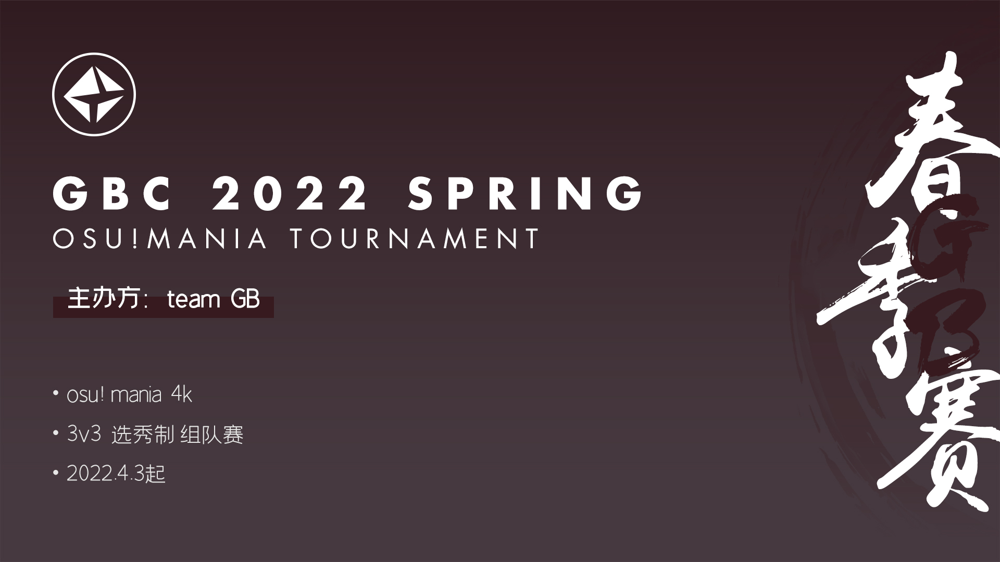
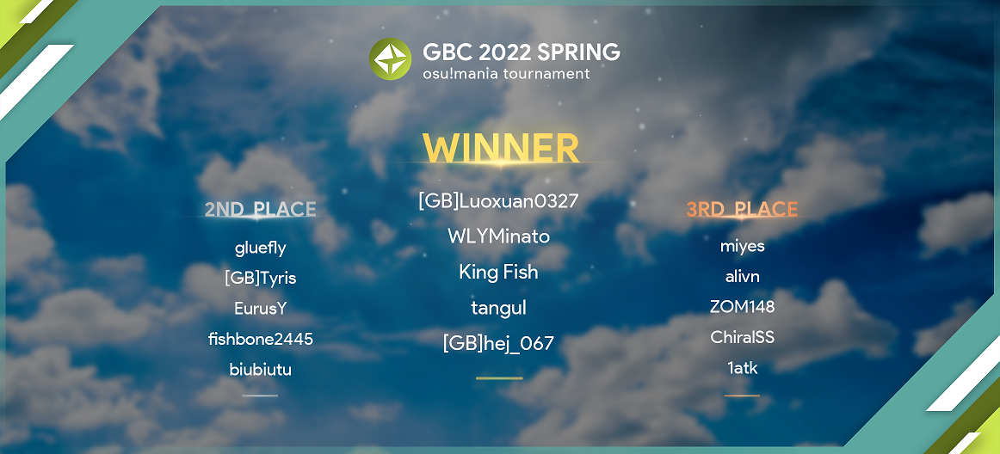
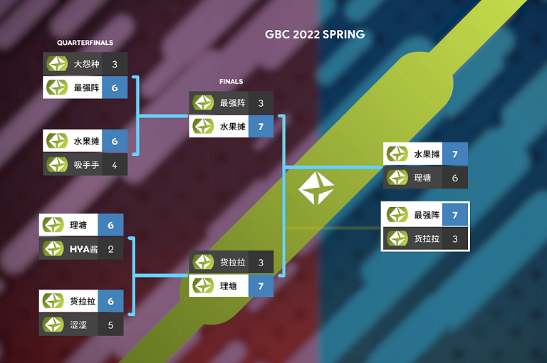

---
tags:
  - GBC
  - GBC 2022
  - GBC2022
  - GBC 2022 Spring
---

# GB Cup 2022 Spring

The **GB Cup 2022 Spring** (***GBC 2022 Spring***) was a 3v3 captain draft-based osu!mania 4-key tournament hosted by ::{ flag=CN }:: [\[GB\]yobrevelc](https://osu.ppy.sh/users/14128407).

## Tournament schedule

| Event | Timestamp |
| --: | :-- |
| Registration phase | 2022-03-26/2022-04-02 (23:59 UTC+8) |
| Drafting phase | 2022-04-03 (19:30 UTC+8) |
| Regular stage week 1 | 2022-04-09/2022-04-10 |
| Regular stage week 2 | 2022-04-16/2022-04-17 |
| Regular stage week 3 | 2022-04-23/2022-04-24 |
| Quarterfinals | 2022-04-30/2022-05-01 |
| Semifinals | 2022-05-07/2022-05-08 |
| Finals | 2022-05-14/2022-05-15 |

## Prizes

| Placing | Prizes |
| :-: | :-- |
|  | Profile badge, KanonBot profile badge, ¥250 CNY |
|  | KanonBot profile badge, ¥200 CNY |
|  | KanonBot profile badge, ¥150 CNY |
| 4th place | ¥125 CNY |
| 5-8th place | ¥75 CNY |

Teams were also awarded a ¥25 CNY bonus for each regular stage win.

  

## Organisation

The GB Cup 2022 Spring was run by the GB Team and various community members.

| Position | Member(s) |
| :-- | :-- |
| Host | ::{ flag=CN }:: [\[GB\]yobrevelc](https://osu.ppy.sh/users/14128407) |
| Staff | ::{ flag=CN }:: [\[GB\]AelSan](https://osu.ppy.sh/users/14095291), ::{ flag=CN }:: [\[GB\]Mafufu](https://osu.ppy.sh/users/10884561), ::{ flag=CN }:: [\[GB\]Sanae](https://osu.ppy.sh/users/11238501), ::{ flag=GB }:: [-Deepdive-](https://osu.ppy.sh/users/13338645) |
| Mappool selector | ::{ flag=CN }:: [\[GB\]yobrevelc](https://osu.ppy.sh/users/14095291), ::{ flag=CN }:: [\[GB\]Mafufu](https://osu.ppy.sh/users/10884561), ::{ flag=CN }:: [\[GB\]AelSan](https://osu.ppy.sh/users/14095291),::{ flag=CN }:: [\[GB\]Thaumiel](https://osu.ppy.sh/users/15017771) |
| Mappool tester | ::{ flag=CN }:: [\[GB\]Yuria](https://osu.ppy.sh/users/13092888), ::{ flag=CN }:: [\[GB\]Sanae](https://osu.ppy.sh/users/11238501), ::{ flag=CN }:: [\[GB\]Akamite](https://osu.ppy.sh/users/13418334), ::{ flag=CN }:: [Blue\_Potion](https://osu.ppy.sh/users/13094831), ::{ flag=CN }:: [FleVI](https://osu.ppy.sh/users/12519616), ::{ flag=CN }:: [\[GB\]Takeru3](https://osu.ppy.sh/users/15188014), ::{ flag=CN }:: [\_Yiiiiii](https://osu.ppy.sh/users/6066359), ::{ flag=CN }:: [rbqq](https://osu.ppy.sh/users/13747488/mania), ::{ flag=CN }:: [Seven\_Nye](https://osu.ppy.sh/users/20886966), ::{ flag=CN }:: [aa219040](https://osu.ppy.sh/users/11653961), ::{ flag=CN }:: [DongDouFu](https://osu.ppy.sh/users/17621613), ::{ flag=CN }:: [sheng\_guang](https://osu.ppy.sh/users/12417981), ::{ flag=CN }:: [sackwoman](https://osu.ppy.sh/users/21573696) |
| Referee | ::{ flag=CN }:: [\[GB\]Mafufu](https://osu.ppy.sh/users/10884561), ::{ flag=CN }:: [\[GB\]Sanae](https://osu.ppy.sh/users/11238501), ::{ flag=CN }:: [\[GB\]AelSan](https://osu.ppy.sh/users/14095291), ::{ flag=CN }:: [\[GB\]Ceci1ia](https://osu.ppy.sh/users/28052545), ::{ flag=CN }:: [\[GB\]Akamite](https://osu.ppy.sh/users/13418334), ::{ flag=CN }:: [\[GB\]yobrevelc](https://osu.ppy.sh/users/14128407) |
| Commentator | ::{ flag=CN }:: [\[GB\]yobrevelc](https://osu.ppy.sh/users/14128407), ::{ flag=CN }:: [\[GB\]AelSan](https://osu.ppy.sh/users/14095291) |
| Guest commentator | ::{ flag=CN }:: [King Fish](https://osu.ppy.sh/users/8468203), ::{ flag=CN }:: [Tachibana Gekka](https://osu.ppy.sh/users/4363530) |
| Streamer | ::{ flag=CN }:: [\[GB\]yobrevelc](https://osu.ppy.sh/users/14128407), ::{ flag=CN }:: [aiyulu](https://osu.ppy.sh/users/189617), ::{ flag=CN }:: [\[GB\]AelSan](https://osu.ppy.sh/users/14095291) |
| Designer | ::{ flag=CN }:: [\[GB\]PlayandyoU](https://osu.ppy.sh/users/14759634), ::{ flag=CN }:: [\[GB\]yobrevelc](https://osu.ppy.sh/users/14128407), ::{ flag=CN }:: [King Fish](https://osu.ppy.sh/users/8468203), ::{ flag=CN }:: [\[GB\]Mafufu](https://osu.ppy.sh/users/10884561) |
| Statistician | ::{ flag=CN }:: [\[GB\]Rush\_FTK](https://osu.ppy.sh/users/3046856), ::{ flag=CN }:: [\[GB\]yobrevelc](https://osu.ppy.sh/users/14128407) |

## Links

- [Discussion thread](https://osu.ppy.sh/community/forums/topics/1546120)
- Livestream
  - [Bilibili stream](https://live.bilibili.com/22545296) (::{ flag=CN }:: [\[GB\]yobrevelc](https://osu.ppy.sh/users/14128407))
  - [Bilibili stream](https://live.bilibili.com/10183) (::{ flag=CN }:: [aiyulu](https://osu.ppy.sh/users/189617))
- [Information spreadsheet](https://docs.qq.com/sheet/DTWVZWk1MTFVLWllu)

## Participants

| Role | Players |
| :-: | :-- |
| **Captains** | ::{ flag=CN }:: [\[GB\]Luoxuan0327](https://osu.ppy.sh/users/8586018), ::{ flag=CN }:: [YyottaCat](https://osu.ppy.sh/users/17753835), ::{ flag=CN }:: [JJFLy](https://osu.ppy.sh/users/7580514), ::{ flag=CN }:: [Qz501kn](https://osu.ppy.sh/users/8729618), ::{ flag=CN }:: [lovely\_hyahya](https://osu.ppy.sh/users/10318380), ::{ flag=CN }:: [crazybrother](https://osu.ppy.sh/users/8045083), ::{ flag=CN }:: [Ranm](https://osu.ppy.sh/users/17527822), ::{ flag=CN }:: [Koishi-0514](https://osu.ppy.sh/users/7546593), ::{ flag=CN }:: [My Angel Yukee7](https://osu.ppy.sh/users/9787146), ::{ flag=CN }:: [- Ran Mitake -](https://osu.ppy.sh/users/19824985), ::{ flag=CN }:: [Vlf](https://osu.ppy.sh/users/9458866), ::{ flag=CN }:: [Carpihat](https://osu.ppy.sh/users/10085090), ::{ flag=CN }:: [gluefly](https://osu.ppy.sh/users/8715409), ::{ flag=CN }:: [\[Crz\]Nickname](https://osu.ppy.sh/users/10817494), ::{ flag=CN }:: [Miyes](https://osu.ppy.sh/users/12942073), ::{ flag=CN }:: [StarTemplar](https://osu.ppy.sh/users/8795096) |
| **Players** | ::{ flag=CN }:: [WLYMinato](https://osu.ppy.sh/users/12703319), ::{ flag=CN }:: [-Chen-](https://osu.ppy.sh/users/14030362), ::{ flag=CN }:: [\[RT\]Alleyne](https://osu.ppy.sh/users/11279273), ::{ flag=CN }:: [- Xiaoluoli -](https://osu.ppy.sh/users/9502281), ::{ flag=CN }:: [-[Ulazis]-](https://osu.ppy.sh/users/11144363), ::{ flag=CN }:: [alivn](https://osu.ppy.sh/users/15807665), ::{ flag=AU }:: [\[Crz\]Yukikaze-](https://osu.ppy.sh/users/8832989), ::{ flag=CN }:: [abbikly](https://osu.ppy.sh/users/14384082), ::{ flag=CN }:: [\[ Classic \]](https://osu.ppy.sh/users/5858053), ::{ flag=CN }:: [9961](https://osu.ppy.sh/users/14609209), ::{ flag=CN }:: [R u m i a](https://osu.ppy.sh/users/17686114), ::{ flag=CN }:: [tito31158](https://osu.ppy.sh/users/16436669), ::{ flag=CN }:: [Molli](https://osu.ppy.sh/users/8893772), ::{ flag=CN }:: [ZOM148](https://osu.ppy.sh/users/10402690), ::{ flag=CN }:: [MkoTenshi](https://osu.ppy.sh/users/6532520), ::{ flag=CN }:: [\[Arkona\]](https://osu.ppy.sh/users/7883617), ::{ flag=CN }:: [\[GB\]Tyris](https://osu.ppy.sh/users/10497659), ::{ flag=CN }:: [Ubiquity](https://osu.ppy.sh/users/6019127), ::{ flag=CN }:: [rizazyh](https://osu.ppy.sh/users/13673300), ::{ flag=CN }:: [King Fish](https://osu.ppy.sh/users/8468203), ::{ flag=CN }:: [tangul](https://osu.ppy.sh/users/6862237), ::{ flag=CN }:: [Hylotl](https://osu.ppy.sh/users/18270260), ::{ flag=CN }:: [\[GB\]Foxy1459](https://osu.ppy.sh/users/14938400), ::{ flag=CN }:: [miserable neet](https://osu.ppy.sh/users/12430477), ::{ flag=CN }:: [Littlesheep37](https://osu.ppy.sh/users/14742881), ::{ flag=CN }:: [Rync\_](https://osu.ppy.sh/users/18242164), ::{ flag=CN }:: [DJ Sharpnel](https://osu.ppy.sh/users/5132402), ::{ flag=CN }:: [Sakurada Shiro](https://osu.ppy.sh/users/14617751), ::{ flag=CN }:: [for need](https://osu.ppy.sh/users/10496581), ::{ flag=CN }:: [\[GB\]a\_hisa](https://osu.ppy.sh/users/24057093), ::{ flag=US }:: [EurusY](https://osu.ppy.sh/users/16301690), ::{ flag=CN }:: [sherweifa](https://osu.ppy.sh/users/17457562), ::{ flag=CN }:: [Mito Van](https://osu.ppy.sh/users/14703345), ::{ flag=CN }:: [Takahashi\_Yuki](https://osu.ppy.sh/users/7167750), ::{ flag=CN }:: [PORTTAYER](https://osu.ppy.sh/users/8790200), ::{ flag=CN }:: [Kos-](https://osu.ppy.sh/users/9048067), ::{ flag=CN }:: [1145810](https://osu.ppy.sh/users/24449770), ::{ flag=CN }:: [qiaolilailai](https://osu.ppy.sh/users/13809991), ::{ flag=CN }:: [Zyuuu](https://osu.ppy.sh/users/15389275), ::{ flag=CN }:: [fishbone2445](https://osu.ppy.sh/users/17640814), ::{ flag=CN }:: [TkskKurumi](https://osu.ppy.sh/users/3631045), ::{ flag=HK }:: [Alptraum](https://osu.ppy.sh/users/26496648), ::{ flag=JP }:: [\_Kokodayo](https://osu.ppy.sh/users/16585041), ::{ flag=CN }:: [ChiralSS](https://osu.ppy.sh/users/18211706), ::{ flag=CN }:: [Llkkm](https://osu.ppy.sh/users/24989144), ::{ flag=CN }:: [fangruyan1013](https://osu.ppy.sh/users/11735651), ::{ flag=CN }:: [majesticlegend](https://osu.ppy.sh/users/10219308), ::{ flag=CN }:: [woshiji](https://osu.ppy.sh/users/26589994), ::{ flag=CN }:: [Horizon5](https://osu.ppy.sh/users/12635658), ::{ flag=CN }:: [QAQlingjiu](https://osu.ppy.sh/users/27288518), ::{ flag=CN }:: [lochid](https://osu.ppy.sh/users/18107639), ::{ flag=CN }:: [SY-COCO](https://osu.ppy.sh/users/12854853), ::{ flag=CN }:: [shiki natsume](https://osu.ppy.sh/users/6997459), ::{ flag=CN }:: [UnnamedOrange](https://osu.ppy.sh/users/14753416), ::{ flag=CN }:: [\[GB\]voidmoyu](https://osu.ppy.sh/users/16573996), ::{ flag=CN }:: [Ez2dance](https://osu.ppy.sh/users/9191281), ::{ flag=CN }:: [Chelly-](https://osu.ppy.sh/users/14876346), ::{ flag=CN }:: [AkalinT](https://osu.ppy.sh/users/16640276), ::{ flag=CN }:: [dreamwy](https://osu.ppy.sh/users/11608677), ::{ flag=CN }:: [\[GB\]hej\_067](https://osu.ppy.sh/users/24880938), ::{ flag=CN }:: [1atk](https://osu.ppy.sh/users/20520767), ::{ flag=CN }:: [OTruthO](https://osu.ppy.sh/users/17470634), ::{ flag=HK }:: [biubiutu](https://osu.ppy.sh/users/18801193) |

| # | Teams | Members |
| --: | :-: | :-- |
| 1 | **金戈铁马的鲜丰水果摊** | ::{ flag=CN }:: **[\[GB\]Luoxuan0327](https://osu.ppy.sh/users/8586018)**, ::{ flag=CN }:: [WLYMinato](https://osu.ppy.sh/users/12703319), ::{ flag=CN }:: [King Fish](https://osu.ppy.sh/users/8468203), ::{ flag=CN }:: [tangul](https://osu.ppy.sh/users/6862237), ::{ flag=CN }:: [\[GB\]hej\_067](https://osu.ppy.sh/users/24880938) |
| 2 | **你没对象对不队** | **::{ flag=CN }:: [YyottaCat](https://osu.ppy.sh/users/17753835)**, ::{ flag=CN }:: [\[Arkona\]](https://osu.ppy.sh/users/7883617), ::{ flag=CN }:: [miserable neet](https://osu.ppy.sh/users/12430477), ::{ flag=CN }:: [Llkkm](https://osu.ppy.sh/users/24989144) |
| 3 | **涩涩不队** | ::{ flag=CN }:: **[JJFLy](https://osu.ppy.sh/users/7580514)**, ::{ flag=CN }:: [Hylotl](https://osu.ppy.sh/users/18270260), ::{ flag=CN }:: [rizazyh](https://osu.ppy.sh/users/13673300), ::{ flag=CN }:: [Kos-](https://osu.ppy.sh/users/9048067), ::{ flag=CN }:: [fangruyan1013](https://osu.ppy.sh/users/11735651) |
| 4 | **Yzhhのqlll森林汪酱不会大叠** | ::{ flag=CN }:: **[Qz501kn](https://osu.ppy.sh/users/8729618)**, ::{ flag=CN }:: [\[RT\]Alleyne](https://osu.ppy.sh/users/11279273), ::{ flag=CN }:: [R u m i a](https://osu.ppy.sh/users/17686114), ::{ flag=CN }:: [qiaolilailai](https://osu.ppy.sh/users/13809991), ::{ flag=CN }:: [QAQlingjiu](https://osu.ppy.sh/users/27288518) |
| 5 | **可爱的hyahya酱上线啦！！** | ::{ flag=CN }:: **[lovely\_hyahya](https://osu.ppy.sh/users/10318380)**, ::{ flag=CN }:: [-[Ulazis]-](https://osu.ppy.sh/users/11144363), ::{ flag=CN }:: [tito31158](https://osu.ppy.sh/users/16436669), ::{ flag=JP }:: [\_Kokodayo](https://osu.ppy.sh/users/16585041), ::{ flag=CN }:: [AkalinT](https://osu.ppy.sh/users/16640276) |
| 6 | **货拉拉拉不拉拉布拉多队** | ::{ flag=CN }:: **[crazybrother](https://osu.ppy.sh/users/8045083)**, ::{ flag=CN }:: [abbikly](https://osu.ppy.sh/users/14384082), ::{ flag=CN }:: [Zyuuu](https://osu.ppy.sh/users/15389275), ::{ flag=CN }:: [majesticlegend](https://osu.ppy.sh/users/10219308), ::{ flag=CN }:: [TkskKurumi](https://osu.ppy.sh/users/3631045) |
| 7 | **bikabika** | ::{ flag=CN }:: **[Ranm](https://osu.ppy.sh/users/17527822)**, ::{ flag=CN }:: [Littlesheep37](https://osu.ppy.sh/users/14742881), ::{ flag=CN }:: [DJ Sharpnel](https://osu.ppy.sh/users/5132402), ::{ flag=CN }:: [woshiji](https://osu.ppy.sh/users/26589994), ::{ flag=CN }:: [UnnamedOrange](https://osu.ppy.sh/users/14753416) |
| 8 | **MyAngel Koishi** | ::{ flag=CN }:: **[Koishi-0514](https://osu.ppy.sh/users/7546593)**, ::{ flag=CN }:: [\[ Classic \]](https://osu.ppy.sh/users/5858053), ::{ flag=CN }:: [shiki natsume](https://osu.ppy.sh/users/6997459), ::{ flag=CN }:: [Mito Van](https://osu.ppy.sh/users/14703345), ::{ flag=CN }:: [Ez2dance](https://osu.ppy.sh/users/9191281) |
| 9 | **大怨种被迫当队长** | ::{ flag=CN }:: **[My Angel Yukee7](https://osu.ppy.sh/users/9787146)**, ::{ flag=AU }:: [\[Crz\]Yukikaze-](https://osu.ppy.sh/users/8832989), ::{ flag=CN }:: [Rync\_](https://osu.ppy.sh/users/18242164), ::{ flag=CN }:: [Sakurada Shiro](https://osu.ppy.sh/users/14617751), ::{ flag=CN }:: [\[GB\]voidmoyu](https://osu.ppy.sh/users/16573996) |
| 10 | **青叶摩卡的百合后花园** | ::{ flag=CN }:: **[- Ran Mitake -](https://osu.ppy.sh/users/19824985)**, ::{ flag=CN }:: [Molli](https://osu.ppy.sh/users/8893772), ::{ flag=CN }:: [\[GB\]Foxy1459](https://osu.ppy.sh/users/14938400), ::{ flag=CN }:: [sherweifa](https://osu.ppy.sh/users/17457562), ::{ flag=CN }:: [Chelly-](https://osu.ppy.sh/users/14876346) |
| 11 | **啊不对不队** | ::{ flag=CN }:: **[Vlf](https://osu.ppy.sh/users/9458866)**, ::{ flag=CN }:: [- Xiaoluoli -](https://osu.ppy.sh/users/9502281), ::{ flag=CN }:: [\[GB\]a\_hisa](https://osu.ppy.sh/users/24057093), ::{ flag=CN }:: [Takahashi\_Yuki](https://osu.ppy.sh/users/7167750), ::{ flag=CN }:: [Horizon5](https://osu.ppy.sh/users/12635658) |
| 12 | **啊对对队** | ::{ flag=CN }:: **[Carpihat](https://osu.ppy.sh/users/10085090)**, ::{ flag=CN }:: [-Chen-](https://osu.ppy.sh/users/14030362), ::{ flag=CN }:: [for need](https://osu.ppy.sh/users/10496581), ::{ flag=CN }:: [PORTTAYER](https://osu.ppy.sh/users/8790200), ::{ flag=CN }:: [SY-COCO](https://osu.ppy.sh/users/12854853) |
| 13 | **太美丽了理塘** | ::{ flag=CN }:: **[gluefly](https://osu.ppy.sh/users/8715409)**, ::{ flag=US }:: [EurusY](https://osu.ppy.sh/users/16301690), ::{ flag=CN }:: [\[GB\]Tyris](https://osu.ppy.sh/users/10497659), ::{ flag=CN }:: [fishbone2445](https://osu.ppy.sh/users/17640814), ::{ flag=HK }:: [biubiutu](https://osu.ppy.sh/users/18801193) |
| 14 | **皮蛋蛋吸手手俱乐部** | ::{ flag=CN }:: **[\[Crz\]Nickname](https://osu.ppy.sh/users/10817494)**, ::{ flag=CN }:: [Ubiquity](https://osu.ppy.sh/users/6019127), ::{ flag=CN }:: [MkoTenshi](https://osu.ppy.sh/users/6532520), ::{ flag=HK }:: [Alptraum](https://osu.ppy.sh/users/26496648), ::{ flag=CN }:: [dreamwy](https://osu.ppy.sh/users/11608677) |
| 15 | **GBC最强阵容9个Miyes** | ::{ flag=CN }:: **[Miyes](https://osu.ppy.sh/users/12942073)**, ::{ flag=CN }:: [alivn](https://osu.ppy.sh/users/15807665), ::{ flag=CN }:: [ZOM148](https://osu.ppy.sh/users/10402690), ::{ flag=CN }:: [ChiralSS](https://osu.ppy.sh/users/18211706), ::{ flag=CN }:: [1atk](https://osu.ppy.sh/users/20520767) |
| 16 | **头号倒霉蛋** | ::{ flag=CN }:: **[StarTemplar](https://osu.ppy.sh/users/8795096)**, ::{ flag=CN }:: [9961](https://osu.ppy.sh/users/14609209), ::{ flag=CN }:: [1145810](https://osu.ppy.sh/users/24449770), ::{ flag=CN }:: [lochid](https://osu.ppy.sh/users/18107639), ::{ flag=CN }:: [OTruthO](https://osu.ppy.sh/users/17470634) |

## Podium

## Mappools

### Semifinals & Finals

**[Download the mappack here (130.7 MB)](https://drive.google.com/file/d/1GdRG5ay0LU_RaAfcpml8qG_Gu3bdlWB1/view)**

- Rice
  1. [DJ TOTTO - Chaplet (riunosk) \[Deceptive\]](https://osu.ppy.sh/beatmapsets/1440718#mania/2964130)
  2. [Hachioji-P feat. Hatsune Miku - Blue Star (\[Crz\]Rachel) \[Sparkle Star\]](https://osu.ppy.sh/beatmapsets/1000382#mania/2093764)
  3. [goreshit - satori de pon! (SaltedFISSH) \[\~\~Pon!\~\~\]](https://osu.ppy.sh/beatmapsets/1251545#mania/2601285)
  4. [DECO\*27 - Android Girl feat. Hatsune Miku (Xingyue -) \[AI x1.1\]](https://osu.ppy.sh/beatmapsets/969824#mania/2029268)
  5. [TUYU - Yappari Ame wa Furun da ne (- Freeman -) \[Edit (cut)\]](https://osu.ppy.sh/beatmapsets/1742064#mania/3587065)
  6. [Pan Weibo / Zhang Shaohan - Kuai Le Chong Bai (Doshowz) \[Come on\]](https://osu.ppy.sh/beatmapsets/1179698#mania/2459946)
  7. [Hatsuki Yura - Snow Veil -Shoujo to Kemono no Mori- (Hylotl) \[BAKEMONO\]](https://osu.ppy.sh/beatmapsets/1711963#mania/3498202)
- LN
  1. [DJ TOTTO VS TOTTO - Vajra (IA daisuki) \[IA daisuki&cherrychou's SPECIAL\]](https://osu.ppy.sh/beatmapsets/1677512#mania/3440654)
  2. [YOASOBI - Gunjou (shuniki) \[ShuChan!!+\]](https://osu.ppy.sh/beatmapsets/1296693#mania/2711689)
  3. [HyuN & Ritoru - Apocalypse in Love (IceDynamix) \[Ende der Liebe\]](https://osu.ppy.sh/beatmapsets/925537#mania/1933271)
- SV
  1. [Cutter - EmoCosine (\[GB\]AelSan) \[Miscedence's Cute \[GBC edit\]\]](https://osu.ppy.sh/beatmapsets/1755418#mania/3592340)
  2. [TSAR - 0.0? (\[GB\]AelSan) \[Mafufu & AelSan's @v@!\]](https://osu.ppy.sh/beatmapsets/1755419#mania/3592342)
- Hybrid
  1. [IOSYS - Ringo's Tea Party (TheToaphster) \[Spooked\]](https://osu.ppy.sh/beatmapsets/638838#mania/1355027)
  2. [Camellia feat. Nanahira - Ska-sh All Neurons!! (HowToPlayLN) \[Re-forward !!\]](https://osu.ppy.sh/beatmapsets/1122764#mania/2349915)
- Tiebreaker
  1. **[Camellia - SECRET BOSS (\[GB\]yobrevelc) \[Glorious Battlefield of Champions\]](https://osu.ppy.sh/beatmapsets/1755452#mania/3592441)**

### Regular stage week 3 & Quarterfinals

**[Download the mappack here (116.38 MB)](https://drive.google.com/file/d/1bB4ybEiRhBWacF1tZnQGbfBu4CiRhpGl/view)**

- Rice
  1. [stereoberry - ametsuchi (Monheim) \[petrichor 1.2\]](https://osu.ppy.sh/beatmapsets/671311#mania/2553924)
  2. [minecraft gamer 2002 - my intro (\[GB\]AelSan) \[ChordJack \[GBC edit.\]\]](https://osu.ppy.sh/beatmapsets/1722108#mania/3570031)
  3. [YOASOBI - Romance (\[GB\]AelSan) \[lv.22 \[1.05x Rate\]\]](https://osu.ppy.sh/beatmapsets/1674849#mania/3421330)
  4. [BACK-ON - INFINITY (Nightcore Mix) (LaoXiao-) \[x1.0\]](https://osu.ppy.sh/beatmapsets/1132869#mania/2366200)
  5. [Pegboard Nerds - Swamp Thing (Shoegazer) \[Swampgator 1.1x (149bpm)\]](https://osu.ppy.sh/beatmapsets/1227404#mania/2552373)
  6. [you - hold angel (Shoegazer) \[Insane\]](https://osu.ppy.sh/beatmapsets/292422#mania/763511)
- LN
  1. [kuwagata - Signal Hopping! (riunosk) \[Noodle Hopping!\]](https://osu.ppy.sh/beatmapsets/1288739#mania/3274408)
  2. [M2U - Mare Maris (Raveille) \[LNpai's MASTER\]](https://osu.ppy.sh/beatmapsets/917906#mania/2416459)
- SV
  1. [Frums - Credits (Sillyp) \[F u n d i n g\]](https://osu.ppy.sh/beatmapsets/1212405#mania/2523592)
  2. [Inspector K - Disconnected -Hyper- (XeoStyle) \[beep boop\]](https://osu.ppy.sh/beatmapsets/609453#mania/1287062)
- Hybrid
  1. [Warak \[Feat. isaya\] - Please, Lover (Shuniki) \[ShuChan!!(NO SV)\]](https://osu.ppy.sh/beatmapsets/1100368#mania/3568778)
  2. [Aoi vs. r0y - Coldlapse (Murumoo) \[-Mystic's MAXIMUM\]](https://osu.ppy.sh/beatmapsets/845859#mania/1774662)
- Tiebreaker
  1. **[Camellia - We Magicians Still Alive in 2021 (HowToPlayLN) \[Everlasting\]](https://osu.ppy.sh/beatmapsets/1517582#mania/3106711)**

### Regular stage week 1 & 2

**[Download the mappack here (160.84 MB)](https://drive.google.com/file/d/1RYMCSNJOp6_evL9W_JVnqTYzylYZ5mbF/view)**

- Rice
  1. [Hatsuki Yura - Dark Prince (Lcat2538) \[Challenge\]](https://osu.ppy.sh/beatmapsets/770595#mania/1620129)
  2. [Primary - in the Garden (IA daisuki) \[Eden \[1.1x Rate\]\]](https://osu.ppy.sh/beatmapsets/1077579#mania/3530583)
  3. [katagiri - Kamiari Algorithm (katagiri Bootleg) (NikoSek) \[x1.1\]](https://osu.ppy.sh/beatmapsets/1576367#mania/3218426)
  4. [Kano - Stella-rium (DJ Noriken Bootleg) (-Deepdive-) \[Edit\[-4yu-\] 1.1x (192bpm) OD8\]](https://osu.ppy.sh/beatmapsets/1727021#mania/3529400)
  5. [The Flashbulb - Ripcord (ilikexd) \[Insane\]](https://osu.ppy.sh/beatmapsets/1282006#mania/2662762)
  6. [Fudanshi Crisis - Scarlet Tempest (Shoegazer) \[Tempest 1.1x (181bpm)\]](https://osu.ppy.sh/beatmapsets/683086#mania/2787817)
- LN
  1. [rissyuu feat. choko - Bi (Raveille) \[Bong Botes\]](https://osu.ppy.sh/beatmapsets/1012105#mania/2118448)
  2. [kamome sano - citrus (K a b i -) \[Sweet Drop\]](https://osu.ppy.sh/beatmapsets/854717#mania/1786282)
- SV
  1. [X&G - Whiplash ft. josh pan (sakuraburst Remix) (error\_exe777) \[break out\]](https://osu.ppy.sh/beatmapsets/723633#mania/1527737)
  2. [nora2r - B.B.K.K.B.K.K. (RemiFlan) \[BASS KICK\]](https://osu.ppy.sh/beatmapsets/530022#mania/1353669)
- Hybrid
  1. [aran - L.F.O (-MysticEyes) \[Impedance\]](https://osu.ppy.sh/beatmapsets/882805#mania/1845580)
  2. [Camellia feat. Nanahira - POLKAMANIA (Rhezie) \[Sya's BLACK ANOTHER\]](https://osu.ppy.sh/beatmapsets/1580868#mania/3234094)
- Tiebreaker
  1. **[Camellia - Newspapers for Magicians (Leniane) \[Grimoire for Spells\]](https://osu.ppy.sh/beatmapsets/929143#mania/1940608)**

## Match results

### Play-offs summary

### Finals

Saturday, May 14, 2022:

| Team A |  |  | Team B | Match link | Note |
| --: | --: | :-- | :-- | :-: | :-: |
| **金戈铁马的鲜丰水果摊** | **7** | 6 | 太美丽了理塘 | [#1](https://osu.ppy.sh/community/matches/100602282) | Finals |

Sunday, May 15, 2022:

| Team A |  |  | Team B | Match link |  |
| --: | --: | :-- | :-- | :-: | :-: |
| **GBC最强阵容9个Miyes** | **7** | 3 | 货拉拉拉不拉拉布拉多 | [#1](https://osu.ppy.sh/community/matches/100634289) | Bronze match |

### Semifinals

Saturday, May 7, 2022:

| Team A |  |  | Team B | Match link |
| --: | --: | :-- | :-- | :-: |
| 货拉拉拉不拉拉布拉多 | 3 | **7** | **太美丽了理塘** | [#1](https://osu.ppy.sh/community/matches/100411441) |

Sunday, May 8, 2022:

| Team A |  |  | Team B | Match link |
| --: | --: | :-- | :-- | :-: |
| GBC最强阵容9个Miyes | 3 | **7** | **金戈铁马的鲜丰水果摊** | [#1](https://osu.ppy.sh/community/matches/100444701) |

### Quarterfinals

Sunday, May 1, 2022:

| Team A |  |  | Team B | Match link |
| --: | --: | :-- | :-- | :-: |
| 大怨种被迫当队长 | 3 | **6** | **GBC最强阵容9个Miyes** | [#1](https://osu.ppy.sh/community/matches/100250198) |
| **太美丽了理塘** | **6** | 2 | 可爱的hyahya酱上线啦！！ | [#1](https://osu.ppy.sh/community/matches/100250096) |

Monday, May 2, 2022:

| Team A |  |  | Team B | Match link |
| --: | --: | :-- | :-- | :-: |
| **货拉拉拉不拉拉布拉多** | **6** | 5 | 涩涩不队 | [#1](https://osu.ppy.sh/community/matches/100280784) |
| **金戈铁马的鲜丰水果摊** | **6** | 4 | 皮蛋蛋吸手手俱乐部 | [#1](https://osu.ppy.sh/community/matches/100281811) |

### Regular stage summary

| #[^rs-summary-seed] | Team | Matches | Beatmaps | BD[^rs-summary-bd] | BU[^rs-summary-bu] | Round 1 | Round 2 | Round 3 |
| :-: | --: | :-: | :-: | :-: | :-: | :-: | :-: | :-: |
| 1 | **金戈铁马的鲜丰水果摊** | 3-0 | 18-4 | +14 | +1 | 6-1 倒霉蛋 | 6-2 hya酱 | 6-1 货拉拉 |
| 2 | **太美丽了理塘** | 3-0 | 18-3 | +15 | -3 | 6-1 Yzh | 6-1 摩卡 | 6-1 大怨种 |
| 3 | **货拉拉拉不拉拉布拉多队** | 2-1 | 13-13 | 0 | +3 | 6-4 啊不对 | 6-3 涩涩 | 1-6 水果摊 |
| 4 | **大怨种被迫当队长** | 2-1 | 13-13 | 0 | +3 | 6-3 MK | 6-4 最强阵 | 1-6 理塘 |
| 5 | **可爱的hyahya酱上线啦！！** | 2-1 | 14-9 | +5 | +1 | 6-1 啊对对 | 2-6 水果摊 | 6-2 MK |
| 6 | **涩涩不队** | 2-1 | 15-11 | +4 | +1 | 6-5 吸手手 | 3-6 货拉拉 | 6-0 bika |
| 7 | **皮蛋蛋吸手手俱乐部** | 2-1 | 17-12 | +5 | -1 | 5-6 涩涩 | 6-3 啊不对 | 6-3 摩卡 |
| 8 | **GBC最强阵容9个Miyes** | 2-1 | 16-12 | +4 | -3 | 6-2 没对象 | 4-6 大怨种 | 6-4 倒霉蛋 |
| 9 | 青叶摩卡的百合后花园 | 1-2 | 10-13 | -3 | +3 | 6-1 bika | 1-6 理塘 | 3-6 吸手手 |
| 10 | 头号倒霉蛋 | 1-2 | 11-17 | -6 | +3 | 1-6 水果摊 | 6-5 啊对对 | 4-6 最强阵 |
| 12 | 啊不对不队 | 1-2 | 13-12 | +1 | -1 | 4-6 货拉拉 | 3-6 吸手手 | 6-0 没对象 |
| 11 | MyAngel Koishi | 1-2 | 11-13 | -2 | -1 | 3-6 大怨种 | 6-1 没对象 | 2-6 hya酱 |
| 13 | 啊对对队 | 1-2 | 12-12 | 0 | -3 | 1-6 hya酱 | 5-6 倒霉蛋 | 6-0 Yzh |
| 14 | bikabika | 1-2 | 7-17 | -10 | -3 | 1-6 摩卡 | 6-5 Yzh | 0-6 涩涩 |
| 15 | Yzhhのqlll森林汪酱不会大叠 | 0-3 | 6-18 | -6 | +1 | 1-6 理塘 | 5-6 bika | 0-6 啊对对 |
| 16 | 你没对象对不队 | 0-3 | 3-18 | -9 | -1 | 2-6 最强阵 | 1-6 MK | 0-6 啊不对 |

### Regular stage tiebreaker

Sunday, April 24, 2022:

| Team A |  |  | Team B | Match link |
| --: | --: | :-- | :-- | :-: |
| 大怨种被迫当队长 | 18 | **71** | **货拉拉拉不拉拉布拉多队** | *dice roll* |

### Regular stage week 3

Friday, April 22, 2022:

| Team A |  |  | Team B | Match link |
| --: | --: | :-- | :-- | :-: |
| 大怨种被迫当队长 | 1 | **6** | **太美丽了理塘** | [#1](https://osu.ppy.sh/community/matches/99985568) |

Saturday, April 23, 2022:

| Team A |  |  | Team B | Match link |
| --: | --: | :-- | :-- | :-: |
| 青叶摩卡的百合后花园 | 3 | **6** | **皮蛋蛋吸手手俱乐部** | [#1](https://osu.ppy.sh/community/matches/100017943) |
| **涩涩不队** | **6** | 0 | bikabika | [#1](https://osu.ppy.sh/community/matches/100018611) |
| **可爱的hyahya酱上线啦！！** | **6** | 2 | MyAngel Koishi | [#1](https://osu.ppy.sh/community/matches/100018611) |

Sunday, April 24, 2022:

| Team A |  |  | Team B | Match link |
| --: | --: | :-- | :-- | :-: |
| Yzhhのqlll森林汪酱不会大叠 | -1 | **0** | **啊对对队** | *win by default* |
| **GBC最强阵容9个Miyes** | **6** | 4 | 头号倒霉蛋 | [#1](https://osu.ppy.sh/community/matches/100054908) |
| **啊不对不队** | **0** | -1 | 你没对象对不队 | *win by default* |
| **金戈铁马的鲜丰水果摊** | **6** | 1 | 货拉拉拉不拉拉布拉多 | [#1](https://osu.ppy.sh/community/matches/100057491) |

### Regular stage week 2

Saturday, April 16, 2022:

| Team A |  |  | Team B | Match link |
| --: | --: | :-- | :-- | :-: |
| Yzhhのqlll森林汪酱不会大叠 | 5 | **6** | **bikabika** | [#1](https://osu.ppy.sh/community/matches/99801555) |
| 啊对对队 | 5 | **6** | **头号倒霉蛋** | [#1](https://osu.ppy.sh/community/matches/99803451) |
| **金戈铁马的鲜丰水果摊** | **6** | 2 | 可爱的hyahya酱上线啦！！ | [#1](https://osu.ppy.sh/community/matches/99804500) |
| 啊不对不队 | 3 | **6** | **皮蛋蛋吸手手俱乐部** | [#1](https://osu.ppy.sh/community/matches/99806554) |

Sunday, April 17, 2022:

| Team A |  |  | Team B | Match link |
| --: | --: | :-- | :-- | :-: |
| **太美丽了理塘** | **6** | 1 | 青叶摩卡的百合后花园 | [#1](https://osu.ppy.sh/community/matches/99835417) |
| **MyAngel Koishi** | **6** | 1 | 你没对象对不队 | [#1](https://osu.ppy.sh/community/matches/99837265) |
| **货拉拉拉不拉拉布拉多** | **6** | 3 | 涩涩不队 | [#1](https://osu.ppy.sh/community/matches/99840516) |
| **大怨种被迫当队长** | **6** | 4 | GBC最强阵容9个Miyes | [#1](https://osu.ppy.sh/community/matches/99840241) |

### Regular stage week 1

Saturday, April 9, 2022:

| Team A |  |  | Team B | Match link |
| --: | --: | :-- | :-- | :-: |
| bikabika | 1 | **6** | **青叶摩卡的百合后花园** | [#1](https://osu.ppy.sh/community/matches/99564304) |
| **可爱的hyahya酱上线啦！！** | **6** | 1 | 啊对对队 | [#1](https://osu.ppy.sh/community/matches/99566208) |
| **金戈铁马的鲜丰水果摊** | **6** | 1 | 头号倒霉蛋 | [#1](https://osu.ppy.sh/community/matches/99567449) |
| **涩涩不队** | **6** | 5 | 皮蛋蛋吸手手俱乐部 | [#1](https://osu.ppy.sh/community/matches/99568857) |

Sunday, April 10, 2022:

| Team A |  |  | Team B | Match link |
| --: | --: | :-- | :-- | :-: |
| Team MyAngel Koishi | 3 | **6** | **大怨种被迫当队长** | [#1](https://osu.ppy.sh/community/matches/99603315) |
| **货拉拉拉不拉拉布拉多队** | **6** | 4 | 啊不对不队 | [#1](https://osu.ppy.sh/community/matches/99606894) |
| Yzhhのqlll森林汪酱不会大叠 | 1 | **6** | **太美丽了理塘** | [#1](https://osu.ppy.sh/community/matches/99608620), [screenshot](img/GBC2SprW1M7.jpg) |
| 你没对象对不队 | 2 | **6** | **GBC最强阵容9个Miyes** | [#1](https://osu.ppy.sh/community/matches/99609983) |

## Ruleset

### Tournament rules

1. The GB Cup 2022 Spring is a captain draft-based team tournament, played on the osu!mania game mode.
   - **While this competition is planned as a 3 versus 3 setup, this might change depending on the number of incoming registrations.**
2. Beatmap scoring is based on Score V2.
3. The maps for each round will be announced by the mappool selectors on the Sunday before the actual matches take place.
   - Each mappool will contain a *tiebreaker* beatmap. It will only be played in case of a tie in the scoreline in the *best of* system, e.g. if the scoreline is 4-4 and the match is best of 9, the tiebreaker shall be played.
4. Match scheduling will be handled by the host.
5. If no referee is available at match time, the match will be postponed.
6. Failed players' scores do not get added to the team score.
   - Reviving and surviving during a beatmap is considered as passing it.
7. Use of the Visual Settings to alter background dim or disable beatmap elements like storyboards and skins is allowed.
   - Custom skin elements must not be used to alter core gameplay mechanics.
8. If a game ends in a draw, it will be nullified and the map will be replayed.
9. Teams may ask for a rematch if a team member encounters technical difficulties while playing.
   - "Lag spikes" are not considered a valid reason to nullify a beatmap.
   - If a rematch happens, the original roster for each team during that particular beatmap must remain the same. If that is not possible, e.g. by virtue of a technical issue, *both* teams will be allowed to swap rosters.
   - This rule is not to be abused. Referees may veto a rematch request if they find that this is the case.
10. **The size for a team is 5.**
    - This might change depending on the amount of registrations.
11. If a player disconnects, their scores will not be counted towards their team's total, unless adequate proof of said score is provided. The following are considered as acceptable proof:
    - Player point-of-view live stream snippets (commonly referred to as "clips" or "VODs"). The entirety of the play, along with the results screen must be clearly visible along with the affected player's score.
    - Replay files of the play, taken directly from the "Local scores" tab on the affected player's client (the timestamps must exactly match the time at which the game took place, as seen on the multiplayer lobby link).
    - Screenshots from other players taken directly in-game that show the affected player's score.
      - Screenshots from the results screen must clearly show the affected player's score. This is the preferred method.
      - Screenshots taken in-game at the time of disconnection may be accepted. Note that this method does not provide a one-to-one representation of that player's score. Using this method is not encouraged and it may be denied at the referee's discretion if the information provided is not sufficient to identify the player/score.
      - All screenshots **MUST** be taken using the game itself (using `Shift` + `F12`), that is, they must be hosted on the `https://osu.ppy.sh/` domain. Any other form of screenshot will be denied.
    - Player scores may be derived from the official stream as a last resort, in cases where the match is streamed.
12. If less than the minimum amount of required players are present at match time, it can be postponed for up to 10 minutes. If, after this period, there are still not enough players for either, a *win by default* will be declared for the team with the most members present.
    - The minimum amount of required players is defined as the amount of players needed to play a beatmap.
13. Exchanging players during games is allowed without limitations, except tournament-specific rules. See the [match instructions](#match-instructions) for details.
14. Players are expected to keep the match running fluently and without delays. Excessive match delays from the players' side may result in penalties being applied.
15. If a player disconnects between beatmaps and the team cannot provide a substitute, the match can be delayed for up to 10 minutes (limited to once per team, per match).
16. All players and staff must be treated with respect. Instructions of the referees and the host are to be followed. Decisions labelled as final are not to be objected.
17. Disrupting the match by foul play, insulting and provoking other players or staff, delaying the match, and other deliberate inappropriate misbehaviour are strictly prohibited.
18. The multiplayer chatrooms underlie the [osu! community rules](/wiki/Rules). All chat rules apply to the multiplayer chatrooms, too.
    - Breaking the chat rules results in a silence. Silenced players cannot participate in multiplayer matches and must be exchanged for the time being.
19. Unexpected incidences will be handled by the host. Referees may allow higher tolerance depending on the given circumstances. This is up to their discretion.
20. Penalties for violating the tournament rules include, but are not limited to:
    - Exclusion of specific players for one beatmap.
    - Exclusion of specific players for an entire match.
    - Declaring the match as forfeited, or as a win by default for the other team.
    - Disqualification from the entire tournament.
    - Disqualification from current and future GBC series.
    - Disqualification from current and future official and community tournaments, until appealed.
21. The host reserves the right to modify these rules at any moment. Any such changes will be announced in advance.

### Tournament registration

1. Please send the host a **private message** and **fill [this form](https://wj.qq.com/s2/9902248/95cf/)** to register.
2. To ensure valid and serious registrations, every registered user will be manually checked by the host.
   - To be successfully registered, a player must not have violated the [osu! community rules](/wiki/Rules) within the last 12 months.
   - **There are no rank limitations for this tournament.** If there are too many registrants, some of the high-level registrants may be removed from the main tournament and be invited to participate in the showmatch instead.
3. A list of all successfully registered players will be published after the registration phase, and will then participate in the drafting phase.
4. Organisers, mappool selectors, and referees must not participate as players in the tournament.
5. Organisers reserve the right to decline restricted players from participating in the tournament.

### Drafting phase instructions

1. The host will declare one captain for each team 24 hours before the drafting phase.
   - Drafting order will also be declared by the host.
   - Captains are selected by performance and preference.
   - Non-captains will join a group of players waiting to join a team, herein called a "player pool".
2. Captains decide their team members during the drafting phase.
   - Captains are allowed to conduct and coordinate "tryouts", tests to gauge player aptitude, on their own terms.
3. There will be a 120-second planning phase before the picking phase starts.
4. During the picking phase, picks start in *increasing* order, from the 1st to the 16th captain. The picks repeat four times, such that every captain gets to choose 4 players.
5. Each captain has 60 seconds to pick one player from the player pool on their turn.
   - If the captain does not pick an player within 60 seconds, a random player from the remaining player pool will be assigned to their team.
6. If the captain picks a player, the pick time still has to elapse before the next captain's turn starts, meaning each phase will take 16 minutes.
7. After each phase, there is a 60-second break before the next phase starts.
8. At all times, the captains may communicate with each other via multiplayer chatrooms or voice chat.
   - Other players will be muted during the drafting phase.
9. After the drafting phase, captains may choose, with the approval of the host, to delegate their role to other prospective team members.
10. Bad behaviour during the drafting phase will be seen as disrupting the match by foul play.

### Regular stage instructions

1. Following the drafting phase, a 3-round Swiss stage will be played. This means teams with same record will face each other.
2. The final ranking of the Swiss round will be determined by the following criteria in order:
   - Most matches won
   - Head-to-head result (if possible)
   - Highest Buchholz score
   - Highest beatmap difference (`beatmap wins - beatmap losses`)
   - Most beatmaps won
   - Fewest beatmaps lost
   - Dice roll
3. The top 8 teams will advanced to the Playoff stage, while the remaining players get eliminated from the tournament.
   - This means that teams with a record of 2-X or better will advance to the next stage.
   - All teams will finish all 3 rounds, even when they have a record of 0-2.
4. In the Regular stage, all teams will play in the same mappool.
5. The results from the Regular stage will also be used for seeding teams.

### Playoff stage instructions

1. Following the Regular stage, a single elimination stage will be played. This means that the winner continues with their runs, and the losing team will be eliminated from the tournament, except in the bronze match.

### Win conditions

- In the Regular stage and Quarterfinals, teams need to win 6 maps to win a match (best of 11).
- In Semifinals and Finals, teams need to win 7 maps to win a match (best of 13).

### Match instructions

1. A referee will create a multiplayer room 15 minutes in advance. Players must gather during this period.
   - Room settings are osu!mania, Team VS, Win Condition: Score v2. Room name must be `GBC2 Spr: ({TeamRed}) vs ({TeamBlue})`.
   - The team mentioned first in the room name must be the red team, and the team mentioned second in the room name must be the blue team.
2. Each captain can ban **one beatmap** from the pool. These beatmaps cannot be picked by any team during the entire match.
3. Beatmap selection will alternate between each captain selecting a beatmap out of the mappool.
4. Each captain must use `!roll` once in `#multiplayer`.
   - The winner of the `!roll` starts picking the first beatmap of the match.
   - The loser of the `!roll` starts banning one beatmap, followed by the winner of the `!roll` to ban a beatmap.
5. After each pick, the captain may ban one player of the opposing team from playing that beatmap in the match, except in a tiebreaker.
   - Any player can only be banned like this **once** per match.
   - Banning players is optional.
6. Teams will have 2 minutes to pick or ban a beatmap, 1 minutes to ban an opposing player, and 2 minutes to get ready. If a team takes more time than allotted, the procedures adopted will be as follows:
   - For the first occurrence:
     - The team will receive a verbal warning from the referee
   - On subsequent occurrences:
     - For bans of opposing players, the captain forfeits the ban.
     - For map bans, the captain forfeits the ban.
     - For map picks, a random map will be chosen using the `!roll` command from the remaining mappool, excluding the tiebreaker map.
     - For a ready timer, the referee will issue the `!mp start 10` command, regardless of how many players from each team are present in the lobby, using `!mp kick` on any extra players for each team, starting from the top (i.e. the first valid player combination for each team will be forced to play the pick). The results for such games are to be taken as is.
   - Repeat offenders may receive further sanctions from the host.
   - Each team will receive **one** "tactical timeout" of **two minutes**, to be used as extra time to pick or ban a beatmap. *The tactical timeout is optional.*
7. The referee reserves the right to modify these rules or decide if a team has violated these rules in matches they are responsible for, if absolutely necessary.

### Mappool instructions

1. There will be three separate mappools.
   - Regular stage Round 1 and Round 2 use mappool #1.
   - Regular stage Round 3 and Quarterfinals use mappool #2.
   - Semifinals and Finals use mappool #3.
2. Each mappool consists of a fixed amount of maps each stage which will all be played under FreeMod conditions. This means that there is a unique FreeMod bracket.
3. Mappools #1 & #2 contain 13 beatmaps, and mappool #3 contains 15 beatmaps.
4. Each mappool has one tiebreaker.
5. Possible mod choices for all maps are Hidden, FadeIn, Flashlight, and Mirror.
6. The tiebreaker will be played under FreeMod conditions.

### Scheduling instructions

1. Each stage will be held on **a single weekend**.
2. All matches will be held on either a Saturday or Sunday (UTC+8).
   - Rescheduling a match to a weekday is only permitted if **both** teams request and agree to it.
3. Scheduling will be handled by the host, and will be released on the Sunday before the first match of the stage. The host will try to create a schedule that respects all participants' preferences.
   - Please inform the host before Sunday if you expect a specific time slot to be unavailable in the following week. The host will try to accommodate all wishes, but makes no promises.
4. **Reschedules will only be considered if both teams agree to a time. This needs to be done and notified to the tournament staff before Wednesday (23:59 UTC) of that particular week when your match takes place.**
5. **Reschedules may only be requested by a team captain.**
   - **Do not ask for reschedule unless it is absolutely needed. The host reserves the right to decline any reschedule requests.**
6. Captains are responsible for their teams' availability. The current team size exists to ensure every team can provide at least three players for each match. If teams cannot provide three players for a match, the match will be considered forfeited.

## Notes

[^rs-summary-seed]: Seed: the top 8 advance to the next round.
[^rs-summary-bd]: Beatmap difference.
[^rs-summary-bu]: Buchholz score.
