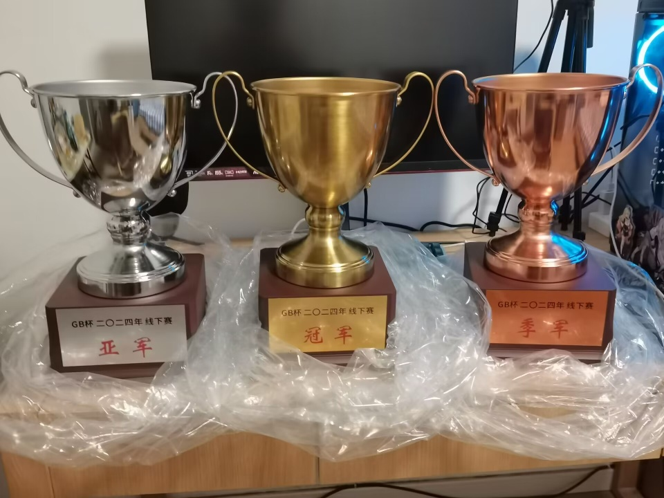
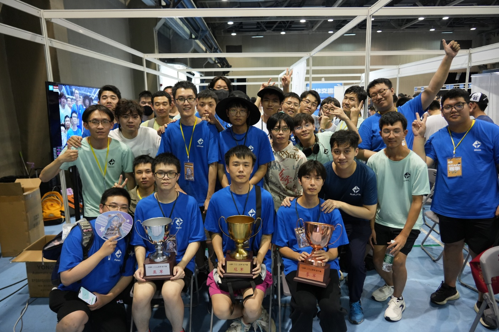

---
tags:
  - GBC
  - GBC2024
  - GBC 2024
  - GBC 2024 IRL
  - GBC2024IRL
---

# GB Cup 2024 In Real Life

**GB Cup 2024 In Real Life** (***GBC 2024 IRL***) is a osu!mania 4-key solo LAN tournament hosted by [\[GB\]yobrevelc](https://osu.ppy.sh/users/14128407) and organised by Team GB. It was the sixth instalment of the GB Cup series and the first instalment of the GB Cup IRL. This LAN tournament was held offline at the Kululu Music Game Carnival in Shanghai, China.

## Tournament schedule

| Event | Timestamp |
| --: | :-- |
| Registration phase | 2024-06-03/2024-06-30 |
| Qualifier stage | 2024-07-13/2024-07-14 |
| Offline tournament stage | 2024-07-27/2024-07-28 |

## Prizes

| Placing | Prizes |
| :-: | :-- |
|  | Profile badge, KanonBot profile badge, championship trophy, GBC pillow, GBC medal |
|  | KanonBot profile badge, 2nd place trophy, GBC pillow, GBC medal |
|  | KanonBot profile badge, 3rd place trophy, GBC pillow, GBC medal |
| *Others* | GBC pillow, GBC medal |

## Organisation

GB Cup 2024 In Real Life was run by the Team GB and various community members.

| Position | Member(s) |
| :-- | :-- |
| Host | ::{ flag=CN }:: [\[GB\]yobrevelc](https://osu.ppy.sh/users/14128407) |
| Staff | ::{ flag=CN }:: [Blue_Potion](https://osu.ppy.sh/users/13094831), ::{ flag=CN }:: [\[GB\]Reisen](https://osu.ppy.sh/users/8586018), ::{ flag=CN }:: [[GB]V1do](https://osu.ppy.sh/users/17527968), ::{ flag=CN }:: [\[GB\]Rush_FTK](https://osu.ppy.sh/users/3046856), ::{ flag=CN }:: [zeroRain-](https://osu.ppy.sh/users/30440199), ::{ flag=CN }:: [\[GB\]Akamite](https://osu.ppy.sh/users/13418334), ::{ flag=CN }:: [MidRed](https://osu.ppy.sh/users/17641994), ::{ flag=CN }:: [\[GB\]ChickenGold](https://osu.ppy.sh/users/16586663), ::{ flag=CN }:: [Mooos](https://osu.ppy.sh/users/13788556) |
| Mappool selector | ::{ flag=CN }:: [\[GB\]yobrevelc](https://osu.ppy.sh/users/14128407), ::{ flag=CN }:: [\[GB\]Reisen](https://osu.ppy.sh/users/8586018) |
| Streamer | ::{ flag=CN }:: [\[GB\]yobrevelc](https://osu.ppy.sh/users/14128407), ::{ flag=CN }:: [\[GB\]Rush_FTK](https://osu.ppy.sh/users/3046856) |
| Referee | ::{ flag=CN }:: [\[GB\]yobrevelc](https://osu.ppy.sh/users/14128407), ::{ flag=CN }:: [Blue_Potion](https://osu.ppy.sh/users/13094831), ::{ flag=CN }:: [\[GB\]Reisen](https://osu.ppy.sh/users/8586018) |
| Additional referee | ::{ flag=CN }:: [\[GB\]Mafufu](https://osu.ppy.sh/users/10884561), ::{ flag=CN }:: [\[Crz\]raber](https://osu.ppy.sh/users/6753592) |
| Statistician & wiki editor | ::{ flag=CN }:: [\[GB\]yobrevelc](https://osu.ppy.sh/users/14128407) |

## Links

- [Discussion thread](https://osu.ppy.sh/community/forums/topics/1933148?n=1)
- Livestream
  - [Bilibili stream](https://live.bilibili.com/22545296) (::{ flag=CN }:: [\[GB\]yobrevelc](https://osu.ppy.sh/users/14128407))
  - [Bilibili stream](https://live.bilibili.com/10183) (::{ flag=CN }:: [aiyulu](https://osu.ppy.sh/users/189617))
- [GBC QQ group](https://jq.qq.com/?_wv=1027&k=ZIwYVryh)
- [Day 1 VOD - Player introductions](https://www.bilibili.com/video/BV1um421374R)
- [Day 1 VOD - Round of 16](https://www.bilibili.com/video/BV1pb421J7AJ)
- [Day 2 VOD - Quarterfinals, Semifinals & Finals](https://www.bilibili.com/video/BV1pr421M7uE)

## Participants

| Tiers | Participants |
| :-- | :-- |
| Tier 1 | ::{ flag=CN }:: [\[GB\]GanyuAngel](https://osu.ppy.sh/users/27233308), ::{ flag=CN }:: [\[GB\]Mafufu](https://osu.ppy.sh/users/10884561), ::{ flag=CN }:: [\[Crz\]Xinyi2016](https://osu.ppy.sh/users/14213841), ::{ flag=CN }:: [Mantozi](https://osu.ppy.sh/users/10764424) |
| Tier 2 | ::{ flag=CN }:: [nyasunfanboy](https://osu.ppy.sh/users/14066511), ::{ flag=CN }:: [DawnX](https://osu.ppy.sh/users/8534840), ::{ flag=CN }:: [\[Crz\]Riko](https://osu.ppy.sh/users/7928981), ::{ flag=CA }:: [LazyGhost14](https://osu.ppy.sh/users/13185425) |
| Tier 3 | ::{ flag=CN }:: [\[ Classic \]](https://osu.ppy.sh/users/5858053), ::{ flag=CN }:: [Nyagato Yuki](https://osu.ppy.sh/users/32954144), ::{ flag=CN }:: [\[Crz\]raber](https://osu.ppy.sh/users/6753592), ::{ flag=CN }:: [\[Crz\]Nickname](https://osu.ppy.sh/users/10817494) |
| Tier 4 | ::{ flag=CN }:: [Shenzouz](https://osu.ppy.sh/users/29606773), ::{ flag=CN }:: [vanposen](https://osu.ppy.sh/users/15289293), ::{ flag=CN }:: [\[GB\]Burger King](https://osu.ppy.sh/users/9841162), ::{ flag=CN }:: [\[GB\]QAQlingjiu](https://osu.ppy.sh/users/27288518) |
| Qualifier | ::{ flag=CN }:: [\[GB\]KCINE](https://osu.ppy.sh/users/24289042), ::{ flag=CN }:: [neeeeeh](https://osu.ppy.sh/users/18586390), ::{ flag=CN }:: [Muze_0407](https://osu.ppy.sh/users/16551233), ::{ flag=CN }:: [Samyuan1216](https://osu.ppy.sh/users/23892945), ::{ flag=CN }:: [\[GB\]mmttyy233](https://osu.ppy.sh/users/28639641), ::{ flag=CN }:: [2580697339](https://osu.ppy.sh/users/6311072), ::{ flag=CN }:: [\[GB\]Color0](https://osu.ppy.sh/users/31417108), ::{ flag=CN }:: [bili_TYL](https://osu.ppy.sh/users/30993101), ::{ flag=CN }:: [\[ETX\]LinZi](https://osu.ppy.sh/users/28482727), ::{ flag=CN }:: [\[GB\]Fomurz](https://osu.ppy.sh/users/26883256), ::{ flag=CN }:: [qlchedan](https://osu.ppy.sh/users/15522107), ::{ flag=CN }:: [lxw200839](https://osu.ppy.sh/users/27055297), ::{ flag=CN }:: [ToukiM](https://osu.ppy.sh/users/28917056), ::{ flag=CN }:: [\[GB\]Lingyu](https://osu.ppy.sh/users/29743849), ::{ flag=CN }:: [Chiral Cabbage](https://osu.ppy.sh/users/32288791), ::{ flag=CN }:: [Zrc_2796](https://osu.ppy.sh/users/29837830), ::{ flag=CN }:: [nyasunfangirl](https://osu.ppy.sh/users/33886210), ::{ flag=CN }:: [\[GB\]THfairy](https://osu.ppy.sh/users/24972681), ::{ flag=CN }:: [SFangZhou](https://osu.ppy.sh/users/14023266), ::{ flag=CN }:: [Ghost Neko](https://osu.ppy.sh/users/31157409), ::{ flag=CN }:: [dzq](https://osu.ppy.sh/users/23697335), ::{ flag=CN }:: [\[GB\]Tyris](https://osu.ppy.sh/users/10497659), ::{ flag=CN }:: [\[AR\]lv3plane](https://osu.ppy.sh/users/15964029), ::{ flag=CN }:: [ruler](https://osu.ppy.sh/users/31497468), ::{ flag=CN }:: [c6H8o6_](https://osu.ppy.sh/users/20984576), ::{ flag=CN }:: [Starfeather2007](https://osu.ppy.sh/users/25502203), ::{ flag=CN }:: [Eliyaa](https://osu.ppy.sh/users/29547250), ::{ flag=CN }:: [\[Crz\]hinako1804](https://osu.ppy.sh/users/13747903), ::{ flag=CN }:: [6XvX7](https://osu.ppy.sh/users/33948486), ::{ flag=CN }:: [rfsfreffr](https://osu.ppy.sh/users/21693996), ::{ flag=CN }:: [Takoke](https://osu.ppy.sh/users/11628037), ::{ flag=CN }:: [Kirchhoff123](https://osu.ppy.sh/users/29546640), ::{ flag=CN }:: [nick-haoran](https://osu.ppy.sh/users/29944863), ::{ flag=CN }:: [shuaize](https://osu.ppy.sh/users/29620953), ::{ flag=CN }:: [\[Crz\]Sirius](https://osu.ppy.sh/users/8692698), ::{ flag=CN }:: [CLLbin](https://osu.ppy.sh/users/11837219), ::{ flag=CN }:: [awask233](https://osu.ppy.sh/users/30750250) |

## Podium

This competition has come to an end and resulted in the following podium:

| Placing | Player |
| :-: | :-- |
|  | DawnX |
|  | [GB]GanyuAngel |
|  | Mantozi |

## Mappools

Due to the large number of mappools, please refer to the [main spreadsheet](https://docs.qq.com/sheet/DTXVYY2RBa1FyTlp2?tab=BB08J2) for more information.

## Match results

### Finals

Detailed statistics for this round can be found [here](https://docs.qq.com/sheet/DTWpxUkN6SGtrS29m?tab=2wyqnu).

Sunday, 28 July 2024:

| Player A |  |  | Player B | Match link |
| --: | :-: | :-: | :-- | :-- |
| nyasunfanboy | -1 | **0** | **Mantozi** |  |
| [GB]GanyuAngel | 1 | **6** | **DawnX** | [#1](https://osu.ppy.sh/community/matches/114845682) |

### Semifinals

Detailed statistics for this round can be found [here](https://docs.qq.com/sheet/DTWpxUkN6SGtrS29m?tab=2wyqnu).

Sunday, 28 July 2024:

| Player A |  |  | Player B | Match link |
| --: | :-: | :-: | :-- | :-- |
| **[GB]GanyuAngel** | **5** | 1 | Mantozi | [#1](https://osu.ppy.sh/community/matches/114845271) |
| **DawnX** | **0** | -1 | nyasunfanboy |  |

### Quarterfinals

Detailed statistics for this round can be found [here](https://docs.qq.com/sheet/DTWpxUkN6SGtrS29m?tab=2wyqnu).

Sunday, 28 July 2024:

| Player A |  |  | Player B | Match link |
| --: | :-: | :-: | :-- | :-- |
| **[GB]GanyuAngel** | **5** | 0 | Nyagato Yuki | [#1](https://osu.ppy.sh/community/matches/114843943) |
| **Mantozi** | **5** | 1 | LazyGhost14 | [#1](https://osu.ppy.sh/community/matches/114844196) |
| [GB]Mafufu | 2 | **5** | **DawnX** | [#1](https://osu.ppy.sh/community/matches/114844470) |
| [Crz]Xinyi2016 | 4 | **5** | **nyasunfanboy** | [#1](https://osu.ppy.sh/community/matches/114844838) |

### Round of 16

Detailed statistics for this round can be found [here](https://docs.qq.com/sheet/DTWpxUkN6SGtrS29m?tab=2wyqnu).

Saturday, 27 July 2024:

| Player A |  |  | Player B | Match link |
| --: | :-: | :-: | :-- | :-- |
| **[GB]GanyuAngel** | **4** | 0 | Shenzouz | [#1](https://osu.ppy.sh/community/matches/114831199) |
| [Crz]Riko | 0 | **4** | **Nyagato Yuki** | [#1](https://osu.ppy.sh/community/matches/114832202) |
| **Mantozi** | **4** | 1 | [GB]QAQlingjiu | [#1](https://osu.ppy.sh/community/matches/114832361) |
| **LazyGhost14** | **4** | 1 | [Crz]raber | [#1](https://osu.ppy.sh/community/matches/114831955) |
| **[GB]Mafufu** | **4** | 0 | vanposen | [#1](https://osu.ppy.sh/community/matches/114831457) |
| **DawnX** | **4** | 0 | [ Classic ] | [#1](https://osu.ppy.sh/community/matches/114831736) |
| **[Crz]Xinyi2016** | **4** | 1 | [GB]Burger King | [#1](https://osu.ppy.sh/community/matches/114830450) |
| **nyasunfanboy** | **4** | 1 | [Crz]Nickname | [#1](https://osu.ppy.sh/community/matches/114830678) |

### Regular Stage

Due to the large number of players and matches, the match results will be displayed in the **[information spreadsheet](https://docs.qq.com/sheet/DTWpxUkN6SGtrS29m?tab=j9vlga)**.

## Qualifier instructions

1. There are 8 maps in the qualifier mappool.
2. The ranking in qualifiers is determined by the sum of a player's rank in each map.
3. The top 16 players in the qualifier will enter the main competition. They will be divided into 4 tiers according to the player ranking and randomly assigned into 4 quarter zones, where every quarter will forcibly include 1 player from each tier. The first round of the game is fixed as tier 1 vs. tier 4, and tier 2 vs. tier 3.
4. After the qualifier round, if any qualified player withdraws, their ranking will be replaced by the next player, and so on.

## Tournament rules

1. There is no warm-up phase for the match.
2. The main competition is a single-elimination knockout competition with a total of 16 players. The Round of 16 is a best-of-7 game, the Quarterfinals and Semifinals are a best-of-9 game, and the Final is a best-of-11 game.
3. There are three maps for each slot in the mappool. When selecting a map, you can only select the position. The specific map to be used will be determined by random `!roll` on the spot.
4. During the protect phase, both players choose a slot and assign it to a specific map. The map of this slot will not be randomised in subsequent selections. If this slot gets picked, the map will directly be selected. Additionally, this slot cannot be banned.
5. During the ban phase, both players will ban all the maps of one slot.
6. When the two sides are tied and the last point is decided, the last map will be a tiebreaker. At this time, both sides will ban one map at the same time through the referee. If different maps are banned, the remaining one will be the map played; if the same map is banned, one map will be randomly selected from the remaining two maps.
7. Each side will have two minutes to choose a map. If the timeout is reached, the referee will randomly select an unselected map from the mappool. After the map is selected, both players have two minutes to get ready.
8. Possible mod choices for the FreeMod bracket are NoFail, Hidden, Fade In, Flashlight, and Mirror.
9. There are no restrictions on whether both players can choose or not choose a certain map, except that the selected map must be in the game mappool, and you cannot choose a map that has been selected in the game, and you cannot choose the tiebreaker.
10. In the case of a tie, the beatmap will be rematched, but not more than twice.
11. Players are allowed to rematch if any player disconnects early on during a beatmap. Send a message as soon as possible in the match room chat to notify the referee to restart the match.
12. If necessary, the referee has the right to decide the implementation of the rules at their own discretion and has the final say on events that occur during the game.
