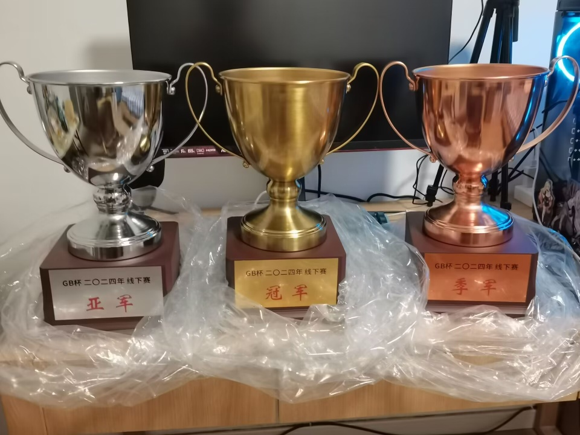

---
tags:
  - GBC
  - GBC2024
  - GBC 2024
  - GBC 2024 IRL
  - GBC2024IRL
---

# GB杯 2024 线下赛

**GBC 2024 IRL** (***GB杯2024线下赛***) 是由[\[GB\]yobrevelc](https://osu.ppy.sh/users/14128407)主办，由GB组织承办，在库璐璐音游嘉年华线下进行的osu!mania 4k 项目赛事。

## 比赛日程

| 事项 | 时间 |
| --: | :-- |
| 选手注册 | 2024-6-3/2024-6-30 |
| 资格赛 | 2024-7-13/2024-7-14 |
| 线下赛 | 2024-7-27/2024-7-28 |

## 奖励

| 名次 | 奖励 |
| :-: | :-- |
|  | 主页奖章 + 喵喵定制勋章 + 冠军奖杯 + 抱枕 + 周边 |
|  | 喵喵定制勋章 + 亚军奖杯 + 抱枕 + 周边 |
|  | 喵喵定制勋章 + 季军奖杯 + 抱枕 + 周边 |
| *其他* | 抱枕 + 周边 |

## 工作人员

GB杯2024线下赛由 GB 成员和多位社区成员举办。

| 职位 | 成员 |
| :-- | :-- |
| 组织者 | ::{ flag=CN }:: [\[GB\]yobrevelc](https://osu.ppy.sh/users/14128407) |
| 工作人员 | ::{ flag=CN }:: [Blue_Potion](https://osu.ppy.sh/users/13094831), ::{ flag=CN }:: [\[GB\]Reisen](https://osu.ppy.sh/users/8586018), ::{ flag=CN }:: [[GB]V1do](https://osu.ppy.sh/users/17527968), ::{ flag=CN }:: [\[GB\]Rush_FTK](https://osu.ppy.sh/users/3046856), ::{ flag=CN }:: [zeroRain-](https://osu.ppy.sh/users/30440199), ::{ flag=CN }:: [\[GB\]Akamite](https://osu.ppy.sh/users/13418334), ::{ flag=CN }:: [MidRed](https://osu.ppy.sh/users/17641994), ::{ flag=CN }:: [\[GB\]ChickenGold](https://osu.ppy.sh/users/16586663), ::{ flag=CN }:: [Mooos](https://osu.ppy.sh/users/13788556) |
| 图池管理 | ::{ flag=CN }:: [\[GB\]yobrevelc](https://osu.ppy.sh/users/14128407), ::{ flag=CN }:: [\[GB\]Reisen](https://osu.ppy.sh/users/8586018) |
| 转播 | ::{ flag=CN }:: [\[GB\]yobrevelc](https://osu.ppy.sh/users/14128407), ::{ flag=CN }:: [\[GB\]Rush_FTK](https://osu.ppy.sh/users/3046856) |
| 裁判 | ::{ flag=CN }:: [\[GB\]yobrevelc](https://osu.ppy.sh/users/14128407), ::{ flag=CN }:: [Blue_Potion](https://osu.ppy.sh/users/13094831), ::{ flag=CN }:: [\[GB\]Reisen](https://osu.ppy.sh/users/8586018) |
| 额外裁判 | ::{ flag=CN }:: [\[GB\]Mafufu](https://osu.ppy.sh/users/10884561), ::{ flag=CN }:: [\[Crz\]raber](https://osu.ppy.sh/users/6753592) |
| 文档编写/数据统计 | ::{ flag=CN }:: [\[GB\]yobrevelc](https://osu.ppy.sh/users/14128407) |

## 链接

- [主表格](https://docs.qq.com/sheet/DTWpxUkN6SGtrS29m)
- [报名表](https://wj.qq.com/s2/14725915/d201/)
- [中文论坛帖](https://osu.ppy.sh/community/forums/topics/1933148?n=1)
- 直播间
  - [主舞台](https://live.bilibili.com/22545296) (::{ flag=CN }:: [\[GB\]yobrevelc](https://osu.ppy.sh/users/14128407))
  - [副舞台](https://live.bilibili.com/10183) (::{ flag=CN }:: [aiyulu](https://osu.ppy.sh/users/189617))
- [QQ 群](https://jq.qq.com/?_wv=1027&k=ZIwYVryh)
- [第一天抽签录像](https://www.bilibili.com/video/BV1um421374R)
- [第一天比赛录像](https://www.bilibili.com/video/BV1pb421J7AJ)
- [第二天比赛录像](https://www.bilibili.com/video/BV1pr421M7uE)

## 参赛选手

| 参赛选手 |
| :-- |
| ::{ flag=CN }:: [\[ Classic \]](https://osu.ppy.sh/users/5858053), ::{ flag=CN }:: [Nyagato Yuki](https://osu.ppy.sh/users/32954144), ::{ flag=CN }:: [\[GB\]KCINE](https://osu.ppy.sh/users/24289042), ::{ flag=CN }:: [neeeeeh](https://osu.ppy.sh/users/18586390), ::{ flag=CN }:: [Shenzouz](https://osu.ppy.sh/users/29606773), ::{ flag=CN }:: [Muze_0407](https://osu.ppy.sh/users/16551233), ::{ flag=CN }:: [Samyuan1216](https://osu.ppy.sh/users/23892945), ::{ flag=CN }:: [\[GB\]mmttyy233](https://osu.ppy.sh/users/28639641), ::{ flag=CN }:: [2580697339](https://osu.ppy.sh/users/6311072), ::{ flag=CN }:: [\[GB\]Mafufu](https://osu.ppy.sh/users/10884561), ::{ flag=CN }:: [\[GB\]Color0](https://osu.ppy.sh/users/31417108), ::{ flag=CN }:: [bili_TYL](https://osu.ppy.sh/users/30993101), ::{ flag=CN }:: [\[Crz\]Nickname](https://osu.ppy.sh/users/10817494), ::{ flag=CN }:: [\[ETX\]LinZi](https://osu.ppy.sh/users/28482727), ::{ flag=CN }:: [\[GB\]Fomurz](https://osu.ppy.sh/users/26883256), ::{ flag=CN }:: [\[GB\]Burger King](https://osu.ppy.sh/users/9841162), ::{ flag=CN }:: [\[Crz\]raber](https://osu.ppy.sh/users/6753592), ::{ flag=CN }:: [\[GB\]GanyuAngel](https://osu.ppy.sh/users/27233308), ::{ flag=CN }:: [vanposen](https://osu.ppy.sh/users/15289293), ::{ flag=CN }:: [qlchedan](https://osu.ppy.sh/users/15522107), ::{ flag=CN }:: [lxw200839](https://osu.ppy.sh/users/27055297), ::{ flag=CN }:: [\[Crz\]Xinyi2016](https://osu.ppy.sh/users/14213841), ::{ flag=CN }:: [\[Crz\]Riko](https://osu.ppy.sh/users/7928981), ::{ flag=CN }:: [ToukiM](https://osu.ppy.sh/users/28917056), ::{ flag=CN }:: [\[GB\]Lingyu](https://osu.ppy.sh/users/29743849), ::{ flag=CA }:: [LazyGhost14](https://osu.ppy.sh/users/13185425), ::{ flag=CN }:: [Chiral Cabbage](https://osu.ppy.sh/users/32288791), ::{ flag=CN }:: [DawnX](https://osu.ppy.sh/users/8534840), ::{ flag=CN }:: [Zrc_2796](https://osu.ppy.sh/users/29837830), ::{ flag=CN }:: [nyasunfangirl](https://osu.ppy.sh/users/33886210), ::{ flag=CN }:: [\[GB\]THfairy](https://osu.ppy.sh/users/24972681), ::{ flag=CN }:: [SFangZhou](https://osu.ppy.sh/users/14023266), ::{ flag=CN }:: [Ghost Neko](https://osu.ppy.sh/users/31157409), ::{ flag=CN }:: [dzq](https://osu.ppy.sh/users/23697335), ::{ flag=CN }:: [\[GB\]Tyris](https://osu.ppy.sh/users/10497659), ::{ flag=CN }:: [\[AR\]lv3plane](https://osu.ppy.sh/users/15964029), ::{ flag=CN }:: [ruler](https://osu.ppy.sh/users/31497468), ::{ flag=CN }:: [Mantozi](https://osu.ppy.sh/users/10764424), ::{ flag=CN }:: [c6H8o6_](https://osu.ppy.sh/users/20984576), ::{ flag=CN }:: [Starfeather2007](https://osu.ppy.sh/users/25502203), ::{ flag=CN }:: [Eliyaa](https://osu.ppy.sh/users/29547250), ::{ flag=CN }:: [\[Crz\]hinako1804](https://osu.ppy.sh/users/13747903), ::{ flag=CN }:: [\[GB\]QAQlingjiu](https://osu.ppy.sh/users/27288518), ::{ flag=CN }:: [6XvX7](https://osu.ppy.sh/users/33948486), ::{ flag=CN }:: [rfsfreffr](https://osu.ppy.sh/users/21693996), ::{ flag=CN }:: [Takoke](https://osu.ppy.sh/users/11628037), ::{ flag=CN }:: [Kirchhoff123](https://osu.ppy.sh/users/29546640), ::{ flag=CN }:: [nick-haoran](https://osu.ppy.sh/users/29944863), ::{ flag=CN }:: [nyasunfanboy](https://osu.ppy.sh/users/14066511), ::{ flag=CN }:: [shuaize](https://osu.ppy.sh/users/29620953), ::{ flag=CN }:: [\[Crz\]Sirius](https://osu.ppy.sh/users/8692698), ::{ flag=CN }:: [CLLbin](https://osu.ppy.sh/users/11837219), ::{ flag=CN }:: [awask233](https://osu.ppy.sh/users/30750250) |

## 领奖台

本届赛事已经结束，下面三位选手登上了领奖台：

| 名次 | 选手 |
| :-: | :-- |
|  | DawnX |
|  | [GB]GanyuAngel |
|  | Mantozi |

## 图池

由于图池数量较多，请于[主表格](https://docs.qq.com/sheet/DTXVYY2RBa1FyTlp2?tab=BB08J2)获取更多信息。

## 赛果

### 决赛

本轮比赛的详细数据统计可以于[这里](https://docs.qq.com/sheet/DTWpxUkN6SGtrS29m?tab=2wyqnu)查看。

2024 年 7 月 28 日，星期日

| 红队 |  |  | 蓝队 | 比赛链接 |
| --: | :-: | :-: | :-- | :-- |
| nyasunfanboy | FF | **0** | **Mantozi** | - |
| [GB]GanyuAngel | 1 | **6** | **DawnX** | [#1](https://osu.ppy.sh/community/matches/114845682) |

### 半决赛

本轮比赛的详细数据统计可以于[这里](https://docs.qq.com/sheet/DTWpxUkN6SGtrS29m?tab=2wyqnu)查看。

2024 年 7 月 28 日，星期日

| 红队 |  |  | 蓝队 | 比赛链接 |
| --: | :-: | :-: | :-- | :-- |
| **[GB]GanyuAngel** | **5** | 1 | Mantozi | [#1](https://osu.ppy.sh/community/matches/114845271) |
| **DawnX** | **0** | FF | nyasunfanboy | - |

### 四分之一决赛

本轮比赛的详细数据统计可以于[这里](https://docs.qq.com/sheet/DTWpxUkN6SGtrS29m?tab=2wyqnu)查看。

2024 年 7 月 28 日，星期日

| 红队 |  |  | 蓝队 | 比赛链接 |
| --: | :-: | :-: | :-- | :-- |
| **[GB]GanyuAngel** | **5** | 0 | Nyagato Yuki | [#1](https://osu.ppy.sh/community/matches/114843943) |
| **Mantozi** | **5** | 1 | LazyGhost14 | [#1](https://osu.ppy.sh/community/matches/114844196) |
| [GB]Mafufu | 2 | **5** | **DawnX** | [#1](https://osu.ppy.sh/community/matches/114844470) |
| [Crz]Xinyi2016 | 4 | **5** | **nyasunfanboy** | [#1](https://osu.ppy.sh/community/matches/114844838) |

### 十六强赛

本轮比赛的详细数据统计可以于[这里](https://docs.qq.com/sheet/DTWpxUkN6SGtrS29m?tab=2wyqnu)查看。

2024 年 7 月 27 日，星期六

| 红队 |  |  | 蓝队 | 比赛链接 |
| --: | :-: | :-: | :-- | :-- |
| **[GB]GanyuAngel** | **4** | 0 | Shenzouz | [#1](https://osu.ppy.sh/community/matches/114831199) |
| [Crz]Riko | 0 | **4** | **Nyagato Yuki** | [#1](https://osu.ppy.sh/community/matches/114832202) |
| **Mantozi** | **4** | 1 | [GB]QAQlingjiu | [#1](https://osu.ppy.sh/community/matches/114832361) |
| **LazyGhost14** | **4** | 1 | [Crz]raber | [#1](https://osu.ppy.sh/community/matches/114831955) |
| **[GB]Mafufu** | **4** | 0 | vanposen | [#1](https://osu.ppy.sh/community/matches/114831457) |
| **DawnX** | **4** | 0 | [ Classic ] | [#1](https://osu.ppy.sh/community/matches/114831736) |
| **[Crz]Xinyi2016** | **4** | 1 | [GB]Burger King | [#1](https://osu.ppy.sh/community/matches/114830450) |
| **nyasunfanboy** | **4** | 1 | [Crz]Nickname | [#1](https://osu.ppy.sh/community/matches/114830678) |

### 资格赛

由于选手和场次非常多，将使用 **[赛事信息表格](https://docs.qq.com/sheet/DTWpxUkN6SGtrS29m?tab=j9vlga)** 呈现赛果。

## 资格赛规则

1. 资格赛图池共有8张谱面。
2. 资格赛排名根据选手的单图排名和决定。
3. 资格赛总排名前16的选手将会进入正赛，根据选手排名分为4个档位，每个档位各随机抽取一人分到一个半区，第一轮比赛固定为一档打四档，二档打三档。
4. 资格赛结束后如有入围选手退赛，则其排名将由下一位玩家递补，以此类推。

## 正赛规则

1. 比赛没有热手阶段。
2. 正赛为单败淘汰赛，共16名选手，十六强赛为七局四胜，四分之一决赛和半决赛为九局五胜，决赛为十一局六胜。
3. 图池每个位置共有三张图，选择谱面时只能选择位置，具体使用哪张谱面将现场随机roll点决定
4. 保护阶段时，双方玩家各选择一个位置并指定到具体某一张谱面，后续选择时此位置的谱面不进行随机，直接选择该谱面，且不可被禁用
5. 禁用阶段时，双方玩家各禁用一个位置的全部谱面
6. 在双方平局打到最后一分决胜时，最后一张图将会采用Tiebreaker。此时双方经由裁判同时各禁用一张谱面。如禁用了不同谱面，则剩下的一张即为比赛谱面；如禁用了相同的谱面，则从剩下两张谱面中随机选择一张比赛。
7. 每一方将会有2分钟的时间来选图。如果选图超时则会由裁判随机选择图池里一个未选谱面进行比赛。选完图后双方有2分钟的时间就位。
8. 在常图比赛中可以选择mod，可选择的包括：MR，HD，FI，FL和NF。
9. 对于双方选或不选某张图将没有限制，除了所选的图必须是比赛图池中的，并且比赛中不能选已经选过的图，而且不能选Tiebreaker。
10. 如果在一张图中出现平局，这张图将被重开。一张图将不会重开超过两次。
11. 每个选手最多被允许一次由于掉线或其他技术性问题造成的重开（请及时在游戏内发送信息通知裁判要求重开），并且该次比赛还没超过30秒和全图的1/4。在比赛重开时必须使用与之前相同的mod和图。请务必在比赛前修复任何可能的问题。
12. 如有必要，裁判有权利自行决定规则的实施，并对比赛期间发生的事件有最终裁决权。
