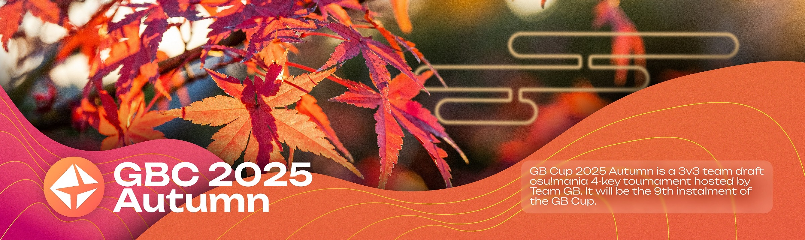

---
tags:
  - GBC
  - GB Cup
  - GBC2025
  - GBC 2025
  - GBC2025Autumn
  - GBC 2025 Autumn
---

# GBC 2025 秋季赛

**GBC 2025 秋季赛** (***GB 杯 2025 秋季赛***) 是由 GB 组织主办的 3v3 队长选秀制 osu!mania 4k 项目赛事。本届比赛是 GBC 系列赛事的第九届正式比赛。

## 比赛日程

| 事件 | 时间 |
| --: | :-- |
| 报名阶段 | 2025-10-19/2025-11-02 (14:00 UTC) |
| 资格赛图池展示 | 2025-11-02 (14:00 UTC) |
| 资格赛 | 2025-11-08/2025-11-09 |
| 资格赛结果展示 | 2025-11-11 (12:00 UTC) |
| 选秀阶段 | 2025-11-15 |
| 小组赛第一周图池展示 | 2025-11-16 |
| 小组赛第一轮 | 2025-11-22/2025-11-23 |
| 小组赛第二轮 | 2025-11-29/2025-11-30 |
| 小组赛第三轮 | 2025-12-06/2025-12-07 |
| 十六强赛 | 2025-12-13/2025-12-14 |
| 八强赛 | 2025-12-20/2025-12-21 |
| 半决赛 | 2025-12-27/2025-12-28 |
| 决赛 | 2025-01-03/2025-01-04 |

## 奖励

### QQ 赛区

| 队伍排名 | 奖励 |
| :-: | :-- |
|  | 个人资料页缎带，¥200 |
|  | ¥200 |
|  | ¥150 |
| *殿军* | ¥150 |
| *第 5-8 名* | ¥100 |
| *第 9-16 名* | ¥50 |

| 资格赛排名 | 奖励 |
| :-: | :-- |
| *第 1 名* | ¥90 |
| *第 2 名* | ¥80 |
| *第 3 名* | ¥70 |
| *第 4 名* | ¥60 |
| *第 5-8 名* | ¥50 |
| *第 9-16 名* | ¥40 |
| *第 17-24 名* | ¥30 |
| *第 25-120 名* | ¥10 |

### Discord 赛区

| 队伍排名 | 奖励 |
| :-: | :-- |
|  | 个人资料页缎带，每人2个月osu!supporter |
|  | 每人2个月osu!supporter |
|  | 每人1个月osu!supporter |
| *殿军* | 每人1个月osu!supporter |

| 资格赛排名 | 奖励 |
| :-: | :-- |
| *第 1 名* | 4个月supporter |
| *第 2-8 名* | 2个月supporter |
| *第 9-24 名* | 1个月supporter |

## 组织

GBC 2025 秋季赛由 GB 成员和多位社区成员举办。

| 职位 | 成员 |
| :-- | :-- |
| 主办方 | ::{ flag=CN }:: [\[GB\]yobrevelc](https://osu.ppy.sh/users/14128407) |
| 图池管理 | ::{ flag=CN }:: [\[GB\]yobrevelc](https://osu.ppy.sh/users/14128407), ::{ flag=CN }:: [V1do-](https://osu.ppy.sh/users/17527968), ::{ flag=PE }:: [Sakisagee](https://osu.ppy.sh/users/9938020) |
| 谱师 | ::{ flag=CN }:: [V1do-](https://osu.ppy.sh/users/17527968), ::{ flag=CN }:: [PORTTAYER](https://osu.ppy.sh/users/8790200), ::{ flag=CN }:: [RTrigger](https://osu.ppy.sh/users/25308131), ::{ flag=CN }:: [\[GB\]Cinelia](https://osu.ppy.sh/users/24289042), ::{ flag=CN }:: [Yuiesta](https://osu.ppy.sh/users/13953619), ::{ flag=HK }:: [popy](https://osu.ppy.sh/users/30829023), ::{ flag=CN }:: [-Oblivionis-](https://osu.ppy.sh/users/28287800), ::{ flag=CN }:: [\[GB\]Fomurz](https://osu.ppy.sh/users/26883256), ::{ flag=HK }:: [-SoraIro-](https://osu.ppy.sh/users/11493286), ::{ flag=PE }:: [Sakisagee](https://osu.ppy.sh/users/9938020), ::{ flag=US }:: [KimMui](https://osu.ppy.sh/users/26090734), ::{ flag=CN }:: [chy030_ft_pH5_6](https://osu.ppy.sh/users/9492856), ::{ flag=CN }:: [- Hitsuumi -](https://osu.ppy.sh/users/17610080), ::{ flag=CN }:: [\[GB\]Tyris](https://osu.ppy.sh/users/10497659), ::{ flag=PE }:: [Miaurichesu](https://osu.ppy.sh/users/10055648), ::{ flag=KR }:: [\[GB\]Oceanus](https://osu.ppy.sh/users/9164100), ::{ flag=VN }:: [Lott](https://osu.ppy.sh/users/13821222), ::{ flag=CN }:: [Blue_Potion](https://osu.ppy.sh/users/13094831), ::{ flag=CN }:: [Old pigeon](https://osu.ppy.sh/users/26116770), ::{ flag=CN }:: [nyasun](https://osu.ppy.sh/users/16277321), ::{ flag=CN }:: [Ninesey](https://osu.ppy.sh/users/25454675), ::{ flag=CN }:: [MyAngelLaPluma](https://osu.ppy.sh/users/34427162), ::{ flag=VN }:: [/[GB/]Kita](https://osu.ppy.sh/users/27175001) |
| SV 团队 | ::{ flag=VN }:: [Lott](https://osu.ppy.sh/users/13821222), ::{ flag=CN }:: [xxuurruuii](https://osu.ppy.sh/users/33733361), ::{ flag=CN }:: [-Oblivionis-](https://osu.ppy.sh/users/28287800), ::{ flag=PE }:: [kamikho](https://osu.ppy.sh/users/12664851), ::{ flag=HK }:: [PokeSky](https://osu.ppy.sh/users/3617111), ::{ flag=KR }:: [Furryswan](https://osu.ppy.sh/users/9555243) |
| 图池帮助者 | ::{ flag=VN }:: [Micleak](https://osu.ppy.sh/users/16140674), ::{ flag=TW }:: [\[Crz\]FolAH1217](https://osu.ppy.sh/users/6232458), ::{ flag=PH }:: [Akatsumi Chan](https://osu.ppy.sh/users/11306351) |
| 测试 | ::{ flag=TH }:: [parponger](https://osu.ppy.sh/users/28098890), ::{ flag=UA }:: [Concepte](https://osu.ppy.sh/users/18563362), ::{ flag=CN }:: [\[GB\]Tyris](https://osu.ppy.sh/users/10497659), ::{ flag=CN }:: [-Oblivionis-](https://osu.ppy.sh/users/28287800), ::{ flag=CN }:: [MyAngelLaPluma](https://osu.ppy.sh/users/34427162), ::{ flag=CN }:: [ParadigmaticOwl](https://osu.ppy.sh/users/36570108), ::{ flag=US }:: [Tevelkin](https://osu.ppy.sh/users/18508394), ::{ flag=HK }:: [minatoaquafan69](https://osu.ppy.sh/users/18111392), ::{ flag=CN }:: [\[GB\]Cinelia](https://osu.ppy.sh/users/24289042), ::{ flag=CN }:: [\[GB\]Fomurz](https://osu.ppy.sh/users/26883256), ::{ flag=HK }:: [/[Mom/] xbob](https://osu.ppy.sh/users/18481445), ::{ flag=CN }:: [ComboPower](https://osu.ppy.sh/users/19477584), ::{ flag=CN }:: [Yuiesta](https://osu.ppy.sh/users/13953619), ::{ flag=CN }:: [Old pigeon](https://osu.ppy.sh/users/26116770), ::{ flag=CN }:: [Pleia_](https://osu.ppy.sh/users/32651686), ::{ flag=CN }:: [xxuurruuii](https://osu.ppy.sh/users/33733361), ::{ flag=CN }:: [\[GB\]THFairy](https://osu.ppy.sh/users/24972681), ::{ flag=CN }:: [/[GB/]ruler](https://osu.ppy.sh/users/31497468), ::{ flag=CN }:: [SaltFalt](https://osu.ppy.sh/users/31185655) |
| 裁判 | ::{ flag=CN }:: [\[GB\]yobrevelc](https://osu.ppy.sh/users/14128407), ::{ flag=CN }:: [aiyiku](https://osu.ppy.sh/users/20094349), ::{ flag=CN }:: [/[GB/]Color0](https://osu.ppy.sh/users/31417108), ::{ flag=CN }:: [zhangjunyan](https://osu.ppy.sh/users/12729608), ::{ flag=CN }:: [\[GB\]80zero](https://osu.ppy.sh/users/12301332), ::{ flag=CA }:: [ERA Sunny](https://osu.ppy.sh/users/16468962), ::{ flag=CN }:: [Old pigeon](https://osu.ppy.sh/users/26116770), ::{ flag=ID }:: [Kurami_San](https://osu.ppy.sh/users/8867495), ::{ flag=CN }:: [\[GB\]ChickenGold](https://osu.ppy.sh/users/16586663), ::{ flag=CN }:: [Mooos](https://osu.ppy.sh/users/13788556), ::{ flag=CN }:: [heipizhu](https://osu.ppy.sh/users/29319435), ::{ flag=DE }:: [TheHunter1](https://osu.ppy.sh/users/6496016), ::{ flag=CN }:: [V1do-](https://osu.ppy.sh/users/17527968), ::{ flag=HK }:: [popy](https://osu.ppy.sh/users/30829023), ::{ flag=CN }:: [LightingT](https://osu.ppy.sh/users/34739432), ::{ flag=CN }:: [\[GB\]Lingyu](https://osu.ppy.sh/users/29743849), ::{ flag=PE }:: [Sakisagee](https://osu.ppy.sh/users/9938020), ::{ flag=CN }:: [Yuiesta](https://osu.ppy.sh/users/13953619), ::{ flag=US }:: [akace100](https://osu.ppy.sh/users/9308128) |
| 转播 | ::{ flag=CN }:: [\[GB\]yobrevelc](https://osu.ppy.sh/users/14128407), ::{ flag=US }:: [EpsilonMaiagare](https://osu.ppy.sh/users/3855052), ::{ flag=CN }:: [cibuleng](https://osu.ppy.sh/users/29492852), ::{ flag=HK }:: [/[Mom/] xbob](https://osu.ppy.sh/users/18481445), ::{ flag=CN }:: [Mrhbyy](https://osu.ppy.sh/users/16491593), ::{ flag=CN }:: [\[GB\]Cinelia](https://osu.ppy.sh/users/24289042), ::{ flag=CN }:: [aiyulu](https://osu.ppy.sh/users/189617), ::{ flag=CN }:: [/[GB/]r3uz](https://osu.ppy.sh/users/27583184), ::{ flag=CN }:: [\[GB\]Tyris](https://osu.ppy.sh/users/10497659), ::{ flag=CN }:: [\[GB\]gluefly](https://osu.ppy.sh/users/8715409), ::{ flag=CN }:: [V1do-](https://osu.ppy.sh/users/17527968), ::{ flag=CN }:: [Yuiesta](https://osu.ppy.sh/users/13953619) |
| 解说 | ::{ flag=CN }:: [\[GB\]yobrevelc](https://osu.ppy.sh/users/14128407), ::{ flag=CN }:: [\[GB\]THFairy](https://osu.ppy.sh/users/24972681), ::{ flag=CN }:: [V1do-](https://osu.ppy.sh/users/17527968), ::{ flag=VN }:: [Lott](https://osu.ppy.sh/users/13821222), ::{ flag=CN }:: [Yuiesta](https://osu.ppy.sh/users/13953619), ::{ flag=HK }:: [/[Mom/] xbob](https://osu.ppy.sh/users/18481445), ::{ flag=CN }:: [Kirchhoff123](https://osu.ppy.sh/users/29546640), ::{ flag=HK }:: [popy](https://osu.ppy.sh/users/30829023), ::{ flag=AU }:: [nick-haoran](https://osu.ppy.sh/users/29944863) |
| 设计 | ::{ flag=RU }:: [MemeBen](https://osu.ppy.sh/users/18171966), ::{ flag=CN }:: [Yuiesta](https://osu.ppy.sh/users/13953619), ::{ flag=CN }:: [RiceSS](https://osu.ppy.sh/users/8271436) |
| 数据统计&wiki编写 | ::{ flag=CN }:: [\[GB\]yobrevelc](https://osu.ppy.sh/users/14128407) |

## 链接

- [论坛讨论帖 (英文)](https://osu.ppy.sh/community/forums/topics/2142402?n=1)
- [论坛讨论帖 (中文)](https://osu.ppy.sh/community/forums/topics/2142405?n=1)
- 直播间
  - [主舞台](https://live.bilibili.com/22545296) (::{ flag=CN }:: [\[GB\]yobrevelc](https://osu.ppy.sh/users/14128407))
  - [副舞台](https://live.bilibili.com/10183) (::{ flag=CN }:: [aiyulu](https://osu.ppy.sh/users/189617))
  - [Twitch直播间](https://www.twitch.tv/gbc_official)
- [比赛 QQ 群](https://jq.qq.com/?_wv=1027&k=ZIwYVryh)
- [比赛 Discord 服务器](https://discord.gg/qpJjGuYyC5)
- [赛事信息表格](https://docs.qq.com/sheet/DTUFob09nRkR6ZkNN)
- [数据统计表格](https://docs.qq.com/sheet/DTnBtQ0Z1eHVtWWRy)

## 参赛选手

### QQ赛区

| # | 队伍 | 队员 |
| :-: | :-- | :-- |
| Q1 | **GBC终末旅行** | ::{ flag=CN }:: **[shadiaojunshi](https://osu.ppy.sh/users/29165753)**, ::{ flag=CN }:: [6XvX7](https://osu.ppy.sh/users/29165753)**, ::{ flag=CN }:: [chana](https://osu.ppy.sh/users/29165753)**, ::{ flag=CN }:: [Ph4nt0mx](https://osu.ppy.sh/users/29165753)**, ::{ flag=CN }:: [xingeng](https://osu.ppy.sh/users/29165753) |
| Q2 | **下学乘三加下班乘二** | ::{ flag=CN }:: **[[GB]ParasolTree](https://osu.ppy.sh/users/27552902)**, ::{ flag=CN }:: [GinaFujino](https://osu.ppy.sh/users/27552902)**, ::{ flag=CN }:: [[GB]gluefly](https://osu.ppy.sh/users/27552902)**, ::{ flag=CN }:: [laERUAla](https://osu.ppy.sh/users/27552902)**, ::{ flag=CN }:: [sliverbell](https://osu.ppy.sh/users/27552902) |
| Q3 | **我已经挠了你的皮鼓** | ::{ flag=CN }:: **[LiangFenFan](https://osu.ppy.sh/users/15183087)**, ::{ flag=CN }:: [MyAngelTlipoca](https://osu.ppy.sh/users/15183087)**, ::{ flag=CN }:: [hanSPlayer](https://osu.ppy.sh/users/15183087)**, ::{ flag=CN }:: [mfsOvO](https://osu.ppy.sh/users/15183087)**, ::{ flag=CN }:: [J8xy](https://osu.ppy.sh/users/15183087) |
| Q4 | **玩不玩** | ::{ flag=CN }:: **[Kirchhoff123](https://osu.ppy.sh/users/29546640)**, ::{ flag=CN }:: [Yominazuki](https://osu.ppy.sh/users/29546640)**, ::{ flag=CN }:: [Nageki_](https://osu.ppy.sh/users/29546640)**, ::{ flag=CN }:: [ReimiliaScarlet](https://osu.ppy.sh/users/29546640)**, ::{ flag=CN }:: [Plus_QwQ](https://osu.ppy.sh/users/29546640) |
| Q5 | **白色魔爪** | ::{ flag=CN }:: **[hh27v7](https://osu.ppy.sh/users/31728201)**, ::{ flag=CN }:: [ME1KO N3KO](https://osu.ppy.sh/users/31728201)**, ::{ flag=CN }:: [Sealone514](https://osu.ppy.sh/users/31728201)**, ::{ flag=CN }:: [NdAa1A0](https://osu.ppy.sh/users/31728201)**, ::{ flag=CN }:: [[AR]muknan](https://osu.ppy.sh/users/31728201) |
| Q6 | **Grow a Garden** | ::{ flag=CN }:: **[Idontknowwhathi](https://osu.ppy.sh/users/32379983)**, ::{ flag=CN }:: [Kakuko](https://osu.ppy.sh/users/32379983)**, ::{ flag=CN }:: [dream2](https://osu.ppy.sh/users/32379983)**, ::{ flag=CN }:: [nick-haoran](https://osu.ppy.sh/users/32379983)**, ::{ flag=CN }:: [HorizonSilence](https://osu.ppy.sh/users/32379983) |
| Q7 | **五条区** | ::{ flag=CN }:: **[eilander](https://osu.ppy.sh/users/34990703)**, ::{ flag=CN }:: [Yugamiii](https://osu.ppy.sh/users/34990703)**, ::{ flag=CN }:: [Scale](https://osu.ppy.sh/users/34990703)**, ::{ flag=CN }:: [--Mortis--](https://osu.ppy.sh/users/34990703)**, ::{ flag=CN }:: [ziyunmo](https://osu.ppy.sh/users/34990703) |
| Q8 | **品鉴中...** | ::{ flag=CN }:: **[Leo_Black](https://osu.ppy.sh/users/21207706)**, ::{ flag=CN }:: [kamladshold](https://osu.ppy.sh/users/21207706)**, ::{ flag=CN }:: [Kiryuu Kikyou](https://osu.ppy.sh/users/21207706)**, ::{ flag=CN }:: [qisheng](https://osu.ppy.sh/users/21207706)**, ::{ flag=CN }:: [NotepaOwO](https://osu.ppy.sh/users/21207706) |
| Q9 | **Team Falcons** | ::{ flag=CN }:: **[[Crz]Yurucawaii](https://osu.ppy.sh/users/25682415)**, ::{ flag=CN }:: [1145810](https://osu.ppy.sh/users/25682415)**, ::{ flag=CN }:: [-Akari-](https://osu.ppy.sh/users/25682415)**, ::{ flag=CN }:: [Tomor1n](https://osu.ppy.sh/users/25682415)**, ::{ flag=CN }:: [_lWI_](https://osu.ppy.sh/users/25682415) |
| Q10 | **Running up That Hill** | ::{ flag=CN }:: **[Shizuku-09](https://osu.ppy.sh/users/27288518)**, ::{ flag=CN }:: [[ Classic ]](https://osu.ppy.sh/users/27288518)**, ::{ flag=CN }:: [Itzfrd26](https://osu.ppy.sh/users/27288518)**, ::{ flag=CN }:: [[LS]Maftaliv](https://osu.ppy.sh/users/27288518)**, ::{ flag=CN }:: [Bot114514](https://osu.ppy.sh/users/27288518) |
| Q11 | **何意味** | ::{ flag=CN }:: **[Lexpo](https://osu.ppy.sh/users/20277428)**, ::{ flag=CN }:: [Neno](https://osu.ppy.sh/users/20277428)**, ::{ flag=CN }:: [Q14NXu4N](https://osu.ppy.sh/users/20277428)**, ::{ flag=CN }:: [fishbone2445](https://osu.ppy.sh/users/20277428)**, ::{ flag=CN }:: [YD_L](https://osu.ppy.sh/users/20277428) |
| Q12 | **GrowG依旧出征** | ::{ flag=CN }:: **[[Crz]Saratoga](https://osu.ppy.sh/users/25310915)**, ::{ flag=CN }:: [My Angel Nanoka](https://osu.ppy.sh/users/25310915)**, ::{ flag=CN }:: [NaNK](https://osu.ppy.sh/users/25310915)**, ::{ flag=CN }:: [MWFENG](https://osu.ppy.sh/users/25310915)**, ::{ flag=CN }:: [[GB]Lazy_ChenXi](https://osu.ppy.sh/users/25310915) |
| Q13 | **禁漫天堂官方** | ::{ flag=CN }:: **[Yuki_Jiana](https://osu.ppy.sh/users/35575753)**, ::{ flag=CN }:: [[Crz]ChewYakuwo](https://osu.ppy.sh/users/35575753)**, ::{ flag=CN }:: [Sebastian2817](https://osu.ppy.sh/users/35575753)**, ::{ flag=CN }:: [Superoverclock](https://osu.ppy.sh/users/35575753)**, ::{ flag=CN }:: [-duji-](https://osu.ppy.sh/users/35575753) |
| Q14 | **老干嘛** | ::{ flag=CN }:: **[Civilian](https://osu.ppy.sh/users/18160033)**, ::{ flag=CN }:: [Akermo](https://osu.ppy.sh/users/18160033)**, ::{ flag=CN }:: [Nikaido Hiro](https://osu.ppy.sh/users/18160033)**, ::{ flag=CN }:: [qmizl](https://osu.ppy.sh/users/18160033)**, ::{ flag=CN }:: [ShinkuNya](https://osu.ppy.sh/users/18160033) |
| Q15 | **雀魂麻将官方** | ::{ flag=CN }:: **[Arisu Tendou](https://osu.ppy.sh/users/34278014)**, ::{ flag=CN }:: [CapooFanboy](https://osu.ppy.sh/users/34278014)**, ::{ flag=CN }:: [036js](https://osu.ppy.sh/users/34278014)**, ::{ flag=CN }:: [mizipa](https://osu.ppy.sh/users/34278014)**, ::{ flag=CN }:: [NotBadHuh](https://osu.ppy.sh/users/34278014) |
| Q16 | **猫咖和他的动物朋友们** | ::{ flag=CN }:: **[Firefly Neko](https://osu.ppy.sh/users/30885120)**, ::{ flag=CN }:: [BakaMacro](https://osu.ppy.sh/users/30885120)**, ::{ flag=CN }:: [Baihenai](https://osu.ppy.sh/users/30885120)**, ::{ flag=CN }:: [Ghost Neko](https://osu.ppy.sh/users/30885120)**, ::{ flag=CN }:: [yszt1](https://osu.ppy.sh/users/30885120) |
| Q17 | **高雅人士** | ::{ flag=CN }:: **[[GB]fanqiu](https://osu.ppy.sh/users/16233412)**, ::{ flag=CN }:: [shenmeng](https://osu.ppy.sh/users/16233412)**, ::{ flag=CN }:: [JFYS](https://osu.ppy.sh/users/16233412)**, ::{ flag=CN }:: [[Paw]INKINKINK](https://osu.ppy.sh/users/16233412)**, ::{ flag=CN }:: [Layfolk](https://osu.ppy.sh/users/16233412) |
| Q18 | **晕晕对策委员会** | ::{ flag=CN }:: **[Qiufeng54321](https://osu.ppy.sh/users/14539540)**, ::{ flag=CN }:: [WhatuLvfor](https://osu.ppy.sh/users/14539540)**, ::{ flag=CN }:: [[Crz]Elys1a](https://osu.ppy.sh/users/14539540)**, ::{ flag=CN }:: [F4ntast1stOwO](https://osu.ppy.sh/users/14539540)**, ::{ flag=CN }:: [Hiyashinsu104](https://osu.ppy.sh/users/14539540) |
| Q19 | **阿拜多斯肘击委员会** | ::{ flag=CN }:: **[Shiroko_Beiyi](https://osu.ppy.sh/users/32397022)**, ::{ flag=CN }:: [Ayachinene0721](https://osu.ppy.sh/users/32397022)**, ::{ flag=CN }:: [Lolli](https://osu.ppy.sh/users/32397022)**, ::{ flag=CN }:: [lindex](https://osu.ppy.sh/users/32397022)**, ::{ flag=CN }:: [unputdownable](https://osu.ppy.sh/users/32397022) |
| Q20 | **不整活** | ::{ flag=CN }:: **[Vain_](https://osu.ppy.sh/users/38363768)**, ::{ flag=CN }:: [HowToPlaySV](https://osu.ppy.sh/users/38363768)**, ::{ flag=CN }:: [snowsabre](https://osu.ppy.sh/users/38363768)**, ::{ flag=CN }:: [Jerry1031](https://osu.ppy.sh/users/38363768)**, ::{ flag=CN }:: [grp666](https://osu.ppy.sh/users/38363768) |
| Q21 | **希望能撑到后期** | ::{ flag=CN }:: **[tiantangw](https://osu.ppy.sh/users/25769457)**, ::{ flag=CN }:: [lingR](https://osu.ppy.sh/users/25769457)**, ::{ flag=CN }:: [ysls19798385](https://osu.ppy.sh/users/25769457)**, ::{ flag=CN }:: [xuer](https://osu.ppy.sh/users/25769457)**, ::{ flag=CN }:: [jxyyyds](https://osu.ppy.sh/users/25769457) |
| Q22 | **My Angel Noodle** | ::{ flag=CN }:: **[Zyuuu](https://osu.ppy.sh/users/15389275)**, ::{ flag=CN }:: [[GB]mmttyy233](https://osu.ppy.sh/users/15389275)**, ::{ flag=CN }:: [My Angel Noelle](https://osu.ppy.sh/users/15389275)**, ::{ flag=CN }:: [-Sheena-](https://osu.ppy.sh/users/15389275)**, ::{ flag=CN }:: [ringbot](https://osu.ppy.sh/users/15389275) |
| Q23 | **队员已红温之anpig1013** | ::{ flag=CN }:: **[[Crz]anfish1013](https://osu.ppy.sh/users/31519818)**, ::{ flag=CN }:: [Suang](https://osu.ppy.sh/users/31519818)**, ::{ flag=CN }:: [yoe Lonann](https://osu.ppy.sh/users/31519818)**, ::{ flag=CN }:: [fofokii](https://osu.ppy.sh/users/31519818)**, ::{ flag=CN }:: [nyabye114514](https://osu.ppy.sh/users/31519818) |
| Q24 | **舞萌吃** | ::{ flag=CN }:: **[PXGMR](https://osu.ppy.sh/users/24278389)**, ::{ flag=CN }:: [Herb](https://osu.ppy.sh/users/24278389)**, ::{ flag=CN }:: [icyfish](https://osu.ppy.sh/users/24278389)**, ::{ flag=CN }:: [Chiral Cabbage](https://osu.ppy.sh/users/24278389)**, ::{ flag=CN }:: [NanLx111](https://osu.ppy.sh/users/24278389) |

### Discord赛区

| # | 队伍 | 队员 |
| :-: | :-- | :-- |
| D1 | **giant bean chilling** | ::{ flag=TW }:: **[-Veloce-](https://osu.ppy.sh/users/23248427)**, ::{ flag=TW }:: [--Dragon--](https://osu.ppy.sh/users/23248427)**, ::{ flag=TW }:: [Fejse](https://osu.ppy.sh/users/23248427)**, ::{ flag=TW }:: [AGuyCalledJeff](https://osu.ppy.sh/users/23248427)**, ::{ flag=TW }:: [SWADEEF](https://osu.ppy.sh/users/23248427) |
| D2 | D2 | ::{ flag=GB }:: **[Zoobin4](https://osu.ppy.sh/users/10055204)**, ::{ flag=GB }:: [Shadow_GM](https://osu.ppy.sh/users/10055204)**, ::{ flag=GB }:: [CoolDudeYes](https://osu.ppy.sh/users/10055204)**, ::{ flag=GB }:: [P_F_C_PRO](https://osu.ppy.sh/users/10055204)**, ::{ flag=GB }:: [geodash](https://osu.ppy.sh/users/10055204) |
| D3 | D3 | ::{ flag=PE }:: **[shioo-](https://osu.ppy.sh/users/23731514)**, ::{ flag=PE }:: [Nubbo123](https://osu.ppy.sh/users/23731514)**, ::{ flag=PE }:: [SofiTheCuy](https://osu.ppy.sh/users/23731514)**, ::{ flag=PE }:: [kuraaa](https://osu.ppy.sh/users/23731514)**, ::{ flag=PE }:: [ChaoSharkouo](https://osu.ppy.sh/users/23731514) |
| D4 | **:sugos:** | ::{ flag=US }:: **[Seitora](https://osu.ppy.sh/users/18473578)**, ::{ flag=US }:: [Hawkfrost](https://osu.ppy.sh/users/18473578)**, ::{ flag=US }:: [happergamer](https://osu.ppy.sh/users/18473578)**, ::{ flag=US }:: [pizzaboy](https://osu.ppy.sh/users/18473578)**, ::{ flag=US }:: [Addaamm007](https://osu.ppy.sh/users/18473578) |
| D5 | D5 | ::{ flag=GB }:: **[MiniEgg_23](https://osu.ppy.sh/users/25914360)**, ::{ flag=GB }:: [Napeace](https://osu.ppy.sh/users/25914360)**, ::{ flag=GB }:: [oliverq](https://osu.ppy.sh/users/25914360)**, ::{ flag=GB }:: [MORDEST68](https://osu.ppy.sh/users/25914360)**, ::{ flag=GB }:: [blacktea12](https://osu.ppy.sh/users/25914360) |
| D6 | **Siemieniakowszczyzna** | ::{ flag=PL }:: **[klobuck](https://osu.ppy.sh/users/29379793)**, ::{ flag=PL }:: [snow leopard](https://osu.ppy.sh/users/29379793)**, ::{ flag=PL }:: [malza](https://osu.ppy.sh/users/29379793)**, ::{ flag=PL }:: [[AR]lv3plane](https://osu.ppy.sh/users/29379793)**, ::{ flag=PL }:: [-Deno-](https://osu.ppy.sh/users/29379793) |
| D7 | D7 | ::{ flag=US }:: **[[LS]Astal](https://osu.ppy.sh/users/32151196)**, ::{ flag=US }:: [My Angel Brandy](https://osu.ppy.sh/users/32151196)**, ::{ flag=US }:: [YoungBurger16](https://osu.ppy.sh/users/32151196)**, ::{ flag=US }:: [combo gaming](https://osu.ppy.sh/users/32151196)**, ::{ flag=US }:: [Kiirbo](https://osu.ppy.sh/users/32151196) |
| D8 | **super magical chest** | ::{ flag=MX }:: **[[BBC]Senzawa](https://osu.ppy.sh/users/17668607)**, ::{ flag=MX }:: [yran](https://osu.ppy.sh/users/17668607)**, ::{ flag=MX }:: [JoseXD_](https://osu.ppy.sh/users/17668607)**, ::{ flag=MX }:: [AtomicHD](https://osu.ppy.sh/users/17668607)**, ::{ flag=MX }:: [JustSomeGuy97](https://osu.ppy.sh/users/17668607) |
| D9 | D9 | ::{ flag=KR }:: **[leahkim](https://osu.ppy.sh/users/31975052)**, ::{ flag=KR }:: [Aigisfangirl](https://osu.ppy.sh/users/31975052)**, ::{ flag=KR }:: [aeko](https://osu.ppy.sh/users/31975052)**, ::{ flag=KR }:: [MidRed](https://osu.ppy.sh/users/31975052)**, ::{ flag=KR }:: [LassieNoki](https://osu.ppy.sh/users/31975052) |
| D10 | **hope core ahh** | ::{ flag=CL }:: **[Anterex](https://osu.ppy.sh/users/24548857)**, ::{ flag=CL }:: [[Crz]RafaelPC](https://osu.ppy.sh/users/24548857)**, ::{ flag=CL }:: [kekou](https://osu.ppy.sh/users/24548857)**, ::{ flag=CL }:: [NeroWye](https://osu.ppy.sh/users/24548857)**, ::{ flag=CL }:: [vsrg dog](https://osu.ppy.sh/users/24548857) |
| D11 | **shrimp gacha** | ::{ flag=US }:: **[Znow](https://osu.ppy.sh/users/15513303)**, ::{ flag=US }:: [LazyGhost14](https://osu.ppy.sh/users/15513303)**, ::{ flag=US }:: [Rakumi](https://osu.ppy.sh/users/15513303)**, ::{ flag=US }:: [Asuma Toki](https://osu.ppy.sh/users/15513303)**, ::{ flag=US }:: [Caaaat712](https://osu.ppy.sh/users/15513303) |
| D12 | D12 | ::{ flag=PH }:: **[Plana_](https://osu.ppy.sh/users/24776314)**, ::{ flag=PH }:: [Achino](https://osu.ppy.sh/users/24776314)**, ::{ flag=PH }:: [BronyaZaychik_](https://osu.ppy.sh/users/24776314)**, ::{ flag=PH }:: [kiwibird01](https://osu.ppy.sh/users/24776314)**, ::{ flag=PH }:: [PandaChee](https://osu.ppy.sh/users/24776314) |
| D13 | D13 | ::{ flag=US }:: **[Tonels](https://osu.ppy.sh/users/15179858)**, ::{ flag=US }:: [angela202133](https://osu.ppy.sh/users/15179858)**, ::{ flag=US }:: [Tomskuu](https://osu.ppy.sh/users/15179858)**, ::{ flag=US }:: [Luqas](https://osu.ppy.sh/users/15179858)**, ::{ flag=US }:: [Chevachi](https://osu.ppy.sh/users/15179858) |
| D14 | D14 | ::{ flag=TH }:: **[MatchaLatte-](https://osu.ppy.sh/users/15944956)**, ::{ flag=TH }:: [Ricizus](https://osu.ppy.sh/users/15944956)**, ::{ flag=TH }:: [[-Hanabi-]](https://osu.ppy.sh/users/15944956)**, ::{ flag=TH }:: [ERDFS](https://osu.ppy.sh/users/15944956)**, ::{ flag=TH }:: [CutieVaxie](https://osu.ppy.sh/users/15944956) |
| D15 | **la team frigo** | ::{ flag=FR }:: **[DarkMew2](https://osu.ppy.sh/users/13921965)**, ::{ flag=FR }:: [robrt](https://osu.ppy.sh/users/13921965)**, ::{ flag=FR }:: [GDMem](https://osu.ppy.sh/users/13921965)**, ::{ flag=FR }:: [Haarua](https://osu.ppy.sh/users/13921965)**, ::{ flag=FR }:: [sapcus](https://osu.ppy.sh/users/13921965) |
| D16 | **eskere papus** | ::{ flag=ID }:: **[Reyi](https://osu.ppy.sh/users/13385865)**, ::{ flag=ID }:: [-Lalito898](https://osu.ppy.sh/users/13385865)**, ::{ flag=ID }:: [Pokeccino](https://osu.ppy.sh/users/13385865)**, ::{ flag=ID }:: [WTFrrrrrrr](https://osu.ppy.sh/users/13385865)**, ::{ flag=ID }:: [Ludving08](https://osu.ppy.sh/users/13385865) |
| D17 | D17 | ::{ flag=US }:: **[aero-](https://osu.ppy.sh/users/26690747)**, ::{ flag=US }:: [[LS]Nemesis](https://osu.ppy.sh/users/26690747)**, ::{ flag=US }:: [Chordjack](https://osu.ppy.sh/users/26690747)**, ::{ flag=US }:: [ERA Mahiru](https://osu.ppy.sh/users/26690747)**, ::{ flag=US }:: [zCombo](https://osu.ppy.sh/users/26690747) |
| D18 | D18 | ::{ flag=BH }:: **[Unitori-](https://osu.ppy.sh/users/15772814)**, ::{ flag=BH }:: [Darkhechiser](https://osu.ppy.sh/users/15772814)**, ::{ flag=BH }:: [elicccc](https://osu.ppy.sh/users/15772814)**, ::{ flag=BH }:: [[LS]4blits](https://osu.ppy.sh/users/15772814)**, ::{ flag=BH }:: [kaishimii](https://osu.ppy.sh/users/15772814) |
| D19 | D19 | ::{ flag=US }:: **[noober](https://osu.ppy.sh/users/22674434)**, ::{ flag=US }:: [Ancuw](https://osu.ppy.sh/users/22674434)**, ::{ flag=US }:: [Hikikomori](https://osu.ppy.sh/users/22674434)**, ::{ flag=US }:: [Cuccurry](https://osu.ppy.sh/users/22674434)**, ::{ flag=US }:: [LukeGammoneese](https://osu.ppy.sh/users/22674434) |
| D20 | D20 | ::{ flag=GB }:: **[XxNewson1234xX](https://osu.ppy.sh/users/9895650)**, ::{ flag=GB }:: [_yea](https://osu.ppy.sh/users/9895650)**, ::{ flag=GB }:: [southest](https://osu.ppy.sh/users/9895650)**, ::{ flag=GB }:: [Magnes99](https://osu.ppy.sh/users/9895650)**, ::{ flag=GB }:: [leegun](https://osu.ppy.sh/users/9895650) |
| D21 | D21 | ::{ flag=GB }:: **[Pulsing](https://osu.ppy.sh/users/19141386)**, ::{ flag=GB }:: [Naito Mare](https://osu.ppy.sh/users/19141386)**, ::{ flag=GB }:: [dumbidot](https://osu.ppy.sh/users/19141386)**, ::{ flag=GB }:: [wlim](https://osu.ppy.sh/users/19141386)**, ::{ flag=GB }:: [Cozieuwu](https://osu.ppy.sh/users/19141386) |
| D22 | **--Pavin--** | ::{ flag=TH }:: **[konkawe](https://osu.ppy.sh/users/15665805)**, ::{ flag=TH }:: [JayLye](https://osu.ppy.sh/users/15665805)**, ::{ flag=TH }:: [Duckys](https://osu.ppy.sh/users/15665805)**, ::{ flag=TH }:: [BC1_CI9](https://osu.ppy.sh/users/15665805)**, ::{ flag=TH }:: [mengfengouo](https://osu.ppy.sh/users/15665805) |
| D23 | **BS paste** | ::{ flag=PL }:: **[bagjettka](https://osu.ppy.sh/users/18338179)**, ::{ flag=PL }:: [oyama mahiro](https://osu.ppy.sh/users/18338179)**, ::{ flag=PL }:: [Nessunop](https://osu.ppy.sh/users/18338179)**, ::{ flag=PL }:: [Johnney101](https://osu.ppy.sh/users/18338179)**, ::{ flag=PL }:: [P3pp3R_](https://osu.ppy.sh/users/18338179) |
| D24 | **focal dystonia** | ::{ flag=MY }:: **[Aepq](https://osu.ppy.sh/users/24446642)**, ::{ flag=MY }:: [Stereotype](https://osu.ppy.sh/users/24446642)**, ::{ flag=MY }:: [ouxig](https://osu.ppy.sh/users/24446642)**, ::{ flag=MY }:: [LOKSHOON_OSU](https://osu.ppy.sh/users/24446642)**, ::{ flag=MY }:: [TW_cookies](https://osu.ppy.sh/users/24446642) |

## 领奖台

本届赛事已经结束，有以下队伍登上了领奖台：

### QQ 赛区

| 名次 | 选手 |
| :-: | :-- |
|  | Q20: 不整活	 |
|  | Q4: 玩不玩 |
|  | Q23: 队员已红温之anpig1013, Q22: My Angel Noodle |

### Discord 赛区

| 名次 | 选手 |
| :-: | :-- |
|  | D8: super magical chest	 |
|  | D6: Siemieniakowszczyzna |
|  | D20, D13 |

## 图池

### 半决赛 & 决赛

**[在这里下载图包](https://drive.google.com/file/d/1JR0zjGGOhoaACrdQ9zgiZBwY-TngNLxM/view?usp=sharing)**

- Rice
  1. [Kyary Pamyu Pamyu - Kira Kira Killer (Cut Ver.) (Yuiesta) \[L! U! C! K!\]](https://osu.ppy.sh/beatmapsets/2482117#mania/5446170)
  2. [technoplanet feat. Haruno - End of Fairytale (Popy) \[Staying in Reality (GBC ver.)\]](https://osu.ppy.sh/beatmapsets/2482087#mania/5446078)
  3. [katagiri - Cafe De Kemomimi Loli (V1do-) \[Methamphetamine\]](https://osu.ppy.sh/beatmapsets/2482137#mania/5446220)
  4. [NAKISO feat. Hatsune Miku - Retry Now (MyAngelLaPluma) \[Jack Now 1.05x\]](https://osu.ppy.sh/beatmapsets/2482119#mania/5446174)
  5. [RADWIMPS - Hyperventilation (KimMui) \[Thoracalgia (cut+edit)\]](https://osu.ppy.sh/beatmapsets/2482108#mania/5446155)
  6. [Virtual Riot - Don't Worry (\[GB\]Cinelia, - Hitsuumi -) \[Disorder\]](https://osu.ppy.sh/beatmapsets/2482110#mania/5446159)
  7. [ShinRa-Bansho - Miko-sama no Aburaage disco (\[GB\]Cinelia) \[rice disco(1.05x)\]](https://osu.ppy.sh/beatmapsets/2482109#mania/5446157)
- Hybrid
  1. [Night Yard - Seika (PORTTAYER) \[EXTRA+ x1.1\]](https://osu.ppy.sh/beatmapsets/2482129#mania/5446200)
  2. [Camellia - Seagull (-Oblivionis-) \[Arduous Journey\]](https://osu.ppy.sh/beatmapsets/2482148#mania/5446233)
  3. [SIHanatsuka - Symmetry (PORTTAYER, V1do-) \[Tayer vs V1do's Glitch\]](https://osu.ppy.sh/beatmapsets/2482130#mania/5446203)
- LN
  1. [Kano - Walk This Way! (\[GB\]Fomurz) \[Sweet Memory\]](https://osu.ppy.sh/beatmapsets/2482124#mania/5446191)
  2. [#EmoCosine - Never Ending Future (-SoraIro-) \[Grace in Goodbye\]](https://osu.ppy.sh/beatmapsets/2482120#mania/5446176)
  3. [BlackY feat. Risa Yuzuki - Kannagi (PORTTAYER) \[Kusanagi\]](https://osu.ppy.sh/beatmapsets/2482132#mania/5446206)
  4. [IU - The Red Shoes (Cut Ver.) (Micleak) \[Fleeting; Long, and on I go 1.05x (GBC Edit)\]](https://osu.ppy.sh/beatmapsets/2421616#mania/5446218)
- SV
  1. [Frums - drnfctn (kamikho) \[you need SV\]](https://osu.ppy.sh/beatmapsets/2482191#mania/5446451)
- Tiebreaker
  1. **[Akiri - The Angel Of Fallen Origins (Collab) \[Genesis: Banished Creator\]](https://osu.ppy.sh/beatmapsets/2482138#mania/5446221)**

### 八强赛

**[在这里下载图包](https://drive.google.com/file/d/1bL1t7BbvtfAuce4_M2aHHn7f5CrqdTJi/view?usp=sharing)**

- Rice
  1. [4cat feat. flower - Me-first Egoist (Lott) \[('-')\]](https://osu.ppy.sh/beatmapsets/2478946#mania/5437499)
  2. [Plum - Dustwind (- Hitsuumi -) \[Siltstorm (edit) 1.15x\]](https://osu.ppy.sh/beatmapsets/2478953#mania/5437521)
  3. [Laser Imouto - Prismatix (V1do-) \[Stellar 1.15x\]](https://osu.ppy.sh/beatmapsets/2478987#mania/5437590)
  4. [Creepy Nuts - Gouhouteki Tobikata No Susume (\[GB\]Tyris) \[fall down 1.1x\]](https://osu.ppy.sh/beatmapsets/2071666#mania/5437519)
  5. [Supire - Helios (Cut Ver.) (chy030_ft_pH5_6) \[analog signal\]](https://osu.ppy.sh/beatmapsets/2478968#mania/5437560)
  6. [natori - What is ahead of the tunnel? (KimMui) \[Could I be in love?\]](https://osu.ppy.sh/beatmapsets/2478945#mania/5437497)
  7. [Chroma - To the Milky Way (\[GB\]Oceanus) \[Venture into a New galaxy (edit)\]](https://osu.ppy.sh/beatmapsets/2472458#mania/5417203)
- Hybrid
  1. [takehirotei - Tainted Reminiscence (V1do-) \[Rewind\]](https://osu.ppy.sh/beatmapsets/2478986#mania/5437589)
  2. [technoplanet - Megastructure (PORTTAYER) \[INFERNO\]](https://osu.ppy.sh/beatmapsets/2478977#mania/5437574)
  3. [100 gecs - xXXi_wud_nvrstop_UXXx (\[GB\]Cinelia) \[Broken(Edit)\]](https://osu.ppy.sh/beatmapsets/2294070#mania/5437569)
- LN
  1. [JIN - T.A.O. feat. Luo Tianyi (-Oblivionis-) \[Evolution\]](https://osu.ppy.sh/beatmapsets/2478985#mania/5437588)
  2. [Aquestion - urara (Yuiesta) \[cfv extra stage\]](https://osu.ppy.sh/beatmapsets/2478954#mania/5437524)
  3. [Taishi feat. Mitose Noriko - The Blue Sanctuary (Cut ver.) (PORTTAYER) \[swim in the sea of quarks\]](https://osu.ppy.sh/beatmapsets/2478979#mania/5437577)
  4. [Kozakai Yurie, Oomori Nichika, Hasegawa Rena - ULTRARHYTHM (Prod. Hylen) (V1do-) \[Mayhem Concoction\]](https://osu.ppy.sh/beatmapsets/2478983#mania/5437584)
- SV
  1. [VeetaCrush & Project G - glacier's poetry (-Oblivionis-) \[Insurmountable\]](https://osu.ppy.sh/beatmapsets/2478982#mania/5437582)
- Tiebreaker
  1. **[SEVEN LIVES - The Bewitching Voice of the Nine-Tailed Fox (\[GB\]Cinelia, RTrigger) \[Hypnosis // co. RTrigger\]](https://osu.ppy.sh/beatmapsets/2478980#mania/5437578)**

### 十六强赛

**[在这里下载图包](https://drive.google.com/file/d/1iGtxBKdlO0I_rsxdQTHHctmPtTSXiywG/view?usp=sharing)**

- Rice
  1. [Jay Chou - Qi Li Xiang (Cut Ver.) (Yuiesta) \[Ba Shan Ye Yu Zhang Qiu Chi / 1.05\]](https://osu.ppy.sh/beatmapsets/2475706#mania/5427542)
  2. [Anfini - Photon (PORTTAYER) \[Speed of Link x1.1\]](https://osu.ppy.sh/beatmapsets/2475760#mania/5427632)
  3. [ABSOLUTE CASTAWAY - Shinsou Shintouron (Yuiesta) \[HELP ME, MIKOOOOOOO!! / 1.10\]](https://osu.ppy.sh/beatmapsets/2475710#mania/5427549)
  4. [Utata-P feat. Yuzuki Yukari - Shiawase ni Nareru Kakushi Command ga Arurashii (Cut Ver.) (\[GB\]Fomurz) \[Real Master in maimai\]](https://osu.ppy.sh/beatmapsets/2475752#mania/5427610)
  5. [Wink - Ai wo Ubatte Kokoro Shibatte (Cut Ver.) (Miaurichesu) \[Lovebound 1.05x\]](https://osu.ppy.sh/beatmapsets/2475745#mania/5427600)
  6. [dawn-system - T'Suramic (dawn-system 2016 tsunamix) (\[GB\]Tyris) \[lolicore\]](https://osu.ppy.sh/beatmapsets/2475731#mania/5427579)
- Hybrid
  1. [HyuN feat. Sennzai - Duplicity Shade (Cut Ver.) (RTrigger) \[Disanimate (edit)\]](https://osu.ppy.sh/beatmapsets/2475749#mania/5427606)
  2. [Camellia - Bring Our Ignition Back (Cut Ver.) (\[GB\]Cinelia) \[Take Your Spark Forever\]](https://osu.ppy.sh/beatmapsets/2475741#mania/5427595)
  3. [Ruby My Dear - Saint Patron (\[Crz\]FolAH1217) \[Extra (edit)\]](https://osu.ppy.sh/beatmapsets/2475781#mania/5427685)
- LN
  1. [Minstrel - today is the day (Cut Ver.) (PORTTAYER) \[December 8 x1.05\]](https://osu.ppy.sh/beatmapsets/2475768#mania/5427665)
  2. [rejection - Aimai Attitude (feat. Nakamura Sanso) (Cut Ver.) (V1do-) \[<3 <3 <3 <3\]](https://osu.ppy.sh/beatmapsets/2475776#mania/5427678)
  3. [HAKUSHI HASEGAWA - Desert (V1do-) \[Till Dawn\]](https://osu.ppy.sh/beatmapsets/2475778#mania/5427682)
- SV
  1. [Eliminate - Cyber Whale (xxuurruuii) \[SV\]](https://osu.ppy.sh/beatmapsets/2475786#mania/5427693)
- Tiebreaker
  1. **[modlessflash - SYNCOPATiON (Collab) \[RHYTHMiC DiSTURBANCE\]](https://osu.ppy.sh/beatmapsets/2475738#mania/5427589)**

### 小组赛 第三轮

**[在这里下载图包](https://drive.google.com/file/d/1O2_qZ8y0A4qv1dsDzwnntMhgJ0NfjbQP/view?usp=sharing)**

- Rice
  1. [Mosq - Moonlight Daydream (feat jen & Neptune) (Cut Ver.) (-Oblivionis-) \[Full Moon Full Life\]](https://osu.ppy.sh/beatmapsets/2472361#mania/5416966)
  2. [MYGO!!!!! - Hitoshizuku (\[GB\]Fomurz) \[RE:Master 1.1x\]](https://osu.ppy.sh/beatmapsets/2472339#mania/5416940)
  3. [DJ Sharpnel - Zero Steiner (PORTTAYER) \[Amadeus x1.1\]](https://osu.ppy.sh/beatmapsets/2472367#mania/5416973)
  4. [DJ Amane - Early Summer Rain (Cut Ver.) (Blue_Potion) \[Calm in the Storm 1.0x\]](https://osu.ppy.sh/beatmapsets/2472378#mania/5417001)
  5. [JynX - Microcosm ~ Homunculus nightmare (Cut Ver.) (KimMui) \[Stolen Omniscience & Omnipotence\]](https://osu.ppy.sh/beatmapsets/2472332#mania/5416927)
  6. [False Noise - Kek (\[GB\]Tyris) \[coc\]](https://osu.ppy.sh/beatmapsets/2472342#mania/5416944)
- Hybrid
  1. [Marmalade butcher - =/=Virtual Futural (V1do-) \[Intangible\]](https://osu.ppy.sh/beatmapsets/2472364#mania/5416970)
  2. [MEMODEMO - Showoff Showdown (V1do-) \[Rock Tonight!\]](https://osu.ppy.sh/beatmapsets/2472366#mania/5416972)
  3. [Mwk feat Hatsune Miku - Snow Crystal (PORTTAYER) \[Northern Lights \[edit\] x1.05\]](https://osu.ppy.sh/beatmapsets/2472369#mania/5416977)
- LN
  1. [Guchiry feat. flower - Abnormality, Dancin' Girl (V1do-) \[Ordinariness\]](https://osu.ppy.sh/beatmapsets/2472368#mania/5416976)
  2. [La priere x ShinRa-Bansho - #Yamikawa (Cut ver.) (Ninesey) \[ASMR\]](https://osu.ppy.sh/beatmapsets/2472351#mania/5416954)
  3. [Team Red but Blue - First Adventure (chy030_ft_pH5_6) \[the Wizard of OSU\]](https://osu.ppy.sh/beatmapsets/2472356#mania/5416959)
- SV
  1. [Sub001 - Synth Gardens (xxuurruuii) \[SV\]](https://osu.ppy.sh/beatmapsets/2472358#mania/5416963)
- Tiebreaker
  1. **[t+pazolite - Gumbarlzo! (V1do-) \[Matsuri\]](https://osu.ppy.sh/beatmapsets/2472360#mania/5416965)**

### 小组赛 第二轮

**[在这里下载图包](https://drive.google.com/file/d/1Gf6OV4fsdljQR7LoUqIapEzZIj11aH3t/view?usp=sharing)**

- Rice
  1. [Crispy - Bubble Dancer (Sakisagee) \[blub\]](https://osu.ppy.sh/beatmapsets/2468931#mania/5406584)
  2. [airportexpress featItsuneko - BIRTH (Yuiesta) \[creation / 1.20\]](https://osu.ppy.sh/beatmapsets/2468938#mania/5406599)
  3. [LegoLee - Trajectory (chy030_ft_pH5_6) \[paperplane\]](https://osu.ppy.sh/beatmapsets/2468932#mania/5406589)
  4. [Street - Hypothesis (PORTTAYER) \[Goldbach\]](https://osu.ppy.sh/beatmapsets/2468936#mania/5406596)
  5. [633397 - let me go (Sakisagee) \[i want to be free\]](https://osu.ppy.sh/beatmapsets/2468935#mania/5406595)
- Hybrid
  1. [Rabbit House feat. NezMayo - Seculo Seculorum (V1do-) \[Echoes\]](https://osu.ppy.sh/beatmapsets/2468952#mania/5406626)
  2. [PRASTIK DANCEFLOOR - TECHNOPOLIS 2085 (V1do-) \[FUTURISTIC HYPERBEAT\]](https://osu.ppy.sh/beatmapsets/2468950#mania/5406620)
- LN
  1. [Ponchi feat. haxchi - Nyanderful <3 Summer!! (-SoraIro-, Popy) \[Serendipity w/ Popy\]](https://osu.ppy.sh/beatmapsets/2468939#mania/5406601)
  2. [Tenrogun - BAD SURPRISE (RTrigger, DivineJudas) \[Surprise! / co.DivineJudas\]](https://osu.ppy.sh/beatmapsets/2468960#mania/5406718)
  3. [Kikuo - Yoru no Uta (Cut Ver.) (V1do-) \[Wonderland in Darkness\]](https://osu.ppy.sh/beatmapsets/2468949#mania/5406618)
- SV
  1. [Son Tung M-TP - Lac Troi (Cut Ver) (Lott) \[Ephemerality\]](https://osu.ppy.sh/beatmapsets/2468941#mania/5406603)
- Tiebreaker
  1. **[DJ Raisei - Tsuikou no Toshi yori (V1do-, \[GB\]Fomurz) \[Seekers of Distant Worlds (w/ Fomurz)\]](https://osu.ppy.sh/beatmapsets/2468948#mania/5406617)**

### 小组赛 第一轮

**[在这里下载图包](https://drive.google.com/file/d/1OcerG_adIQlhu3OXOgEDLbs2gcKd_kox/view?usp=sharing)**

- Rice
  1. [nanobii - pineapple spaceship (PORTTAYER) \[I Can Fly In The Universe x1.05\]](https://osu.ppy.sh/beatmapsets/2465245#mania/5396439)
  2. [Camellia (feat. Hatsune Miku) - Denkoh Sekka (RTrigger) \[Onsoku\]](https://osu.ppy.sh/beatmapsets/2465273#mania/5396536)
  3. [cygnus - Sacred Connection (Old Pigeon) \[(4) = (7/10)(4/6)(5/10)(5/6)\]](https://osu.ppy.sh/beatmapsets/2465252#mania/5396461)
  4. [Frums - Flashbacklog (nyasun) \[.x((32^49 \[remap\]\]](https://osu.ppy.sh/beatmapsets/2017181#mania/5369830)
  5. [GEMN - Fatal (Cut Ver.) (V1do-) \[Retribution\]](https://osu.ppy.sh/beatmapsets/2465272#mania/5396534)
- Hybrid
  1. [aa...hisuichazuke... - Tricolor*circuS (\[GB\]Fomurz) \[1.05EditMaster\]](https://osu.ppy.sh/beatmapsets/2465259#mania/5396470)
  2. [ariiol - Sorry, I'm daria emotional (Popy) \[6e 69 67 68 74\]](https://osu.ppy.sh/beatmapsets/2465244#mania/5396437)
- LN
  1. [Minimum - MIMI feat. wanko (-Oblivionis-) \[Luminesense\]](https://osu.ppy.sh/beatmapsets/2465275#mania/5396538)
  2. [VeetaCrush - Sesame Kingdom (-Oblivionis-) \[Wonderland\]](https://osu.ppy.sh/beatmapsets/2465277#mania/5396541)
  3. [Static-X - Brainfog (Blue_Potion) \[Confused 1.0x\]](https://osu.ppy.sh/beatmapsets/2465301#mania/5396587)
- SV
  1. [PSYQUI - Be There (PokeSky) \[PokeSky's Future\]](https://osu.ppy.sh/beatmapsets/2465044#mania/5395900)
- Tiebreaker
  1. **[UKRampage - Yumenoshima feat. mami (Collab) \[collab.hyw\]](https://osu.ppy.sh/beatmapsets/2465262#mania/5396474)**

### 资格赛

**[在这里下载图包](https://drive.google.com/file/d/1u4d5Ir5PkSoS1ZQN14inMZlLxXRWruYZ/view?usp=sharing)**

- SV
  1. [Limpid - HAZARD (xxuurruuii) \[Stage 1: Fluctuation\]](https://osu.ppy.sh/beatmapsets/2458472#mania/5376046)
- Rice
  1. [Kenshi Yonezu - IRIS OUT (KimMui) \[Stage 2: I've never gone to school either.\]](https://osu.ppy.sh/beatmapsets/2458473#mania/5376047)
  2. [Yorushika - Hachigatsu, Bou, Tsukiakari (\[GB\]Kita,  \[GB\]Oceanus) \[Stage 3: Collaboration\]](https://osu.ppy.sh/beatmapsets/2458477#mania/5376051)
  3. [Kozakai Yurie, Oomori Nichika, Hasegawa Rena - Hyper Bass(RENKA chan Drop) (\[GB\]Tyris) \[Stage 4: Landmines\]](https://osu.ppy.sh/beatmapsets/2458474#mania/5376048)
- LN
  1. [hanser & Ling Yuan yousa & Aria Zuyanaxi & Kano - Ji Xiang Hua (Cut Ver.) (Yuiesta, Popy) \[Stage 5: Gong Xi Fa Cai (w/ Popy)\]](https://osu.ppy.sh/beatmapsets/2458517#mania/5376107)
  2. [E0ri4 - Absolute Gate (-SoraIro-) \[Stage 6: Sojour\]](https://osu.ppy.sh/beatmapsets/2458493#mania/5376073)
- Hybrid
  1. [Mori Calliope, Giga & TeddyLoid - Let's End the World (RTrigger) \[Stage 7: END IS NIGH\]](https://osu.ppy.sh/beatmapsets/2458496#mania/5376076)
  2. [takehirotei - Haiboku no Altra Vita (V1do-) \[Stage 8: Uncertainty\]](https://osu.ppy.sh/beatmapsets/2458498#mania/5376079)

## 赛果

### 表演赛

2026 年 1 月 10 日，星期六

| 队伍 A |  |  | 队伍 B | 比赛链接 | 视频链接 |
| --: | :-: | :-: | :-- | :-- | :-- |
| Q20: 不整活 | 3 | **7** | **D4: :sugos:** | [#1](https://osu.ppy.sh/community/matches/120278613) | [VOD(B)](https://www.bilibili.com/video/BV1fm69BnE7v/), [VOD(T)](https://www.twitch.tv/videos/2666921075) |

2026 年 1 月 11 日，星期日

| 队伍 A |  |  | 队伍 B | 比赛链接 | 视频链接 |
| --: | :-: | :-: | :-- | :-- | :-- |
| **TE[A]M** | **7** | 6 | COLLA[B] | [#1](https://osu.ppy.sh/community/matches/120287281) | [VOD(B)](https://www.bilibili.com/video/BV1BHrFBYEcf), [VOD(T)](https://www.twitch.tv/videos/2667276085) |

### QQ 赛区

#### 决赛

本轮比赛的详细数据统计可以于[这里](https://docs.qq.com/sheet/DTnBtQ0Z1eHVtWWRy?no_promotion=1&tab=tfk1ao&nlc=1&u=3cabcdfe0bee4c73b484fbcec2f50dd0)查看。

2026 年 1 月 2 日，星期五

| 队伍 A |  |  | 队伍 B | 比赛链接 | 视频链接 |
| --: | :-: | :-: | :-- | :-- | :-- |
| Q4: 玩不玩 | 3 | **7** | **Q20: 不整活** | [#1](https://osu.ppy.sh/community/matches/120218842) | [VOD](https://www.bilibili.com/video/BV15pvfBLEmo/) |

#### 半决赛

本轮比赛的详细数据统计可以于[这里](https://docs.qq.com/sheet/DTnBtQ0Z1eHVtWWRy?no_promotion=1&tab=glip56&nlc=1&u=3cabcdfe0bee4c73b484fbcec2f50dd0)查看。

2025 年 12 月 27 日，星期六

| 队伍 A |  |  | 队伍 B | 比赛链接 | 视频链接 |
| --: | :-: | :-: | :-- | :-- | :-- |
| Q23: 队员已红温之anpig1013 | 2 | **7** | **Q4: 玩不玩** | [#1](https://osu.ppy.sh/community/matches/120175015) | [VOD](https://www.bilibili.com/video/BV1gtBCBqEUf/) |
| Q22: My Angel Noodle | 2 | **7** | **Q20: 不整活** | [#1](https://osu.ppy.sh/community/matches/120174078) | [VOD](https://www.bilibili.com/video/BV1m3BkBbEya) |

#### 八强赛

本轮比赛的详细数据统计可以于[这里](https://docs.qq.com/sheet/DTnBtQ0Z1eHVtWWRy?no_promotion=1&tab=uk2p8k&nlc=1&u=3cabcdfe0bee4c73b484fbcec2f50dd0)查看。

2025 年 12 月 20 日，星期六

| 队伍 A |  |  | 队伍 B | 比赛链接 | 视频链接 |
| --: | :-: | :-: | :-- | :-- | :-- |
| Q10: Running up That Hill | 6 | **7** | **Q23: 队员已红温之anpig1013** | [#1](https://osu.ppy.sh/community/matches/120120052) | [VOD](https://www.bilibili.com/video/BV1raq6BVEov/) |
| Q9: Team Falcons | 6 | **7** | **Q22: My Angel Noodle** | [#1](https://osu.ppy.sh/community/matches/120120448) | [VOD](https://www.bilibili.com/video/BV1jaq1BUEVn/) |
| **Q4: 玩不玩** | **7** | 3 | Q7: 五条区 | [#1](https://osu.ppy.sh/community/matches/120119581) | [VOD](https://www.bilibili.com/video/BV1paq6B5EVT/) |
| **Q20: 不整活** | **7** | 4 | Q13: 禁漫天堂官方 | [#1](https://osu.ppy.sh/community/matches/120120305) | [VOD](https://www.bilibili.com/video/BV1EsqCB1ETg/) |

#### 十六强赛

本轮比赛的详细数据统计可以于[这里](https://docs.qq.com/sheet/DTnBtQ0Z1eHVtWWRy?no_promotion=1&tab=wq8fc1&nlc=1&u=3cabcdfe0bee4c73b484fbcec2f50dd0)查看。

2025 年 12 月 12 日，星期五

| 队伍 A |  |  | 队伍 B | 比赛链接 | 视频链接 |
| --: | :-: | :-: | :-- | :-- | :-- |
| **Q22: My Angel Noodle** | **6** | 4 | Q17: 高雅人士 | [#1](https://osu.ppy.sh/community/matches/120056889) | [VOD](https://www.bilibili.com/video/BV1Z5m2BLE5f/) |

2025 年 12 月 13 日，星期六

| 队伍 A |  |  | 队伍 B | 比赛链接 | 视频链接 |
| --: | :-: | :-: | :-- | :-- | :-- |
| **Q10: Running up That Hill** | **6** | 1 | Q11: 何意味 | [#1](https://osu.ppy.sh/mp/120065836) | [VOD](https://www.bilibili.com/video/BV1YJmYBvEpo/) |
| **Q23: 队员已红温之anpig1013** | **6** | 3 | Q14: 老干嘛 | [#1](https://osu.ppy.sh/community/matches/120064215) | [VOD](https://www.bilibili.com/video/BV1BTm9BPENh) |
| Q21: 希望能撑到后期 | 3 | **6** | **Q7: 五条区** | [#1](https://osu.ppy.sh/community/matches/120064706) | [VOD](https://www.bilibili.com/video/BV1NEmoBWEpB/) |
| **Q13: 禁漫天堂官方** | **6** | 1 | Q5: 白色魔爪 | [#1](https://osu.ppy.sh/community/matches/120065459) | [VOD](https://www.bilibili.com/video/BV1VJmYBvELZ/) |

2025 年 12 月 14 日，星期日

| 队伍 A |  |  | 队伍 B | 比赛链接 | 视频链接 |
| --: | :-: | :-: | :-- | :-- | :-- |
| Q9: Team Falcons | 0 | **F** | **Q6: Grow a Garden** | *win by default* | |
| **Q4: 玩不玩** | **6** | 1 | Q24: 舞萌吃 | [#1](https://osu.ppy.sh/community/matches/120075297) | [VOD](https://www.bilibili.com/video/BV16vmBBfEY1/) |
| **Q20: 不整活** | **6** | 2 | Q18: 晕晕对策委员会 | [#1](https://osu.ppy.sh/community/matches/120075224) | [VOD](https://www.bilibili.com/video/BV16vmBBfE66/) |

#### 小组赛 第三轮

本轮比赛的详细数据统计可以于[这里](https://docs.qq.com/sheet/DTnBtQ0Z1eHVtWWRy?no_promotion=1&tab=rh82k2&nlc=1)查看。

2025 年 12 月 6 日，星期六

| 队伍 A |  |  | 队伍 B | 比赛链接 | 视频链接 |
| --: | :-: | :-: | :-- | :-- | :-- |
| Q2: 下学乘三加下班乘二 | 1 | **6** | **Q22: My Angel Noodle** | [#1](https://osu.ppy.sh/community/matches/120008904) | [VOD](https://www.bilibili.com/video/BV1gL2RB9EYR/) |
| Q6: Grow a Garden | 4 | **6** | **Q23: 队员已红温之anpig1013** | [#1](https://osu.ppy.sh/community/matches/120008665) | [VOD](https://www.bilibili.com/video/BV1s229BCEWG/) |
| Q8: 品鉴中... | 3 | **6** | **Q18: 晕晕对策委员会** | [#1](https://osu.ppy.sh/mp/120009107) | [VOD](https://www.bilibili.com/video/BV1nd29BBEFH/) |
| **Q3: 我已经挠了你的皮鼓** | **6** | 5 | Q17: 高雅人士 | [#1](https://osu.ppy.sh/community/matches/120008885) | [VOD](https://www.bilibili.com/video/BV1Y32RB4Exk/) |
| **Q10: Running up That Hill** | **6** | 0 | Q5: 白色魔爪 | [#1](https://osu.ppy.sh/mp/120009046) | [VOD](https://www.bilibili.com/video/BV1Fq2RBzEGe/) |
| Q12: GrowG依旧出征 | 5 | **6** | **Q7: 五条区** | [#1](https://osu.ppy.sh/mp/120007645) | [VOD](https://www.bilibili.com/video/BV1q62XBfE7t/) |
| Q11: 何意味 | 1 | **6** | **Q4: 玩不玩** | [#1](https://osu.ppy.sh/community/matches/120008042) | [VOD](https://www.bilibili.com/video/BV1pQ29BgEFV/) |
| **Q20: 不整活** | **6** | 1 | Q16: 猫咖和他的动物朋友们 | [#1](https://osu.ppy.sh/community/matches/120008415) | [VOD](https://www.bilibili.com/video/BV1gL2RB9E2z/) |
| Q21: 希望能撑到后期 | 5 | **6** | **Q14: 老干嘛** | [#1](https://osu.ppy.sh/community/matches/120008484) | [VOD](https://www.bilibili.com/video/BV1gL2RB9EJ6/) |
| Q19: 阿拜多斯肘击委员会 | 2 | **6** | **Q13: 禁漫天堂官方** | [#1](https://osu.ppy.sh/community/matches/120009459) | [VOD](https://www.bilibili.com/video/BV1gL2RB9EdZ/) |

2025 年 12 月 7 日，星期日

| 队伍 A |  |  | 队伍 B | 比赛链接 | 视频链接 |
| --: | :-: | :-: | :-- | :-- | :-- |
| **Q9: Team Falcons** | **6** | 3 | Q1: GBC终末旅行 | [#1](https://osu.ppy.sh/community/matches/120019855) | [VOD](https://www.bilibili.com/video/BV1j7mABsESr/) |
| **Q24: 舞萌吃** | **6** | 5 | Q15: 雀魂麻将官方 | [#1](https://osu.ppy.sh/mp/120019041) | [VOD](https://www.bilibili.com/video/BV17LmABdEkh/) |

#### 小组赛 第二轮

本轮比赛的详细数据统计可以于[这里](https://docs.qq.com/sheet/DTnBtQ0Z1eHVtWWRy?no_promotion=1&tab=2hqp3t&nlc=1&u=3cabcdfe0bee4c73b484fbcec2f50dd0)查看。

2025 年 11 月 28 日，星期五

| 队伍 A |  |  | 队伍 B | 比赛链接 | 视频链接 |
| --: | :-: | :-: | :-- | :-- | :-- |
| **Q21: 希望能撑到后期** | **5** | 3 | Q1: GBC终末旅行 | [#1](https://osu.ppy.sh/community/matches/119943536) | [VOD](https://www.bilibili.com/video/BV19GSnBBE8F/) |

2025 年 11 月 29 日，星期六

| 队伍 A |  |  | 队伍 B | 比赛链接 | 视频链接 |
| --: | :-: | :-: | :-- | :-- | :-- |
| **Q2: 下学乘三加下班乘二** | **5** | 3 | Q15: 雀魂麻将官方 | [#1](https://osu.ppy.sh/community/matches/119952460) | [VOD](https://www.bilibili.com/video/BV1yZScBKEKN/) |
| **Q6: Grow a Garden** | **5** | 3 | Q16: 猫咖和他的动物朋友们 | [#1](https://osu.ppy.sh/community/matches/119952464) | [VOD](https://www.bilibili.com/video/BV1NdScBBEsh/) |
| Q8: 品鉴中... | 2 | **5** | **Q14: 老干嘛** | [#1](https://osu.ppy.sh/community/matches/119952284) | [VOD](https://www.bilibili.com/video/BV19nSwBnEjk/) |
| Q3: 我已经挠了你的皮鼓 | 1 | **5** | **Q13: 禁漫天堂官方** | [#1](https://osu.ppy.sh/community/matches/119951336) | [VOD](https://www.bilibili.com/video/BV1ccSFB4Ea8) |
| **Q10: Running up That Hill** | **5** | 2 | Q22: My Angel Noodle | [#1](https://osu.ppy.sh/mp/119952826) | [VOD](https://www.bilibili.com/video/BV1YHSwBDEVV/) |
| Q12: GrowG依旧出征 | 1 | **5** | **Q23: 队员已红温之anpig1013** | [#1](https://osu.ppy.sh/community/matches/119952024) | [VOD](https://www.bilibili.com/video/BV1kwSwBYEsv/) |
| **Q9: Team Falcons** | **5** | 4 | Q18: 晕晕对策委员会 | [#1](https://osu.ppy.sh/community/matches/119952843) | [VOD](https://www.bilibili.com/video/BV1XnSwBnE9B/) |
| Q11: 何意味 | 3 | **5** | **Q17: 高雅人士** | [#1](https://osu.ppy.sh/community/matches/119950614) | [VOD](https://www.bilibili.com/video/BV19GUZBgEuu/) |
| Q24: 舞萌吃 | 4 | **5** | **Q5: 白色魔爪** | [#1](https://osu.ppy.sh/mp/119952194) | [VOD](https://www.bilibili.com/video/BV1YnSwBHE2w/) |
| **Q20: 不整活** | **5** | 3 | Q7: 五条区 | [#1](https://osu.ppy.sh/community/matches/119952630) | [VOD](https://www.bilibili.com/video/BV12XScBzEEP/) |
| Q19: 阿拜多斯肘击委员会 | 2 | **5** | **Q4: 玩不玩** | [#1](https://osu.ppy.sh/community/matches/119952173) | [VOD](https://www.bilibili.com/video/BV1XnSwBnE1W/) |

#### 小组赛 第一轮

本轮比赛的详细数据统计可以于[这里](https://docs.qq.com/sheet/DTnBtQ0Z1eHVtWWRy?no_promotion=1&tab=d8xfwg&nlc=1)查看。

2025 年 11 月 21 日，星期五

| 队伍 A |  |  | 队伍 B | 比赛链接 | 视频链接 |
| --: | :-: | :-: | :-- | :-- | :-- |
| **Q22: My Angel Noodle** | **5** | 1 | Q24: 舞萌吃 | [#1](https://osu.ppy.sh/community/matches/119883122) | [VOD](https://www.bilibili.com/video/BV1TXU7BDEyJ) |

2025 年 11 月 22 日，星期六

| 队伍 A |  |  | 队伍 B | 比赛链接 | 视频链接 |
| --: | :-: | :-: | :-- | :-- | :-- |
| Q6: Grow a Garden | 3 | **5** | **Q7: 五条区** | [#1](https://osu.ppy.sh/community/matches/119892775) | [VOD](https://www.bilibili.com/video/BV1V5UxBSECt/) |
| **Q8: 品鉴中...** | **5** | 1 | Q1: GBC终末旅行 | [#1](https://osu.ppy.sh/mp/119893505) | [VOD](https://www.bilibili.com/video/BV1ajUxB7Eqi/) |
| Q3: 我已经挠了你的皮鼓 | 1 | **5** | **Q4: 玩不玩** | [#1](https://osu.ppy.sh/community/matches/119893069) | [VOD](https://www.bilibili.com/video/BV1saUxBTES9/) |
| **Q10: Running up That Hill** | **5** | 2 | Q15: 雀魂麻将官方 | [#1](https://osu.ppy.sh/community/matches/119893170) | [VOD](https://www.bilibili.com/video/BV1sYUxBiEEq/) |
| Q12: GrowG依旧出征 | 4 | **5** | **Q16: 猫咖和他的动物朋友们** | [#1](https://osu.ppy.sh/community/matches/119891984) | [VOD](https://www.bilibili.com/video/BV1SpUxBVEN3/) |
| **Q9: Team Falcons** | **5** | 2 | Q14: 老干嘛 | [#1](https://osu.ppy.sh/community/matches/119892531) | [VOD](https://www.bilibili.com/video/BV1ajUxB7EUf/) |
| Q23: 队员已红温之anpig1013 | 2 | **5** | **Q20: 不整活** | [#1](https://osu.ppy.sh/community/matches/119892382) | [VOD](https://www.bilibili.com/video/BV1Y5UxBUERZ/) |
| Q18: 晕晕对策委员会 | 4 | **5** | **Q21: 希望能撑到后期** | [#1](https://osu.ppy.sh/community/matches/119893346) | [VOD](https://www.bilibili.com/video/BV19VUxBJESn/) |

2025 年 11 月 23 日，星期六

| 队伍 A |  |  | 队伍 B | 比赛链接 | 视频链接 |
| --: | :-: | :-: | :-- | :-- | :-- |
| Q2: 下学乘三加下班乘二 | 2 | **5** | **Q5: 白色魔爪** | [#1](https://osu.ppy.sh/community/matches/119902972) | [VOD](https://www.bilibili.com/video/BV1zuUTBgEyw/) |
| **Q11: 何意味** | **5** | 4 | Q13: 禁漫天堂官方 | [#1](https://osu.ppy.sh/community/matches/119904000) | [VOD](https://www.bilibili.com/video/BV1bUUKB9ECC/) |
| **Q17: 高雅人士** | **5** | 4 | Q19: 阿拜多斯肘击委员会 | [#1](https://osu.ppy.sh/community/matches/119900074) | [VOD](https://www.bilibili.com/video/BV1JNUNBNE3m/) |

### Discord 赛区

#### 决赛

本轮比赛的详细数据统计可以于[这里](https://docs.qq.com/sheet/DTnBtQ0Z1eHVtWWRy?no_promotion=1&tab=tfk1ao&nlc=1&u=3cabcdfe0bee4c73b484fbcec2f50dd0)查看。

2026 年 1 月 10 日，星期六

| 队伍 A |  |  | 队伍 B | 比赛链接 | 视频链接 |
| --: | :-: | :-: | :-- | :-- | :-- |
| **D8: super magical chest** | **7** | 4 | D6: Siemieniakowszczyzna | [#1](https://osu.ppy.sh/community/matches/120280913) | [VOD(B)](https://www.bilibili.com/video/BV1EU69BDEtJ/),[VOD(T)](https://www.twitch.tv/videos/2666921397) |

#### 半决赛

本轮比赛的详细数据统计可以于[这里](https://docs.qq.com/sheet/DTnBtQ0Z1eHVtWWRy?no_promotion=1&tab=glip56&nlc=1&u=3cabcdfe0bee4c73b484fbcec2f50dd0)查看。

2026 年 1 月 3 日，星期六

| 队伍 A |  |  | 队伍 B | 比赛链接 | 视频链接 |
| --: | :-: | :-: | :-- | :-- | :-- |
| **D8: super magical chest** | **7** | 4 | D20 | [#1](https://osu.ppy.sh/community/matches/120228210) | [VOD](https://www.bilibili.com/video/BV1LvizBbEcD) |

2026 年 1 月 4 日，星期日

| 队伍 A |  |  | 队伍 B | 比赛链接 | 视频链接 |
| --: | :-: | :-: | :-- | :-- | :-- |
| **D6: Siemieniakowszczyzna** | **7** | 6 | D13 | [#1](https://osu.ppy.sh/community/matches/120236092) | [VOD](https://www.bilibili.com/video/BV1SGinBaEVJ/) |

#### 八强赛

本轮比赛的详细数据统计可以于[这里](https://docs.qq.com/sheet/DTnBtQ0Z1eHVtWWRy?no_promotion=1&tab=uk2p8k&nlc=1&u=3cabcdfe0bee4c73b484fbcec2f50dd0)查看。

2025 年 12 月 19 日，星期五

| 队伍 A |  |  | 队伍 B | 比赛链接 | 视频链接 |
| --: | :-: | :-: | :-- | :-- | :-- |
| D12 | 0 | **7** | **D20** | [#1](https://osu.ppy.sh/community/matches/120111877) | [VOD](https://www.bilibili.com/video/BV1ZqBcB8Eqv/) |

2025 年 12 月 21 日，星期日

| 队伍 A |  |  | 队伍 B | 比赛链接 | 视频链接 |
| --: | :-: | :-: | :-- | :-- | :-- |
| D16: eskere papus | 6 | **7** | **D8: super magical chest** | [#1](https://osu.ppy.sh/community/matches/120130411) | [VOD](https://www.bilibili.com/video/BV1hkB7BwE3a/) |
| **D6: Siemieniakowszczyzna** | **7** | 6 | D4: :sugos: | [#1](https://osu.ppy.sh/community/matches/120129991) | [VOD](https://www.bilibili.com/video/BV1GqB7BvEXv/) |
| D2 | 4 | **7** | **D13** | [#1](https://osu.ppy.sh/community/matches/120132304) | [VOD](https://www.twitch.tv/videos/2650230181) |

#### 十六强赛

本轮比赛的详细数据统计可以于[这里](https://docs.qq.com/sheet/DTnBtQ0Z1eHVtWWRy?no_promotion=1&tab=wq8fc1&nlc=1&u=3cabcdfe0bee4c73b484fbcec2f50dd0)查看。

2025 年 12 月 13 日，星期六

| 队伍 A |  |  | 队伍 B | 比赛链接 | 视频链接 |
| --: | :-: | :-: | :-- | :-- | :-- |
| **D16: eskere papus** | **6** | 1 | D3 | [#1](https://osu.ppy.sh/community/matches/120066148) | [VOD](https://www.bilibili.com/video/BV1NEmoBWEX1/) |
| **D12** | **6** | 2 | D5 | [#1](https://osu.ppy.sh/community/matches/120066051) | [VOD](https://www.twitch.tv/videos/2643436085) |
| **D13** | **6** | 5 | D9 | [#1](https://osu.ppy.sh/community/matches/120066603) | [VOD](https://www.bilibili.com/video/BV1NEmoBWEbp/) |

2025 年 12 月 14 日，星期日

| 队伍 A |  |  | 队伍 B | 比赛链接 | 视频链接 |
| --: | :-: | :-: | :-- | :-- | :-- |
| **D8: super magical chest** | **6** | 1 | D10: hope core ahh | [#1](https://osu.ppy.sh/community/matches/120077665) | [VOD](https://www.twitch.tv/videos/2644492922) |
| D6: Siemieniakowszczyzna | 0 | **F** | **D1: giant bean chilling** | *win by default* | |
| **D4: :sugos:** | **6** | 1 | D21 | [#1](https://osu.ppy.sh/community/matches/120076139) | [VOD](https://www.bilibili.com/video/BV1remBB8E3p/) |
| D24: focal dystonia | 5 | **6** | **D20** | [#1](https://osu.ppy.sh/community/matches/120075710) | [VOD](https://www.bilibili.com/video/BV1remBB8EKU/) |
| D23: BS paste | 5 | **6** | **D2** | [#1](https://osu.ppy.sh/community/matches/120075727) | [VOD](https://www.twitch.tv/videos/2643783222) |

#### 小组赛 第三轮

本轮比赛的详细数据统计可以于[这里](https://docs.qq.com/sheet/DTnBtQ0Z1eHVtWWRy?no_promotion=1&tab=rh82k2&nlc=1)查看。

2025 年 12 月 6 日，星期六

| 队伍 A |  |  | 队伍 B | 比赛链接 | 视频链接 |
| --: | :-: | :-: | :-- | :-- | :-- |
| **D4: :sugos:** | **6** | 0 | D22: --Pavin-- | [#1](https://osu.ppy.sh/community/matches/120009990) | [VOD](https://www.bilibili.com/video/BV1gL2RB9EdU/) |
| **D13** | **6** | 3 | D7 | [#1](https://osu.ppy.sh/community/matches/120009935) | [VOD](https://www.bilibili.com/video/BV1P82RB5EMX/) |
| D14 | 3 | **6** | **D8: super magical chest** | [#1](https://osu.ppy.sh/community/matches/120009983) | [VOD](https://www.twitch.tv/videos/2637565453) |
| **D10: hope core ahh** | **6** | 3 | D5 | [#1](https://osu.ppy.sh/community/matches/120010479) | [VOD](https://www.bilibili.com/video/BV18L2RB9Ekk/) |
| **D19** | **F** | 0 | D15: la team frigo | [#1](https://osu.ppy.sh/community/matches/120012730) | |

2025 年 12 月 7 日，星期日

| 队伍 A |  |  | 队伍 B | 比赛链接 | 视频链接 |
| --: | :-: | :-: | :-- | :-- | :-- |
| **D1: giant bean chilling** | **6** | 3 | D18 | [#1](https://osu.ppy.sh/community/matches/120019179) | [VOD](https://www.bilibili.com/video/BV1HSmABYEsq/) |
| D2 | 4 | **6** | **D21** | [#1](https://osu.ppy.sh/community/matches/120021014) | [VOD](https://www.twitch.tv/videos/2638519317) |
| **D6: Siemieniakowszczyzna** | **6** | 1 | D24: focal dystonia | [#1](https://osu.ppy.sh/community/matches/120018672) | [VOD](https://www.bilibili.com/video/BV1BLmABdEea/) |
| **D9** | **6** | 5 | D3 | [#1](https://osu.ppy.sh/community/matches/120019604) | [VOD](https://www.bilibili.com/video/BV17LmABdEbj/) |
| D20 | 3 | **6** | **D16: eskere papus** | [#1](https://osu.ppy.sh/community/matches/120020083) | [VOD](https://www.bilibili.com/video/BV1qLmABdEZV/) |
| **D17** | **F** | 0 | D12 | [#1](https://osu.ppy.sh/community/matches/120019695) | |
| **D23: BS paste** | **6** | 2 | D11: shrimp gacha | [#1](https://osu.ppy.sh/community/matches/120019956) | [VOD](https://www.twitch.tv/videos/2637912890) |

#### 小组赛 第二轮

本轮比赛的详细数据统计可以于[这里](https://docs.qq.com/sheet/DTnBtQ0Z1eHVtWWRy?no_promotion=1&tab=2hqp3t&nlc=1&u=3cabcdfe0bee4c73b484fbcec2f50dd0)查看。

2025 年 11 月 28 日，星期五

| 队伍 A |  |  | 队伍 B | 比赛链接 | 视频链接 |
| --: | :-: | :-: | :-- | :-- | :-- |
| **D4: :sugos:** | **5** | 3 | D11: shrimp gacha | [#1](https://osu.ppy.sh/community/matches/119944978) | |

2025 年 11 月 29 日，星期六

| 队伍 A |  |  | 队伍 B | 比赛链接 | 视频链接 |
| --: | :-: | :-: | :-- | :-- | :-- |
| D1: giant bean chilling | 2 | **5** | **D16: eskere papus** | [#1](https://osu.ppy.sh/community/matches/119952736) | [VOD](https://www.twitch.tv/videos/2631034238) |
| D2 | 1 | **5** | **D12** | [#1](https://osu.ppy.sh/community/matches/119952739) | [VOD](https://www.bilibili.com/video/BV1YESwBQERy/) |
| **D13** | **5** | 3 | D18 | [#1](https://osu.ppy.sh/community/matches/119953338) | [VOD](https://www.twitch.tv/videos/2631034812) |
| D14 | 0 | **5** | **D21** | [#1](https://osu.ppy.sh/community/matches/119953311) | [VOD](https://www.bilibili.com/video/BV1YnSwBnEx1/) |
| D10: hope core ahh | 4 | **5** | **D22: --Pavin--** | [#1](https://osu.ppy.sh/community/matches/119949251) | [VOD](https://www.bilibili.com/video/BV1xpUdBRE44/) |
| **D20** | **5** | 1 | D7 | [#1](https://osu.ppy.sh/community/matches/119953322) | [VOD](https://www.bilibili.com/video/BV1XnSwBnESV/) |
| D17 | 1 | **5** | **D8: super magical chest** | [#1](https://osu.ppy.sh/community/matches/119956479) | [VOD(1)](https://www.twitch.tv/videos/2631667133), [VOD(2)](https://www.twitch.tv/videos/2631667262) |

2025 年 11 月 30 日，星期日

| 队伍 A |  |  | 队伍 B | 比赛链接 | 视频链接 |
| --: | :-: | :-: | :-- | :-- | :-- |
| **D6: Siemieniakowszczyzna** | **5** | 0 | D15: la team frigo | [#1](https://osu.ppy.sh/community/matches/119963882) | [VOD](https://www.twitch.tv/videos/2631994733) |
| D9 | 1 | **5** | **D24: focal dystonia** | [#1](https://osu.ppy.sh/community/matches/119962117) | [VOD](https://www.bilibili.com/video/BV1faSqBfEyQ) |
| D19 | 0 | **5** | **D3** | [#1](https://osu.ppy.sh/community/matches/119958578) | [VOD](https://www.twitch.tv/videos/2631667507) |
| **D23: BS paste** | **5** | 3 | D5 | [#1](https://osu.ppy.sh/community/matches/119962570) | [VOD](https://www.bilibili.com/video/BV1zYSqBFEVP) |

#### 小组赛 第一轮

本轮比赛的详细数据统计可以于[这里](https://docs.qq.com/sheet/DTnBtQ0Z1eHVtWWRy?no_promotion=1&tab=d8xfwg&nlc=1)查看。

2025 年 11 月 21 日，星期五

| 队伍 A |  |  | 队伍 B | 比赛链接 | 视频链接 |
| --: | :-: | :-: | :-- | :-- | :-- |
| D22: --Pavin-- | 2 | **5** | **D23: BS paste** | [#1](https://osu.ppy.sh/community/matches/119883500) | [VOD](https://www.bilibili.com/video/BV1TXU7BDE1G/) |

2025 年 11 月 22 日，星期六

| 队伍 A |  |  | 队伍 B | 比赛链接 | 视频链接 |
| --: | :-: | :-: | :-- | :-- | :-- |
| D1: giant bean chilling | 4 | **5** | **D7** | [#1](https://osu.ppy.sh/community/matches/119893248) | [VOD](https://www.twitch.tv/videos/2625218235) |
| D2 | 0 | **5** | **D8: super magical chest** | [#1](https://osu.ppy.sh/community/matches/119896880) | [VOD](https://www.twitch.tv/videos/2625758370) |
| **D6: Siemieniakowszczyzna** | **5** | 0 | D3 | [#1](https://osu.ppy.sh/community/matches/119894052) | [VOD](https://www.bilibili.com/video/BV1Y5UxBUEXj/) |
| D4: :sugos: | 4 | **5** | **D5** | [#1](https://osu.ppy.sh/community/matches/119893809) | [VOD](https://www.twitch.tv/videos/2625221111) |
| D18 | 3 | **5** | **D20** | [#1](https://osu.ppy.sh/community/matches/119893951) | [VOD](https://www.bilibili.com/video/BV1piUxBeEMR/) |

2025 年 11 月 23 日，星期日

| 队伍 A |  |  | 队伍 B | 比赛链接 | 视频链接 |
| --: | :-: | :-: | :-- | :-- | :-- |
| D13 | 3 | **5** | **D16: eskere papus** | [#1](https://osu.ppy.sh/community/matches/119904582) | [VOD](https://www.bilibili.com/video/BV1zuUTBgEHN/) |
| D14 | 1 | **5** | **D12** | [#1](https://osu.ppy.sh/community/matches/119903690) | [VOD](https://www.bilibili.com/video/BV1JuUTBgELV/) |
| **D9** | **5** | 1 | D15: la team frigo | [#1](https://osu.ppy.sh/community/matches/119903928) | [VOD](https://www.bilibili.com/video/BV1EuUTBgEmy/) |
| **D10: hope core ahh** | **5** | 4 | D11: shrimp gacha | [#1](https://osu.ppy.sh/community/matches/119899840) | [VOD](https://www.twitch.tv/videos/2625758506) |
| **D21** | **5** | 1 | D17 | [#1](https://osu.ppy.sh/community/matches/119905653) | [VOD](https://www.twitch.tv/videos/2626756775) |
| **D24: focal dystonia** | **5** | 0 | D19 | [#1](https://osu.ppy.sh/community/matches/119900460) | [VOD](https://www.twitch.tv/videos/2625758641) |

### 资格赛

本轮比赛的详细数据统计可以于[这里](https://docs.qq.com/sheet/DTnBtQ0Z1eHVtWWRy?no_promotion=1&tab=BB08J2)查看。

## 规则

### 比赛规则

1. GB 杯 2025 秋季赛是队长选秀制团体赛，使用的是 osu!mania 游戏模式。
   - 比赛预设是 3v3 的赛制,可能会随报名人数的变化而调整。
2. GB 杯 2025 秋季赛分为资格赛、小组赛、淘汰赛，共三个阶段。
3. 谱面计分方式采用 Score V2。
4. 主办方会在比赛开始前的本周一于主舞台发布图池。
5. 主办方会在比赛开始前的本周一提前预设好每轮的比赛的日程（队伍双方可以申请调整）。
6. 允许使用皮肤或者修改显示设定禁用故事板及打击音效.
   - 皮肤不可以修改核心游戏机制。
7. 如果一局比赛以平局结束，这局将会重赛。
8. 如果队员比赛中遇到了技术问题，队伍可以要求重赛这局。
   - 游戏卡顿延迟并不会被作为一个可行的理由。
   - 如果发生了重赛，那么比赛双方的选手必须保持和初次相同。如果其中有选手确实无法比赛，那么双方都允许换人。
   - 禁止滥用此规则，如果裁判发现有队伍故意利用此规则，其可以拒绝重赛请求。
9. 在 30 秒内或者谱面的 25% 时间内掉线可以申请重赛，掉线选手的队伍需要及时在聊天中告知裁判。
   - 每支队伍在一场比赛中仅可以据此申请重赛**一张谱面**，如果裁判认为选手滥用此规则可以拒绝重赛请求。
10. 如果选手掉线，成绩不会被计入总分，除非该选手提供成绩证明。可接受的内容如下：
    - 选手视角的直播片段，必须包含清晰的游戏画面和结尾的成绩结算界面。
    - osr回放文件，从选手的本地成绩中直接导出，开始时间必须和房间内的比赛开始时间严格契合。
    - 来自其他选手的游戏内截图，可以展示掉线选手的成绩。
      - 结算界面的截图必须清晰的展示掉线选手的成绩。比较推荐使用此方法。
      - 掉线时，截取的游戏内截图也可接受。此方法仅认定截图内显示的分数。不鼓励使用这种方法，如果提供的信息不足以识别选手得分，裁判有权否决分数认定。
      - 所有的截图**必须**使用 `Shift` + `F12` 在游戏内截取，并提交到 `https://osu.ppy.sh/` 域名下获得，其他方式的截图均会被拒绝。
      - 如果比赛是官方流转播的，作为最后手段，选手分数可以从官方流的转播处获得。
11. 如果比赛时一方凑不齐最少的比赛人数，比赛可以被推迟最多 10 分钟。如果 10 分钟后还是缺人，那么在场选手最多的队伍会被判胜。
    - 最少的比赛人数是指在比赛房间中没有任何空位的情况下进行比赛所需的玩家数量（即每队必须有 3 名选手在场才能开始比赛）。
12. 除了触发特定规则的情况下，比赛中可以自由上下选手，有关详细信息，请参阅 [比赛流程](#比赛流程)。
13. **每队人数为 5 人**。
    - 可能会随报名人数产生变动。
14. 选手应该保持比赛流畅，严禁故意拖延。如选手过度的拖延时间，裁判可自行决定是否判罚。严禁通过犯规、侮辱或挑衅其他选手或工作人员、拖延时间或其他故意不当行为来扰乱比赛，如有违反将受到相应的惩罚。
15. 比赛期间，必须尊重所有选手和工作人员，遵循裁判和主办方的指示，不得反对裁判和主办方最终决定。
16. 比赛房间中的聊天室也受到 [规章制度](/wiki/Rules)的约束，玩家在比赛房间中所有聊天信息均需遵守相应规则，裁判拥有对对局的最高解释权。
    - 违法规则将会被判罚禁言。选手被禁言期间不能参赛，在规定时间内必须被换下。
17. 突发事件将由主办方处理。根据给定的情况，裁判可能会允许更高的容忍度，这取决于裁判的决定。
18. 违反比赛规则的处罚包括但不限于：
    - 禁止选手在某张图上场
    - 禁止选手在整场比赛上场
    - 整队判负
    - 本届比赛取消比赛资格
    - 系列赛取消比赛资格
    - 系列赛和 osu! 官方社区比赛禁赛，直至申诉通过
19. 裁判可以根据情况调整 timer 的长度。
20. 主办方有权要求选手开启直播或录像。
21. 主办方保留修改规则的权利，任何类似修改将会提前宣布。
22. 根据官方规定，针对拥有假赛或者放水嫌疑的比赛行为，主办方将会整理信息之后上报给[锦标赛委员会](/wiki/People/Tournament_Committee)，官方将会有专人审核并处理这类事件。

### 比赛报名

1. 请填写[**报名表**](https://wj.qq.com/s2/24422140/t2es/)来进行报名。
   - 选手报名时将会根据使用的社交软件选择参加的赛区，包括 QQ 赛区和 Discord 赛区，两个赛区将单独进行比赛。
   - 报名后的选手**必须**根据报名时的选择加入[此 QQ 群](https://jq.qq.com/?_wv=1027&k=zqBeTqMW)或加入[此 Discord 服务器](https://discord.gg/kR4hJnPs)。
   - 选手在报名时**必须**声明自己的时区。
2. 主办方会手动审核所有报名选手来确保可行性和严肃性。
   - 选手不得在 12 个月内有违反 [osu! 社区规则](/wiki/Rules)的记录。
   - **本届赛事没有排名限制**。
3. 报名结束后，主办方会公布所有成功报名玩家的名单，随后开始进行资格赛阶段。
4. [比赛工作人员](/wiki/Tournaments/Official_support#工作人员)不能作为选手参加本次比赛。

### 资格赛介绍

1. 资格赛阶段中，每个选手需要游玩由图池管理员选定的资格赛图池。
   - 资格赛所有的选手将一同进行资格赛排名，根据总报名人数，主办方会允许资格赛排名靠前的选手进入选秀阶段，其他选手将被淘汰。如果晋级选手出现退赛情况，后续的选手可以递补。
2. 资格赛图池包含8张谱面，均应用 [FreeMod](/wiki/Gameplay/Game_modifier#自由选择模组-(free-mod)) 规则，谱面类型分别为:
   - SV: 1 张
   - Rice: 3 张
   - LN: 2 张
   - Hybrid: 2 张
3. 选手需要在指定时间，在房间内连续打完整个图池，最多可以打两次，最后的成绩为所有单曲最高分的和。
4. 图池需要按如下顺序进行游玩: SV1, RC1, RC2, RC3, LN1, LN2, HB1, HB2。此顺序不可更改。
   - 选手打第二次的时候可以跳过任意谱面。
5. 在第一次游玩和第二次游玩图池的中间，选手有 5 分钟休息时间。
6. 我们建议选手不要直播资格赛，防止露分控分导致操纵资格赛排名。
7. 资格赛的结果将会用于选择队长和队长选人。
8. 排名最高的部分选手才可以进入选秀阶段。
   - 通过犯规或排名操纵来扰乱比赛将导致取消资格，任何此类选手都将在选秀阶段开始之前公布。
9. 资格赛在同一时段的选手将会共用同一个房间，同时资格赛不允许因为技术问题的重开，技术问题将直接导致本图成绩保留。

### 阶段介绍

1. 资格赛结束之后，通过的选手将会进入*选秀阶段*进行组队，两个赛区分别组队。未被选择的选手将会被淘汰。
2. 选秀结束后，两个赛区的队伍进行分层分组，每 6 支队伍一组，将会分别进行 3 轮*小组赛*，组内积分前 4 的队伍晋级，决出各 16 支队伍进入淘汰赛，其他队伍将被淘汰。
3. 小组赛结束后，两个赛区的队伍将会进行单败*淘汰赛*。
4. 所有在淘汰赛落败的队伍都会被淘汰，直至决出最后的冠军。

### 选秀介绍

1. 主办方会在资格赛赛果展示时公布所有的队长。
   - 选人顺序由队长资格赛排名决定，低种子在前。
   - 队长的人选取决于资格赛成绩。
   - 其他不是队长的选手会加入选手池，等待被挑选组队。
   - 两个赛区的选人阶段将分开举行，队伍数量由本赛区通过资格赛的选手数量决定。
2. 在选秀阶段队长将会依次挑选他们的队员。
3. 选秀开始之前会有 120 秒的准备时间。
4. 选人开始后，所有队长来回选四轮。
   - 第一轮第三轮按正序选择。
   - 第二轮第四轮按倒序选择。
   - 具体情况由通过资格赛的人数决定。
5. 每个队长有 60 秒的时间来从选手池中选择一名选手。
   - 如果在选择时间内没有选择队员，那么该队长会被随机分派一名选手。
6. 队长选择队员后，选人时间不会立即结束。
7. 每轮选完之后，有 60 秒的准备时间，随后下一轮开始。
8. 在选秀过程中，队长可以在聊天室里面自由发言。
   - 其他所有选手池中的玩家不得干扰选秀过程。
9. 选秀结束之后，队长可以在告知主办方之后将队长位置让给其他队员。
10. 队长需要在选秀结束后决定队伍的名称。
    - 默认名称是 `{Y}{X}`, `{Y}` 是赛区，`{X}` 是队长的种子。
    - 队名最长不得超过 **24** 字符（每个中文字符算作两个字符）。
11. 在选秀阶段的不良行为，将被视为通过犯规扰乱比赛。
12. 严格禁止选手在选秀前私自联系队长以操纵选秀。

### 小组赛介绍

1. 预选赛将划分为两个赛区，分别为 Discord 赛区和 QQ 赛区。
   - 选手可以在报名时自行选择参加的赛区并参与对应赛区的组队，选手必须保证可以使用对应赛区的聊天工具并保持消息畅通。
2. 小组赛总共包含三轮比赛，由于每个小组有 6 支队伍，这意味着不是所有的同组队伍都会进行比赛。
   - 两个赛区将分别进行小组赛的比赛，分别决出 16 支队伍进入淘汰赛。
   - 每个小组排名前 4 的队伍将会晋级。
3. 小组赛队伍的排名将依次取决于以下的条件：
   - 更多的净胜场
   - 更多的净胜局
   - 更多的所有对手的净胜场和[^bu]
   - 更好的相互战绩（如果存在）
   - 更多的胜局数
   - 更少的败局数
   - 更高的局净胜分和（所有谱面的净胜分之和）
   - 扔骰子结果
4. 分组将由分层抽签决定，抽签结束时对阵也随之决定。
   - 按照队长的种子，1 - 8 名为 A，9 - 16 名为 B，17 - 24 名为 C，每个组抽签选择两个 A 两个 B 两个 C 共计 6 支队伍。
   - 第一轮对阵为：A1 vs A2，B1 vs B2，C1 vs C2
   - 第二轮对阵为：A1 vs B2，B1 vs C1，C2 vs A2
   - 第三轮对阵为：A1 vs C1，B1 vs A2，C2 vs B2
5. 小组赛的排名将会直接决定淘汰赛的分区情况，但具体的对阵情况由抽签决定。
   - 每个赛区的淘汰赛分为四个半区，同一个小组的队伍不会分到同一半区，十六强赛的对阵强制为小组第一对阵小组第四，小组第二对阵小组第三。

### 胜出条件

- 在资格赛阶段，选手需要得到尽量高的排名来晋级。
- 在小组赛前两轮，一支队伍需要在 5 张谱面上取得胜利来赢得比赛（BO9）。
- 在小组赛第三轮和淘汰赛十六强赛，一支队伍需要在 6 张谱面上取得胜利来赢得比赛（BO11）。
- 在淘汰赛八强赛，半决赛和决赛，一支队伍需要在 7 张谱面上取得胜利来赢得比赛（BO13）。

### 比赛流程

1. 比赛开始前 10 分钟，裁判提前建好多人房间，选手必须在此期间进房。
   - 房间设置为：`游戏模式: "osu!mania"`, `分组方式: "Team Vs"` and `胜利条件: "ScoreV2"`。房间名必须命名为：`GBC 2025 Autumn: ({TeamRed}) vs ({TeamBlue})`。
   - 房间名中在前面的队伍是红队，在后面的队伍是蓝队。
2. 每个队长在房间频道里使用 `!roll` 指令进行掷骰子，点数大的队伍可以选择先选图或者先禁用图，另一方自动选择另一个选项。先选的队伍先保护后禁用先选，另一个队伍后保护先禁用后选。
3. 每个队伍可以从图池中保护**一张**谱面，它们将无法被禁用。随后每个队伍可以禁用**一张**谱面，在接下来整场比赛期间此谱面不可被选择。
   - **SV谱面不可被保护和禁用**。
4. 每个队伍轮流从图池中选择一张谱面并进行比赛。
5. 每次选图之后，选图一方**可以**禁用**一名**选手使其无法参加本局游戏，**但是 TB 除外**。随后另一方也可以禁用一名选手。
   - 每个人一场比赛只能被禁用一次。
   - 未出场的选手不能被 ban 。
   - **SV谱面不能禁用选手**。
     - 根据上面的规则，实际上第一张图两队都不能禁用选手，因为任何人都没出过场。
   - 先选图的队伍在第二局比赛中也不能禁用选手。
   - 选图的一方需要先做出 ban 人决定，选图和 ban 人的消息应在同一条信息发送，如果拖延 ban 人，或造成分歧或误会，则裁判有权无视此次 ban 人行为。
6. 每个队伍有一分钟的时间选图和禁用选手，接下来有两分钟的时间准备就绪。
   - 两方队伍都可以在这些过程中请求一次暂停，暂停时间为 2 分钟。
   - 可以在 TB 决胜局叫暂停。
7. 如果一个队伍超时了，那么过程如下:
   - 第一次发生:
     - 队伍会收到来自裁判的警告。
   - 后续再次发生:
     - 如果在 ban 人，那么此次 ban 人作废。
     - 如果在 ban 图，那么此次 ban 图作废。
     - 如果在选图，裁判使用roll点指令从图池可用谱面中随机选择一张谱面进行游玩。
     - 如果在准备期间，裁判会直接使用 `!mp start 10` 指令开始游戏倒计时，不管房间内人数是否够。每队多余的选手会被 `!mp kick` 踢出。
   - 持续违反此项规则可能会受到主办方进一步的惩罚。

### 图池结构

1. 除资格赛图池之外，比赛的正赛会有六个独立的图池。
2. 每轮图池的所有谱面都是在 [FreeMod](/wiki/Gameplay/Game_modifier#自由选择模组-(free-mod)) 条件下游玩。
3. 每轮图池的数量如下:
   - 资格赛: 8 张
   - 小组赛第一轮&第二轮: 12 张
   - 小组赛第三轮&十六强赛: 14 张
   - 八强赛&半决赛&决赛: 16 张
4. 除资格赛图池之外，每个图池包含一张 TB 决胜局谱面，也将在 FreeMod 条件下游玩。
5. Freemod 允许的 mod 包括 `NoFail`, `Hidden`, `FadeIn`, `Flashlight`, 和 `Mirror`。
6. 半决赛和决赛使用同一个图池。

### 日程信息

1. 每轮比赛都会在单独的**一个周末**进行。
2. 资格赛的比赛将在特定的时间区间进行。每个选手可以自由选择一个想要比赛的时间区间。
3. 所有的比赛会在周五晚 6 时到周日晚 12 时之间进行（UTC+8）。
   - 只有在两个队伍**都**要求且有工作人员空闲的情况下，才会调整时间到工作日进行比赛。
4. 比赛日程由主办方来进行安排。主办方会在比赛开始前的上个周日提前预设好每轮的比赛的日程，尽量创造一个所有参赛选手都满意的时间安排。
   - 如果想在一个特定的时间比赛，或某个特定时间没空比赛，请提前告知主办方，主办方会尽量满足所有选手的要求，但不能保证全部实现。
5. **只有双方队伍都同意并跟主办方沟通之后才可以修改时间。提交申请的时间限定在周四晚 12 时（UTC+8）之前。**
   - 只有队长才能发起修改时间的申请。
   - **主办方有权拒绝修改时间的申请，若无必要，请勿提交申请**。
6. 队长应保证队伍可以正常参赛。

## 脚注

[^bu]: 所有对手的净胜场和
