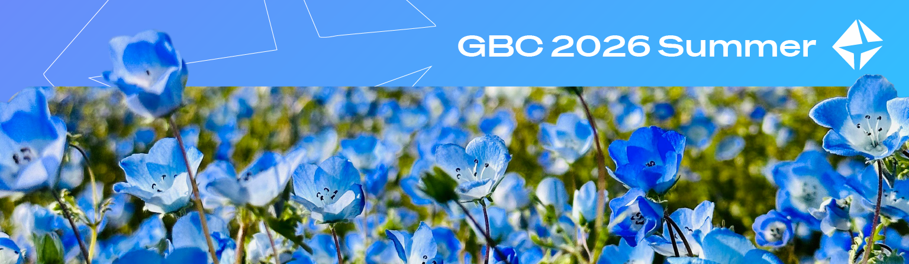
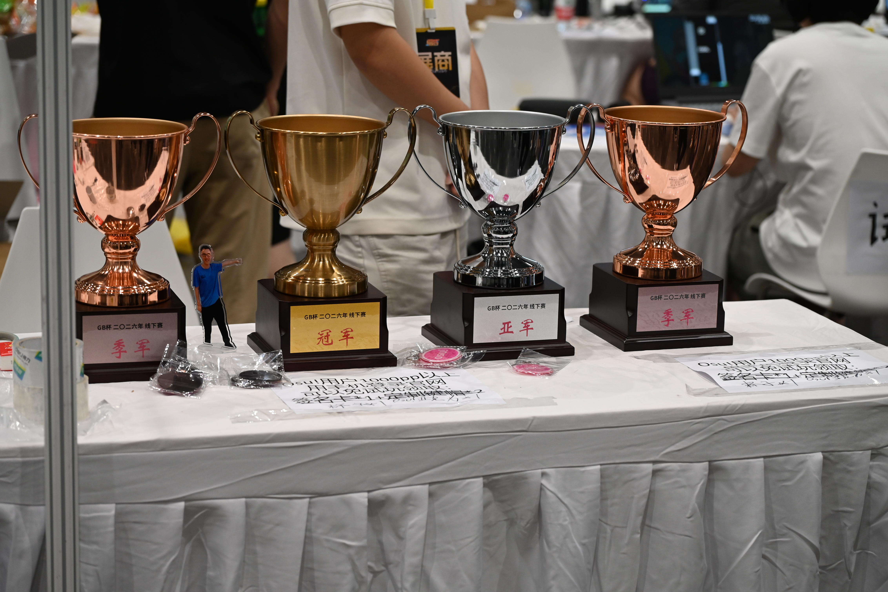
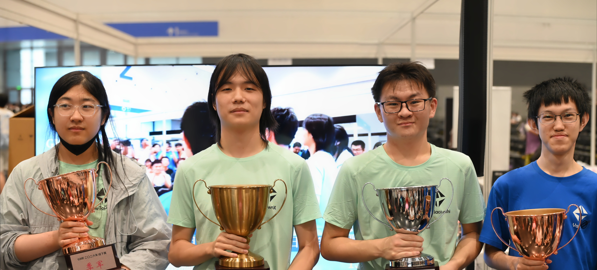
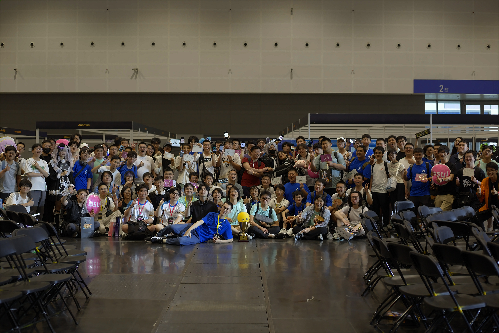

---
tags:
  - GBC
  - GBC2026
  - GBC 2026
  - GBC 2026 IRL
  - GBC2026IRL
---

# GB Cup 2026 In Real Life

**GB Cup 2026 In Real Life** (***GBC 2026 IRL***) was an osu!mania 4-key solo LAN tournament hosted by ::{ flag=CN }:: ::\[GB\]yobrevelc::{ user=14128407 } and organised by Team GB. It was the tenth instalment of the GB Cup and the second instalment of the GB Cup IRL. This LAN tournament was held offline at the DOTREAM RHYTHM GAME CULTURE INDUSTRY EXHIBITION in Hangzhou, China.

## Tournament schedule

| Event | Timestamp |
| --: | :-- |
| Registration phase | 2026-06-21/2026-07-05 |
| Qualifier stage | 2026-07-11/2026-07-12 |
| Offline tournament stage | 2026-07-24/2026-07-26 |

## Prizes

| Placing | Prizes |
| :-: | :-- |
|  | Profile badge, championship trophy, custom rewards |
|  | 2nd place trophy, custom rewards |
|  | 3rd place trophy, custom rewards |
| *Others* | custom rewards |

## Organisation

The GB Cup 2026 In Real Life was run by Team GB and various community members.

| Position | Member(s) |
| :-- | :-- |
| Host | ::{ flag=CN }:: ::\[GB\]yobrevelc::{ user=14128407 } |
| Staff | ::{ flag=CN }:: ::\[GB\]yobrevelc::{ user=14128407 }, ::{ flag=CN }:: ::V1do-::{ user=17527968 }, ::{ flag=CN }:: ::\[GB\]Akamite::{ user=13418334 }, ::{ flag=CN }:: ::\[GB\]Lazy\1ChenXi::{ user=24156840 }, ::{ flag=CN }:: ::\[GB\]Cinelia::{ user=24289042 }, ::{ flag=CN }:: ::vanposen::{ user=15289293 }, ::{ flag=CN }:: ::\[GB\]ChickenGold::{ user=16586663 }, ::{ flag=CN }:: ::\[GB\]Color0::{ user=31417108 } |
| Offline helper | ::{ flag=CN }:: ::\[GB\]sharkful::{ user=35850313 }, ::{ flag=CN }:: ::Zyuuu::{ user=15389275 }, ::{ flag=CN }:: ::-duji-::{ user=33554103 }, ::{ flag=CN }:: ::Kirchhoff123::{ user=29546640 }, ::{ flag=CN }:: ::neeeeeh::{ user=18586390 }, ::{ flag=CN }:: ::\[GB\]Prz1y::{ user=14759634 } |
| Mappool selector | ::{ flag=CN }:: ::\[GB\]yobrevelc::{ user=14128407 }, ::{ flag=CN }:: ::V1do-::{ user=17527968 } |
| Streamer | ::{ flag=CN }:: ::V1do-::{ user=17527968 } |
| Referee | ::{ flag=CN }:: ::\[GB\]yobrevelc::{ user=14128407 }, ::{ flag=CN }:: ::\[GB\]Cinelia::{ user=24289042 }, ::{ flag=CN }:: ::\[GB\]Akamite::{ user=13418334 }, ::{ flag=CN }:: ::\[GB\]ChickenGold::{ user=16586663 } |
| Design | ::{ flag=RU }:: ::MemeBen::{ user=18171966 }, ::{ flag=CN }:: ::\[GB\]Prz1y::{ user=14759634 } |
| Guest | ::{ flag=MY }:: ::cheewee10::{ user=4477497 }, ::{ flag=KR }:: ::Naaaad::{ user=10344857 } |
| Statistician & wiki editor | ::{ flag=CN }:: ::\[GB\]yobrevelc::{ user=14128407 } |

## Links

- [Information spreadsheet](https://docs.qq.com/sheet/DTXVtb0RvY3dUR0xV)
- [Registration Sheet](https://wj.qq.com/s2/27086520/nqse/)
- [Discussion thread](https://osu.ppy.sh/community/forums/topics/2217360?n=1)
- [Livestream](https://live.bilibili.com/22545296) (::{ flag=CN }:: ::\[GB\]yobrevelc::{ user=14128407 })
- [GBC QQ group](https://jq.qq.com/?_wv=1027&k=ZIwYVryh)
- [VOD collections](https://space.bilibili.com/327550518/lists/8512618)

## Participants

| Participants |
| :-- |
| ::{ flag=CN }:: ::Yominazuki::{ user=30642543 } |
| ::{ flag=CN }:: ::ZapHeavenly::{ user=19348819 } |
| ::{ flag=CN }:: ::Kirchhoff123::{ user=29546640 } |
| ::{ flag=CN }:: ::\[Paw\]INKINKINK::{ user=15807315 } |
| ::{ flag=CN }:: ::My Angel Cocoa::{ user=34497066 } |
| ::{ flag=TW }:: ::WTFrrrrrrr::{ user=16178831 } |
| ::{ flag=CN }:: ::c6H8o6\1::{ user=20984576 } |
| ::{ flag=CN }:: ::26\1::{ user=25520572 } |
| ::{ flag=CN }:: ::SilentieLa::{ user=38084262 } |
| ::{ flag=ES }:: ::\[AR\]lv3plane::{ user=15964029 } |
| ::{ flag=CN }:: ::FANYiii09::{ user=38118641 } |
| ::{ flag=CN }:: ::eilander::{ user=34990703 } |
| ::{ flag=NZ }:: ::XiaoLan9999::{ user=15748267 } |
| ::{ flag=CN }:: ::Plus\1QwQ::{ user=25174222 } |
| ::{ flag=CN }:: ::Civilian::{ user=18160033 } |
| ::{ flag=CN }:: ::My Angel Nanoka::{ user=10190740 } |
| ::{ flag=CN }:: ::lingR::{ user=18018980 } |
| ::{ flag=CN }:: ::ToiletWater\1\1\1\1::{ user=35851725 } |
| ::{ flag=CN }:: ::Luciole::{ user=29854899 } |
| ::{ flag=CN }:: ::\[GB\]ruler::{ user=31497468 } |
| ::{ flag=CN }:: ::ju\1jian233::{ user=31258348 } |
| ::{ flag=CN }:: ::\[GB\]sharkful::{ user=35850313 } |
| ::{ flag=CN }:: ::aiyiku::{ user=20094349 } |
| ::{ flag=CN }:: ::-Akari-::{ user=29478727 } |
| ::{ flag=CN }:: ::\[GB\]Lingyu::{ user=29743849 } |
| ::{ flag=CN }:: ::yoe Lonann::{ user=14617751 } |
| ::{ flag=HK }:: ::biubiutu::{ user=18801193 } |
| ::{ flag=CN }:: ::Kagari Mimi::{ user=36372669 } |
| ::{ flag=CN }:: ::\[GB\]fanqiu::{ user=16233412 } |
| ::{ flag=CN }:: ::Star\1vortex::{ user=23272007 } |
| ::{ flag=CN }:: ::linglingyi001::{ user=34087099 } |
| ::{ flag=CN }:: ::fumofumofumo::{ user=37665528 } |
| ::{ flag=CN }:: ::\[Crz\]anfish1013::{ user=31519818 } |
| ::{ flag=CN }:: ::hoticing::{ user=33771159 } |
| ::{ flag=CN }:: ::Aleph\1one::{ user=21693996 } |
| ::{ flag=CN }:: ::036js::{ user=29089125 } |
| ::{ flag=CN }:: ::Uesugi-Erii::{ user=30282134 } |
| ::{ flag=CN }:: ::NoAnswerr::{ user=34596207 } |
| ::{ flag=CN }:: ::Szak\1::{ user=24972681 } |
| ::{ flag=CN }:: ::F6A8AF::{ user=32749965 } |
| ::{ flag=CN }:: ::qxuanyu::{ user=30317145 } |
| ::{ flag=CN }:: ::NotBadHuh::{ user=33005235 } |
| ::{ flag=JP }:: ::ME1KO N3KO::{ user=17572282 } |
| ::{ flag=CN }:: ::My Seele::{ user=32739668 } |
| ::{ flag=CN }:: ::Adachi\1Rei::{ user=15522107 } |
| ::{ flag=CN }:: ::Zyuuu::{ user=15389275 } |
| ::{ flag=CN }:: ::HowToPlaySV::{ user=32494511 } |
| ::{ flag=CN }:: ::Styrene::{ user=16998777 } |
| ::{ flag=CN }:: ::Vain\1::{ user=38363768 } |
| ::{ flag=CN }:: ::-4N0N-::{ user=35458163 } |
| ::{ flag=CN }:: ::snowsabre::{ user=34035880 } |
| ::{ flag=CN }:: ::DawnX::{ user=8534840 } |
| ::{ flag=CN }:: ::\[GB\]DawnLm::{ user=8651259 } |
| ::{ flag=CN }:: ::Shenzouz::{ user=29606773 } |
| ::{ flag=CN }:: ::\[Crz\]ZeenZore::{ user=30178970 } |
| ::{ flag=CN }:: ::Namespac::{ user=32153662 } |
| ::{ flag=CN }:: ::-duji-::{ user=33554103 } |
| ::{ flag=CN }:: ::ssRed::{ user=25176528 } |
| ::{ flag=CN }:: ::NanLx::{ user=35672322 } |
| ::{ flag=CN }:: ::-Sheena-::{ user=28653364 } |
| ::{ flag=CN }:: ::Joecos::{ user=14232615 } |
| ::{ flag=CN }:: ::KafuuChino::{ user=10817494 } |
| ::{ flag=CN }:: ::ysls19798385::{ user=35528667 } |
| ::{ flag=CN }:: ::\[Crz\]Saratoga::{ user=25310915 } |
| ::{ flag=CN }:: ::technoclick::{ user=32985710 } |
| ::{ flag=CN }:: ::Shizuku-09::{ user=27288518 } |
| ::{ flag=CN }:: ::skydome::{ user=37403457 } |
| ::{ flag=CN }:: ::WhatuLvfor::{ user=26278347 } |
| ::{ flag=CN }:: ::Sakayoli 1roha::{ user=24290041 } |
| ::{ flag=CN }:: ::CanRuoFanXing::{ user=34523998 } |
| ::{ flag=CN }:: ::Arisu Tendou::{ user=34278014 } |
| ::{ flag=CN }:: ::yin14514::{ user=38267565 } |
| ::{ flag=CN }:: ::hh27v7::{ user=31728201 } |
| ::{ flag=CN }:: ::verysour::{ user=32358269 } |
| ::{ flag=CN }:: ::Perilla::{ user=34080094 } |
| ::{ flag=CN }:: ::MyAngelLaPluma::{ user=34427162 } |
| ::{ flag=CN }:: ::FenggeTGOB::{ user=35928532 } |
| ::{ flag=CN }:: ::Algebrafanboy::{ user=37514590 } |
| ::{ flag=CN }:: ::YuLuoX::{ user=36113882 } |
| ::{ flag=CN }:: ::zhitu294::{ user=35925880 } |
| ::{ flag=CN }:: ::\[Crz\]bubu::{ user=28251667 } |
| ::{ flag=CN }:: ::IgnoredStone::{ user=36869564 } |
| ::{ flag=CN }:: ::chana::{ user=18375016 } |
| ::{ flag=CN }:: ::F4ntast1stOwO::{ user=32716417 } |
| ::{ flag=CN }:: ::shadiaojunshi::{ user=29165753 } |
| ::{ flag=CN }:: ::qige666::{ user=31339429 } |
| ::{ flag=CN }:: ::ishimeal::{ user=25334379 } |
| ::{ flag=CN }:: ::Execut3r::{ user=24057425 } |
| ::{ flag=CN }:: ::Redlooh::{ user=31160317 } |
| ::{ flag=CN }:: ::Sealone514::{ user=32324496 } |
| ::{ flag=CN }:: ::Qutabirefanboy::{ user=35620882 } |
| ::{ flag=CN }:: ::Qz501kn::{ user=8729618 } |
| ::{ flag=CN }:: ::Ghost Neko::{ user=31157409 } |
| ::{ flag=US }:: ::Chopsticks\1SC::{ user=36252662 } |
| ::{ flag=CN }:: ::CHIRAN321::{ user=36874674 } |
| ::{ flag=CN }:: ::neeeeeh::{ user=18586390 } |
| ::{ flag=CN }:: ::6XvX7::{ user=33948486 } |
| ::{ flag=CN }:: ::\[GB\]Fomurz::{ user=26883256 } |
| ::{ flag=FR }:: ::My Angel Rena::{ user=15246697 } |

## Podium

This competition has come to an end and resulted in the following podium:

| Placing | Player |
| :-: | :-- |
|  | DawnX |
|  | shadiaojunshi |
|  | Vain_, HowToPlaySV |

## Mappools

### Finals & Semifinals

- Rice
  1. [jun feat. Schanita - TRUE LOVE (11Bit) \[a2\]](https://osu.ppy.sh/beatmapsets/2422669#mania/5271672)
  2. [goreshit - slavik goblins (hna) \[goremaniac 1.1x (297bpm)\]](https://osu.ppy.sh/beatmapsets/1841380#mania/4038988)
  3. [Sonic System - Lethal Poison (Sakisagee) \[Conium maculatum 1.25x (275bpm)\]](https://osu.ppy.sh/beatmapsets/2376969#mania/5135127)
  4. [Yuta Imai Vs. BEMANI Sound Team "L.E.D.-G" - THE PEERLESS UNDER HEAVEN (Mipha-) \[MIPHATHER\]](https://osu.ppy.sh/beatmapsets/1829143#mania/3756153)
  5. [Rahatt - Mafijas Breakcore (Kyrya) \[Tsar2 [1.1x]\]](https://osu.ppy.sh/beatmapsets/1843152#mania/3785832)
  6. [Sakaue Nachi - Crazy Hot (elexire) \[1.1x\]](https://osu.ppy.sh/beatmapsets/2516801#mania/5551262)
  7. [Aquellex - Cortex Charger (Halogen-) \[Electrocution\]](https://osu.ppy.sh/beatmapsets/2062236#mania/4311928)
  8. [Utata-P feat. Yuzuki Yukari - Shiawase ni Nareru Kakushi Command ga Arurashii (Ska) \[1.05\]](https://osu.ppy.sh/beatmapsets/1822356#mania/3739448)
- Hybrid
  1. [mafumafu feat. IA - Adagaeshi Syndrome (V1do-) \[Guilty.\]](https://osu.ppy.sh/beatmapsets/2563505#mania/5699804)
  2. [VINCENT GANATCH - GENE \~A mix\~ (Lemonguy) \[Another x1.1\]](https://osu.ppy.sh/beatmapsets/2058822#mania/4303098)
  3. [Varien - One Shot One Kill (onumi Remix) ([Crz]FolAH1217) \[Animus x1.05\]](https://osu.ppy.sh/beatmapsets/2250134#mania/5770103)
- LN
  1. [Yousei Teikoku - Kyuusei Argyros (MyZterioN-) \[purgatory o'clock (cut)\]](https://osu.ppy.sh/beatmapsets/2062249#mania/4311953)
  2. [AAAA - reach for your victory!!! (Saemitsu) \[boundless glory\]](https://osu.ppy.sh/beatmapsets/2452334#mania/5357486)
  3. [void feat. kotsukimiya, Gt. eba - Name of oath ([Crz]Crysarlene) \[Oathsworn\]](https://osu.ppy.sh/beatmapsets/1893940#mania/3902877)
  4. [Miyashita Yuu x Hiiragi Kirai - Grain (MyZterioN-) \[hatred 1.1x\]](https://osu.ppy.sh/beatmapsets/2247920#mania/4779651)
  5. [Yodare-P - Iriya Iriya (V1do-) \[Blasphemy\]](https://osu.ppy.sh/beatmapsets/2565304#mania/5705442)
- Tiebreaker
  1. **[777system - \~GOLDENERNOCTURNE\~ (V1do-,[GB]Cinelia) \[Divine Retribution (w/ Cinelia)\]](https://osu.ppy.sh/beatmapsets/2588492#mania/5774801)**

### Quarterfinals

- Rice
  1. [Dimrain47 - At the Speed of Light (Cut Ver.) (Polarin) \[1.05x\]](https://osu.ppy.sh/beatmapsets/1802127#mania/4161676)
  2. [goreshit - still all scared of ouija boards (edit ver.) (11bit) \[choco cornet x1.2_P\]](https://osu.ppy.sh/beatmapsets/2424752#mania/5277927)
  3. [LV.4 feat. Chiaki Iwasaki - B.O.L. (hna,-mint-) \[Revolution\]](https://osu.ppy.sh/beatmapsets/2055265#mania/4294594)
  4. [Anubasu-anubasu remixed by CELLON - The island of albatross -8bit Style RMX- (MyZterioN-) \[awe 1.05x (158bpm)\]](https://osu.ppy.sh/beatmapsets/1996250#mania/4148829)
  5. [Sharks & Chime - Water Elemental (Guilhermeziat) \[Stage 3: Stormbound\]](https://osu.ppy.sh/beatmapsets/1917756#mania/3957466)
  6. [Kou! - TERABYTE ([GB]Cinelia) \[A Pulse of Signal\]](https://osu.ppy.sh/beatmapsets/2412599#mania/5241176)
  7. [Fusq x Moe Shop ft. Hentai Dude - Perfume x Superstar (Ska) \[1.05\]](https://osu.ppy.sh/beatmapsets/1517816#mania/3107132)
- Hybrid
  1. [LeaF - Kyouki Ranbu (V1do-) \[Euphoria 1.1x\]](https://osu.ppy.sh/beatmapsets/2588494#mania/5774803)
  2. [Akiri - Void of Altair (gzdongsheng) \[Alpha Aquilae\]](https://osu.ppy.sh/beatmapsets/2246375#mania/4775984)
  3. [Ruby My Dear - Saint Patron (Abraxos,[Crz]FolAH1217) \[Last Tango in Paris\]](https://osu.ppy.sh/beatmapsets/2431994#mania/5298336)
- LN
  1. [Primary - Inai Sekai (-SoraIro-) \[Departure [1.05x Rate]\]](https://osu.ppy.sh/beatmapsets/2235054#mania/4747791)
  2. [katagiri - RAINBOW GIRL (katagiri Remix) (YuEast 2018) \[x1.05\]](https://osu.ppy.sh/beatmapsets/2119804#mania/4453272)
  3. [Frums - 19ZZ (ERA Imperial) \[LN-J03 (edit)\]](https://osu.ppy.sh/beatmapsets/2226646#mania/4723501)
  4. [Kabocha feat. Aitsuki Nakuru - Dear The Night I Loved (-mint-) \[A Painting Forever Unfinished\]](https://osu.ppy.sh/beatmapsets/2246380#mania/4775997)
- Tiebreaker
  1. **[Ludicin - Echoes of Memoria (-mint-) \[Solace of Oblivion\]](https://osu.ppy.sh/beatmapsets/2246382#mania/4775999)**

### Round of 16

- Rice
  1. [AL-1S - ..+\*\*Everything Goes On\*\*+.. (popy) \[Aris fell in love because of this...<3\]](https://osu.ppy.sh/beatmapsets/2586314#mania/5768891)
  2. [Falcom Sound Team jdk - Infinity Rage (lemonguy) \[Nightmare x1.05\]](https://osu.ppy.sh/beatmapsets/1637362#mania/3341561)
  3. [cygnus - Tree of Misery (Miaurichesu) \[Agony\]](https://osu.ppy.sh/beatmapsets/2242640#mania/4766759)
  4. [ericdoa - dancinwithsomebawdy (Livium) \[pleasenevaremindme 1.1x\]](https://osu.ppy.sh/beatmapsets/2418144#mania/5257868)
  5. [Nightmare - Epileptic Crisis (Shoegazer) \[Paralysis 1.05x (199bpm)\]](https://osu.ppy.sh/beatmapsets/1726407#mania/3532510)
  6. [Kaitendaentai - Aether (Yorusen Haneoto) \[240 edit\]](https://osu.ppy.sh/beatmapsets/2353885#mania/5768791)
- Hybrid
  1. [Otsukisama Koukyoukyoku - ultima Thule (guden) \[Penultimas\]](https://osu.ppy.sh/beatmapsets/1837019#mania/3771938)
  2. [saaa + kei_iwata + stuv + wakadori - New York Back Raise (MyZterioN-) \[gamesters\]](https://osu.ppy.sh/beatmapsets/1934430#mania/3997461)
  3. [ALEPH - BREAKING AND ENTERING (Lott) \[SECURITY BREACH\]](https://osu.ppy.sh/beatmapsets/2359228#mania/5083833)
- LN
  1. [Sangatsu no Phantasia - Golden Ray ([Crz]Crysarlene) \[Vicissitude\]](https://osu.ppy.sh/beatmapsets/2428545#mania/5287909)
  2. [Sawawa - Taketori Hishou ~Lunatic Princess (MyZterioN-) \[nisemono 1.05x\]](https://osu.ppy.sh/beatmapsets/2337199#mania/5018089)
  3. [Feryquitous - Ordirehv (Micleak) \[Spellbinding\]](https://osu.ppy.sh/beatmapsets/2226727#mania/4723728)
- Tiebreaker
  1. **[Kurokotei feat. Sennzai - escape (the looking-glass, and what alice found there) (V1do-) \[Reveries\]](https://osu.ppy.sh/beatmapsets/2422601#mania/5271526)**

### Qualifier

- Rice
  1. [Hanon x Kotoha - Fuwari (Lott) \[Stage 1: Acceptance\]](https://osu.ppy.sh/beatmapsets/2581436#mania/5754201)
  2. [Jeff Williams feat. Casey Lee Williams - Time to Say Goodbye (Sakisagee) \[Stage 2: Bye\]](https://osu.ppy.sh/beatmapsets/2581413#mania/5754122)
  3. [Kurokotei - -Hyperending- (V1do-) \[Stage 3: The Good\]](https://osu.ppy.sh/beatmapsets/2581459#mania/5754257)
- LN
  1. [Various Artists - Xiang Qin Xiang Ai (Cut Ver.) (Yuestia) \[Stage 4: Reunion\]](https://osu.ppy.sh/beatmapsets/2581501#mania/5754539)
  2. [otoshi.b - Sparkling Sunshine!! (-Solarlo-) \[Stage 5: Ebullience\]](https://osu.ppy.sh/beatmapsets/2581463#mania/5754282)
- Hybrid
  1. [Camellia - Luin of Celtchar ([GB]Cinelia) \[Stage 6: Nephilimorium\]](https://osu.ppy.sh/beatmapsets/2581403#mania/5754064)
  2. [mimizu feat. Kasane Teto SV - Tatakina (V1do-) \[Stage 7: The Evil\]](https://osu.ppy.sh/beatmapsets/2581460#mania/5754258)

## Match results

### Finals

Sunday, 26 July 2026:

| Player A |  |  | Player B | Match link |
| --: | :-: | :-: | :-- | :-- |
| shadiaojunshi | 3 | **7** | **DawnX** | [#1](https://osu.ppy.sh/community/matches/121581146) |

### Semifinals

Sunday, 26 July 2026:

| Player A |  |  | Player B | Match link |
| --: | :-: | :-: | :-- | :-- |
| **shadiaojunshi** | **7** | 1 | HowToPlaySV | [#1](https://osu.ppy.sh/community/matches/121580362) |
| Vain_ | 6 | **7** | **DawnX** | [#1](https://osu.ppy.sh/community/matches/121580593) |

### Quarterfinals

Saturday, 25 July 2026:

| Player A |  |  | Player B | Match link |
| --: | :-: | :-: | :-- | :-- |
| **shadiaojunshi** | **6** | 1 | lingR | [#1](https://osu.ppy.sh/community/matches/121574327) |
| [Crz]anfish1013 | 4 | **6** | **HowToPlaySV** | [#1](https://osu.ppy.sh/community/matches/121574530) |
| **Vain_** | **6** | 0 | [GB]fanqiu | [#1](https://osu.ppy.sh/community/matches/121574857) |
| **DawnX** | **6** | 1 | verysour | [#1](https://osu.ppy.sh/community/matches/121575089) |

### Round of 16

Friday, 24 July 2026:

| Player A |  |  | Player B | Match link |
| --: | :-: | :-: | :-- | :-- |
| **shadiaojunshi** | **5** | 1 | [GB]Lingyu | [#1](https://osu.ppy.sh/community/matches/121568524) |
| **lingR** | **5** | 2 | My Angel Nanoka | [#1](https://osu.ppy.sh/community/matches/121568695) |
| **[Crz]anfish1013** | **5** | 4 | [Crz]bubu | [#1](https://osu.ppy.sh/community/matches/121568858),[#2](https://osu.ppy.sh/community/matches/121569071) |
| **HowToPlaySV** | **5** | 2 | eilander | [#1](https://osu.ppy.sh/community/matches/121569191) |
| **Vain_** | **5** | 1 | hh27v7 | [#1](https://osu.ppy.sh/community/matches/121569362) |
| Szak_ | 2 | **5** | **[GB]fanqiu** | [#1](https://osu.ppy.sh/community/matches/121569532) |

Saturday, 25 July 2026:

| Player A |  |  | Player B | Match link |
| --: | :-: | :-: | :-- | :-- |
| **DawnX** | **5** | 1 | [Crz]Saratoga | [#1](https://osu.ppy.sh/community/matches/121574002) |
| **verysour** | **5** | 0 | [GB]Fomurz | [#1](https://osu.ppy.sh/community/matches/121574140) |

### Regular Stage

| Ranking | Player | Sum rank |
| --: | :-- | :-: |
| 1 | ::{ flag=CN }:: ::shadiaojunshi::{ user=29165753 } | 16 |
| 2 | ::{ flag=CN }:: ::Vain\1::{ user=38363768 } | 20 |
| 3 | ::{ flag=CN }:: ::DawnX::{ user=8534840 } | 32 |
| 4 | ::{ flag=CN }:: ::\[Crz\]anfish1013::{ user=31519818 } | 43 |
| 5 | ::{ flag=CN }:: ::HowToPlaySV::{ user=32494511 } | 53 |
| 6 | ::{ flag=CN }:: ::verysour::{ user=32358269 } | 73 |
| 7 | ::{ flag=CN }:: ::lingR::{ user=18018980 } | 85 |
| 8 | ::{ flag=CN }:: ::Szak\1::{ user=24972681 } | 86 |
| 9 | ::{ flag=CN }:: ::My Angel Nanoka::{ user=10190740 } | 87 |
| 10 | ::{ flag=CN }:: ::eilander::{ user=34990703 } | 101 |
| 11 | ::{ flag=CN }:: ::\[GB\]fanqiu::{ user=16233412 } | 112 |
| 12 | ::{ flag=CN }:: ::\[GB\]Fomurz::{ user=26883256 } | 116 |
| 13 | ::{ flag=CN }:: ::\[Crz\]bubu::{ user=28251667 } | 120 |
| 14 | ::{ flag=CN }:: ::hh27v7::{ user=31728201 } | 123 |
| 15 | ::{ flag=CN }:: ::\[GB\]Lingyu::{ user=29743849 } | 126 |
| 16 | ::{ flag=CN }:: ::\[Crz\]Saratoga::{ user=25310915 } | 132 |
| 17 | ::{ flag=CN }:: ::Kirchhoff123::{ user=29546640 } | 134 |
| 18 | ::{ flag=CN }:: ::Shizuku-09::{ user=27288518 } | 144 |
| 19 | ::{ flag=CN }:: ::-4N0N-::{ user=35458163 } | 149 |
| 20 | ::{ flag=CN }:: ::WhatuLvfor::{ user=26278347 } | 153 |
| 21 | ::{ flag=CN }:: ::26\1::{ user=25520572 } | 158 |
| 22 | ::{ flag=CN }:: ::Shenzouz::{ user=29606773 } | 173 |
| 23 | ::{ flag=CN }:: ::Zyuuu::{ user=15389275 } | 174 |
| 24 | ::{ flag=CN }:: ::F4ntast1stOwO::{ user=32716417 } | 177 |
| 25 | ::{ flag=CN }:: ::Yominazuki::{ user=30642543 } | 191 |
| 26 | ::{ flag=CN }:: ::KafuuChino::{ user=10817494 } | 196 |
| 26 | ::{ flag=CN }:: ::Civilian::{ user=18160033 } | 196 |
| 26 | ::{ flag=CN }:: ::My Angel Cocoa::{ user=34497066 } | 196 |
| 29 | ::{ flag=CN }:: ::Styrene::{ user=16998777 } | 205 |
| 30 | ::{ flag=TW }:: ::WTFrrrrrrr::{ user=16178831 } | 206 |
| 31 | ::{ flag=CN }:: ::Redlooh::{ user=31160317 } | 208 |
| 32 | ::{ flag=CN }:: ::Arisu Tendou::{ user=34278014 } | 210 |
| 33 | ::{ flag=CN }:: ::Execut3r::{ user=24057425 } | 221 |
| 34 | ::{ flag=CN }:: ::6XvX7::{ user=33948486 } | 232 |
| 35 | ::{ flag=JP }:: ::ME1KO N3KO::{ user=17572282 } | 242 |
| 36 | ::{ flag=CN }:: ::Perilla::{ user=34080094 } | 245 |
| 37 | ::{ flag=CN }:: ::YuLuoX::{ user=36113882 } | 254 |
| 38 | ::{ flag=CN }:: ::ysls19798385::{ user=35528667 } | 255 |
| 39 | ::{ flag=CN }:: ::My Seele::{ user=32739668 } | 267 |
| 40 | ::{ flag=CN }:: ::Uesugi-Erii::{ user=30282134 } | 268 |
| 41 | ::{ flag=CN }:: ::neeeeeh::{ user=18586390 } | 269 |
| 42 | ::{ flag=CN }:: ::NanLx::{ user=35672322 } | 279 |
| 43 | ::{ flag=CN }:: ::CanRuoFanXing::{ user=34523998 } | 287 |
| 44 | ::{ flag=CN }:: ::FANYiii09::{ user=38118641 } | 296 |
| 45 | ::{ flag=CN }:: ::c6H8o6\1::{ user=20984576 } | 304 |
| 46 | ::{ flag=CN }:: ::chana::{ user=18375016 } | 317 |
| 47 | ::{ flag=ES }:: ::\[AR\]lv3plane::{ user=15964029 } | 323 |
| 47 | ::{ flag=CN }:: ::\[Crz\]ZeenZore::{ user=30178970 } | 323 |
| 49 | ::{ flag=CN }:: ::Sealone514::{ user=32324496 } | 326 |
| 50 | ::{ flag=CN }:: ::Plus\1QwQ::{ user=25174222 } | 345 |
| 51 | ::{ flag=CN }:: ::\[Paw\]INKINKINK::{ user=15807315 } | 352 |
| 52 | ::{ flag=CN }:: ::\[GB\]sharkful::{ user=35850313 } | 360 |
| 53 | ::{ flag=CN }:: ::Star\1vortex::{ user=23272007 } | 367 |
| 54 | ::{ flag=CN }:: ::zhitu294::{ user=35925880 } | 381 |
| 55 | ::{ flag=CN }:: ::MyAngelLaPluma::{ user=34427162 } | 383 |
| 56 | ::{ flag=CN }:: ::yoe Lonann::{ user=14617751 } | 384 |
| 57 | ::{ flag=CN }:: ::IgnoredStone::{ user=36869564 } | 394 |
| 58 | ::{ flag=CN }:: ::Adachi\1Rei::{ user=15522107 } | 395 |
| 59 | ::{ flag=CN }:: ::-duji-::{ user=33554103 } | 398 |
| 60 | ::{ flag=CN }:: ::\[GB\]ruler::{ user=31497468 } | 415 |
| 61 | ::{ flag=CN }:: ::SilentieLa::{ user=38084262 } | 420 |
| 62 | ::{ flag=CN }:: ::NotBadHuh::{ user=33005235 } | 429 |
| 63 | ::{ flag=CN }:: ::ToiletWater\1\1\1\1::{ user=35851725 } | 430 |
| 64 | ::{ flag=CN }:: ::skydome::{ user=37403457 } | 431 |
| 65 | ::{ flag=CN }:: ::Joecos::{ user=14232615 } | 444 |
| 65 | ::{ flag=FR }:: ::My Angel Rena::{ user=15246697 } | 444 |
| 65 | ::{ flag=CN }:: ::036js::{ user=29089125 } | 444 |
| 68 | ::{ flag=CN }:: ::ZapHeavenly::{ user=19348819 } | 457 |
| 69 | ::{ flag=CN }:: ::Namespac::{ user=32153662 } | 458 |
| 70 | ::{ flag=CN }:: ::NoAnswerr::{ user=34596207 } | 482 |
| 71 | ::{ flag=CN }:: ::FenggeTGOB::{ user=35928532 } | 486 |
| 72 | ::{ flag=CN }:: ::qige666::{ user=31339429 } | 488 |
| 73 | ::{ flag=CN }:: ::Ghost Neko::{ user=31157409 } | 505 |
| 74 | ::{ flag=CN }:: ::Qz501kn::{ user=8729618 } | 517 |
| 74 | ::{ flag=US }:: ::Chopsticks\1SC::{ user=36252662 } | 517 |
| 76 | ::{ flag=CN }:: ::Luciole::{ user=29854899 } | 519 |
| 77 | ::{ flag=HK }:: ::biubiutu::{ user=18801193 } | 533 |
| 78 | ::{ flag=CN }:: ::hoticing::{ user=33771159 } | 534 |
| 79 | ::{ flag=NZ }:: ::XiaoLan9999::{ user=15748267 } | 545 |
| 80 | ::{ flag=CN }:: ::ju\1jian233::{ user=31258348 } | 551 |
| 81 | ::{ flag=CN }:: ::yin14514::{ user=38267565 } | 561 |
| 82 | ::{ flag=CN }:: ::CHIRAN321::{ user=36874674 } | 565 |
| 83 | ::{ flag=CN }:: ::linglingyi001::{ user=34087099 } | 571 |
| 84 | ::{ flag=CN }:: ::Qutabirefanboy::{ user=35620882 } | 582 |

## Qualifier instructions

1. There are 7 maps in the qualifier mappool.
2. The ranking in qualifiers is determined by the sum of a player's rank in each map.
3. The top 16 players in the qualifier will enter the main competition. They will be divided into 4 tiers according to the player ranking and randomly assigned into 4 quarter zones, where every quarter will forcibly include 1 player from each tier. The first round of the game is fixed as tier 1 vs. tier 4, and tier 2 vs. tier 3.
4. After the qualifier round, if any qualified player withdraws, their ranking will be replaced by the next player, and so on.

## Tournament rules

1. There is no warm-up phase for the match.
2. The main competition is a single-elimination knockout competition with a total of 16 players. The Round of 16 is a best-of-9 game, the Quarterfinals are a best-of-11 game, and the Finals and Semifinals is a best-of-13 game.
3. Finals and Semifinals will use same mappool.
4. There are no 3rd place match on this tournament, 2 players will both get 3rd place.
5. When the two sides are tied and the last point is decided, the last map will be the tiebreaker.
6. Each side will have two minutes to choose a map. If the timeout is reached, the referee will randomly select an unselected map from the mappool. After the map is selected, both players have two minutes to get ready.
7. Possible mod choices for the FreeMod bracket are NoFail, Hidden, Fade In, Flashlight, and Mirror.
8. There are no restrictions on whether both players can choose or not choose a certain map, except that the selected map must be in the game mappool, and you cannot choose a map that has been selected in the game, and you cannot choose the tiebreaker.
9. In the case of a tie, the beatmap will be rematched, but not more than twice.
10. Players are allowed to rematch if any player disconnects early on during a beatmap. Send a message as soon as possible in the match room chat to notify the referee to restart the match.
11. If necessary, the referee has the right to decide the implementation of the rules at their own discretion and has the final say on events that occur during the game.
12. If players can't submit the score because of internet issue on the scene, the host will let specific people sit behind players and record videos to get the player score.
