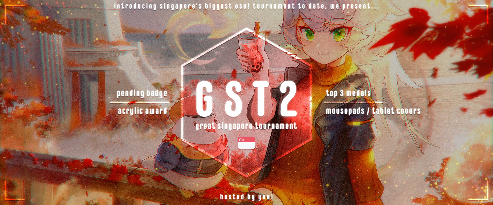

---
tags:
  - GST
  - GST2
---

# Great Singapore Tournament 2

The **Great Singapore Tournament 2** (***GST2***) was a Singaporean double-elimination 2v2 osu! tournament hosted by ::{ flag=SG }:: [youi](https://osu.ppy.sh/users/7537133). This was the second instalment of the Great Singapore Tournament.

## Tournament schedule

| Event | Timestamp |
| --: | :-- |
| Registration phase | 2019-11-09/2019-11-24 |
| Live drawings | 2019-11-24 (23:00 UTC+8) |
| Group stage | 2019-11-29/2019-12-15 |
| Round of 16 | 2019-12-18/2019-12-23 |
| Quarterfinals | 2019-12-27/2019-12-31 |
| Semifinals | 2020-01-04/2020-01-05 |
| Finals | 2020-01-10/2020-01-12 |
| Grand Finals | 2020-01-19 |

## Prizes

| Placing | Prizes |
| :-: | :-- |
|  | Unique profile badge, Acrylic trophy, 1st place physical medal, custom mousepad/tablet cover |
|  | 2nd place physical medal, 6 months of osu!supporter/cash equivalent |
|  | 3rd place physical medal, 2 months of osu!supporter/cash equivalent |
| *Pick'em winner* | 4 months of osu!supporter/cash equivalent, unique role on hwchr's Pick'em website |

## Organisation

The Great Singapore Tournament 2 was run by various community members.

| Position | Member(s) |
| :-- | :-- |
| Organizer | ::{ flag=SG }:: [youi](https://osu.ppy.sh/users/7537133) |
| Administrator | ::{ flag=SG }:: [Ayucchi](https://osu.ppy.sh/users/7823498), ::{ flag=SG }:: [youi](https://osu.ppy.sh/users/7537133) |
| Mappool selector | ::{ flag=SG }:: [Ayucchi](https://osu.ppy.sh/users/7823498), ::{ flag=NL }:: [nik](https://osu.ppy.sh/users/10077264), ::{ flag=US }:: [Tekkito](https://osu.ppy.sh/users/7075211), ::{ flag=SG }:: [youi](https://osu.ppy.sh/users/7537133) |
| Mappool tester | ::{ flag=US }:: [Tekkito](https://osu.ppy.sh/users/7075211) |
| Referee | ::{ flag=SG }:: [Ayucchi](https://osu.ppy.sh/users/7823498), ::{ flag=HK }:: [Cindergoat](https://osu.ppy.sh/users/10168682), ::{ flag=SG }:: [Element118](https://osu.ppy.sh/users/2283992), ::{ flag=ID }:: [Fre](https://osu.ppy.sh/users/3484548), ::{ flag=TW }:: [Saisu Riku](https://osu.ppy.sh/users/9834516), ::{ flag=US }:: [moof](https://osu.ppy.sh/users/8457202), ::{ flag=KR }:: [Nopekjk](https://osu.ppy.sh/users/4585186), ::{ flag=SG }:: [youi](https://osu.ppy.sh/users/7537133), ::{ flag=PL }:: [zibi](https://osu.ppy.sh/users/11301620) |
| Streamer | ::{ flag=SG }:: [youi](https://osu.ppy.sh/users/7537133) |
| Commentator | ::{ flag=MY }:: [FaithInOsu](https://osu.ppy.sh/users/10178187), ::{ flag=SG }:: [Loslite](https://osu.ppy.sh/users/6398160), ::{ flag=US }:: [moof](https://osu.ppy.sh/users/8457202), ::{ flag=SG }:: [SeeL](https://osu.ppy.sh/users/5104320), ::{ flag=SG }:: [Wolpis](https://osu.ppy.sh/users/8497340), ::{ flag=SG }:: [youi](https://osu.ppy.sh/users/7537133) |
| Designer | ::{ flag=SG }:: [youi](https://osu.ppy.sh/users/7537133) |
| Statistician | ::{ flag=SG }:: [youi](https://osu.ppy.sh/users/7537133) |
| Pick'em developer | ::{ flag=DE }:: [hallowatcher](https://osu.ppy.sh/users/1874761), ::{ flag=NL }:: [nik](https://osu.ppy.sh/users/10077264) |
| Wiki editor | ::{ flag=ID }:: [fajar13k](https://osu.ppy.sh/users/7100002) |

## Links

- [Discussion thread](https://osu.ppy.sh/community/forums/topics/983074)
- [GST Discord server](https://discord.gg/kCfW4Jw)
- [Livestream](https://twitch.tv/osusg)
- [Pick'em predictions website](https://pickem.hwc.hr/tournaments/20) hosted by ::{ flag=DE }:: [hallowatcher](https://osu.ppy.sh/users/1874761)
- **[Statistics sheet](https://docs.google.com/spreadsheets/d/1rPNEsq4I_vuVHSccLjgZ5HucIgnAWTuUfgiYFRAkBOI/edit?usp=sharing)**

## Participants

| Team | Members |
| :-- | :-- |
| **#sobafanclub** | ::{ flag=SG }:: **[Zac-](https://osu.ppy.sh/users/7513426)**, ::{ flag=SG }:: [Rachel](https://osu.ppy.sh/users/6494160) |
| **\[ Jg \]** | ::{ flag=SG }:: **[\[ Jg \]](https://osu.ppy.sh/users/1671376)**, ::{ flag=SG }:: [will never fc](https://osu.ppy.sh/users/6722556) |
| **50% fARmErS** | ::{ flag=SG }:: **[[-Lockon-]](https://osu.ppy.sh/users/6726331)**, ::{ flag=SG }:: [Kalo](https://osu.ppy.sh/users/3650695) |
| **a)ii)no scenario** | ::{ flag=SG }:: **[SeeL](https://osu.ppy.sh/users/5104320)**, ::{ flag=SG }:: [Alice](https://osu.ppy.sh/users/3850861) |
| **Abused 24/7** | ::{ flag=SG }:: **[\[-shirayuki-\]](https://osu.ppy.sh/users/7679930)**, ::{ flag=SG }:: [Fuwu](https://osu.ppy.sh/users/12059576) |
| **advanced math** | ::{ flag=SG }:: **[moosepi](https://osu.ppy.sh/users/1868745)**, ::{ flag=SG }:: [Rtzero](https://osu.ppy.sh/users/9262462) |
| **Ang Soon Tong** | ::{ flag=SG }:: **[-Eni-](https://osu.ppy.sh/users/12074313)**, ::{ flag=SG }:: [ForeverFancy](https://osu.ppy.sh/users/11007140) |
| **bishan jc** | ::{ flag=SG }:: **[Eskalade](https://osu.ppy.sh/users/9093634)**, ::{ flag=SG }:: [Disbelief1](https://osu.ppy.sh/users/12525467) |
| **Cute Aim Live!** | ::{ flag=SG }:: **[Izz](https://osu.ppy.sh/users/10001776)**, ::{ flag=SG }:: [RyanGBW](https://osu.ppy.sh/users/1626886) |
| **dogerinoofanclub** | ::{ flag=SG }:: **[The Cat](https://osu.ppy.sh/users/8556392)**, ::{ flag=SG }:: [Leehai](https://osu.ppy.sh/users/9317883) |
| **dos idiots v2** | ::{ flag=SG }:: **[Dogerinoo](https://osu.ppy.sh/users/9467258)**, ::{ flag=SG }:: [Layzmcgee](https://osu.ppy.sh/users/9474710) |
| **double tap** | ::{ flag=SG }:: **[tzechi](https://osu.ppy.sh/users/4662795)**, ::{ flag=SG }:: [xPikachu](https://osu.ppy.sh/users/3205678) |
| **fail screening** | ::{ flag=SG }:: **[pashty](https://osu.ppy.sh/users/9576725)**, ::{ flag=SG }:: [Snipey](https://osu.ppy.sh/users/9322030) |
| **fausion foodclub** | ::{ flag=SG }:: **[ShallowoDream](https://osu.ppy.sh/users/13485826)**, ::{ flag=SG }:: [fUwUsion](https://osu.ppy.sh/users/12261210) |
| **feeding scrubs** | ::{ flag=SG }:: **[wegh](https://osu.ppy.sh/users/4356258)**, ::{ flag=SG }:: [Ireiisu](https://osu.ppy.sh/users/5191022) |
| **Fijsdejjwsxjfjdd** | ::{ flag=SG }:: **[ExImperia](https://osu.ppy.sh/users/5200499)**, ::{ flag=SG }:: [Lunarsol](https://osu.ppy.sh/users/6622650) |
| **free pmds** | ::{ flag=SG }:: **[low acc fc](https://osu.ppy.sh/users/10404417)**, ::{ flag=SG }:: [Galaxik1255](https://osu.ppy.sh/users/10820043) |
| **Fortnite?** | ::{ flag=SG }:: **[DreamlyLoli](https://osu.ppy.sh/users/8547527)**, ::{ flag=SG }:: [\_Meep\_](https://osu.ppy.sh/users/4315188) |
| **FrogChamp** | ::{ flag=SG }:: **[\_gt](https://osu.ppy.sh/users/8301957)**, ::{ flag=SG }:: [Dawnwing](https://osu.ppy.sh/users/5144534) |
| **fulap** | ::{ flag=SG }:: **[kirkirs](https://osu.ppy.sh/users/9902622)**, ::{ flag=SG }:: [Ninowo](https://osu.ppy.sh/users/9560886) |
| **Here for last** | ::{ flag=SG }:: **[woahsia](https://osu.ppy.sh/users/195946)**, ::{ flag=SG }:: [vitasoy](https://osu.ppy.sh/users/9347706) |
| **hsc thots** | ::{ flag=SG }:: **[qstronaut](https://osu.ppy.sh/users/10958852)**, ::{ flag=SG }:: [Oppairo](https://osu.ppy.sh/users/11015857) |
| **JC Big Scam** | ::{ flag=SG }:: **[Mrgglock](https://osu.ppy.sh/users/10734032)**, ::{ flag=SG }:: [Hi im xKai](https://osu.ppy.sh/users/4337306) |
| **Kafuu Chino** | ::{ flag=SG }:: **[m0fum0fu](https://osu.ppy.sh/users/5143605)**, ::{ flag=SG }:: [theprolimsy](https://osu.ppy.sh/users/4288726) |
| **Kokujin** | ::{ flag=SG }:: **[gleru](https://osu.ppy.sh/users/11136593)**, ::{ flag=SG }:: [kenyio](https://osu.ppy.sh/users/6732506) |
| **Left Palms Down** | ::{ flag=SG }:: **[Taeng](https://osu.ppy.sh/users/9598965)**, ::{ flag=SG }:: [nazenator](https://osu.ppy.sh/users/9122201) |
| **Mahathir bin Moh** | ::{ flag=SG }:: **[Loslite](https://osu.ppy.sh/users/6398160)**, ::{ flag=SG }:: [Soba Noodles](https://osu.ppy.sh/users/3010281) |
| **Mahjulah big gay** | ::{ flag=SG }:: **[lazypear](https://osu.ppy.sh/users/10795700)**, ::{ flag=SG }:: [DaShellWarrior](https://osu.ppy.sh/users/11589198) |
| **PAP** | ::{ flag=SG }:: **[Wolpis](https://osu.ppy.sh/users/8497340)**, ::{ flag=SG }:: [\[Suguri\]](https://osu.ppy.sh/users/5406758) |
| **Rainbow Centre** | ::{ flag=SG }:: **[Destroyed69](https://osu.ppy.sh/users/10270008)**, ::{ flag=SG }:: [Rlslngcloud](https://osu.ppy.sh/users/3773739) |
| **raining lanjiao** | ::{ flag=SG }:: **[M4-K1](https://osu.ppy.sh/users/5210595)**, ::{ flag=SG }:: [Raindrop](https://osu.ppy.sh/users/1155871) |
| **salakau** | ::{ flag=SG }:: **[Randomguruz](https://osu.ppy.sh/users/8040494)**, ::{ flag=SG }:: [jiawri](https://osu.ppy.sh/users/9984147) |
| **Section 377A** | ::{ flag=SG }:: **[Hecatia](https://osu.ppy.sh/users/8244635)**, ::{ flag=SG }:: [Clout-Friendly](https://osu.ppy.sh/users/9613873) |
| **self ref** | ::{ flag=SG }:: **[phox](https://osu.ppy.sh/users/772295)**, ::{ flag=SG }:: [Heresy](https://osu.ppy.sh/users/8876938) |
| **tamade** | ::{ flag=SG }:: **[GSBlank](https://osu.ppy.sh/users/2312106)**, ::{ flag=SG }:: [Rtyzen](https://osu.ppy.sh/users/2439822) |
| **TheCatFanClub** | ::{ flag=SG }:: **[AyanoMT](https://osu.ppy.sh/users/11413955)**, ::{ flag=SG }:: [Marina](https://osu.ppy.sh/users/11406548) |
| **Tom and Jerry** | ::{ flag=SG }:: **[JianHao Tan](https://osu.ppy.sh/users/5447609)**, ::{ flag=SG }:: [k\_1tty](https://osu.ppy.sh/users/5407620) |
| **totallynotfarmer** | ::{ flag=SG }:: **[Moltenfury](https://osu.ppy.sh/users/3395820)**, ::{ flag=SG }:: [OppaiSuki](https://osu.ppy.sh/users/1285403) |
| **twitch<!---->.tv/(-->)** | ::{ flag=SG }:: **[P4ndemonium](https://osu.ppy.sh/users/6639059)**, ::{ flag=SG }:: [Chisayo20](https://osu.ppy.sh/users/4667643) |
| **We can't read EZ** | ::{ flag=SG }:: **[sueishnao](https://osu.ppy.sh/users/9778431)**, ::{ flag=SG }:: [Flamburior](https://osu.ppy.sh/users/11386570) |

## Groups

| Group | Top seed | High seed | Mid seed | Low seed | Unseeded |
| :-: | :-- | :-- | :-- | :-- | :-- |
| **A** | Tom and Jerry | dogerinoofanclub | \[ Jg \] | Abused 24/7 | Kafuu Chino |
| **B** | tamade | fail screening | self ref | feeding scrubs | fausion foodclub |
| **C** | Here for last | salakau | bishan jc | free pmds | hsc thots |
| **D** | raining lanjiao | advanced math | JC Big Scam | Mahjulah big gay | dos idiots v2 |
| **E** | 50% fARmErS | totallynotfarmer | #sobafanclub | Cute Aim Live! | TheCatFanClub |
| **F** | a)ii)no scenario | FrogChamp | twitch<!---->.tv/(-->) | Rainbow Centre | Ang Soon Tong |
| **G** | Mahathir bin Moh | Left Palms DownFijsdejjwsxjfjdd | We can't read EZ | Left Palms Down | fulap |
| **H** | double tap | PAP | Section 377A | Fortnite? | Kokujin |

## Podium

This competition has come to an end and resulted in the following podium:

| Placing | Team |
| :-: | :-- |
|  | **tamade** (::{ flag=SG }:: **[GSBlank](https://osu.ppy.sh/users/2312106)**, ::{ flag=SG }:: [Rtyzen](https://osu.ppy.sh/users/2439822)) |
|  | **Mahathir bin Moh** (::{ flag=SG }:: **[Loslite](https://osu.ppy.sh/users/6398160)**, ::{ flag=SG }:: [Soba Noodles](https://osu.ppy.sh/users/3010281)) |
|  | **Tom and Jerry** (::{ flag=SG }:: **[JianHao Tan](https://osu.ppy.sh/users/5447609)**, ::{ flag=SG }:: [k\_1tty](https://osu.ppy.sh/users/5407620)) |

## Mappools

### Grand Finals

**[Download the mappack here! (171 MB)](https://drive.google.com/file/d/1cWhWup0xeIXO9F3CzGPlfmMQUTLTeULH/view?usp=sharing)**

- NoMod
  1. [Roselia - FIRE BIRD (TV Size) (-Aqua) \[Shizuku's Special\]](https://osu.ppy.sh/beatmapsets/947848#osu/1986140)
  2. [Nekomata L.E.D.Master+ - Chrono Diver -PENDULUMs- (ScubDomino) \[j a z z f o r y o u r s o u l\]](https://osu.ppy.sh/beatmapsets/984665#osu/2060262)
  3. [Chroma - sink to the deep sea world (-Loranzo-) \[Bye Bye\]](https://osu.ppy.sh/beatmapsets/912031#osu/1905293)
  4. [Suzuki Konomi - My Days (Depths) \[Ascend Beyond the Heavens\]](https://osu.ppy.sh/beatmapsets/1005224#osu/2103821)
  5. [SOPHIE - Faceshopping (Myxo) \[Expert\]](https://osu.ppy.sh/beatmapsets/862256#osu/1803653)
  6. [The Living Tombstone - Nippontradamus (Everest Hope) \[Nogard's Nightmare\]](https://osu.ppy.sh/beatmapsets/183949#osu/452694)
- Hidden
  1. [Yunomi - Mentai Cosmic (Hokichi) \[Hikan's Cosmic\]](https://osu.ppy.sh/beatmapsets/812335#osu/2337880)
  2. [LiLA'c Records - Maze of Vapor (Brutal Core mix) (Mirash) \[Extra\]](https://osu.ppy.sh/beatmapsets/1075008#osu/2249551)
  3. [mafumafu - Kakushigoto (Vert) \[Kouhai no Koibumi.\]](https://osu.ppy.sh/beatmapsets/770023#osu/1618986)
- HardRock
  1. [Camellia feat.Nanahira - Energy Drinko Fein-chan! (Spectator) \[RLC's Extra\]](https://osu.ppy.sh/beatmapsets/257407#osu/596595)
  2. [CHiCO with HoneyWorks - Otome-domo yo. (AIR) \[eXtra\]](https://osu.ppy.sh/beatmapsets/1010537#osu/2115380)
  3. [Mastermind(xi+nora2r) - Dreadnought (Cherry Blossom) \[Final Destination\]](https://osu.ppy.sh/beatmapsets/361306#osu/793845)
- DoubleTime
  1. [seiya-murai feat.ALT - Sumidagawa Karenka (m i z u k i) \[EXTREME\]](https://osu.ppy.sh/beatmapsets/32523#osu/106361)
  2. [Annabel - Signal Graph (Amateurre) \[Koibana.\]](https://osu.ppy.sh/beatmapsets/1071759#osu/2243315)
  3. [halca - Sentimental Crisis (-Tynamo) \[Kw's Insane\]](https://osu.ppy.sh/beatmapsets/955003#osu/2015623)
- FreeMod
  1. [HyuN - Grin (ktgster) \[Expert\]](https://osu.ppy.sh/beatmapsets/947770#osu/1982581)
  2. [Frederic - oddloop (n0ah) \[oldnoob\]](https://osu.ppy.sh/beatmapsets/536872#osu/1142960)
  3. [SEVENTEEN - VERY NICE (Natsu) \[AJU NICE\]](https://osu.ppy.sh/beatmapsets/618500#osu/1303748)
- Tiebreaker
  1. **[Asriel - Kegare Naki Yume (Kibbleru) \[Delusion\]](https://osu.ppy.sh/beatmapsets/503059#osu/1070482)**

### Finals

**[Download the mappack here! (181 MB)](https://drive.google.com/file/d/1VTZiWanObjVOhzy_Or6l-rhpIr1o1izh/view)**

- NoMod
  1. [Memme - Pandemonium (sdafsf) \[LCFC's Extra: #13\]](https://osu.ppy.sh/beatmapsets/734190#osu/1562547)
  2. [HyuN feat. YURI - Disorder (lcfc) \[Forever\]](https://osu.ppy.sh/beatmapsets/891632#osu/1864007)
  3. [Amatsuki - Higurashi Moratorium (Nevo) \[Obligation\]](https://osu.ppy.sh/beatmapsets/931886#osu/1945754)
  4. [Murasaki Hotaru - Re:TrymenT (\_kotachi\_) \[AgaiN\]](https://osu.ppy.sh/beatmapsets/589966#osu/1248700)
  5. [Co shu Nie - ZETTAI ZETSUMEI (Monstrata) \[Minerva\]](https://osu.ppy.sh/beatmapsets/908973#osu/1896862)
- Hidden
  1. [nayuta & yuikonnu - Super nuko ni naritai (Pho) \[pkk's Extra\]](https://osu.ppy.sh/beatmapsets/494097#osu/1360931)
  2. [sasakure.UK - Jack-the-Ripper (Sprosive) \[ReMiX\]](https://osu.ppy.sh/beatmapsets/23907#osu/94264)
  3. [Nanawo Akari - One Room Sugar Life (Fushimi Rio) \[White sugar garden, Black saut cage\]](https://osu.ppy.sh/beatmapsets/818245#osu/1718994)
- HardRock
  1. [Feryquitous feat. Aitsuki Nakuru - Ether (Acyl) \[Necho x 1112's Expert\]](https://osu.ppy.sh/beatmapsets/902425#osu/1947621)
  2. [Project Grimoire - Caliburne \~Story of the Legendary sword\~ (ktgster) \[EXPERT\]](https://osu.ppy.sh/beatmapsets/312310#osu/698516)
  3. [Sharlo - Eisou Youga \~Meikyou Shisui\~ (Sharlo) \[Skystar's Extreme\]](https://osu.ppy.sh/beatmapsets/380740#osu/931853)
- DoubleTime
  1. [Hatsune Miku - Netoge Haijin Sprechchor (Lalarun) \[Insane\]](https://osu.ppy.sh/beatmapsets/25802#osu/87369)
  2. [Kawada Mami - as x sist \~Amae Beta na Watashi Nari ni\~ (Akitoshi) \[Insane\]](https://osu.ppy.sh/beatmapsets/949583#osu/2012311)
  3. [Remixed by DJ Command - Mermaid girl -Akiba Koubou MIX- \[Another\]](https://osu.ppy.sh/beatmapsets/145909#osu/361688)
- FreeMod
  1. [Akiyama Uni - Yuuga ni Sakase, Sumizome no Sakura ~ Border of Life (Axarious) \[Normal\]](https://osu.ppy.sh/beatmapsets/525444#osu/1115112)
  2. [Mayday - Call Me NO.1 (deepsea) \[NO.1\]](https://osu.ppy.sh/beatmapsets/5519#osu/26924)
  3. [Zips - Heisei Cataclysm (Dark Fang) \[Fang\]](https://osu.ppy.sh/beatmapsets/72217#osu/206567)
- Tiebreaker
  1. **[TrySail - High Free Spirits (nenpulse bootleg remix) (\[\[Pika\]\]) \[Hibike\]](https://osu.ppy.sh/beatmapsets/743650#osu/1568203)**

### Semifinals

**[Download the mappack here! (177 MB)](https://drive.google.com/file/d/1MSpZ6ez2zD5lRhb61YEimhbj98yZRgrp/view?usp=sharing)**

- NoMod
  1. [Sota Fujimori - ACCELERATE (Chaoslitz) \[Extra (#1)\]](https://osu.ppy.sh/beatmapsets/852406#osu/1781731)
  2. [xi - ANiMA (Pokejie) \[Extra\]](https://osu.ppy.sh/beatmapsets/659387#osu/1396459)
  3. [ZUTOMAYO - Haze Haseru Haterumade (Nathan) \[Spiral\]](https://osu.ppy.sh/beatmapsets/1066757#osu/2233533)
  4. [Pecorine (CV: M.A.O), Kokkoro (CV: Itou Miku), Karyl (CV: Tachibana Rika) - Connecting Happy!! (MiyohashiKoori) \[Innocent Connection\]](https://osu.ppy.sh/beatmapsets/941757#osu/1966553)
  5. [Team Grimoire vs Laur - Grievous Lady (Ambient) \[Extra\]](https://osu.ppy.sh/beatmapsets/931972#osu/1945948)
- Hidden
  1. [lasah - EXCERPTS FROM THE DIARIES OF \_ (Reincarnation) \[None\]](https://osu.ppy.sh/beatmapsets/868684#osu/1815675)
  2. [IOSYS - Kanbu de Tomatte Sugu Tokeru \~ Kyouki no Udongein (ouranhshc) \[Lunatic\]](https://osu.ppy.sh/beatmapsets/12292#osu/61450)
  3. [Dreamcatcher - PIRI (ailv) \[Akilv's Expert\]](https://osu.ppy.sh/beatmapsets/971890#osu/2034833)
- HardRock
  1. [Himeringo - Idola no Circus (Nevo) \[Kalibe's Extra\]](https://osu.ppy.sh/beatmapsets/902250#osu/1890389)
  2. [A.SAKA - Yosakura Fubuki (KKipalt) \[AIR's Insane\]](https://osu.ppy.sh/beatmapsets/858337#osu/1860536)
  3. [team Umifure - DEEP BLUE TOWN e Oide yo (Hanazawa Kana) \[Mir's Expert\]](https://osu.ppy.sh/beatmapsets/822032#osu/1760024)
- DoubleTime
  1. [DJ Fresh (feat. Rita Ora) - Hot Right Now (Radio Edit) (Asphyxia) \[Kysphyxia's Insane\]](https://osu.ppy.sh/beatmapsets/231114#osu/539090)
  2. [project-ALCA- - Neoage Dreamers feat. yanaginagi (Gaia) \[Meyrink's Insane\]](https://osu.ppy.sh/beatmapsets/325259#osu/722495)
  3. [rerulili feat. Dancing Dolls - Kami no Manimani (xlni) \[Insane\]](https://osu.ppy.sh/beatmapsets/198567#osu/471098)
- FreeMod
  1. [FOLiACETATE - Heterochromia Iridis (Kawaiwkyik) \[Another\]](https://osu.ppy.sh/beatmapsets/155885#osu/382238)
  2. [Renard - Da Nu Nuttah (GamerX4life) \[Nogard\]](https://osu.ppy.sh/beatmapsets/62665#osu/205282)
  3. [Nomiyama Mutsumi - Hanashirube (OP Edit) (Gust) \[Dusk\]](https://osu.ppy.sh/beatmapsets/960928#osu/2011761)
- Tiebreaker
  1. **[Numakura Manami, Seto Asami, Fuchigami Mai - Justability (Skystar) \[Amamiya Nathan's Shooting Star\]](https://osu.ppy.sh/beatmapsets/475886#osu/1016701)**

### Quarterfinals

**[Download the mappack here! (112 MB)](https://drive.google.com/file/d/1MikHku9axi0H1Vt2S3Xs-_uKVWHfuxO9/view)**

- NoMod
  1. [ESTi - HELIX (Edit ver.) (Hollow Wings) \[yf's Extreme\]](https://osu.ppy.sh/beatmapsets/194910#osu/467726)
  2. [TWICE - LIKEY (ailv) \[Heart Heart\]](https://osu.ppy.sh/beatmapsets/814038#osu/1707233)
  3. [Nanahoshi Kangengakudan - Rubik's Cube (Lego man) \[Chaos's Expert\]](https://osu.ppy.sh/beatmapsets/837869#osu/1872812)
  4. [Inori Minase - Heart no Iro (Rishe) \[Color of Your Heart\]](https://osu.ppy.sh/beatmapsets/1048135#osu/2190839)
- Hidden
  1. [USAO - Extra Mode (Otosaka-Yu) \[Necho's Extra\]](https://osu.ppy.sh/beatmapsets/811948#osu/2103984)
  2. [556t - Kyuuen no Hana (Kyubey) \[Lunatic\]](https://osu.ppy.sh/beatmapsets/484497#osu/1033514)
- HardRock
  1. [Kaneko Chiharu - Zettai Reido (Karen) \[Insane\]](https://osu.ppy.sh/beatmapsets/641201#osu/1613453)
  2. [Feryquitous - Shakah (Rtyzen) \[Saqriphrx\]](https://osu.ppy.sh/beatmapsets/971244#osu/2033623)
- DoubleTime
  1. [Silver Forest - Seishoujo Sacrifice (Muya) \[Lunatic\]](https://osu.ppy.sh/beatmapsets/27039#osu/90940)
  2. [SYNC.ART'S - Splendid Encount -one more encore- (KanaRin) \[S i R i R u's Lunatic\]](https://osu.ppy.sh/beatmapsets/27915#osu/94640)
  3. [Team "Hanayamata" - Hanayuki (Team "Hanayamata" ver.) (Setz) \[Fairyland Princess\]](https://osu.ppy.sh/beatmapsets/410963#osu/891695)
- FreeMod
  1. [Zips - Reiwai Terrorism (Broccoly) \[Insane\]](https://osu.ppy.sh/beatmapsets/101953#osu/337914)
  2. [DJ YOSHITAKA feat.A/I - CaptivAte\~Sabaki\~ (Muya) \[Another\]](https://osu.ppy.sh/beatmapsets/38074#osu/122042)
  3. [Himeringo - Yotsuya-san ni Yoroshiku (RLC) \[Insane\]](https://osu.ppy.sh/beatmapsets/100049#osu/351993)
- Tiebreaker
  1. **[SOUND HOLIC - HOLY WORLD (Yoshimaro) \[DIVINE\]](https://osu.ppy.sh/beatmapsets/782106#osu/1642420)**

### Round of 16

**[Download the mappack here! (132 MB)](https://drive.google.com/file/d/1Ao7hnixGi_k76kmymCFxKTgS6nHyWLFb/view)**

- NoMod
  1. [Kamiyama Yoh - YELLOW (Peter) \[High\]](https://osu.ppy.sh/beatmapsets/1019836#osu/2133966)
  2. [Tomoe Tamiyasu - Yamato Nadeshiko Hanakotoba (Lasse) \[Extra\]](https://osu.ppy.sh/beatmapsets/748589#osu/1612947)
  3. [a\_hisa - Cheshire,s dance (Muya) \[Hyper\]](https://osu.ppy.sh/beatmapsets/148003#osu/369868)
  4. [Shera L. Greenwood (CV. Yuu Serizawa) - Saiaku na hi demo Anata ga Suki. (P4ndemonium) \[yes!\]](https://osu.ppy.sh/beatmapsets/846239#osu/1769890)
- Hidden
  1. [Day6 - Time of Our Life (FillUp No) \[Extra\]](https://osu.ppy.sh/beatmapsets/1007288#osu/2108160)
  2. [Frederic Chopin - Etude Op. 10-4 (lepidopodus) \[Insane\]](https://osu.ppy.sh/beatmapsets/22374#osu/77231)
- HardRock
  1. [P\*Light feat. yukacco - Stargazer (DJ Shimamura Remix) (Mishima Yurara) \[ProBox's Insane\]](https://osu.ppy.sh/beatmapsets/313831#osu/782844)
  2. [Hisaka Yoko - Fuwafuwa Time (TV Size) (DJPop) \[Insane\]](https://osu.ppy.sh/beatmapsets/7178#osu/31210)
- DoubleTime
  1. [Cascada - Last Christmas (Radio Edit) \~Nightcore Mix\~ (Gero) \[Gerodrea's Last Bells\]](https://osu.ppy.sh/beatmapsets/536050#osu/1135332)
  2. [Utagumi Setsugetsuka - Maware! Setsugetsuka (Lunala) \[Hard\]](https://osu.ppy.sh/beatmapsets/960341#osu/2010588)
  3. [FELT - Sky Gate (Frostmourne) \[Lunatic\]](https://osu.ppy.sh/beatmapsets/129534#osu/327256)
- FreeMod
  1. [jun - SUPER SAMURAI (ouranhshc) \[Lesjuh's Insane\]](https://osu.ppy.sh/beatmapsets/11318#osu/72604)
  2. [Feryquitous - Quon (-\[Pino\]-) \[Necho's Insane\]](https://osu.ppy.sh/beatmapsets/990035#osu/2074065)
  3. [Kirisaki Chitoge (CV: Touyama Nao), Onodera Kosaki (CV: Hanazawa Kana) - Taisetsu no Tsukurikata (Asterisk Remix) (Gottagof4st) \[Zelq's Insane\]](https://osu.ppy.sh/beatmapsets/915208#osu/1911445)
- Tiebreaker
  1. **[Chitose Haru (CV: Numakura Manami) - Lucy (Kalibe) \[Arrival\]](https://osu.ppy.sh/beatmapsets/723219#osu/1526606)**

### Group stage

**[Download the mappack here! (115 MB)](https://drive.google.com/file/d/1rxiuBmAscXlJ_DbItPqU_Al3_CO7UqHD/view)**

- NoMod
  1. [BTS - FIRE (sukiNathan) \[apple's Insane\]](https://osu.ppy.sh/beatmapsets/479385#osu/1068523)
  2. [James Landino - Hide And Seek (Mirash) \[RLC's Insane\]](https://osu.ppy.sh/beatmapsets/972932#osu/2036906)
  3. [AAAA - Hiyokko Santa to Yuki no Machi (Dear A Remix) (Azzedd) \[Insane\]](https://osu.ppy.sh/beatmapsets/880070#osu/1840585)
  4. [ChouCho - Ashita no Kimi sae Ireba Ii. (Karia) \[Megtoshi's Insane\]](https://osu.ppy.sh/beatmapsets/690687#osu/1475314)
- Hidden
  1. [HIMEHINA - Hitogata (TV Size) (Ryuusei Aika) \[rui's Insane\]](https://osu.ppy.sh/beatmapsets/942714#osu/1972569)
  2. [Master Blaster - Come Clean (Nightcore Mix) (Asphyxia) \[Collab\]](https://osu.ppy.sh/beatmapsets/111538#osu/290060)
- HardRock
  1. [Nekomata Master - Far east nightbird (tsuka) \[Another\]](https://osu.ppy.sh/beatmapsets/34203#osu/112201)
  2. [Hatsune Miku - Tenshinranman High Collar Hime (NatsumeRin) \[Hard\]](https://osu.ppy.sh/beatmapsets/55115#osu/168080)
- DoubleTime
  1. [Poppin'Party x Aya (CV: Maeshima Ami) x Kokoro (CV: Itou Miku) - Geki! Teikoku Kagekidan (Left) \[Hard\]](https://osu.ppy.sh/beatmapsets/948049#osu/1984222)
  2. [Debashis Sengupta - Coffee House (Arf) \[Memories\]](https://osu.ppy.sh/beatmapsets/375479#osu/822326)
- FreeMod
  1. [Nico Nico Douga - Owens (AngelHoney) \[Hyper\]](https://osu.ppy.sh/beatmapsets/20406#osu/72470)
  2. [Asano Hayato - Hibari Kochi (deetz) \[Insane\]](https://osu.ppy.sh/beatmapsets/959018#osu/2010756)
- Tiebreaker
  1. **[Sawai Miku - Colorful. (Asterisk DnB Remix) (Amamiya Yuko) \[Megumi\]](https://osu.ppy.sh/beatmapsets/299454#osu/722224)**

## Match results

### Grand Finals

Sunday, 19 January 2020:

| Player 1 |  |  | Player 2 | Match link |
| --: | :-: | :-: | :-- | :-- |
| **Mahathir bin Moh** | **7** | 5 | Tom and Jerry | [#1](https://osu.ppy.sh/community/matches/57808324) |
| **tamade** | **7** | 2 | Mahathir bin Moh | [#1](https://osu.ppy.sh/community/matches/57826652) |

### Finals

Friday, 10 January 2020:

| Player 1 |  |  | Player 2 | Match link |
| --: | :-: | :-: | :-- | :-- |
| **Tom and Jerry** | **6** | 2 | a)ii)no scenario | [#1](https://osu.ppy.sh/community/matches/57614475) |

Saturday, 11 January 2020:

| Player 1 |  |  | Player 2 | Match link |
| --: | :-: | :-: | :-- | :-- |
| **raining lanjiao** | **6** | 3 | advanced math | [#1](https://osu.ppy.sh/community/matches/57619772) |
| **Tom and Jerry** | **6** | 3 | raining lanjiao | [#1](https://osu.ppy.sh/community/matches/57621612) |

Sunday, 12 January 2020:

| Player 1 |  |  | Player 2 | Match link |
| --: | :-: | :-: | :-- | :-- |
| **tamade** | **6** | 1 | Mahathir bin Moh | [#1](https://osu.ppy.sh/community/matches/57649651) |

### Semifinals

Saturday, 4 January 2020:

| Player 1 |  |  | Player 2 | Match link |
| --: | :-: | :-: | :-- | :-- |
| **FrogChamp** | **6** | 0 | Abused 24/7 | [#1](https://osu.ppy.sh/community/matches/57485836) |
| Tom and Jerry | 3 | **6** | **Mahathir bin Moh** | [#1](https://osu.ppy.sh/community/matches/57485717) |
| PAP | 1 | **6** | **a)ii)no scenario** | [#1](https://osu.ppy.sh/community/matches/57486782) |
| We can't read EZ | 0 | **6** | **advanced math** | [#1](https://osu.ppy.sh/community/matches/57487245) |

Sunday, 5 January 2020:

| Player 1 |  |  | Player 2 | Match link |
| --: | :-: | :-: | :-- | :-- |
| **double tap** | **6** | 0 | #sobafanclub | [#1](https://osu.ppy.sh/community/matches/57487339) |
| raining lanjiao | 1 | **6** | **tamade** | [#1](https://osu.ppy.sh/community/matches/57488755) |
| **a)ii)no scenario** | **6** | 3 | double tap | [#1](https://osu.ppy.sh/community/matches/57512386) |
| FrogChamp | 2 | **6** | **advanced math** | [#1](https://osu.ppy.sh/community/matches/57515202) |

### Quarterfinals

Friday, 27 December 2019:

| Player 1 |  |  | Player 2 | Match link |
| --: | :-: | :-: | :-- | :-- |
| **self ref** | **5** | 4 | Fijsdejjwsxjfjdd | [#1](https://osu.ppy.sh/community/matches/57261257) |

Saturday, 28 December 2019:

| Player 1 |  |  | Player 2 | Match link |
| --: | :-: | :-: | :-- | :-- |
| double tap | 1 | **5** | **tamade** | [#1](https://osu.ppy.sh/community/matches/57301414) |
| **a)ii)no scenario** | **5** | 3 | 50% fARmErS | [#1](https://osu.ppy.sh/community/matches/57303034) |
| **advanced math** | **5** | 0 | Rainbow Centre | [#1](https://osu.ppy.sh/community/matches/57306179) |
| **Tom and Jerry** | **5** | 2 | FrogChamp | [#1](https://osu.ppy.sh/community/matches/57307623) |
| We can't read EZ | 0 | **5** | **Mahathir bin Moh** | [#1](https://osu.ppy.sh/community/matches/57311769) |
| **bishan jc** | **5** | 3 | Section 377A | [#1](https://osu.ppy.sh/community/matches/57311798) |
| **Abused 24/7** | **5** | 3 | feeding scrubs | [#1](https://osu.ppy.sh/community/matches/57311852) |

Sunday, 29 December 2019:

| Player 1 |  |  | Player 2 | Match link |
| --: | :-: | :-: | :-- | :-- |
| **#sobafanclub** | **5** | 1 | Fortnite? | [#1](https://osu.ppy.sh/community/matches/57336724) |
| **salakau** | **5** | 4 | twitch<!---->.tv/(-->) | [#1](https://osu.ppy.sh/community/matches/57336754) |
| bishan jc | 2 | **5** | **Abused 24/7** | [#1](https://osu.ppy.sh/community/matches/57337966) |
| salakau | 2 | **5** | **#sobafanclub** | [#1](https://osu.ppy.sh/community/matches/57338096) |
| Cute Aim Live! | 2 | **5** | **totallynotfarmer** | [#1](https://osu.ppy.sh/community/matches/57338961) |

Monday, 30 December 2019:

| Player 1 |  |  | Player 2 | Match link |
| --: | :-: | :-: | :-- | :-- |
| **raining lanjiao** | **5** | 0 | PAP | [#1](https://osu.ppy.sh/community/matches/57340772) |
| **a)ii)no scenario** | **5** | 0 | totallynotfarmer | [#1](https://osu.ppy.sh/community/matches/57362787) |

Tuesday, 31 December 2019:

| Player 1 |  |  | Player 2 | Match link |
| --: | :-: | :-: | :-- | :-- |
| self ref | 4 | **5** | **advanced math** | [#1](https://osu.ppy.sh/community/matches/57365392) |

### Round of 16

Wednesday, 18 December 2019:

| Player 1 |  |  | Player 2 | Match link |
| --: | :-: | :-: | :-- | :-- |
| **twitch.<!---->tv/(-->)** | **5** | 1 | fulap | [#1](https://osu.ppy.sh/community/matches/57062539) |

Thursday, 19 December 2019:

| Player 1 |  |  | Player 2 | Match link |
| --: | :-: | :-: | :-- | :-- |
| Cute Aim Live! | 1 | **5** | **FrogChamp** | [#1](https://osu.ppy.sh/community/matches/57081603) |
| free pmds | 0 | **5** | **totallynotfarmer** | [#1](https://osu.ppy.sh/community/matches/57081975) |
| JC Big Scam | 3 | **5** | **Fortnite?** | [#1](https://osu.ppy.sh/community/matches/57084580) |

Friday, 20 December 2019:

| Player 1 |  |  | Player 2 | Match link |
| --: | :-: | :-: | :-- | :-- |
| **Ranked Score** | **5** | 4 | Loved Score | [#1](https://osu.ppy.sh/community/matches/57108760) |

Saturday, 21 December 2019:

| Player 1 |  |  | Player 2 | Match link |
| --: | :-: | :-: | :-- | :-- |
| **raining lanjiao** | **0** | -1 | bishan jc | *win by default* |
| Kokujin | 0 | **5** | **Fijsdejjwsxjfjdd** | [#1](https://osu.ppy.sh/community/matches/57134222) |
| **50% fARmErS** | **0** | -1 | Left Palms Down | *win by default* |

Sunday, 22 December 2019:

| Player 1 |  |  | Player 2 | Match link |
| --: | :-: | :-: | :-- | :-- |
| **Mahathir bin Moh** | **5** | 0 | #sobafanclub | [#1](https://osu.ppy.sh/community/matches/57136981) |
| **double tap** | **5** | 4 | self ref | [#1](https://osu.ppy.sh/community/matches/57138526) |
| **feeding scrubs** | **0** | -1 | Mahjulah big gay | *win by default* |
| **Rainbow Centre** | **5** | 1 | \[ Jg \] | [#1](https://osu.ppy.sh/community/matches/57157781) |
| Abused 24/7 | 1 | **5** | **PAP** | [#1](https://osu.ppy.sh/community/matches/57166509) |

Monday, 23 December 2019:

| Player 1 |  |  | Player 2 | Match link |
| --: | :-: | :-: | :-- | :-- |
| **Section 377A** | **5** | 0 | TheCatFanClub | [#1](https://osu.ppy.sh/community/matches/57166532) |
| a)ii)no scenario | 2 | **5** | **Tom and Jerry** | [#1](https://osu.ppy.sh/community/matches/57185231) |
| salakau | 3 | **5** | **We can't read EZ** | [#1](https://osu.ppy.sh/community/matches/57187967) |

### Group stage

Friday, 29 November 2019:

| Player 1 |  |  | Player 2 | Match link |
| --: | :-: | :-: | :-- | :-- |
| totallynotfarmer | 0 | **4** | **#sobafanclub** | [#1](https://osu.ppy.sh/community/matches/56603514) |

Saturday, 30 November 2019:

| Player 1 |  |  | Player 2 | Match link |
| --: | :-: | :-: | :-- | :-- |
| **We can't read EZ** | **4** | 0 | Left Palms Down | [#1](https://osu.ppy.sh/community/matches/56630815) |
| **twitch<!---->.tv/(-->)** | **4** | 0 | Ang Soon Tong | [#1](https://osu.ppy.sh/community/matches/56632438) |
| Ang Soon Tong | 0 | **4** | **FrogChamp** | [#1](https://osu.ppy.sh/community/matches/56634100) |

Sunday, 1 December 2019:

| Player 1 |  |  | Player 2 | Match link |
| --: | :-: | :-: | :-- | :-- |
| **Tom and Jerry** | **4** | 0 | \[ Jg \] | [#1](https://osu.ppy.sh/community/matches/56634095) |
| **bishan jc** | **4** | 0 | free pmds | [#1](https://osu.ppy.sh/community/matches/56660283) |
| fulap | 0 | **4** | **Mahathir bin Moh** | [#1](https://osu.ppy.sh/community/matches/56661675) |
| **advanced math** | **4** | 1 | Mahjulah big gay | [#1](https://osu.ppy.sh/community/matches/56664547) |
| TheCatFanClub | -1 | **0** | **totallynotfarmer** | *win by default* |

Monday, 2 December 2019:

| Player 1 |  |  | Player 2 | Match link |
| --: | :-: | :-: | :-- | :-- |
| **Abused 24/7** | **4** | 0 | Tom and Jerry | [#1](https://osu.ppy.sh/community/matches/56665979) |
| Kafuu Chino | -1 | **0** | **Tom and Jerry** | *win by default* |
| **50% fARmErS** | **4** | 1 | totallynotfarmer | [#1](https://osu.ppy.sh/community/matches/56683761) |

Tuesday, 3 December 2019:

| Player 1 |  |  | Player 2 | Match link |
| --: | :-: | :-: | :-- | :-- |
| **JC Big Scam** | **4** | 2 | Mahjulah big gay | [#1](https://osu.ppy.sh/community/matches/56686134) |
| **twitch<!---->.tv/(-->)** | **4** | 1 | Rainbow Centre | [#1](https://osu.ppy.sh/community/matches/56704179) |

Thursday, 5 December 2019:

| Player 1 |  |  | Player 2 | Match link |
| --: | :-: | :-: | :-- | :-- |
| Fijsdejjwsxjfjdd | 3 | **4** | **We can't read EZ** | [#1](https://osu.ppy.sh/community/matches/56744387) |

Friday, 6 December 2019:

| Player 1 |  |  | Player 2 | Match link |
| --: | :-: | :-: | :-- | :-- |
| fulap | 0 | 4 | **Fijsdejjwsxjfjdd** | [#1](https://osu.ppy.sh/community/matches/56767315) |
| **raining lanjiao** | **4** | 1 | advanced math | [#1](https://osu.ppy.sh/community/matches/56768586) |
| **Mahathir bin Moh** | **4** | 0 | Fijsdejjwsxjfjdd | [#1](https://osu.ppy.sh/community/matches/56768588) |
| **Cute Aim Live!** | **4** | 0 | TheCatFanClub | [#1](https://osu.ppy.sh/community/matches/56769162) |
| Mahjulah big gay | 0 | **4** | **raining lanjiao** | [#1](https://osu.ppy.sh/community/matches/56769959) |

Saturday, 7 December 2019:

| Player 1 |  |  | Player 2 | Match link |
| --: | :-: | :-: | :-- | :-- |
| **Fijsdejjwsxjfjdd** | **4** | 0 | Left Palms Down | [#1](https://osu.ppy.sh/community/matches/56770173) |
| **a)ii)no scenario** | **4** | 0 | FrogChamp | [#1](https://osu.ppy.sh/community/matches/56791531) |
| **a)ii)no scenario** | **4** | 0 | twitch<!---->.tv/(-->) | [#1](https://osu.ppy.sh/community/matches/56792242) |
| **FrogChamp** | **4** | 1 | twitch<!---->.tv/(-->) | [#1](https://osu.ppy.sh/community/matches/56793051) |
| Left Palms Down | 3 | **4** | **fulap** | [#1](https://osu.ppy.sh/community/matches/56797594) |
| Kokujin | 0 | **4** | **PAP** | [#1](https://osu.ppy.sh/community/matches/56799480) |
| **FrogChamp** | **4** | 0 | Rainbow Centre | [#1](https://osu.ppy.sh/community/matches/56799475) |
| Abused 24/7 | 0 | **4** | **Kafuu Chino** | [#1](https://osu.ppy.sh/community/matches/56799929) |
| **totallynotfarmer** | **4** | 3 | Cute Aim Live! | [#1](https://osu.ppy.sh/community/matches/56800297) |
| **raining lanjiao** | **4** | 0 | JC Big Scam | [#1](https://osu.ppy.sh/community/matches/56801291) |
| **tamade** | **4** | 2 | self ref | [#1](https://osu.ppy.sh/community/matches/56801258) |

Sunday, 8 December 2019:

| Player 1 |  |  | Player 2 | Match link |
| --: | :-: | :-: | :-- | :-- |
| \[ Jg \] | 2 | **4** | **Kafuu Chino** | [#1](https://osu.ppy.sh/community/matches/56801970) |
| **salakau** | **4** | 1 | free pmds | [#1](https://osu.ppy.sh/community/matches/56802831) |
| Rainbow Centre | 0 | **4** | **a)ii)no scenario** | [#1](https://osu.ppy.sh/community/matches/56823073) |
| Left Palms Down | 0 | **4** | **Mahathir bin Moh** | [#1](https://osu.ppy.sh/community/matches/56824222) |
| feeding scrubs | 0 | **4** | **tamade** | [#1](https://osu.ppy.sh/community/matches/56827394) |
| **advanced math** | **4** | 1 | JC Big Scam | [#1](https://osu.ppy.sh/community/matches/56828733) |
| **Fortnite?** | **4** | 0 | Kokujin | [#1](https://osu.ppy.sh/community/matches/56830062) |
| **self ref** | **4** | 0 | feeding scrubs | [#1](https://osu.ppy.sh/community/matches/56829927) |
| **We can't read EZ** | **4** | 0 | fulap | [#1](https://osu.ppy.sh/community/matches/56830063) |
| Ang Soon Tong | 0 | **4** | **a)ii)no scenario** | [#1](https://osu.ppy.sh/community/matches/56831654) |

Monday, 9 December 2019:

| Player 1 |  |  | Player 2 | Match link |
| --: | :-: | :-: | :-- | :-- |
| \[ Jg \] | 3 | **4** | **Abused 24/7** | [#1](https://osu.ppy.sh/community/matches/56831666) |
| **PAP** | **4** | 0 | Fortnite? | [#1](https://osu.ppy.sh/community/matches/56833005) |

Tuesday, 10 December 2019:

| Player 1 |  |  | Player 2 | Match link |
| --: | :-: | :-: | :-- | :-- |
| **Rainbow Centre** | **4** | 0 | Ang Soon Tong | [#1](https://osu.ppy.sh/community/matches/56854376) |
| **salakau** | **4** | 0 | bishan jc | [#1](https://osu.ppy.sh/community/matches/56872845) |

Friday, 13 December 2019:

| Player 1 |  |  | Player 2 | Match link |
| --: | :-: | :-: | :-- | :-- |
| Fortnite? | 1 | **4** | **double tap** | [#1](https://osu.ppy.sh/community/matches/56937409) |
| Kokujin | 0 | **4** | **double tap** | [#1](https://osu.ppy.sh/community/matches/56938808) |

Saturday, 14 December 2019:

| Player 1 |  |  | Player 2 | Match link |
| --: | :-: | :-: | :-- | :-- |
| TheCatFanClub | 2 | **4** | **50% fARmErS** | [#1](https://osu.ppy.sh/community/matches/56959710) |
| 50% fARmErS | 1 | **4** | **#sobafanclub** | [#1](https://osu.ppy.sh/community/matches/56961895) |
| **Mahathir bin Moh** | **4** | 0 | We can't read EZ | [#1](https://osu.ppy.sh/community/matches/56964280) |
| **Section 377A** | **4** | 3 | Fortnite? | [#1](https://osu.ppy.sh/community/matches/56965354) |
| #sobafanclub | 0 | **4** | **Cute Aim Live!** | [#1](https://osu.ppy.sh/community/matches/56966972) |
| **double tap** | **4** | 1 | PAP | [#1](https://osu.ppy.sh/community/matches/56966943) |
| **PAP** | **4** | 1 | Section 377A | [#1](https://osu.ppy.sh/community/matches/56968669) |

Sunday, 15 December 2019:

| Player 1 |  |  | Player 2 | Match link |
| --: | :-: | :-: | :-- | :-- |
| **Cute Aim Live!** | **4** | 0 | 50% fARmErS | [#1](https://osu.ppy.sh/community/matches/56992905) |
| **Section 377A** | **4** | 0 | Kokujin | [#1](https://osu.ppy.sh/community/matches/56997085) |
| **#sobafanclub** | **4** | 0 | TheCatFanClub | [#1](https://osu.ppy.sh/community/matches/56998300) |
| **double tap** | **4** | 0 | Section 377A | [#1](https://osu.ppy.sh/community/matches/56998312) |

## Ruleset

### General rules

1. Great Singapore Tournament uses double-elimination bracket and is a 2v2 osu! tournament.
2. Only players with the country flag of ::{ flag=SG }:: Singapore may participate.
3. Teams can only have 2 players, this means no substitution.
4. The score system used will be **Score V2**.
5. There is no solo rank range. However there is a team rank range. (No BWS will be used)
6. The 2 players must have an **average rank of #1,000 - #99,999**.
7. Teams will be seeded by average pp.
8. Top 16 performing teams in Winner's Bracket, the rest 16 teams will start competing in Loser's Bracket.
9. The bracket stage will be seeded as follows: 1st vs 16th, 2nd vs 15th, etc.
10. Grand Finals will have a **bracket reset** if the team coming from loser's bracket wins the first match.
11. Match schedules and mappools **will be released on the Monday** before those matches should be played.
12. Match schedules will be written in UTC+8.
13. Staff members are **not** allowed to play in the tournament, other than streamers and commentators.
14. There will be a **watch list** in effect.
    - Players inside the watch list will be watched during the duration of the tournament if they choose to participate, and will be disqualified if they are to walk over any matches without notification.
15. There will be pickems available **internationally** for anyone to have a chance to earn a prize, even if they aren't local.

### Match instructions

1. The match lobby will be created by the referee, and all four players will be invited.
2. Teams have a strict 15 minute grace period to have both players available to play the match. If 15 minutes pass and a team does not have enough players to play the match, the other team will receive a win by default.
3. The referee can give host to the players for warmups only. The referee will have host for the entire match after warmups. A team will select a map by naming the map in the multiplayer chat for the referee to select.
4. The referee is not allowed to play in the match.
5. Once both teams are in the lobby, both captains will `!roll`. The higher number rolling captain can select first ban second pick, or first pick second ban.
6. Teams are **not** allowed to ban out a mod pool, but are allowed to ban from the same mod pool as long as there is at least one map in that mod pool left.
7. Each team is allowed 2 bans per match, **except for Group Stage**, having one ban per team. Banned maps are effectively removed from the mappool for the duration of the match and are not allowed to be picked. A team is allowed to ban 2 maps from the same mod pool.
8. Teams have 2 minutes to select a map
   - If they fail to choose in the allotted time, the map choice will pass to the other team. This will have no effect on the order of picks afterward.
9. Teams may pick maps freely from any mod, barring the maps that have been banned.
10. Once the map choice is locked in, players will have 90 seconds to ready up. The referee will start the match when all players are ready.
    - If the 90 second timer ends, the referee will force an `!mp start 15` command, and the match will start with whoever is in the lobby.
11. In the case of a FreeMod being chosen, **all players** will have to choose a mod. Mods allowed: Hidden, HardRock, Flashlight, Easy. (Scores with Easy are mutliplied by 1.5x)
12. The winner of a map is determined by which team's scores add up to a higher number. Basically, that just means **failed scores count**.
13. If all players on a team are failing at the same time (team fail), common sense will be applied:
    - If the team that failed was clearly (very obviously) going to win the map, they will get the point;
    - If it is at all ambiguous, the other team will get the point
    - If the fail occurred in the first few seconds, the map will be replayed.
14. In the case of a disconnection, common sense will be applied
    - If proof exists of the disconnected player's score (or a rough estimate of their hypothetical score if they finished the map), it will be added to their team's total score
    - If it is at all ambiguous, the other team will get the point
    - If the disconnection occurred in the first few seconds, the map will be replayed.
15. Teams are allowed to reschedule their match up to **15 minutes after the match time**, when their grace period ends. A new confirmed schedule is required in such cases.

### Winning conditions

1. In the Group Stage, team needs to win 4 beatmaps to win a match. (Best-of-7)
2. In the Round of 16 and Quarterfinals, team needs to win 5 beatmaps to win a match. (Best-of-9)
3. In the Semifinals and Finals, team needs to win 6 beatmaps to win a match. (Best-of-11)
4. In the Grand Finals, team needs to win 7 beatmaps to win a match. (Best-of-13)
