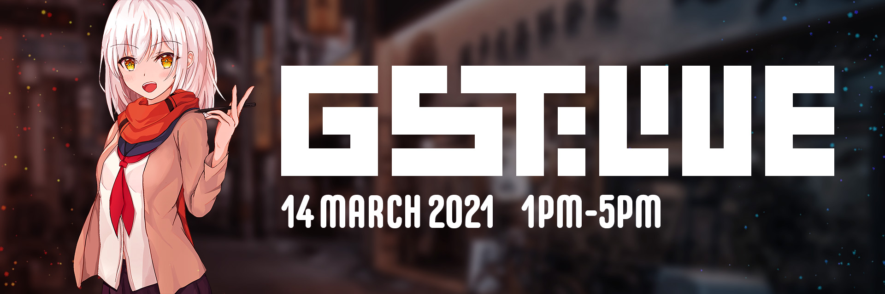

---
tags:
  - GSTLIVE
  - GST
  - GST LIVE
---

# GST:LIVE 2021

**GST:LIVE 2021** was a 1v1 single-elimination osu! tournament hosted by ::{ flag=SG }:: [megumic](https://osu.ppy.sh/users/7537133). It was the first instalment of GST:LIVE, held on the 14 March 2021 at Bountie Arena.

## Tournament schedule

### Pre-event

| Event | Timestamp |
| --: | :-- |
| Registration phase | 2021-02-25/2022-03-06 |

### Day of the event (14 March 2021)

| Event | Timestamp (UTC+08) |
| --: | :-- |
| Quarterfinals | 13:00 – 15:00 |
| Semifinals | 15:00 – 16:20 |
| Finals | 16:20 – 17:00 |

## Prizes

| Placing | Prizes |
| :-: | :-- |
|  | Physical medal |

## Organisation

GST:LIVE 2021 was run by various community members.

| Position | Member(s) |
| :-- | :-- |
| Organiser | ::{ flag=SG }:: [megumic](https://osu.ppy.sh/users/7537133) |
| GFX | ::{ flag=SG }:: [Hecatia](https://osu.ppy.sh/users/8244635) |
| On-site staff | ::{ flag=SG }:: [k\_1tty](https://osu.ppy.sh/users/5407620), ::{ flag=SG }:: [Loslite](https://osu.ppy.sh/users/6398160), ::{ flag=SG }:: [phox](https://osu.ppy.sh/users/772295), ::{ flag=SG }:: [sinn](https://osu.ppy.sh/users/4262229) |
| Wiki editor | ::{ flag=SG }:: [\_gt](https://osu.ppy.sh/users/8301957) |

## Links

- **[Main spreadsheet](https://docs.google.com/spreadsheets/d/1VdirRnsDPcC42FGCmx4VAL7Km8eKAeFHRmJ_kr8BgCM/edit#gid=1735468256)**
- [Discord server](https://discord.gg/3YXF2UCEYs)
- [Livestream](https://www.twitch.tv/osusg)

## Participants

In lieu of qualifiers, the participating players were selected randomly from the signups.

- ::{ flag=SG }:: [\_gt](https://osu.ppy.sh/users/8301957)
- ::{ flag=SG }:: [fausion](https://osu.ppy.sh/users/12261210)
- ::{ flag=SG }:: [Dawnwing](https://osu.ppy.sh/users/5144534)
- ::{ flag=SG }:: [Lunarsol](https://osu.ppy.sh/users/6622650)
- ::{ flag=SG }:: [Rtzero](https://osu.ppy.sh/users/9262462)
- ::{ flag=SG }:: [Stylus](https://osu.ppy.sh/users/7513711)
- ::{ flag=SG }:: [Jazzie](https://osu.ppy.sh/users/7137463)
- ::{ flag=SG }:: [Ayano\_](https://osu.ppy.sh/users/11413955)

## Podium

This competition has come to an end and resulted in the following podium:

| Placing | Player |
| :-: | :-- |
|  | ::{ flag=SG }:: [Dawnwing](https://osu.ppy.sh/users/5144534) |
|  | ::{ flag=SG }:: [Rtzero](https://osu.ppy.sh/users/9262462) |

## Mappools

### Finals & Semifinals

- NoMod
  1. [Yunomi - Oedo Controller (feat. TORIENA) (Mentai) \[Until the End of the Universe\]](https://osu.ppy.sh/beatmapsets/759903#osu/1610200)
  2. [BOOGABOO - BUGABUGA CHEW CHEW (emu1337) \[Multi-Track Drifting\]](https://osu.ppy.sh/beatmapsets/1052766#osu/2205164)
  3. [Camellia - Routing (Shiirn) \[Extra\]](https://osu.ppy.sh/beatmapsets/403282#osu/967558)
  4. [YUC'e - Future Cider (deadcode) \[Future Sliders\]](https://osu.ppy.sh/beatmapsets/720558#osu/1521299)
- Hidden
  1. [HyuN - Tokyo's Starlight (Pho) \[Collab Extra\]](https://osu.ppy.sh/beatmapsets/891712#osu/1864175)
  2. [Otomania - Ievan Polkka (Sinnoh) \[Expert\]](https://osu.ppy.sh/beatmapsets/700945#osu/1483732)
  3. [Coda - Fighting Gold (TV Size) (Tatan) \[Requiem\]](https://osu.ppy.sh/beatmapsets/863407#osu/1805978)
- HardRock
  1. [succducc - me & u (Alonevpk) \[thiinggs\]](https://osu.ppy.sh/beatmapsets/640447#osu/1358299)
  2. [cranky - R176 (taka1235) \[Another\]](https://osu.ppy.sh/beatmapsets/31367#osu/103102)
  3. [Meguro Shoji feat. Lyn - Last Surprise -Scramble- (moph) \[Flake's Extra\]](https://osu.ppy.sh/beatmapsets/1178471#osu/2476320)
- DoubleTime
  1. [TAKA respect for J.S.B - Ubertreffen (Philippines) \[Chrome\]](https://osu.ppy.sh/beatmapsets/49568#osu/154867)
  2. [kors k - Insane Techniques (captin1) \[Another\]](https://osu.ppy.sh/beatmapsets/155288#osu/380969)
  3. [Set It Off - Horrible Kids (My Angel Ram) \[Kuki's Extra\]](https://osu.ppy.sh/beatmapsets/1249048#osu/2596018)
- Tiebreaker
  1. **[Meramipop - Secret Desire - Dyes Remix - (Skystar) \[Irregular\]](https://osu.ppy.sh/beatmapsets/697895#osu/1478218)**

### Quarterfinals

- NoMod
  1. [YOASOBI - Ano Yume o Nazotte (Flask) \[captin lfj's Extra\]](https://osu.ppy.sh/beatmapsets/1120850#osu/2580333)
  2. [xi - .357 Magnum (Akali) \[Another\]](https://osu.ppy.sh/beatmapsets/155749#osu/381928)
  3. [YOASOBI - Halzion (Flame Haze) \[Sentimentality\]](https://osu.ppy.sh/beatmapsets/1261414#osu/2731383)
  4. [Lite Show Magic (t+pazolite vs C-Show) - Crack Traxxxx (Fatfan Kolek) \[Pantsu's Another\]](https://osu.ppy.sh/beatmapsets/139525#osu/404440)
- Hidden
  1. [Ziyoou-vachi - Kaen (Seto Kousuke) \[Expert\]](https://osu.ppy.sh/beatmapsets/918188#osu/1917397)
  2. [Shindig - Zzz (squirrelpascals) \[Another\]](https://osu.ppy.sh/beatmapsets/802730#osu/1684961)
- HardRock
  1. [FELT - crescent moon (Meg) \[Flowers always bloom in my heart\]](https://osu.ppy.sh/beatmapsets/479849#osu/1024549)
  2. [Jin Xan Xie - Dancing Kong Fu (attendant) \[Collab Expert\]](https://osu.ppy.sh/beatmapsets/1280933#osu/2660694)
- DoubleTime
  1. [Pharrell Williams - Happy (Lissette) \[Happy Collab\]](https://osu.ppy.sh/beatmapsets/163941#osu/399269)
  2. [2 Guys N the Parque - S.I.M.P. (Squirrels In My Pants) (Kingling) \[PaRaDogi's Insane\]](https://osu.ppy.sh/beatmapsets/1185064#osu/2636546)
- Tiebreaker
  1. **[Our Stolen Theory - United (L.A.O.S Remix) (Asphyxia) \[Infinity\]](https://osu.ppy.sh/beatmapsets/237768#osu/550235)**

## Match results

### Sunday, 14 March 2021

#### Finals

| Player 1 |  |  | Player 2 | Match link |
| --: | :-: | :-: | :-- | :-- |
| **Dawnwing** | **4** | 2 | Rtzero | [#1](https://osu.ppy.sh/community/matches/78039075) |

#### Semifinals

| Player 1 |  |  | Player 2 | Match link |
| --: | :-: | :-: | :-- | :-- |
| fausion | 0 | **4** | **Dawnwing** | [#1](https://osu.ppy.sh/community/matches/78037418) |
| **Rtzero** | **4** | 1 | Jazzie | [#1](https://osu.ppy.sh/community/matches/78038050) |

#### Quarterfinals

| Player 1 |  |  | Player 2 | Match link |
| --: | :-: | :-: | :-- | :-- |
| **fausion** | **3** | 2 | Lunarsol | [#1](https://osu.ppy.sh/community/matches/78030580) |
| \_gt | 2 | **3** | **Dawnwing** | [#1](https://osu.ppy.sh/community/matches/78032989) |
| Stylus | 2 | **3** | **Rtzero** | [#1](https://osu.ppy.sh/community/matches/78034404) |
| **Jazzie** | **3** | 2 | Ayano\_ | [#1](https://osu.ppy.sh/community/matches/78035998) |

## Ruleset

### Tournament registration

1. GST:LIVE 2021 is an open rank, 8-player, single-elimination, 1v1 tournament.
2. 8 players will be randomly chosen from the signups, then randomly seeded into the bracket.

### Match regulations

1. Once both players are in the lobby, they will `!roll`. The higher-rolling player gets the first ban and first pick.
2. Players are not allowed to ban the last available map in a modpool.
3. Each player is allowed 2 bans per match. Banned maps are effectively removed from the mappool for the duration of the match and are not allowed to be picked.
4. Players have 2 minutes to select a map; if they fail to choose in the allotted time, the map choice will be passed to the other player. This will have no effect on the order of picks afterwards.
5. Players may pick maps freely from any mod pool, barring the maps that have been banned.
6. Once the map choice is locked in, players will have 90 seconds to ready up. The referee will start the match when all players are ready. If the 90-second timer ends, the referee will force the map to begin in 10 seconds, and the match will start with whoever is in the lobby.
7. For tiebreakers, Free Mod will be enabled. **No Fail is enforced.** The allowed mods are Hidden, Hard Rock, Flashlight, and Easy. (Scores with Easy are multiplied by 2.0x)
