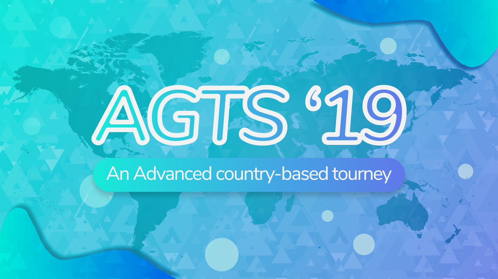

---
tags:
  - AGTS 2019
  - AGTS
  - GTS
outdated: true
---

# Advanced Global Taiko Showdown 2019

Der **Advanced Global Taiko Showdown 2019** (***AGTS 2019***) war ein länderbasiertes 2v2 Taikoturnier, welches von ![][flag_FR] [Kasumii-sama](https://osu.ppy.sh/users/6177263) und ![][flag_FR] [TLQ\_Yoshii](https://osu.ppy.sh/users/7157133) organisiert wurde. Es war bzw. war die dritte Ausführung der GTS-Reihe.

## Turnierplan

| Event | Zeitpunkt |
| --: | :-- |
| Registrierungsphase | 2019-07-07/2019-07-21 |
| Live-Ziehung | 2019-08-04 (15:00 UTC) |
| Qualifizierung | 2019-08-10/2019-08-11 |
| Gruppenphase | 2019-08-17/2019-08-18 |
| Viertelfinale | 2019-08-24/2019-08-25 |
| Halbfinale | 2019-08-31/2019-09-01 |
| Finale | 2019-09-07/2019-09-08 |
| Hauptfinale | 2019-09-14 |

## Preise

| Plazierung | Preis(e) |
| :-: | :-- |
|  | Einzigartige Badge, exklusiver Teambanner |
|  | Exklusiver Teambanner |
|  | Exklusiver Teambanner |

## Organisation

Der Advanced Global Taiko Showdown 2019 war bzw. wurde mit der Hilfe von mehreren Communitymitgliedern in verschiedenen Aufgabenfeldern durchgeführt.

| Position | Mitglieder |
| :-- | :-- |
| Organisierung | ![][flag_FR] [Kasumii-sama](https://osu.ppy.sh/users/6177263), ![][flag_FR] [TLQ\_Yoshii](https://osu.ppy.sh/users/7157133) |
| Mappooler | ![][flag_DE] [Nepuri](https://osu.ppy.sh/users/6637817), ![][flag_US] [Nifty](https://osu.ppy.sh/users/4956097) |
| Schiedsrichter | ![][flag_BR] [AnonX32](https://osu.ppy.sh/users/2730270), ![][flag_US] [cheese salad](https://osu.ppy.sh/users/6349821), ![][flag_US] [Edgar\_Figaro](https://osu.ppy.sh/users/6508754), ![][flag_DE] [GDLenny](https://osu.ppy.sh/users/8406711), ![][flag_DE] [Heam](https://osu.ppy.sh/users/4705120), ![][flag_FR] [Ladybug](https://osu.ppy.sh/users/4833654), ![][flag_FR] [Ladylag](https://osu.ppy.sh/users/2812098), ![][flag_FR] [Mirthille](https://osu.ppy.sh/users/7548517), ![][flag_DK] [Plaiceholder](https://osu.ppy.sh/users/11910867), ![][flag_TH] [Seaweed](https://osu.ppy.sh/users/5151214), ![][flag_AU] [soliderror](https://osu.ppy.sh/users/10630542), ![][flag_MY] [Stupid Idiot](https://osu.ppy.sh/users/8355574), ![][flag_FR] [TLQ\_Yoshii](https://osu.ppy.sh/users/7157133), ![][flag_SG] [uchuuj1n](https://osu.ppy.sh/users/9140302) |
| Streamer | ![][flag_BR] [AnonX32](https://osu.ppy.sh/users/2730270), ![][flag_JP] [Briesmas](https://osu.ppy.sh/users/2865172), ![][flag_US] [cheese salad](https://osu.ppy.sh/users/6349821), ![][flag_PL] [Deroo](https://osu.ppy.sh/users/8360475), ![][flag_US] [ITotallyGetThat](https://osu.ppy.sh/users/8770622), ![][flag_FR] [Kaeldori](https://osu.ppy.sh/users/962519), ![][flag_NL] [Krekker](https://osu.ppy.sh/users/8265940), ![][flag_FR] [Mirthille](https://osu.ppy.sh/users/7548517) |
| Kommentatoren | ![][flag_BR] [AnonX32](https://osu.ppy.sh/users/2730270), ![][flag_AU] [Beat43210](https://osu.ppy.sh/users/5664171), ![][flag_US] [CaptainEChan](https://osu.ppy.sh/users/9536977), ![][flag_FR] [Chernobog](https://osu.ppy.sh/users/3317042), ![][flag_PL] [Deroo](https://osu.ppy.sh/users/8360475), ![][flag_US] [Edgar\_Figaro](https://osu.ppy.sh/users/6508754), ![][flag_EC] [Gamelan4](https://osu.ppy.sh/users/9856910), ![][flag_DE] [Heam](https://osu.ppy.sh/users/4705120), ![][flag_US] [kb131313](https://osu.ppy.sh/users/11229259), ![][flag_US] [Tsred](https://osu.ppy.sh/users/2737667), ![][flag_SG] [uchuuj1n](https://osu.ppy.sh/users/9140302) |
| Designer | ![][flag_ID] [fajar13k](https://osu.ppy.sh/users/7100002) |
| Statistiker | ![][flag_DE] [IceDynamix](https://osu.ppy.sh/users/8599070), ![][flag_FR] [Kasumii-sama](https://osu.ppy.sh/users/6177263), ![][flag_CA] [Leadenginger](https://osu.ppy.sh/users/3799991), ![][flag_MY] [Minisora](https://osu.ppy.sh/users/9627666) |
| Übersetzer | ![][flag_BR] [AnonX32](https://osu.ppy.sh/users/2730270), ![][flag_KR] [BamgoeSN](https://osu.ppy.sh/users/1152851), ![][flag_DE] [Capu](https://osu.ppy.sh/users/2474015), ![][flag_HK] [Cynplytholowazy](https://osu.ppy.sh/users/3901754), ![][flag_PL] [Deroo](https://osu.ppy.sh/users/8360475), ![][flag_EC] [Gamelan4](https://osu.ppy.sh/users/9856910), ![][flag_TW] [InfinityAstral](https://osu.ppy.sh/users/9913256), ![][flag_US] [jyake](https://osu.ppy.sh/users/9099822), ![][flag_FR] [Kasumii-sama](https://osu.ppy.sh/users/6177263), ![][flag_FR] [TLQ\_Yoshii](https://osu.ppy.sh/users/7157133) |
| Wiki Herausgeber | ![][flag_ID] [fajar13k](https://osu.ppy.sh/users/7100002) |
| Developer | ![][flag_DE] [hallowatcher](https://osu.ppy.sh/users/1874761), ![][flag_FR] [ThePooN](https://osu.ppy.sh/users/718454) |

## Links

- [Diskussionsthread](https://osu.ppy.sh/community/forums/topics/931003)
- [AGTS Discord server](https://discord.gg/zbHVzvF)
- [Livestream](https://www.twitch.tv/gtsosu)
- [Challonge klammern](https://challonge.com/AGTS2019)
- **[Statistiksheet](https://docs.google.com/spreadsheets/d/14iravIyZ5o4WIFIx5MyGT_hg59OZKmTp34mQ5txpy7g/edit?usp=sharing)**

---

## Teilnehmer

|  | Land | Mitglieder |
| :-: | :-: | :-- |
| ![][flag_AR] | **Argentinien** | **[Pollotuc](https://osu.ppy.sh/users/42440)**, [juanilp4evr](https://osu.ppy.sh/users/6413125), [Atreevete](https://osu.ppy.sh/users/2615199), [warning dark](https://osu.ppy.sh/users/5040981) |
| ![][flag_AU] | **Australien** | **[Beat43210](https://osu.ppy.sh/users/5664171)**, [Tsubasa2](https://osu.ppy.sh/users/6835183), [richy2001](https://osu.ppy.sh/users/11499467), [AmateurMonkeyYT](https://osu.ppy.sh/users/8379046) |
| ![][flag_BR] | **Brasilien** | **[Lazarento](https://osu.ppy.sh/users/3224958)**, [Uzi I](https://osu.ppy.sh/users/6042123), [AiAyako](https://osu.ppy.sh/users/7003491), [Lolligerjoj](https://osu.ppy.sh/users/9053338), [mihinho](https://osu.ppy.sh/users/6509269) |
| ![][flag_CL] | **Chile** | **[Catulus](https://osu.ppy.sh/users/6276709)**, [Adimoc](https://osu.ppy.sh/users/6757492), [-NaNdo-](https://osu.ppy.sh/users/1934382) |
| ![][flag_CN] | **China** | **[\[sACRIFICe\]](https://osu.ppy.sh/users/6294200)**, [super mario fan](https://osu.ppy.sh/users/8263525), [Flandre sca](https://osu.ppy.sh/users/10324309), [-OvO-](https://osu.ppy.sh/users/12208924), [Nisoquo](https://osu.ppy.sh/users/12345370) |
| ![][flag_DE] | **Deutschland A** | **[Capu](https://osu.ppy.sh/users/2474015)**, [\[TaikoTori\]](https://osu.ppy.sh/users/1074143), [QEpicAce](https://osu.ppy.sh/users/9489153), [Siegmund99](https://osu.ppy.sh/users/5168596), [xBourbon\_Kid](https://osu.ppy.sh/users/645775) |
| ![][flag_DE] | **Deutschland B** | **[Aninoss](https://osu.ppy.sh/users/7364706)**, [Sayira](https://osu.ppy.sh/users/7253958), [JanteSmith](https://osu.ppy.sh/users/371772), [Naugustogi](https://osu.ppy.sh/users/6803970) |
| ![][flag_EC] | **Ecuador** | **[Gamelan4](https://osu.ppy.sh/users/9856910)**, [Arkano036](https://osu.ppy.sh/users/5899577), [Etsu](https://osu.ppy.sh/users/3442319) |
| ![][flag_FR] | **Frankreich** | **[maximaxiU](https://osu.ppy.sh/users/4069690)**, [Chernobog](https://osu.ppy.sh/users/3317042), [Gintoki8](https://osu.ppy.sh/users/2239411), [ALISTAR033009](https://osu.ppy.sh/users/9819975), [ZeddaStake](https://osu.ppy.sh/users/8801844) |
| ![][flag_HK] | **Hong Kong** | **[Brown918](https://osu.ppy.sh/users/9805760)**, [Cynplytholowazy](https://osu.ppy.sh/users/3901754), [\[\_isolated\_\]](https://osu.ppy.sh/users/6187838) |
| ![][flag_ID] | **Indonesien A** | **[Mikurio](https://osu.ppy.sh/users/10734140)**, [misaki_tk](https://osu.ppy.sh/users/3866964), [steven1](https://osu.ppy.sh/users/3090416), [Volta](https://osu.ppy.sh/users/4154071) |
| ![][flag_ID] | **Indonesien B** | **[Viewland](https://osu.ppy.sh/users/6250135)**, [Shirai-](https://osu.ppy.sh/users/4221845), [Alwaysyukaz](https://osu.ppy.sh/users/4999506), [ImChro](https://osu.ppy.sh/users/7280717), [Ahmad Haris](https://osu.ppy.sh/users/6048245) |
| ![][flag_JP] | **Japan** | **[Briesmas](https://osu.ppy.sh/users/2865172)**, [autumndayo](https://osu.ppy.sh/users/12268857), [TEL09016579767](https://osu.ppy.sh/users/3925121), [shinnme_ao](https://osu.ppy.sh/users/6252972), [Ku_Ren](https://osu.ppy.sh/users/2535243) |
| ![][flag_CA] | **Kanada** | **[beary605](https://osu.ppy.sh/users/2198070)**, [iceandele](https://osu.ppy.sh/users/1740540), [Player-](https://osu.ppy.sh/users/3724819), [rubies87](https://osu.ppy.sh/users/4949934), [DuckyDoom](https://osu.ppy.sh/users/3153062) |
| ![][flag_GB] ![][flag_PT] | **Königreich Großbritannien/Portugal** | **[Metzo](https://osu.ppy.sh/users/10633982)**, [w1ll](https://osu.ppy.sh/users/11406987), [Ali161102](https://osu.ppy.sh/users/7582420), [Yumi\_Hideaki](https://osu.ppy.sh/users/10081162) |
| ![][flag_MY] | **Malaysia** | **[Bedwyr Aorta](https://osu.ppy.sh/users/10875855)**, [Megumin-Sama](https://osu.ppy.sh/users/6201335), [Minisora](https://osu.ppy.sh/users/9627666), [imnoobatosuosu](https://osu.ppy.sh/users/12086753) |
| ![][flag_MX] | **Mexiko** | **[Iojioji](https://osu.ppy.sh/users/1346121)**, [ZaveryK](https://osu.ppy.sh/users/10913397), [L\_CORTES\_01](https://osu.ppy.sh/users/12548363) |
| ![][flag_NL] | **Niederlande** | **[Krekker](https://osu.ppy.sh/users/8265940)**, [Hypello](https://osu.ppy.sh/users/1594036), [jesse-98](https://osu.ppy.sh/users/502722), [StrijkIjzer](https://osu.ppy.sh/users/4130926) |
| ![][flag_AT] | **Österreich** | **[animexamera](https://osu.ppy.sh/users/7511357)**, [morth1](https://osu.ppy.sh/users/7246874), [Der Katze](https://osu.ppy.sh/users/7645997), [kBocaj](https://osu.ppy.sh/users/11453341), [Amane](https://osu.ppy.sh/users/6821436) |
| ![][flag_PH] | **Philippinen** | **[yuki\_momoiro722](https://osu.ppy.sh/users/7186791)**, [Niro-](https://osu.ppy.sh/users/6443899), [A i r](https://osu.ppy.sh/users/10363380), [Yron8](https://osu.ppy.sh/users/1537747) |
| ![][flag_PL] | **Polen** | **[Agresywny Arbuz](https://osu.ppy.sh/users/7056658)**, [Tetsurio](https://osu.ppy.sh/users/2044810), [-Jamu-](https://osu.ppy.sh/users/2271556), [Wolfgang](https://osu.ppy.sh/users/7184324), [fafik99](https://osu.ppy.sh/users/1787011) |
| ![][flag_RU] | **Russland A** | **[Nozdormu](https://osu.ppy.sh/users/7169208)**, [Akonine](https://osu.ppy.sh/users/7774222), [pavlukivan](https://osu.ppy.sh/users/8321579), [CrowWhite](https://osu.ppy.sh/users/8638977), [TwinT](https://osu.ppy.sh/users/9976154) |
| ![][flag_RU] | **Russland B** | **[-Rmdy](https://osu.ppy.sh/users/1933816)**, [JW-Dash](https://osu.ppy.sh/users/5285786), [oserry](https://osu.ppy.sh/users/11973082), [Starger](https://osu.ppy.sh/users/3398715), [Crysally](https://osu.ppy.sh/users/7792131) |
| ![][flag_DK] ![][flag_NO] ![][flag_SE] | **Scandinavia** | **[Hana Hayashi](https://osu.ppy.sh/users/4601806)**, [1794766](https://osu.ppy.sh/users/1794766), [Mills](https://osu.ppy.sh/users/7234023), [KatLeNeko](https://osu.ppy.sh/users/10183710), [mammasutter](https://osu.ppy.sh/users/11830625) |
| ![][flag_KR] | **Südkorea** | **[POCARI-SWEAT](https://osu.ppy.sh/users/5082685)**, [bbj0920](https://osu.ppy.sh/users/87546), [yuhuna_kor](https://osu.ppy.sh/users/13046017), [\[Akita-Neru\]](https://osu.ppy.sh/users/613944), [TRAtOrTs](https://osu.ppy.sh/users/12481695) |
| ![][flag_ES] | **Spanien** | **[naliem](https://osu.ppy.sh/users/3252709)**, [RuinedChicken](https://osu.ppy.sh/users/7983713), [Machango](https://osu.ppy.sh/users/7180552), [Nara\_NB](https://osu.ppy.sh/users/3593992) |
| ![][flag_TW] | **Taiwan** | **[- DeveRUX -](https://osu.ppy.sh/users/2900875)**, [Hatsuse](https://osu.ppy.sh/users/697007), [nw9v4g46](https://osu.ppy.sh/users/2169329), [david649713](https://osu.ppy.sh/users/1390823) |
| ![][flag_US] | **Vereinigte Staaten A** | **[Backfire](https://osu.ppy.sh/users/263110)**, [ChurroChef](https://osu.ppy.sh/users/9258564), [CaptainEChan](https://osu.ppy.sh/users/9536977), [dragonworm](https://osu.ppy.sh/users/11464752) |
| ![][flag_US] | **Vereinigte Staaten B** | **[driodx](https://osu.ppy.sh/users/9709548)**, [Shindamama](https://osu.ppy.sh/users/12780046), [R J](https://osu.ppy.sh/users/6490509), [DiggyDogg](https://osu.ppy.sh/users/5014664) |
| ![][flag_VE] | **Venezuela** | **[Nutellitah](https://osu.ppy.sh/users/10613075)**, [JessiChan](https://osu.ppy.sh/users/1368025) |

## Gruppen

| Group | Top seed | High seed | Low seed | Unseeded |
| :-: | :-- | :-- | :-- | :-- |
| **A** | ![][flag_PL] Polen | ![][flag_RU] Russland B | ![][flag_PH] Philippinen | ![][flag_MY] Malaysia |
| **B** | ![][flag_JP] Japan | ![][flag_AR] Argentinien | ![][flag_HK] Hong Kong | ![][flag_CL] Chile |
| **C** | ![][flag_NL] Niederlande | ![][flag_FR] Frankreich | ![][flag_MX] Mexiko | ![][flag_TW] Taiwan |
| **D** | ![][flag_US] Vereinigte Staaten A | ![][flag_RU] Russland A | ![][flag_US] Vereinigte Staaten B | ![][flag_BR] Brasilien |
| **E** | ![][flag_KR] Südkorea | ![][flag_DE] Deutschland A | ![][flag_DK] ![][flag_NO] ![][flag_SE] Scandinavia | ![][flag_VE] Venezuela |
| **F** | ![][flag_CA] Kanada | ![][flag_GB] ![][flag_PT] Königreich Großbritannien/Portugal | ![][flag_ID] Indonesien A | ![][flag_ID] Indonesien B |

---

## Podium

Dieses Turnier endete mit folgenden Ergebnissen:

| Platzierung | Land |
| :-: | :-- |
|  | ![][flag_JP] Japan |
|  | ![][flag_CA] Kanada |
|  | ![][flag_RU] Russland A |

---

## Mappools

### Hauptfinale

**[Lade den Mappool hier herunter! (86 MB)](https://mega.nz/#!s5sQzABI!BZ2WNuZ13rXisVdUgv2-gdku-4YxAR5IvkRfHqpRrOE)**

- NoMod
  - [sakuraburst - dragonlands (Faputa) \[Ura Oni\]](https://osu.ppy.sh/beatmapsets/935765#taiko/1954961)
  - [Kobaryo - northern_limit [feat. Sennzai] (Nepuri) \[ura_oni\]](https://osu.ppy.sh/beatmapsets/869714#taiko/1818337)
  - [Ester - Dizzolve (\_DUSK\_) \[goheegy's Inner Oni\]](https://osu.ppy.sh/beatmapsets/817528#taiko/1714380)
  - [t+pazolite - Antigravity (eiri-) \[Inner Oni\]](https://osu.ppy.sh/beatmapsets/1032630#taiko/2159095)
  - [Team:SASAKURATION - AVALON (Leader) \[Firce777's Ura Oni\]](https://osu.ppy.sh/beatmapsets/118763#taiko/406755)
  - [LIQU@. - Yotogibanashi no Kamikakushi (Kyubey) \[Nwolf's Inner Oni\]](https://osu.ppy.sh/beatmapsets/236396#taiko/661517)
- EX
  - [Hatsune Miku - boku-boku (Lan wings) \[Ishida's Hell Taiko\]](https://osu.ppy.sh/beatmapsets/51611#taiko/176945)
- Hidden
  - [Camellia - Primitive Pump (frz) \[Inner PUMP\]](https://osu.ppy.sh/beatmapsets/712424#taiko/1505977)
  - [goreshit - Bad Habits (SKSalt) \[Inner Oni\]](https://osu.ppy.sh/beatmapsets/450569#taiko/966645)
- HardRock
  - [Eagle - Hypersonik (Michiru) \[23-'s Inner Oni\]](https://osu.ppy.sh/beatmapsets/985854#taiko/2064162)
  - [Camellia - Chirality (\_DUSK\_) \[Inner Oni\]](https://osu.ppy.sh/beatmapsets/831411#taiko/1741806)
- DoubleTime
  - [Pocket Mirror Sound Team - Midnight Striken Clock \~ Glass Slipper (Rhytoly) \[Oni\]](https://osu.ppy.sh/beatmapsets/925760#taiko/1933722)
  - [JENNY ROM - WWW.BLONDE GIRL (MOMO MIX) (\[Belajar-Osu\]) \[Kqrth's Inner Oni\]](https://osu.ppy.sh/beatmapsets/920644#taiko/1933326)
- FreeMod
  - [P\*Light - NINJA IS DEAD IIDX ver. (Tofu1222) \[Skylish's Corpse Inner Oni\]](https://osu.ppy.sh/beatmapsets/590032#taiko/1628026)
  - [ginkiha - eastward (yuzu\_\_rinrin) \[Inner Oni\]](https://osu.ppy.sh/beatmapsets/630364#taiko/1332295)
  - [Shiron + Kofu x Morimori Atsushi to Teikyo de okuri shimasu - Demise Quartet (ll-oscar) \[ll-taiko\]](https://osu.ppy.sh/beatmapsets/614179#taiko/1295723)
- Tiebreaker
  - **[Venetian Snares - My Love Is A Bulldozer (Nifty) \[Destructive Lust\]](https://osu.ppy.sh/beatmapsets/773337#taiko/1625609)**

### Finale

**[Lade den Mappool hier herunter! (102 MB)](https://mega.nz/#!VslyCQQC!OjkCUb9D1DUMskdeyY8OMGefSheh7Ol2hTaGkOJLSkQ)**

- NoMod
  - [YUC'e - PUMP (KinomiCandy) \[Kinobles & Ozzy's Oni\]](https://osu.ppy.sh/beatmapsets/610546#taiko/1289147)
  - [Igorrr - Unpleasant Sonata (Sieg) \[Loctav's Oni\]](https://osu.ppy.sh/beatmapsets/90385#taiko/262458)
  - [Demetori - Kaze no Jukan \~ Wind Tour (GoldenWolf) \[Inner Oni\]](https://osu.ppy.sh/beatmapsets/736876#taiko/1555072)
  - [S.S.H. - Intersect Thunderbolt-Remix (7odoa) \[Taiko Inner Oni\]](https://osu.ppy.sh/beatmapsets/38316#taiko/170038)
  - [Uinyasu.Otthokobunny - Aa Kenran no Yume ga Gotoku(Epsilon Remix) (asuasu\_yura) \[Oni\]](https://osu.ppy.sh/beatmapsets/734435#taiko/1549623)
  - [UNDEAD CORPORATION - Seven Colors (Nwolf) \[Prismatic Oni\]](https://osu.ppy.sh/beatmapsets/288138#taiko/649918)
- EX
  - [sakuraburst - SELF DESTRUCT (\_DUSK\_) \[METASTABLE ONI\]](https://osu.ppy.sh/beatmapsets/963193#taiko/2016673)
- Hidden
  - [Nanahira - Monosugoi Dekotora de Patchouli ga Monosugoi Uta (Greenshell) \[Lolishell\]](https://osu.ppy.sh/beatmapsets/620238#taiko/1307203)
  - [EBIMAYO - GOODRAGE (asuasu\_yura) \[Oni\]](https://osu.ppy.sh/beatmapsets/679340#taiko/1436347)
- HardRock
  - [Xandria - Nightfall (frukoyurdakul) \[Inner Oni\]](https://osu.ppy.sh/beatmapsets/697750#taiko/1477955)
  - [t+pazolite - CENSORED!! (KitajimaYN) \[Inner Oni\]](https://osu.ppy.sh/beatmapsets/476520#taiko/1017812)
- DoubleTime
  - [Doma Umaru (CV. Tanaka Aimi) - Nimensei\*Uraomote Life! (Tyistiana) \[Inner Oni\]](https://osu.ppy.sh/beatmapsets/707590#taiko/1502284)
  - [Petit Rabbit's with beans - Sekai ga Cafe ni Nacchatta! (Tyistiana) \[Nardo's Inner Oni\]](https://osu.ppy.sh/beatmapsets/864036#taiko/2021055)
- FreeMod
  - [Kobaryo - Night Of Core (Rhytoly) \[Inner Oni\]](https://osu.ppy.sh/beatmapsets/807072#taiko/1693948)
  - [xi - Longinus (Faputa) \[Inner Oni\]](https://osu.ppy.sh/beatmapsets/963975#taiko/2018175)
  - [IOSYS - Border of extacy (Karaoke Ver) (eiri-) \[komasy's Inner Oni\]](https://osu.ppy.sh/beatmapsets/819351#taiko/1717859)
- Tiebreaker
  - **[Meshuggah - Bleed (frukoyurdakul) \[Drain\]](https://osu.ppy.sh/beatmapsets/638550#taiko/1354578)**

### Halbfinale

**[Lade den Mappool hier herunter! (77 MB)](https://mega.nz/#!xoE0iIbD!lJcoplSa3ELqMyn3vgNRHelF8xP93he6DpzoBcQ4qEs)**

- NoMod
  - [Murder King - Ben Her Gun Artik Sen (frukoyurdakul) \[Suistimal\]](https://osu.ppy.sh/beatmapsets/959186#taiko/2008180)
  - [kyou1110 vs. Takuya Namba - "Alice in Wonderland" : crazy apple could not live in real life (-Kazu-) \[Inner Oni\]](https://osu.ppy.sh/beatmapsets/742005#taiko/2003199)
  - [aran - Xperanza (Ulqui) \[Inner Oni\]](https://osu.ppy.sh/beatmapsets/800399#taiko/1680344)
  - [Sota Fujimori - polygon (Fallmorph) \[salchow's complex hi-speed inner oni\]](https://osu.ppy.sh/beatmapsets/721297#taiko/1588162)
  - [moro - Ice Cheinsaw (m1kado) \[Oni\]](https://osu.ppy.sh/beatmapsets/547084#taiko/1279898)
  - [BilliumMoto - life flashes before weeb eyes (Faputa) \[Outer Oni\]](https://osu.ppy.sh/beatmapsets/975435#taiko/2043119)
- EX
  - [Floxytek vs Billx - 30's Swing Tek (DarkTigrus) \[Taiko Guru\]](https://osu.ppy.sh/beatmapsets/45107#taiko/169245)
- Hidden
  - [E.G.G. - OK I'm blue rat (Kqrth) \[Oni\]](https://osu.ppy.sh/beatmapsets/994780#taiko/2080103)
  - [Rainbowdragoneyes - Creatures ov Deception (Mew104) \[Chromoxx' Inner Oni\]](https://osu.ppy.sh/beatmapsets/413267#taiko/935079)
- HardRock
  - [Jerico - Beyond Space Forcibly (tasuke912) \[Oni\]](https://osu.ppy.sh/beatmapsets/340890#taiko/753944)
  - [Itou Kanako - Uncontrollable (Charlotte) \[Uncontrollable Oni\]](https://osu.ppy.sh/beatmapsets/640326#taiko/1358048)
- DoubleTime
  - [PSYQUI - Update (Genjuro) \[Oni\]](https://osu.ppy.sh/beatmapsets/986373#taiko/2102164)
  - [Neuromonakh Feofan - Vezde plyashu (Nepuri) \[Bezumnyy\]](https://osu.ppy.sh/beatmapsets/694154#taiko/1468657)
- FreeMod
  - [OISHII - COCOA WATERSLIDE (-OvO-) \[Inner Oni\]](https://osu.ppy.sh/beatmapsets/912064#taiko/1905708)
  - [Seiryu - Critical Crystal (Sayaka-) \[Inner Oni\]](https://osu.ppy.sh/beatmapsets/138311#taiko/345483)
  - [ITO KASHITARO - Yuudachi no Ribbon (Skull Kid) \[Ribbon\]](https://osu.ppy.sh/beatmapsets/577827#taiko/1223186)
- Tiebreaker
  - **[Loctek - Summer CarnivaL (Metzo) \[CarnivaL Oni\]](https://osu.ppy.sh/beatmapsets/942014#taiko/1967051)**

### Viertelfinale

**[Lade den Mappool hier herunter! (83 MB)](https://mega.nz/#!spkR0agQ!MokudfOpqItg9GU4KnYaD-jRjMLVYctMnBeRmWDtGDA)**

- NoMod
  - [Function Phantom - Euclid (salchow) \[Green's Fifth Axiom\]](https://osu.ppy.sh/beatmapsets/941145#taiko/2002626)
  - [S.S.H. - BassTest (Ak1o) \[TEST\]](https://osu.ppy.sh/beatmapsets/666764#taiko/1411059)
  - [Chroma - I (rubies87) \[Oni\]](https://osu.ppy.sh/beatmapsets/883570#taiko/1933318)
  - [Camellia - \*Feels Seasickness...\* (Genjuro) \[Inner Oni\]](https://osu.ppy.sh/beatmapsets/1014457#taiko/2126517)
  - [Sadkey - Further (Airuei Redo) (Nifty) \[Discovery\]](https://osu.ppy.sh/beatmapsets/741764#taiko/1564820)
- EX
  - [Masa - Kitsune no Yomeiri (asuasu_yura) \[Inner Oni\]](https://osu.ppy.sh/beatmapsets/335722#taiko/743086)
- Hidden
  - [Yurry Canon - Suicide Parade (Yales) \[Inner Oni\]](https://osu.ppy.sh/beatmapsets/902163#taiko/1883597)
  - [Camellia feat. Nana Takahashi - Mushi no Sumu Tokoro (Shiirn) \[Nwolf's Oni\]](https://osu.ppy.sh/beatmapsets/436978#taiko/978374)
- HardRock
  - [Kiryu - Euphoric Phantasmagoria [komasy] \[Phantasm\]](https://osu.ppy.sh/beatmapsets/654413#taiko/1387168)
  - [Zekk - Libertas (\_DUSK\_) \[Inner Oni\]](https://osu.ppy.sh/beatmapsets/1001338#taiko/2096131)
- DoubleTime
  - [HyuN feat. JeeE - Fallen Angel (Mao) \[oko's Oni\]](https://osu.ppy.sh/beatmapsets/891335#taiko/1863216)
  - [Ni-Sokkususu - Shukusai no Elementalia (Rhytoly) \[Oni\]](https://osu.ppy.sh/beatmapsets/927110#taiko/1945290)
- FreeMod
  - [ParagonX9 - Defection (Ak1o) \[Inner Oni\]](https://osu.ppy.sh/beatmapsets/582351#taiko/1232379)
  - [Camellia feat. Nanahira - Bassdrop freaks (MMzz) \[Inner Oni\]](https://osu.ppy.sh/beatmapsets/299747#taiko/672384)
  - [P\*Light feat.Nanahira - Rainbow (P\*Light Remix) (Y O U T A) \[On the Sky\]](https://osu.ppy.sh/beatmapsets/536720#taiko/1137587)
- Tiebreaker
  - **[Various Artists - International OTOMAD's 6 (Midnaait) \[Inner Oni\]](https://osu.ppy.sh/beatmapsets/424276#taiko/916603)**

### Gruppenphase

**[Lade den Mappool hier herunter! (96 MB)](https://mega.nz/#!Iw9DFapR!yT-FtB8nk1fXieIln5gP_2tbUOWuxFQKAnj40NVpZHE)**

- NoMod
  - [Kurubukko vs yukitani - Minamichita EVOLVED (Cherry Blossom) \[Ex's Taiko Oni\]](https://osu.ppy.sh/beatmapsets/136632#taiko/342847)
  - [t+pazolite - Candy Crack Curtain Call (tasuke912) \[Oni\]](https://osu.ppy.sh/beatmapsets/237272#taiko/928806)
  - [UNDEAD CORPORATION - Yoru Naku Usagi wa Yume o Miru (Smoothie) \[Midnaait's Oni\]](https://osu.ppy.sh/beatmapsets/58951#taiko/388464)
  - [Thaehan - Leprechaun (Okoratu) \[Inner Oni\]](https://osu.ppy.sh/beatmapsets/877496#taiko/1834679)
  - [Lite Show Magic (t+pazolite vs C-Show) - Crack Traxxxx (Fatfan Kolek) \[TK'S Oni\]](https://osu.ppy.sh/beatmapsets/139525#taiko/361159)
  - [Minami Yuni - Kanagawa Cyber Culvert (ekumea1123) \[Inner Oni\]](https://osu.ppy.sh/beatmapsets/898783#taiko/1877557)
- EX
  - [Frums - Pictured as Perfect (\_yu68) \[Inner Oni\]](https://osu.ppy.sh/beatmapsets/966235#taiko/2052081)
- Hidden
  - [Zekk - Palpitation (yuzu\_\_rinrin) \[Pe'z Inner Oni\]](https://osu.ppy.sh/beatmapsets/761071#taiko/1608677)
  - [The Flashbulb - Six Acid Strings (Nardoxyribonucleic) \[Volta's Oni\]](https://osu.ppy.sh/beatmapsets/966451#taiko/2078180)
  - [Vickeblanka - Black Rover (TV Size) (Yales) \[Inner Oni\]](https://osu.ppy.sh/beatmapsets/793763#taiko/1666968)
- HardRock
  - [Rin - Kishinjou set 04 ~ Dullahan Under the Willows (tasuke912) \[Lunatic\]](https://osu.ppy.sh/beatmapsets/977058#taiko/2044998)
  - [ZUN - Septette for the Dead Princess (Pereira006) \[Dunskin's Inner Oni\]](https://osu.ppy.sh/beatmapsets/348342#taiko/772246)
  - [Caravan Palace - Dragons (Charles445) \[MM's Taiko\]](https://osu.ppy.sh/beatmapsets/46733#taiko/145511)
- DoubleTime
  - [Silent Siren - stella\* (captin1) \[Climbb & KPY's Taiko Oni\]](https://osu.ppy.sh/beatmapsets/163253#taiko/421153)
  - [Aihara Kaori - Total Eclipse 2035 \~Shoujo no Jikuu Kaiki Nisshoku\~ (Senritsu) \[Oni\]](https://osu.ppy.sh/beatmapsets/114368#taiko/296195)
  - [Hommarju - Crazy Jackpot (Tofu1222) \[aabc's Oni\]](https://osu.ppy.sh/beatmapsets/717853#taiko/1517306)
- FreeMod
  - [Naoki Miki (CV: Takahashi Rie) & Ebisuzawa Kurumi (CV: Ozawa Ari) - Unhappy End World (Tyistiana) \[Blacken's Inner Oni\]](https://osu.ppy.sh/beatmapsets/818296#taiko/1753169)
  - [DJ Sharpnel - Exciting Hyper Highspeed Star (Lunaii) \[Inner Oni\]](https://osu.ppy.sh/beatmapsets/920447#taiko/1922244)
  - [OISHII - UP UP MT. CAKE (Nifty) \[Inner Oni\]](https://osu.ppy.sh/beatmapsets/664795#taiko/1406933)
- Tiebreaker
  - **[kamome sano - future gazer (kmsn\_UKHC\_remix) (taiko\_maniac1811) \[Inner Oni\]](https://osu.ppy.sh/beatmapsets/372637#taiko/816175)**

### Qualifiers Stage

**[Lade den Mappool hier herunter! (20 MB)](https://mega.nz/#!4tsAEabY!800Cnbm5zlWGqErHTN9NvRZ8ieeBAqjrQxKWyvoCS9Q)**

- NoMod
  - [kors k - Poochie (Nifty) \[Special\]](https://osu.ppy.sh/beatmapsets/946420#taiko/1976130)
  - [Tati Zaqui - Placa no Chao (Kuron-kun) \[Vem pro baile\]](https://osu.ppy.sh/beatmapsets/737724#taiko/1556963)
- Hidden
  - [P\*Light - Gale Rider (Charlotte) \[komasy's Oni\]](https://osu.ppy.sh/beatmapsets/622356#taiko/1313624)
- HardRock
  - [sasakure.UK (feat.Hatsune Miku) - SeventH-HeaveN (\[I\]MMoRTal\[S\]) \[Inner Oni\]](https://osu.ppy.sh/beatmapsets/177182#taiko/426542)
- DoubleTime
  - [FLOW - Steppin' out (eiri-) \[Oni\]](https://osu.ppy.sh/beatmapsets/933667#taiko/1949159)

---

## Matchergebnisse

### Hauptfinale

| Samstag, 2019-09-14 |  |  |  |  |
| --: | :-: | :-: | :-- | :-- |
| **Japan** ![][flag_JP] | **7** | 1 | ![][flag_CA] Kanada | [#1](https://osu.ppy.sh/community/matches/54839968) |

### Finale

| Samstag, 2019-09-07 |  |  |  |  |
| --: | :-: | :-: | :-- | :-- |
| **Japan** ![][flag_JP] | **7** | 1 | ![][flag_RU] Russland A | [#1](https://osu.ppy.sh/community/matches/54674122) |

| Sonntag, 2019-09-08 |  |  |  |  |
| --: | :-: | :-: | :-- | :-- |
| Südkorea ![][flag_KR] | 4 | **7** | ![][flag_CA] **Kanada** | [#1](https://osu.ppy.sh/community/matches/54691282) |
| Russland A ![][flag_RU] | 2 | **7** | ![][flag_CA] **Kanada** | [#1](https://osu.ppy.sh/community/matches/54706574) |

### Halbfinale

| Samstag, 2019-08-31 |  |  |  |  |
| --: | :-: | :-: | :-- | :-- |
| Indonesien A ![][flag_ID] | 4 | **7** | ![][flag_JP] **Japan** | [#1](https://osu.ppy.sh/community/matches/54504410) |
| **Russland A** ![][flag_RU] | **7** | 2 | ![][flag_TW] Taiwan | [#1](https://osu.ppy.sh/community/matches/54507108) |
| Argentinien ![][flag_AR] | 4 | **7** | ![][flag_CA] **Kanada** | [#1](https://osu.ppy.sh/community/matches/54515229) |

| Sonntag, 2019-09-01 |  |  |  |  |
| --: | :-: | :-: | :-- | :-- |
| Taiwan ![][flag_TW] | 1 | **7** | ![][flag_CA] **Kanada** | [#1](https://osu.ppy.sh/community/matches/54521624) |
| Niederlande ![][flag_NL] | 6 | **7** | ![][flag_KR] **Südkorea** | [#1](https://osu.ppy.sh/community/matches/54530786) |
| Indonesien A ![][flag_ID] | 3 | **7** | ![][flag_KR] **Südkorea** | [#1](https://osu.ppy.sh/community/matches/54533409) |

### Viertelfinale

| Samstag, 2019-08-24 |  |  |  |  |
| --: | :-: | :-: | :-- | :-- |
| Argentinien ![][flag_AR] | 5 | **6** | ![][flag_TW] **Taiwan** | [#1](https://osu.ppy.sh/community/matches/54305260) |
| Deutschland A ![][flag_DE] | 0 | **6** | ![][flag_ID] **Indonesien A** | [#1](https://osu.ppy.sh/community/matches/54317268) |
| **Japan** ![][flag_JP] | **6** | 0 | ![][flag_BR] Brasilien | [#1](https://osu.ppy.sh/community/matches/54317042) |
| **Russland A** ![][flag_RU] | **6** | 2 | ![][flag_RU] Russland B | [#1](https://osu.ppy.sh/community/matches/54317274) |
| Kanada ![][flag_CA] | 4 | **6** | ![][flag_JP] **Japan** | [#1](https://osu.ppy.sh/community/matches/54318662) |
| Polen ![][flag_PL] | 1 | **6** | ![][flag_ID] **Indonesien A** | [#1](https://osu.ppy.sh/community/matches/54320532) | **Kanada** ![][flag_CA] | **6** | 1 | ![][flag_RU] Russland B | [#1](https://osu.ppy.sh/community/matches/54322599) |

| Sonntag, 2019-08-25 |  |  |  |  |
| --: | :-: | :-: | :-- | :-- |
| Südkorea ![][flag_KR] | 3 | **6** | ![][flag_TW] **Taiwan** | [#1](https://osu.ppy.sh/community/matches/54334906) |
| Niederlande ![][flag_NL] | 2 | **6** | ![][flag_RU] **Russland A** | [#1](https://osu.ppy.sh/community/matches/54346880) |
| **Südkorea** ![][flag_KR] | **6** | 0 | ![][flag_DE] Deutschland A | [#1](https://osu.ppy.sh/community/matches/54346891) |
| **Niederlande** ![][flag_NL] | **6** | 0 | ![][flag_BR] Brasilien | [#1](https://osu.ppy.sh/community/matches/54349753) |
| Polen ![][flag_PL] | 0 | **6** | ![][flag_AR] **Argentinien** | [#1](https://osu.ppy.sh/community/matches/54360101) |

### Gruppenphase

| Group | Samstag, 2019-08-17 |  |  |  |  |
| :-: | --: | :-: | :-: | :-- | :-- |
| C4 | Mexiko ![][flag_MX] | 2 | **5** | ![][flag_TW] **Taiwan** | [#1](https://osu.ppy.sh/mp/54132793) |
| D6 | Vereinigte Staaten B ![][flag_US] | 1 | **5** | ![][flag_US] **Vereinigte Staaten A** | [#1](https://osu.ppy.sh/mp/54133753) |
| A1 | **Russland B** ![][flag_RU] | **5** | 3 | ![][flag_PH] Philippinen | [#1](https://osu.ppy.sh/mp/54141466) |
| F5 | **Indonesien B** ![][flag_ID] | **5** | 0 | ![][flag_GB] ![][flag_PT] Königreich Großbritannien/Portugal | [#1](https://osu.ppy.sh/mp/54142329) |
| D1 | **Russland A** ![][flag_RU] | **5** | 2 | ![][flag_US] Vereinigte Staaten B | [#1](https://osu.ppy.sh/mp/54143643) |
| A5 | Malaysia ![][flag_MY] | 3 | **5** | ![][flag_RU] **Russland B** | [#1](https://osu.ppy.sh/mp/54143711) |
| C5 | **Taiwan** ![][flag_TW] | **5** | 0 | ![][flag_FR] Frankreich | [#1](https://osu.ppy.sh/mp/54146452) |
| A6 | Philippinen ![][flag_PH] | 1 | **5** | ![][flag_PL] **Polen** | [#1](https://osu.ppy.sh/mp/54146455) |
| E6 | Scandinavia ![][flag_DK] ![][flag_NO] ![][flag_SE] | 0 | **5** | ![][flag_KR] Südkorea | [#1](https://osu.ppy.sh/mp/54147726) |
| C1 | **Frankreich** ![][flag_FR] | **5** | 3 | ![][flag_MX] Mexiko | [#1](https://osu.ppy.sh/mp/54149300) |
| C6 | Mexiko ![][flag_MX] | 1 | **5** | ![][flag_NL] **Niederlande** | [#1](https://osu.ppy.sh/mp/54151830) |
| E1 | **Deutschland A** ![][flag_DE] | **5** | 1 | ![][flag_DK] ![][flag_NO] ![][flag_SE] Scandinavia | [#1](https://osu.ppy.sh/mp/54152083) |
| B5 | Chile ![][flag_CL] | 0 | **5** | ![][flag_AR] **Argentinien** | [#1](https://osu.ppy.sh/mp/54153575) |
| C3 | **Kanada** ![][flag_CA] | **5** | 0 | ![][flag_GB] ![][flag_PT] Königreich Großbritannien/Portugal | [#1](https://osu.ppy.sh/mp/54153517) |

| Group | Sonntag, 2019-08-18 |  |  |  |  |
| :-: | --: | :-: | :-: | :-- | :-- |
| F6 | Indonesien A ![][flag_ID] | 3 | **5** | ![][flag_CA] **Kanada** | [#1](https://osu.ppy.sh/mp/54159212) |
| B2 | Chile ![][flag_CL] | 0 | **5** | ![][flag_JP] **Japan** | [#1](https://osu.ppy.sh/mp/54160233) |
| B1 | **Argentinien** ![][flag_AR] | **5** | 2 | ![][flag_HK] Hong Kong | [#1](https://osu.ppy.sh/mp/54160229) |
| B3 | **Japan** ![][flag_JP] | **5** | 3 | ![][flag_AR] Argentinien | [#1](https://osu.ppy.sh/mp/54161382) |
| B4 | Hong Kong ![][flag_HK] | 0 | **5** | ![][flag_CL] **Chile** | [#1](https://osu.ppy.sh/mp/54161391) |
| F2 | Indonesien B ![][flag_ID] | 0 | **5** | ![][flag_CA] **Kanada** | -win by default- |
| B6 | Hong Kong ![][flag_HK] | 1 | **5** | ![][flag_JP] **Japan** | [#1](https://osu.ppy.sh/mp/54165254) |
| F4 | **Indonesien A** ![][flag_ID] | **5** | 0 | ![][flag_ID] Indonesien B | [#1](https://osu.ppy.sh/mp/54168881) |
| A3 | **Polen** ![][flag_PL] | **5** | 1 | ![][flag_RU] Russland B | [#1](https://osu.ppy.sh/mp/54168865) |
| D5 | Brasilien ![][flag_BR] | 2 | **5** | ![][flag_RU] **Russland A** | [#1](https://osu.ppy.sh/mp/54168668) |
| A4 | **Philippinen** ![][flag_PH] | **5** | 0 | ![][flag_MY] Malaysia | [#1](https://osu.ppy.sh/mp/54170118) |
| C2 | Taiwan ![][flag_TW] | 0 | **5** | ![][flag_NL] **Niederlande** | [#1](https://osu.ppy.sh/mp/54169919) |
| E2 | Venezuela ![][flag_VE] | 0 | **5** | ![][flag_KR] **Südkorea** | -win by default- |
| E3 | **Südkorea** ![][flag_KR] | **5** | 2 | ![][flag_DE] Deutschland A | [#1](https://osu.ppy.sh/mp/54171395) |
| F1 | Königreich Großbritannien/Portugal ![][flag_GB] ![][flag_PT] | 4 | **5** | ![][flag_ID] **Indonesien A** | [#1](https://osu.ppy.sh/mp/54171441) |
| A2 | Malaysia ![][flag_MY] | 0 | **5** | ![][flag_PL] **Polen** | [#1](https://osu.ppy.sh/mp/54171560) |
| D3 | Vereinigte Staaten A ![][flag_US] | 2 | **5** | ![][flag_RU] **Russland A** | [#1](https://osu.ppy.sh/mp/54171222) |
| C3 | **Niederlande** ![][flag_NL] | **5** | 1 | ![][flag_FR] Frankreich | [#1](https://osu.ppy.sh/mp/54173902) |
| D4 | Vereinigte Staaten B ![][flag_US] | 4 | **5** | ![][flag_BR] **Brasilien** | [#1](https://osu.ppy.sh/mp/54175298) |
| E4 | **Scandinavia** ![][flag_DK] ![][flag_NO] ![][flag_SE] | **5** | 0 | ![][flag_VE] Venezuela | -win by default- |
| E5 | Venezuela ![][flag_VE] | 0 | **5** | ![][flag_DE] **Deutschland A** | -win by default- |
| D2 | **Brasilien** ![][flag_BR] | **5** | 3 | ![][flag_US] Vereinigte Staaten A | [#1](https://osu.ppy.sh/mp/54181034) |

---

## Regeln

### Generelle Regeln

1. Dies ist ein **2v2 team tournament** mit Teams aus bis zu **5 Spielern.**
2. Die Teams werden erst in einer **Gruppenphase** und dann in einem **double-elimination bracket** spielen.
3. Das Punktesystem wird**Score V2** sein.
4. Jeder Spieler, der die Rangvoraussetzungen erfüllt, darf mitspielen. Weil das Turnier einen Banner zur Verfügung stellt, kann es sein, dass manche Spieler vom osu!Team abgelehnt werden.
5. Jedes GTS-Teammitglied, abgesehen von**Organisatoren, Mappoolern und Schiedsrichtern** dürfen mitmachen.
6. Spieler und GTS-Teammitglieder müssen diese Regeln komplett gelesen haben.
7. Alle Teilnehmer müssen reskeptvoll miteinander umgehen. Missachtung dieser Regel kann in einem Ausschluss des Turnieres führen. Dies gilt auch für GTS-Teammitglieder.
8. Jede Regeländerung oder unerwarteter Umstand wird im Forumbeitrag und im Discordserver angekündigt.

### Rangvoraussetzungen

1. Du musst zwischen Rang **#500** und **#3,500** während der Registrierung sein. Das heißt, dass du so lange in dem Bereich bleiben musst, **bis die Registrierungsphase abgeschlossen ist.**
2. Du darfst während des gesamten **Turnieres nicht höher als Rang #400 sein.** Solltest du dieses Limit überschreiten, wirst du disqualifiziert.
3. Du musst dich mit der Länderflagge deines profils registrieren.
4. Du musst dem Discord server beitreten.

### Turnierregistrierung und Teamerstellung

1. Um teilnehmen zu können musst du die Kriterien, welche im Teil der **[Rangvoraussetzungen](#rangvoraussetzungen)** genannt sind, erfüllen.
2. Spieler registrieren sich selbstständig. Wenn die Registrierung akzeptiert wird, bekommen sie ihre Länderrolle.
3. Der erste Kapitän des Teams wird vom osu!Team ausgewählt. Dieser bekommt dann sein Team per Forumnachricht zugeschickt.
4. Das GTS-Team kann Spieler ablehnen, wenn sie denken, dass jemand nicht in die Kategorie des Turnieres passt.
5. Dieses Jahr erlauben wir 2 Teams pro Land unter folgenden Regelungen:
   - Es gibt **6 oder mehr Spieler** die sich für ein Land registriert haben.
   - Jedes Team muss **mindestens 3 Spieler haben.**
6. Der Kapitän der Teams hat die Verantwortung das Team auszuwählen, außer:
   1. Es gibt 5 Spieler oder weniger von einem Land. Diese Spieler werden ein Team für ihr Land bilden. In anderen Fällen wird er derjenige sein, der folgende Entscheidungen trifft:
   2. Falls es mehr als 6 Spieler für ein Land gibt, wird das Team in 2 einzelne Teams geteilt. Dies sollte schnell geschehen um ausreichend Zeit zu haben einen Kapitän auszuwählen, um die Spiele schnell vorbereiten zu können.
   3. Falls die Spieler sich nicht einigen können, werden die Spieler per pp in 2 Teams eingeteilt.
7. Der Kapitän ist für die Änderung der Spielzeiten und für das Erscheinen der Spieler verantwortlich.

### Phasenregulierung

1. Es gibt 7 Phasen im Turnier: Die Qualifizierung, die Gruppenphase, die RO16, das Viertelfinale, das Halbfinale, das Finale und das Hauptfinale.
2. Die Teams werden mit ihrem Durchschnittsrang während der Qualifizierung eingeteilt.
3. Sollte es mehr als 32 registgrierte Teams geben, kommen nur die besten 32 aus der Qualifizierung weiter.
4. Teams werden zufällig in**8 Gruppen mit je 4 Teams** während einer Liveziehung am Sonntag, den 11. August eingeteilt.
5. In der Gruppenphase werden alle Teams innerhalb einer Gruppe gegeneinander antreten. Die **besten 2 Teams** kommen weiter.
6. Platzierungen jeder Gruppe werden nach folgender Priorität ausgewertet:
   1. Meiste Matches gewonnen.
   2. Höchste(Anzahl an gewonnenen Maps - Anzahl an verlorenen Maps) Punktzahl.
   3. Meiste Maps gewonnen.
   4. Gewinner vom letzten Match zwischen den unentschiedenen Teams.
7. In der Gruppenphase gilt ein "Win by default (WBD)" als 4:0 Sieg mit einer Punktedifferenz von +1.
8. Die Siegesvoraussetzung für jede Phase ist wie folgt:
   - Gruppenphase: BO9 (5 Maps gewinnen)
   - RO16, Viertelfinale und Loser's bracket Runde 1 und 2: BO11 (6 Maps gewinnen)
   - Halbfinale, Finale, Hauptfinale und Loser's Bracket Runde 3 und 4: BO13 (7 Maps gewinnen)

### Mappoolregulierung

1. Es wird einen Mappool für jede Phase geben. (Abgesehen vom Loser's Bracket)
2. Das Loser's Bracket wird mit dem gleichen Pool wie die jeweilige Phase des gleichen Wochenendes gespielt.
3. Der Qualifizierungspool wird anders als die anderen sein. Dort wird es nur 2 NoMod, 1 Hidden, 1 HardRock und 1 DoubleTime geben.
4. Jeder Mappool stellt sich aus 6 Bracket zusammen: NoMod, Hidden, HardRock, DoubleTime, FreeMod und Tiebreaker.
5. Der Mappool der Gruppenphase wird aus 14, RO16 und Viertelfinale aus 15 und Halbfinale, Finale und Hauptfinale aus 16 Maps bestehen.
6. Es werden jeweils 2 HD, HR, DT und 3 FM Maps in jedem Pool geben.
7. Der EX bracket wird ohne Mods gespielt und ist die schwierigere Version der NoMod Maps. EX Maps beinhalten weniger geläufige Mappingstile, Speedchanges, etc.
8. Der FreeMod-Pool kann mit **Hidden, HardRock oder beiden** Mods gespielt werden. **Mindestens ein Spieler pro Team muss einen Mod auswählen.**
9. Der Tiebreaker wird wie eine FreeMod Map behandelt. Hier muss allerdings kein Spieler einen Mod auswählen.
10. Der Mappool für jede Phase wird eine Woche vorher bekanntgegeben.

### Zeitplanregulierung

1. Jedes Match wird **an einem Wochenende** abgehalten. (Man kann das Match allerdings auch an einen anderen Tag verschieben, sollte sich kein passender Zeitpunkt finden lassen.)
2. Mehrere Matches dürfen gleichzeitig stattfinden, solange Schiedsrichter verfügbar sind.
3. Wir versuchen die Matches so gut wie möglich zeitlich anzupassen. Der Spielplan wird eine Woche vor der jeweiligen Phase veröffentlicht.
4. Änderungen der Spielzeit werden nur akzeptiert, wenn beide Teams einverstanden sind. Dies muss vor**Donnerstag 23:59 UTC+0** in der jeweiligen Woche geschehen und dem GTS-Team mitgeteilt werden.
5. Änderungen der Spielzeit dürfen nur vom **Kapitän des jeweiligen Teams** vorgenommen werden.

### Matchregulierung

1. 10 Minuten vor Spielbeginn wird von einem Schiedsrichter ein privater Raum erstellt. Dann werden die Spielführer beider Mannschaften eingeladen. Anschließend laden der Schiedsrichter oder die Spielführer die restlichen Spieler ein.
2. Sollte kein Schiedsrichter oder Turnierpersonal verfügbar sein, wird der Spielbeginn verschoben.
3. Sollte zu Spielbeginn nicht die minimal notwendige Anzahl an Spielern anwesend sein, kann der Spielbeginn bis zu maximal 10 Minuten nach hinten verschoben werden.
4. Sollte nach diesen weiteren 10 Minuten bei beiden Teams nicht die minimale Anzahl an Spielern anwesend sein, erhalten in der Gruppenphase beide eine Niederlage. In der KO-Phase erreicht das höher gesetzte Team die nächste Runde.
5. Das Spiel wird im Modus TeamVS und Scoremodus ScoreV2 gespielt. Der Raumname muss wie folgt aussehen: "AGTS 2019: (Team Rot) vs (Team Blau)".
6. Jedes Team darf eine Aufwärmmap wählen, die maximal 4 Minuten lang sein darf. Diese dürfen von allen Spielern beider Teams gespielt werden.
7. Jeder Spielführer muss **eine Beatmap** aus dem Mappool (abgesehen vom Tiebreaker) bannen. Diese Maps dürfen dann im gesamten Match von keinem der beiden Teams gewählt werden.
8. Am Anfangen rollen beide Spielführer mit Hilfe des `!roll`-Kommandos im Chat eine Zufallszahl zwischen 1 und 100.
9. Das Team mit der **höheren Zahl bannt als Zweites und darf dann als erstes eine Map auswählen.** Das Team mit der **niedrigeren Zahl bannt zuerst und darf dann als Zweites eine Beatmap auswählen.**
10. Danach wählen die Spielführer abwechselnd eine Beatmap aus dem Mappool aus.
11. Dabei darf frei aus diesem gewählt werden.
12. Es darf frei zwischen Spielern gewechselt werden.
13. Sollte ein Spieler zwischen dem Spielen von zwei Beatmaps die Verbindung verlieren und kein Ersatz verfügbar sein, kann das Weiterspielen um maximal 10 Minuten verschoben werden.
14. Sollte ein Spieler die Verbindung verlieren während eine Beatmap gespielt wird, wird er so behandelt als hätte er die Map nicht bestanden.
15. Sollte dies allerding in den ersten 30 Sekunden nachdem die Spielrunde gestartet wurde geschehen, kann die Runde neu ausgepielt werden. Dies ist jedoch nur einmal für jedes Team möglich.
16. Die Punktzahl eines Spielers, der eine Map nicht besteht, wird nicht zu den Punkten seines Teams addiert.
17. Sollte eine Spielrunde in einem Unentschieden enden, wird diese nicht gewertet und die Runde muss wiederholt werden.
18. Sollte es zu einem Gleichstand nach Punkten kommen (zum Beispiel ein Spielstand von 4-4 in einem Spiel bis 5) wird als nächste Beatmap der Tiebreaker ausgewählt.

### All-star-Regulierung

Die All-Star-Matches sind ein Veranstaltung bei der der Spaß im Vorderfrund steht. Sie werden in der selben Woche gespielt in der das große Finale stattfindet! Es soll nocheinmal eine Bühne für die besten Spieler des Turniers bieten, die hier in zwei verschiedenen Wettkampfarten gegeneinander antreten.

1. 12 Spieler werden bei den All-Star-Matches mitspielen. Diese werden durch eine Abstimmung bestimmt.
2. Die Top 12 dieser Abstimmung spielen mit. Sollten unter diesen allerdings mehr als 2 Spieler aus einem Team stammen, so werden nur die Top 2 dieser Mannschaft berücksichtigt.
3. Die zwei Spieler mit den meisten Stimmen bilden die Spielführer zweier Mannschaften und können dann Spieler aus den anderen 10 Spielern wählen. Der Spieler mit den meisten stimmen beginnt und dann wird wie folgt gewählt: A->B->B->A->A->B->B->A->A->B.
4. Dann werden zunächst 2 "battle royal matches" gespielt. Bei diesen wird 3 vs 3 auf einem Mappool aus 12 Maps(2 NM,HR,HD,DT,FM,EX) gespielt. (EX= schwerere Maps) Dabei wird die nächste Map mit Hilfe eines Zufallsrades gewählt.
5. Außerdem wird auch noch ein 4 vs 4 mit folgenden Regeln gespielt:
   - Ein Mappool bestehend aus 5 NM,HR,HD,DT,FM,EX und 1 TB (es gelten die selben Regeln für HR,HD,DT,FM,TB wie bei den normalen Matches)
   - Es werden keine Maps gebannt.
   - Zunächst wird mit Hilfe von "!roll" ein Mod bestimmt(unter Zuhilfenahme einer Tabelle) und dann mit Hilfe eines Zufallsrades die exakte Beatmap.
   - Spieler dürfen frei ausgetauscht werden.
   - Sollte ein Spieler die Verbindung verlieren, gelten die selben Regeln wie in den normalen Matches.

[flag_AR]: /wiki/shared/flag/AR.gif
[flag_AT]: /wiki/shared/flag/AT.gif
[flag_AU]: /wiki/shared/flag/AU.gif
[flag_BR]: /wiki/shared/flag/BR.gif
[flag_CA]: /wiki/shared/flag/CA.gif
[flag_CL]: /wiki/shared/flag/CL.gif
[flag_CN]: /wiki/shared/flag/CN.gif
[flag_DE]: /wiki/shared/flag/DE.gif
[flag_DK]: /wiki/shared/flag/DK.gif
[flag_EC]: /wiki/shared/flag/EC.gif
[flag_ES]: /wiki/shared/flag/ES.gif
[flag_FR]: /wiki/shared/flag/FR.gif
[flag_GB]: /wiki/shared/flag/GB.gif
[flag_HK]: /wiki/shared/flag/HK.gif
[flag_JP]: /wiki/shared/flag/JP.gif
[flag_ID]: /wiki/shared/flag/ID.gif
[flag_KR]: /wiki/shared/flag/KR.gif
[flag_MX]: /wiki/shared/flag/MX.gif
[flag_MY]: /wiki/shared/flag/MY.gif
[flag_NL]: /wiki/shared/flag/NL.gif
[flag_NO]: /wiki/shared/flag/NO.gif
[flag_PH]: /wiki/shared/flag/PH.gif
[flag_PL]: /wiki/shared/flag/PL.gif
[flag_PT]: /wiki/shared/flag/PT.gif
[flag_RU]: /wiki/shared/flag/RU.gif
[flag_SE]: /wiki/shared/flag/SE.gif
[flag_SG]: /wiki/shared/flag/SG.gif
[flag_TH]: /wiki/shared/flag/TH.gif
[flag_TW]: /wiki/shared/flag/TW.gif
[flag_US]: /wiki/shared/flag/US.gif
[flag_VE]: /wiki/shared/flag/VE.gif
