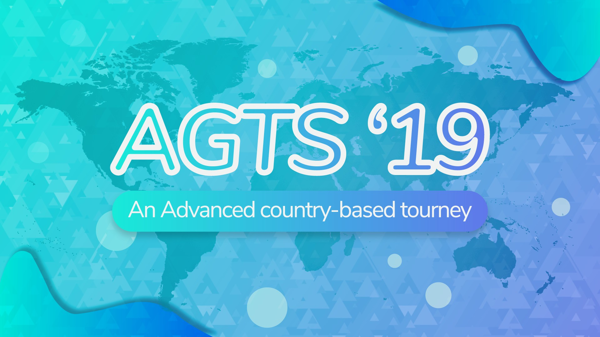

---
tags:
  - AGTS 2019
  - AGTS
  - GTS
outdated_translation: true
---

# Advanced Global Taiko Showdown 2019

**Advanced Global Taiko Showdown 2019** (***AGTS 2019***) był turniejem osu!taiko podwójnej eliminacji bazowanym na krajach prowadzonym przez ::{ flag=FR }:: [Kasumii-sama](https://osu.ppy.sh/users/6177263) i ::{ flag=FR }:: [TLQ\_Yoshii](https://osu.ppy.sh/users/7157133). To była trzecia część serii Global Taiko Showdown.

## Harmonogram turnieju

| Event | Czas |
| --: | :-- |
| Faza Rejestracji | 2019-07-07/2019-07-21 |
| Live Drawings | 2019-08-04 (15:00 UTC) |
| Kwalifikacje | 2019-08-10/2019-08-11 |
| Faza Grupowa | 2019-08-17/2019-08-18 |
| Ćwierćfinały | 2019-08-24/2019-08-25 |
| Półfinały | 2019-08-31/2019-09-01 |
| Finały | 2019-09-07/2019-09-08 |
| Wielkie Finały | 2019-09-14 |

## Nagrody

| Miejsce | Nagroda(y) |
| :-: | :-- |
|  | Unikalna odznaka profilu, ekskluzywny baner |
|  | Ekskluzywny baner |
|  | Ekskluzywny baner |

## Organizacja

Advanced Global Taiko Showdown 2019 był prowadzony przez różnych członków społeczności poprzez podział wielu zadań na różne obszary odpowiedzialności.

| Pozycja | Członkowie |
| :-- | :-- |
| Menedżer | ::{ flag=FR }:: [Kasumii-sama](https://osu.ppy.sh/users/6177263), ::{ flag=FR }:: [TLQ\_Yoshii](https://osu.ppy.sh/users/7157133) |
| Mappoolerzy | ::{ flag=DE }:: [Nepuri](https://osu.ppy.sh/users/6637817), ::{ flag=US }:: [Nifty](https://osu.ppy.sh/users/4956097) |
| Sędziowie | ::{ flag=BR }:: [AnonX32](https://osu.ppy.sh/users/2730270), ::{ flag=US }:: [cheese salad](https://osu.ppy.sh/users/6349821), ::{ flag=US }:: [Edgar\_Figaro](https://osu.ppy.sh/users/6508754), ::{ flag=DE }:: [GDLenny](https://osu.ppy.sh/users/8406711), ::{ flag=DE }:: [Heam](https://osu.ppy.sh/users/4705120), ::{ flag=FR }:: [Ladybug](https://osu.ppy.sh/users/4833654), ::{ flag=FR }:: [Ladylag](https://osu.ppy.sh/users/2812098), ::{ flag=FR }:: [Mirthille](https://osu.ppy.sh/users/7548517), ::{ flag=DK }:: [Plaiceholder](https://osu.ppy.sh/users/11910867), ::{ flag=TH }:: [Seaweed](https://osu.ppy.sh/users/5151214), ::{ flag=AU }:: [soliderror](https://osu.ppy.sh/users/10630542), ::{ flag=MY }:: [Stupid Idiot](https://osu.ppy.sh/users/8355574), ::{ flag=FR }:: [TLQ\_Yoshii](https://osu.ppy.sh/users/7157133), ::{ flag=SG }:: [uchuuj1n](https://osu.ppy.sh/users/9140302) |
| Streamerzy | ::{ flag=BR }:: [AnonX32](https://osu.ppy.sh/users/2730270), ::{ flag=JP }:: [Briesmas](https://osu.ppy.sh/users/2865172), ::{ flag=US }:: [cheese salad](https://osu.ppy.sh/users/6349821), ::{ flag=PL }:: [Deroo](https://osu.ppy.sh/users/8360475), ::{ flag=US }:: [ITotallyGetThat](https://osu.ppy.sh/users/8770622), ::{ flag=FR }:: [Kaeldori](https://osu.ppy.sh/users/962519), ::{ flag=NL }:: [Krekker](https://osu.ppy.sh/users/8265940), ::{ flag=FR }:: [Mirthille](https://osu.ppy.sh/users/7548517) |
| Komentatorzy | ::{ flag=BR }:: [AnonX32](https://osu.ppy.sh/users/2730270), ::{ flag=AU }:: [Beat43210](https://osu.ppy.sh/users/5664171), ::{ flag=US }:: [CaptainEChan](https://osu.ppy.sh/users/9536977), ::{ flag=FR }:: [Chernobog](https://osu.ppy.sh/users/3317042), ::{ flag=PL }:: [Deroo](https://osu.ppy.sh/users/8360475), ::{ flag=US }:: [Edgar\_Figaro](https://osu.ppy.sh/users/6508754), ::{ flag=EC }:: [Gamelan4](https://osu.ppy.sh/users/9856910), ::{ flag=DE }:: [Heam](https://osu.ppy.sh/users/4705120), ::{ flag=US }:: [kb131313](https://osu.ppy.sh/users/11229259), ::{ flag=US }:: [Tsred](https://osu.ppy.sh/users/2737667), ::{ flag=SG }:: [uchuuj1n](https://osu.ppy.sh/users/9140302) |
| Designerzy | ::{ flag=ID }:: [fajar13k](https://osu.ppy.sh/users/7100002) |
| Statystycy | ::{ flag=DE }:: [IceDynamix](https://osu.ppy.sh/users/8599070), ::{ flag=FR }:: [Kasumii-sama](https://osu.ppy.sh/users/6177263), ::{ flag=CA }:: [Leadenginger](https://osu.ppy.sh/users/3799991), ::{ flag=MY }:: [Minisora](https://osu.ppy.sh/users/9627666) |
| Tłumacze | ::{ flag=BR }:: [AnonX32](https://osu.ppy.sh/users/2730270), ::{ flag=KR }:: [BamgoeSN](https://osu.ppy.sh/users/1152851), ::{ flag=DE }:: [Capu](https://osu.ppy.sh/users/2474015), ::{ flag=HK }:: [Cynplytholowazy](https://osu.ppy.sh/users/3901754), ::{ flag=PL }:: [Deroo](https://osu.ppy.sh/users/8360475), ::{ flag=EC }:: [Gamelan4](https://osu.ppy.sh/users/9856910), ::{ flag=TW }:: [InfinityAstral](https://osu.ppy.sh/users/9913256), ::{ flag=US }:: [jyake](https://osu.ppy.sh/users/9099822), ::{ flag=FR }:: [Kasumii-sama](https://osu.ppy.sh/users/6177263), ::{ flag=FR }:: [TLQ\_Yoshii](https://osu.ppy.sh/users/7157133) |
| Edytor Wiki | ::{ flag=ID }:: [fajar13k](https://osu.ppy.sh/users/7100002) |
| Developer | ::{ flag=DE }:: [hallowatcher](https://osu.ppy.sh/users/1874761), ::{ flag=FR }:: [ThePooN](https://osu.ppy.sh/users/718454) |

## Links

- [Wątek dyskusyjny](https://osu.ppy.sh/community/forums/topics/931003)
- [Serwer Discord AGTS](https://discord.gg/zbHVzvF)
- [Livestream](https://www.twitch.tv/gtsosu)
- [Challonge brackets](https://challonge.com/AGTS2019)
- **[Arkusz Statystyk](https://docs.google.com/spreadsheets/d/14iravIyZ5o4WIFIx5MyGT_hg59OZKmTp34mQ5txpy7g/edit)**

## Uczestnicy

|  | Kraj | Członkowie |
| :-: | :-: | :-- |
| ::{ flag=AR }:: | **Argentyna** | **[Pollotuc](https://osu.ppy.sh/users/42440)**, [juanilp4evr](https://osu.ppy.sh/users/6413125), [Atreevete](https://osu.ppy.sh/users/2615199), [warning dark](https://osu.ppy.sh/users/5040981) |
| ::{ flag=AU }:: | **Australia** | **[Beat43210](https://osu.ppy.sh/users/5664171)**, [Tsubasa2](https://osu.ppy.sh/users/6835183), [richy2001](https://osu.ppy.sh/users/11499467), [AmateurMonkeyYT](https://osu.ppy.sh/users/8379046) |
| ::{ flag=AT }:: | **Austria** | **[animexamera](https://osu.ppy.sh/users/7511357)**, [morth1](https://osu.ppy.sh/users/7246874), [Der Katze](https://osu.ppy.sh/users/7645997), [kBocaj](https://osu.ppy.sh/users/11453341), [Amane](https://osu.ppy.sh/users/6821436) |
| ::{ flag=BR }:: | **Brazylia** | **[Lazarento](https://osu.ppy.sh/users/3224958)**, [Uzi I](https://osu.ppy.sh/users/6042123), [AiAyako](https://osu.ppy.sh/users/7003491), [Lolligerjoj](https://osu.ppy.sh/users/9053338), [mihinho](https://osu.ppy.sh/users/6509269) |
| ::{ flag=CL }:: | **Chile** | **[Catulus](https://osu.ppy.sh/users/6276709)**, [Adimoc](https://osu.ppy.sh/users/6757492), [-NaNdo-](https://osu.ppy.sh/users/1934382) |
| ::{ flag=CN }:: | **Chiny** | **[\[sACRIFICe\]](https://osu.ppy.sh/users/6294200)**, [super mario fan](https://osu.ppy.sh/users/8263525), [Flandre sca](https://osu.ppy.sh/users/10324309), [-OvO-](https://osu.ppy.sh/users/12208924), [Nisoquo](https://osu.ppy.sh/users/12345370) |
| ::{ flag=EC }:: | **Ekwador** | **[Gamelan4](https://osu.ppy.sh/users/9856910)**, [Arkano036](https://osu.ppy.sh/users/5899577), [Etsu](https://osu.ppy.sh/users/3442319) |
| ::{ flag=PH }:: | **Filipiny** | **[yuki\_momoiro722](https://osu.ppy.sh/users/7186791)**, [Niro-](https://osu.ppy.sh/users/6443899), [A i r](https://osu.ppy.sh/users/10363380), [Yron8](https://osu.ppy.sh/users/1537747) |
| ::{ flag=FR }:: | **Francja** | **[maximaxiU](https://osu.ppy.sh/users/4069690)**, [Chernobog](https://osu.ppy.sh/users/3317042), [Gintoki8](https://osu.ppy.sh/users/2239411), [ALISTAR033009](https://osu.ppy.sh/users/9819975), [ZeddaStake](https://osu.ppy.sh/users/8801844) |
| ::{ flag=ES }:: | **Hiszpania** | **[naliem](https://osu.ppy.sh/users/3252709)**, [RuinedChicken](https://osu.ppy.sh/users/7983713), [Machango](https://osu.ppy.sh/users/7180552), [Nara\_NB](https://osu.ppy.sh/users/3593992) |
| ::{ flag=NL }:: | **Holandia** | **[Krekker](https://osu.ppy.sh/users/8265940)**, [Hypello](https://osu.ppy.sh/users/1594036), [jesse-98](https://osu.ppy.sh/users/502722), [StrijkIjzer](https://osu.ppy.sh/users/4130926) |
| ::{ flag=HK }:: | **Hongkong** | **[Brown918](https://osu.ppy.sh/users/9805760)**, [Cynplytholowazy](https://osu.ppy.sh/users/3901754), [\[\_isolated\_\]](https://osu.ppy.sh/users/6187838) |
| ::{ flag=ID }:: | **Indonezja A** | **[Mikurio](https://osu.ppy.sh/users/10734140)**, [misaki_tk](https://osu.ppy.sh/users/3866964), [steven1](https://osu.ppy.sh/users/3090416), [Volta](https://osu.ppy.sh/users/4154071) |
| ::{ flag=ID }:: | **Indonezja B** | **[Viewland](https://osu.ppy.sh/users/6250135)**, [Shirai-](https://osu.ppy.sh/users/4221845), [Alwaysyukaz](https://osu.ppy.sh/users/4999506), [ImChro](https://osu.ppy.sh/users/7280717), [Ahmad Haris](https://osu.ppy.sh/users/6048245) |
| ::{ flag=JP }:: | **Japonia** | **[Briesmas](https://osu.ppy.sh/users/2865172)**, [autumndayo](https://osu.ppy.sh/users/12268857), [TEL09016579767](https://osu.ppy.sh/users/3925121), [shinnme_ao](https://osu.ppy.sh/users/6252972), [Ku_Ren](https://osu.ppy.sh/users/2535243) |
| ::{ flag=CA }:: | **Kanada** | **[beary605](https://osu.ppy.sh/users/2198070)**, [iceandele](https://osu.ppy.sh/users/1740540), [Player-](https://osu.ppy.sh/users/3724819), [rubies87](https://osu.ppy.sh/users/4949934), [DuckyDoom](https://osu.ppy.sh/users/3153062) |
| ::{ flag=KR }:: | **Korea Południowa** | **[POCARI-SWEAT](https://osu.ppy.sh/users/5082685)**, [bbj0920](https://osu.ppy.sh/users/87546), [yuhuna_kor](https://osu.ppy.sh/users/13046017), [\[Akita-Neru\]](https://osu.ppy.sh/users/613944), [TRAtOrTs](https://osu.ppy.sh/users/12481695) |
| ::{ flag=MY }:: | **Malezja** | **[Bedwyr Aorta](https://osu.ppy.sh/users/10875855)**, [Megumin-Sama](https://osu.ppy.sh/users/6201335), [Minisora](https://osu.ppy.sh/users/9627666), [imnoobatosuosu](https://osu.ppy.sh/users/12086753) |
| ::{ flag=MX }:: | **Meksyk** | **[Iojioji](https://osu.ppy.sh/users/1346121)**, [ZaveryK](https://osu.ppy.sh/users/10913397), [L\_CORTES\_01](https://osu.ppy.sh/users/12548363) |
| ::{ flag=DE }:: | **Niemcy A** | **[Capu](https://osu.ppy.sh/users/2474015)**, [\[TaikoTori\]](https://osu.ppy.sh/users/1074143), [QEpicAce](https://osu.ppy.sh/users/9489153), [Siegmund99](https://osu.ppy.sh/users/5168596), [xBourbon\_Kid](https://osu.ppy.sh/users/645775) |
| ::{ flag=DE }:: | **Niemcy B** | **[Aninoss](https://osu.ppy.sh/users/7364706)**, [Sayira](https://osu.ppy.sh/users/7253958), [JanteSmith](https://osu.ppy.sh/users/371772), [Naugustogi](https://osu.ppy.sh/users/6803970) |
| ::{ flag=PL }:: | **Polska** | **[Agresywny Arbuz](https://osu.ppy.sh/users/7056658)**, [Tetsurio](https://osu.ppy.sh/users/2044810), [-Jamu-](https://osu.ppy.sh/users/2271556), [Wolfgang](https://osu.ppy.sh/users/7184324), [fafik99](https://osu.ppy.sh/users/1787011) |
| ::{ flag=RU }:: | **Rosja A** | **[Nozdormu](https://osu.ppy.sh/users/7169208)**, [Akonine](https://osu.ppy.sh/users/7774222), [pavlukivan](https://osu.ppy.sh/users/8321579), [CrowWhite](https://osu.ppy.sh/users/8638977), [TwinT](https://osu.ppy.sh/users/9976154) |
| ::{ flag=RU }:: | **Rosja B** | **[-Rmdy](https://osu.ppy.sh/users/1933816)**, [JW-Dash](https://osu.ppy.sh/users/5285786), [oserry](https://osu.ppy.sh/users/11973082), [Starger](https://osu.ppy.sh/users/3398715), [Crysally](https://osu.ppy.sh/users/7792131) |
| ::{ flag=DK }:: ::{ flag=NO }:: ::{ flag=SE }:: | **Scandinavia** | **[Hana Hayashi](https://osu.ppy.sh/users/4601806)**, [1794766](https://osu.ppy.sh/users/1794766), [Mills](https://osu.ppy.sh/users/7234023), [KatLeNeko](https://osu.ppy.sh/users/10183710), [mammasutter](https://osu.ppy.sh/users/11830625) |
| ::{ flag=US }:: | **Stany Zjednoczone A** | **[Backfire](https://osu.ppy.sh/users/263110)**, [ChurroChef](https://osu.ppy.sh/users/9258564), [CaptainEChan](https://osu.ppy.sh/users/9536977), [dragonworm](https://osu.ppy.sh/users/11464752) |
| ::{ flag=US }:: | **Stany Zjednoczone B** | **[driodx](https://osu.ppy.sh/users/9709548)**, [Shindamama](https://osu.ppy.sh/users/12780046), [R J](https://osu.ppy.sh/users/6490509), [DiggyDogg](https://osu.ppy.sh/users/5014664) |
| ::{ flag=TW }:: | **Tajwan** | **[- DeveRUX -](https://osu.ppy.sh/users/2900875)**, [Hatsuse](https://osu.ppy.sh/users/697007), [nw9v4g46](https://osu.ppy.sh/users/2169329), [david649713](https://osu.ppy.sh/users/1390823) |
| ::{ flag=VE }:: | **Wenezuela** | **[Nutellitah](https://osu.ppy.sh/users/10613075)**, [JessiChan](https://osu.ppy.sh/users/1368025) |
| ::{ flag=GB }:: ::{ flag=PT }:: | **Wielka Brytania/Portugalia** | **[Metzo](https://osu.ppy.sh/users/10633982)**, [w1ll](https://osu.ppy.sh/users/11406987), [Ali161102](https://osu.ppy.sh/users/7582420), [Yumi\_Hideaki](https://osu.ppy.sh/users/10081162) |

## Grupy

| Grupa | Top seed | High seed | Low seed | Unseeded |
| :-: | :-- | :-- | :-- | :-- |
| **A** | ::{ flag=PL }:: Polska | ::{ flag=RU }:: Rosja B | ::{ flag=PH }:: Filipiny | ::{ flag=MY }:: Malezja |
| **B** | ::{ flag=JP }:: Japonia | ::{ flag=AR }:: Argentyna | ::{ flag=HK }:: Hongkong | ::{ flag=CL }:: Chile |
| **C** | ::{ flag=NL }:: Holandia | ::{ flag=FR }:: Francja | ::{ flag=MX }:: Meksyk | ::{ flag=TW }:: Tajwan |
| **D** | ::{ flag=US }:: Stany Zjednoczone A | ::{ flag=RU }:: Rosja A | ::{ flag=US }:: Stany Zjednoczone B | ::{ flag=BR }:: Brazylia |
| **E** | ::{ flag=KR }:: Korea Południowa | ::{ flag=DE }:: Niemcy A | ::{ flag=DK }:: ::{ flag=NO }:: ::{ flag=SE }:: Scandinavia | ::{ flag=VE }:: Wenezuela |
| **F** | ::{ flag=CA }:: Kanada | ::{ flag=GB }:: ::{ flag=PT }:: Wielka Brytania/Portugalia | ::{ flag=ID }:: Indonezja A | ::{ flag=ID }:: Indonezja B |

## Podium

Turniej dobiegł końca i wynikiem jest następujące podium:

| Miejsce | Kraj |
| :-: | :-- |
|  | ::{ flag=JP }:: Japonia |
|  | ::{ flag=CA }:: Kanada |
|  | ::{ flag=RU }:: Rosja A |

## Mappoole

### Wielkie Finały

**[Tutaj pobierzesz paczki map! (86 MB)](https://mega.nz/#!s5sQzABI!BZ2WNuZ13rXisVdUgv2-gdku-4YxAR5IvkRfHqpRrOE)**

- NoMod
  1. [sakuraburst - dragonlands (Faputa) \[Ura Oni\]](https://osu.ppy.sh/beatmapsets/935765#taiko/1954961)
  2. [Kobaryo - northern_limit [feat. Sennzai] (Nepuri) \[ura_oni\]](https://osu.ppy.sh/beatmapsets/869714#taiko/1818337)
  3. [Ester - Dizzolve (\_DUSK\_) \[goheegy's Inner Oni\]](https://osu.ppy.sh/beatmapsets/817528#taiko/1714380)
  4. [t+pazolite - Antigravity (eiri-) \[Inner Oni\]](https://osu.ppy.sh/beatmapsets/1032630#taiko/2159095)
  5. [Team:SASAKURATION - AVALON (Leader) \[Firce777's Ura Oni\]](https://osu.ppy.sh/beatmapsets/118763#taiko/406755)
  6. [LIQU@. - Yotogibanashi no Kamikakushi (Kyubey) \[Nwolf's Inner Oni\]](https://osu.ppy.sh/beatmapsets/236396#taiko/661517)
- EX
  1. [Hatsune Miku - boku-boku (Lan wings) \[Ishida's Hell Taiko\]](https://osu.ppy.sh/beatmapsets/51611#taiko/176945)
- Hidden
  1. [Camellia - Primitive Pump (frz) \[Inner PUMP\]](https://osu.ppy.sh/beatmapsets/712424#taiko/1505977)
  2. [goreshit - Bad Habits (SKSalt) \[Inner Oni\]](https://osu.ppy.sh/beatmapsets/450569#taiko/966645)
- HardRock
  1. [Eagle - Hypersonik (Michiru) \[23-'s Inner Oni\]](https://osu.ppy.sh/beatmapsets/985854#taiko/2064162)
  2. [Camellia - Chirality (\_DUSK\_) \[Inner Oni\]](https://osu.ppy.sh/beatmapsets/831411#taiko/1741806)
- DoubleTime
  1. [Pocket Mirror Sound Team - Midnight Striken Clock \~ Glass Slipper (Rhytoly) \[Oni\]](https://osu.ppy.sh/beatmapsets/925760#taiko/1933722)
  2. [JENNY ROM - WWW.BLONDE GIRL (MOMO MIX) (\[Belajar-Osu\]) \[Kqrth's Inner Oni\]](https://osu.ppy.sh/beatmapsets/920644#taiko/1933326)
- FreeMod
  1. [P\*Light - NINJA IS DEAD IIDX ver. (Tofu1222) \[Skylish's Corpse Inner Oni\]](https://osu.ppy.sh/beatmapsets/590032#taiko/1628026)
  2. [ginkiha - eastward (yuzu\_\_rinrin) \[Inner Oni\]](https://osu.ppy.sh/beatmapsets/630364#taiko/1332295)
  3. [Shiron + Kofu x Morimori Atsushi to Teikyo de okuri shimasu - Demise Quartet (ll-oscar) \[ll-taiko\]](https://osu.ppy.sh/beatmapsets/614179#taiko/1295723)
- Tiebreaker
  1. **[Venetian Snares - My Love Is A Bulldozer (Nifty) \[Destructive Lust\]](https://osu.ppy.sh/beatmapsets/773337#taiko/1625609)**

### Finały

**[Tutaj pobierzesz paczki map! (102 MB)](https://mega.nz/#!VslyCQQC!OjkCUb9D1DUMskdeyY8OMGefSheh7Ol2hTaGkOJLSkQ)**

- NoMod
  1. [YUC'e - PUMP (KinomiCandy) \[Kinobles & Ozzy's Oni\]](https://osu.ppy.sh/beatmapsets/610546#taiko/1289147)
  2. [Igorrr - Unpleasant Sonata (Sieg) \[Loctav's Oni\]](https://osu.ppy.sh/beatmapsets/90385#taiko/262458)
  3. [Demetori - Kaze no Jukan \~ Wind Tour (GoldenWolf) \[Inner Oni\]](https://osu.ppy.sh/beatmapsets/736876#taiko/1555072)
  4. [S.S.H. - Intersect Thunderbolt-Remix (7odoa) \[Taiko Inner Oni\]](https://osu.ppy.sh/beatmapsets/38316#taiko/170038)
  5. [Uinyasu.Otthokobunny - Aa Kenran no Yume ga Gotoku(Epsilon Remix) (asuasu\_yura) \[Oni\]](https://osu.ppy.sh/beatmapsets/734435#taiko/1549623)
  6. [UNDEAD CORPORATION - Seven Colors (Nwolf) \[Prismatic Oni\]](https://osu.ppy.sh/beatmapsets/288138#taiko/649918)
- EX
  1. [sakuraburst - SELF DESTRUCT (\_DUSK\_) \[METASTABLE ONI\]](https://osu.ppy.sh/beatmapsets/963193#taiko/2016673)
- Hidden
  1. [Nanahira - Monosugoi Dekotora de Patchouli ga Monosugoi Uta (Greenshell) \[Lolishell\]](https://osu.ppy.sh/beatmapsets/620238#taiko/1307203)
  2. [EBIMAYO - GOODRAGE (asuasu\_yura) \[Oni\]](https://osu.ppy.sh/beatmapsets/679340#taiko/1436347)
- HardRock
  1. [Xandria - Nightfall (frukoyurdakul) \[Inner Oni\]](https://osu.ppy.sh/beatmapsets/697750#taiko/1477955)
  2. [t+pazolite - CENSORED!! (KitajimaYN) \[Inner Oni\]](https://osu.ppy.sh/beatmapsets/476520#taiko/1017812)
- DoubleTime
  1. [Doma Umaru (CV. Tanaka Aimi) - Nimensei\*Uraomote Life! (Tyistiana) \[Inner Oni\]](https://osu.ppy.sh/beatmapsets/707590#taiko/1502284)
  2. [Petit Rabbit's with beans - Sekai ga Cafe ni Nacchatta! (Tyistiana) \[Nardo's Inner Oni\]](https://osu.ppy.sh/beatmapsets/864036#taiko/2021055)
- FreeMod
  1. [Kobaryo - Night Of Core (Rhytoly) \[Inner Oni\]](https://osu.ppy.sh/beatmapsets/807072#taiko/1693948)
  2. [xi - Longinus (Faputa) \[Inner Oni\]](https://osu.ppy.sh/beatmapsets/963975#taiko/2018175)
  3. [IOSYS - Border of extacy (Karaoke Ver) (eiri-) \[komasy's Inner Oni\]](https://osu.ppy.sh/beatmapsets/819351#taiko/1717859)
- Tiebreaker
  1. **[Meshuggah - Bleed (frukoyurdakul) \[Drain\]](https://osu.ppy.sh/beatmapsets/638550#taiko/1354578)**

### Półfinały

**[Tutaj pobierzesz paczki map! (77 MB)](https://mega.nz/#!xoE0iIbD!lJcoplSa3ELqMyn3vgNRHelF8xP93he6DpzoBcQ4qEs)**

- NoMod
  1. [Murder King - Ben Her Gun Artik Sen (frukoyurdakul) \[Suistimal\]](https://osu.ppy.sh/beatmapsets/959186#taiko/2008180)
  2. [kyou1110 vs. Takuya Namba - "Alice in Wonderland" : crazy apple could not live in real life (-Kazu-) \[Inner Oni\]](https://osu.ppy.sh/beatmapsets/742005#taiko/2003199)
  3. [aran - Xperanza (Ulqui) \[Inner Oni\]](https://osu.ppy.sh/beatmapsets/800399#taiko/1680344)
  4. [Sota Fujimori - polygon (Fallmorph) \[salchow's complex hi-speed inner oni\]](https://osu.ppy.sh/beatmapsets/721297#taiko/1588162)
  5. [moro - Ice Cheinsaw (m1kado) \[Oni\]](https://osu.ppy.sh/beatmapsets/547084#taiko/1279898)
  6. [BilliumMoto - life flashes before weeb eyes (Faputa) \[Outer Oni\]](https://osu.ppy.sh/beatmapsets/975435#taiko/2043119)
- EX
  1. [Floxytek vs Billx - 30's Swing Tek (DarkTigrus) \[Taiko Guru\]](https://osu.ppy.sh/beatmapsets/45107#taiko/169245)
- Hidden
  1. [E.G.G. - OK I'm blue rat (Kqrth) \[Oni\]](https://osu.ppy.sh/beatmapsets/994780#taiko/2080103)
  2. [Rainbowdragoneyes - Creatures ov Deception (Mew104) \[Chromoxx' Inner Oni\]](https://osu.ppy.sh/beatmapsets/413267#taiko/935079)
- HardRock
  1. [Jerico - Beyond Space Forcibly (tasuke912) \[Oni\]](https://osu.ppy.sh/beatmapsets/340890#taiko/753944)
  2. [Itou Kanako - Uncontrollable (Charlotte) \[Uncontrollable Oni\]](https://osu.ppy.sh/beatmapsets/640326#taiko/1358048)
- DoubleTime
  1. [PSYQUI - Update (Genjuro) \[Oni\]](https://osu.ppy.sh/beatmapsets/986373#taiko/2102164)
  2. [Neuromonakh Feofan - Vezde plyashu (Nepuri) \[Bezumnyy\]](https://osu.ppy.sh/beatmapsets/694154#taiko/1468657)
- FreeMod
  1. [OISHII - COCOA WATERSLIDE (-OvO-) \[Inner Oni\]](https://osu.ppy.sh/beatmapsets/912064#taiko/1905708)
  2. [Seiryu - Critical Crystal (Sayaka-) \[Inner Oni\]](https://osu.ppy.sh/beatmapsets/138311#taiko/345483)
  3. [ITO KASHITARO - Yuudachi no Ribbon (Skull Kid) \[Ribbon\]](https://osu.ppy.sh/beatmapsets/577827#taiko/1223186)
- Tiebreaker
  1. **[Loctek - Summer CarnivaL (Metzo) \[CarnivaL Oni\]](https://osu.ppy.sh/beatmapsets/942014#taiko/1967051)**

### Ćwierćfinały

**[Tutaj pobierzesz paczki map! (83 MB)](https://mega.nz/#!spkR0agQ!MokudfOpqItg9GU4KnYaD-jRjMLVYctMnBeRmWDtGDA)**

- NoMod
  1. [Function Phantom - Euclid (salchow) \[Green's Fifth Axiom\]](https://osu.ppy.sh/beatmapsets/941145#taiko/2002626)
  2. [S.S.H. - BassTest (Ak1o) \[TEST\]](https://osu.ppy.sh/beatmapsets/666764#taiko/1411059)
  3. [Chroma - I (rubies87) \[Oni\]](https://osu.ppy.sh/beatmapsets/883570#taiko/1933318)
  4. [Camellia - \*Feels Seasickness...\* (Genjuro) \[Inner Oni\]](https://osu.ppy.sh/beatmapsets/1014457#taiko/2126517)
  5. [Sadkey - Further (Airuei Redo) (Nifty) \[Discovery\]](https://osu.ppy.sh/beatmapsets/741764#taiko/1564820)
- EX
  1. [Masa - Kitsune no Yomeiri (asuasu_yura) \[Inner Oni\]](https://osu.ppy.sh/beatmapsets/335722#taiko/743086)
- Hidden
  1. [Yurry Canon - Suicide Parade (Yales) \[Inner Oni\]](https://osu.ppy.sh/beatmapsets/902163#taiko/1883597)
  2. [Camellia feat. Nana Takahashi - Mushi no Sumu Tokoro (Shiirn) \[Nwolf's Oni\]](https://osu.ppy.sh/beatmapsets/436978#taiko/978374)
- HardRock
  1. [Kiryu - Euphoric Phantasmagoria [komasy] \[Phantasm\]](https://osu.ppy.sh/beatmapsets/654413#taiko/1387168)
  2. [Zekk - Libertas (\_DUSK\_) \[Inner Oni\]](https://osu.ppy.sh/beatmapsets/1001338#taiko/2096131)
- DoubleTime
  1. [HyuN feat. JeeE - Fallen Angel (Mao) \[oko's Oni\]](https://osu.ppy.sh/beatmapsets/891335#taiko/1863216)
  2. [Ni-Sokkususu - Shukusai no Elementalia (Rhytoly) \[Oni\]](https://osu.ppy.sh/beatmapsets/927110#taiko/1945290)
- FreeMod
  1. [ParagonX9 - Defection (Ak1o) \[Inner Oni\]](https://osu.ppy.sh/beatmapsets/582351#taiko/1232379)
  2. [Camellia feat. Nanahira - Bassdrop freaks (MMzz) \[Inner Oni\]](https://osu.ppy.sh/beatmapsets/299747#taiko/672384)
  3. [P\*Light feat.Nanahira - Rainbow (P\*Light Remix) (Y O U T A) \[On the Sky\]](https://osu.ppy.sh/beatmapsets/536720#taiko/1137587)
- Tiebreaker
  1. **[Various Artists - International OTOMAD's 6 (Midnaait) \[Inner Oni\]](https://osu.ppy.sh/beatmapsets/424276#taiko/916603)**

### Faza Grupowa

**[Tutaj pobierzesz paczki map! (96 MB)](https://mega.nz/#!Iw9DFapR!yT-FtB8nk1fXieIln5gP_2tbUOWuxFQKAnj40NVpZHE)**

- NoMod
  1. [Kurubukko vs yukitani - Minamichita EVOLVED (Cherry Blossom) \[Ex's Taiko Oni\]](https://osu.ppy.sh/beatmapsets/136632#taiko/342847)
  2. [t+pazolite - Candy Crack Curtain Call (tasuke912) \[Oni\]](https://osu.ppy.sh/beatmapsets/237272#taiko/928806)
  3. [UNDEAD CORPORATION - Yoru Naku Usagi wa Yume o Miru (Smoothie) \[Midnaait's Oni\]](https://osu.ppy.sh/beatmapsets/58951#taiko/388464)
  4. [Thaehan - Leprechaun (Okoratu) \[Inner Oni\]](https://osu.ppy.sh/beatmapsets/877496#taiko/1834679)
  5. [Lite Show Magic (t+pazolite vs C-Show) - Crack Traxxxx (Fatfan Kolek) \[TK'S Oni\]](https://osu.ppy.sh/beatmapsets/139525#taiko/361159)
  6. [Minami Yuni - Kanagawa Cyber Culvert (ekumea1123) \[Inner Oni\]](https://osu.ppy.sh/beatmapsets/898783#taiko/1877557)
- EX
  1. [Frums - Pictured as Perfect (\_yu68) \[Inner Oni\]](https://osu.ppy.sh/beatmapsets/966235#taiko/2052081)
- Hidden
  1. [Zekk - Palpitation (yuzu\_\_rinrin) \[Pe'z Inner Oni\]](https://osu.ppy.sh/beatmapsets/761071#taiko/1608677)
  2. [The Flashbulb - Six Acid Strings (Nardoxyribonucleic) \[Volta's Oni\]](https://osu.ppy.sh/beatmapsets/966451#taiko/2078180)
  3. [Vickeblanka - Black Rover (TV Size) (Yales) \[Inner Oni\]](https://osu.ppy.sh/beatmapsets/793763#taiko/1666968)
- HardRock
  1. [Rin - Kishinjou set 04 ~ Dullahan Under the Willows (tasuke912) \[Lunatic\]](https://osu.ppy.sh/beatmapsets/977058#taiko/2044998)
  2. [ZUN - Septette for the Dead Princess (Pereira006) \[Dunskin's Inner Oni\]](https://osu.ppy.sh/beatmapsets/348342#taiko/772246)
  3. [Caravan Palace - Dragons (Charles445) \[MM's Taiko\]](https://osu.ppy.sh/beatmapsets/46733#taiko/145511)
- DoubleTime
  1. [Silent Siren - stella\* (captin1) \[Climbb & KPY's Taiko Oni\]](https://osu.ppy.sh/beatmapsets/163253#taiko/421153)
  2. [Aihara Kaori - Total Eclipse 2035 \~Shoujo no Jikuu Kaiki Nisshoku\~ (Senritsu) \[Oni\]](https://osu.ppy.sh/beatmapsets/114368#taiko/296195)
  3. [Hommarju - Crazy Jackpot (Tofu1222) \[aabc's Oni\]](https://osu.ppy.sh/beatmapsets/717853#taiko/1517306)
- FreeMod
  1. [Naoki Miki (CV: Takahashi Rie) & Ebisuzawa Kurumi (CV: Ozawa Ari) - Unhappy End World (Tyistiana) \[Blacken's Inner Oni\]](https://osu.ppy.sh/beatmapsets/818296#taiko/1753169)
  2. [DJ Sharpnel - Exciting Hyper Highspeed Star (Lunaii) \[Inner Oni\]](https://osu.ppy.sh/beatmapsets/920447#taiko/1922244)
  3. [OISHII - UP UP MT. CAKE (Nifty) \[Inner Oni\]](https://osu.ppy.sh/beatmapsets/664795#taiko/1406933)
- Tiebreaker
  1. **[kamome sano - future gazer (kmsn\_UKHC\_remix) (taiko\_maniac1811) \[Inner Oni\]](https://osu.ppy.sh/beatmapsets/372637#taiko/816175)**

### Kwalifikacje

**[Tutaj pobierzesz paczki map! (20 MB)](https://mega.nz/#!4tsAEabY!800Cnbm5zlWGqErHTN9NvRZ8ieeBAqjrQxKWyvoCS9Q)**

- NoMod
  1. [kors k - Poochie (Nifty) \[Special\]](https://osu.ppy.sh/beatmapsets/946420#taiko/1976130)
  2. [Tati Zaqui - Placa no Chao (Kuron-kun) \[Vem pro baile\]](https://osu.ppy.sh/beatmapsets/737724#taiko/1556963)
- Hidden
  1. [P\*Light - Gale Rider (Charlotte) \[komasy's Oni\]](https://osu.ppy.sh/beatmapsets/622356#taiko/1313624)
- HardRock
  1. [sasakure.UK (feat.Hatsune Miku) - SeventH-HeaveN (\[I\]MMoRTal\[S\]) \[Inner Oni\]](https://osu.ppy.sh/beatmapsets/177182#taiko/426542)
- DoubleTime
  1. [FLOW - Steppin' out (eiri-) \[Oni\]](https://osu.ppy.sh/beatmapsets/933667#taiko/1949159)

## Wyniki Meczy

### Wielkie Finały

| Sobota, 2019-09-14 |  |  |  |  |
| --: | :-: | :-: | :-- | :-- |
| **Japonia** ::{ flag=JP }:: | **7** | 1 | ::{ flag=CA }:: Kanada | [#1](https://osu.ppy.sh/community/matches/54839968) |

### Finały

| Sobota, 2019-09-07 |  |  |  |  |
| --: | :-: | :-: | :-- | :-- |
| **Japonia** ::{ flag=JP }:: | **7** | 1 | ::{ flag=RU }:: Rosja A | [#1](https://osu.ppy.sh/community/matches/54674122) |

| Niedziela, 2019-09-08 |  |  |  |  |
| --: | :-: | :-: | :-- | :-- |
| Korea Południowa ::{ flag=KR }:: | 4 | **7** | ::{ flag=CA }:: **Kanada** | [#1](https://osu.ppy.sh/community/matches/54691282) |
| Rosja A ::{ flag=RU }:: | 2 | **7** | ::{ flag=CA }:: **Kanada** | [#1](https://osu.ppy.sh/community/matches/54706574) |

### Półfinały

| Sobota, 2019-08-31 |  |  |  |  |
| --: | :-: | :-: | :-- | :-- |
| Indonezja A ::{ flag=ID }:: | 4 | **7** | ::{ flag=JP }:: **Japonia** | [#1](https://osu.ppy.sh/community/matches/54504410) |
| **Rosja A** ::{ flag=RU }:: | **7** | 2 | ::{ flag=TW }:: Tajwan | [#1](https://osu.ppy.sh/community/matches/54507108) |
| Argentyna ::{ flag=AR }:: | 4 | **7** | ::{ flag=CA }:: **Kanada** | [#1](https://osu.ppy.sh/community/matches/54515229) |

| Niedziela, 2019-09-01 |  |  |  |  |
| --: | :-: | :-: | :-- | :-- |
| Tajwan ::{ flag=TW }:: | 1 | **7** | ::{ flag=CA }:: **Kanada** | [#1](https://osu.ppy.sh/community/matches/54521624) |
| Holandia ::{ flag=NL }:: | 6 | **7** | ::{ flag=KR }:: **Korea Południowa** | [#1](https://osu.ppy.sh/community/matches/54530786) |
| Indonezja A ::{ flag=ID }:: | 3 | **7** | ::{ flag=KR }:: **Korea Południowa** | [#1](https://osu.ppy.sh/community/matches/54533409) |

### Ćwierćfinały

| Sobota, 2019-08-24 |  |  |  |  |
| --: | :-: | :-: | :-- | :-- |
| Argentyna ::{ flag=AR }:: | 5 | **6** | ::{ flag=TW }:: **Tajwan** | [#1](https://osu.ppy.sh/community/matches/54305260) |
| Niemcy A ::{ flag=DE }:: | 0 | **6** | ::{ flag=ID }:: **Indonezja A** | [#1](https://osu.ppy.sh/community/matches/54317268) |
| **Japonia** ::{ flag=JP }:: | **6** | 0 | ::{ flag=BR }:: Brazylia | [#1](https://osu.ppy.sh/community/matches/54317042) |
| **Rosja A** ::{ flag=RU }:: | **6** | 2 | ::{ flag=RU }:: Rosja B | [#1](https://osu.ppy.sh/community/matches/54317274) |
| Kanada ::{ flag=CA }:: | 4 | **6** | ::{ flag=JP }:: **Japonia** | [#1](https://osu.ppy.sh/community/matches/54318662) |
| Polska ::{ flag=PL }:: | 1 | **6** | ::{ flag=ID }:: **Indonezja A** | [#1](https://osu.ppy.sh/community/matches/54320532) |
| **Kanada** ::{ flag=CA }:: | **6** | 1 | ::{ flag=RU }:: Rosja B | [#1](https://osu.ppy.sh/community/matches/54322599) |

| Niedziela, 2019-08-25 |  |  |  |  |
| --: | :-: | :-: | :-- | :-- |
| Korea Południowa ::{ flag=KR }:: | 3 | **6** | ::{ flag=TW }:: **Tajwan** | [#1](https://osu.ppy.sh/community/matches/54334906) |
| Holandia ::{ flag=NL }:: | 2 | **6** | ::{ flag=RU }:: **Rosja A** | [#1](https://osu.ppy.sh/community/matches/54346880) |
| **Korea Południowa** ::{ flag=KR }:: | **6** | 0 | ::{ flag=DE }:: Niemcy A | [#1](https://osu.ppy.sh/community/matches/54346891) |
| **Holandia** ::{ flag=NL }:: | **6** | 0 | ::{ flag=BR }:: Brazylia | [#1](https://osu.ppy.sh/community/matches/54349753) |
| Polska ::{ flag=PL }:: | 0 | **6** | ::{ flag=AR }:: **Argentyna** | [#1](https://osu.ppy.sh/community/matches/54360101) |

### Faza Grupowa

| Grupa | Sobota, 2019-08-17 |  |  |  |  |
| :-: | --: | :-: | :-: | :-- | :-- |
| C4 | Meksyk ::{ flag=MX }:: | 2 | **5** | ::{ flag=TW }:: **Tajwan** | [#1](https://osu.ppy.sh/community/matches/54132793) |
| D6 | Stany Zjednoczone B ::{ flag=US }:: | 1 | **5** | ::{ flag=US }:: **Stany Zjednoczone A** | [#1](https://osu.ppy.sh/community/matches/54133753) |
| A1 | **Rosja B** ::{ flag=RU }:: | **5** | 3 | ::{ flag=PH }:: Filipiny | [#1](https://osu.ppy.sh/community/matches/54141466) |
| F5 | **Indonezja B** ::{ flag=ID }:: | **5** | 0 | ::{ flag=GB }:: ::{ flag=PT }:: Wielka Brytania/Portugalia | [#1](https://osu.ppy.sh/community/matches/54142329) |
| D1 | **Rosja A** ::{ flag=RU }:: | **5** | 2 | ::{ flag=US }:: Stany Zjednoczone B | [#1](https://osu.ppy.sh/community/matches/54143643) |
| A5 | Malezja ::{ flag=MY }:: | 3 | **5** | ::{ flag=RU }:: **Rosja B** | [#1](https://osu.ppy.sh/community/matches/54143711) |
| C5 | **Tajwan** ::{ flag=TW }:: | **5** | 0 | ::{ flag=FR }:: Francja | [#1](https://osu.ppy.sh/community/matches/54146452) |
| A6 | Filipiny ::{ flag=PH }:: | 1 | **5** | ::{ flag=PL }:: **Polska** | [#1](https://osu.ppy.sh/community/matches/54146455) |
| E6 | Scandinavia ::{ flag=DK }:: ::{ flag=NO }:: ::{ flag=SE }:: | 0 | **5** | ::{ flag=KR }:: Korea Południowa | [#1](https://osu.ppy.sh/community/matches/54147726) |
| C1 | **Francja** ::{ flag=FR }:: | **5** | 3 | ::{ flag=MX }:: Meksyk | [#1](https://osu.ppy.sh/community/matches/54149300) |
| C6 | Meksyk ::{ flag=MX }:: | 1 | **5** | ::{ flag=NL }:: **Holandia** | [#1](https://osu.ppy.sh/community/matches/54151830) |
| E1 | **Niemcy A** ::{ flag=DE }:: | **5** | 1 | ::{ flag=DK }:: ::{ flag=NO }:: ::{ flag=SE }:: Scandinavia | [#1](https://osu.ppy.sh/community/matches/54152083) |
| B5 | Chile ::{ flag=CL }:: | 0 | **5** | ::{ flag=AR }:: **Argentyna** | [#1](https://osu.ppy.sh/community/matches/54153575) |
| C3 | **Kanada** ::{ flag=CA }:: | **5** | 0 | ::{ flag=GB }:: ::{ flag=PT }:: Wielka Brytania/Portugalia | [#1](https://osu.ppy.sh/community/matches/54153517) |

| Group | Niedziela, 2019-08-18 |  |  |  |  |
| :-: | --: | :-: | :-: | :-- | :-- |
| F6 | Indonezja A ::{ flag=ID }:: | 3 | **5** | ::{ flag=CA }:: **Kanada** | [#1](https://osu.ppy.sh/community/matches/54159212) |
| B2 | Chile ::{ flag=CL }:: | 0 | **5** | ::{ flag=JP }:: **Japonia** | [#1](https://osu.ppy.sh/community/matches/54160233) |
| B1 | **Argentyna** ::{ flag=AR }:: | **5** | 2 | ::{ flag=HK }:: Hongkong | [#1](https://osu.ppy.sh/community/matches/54160229) |
| B3 | **Japonia** ::{ flag=JP }:: | **5** | 3 | ::{ flag=AR }:: Argentyna | [#1](https://osu.ppy.sh/community/matches/54161382) |
| B4 | Hongkong ::{ flag=HK }:: | 0 | **5** | ::{ flag=CL }:: **Chile** | [#1](https://osu.ppy.sh/community/matches/54161391) |
| F2 | Indonezja B ::{ flag=ID }:: | 0 | **5** | ::{ flag=CA }:: **Kanada** | -win by default- |
| B6 | Hongkong ::{ flag=HK }:: | 1 | **5** | ::{ flag=JP }:: **Japonia** | [#1](https://osu.ppy.sh/community/matches/54165254) |
| F4 | **Indonezja A** ::{ flag=ID }:: | **5** | 0 | ::{ flag=ID }:: Indonezja B | [#1](https://osu.ppy.sh/community/matches/54168881) |
| A3 | **Polska** ::{ flag=PL }:: | **5** | 1 | ::{ flag=RU }:: Rosja B | [#1](https://osu.ppy.sh/community/matches/54168865) |
| D5 | Brazylia ::{ flag=BR }:: | 2 | **5** | ::{ flag=RU }:: **Rosja A** | [#1](https://osu.ppy.sh/community/matches/54168668) |
| A4 | **Filipiny** ::{ flag=PH }:: | **5** | 0 | ::{ flag=MY }:: Malezja | [#1](https://osu.ppy.sh/community/matches/54170118) |
| C2 | Tajwan ::{ flag=TW }:: | 0 | **5** | ::{ flag=NL }:: **Holandia** | [#1](https://osu.ppy.sh/community/matches/54169919) |
| E2 | Wenezuela ::{ flag=VE }:: | 0 | **5** | ::{ flag=KR }:: **Korea Południowa** | -win by default- |
| E3 | **Korea Południowa** ::{ flag=KR }:: | **5** | 2 | ::{ flag=DE }:: Niemcy A | [#1](https://osu.ppy.sh/community/matches/54171395) |
| F1 | Wielka Brytania/Portugalia ::{ flag=GB }:: ::{ flag=PT }:: | 4 | **5** | ::{ flag=ID }:: **Indonezja A** | [#1](https://osu.ppy.sh/community/matches/54171441) |
| A2 | Malezja ::{ flag=MY }:: | 0 | **5** | ::{ flag=PL }:: **Polska** | [#1](https://osu.ppy.sh/community/matches/54171560) |
| D3 | Stany Zjednoczone A ::{ flag=US }:: | 2 | **5** | ::{ flag=RU }:: **Rosja A** | [#1](https://osu.ppy.sh/community/matches/54171222) |
| C3 | **Holandia** ::{ flag=NL }:: | **5** | 1 | ::{ flag=FR }:: Francja | [#1](https://osu.ppy.sh/community/matches/54173902) |
| D4 | Stany Zjednoczone B ::{ flag=US }:: | 4 | **5** | ::{ flag=BR }:: **Brazylia** | [#1](https://osu.ppy.sh/community/matches/54175298) |
| E4 | **Scandinavia** ::{ flag=DK }:: ::{ flag=NO }:: ::{ flag=SE }:: | **5** | 0 | ::{ flag=VE }:: Wenezuela | -win by default- |
| E5 | Wenezuela ::{ flag=VE }:: | 0 | **5** | ::{ flag=DE }:: **Niemcy A** | -win by default- |
| D2 | **Brazylia** ::{ flag=BR }:: | **5** | 3 | ::{ flag=US }:: Stany Zjednoczone A | [#1](https://osu.ppy.sh/community/matches/54181034) |

## Zasady

### Ogólne Zasady

1. Ten turniej to **turniej drużynowy 2v2** z drużynami po **maksymalne 5 graczy**.
2. Drużyny najpierw zagrają w f**azie grupowej** a następnie w **drabince podwójnej eliminacji**.
3. Systemem Punktacji będzie **Score V2**.
4. Każdy gracz, który spełnia wymagania określone w części dotyczącej ograniczeń rankingu, może zagrać. Ponieważ ten turniej będzie miał na celu zdobycie odznaki profilu, niektórzy gracze mogą zostać odrzuceni przez personel osu.
5. Każdy członek personelu oprócz **Organizatorów, Mappoolerów oraz Sędziów** może wziąć udział w turnieju.
6. Zawodnicy i członkowie personelu muszą całkowicie przeczytać ten zestaw reguł (i założymy, że zrobiłeś to podczas całego turnieju).
7. Wszyscy uczestnicy muszą zachować szacunek i właściwą postawę do innych. Nieprzestrzeganie tej zasady może skutkować czarną listą/wyrzuceniem z turnieju. Ta zasada dotyczy również całego personelu.
8. Wszelkie zmiany reguł lub nieoczekiwane zdarzenia zostaną ogłoszone w wątku na forum i na serwerze Discord.

### Ograniczenia Rangi

1. Musisz być w rankingu od #500 do #3,500 podczas rejestracji. Oznacza to, że musisz być w tym przedziale rankingowym **aż do końca rejestracji**.
2. Nie możesz przekroczyć rangi **#400 podczas turnieju**. Jeśli przekroczysz ten limit, zostaniesz zdyskwalifikowany.
3. Musisz zarejestrować się za pomocą flagi kraju swojego profilu.
4. YMusisz dołącyć do Serwera Discord turnieju.

### Rejestracja i Tworzenie Drużyn

1. Aby wziąć udział, musisz spełnić kryteria podane w **części [ograniczenia rangi.](#ograniczenia-rangi)**
2. Gracze rejestrują się indywidualnie. Kiedy ich rejestracja zostanie zaakceptowana, otrzymają rolę kraju.
3. Pierwszy kapitan drużyny zostanie wybrany przez personel turnieju i otrzyma listę wszystkich graczy w kraju w prywatnej wiadomości na forum osu!.
4. Personel może odmówić graczowi, jeśli uzna, że umiejętności gracza nie pasują do turnieju.
5. W tym roku zezwalamy na 2 drużyny dla danego kraju pod pewnymi warunkami:
   - Jeżeli jest **6 lub więcej graczy** zarejestrowanych dla kraju.
   - Każda drużyna musi posiadać **conajmniej 3 graczy**.
6. Kapitan wybrany przez personel turnieju jest odpowiedzialny za wybór składu drużyny, chyba, że:
   1. Jeśli w danym kraju zarejestrowanych jest 5 graczy lub mniej, ci gracze utworzą zespół reprezentujący ich kraj. W innych przypadkach to on zdecyduje, jak to się stanie, np.
   2. W przypadku, gdy w danym kraju zapisanych jest więcej niż 6 graczy, skład musi być rozdzielony, aby utworzyć 2 drużyny. Zaleca się jak najszybsze znalezienie porozumienia, a następnie zacząć wybranie kapitana aby szybciej zaplanować i przygotować mecze.
   3. W przypadku, gdy gracze nie mogą znaleźć porozumienia, zostaną uszeregowani według pp i umieszczeni w 2 drużynach z co najmniej 3 członkami w każdym z nich z najlepszymi w pierwszej drużynie, a najniższymi w drugiej.
7. Kapitan będzie tym, który w razie potrzeby zmieni harmonogram meczu i zapewni, że jego koledzy z drużyny są obecni w czasie meczy.

### Zasady Faz

1. W turnieju jest siedem faz: Kwalifikacje, Faza Grupowa, Ćwierćfinał, Półfinały, Finały i Wielkie Finały.
2. Drużyna zostanie rozstawiona ze średnią swoich rang na każdej mapie podczas rundy kwalifikacji.
3. W przypadku, gdy zarejestrowanych jest więcej niż 32 zespoły, tylko 32 najlepsze drużyny przejdą dalej.
4. Drużyny zostaną rozlosowane w **6 grupach po 4** zespoły podczas Drawing Show, który odbędzie się w niedzielę 11 sierpnia.
5. W Fazie Grupowej wszystkie drużyny z każdej grupy staną naprzeciw siebie. **Najlepsze 2 zespoły wychodzą z grupy**.
6. Rankingi każdej grupy są określane przez sortowanie wyników wyników każdej drużyny w następującym priorytecie:
   1. Najwięcej meczy wygranych.
   2. Najwyższy (liczba wygranych map - liczba przegranych map) wynik.
   3. Nawięcej map wygranych.
   4. Winner of the match played previously between the tied teams.
7. W Fazie Grupowej "Win by default" będzie uważane za wygrane 4:0, +1,0 punktowy współczynnik różnicy.
8. Warunkiem zwycięstwa dla każdej fazy jest:
   - Faza Grupowa: BO9 (wygraj 5 map)
   - RO16, Ćwierćfinały i Drabinka Przegranych Runda 1 i 2: BO11 (wygraj 6 map)
   - Półfinały, Finały, Wielkie Finały i Drabinka Przegranych Runda 3 i 4: BO13 (wygraj 7 map)

### Instrukcje Mappoola

1. Dla każdego z następujących będzie 1 osobny mappool: Kwalifikacje, Faza Grupowa, Ćwierćfinały, Półfinały, Finały i Wielkie Finały.
2. Drabinka Przegranych zagra ten sam mappool co w Drabince Wygranych w ten sam weekend
3. Mappool Kwalifikacji będzie się różnił od pozostałych, ponieważ jego format to: 2 mapy NoMod, 1 mapa Hidden, 1 mapa HardRock, 1 Mapa DoubleTime.
4. Każdy mappool składa się z następujących map: NoMod, Hidden, HardRock, DoubleTime, FreeMod and Tiebreaker.
5. Każdy pula map będzie się składać z 20 map.
6. Ilość map Hidden, Hard Rock i Double Time będzie wynosić 2 i 3 dla map FreeMod we wszystkich Fazach.
7. Mapy EX będą grane bez modów i są trudniejszą wersją NoMod. Zawierają mapy, które zawierają specjalne techniki mapowania, zmiany prędkości itp.
8. Mapy FreeMod będą grane z użyciem FreeModa. Każdy gracz może wybrać **Hidden, HardRock albo oba. Przynajmniej jeden gracz z każdej drużyny musi grać z conajmniej jednym modem**.
9. Tiebreaker jest rozgrywany w warunkach FreeMod, ale nie jest wymagane aby ktokolwiek grał z modem.
10. Mappool dla każdego Fazy zostanie zaprezentowany tydzień wcześniej.

### Instrukcje Planowania

1. Każda Faza odbywa się **podczas weekendu**. (Dozwolone jest jednak zaplanowanie meczu na inny dzień, jeśli w weekend nie będzie czasu)
2. Mecze mogą się nakładać, jeśli sędziowie są dostępni.
3. Postaramy się zaplanować mecze jak najlepiej, aby pasowały do stref czasowych. Harmonogram zostanie wydany w weekend przed każdą Fazą.
4. Przełożenia będą rozpatrywane tylko wtedy, gdy obie drużyny zgodzą się na ustalony czas, należy to zrobić i powiadomić o tym personel turnieju przed **Piątkiem o 01:59 UTC+2** w tym konkretnym tygodniu, gdy mecz się odbędzie.
5. O zmiany harmonogramu może prosić tylko **kapitan drużyny**.

### Regulamin Meczu

1. Prywatne pokój zostanie utworzone 10 minut przed meczem przez sędziego. Obaj kapitanowie drużyn zostaną zaproszeni do pokoju, gdy nadejdzie czas meczu. Następnie sędziowie lub kapitanowie zapraszają resztę graczy do pokoju.
2. Jeśli nie ma dostępnego personelu, mecz zostanie przełożony.
3. Jeśli podczas meczu bierze udział mniej niż minimalna wymagana liczba graczy, maksymalny czas, w którym można opóźnić mecz, wynosi 10 minut.
4. Jeśli żadna z obu drużyn nie ma minimalnej wymaganej liczby graczy po 10 minutach, będzie to traktowane jako strata dla obu drużyn w Fazie Frupowej. W Fazie Podwójnej Eliminacji awansuje drużyna z najwyższym seedem.
5. Mecz zostanie rozegrany jako TeamVs i ScoreV2, a nazwa pokoju musi być: „AGTS 2019: (Team Red) vs (Team Blue)”.
6. Każda drużyna ma jedną mapę rozgrzewkę, ale musi być poniżej 4 minut. Każdy z graczy może wejść do pokoju podczas rozgrzewki.
7. Każdy kapitam musi zbanować **jedną mapę** podczas każdego meczu (oprócz Tiebreakera). Te mapy nie będą mogły zostać wybrane przez żadną z drużyn podczas całego meczu.
8. Kapitan każdej drużyny musi użyć komendy `!roll` na czacie.
9. Drużyna z **wyższym rollem banuje druga i wybiera pierwsza mapę**. Drużyna z **niższym rollem banuje pierwsza i wybiera druga mapę**.
10. Wybór mapy będzie następował na przemian przez kapitanów drużyny.
11. Kapitan może wybrać dowolną mapę z aktualnego mappoola.
12. Wymiana graczy podczas meczu jest dozwolona bez limitu.
13. Jeśli gracz rozłączy się pomiędzy mapami i drużyna nie może dokonać wymiany, mecz może zostać opóźniony maksymalnie o 10 minut.
14. Jeżeli gracz rozłączy się podczas grania mapy, będzie traktowany jakby nie przeszedł mapy.
15. Rozłączenie gracza w ciągu 30 sekund od rozpoczęcia mapy może skutkować ponownym zagraniem mapy. Jest to dozwolone tylko raz na drużynę.
16. Wyniki gracza, który nie przeszedł mapy nie są dodawane do wyniku drużyny.
17. Jeżeli mapa zakończy się remisem, jej wynik zostaje anulowany i mapa jest grana jeszcze raz.
18. W przypadku remisu punktów (przykład: 4-4 w BO9), zostaje wybrany Tiebreaker.

### Zasady All-star

All-star to zabawne wydarzenie, które odbędzie się w ten sam weekend, co Wielkie Finały! Zaprezentuje najlepszych graczy turnieju grających przeciwko sobie w dwóch różnych typach meczów.

1. 12 graczy weźmie udział w tym wydarzeniu. Zostaną wybrani w drodze głosowania.
2. 12 najlepszych graczy zagra w All-star. Jeśli jest więcej niż 2 graczy z kraju w top 12 najczęściej wybieranych graczy, tylko 2 najlepszych będzie uczestniczyć w All-star.
3. Najlepsi 2 gracze będą kapitanami każdej drużyny i wybiorą skład z pozostałych 10 graczy. Gracz z największą ilością głosów wybiera pierwszy. Wybieranie będzie przebiegało według "snake draft picking style", i tak ono wygląda: A->B->B->A->A->B->B->A->A->B.
4. Najpierw odbędą się 2 gry battle royale 3v3 z mappolem 12 map(2 NM,HR,HD,DT,FM,EX). (EX = trudniejsze mapy) Mapy są wybierane losowo przy użyciu "wheel".
5. Gry 4v4 odbędą się na zasadach:
   - Mappool z 5 NM, HR, HD, DT, FM, EX i 1 TB. (te same zasady dla modów co normalne mecze)
   - Brak banów.
   - Mod zostanie wybrany losowo według rolla, a następnie mapa zostanie wybrana przez "wheel"
   - Wymiana zawodników podczas meczu jest dozwolona bez ograniczeń.
   - Te same zasade, co normalnie kiedy gracz się rozłączy.
