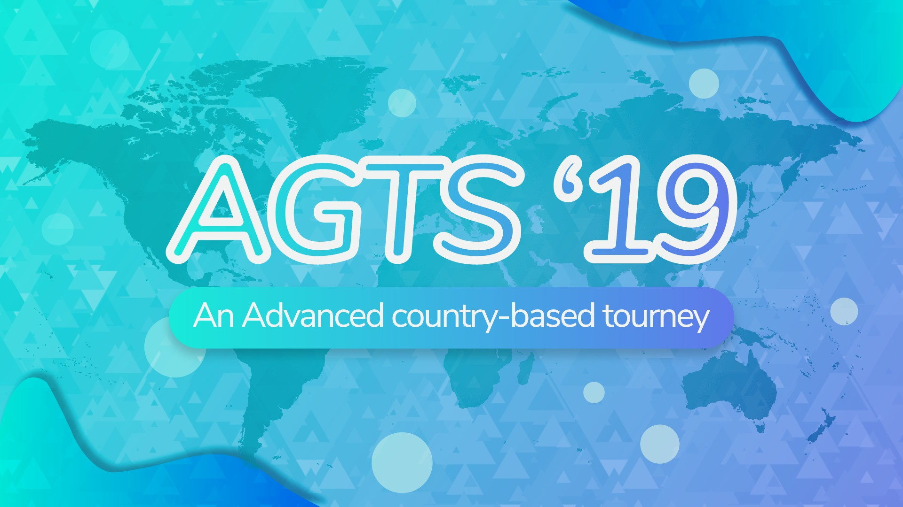

---
tags:
  - AGTS 2019
  - AGTS
  - GTS
---

# Advanced Global Taiko Showdown 2019

**Advanced Global Taiko Showdown 2019** (***AGTS 2019***) był bazowanym na krajach turniejem osu!taiko podwójnej eliminacji prowadzonym przez ::{ flag=FR }:: [Kasumii-sama](https://osu.ppy.sh/users/6177263) i ::{ flag=FR }:: [TLQ\_Yoshii](https://osu.ppy.sh/users/7157133). Była to trzecia edycja Advanced Global Taiko Showdown oraz część serii Global Taiko Showdown.

## Harmonogram turnieju

| Wydarzenie | Data |
| --: | :-- |
| Faza rejestracji | 07.07.2019 - 21.07.2019 |
| Losowanie grup na żywo | 04.08.2019 (15:00 UTC) |
| Kwalifikacje | 10.08.2019 - 11.08.2019 |
| Faza grupowa | 17.08.2019 - 18.08.2019 |
| Ćwierćfinały | 24.08.2019 - 25.08.2019 |
| Półfinały | 31.08.2019 - 01.09.2019 |
| Finały | 07.09.2019 - 08.09.2019 |
| Wielki finał | 14.09.2019 |

## Nagrody

| Miejsce | Nagroda(y) |
| :-: | :-- |
|  | Unikalna odznaka profilowa, ekskluzywny baner drużynowy |
|  | Ekskluzywny baner drużynowy |
|  | Ekskluzywny baner drużynowy |

## Organizacja

Advanced Global Taiko Showdown 2019 był prowadzony przez różnych członków społeczności.

| Stanowisko | Użytkownicy |
| :-- | :-- |
| Organizatorzy | ::{ flag=FR }:: [Kasumii-sama](https://osu.ppy.sh/users/6177263), ::{ flag=FR }:: [TLQ\_Yoshii](https://osu.ppy.sh/users/7157133) |
| Mappoolerzy | ::{ flag=DE }:: [Nepuri](https://osu.ppy.sh/users/6637817), ::{ flag=US }:: [Nifty](https://osu.ppy.sh/users/4956097) |
| Sędziowie | ::{ flag=BR }:: [AnonX32](https://osu.ppy.sh/users/2730270), ::{ flag=US }:: [cheese salad](https://osu.ppy.sh/users/6349821), ::{ flag=US }:: [Edgar\_Figaro](https://osu.ppy.sh/users/6508754), ::{ flag=DE }:: [GDLenny](https://osu.ppy.sh/users/8406711), ::{ flag=DE }:: [Heam](https://osu.ppy.sh/users/4705120), ::{ flag=FR }:: [Ladybug](https://osu.ppy.sh/users/4833654), ::{ flag=FR }:: [Ladylag](https://osu.ppy.sh/users/2812098), ::{ flag=FR }:: [Mirthille](https://osu.ppy.sh/users/7548517), ::{ flag=DK }:: [Plaiceholder](https://osu.ppy.sh/users/11910867), ::{ flag=TH }:: [Seaweed](https://osu.ppy.sh/users/5151214), ::{ flag=AU }:: [soliderror](https://osu.ppy.sh/users/10630542), ::{ flag=MY }:: [Stupid Idiot](https://osu.ppy.sh/users/8355574), ::{ flag=FR }:: [TLQ\_Yoshii](https://osu.ppy.sh/users/7157133), ::{ flag=SG }:: [uchuuj1n](https://osu.ppy.sh/users/9140302) |
| Streamerzy | ::{ flag=BR }:: [AnonX32](https://osu.ppy.sh/users/2730270), ::{ flag=JP }:: [Briesmas](https://osu.ppy.sh/users/2865172), ::{ flag=US }:: [cheese salad](https://osu.ppy.sh/users/6349821), ::{ flag=PL }:: [Deroo](https://osu.ppy.sh/users/8360475), ::{ flag=US }:: [ITotallyGetThat](https://osu.ppy.sh/users/8770622), ::{ flag=FR }:: [Kaeldori](https://osu.ppy.sh/users/962519), ::{ flag=NL }:: [Krekker](https://osu.ppy.sh/users/8265940), ::{ flag=FR }:: [Mirthille](https://osu.ppy.sh/users/7548517) |
| Komentatorzy | ::{ flag=BR }:: [AnonX32](https://osu.ppy.sh/users/2730270), ::{ flag=AU }:: [Beat43210](https://osu.ppy.sh/users/5664171), ::{ flag=US }:: [CaptainEChan](https://osu.ppy.sh/users/9536977), ::{ flag=FR }:: [Chernobog](https://osu.ppy.sh/users/3317042), ::{ flag=PL }:: [Deroo](https://osu.ppy.sh/users/8360475), ::{ flag=US }:: [Edgar\_Figaro](https://osu.ppy.sh/users/6508754), ::{ flag=EC }:: [Gamelan4](https://osu.ppy.sh/users/9856910), ::{ flag=DE }:: [Heam](https://osu.ppy.sh/users/4705120), ::{ flag=US }:: [kb131313](https://osu.ppy.sh/users/11229259), ::{ flag=US }:: [Tsred](https://osu.ppy.sh/users/2737667), ::{ flag=SG }:: [uchuuj1n](https://osu.ppy.sh/users/9140302) |
| Projektant | ::{ flag=ID }:: [fajar13k](https://osu.ppy.sh/users/7100002) |
| Statystycy | ::{ flag=DE }:: [IceDynamix](https://osu.ppy.sh/users/8599070), ::{ flag=FR }:: [Kasumii-sama](https://osu.ppy.sh/users/6177263), ::{ flag=CA }:: [Leadenginger](https://osu.ppy.sh/users/3799991), ::{ flag=MY }:: [Minisora](https://osu.ppy.sh/users/9627666) |
| Tłumacze | ::{ flag=BR }:: [AnonX32](https://osu.ppy.sh/users/2730270), ::{ flag=KR }:: [BamgoeSN](https://osu.ppy.sh/users/1152851), ::{ flag=DE }:: [Capu](https://osu.ppy.sh/users/2474015), ::{ flag=HK }:: [Cynplytholowazy](https://osu.ppy.sh/users/3901754), ::{ flag=PL }:: [Deroo](https://osu.ppy.sh/users/8360475), ::{ flag=EC }:: [Gamelan4](https://osu.ppy.sh/users/9856910), ::{ flag=TW }:: [InfinityAstral](https://osu.ppy.sh/users/9913256), ::{ flag=US }:: [jyake](https://osu.ppy.sh/users/9099822), ::{ flag=FR }:: [Kasumii-sama](https://osu.ppy.sh/users/6177263), ::{ flag=FR }:: [TLQ\_Yoshii](https://osu.ppy.sh/users/7157133) |
| Programiści | ::{ flag=DE }:: [hallowatcher](https://osu.ppy.sh/users/1874761), ::{ flag=FR }:: [ThePooN](https://osu.ppy.sh/users/718454) |
| Edytor osu! wiki | ::{ flag=ID }:: [fajar13k](https://osu.ppy.sh/users/7100002) |

## Linki

- [Wątek dyskusyjny](https://osu.ppy.sh/community/forums/topics/931003)
- [Serwer Discord GTS](https://discord.gg/3mGC3HB)
- [Transmisja na żywo](https://www.twitch.tv/gtsosu)
- [Drabinka Challonge](https://challonge.com/AGTS2019)
- **[Arkusz statystyk](https://docs.google.com/spreadsheets/d/14iravIyZ5o4WIFIx5MyGT_hg59OZKmTp34mQ5txpy7g/edit)**

## Uczestnicy

|  | Kraj | Członkowie |
| :-: | :-: | :-- |
| ::{ flag=AR }:: | **Argentyna** | **[Pollotuc](https://osu.ppy.sh/users/42440)**, [juanilp4evr](https://osu.ppy.sh/users/6413125), [Atreevete](https://osu.ppy.sh/users/2615199), [warning dark](https://osu.ppy.sh/users/5040981) |
| ::{ flag=AU }:: | **Australia** | **[Beat43210](https://osu.ppy.sh/users/5664171)**, [Tsubasa2](https://osu.ppy.sh/users/6835183), [richy2001](https://osu.ppy.sh/users/11499467), [AmateurMonkeyYT](https://osu.ppy.sh/users/8379046) |
| ::{ flag=AT }:: | **Austria** | **[animexamera](https://osu.ppy.sh/users/7511357)**, [morth1](https://osu.ppy.sh/users/7246874), [Der Katze](https://osu.ppy.sh/users/7645997), [kBocaj](https://osu.ppy.sh/users/11453341), [Amane](https://osu.ppy.sh/users/6821436) |
| ::{ flag=BR }:: | **Brazylia** | **[Lazarento](https://osu.ppy.sh/users/3224958)**, [Uzi I](https://osu.ppy.sh/users/6042123), [AiAyako](https://osu.ppy.sh/users/7003491), [Lolligerjoj](https://osu.ppy.sh/users/9053338), [mihinho](https://osu.ppy.sh/users/6509269) |
| ::{ flag=CL }:: | **Chile** | **[Catulus](https://osu.ppy.sh/users/6276709)**, [Adimoc](https://osu.ppy.sh/users/6757492), [-NaNdo-](https://osu.ppy.sh/users/1934382) |
| ::{ flag=CN }:: | **Chiny** | **[\[sACRIFICe\]](https://osu.ppy.sh/users/6294200)**, [super mario fan](https://osu.ppy.sh/users/8263525), [Flandre sca](https://osu.ppy.sh/users/10324309), [-OvO-](https://osu.ppy.sh/users/12208924), [Nisoquo](https://osu.ppy.sh/users/12345370) |
| ::{ flag=EC }:: | **Ekwador** | **[Gamelan4](https://osu.ppy.sh/users/9856910)**, [Arkano036](https://osu.ppy.sh/users/5899577), [Etsu](https://osu.ppy.sh/users/3442319) |
| ::{ flag=PH }:: | **Filipiny** | **[yuki\_momoiro722](https://osu.ppy.sh/users/7186791)**, [Niro-](https://osu.ppy.sh/users/6443899), [A i r](https://osu.ppy.sh/users/10363380), [Yron8](https://osu.ppy.sh/users/1537747) |
| ::{ flag=FR }:: | **Francja** | **[maximaxiU](https://osu.ppy.sh/users/4069690)**, [Chernobog](https://osu.ppy.sh/users/3317042), [Gintoki8](https://osu.ppy.sh/users/2239411), [ALISTAR033009](https://osu.ppy.sh/users/9819975), [ZeddaStake](https://osu.ppy.sh/users/8801844) |
| ::{ flag=ES }:: | **Hiszpania** | **[naliem](https://osu.ppy.sh/users/3252709)**, [RuinedChicken](https://osu.ppy.sh/users/7983713), [Machango](https://osu.ppy.sh/users/7180552), [Nara\_NB](https://osu.ppy.sh/users/3593992) |
| ::{ flag=NL }:: | **Holandia** | **[Krekker](https://osu.ppy.sh/users/8265940)**, [Hypello](https://osu.ppy.sh/users/1594036), [jesse-98](https://osu.ppy.sh/users/502722), [StrijkIjzer](https://osu.ppy.sh/users/4130926) |
| ::{ flag=HK }:: | **Hongkong** | **[Brown918](https://osu.ppy.sh/users/9805760)**, [Cynplytholowazy](https://osu.ppy.sh/users/3901754), [\[\_isolated\_\]](https://osu.ppy.sh/users/6187838) |
| ::{ flag=ID }:: | **Indonezja A** | **[Mikurio](https://osu.ppy.sh/users/10734140)**, [misaki_tk](https://osu.ppy.sh/users/3866964), [steven1](https://osu.ppy.sh/users/3090416), [Volta](https://osu.ppy.sh/users/4154071) |
| ::{ flag=ID }:: | **Indonezja B** | **[Viewland](https://osu.ppy.sh/users/6250135)**, [Shirai-](https://osu.ppy.sh/users/4221845), [Alwaysyukaz](https://osu.ppy.sh/users/4999506), [ImChro](https://osu.ppy.sh/users/7280717), [Ahmad Haris](https://osu.ppy.sh/users/6048245) |
| ::{ flag=JP }:: | **Japonia** | **[Briesmas](https://osu.ppy.sh/users/2865172)**, [autumndayo](https://osu.ppy.sh/users/12268857), [TEL09016579767](https://osu.ppy.sh/users/3925121), [shinnme_ao](https://osu.ppy.sh/users/6252972), [Ku_Ren](https://osu.ppy.sh/users/2535243) |
| ::{ flag=CA }:: | **Kanada** | **[beary605](https://osu.ppy.sh/users/2198070)**, [iceandele](https://osu.ppy.sh/users/1740540), [Player-](https://osu.ppy.sh/users/3724819), [rubies87](https://osu.ppy.sh/users/4949934), [DuckyDoom](https://osu.ppy.sh/users/3153062) |
| ::{ flag=KR }:: | **Korea Południowa** | **[POCARI-SWEAT](https://osu.ppy.sh/users/5082685)**, [bbj0920](https://osu.ppy.sh/users/87546), [yuhuna_kor](https://osu.ppy.sh/users/13046017), [\[Akita-Neru\]](https://osu.ppy.sh/users/613944), [TRAtOrTs](https://osu.ppy.sh/users/12481695) |
| ::{ flag=MY }:: | **Malezja** | **[Bedwyr Aorta](https://osu.ppy.sh/users/10875855)**, [Megumin-Sama](https://osu.ppy.sh/users/6201335), [Minisora](https://osu.ppy.sh/users/9627666), [imnoobatosuosu](https://osu.ppy.sh/users/12086753) |
| ::{ flag=MX }:: | **Meksyk** | **[Iojioji](https://osu.ppy.sh/users/1346121)**, [ZaveryK](https://osu.ppy.sh/users/10913397), [L\_CORTES\_01](https://osu.ppy.sh/users/12548363) |
| ::{ flag=DE }:: | **Niemcy A** | **[Capu](https://osu.ppy.sh/users/2474015)**, [\[TaikoTori\]](https://osu.ppy.sh/users/1074143), [QEpicAce](https://osu.ppy.sh/users/9489153), [Siegmund99](https://osu.ppy.sh/users/5168596), [xBourbon\_Kid](https://osu.ppy.sh/users/645775) |
| ::{ flag=DE }:: | **Niemcy B** | **[Aninoss](https://osu.ppy.sh/users/7364706)**, [Sayira](https://osu.ppy.sh/users/7253958), [JanteSmith](https://osu.ppy.sh/users/371772), [Naugustogi](https://osu.ppy.sh/users/6803970) |
| ::{ flag=PL }:: | **Polska** | **[Agresywny Arbuz](https://osu.ppy.sh/users/7056658)**, [Tetsurio](https://osu.ppy.sh/users/2044810), [-Jamu-](https://osu.ppy.sh/users/2271556), [Wolfgang](https://osu.ppy.sh/users/7184324), [fafik99](https://osu.ppy.sh/users/1787011) |
| ::{ flag=RU }:: | **Rosja A** | **[Nozdormu](https://osu.ppy.sh/users/7169208)**, [Akonine](https://osu.ppy.sh/users/7774222), [pavlukivan](https://osu.ppy.sh/users/8321579), [CrowWhite](https://osu.ppy.sh/users/8638977), [TwinT](https://osu.ppy.sh/users/9976154) |
| ::{ flag=RU }:: | **Rosja B** | **[-Rmdy](https://osu.ppy.sh/users/1933816)**, [JW-Dash](https://osu.ppy.sh/users/5285786), [oserry](https://osu.ppy.sh/users/11973082), [Starger](https://osu.ppy.sh/users/3398715), [Crysally](https://osu.ppy.sh/users/7792131) |
| ::{ flag=DK }:: ::{ flag=NO }:: ::{ flag=SE }:: | **Scandinavia** | **[Hana Hayashi](https://osu.ppy.sh/users/4601806)**, [1794766](https://osu.ppy.sh/users/1794766), [Mills](https://osu.ppy.sh/users/7234023), [KatLeNeko](https://osu.ppy.sh/users/10183710), [mammasutter](https://osu.ppy.sh/users/11830625) |
| ::{ flag=US }:: | **Stany Zjednoczone A** | **[Backfire](https://osu.ppy.sh/users/263110)**, [ChurroChef](https://osu.ppy.sh/users/9258564), [CaptainEChan](https://osu.ppy.sh/users/9536977), [dragonworm](https://osu.ppy.sh/users/11464752) |
| ::{ flag=US }:: | **Stany Zjednoczone B** | **[driodx](https://osu.ppy.sh/users/9709548)**, [Shindamama](https://osu.ppy.sh/users/12780046), [R J](https://osu.ppy.sh/users/6490509), [DiggyDogg](https://osu.ppy.sh/users/5014664) |
| ::{ flag=TW }:: | **Tajwan** | **[- DeveRUX -](https://osu.ppy.sh/users/2900875)**, [Hatsuse](https://osu.ppy.sh/users/697007), [nw9v4g46](https://osu.ppy.sh/users/2169329), [david649713](https://osu.ppy.sh/users/1390823) |
| ::{ flag=VE }:: | **Wenezuela** | **[Nutellitah](https://osu.ppy.sh/users/10613075)**, [JessiChan](https://osu.ppy.sh/users/1368025) |
| ::{ flag=GB }:: ::{ flag=PT }:: | **Wielka Brytania/Portugalia** | **[Metzo](https://osu.ppy.sh/users/10633982)**, [w1ll](https://osu.ppy.sh/users/11406987), [Ali161102](https://osu.ppy.sh/users/7582420), [Yumi\_Hideaki](https://osu.ppy.sh/users/10081162) |

## Grupy

| Grupa | Koszyk 1 | Koszyk 2 | Koszyk 3 | Koszyk 4 |
| :-: | :-- | :-- | :-- | :-- |
| **A** | ::{ flag=PL }:: Polska | ::{ flag=RU }:: Rosja B | ::{ flag=PH }:: Filipiny | ::{ flag=MY }:: Malezja |
| **B** | ::{ flag=JP }:: Japonia | ::{ flag=AR }:: Argentyna | ::{ flag=HK }:: Hongkong | ::{ flag=CL }:: Chile |
| **C** | ::{ flag=NL }:: Holandia | ::{ flag=FR }:: Francja | ::{ flag=MX }:: Meksyk | ::{ flag=TW }:: Tajwan |
| **D** | ::{ flag=US }:: Stany Zjednoczone A | ::{ flag=RU }:: Rosja A | ::{ flag=US }:: Stany Zjednoczone B | ::{ flag=BR }:: Brazylia |
| **E** | ::{ flag=KR }:: Korea Południowa | ::{ flag=DE }:: Niemcy A | ::{ flag=DK }:: ::{ flag=NO }:: ::{ flag=SE }:: Scandinavia | ::{ flag=VE }:: Wenezuela |
| **F** | ::{ flag=CA }:: Kanada | ::{ flag=GB }:: ::{ flag=PT }:: Wielka Brytania/Portugalia | ::{ flag=ID }:: Indonezja A | ::{ flag=ID }:: Indonezja B |

## Podium

Turniej dobiegł końca. Oto końcowe podium:

| Miejsce | Kraj |
| :-: | :-- |
|  | ::{ flag=JP }:: Japonia |
|  | ::{ flag=CA }:: Kanada |
|  | ::{ flag=RU }:: Rosja A |

## Mappoole

### Wielki finał

**[Tutaj pobierzesz paczkę map! (86 MB)](https://mega.nz/#!s5sQzABI!BZ2WNuZ13rXisVdUgv2-gdku-4YxAR5IvkRfHqpRrOE)**

- NoMod
  1. [sakuraburst - dragonlands (Faputa) \[Ura Oni\]](https://osu.ppy.sh/beatmapsets/935765#taiko/1954961)
  2. [Kobaryo - northern_limit [feat. Sennzai] (Nepuri) \[ura_oni\]](https://osu.ppy.sh/beatmapsets/869714#taiko/1818337)
  3. [Ester - Dizzolve (\_DUSK\_) \[goheegy's Inner Oni\]](https://osu.ppy.sh/beatmapsets/817528#taiko/1714380)
  4. [t+pazolite - Antigravity (eiri-) \[Inner Oni\]](https://osu.ppy.sh/beatmapsets/1032630#taiko/2159095)
  5. [Team:SASAKURATION - AVALON (Leader) \[Firce777's Ura Oni\]](https://osu.ppy.sh/beatmapsets/118763#taiko/406755)
  6. [LIQU@. - Yotogibanashi no Kamikakushi (Kyubey) \[Nwolf's Inner Oni\]](https://osu.ppy.sh/beatmapsets/236396#taiko/661517)
- EX
  1. [Hatsune Miku - boku-boku (Lan wings) \[Ishida's Hell Taiko\]](https://osu.ppy.sh/beatmapsets/51611#taiko/176945)
- Hidden
  1. [Camellia - Primitive Pump (frz) \[Inner PUMP\]](https://osu.ppy.sh/beatmapsets/712424#taiko/1505977)
  2. [goreshit - Bad Habits (SKSalt) \[Inner Oni\]](https://osu.ppy.sh/beatmapsets/450569#taiko/966645)
- HardRock
  1. [Eagle - Hypersonik (Michiru) \[23-'s Inner Oni\]](https://osu.ppy.sh/beatmapsets/985854#taiko/2064162)
  2. [Camellia - Chirality (\_DUSK\_) \[Inner Oni\]](https://osu.ppy.sh/beatmapsets/831411#taiko/1741806)
- DoubleTime
  1. [Pocket Mirror Sound Team - Midnight Striken Clock \~ Glass Slipper (Rhytoly) \[Oni\]](https://osu.ppy.sh/beatmapsets/925760#taiko/1933722)
  2. [JENNY ROM - WWW.BLONDE GIRL (MOMO MIX) (\[Belajar-Osu\]) \[Kqrth's Inner Oni\]](https://osu.ppy.sh/beatmapsets/920644#taiko/1933326)
- FreeMod
  1. [P\*Light - NINJA IS DEAD IIDX ver. (Tofu1222) \[Skylish's Corpse Inner Oni\]](https://osu.ppy.sh/beatmapsets/590032#taiko/1628026)
  2. [ginkiha - eastward (yuzu\_\_rinrin) \[Inner Oni\]](https://osu.ppy.sh/beatmapsets/630364#taiko/1332295)
  3. [Shiron + Kofu x Morimori Atsushi to Teikyo de okuri shimasu - Demise Quartet (ll-oscar) \[ll-taiko\]](https://osu.ppy.sh/beatmapsets/614179#taiko/1295723)
- Tiebreaker
  1. **[Venetian Snares - My Love Is A Bulldozer (Nifty) \[Destructive Lust\]](https://osu.ppy.sh/beatmapsets/773337#taiko/1625609)**

### Finały

**[Tutaj pobierzesz paczkę map! (102 MB)](https://mega.nz/#!VslyCQQC!OjkCUb9D1DUMskdeyY8OMGefSheh7Ol2hTaGkOJLSkQ)**

- NoMod
  1. [YUC'e - PUMP (KinomiCandy) \[Kinobles & Ozzy's Oni\]](https://osu.ppy.sh/beatmapsets/610546#taiko/1289147)
  2. [Igorrr - Unpleasant Sonata (Sieg) \[Loctav's Oni\]](https://osu.ppy.sh/beatmapsets/90385#taiko/262458)
  3. [Demetori - Kaze no Jukan \~ Wind Tour (GoldenWolf) \[Inner Oni\]](https://osu.ppy.sh/beatmapsets/736876#taiko/1555072)
  4. [S.S.H. - Intersect Thunderbolt-Remix (7odoa) \[Taiko Inner Oni\]](https://osu.ppy.sh/beatmapsets/38316#taiko/170038)
  5. [Uinyasu.Otthokobunny - Aa Kenran no Yume ga Gotoku(Epsilon Remix) (asuasu\_yura) \[Oni\]](https://osu.ppy.sh/beatmapsets/734435#taiko/1549623)
  6. [UNDEAD CORPORATION - Seven Colors (Nwolf) \[Prismatic Oni\]](https://osu.ppy.sh/beatmapsets/288138#taiko/649918)
- EX
  1. [sakuraburst - SELF DESTRUCT (\_DUSK\_) \[METASTABLE ONI\]](https://osu.ppy.sh/beatmapsets/963193#taiko/2016673)
- Hidden
  1. [Nanahira - Monosugoi Dekotora de Patchouli ga Monosugoi Uta (Greenshell) \[Lolishell\]](https://osu.ppy.sh/beatmapsets/620238#taiko/1307203)
  2. [EBIMAYO - GOODRAGE (asuasu\_yura) \[Oni\]](https://osu.ppy.sh/beatmapsets/679340#taiko/1436347)
- HardRock
  1. [Xandria - Nightfall (frukoyurdakul) \[Inner Oni\]](https://osu.ppy.sh/beatmapsets/697750#taiko/1477955)
  2. [t+pazolite - CENSORED!! (KitajimaYN) \[Inner Oni\]](https://osu.ppy.sh/beatmapsets/476520#taiko/1017812)
- DoubleTime
  1. [Doma Umaru (CV. Tanaka Aimi) - Nimensei\*Uraomote Life! (Tyistiana) \[Inner Oni\]](https://osu.ppy.sh/beatmapsets/707590#taiko/1502284)
  2. [Petit Rabbit's with beans - Sekai ga Cafe ni Nacchatta! (Tyistiana) \[Nardo's Inner Oni\]](https://osu.ppy.sh/beatmapsets/864036#taiko/2021055)
- FreeMod
  1. [Kobaryo - Night Of Core (Rhytoly) \[Inner Oni\]](https://osu.ppy.sh/beatmapsets/807072#taiko/1693948)
  2. [xi - Longinus (Faputa) \[Inner Oni\]](https://osu.ppy.sh/beatmapsets/963975#taiko/2018175)
  3. [IOSYS - Border of extacy (Karaoke Ver) (eiri-) \[komasy's Inner Oni\]](https://osu.ppy.sh/beatmapsets/819351#taiko/1717859)
- Tiebreaker
  1. **[Meshuggah - Bleed (frukoyurdakul) \[Drain\]](https://osu.ppy.sh/beatmapsets/638550#taiko/1354578)**

### Półfinały

**[Tutaj pobierzesz paczkę map! (77 MB)](https://mega.nz/#!xoE0iIbD!lJcoplSa3ELqMyn3vgNRHelF8xP93he6DpzoBcQ4qEs)**

- NoMod
  1. [Murder King - Ben Her Gun Artik Sen (frukoyurdakul) \[Suistimal\]](https://osu.ppy.sh/beatmapsets/959186#taiko/2008180)
  2. [kyou1110 vs. Takuya Namba - "Alice in Wonderland" : crazy apple could not live in real life (-Kazu-) \[Inner Oni\]](https://osu.ppy.sh/beatmapsets/742005#taiko/2003199)
  3. [aran - Xperanza (Ulqui) \[Inner Oni\]](https://osu.ppy.sh/beatmapsets/800399#taiko/1680344)
  4. [Sota Fujimori - polygon (Fallmorph) \[salchow's complex hi-speed inner oni\]](https://osu.ppy.sh/beatmapsets/721297#taiko/1588162)
  5. [moro - Ice Cheinsaw (m1kado) \[Oni\]](https://osu.ppy.sh/beatmapsets/547084#taiko/1279898)
  6. [BilliumMoto - life flashes before weeb eyes (Faputa) \[Outer Oni\]](https://osu.ppy.sh/beatmapsets/975435#taiko/2043119)
- EX
  1. [Floxytek vs Billx - 30's Swing Tek (DarkTigrus) \[Taiko Guru\]](https://osu.ppy.sh/beatmapsets/45107#taiko/169245)
- Hidden
  1. [E.G.G. - OK I'm blue rat (Kqrth) \[Oni\]](https://osu.ppy.sh/beatmapsets/994780#taiko/2080103)
  2. [Rainbowdragoneyes - Creatures ov Deception (Mew104) \[Chromoxx' Inner Oni\]](https://osu.ppy.sh/beatmapsets/413267#taiko/935079)
- HardRock
  1. [Jerico - Beyond Space Forcibly (tasuke912) \[Oni\]](https://osu.ppy.sh/beatmapsets/340890#taiko/753944)
  2. [Itou Kanako - Uncontrollable (Charlotte) \[Uncontrollable Oni\]](https://osu.ppy.sh/beatmapsets/640326#taiko/1358048)
- DoubleTime
  1. [PSYQUI - Update (Genjuro) \[Oni\]](https://osu.ppy.sh/beatmapsets/986373#taiko/2102164)
  2. [Neuromonakh Feofan - Vezde plyashu (Nepuri) \[Bezumnyy\]](https://osu.ppy.sh/beatmapsets/694154#taiko/1468657)
- FreeMod
  1. [OISHII - COCOA WATERSLIDE (-OvO-) \[Inner Oni\]](https://osu.ppy.sh/beatmapsets/912064#taiko/1905708)
  2. [Seiryu - Critical Crystal (Sayaka-) \[Inner Oni\]](https://osu.ppy.sh/beatmapsets/138311#taiko/345483)
  3. [ITO KASHITARO - Yuudachi no Ribbon (Skull Kid) \[Ribbon\]](https://osu.ppy.sh/beatmapsets/577827#taiko/1223186)
- Tiebreaker
  1. **[Loctek - Summer CarnivaL (Metzo) \[CarnivaL Oni\]](https://osu.ppy.sh/beatmapsets/942014#taiko/1967051)**

### Ćwierćfinały

**[Tutaj pobierzesz paczkę map! (83 MB)](https://mega.nz/#!spkR0agQ!MokudfOpqItg9GU4KnYaD-jRjMLVYctMnBeRmWDtGDA)**

- NoMod
  1. [Function Phantom - Euclid (salchow) \[Green's Fifth Axiom\]](https://osu.ppy.sh/beatmapsets/941145#taiko/2002626)
  2. [S.S.H. - BassTest (Ak1o) \[TEST\]](https://osu.ppy.sh/beatmapsets/666764#taiko/1411059)
  3. [Chroma - I (rubies87) \[Oni\]](https://osu.ppy.sh/beatmapsets/883570#taiko/1933318)
  4. [Camellia - \*Feels Seasickness...\* (Genjuro) \[Inner Oni\]](https://osu.ppy.sh/beatmapsets/1014457#taiko/2126517)
  5. [Sadkey - Further (Airuei Redo) (Nifty) \[Discovery\]](https://osu.ppy.sh/beatmapsets/741764#taiko/1564820)
- EX
  1. [Masa - Kitsune no Yomeiri (asuasu_yura) \[Inner Oni\]](https://osu.ppy.sh/beatmapsets/335722#taiko/743086)
- Hidden
  1. [Yurry Canon - Suicide Parade (Yales) \[Inner Oni\]](https://osu.ppy.sh/beatmapsets/902163#taiko/1883597)
  2. [Camellia feat. Nana Takahashi - Mushi no Sumu Tokoro (Shiirn) \[Nwolf's Oni\]](https://osu.ppy.sh/beatmapsets/436978#taiko/978374)
- HardRock
  1. [Kiryu - Euphoric Phantasmagoria [komasy] \[Phantasm\]](https://osu.ppy.sh/beatmapsets/654413#taiko/1387168)
  2. [Zekk - Libertas (\_DUSK\_) \[Inner Oni\]](https://osu.ppy.sh/beatmapsets/1001338#taiko/2096131)
- DoubleTime
  1. [HyuN feat. JeeE - Fallen Angel (Mao) \[oko's Oni\]](https://osu.ppy.sh/beatmapsets/891335#taiko/1863216)
  2. [Ni-Sokkususu - Shukusai no Elementalia (Rhytoly) \[Oni\]](https://osu.ppy.sh/beatmapsets/927110#taiko/1945290)
- FreeMod
  1. [ParagonX9 - Defection (Ak1o) \[Inner Oni\]](https://osu.ppy.sh/beatmapsets/582351#taiko/1232379)
  2. [Camellia feat. Nanahira - Bassdrop freaks (MMzz) \[Inner Oni\]](https://osu.ppy.sh/beatmapsets/299747#taiko/672384)
  3. [P\*Light feat.Nanahira - Rainbow (P\*Light Remix) (Y O U T A) \[On the Sky\]](https://osu.ppy.sh/beatmapsets/536720#taiko/1137587)
- Tiebreaker
  1. **[Various Artists - International OTOMAD's 6 (Midnaait) \[Inner Oni\]](https://osu.ppy.sh/beatmapsets/424276#taiko/916603)**

### Faza grupowa

**[Tutaj pobierzesz paczkę map! (96 MB)](https://mega.nz/#!Iw9DFapR!yT-FtB8nk1fXieIln5gP_2tbUOWuxFQKAnj40NVpZHE)**

- NoMod
  1. [Kurubukko vs yukitani - Minamichita EVOLVED (Cherry Blossom) \[Ex's Taiko Oni\]](https://osu.ppy.sh/beatmapsets/136632#taiko/342847)
  2. [t+pazolite - Candy Crack Curtain Call (tasuke912) \[Oni\]](https://osu.ppy.sh/beatmapsets/237272#taiko/928806)
  3. [UNDEAD CORPORATION - Yoru Naku Usagi wa Yume o Miru (Smoothie) \[Midnaait's Oni\]](https://osu.ppy.sh/beatmapsets/58951#taiko/388464)
  4. [Thaehan - Leprechaun (Okoratu) \[Inner Oni\]](https://osu.ppy.sh/beatmapsets/877496#taiko/1834679)
  5. [Lite Show Magic (t+pazolite vs C-Show) - Crack Traxxxx (Fatfan Kolek) \[TK'S Oni\]](https://osu.ppy.sh/beatmapsets/139525#taiko/361159)
  6. [Minami Yuni - Kanagawa Cyber Culvert (ekumea1123) \[Inner Oni\]](https://osu.ppy.sh/beatmapsets/898783#taiko/1877557)
- EX
  1. [Frums - Pictured as Perfect (\_yu68) \[Inner Oni\]](https://osu.ppy.sh/beatmapsets/966235#taiko/2052081)
- Hidden
  1. [Zekk - Palpitation (yuzu\_\_rinrin) \[Pe'z Inner Oni\]](https://osu.ppy.sh/beatmapsets/761071#taiko/1608677)
  2. [The Flashbulb - Six Acid Strings (Nardoxyribonucleic) \[Volta's Oni\]](https://osu.ppy.sh/beatmapsets/966451#taiko/2078180)
  3. [Vickeblanka - Black Rover (TV Size) (Yales) \[Inner Oni\]](https://osu.ppy.sh/beatmapsets/793763#taiko/1666968)
- HardRock
  1. [Rin - Kishinjou set 04 ~ Dullahan Under the Willows (tasuke912) \[Lunatic\]](https://osu.ppy.sh/beatmapsets/977058#taiko/2044998)
  2. [ZUN - Septette for the Dead Princess (Pereira006) \[Dunskin's Inner Oni\]](https://osu.ppy.sh/beatmapsets/348342#taiko/772246)
  3. [Caravan Palace - Dragons (Charles445) \[MM's Taiko\]](https://osu.ppy.sh/beatmapsets/46733#taiko/145511)
- DoubleTime
  1. [Silent Siren - stella\* (captin1) \[Climbb & KPY's Taiko Oni\]](https://osu.ppy.sh/beatmapsets/163253#taiko/421153)
  2. [Aihara Kaori - Total Eclipse 2035 \~Shoujo no Jikuu Kaiki Nisshoku\~ (Senritsu) \[Oni\]](https://osu.ppy.sh/beatmapsets/114368#taiko/296195)
  3. [Hommarju - Crazy Jackpot (Tofu1222) \[aabc's Oni\]](https://osu.ppy.sh/beatmapsets/717853#taiko/1517306)
- FreeMod
  1. [Naoki Miki (CV: Takahashi Rie) & Ebisuzawa Kurumi (CV: Ozawa Ari) - Unhappy End World (Tyistiana) \[Blacken's Inner Oni\]](https://osu.ppy.sh/beatmapsets/818296#taiko/1753169)
  2. [DJ Sharpnel - Exciting Hyper Highspeed Star (Lunaii) \[Inner Oni\]](https://osu.ppy.sh/beatmapsets/920447#taiko/1922244)
  3. [OISHII - UP UP MT. CAKE (Nifty) \[Inner Oni\]](https://osu.ppy.sh/beatmapsets/664795#taiko/1406933)
- Tiebreaker
  1. **[kamome sano - future gazer (kmsn\_UKHC\_remix) (taiko\_maniac1811) \[Inner Oni\]](https://osu.ppy.sh/beatmapsets/372637#taiko/816175)**

### Kwalifikacje

**[Tutaj pobierzesz paczkę map! (20 MB)](https://mega.nz/#!4tsAEabY!800Cnbm5zlWGqErHTN9NvRZ8ieeBAqjrQxKWyvoCS9Q)**

- NoMod
  1. [kors k - Poochie (Nifty) \[Special\]](https://osu.ppy.sh/beatmapsets/946420#taiko/1976130)
  2. [Tati Zaqui - Placa no Chao (Kuron-kun) \[Vem pro baile\]](https://osu.ppy.sh/beatmapsets/737724#taiko/1556963)
- Hidden
  1. [P\*Light - Gale Rider (Charlotte) \[komasy's Oni\]](https://osu.ppy.sh/beatmapsets/622356#taiko/1313624)
- HardRock
  1. [sasakure.UK (feat.Hatsune Miku) - SeventH-HeaveN (\[I\]MMoRTal\[S\]) \[Inner Oni\]](https://osu.ppy.sh/beatmapsets/177182#taiko/426542)
- DoubleTime
  1. [FLOW - Steppin' out (eiri-) \[Oni\]](https://osu.ppy.sh/beatmapsets/933667#taiko/1949159)

## Wyniki meczów

### Wielki finał

Sobota, 14 września 2019 roku:

| Drużyna 1 |  |  | Drużyna 2 | Link do meczu |
| --: | :-: | :-: | :-- | :-- |
| **Japonia** ::{ flag=JP }:: | **7** | 1 | ::{ flag=CA }:: Kanada | [#1](https://osu.ppy.sh/community/matches/54839968) |

### Finały

Sobota, 7 września 2019 roku:

| Drużyna 1 |  |  | Drużyna 2 | Link do meczu |
| --: | :-: | :-: | :-- | :-- |
| **Japonia** ::{ flag=JP }:: | **7** | 1 | ::{ flag=RU }:: Rosja A | [#1](https://osu.ppy.sh/community/matches/54674122) |

Niedziela, 8 września 2019 roku:

| Drużyna 1 |  |  | Drużyna 2 | Link do meczu |
| --: | :-: | :-: | :-- | :-- |
| Korea Południowa ::{ flag=KR }:: | 4 | **7** | ::{ flag=CA }:: **Kanada** | [#1](https://osu.ppy.sh/community/matches/54691282) |
| Rosja A ::{ flag=RU }:: | 2 | **7** | ::{ flag=CA }:: **Kanada** | [#1](https://osu.ppy.sh/community/matches/54706574) |

### Półfinały

Sobota, 31 sierpnia 2019 roku:

| Drużyna 1 |  |  | Drużyna 2 | Link do meczu |
| --: | :-: | :-: | :-- | :-- |
| Indonezja A ::{ flag=ID }:: | 4 | **7** | ::{ flag=JP }:: **Japonia** | [#1](https://osu.ppy.sh/community/matches/54504410) |
| **Rosja A** ::{ flag=RU }:: | **7** | 2 | ::{ flag=TW }:: Tajwan | [#1](https://osu.ppy.sh/community/matches/54507108) |
| Argentyna ::{ flag=AR }:: | 4 | **7** | ::{ flag=CA }:: **Kanada** | [#1](https://osu.ppy.sh/community/matches/54515229) |

Niedziela, 1 września 2019 roku:

| Drużyna 1 |  |  | Drużyna 2 | Link do meczu |
| --: | :-: | :-: | :-- | :-- |
| Tajwan ::{ flag=TW }:: | 1 | **7** | ::{ flag=CA }:: **Kanada** | [#1](https://osu.ppy.sh/community/matches/54521624) |
| Holandia ::{ flag=NL }:: | 6 | **7** | ::{ flag=KR }:: **Korea Południowa** | [#1](https://osu.ppy.sh/community/matches/54530786) |
| Indonezja A ::{ flag=ID }:: | 3 | **7** | ::{ flag=KR }:: **Korea Południowa** | [#1](https://osu.ppy.sh/community/matches/54533409) |

### Ćwierćfinały

Sobota, 24 sierpnia 2019 roku:

| Drużyna 1 |  |  | Drużyna 2 | Link do meczu |
| --: | :-: | :-: | :-- | :-- |
| Argentyna ::{ flag=AR }:: | 5 | **6** | ::{ flag=TW }:: **Tajwan** | [#1](https://osu.ppy.sh/community/matches/54305260) |
| Niemcy A ::{ flag=DE }:: | 0 | **6** | ::{ flag=ID }:: **Indonezja A** | [#1](https://osu.ppy.sh/community/matches/54317268) |
| **Japonia** ::{ flag=JP }:: | **6** | 0 | ::{ flag=BR }:: Brazylia | [#1](https://osu.ppy.sh/community/matches/54317042) |
| **Rosja A** ::{ flag=RU }:: | **6** | 2 | ::{ flag=RU }:: Rosja B | [#1](https://osu.ppy.sh/community/matches/54317274) |
| Kanada ::{ flag=CA }:: | 4 | **6** | ::{ flag=JP }:: **Japonia** | [#1](https://osu.ppy.sh/community/matches/54318662) |
| Polska ::{ flag=PL }:: | 1 | **6** | ::{ flag=ID }:: **Indonezja A** | [#1](https://osu.ppy.sh/community/matches/54320532) |
| **Kanada** ::{ flag=CA }:: | **6** | 1 | ::{ flag=RU }:: Rosja B | [#1](https://osu.ppy.sh/community/matches/54322599) |

Niedziela, 25 sierpnia 2019 roku:

| Drużyna 1 |  |  | Drużyna 2 | Link do meczu |
| --: | :-: | :-: | :-- | :-- |
| Korea Południowa ::{ flag=KR }:: | 3 | **6** | ::{ flag=TW }:: **Tajwan** | [#1](https://osu.ppy.sh/community/matches/54334906) |
| Holandia ::{ flag=NL }:: | 2 | **6** | ::{ flag=RU }:: **Rosja A** | [#1](https://osu.ppy.sh/community/matches/54346880) |
| **Korea Południowa** ::{ flag=KR }:: | **6** | 0 | ::{ flag=DE }:: Niemcy A | [#1](https://osu.ppy.sh/community/matches/54346891) |
| **Holandia** ::{ flag=NL }:: | **6** | 0 | ::{ flag=BR }:: Brazylia | [#1](https://osu.ppy.sh/community/matches/54349753) |
| Polska ::{ flag=PL }:: | 0 | **6** | ::{ flag=AR }:: **Argentyna** | [#1](https://osu.ppy.sh/community/matches/54360101) |

### Faza grupowa

Sobota, 17 sierpnia 2019 roku:

| Grupa | Drużyna 1 |  |  | Drużyna 2 | Link do meczu |
| :-: | --: | :-: | :-: | :-- | :-- |
| C4 | Meksyk ::{ flag=MX }:: | 2 | **5** | ::{ flag=TW }:: **Tajwan** | [#1](https://osu.ppy.sh/community/matches/54132793) |
| D6 | Stany Zjednoczone B ::{ flag=US }:: | 1 | **5** | ::{ flag=US }:: **Stany Zjednoczone A** | [#1](https://osu.ppy.sh/community/matches/54133753) |
| A1 | **Rosja B** ::{ flag=RU }:: | **5** | 3 | ::{ flag=PH }:: Filipiny | [#1](https://osu.ppy.sh/community/matches/54141466) |
| F5 | **Indonezja B** ::{ flag=ID }:: | **5** | 0 | ::{ flag=GB }:: ::{ flag=PT }:: Wielka Brytania/Portugalia | [#1](https://osu.ppy.sh/community/matches/54142329) |
| D1 | **Rosja A** ::{ flag=RU }:: | **5** | 2 | ::{ flag=US }:: Stany Zjednoczone B | [#1](https://osu.ppy.sh/community/matches/54143643) |
| A5 | Malezja ::{ flag=MY }:: | 3 | **5** | ::{ flag=RU }:: **Rosja B** | [#1](https://osu.ppy.sh/community/matches/54143711) |
| C5 | **Tajwan** ::{ flag=TW }:: | **5** | 0 | ::{ flag=FR }:: Francja | [#1](https://osu.ppy.sh/community/matches/54146452) |
| A6 | Filipiny ::{ flag=PH }:: | 1 | **5** | ::{ flag=PL }:: **Polska** | [#1](https://osu.ppy.sh/community/matches/54146455) |
| E6 | Scandinavia ::{ flag=DK }:: ::{ flag=NO }:: ::{ flag=SE }:: | 0 | **5** | ::{ flag=KR }:: Korea Południowa | [#1](https://osu.ppy.sh/community/matches/54147726) |
| C1 | **Francja** ::{ flag=FR }:: | **5** | 3 | ::{ flag=MX }:: Meksyk | [#1](https://osu.ppy.sh/community/matches/54149300) |
| C6 | Meksyk ::{ flag=MX }:: | 1 | **5** | ::{ flag=NL }:: **Holandia** | [#1](https://osu.ppy.sh/community/matches/54151830) |
| E1 | **Niemcy A** ::{ flag=DE }:: | **5** | 1 | ::{ flag=DK }:: ::{ flag=NO }:: ::{ flag=SE }:: Scandinavia | [#1](https://osu.ppy.sh/community/matches/54152083) |
| B5 | Chile ::{ flag=CL }:: | 0 | **5** | ::{ flag=AR }:: **Argentyna** | [#1](https://osu.ppy.sh/community/matches/54153575) |
| C3 | **Kanada** ::{ flag=CA }:: | **5** | 0 | ::{ flag=GB }:: ::{ flag=PT }:: Wielka Brytania/Portugalia | [#1](https://osu.ppy.sh/community/matches/54153517) |

Niedziela, 18 sierpnia 2019 roku:

| Grupa | Drużyna 1 |  |  | Drużyna 2 | Link do meczu |
| :-: | --: | :-: | :-: | :-- | :-- |
| F6 | Indonezja A ::{ flag=ID }:: | 3 | **5** | ::{ flag=CA }:: **Kanada** | [#1](https://osu.ppy.sh/community/matches/54159212) |
| B2 | Chile ::{ flag=CL }:: | 0 | **5** | ::{ flag=JP }:: **Japonia** | [#1](https://osu.ppy.sh/community/matches/54160233) |
| B1 | **Argentyna** ::{ flag=AR }:: | **5** | 2 | ::{ flag=HK }:: Hongkong | [#1](https://osu.ppy.sh/community/matches/54160229) |
| B3 | **Japonia** ::{ flag=JP }:: | **5** | 3 | ::{ flag=AR }:: Argentyna | [#1](https://osu.ppy.sh/community/matches/54161382) |
| B4 | Hongkong ::{ flag=HK }:: | 0 | **5** | ::{ flag=CL }:: **Chile** | [#1](https://osu.ppy.sh/community/matches/54161391) |
| F2 | Indonezja B ::{ flag=ID }:: | 0 | **5** | ::{ flag=CA }:: **Kanada** | -automatyczne zwycięstwo- |
| B6 | Hongkong ::{ flag=HK }:: | 1 | **5** | ::{ flag=JP }:: **Japonia** | [#1](https://osu.ppy.sh/community/matches/54165254) |
| F4 | **Indonezja A** ::{ flag=ID }:: | **5** | 0 | ::{ flag=ID }:: Indonezja B | [#1](https://osu.ppy.sh/community/matches/54168881) |
| A3 | **Polska** ::{ flag=PL }:: | **5** | 1 | ::{ flag=RU }:: Rosja B | [#1](https://osu.ppy.sh/community/matches/54168865) |
| D5 | Brazylia ::{ flag=BR }:: | 2 | **5** | ::{ flag=RU }:: **Rosja A** | [#1](https://osu.ppy.sh/community/matches/54168668) |
| A4 | **Filipiny** ::{ flag=PH }:: | **5** | 0 | ::{ flag=MY }:: Malezja | [#1](https://osu.ppy.sh/community/matches/54170118) |
| C2 | Tajwan ::{ flag=TW }:: | 0 | **5** | ::{ flag=NL }:: **Holandia** | [#1](https://osu.ppy.sh/community/matches/54169919) |
| E2 | Wenezuela ::{ flag=VE }:: | 0 | **5** | ::{ flag=KR }:: **Korea Południowa** | -automatyczne zwycięstwo- |
| E3 | **Korea Południowa** ::{ flag=KR }:: | **5** | 2 | ::{ flag=DE }:: Niemcy A | [#1](https://osu.ppy.sh/community/matches/54171395) |
| F1 | Wielka Brytania/Portugalia ::{ flag=GB }:: ::{ flag=PT }:: | 4 | **5** | ::{ flag=ID }:: **Indonezja A** | [#1](https://osu.ppy.sh/community/matches/54171441) |
| A2 | Malezja ::{ flag=MY }:: | 0 | **5** | ::{ flag=PL }:: **Polska** | [#1](https://osu.ppy.sh/community/matches/54171560) |
| D3 | Stany Zjednoczone A ::{ flag=US }:: | 2 | **5** | ::{ flag=RU }:: **Rosja A** | [#1](https://osu.ppy.sh/community/matches/54171222) |
| C3 | **Holandia** ::{ flag=NL }:: | **5** | 1 | ::{ flag=FR }:: Francja | [#1](https://osu.ppy.sh/community/matches/54173902) |
| D4 | Stany Zjednoczone B ::{ flag=US }:: | 4 | **5** | ::{ flag=BR }:: **Brazylia** | [#1](https://osu.ppy.sh/community/matches/54175298) |
| E4 | **Scandinavia** ::{ flag=DK }:: ::{ flag=NO }:: ::{ flag=SE }:: | **5** | 0 | ::{ flag=VE }:: Wenezuela | -automatyczne zwycięstwo- |
| E5 | Wenezuela ::{ flag=VE }:: | 0 | **5** | ::{ flag=DE }:: **Niemcy A** | -automatyczne zwycięstwo- |
| D2 | **Brazylia** ::{ flag=BR }:: | **5** | 3 | ::{ flag=US }:: Stany Zjednoczone A | [#1](https://osu.ppy.sh/community/matches/54181034) |

## Zasady

### Ogólne zasady

1. Advanced Global Taiko Showdown to **turniej drużynowy 2v2** z drużynami po **maksymalnie 5 graczy**.
2. Drużyny najpierw zagrają w **fazie grupowej**, a następnie w **drabince podwójnej eliminacji**.
3. Użytym systemem punktacji będzie **Score V2**.
4. Każdy gracz, który spełnia wymagania określone w części dotyczącej ograniczeń rankingu, może wziąć udział. Ponieważ organizatorzy chcą, aby było możliwe wręczenie zwycięzcom odznaki profilowej, zespół osu! może odmówić wzięcia udziału niektórym osobom.
5. Każdy członek personelu oprócz **organizatorów, mappoolerów oraz sędziów** może wziąć udział w turnieju.
6. Zawodnicy i członkowie personelu muszą przeczytać zasady w całości (i przez cały czas trwania turnieju będziemy zakładać, że to zrobiłeś).
7. Wszyscy uczestnicy muszą zachowywać się z szacunkiem i wykazywać się właściwą postawą wobec innych. Nieprzestrzeganie tej zasady może skutkować umieszczeniem na czarnej liście/wyrzuceniem z turnieju. Ta zasada dotyczy również całego personelu.
8. Wszelkie zmiany reguł lub nieoczekiwane zdarzenia zostaną ogłoszone w wątku na forum oraz na serwerze Discord.

### Ograniczenia rangi

1. Twoja pozycja w rankingu globalnym musi mieścić się w przedziale od #500 do #3500 podczas rejestracji. Oznacza to, że musisz mieścić się w tym przedziale **aż do końca rejestracji**.
2. Nie możesz osiągnać pozycji wyższej niż **#400 w czasie trwania turnieju**. Jeśli przekroczysz ten limit, zostaniesz zdyskwalifikowany.
3. Musisz zarejestrować się według flagi kraju umieszczonej na twoim profilu.
4. Musisz dołącyć do serwera Discord turnieju.

### Rejestracja i tworzenie drużyn

1. Aby wziąć udział, musisz spełnić wymogi podane w **części [ograniczenia rangi](#ograniczenia-rangi)**.
2. Gracze rejestrują się indywidualnie. Kiedy ich rejestracja zostanie zaakceptowana, otrzymają rolę danego kraju na serwerze Discord.
3. Pierwszy kapitan drużyny zostanie wybrany przez personel turnieju i otrzyma listę wszystkich graczy z danego kraju w prywatnej wiadomości na forum osu!.
4. Personel może odmówić wzięcia udziału graczowi, jeżeli uzna, że jego umiejętności nie odpowiadają wymaganiom turnieju.
5. W tym roku zezwalamy na 2 drużyny dla danego kraju pod pewnymi warunkami:
   - Jeżeli jest **6 lub więcej graczy** zarejestrowanych dla danego kraju.
   - Każda drużyna musi posiadać co najmniej 3 graczy.
6. Kapitan wybrany przez personel turnieju jest odpowiedzialny za wybór składu drużyny, chyba że:
   1. Dla danego kraju zarejestrowanych jest 5 graczy lub mniej, wtedy wszyscy ci gracze utworzą drużynę reprezentującą ich kraj. W innych przypadkach to kapitan decyduje o składzie drużyny.
   2. W przypadku, gdy dla danego kraju zapisanych jest więcej niż 6 graczy, skład musi być rozdzielony tak, aby utworzyć 2 drużyny. Zaleca się jak najszybsze znalezienie porozumienia, by następnie wybrać kapitanów i mieć możliwość sprawnego planowania i przygotowania do meczów.
   3. W przypadku, gdy gracze nie mogą dojść do porozumienia, zostaną ułożeni według liczby pp i umieszczeni w 2 drużynach z co najmniej 3 członkami, z najlepszymi graczami w pierwszej drużynie oraz najgorszymi w drugiej.
7. Kapitan będzie tym, który w razie potrzeby odpowiada za zmiany terminu meczów i zapewni, że członkowie jego drużyny są obecni w ich trakcie.

### Zasady faz

1. W turnieju jest siedem faz: kwalifikacje, faza grupowa, ćwierćfinały, półfinały, finały oraz wielki finał.
2. Drużyny zostanie rozstawione do koszyków według średniej miejsc uzyskanych przez swoich członków na każdej mapie podczas kwalifikacji.
3. W przypadku, gdy będzie zarejestrowanych więcej niż 32 drużyn, jedynie 24 najlepszych wyjdzie z kwalifikacji.
4. Drużyny zostaną podzielone na **6 grup po 4** zespoły podczas losowania na żywo, które odbędzie się w niedzielę 11 sierpnia.
5. W fazie grupowej wszystkie drużyny z każdej grupy zmierzą się ze sobą. **Najlepsze 2 zespoły** wychodzą z grupy i przechodzą do fazy pucharowej.
6. Rankingi każdej grupy są określane przez ułożenie wyników poszczególnych drużyn zgodnie z następującym priorytetem:
   1. Najwięcej wygranych meczów.
   2. Najwyższy (liczba wygranych map - liczba przegranych map) wynik.
   3. Nawięcej wygranych map.
   4. Zwycięzca meczu pomiędzy zremisowanymi drużynami.
7. W fazie grupowej walkower będzie uznawany za wygraną 4:0, +1,0 punktowy współczynnik różnicy.
8. Warunkiem zwycięstwa dla każdej fazy jest:
   - Faza grupowa: BO9 (wygranie 5 map)
   - Ćwierćfinały: BO11 (wygranie 6 map)
   - Półfinały, finały oraz wielki finał: BO13 (wygranie 7 map)

### Instrukcje mappoola

1. Każda z następujących faz będzie mieć swój własny mappool: kwalifikacje, faza grupowa, ćwierćfinały, półfinały, finały i wielki finał.
2. Drabinka przegranych zagra ten sam mappool co drabinka wygranych w danym tygodniu.
3. Mappool kwalifikacji będzie się różnił od pozostałych, ponieważ jego format to: 2 mapy NoMod, 1 mapa Hidden, 1 mapa HardRock, 1 mapa DoubleTime.
4. Każdy mappool składa się z 7 kategorii: NoMod, Hidden, HardRock, DoubleTime, FreeMod oraz Tiebreaker.
5. Każdy mappool będzie się składać z 20 map.
6. Ilość map Hidden, HardRock, DoubleTime oraz FreeMod będzie wynosić 3 dla wszystkich faz turnieju.
7. Mapy EX będą grane bez modów i są trudniejszą wersją NoMod. Zawierają mapy, które zawierają nietypowe techniki mapowania, zmiany prędkości itp.
8. Mapy FreeMod będą grane przy użyciu FreeMod. Każdy gracz może wybrać mody **Hidden, HardRock albo oba. Przynajmniej jeden gracz z każdej drużyny musi grać z co najmniej jednym modem**.
9. Tiebreaker jest rozgrywany na zasadach FreeMod, jednak nie jest wymagane, aby przynajmniej jeden gracz grał z modem.
10. Mappool dla każdej fazy zostanie zaprezentowany tydzień wcześniej.

### Instrukcje planowania meczów

1. Każda faza będzie odbywać się **podczas weekendu** (dozwolone jest jednak zaplanowanie meczu na inny dzień, jeśli nie będzie wystarczającej ilości czasu w weekend).
2. Mecze mogą się nakładać, jeśli sędziowie są dostępni.
3. Postaramy się zaplanować mecze jak najlepiej, aby pasowały do stref czasowych. Harmonogram zostanie opublikowany w weekend przed każdą fazą.
4. Przełożenia będą rozpatrywane tylko wtedy, gdy obie drużyny będą zgodne co do terminu. Należy to zrobić i powiadomić o tym personel turnieju przed **23:59 w czwartek czasu UTC+0** tygodnia, w którym ma odbyć się mecz.
5. O zmiany harmonogramu może prosić tylko **kapitan drużyny**.

### Regulamin meczu

1. Prywatny pokój zostanie utworzony 10 minut przed meczem przez sędziego. Obaj kapitanowie drużyn zostaną zaproszeni do pokoju, gdy nadejdzie czas meczu. Następnie sędziowie lub kapitanowie zaproszą resztę graczy do pokoju.
2. Jeśli żaden członek personelu nie będzie dostępny, mecz zostanie przełożony.
3. Jeśli do pokoju dołączy mniej niż minimalna wymagana ilość graczy, mecz może zostać opóźniony maksymalnie o 10 minut.
4. Jeśli żadna z obu drużyn nie ma minimalnej wymaganej liczby graczy po 10 minutach, będzie to traktowane jako przegrana dla obu drużyn w fazie grupowej. W drabince podwójnej eliminacji drużyna z lepszego koszyka przejdzie do kolejnej fazy.
5. Mecz zostanie rozegrany przy użyciu TeamVs i ScoreV2, a pokój musi mieć nazwę: „AGTS 2019: (Drużyna czerwona) vs (Drużyna niebieska)”.
6. Każda drużyna może wybrać jedną mapę na rozgrzewkę, jednak musi być krótsza niż 4 minuty. Wszyscy gracze mogą wejść do pokoju na czas rozgrzewki.
7. Każdy kapitan musi zbanować **jedną mapę** z mappoola (oprócz Tiebreakera). Te mapy nie będą mogły zostać wybrane przez żadną z drużyn podczas całego meczu.
8. Kapitan każdej drużyny musi wylosować liczbę przy użyciu komendy `!roll` na czacie.
9. Drużyna z **wyższą wylosowaną liczbą banuje jako druga i wybiera mapę jako pierwsza **. Drużyna z **niższą wylosowaną liczbą banuje jako pierwsza i wybiera mapę jako druga**.
10. Kapitanowie drużyn będą na zmianę wybierać mapy.
11. Kapitan może wybrać dowolną mapę z dowolnej kategorii.
12. Wymiana zawodników podczas meczu jest dozwolona bez ograniczeń.
13. Jeśli gracz rozłączy się pomiędzy mapami, a drużyna nie może zapewnić zastępstwa, mecz może zostać opóźniony maksymalnie o 10 minut.
14. Jeżeli gracz rozłączy się podczas grania mapy, będzie traktowany tak, jakby nie jej nie przeszedł.
15. Mapę można zagrać ponownie, jeśli jeden z graczy rozłączy się w ciągu 30 sekund od jej rozpoczęcia. Jest to dozwolone tylko raz na drużynę.
16. Wyniki graczy, którzy nie przeszli mapy, nie są dodawane do wyniku drużyny.
17. Jeżeli mapa zakończy się remisem, jej wynik zostaje anulowany, a mapa zostanie zagrana ponownie.
18. W przypadku remisu punktów (na przykład: 4-4 w BO9) zostaje wybrany Tiebreaker.

### Zasady All-star

All-star to fajne wydarzenie, które odbędzie się w ten sam weekend, co wielki finał! Zaprezentuje najlepszych graczy turnieju grających przeciwko sobie w dwóch różnych typach meczów.

1. W wydarzeniu weźmie udział 12 graczy, wybranych drogą głosowania.
2. W All-star zagra 12 najlepszych graczy. Jeśli w grupie 12 najczęściej wybieranych graczy będzie więcej niż 2 z danego kraju, tylko 2 najlepszych będzie uczestniczyć w All-star.
3. Najlepsi 2 gracze będą kapitanami każdej z drużyn i wybiorą skład z pozostałych 10 graczy. Gracz z największą ilością głosów wybiera pierwszy. Wybór graczy będzie przebiegał według tzw. snake draft, który wygląda następująco: A->B->B->A->A->B->B->A->A->B.
4. Najpierw odbędą się 2 mecze battle royale 3v3 z mappolem złożonym z 12 map (2 NM, HR, HD, DT, FM, EX (EX = trudniejsze mapy)). Mapy są wybierane losowo przy użyciu koła losującego.
5. Odbędą się również mecze 4v4 na następujących zasadach:
   - Mappool złożony z 5 map NM, HR, HD, DT, FM, EX i jednego TB (zasady dotyczące modów są takie same, co w przypadku zwykłych meczów).
   - Brak banów.
   - Mod zostanie wybrany losowo przy użyciu komendy `!roll`, a następnie zostanie wylosowana mapa.
   - Wymiana zawodników podczas meczu jest dozwolona bez ograniczeń.
   - Te same zasady, co w przypadku zwykłych meczów, jeżeli któryś z zawodników się rozłączy.
