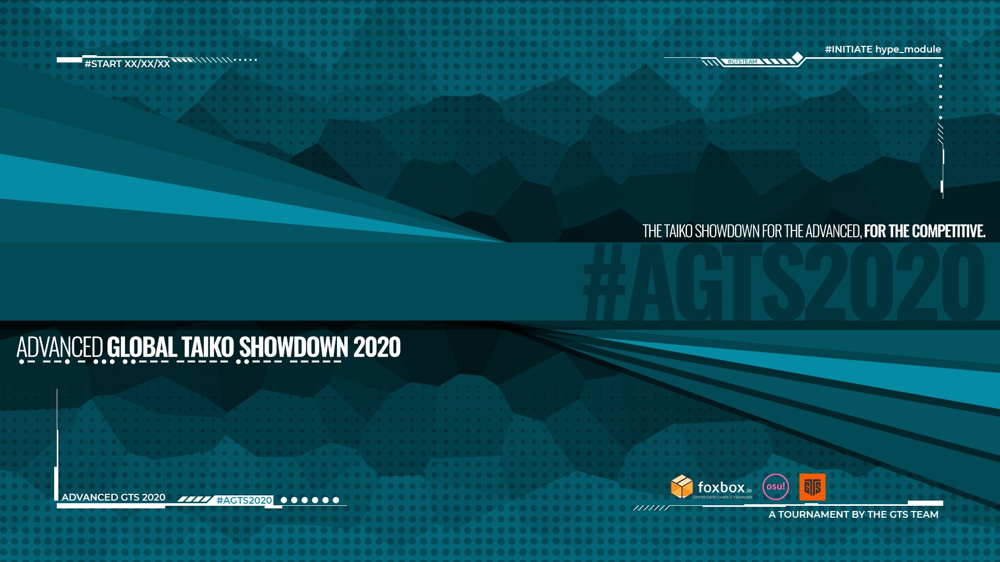

---
tags:
  - AGTS2020
  - AGTS
  - GTS
---

# Advanced Global Taiko Showdown 2020

The **Advanced Global Taiko Showdown 2020** (***AGTS 2020***) was an Advanced worldwide country-based double-elimination 2v2 osu!taiko tournament hosted by ::{ flag=FR }:: [Kasumii-sama](https://osu.ppy.sh/users/6177263) and ::{ flag=FR }:: [TLQ\_Yoshii](https://osu.ppy.sh/users/7157133). It was the second instalment of the Advanced Global Taiko Showdown and part of the Global Taiko Showdown series.

## Tournament schedule

| Event | Timestamp |
| --: | :-- |
| Registration phase | 2020-08-16/2020-08-30 |
| Screening and team creations | 2020-08-30/2020-09-06 |
| Qualifiers | 2020-09-12/2020-09-13 |
| Group stage | 2020-09-19/2020-09-20 |
| Round of 16 | 2020-09-26/2020-09-27 |
| Quarterfinals | 2020-10-03/2020-10-04 |
| Semifinals | 2020-10-10/2020-10-11 |
| Finals | 2020-10-17/2020-10-18 |
| Grand Finals | 2020-10-24 |
| All Stars | 2020-10-31/2020-11-01 |

## Prizes

| Placing | Prize(s) |
| :-: | :-- |
|  | Unique profile badge, 1 year and 4 months of osu!supporter, GTS-themed mousepad sponsored and produced by [Foxbox](https://foxbox.io/) |
|  | 1 year of osu!supporter |
|  | 6 months of osu!supporter |

Generous donations from ::{ flag=US }:: [Glaceon-](https://osu.ppy.sh/users/6395930) and ::{ flag=US }:: [Horo](https://osu.ppy.sh/users/992439) helped fund some of the prizes.

## Organisation

The Advanced Global Taiko Showdown 2020 was run by various community members.

| Position | Member(s) |
| :-- | :-- |
| Organizer | ::{ flag=FR }:: [Kasumii-sama](https://osu.ppy.sh/users/6177263), ::{ flag=FR }:: [TLQ\_Yoshii](https://osu.ppy.sh/users/7157133) |
| Mappool selector | ::{ flag=JP }:: [\_Rise](https://osu.ppy.sh/users/5217107), ::{ flag=BR }:: [HiroK](https://osu.ppy.sh/users/4050738), ::{ flag=FR }:: [Nofool](https://osu.ppy.sh/users/672430) |
| All Stars mappool selector | ::{ flag=DE }:: [Capu](https://osu.ppy.sh/users/2474015) |
| Referee | ::{ flag=KR }:: [4\_4](https://osu.ppy.sh/users/1152851), ::{ flag=HK }:: [Akali393394](https://osu.ppy.sh/users/9686628), ::{ flag=BR }:: [AnonX32](https://osu.ppy.sh/users/2730270), ::{ flag=GB }:: [B0tch3d](https://osu.ppy.sh/users/9864847), ::{ flag=DE }:: [GDLenny](https://osu.ppy.sh/users/8406711), ::{ flag=US }:: [JDrago14](https://osu.ppy.sh/users/7690078), ::{ flag=FR }:: [Kasumii-sama](https://osu.ppy.sh/users/6177263), ::{ flag=SG }:: [kuudere-desu](https://osu.ppy.sh/users/10694200), ::{ flag=SG }:: [Spartric](https://osu.ppy.sh/users/7740442), ::{ flag=NL }:: [TaikoMom](https://osu.ppy.sh/users/9086438), ::{ flag=FR }:: [TLQ\_Yoshii](https://osu.ppy.sh/users/7157133) |
| Streamer | ::{ flag=US }:: [cheese salad](https://osu.ppy.sh/users/6349821), ::{ flag=PL }:: [Deroo](https://osu.ppy.sh/users/8360475), ::{ flag=US }:: [ITotallyGetThat](https://osu.ppy.sh/users/8770622), ::{ flag=FR }:: [Kasumii-sama](https://osu.ppy.sh/users/6177263), ::{ flag=US }:: [Mister Boo](https://osu.ppy.sh/users/2598555), ::{ flag=NL }:: [oliebol](https://osu.ppy.sh/users/2756335), ::{ flag=DE }:: [Sayira](https://osu.ppy.sh/users/7253958), ::{ flag=SG }:: [Spartric](https://osu.ppy.sh/users/7740442) |
| Commentator | ::{ flag=BR }:: [AnonX32](https://osu.ppy.sh/users/2730270), ::{ flag=GB }:: [B0tch3d](https://osu.ppy.sh/users/9864847), ::{ flag=AU }:: [Beat43210](https://osu.ppy.sh/users/5664171), ::{ flag=US }:: [Edgar\_Figaro](https://osu.ppy.sh/users/6508754), ::{ flag=US }:: [Ethaaaan](https://osu.ppy.sh/users/9536977), ::{ flag=EC }:: [Gamelan4](https://osu.ppy.sh/users/9856910), ::{ flag=DE }:: [Heam](https://osu.ppy.sh/users/4705120), ::{ flag=CA }:: [janitore](https://osu.ppy.sh/users/3307897), ::{ flag=US }:: [JM-](https://osu.ppy.sh/users/10629673), ::{ flag=US }:: [kb131313](https://osu.ppy.sh/users/11229259), ::{ flag=RU }:: [KeRLi\_](https://osu.ppy.sh/users/5902629), ::{ flag=US }:: [Loopy542](https://osu.ppy.sh/users/5468461), ::{ flag=DE }:: [Maou](https://osu.ppy.sh/users/3867109), ::{ flag=US }:: [Mister Boo](https://osu.ppy.sh/users/2598555), ::{ flag=DE }:: [QEpicAce](https://osu.ppy.sh/users/9489153), ::{ flag=AR }:: [Vaf](https://osu.ppy.sh/users/12589048), ::{ flag=GB }:: [w1ll](https://osu.ppy.sh/users/11406987) |
| Designer | ::{ flag=ID }:: [fajar13k](https://osu.ppy.sh/users/7100002), ::{ flag=PH }:: [OsuMe65](https://osu.ppy.sh/users/852867), ::{ flag=KR }:: [POCARI SWEAT](https://osu.ppy.sh/users/5082685) |
| Recruiter | ::{ flag=DE }:: [Capu](https://osu.ppy.sh/users/2474015), ::{ flag=FR }:: [Kasumii-sama](https://osu.ppy.sh/users/6177263), ::{ flag=ID }:: [Reed\_405](https://osu.ppy.sh/users/9965069), ::{ flag=FR }:: [TLQ\_Yoshii](https://osu.ppy.sh/users/7157133), ::{ flag=AR }:: [Vaf](https://osu.ppy.sh/users/12589048) |
| Translator | ::{ flag=JP }:: [\_Rise](https://osu.ppy.sh/users/5217107), ::{ flag=EC }:: [Gamelan4](https://osu.ppy.sh/users/9856910), ::{ flag=IT }:: [LordEnder](https://osu.ppy.sh/users/4609767), ::{ flag=DE }:: [Sayira](https://osu.ppy.sh/users/7253958), ::{ flag=HK }:: [-Storm7-](https://osu.ppy.sh/users/12248285), ::{ flag=FR }:: [TLQ\_Yoshii](https://osu.ppy.sh/users/7157133) |
| Developer | ::{ flag=US }:: [Cychloryn](https://osu.ppy.sh/users/6921736), ::{ flag=NL }:: [oliebol](https://osu.ppy.sh/users/2756335), ::{ flag=FR }:: [ThePooN](https://osu.ppy.sh/users/718454) |
| Wiki editor | ::{ flag=ID }:: [fajar13k](https://osu.ppy.sh/users/7100002) |

## Links

- [Discussion thread](https://osu.ppy.sh/community/forums/topics/1126016)
- [GTS Discord server](https://discord.gg/3mGC3HB)
- [AGTS 2020 website](https://gtsosu.com/2020/agts/home)
- Livestream
  - [GTSosu](https://www.twitch.tv/gtsosu)
  - [GTSosu\_b](https://www.twitch.tv/gtsosu_b)
- [Challonge bracket](https://challonge.com/AGTS2020)
- [Pick'em predictions website](https://pickem.hwc.hr/tournaments/46) hosted by ::{ flag=DE }:: [hallowatcher](https://osu.ppy.sh/users/1874761)

## Participants

|  | Country | Members |
| :-: | :-: | :-- |
| ::{ flag=AR }:: | **Argentina A** | **[Atreevete](https://osu.ppy.sh/users/2615199)**, [lTwinkle](https://osu.ppy.sh/users/5043517), [Patocho](https://osu.ppy.sh/users/9964420), [pm04034](https://osu.ppy.sh/users/12704335), [whosthebox](https://osu.ppy.sh/users/1451311) |
| ::{ flag=AR }:: | **Argentina B** | **[Arnon](https://osu.ppy.sh/users/5332868)**, [\_Illustrious\_](https://osu.ppy.sh/users/8256770), [juan736](https://osu.ppy.sh/users/6957262), [Tapi](https://osu.ppy.sh/users/3715691), [warning dark](https://osu.ppy.sh/users/5040981) |
| ::{ flag=AU }:: | **Australia** | **[Beat43210](https://osu.ppy.sh/users/5664171)**, [Scott Morrison](https://osu.ppy.sh/users/10692856), [Tsubasa2](https://osu.ppy.sh/users/6835183) |
| ::{ flag=BR }:: | **Brazil** | **[Mikudayo](https://osu.ppy.sh/users/5235718)**, [AiAyako](https://osu.ppy.sh/users/7003491), [Kannes](https://osu.ppy.sh/users/10821432), [Lazarento](https://osu.ppy.sh/users/3224958), [Lolligerjoj](https://osu.ppy.sh/users/9053338) |
| ::{ flag=CA }:: | **Canada** | **[FusRoYay](https://osu.ppy.sh/users/5207783)**, [beary605](https://osu.ppy.sh/users/2198070), [Player-](https://osu.ppy.sh/users/3724819), [rubies87](https://osu.ppy.sh/users/4949934), [unnamedau](https://osu.ppy.sh/users/15541593) |
| ::{ flag=CL }:: | **Chile** | **[Catulus](https://osu.ppy.sh/users/6276709)**, [daikiu](https://osu.ppy.sh/users/4232665), [joako 321](https://osu.ppy.sh/users/4450549), [-NaNdo-](https://osu.ppy.sh/users/1934382) |
| ::{ flag=CN }:: | **China A** | **[Ookura Risona](https://osu.ppy.sh/users/2073644)**, [Blastix Riotz](https://osu.ppy.sh/users/5310623), [ColorB](https://osu.ppy.sh/users/5024637), [Flandre sca](https://osu.ppy.sh/users/10324309), [HM495](https://osu.ppy.sh/users/810813) |
| ::{ flag=CN }:: | **China B** | **[betairylia](https://osu.ppy.sh/users/1558839)**, [Can](https://osu.ppy.sh/users/4850066), [Nepoch](https://osu.ppy.sh/users/6764344), [-OvO-](https://osu.ppy.sh/users/12208924), [WonderMan](https://osu.ppy.sh/users/2221895) |
| ::{ flag=FI }:: | **Finland** | **[YERTI](https://osu.ppy.sh/users/1490757)**, [MEGAMELA](https://osu.ppy.sh/users/13613362), [Samsse](https://osu.ppy.sh/users/3632469) |
| ::{ flag=FR }:: | **France** | **[Arrival](https://osu.ppy.sh/users/1694000)**, [Aciitm1](https://osu.ppy.sh/users/11253595), [Briesmas](https://osu.ppy.sh/users/2865172), [Chernobog](https://osu.ppy.sh/users/3317042), [Gintoki8](https://osu.ppy.sh/users/2239411) |
| ::{ flag=DE }:: | **Germany A** | **[Sayira](https://osu.ppy.sh/users/7253958)**, [\[TaikoTori\]](https://osu.ppy.sh/users/1074143), [Emre1504](https://osu.ppy.sh/users/13392709), [QEpicAce](https://osu.ppy.sh/users/9489153), [xMrtn-](https://osu.ppy.sh/users/866297) |
| ::{ flag=DE }:: | **Germany B** | **[Malox](https://osu.ppy.sh/users/4516252)**, [Maou](https://osu.ppy.sh/users/3867109), [Siegmund99](https://osu.ppy.sh/users/5168596) |
| ::{ flag=GR }:: | **Greece** | **[KostPer](https://osu.ppy.sh/users/10584732)**, [Kerasi](https://osu.ppy.sh/users/6498810) |
| ::{ flag=EC }:: ::{ flag=CO }:: | **Hispanic Alliance A** | **[Gamelan4](https://osu.ppy.sh/users/9856910)**, [L1ght](https://osu.ppy.sh/users/9050875), [Madsri](https://osu.ppy.sh/users/6260841), [Xoretra](https://osu.ppy.sh/users/4940698) |
| ::{ flag=CR }:: ::{ flag=PE }:: | **Hispanic Alliance B** | **[Hotman](https://osu.ppy.sh/users/7902082)**, [Koto-chan](https://osu.ppy.sh/users/8925569), [puijela](https://osu.ppy.sh/users/12687433) |
| ::{ flag=HK }:: | **Hong Kong** | **[Brown918](https://osu.ppy.sh/users/9805760)**, [Ansonjason2005](https://osu.ppy.sh/users/13271178), [Cynplytholowazy](https://osu.ppy.sh/users/3901754), [thomas1195](https://osu.ppy.sh/users/1691488) |
| ::{ flag=ID }:: | **Indonesia A** | **[Mikurio](https://osu.ppy.sh/users/10734140)**, [ImChro](https://osu.ppy.sh/users/7280717), [Kaemz](https://osu.ppy.sh/users/8494233), [Volta](https://osu.ppy.sh/users/4154071), [WhiteSnowAngel](https://osu.ppy.sh/users/3866964) |
| ::{ flag=ID }:: | **Indonesia B** | **[fajar13k](https://osu.ppy.sh/users/7100002)**, [Alwaysyukaz](https://osu.ppy.sh/users/4999506), [Maneh](https://osu.ppy.sh/users/5179995), [Servatory](https://osu.ppy.sh/users/4013317), [Shirai-](https://osu.ppy.sh/users/4221845) |
| ::{ flag=IT }:: | **Italy** | **[eww](https://osu.ppy.sh/users/12022477)**, [Rovigo](https://osu.ppy.sh/users/11786656) |
| ::{ flag=JP }:: | **Japan A** | **[C-light](https://osu.ppy.sh/users/7955738)**, [autumndayo](https://osu.ppy.sh/users/12268857), [Ku\_Ren](https://osu.ppy.sh/users/2535243), [Saikoro](https://osu.ppy.sh/users/741819) |
| ::{ flag=JP }:: | **Japan B** | **[shiroino](https://osu.ppy.sh/users/1751879)**, [Tsubackyy](https://osu.ppy.sh/users/13082668), [yayuyoyo](https://osu.ppy.sh/users/8104504) |
| ::{ flag=KZ }:: | **Kazakhstan** | **[Lynerrr](https://osu.ppy.sh/users/14254867)**, [KoPoG](https://osu.ppy.sh/users/8463562), [Saisho](https://osu.ppy.sh/users/12814208) |
| ::{ flag=MY }:: | **Malaysia** | **[Bedwyr Aorta](https://osu.ppy.sh/users/10875855)**, [cdhsausageboy](https://osu.ppy.sh/users/2403621), [Fury Dragon](https://osu.ppy.sh/users/6332530) |
| ::{ flag=MX }:: | **Mexico** | **[Iojioji](https://osu.ppy.sh/users/1346121)**, [L\_CORTES\_01](https://osu.ppy.sh/users/12548363), [Yahiyahir](https://osu.ppy.sh/users/6932264), [ZaveryK](https://osu.ppy.sh/users/10913397) |
| ::{ flag=NL }:: | **Netherlands A** | **[Boaz](https://osu.ppy.sh/users/13302996)**, [Edesto](https://osu.ppy.sh/users/5088562), [jackylam5](https://osu.ppy.sh/users/1540807), [lukitsa124](https://osu.ppy.sh/users/8787678) |
| ::{ flag=NL }:: | **Netherlands B** | **[Krekker](https://osu.ppy.sh/users/8265940)**, [Cookie\_Tree](https://osu.ppy.sh/users/502722), [StrijkIjzer](https://osu.ppy.sh/users/4130926), [wen294](https://osu.ppy.sh/users/2265974) |
| ::{ flag=NO }:: | **Norway** | **[Vendelicious](https://osu.ppy.sh/users/8818089)**, [Mills](https://osu.ppy.sh/users/7234023), [Planecakes](https://osu.ppy.sh/users/6936385), [roufou](https://osu.ppy.sh/users/1109122) |
| ::{ flag=PL }:: | **Poland A** | **[fafik99](https://osu.ppy.sh/users/1787011)**, [Agresywny Arbuz](https://osu.ppy.sh/users/7056658), [Mjonsz](https://osu.ppy.sh/users/5696361), [Tetsurio](https://osu.ppy.sh/users/2044810) |
| ::{ flag=PL }:: | **Poland B** | **[Deroo](https://osu.ppy.sh/users/8360475)**, [Konrad20050](https://osu.ppy.sh/users/8966140), [Qusia](https://osu.ppy.sh/users/2370646), [vethreal](https://osu.ppy.sh/users/12067316), [WubWoofWolf](https://osu.ppy.sh/users/39828) |
| ::{ flag=RU }:: | **Russian Federation** | **[Starger](https://osu.ppy.sh/users/3398715)**, [cloudfags](https://osu.ppy.sh/users/5285786), [Crysally](https://osu.ppy.sh/users/7792131), [Ophthalmologist](https://osu.ppy.sh/users/5133613), [TwinT](https://osu.ppy.sh/users/9976154) |
| ::{ flag=SG }:: | **Singapore** | **[awdse22](https://osu.ppy.sh/users/8743513)**, [AutisticImouto](https://osu.ppy.sh/users/10767070), [Prehistoria](https://osu.ppy.sh/users/8364237), [SilverSufuru](https://osu.ppy.sh/users/3769280), [tzechi](https://osu.ppy.sh/users/4662795) |
| ::{ flag=KR }:: | **South Korea A** | **[oL0](https://osu.ppy.sh/users/1134683)**, [GoZaRaNi](https://osu.ppy.sh/users/2879608), [Keyboard](https://osu.ppy.sh/users/12481695), [Ozu](https://osu.ppy.sh/users/980092), [QlNo](https://osu.ppy.sh/users/1022237) |
| ::{ flag=KR }:: | **South Korea B** | **[Sanjenin Nagi](https://osu.ppy.sh/users/224280)**, [fkdlfodlej12](https://osu.ppy.sh/users/5054081), [Lamery](https://osu.ppy.sh/users/4557972) |
| ::{ flag=TW }:: | **Taiwan** | **[KaEDe1106](https://osu.ppy.sh/users/13122339)**, [404 UrNotFound](https://osu.ppy.sh/users/2169329), [ryan940618](https://osu.ppy.sh/users/8369908) |
| ::{ flag=TH }:: | **Thailand** | **[ConieSan](https://osu.ppy.sh/users/2035344)**, [Yuu-chan](https://osu.ppy.sh/users/13479665) |
| ::{ flag=GB }:: | **United Kingdom** | **[hammygames](https://osu.ppy.sh/users/12232503)**, [DatMan212](https://osu.ppy.sh/users/13780435), [Metzo](https://osu.ppy.sh/users/10633982) |
| ::{ flag=US }:: | **United States A** | **[driodx](https://osu.ppy.sh/users/9709548)**, [Ethaaaan](https://osu.ppy.sh/users/9536977), [incandescence](https://osu.ppy.sh/users/6256027), [Mister Boo](https://osu.ppy.sh/users/2598555), [osutaiko](https://osu.ppy.sh/users/4640844) |
| ::{ flag=US }:: | **United States B** | **[JM-](https://osu.ppy.sh/users/10629673)**, [Cutie Cyclops](https://osu.ppy.sh/users/3633507), [giyokon](https://osu.ppy.sh/users/10852632), [kb131313](https://osu.ppy.sh/users/11229259), [Swovine](https://osu.ppy.sh/users/6666316) |

## All Stars participants

Both teams were formed by a vote held in the GTS Discord server. Participants with the most votes got to be the captain for each team, and the rest of the members were decided by rankings as stated in the [All Stars rules](#all-stars-rules).

| Team | Members |
| :-- | :-- |
| **All-Stars Staff Team 1** | ::{ flag=FR }:: **[Kasumii-sama](https://osu.ppy.sh/users/6177263)**, ::{ flag=BR }:: [HiroK](https://osu.ppy.sh/users/4050738), ::{ flag=US }:: [JDrago14](https://osu.ppy.sh/users/7690078), ::{ flag=US }:: [Loopy542](https://osu.ppy.sh/users/5468461) |
| **Asian Maple Syrup** | ::{ flag=CA }:: **[janitore](https://osu.ppy.sh/users/3307897)**, ::{ flag=JP }:: [\_Rise](https://osu.ppy.sh/users/5217107), ::{ flag=KR }:: [4\_4](https://osu.ppy.sh/users/1152851), ::{ flag=KR }:: [POCARI SWEAT](https://osu.ppy.sh/users/5082685) |
| **All-Stars Players Team 1** | ::{ flag=KR }:: **[oL0](https://osu.ppy.sh/users/1134683)**, ::{ flag=CA }:: [Player-](https://osu.ppy.sh/users/3724819), ::{ flag=JP }:: [Saikoro](https://osu.ppy.sh/users/741819), ::{ flag=SG }:: [tzechi](https://osu.ppy.sh/users/4662795) |
| **Taiko no Saiyajin :ehehe:** | ::{ flag=JP }:: **[Ku\_Ren](https://osu.ppy.sh/users/2535243)**, ::{ flag=CN }:: [HM495](https://osu.ppy.sh/users/810813), ::{ flag=HK }:: [thomas1195](https://osu.ppy.sh/users/1691488), ::{ flag=AR }:: [whosthebox](https://osu.ppy.sh/users/1451311) |

## Groups

| Group | Top seed | High seed | Low seed | Unseeded |
| :-: | :-- | :-- | :-- | :-- |
| **A** | ::{ flag=US }:: United States A | ::{ flag=DE }:: Germany A | ::{ flag=PL }:: Poland A | ::{ flag=NL }:: Netherlands A |
| **B** | ::{ flag=JP }:: Japan | ::{ flag=RU }:: Russian Federation | ::{ flag=BR }:: Brazil | ::{ flag=CL }:: Chile |
| **C** | ::{ flag=CN }:: China A | ::{ flag=TW }:: Taiwan | ::{ flag=CR }:: ::{ flag=PE }:: Hispanic Alliance B | ::{ flag=KZ }:: Kazakhstan |
| **D** | ::{ flag=HK }:: Hong Kong | ::{ flag=MX }:: Mexico | ::{ flag=GR }:: Greece | ::{ flag=TH }:: Thailand |
| **E** | ::{ flag=SG }:: Singapore | ::{ flag=AR }:: Argentina | ::{ flag=MY }:: Malaysia | ::{ flag=US }:: United States B |
| **F** | ::{ flag=CA }:: Canada | ::{ flag=ID }:: Indonesia A | ::{ flag=ID }:: Indonesia B | ::{ flag=CN }:: China B |
| **G** | ::{ flag=FR }:: France | ::{ flag=NL }:: Netherlands B | ::{ flag=KR }:: South Korea B | ::{ flag=AR }:: Argentina B |
| **H** | ::{ flag=KR }:: South Korea A | ::{ flag=GB }:: United Kingdom | ::{ flag=EC }:: ::{ flag=CO }:: Hispanic Alliance A | ::{ flag=AU }:: Australia |

## Podium

This competition has come to an end and resulted in the following podium:

| Placing | Team |
| :-: | :-- |
|  | ::{ flag=SG }:: **Singapore** (**[awdse22](https://osu.ppy.sh/users/8743513)**, [AutisticImouto](https://osu.ppy.sh/users/10767070), [Prehistoria](https://osu.ppy.sh/users/8364237), [SilverSufuru](https://osu.ppy.sh/users/3769280), [tzechi](https://osu.ppy.sh/users/4662795)) |
|  | ::{ flag=CN }:: **China A** (**[Ookura Risona](https://osu.ppy.sh/users/2073644)**, [Blastix Riotz](https://osu.ppy.sh/users/5310623), [ColorB](https://osu.ppy.sh/users/5024637), [Flandre sca](https://osu.ppy.sh/users/10324309), [HM495](https://osu.ppy.sh/users/810813)) |
|  | ::{ flag=JP }:: **Japan A** (**[C-light](https://osu.ppy.sh/users/7955738)**, [autumndayo](https://osu.ppy.sh/users/12268857), [Ku\_Ren](https://osu.ppy.sh/users/2535243), [Saikoro](https://osu.ppy.sh/users/741819)) |

## Mappools

### All Stars

**[Download the mappack here! (87 MB)](https://mega.nz/file/twdgEb7I#sMnl6kDvgbez2TKSi5oCz8MZLqwclC5-ieB0v_A_nyI)**

- NoMod
  1. [BilliumMoto - four veiled stars (Nifty) \[Bitter Winter\]](https://osu.ppy.sh/beatmapsets/972301#taiko/2037584)
  2. [Aquellex - Wanderflux (-mint-) \[Fapu's Hell Oni\]](https://osu.ppy.sh/beatmapsets/1103739#taiko/2313593)
  3. [Bhavi - Feelin U (Ulqui) \[Need U\]](https://osu.ppy.sh/beatmapsets/864228#taiko/1807552)
  4. [LeaF - MARENOL (yea) \[169\]](https://osu.ppy.sh/beatmapsets/1068707#taiko/2237356)
- Hidden
  1. [Kaneko Chiharu - WHITEOUT (aabc271) \[Inner Oni+\]](https://osu.ppy.sh/beatmapsets/713114#taiko/1507133)
  2. [Camellia as "Bang Riot" - Blastix Riotz (Axer) \[INFINITE\]](https://osu.ppy.sh/beatmapsets/977459#taiko/2046053)
  3. [Erehamonika remixed by kors k - Der Wald (Kors K Remix) (Nofool) \[Hard Oni\]](https://osu.ppy.sh/beatmapsets/432406#taiko/932407)
  4. [BEMANI Sound Team "Nekomata Master" - Life is beautiful (-MysticEyes) \[\_DUSK\_'s Outer Oni\]](https://osu.ppy.sh/beatmapsets/860089#taiko/2007142)
- HardRock
  1. [Kotori - Nanamori (youth Remix) (nyanmi-1828) \[7z's Heretic\]](https://osu.ppy.sh/beatmapsets/1018730#taiko/2143351)
  2. [BVB - My Awesome Flat Chest On The Ground (404 AccNotFound) \[My Awesome Flat Chest\]](https://osu.ppy.sh/beatmapsets/614244#taiko/1295831)
  3. [Feryquitous - Risk (ensan71714) \[Risky Oni\]](https://osu.ppy.sh/beatmapsets/858100#taiko/1793351)
  4. [C-Show - Invitation from Mr.C (Endymion) \[Ayyri's Outer Oni\]](https://osu.ppy.sh/beatmapsets/749426#taiko/1578551)
- DoubleTime
  1. [M2U - Quo Vadis (TKSalt) \[Inner Oni\]](https://osu.ppy.sh/beatmapsets/135324#taiko/339131)
  2. [Memme - China Dress (Love) \[Inner Oni\]](https://osu.ppy.sh/beatmapsets/140237#taiko/350403)
  3. [PSYQUI feat.Such - Raise Your Hands (1rori) \[Future Oni\]](https://osu.ppy.sh/beatmapsets/883358#taiko/1846592)
  4. [Nekomata Master feat. Misawa Aki - chrono diver -fragment- (moph) \[tasuke's Oni\]](https://osu.ppy.sh/beatmapsets/372200#taiko/829733)
- HDHR
  1. [DJ TOTTO VS TOTTO - Vajra (qoot8123) \[Inner Oni\]](https://osu.ppy.sh/beatmapsets/322526#taiko/717065)
  2. [Getty - Pump It (yea) \[Lunatic Oni\]](https://osu.ppy.sh/beatmapsets/721544#taiko/1523623)
  3. [D(ABE3) - MANIERA (\_yu68) \[Virtuoso\]](https://osu.ppy.sh/beatmapsets/400761#taiko/871924)
  4. [penoreri - Preserved Valkyria (Nardoxyribonucleic) \[aabc's Inner Oni\]](https://osu.ppy.sh/beatmapsets/861177#taiko/1815246)
- Tiebreaker
  1. **[Kikuo - Reincarnation Ascension (Extended mix) (Nifty) \[Monstrosity\]](https://osu.ppy.sh/beatmapsets/1023408#taiko/2140892)**

### Grand Finals

**[Download the mappack here! (105 MB)](https://mega.nz/file/YoUViAhR#c4M9f6Urrbhj8lpQ5RiRTNEMR7eOUxHc6CVZ7K9b8Gc)**

- NoMod
  1. [EPICA - Victims of Contingency (Garpo) \[Bizarre Oni\]](https://osu.ppy.sh/beatmapsets/1001239#taiko/2117645)
  2. [ZiGZaG HACKER - V^3 (Hello World) (SKSalt) \[Inner Oni\]](https://osu.ppy.sh/beatmapsets/352417#taiko/2338794)
  3. [USAO - Chariot (uone) \[Inner Oni\]](https://osu.ppy.sh/beatmapsets/1252022#taiko/2602256)
  4. [t+pazolite - Tempestissimo (HiroK) \[Beyond\]](https://osu.ppy.sh/beatmapsets/1280901#taiko/2660643)
  5. [uma x Morimori Atsushi - Kill me Sweets (Greenshell) \[Diabetic Shock\]](https://osu.ppy.sh/beatmapsets/960945#taiko/2011802)
  6. [Melissa Kinrenka - Eva (\_Rise) \[Mediocre Oni\]](https://osu.ppy.sh/beatmapsets/1154138#taiko/2408688)
- Hidden
  1. [Shouten Kazoku - Osenju Meditation (Midnaait) \[Illuminat|on\]](https://osu.ppy.sh/beatmapsets/896443#taiko/1872872)
  2. [Jaroslav Beck - $100 Bills (Lno) \[Mid's Inner Oni\]](https://osu.ppy.sh/beatmapsets/793720#taiko/2394775)
  3. [Cattle Decapitation - The Geocide (Genjuro) \[Inner Oni\]](https://osu.ppy.sh/beatmapsets/1170000#taiko/2442400)
- HardRock
  1. [ETIA. - Singularity (Kuo Kyoka) \[Raytoly's If You Can\]](https://osu.ppy.sh/beatmapsets/1154702#taiko/2443643)
  2. [TAROLIN - world.\[NOT\].excuse(nxc); (applerss) \[world.runExecution();\]](https://osu.ppy.sh/beatmapsets/724063#taiko/1528896)
  3. [UNDEAD CORPORATION - Seven Colors (yea) \[Lunatic Oni\]](https://osu.ppy.sh/beatmapsets/739402#taiko/1560227)
- DoubleTime
  1. [Sagi - Systematic Love (bananannian) \[Inner Oni\]](https://osu.ppy.sh/beatmapsets/386587#taiko/844066)
  2. [yuikonnu - yakimoti no kotae -another story- (qoot8123) \[Oni\]](https://osu.ppy.sh/beatmapsets/201604#taiko/477289)
  3. [Camellia - Bring Our Ignition Back (Arrival) \[Heaxys' Oni\]](https://osu.ppy.sh/beatmapsets/1133558#taiko/2470287)
- FreeMod
  1. [Yooh - LegenD. (Nepuri) \[Legendary Oni\]](https://osu.ppy.sh/beatmapsets/576803#taiko/1221004)
  2. [Seiryu - AO-Infinity (KitajimaYN) \[Infinity\]](https://osu.ppy.sh/beatmapsets/904624#taiko/1888182)
  3. [q/stol - Counterevidence (goheegy) \[Oni\]](https://osu.ppy.sh/beatmapsets/1192036#taiko/2483920)
- Tiebreaker
  1. **[Camellia - Z:iRNiTRA (\_Rise) \[GTS Collab\]](https://osu.ppy.sh/beatmapsets/1280871#taiko/2660598)**

### Finals

**[Download the mappack here! (93 MB)](https://mega.nz/file/Q1k2yZwI#SZptQ-CpBWXQJcak7GVpy3ft-ibjmkTbLa-MaCtPqNg)**

- NoMod
  1. [t+pazolite (ft. Kabocha) - Elder Dragon Legend (Axer) \[Challenge\]](https://osu.ppy.sh/beatmapsets/1071293#taiko/2242387)
  2. [chelmico - Easy Breezy(Kur@ra Bootleg) (Kamome Yuki) \[yuki & KTYN's Boogie\]](https://osu.ppy.sh/beatmapsets/1107880#taiko/2315433)
  3. [Noisia - Anomaly (maziari1105) \[Insane\]](https://osu.ppy.sh/beatmapsets/1222464#taiko/2542673)
  4. [Frums - Nothing (HiroK) \[Inner Oni\]](https://osu.ppy.sh/beatmapsets/1238437#taiko/2574929)
  5. [DJ Myosuke - Black Territory (Arrival) \[Oni\]](https://osu.ppy.sh/beatmapsets/1251893#taiko/2601972)
  6. [dj TAKA - ELPIS (Jing) \[Firce777's Taiko\]](https://osu.ppy.sh/beatmapsets/101823#taiko/280725)
- Hidden
  1. [Kanon - Hoshizora Travel (uone) \[Inner Oni\]](https://osu.ppy.sh/beatmapsets/1193011#taiko/2485900)
  2. [tomatomerde - KICK IT OUT(Dubstep Remix) (tasuke912) \[Oni\]](https://osu.ppy.sh/beatmapsets/606356#taiko/1281004)
  3. [Kaede To Kyo Aki Chi Kuzu - Yankee Boy Yankee Girl (\_Rise) \[KTYN's Inner Oni\]](https://osu.ppy.sh/beatmapsets/1113663#taiko/2326578)
- HardRock
  1. [DJ Totoriott - Chronoxia (xpokn) \[Inner Oni\]](https://osu.ppy.sh/beatmapsets/733045#taiko/1546517)
  2. [IOSYS - Mushimiko Unya- no Happippi- (7\_7) \[=^. \_ .^=\]](https://osu.ppy.sh/beatmapsets/772855#taiko/1624547)
  3. [Foreground Eclipse - From Under Cover (Caught Up In A Love Song) (Dayzeek) \[Inner Oni\]](https://osu.ppy.sh/beatmapsets/721194#taiko/1522931)
- DoubleTime
  1. [ClariS - irony (vrnl) \[oni\]](https://osu.ppy.sh/beatmapsets/1150996#taiko/2402695)
  2. [Hana - Sakura no Uta (Y O U T A) \[Oni\]](https://osu.ppy.sh/beatmapsets/440392#taiko/947547)
  3. [baker - Natsu ni Sarishi Kimi o Omou (\_Rise) \[Oni\]](https://osu.ppy.sh/beatmapsets/1259806#taiko/2619134)
- FreeMod
  1. [Umeboshi Chazuke - Banana! DX Choco Crepe! (Lamery) \[Sweet Crepe\]](https://osu.ppy.sh/beatmapsets/1226590#taiko/2550608)
  2. [BABYMETAL - Distortion (asuasu\_yura) \[Tatsujin\]](https://osu.ppy.sh/beatmapsets/782661#taiko/1643425)
  3. [lapix - Nexta (Skull Kid) \[Inner Oni (GTS Edit)\]](https://osu.ppy.sh/beatmapsets/749448#taiko/2650273)
- Tiebreaker
  1. **[Angeart&Mtell - Vector (KitajimaYN) \[Collab Oni\]](https://osu.ppy.sh/beatmapsets/997731#taiko/2086899)**

### Semifinals

**[Download the mappack here! (93 MB)](https://mega.nz/file/A10UXIaI#lVkQ7KXKCxUIQ4yktXIzvHlllIS-CmUmdIBYULb8KFs)**

- NoMod
  1. [Mrs.GREEN APPLE - Samama Festival! (katagiri bootleg) (Shamirin\_mzk) \[solo FESTIVAL\]](https://osu.ppy.sh/beatmapsets/1220283#taiko/2538521)
  2. [Kaneko Chiharu - iLLness LiLin (komasy) \[VULKIN'S MAXIMUM\]](https://osu.ppy.sh/beatmapsets/1065377#taiko/2230910)
  3. [The Flashbulb - That Missing Week (Alternate) (ZTH) \[Inner Oni\]](https://osu.ppy.sh/beatmapsets/931375#taiko/1944768)
  4. [Iglooghost - Super Ink Burst (Ulqui) \[Entropy\]](https://osu.ppy.sh/beatmapsets/1182264#taiko/2464974)
  5. [lapix - Over Da Moon (Raphalge) \[Inner Oni (GTS edit)\]](https://osu.ppy.sh/beatmapsets/949898#taiko/2639810)
  6. [ZUN remixed by LeaF - Resurrection Spell (sendol) \[Charlotte's Inner Oni\]](https://osu.ppy.sh/beatmapsets/798869#taiko/1954440)
- Hidden
  1. [AAAA Chazuke - Fatality Saga (Mew104) \[Zetera's Choreia Oni\]](https://osu.ppy.sh/beatmapsets/958849#taiko/2007509)
  2. [Hommarju - (This Is Not) The Angels (roufou) \[Ura Oni\]](https://osu.ppy.sh/beatmapsets/1224917#taiko/2547554)
  3. [MARETU - Wyvern Ammo (KaEDe1106) \[Inner Oni\]](https://osu.ppy.sh/beatmapsets/1205907#taiko/2511044)
- HardRock
  1. [Knife Party & Tom Morello - Battle Sirens (RIOT Remix) (Stingy) \[Gravity\]](https://osu.ppy.sh/beatmapsets/811006#taiko/1701349)
  2. [Dark Flight Dreamer(Speed Up Ver) (Celsius6) \[Cel's Taiko Oni\]](https://osu.ppy.sh/beatmapsets/324173#taiko/720320)
  3. [E.G.G. - Got noir forever. (Mrriichi) \[tasuke's Inner Oni\]](https://osu.ppy.sh/beatmapsets/326018#taiko/792672)
- DoubleTime
  1. [Nightwish - Endless Forms Must Beautiful (frukoyurdakul) \[Oni\]](https://osu.ppy.sh/beatmapsets/599000#taiko/1266090)
  2. [Perfume - Mirai no Museum (\_Rise) \[KTYN's Future\]](https://osu.ppy.sh/beatmapsets/1146130#taiko/2398550)
  3. [myfuckinmess - EEEAAAOOO (Axer) \[E.A.O.\]](https://osu.ppy.sh/beatmapsets/1145906#taiko/2392512)
- FreeMod
  1. [USAO - Showdown (Side) \[tasuke's Inner Oni\]](https://osu.ppy.sh/beatmapsets/438839#taiko/985778)
  2. [U-F SEQUENCER - -273.15 FREEZING MAELSTROM -273.15 FREEZING MAELSTROM -Rei- (IControl) \[Inner Oni\]](https://osu.ppy.sh/beatmapsets/1255300#taiko/2608861)
  3. [USAO - Miracle 5ympho X (yassu-) \[Inner Oni (GTS edit)\]](https://osu.ppy.sh/beatmapsets/690783#taiko/2641829)
- Tiebreaker
  1. **[BlackY - Southern Cross -Long Version 2015- (\[\_Chichinya\_\]) \[Snowgazer\]](https://osu.ppy.sh/beatmapsets/1075245#taiko/2249970)**

### Quarterfinals

**[Download the mappack here! (80 MB)](https://mega.nz/file/ptdX1AhT#2dcpnxlaCp-ZgdMtzVMdJuBIip4tVIlniZyFfaMPYfM)**

- NoMod
  1. [Sophie Twilight , Akari Amano, Hinata Natsuki, Erie - +Kyuutie Ladies+ (DJ Mii-ko Remix) (KitajimaYN) \[maguro&KTYN's Vampire\* (GTS Edit)\]](https://osu.ppy.sh/beatmapsets/1088330#taiko/2632886)
  2. [t+pazolite - Ultrasonic Anthem (Kobaryo's FTN-Remix) (tasuke912) \[Oni\]](https://osu.ppy.sh/beatmapsets/646093#taiko/1369025)
  3. [M2U - Mare Maris (\_DUSK\_) \[Inner Oni\]](https://osu.ppy.sh/beatmapsets/1238323#taiko/2574685)
  4. [DROELOE - Limbo (Ulqui) \[Space Distortion\]](https://osu.ppy.sh/beatmapsets/831958#taiko/1743082)
  5. [antiPLUR - One Life Left to Live (Nwolf) \[Oni\]](https://osu.ppy.sh/beatmapsets/1198823#taiko/2496686)
- Hidden
  1. [Pierce The Veil - The First Punch (puxtu) \[Backfire's Inner Oni\]](https://osu.ppy.sh/beatmapsets/395633#taiko/1596107)
  2. [Rin - Lunatic set 16 \~ The Space Shrine Maiden Returns Home (komasy) \[Lunatic\]](https://osu.ppy.sh/beatmapsets/957412#taiko/2004469)
- HardRock
  1. [Asaba Loki - Laivisca (TKS) \[Oni\]](https://osu.ppy.sh/beatmapsets/1002496#taiko/2098359)
  2. [Nishino Kana - Sweet Dreams (11t dnb mix) -Speed Up Ver.- (Kamome Yuki) \[Dream\]](https://osu.ppy.sh/beatmapsets/1161146#taiko/2422464)
- DoubleTime
  1. [Hideki Naganuma - AIN'T NOTHIN' LIKE A FUNKY BEAT (Nofool) \[Oni\]](https://osu.ppy.sh/beatmapsets/1172261#taiko/2445118)
  2. [Erio - Monolith (Nerova Riuz GX) \[N/A\]](https://osu.ppy.sh/beatmapsets/809233#taiko/1698080)
- FreeMod
  1. [DJ TOTTO - DORNWALD \~Junge\~ (Faputa) \[Inner Oni\]](https://osu.ppy.sh/beatmapsets/1085029#taiko/2269029)
  2. [96neko - Uso no Hibana (gaston\_2199) \[Inner Oni\]](https://osu.ppy.sh/beatmapsets/1089866#taiko/2278533)
  3. [Camellia - Towards The Horizon (tasuke912) \[Oni\]](https://osu.ppy.sh/beatmapsets/751556#taiko/1582177)
- Tiebreaker
  1. **[lapix - Labyrinth (asuasu\_yura) \[Oni (GTS edit)\]](https://osu.ppy.sh/beatmapsets/717264#taiko/2632403)**

### Round of 16

**[Download the mappack here! (66 MB)](https://mega.nz/file/9hMQVAII#oh5Ze7QddtO34OnDavSKeV3KsjEaPWAGPhqy7S2gO4Q)**

- NoMod
  1. [Rohi - Kanata ni Mau wa Sakura no Senritsu (gaston\_2199) \[Inner Oni\]](https://osu.ppy.sh/beatmapsets/1176079#taiko/2452988)
  2. [$44,000 - PISSCORD (Nofool) \[mlpONY (GTS edit)\]](https://osu.ppy.sh/beatmapsets/1262032#taiko/2623241)
  3. [Cybermiso - Z\[i\] (komasy) \[Inner Oni\]](https://osu.ppy.sh/beatmapsets/755607#taiko/1590393)
  4. [Dua Lipa - Break My Heart (Grimbow) \[Vogue\]](https://osu.ppy.sh/beatmapsets/1201481#taiko/2502422)
  5. [Tokyo Machine - OKAY (trollocat) \[INNER ONI\]](https://osu.ppy.sh/beatmapsets/1198443#taiko/2495986)
- Hidden
  1. [Nekomata Master - Izanami's wail (DarkVortex) \[Inner Oni\]](https://osu.ppy.sh/beatmapsets/929211#taiko/1940735)
  2. [Rahatt - Brecorr in Macedonia (Genjuro) \[Inner Oni\]](https://osu.ppy.sh/beatmapsets/1166056#taiko/2432558)
- HardRock
  1. [Camellia - #1f1e33 (GNKait) \[Inner Oni\]](https://osu.ppy.sh/beatmapsets/1199062#taiko/2497052)
  2. [USAO - Knight Rider (aabc271) \[Inner Oni\]](https://osu.ppy.sh/beatmapsets/1201600#taiko/2502630)
- DoubleTime
  1. [Kurousagi Uru - Shiki Toki Uta (toara\_fict) \[Inner Oni\]](https://osu.ppy.sh/beatmapsets/395324#taiko/860698)
  2. [Sigala - Say You Do (feat. Imani & DJ Fresh) (Stingy) \[2199's Oni\]](https://osu.ppy.sh/beatmapsets/1070904#taiko/2260754)
- FreeMod
  1. [lapix - Carry Me Away (namaniku) \[Inner Oni\]](https://osu.ppy.sh/beatmapsets/699877#taiko/1481895)
  2. [The Living Tombstone - I Got No Time (Rhytoly) \[Inner Oni\]](https://osu.ppy.sh/beatmapsets/1017061#taiko/2128740)
  3. [James Landino - Hide And Seek (HiroK) \[Inner Oni (GTS edit)\]](https://osu.ppy.sh/beatmapsets/1239167#taiko/2623660)
- Tiebreaker
  1. **[Laur - Sound Chimera (KTYN) \[Mind Chimera (GTS edit)\]](https://osu.ppy.sh/beatmapsets/1060819#taiko/2623138)**

### Group stage

**[Download the mappack here! (70 MB)](https://mega.nz/file/ElMylCjS#RkGwhO9M9em9RpMmiQNwsIihasufvIGZDJgRYlgum7I)**

- NoMod
  1. [DECO\*27 - HIBANA feat. Hatsune Miku (Chromoxx) \[Inner Oni\]](https://osu.ppy.sh/beatmapsets/875020#taiko/2350370)
  2. [7\_7 - Cachukusa (7\_7) \[Oni\]](https://osu.ppy.sh/beatmapsets/1133620#taiko/2367472)
  3. [dj MAX STEROID - \[E\] (\_Rise) \[Oni\]](https://osu.ppy.sh/beatmapsets/1138010#taiko/2377470)
  4. [Thaehan - Hey (DarkVortex) \[Inner Oni\]](https://osu.ppy.sh/beatmapsets/1114246#taiko/2327948)
- Hidden
  1. [ParagonX9 - Infiltration (Genjuro) \[Inner Oni\]](https://osu.ppy.sh/beatmapsets/1069209#taiko/2238264)
  2. [Strawberry Girls - Baby Sprite (Adam\_S) \[Oni\]](https://osu.ppy.sh/beatmapsets/1230143#taiko/2557498)
- HardRock
  1. [MYTHOLOGIA by MLREC. - Ymir (Zetera) \[Coronation I\]](https://osu.ppy.sh/beatmapsets/1168845#taiko/2438612)
  2. [SOUND HOLIC Vs. T.Kakuta feat. YURiCa - TOXIC VIBRATION (KamizonoShinobu) \[Oni\]](https://osu.ppy.sh/beatmapsets/540714#taiko/1146541)
- DoubleTime
  1. [Kuba Oms - My Love (duski) \[Oni\]](https://osu.ppy.sh/beatmapsets/1132237#taiko/2364974)
  2. [Matsumoto Sara - Ito Hakanaki Hikari no Gotoku (JUDYDANNY) \[Taiko\]](https://osu.ppy.sh/beatmapsets/237701#taiko/550138)
- FreeMod
  1. [3R2 - Corruption (GNKait) \[Inner Oni\]](https://osu.ppy.sh/beatmapsets/1213499#taiko/2525553)
  2. [Liz Triangle - Modernism (Coryn) \[Modern Oni\]](https://osu.ppy.sh/beatmapsets/922017#taiko/1925433)
  3. [Nhato - Nowhere (Arrival) \[Inner Oni\]](https://osu.ppy.sh/beatmapsets/737095#taiko/1555547)
- Tiebreaker
  1. **[Floxytek vs Billx - 30's Swing Tek (Stingy) \[You Like Jazz? (GTS edit)\]](https://osu.ppy.sh/beatmapsets/1028203#taiko/2611734)**

### Qualifiers

**[Download the mappack here! (29 MB)](https://mega.nz/file/RglB1K5J#-RHNorLK-4j4_94GRXbyrwGpLYlD7SHRrCy2I74m8x4)**

- NoMod
  1. [TOMOSUKE x Jazzin'park - LANA - Kiroku no Kakera (sasakure.UK Framework Remix) (Y O U T A) \[Kakera\]](https://osu.ppy.sh/beatmapsets/672895#taiko/1422360)
  2. [Digital Math - The Musky Thrust (Jaltzu) \[Inner Oni\]](https://osu.ppy.sh/beatmapsets/1153833#taiko/2408145)
- Hidden
  1. [U-F SEQUENCER - The Invisible (Poltergeist mix) (Reficul) \[Inner Oni\]](https://osu.ppy.sh/beatmapsets/1243362#taiko/2584930)
- HardRock
  1. [Capchii x Crawk - Suiren no shirabe (-xNaCLx-) \[Saltaiko@NaCL\]](https://osu.ppy.sh/beatmapsets/1093526#taiko/2285538)
- DoubleTime
  1. [ONE OK ROCK - Nobody's Home (qoot8123) \[Oni\]](https://osu.ppy.sh/beatmapsets/96804#taiko/259271)

## Match results

### All Stars

Saturday, 31 October 2020:

| Team 1 |  |  | Team 2 | Match link |
| --: | :-: | :-: | :-- | :-- |
| All-Stars Staff Team 1 | 0 | **8** | **Asian Maple Syrup** | [#1](https://osu.ppy.sh/community/matches/69124456) |

Sunday, 1 November 2020:

| Team 1 |  |  | Team 2 | Match link |
| --: | :-: | :-: | :-- | :-- |
| All-Stars Players Team 1 | 3 | **8** | **Taiko no Saiyajin :ehehe:** | [#1](https://osu.ppy.sh/community/matches/69116508) |
| **Asian Maple Syrup** | **8** | 0 | Taiko no Saiyajin :ehehe: | [#1](https://osu.ppy.sh/community/matches/69124456) |

### Grand Finals

Saturday, 24 October 2020:

| Team 1 |  |  | Team 2 | Match link |
| --: | :-: | :-: | :-- | :-- |
| China A ::{ flag=CN }:: | 3 | **7** | ::{ flag=SG }:: **Singapore** | [#1](https://osu.ppy.sh/community/matches/68726015) |
| **Singapore** ::{ flag=SG }:: | **7** | 4 | ::{ flag=CN }:: China A | [#1](https://osu.ppy.sh/community/matches/68729639) |

### Finals

Saturday, 17 October 2020:

| Team 1 |  |  | Team 2 | Match link |
| --: | :-: | :-: | :-- | :-- |
| South Korea A ::{ flag=KR }:: | -1 | **0** | ::{ flag=SG }:: **Singapore** | *win by default* |
| **China A** ::{ flag=CN }:: | **7** | 5 | ::{ flag=JP }:: Japan A | [#1](https://osu.ppy.sh/community/matches/68395391) |

Sunday, 18 October 2020:

| Team 1 |  |  | Team 2 | Match link |
| --: | :-: | :-: | :-- | :-- |
| Japan A ::{ flag=JP }:: | 2 | **7** | ::{ flag=SG }:: **Singapore** | [#1](https://osu.ppy.sh/community/matches/68447405) |

### Semifinals

Saturday, 10 October 2020:

| Team 1 |  |  | Team 2 | Match link |
| --: | :-: | :-: | :-- | :-- |
| **Japan A** ::{ flag=JP }:: | **7** | 3 | ::{ flag=ID }:: Indonesia A | [#1](https://osu.ppy.sh/community/matches/68092801) |
| Netherlands B ::{ flag=NL }:: | 1 | **7** | ::{ flag=SG }:: **Singapore** | [#1](https://osu.ppy.sh/community/matches/68092828) |
| Russian Federation ::{ flag=RU }:: | 2 | **7** | ::{ flag=CN }:: **China A** | [#1](https://osu.ppy.sh/community/matches/68095512) |

Sunday, 11 October 2020:

| Team 1 |  |  | Team 2 | Match link |
| --: | :-: | :-: | :-- | :-- |
| Hong Kong ::{ flag=HK }:: | 3 | **7** | ::{ flag=KR }:: **South Korea A** | [#1](https://osu.ppy.sh/community/matches/68120894) |
| Russian Federation ::{ flag=RU }:: | 5 | **7** | ::{ flag=KR }:: **South Korea A** | [#1](https://osu.ppy.sh/community/matches/68134742) |
| Indonesia A ::{ flag=ID }:: | 3 | **7** | ::{ flag=SG }:: **Singapore** | [#1](https://osu.ppy.sh/community/matches/68140442) |

### Quarterfinals

Saturday, 3 October 2020:

| Team 1 |  |  | Team 2 | Match link |
| --: | :-: | :-: | :-- | :-- |
| **Japan A** ::{ flag=JP }:: | **6** | 0 | ::{ flag=KR }:: South Korea A | [#1](https://osu.ppy.sh/community/matches/67803929) |
| United States A ::{ flag=US }:: | 5 | **6** | ::{ flag=RU }:: **Russian Federation** | [#1](https://osu.ppy.sh/community/matches/67805754) |
| Hong Kong ::{ flag=HK }:: | 3 | **6** | ::{ flag=ID }:: **Indonesia A** | [#1](https://osu.ppy.sh/community/matches/67805775) |
| **China A** ::{ flag=CN }:: | **6** | 0 | ::{ flag=AR }:: Argentina A | [#1](https://osu.ppy.sh/community/matches/67812067) |

Sunday, 4 October 2020:

| Team 1 |  |  | Team 2 | Match link |
| --: | :-: | :-: | :-- | :-- |
| **South Korea A** ::{ flag=KR }:: | **6** | 2 | ::{ flag=CA }:: Canada | [#1](https://osu.ppy.sh/community/matches/67834846) |
| **Hong Kong** ::{ flag=HK }:: | **6** | 1 | ::{ flag=FR }:: France | [#1](https://osu.ppy.sh/community/matches/67846413) |
| United States A ::{ flag=US }:: | 1 | **6** | ::{ flag=SG }:: **Singapore A** | [#1](https://osu.ppy.sh/community/matches/67854525) |
| Argentina A ::{ flag=AR }:: | -1 | **0** | ::{ flag=NL }:: **Netherlands B** | *win by default* |

### Round of 16

Saturday, 26 September 2020:

| Team 1 |  |  | Team 2 | Match link |
| --: | :-: | :-: | :-- | :-- |
| **China A** ::{ flag=CN }:: | **6** | 4 | ::{ flag=CA }:: Canada | [#1](https://osu.ppy.sh/community/matches/67497473) |
| **South Korea A** ::{ flag=KR }:: | **0** | -1 | ::{ flag=PL }:: Poland A | *win by default* |
| **Japan A** ::{ flag=JP }:: | **6** | 1 | ::{ flag=NL }:: Netherlands B | [#1](https://osu.ppy.sh/community/matches/67515892) |
| **Indonesia A** ::{ flag=ID }:: | **6** | 1 | ::{ flag=TW }:: Taiwan | [#1](https://osu.ppy.sh/community/matches/67516040) |
| France ::{ flag=FR }:: | 4 | **6** | ::{ flag=RU }:: **Russian Federation** | [#1](https://osu.ppy.sh/community/matches/67519047) |
| **Argentina A** ::{ flag=AR }:: | **6** | 2 | ::{ flag=MX }:: Mexico | [#1](https://osu.ppy.sh/community/matches/67537201) |

Sunday, 27 September 2020:

| Team 1 |  |  | Team 2 | Match link |
| --: | :-: | :-: | :-- | :-- |
| **United States A** ::{ flag=US }:: | **6** | 2 | ::{ flag=EC }:: ::{ flag=CO }:: Hispanic Alliance A | [#1](https://osu.ppy.sh/community/matches/67543415) |
| **Hong Kong** ::{ flag=HK }:: | **6** | 3 | ::{ flag=SG }:: Singapore | [#1](https://osu.ppy.sh/community/matches/67550432) |
| **Netherlands B** ::{ flag=NL }:: | **6** | 3 | ::{ flag=PL }:: Poland A | [#1](https://osu.ppy.sh/community/matches/67568453) |
| **Singapore** ::{ flag=SG }:: | **6** | 3 | ::{ flag=TW }:: Taiwan | [#1](https://osu.ppy.sh/community/matches/67569884) |
| Hispanic Alliance A ::{ flag=EC }:: ::{ flag=CO }:: | 1 | **6** | ::{ flag=FR }:: **France** | [#1](https://osu.ppy.sh/community/matches/67573438) |
| **Canada** ::{ flag=CA }:: | **6** | 4 | ::{ flag=MX }:: Mexico | [#1](https://osu.ppy.sh/community/matches/67578054) |

### Group stage

Saturday, 19 September 2020:

| Team 1 |  |  | Team 2 | Match link |
| --: | :-: | :-: | :-- | :-- |
| Kazakhstan ::{ flag=KZ }:: | 0 | **5** | ::{ flag=TW }:: **Taiwan** | [#1](https://osu.ppy.sh/community/matches/67156925) |
| **Indonesia B** ::{ flag=ID }:: | **5** | 2 | ::{ flag=CN }:: China B | [#1](https://osu.ppy.sh/community/matches/67164992) |
| Canada ::{ flag=CA }:: | 4 | **5** | ::{ flag=ID }:: **Indonesia A** | [#1](https://osu.ppy.sh/community/matches/67166733) |
| China B ::{ flag=CN }:: | 1 | **5** | ::{ flag=ID }:: **Indonesia A** | [#1](https://osu.ppy.sh/community/matches/67169669) |
| **France** ::{ flag=FR }:: | **5** | 3 | ::{ flag=NL }:: Netherlands | [#1](https://osu.ppy.sh/community/matches/67171599) |
| Australia ::{ flag=AU }:: | 0 | **5** | ::{ flag=KR }:: **South Korea A** | [#1](https://osu.ppy.sh/community/matches/67173568) |
| **Japan A** ::{ flag=JP }:: | **5** | 2 | ::{ flag=RU }:: Russian Federation | [#1](https://osu.ppy.sh/community/matches/67173557) |
| Kazakhstan ::{ flag=KZ }:: | 1 | **5** | ::{ flag=CN }:: **China A** | [#1](https://osu.ppy.sh/community/matches/67177405) |
| Australia ::{ flag=AU }:: | 0 | **5** | ::{ flag=GB }:: **United Kingdom** | [#1](https://osu.ppy.sh/community/matches/67177399) |
| **China A** ::{ flag=CN }:: | **5** | 0 | ::{ flag=TW }:: Taiwan | [#1](https://osu.ppy.sh/community/matches/67183155) |
| Singapore ::{ flag=SG }:: | 0 | **5** | ::{ flag=AR }:: **Argentina A** | [#1](https://osu.ppy.sh/community/matches/67182564) |
| South Korea B ::{ flag=KR }:: | 3 | **5** | ::{ flag=AR }:: **Argentina B** | [#1](https://osu.ppy.sh/community/matches/67182926) |
| **United States A** ::{ flag=US }:: | **5** | 2 | ::{ flag=DE }:: Germany A | [#1](https://osu.ppy.sh/community/matches/67185578) |
| Chile ::{ flag=CL }:: | 0 | **5** | ::{ flag=JP }:: **Japan A** | [#1](https://osu.ppy.sh/community/matches/67185636) |
| **Russian Federation** ::{ flag=RU }:: | **5** | 0 | ::{ flag=BR }:: Brazil | [#1](https://osu.ppy.sh/community/matches/67188100) |
| United Kingdom ::{ flag=GB }:: | 0 | **5** | ::{ flag=EC }:: ::{ flag=CO }:: **Hispanic Alliance A** | [#1](https://osu.ppy.sh/community/matches/67191591) |
| Netherlands A ::{ flag=NL }:: | 0 | **5** | ::{ flag=US }:: **United States A** | [#1](https://osu.ppy.sh/community/matches/67191604) |
| **Mexico** ::{ flag=MX }:: | **5** | 3 | ::{ flag=GR }:: Greece | [#1](https://osu.ppy.sh/community/matches/67194346) |
| Netherlands A ::{ flag=NL }:: | 0 | **5** | ::{ flag=DE }:: **Germany A** | [#1](https://osu.ppy.sh/community/matches/67196145) |
| Poland A ::{ flag=PL }:: | 0 | **5** | ::{ flag=US }:: **United States A** | [#1](https://osu.ppy.sh/community/matches/67198116) |
| Argentina B ::{ flag=AR }:: | 0 | **5** | ::{ flag=FR }:: **France** | [#1](https://osu.ppy.sh/community/matches/67201290) |
| **Taiwan** ::{ flag=TW }:: | **5** | 4 | ::{ flag=CR }:: ::{ flag=PE }:: Hispanic Alliance B | [#1](https://osu.ppy.sh/community/matches/67209288) |
| United States B ::{ flag=US }:: | 0 | **5** | ::{ flag=AR }:: **Argentina A** | [#1](https://osu.ppy.sh/community/matches/67209159) |

Sunday, 20 September 2020:

| Team 1 |  |  | Team 2 | Match link |
| --: | :-: | :-: | :-- | :-- |
| Hispanic Alliance A ::{ flag=EC }:: ::{ flag=CO }:: | 1 | **5** | ::{ flag=KR }:: **South Korea A** | [#1](https://osu.ppy.sh/community/matches/67210800) |
| Brazil ::{ flag=BR }:: | 1 | **5** | ::{ flag=CL }:: **Chile** | [#1](https://osu.ppy.sh/community/matches/67210788) |
| **Hispanic Alliance A** ::{ flag=EC }:: ::{ flag=CO }:: | **0** | -1 | ::{ flag=AU }:: Australia | *win by default* |
| Brazil ::{ flag=BR }:: | -1 | **0** | ::{ flag=JP }:: **Japan A** | *win by default* |
| **Hispanic Alliance B** ::{ flag=CR }:: ::{ flag=PE }:: | **0** | -1 | ::{ flag=KZ }:: Kazakhstan | *win by default* |
| Thailand ::{ flag=TH }:: | 0 | **5** | ::{ flag=MX }:: **Mexico** | [#1](https://osu.ppy.sh/community/matches/67213959) |
| Hispanic Alliance B ::{ flag=CR }:: ::{ flag=PE }:: | 1 | **5** | ::{ flag=CN }:: **China A** | [#1](https://osu.ppy.sh/community/matches/67215935) |
| China B ::{ flag=CN }:: | 0 | **5** | ::{ flag=CA }:: **Canada** | [#1](https://osu.ppy.sh/community/matches/67216247) |
| **Hong Kong** ::{ flag=HK }:: | **5** | 2 | ::{ flag=MX }:: Mexico | [#1](https://osu.ppy.sh/community/matches/67218014) |
| United States B ::{ flag=US }:: | 0 | **5** | ::{ flag=SG }:: **Singapore** | [#1](https://osu.ppy.sh/community/matches/67217992) |
| Indonesia B ::{ flag=ID }:: | -1 | **0** | ::{ flag=CA }:: **Canada** | *win by default* |
| Thailand ::{ flag=TH }:: | 1 | **5** | ::{ flag=HK }:: **Hong Kong** | [#1](https://osu.ppy.sh/community/matches/67221662) |
| Greece ::{ flag=GR }:: | 3 | **5** | ::{ flag=HK }:: **Hong Kong** | [#1](https://osu.ppy.sh/community/matches/67224752) |
| **Indonesia A** ::{ flag=ID }:: | **5** | 1 | ::{ flag=ID }:: Indonesia B | [#1](https://osu.ppy.sh/community/matches/67226228) |
| **Greece** ::{ flag=GR }:: | **5** | 1 | ::{ flag=TH }:: Thailand | [#1](https://osu.ppy.sh/community/matches/67228075) |
| **South Korea A** ::{ flag=KR }:: | **5** | 0 | ::{ flag=GB }:: United Kingdom | [#1](https://osu.ppy.sh/community/matches/67230098) |
| **Argentina A** ::{ flag=AR }:: | **5** | 3 | ::{ flag=MY }:: Malaysia | [#1](https://osu.ppy.sh/community/matches/67233876) |
| South Korea B ::{ flag=KR }:: | 2 | **5** | ::{ flag=FR }:: **France** | [#1](https://osu.ppy.sh/community/matches/67234048) |
| Malaysia ::{ flag=MY }:: | 1 | **5** | ::{ flag=SG }:: **Singapore** | [#1](https://osu.ppy.sh/community/matches/67237013) |
| **Netherlands B** ::{ flag=NL }:: | **5** | 4 | ::{ flag=KR }:: South Korea B | [#1](https://osu.ppy.sh/community/matches/67236326) |
| **Malaysia** ::{ flag=MY }:: | **5** | 1 | ::{ flag=US }:: United States B | [#1](https://osu.ppy.sh/community/matches/67239312) |
| Germany A ::{ flag=DE }:: | 4 | **5** | ::{ flag=PL }:: **Poland A** | [#1](https://osu.ppy.sh/community/matches/67241288) |
| Chile ::{ flag=CL }:: | 3 | **5** | ::{ flag=RU }:: **Russian Federation** | [#1](https://osu.ppy.sh/community/matches/67241638) |
| **Poland A** ::{ flag=PL }:: | **5** | 0 | ::{ flag=NL }:: Netherlands A | [#1](https://osu.ppy.sh/community/matches/67245720) |
| Argentina B ::{ flag=AR }:: | 0 | **5** | ::{ flag=NL }:: **Netherlands B** | [#1](https://osu.ppy.sh/community/matches/67245722) |

### Qualifiers

| Seed | Team | Average rank |
| --: | :-- | --: |
| #1 | ::{ flag=JP }:: Japan A | 5 |
| #2 | ::{ flag=CN }:: China A | 5.4 |
| #3 | ::{ flag=US }:: United States A | 5.8 |
| #4 | ::{ flag=SG }:: Singapore | 6.4 |
| #5 | ::{ flag=HK }:: Hong Kong | 6.8 |
| #6 | ::{ flag=CA }:: Canada | 7.4 |
| #7 | ::{ flag=KR }:: South Korea A | 9.6 |
| #8 | ::{ flag=FR }:: France | 9.8 |
| #9 | ::{ flag=AR }:: Argentina A | 10 |
| #10 | ::{ flag=DE }:: Germany A | 10.8 |
| #11 | ::{ flag=ID }:: Indonesia A | 11.4 |
| #12 | ::{ flag=NL }:: Netherlands B | 12 |
| #13 | ::{ flag=TW }:: Taiwan | 13 |
| #14 | ::{ flag=RU }:: Russian Federation | 13.4 |
| #15 | ::{ flag=GB }:: United Kingdom | 13.8 |
| #16 | ::{ flag=MX }:: Mexico | 17.2 |
| #17 | ::{ flag=CR }:: ::{ flag=PE }:: Hispanic Alliance B | 17.4 |
| #18 | ::{ flag=PL }:: Poland A | 18.6 |
| #19 | ::{ flag=EC }:: ::{ flag=CO }:: Hispanic Alliance A | 19.6 |
| #20 | ::{ flag=KR }:: South Korea B | 19.8 |
| #21 | ::{ flag=ID }:: Indonesia B | 21.8 |
| #22 | ::{ flag=GR }:: Greece | 22.6 |
| #23 | ::{ flag=BR }:: Brazil | 23.4 |
| #24 | ::{ flag=MY }:: Malaysia | 24.2 |
| #25 | ::{ flag=AR }:: Argentina B | 24.6 |
| #26 | ::{ flag=CL }:: Chile | 25.8 |
| #26 | ::{ flag=CN }:: China B | 25.8 |
| #28 | ::{ flag=KZ }:: Kazakhstan | 26.4 |
| #29 | ::{ flag=US }:: United States B | 26.6 |
| #30 | ::{ flag=AU }:: Australia | 27.4 |
| #31 | ::{ flag=NL }:: Netherlands A | 28.8 |
| #32 | ::{ flag=TH }:: Thailand | 29.2 |
| #33 | ::{ flag=FI }:: Finland | 30 |
| #34 | ::{ flag=DE }:: Germany B | 31 |
| #35 | ::{ flag=NO }:: Norway | 34.2 |
| #36 | ::{ flag=IT }:: Italy | 34.8 |
| #37 | ::{ flag=PL }:: Poland B | 35 |
| #38 | ::{ flag=JP }:: Japan B | 36 |

- Only the top 32 teams proceed to the Group Stage
- More detailed qualifiers result can be accessed via following [spreadsheet](https://docs.google.com/spreadsheets/d/1f9IQYAo3mo0CsDVHmLJx1vjtfquxxYfWC4d67NzyTcY/edit?usp=sharing)
- Average rank is determined by `Σ position earned when playing the Qualifiers mappool / amount of Qualifiers mappool`

## Ruleset

### General rules

1. Advanced Global Taiko Showdown is a **2v2 double-elimination tournament** with teams of **5 players maximum**.
2. The teams will first go through a **Qualifiers**. Then they will play in a **Group Stage** and finally play in a **double-elimination bracket**.
3. The scoring system that will be used is **ScoreV2**.
4. Any player who meets the requirements stated in the [rank restrictions](#rank-restrictions) section is allowed to sign up. Since AGTS will aim to get badged, some players might be declined by the osu! staff (via screening).
5. Any members of staff apart from **Organizer, Map selector (both general and All Stars), and Referees** are allowed to play.
6. Players and staff members must have read this ruleset entirely (and we will assume you did so throughout the tournament).
7. All participants must stay respectful and keep a proper attitude. Not following this rule can result in a ban/blacklist from the tournament. This rule concerns all the staff as well.
8. Any rule changes or unexpected occurences will be announced in the AGTS Discord server.

### Rank restrictions

1. Players must be within the rank of #500 - #3,500 during registrations. This means that they have to be in this rank range **until the end of registrations**.
2. Players are not allowed to rank up further than **#400 during the tournament**. If they pass the limit, they will be disqualified immediately.
3. Players must sign up with the country flag of their profile.
4. Players must join the Discord server of the tournament.

### Tournament registration and teams creation

1. In order to participate, players need to meet the criteria stated in the [rank restriction](#rank-restrictions) section.
2. Players sign up individually. When their registration is accepted, they will get a country role in the Discord server.
3. The staff can decline a player from participating in the tournament if the staff deem their skill is much higher than the targeted rank range.
4. This iteration, we are allowing 2 teams coming from a country under certain conditions:
   - There are **7 or more players** signed up for a country.
   - Each team has to have **at least 3 players**.
5. Because of the previous rule, there are going to be different scenarios when creating the teams:
   - If there are 5 players or less signed up for a country, those players will form the team representing their country.
   - In case there are more than 10 players signed up for a country, players will decide amnong themselves who will partake in the tournament. If they cannot decide the top 10 players, the staff will choose it sorted by ranking to form the 2 teams.
   - If there are 6 players, players will have to decide on the 5 players who will partake in the tournament. If they cannot decide the top 5 players, the staff will choose it sorted by ranking to form the team.
   - If there are players between 7 to 10 players (after keeping the best ranked ones) signed up for a country, the players from that country will have a few days to decide how to split themselves between the 2 teams. It's recommended to come to an agreement as fast as possible to then decide on the captain and be able to schedule and prepare their matches rapidly.
   - In case the players can't come to an agreement, they will be ranked by pp (performance point) and put in the 2 teams with at least 3 members in each of them with the best ones in a first team and the lowest in the second.
   - The players wil decide on the captain of their team.
   - If the players can't agree or name a captain, the highest ranked player will be chosen by default.
6. The captain is going to be the one to reschedule a match if needed and will ensure that the team is ready for the matches.

### Stage regulations

1. There are seven stages in the tournament: the Qualifiers, the Group Stage, the Round of 16, the Quarterfinals, the Semifinals, the Finals, and the Grand Finals.
2. The team will be seeded with the average of their ranks on each map during the Qualifiers round in 4 seeds: Top seed, High seed, Low seed, and Unseeded. (The seeding process will be explained more precisely in the [qualifiers regulations](#qualifiers-regulations) part)
3. Teams will be drawn in **8 groups of 4 teams** during the live drawings which will happen on **Sunday, September 17th 2020**.
4. In the Group Stage, all teams from each group will face each other. The **best 2 teams** get our of their group.
5. Rankings of each group are determined by sorting the results of each team's performance in the following priority:
   1. Most matches won.
   2. Highest (number of beatmaps won - number of maps lost) score.
   3. Most beatmaps won.
   4. Winner of the match played previously between the tied teams.
6. In Group Stage, "Win by Default" will be treated as win by 5:0, +1.0 score difference ratio.
7. The winning conditions for each stage are listed below:
   - the Group Stage: Best-of-9 (First to 5 points)
   - the Round of 16 and the Quarterfinals: Best-of-11 (First to 6 points)
   - the Semifinals, the Finals, and the Grand Finals: Best-of-13 (First to 7 points)

### Qualifiers regulations

1. During this round, there will be multiple lobbies available at various hours.
2. A private match will be created and teams will be invited into the lobby when it's their time. Make sure to be available at this time.
3. There are no warmups.
4. Failed scores will count.
5. Only two players from a team will be playing per map. There is no limitation on player swapping.
6. Seedings will be done with the average rank of each team on each map.
7. Maps will be played twice in a row during the lobby. The best run will be taken into account for the ranking.
8. Only the best 32 teams will continue on to the Group Stage.

### Match regulations

1. A private lobby will be created 10 minutes before your match by a referee. Both team's captain will be invited into the room when it's match time. Then the referee of the captains will invite the other players into the room.
2. If no staff or referee is available, the match will be postponed.
3. If less than the minimum required players attend, the maximum time the match can be postponed is 10 minutes.
4. There is no penalty for not joining the room instantly after match time as long as it's within the postponed time.
5. If neither of both teams have the minimum required players after 10 minutes, it will count as a loss for both teams in Group Stage. In the double-elimination bracket, the highest seeded team will advance.
6. The match will be played as **TeamVs** and **ScoreV2** and the name of the room will be: "AGTS 2020: (Team Red) vs (Team Blue)".
7. Each team is allowed one warmup but it must be below **3:00**. Everyone is allowed in the room during warmups.
8. If a team takes more than 2 minutes to decide on a warmup the referee will be skipping it.
9. Each captain has to ban **one beatmap** from the mappool (apart from Tiebreaker). These beatmaps are not allowed to be picked by any team in the entire match.
10. The captain of each team will do `!roll` in the chat.
11. The team with the highest `!roll` **bans second and picks first**. The team with the lowest `!roll` **bans first and picks second**.
12. Each captain has 2 minutes to name their ban. If they fail to do so, the ban will be made with a `!roll`.
13. Beatmap selection will then alternate between each captain selecting a beatmap out of the mappool.
14. Captains may pick freely from any bracket.
15. Teams will have 2 minutes to pick a beatmap and 2 minutes to get ready. If a team didn't name their pick before the end of the timer, the map will be picked with a `!roll`.
16. Exchanging players during a match is allowed without limitations.
17. If a player disconnects between the beatmaps and the team cannot provide an exchange, the match can be delayed 10 minutes at most. This delay can only be applied once.
18. If a player disconnects, they get treated as if they failed the map.
19. Disconnects within 30 seconds after the beatmap was started allows the map to be replayed. This is only allowed once per team.
20. Failed players' scores don't get added to the team score.
21. If the beatmap ends in a draw, the game will be nullified and the map will be replayed.
22. In case of a tie in points (example: 4-4 in BO9) the tiebreaker will be played.

### Mappool instructions

1. There will be separate mappool for each stages.
2. The Qualifiers pool will be different from all the other round as it will have a format of 2 NoMod, 1 Hidden, 1 HardRock, and 1 DoubleTime maps.
3. The loser's bracket will play on the same mappool as the winner's bracket of the same weekend.
4. Each mappool consists of 6 brackets: NoMod, Hidden, HardRock, DoubleTime, FreeMod, and Tiebreaker.
5. The Group Stage mappool will consist of 14 maps, the Round of 16 and the Quarterfinals will consist of 15 maps, the Semifinals, the Finals, and the Grand Finals will consist of 16 maps.
6. The size of the Hidden, HardRock and DoubleTime brackets will be 2 until Semifinals, where it increases to 3 for the rest of the tournament and 3 for the FreeMod bracket in all stages.
7. The FreeMod bracket is played with FreeMod activated. Every individual player can pick **Hidden, HardRock, or both. At least one player of each team must have at least one mod activated**.
8. The Tiebreaker will be played under FreeMod conditions but it won't be mandatory pick.
9. The mappool for each stage will be showcased in the [GTS' channel](#links) a week before.

### Scheduling instructions

1. Every stage is held **during the weekend**. (It is however allowed to schedule on another day if no agreement is found on a time during the weekend)
2. Matches are allowed to overlap if referees are available.
3. The organizer will try to schedule as best as possible so it fits with the timezones. The schedule will be released the previous weekend of each stage.
4. Reschedules will only be considered if both teams agree on a time. Proof of that needs to be sent to the tournament staff before **Thursday at 23:59 UTC+0** in that particular week when their match takes place.
5. Reschedules may only be requested by **a team captain**.

### All Stars rules

1. All Stars is a fun event taking place on the same weekend as the Grand Finals! It'll showcase the best players of the tournament playing against each other in a special match.
2. 8 players will participate in this event. They will be decided by a vote.
3. The top 8 players will play in All Stars. If there are more than 2 players from a country in the top 8 most voted players only the 2 best will partake in All Stars.
4. The top 2 players will be captains of each team. Their teammates will be decided by the ranking of the next 6 players. The topmost voted player will play with players with an odd number and the second most voted player with players with an even number.
5. The mappool will be made by a special team of mappoolers.
6. The event will be a 4 vs 4 match with the following rules:
   - Best-of-15 format (First to 8 points).
   - Mappool will consist of 20 FreeMod maps and 1 TB. All the maps can be played with any mod combinations. Some of them might be impossible to put a mod on though!
   - No bans.
   - Map selection is the same as a normal match.
   - Same rules as a normal match for disconnections.
