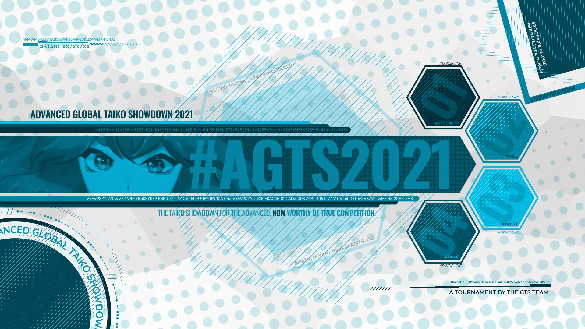

---
tags:
  - AGTS2021
  - AGTS
  - GTS
---

# Advanced Global Taiko Showdown 2021

The **Advanced Global Taiko Showdown 2021** (***AGTS 2021***) was a worldwide double-elimination osu!taiko tournament hosted by ::{ flag=FR }:: [\_yosh](https://osu.ppy.sh/users/7157133), ::{ flag=FR }:: [Kasumii-sama](https://osu.ppy.sh/users/6177263), and ::{ flag=NL }:: [TaikoMom](https://osu.ppy.sh/users/9086438). Only players ranked between #1,000 and #3,500 could participate. It was the third instalment of the Advanced Global Taiko Showdown and part of the Global Taiko Showdown series.

## Tournament schedule

| Event | Timestamp |
| --: | :-- |
| Registration phase | 2021-04-16/2021-05-02 |
| Screening phase | 2021-05-02/2021-05-09 |
| Qualifiers | 2021-05-15/2021-05-16 |
| Group Stage | 2021-05-22/2021-05-23 |
| Round of 32 | 2021-05-29/2021-05-30 |
| Quarterfinals | 2021-06-05/2021-06-06 |
| Semifinals | 2021-06-12/2021-06-13 |
| Finals | 2021-06-19/2021-06-20 |
| Grand Finals | 2021-06-26/2021-06-27 |

## Prizes

| Placing | Prize(s) |
| :-: | :-- |
|  | Trophy for each team member with their name printed, 1 year and 4 months of osu!supporter for each team member, unique profile badge |
|  | 1 year of osu!supporter for each team member |
|  | 6 months of osu!supporter for each team member |

## Organisation

The Advanced Global Taiko Showdown 2021 was run by various community members.

| Position | Member(s) |
| :-- | :-- |
| Organizer | ::{ flag=FR }:: [\_yosh](https://osu.ppy.sh/users/7157133), ::{ flag=FR }:: [Kasumii-sama](https://osu.ppy.sh/users/6177263), ::{ flag=NL }:: [TaikoMom](https://osu.ppy.sh/users/9086438) |
| Mappool selector | ::{ flag=DE }:: [Ak1o](https://osu.ppy.sh/users/1600041), ::{ flag=EC }:: [Gamelan4](https://osu.ppy.sh/users/9856910), ::{ flag=BR }:: [HiroK](https://osu.ppy.sh/users/4050738) |
| Mappool showcase | ::{ flag=US }:: [driodx](https://osu.ppy.sh/users/9709548), ::{ flag=CA }:: [janitore](https://osu.ppy.sh/users/3307897), ::{ flag=US }:: [JDrago14](https://osu.ppy.sh/users/7690078) |
| Referee | ::{ flag=FR }:: [\_yosh](https://osu.ppy.sh/users/7157133), ::{ flag=FR }:: [Aidown](https://osu.ppy.sh/users/1522146), ::{ flag=HK }:: [Akali393394](https://osu.ppy.sh/users/9686628), ::{ flag=BR }:: [AnonX32](https://osu.ppy.sh/users/2730270), ::{ flag=HK }:: [BlackBN](https://osu.ppy.sh/users/6291741), ::{ flag=MY }:: [Finana Ryugu](https://osu.ppy.sh/users/9912966), ::{ flag=US }:: [JDrago14](https://osu.ppy.sh/users/7690078), ::{ flag=FR }:: [Kasumii-sama](https://osu.ppy.sh/users/6177263), ::{ flag=JP }:: [kvgyubh](https://osu.ppy.sh/users/8244404), ::{ flag=FR }:: [Mimir](https://osu.ppy.sh/users/7382734), ::{ flag=KR }:: [oL0](https://osu.ppy.sh/users/1134683), ::{ flag=NL }:: [TaikoMom](https://osu.ppy.sh/users/9086438) |
| Streamer | ::{ flag=BR }:: [AnonX32](https://osu.ppy.sh/users/2730270), ::{ flag=US }:: [ITotallyGetThat](https://osu.ppy.sh/users/8770622), ::{ flag=FR }:: [Kasumii-sama](https://osu.ppy.sh/users/6177263), ::{ flag=DE }:: [Sayira](https://osu.ppy.sh/users/7253958), ::{ flag=SG }:: [Spartric](https://osu.ppy.sh/users/7740442), ::{ flag=NL }:: [TaikoMom](https://osu.ppy.sh/users/9086438), ::{ flag=US }:: [Wilfred Murr](https://osu.ppy.sh/users/2598555), ::{ flag=TW }:: [XzCraftP](https://osu.ppy.sh/users/1593180) |
| Commentator | ::{ flag=FR }:: [\_yosh](https://osu.ppy.sh/users/7157133), ::{ flag=BR }:: [AnonX32](https://osu.ppy.sh/users/2730270), ::{ flag=GB }:: [B0tch3d](https://osu.ppy.sh/users/9864847), ::{ flag=FR }:: [Briesmas](https://osu.ppy.sh/users/2865172), ::{ flag=US }:: [driodx](https://osu.ppy.sh/users/9709548), ::{ flag=US }:: [Ethaaaan](https://osu.ppy.sh/users/9536977), ::{ flag=US }:: [FrootLoopy542](https://osu.ppy.sh/users/5468461), ::{ flag=CA }:: [FusRoYay](https://osu.ppy.sh/users/5207783), ::{ flag=EC }:: [Gamelan4](https://osu.ppy.sh/users/9856910), ::{ flag=GB }:: [hammygames](https://osu.ppy.sh/users/12232503), ::{ flag=US }:: [ITotallyGetThat](https://osu.ppy.sh/users/8770622), ::{ flag=CA }:: [janitore](https://osu.ppy.sh/users/3307897), ::{ flag=DE }:: [Joogs](https://osu.ppy.sh/users/8844167), ::{ flag=US }:: [kb131313](https://osu.ppy.sh/users/11229259), ::{ flag=DE }:: [QEpicAce](https://osu.ppy.sh/users/9489153), ::{ flag=NL }:: [StrijkIjzer](https://osu.ppy.sh/users/4130926), ::{ flag=GB }:: [Teezel](https://osu.ppy.sh/users/7528639), ::{ flag=US }:: [Wilfred Murr](https://osu.ppy.sh/users/2598555), ::{ flag=GB }:: [w1ll](https://osu.ppy.sh/users/11406987) |
| Designer | ::{ flag=ID }:: [fajar13k](https://osu.ppy.sh/users/7100002), ::{ flag=PH }:: [OsuMe65](https://osu.ppy.sh/users/852867), ::{ flag=KR }:: [POCARI SWEAT](https://osu.ppy.sh/users/5082685) |
| Developer | ::{ flag=US }:: [Cychloryn](https://osu.ppy.sh/users/6921736), ::{ flag=NL }:: [oliebol](https://osu.ppy.sh/users/2756335), ::{ flag=FR }:: [ThePooN](https://osu.ppy.sh/users/718454) |
| Wiki editor | ::{ flag=ID }:: [fajar13k](https://osu.ppy.sh/users/7100002) |

## Links

- [Discussion thread](https://osu.ppy.sh/community/forums/topics/1299094)
- [GTS Discord server](https://discord.gg/3mGC3HB)
- [AGTS 2021 website](https://gtsosu.com/2021/agts/home)
- Livestream
  - [GTSosu](https://www.twitch.tv/gtsosu)
  - [GTSosu\_b](https://www.twitch.tv/gtsosu_b)
    - *Note: The second channel's purpose is to allow streams of concurrent matches.*
- [Challonge bracket](https://challonge.com/AGTS2021)
- [Pick'em predictions website](https://pickem.hwc.hr/tournaments/57) hosted by ::{ flag=DE }:: [hallowatcher](https://osu.ppy.sh/users/1874761)

## Participants

|  | Team | Members |
| :-: | :-- | :-- |
| ::{ flag=AR }:: | **Argentina** | **[Atreevete](https://osu.ppy.sh/users/2615199)**, [Arnon](https://osu.ppy.sh/users/5332868), [elcho](https://osu.ppy.sh/users/11276129), [Megafan](https://osu.ppy.sh/users/6632605), [paz08](https://osu.ppy.sh/users/9964420) |
| ::{ flag=AU }:: | **Australia** | **[Beat43210](https://osu.ppy.sh/users/5664171)**, [- ease -](https://osu.ppy.sh/users/10692856), [AmateurMonkeyYT](https://osu.ppy.sh/users/8379046), [Zippywin](https://osu.ppy.sh/users/7269844) |
| ::{ flag=BR }:: | **Brazil** | **[roko100789](https://osu.ppy.sh/users/3224958)**, [ImTutu](https://osu.ppy.sh/users/16262582), [Mikudayo](https://osu.ppy.sh/users/5235718), [MyAngelRuby](https://osu.ppy.sh/users/14886954), [-Nozomi Tojo](https://osu.ppy.sh/users/8024582) |
| ::{ flag=CA }:: | **Canada** | **[FusRoYay](https://osu.ppy.sh/users/5207783)**, [Dau](https://osu.ppy.sh/users/15541593), [Remyria](https://osu.ppy.sh/users/1699875), [rubies87](https://osu.ppy.sh/users/4949934) |
| ::{ flag=CL }:: | **Chile A** | **[Catulus](https://osu.ppy.sh/users/6276709)**, [Chieri\_](https://osu.ppy.sh/users/10268533), [DaiKiu](https://osu.ppy.sh/users/4232665), [-NaNdo-](https://osu.ppy.sh/users/1934382), [Necromancy-](https://osu.ppy.sh/users/1890084) |
| ::{ flag=CL }:: | **Chile B** | **[kanocchi 3](https://osu.ppy.sh/users/10072733)**, [Mat1az](https://osu.ppy.sh/users/16368043), [NO37](https://osu.ppy.sh/users/4653583) |
| ::{ flag=CN }:: | **China** | **[Michaelonl](https://osu.ppy.sh/users/12480076)**, [Flandre sca](https://osu.ppy.sh/users/10324309), [OtakusRin](https://osu.ppy.sh/users/3383404), [shoucan91](https://osu.ppy.sh/users/9383908), [super mario fan](https://osu.ppy.sh/users/8263525) |
| ::{ flag=CO }:: | **Colombia** | **[L1ght](https://osu.ppy.sh/users/9050875)**, [Hermite](https://osu.ppy.sh/users/7945286), [Jekuru](https://osu.ppy.sh/users/11727492), [sti](https://osu.ppy.sh/users/1271807), [Xoretra](https://osu.ppy.sh/users/4940698) |
| ::{ flag=CR }:: | **Costa Rica** | **[Hotman](https://osu.ppy.sh/users/7902082)**, [\_detarame](https://osu.ppy.sh/users/12687433) |
| ::{ flag=FR }:: | **France A** | **[Briesmas](https://osu.ppy.sh/users/2865172)**, [Arrival](https://osu.ppy.sh/users/1694000), [BigNounours](https://osu.ppy.sh/users/11632258), [Chernobog](https://osu.ppy.sh/users/3317042), [Skama](https://osu.ppy.sh/users/4367742) |
| ::{ flag=FR }:: ::{ flag=CH }:: | **France B / Switzerland** | **[kamaboko117](https://osu.ppy.sh/users/9508031)**, [Fenrir029](https://osu.ppy.sh/users/11262025), [Glacy](https://osu.ppy.sh/users/12819177), [Issuko](https://osu.ppy.sh/users/11447466), [Lougui](https://osu.ppy.sh/users/13766261) |
| ::{ flag=DE }:: | **Germany A** | **[Sayira](https://osu.ppy.sh/users/7253958)**, [\[TaikoTori\]](https://osu.ppy.sh/users/1074143), [Dioramos](https://osu.ppy.sh/users/14415208), [QEpicAce](https://osu.ppy.sh/users/9489153), [xMrtn-](https://osu.ppy.sh/users/866297) |
| ::{ flag=DE }:: | **Germany B** | **[Emre1504](https://osu.ppy.sh/users/13392709)**, [Kirross](https://osu.ppy.sh/users/10893243), [Malox](https://osu.ppy.sh/users/4516252), [Maou](https://osu.ppy.sh/users/3867109), [playin14](https://osu.ppy.sh/users/2144038) |
| ::{ flag=GR }:: ::{ flag=NO }:: | **Greece / Norway** | **[Kerasi](https://osu.ppy.sh/users/6498810)**, [KostPer](https://osu.ppy.sh/users/10584732), [Vendelicious](https://osu.ppy.sh/users/8818089) |
| ::{ flag=HK }:: | **Hong Kong** | **[Brown918](https://osu.ppy.sh/users/9805760)**, [fanhoho](https://osu.ppy.sh/users/933630), [ilv\_Rem](https://osu.ppy.sh/users/7850538), [Irone OSU](https://osu.ppy.sh/users/10678230), [-Storm7-](https://osu.ppy.sh/users/12248285) |
| ::{ flag=ID }:: | **Indonesia** | **[Alwaysyukaz](https://osu.ppy.sh/users/4999506)**, [Raediaufar](https://osu.ppy.sh/users/5156086), [Servatory](https://osu.ppy.sh/users/4013317) |
| ::{ flag=IT }:: | **Italy A** | **[Friggy-chan](https://osu.ppy.sh/users/6306704)**, [-Akyra](https://osu.ppy.sh/users/15457929), [Arach](https://osu.ppy.sh/users/8512755), [Garda](https://osu.ppy.sh/users/8127849), [Quorum](https://osu.ppy.sh/users/5200775) |
| ::{ flag=IT }:: | **Italy B** | **[eww](https://osu.ppy.sh/users/12022477)**, [KITEMMUORT322](https://osu.ppy.sh/users/10370310), [Kozzo](https://osu.ppy.sh/users/11993912), [Nara Bocchi](https://osu.ppy.sh/users/7722827) |
| ::{ flag=KZ }:: | **Kazakhstan** | **[Saisho](https://osu.ppy.sh/users/12814208)**, [DeaDDDaN](https://osu.ppy.sh/users/10533456) |
| ::{ flag=MY }:: | **Malaysia A** | **[HHVanilla Ice](https://osu.ppy.sh/users/12803930)**, [Bedwyr Aorta](https://osu.ppy.sh/users/10875855), [cdh](https://osu.ppy.sh/users/2403621), [CrabCow](https://osu.ppy.sh/users/9755504), [imnoobatosuosu](https://osu.ppy.sh/users/12086753) |
| ::{ flag=MY }:: | **Malaysia B** | **[vun](https://osu.ppy.sh/users/6932501)**, [kclee2172](https://osu.ppy.sh/users/5481817), [Kyrzer](https://osu.ppy.sh/users/5616675), [Ping7731](https://osu.ppy.sh/users/7289284) |
| ::{ flag=MX }:: | **Mexico** | **[Iojioji](https://osu.ppy.sh/users/1346121)**, [\[ AeonLust \]](https://osu.ppy.sh/users/2353490), [-Caredu-](https://osu.ppy.sh/users/12294759), [-HiddenTaco-](https://osu.ppy.sh/users/7320933), [Sladak](https://osu.ppy.sh/users/4183406) |
| ::{ flag=NL }:: | **Netherlands A** | **[jackylam5](https://osu.ppy.sh/users/1540807)**, [Glukeose](https://osu.ppy.sh/users/12276279), [Penda](https://osu.ppy.sh/users/4268370) |
| ::{ flag=NL }:: | **Netherlands B** | **[Boaz](https://osu.ppy.sh/users/13302996)**, [ikin5050](https://osu.ppy.sh/users/4007649), [StrijkIjzer](https://osu.ppy.sh/users/4130926), [wen294](https://osu.ppy.sh/users/2265974) |
| ::{ flag=NZ }:: | **New Zealand** | **[Blujae](https://osu.ppy.sh/users/10613885)**, [arley\_](https://osu.ppy.sh/users/9039824) |
| ::{ flag=PH }:: | **Philippines** | **[ezeenS](https://osu.ppy.sh/users/3679969)**, [CoEqual](https://osu.ppy.sh/users/14167247), [Fynbi](https://osu.ppy.sh/users/2164993), [Kotaro](https://osu.ppy.sh/users/796530), [qish](https://osu.ppy.sh/users/17050115) |
| ::{ flag=PL }:: | **Poland** | **[boyan](https://osu.ppy.sh/users/2302140)**, [Agresywny Arbuz](https://osu.ppy.sh/users/7056658), [flatspot\_](https://osu.ppy.sh/users/13920423), [vethreal](https://osu.ppy.sh/users/12067316) |
| ::{ flag=PT }:: ::{ flag=ES }:: | **Portugal / Spain** | **[Nara\_NB](https://osu.ppy.sh/users/3593992)**, [Shinzui](https://osu.ppy.sh/users/2505011) |
| ::{ flag=RU }:: | **Russian Federation A** | **[TwinT](https://osu.ppy.sh/users/9976154)**, [cloudfags](https://osu.ppy.sh/users/5285786), [Dayzeek](https://osu.ppy.sh/users/5009970), [Flexo](https://osu.ppy.sh/users/906825), [Ophthalmologist](https://osu.ppy.sh/users/5133613) |
| ::{ flag=RU }:: | **Russian Federation B** | **[QuassBot](https://osu.ppy.sh/users/11117835)**, [CrayZeei](https://osu.ppy.sh/users/10625447), [lexcelent](https://osu.ppy.sh/users/6276900), [Majesty Kitsune](https://osu.ppy.sh/users/8879204) |
| ::{ flag=SG }:: | **Singapore A** | **[Prehistoria](https://osu.ppy.sh/users/8364237)**, [Bobfree](https://osu.ppy.sh/users/10096125), [C5H10](https://osu.ppy.sh/users/7003484), [Spartric](https://osu.ppy.sh/users/7740442), [tzechi](https://osu.ppy.sh/users/4662795) |
| ::{ flag=SG }:: | **Singapore B** | **[kuudere-desu](https://osu.ppy.sh/users/10694200)**, [dantoh000](https://osu.ppy.sh/users/11414361), [doulph](https://osu.ppy.sh/users/8283661), [Lunasaa](https://osu.ppy.sh/users/3769280), [MattrexDark](https://osu.ppy.sh/users/7171110) |
| ::{ flag=KR }:: | **South Korea A** | **[RaiRator](https://osu.ppy.sh/users/5054081)**, [Jonah](https://osu.ppy.sh/users/5509009), [KAMENANO](https://osu.ppy.sh/users/16327582), [kimyechan](https://osu.ppy.sh/users/10664451), [sendol](https://osu.ppy.sh/users/4433058) |
| ::{ flag=KR }:: | **South Korea B** | **[awayuru](https://osu.ppy.sh/users/87546)**, [kdj8381](https://osu.ppy.sh/users/13600684), [Keyboard](https://osu.ppy.sh/users/12481695), [Lamery](https://osu.ppy.sh/users/4557972), [Lapina\_87](https://osu.ppy.sh/users/16415779) |
| ::{ flag=TH }:: | **Thailand** | **[ConieSan](https://osu.ppy.sh/users/2035344)**, [\[ Misty \]](https://osu.ppy.sh/users/4936592), [Kusuhara Yui](https://osu.ppy.sh/users/9582525), [Yuu-chan](https://osu.ppy.sh/users/13479665) |
| ::{ flag=GB }:: | **United Kingdom** | **[Eliminate294](https://osu.ppy.sh/users/9169747)**, [Ali161102](https://osu.ppy.sh/users/7582420), [Flan\_Fan](https://osu.ppy.sh/users/13780435), [Metzo](https://osu.ppy.sh/users/10633982) |
| ::{ flag=US }:: | **United States A** | **[Ethaaaan](https://osu.ppy.sh/users/9536977)**, [9\_9](https://osu.ppy.sh/users/7700831), [Backfire](https://osu.ppy.sh/users/263110), [Miniature Lamp](https://osu.ppy.sh/users/9821194), [Wilfred Murr](https://osu.ppy.sh/users/2598555) |
| ::{ flag=US }:: | **United States B** | **[\_Flamescion\_](https://osu.ppy.sh/users/17841784)**, [BWithey](https://osu.ppy.sh/users/7330199), [Chupalika](https://osu.ppy.sh/users/1926383), [peepee](https://osu.ppy.sh/users/10520757), [Skey](https://osu.ppy.sh/users/7718539) |

## Podium

This competition has come to an end and resulted in the following podium:

| Placing | Team |
| :-: | :-- |
|  | ::{ flag=US }:: **United States A** (**[Ethaaaan](https://osu.ppy.sh/users/9536977)**, [9\_9](https://osu.ppy.sh/users/7700831), [Backfire](https://osu.ppy.sh/users/263110), [Miniature Lamp](https://osu.ppy.sh/users/9821194), [Wilfred Murr](https://osu.ppy.sh/users/2598555)) |
|  | ::{ flag=SG }:: **Singapore A** (**[Prehistoria](https://osu.ppy.sh/users/8364237)**, [Bobfree](https://osu.ppy.sh/users/10096125), [C5H10](https://osu.ppy.sh/users/7003484), [Spartric](https://osu.ppy.sh/users/7740442), [tzechi](https://osu.ppy.sh/users/4662795)) |
|  | ::{ flag=MY }:: **Malaysia A** (**[HHVanilla Ice](https://osu.ppy.sh/users/12803930)**, [Bedwyr Aorta](https://osu.ppy.sh/users/10875855), [cdh](https://osu.ppy.sh/users/2403621), [CrabCow](https://osu.ppy.sh/users/9755504), [imnoobatosuosu](https://osu.ppy.sh/users/12086753)) |

## Mappools

### Grand Finals

**[Download the mappack here! (96 MB)](https://mega.nz/file/HYwDQaQC#l6_rkZNBWNvX5Y2Sy22mznpuBwF38f1bVqumvVYSomk)**

- NoMod
  1. [Morimori Atsushi Remixed by Spiegel - PUPA -Floor of Larva Remix- (Ak1o) \[Inner Oni\]](https://osu.ppy.sh/beatmapsets/1497423#taiko/3069306)
  2. [Shibayan - Playful (Zetera) \[Majin Oni\]](https://osu.ppy.sh/beatmapsets/1158040#taiko/2416781)
  3. [ALEPH - IMPULSE (\_Rise) \[Inner Oni\]](https://osu.ppy.sh/beatmapsets/1387209#taiko/2865261)
  4. [Sewerslvt - Kawaii Razor Blades (Astrophysics Remix) (Cut Ver.) (Gamelan4) \[Amiability 1.06x (180bpm)\]](https://osu.ppy.sh/beatmapsets/1497158#taiko/3068839)
  5. [II-L - VANGUARD-1 (Axer) \[Satellite\]](https://osu.ppy.sh/beatmapsets/1407228#taiko/2901604)
  6. [leroy - stop being gay (Genjuro) \[:D\]](https://osu.ppy.sh/beatmapsets/1487495#taiko/3068309)
- Hidden
  1. [Gomitaro - S4y G00dby3 (Genjuro) \[Hell Oni\]](https://osu.ppy.sh/beatmapsets/1454482#taiko/2990084)
  2. [M2U - Felis (HiroK) \[Inner Oni\]](https://osu.ppy.sh/beatmapsets/1497426#taiko/3069309)
- HardRock
  1. [m1dy - ONIGOROSHI (Ak1o) \[Inner Oni\]](https://osu.ppy.sh/beatmapsets/1497458#taiko/3069358)
  2. [goreshit - lovism (KyouRekii87) \[Taiko-K\]](https://osu.ppy.sh/beatmapsets/1028927#taiko/2151445)
- DoubleTime
  1. [DUSTCELL - Anemone (\_Rise) \[Inner Oni\]](https://osu.ppy.sh/beatmapsets/1417821#taiko/2921322)
  2. [RichaadEB - The World Revolving (K4L1) \[Nishizumi's Oni\]](https://osu.ppy.sh/beatmapsets/1323017#taiko/2893514)
- FreeMod
  1. [onoken - Alexandrite (Nwolf) \[Familiar Oni\]](https://osu.ppy.sh/beatmapsets/1062886#taiko/2225706)
  2. [3R2 - Blow my mind (tpz Overheat Remix) (uone) \[Inner Oni\]](https://osu.ppy.sh/beatmapsets/1321475#taiko/2737347)
  3. [Nekomata Master+ - chaos eater -IIDX edition- (Skull Kid) \[humanity\]](https://osu.ppy.sh/beatmapsets/1489580#taiko/3053461)
- Tiebreaker
  1. **[ReeK - Galaxy Collision (Ak1o) \[Galactical Transcendent Shattering Collab\]](https://osu.ppy.sh/beatmapsets/1497468#taiko/3069373)**

### Finals

**[Download the mappack here! (90 MB)](https://mega.nz/file/uEZ2nB7B#hYT7zqgCvRkRHlmynclWx-fhORAL_ytg42ktpAwyvtk)**

- NoMod
  1. [Marmalade butcher - SYAKUNETSU (goheegy) \[Oni\]](https://osu.ppy.sh/beatmapsets/1468696#taiko/3015622)
  2. [katagiri - Never to Fade Away (Cut Ver.) (In Dark Sky) \[Expert\]](https://osu.ppy.sh/beatmapsets/1032528#taiko/2158937)
  3. [TOMOSUKE - Ergosphere (YouCanNotKnow) \[Inner Oni\]](https://osu.ppy.sh/beatmapsets/1401407#taiko/2890953)
  4. [Iglooghost - God Grid (Cut Ver.) (Gamelan4) \[God Speed\]](https://osu.ppy.sh/beatmapsets/1491209#taiko/3056758)
  5. [Chelmico - Timeless (sanmal Edit) (\_Rise) \[Inner Oni\]](https://osu.ppy.sh/beatmapsets/1459461#taiko/2998962)
  6. [Chroma - Genyo Ressha no Tabi (Faputa) \[Faputatsujin\]](https://osu.ppy.sh/beatmapsets/1335410#taiko/2766601)
- Hidden
  1. [REDALiCE & cosMo@Bousou-P - ANGEL HALO (TKS) \[Oni\]](https://osu.ppy.sh/beatmapsets/1439767#taiko/2962325)
  2. [brz1128 - Howlin' Pumpkin (In Dark Sky) \[Happy Hallowe'en !\]](https://osu.ppy.sh/beatmapsets/1358771#taiko/2811722)
- HardRock
  1. [BlackYooh vs. siromaru - BLACK or WHITE? (komasy) \[agOni\]](https://osu.ppy.sh/beatmapsets/504720#taiko/1186548)
  2. [HARI KARI - MIRROR FRAGMENT (D3kuu) \[INNER ONI\]](https://osu.ppy.sh/beatmapsets/971297#taiko/2034220)
- DoubleTime
  1. [Gramatik & Anomalie (Feat. Waka Flocka Flame & Chrishira Perrier) - Requiem for Peace (Arrival) \[Oni\]](https://osu.ppy.sh/beatmapsets/1369472#taiko/2831758)
  2. [Ayumi. - Hanagoyomi (yassu-) \[Inner Oni\]](https://osu.ppy.sh/beatmapsets/469153#taiko/2346117)
- FreeMod
  1. [Project Grimoire - Aenbharr (Ak1o) \[Mohou Oni\]](https://osu.ppy.sh/beatmapsets/1491235#taiko/3056796)
  2. [Yousei Teikoku - God and the Illusory Garden (Raphalge) \[Inner Oni (edit)\]](https://osu.ppy.sh/beatmapsets/919892#taiko/1921174)
  3. [USAO - Cthugha (HiroK) \[Inner Oni\]](https://osu.ppy.sh/beatmapsets/1491245#taiko/3056813)
- Tiebreaker
  1. **[Zekk & SANY-ON - Amazing Sampling Showcase (Mew) \[Mew's Taiko\]](https://osu.ppy.sh/beatmapsets/1134079#taiko/2368384)**

### Semifinals

**[Download the mappack here! (81 MB)](https://mega.nz/file/LRQSRBrT#Rg9p2f8AUp9R95TvxH6urXm0b74lpimSh65tuBq69Rc)**

- NoMod
  1. [Tenchio - Avi Avidan's Speech (Gamelan4) \[Ceremony\]](https://osu.ppy.sh/beatmapsets/1431573#taiko/2946779)
  2. [Kobaryo - caramel machinegun [feat. kamome sano] (7jasmine) \[Inner Oni\]](https://osu.ppy.sh/beatmapsets/1032047#taiko/2158091)
  3. [aran - Mazy Metroplex (HiroK) \[Inner Oni\]](https://osu.ppy.sh/beatmapsets/1484855#taiko/3045029)
  4. [RoughSketch - The Omen (Gamelan4) \[Ulqui's Inner Oni \[GTS Edit\]\]](https://osu.ppy.sh/beatmapsets/1484851#taiko/3045019)
  5. [II-L - VANGUARD-2 (Faputa) \[INNER-ONI\]](https://osu.ppy.sh/beatmapsets/1422686#taiko/2929988)
  6. [inabakumori - Lagtrain (Gamelan4) \[Delay\]](https://osu.ppy.sh/beatmapsets/1484868#taiko/3045051)
- Hidden
  1. [sasakure.UK - Jack-the-Ripper (Genjuro) \[Inner Oni\]](https://osu.ppy.sh/beatmapsets/1442513#taiko/2967287)
  2. [Powerless - Noblesse Oblige (Faputa) \[Inner Oni\]](https://osu.ppy.sh/beatmapsets/1446968#taiko/2975771)
- HardRock
  1. [LeaF - Evanescent (Vulkin) \[Ulqui's Inner Oni\]](https://osu.ppy.sh/beatmapsets/802984#taiko/2394905)
  2. [MYUKKE. - ROAD to 773H (ikin5050) \[Inner Oni\]](https://osu.ppy.sh/beatmapsets/1345190#taiko/2785956)
- DoubleTime
  1. [Eve - Heart Forecast (Raphalge) \[Inner Oni (edit)\]](https://osu.ppy.sh/beatmapsets/1175679#taiko/3043660)
  2. [Sakuzyo - Eater Merry (eiri-) \[Oni\]](https://osu.ppy.sh/beatmapsets/1097688#taiko/2293612)
- FreeMod
  1. [TUYU - Daemonisch (\_Rise) \[Inner Oni\]](https://osu.ppy.sh/beatmapsets/1461653#taiko/3002921)
  2. [Hachito to Katagiri - (This title is too long to write here) (7\_7) \[Muriy & 7\_7’s DeathSentence\]](https://osu.ppy.sh/beatmapsets/931137#taiko/1944323)
  3. [Juggernaut. - Rebellion (Ak1o) \[Inner Oni\]](https://osu.ppy.sh/beatmapsets/1484891#taiko/3045088)
- Tiebreaker
  1. **[Camellia - Jingle (Metal Arrange / Cover) (Servatory) \[Starlight Tears\]](https://osu.ppy.sh/beatmapsets/1340406#taiko/2776802)**

### Quarterfinals

**[Download the mappack here! (69 MB)](https://mega.nz/file/rYRiWD6b#6XguMEY8W7WiwgBE6ltz0GpOesMUgK-AG5S9pT9ni2E)**

- NoMod
  1. [USAO - Dynamite (Extended Mix) (Stingy) \[Tee Double You Eee Are Kay\]](https://osu.ppy.sh/beatmapsets/1159087#taiko/2418700)
  2. [Melt-Banana - The Hive (Zetera) \[Inner Oni\]](https://osu.ppy.sh/beatmapsets/694436#taiko/2346971)
  3. [O2i3 - Melco, Melco (Gamelan4) \[Inner Oni\]](https://osu.ppy.sh/beatmapsets/1478348#taiko/3032917)
  4. [nekomirin - NO NIGHT MORE SOUL! (Faputa) \[NO INNER MORE ONI!\]](https://osu.ppy.sh/beatmapsets/962801#taiko/2015944)
  5. [Toni Leys - Borealis Palace (Cut Ver.) (Ak1o) \[Inner Oni\]](https://osu.ppy.sh/beatmapsets/1478361#taiko/3032947)
- Hidden
  1. [HAND EYE - Let's Go KILL Everybody!!! (7\_7) \[Korose\]](https://osu.ppy.sh/beatmapsets/1398885#taiko/2886285)
  2. [pm04034 - Tatataaa (Axer) \[Pianitox\]](https://osu.ppy.sh/beatmapsets/1402993#taiko/2894036)
- HardRock
  1. [tokiwa feat. Sanso Nakamura - Kotodama Refrain (katagiri Bootleg) (snowball112) \[Inner Oni\]](https://osu.ppy.sh/beatmapsets/1426769#taiko/2937902)
  2. [paraoka - vivid landscape (uone) \[Inner Oni\]](https://osu.ppy.sh/beatmapsets/1378728#taiko/2848909)
- DoubleTime
  1. [Hideki Naganuma - PUMPIN' JUMPIN' (HiroK) \[INNER ONI\]](https://osu.ppy.sh/beatmapsets/1478372#taiko/3032970)
  2. [Becky - I Wanna Be A Ninja (\[R\]) \[Oni\]](https://osu.ppy.sh/beatmapsets/1051314#taiko/2198465)
- FreeMod
  1. [SOUND HOLIC feat. Nana Takahashi & 709sec. - FUZIN RIZIN (Arrival) \[Inner Oni\]](https://osu.ppy.sh/beatmapsets/756202#taiko/1591379)
  2. [jioyi - cyanine (nyanmi-1828) \[Chapter. V (GTS edit)\]](https://osu.ppy.sh/beatmapsets/766019#taiko/1610494)
  3. [Sock.wav - Ballistic (Remix) (Foxeru) \[Inner Oni (GTS Edit)\]](https://osu.ppy.sh/beatmapsets/1462445#taiko/3032983)
- Tiebreaker
  1. **[RuYa - Leave me (KTYN) \[Defeat and Flight\]](https://osu.ppy.sh/beatmapsets/1428175#taiko/2940413)**

### Round of 16

**[Download the mappack here! (79 MB)](https://mega.nz/file/3RZShLqY#92b6t4RQbXOB1_pMjvYACCSSZCCKpj1nRBienYcIv1Q)**

- NoMod
  1. [Round Wave Crusher & Lolistyle Gabbers - Tease (Tokyo 2020 Edit) (7\_7) \[Zako\]](https://osu.ppy.sh/beatmapsets/1182533#taiko/2465434)
  2. [DJ_M1S0 - Koi (Otaku No.1 Bootleg) (HiroK) \[Inner Oni\]](https://osu.ppy.sh/beatmapsets/1471338#taiko/3020593)
  3. [Camellia - Midnight Amaretto (nyanmi-1828) \[Inner Oni\]](https://osu.ppy.sh/beatmapsets/974816#taiko/2040463)
  4. [Jaq - World Orca (Nifty) \[Orbis Orcinus\]](https://osu.ppy.sh/beatmapsets/1425019#taiko/2934506)
  5. [Ta9-5 (Feat. Looci) - Positive (N a N a) \[>o<(GTS edit)\]](https://osu.ppy.sh/beatmapsets/1408669#taiko/3016602)
- Hidden
  1. [DJ TOTTO feat. \*spiLa\* - Illumina (KinomiCandy) \[Inner Oni\]](https://osu.ppy.sh/beatmapsets/457263#taiko/979771)
  2. [onumi - FAKE (Nifty) \[ONI\]](https://osu.ppy.sh/beatmapsets/936681#taiko/2598148)
- HardRock
  1. [+TEK - CUBIC VOID (Ak1o) \[3D\]](https://osu.ppy.sh/beatmapsets/1471361#taiko/3020630)
  2. [LeaF - Exclusive Utopia (Ryui) \[Inner Oni\]](https://osu.ppy.sh/beatmapsets/160041#taiko/390968)
- DoubleTime
  1. [inabakumori - Haru no Sekibaku (Gamelan4) \[Oni\]](https://osu.ppy.sh/beatmapsets/1467922#taiko/3014294)
  2. [Utagumi Setsugetsuka - Maware! Setsugetsuka (you Remix) (komasy) \[EM's Oni\]](https://osu.ppy.sh/beatmapsets/697523#taiko/1477486)
- FreeMod
  1. [AcuticNotes - Axeria (Nerova Riuz GX) \[tasuke's Inner Oni\]](https://osu.ppy.sh/beatmapsets/574641#taiko/1271495)
  2. [TrySail - Adrenaline!!! (J-core Remix) (soloist) \[Solo's Hentai Oni\]](https://osu.ppy.sh/beatmapsets/646154#taiko/1377032)
  3. [BanYa & Warak - Beethoven Influenza (Nwolf) \[Inner Oni\]](https://osu.ppy.sh/beatmapsets/802873#taiko/1691011)
- Tiebreaker
  1. **[JAKAZiD - Party Starter (Megafan) \[Party Oni (GTS edit.)\]](https://osu.ppy.sh/beatmapsets/1307746#taiko/3020670)**

### Group Stage

**[Download the mappack here! (63 MB)](https://mega.nz/file/CYwSxKxZ#n2_f-9bdN3OjUzM51maKTyr3d58LOq6vZoZdcsjWHg4)**

- NoMod
  1. [DECO\*27 - Android Girl feat. Hatsune Miku (Akonine) \[Inner Oni\]](https://osu.ppy.sh/beatmapsets/1450071#taiko/2981284)
  2. [polysha - World of Iris (Ph0eNiiXZ) \[Inner Oni\]](https://osu.ppy.sh/beatmapsets/1349639#taiko/2794379)
  3. [Tanchiky - Hagoromo no Mai (komasy) \[Oni\]](https://osu.ppy.sh/beatmapsets/806676#taiko/1693240)
  4. [Hommarju - Undercover (Nofool) \[Oni\]](https://osu.ppy.sh/beatmapsets/1385624#taiko/2862398)
- Hidden
  1. [Nekomata Master feat. Shimotsuki Haruka - Element of SPADA (Nao Tomori) \[AGTS ver.\]](https://osu.ppy.sh/beatmapsets/1382702#taiko/2998243)
  2. [Halozy - Serenade of Love (OnosakiHito) \[Oni\]](https://osu.ppy.sh/beatmapsets/70738#taiko/203304)
- HardRock
  1. [Maxo - Forsaken City (Sever the Skyline Mix) (Gamelan4) \[Inner Oni\]](https://osu.ppy.sh/beatmapsets/1464126#taiko/3007339)
  2. [nora2r - B.B.K.K.B.K.K. (duski) \[Inner Oni\]](https://osu.ppy.sh/beatmapsets/1396013#taiko/2881348)
- DoubleTime
  1. [subeteanatanoseidesu - N (Reficul) \[Oni (GTS Edit.)\]](https://osu.ppy.sh/beatmapsets/1302978#taiko/3007320)
  2. [Shirakami Fubuki - Say! Fanfare! (KTYN) \[komasy's Oni\]](https://osu.ppy.sh/beatmapsets/1146524#taiko/2407349)
- FreeMod
  1. [Kuki Akumu - Ki ga Kurutta Noise (gaston\_2199) \[Inner Oni\]](https://osu.ppy.sh/beatmapsets/1237796#taiko/2677071)
  2. [BlackY - KITTY FOILED (TKS) \[Oni\]](https://osu.ppy.sh/beatmapsets/903288#taiko/1966361)
  3. [MYUKKE. - BUNA\*SYNERGY!!! (HiroK) \[INNER ONI\]](https://osu.ppy.sh/beatmapsets/1464132#taiko/3007347)
- Tiebreaker
  1. **[Venetian Snares - Epidermis (Horiiizon) \[Genjuro's Inner Oni\]](https://osu.ppy.sh/beatmapsets/1262133#taiko/2645087)**

### Qualifiers

**[Download the mappack here! (20 MB)](https://mega.nz/file/aRpkGZyK#mj7J49oaTs3hhc4BtK88NsrzMu21EaSLVMx7Gcb6k2s)**

- NoMod
  1. [PolyphonicBranch - Nijigen Dream Fever (\_Rise) \[Inner Oni\]](https://osu.ppy.sh/beatmapsets/1410471#taiko/2907913)
  2. [Camellia feat. Nanahira - PAPAYAPA BASS (uone) \[Oni\]](https://osu.ppy.sh/beatmapsets/806740#taiko/1693366)
- Hidden
  1. [brz1128 - Plumage (asuasu\_yura) \[Oni\]](https://osu.ppy.sh/beatmapsets/690676#taiko/1461687)
- HardRock
  1. [Erik McClure - DioSynth (xfraczynho) \[Inner Oni\]](https://osu.ppy.sh/beatmapsets/615009#taiko/1297310)
- DoubleTime
  1. [succducc - me & u (Genjuro) \[Oni\]](https://osu.ppy.sh/beatmapsets/1222538#taiko/2542875)

## Match results

### Grand Finals

Saturday, 26 June 2021:

| Team 1 |  |  | Team 2 | Match link |
| --: | :-: | :-: | :-- | :-- |
| **United States A** ::{ flag=US }:: | **7** | 2 | ::{ flag=SG }:: Singapore A | [#1](https://osu.ppy.sh/community/matches/86290153) |

### Finals

Saturday, 19 June 2021:

| Team 1 |  |  | Team 2 | Match link |
| --: | :-: | :-: | :-- | :-- |
| **United States A** ::{ flag=US }:: | **7** | 4 | ::{ flag=MY }:: Malaysia A | [#1](https://osu.ppy.sh/community/matches/85857642) |
| **Singapore A** ::{ flag=SG }:: | **7** | 5 | ::{ flag=KR }:: South Korea A | [#1](https://osu.ppy.sh/community/matches/85876064) |

Sunday, 20 June 2021:

| Team 1 |  |  | Team 2 | Match link |
| --: | :-: | :-: | :-- | :-- |
| Malaysia A ::{ flag=MY }:: | 4 | **7** | ::{ flag=SG }:: **Singapore A** | [#1](https://osu.ppy.sh/community/matches/85941061) |

### Semifinals

Saturday, 12 June 2021:

| Team 1 |  |  | Team 2 | Match link |
| --: | :-: | :-: | :-- | :-- |
| **United States A** ::{ flag=US }:: | **7** | 2 | ::{ flag=SG }:: Singapore A | [#1](https://osu.ppy.sh/community/matches/85422547) |
| Germany A ::{ flag=DE }:: | 1 | **7** | ::{ flag=MY }:: **Malaysia A** | [#1](https://osu.ppy.sh/community/matches/85435833) |
| France A ::{ flag=FR }:: | 0 | **7** | ::{ flag=KR }:: **South Korea A** | [#1](https://osu.ppy.sh/community/matches/85437298) |
| Germany A ::{ flag=DE }:: | 0 | **7** | ::{ flag=KR }:: **South Korea A** | [#1](https://osu.ppy.sh/community/matches/85441563) |
| **Hong Kong** ::{ flag=HK }:: | **7** | 1 | ::{ flag=RU }:: Russian Federation A | [#1](https://osu.ppy.sh/community/matches/85442532) |

Sunday, 13 June 2021:

| Team 1 |  |  | Team 2 | Match link |
| --: | :-: | :-: | :-- | :-- |
| **Singapore A** ::{ flag=SG }:: | **7** | 2 | ::{ flag=HK }:: Hong Kong | [#1](https://osu.ppy.sh/community/matches/85494020) |

### Quarterfinals

Saturday, 5 June 2021:

| Team 1 |  |  | Team 2 | Match link |
| --: | :-: | :-: | :-- | :-- |
| China ::{ flag=CN }:: | 0 | **6** | ::{ flag=US }:: **United States A** | [#1](https://osu.ppy.sh/community/matches/84950762) |
| Hong Kong ::{ flag=HK }:: | 2 | **6** | ::{ flag=MY }:: **Malaysia A** | [#1](https://osu.ppy.sh/community/matches/84967840) |
| France A ::{ flag=FR }:: | 2 | **6** | ::{ flag=SG }:: **Singapore A** | [#1](https://osu.ppy.sh/community/matches/84978891) |
| **France A** ::{ flag=FR }:: | **6** | 4 | ::{ flag=MX }:: Mexico | [#1](https://osu.ppy.sh/community/matches/84992158) |

Sunday, 6 June 2021:

| Team 1 |  |  | Team 2 | Match link |
| --: | :-: | :-: | :-- | :-- |
| Russian Federation A ::{ flag=RU }:: | 2 | **6** | ::{ flag=DE }:: **Germany A** | [#1](https://osu.ppy.sh/community/matches/85041412) |
| China ::{ flag=CN }:: | 2 | **6** | ::{ flag=KR }:: **South Korea A** | [#1](https://osu.ppy.sh/community/matches/85043380) |
| **Hong Kong** ::{ flag=HK }:: | **6** | 0 | ::{ flag=DE }:: Germany B | [#1](https://osu.ppy.sh/community/matches/85045900) |
| **Russian Federation A** ::{ flag=RU }:: | **6** | 2 | ::{ flag=GR }:: ::{ flag=NO }:: Greece / Norway | [#1](https://osu.ppy.sh/community/matches/85048899) |

### Round of 16

Saturday, 29 May 2021:

| Team 1 |  |  | Team 2 | Match link |
| --: | :-: | :-: | :-- | :-- |
| **Germany A** ::{ flag=DE }:: | **6** | 3 | ::{ flag=MX }:: Mexico | [#1](https://osu.ppy.sh/community/matches/84467969) |
| South Korea A ::{ flag=KR }:: | 4 | **6** | ::{ flag=HK }:: **Hong Kong** | [#1](https://osu.ppy.sh/community/matches/84472025) |
| **China** ::{ flag=CN }:: | **6** | 4 | ::{ flag=PH }:: Philippines | [#1](https://osu.ppy.sh/community/matches/84476279) |
| **France A** ::{ flag=FR }:: | **6** | 2 | ::{ flag=GR }:: ::{ flag=NO }:: Greece / Norway | [#1](https://osu.ppy.sh/community/matches/84486516) |
| **United States A** ::{ flag=US }:: | **6** | 0 | ::{ flag=DE }:: Germany B | [#1](https://osu.ppy.sh/community/matches/84490327) |
| **Singapore A** ::{ flag=SG }:: | **6** | 1 | ::{ flag=AR }:: Argentina | [#1](https://osu.ppy.sh/community/matches/84490417) |
| **Malaysia A** ::{ flag=MY }:: | **6** | 4 | ::{ flag=CL }:: Chile A | [#1](https://osu.ppy.sh/community/matches/84490145) |
| **Russian Federation A** ::{ flag=RU }:: | **6** | 2 | ::{ flag=US }:: United States B | [#1](https://osu.ppy.sh/community/matches/84493844) |

Sunday, 30 May 2021:

| Team 1 |  |  | Team 2 | Match link |
| --: | :-: | :-: | :-- | :-- |
| Philippines ::{ flag=PH }:: | 5 | **6** | ::{ flag=DE }:: **Germany B** | [#1](https://osu.ppy.sh/community/matches/84551832) |
| United States B ::{ flag=US }:: | 5 | **6** | ::{ flag=MX }:: **Mexico** | [#1](https://osu.ppy.sh/community/matches/84562783) |
| **South Korea A** ::{ flag=KR }:: | **6** | 1 | ::{ flag=CL }:: Chile A | [#1](https://osu.ppy.sh/community/matches/84562340) |
| **Greece / Norway** ::{ flag=GR }:: ::{ flag=NO }:: | **6** | 1 | ::{ flag=AR }:: Argentina | [#1](https://osu.ppy.sh/community/matches/84568863) |

### Group Stage

Saturday, 22 May 2021:

| Group | Team 1 |  |  | Team 2 | Match link |
| :-: | --: | :-: | :-: | :-- | :-- |
| G | United States B ::{ flag=US }:: | 0 | **5** | ::{ flag=US }:: **United States A** | [#1](https://osu.ppy.sh/community/matches/83914413) |
| A | Malaysia B ::{ flag=MY }:: | 0 | **5** | ::{ flag=MX }:: **Mexico** | [#1](https://osu.ppy.sh/community/matches/83920417) |
| F | Indonesia ::{ flag=ID }:: | 0 | **5** | ::{ flag=MY }:: **Malaysia A** | [#1](https://osu.ppy.sh/community/matches/83939089) |
| H | **Germany A** ::{ flag=DE }:: | **5** | 0 | ::{ flag=PH }:: Philippines | [#1](https://osu.ppy.sh/community/matches/83940265) |
| G | Netherlands B ::{ flag=NL }:: | 1 | **5** | ::{ flag=KR }:: **South Korea B** | [#1](https://osu.ppy.sh/community/matches/83942203) |
| H | France B / Switzerland ::{ flag=FR }:: ::{ flag=CH }:: | 0 | 5 | ::{ flag=DE }:: **Germany A** | [#1](https://osu.ppy.sh/community/matches/83944252) |
| A | Malaysia B ::{ flag=MY }:: | 0 | **5** | ::{ flag=CN }:: **China** | [#1](https://osu.ppy.sh/community/matches/83947379) |
| E | **Singapore A** ::{ flag=SG }:: | **5** | 0 | ::{ flag=HK }:: Hong Kong | [#1](https://osu.ppy.sh/community/matches/83951285) |
| F | **Malaysia A** ::{ flag=MY }:: | **5** | 2 | ::{ flag=GB }:: United Kingdom | [#1](https://osu.ppy.sh/community/matches/83950960) |
| F | **Greece / Norway** ::{ flag=GR }:: ::{ flag=NO }:: | **5** | 2 | ::{ flag=ID }:: Indonesia | [#1](https://osu.ppy.sh/community/matches/83950665) |
| C | Thailand ::{ flag=TH }:: | 0 | 5 | ::{ flag=FR }:: **France A** | [#1](https://osu.ppy.sh/community/matches/83954652) |
| D | Portugal / Spain ::{ flag=PT }:: ::{ flag=ES }:: | 1 | **5** | ::{ flag=KR }:: **South Korea A** | [#1](https://osu.ppy.sh/community/matches/83954663) |
| H | **Philippines** ::{ flag=PH }:: | **5** | 1 | ::{ flag=BR }:: Brazil | [#1](https://osu.ppy.sh/community/matches/83954415) |
| E | Russian Federation B ::{ flag=RU }:: | 1 | **5** | ::{ flag=SG }:: **Singapore A** | [#1](https://osu.ppy.sh/community/matches/83954213) |
| A | **China** ::{ flag=CN }:: | **5** | 2 | ::{ flag=MX }:: Mexico | [#1](https://osu.ppy.sh/community/matches/83957972) |
| B | Canada ::{ flag=CA }:: | 0 | **5** | ::{ flag=RU }:: **Russian Federation A** | [#1](https://osu.ppy.sh/community/matches/83962223) |
| C | **France A** ::{ flag=FR }:: | **5** | 3 | ::{ flag=CL }:: Chile A | [#1](https://osu.ppy.sh/community/matches/83962308) |
| E | **Poland** ::{ flag=PL }:: | **5** | 4 | ::{ flag=RU }:: Russian Federation B | [#1](https://osu.ppy.sh/community/matches/83962323) |
| A | **Mexico** ::{ flag=MX }:: | **5** | 1 | ::{ flag=IT }:: Italy A | [#1](https://osu.ppy.sh/community/matches/83966462) |
| B | Colombia ::{ flag=CO }:: | 4 | **5** | ::{ flag=DE }:: **Germany B** | [#1](https://osu.ppy.sh/community/matches/83966671) |
| F | United Kingdom ::{ flag=GB }:: | 4 | **5** | ::{ flag=GR }:: ::{ flag=NO }:: **Greece / Norway** | [#1](https://osu.ppy.sh/community/matches/83971512) |
| G | **United States A** ::{ flag=US }:: | **5** | 1 | ::{ flag=NL }:: Netherlands B | [#1](https://osu.ppy.sh/community/matches/83971518) |
| B | **Germany B** ::{ flag=DE }:: | **5** | 3 | ::{ flag=CA }:: Canada | [#1](https://osu.ppy.sh/community/matches/83974128) |
| H | **Brazil** ::{ flag=BR }:: | **5** | 2 | ::{ flag=FR }:: ::{ flag=CH }:: France B / Switzerland | [#1](https://osu.ppy.sh/community/matches/83976253) |
| C | **Chile A** ::{ flag=CL }:: | **5** | 0 | ::{ flag=CR }:: Costa Rica | [#1](https://osu.ppy.sh/community/matches/83992274) |
| G | South Korea B ::{ flag=KR }:: | 0 | **5** | ::{ flag=US }:: **United States A** | [#1](https://osu.ppy.sh/community/matches/84001353) |

Sunday, 23 May 2021:

| Group | Team 1 |  |  | Team 2 | Match link |
| :-: | --: | :-: | :-: | :-- | :-- |
| D | **Argentina** ::{ flag=AR }:: | **5** | 1 | ::{ flag=SG }:: Singapore B | [#1](https://osu.ppy.sh/community/matches/84004030) |
| G | South Korea B ::{ flag=KR }:: | 2 | **5** | ::{ flag=US }:: **United States B** | [#1](https://osu.ppy.sh/community/matches/84007178) |
| D | Singapore B ::{ flag=SG }:: | 1 | **5** | ::{ flag=KR }:: **South Korea A** | [#1](https://osu.ppy.sh/community/matches/84020967) |
| D | **Singapore B** ::{ flag=SG }:: | **5** | 3 | ::{ flag=PT }:: ::{ flag=ES }:: Portugal / Spain | [#1](https://osu.ppy.sh/community/matches/84025146) |
| B | Germany B ::{ flag=DE }:: | 1 | **5** | ::{ flag=RU }:: **Russian Federation A** | [#1](https://osu.ppy.sh/community/matches/84030072) |
| E | Russian Federation B ::{ flag=RU }:: | 1 | **5** | ::{ flag=HK }:: **Hong Kong** | [#1](https://osu.ppy.sh/community/matches/84030333) |
| H | France B / Switzerland ::{ flag=FR }:: ::{ flag=CH }:: | 1 | **5** | ::{ flag=PH }:: **Philippines** | [#1](https://osu.ppy.sh/community/matches/84030173) |
| E | Poland ::{ flag=PL }:: | 1 | **5** | ::{ flag=SG }:: **Singapore A** | [#1](https://osu.ppy.sh/community/matches/84033365) |
| A | **Italy A** ::{ flag=IT }:: | **5** | 4 | ::{ flag=MY }:: Malaysia B | [#1](https://osu.ppy.sh/community/matches/84035947) |
| C | **Costa Rica** ::{ flag=CR }:: | **5** | 0 | ::{ flag=TH }:: Thailand | [#1](https://osu.ppy.sh/community/matches/84036417) |
| E | **Hong Kong** ::{ flag=HK }:: | **5** | 2 | ::{ flag=PL }:: Poland | [#1](https://osu.ppy.sh/community/matches/84036291) |
| F | Greece / Norway ::{ flag=GR }:: ::{ flag=NO }:: | 1 | **5** | ::{ flag=MY }:: **Malaysia A** | [#1](https://osu.ppy.sh/community/matches/84036430) |
| H | Brazil ::{ flag=BR }:: | 0 | **5** | ::{ flag=DE }:: **Germany A** | [#1](https://osu.ppy.sh/community/matches/84036436) |
| D | **South Korea A** ::{ flag=KR }:: | **5** | 1 | ::{ flag=AR }:: Argentina | [#1](https://osu.ppy.sh/community/matches/84039394) |
| F | Indonesia ::{ flag=ID }:: | 2 | **5** | ::{ flag=GB }:: **United Kingdom** | [#1](https://osu.ppy.sh/community/matches/84039521) |
| A | Italy A ::{ flag=IT }:: | 1 | **5** | ::{ flag=CN }:: **China** | [#1](https://osu.ppy.sh/community/matches/84039974) |
| B | **Russian Federation A** ::{ flag=RU }:: | **5** | 1 | ::{ flag=CO }:: Colombia | [#1](https://osu.ppy.sh/community/matches/84039463) |
| C | Thailand ::{ flag=TH }:: | 0 | **5** | ::{ flag=CL }:: **Chile A** | [#1](https://osu.ppy.sh/community/matches/84043240) |
| C | Costa Rica ::{ flag=CR }:: | 0 | **5** | ::{ flag=FR }:: **France A** | [#1](https://osu.ppy.sh/community/matches/84046895) |
| D | Portugal / Spain ::{ flag=PT }:: ::{ flag=ES }:: | 0 | **5** | ::{ flag=AR }:: **Argentina** | [#1](https://osu.ppy.sh/community/matches/84046760) |
| B | Canada ::{ flag=CA }:: | 0 | **5** | ::{ flag=CO }:: **Colombia** | [#1](https://osu.ppy.sh/community/matches/84051035) |
| G | **United States B** ::{ flag=US }:: | **5** | 2 | ::{ flag=NL }:: Netherlands B | [#1](https://osu.ppy.sh/community/matches/84055807) |

### Qualifiers

Detailed statistics for this round can be found [here](https://docs.google.com/spreadsheets/d/1PbmvQcw8NQLRK2CtkKRrR2wqo6ScoBdcmYq508GjGV0/edit?usp=sharing) alongside the final standings on which team make it through to the knockout stage.

## Ruleset

### General rules

1. This tournament is a **2v2 team tournament** with teams of **5 players maximum**.
2. The teams will first go through qualifiers. Then they will play in a Group Stage and finally play in a double-elimination bracket.
3. The scoring system used will be Score V2.
4. Any player who meets the requirements stated in the [restrictions and registrations](#restrictions-and-registrations) section is allowed to sign up. Since this tournament will aim to get badged some players might be declined by osu! staff.
5. Any members of staff apart from organizers, mappoolers, and referees are allowed to play.
6. Players and staff members must have read this ruleset entirely.
7. All participants must stay respectful and keep a proper attitude. Not following this rule can result in a ban/blacklist from the tournament. This rule concerns all the staff as well.
8. Any rule changes or unexpected occurrences will be announced in the Discord server.

### Restrictions and registrations

1. In order to participate players need to be in the rank range of #1,000 - #3,500.
2. Players must join the Discord server of the tournament to actually be counted as a player.
3. Players sign up individually. When their registration is accepted, they will get a player role with their respective country.
4. This iteration we are allowing 2 teams for a country under certain conditions:
   - There are **7 or more players** signed up for a country.
   - Each team has to have **at least 3 players**.
5. Prior to rule number 4, there are going to be different case on how the teams are assembled:
   - If there are 5 players or less signed up for a country, those players will form the team representing their country.
   - In case there are more than 10 players signed up for a country, players will decide among themselves who will partake in the tournament. If they cannot decide the top 10 players by ranking will be chosen to form the 2 teams.
   - If there are 6 players, players will have to decide on the 5 players who will partake in the tournament. If they cannot decide the top 5 players by ranking will be chosen to form the team.
   - If there are 7 to 10 players (after keeping the best ranked ones) signed up for a country, the players from that country will have a few days to decide how to split themselves between the 2 teams. It is recommended to come to an agreement as fast as possible to then decide on the captain and be able to schedule and prepare the upcoming schedules rapidly.
   - In case the players can't come to an agreement, they will be ranked by pp and put in the 2 teams with at least 3 members in each of them with the best ones in a first team and the lowest in the second.
   - The players will decide on the captain of their team.
   - If the players can't agree or find a captain, the highest ranked player will be chosen.
6. The captain has the responsibility to reschedule a match if needed and will ensure that their teammates are present for the matches.

### Stage regulations

1. There are seven stages in the 1v1 tournament: the Qualifiers, the Group Stage, the Round of 16, the Quarterfinals, the Semifinals, the Finals, and the Grand Finals.
2. Teams will be seeded with the average of their ranks on each map during the Qualifiers round in 4 seeds: Top seed, High seed, Low seed, and Unseeded.
3. Teams will be drawn in **8 groups of 4 teams** during live drawings which will happen on Sunday, May 18th 18:00UTC.
4. In the Group Stage all the teams from each group will face each other. The **best 2 teams** get out of their group.
5. Rankings of each group are determined by sorting the results of each team's performance in the following priority:
   1. Most matches won.
   2. Highest (number of beatmaps won - number of maps lost) score.
   3. Most beatmaps won.
   4. Winner of the match played previously between the tied teams.
6. In Group stage, 'Win by default' will be considered as win by 5:0, +1.0 score difference ratio.
7. Winning conditions for each stage are listed below:
   - the Group Stage: Best-of-9 (First to 5 points)
   - the Round of 16, and the Quarterfinals: Best-of-11 (First to 6 points)
   - the Semifinals, the Finals, and the Grand Finals: Best-of-13 (First to 7 points)

### Qualifiers regulations

1. During this round there will be multiple lobbies available at various hours.
2. A private match will be created and teams will be invited into the lobby when it's their time. Make sure to be online at this time.
3. There will be no warmups during this stage.
4. Failed scores will count.
5. Only two players from each team will be playing per map. There is no limitations on player swapping.
6. Seeding will be done with the average rank of each team on each map.
7. Maps will be played twice in a row during the lobby. The best run will be taken into account for the ranking.
8. Only the 32 best teams will continue on to the bracket stage.

### Mappool instructions

1. There will be 1 mappool for each of the following: Qualifiers, Round of 32, Round of 16, Quarterfinals, Semifinals, Finals, and Grand Finals. For the 1v1 tournaments, every mappool will be different per region.
2. The Loser's Bracket will play on the same pool as the Winner's bracket of the same weekend.
3. The Qualifiers pool will be different from all the other rounds, as it will have a format of 2 NoMod maps, 1 Hidden map, 1 HardRock map, 1 DoubleTime map.
4. Each mappool consists of 6 brackets: **NoMod, Hidden, HardRock, DoubleTime, FreeMod, and Tiebreaker**.
5. The Group Stage mappool will consist of 14 maps, Round of 16 and Quarterfinals mappool will consist of 15 maps, Semifinals, Finals and Grand Finals mappool will consist of 16 maps.
6. The size of the Hidden, HardRock and DoubleTime brackets will be 2 in all stages and 3 for the FreeMod bracket in all stages as well.
7. The FreeMod pool is played with FreeMod activated. Every player **has** to pick Hidden, HardRock or both. And at least one player of each team must have at least one mod activated.
8. Player must select different mod combinations with their team member. (e.g. both are using hidden or both are using HardRock)
9. The Tiebreaker is played under FreeMod conditions but it is not necessary to have mod activated for both teams.
10. The mappool for each stage will be showcased a week beforehand.

### Scheduling instructions

1. Every stage will be held **during the weekend**. It is, however, allowed to schedule it on another day, if no good time is found during the weekend and a referee is available.
2. Matches are allowed to overlap if referees are available.
3. We will try to schedule as good as possible to fit with the timezones. The schedule of each stage will be released on the weekend prior to it.
4. Reschedules will only be considered if both teams agree to a time, this needs to be done and notified to the tournament staff before **Thursday at 23:59 UTC** in that particular week when the match takes place.
5. Reschedules may only be requested by **the team captain**.

### Match regulations

1. A private lobby will be created 10 minutes before the match started by a referee. Both team's captains will be invited into the room when it's match time. Then the referee or the captains will invite the other players into the room.
2. If no staff or referee is available the match will be postponed.
3. If less than the minimum required players attend, the maximum time the match can be postponed is **10 minutes**.
4. There is no penalty for not joining the room instantly after match time as long as it's within the postponed time.
5. If neither of both teams have the minimum required players after 10 minutes it will count as a loss for both teams in Group Stage. In the double elimination bracket the highest seeded team will advance.
6. The match will be played as TeamVs and ScoreV2 and the name of the room must be: "AGTS 2021: (Team Red) vs (Team Blue)".
7. Each team is allowed one warm-up but it must be below 3 minutes, and must be sent to the referee and streamer of the match one hour prior to the match's start time. Otherwise, the team will have no warmups.
8. If a team does not respect the time said in the rule above, they will not have any warm-up for their match.
9. Each captain has to ban one beatmap from the pool (apart from Tiebreaker). These beatmaps are not allowed to be picked by any team in the entire match.
10. The captain of each team will roll with the command `!roll` in the chat.
11. The team with the highest roll bans second and picks first. The team with the lowest roll bans first and picks second.
12. Each captain has 2 mins to announce their ban. If they didn't tell the referee by that time the ban will be made with a roll.
13. Beatmap selection will then alternate between each captain selecting a beatmap out of the map pool.
14. Captains may pick freely from any bracket.
15. Teams will have 2 minutes to pick a beatmap and 2 minutes to get ready. If a team didn't tell their pick before the end of the timer the map will be picked with a roll.
16. Exchanging players during a match is allowed without limitations.
17. If a player disconnects between the beatmaps and the team cannot provide an exchange the match can be delayed 10 minutes at most. This delay can only be applied once.
18. If a player disconnects, they get treated as if they failed the map.
19. Disconnects within 30 seconds after the beatmap was started allows the map to be replayed. This is only allowed once per team.
20. Failed players' scores do get added to the team score.
21. If the beatmap ends in a draw the game will be nullified and the map will be replayed.
22. In case of a tie in points (example: 4-4 in BO9) the tiebreaker is selected.
