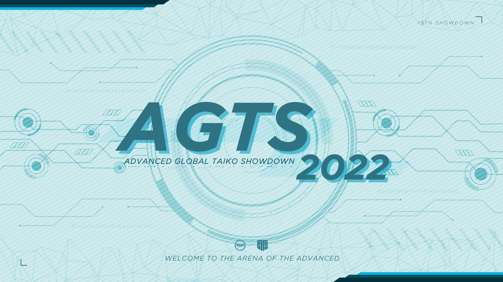
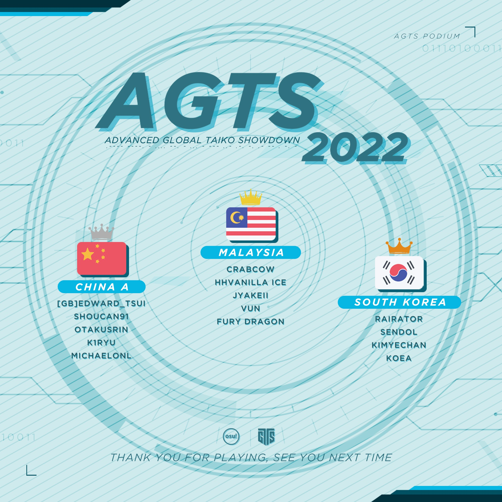

---
tags:
  - AGTS2022
  - AGTS
  - GTS
---

# Advanced Global Taiko Showdown 2022

The **Advanced Global Taiko Showdown 2022** (***AGTS 2022***) was a worldwide double-elimination osu!taiko tournament hosted by ::{ flag=EC }:: [Gamelan4](https://osu.ppy.sh/users/9856910), ::{ flag=FR }:: [Kasumi-sama](https://osu.ppy.sh/users/6177263), and ::{ flag=US }:: [Wadsy](https://osu.ppy.sh/users/2598555). Players ranked between #500 and #1,500 were able to participate. It was the fourth instalment of the Advanced Global Taiko Showdown and part of the Global Taiko Showdown series.

## Tournament schedule

| Event | Timestamp |
| --: | :-- |
| Registration phase | 2022-04-30/2022-05-15 |
| Screening phase | 2022-05-15/2022-05-22 |
| Qualifiers | 2022-05-28/2022-05-29 |
| Group Stage | 2022-06-04/2022-06-05 |
| Round of 16 | 2022-06-11/2022-06-12 |
| Quarterfinals | 2022-06-18/2022-06-19 |
| Semifinals | 2022-06-25/2022-06-26 |
| Finals | 2022-07-02/2022-07-03 |
| Grand Finals | 2022-07-09/2022-07-10 |

## Prizes

| Placing | Prize |
| :-: | :-- |
|  | Unique profile badge |

## Organisation

The Advanced Global Taiko Showdown 2022 was run by various community members.

| Position | Member(s) |
| :-- | :-- |
| Organiser | ::{ flag=EC }:: [Gamelan4](https://osu.ppy.sh/users/9856910), ::{ flag=FR }:: [Kasumi-sama](https://osu.ppy.sh/users/6177263), ::{ flag=US }:: [Wadsy](https://osu.ppy.sh/users/2598555) |
| Head mappooler | ::{ flag=DE }:: [Ak1o](https://osu.ppy.sh/users/1600041), ::{ flag=EC }:: [Gamelan4](https://osu.ppy.sh/users/9856910), ::{ flag=BR }:: [HiroK](https://osu.ppy.sh/users/4050738) |
| Mapper | ::{ flag=MY }:: [\[Zeth\]](https://osu.ppy.sh/users/9912966), ::{ flag=DE }:: [Ak1o](https://osu.ppy.sh/users/1600041), ::{ flag=MY }:: [cdh](https://osu.ppy.sh/users/2403621), ::{ flag=NL }:: [Cookie\_Tree](https://osu.ppy.sh/users/502722), ::{ flag=BR }:: [Foxeru](https://osu.ppy.sh/users/7479684), ::{ flag=EC }:: [Gamelan4](https://osu.ppy.sh/users/9856910), ::{ flag=BR }:: [HiroK](https://osu.ppy.sh/users/4050738), ::{ flag=TN }:: [Hivie](https://osu.ppy.sh/users/14102976), ::{ flag=AR }:: [Megafan](https://osu.ppy.sh/users/6632605), ::{ flag=DE }:: [Mew](https://osu.ppy.sh/users/2345156), ::{ flag=CN }:: [N a N a](https://osu.ppy.sh/users/11341131), ::{ flag=US }:: [SolaEclipse](https://osu.ppy.sh/users/6621158), ::{ flag=NO }:: [tama11](https://osu.ppy.sh/users/1109122), ::{ flag=US }:: [Yujki](https://osu.ppy.sh/users/14987094), ::{ flag=DE }:: [Zetera](https://osu.ppy.sh/users/587737) |
| Mappool showcase | ::{ flag=MY }:: [\[Zeth\]](https://osu.ppy.sh/users/9912966), ::{ flag=NL }:: [Boaz](https://osu.ppy.sh/users/13302996), ::{ flag=DE }:: [frz](https://osu.ppy.sh/users/6956922), ::{ flag=AR }:: [Megafan](https://osu.ppy.sh/users/6632605), ::{ flag=US }:: [Miniature Lamp](https://osu.ppy.sh/users/9821194), ::{ flag=CL }:: [Necromancy-](https://osu.ppy.sh/users/1890084), ::{ flag=US }:: [Wadsy](https://osu.ppy.sh/users/2598555) |
| Referee | ::{ flag=TW }:: [-Maruko-](https://osu.ppy.sh/users/16494567), ::{ flag=US }:: [\[K\]](https://osu.ppy.sh/users/16551387), ::{ flag=MY }:: [\[Zeth\]](https://osu.ppy.sh/users/9912966), ::{ flag=FR }:: [\_yosh](https://osu.ppy.sh/users/7157133), ::{ flag=FR }:: [Aidown](https://osu.ppy.sh/users/1522146), ::{ flag=HK }:: [Akali393394](https://osu.ppy.sh/users/9686628), ::{ flag=BE }:: [Brentywenty](https://osu.ppy.sh/users/22753946), ::{ flag=US }:: [JDrago14](https://osu.ppy.sh/users/7690078), ::{ flag=FR }:: [Kasumi-sama](https://osu.ppy.sh/users/6177263), ::{ flag=US }:: [Kinovia](https://osu.ppy.sh/users/10674189), ::{ flag=DE }:: [QEpicAce](https://osu.ppy.sh/users/9489153), ::{ flag=KR }:: [South Korea](https://osu.ppy.sh/users/12242622), ::{ flag=NL }:: [TaikoMom](https://osu.ppy.sh/users/9086438), ::{ flag=CN }:: [WonderMan](https://osu.ppy.sh/users/2221895) |
| Streamer | ::{ flag=HK }:: [-Storm7-](https://osu.ppy.sh/users/12248285), ::{ flag=US }:: [Chupalika](https://osu.ppy.sh/users/1926383), ::{ flag=US }:: [ITotallyGetThat](https://osu.ppy.sh/users/8770622), ::{ flag=FR }:: [Kasumi-sama](https://osu.ppy.sh/users/6177263), ::{ flag=TH }:: [Kusuhara Yui](https://osu.ppy.sh/users/9582525), ::{ flag=IT }:: [LordEnder](https://osu.ppy.sh/users/4609767), ::{ flag=AU }:: [r1chyy](https://osu.ppy.sh/users/11499467), ::{ flag=US }:: [Rukairi](https://osu.ppy.sh/users/6642597), ::{ flag=NL }:: [TaikoMom](https://osu.ppy.sh/users/9086438) |
| Commentator | ::{ flag=US }:: [dopaminexd](https://osu.ppy.sh/users/7443807), ::{ flag=US }:: [driodx](https://osu.ppy.sh/users/9709548), ::{ flag=GB }:: [Ethereal\_Winter](https://osu.ppy.sh/users/9780417), ::{ flag=US }:: [ETHN](https://osu.ppy.sh/users/9536977), ::{ flag=US }:: [FrootLoopy542](https://osu.ppy.sh/users/5468461), ::{ flag=DE }:: [Joogs](https://osu.ppy.sh/users/8844167), ::{ flag=RU }:: [mekkimous](https://osu.ppy.sh/users/17381947), ::{ flag=GB }:: [My Angel Subaru](https://osu.ppy.sh/users/17797595), ::{ flag=GB }:: [overdahedge2014](https://osu.ppy.sh/users/9864847), ::{ flag=TW }:: [Polemo03](https://osu.ppy.sh/users/10726804), ::{ flag=US }:: [PorkIsGreat](https://osu.ppy.sh/users/10756322), ::{ flag=SE }:: [Raphalge](https://osu.ppy.sh/users/3918650), ::{ flag=US }:: [SlipperyPickle](https://osu.ppy.sh/users/11969691), ::{ flag=GB }:: [Teezel](https://osu.ppy.sh/users/7528639), ::{ flag=GB }:: [willowww](https://osu.ppy.sh/users/11406987), ::{ flag=HK }:: [YonGin](https://osu.ppy.sh/users/7109317), ::{ flag=US }:: [zachmanthethird](https://osu.ppy.sh/users/15048710) |
| Designer | ::{ flag=MY }:: [Jerry](https://osu.ppy.sh/users/605973) |
| Translator | ::{ flag=FR }:: [\_yosh](https://osu.ppy.sh/users/7157133), ::{ flag=EC }:: [Gamelan4](https://osu.ppy.sh/users/9856910), ::{ flag=DE }:: [Sayira](https://osu.ppy.sh/users/7253958), ::{ flag=NL }:: [TaikoMom](https://osu.ppy.sh/users/9086438) |
| Developer | ::{ flag=US }:: [Cychloryn](https://osu.ppy.sh/users/6921736), ::{ flag=FR }:: [ThePooN](https://osu.ppy.sh/users/718454) |
| Wiki editor | ::{ flag=ID }:: [fajar13k](https://osu.ppy.sh/users/7100002) |

## Links

- [Discussion thread](https://osu.ppy.sh/community/forums/topics/1567504)
- [GTS Discord server](https://discord.gg/3mGC3HB)
- [AGTS website](https://gtsosu.com/agts/home)
- Livestream
  - [GTSosu](https://www.twitch.tv/gtsosu)
  - [GTSosu\_b](https://www.twitch.tv/gtsosu_b)
- [Challonge bracket](https://challonge.com/AGTS2022)
- [Pick'em predictions website](https://pickem.hwc.hr/tournaments/85) hosted by ::{ flag=DE }:: [hallowatcher](https://osu.ppy.sh/users/1874761)

## Participants

|  | Team | Members |
| --: | :-- | :-- |
| ::{ flag=AR }:: ::{ flag=CR }:: | **Argentina/Costa Rica** | **[Auredios](https://osu.ppy.sh/users/14697193)**, [Hotman](https://osu.ppy.sh/users/7902082), [Ingrid10](https://osu.ppy.sh/users/9786011), [ZelLink](https://osu.ppy.sh/users/6752242) |
| ::{ flag=BR }:: | **Brazil** | **[Spicy Onion](https://osu.ppy.sh/users/11799110)**, [-Nozomi Tojo](https://osu.ppy.sh/users/8024582), [Ideal](https://osu.ppy.sh/users/3869519), [roko100789](https://osu.ppy.sh/users/3224958) |
| ::{ flag=CA }:: | **Canada** | **[6\_6](https://osu.ppy.sh/users/5207783)**, [Dizzayy](https://osu.ppy.sh/users/12014683), [Kyekai](https://osu.ppy.sh/users/10220162), [NeoAxel](https://osu.ppy.sh/users/6806934), [Player-](https://osu.ppy.sh/users/3724819) |
| ::{ flag=CL }:: | **Chile** | **[Escocyan](https://osu.ppy.sh/users/9057823)**, [-Capi-](https://osu.ppy.sh/users/4450549), [DaiKiu](https://osu.ppy.sh/users/4232665), [ghostpsp](https://osu.ppy.sh/users/17288302), [Shiny Froakie](https://osu.ppy.sh/users/6194830) |
| ::{ flag=CN }:: | **China A** | **[\[GB\]Edward\_Tsui](https://osu.ppy.sh/users/8609627)**, [k1ryu](https://osu.ppy.sh/users/17411618), [Michaelonl](https://osu.ppy.sh/users/12480076), [OtakusRin](https://osu.ppy.sh/users/3383404), [shoucan91](https://osu.ppy.sh/users/9383908) |
| ::{ flag=CN }:: | **China B** | **[antigen](https://osu.ppy.sh/users/10507557)**, [betairylia](https://osu.ppy.sh/users/1558839), [Flandre sca](https://osu.ppy.sh/users/10324309), [Lubei\_01](https://osu.ppy.sh/users/11692528), [Suisei\_Suki](https://osu.ppy.sh/users/16902173) |
| ::{ flag=CO }:: | **Colombia** | **[L1ght](https://osu.ppy.sh/users/9050875)**, [Animaxgame25](https://osu.ppy.sh/users/16898745), [Coffecito](https://osu.ppy.sh/users/18793276), [Hermite](https://osu.ppy.sh/users/7945286), [sti](https://osu.ppy.sh/users/1271807) |
| ::{ flag=FI }:: ::{ flag=LV }:: ::{ flag=PT }:: ::{ flag=VN }:: | **Finland/Latvia/Portugal/Vietnam** | **[davidminh0111](https://osu.ppy.sh/users/9623142)**, [Huntey](https://osu.ppy.sh/users/14451706), [Mazzuli500](https://osu.ppy.sh/users/10648818), [Rosa](https://osu.ppy.sh/users/7385703) |
| ::{ flag=FR }:: | **France A** | **[Briesmas](https://osu.ppy.sh/users/2865172)**, [BigNounours](https://osu.ppy.sh/users/11632258), [Chernobog](https://osu.ppy.sh/users/3317042), [Issuko](https://osu.ppy.sh/users/11447466), [Skama](https://osu.ppy.sh/users/4367742) |
| ::{ flag=FR }:: | **France B** | **[Gintoki8](https://osu.ppy.sh/users/2239411)**, [Acii\_](https://osu.ppy.sh/users/11253595), [ALISTAR033009](https://osu.ppy.sh/users/9819975), [Lougui](https://osu.ppy.sh/users/13766261), [omegaflo](https://osu.ppy.sh/users/83291) |
| ::{ flag=DE }:: | **Germany** | **[Sayira](https://osu.ppy.sh/users/7253958)**, [\[TaikoTori\]](https://osu.ppy.sh/users/1074143), [Emre1504](https://osu.ppy.sh/users/13392709), [Tolanorle](https://osu.ppy.sh/users/7329619), [xMrtn-](https://osu.ppy.sh/users/866297) |
| ::{ flag=HK }:: | **Hong Kong** | **[Brown918](https://osu.ppy.sh/users/9805760)**, [ilv\_Rem](https://osu.ppy.sh/users/7850538), [Tedward765](https://osu.ppy.sh/users/8942131) |
| ::{ flag=ID }:: | **Indonesia** | **[Niko-nyan](https://osu.ppy.sh/users/906991)**, [fajar13k](https://osu.ppy.sh/users/7100002), [Katdon\_donKat](https://osu.ppy.sh/users/8089664), [Servatory](https://osu.ppy.sh/users/4013317), [Veltlion](https://osu.ppy.sh/users/10999079) |
| ::{ flag=IT }:: | **Italy** | **[Arach](https://osu.ppy.sh/users/8512755)**, [Garda](https://osu.ppy.sh/users/8127849), [Kurotsuki37](https://osu.ppy.sh/users/11764134), [MINCHIA ANTONIO](https://osu.ppy.sh/users/10370310), [OMORI ANTONIO](https://osu.ppy.sh/users/6306704) |
| ::{ flag=JP }:: | **Japan A** | **[nuku0315](https://osu.ppy.sh/users/8772103)**, [BANkun](https://osu.ppy.sh/users/5707041), [Deli](https://osu.ppy.sh/users/13563794), [ItsDiamond](https://osu.ppy.sh/users/12611862), [Saikoro](https://osu.ppy.sh/users/741819) |
| ::{ flag=JP }:: | **Japan B** | **[teamoku](https://osu.ppy.sh/users/6290474)**, [a9uachan](https://osu.ppy.sh/users/14005209), [bottikun24](https://osu.ppy.sh/users/1904899), [DLsite](https://osu.ppy.sh/users/24629607) |
| ::{ flag=MY }:: | **Malaysia** | **[CrabCow](https://osu.ppy.sh/users/9755504)**, [Fury Dragon](https://osu.ppy.sh/users/6332530), [HHVanilla Ice](https://osu.ppy.sh/users/12803930), [JyaKeii](https://osu.ppy.sh/users/12086753), [vun](https://osu.ppy.sh/users/6932501) |
| ::{ flag=MX }:: | **Mexico** | **[Iojioji](https://osu.ppy.sh/users/1346121)**, [-Devo](https://osu.ppy.sh/users/7090541), [Awwy](https://osu.ppy.sh/users/4183406), [JunkyTrack](https://osu.ppy.sh/users/11720359), [xtrem3x](https://osu.ppy.sh/users/136385) |
| ::{ flag=NL }:: | **Netherlands** | **[Glukeose](https://osu.ppy.sh/users/12276279)**, [lukitsa124](https://osu.ppy.sh/users/8787678), [raider132](https://osu.ppy.sh/users/21058672), [wen294](https://osu.ppy.sh/users/2265974) |
| ::{ flag=NZ }:: ::{ flag=AU }:: | **New Zealand/Australia** | **[Blujae](https://osu.ppy.sh/users/10613885)**, [idk123456](https://osu.ppy.sh/users/18718856), [Zippywin](https://osu.ppy.sh/users/7269844) |
| ::{ flag=NO }:: | **Norway** | **[Mist31](https://osu.ppy.sh/users/18916920)**, [Loff](https://osu.ppy.sh/users/8947341), [Mills](https://osu.ppy.sh/users/7234023), [Planecakes](https://osu.ppy.sh/users/6936385), [Vendelicious](https://osu.ppy.sh/users/8818089) |
| ::{ flag=PH }:: | **Philippines** | **[qish](https://osu.ppy.sh/users/17050115)**, [DescriptiCringe](https://osu.ppy.sh/users/10882115), [Fynbi](https://osu.ppy.sh/users/2164993), [JoshEco4](https://osu.ppy.sh/users/18591473), [Rimazii](https://osu.ppy.sh/users/3831514) |
| ::{ flag=PL }:: | **Poland** | **[vethreal](https://osu.ppy.sh/users/12067316)**, [Akamileusz](https://osu.ppy.sh/users/6807238), [fafik99](https://osu.ppy.sh/users/1787011) |
| ::{ flag=RU }:: | **Russian Federation** | **[TwinT](https://osu.ppy.sh/users/9976154)**, [CrayZeei](https://osu.ppy.sh/users/10625447) |
| ::{ flag=SG }:: | **Singapore** | **[MattrexDark](https://osu.ppy.sh/users/7171110)**, [arcpotato](https://osu.ppy.sh/users/12842392), [dantoh000](https://osu.ppy.sh/users/11414361), [I luv loleez](https://osu.ppy.sh/users/18346655), [Lunasaa](https://osu.ppy.sh/users/3769280) |
| ::{ flag=KR }:: | **South Korea** | **[RaiRator](https://osu.ppy.sh/users/5054081)**, [kimyechan](https://osu.ppy.sh/users/10664451), [Koea](https://osu.ppy.sh/users/10269683), [sendol](https://osu.ppy.sh/users/4433058) |
| ::{ flag=ES }:: | **Spain** | **[Alsael](https://osu.ppy.sh/users/13938746)**, [Celoluna](https://osu.ppy.sh/users/14571758), [MantequillAlex](https://osu.ppy.sh/users/11499752), [OneBurstMan](https://osu.ppy.sh/users/5285438), [Penvoltio](https://osu.ppy.sh/users/8849448) |
| ::{ flag=TW }:: | **Taiwan A** | **[qoot8123](https://osu.ppy.sh/users/766371)**, [404 UrNotFound](https://osu.ppy.sh/users/2169329), [\[-ICHINO-\]](https://osu.ppy.sh/users/13643601), [hamocha](https://osu.ppy.sh/users/13547861), [ryan940618](https://osu.ppy.sh/users/8369908) |
| ::{ flag=TW }:: | **Taiwan B** | **[KaEDe1106](https://osu.ppy.sh/users/13122339)**, [0Ixcy0](https://osu.ppy.sh/users/15086387), [Hatsuse](https://osu.ppy.sh/users/697007), [rex0988476](https://osu.ppy.sh/users/11426995) |
| ::{ flag=GB }:: | **United Kingdom** | **[Moonwake](https://osu.ppy.sh/users/6657019)**, [Flan\_Fan](https://osu.ppy.sh/users/13780435) |
| ::{ flag=US }:: | **United States A** | **[ETHN](https://osu.ppy.sh/users/9536977)**, [-Schwarts](https://osu.ppy.sh/users/4673649), [\_Flamescion\_](https://osu.ppy.sh/users/17841784), [Chupalika](https://osu.ppy.sh/users/1926383), [driodx](https://osu.ppy.sh/users/9709548) |
| ::{ flag=US }:: | **United States B** | **[Skey](https://osu.ppy.sh/users/7718539)**, [Inigo](https://osu.ppy.sh/users/5592441), [KatK1](https://osu.ppy.sh/users/21203707), [MattyIce](https://osu.ppy.sh/users/21990398), [somert](https://osu.ppy.sh/users/11833538) |

## Groups

| Group | Top seed | High seed | Low seed | Unseeded |
| :-: | :-- | :-- | :-- | :-- |
| **A** | ::{ flag=CN }:: China A | ::{ flag=CN }:: China B | ::{ flag=SG }:: Singapore | ::{ flag=GB }:: United Kingdom |
| **B** | ::{ flag=KR }:: South Korea | ::{ flag=ES }:: Spain | ::{ flag=TW }:: Taiwan B | ::{ flag=NO }:: Norway |
| **C** | ::{ flag=TW }:: Taiwan A | ::{ flag=FR }:: France A | ::{ flag=AR }:: ::{ flag=CR }:: Argentina/Costa Rica | ::{ flag=CO }:: Colombia |
| **D** | ::{ flag=HK }:: Hong Kong | ::{ flag=FR }:: France B | ::{ flag=NL }:: Netherlands | ::{ flag=RU }:: Russian Federation |
| **E** | ::{ flag=DE }:: Germany | ::{ flag=NZ }:: ::{ flag=AU }:: New Zealand/Australia | ::{ flag=CL }:: Chile | ::{ flag=IT }:: Italy |
| **F** | ::{ flag=US }:: United States A | ::{ flag=FI }:: ::{ flag=LV }:: ::{ flag=PT }:: ::{ flag=VN }:: Finland/Latvia/Portugal/Vietnam | ::{ flag=JP }:: Japan B | ::{ flag=BR }:: Brazil |
| **G** | ::{ flag=MY }:: Malaysia | ::{ flag=ID }:: Indonesia | ::{ flag=MX }:: Mexico | ::{ flag=PL }:: Poland |
| **H** | ::{ flag=JP }:: Japan A | ::{ flag=CA }:: Canada | ::{ flag=PH }:: Philippines | ::{ flag=US }:: United States B |

## Podium

## Mappools

### Grand Finals

**[Download the mappack here! (81 MB)](https://mega.nz/file/ADFT1CrC#XTXN7nMEhtnpZDkoay_QLS87aT47PF_agKi6ljH9EIg)**

- NoMod
  1. [Amebre Kizami - ABSOLUTE ENGAZER (nananass) \[Oni+\]](https://osu.ppy.sh/beatmapsets/1768837#taiko/3623029)
  2. [Noah - Fall into oblivion (Ak1o) \[Inner Oni\]](https://osu.ppy.sh/beatmapsets/1373417#taiko/3689152)
  3. [DJ Mass MAD Izm\* - naughty girl@Queen's Palace (roufou) \[naughty mapper@Grand Finals\]](https://osu.ppy.sh/beatmapsets/1799287#taiko/3688518)
  4. [Fallujah - The Void Alone (Cookie\_Tree) \[Dreamless\]](https://osu.ppy.sh/beatmapsets/1798723#taiko/3687300)
  5. [Frums - Mu (\[Zeth\]) \[I\]](https://osu.ppy.sh/beatmapsets/1798916#taiko/3687785)
  6. [yuikonnu & ayaponzu\* - Okochama Sensou (SolaEclipse) \[Sola and Yujki do NOT get along! >:3\]](https://osu.ppy.sh/beatmapsets/1799654#taiko/3689398)
- Hidden
  1. [BEMANI Sound Team "U1 overground" - Parvati (roufou) \[Modern Mapping\]](https://osu.ppy.sh/beatmapsets/1799286#taiko/3688516)
  2. [Koronba - Iwashi ga Tsuchi kara Haete Kurunda (Gamelan4) \[Decay\]](https://osu.ppy.sh/beatmapsets/1799067#taiko/3688115)
- HardRock
  1. [Rainbowdragoneyes - The Rift (Mew104) \[Ura Oni\]](https://osu.ppy.sh/beatmapsets/445365#taiko/1489206)
  2. [ReoNa - Nai Nai Nightcore (KMYK\_) \[Sayonara\]](https://osu.ppy.sh/beatmapsets/1554041#taiko/3175010)
- DoubleTime
  1. [JOYRYDE - ON FIRE (vrnl) \[no 1/8\]](https://osu.ppy.sh/beatmapsets/1277258#taiko/2653648)
  2. [Aimer - ONE AND LAST (WTHBRO) \[Farewell\]](https://osu.ppy.sh/beatmapsets/1743804#taiko/3565088)
- FreeMod
  1. [katagiri - #2wise4u (Yuemiao) \[#1nn3r0n1 (AGTS edit)\]](https://osu.ppy.sh/beatmapsets/1733136#taiko/3685958)
  2. [kamome sano - Ganymede kamome mix (Ak1o) \[Inner Oni\]](https://osu.ppy.sh/beatmapsets/1799562#taiko/3689154)
  3. [Cansol - 1,2,3,4! (uone) \[Inner Oni\]](https://osu.ppy.sh/beatmapsets/1658671#taiko/3385691)
- Tiebreaker
  1. **[Dz'Xa - MV 5927 (Gamelan4) \[Hell Oni\]](https://osu.ppy.sh/beatmapsets/1799673#taiko/3689432)**

### Finals

**[Download the mappack here! (76 MB)](https://mega.nz/file/GbZkzLiL#NBTFlkQqzpT6N-Qf4B79PkFBlat95vLlhyEpo_oFZFo)**

- NoMod
  1. [tobato - Digital(ooooooop) Tattoo (7\_7) \[Taiko(oooooooo)\]](https://osu.ppy.sh/beatmapsets/921770#taiko/1924891)
  2. [I love you orchestra - Tenshin - Trigger ver. (woosungko) \[Hell Oni\]](https://osu.ppy.sh/beatmapsets/1310945#taiko/2717368)
  3. [Terminal 11 - Sparkle Downer (Xay) \[Sparkle Doni\]](https://osu.ppy.sh/beatmapsets/1128293#taiko/2357293)
  4. [UNDEAD CORPORATION - Nine (Ak1o) \[Inner Oni\]](https://osu.ppy.sh/beatmapsets/1794641#taiko/3678443)
  5. [cosMo@Bousou-P feat. Hatsune Miku - Yaminabe!!!! (ekumea1123) \[Oni!!!!\]](https://osu.ppy.sh/beatmapsets/1776750#taiko/3638609)
  6. [DarTokki - FutureRace (Mew) \[Racing Towards Infinity\]](https://osu.ppy.sh/beatmapsets/1794798#taiko/3678755)
- Hidden
  1. [Jun Kuroda - Cybernetics (sendol) \[Inner Oni\]](https://osu.ppy.sh/beatmapsets/1757585#taiko/3596914)
  2. [Collapsed Plug - Acceleration Insanity (Miyoi) \[Inner Oni\]](https://osu.ppy.sh/beatmapsets/1716645#taiko/3528897)
- HardRock
  1. [siromaru + cranky - Conflict (Lyawi) \[Zetera's Inner Oni\]](https://osu.ppy.sh/beatmapsets/810875#taiko/1701155)
  2. [USAO, Camellia - Mobius (HiroK) \[Inner Oni\]](https://osu.ppy.sh/beatmapsets/1794632#taiko/3678426)
- DoubleTime
  1. [23.exe - YY (cdh) \[Sunshine\]](https://osu.ppy.sh/beatmapsets/1794158#taiko/3677103)
  2. [ginkiha x Hommarju x t+pazolite - CROSSING DELTA (Faputa) \[ONI\]](https://osu.ppy.sh/beatmapsets/1067200#taiko/2236448)
- FreeMod
  1. [Tenchio - skeleton (Lettuce ver.) (skolodojko) \[Inner Oni\]](https://osu.ppy.sh/beatmapsets/1709635#taiko/3493439)
  2. [DWMw - Shirayama Hime no Kami (Zetera) \[Royal Judgement\]](https://osu.ppy.sh/beatmapsets/1433788#taiko/2950655)
  3. [Cyte - Honey's Whip (Mew) \[Defragmentation\]](https://osu.ppy.sh/beatmapsets/1476477#taiko/3029543)
- Tiebreaker
  1. **[ReeK, roer & Rairiku - Kurwature 1869 (Hivie) \[The Kurwaverse (feat. KFC)\]](https://osu.ppy.sh/beatmapsets/1794825#taiko/3678817)**

### Semifinals

**[Download the mappack here! (78 MB)](https://mega.nz/file/zUpRHIwR#JBzY4kaOH7lTikfbRcXwf0ghhE3aULygrHteaRiRWUc)**

- NoMod
  1. [DJ Genki VS Higedriver feat. NU-KO - Hardcore de ikou! (N a N a) \[Nacore\]](https://osu.ppy.sh/beatmapsets/1789170#taiko/3665999)
  2. [Kobaryo - Chocolate Lily (ikin5050) \[Ura Oni\]](https://osu.ppy.sh/beatmapsets/1586357#taiko/3273295)
  3. [wotoha - Lonerism (Cut Ver.) (tasuke912) \[Aloneness\]](https://osu.ppy.sh/beatmapsets/1739910#taiko/3556860)
  4. [DJ SHARPNEL - Marunouchi surviver (Arrival) \[AGTS SURVIVER\]](https://osu.ppy.sh/beatmapsets/1789169#taiko/3665996)
  5. [Tsukasa Kaminose - ruin of opals (KyouRekii87) \[Taiko-K\]](https://osu.ppy.sh/beatmapsets/1365762#taiko/2825016)
  6. [Hommarju - Jungle Eater (Yujki) \[Special Oni\]](https://osu.ppy.sh/beatmapsets/1789211#taiko/3666091)
- Hidden
  1. [Tsumiki x Miyashita Yuu - CERCA/ESOTERICA (nananass) \[Oni\]](https://osu.ppy.sh/beatmapsets/1756062#taiko/3593676)
  2. [schnozz - they asked me how we got here, i told them "sir, this is an arby's" (KawaiiBass) \[...\]](https://osu.ppy.sh/beatmapsets/1755187#taiko/3591827)
- HardRock
  1. [EmoCosine - Cutter (Boaz) \[arc's Inner Oni\]](https://osu.ppy.sh/beatmapsets/1734692#taiko/3553342)
  2. [seatrus - Stargaze Station (sendol) \[Inner Oni\]](https://osu.ppy.sh/beatmapsets/1781965#taiko/3649198)
- DoubleTime
  1. [ARM - Water Lily (tasuke912) \[_Rise's Oni\]](https://osu.ppy.sh/beatmapsets/1590156#taiko/3272419)
  2. [Araki & nqrse - Taiyoukei Disco (un-plugged) \[Collab Oni\]](https://osu.ppy.sh/beatmapsets/668047#taiko/1415748)
- FreeMod
  1. [Koiwai Kotori, Saito Yuka, Ito Miku, Kahara Yu, Machico - Do the IDOL!! \~Dangai Zeppeki Chupacabra\~ (komasy) \[Chupacabra!!\]](https://osu.ppy.sh/beatmapsets/1180900#taiko/2462315)
  2. [Snail's House - Zenith (tama11) \[Ura Oni\]](https://osu.ppy.sh/beatmapsets/1789214#taiko/3666101)
  3. [tachyon - faster than light (ler1211) \[3.0x10^8\]](https://osu.ppy.sh/beatmapsets/1748152#taiko/3575755)
- Tiebreaker
  1. **[Cyte - Melty Loud Nightcore (Expansion Kit) (paz08) \[Lin\]](https://osu.ppy.sh/beatmapsets/1738726#taiko/3553680)**

### Quarterfinals

**[Download the mappack here! (91 MB)](https://mega.nz/file/OGx3hLKA#_Dys144AvqEHubzd-em1hEo938VPSjyoVBAXuBKDLzs)**

- NoMod
  1. [katagiri - Buta Musou (sendol) \[Inner Oni\]](https://osu.ppy.sh/beatmapsets/1698956#taiko/3471470)
  2. [BEMANI Sound Team "HuMeR" feat. Fernweh - Sakazuki (paz08) \[Inner Oni\]](https://osu.ppy.sh/beatmapsets/1716821#taiko/3508306)
  3. [EMILIA (CV: Rie Takahashi) - Stay Alive - TEKINA Remix (uone) \[Inner Oni\]](https://osu.ppy.sh/beatmapsets/836071#taiko/1750935)
  4. [Aine - Phantago (Megafan) \[fanta goes\]](https://osu.ppy.sh/beatmapsets/1410956#taiko/3654825)
  5. [leroy - dyed my hair black (Genjuro) \['-'\]](https://osu.ppy.sh/beatmapsets/1507426#taiko/3087420)
- Hidden
  1. [Golden City Factory - Stirring an Autumn Moon ~ Mooned Insect (Ak1o) \[Midnight Oni\]](https://osu.ppy.sh/beatmapsets/1784547#taiko/3654807)
  2. [Kairiki Bear feat. Meika Mikoto - Unhell(Sped Up ver.) (KTYN) \[Shameful life\]](https://osu.ppy.sh/beatmapsets/1584601#taiko/3236820)
- HardRock
  1. [Laur - L'Ultima Cena (Necromancy-) \[Inner Oni (GTS edit)\]](https://osu.ppy.sh/beatmapsets/1784536#taiko/3654790)
  2. [Renard - The Club (Nishizumi) \[Inner Oni\]](https://osu.ppy.sh/beatmapsets/1665894#taiko/3401153)
- DoubleTime
  1. [ROTTENGRAFFTY - "70cm Shihou no Madobe" (Miyoi) \[Oni\]](https://osu.ppy.sh/beatmapsets/1749607#taiko/3579310)
  2. [loos - Koi Yomi Zakura (Full size) (N a N a) \[GTS edit.\]](https://osu.ppy.sh/beatmapsets/1488323#taiko/3654765)
- FreeMod
  1. [ARForest - Hidden Ending (Fynbi) \[True Ending (GTS edit)\]](https://osu.ppy.sh/beatmapsets/1341980#taiko/3653945)
  2. [Mitsukiyo - Rolling Beat (\[Zeth\]) \[Recursion\]](https://osu.ppy.sh/beatmapsets/1751055#taiko/3582379)
  3. [MYUKKE. - AKKERA-COUNTRY-BOY (Antti) \[COLORFUL-INNER-ONI\]](https://osu.ppy.sh/beatmapsets/1584690#taiko/3236997)
- Tiebreaker
  1. **[Camellia - Burning Aquamarine (Ph0eNiiXZ) \[Ragnarok\]](https://osu.ppy.sh/beatmapsets/1672844#taiko/3417142)**

### Round of 16

**[Download the mappack here! (97 MB)](https://mega.nz/file/iQ5WTIhC#BuExWIBzRFzDc7AmHXO_SxLhlHWdfIkGeLE93rUBS7M)**

- NoMod
  1. [Dainippon Vocaloid Teikoku - SupiriCATS(FAIZ BOOTLEG) (7\_7) \[Meow\]](https://osu.ppy.sh/beatmapsets/1176310#taiko/2453493)
  2. [Amehurashi - complex syndrome (gaston\_2199) \[Inner Oni\]](https://osu.ppy.sh/beatmapsets/1716806#taiko/3508278)
  3. [Avans - All In (Megafan) \[pog sheesh based\]](https://osu.ppy.sh/beatmapsets/1778768#taiko/3642958)
  4. [Starkill - Fly With Me (Cookie\_Tree) \[Into the Lights Ahead\]](https://osu.ppy.sh/beatmapsets/1779405#taiko/3644190)
  5. [METAROOM - S.N.U.F.F.Y (HiroK) \[eae\]](https://osu.ppy.sh/beatmapsets/1778762#taiko/3642951)
- Hidden
  1. [penoreri - Sulfur (N a N a) \[Inner Oni\]](https://osu.ppy.sh/beatmapsets/1779423#taiko/3644223)
  2. [technoplanet - Boys O'Clock (tama11) \[Oni\]](https://osu.ppy.sh/beatmapsets/1779419#taiko/3644219)
- HardRock
  1. [pm04034 - Teclitas Locas (juanilp4evr) \[pianitox\]](https://osu.ppy.sh/beatmapsets/1254210#taiko/2606452)
  2. [xi - Titania (\_Vex) \[HiroK's Inner Oni\]](https://osu.ppy.sh/beatmapsets/1350545#taiko/2953551)
- DoubleTime
  1. [Celldweller - The Best It's Gonna Get (Zetera) \[My Perfect World\]](https://osu.ppy.sh/beatmapsets/1779180#taiko/3643747)
  2. [BAND-MAID - Blooming (Servatory) \[Volta's Oni\]](https://osu.ppy.sh/beatmapsets/1752310#taiko/3591840)
- FreeMod
  1. [THE ROOF - cry about it (tama11) \[Derealization\]](https://osu.ppy.sh/beatmapsets/1679103#taiko/3430434)
  2. [+TEK - Blinded (Ak1o) \[Oni GTS\]](https://osu.ppy.sh/beatmapsets/1779422#taiko/3644222)
  3. [Lolica Tonica - Luv Charm (KIKYO MONDAI Remix) (uone) \[Inner Oni\]](https://osu.ppy.sh/beatmapsets/984189#taiko/2059345)
- Tiebreaker
  1. **[Reek - Okashi Rave Party (ft. L4hee) (HEKUSODASU) \[KUSOni for AGTS2022\]](https://osu.ppy.sh/beatmapsets/1626926#taiko/3642828)**

### Group Stage

**[Download the mappack here! (73 MB)](https://mega.nz/file/uUQGSQpK#1ELmgS6eRrHPzto44A0S6AHcPs2XGOzSFIcC726W9us)**

- NoMod
  1. [DECO\*27 - Dilemma feat. Hatsune Miku (TKS) \[Inner Oni\]](https://osu.ppy.sh/beatmapsets/1723776#taiko/3522924)
  2. [Kayuki - shingoku baku sakura (Ak1o) \[Oni\]](https://osu.ppy.sh/beatmapsets/1774275#taiko/3632845)
  3. [City Niigata - Ebicha no Shashinki (N a N a) \[Oni\]](https://osu.ppy.sh/beatmapsets/1774297#taiko/3632899)
  4. [M2U - Queen Bee (Quorum) \[Inner Oni\]](https://osu.ppy.sh/beatmapsets/1617586#taiko/3302682)
- Hidden
  1. [miComet - Animal (Maimaing) \[Business Friend\]](https://osu.ppy.sh/beatmapsets/1684699#taiko/3442203)
  2. [CK - Arca refleT (N a N a) \[Oni(GTS ver.)\]](https://osu.ppy.sh/beatmapsets/1774290#taiko/3632880)
- HardRock
  1. [Power Of Nature - BabeL \~Next Story\~ (uone) \[Oni\]](https://osu.ppy.sh/beatmapsets/699595#taiko/1481393)
  2. [tricot - Mitete (Genjuro) \[Inner Oni\]](https://osu.ppy.sh/beatmapsets/1686901#taiko/3448035)
- DoubleTime
  1. [inabakumori - Post Shelter (Gamelan4) \[Correspondence\]](https://osu.ppy.sh/beatmapsets/1774374#taiko/3633093)
  2. [TJ Davis - Super Sonic Racing (Hivie) \[Lite Oni\]](https://osu.ppy.sh/beatmapsets/1599585#taiko/3306373)
- FreeMod
  1. [sky\_delta vs Street - Load of the Ciel (Rokkea) \[tasuke's Inner Oni\]](https://osu.ppy.sh/beatmapsets/340527#taiko/877854)
  2. [litmus\* as Ester - Krave (Extended Ver.) (davidminh0111) \[arc's Oni\]](https://osu.ppy.sh/beatmapsets/1656354#taiko/3380893)
  3. [Srav3R - Murasaki (Mew) \[Purple Promise\]](https://osu.ppy.sh/beatmapsets/1774117#taiko/3632561)
- Tiebreaker
  1. **[Ponkichi - Shironaga Star Jet (Seren58) \[Venus\]](https://osu.ppy.sh/beatmapsets/1620460#taiko/3308614)**

### Qualifiers

**[Download the mappack here! (44 MB)](https://mega.nz/file/mQQWTDgZ#6C9mdiY9IpgKJrzrJaHG6kvORqAJsov_ES0Zbhl3bRw)**

- NoMod
  1. [PassCode - PROJECTION (\_Rise) \[Inner Oni\]](https://osu.ppy.sh/beatmapsets/1577468#taiko/3221029)
  2. [pm04034 - sn4pside (Alchyr) \[inner?\]](https://osu.ppy.sh/beatmapsets/1755737#taiko/3592927)
  3. [MEMODEMO - SMACK 'em (Mew) \[Bonus Stage!\]](https://osu.ppy.sh/beatmapsets/1769450#taiko/3622154)
- Hidden
  1. [Feryquitous - I can avoid it.#owo (\_DUSK\_) \[#inner oni\]](https://osu.ppy.sh/beatmapsets/1363824#taiko/2821419)
  2. [cosMo@BousouP feat. Hatsune Miku - Machinegun Poem Doll (BlackBN) \[Inner Oni\]](https://osu.ppy.sh/beatmapsets/1594775#taiko/3344097)
- HardRock
  1. [void - Caelumize (Zetera) \[Astral Oni\]](https://osu.ppy.sh/beatmapsets/995374#taiko/2082223)
  2. [An - LittleGameStar (Eyenine) \[InnerOni\]](https://osu.ppy.sh/beatmapsets/1180657#taiko/2461856)
- DoubleTime
  1. [PinocchioP x Hihumi - SAKURA TATTOO (KaEDe1106) \[Oni\]](https://osu.ppy.sh/beatmapsets/1603930#taiko/3275456)
- FreeMod
  1. [HiTECH NINJA - Medusa (HiroK) \[Inner Oni\]](https://osu.ppy.sh/beatmapsets/1768803#taiko/3620815)

## Match results

### Grand Finals

Saturday, 9 July 2022:

| Team 1 |  |  | Team 2 | Match link |
| --: | :-: | :-: | :-- | :-- |
| South Korea ::{ flag=KR }:: | 5 | **7** | ::{ flag=CN }:: **China A** | [#1](https://osu.ppy.sh/community/matches/102129008) |

Sunday, 10 July 2022:

| Team 1 |  |  | Team 2 | Match link |
| --: | :-: | :-: | :-- | :-- |
| **Malaysia** ::{ flag=MY }:: | **7** | 0 | ::{ flag=CN }:: China A | [#1](https://osu.ppy.sh/community/matches/102155242) |

### Finals

Saturday, 2 July 2022:

| Team 1 |  |  | Team 2 | Match link |
| --: | :-: | :-: | :-- | :-- |
| United States A ::{ flag=US }:: | 2 | **7** | ::{ flag=CN }:: **China A** | [#1](https://osu.ppy.sh/community/matches/101939062) |
| **Malaysia** ::{ flag=MY }:: | **7** | 6 | ::{ flag=KR }:: South Korea | [#1](https://osu.ppy.sh/community/matches/101947084) |
| Germany ::{ flag=DE }:: | -1 | **0** | ::{ flag=JP }:: **Japan A** | *win by default* |

Sunday, 3 July 2022:

| Team 1 |  |  | Team 2 | Match link |
| --: | :-: | :-: | :-- | :-- |
| Japan A ::{ flag=JP }:: | 6 | **7** | ::{ flag=CN }:: **China A** | [#1](https://osu.ppy.sh/community/matches/101974649) |

### Semifinals

Saturday, 25 June 2022:

| Team 1 |  |  | Team 2 | Match link |
| --: | :-: | :-: | :-- | :-- |
| **China A** ::{ flag=CN }:: | **7** | 0 | ::{ flag=FR }:: France A | [#1](https://osu.ppy.sh/community/matches/101760877) |
| Taiwan A ::{ flag=TW }:: | 6 | **7** | ::{ flag=ID }:: **Indonesia** | [#1](https://osu.ppy.sh/community/matches/101760833) |
| **Malaysia** ::{ flag=MY }:: | **0** | -1 | ::{ flag=DE }:: Germany | *win by default* |
| **Japan A** ::{ flag=JP }:: | **7** | 0 | ::{ flag=NL }:: Netherlands | [#1](https://osu.ppy.sh/community/matches/101762371) |
| **Hong Kong** ::{ flag=HK }:: | **7** | 5 | ::{ flag=ES }:: Spain | [#1](https://osu.ppy.sh/community/matches/101764008) |

Sunday, 26 June 2022:

| Team 1 |  |  | Team 2 | Match link |
| --: | :-: | :-: | :-- | :-- |
| **South Korea** ::{ flag=KR }:: | **7** | 3 | ::{ flag=US }:: United States A | [#1](https://osu.ppy.sh/community/matches/101779054) |
| Indonesia ::{ flag=ID }:: | 1 | **7** | ::{ flag=CN }:: **China A** | [#1](https://osu.ppy.sh/community/matches/101787613) |
| Hong Kong ::{ flag=HK }:: | 0 | **7** | ::{ flag=JP }:: **Japan A** | [#1](https://osu.ppy.sh/community/matches/101788699) |

### Quarterfinals

Saturday, 18 June 2022:

| Team 1 |  |  | Team 2 | Match link |
| --: | :-: | :-: | :-- | :-- |
| **Indonesia** ::{ flag=ID }:: | **6** | 5 | ::{ flag=CN }:: China B | [#1](https://osu.ppy.sh/community/matches/101567720) |
| Finland/Latvia/Portugal/Vietnam ::{ flag=FI }:: ::{ flag=LV }:: ::{ flag=PT }:: ::{ flag=VN }:: | 1 | **6** | ::{ flag=NL }:: **Netherlands** | [#1](https://osu.ppy.sh/community/matches/101573762) |
| Canada ::{ flag=CA }:: | 3 | **6** | ::{ flag=ES }:: **Spain** | [#1](https://osu.ppy.sh/community/matches/101578125) |

Sunday, 19 June 2022:

| Team 1 |  |  | Team 2 | Match link |
| --: | :-: | :-: | :-- | :-- |
| Hong Kong ::{ flag=HK }:: | 5 | **6** | ::{ flag=US }:: **United States A** | [#1](https://osu.ppy.sh/community/matches/101587596) |
| **South Korea** ::{ flag=KR }:: | **6** | 5 | ::{ flag=JP }:: Japan | [#1](https://osu.ppy.sh/community/matches/101595008) |
| New Zealand/Australia ::{ flag=NZ }:: ::{ flag=AU }:: | 2 | **6** | ::{ flag=FR }:: **France A** | [#1](https://osu.ppy.sh/community/matches/101597281) |
| China A ::{ flag=CN }:: | 3 | **6** | ::{ flag=MY }:: **Malaysia** | [#1](https://osu.ppy.sh/community/matches/101598532) |
| Taiwan A ::{ flag=TW }:: | 1 | **6** | ::{ flag=DE }:: **Germany** | [#1](https://osu.ppy.sh/community/matches/101598360) |

### Round of 16

Saturday, 11 June 2022:

| Team 1 |  |  | Team 2 | Match link |
| --: | :-: | :-: | :-- | :-- |
| **China A** ::{ flag=CN }:: | **6** | 4 | ::{ flag=CA }:: | [#1](https://osu.ppy.sh/community/matches/101365134) |
| **Malaysia** ::{ flag=MY }:: | **5** | 0 | ::{ flag=ES }:: | *forfeited* |

Sunday, 12 June 2022:

| Team 1 |  |  | Team 2 | Match link |
| --: | :-: | :-: | :-- | :-- |
| **South Korea** ::{ flag=KR }:: | **6** | 1 | ::{ flag=ID }:: Indonesia | [#1](https://osu.ppy.sh/community/matches/101402755) |
| **Hong Kong** ::{ flag=HK }:: | **6** | 3 | ::{ flag=NZ }:: ::{ flag=AU }:: New Zealand/Australia | [#1](https://osu.ppy.sh/community/matches/101402759) |
| **Japan A** ::{ flag=JP }:: | **6** | 0 | ::{ flag=CN }:: China B | [#1](https://osu.ppy.sh/community/matches/101406257) |
| **Germany** ::{ flag=DE }:: | **6** | 1 | ::{ flag=NL }:: Netherlands | [#1](https://osu.ppy.sh/community/matches/101406236) |
| **Taiwan A** ::{ flag=TW }:: | **6** | 2 | ::{ flag=FI }:: ::{ flag=LV }:: ::{ flag=PT }:: ::{ flag=VN }:: Finland/Latvia/Portugal/Vietnam | [#1](https://osu.ppy.sh/community/matches/101407497) |
| **United States A** ::{ flag=US }:: | **6** | 2 | ::{ flag=FR }:: France A | [#1](https://osu.ppy.sh/community/matches/101416927) |

### Group Stage

Saturday, 4 June 2022:

| Team 1 |  |  | Team 2 | Match link |
| --: | :-: | :-: | :-- | :-- |
| Argentina/Costa Rica ::{ flag=AR }:: ::{ flag=CR }:: | 0 | **5** | ::{ flag=TW }:: **Taiwan A** | [#1](https://osu.ppy.sh/community/matches/101167293) |
| **New Zealand/Australia** ::{ flag=NZ }:: ::{ flag=AU }:: | **5** | 1 | ::{ flag=CL }:: Chile | [#1](https://osu.ppy.sh/community/matches/101167301) |
| Brazil ::{ flag=BR }:: | 2 | **5** | ::{ flag=US }:: **United States A** | [#1](https://osu.ppy.sh/community/matches/101167320) |
| **Canada** ::{ flag=CA }:: | **5** | 2 | ::{ flag=PH }:: Philippines | [#1](https://osu.ppy.sh/community/matches/101169655) |
| Poland ::{ flag=PL }:: | -1 | **0** | ::{ flag=MY }:: **Malaysia** | *win by default* |
| Norway ::{ flag=NO }:: | 3 | **5** | ::{ flag=KR }:: **South Korea** | [#1](https://osu.ppy.sh/community/matches/101177891) |
| **China B** ::{ flag=CN }:: | **5** | 1 | ::{ flag=SG }:: Singapore | [#1](https://osu.ppy.sh/community/matches/101178919) |
| Taiwan B ::{ flag=TW }:: | 2 | **5** | ::{ flag=KR }:: **South Korea** | [#1](https://osu.ppy.sh/community/matches/101179593) |
| **Malaysia** ::{ flag=MY }:: | **5** | 2 | ::{ flag=ID }:: Indonesia | [#1](https://osu.ppy.sh/community/matches/101180339) |
| United Kingdom ::{ flag=GB }:: | -1 | **0** | ::{ flag=CN }:: **China A** | *win by default* |
| **South Korea** ::{ flag=KR }:: | **5** | 3 | ::{ flag=ES }:: Spain | [#1](https://osu.ppy.sh/community/matches/101181104) |
| **Singapore** ::{ flag=SG }:: | **5** | 2 | ::{ flag=GB }:: United Kingdom | [#1](https://osu.ppy.sh/community/matches/101181758) |
| Italy ::{ flag=IT }:: | 1 | **5** | ::{ flag=DE }:: **Germany** | [#1](https://osu.ppy.sh/community/matches/101181954) |
| France B ::{ flag=FR }:: | 3 | **5** | ::{ flag=NL }:: **Netherlands** | [#1](https://osu.ppy.sh/community/matches/101181524) |
| Russian Federation ::{ flag=RU }:: | -1 | **0** | ::{ flag=HK }:: **Hong Kong** | *win by default* |
| **Finland/Latvia/Portugal/Vietnam** ::{ flag=FI }:: ::{ flag=LV }:: ::{ flag=PT }:: ::{ flag=VN }:: | **5** | 2 | ::{ flag=JP }:: Japan B | [#1](https://osu.ppy.sh/community/matches/101184815) |
| Russian Federation ::{ flag=RU }:: | 0 | **5** | ::{ flag=FR }:: **France B** | [#1](https://osu.ppy.sh/community/matches/101186792) |

Sunday, 5 June 2022:

| Team 1 |  |  | Team 2 | Match link |
| --: | :-: | :-: | :-- | :-- |
| Argentina/Costa Rica ::{ flag=AR }:: ::{ flag=CR }:: | 2 | **5** | ::{ flag=CO }:: **Colombia** | [#1](https://osu.ppy.sh/community/matches/101197996) |
| Philippines ::{ flag=PH }:: | 4 | **5** | ::{ flag=US }:: **United States B** | [#1](https://osu.ppy.sh/community/matches/101199114) |
| **Indonesia** ::{ flag=ID }:: | **5** | 1 | ::{ flag=MX }:: Mexico | [#1](https://osu.ppy.sh/community/matches/101200275) |
| United States B ::{ flag=US }:: | 0 | **5** | ::{ flag=CA }:: **Canada** | [#1](https://osu.ppy.sh/community/matches/101201225) |
| Japan B ::{ flag=JP }:: | 0 | **5** | ::{ flag=US }:: **United States A** | [#1](https://osu.ppy.sh/community/matches/101202534) |
| Mexico ::{ flag=MX }:: | 4 | **5** | ::{ flag=MY }:: **Malaysia** | [#1](https://osu.ppy.sh/community/matches/101202701) |
| **Hong Kong** ::{ flag=HK }:: | **5** | 2 | ::{ flag=FR }:: France B | [#1](https://osu.ppy.sh/community/matches/101207596) |
| Singapore ::{ flag=SG }:: | 2 | **5** | ::{ flag=CN }:: **China A** | [#1](https://osu.ppy.sh/community/matches/101207540) |
| Italy ::{ flag=IT }:: | 2 | **5** | ::{ flag=NZ }:: ::{ flag=AU }:: **New Zealand/Australia** | [#1](https://osu.ppy.sh/community/matches/101207716) |
| Poland ::{ flag=PL }:: | -1 | **0** | ::{ flag=ID }:: **Indonesia** | *win by default* |
| **Germany** ::{ flag=DE }:: | **5** | 3 | ::{ flag=NZ }:: ::{ flag=AU }:: New Zealand/Australia | [#1](https://osu.ppy.sh/community/matches/101208676) |
| **Taiwan B** ::{ flag=TW }:: | **5** | 1 | ::{ flag=NO }:: Norway | [#1](https://osu.ppy.sh/community/matches/101210425) |
| United Kingdom ::{ flag=GB }:: | -1 | **0** | ::{ flag=CN }:: **China B** | *win by default* |
| Philippines ::{ flag=PH }:: | 1 | **5** | ::{ flag=JP }:: **Japan A** | [#1](https://osu.ppy.sh/community/matches/101210940) |
| **China A** ::{ flag=CN }:: | **5** | 1 | ::{ flag=CN }:: China B | [#1](https://osu.ppy.sh/community/matches/101212160) |
| **Spain** ::{ flag=ES }:: | **5** | 2 | ::{ flag=TW }:: Taiwan B | [#1](https://osu.ppy.sh/community/matches/101212306) |
| **Taiwan A** ::{ flag=TW }:: | **5** | 3 | ::{ flag=FR }:: France A | [#1](https://osu.ppy.sh/community/matches/101212139) |
| **Japan B** ::{ flag=JP }:: | **5** | 1 | ::{ flag=BR }:: Brazil | [#1](https://osu.ppy.sh/community/matches/101212315) |
| Netherlands ::{ flag=NL }:: | 0 | **5** | ::{ flag=HK }:: **Hong Kong** | [#1](https://osu.ppy.sh/community/matches/101213866) |
| Colombia ::{ flag=CO }:: | 0 | **5** | ::{ flag=TW }:: **Taiwan A** | [#1](https://osu.ppy.sh/community/matches/101214998) |
| Chile ::{ flag=CL }:: | 0 | **5** | ::{ flag=DE }:: **Germany** | [#1](https://osu.ppy.sh/community/matches/101215193) |
| **Norway** ::{ flag=NO }:: | **5** | 3 | ::{ flag=ES }:: Spain | [#1](https://osu.ppy.sh/community/matches/101216713) |
| Colombia ::{ flag=CO }:: | 0 | **5** | ::{ flag=FR }:: **France A** | [#1](https://osu.ppy.sh/community/matches/101216593) |
| **Japan A** ::{ flag=JP }:: | **5** | 0 | ::{ flag=CA }:: Canada | [#1](https://osu.ppy.sh/community/matches/101216718) |
| United States B ::{ flag=US }:: | 1 | **5** | ::{ flag=JP }:: **Japan A** | [#1](https://osu.ppy.sh/community/matches/101218267) |
| **Netherlands** ::{ flag=NL }:: | **5** | 1 | ::{ flag=RU }:: Russian Federation | [#1](https://osu.ppy.sh/community/matches/101219770) |
| Brazil ::{ flag=BR }:: | 2 | **5** | ::{ flag=FI }:: ::{ flag=LV }:: ::{ flag=PT }:: ::{ flag=VN }:: **Finland/Latvia/Portugal/Vietnam** | [#1](https://osu.ppy.sh/community/matches/101219773) |
| **Mexico** ::{ flag=MX }:: | **0** | -1 | ::{ flag=PL }:: Poland | *win by default* |
| **France A** ::{ flag=FR }:: | **0** | -1 | ::{ flag=AR }:: ::{ flag=CR }:: Argentina/Costa Rica | *win by default* |
| **United States A** ::{ flag=US }:: | **5** | 0 | ::{ flag=FI }:: ::{ flag=LV }:: ::{ flag=PT }:: ::{ flag=VN }:: Finland/Latvia/Portugal/Vietnam | [#1](https://osu.ppy.sh/community/matches/101222969) |
| Chile ::{ flag=CL }:: | 2 | **5** | ::{ flag=IT }:: **Italy** | [#1](https://osu.ppy.sh/community/matches/101223669) |

### Qualifiers

Detailed statistics for this round can be found [here](https://gtsosu.com/agts/stats#0) alongside the final standings on which teams made it through to the next stage.

## Ruleset

### General rules

1. This tournament is a **2v2 team tournament** with teams of **5 players maximum**.
2. The teams will first go through Qualifiers, then Group stage, then finally a double-elimination bracket.
3. The scoring system used will be **Score V2**.
4. Any player who meets the requirements stated in the [restrictions and registrations](#restrictions-and-registrations) section is allowed to sign up. Note that some players may be declined participation as part of tournament screening.
5. Any members of staff **apart from organisers, mappool selectors, and referees** are allowed to play.
6. Players and staff members must have read this ruleset entirely.
7. All participants must stay respectful and keep a proper attitude. Not following this rule can result in a ban/blacklist from the tournament. This rule concerns all staff members as well.
8. Any rule changes or unexpected occurrences will be announced in the Discord server.

### Restrictions and registrations

1. In order to participate, players need to be in the rank range of #500 – #1,500.
2. Players are not allowed to rank up further than #400 during the tournament. Passing this limit will result in disqualification.
3. Players must join the Discord server of the tournament to actually be counted as a player.
4. Players sign up individually. When their registration is accepted, they will get a player role with their respective country.
5. osu! staff can refuse players from participating in the tournament if their skill is deemed much higher than the targeted rank range.
6. Making 2 teams for a country is acceptable under following conditions:
   - There are **7 or more players** signed up for the country.
   - Each team has to have **at least 3 players**.
7. Following the previous rule, teams are otherwise assembled in the following way:
   - If there are 5 players or less signed up for a country, those players will form the team representing their country.
   - In case there are more than 10 players signed up for a country, players will decide among themselves who will partake in the tournament. If they cannot decide, the top 10 players by ranking will be chosen to form the 2 teams.
   - If there are 6 players, players will have to decide on the 5 players who will partake in the tournament. If they cannot decide, the top 5 players by ranking will be chosen to form the team.
   - If there are 7 to 10 players (after keeping the best-ranked ones) signed up for a country, the players from that country will have a few days to decide how to split themselves between the 2 teams. It is recommended to come to an agreement as fast as possible and decide on a captain to aid in scheduling.
   - In case the players cannot come to an agreement, they will put in 2 teams with at least 3 members in each in order of global ranking.
   - If the players cannot agree or find a captain, the highest-ranked player will be chosen.
8. It is recommended to come to an agreement as fast as possible to then decide on the captain and be able to schedule and prepare matches rapidly.
   - The players will decide on the captain of their team.
   - If players cannot agree or find a captain, the highest-ranked player will be chosen by default.
   - The captain is going to be the one to reschedule a match if needed and will ensure that all the team members are present for the matches.

### Stage regulations

1. There are seven stages in the tournament: the Qualifiers, the Group stage, the Round of 16, the Quarterfinals, the Semifinals, the Finals, and the Grand Finals.
2. Teams will be seeded with the average of their ranks on each map during the Qualifiers round in 4 seeds: Top seed, High seed, Low seed, and Unseeded.
3. Teams will be drawn in **8 groups of 4 teams** during live drawings which will happen on Sunday, 29 May 2022 (18:00 UTC).
4. In the Group stage, all the teams from each group will face each other. The **best 2 teams** advance from their groups.
5. Rankings of each group are determined by sorting the results of each team's performance in the following priority:
   1. Most matches won.
   2. Highest "score" (number of beatmaps won - number of maps lost).
   3. Most beatmaps won.
   4. Winner of the match played previously between the tied teams.
6. During the Group stage, winning 5:0 or having +1.0 score difference ratio will be considered a win by default.
7. Each stage has the following win conditions:
   - **Group Stage**: Best-of-9 (first to 5 points)
   - **Round of 16, and Quarterfinals**: Best-of-11 (first to 6 points)
   - **Semifinals, Finals, and Grand Finals**: Best-of-13 (first to 7 points)

### Qualifier regulations

1. During this round there will be multiple lobbies available at various hours.
2. A private match will be created and teams will be invited into the lobby when it is their time to play. Make sure to be online at this time.
3. There will be no warmups during this stage.
4. Failed scores will count.
5. Only two players from each team will be playing per map. There are no limitations on player swapping.
6. Seeding will be done with the average rank of each team on each map.
7. If two teams are tied, the team that has the highest combined score of their best runs across all maps will be seeded higher.
8. Maps will be played twice in a row during the lobby. The best run will be taken into account for the ranking.
9. Only the 32 best teams will continue on to the bracket stage.

### Mappool instructions

1. There will be one mappool for each stage.
2. The loser's bracket will play on the same pool as the winner's bracket of the same weekend.
3. The Qualifier pool will be different from all other rounds, as it will have a format of 3 NoMod maps, 2 Hidden maps, 2 HardRock maps, 1 DoubleTime map, and 1 FreeMod map.
4. Each mappool consists of 6 sections: **NoMod, Hidden, HardRock, DoubleTime, FreeMod, and Tiebreaker**.
5. The total maps per stage will be listed as follows:
   - The Group stage mappool will consist of 14 maps.
   - The Round of 16 and Quarterfinals mappools will consist of 15 maps.
   - The Semifinals, Finals and Grand Finals mappools will consist of 16 maps.
6. All stages will have 2 Hidden, HardRock, and DoubleTime maps, and 3 FreeMod maps.
7. The FreeMod pool is played with FreeMod activated. Every player may pick a combination of Hidden and HardRock, but at least one player from each team must have at least one mod activated.
8. Players cannot pick the same mod combination as their team member.
9. The size of the NoMod bracket will be 4 maps in Group Stage, 5 maps in Round of 16, and 6 maps for the rest of the stages.
10. The tiebreaker is played under FreeMod conditions, but it is not necessary to have a mod activated.
11. The mappool for each stage will be showcased a week beforehand.

### Scheduling instructions

1. Every stage will be held **during the weekend**. It is, however, allowed to schedule it on another day, if no good time is found during the weekend and a referee is available.
2. Matches are allowed to overlap if referees are available.
3. A best effort will be made to fit schedules with applicable timezones. The schedule for each stage will be released the weekend prior to it.
4. Reschedules will only be considered if both teams agree on a time. This needs to be done and notified to the tournament staff before **Thursday at 23:59 UTC** in the particular week when the match takes place.
5. Reschedules may only be requested **by the team captain**.

### Match regulations

1. A private lobby will be created 10 minutes before a referee starts the match. Both teams' captains will be invited into the room before match time, and the referee or the captains will invite the other players into the room.
2. If no staff or referee is available, the match will be postponed.
3. If less than the minimum required players attend, the maximum time the match can be postponed is **10 minutes**.
4. There is no penalty for not joining the room instantly at match time as long as it is within the postponed time.
5. If neither of both teams have the minimum required players after 10 minutes, it will count as a loss for both teams in Group stage. In the double-elimination bracket, the highest-seeded team will advance.
6. The match will be played with Team VS and Score v2, and the name of the room must be: `AGTS 2022: ({Team Red}) vs ({Team Blue})`.
7. Each team is allowed one warmup but it must be **below 3 minutes**, and must be sent to the GTS website up to one hour prior to the match's start time. Teams will be allowed to send warmups starting from the first day new schedule has been released. Otherwise, the team will have no warmups.
8. Submitting a warmup less than one hour prior to the match will result in no warmup.
9. Each captain has to ban **one beatmap** from the pool (apart from tiebreaker). These beatmaps are not allowed to be picked by any team in the entire match.
10. The captain of each team will roll with the `!roll` command in the chat.
11. The team with the highest roll **bans second and picks first**. The team with the lowest roll **bans first and picks second**.
12. Each captain has 2 minutes to announce their ban. If they do not tell the referee by that time, the ban will be made with a `!roll`.
13. Beatmap selection will then alternate between each captain selecting a beatmap out of the mappool.
14. Captains may pick freely from any bracket.
15. Teams will have 2 minutes to pick a beatmap and 2 minutes to get ready. If a team does not pick before the end of the timer, the map will be picked with a `!roll`.
16. Exchanging players during a match is allowed without limitations.
17. If a player disconnects between beatmaps and the team cannot provide a substitute, the match can be delayed 10 minutes at most. This delay can only be applied once.
18. Disconnections are treated as failing the map.
19. A beatmap can be replayed upon a disconnection that happened within 30 seconds of starting. This is only allowed once per team.
20. Failed players' scores do get added to the team score.
21. If the beatmap ends in a draw, the game will be nullified and the map will be replayed.
22. In case of a tie in points (example: 4-4 in BO9) the tiebreaker is selected.
