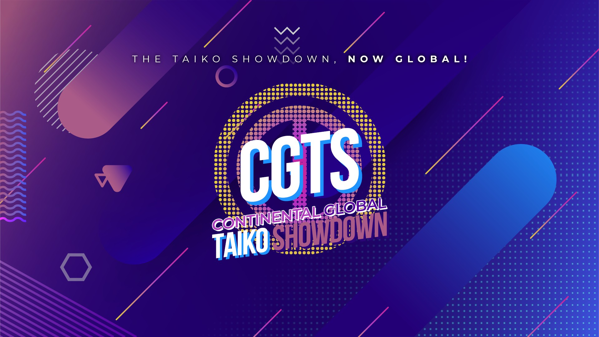

---
tags:
  - CGTS 2019
  - CGTS
  - GTS
---

# Continental Global Taiko Showdown 2019

The **Continental Global Taiko Showdown 2019** (***CGTS 2019***) was a worldwide double-elimination osu!taiko tournament hosted by ![][flag_FR] [Kasumii-sama](https://osu.ppy.sh/users/6177263) and ![][flag_FR] [TLQ\_Yoshii](https://osu.ppy.sh/users/7157133). The tournament had a regional phase and a global phase: the regional phase was a 1v1 bracket to find the best players in each continent, and the global phase was a 4v4 bracket where the top players from each continent faced each other. This was the first installment of the Continental Global Taiko Showdown and part of the Global Taiko Showdown series.

## Tournament schedule

### Regional phase

| Event | Timestamp |
| --: | :-- |
| Registration phase | 2019-09-14/2019-10-20 |
| Live drawings | 2019-10-27 (13:00 UTC) |
| Qualifiers | 2019-11-02/2019-11-03 |
| Round of 32 | 2019-11-09/2019-11-10 |
| Round of 16 | 2019-11-15/2019-11-17 |
| Quarterfinals | 2019-11-23/2019-11-24 |
| Semifinals | 2019-11-30/2019-12-01 |
| Finals | 2019-12-07/2019-09-08 |
| Grand Finals | 2019-12-14 |

### Global phase

| Event | Timestamp |
| --: | :-- |
| Qualifiers | 2020-01-04/2020-01-05 |
| Semifinals | 2020-01-11/2020-01-12 |
| Finals | 2020-01-19 |
| Grand Finals | 2020-02-02 |

## Prizes

### Global

| Placing | Prize(s) |
| :-: | :-- |
|  | Unique profile badge for each team member, US$32 or 1 year and 2 months of osu!supporter tag for each player, exclusive team banner |
|  | US$12 or 4 months of osu!supporter tag for each player, exclusive team banner |
|  | US$8 or 2 months of osu!supporter tag for each player, exclusive team banner |

### Regional

| Placing | Prize(s) |
| :-: | :-- |
|  | US$16 or 6 months of osu!supporter tag, exclusive 1st place banner |
|  | US$12 or 4 months of osu!supporter tag, exclusive 2nd place banner |
|  | US$8 or 2 months of osu!supporter tag, exclusive 3rd place banner |

## Organisation

The Continental Global Taiko Showdown 2019 was run by various community members.

| Position | Member(s) |
| :-- | :-- |
| Organiser | ![][flag_FR] [Kasumii-sama](https://osu.ppy.sh/users/6177263), ![][flag_FR] [Purettsu Eru](https://osu.ppy.sh/users/1542565), ![][flag_FR] [TLQ\_Yoshii](https://osu.ppy.sh/users/7157133) |
| Map selector | ![][flag_JP] [\_Rise](https://osu.ppy.sh/users/5217107), ![][flag_PT] [BabySnakes](https://osu.ppy.sh/users/4669728), ![][flag_AU] [Drum Decimator](https://osu.ppy.sh/users/4841352), ![][flag_FR] [Nofool](https://osu.ppy.sh/users/672430) |
| Referee | ![][flag_HK] [Akali393394](https://osu.ppy.sh/users/9686628), ![][flag_BR] [AnonX32](https://osu.ppy.sh/users/2730270), ![][flag_FR] [Apsuko](https://osu.ppy.sh/users/9313135), ![][flag_DE] [Capu](https://osu.ppy.sh/users/2474015), ![][flag_US] [Cindelluna](https://osu.ppy.sh/users/3039847), ![][flag_MA] [clorox\_1g](https://osu.ppy.sh/users/9702728), ![][flag_DE] [GDLenny](https://osu.ppy.sh/users/8406711), ![][flag_CH] [Icerite](https://osu.ppy.sh/users/7226287), ![][flag_AU] [ill onion](https://osu.ppy.sh/users/8306102), ![][flag_US] [JDrago14](https://osu.ppy.sh/users/7690078), ![][flag_NL] [Krekker](https://osu.ppy.sh/users/8265940), ![][flag_FR] [Ladylag](https://osu.ppy.sh/users/2812098), ![][flag_FR] [Mimir](https://osu.ppy.sh/users/7382734), ![][flag_DE] [QEpicAce](https://osu.ppy.sh/users/9489153), ![][flag_FR] [Rougoku](https://osu.ppy.sh/users/6900166), ![][flag_FR] [Ryumi](https://osu.ppy.sh/users/6596270), ![][flag_FR] [Satsukel](https://osu.ppy.sh/users/9066390), ![][flag_DE] [Sayira](https://osu.ppy.sh/users/7253958), ![][flag_RU] [Starger](https://osu.ppy.sh/users/3398715), ![][flag_MY] [Stupid Idiot](https://osu.ppy.sh/users/8355574), ![][flag_FR] [ThePooN](https://osu.ppy.sh/users/718454), ![][flag_FR] [TLQ\_Yoshii](https://osu.ppy.sh/users/7157133), ![][flag_SG] [uchuuj1n](https://osu.ppy.sh/users/9140302) |
| Streamer | ![][flag_BR] [AnonX32](https://osu.ppy.sh/users/2730270), ![][flag_MY] [Bedwyr Aorta](https://osu.ppy.sh/users/10875855), ![][flag_US] [cheese salad](https://osu.ppy.sh/users/6349821), ![][flag_PL] [Deroo](https://osu.ppy.sh/users/8360475), ![][flag_FR] [FulgurentKille](https://osu.ppy.sh/users/4096322), ![][flag_US] [ITotallyGetThat](https://osu.ppy.sh/users/8770622), ![][flag_FR] [Mimir](https://osu.ppy.sh/users/7382734), ![][flag_NL] [oliebol](https://osu.ppy.sh/users/2756335), ![][flag_FR] [Purettsu Eru](https://osu.ppy.sh/users/1542565), ![][flag_DE] [Sayira](https://osu.ppy.sh/users/7253958) |
| Commentator | ![][flag_BR] [AnonX32](https://osu.ppy.sh/users/2730270), ![][flag_DE] [Ak1o](https://osu.ppy.sh/users/1600041), ![][flag_AU] [AmateurMonkeyYT](https://osu.ppy.sh/users/8379046), ![][flag_US] [Bauregaurd](https://osu.ppy.sh/users/2598555), ![][flag_AU] [Beat43210](https://osu.ppy.sh/users/5664171), ![][flag_US] [Binsu](https://osu.ppy.sh/users/6236911), ![][flag_US] [CaptainEChan](https://osu.ppy.sh/users/9536977), ![][flag_CL] [Catulus](https://osu.ppy.sh/users/6276709), ![][flag_PL] [Deroo](https://osu.ppy.sh/users/8360475), ![][flag_DE] [Drecksackblase](https://osu.ppy.sh/users/6278008), ![][flag_US] [Edgar\_Figaro](https://osu.ppy.sh/users/6508754), ![][flag_EC] [Gamelan4](https://osu.ppy.sh/users/9856910), ![][flag_DE] [Heam](https://osu.ppy.sh/users/4705120), ![][flag_CA] [janitoreihil](https://osu.ppy.sh/users/3307897), ![][flag_AU] [Drum Decimator](https://osu.ppy.sh/users/4841352), ![][flag_US] [kb131313](https://osu.ppy.sh/users/11229259), ![][flag_CA] [mangomizer](https://osu.ppy.sh/users/1893718), ![][flag_DE] [Mew](https://osu.ppy.sh/users/2345156), ![][flag_DE] [QEpicAce](https://osu.ppy.sh/users/9489153), ![][flag_SE] [Raphalge](https://osu.ppy.sh/users/3918650), ![][flag_DE] [Sayira](https://osu.ppy.sh/users/7253958), ![][flag_NZ] [Sparxe](https://osu.ppy.sh/users/5750235), ![][flag_GB] [Teezel](https://osu.ppy.sh/users/7528639), ![][flag_DE] [Zetera](https://osu.ppy.sh/users/587737) |
| Designer | ![][flag_ID] [fajar13k](https://osu.ppy.sh/users/7100002), ![][flag_PH] [OsuMe65](https://osu.ppy.sh/users/852867), ![][flag_KR] [POCARI SWEAT](https://osu.ppy.sh/users/5082685) |
| Statistician | ![][flag_PL] [Acrith](https://osu.ppy.sh/users/389880), ![][flag_SG] [youi](https://osu.ppy.sh/users/7537133) |
| Translator | ![][flag_BR] [AnonX32](https://osu.ppy.sh/users/2730270), ![][flag_EC] [Gamelan4](https://osu.ppy.sh/users/9856910), ![][flag_KR] [Jakads](https://osu.ppy.sh/users/259972), ![][flag_JP] [katatakatata](https://osu.ppy.sh/users/3540294), ![][flag_NO] [Mills](https://osu.ppy.sh/users/7234023), ![][flag_RU] [Starger](https://osu.ppy.sh/users/3398715), ![][flag_HK] [tkdLolly](https://osu.ppy.sh/users/9035344), ![][flag_FR] [TLQ\_Yoshii](https://osu.ppy.sh/users/7157133) |
| Developer | ![][flag_FR] [ThePooN](https://osu.ppy.sh/users/718454) |
| Wiki editor | ![][flag_ID] [fajar13k](https://osu.ppy.sh/users/7100002) |

## Links

- [Discussion thread](https://osu.ppy.sh/community/forums/topics/960704)
- [GTS Discord server](https://discord.gg/3mGC3HBH)
- [GTS website](https://gtsosu.com/)
- [Livestream](https://www.twitch.tv/gtsosu)
- Challonge brackets
  - [Global phase](https://challonge.com/CGTS4v4)
  - [Asia](https://challonge.com/CGTSAsia)
  - [Europe](https://challonge.com/CGTSEurope)
  - [North America](https://challonge.com/CGTSNA)
  - [Oceania/South East Asia](https://challonge.com/CGTSOSEA)
  - [South America](https://challonge.com/CGTSSA)
- **[Statistics sheet](https://docs.google.com/spreadsheets/d/1TI489-a5T_H8gpOjoryV4jYFa4awsKFAreUav3vYXKE/edit)**

## Participants

### Global

| Continent | Members |
| :-- | :-- |
| Asia | ![][flag_JP] [uone](https://osu.ppy.sh/users/5321719), ![][flag_JP] [iceOC](https://osu.ppy.sh/users/5482401), ![][flag_JP] [asuasu\_yura](https://osu.ppy.sh/users/2875968), ![][flag_KR] [Konpaku Sariel](https://osu.ppy.sh/users/533502), ![][flag_TR] [frukoyurdakul](https://osu.ppy.sh/users/7612550), ![][flag_KR] [Laby](https://osu.ppy.sh/users/9085164), ![][flag_JP] [butter0414](https://osu.ppy.sh/users/7935022), ![][flag_HK] [Faputa](https://osu.ppy.sh/users/845733) |
| Europe | ![][flag_GB] [goheegy](https://osu.ppy.sh/users/8057655), ![][flag_ES] [AlvaroYL](https://osu.ppy.sh/users/6333166), ![][flag_IT] [Ikkun](https://osu.ppy.sh/users/1059945), ![][flag_PL] [Acrith](https://osu.ppy.sh/users/389880), ![][flag_IT] [D3kuu](https://osu.ppy.sh/users/7807444), ![][flag_IT] [coed](https://osu.ppy.sh/users/3716665), ![][flag_FR] [BananaW](https://osu.ppy.sh/users/9298106), ![][flag_PL] [bernard351](https://osu.ppy.sh/users/9511518) |
| North America | ![][flag_CA] [janitoreihil](https://osu.ppy.sh/users/3307897), ![][flag_CA] [vladyushko](https://osu.ppy.sh/users/4908773), ![][flag_US] [cheese salad](https://osu.ppy.sh/users/6349821), ![][flag_US] [Whulf](https://osu.ppy.sh/users/11601107), ![][flag_US] [closed](https://osu.ppy.sh/users/5116922), ![][flag_US] [CaptainEChan](https://osu.ppy.sh/users/9536977), ![][flag_US] [R J](https://osu.ppy.sh/users/6490509), ![][flag_US] [3san](https://osu.ppy.sh/users/8050850) |
| Oceania/South East Asia | ![][flag_SG] [Blerargh](https://osu.ppy.sh/users/7609510), ![][flag_SG] [Element118](https://osu.ppy.sh/users/2283992), ![][flag_PH] [Pochacco](https://osu.ppy.sh/users/2927742), ![][flag_NZ] [Sparxe](https://osu.ppy.sh/users/5750235), ![][flag_MY] [growATMfarmz](https://osu.ppy.sh/users/12273160), ![][flag_AU] [Tsubasa2](https://osu.ppy.sh/users/6835183), ![][flag_ID] [apaajaboleh10](https://osu.ppy.sh/users/5151647), ![][flag_MY] [\[Zeth\]](https://osu.ppy.sh/users/9912966) |
| South America | ![][flag_CL] [Ulqui](https://osu.ppy.sh/users/1263669), ![][flag_CL] [Alepat](https://osu.ppy.sh/users/1164931), ![][flag_AR] [Axer](https://osu.ppy.sh/users/7299864), ![][flag_BR] [Coryn](https://osu.ppy.sh/users/2828556), ![][flag_BR] [Foxeru](https://osu.ppy.sh/users/7479684), ![][flag_BR] [HiroK](https://osu.ppy.sh/users/4050738), ![][flag_VE] [JessiChan](https://osu.ppy.sh/users/1368025), ![][flag_BR] [Ppus](https://osu.ppy.sh/users/5918857) |

### Regional

#### Asia

| Seed | Members |
| :-- | :-- |
| Top | ![][flag_JP] [uone](https://osu.ppy.sh/users/5321719), ![][flag_JP] [asuasu\_yura](https://osu.ppy.sh/users/2875968), ![][flag_JP] [iceOC](https://osu.ppy.sh/users/5482401), ![][flag_KR] [Konpaku Sariel](https://osu.ppy.sh/users/533502) |
| High | ![][flag_TR] [frukoyurdakul](https://osu.ppy.sh/users/7612550), ![][flag_KR] [Chiswell](https://osu.ppy.sh/users/659959), ![][flag_JP] [Saikoro](https://osu.ppy.sh/users/741819), ![][flag_JP] [butter0414](https://osu.ppy.sh/users/7935022) |
| Low | ![][flag_JP] [Ku\_Ren](https://osu.ppy.sh/users/2535243), ![][flag_KR] [Laby](https://osu.ppy.sh/users/9085164), ![][flag_HK] [Faputa](https://osu.ppy.sh/users/845733), ![][flag_JP] [Six b0xes](https://osu.ppy.sh/users/8303357) |
| Unseeded | ![][flag_HK] [LDator](https://osu.ppy.sh/users/9534414), ![][flag_KR] [Tsuki\_yura](https://osu.ppy.sh/users/9262355), ![][flag_JP] [maguro869](https://osu.ppy.sh/users/4733750), ![][flag_IL] [JackRaBeat](https://osu.ppy.sh/users/3706996) |

#### Europe

| Seed | Members |
| :-- | :-- |
| Top | ![][flag_GB] [goheegy](https://osu.ppy.sh/users/8057655), ![][flag_IT] [Ikkun](https://osu.ppy.sh/users/1059945), ![][flag_ES] [AlvaroYL](https://osu.ppy.sh/users/6333166), ![][flag_ES] [Maitgon](https://osu.ppy.sh/users/4875451), ![][flag_IT] [D3kuu](https://osu.ppy.sh/users/7807444), ![][flag_DE] [Ak1o](https://osu.ppy.sh/users/1600041), ![][flag_PL] [Acrith](https://osu.ppy.sh/users/389880), ![][flag_GR] [Genjuro](https://osu.ppy.sh/users/3196091) |
| High | ![][flag_IT] [\[\_LordEnder\_\]](https://osu.ppy.sh/users/4609767), ![][flag_RU] [Naninub](https://osu.ppy.sh/users/8188876), ![][flag_FR] [BananaW](https://osu.ppy.sh/users/9298106), ![][flag_SE] [Nurend](https://osu.ppy.sh/users/9905079), ![][flag_PL] [bernard351](https://osu.ppy.sh/users/9511518), ![][flag_DE] [frz](https://osu.ppy.sh/users/6956922), ![][flag_IT] [coed](https://osu.ppy.sh/users/3716665), ![][flag_FI] [vodnanen](https://osu.ppy.sh/users/10335557) |
| Low | ![][flag_FR] [-Akitai-](https://osu.ppy.sh/users/8897643), ![][flag_RU] [pavlukivan](https://osu.ppy.sh/users/8321579), ![][flag_FI] [duski](https://osu.ppy.sh/users/6506484), ![][flag_GB] [Teezel](https://osu.ppy.sh/users/7528639), ![][flag_MD] [OldFriend](https://osu.ppy.sh/users/6412103), ![][flag_RU] [Den4ik228](https://osu.ppy.sh/users/7115174), ![][flag_FR] [Ectomic](https://osu.ppy.sh/users/4069690), ![][flag_PL] [Agresywny Arbuz](https://osu.ppy.sh/users/7056658) |
| Unseeded | ![][flag_RU] [Akonine](https://osu.ppy.sh/users/7774222), ![][flag_RU] [Dayzeek](https://osu.ppy.sh/users/5009970), ![][flag_RU] [cloudfags](https://osu.ppy.sh/users/5285786), ![][flag_NL] [StrijkIjzer](https://osu.ppy.sh/users/4130926), ![][flag_RU] [aoe](https://osu.ppy.sh/users/6094216), ![][flag_NO] [Mills](https://osu.ppy.sh/users/7234023), ![][flag_DK] [mammasutter](https://osu.ppy.sh/users/11830625), ![][flag_RU] [TwinT](https://osu.ppy.sh/users/9976154) |

#### North America

| Seed | Members |
| :-- | :-- |
| Top | ![][flag_CA] [janitoreihil](https://osu.ppy.sh/users/3307897), ![][flag_CA] [vladyushko](https://osu.ppy.sh/users/4908773), ![][flag_US] [3san](https://osu.ppy.sh/users/8050850), ![][flag_US] [R J](https://osu.ppy.sh/users/6490509) |
| High | ![][flag_US] [Whulf](https://osu.ppy.sh/users/11601107), ![][flag_US] [cheese salad](https://osu.ppy.sh/users/6349821), ![][flag_US] [Ney](https://osu.ppy.sh/users/5991961), ![][flag_CA] [kazelone](https://osu.ppy.sh/users/2310786) |
| Low | ![][flag_US] [closed](https://osu.ppy.sh/users/5116922), ![][flag_CA] [rubies87](https://osu.ppy.sh/users/4949934), ![][flag_US] [Cychloryn](https://osu.ppy.sh/users/6921736), ![][flag_US] [CaptainEChan](https://osu.ppy.sh/users/9536977) |
| Unseeded | ![][flag_CR] [Hotman](https://osu.ppy.sh/users/7902082), ![][flag_US] [Voltaeyx](https://osu.ppy.sh/users/2715118), ![][flag_US] [driodx](https://osu.ppy.sh/users/9709548), ![][flag_MX] [ZaveryK](https://osu.ppy.sh/users/10913397) |

#### Oceania/South East Asia

| Seed | Members |
| :-- | :-- |
| Top | ![][flag_SG] [Blerargh](https://osu.ppy.sh/users/7609510), ![][flag_MY] [\[Zeth\]](https://osu.ppy.sh/users/9912966), ![][flag_PH] [Pochacco](https://osu.ppy.sh/users/2927742), ![][flag_ID] [apaajaboleh10](https://osu.ppy.sh/users/5151647) |
| High | ![][flag_NZ] [Sparxe](https://osu.ppy.sh/users/5750235), ![][flag_MY] [growATMfarmz](https://osu.ppy.sh/users/12273160), ![][flag_SG] [Element118](https://osu.ppy.sh/users/2283992), ![][flag_AU] [Tsubasa2](https://osu.ppy.sh/users/6835183) |
| Low | ![][flag_MY] [imnoobatosuosu](https://osu.ppy.sh/users/12086753), ![][flag_AU] [richy2001](https://osu.ppy.sh/users/11499467), ![][flag_AU] [Beat43210](https://osu.ppy.sh/users/5664171), ![][flag_MY] [end_ting](https://osu.ppy.sh/users/8570555) |
| Unseeded | ![][flag_PH] [Un\_Breaker](https://osu.ppy.sh/users/5670617), ![][flag_MY] [Bedwyr Aorta](https://osu.ppy.sh/users/10875855), ![][flag_AU] [AmateurMonkeyYT](https://osu.ppy.sh/users/8379046), ![][flag_MY] [newme96](https://osu.ppy.sh/users/2782769) |

#### South America

| Seed | Members |
| :-- | :-- |
| Top | ![][flag_CL] [Alepat](https://osu.ppy.sh/users/1164931), ![][flag_BR] [HiroK](https://osu.ppy.sh/users/4050738) |
| High | ![][flag_BR] [Ppus](https://osu.ppy.sh/users/5918857), ![][flag_CL] [Ulqui](https://osu.ppy.sh/users/1263669) |
| Low | ![][flag_BR] [Coryn](https://osu.ppy.sh/users/2828556), ![][flag_BR] [Foxeru](https://osu.ppy.sh/users/7479684) |
| Unseeded | ![][flag_AR] [Axer](https://osu.ppy.sh/users/7299864), ![][flag_VE] [JessiChan](https://osu.ppy.sh/users/1368025) |

## Podium

This competition has come to an end and resulted in the following podium:

### Global

| Placing | Continent |
| :-: | :-- |
|  | Asia |
|  | Europe |
|  | North America |

### Regional

#### Asia

| Placing | Player |
| :-: | :-- |
|  | ![][flag_JP] [uone](https://osu.ppy.sh/users/5321719) |
|  | ![][flag_JP] [iceOC](https://osu.ppy.sh/users/5482401) |
|  | ![][flag_JP] [asuasu\_yura](https://osu.ppy.sh/users/2875968) |

#### Europe

| Placing | Player |
| :-: | :-- |
|  | ![][flag_GB] [goheegy](https://osu.ppy.sh/users/8057655) |
|  | ![][flag_ES] [AlvaroYL](https://osu.ppy.sh/users/6333166) |
|  | ![][flag_IT] [Ikkun](https://osu.ppy.sh/users/1059945) |

#### North America

| Placing | Player |
| :-: | :-- |
|  | ![][flag_CA] [janitoreihil](https://osu.ppy.sh/users/3307897) |
|  | ![][flag_CA] [vladyushko](https://osu.ppy.sh/users/4908773) |
|  | ![][flag_US] [cheese salad](https://osu.ppy.sh/users/6349821) |

#### Oceania/South East Asia

| Placing | Player |
| :-: | :-- |
|  | ![][flag_SG] [Blerargh](https://osu.ppy.sh/users/7609510) |
|  | ![][flag_SG] [Element118](https://osu.ppy.sh/users/2283992) |
|  | ![][flag_PH] [Pochacco](https://osu.ppy.sh/users/2927742) |

#### South America

| Placing | Player |
| :-: | :-- |
|  | ![][flag_CL] [Ulqui](https://osu.ppy.sh/users/1263669) |
|  | ![][flag_BR] [HiroK](https://osu.ppy.sh/users/4050738) |
|  | ![][flag_BR] [Ppus](https://osu.ppy.sh/users/5918857) |

## Mappools

### Global phase

#### Grand Finals

**[Download the map pack here! (109 MB)](https://mega.nz/#!F99XEayZ!-Y71JZglSVBQelrznYK1g60Y6GGVZgXM-8ScxeKz5ks)**

- NoMod
  - [xi - Blue Zenith (Faputa) \[Amplitude\]](https://osu.ppy.sh/beatmapsets/1008969#taiko/2112246)
  - [Kobaryo - New Game Plus (Love Plus rmx) (KitajimaYN) \[Fatal Mode\]](https://osu.ppy.sh/beatmapsets/736251#taiko/1553841)
  - [Laur - Unknown Civilization (Nishizumi) \[Inner Oni\]](https://osu.ppy.sh/beatmapsets/926953#taiko/1936053)
  - [KASAI HARCORES - Drop The Fire (Nofool) \[Insane Oni (CGTS edit)\]](https://osu.ppy.sh/beatmapsets/1038174#taiko/2290974)
  - [kyou1110 - Toyosatomimi no heddo fon ni bureikukoa nagashite komaku hakai shi-tai (BabySnakes) \[Inner Oni\]](https://osu.ppy.sh/beatmapsets/1096346#taiko/2291104)
  - [U-ske feat.nanahira - Galaxy Traveler \[Mrriichi's Oni\]](https://osu.ppy.sh/beatmapsets/354619#taiko/783608)
- Hidden
  - [Camellia as "fluX Xroise" - Xronier (GNKait) \[Hell Oni\]](https://osu.ppy.sh/beatmapsets/1012049#taiko/2118191)
  - [VINRG - Do It Now (\_Rise) \[90%\]](https://osu.ppy.sh/beatmapsets/1082788#taiko/2290588)
  - [U-F SEQUENCER - VENOM type: hallucinogenic (Zetera) \[Majin Oni\]](https://osu.ppy.sh/beatmapsets/1055342#taiko/2205107)
- HardRock
  - [Sakamoto Eizo x Yusuke Takahama - UNDEAD HEART(Warriors of Anger) (Lugei) \[UNDEAD ONI\]](https://osu.ppy.sh/beatmapsets/599063#taiko/1266191)
  - [MisoilePunch\* \~Takenoko Zoe\~ - Staring at star (KitajimaYN) \[STARING ONI\]](https://osu.ppy.sh/beatmapsets/678356#taiko/1434363)
  - [Linda AI-CUE - Joubutsu 2000 (-Kazu-) \[Peaceful Rest\]](https://osu.ppy.sh/beatmapsets/797892#taiko/1675579)
- DoubleTime
  - [Ni-Sokkususu - Shukusai no Elementalia (Rhytoly) \[Roger's Kneesocks\]](https://osu.ppy.sh/beatmapsets/927110#taiko/1937119)
  - [Konuko - Toumei Elegy (incandescence) \[Transparency\]](https://osu.ppy.sh/beatmapsets/563743#taiko/1684637)
  - [Glacier - Cyan (ZTH) \[Inner Oni\]](https://osu.ppy.sh/beatmapsets/935512#taiko/1954533)
- FreeMod
  - [Umeboshi Chazuke - Dutch Courage! (Skull Kid) \[Inner Oni\]](https://osu.ppy.sh/beatmapsets/845412#taiko/1768324)
  - [tarolabo - NijiBishox1HadairoSenjoSenjo (Nyan) \[Inner Oni\]](https://osu.ppy.sh/beatmapsets/328741#taiko/751051)
  - [Camellia - put' l'da (\_DUSK\_) \[esplanade\]](https://osu.ppy.sh/beatmapsets/1013694#taiko/2121689)
- Tiebreaker
  - **[Camellia - NIGHTMARE CITY (Alchyr) \[MELTDOWN\]](https://osu.ppy.sh/beatmapsets/1081656#taiko/2262656)**

#### Finals

**[Download the map pack here! (92 MB)](https://mega.nz/#!whkTGa7Q!mOZr5Z28hWzcYlnTSggeKgqYgsu9pikerZlTE_a8cGk)**

- NoMod
  - [Kobaryo - The Lightning Sword (DarkVortex) \[Relentless Oni\]](https://osu.ppy.sh/beatmapsets/986741#taiko/2064205)
  - [150P - Nisemono Chuuihou (vzk) \[doppelganger\]](https://osu.ppy.sh/beatmapsets/586484#taiko/1242025)
  - [Tanchiky - ENERGY SYNERGY MATRIX (\_Rise) \[Inner Oni\]](https://osu.ppy.sh/beatmapsets/1082787#taiko/2264889)
  - [Akira Complex - Ether Strike (Rhytoly) \[Luminosity\]](https://osu.ppy.sh/beatmapsets/1022223#taiko/2138677)
  - [KINZOK ON - Twisted Love (Alchyr) \[Twisted Oni\]](https://osu.ppy.sh/beatmapsets/629634#taiko/1329206)
  - [Freezer - No Items, At Endpoint (7\_7) \[Oni\]](https://osu.ppy.sh/beatmapsets/752556#taiko/1584249)
- Hidden
  - [m108 - \*Crow Solace\* (TKS) \[KrazySalt\]](https://osu.ppy.sh/beatmapsets/392909#taiko/855362)
  - [arai tasuku - Dear Alice (yea) \[Dear Oni\]](https://osu.ppy.sh/beatmapsets/1003560#taiko/2100446)
  - [Hermit - Dysnomia (Volta) \[Oni v2\]](https://osu.ppy.sh/beatmapsets/556502#taiko/1177734)
- HardRock
  - [Umeboshi Chazuke - Run\*2 Run To You!! (steven1) \[\*Run Oni\]](https://osu.ppy.sh/beatmapsets/583741#taiko/1235211)
  - [Hana to Onyx - Ariadne (Y O U T A) \[Inner Aria\]](https://osu.ppy.sh/beatmapsets/584627#taiko/1236880)
  - [HyuN - The Apocalypse (Capu) \[Apocalyptic Oni\]](https://osu.ppy.sh/beatmapsets/1075603#taiko/2250660)
- DoubleTime
  - [Dschinghis Khan - Moskau (Camellia's Handzup Bootleg) (Rhytoly) \[Moskau! Moskau!\]](https://osu.ppy.sh/beatmapsets/987752#taiko/2066352)
  - [DIVELA feat. Hatsune Miku - DITHER TUNE (uone) \[uone&Shallty's Inner Oni\]](https://osu.ppy.sh/beatmapsets/844655#taiko/1766838)
  - [lapix - Future Raver feat. Numb'n'dub (Arrival) \[Inner Oni\]](https://osu.ppy.sh/beatmapsets/963997#taiko/2018209)
- FreeMod
  - [Nightmare - Boulafacet (Skull Kid) \[Madness\]](https://osu.ppy.sh/beatmapsets/758439#taiko/1595346)
  - [REDALiCE vs MASAKI - BUCHiGiRE Berserker (Taka030) \[† DJ MOKOJI †\]](https://osu.ppy.sh/beatmapsets/928561#taiko/1939492)
  - [Chroma - Dark Sheep (nananass) \[Oni\]](https://osu.ppy.sh/beatmapsets/538262#taiko/1140286)
- Tiebreaker
  - **[Camellia - FM Synthesis Experiment (rubies87) \[1.414 Hz\]](https://osu.ppy.sh/beatmapsets/978872#taiko/2048459)**

#### Semifinals

**[Download the map pack here! (100 MB)](https://mega.nz/#!NxUgTCyB!dta67Igzg7Vo1zlrSzUzIHtjEx3rBt7symJwOLHv50E)**

- NoMod
  - [tobato - Digital(ooooooop) Tattoo (7\_7) \[Taiko(oooooooo)\]](https://osu.ppy.sh/beatmapsets/921770#taiko/1924891)
  - [Dz'Xa - EXTRAHAPPY (uone) \[\>o\<\]](https://osu.ppy.sh/beatmapsets/924199#taiko/1930326)
  - [kanone - Raikiri-RAIKIRI- (komasy) \[Muzukasy\]](https://osu.ppy.sh/beatmapsets/963301#taiko/2016861)
  - [Virtual Self - Ghost Voices (Ulqui) \[Myruki's Whisper\]](https://osu.ppy.sh/beatmapsets/848100#taiko/1773553)
  - [ALiCE's EMOTiON - Last Time (t+pazolite Remix) (-Kriston-) \[Taiko UltraPls\]](https://osu.ppy.sh/beatmapsets/303079#taiko/679232)
  - [t+pazolite - Seedy Try (HiroK) \[Spooky Oni\]](https://osu.ppy.sh/beatmapsets/816696#taiko/1712661)
- Hidden
  - [Ozashin - Uzauza Wao-ssu! (DJ WAKARAN GIRL Hayasugiru FLEX) (7\_7) \[Uza\]](https://osu.ppy.sh/beatmapsets/925808#taiko/1933801)
  - [Feryquitous - Risk (ensan71714) \[Risky Oni\]](https://osu.ppy.sh/beatmapsets/858100#taiko/1793351)
  - [Prospect & Pinnacle - Zombie Nightclub (\]\_p) \[Oni\]](https://osu.ppy.sh/beatmapsets/615245#taiko/1297763)
- HardRock
  - [Kaneko Chiharu - Yuki Onna (sing216) \[Frozen Oni\]](https://osu.ppy.sh/beatmapsets/650949#taiko/1379236)
  - [t+pazolite - Magical Higan Tour 2009 (eiri-) \[Nishizumi's Inner Oni\]](https://osu.ppy.sh/beatmapsets/838744#taiko/1755957)
  - [Igorrr - Robert (DukeDukeDura) \[Essence\]](https://osu.ppy.sh/beatmapsets/777877#taiko/1633996)
- DoubleTime
  - [Halozy - Deconstruction Star (CLSW) \[Kano's Inner Oni\]](https://osu.ppy.sh/beatmapsets/319217#taiko/727859)
  - [cillia - FIRST (Chromoxx) \[Inner Oni\]](https://osu.ppy.sh/beatmapsets/424506#taiko/917016)
  - [K/DA - POP/STARS (ft. Madison Beer, (G)I-DLE, Jaira Burns) (J a c k y) \[Legends\]](https://osu.ppy.sh/beatmapsets/887760#taiko/1855737)
- FreeMod
  - [PerdoVanse - eu quero (HiroK) \[Sopa de Macaco\]](https://osu.ppy.sh/beatmapsets/801697#taiko/1682736)
  - [Sota Fujimori - ACCELERATE (\_WWWWWW\_WWWWWW\_) \[Black Another\]](https://osu.ppy.sh/beatmapsets/785969#taiko/1721331)
  - [cosMo@BousouP - Oceanus (ZethZ161) \[Ocean Blue\]](https://osu.ppy.sh/beatmapsets/694741#taiko/1469704)
- Tiebreaker
  - **[Frums - ultra-blazures (Vulkin) \[meltdown\]](https://osu.ppy.sh/beatmapsets/906494#taiko/1891643)**

#### Qualifiers

**[Download the map pack here! (25 MB)](https://puu.sh/EWRv2/b01edb66ab.zip)**

- NoMod
  - [t+pazolite - Muzik Overload (incandescence) \[Overamplification\]](https://osu.ppy.sh/beatmapsets/752325#taiko/1583809)
  - [Camellia - Bloody Kiss (Nifty) \[Inner Oni\]](https://osu.ppy.sh/beatmapsets/1015662#taiko/2125707)
- Hidden
  - [sky_delta - Midnight City Warfare (Taka030) \[Midnight Oni\]](https://osu.ppy.sh/beatmapsets/976845#taiko/2044635)
- HardRock
  - [siqlo - pars/ey (HEKUSODASU) \[KTYN\]](https://osu.ppy.sh/beatmapsets/1063808#taiko/2227426)
- DoubleTime
  - [yuikonnu & ayaponzu\* - Super Nuko World (AllStar12) \[Yia & D.N.Angel's Oni\]](https://osu.ppy.sh/beatmapsets/153776#taiko/435822)

### Regional phase

#### Grand Finals

**[Download the map pack here! (113 MB)](https://mega.nz/#!V8l13Y4a!I8eoZ7pIZ__B7C_lFTFlWeDU5rnwWtBvyLPPZT1hsJc)**

- NoMod
  - [katagiri - L4.8TS (KitajimaYN) \[Never Forgot\]](https://osu.ppy.sh/beatmapsets/729494#taiko/1539826)
  - [96-glass - LosLosLosLos (Shallty) \[Despair(Unlimited)\]](https://osu.ppy.sh/beatmapsets/893399#taiko/1867149)
  - [Freezer - F\*\*kin' Life (yea) \[Lunatic DX+\]](https://osu.ppy.sh/beatmapsets/744875#taiko/1570427)
  - [sasakure.UK feat. Hatsune Miku - Replica (Skull Kid) \[Mitosis\]](https://osu.ppy.sh/beatmapsets/1038855#taiko/2171581)
  - [Giga-P - LUVORATORRRRRY (Fantazy) \[kata's NightCore-Taiko\]](https://osu.ppy.sh/beatmapsets/479148#taiko/1028283)
  - [sasakure.UK - Ghost Fight (Dubbing remix) (tasuke912) \[Oni\]](https://osu.ppy.sh/beatmapsets/863461#taiko/1806136)
- Hidden
  - [xyst - Ylil's overed landscape (SKSalt) \[komasy's Inner Oni\]](https://osu.ppy.sh/beatmapsets/897948#taiko/1887454)
  - [s-don - Gamegame (iceOC) \[iceOC\]](https://osu.ppy.sh/beatmapsets/757620#taiko/1593794)
  - [Apocalyptica - Hall of the Mountain King (Skull Kid) \[Taiko King\]](https://osu.ppy.sh/beatmapsets/586241#taiko/1241620)
- HardRock
  - [fether - Pf Concerto No.1 "Anti-Ares" (For the pink to inhale whatever) (maziari1105) \[Endless Adventure\]](https://osu.ppy.sh/beatmapsets/662541#taiko/1402421)
  - [LULICO vs LOLIPO - We hate Touhou (7\_7) \[Oni\]](https://osu.ppy.sh/beatmapsets/686401#taiko/1452691)
  - [Camellia - {albus} (nyanmi-1828) \[Innocence\]](https://osu.ppy.sh/beatmapsets/879551#taiko/2037258)
- DoubleTime
  - [Caravan Palace - Lone Digger (Grimbow) \[Oni\]](https://osu.ppy.sh/beatmapsets/619354#taiko/1305482)
  - [DJ Noriken - #The\_Relentless\_(Modified) (Raphalge) \[#The\_Drum\_Master\_\]](https://osu.ppy.sh/beatmapsets/583818#taiko/1235309)
  - [Frums - Wavetapper (ekumea1123) \[---\]\[-\]\[---\]](https://osu.ppy.sh/beatmapsets/926981#taiko/1936126)
- FreeMod
  - [Sakuzyo - Future Coaster (yuzu\_\_rinrin) \[Future\]](https://osu.ppy.sh/beatmapsets/665612#taiko/1408625)
  - [Morimori Atsushi - Re:End of a Dream (maziari1105) \[Restart\]](https://osu.ppy.sh/beatmapsets/971922#taiko/2034887)
  - [DragonForce - Tomorrow's Kings (Nofool) \[S T R E A M W O R L D\]](https://osu.ppy.sh/beatmapsets/673593#taiko/1425501)
- Tiebreaker
  - **[Xenoglossy - Kaihai no Northbridge (tasuke912) \[TAIKO-HOLIC\]](https://osu.ppy.sh/beatmapsets/868552#taiko/1815417)**

#### Finals

**[Download the map pack here! (90 MB)](https://mega.nz/#!UVB3TIaA!A7ylCTqbpd7OIPvYdVjVDIf6bxUEZgYwCObp15TKA44)**

- NoMod
  - [Lite Show Magic - TRICKL4SH 220 (22,000 Power Extended) (incandescence) \[Electrification\]](https://osu.ppy.sh/beatmapsets/896623#taiko/1873220)
  - [DAOKO x Kenshi Yonezu - Uchiage Hanabi(hanacco Remix) (rezi888) \[Collab Taiko\]](https://osu.ppy.sh/beatmapsets/716241#taiko/1513293)
  - [Camellia feat. Nanahira - Honey Trap (tasuke912) \[Honey Oni\]](https://osu.ppy.sh/beatmapsets/980741#taiko/2052498)
  - [Kagura - Mare Nectaris (Ulqui) \[K.Rekii & Ulqui's Sanctum\]](https://osu.ppy.sh/beatmapsets/1029772#taiko/2153294)
  - [The Quick Brown Fox - Shut Down Everything (Myckoll) \[MyckOni (2019 ver.)\]](https://osu.ppy.sh/beatmapsets/510341#taiko/2016764)
  - [BEMANI Sound Team "Nekomata Master" - Life is beautiful (HiroK) \[Wonderland\]](https://osu.ppy.sh/beatmapsets/987083#taiko/2064825)
- Hidden
  - [Feryquitous - Ordirehv (Skull Kid) \[Diversity\]](https://osu.ppy.sh/beatmapsets/952980#taiko/1989808)
  - [sasakure.UK - Brionac of Steel-flash feat. Perio (HiroK) \[Inner Oni\]](https://osu.ppy.sh/beatmapsets/827210#taiko/1733423)
  - [98shiki Senkai Kikanju - Hutago Gattai Break (7\_7) \[Oni\]](https://osu.ppy.sh/beatmapsets/887725#taiko/1855660)
- HardRock
  - [LeaF - Evanescent (Vulkin) \[Aspirant Oni\]](https://osu.ppy.sh/beatmapsets/802984#taiko/1685529)
  - [nyaso - Lonely Goddess (yea) \[Not Lonely\]](https://osu.ppy.sh/beatmapsets/730567#taiko/1541828)
  - [The Flashbulb - Amen Iraq (Volta) \[Fatal Oni\]](https://osu.ppy.sh/beatmapsets/966277#taiko/2022565)
- DoubleTime
  - [Eluveitie - King (frukoyurdakul) \[Inner Oni\]](https://osu.ppy.sh/beatmapsets/635088#taiko/1347668)
  - [LukHash - Ghosts (Nepuri) \[Phantasm\]](https://osu.ppy.sh/beatmapsets/918903#taiko/1918740)
  - [C-Show - Night City Runway (Arrival) \[Oni\]](https://osu.ppy.sh/beatmapsets/945707#taiko/1974778)
- FreeMod
  - [Umeboshi Chazuke - Panic! Pop'n! Picnic! (Skull Kid) \[Inner Oni\]](https://osu.ppy.sh/beatmapsets/552067#taiko/1169170)
  - [BilliumMoto - four veiled stars (Nifty) \[Bitter Winter\]](https://osu.ppy.sh/beatmapsets/972301#taiko/2037584)
  - [Feint - Tower Of Heaven (You Are Slaves) (goheegy) \[Oni\]](https://osu.ppy.sh/beatmapsets/648730#taiko/1374246)
- Tiebreaker
  - **[Helblinde - The Solace of Oblivion (\_Rise) \[20032.5\]](https://osu.ppy.sh/beatmapsets/1046952#taiko/2188565)**

#### Semifinals

**[Download the map pack here! (85 MB)](https://mega.nz/#!o8UwAYYJ!fecsmMy2X7cTBfF73mcBImhc_vzAp_z1GuZndPEO6Z4)**

- NoMod
  - [goreshit - beautiful loli thing (Raphalge) \[Beautiful Taiko Thing\]](https://osu.ppy.sh/beatmapsets/582863#taiko/1233483)
  - [kamome sano Electric Orchestra - FIN4LE \~Shushisen no Kanata e\~ (Shinsekai-) \[HE4VEN ONI\]](https://osu.ppy.sh/beatmapsets/673645#taiko/1425591)
  - [Drumatic Sequencer - Error Sector (H1gumo) \[Inner Oni\]](https://osu.ppy.sh/beatmapsets/963813#taiko/2017879)
  - [Camellia - potential curve (Faputa) \[Lunatic Oni\]](https://osu.ppy.sh/beatmapsets/984854#taiko/2060638)
  - [Aoi - c.s.q.n. (TKS) \[:)\]](https://osu.ppy.sh/beatmapsets/1051401#taiko/2197295)
  - [Omoi - Chiisana Koi no Uta (Synth Rock Cover) (Y O U T A) \[Yes\]](https://osu.ppy.sh/beatmapsets/615308#taiko/1297877)
- Hidden
  - [Getty vs. DJ DiA - Engage-Rex- (rubies87) \[Inner Oni\]](https://osu.ppy.sh/beatmapsets/876202#taiko/2135352)
  - [MYUKKE. - OCCHOCO-REST-LESS (Jaye) \[Scatterbrain\]](https://osu.ppy.sh/beatmapsets/1041076#taiko/2175834)
  - [Lite Show Magic - Juggler's Maddness (kei821) \[Madness\]](https://osu.ppy.sh/beatmapsets/683465#taiko/1445582)
- HardRock
  - [sky_delta - Cryonix (Felt7z) \[Inner Oni\]](https://osu.ppy.sh/beatmapsets/641780#taiko/1360777)
  - [TAROLIN - Anoko no Jinta (TARO no Jigoku Megu Remix) (eiri-) \[Outer Oni\]](https://osu.ppy.sh/beatmapsets/825937#taiko/1731105)
  - [ARForest - Metheus (Arrival) \[Inner Oni\]](https://osu.ppy.sh/beatmapsets/662696#taiko/1402746)
- DoubleTime
  - [Daler Mehndi - Tunak Tunak Tun (Midnaait) \[Inner Oni\]](https://osu.ppy.sh/beatmapsets/569815#taiko/1207900)
  - [Yousei Teikoku - Mischievous of Alice (Delis) \[Nardo's Oni\]](https://osu.ppy.sh/beatmapsets/623960#taiko/1516754)
  - [The Flashbulb - Creep (Greenshell) \[komasy's Inner Oni\]](https://osu.ppy.sh/beatmapsets/966087#taiko/2100985)
- FreeMod
  - [DJ'TEKINA//SOMETHING - Internet bitch (P\*Light Remix) (yea) \[Lunatic Oni\]](https://osu.ppy.sh/beatmapsets/855360#taiko/1787282)
  - [DJ Myosuke - HARDCORE NO KOKOROE (elahen800) \[elahen800 NO KOKOROE\]](https://osu.ppy.sh/beatmapsets/928664#taiko/1939684)
  - [lapix - Foolish Hero (FutureCore Mix) (HEKUSODASU) \[KUSO vs. Shallty HerOni\]](https://osu.ppy.sh/beatmapsets/858866#taiko/1794875)
- Tiebreaker
  - **[Camellia Vs. Expander - -AZISAI- (Long ver.) (Fantazy) \[Blossom\]](https://osu.ppy.sh/beatmapsets/787941#taiko/1653729)**

#### Quarterfinals

**[Download the map pack here! (85 MB)](https://mega.nz/#!Zk8gkCjS!zFDS83Mn2LMsm7ZGu0XlMYjFxULRvFI5R5in7Wacn7E)**

- NoMod
  - [Rainbowdragoneyes - Creatures ov Deception (Mew104) \[Inner Oni\]](https://osu.ppy.sh/beatmapsets/413267#taiko/896221)
  - [Kobaryo - Vicious Heroism (Harry\_TW\_ada) \[Yuemiao's Inner Oni\]](https://osu.ppy.sh/beatmapsets/951022#taiko/2193691)
  - [Camellia - Routing (\_DUSK\_) \[Inner Oni\]](https://osu.ppy.sh/beatmapsets/1022420#taiko/2139052)
  - [ARuFa - Boku no yume,Mechakuso mugenwaki (kitafuma) \[Mugen Dream\]](https://osu.ppy.sh/beatmapsets/1013147#taiko/2120688)
  - [ikaruga_nex - ReviXy (kei821) \[InneR Oni\]](https://osu.ppy.sh/beatmapsets/1025845#taiko/2145490)
- Hidden
  - [Team Grimoire vs Laur - Grievous Lady (john571) \[Inner Oni\]](https://osu.ppy.sh/beatmapsets/694746#taiko/1469714)
  - [The Flashbulb - Mellan (Midnaait) \[Blemished Oni (1.5x)\]](https://osu.ppy.sh/beatmapsets/805407#taiko/1690673)
- HardRock
  - [ETIA. feat. Jenga - On And On!! (\[\_Chichinya\_\]) \[On And Oni\]](https://osu.ppy.sh/beatmapsets/874912#taiko/1828471)
  - [Slam & Nato - Paradoxx (Nyan) \[Oni\]](https://osu.ppy.sh/beatmapsets/593605#taiko/1255773)
- DoubleTime
  - [Eve - Tokyo Ghetto (Raphalge) \[Inner Oni\]](https://osu.ppy.sh/beatmapsets/811439#taiko/1702170)
  - [ONE OK ROCK - Shake it down (tutuhaha) \[qoot8123's Oni\]](https://osu.ppy.sh/beatmapsets/72046#taiko/214447)
- FreeMod
  - [Nekomata Master - Scars of FAUNA (JUDYDANNY) \[Inner Oni\]](https://osu.ppy.sh/beatmapsets/798082#taiko/1675981)
  - [Dustvoxx - Trigger (Zekk Remix) (DDM) \[Triggered\]](https://osu.ppy.sh/beatmapsets/717329#taiko/1515502)
  - [ETIA. - Queen of the Red (namaniku) \[Inner Oni\]](https://osu.ppy.sh/beatmapsets/608357#taiko/1284826)
- Tiebreaker
  - **[Dustvoxx, Laur - FireLight (yea) \[Cosmic Minds\]](https://osu.ppy.sh/beatmapsets/978134#taiko/2047037)**

#### Round of 16

**[Download the map pack here! (71 MB)](https://mega.nz/#!A9USyabK!GjPXrZSeYBfzooOF1y6gHqjlTCY6pJKLXbJrbM4CtNU)**

- NoMod
  - [OISHII - ONIGIRI FREEWAY (Zedther) \[Inner Onigiri\]](https://osu.ppy.sh/beatmapsets/898219#taiko/1876371)
  - [Camellia - \* Erm, could it be a Spatiotemporal ShockWAVE Syndrome...? (Nifty) \[Ura Oni\]](https://osu.ppy.sh/beatmapsets/1053885#taiko/2211190)
  - [cosMo@BousouP - Lend Hope and Tears to the End Mark (Mrrrichi) \[Mrriichi's Oni\]](https://osu.ppy.sh/beatmapsets/403039#taiko/876626)
  - [BilliumMoto - HDHR (Cynplytholowazy) \[HD (Ura Oni)\]](https://osu.ppy.sh/beatmapsets/982559#taiko/2056282)
- Hidden
  - [Lite Show Magic (t+pazolite vs C-Show) - Stronghold (Ayyri) \[Outer Oni\]](https://osu.ppy.sh/beatmapsets/537716#taiko/1139358)
  - [EYE XY feat. Yoneko - Knight of Firmament (\[\_Chichinya\_\]) \[The Chevalier\]](https://osu.ppy.sh/beatmapsets/812640#taiko/1704461)
- HardRock
  - [YUC'e - Future Cider (GNKait) \[Inner Oni\]](https://osu.ppy.sh/beatmapsets/1046544#taiko/2187778)
  - [UNLIMITED TROOPERS - RAPID BURSTER (EdamaMe411) \[TJBC#6\]](https://osu.ppy.sh/beatmapsets/768443#taiko/1616095)
- DoubleTime
  - [SOSOSO (Tsukui Kazuhito) - Try for Keeps (Album Edition) (feat. Hatsune Miku) (Aloda) \[Inner Oni\]](https://osu.ppy.sh/beatmapsets/674780#taiko/1427679)
  - [S3RL feat Krystal - R4V3 B0Y (Nishizumi) \[0N1\]](https://osu.ppy.sh/beatmapsets/593010#taiko/1254644)
- FreeMod
  - [Nekomata Master feat. Shimotsuki Haruka - Element of SPADA (\[I\]MMoRTal\[S\]) \[Inner Oni\]](https://osu.ppy.sh/beatmapsets/335687#taiko/743017)
  - [turdl3 - Lunatic Peels \~ Invisible Full Net (Midnaait) \[Number Oni\]](https://osu.ppy.sh/beatmapsets/968108#taiko/2025849)
  - [Hibiki Sakura & Naruzou Machio - Onegai Muscle (Mtell Remix) (KitajimaYN) \[Mascle Col\]](https://osu.ppy.sh/beatmapsets/1027991#taiko/2149532)
- Tiebreaker
  - **[Nanahira - Bakuure! Match Uri no Haken Shoujo (JarvisGaming) \[Trick or Treat!\]](https://osu.ppy.sh/beatmapsets/1010029#taiko/2114336)**

#### Round of 32

**[Download the map pack here! (55 MB)](https://mega.nz/#!QkMnVCxB!AMGK2j-ujVR9YdSh8dS82DEfmIl5L19Hhfi85qjLg8k)**

- NoMod
  - [mafumafu - Hello Dystopia (vzk) \[Oni\]](https://osu.ppy.sh/beatmapsets/962883#taiko/2016074)
  - [t+pazolite - Garakuta Doll Play (Hanjamon) \[Ura Oni\]](https://osu.ppy.sh/beatmapsets/242803#taiko/561950)
  - [ESQUARIA - Sympathizer - Jerico Remix (namaniku) \[Inner Oni\]](https://osu.ppy.sh/beatmapsets/1013846#taiko/2121950)
  - [Camellia - U Got That (Camellia's Neurofunk Bootleg) (rubies87) \[Inner Oni\]](https://osu.ppy.sh/beatmapsets/1037894#taiko/2169753)
- Hidden
  - [AAAA Chazuke - Sayonara Cosmonaut (D o t) \[aabc's Inner Oni\]](https://osu.ppy.sh/beatmapsets/694743#taiko/1497700)
  - [the wandering bard feat. Shikata Akiko - Catastrophic Dance (Taka030) \[Inner Oni\]](https://osu.ppy.sh/beatmapsets/943466#taiko/1970288)
- HardRock
  - [orangentle / Yu_Asahina - HAELEQUINZ -the clown of 24stairs- (Jaye) \[Zetera's Inner Oni\]](https://osu.ppy.sh/beatmapsets/623427#taiko/1473328)
  - [Silent Siren - Soukai Rock (kai53247) \[Yuni's SOHKAI TAIKO\]](https://osu.ppy.sh/beatmapsets/502726#taiko/1069899)
- DoubleTime
  - [PSY - DADDY(feat. CL of 2NE1) (chaica) \[Taiko Oni\]](https://osu.ppy.sh/beatmapsets/859947#taiko/1799339)
  - [Tsukikage - Supatto! Spy & Spyce (Jun Kuroda Bootleg Remix) (komasy) \[Oni\]](https://osu.ppy.sh/beatmapsets/882086#taiko/1844173)
- FreeMod
  - [Vospi - Reverence (Midnaait) \[Inner Oni\]](https://osu.ppy.sh/beatmapsets/963709#taiko/2017686)
  - [landcelita - Toono Gensou Monogatari (landcelita rmx) (Raphalge) \[Inner Oni\]](https://osu.ppy.sh/beatmapsets/605485#taiko/1279277)
  - [sasakure.UK - SAMPLING MONSTER feat. Hatsune Miku (tasuke912) \[Darkness\]](https://osu.ppy.sh/beatmapsets/740600#taiko/1562419)
- Tiebreaker
  - **[The Scratch Perverts - Beats And Pieces (Grimbow) \[Cutting Shapes (UO)\]](https://osu.ppy.sh/beatmapsets/786299#taiko/1650613)**

#### Qualifiers

**[Download the map pack here! (27 MB)](https://mega.nz/#!BxNWRYhL!a1-niu4m38qjKN4Zyj-lvUwGX2wJHSMC5V6UD-En2rw)**

- NoMod
  - [Vickeblanka - Black Rover(Cover Raon Lee) (asuasu\_yura) \[Oni\]](https://osu.ppy.sh/beatmapsets/834196#taiko/1747535)
  - [t+pazolite - FUJIN Rumble (tpz Overheat Remix) (Dargin) \[Inner Oni\]](https://osu.ppy.sh/beatmapsets/699387#taiko/1481060)
- Hidden
  - [NOMA - LOUDER MACHINE (Skull Kid) \[Inner Oni\]](https://osu.ppy.sh/beatmapsets/525729#taiko/1115747)
- HardRock
  - [M2U - Marionette (uone) \[Oni\]](https://osu.ppy.sh/beatmapsets/932120#taiko/1946213)
- DoubleTime
  - [Kagamine Rin - Meltdown (ertyukjh010) \[KS's Taiko\]](https://osu.ppy.sh/beatmapsets/45672#taiko/151655)

## Match results

### Global phase

#### Grand Finals

Sunday, 2 February 2020:

| Team 1 |  |  | Team 2 | Match link |
| --: | :-: | :-: | :-- | :-- |
| **Asia** | **7** | 2 | Europe | [#1](https://osu.ppy.sh/community/matches/58155031) |

#### Finals

Sunday, 19 January 2020:

| Team 1 |  |  | Team 2 | Match link |
| --: | :-: | :-: | :-- | :-- |
| Oceania/South East Asia | 2 | **7** | **North America** | [#1](https://osu.ppy.sh/community/matches/57827483) |
| **Asia** | **7** | 2 | Europe | [#1](https://osu.ppy.sh/community/matches/57834207) |
| **Europe** | **7** | 2 | North America | [#1](https://osu.ppy.sh/community/matches/57841367) |

#### Semifinals

Saturday, 11 January 2020:

| Team 1 |  |  | Team 2 | Match link |
| --: | :-: | :-: | :-- | :-- |
| **Oceania/South East Asia** | **7** | 1 | South America | [#1](https://osu.ppy.sh/community/matches/57646946) |
| **Europe** | **7** | 0 | North America | [#1](https://osu.ppy.sh/community/matches/57648516) |

Sunday, 12 January 2020:

| Team 1 |  |  | Team 2 | Match link |
| --: | :-: | :-: | :-- | :-- |
| **Asia** | **7** | 1 | Oceania/South East Asia | [#1](https://osu.ppy.sh/community/matches/57672041) |
| **North America** | **7** | 2 | South America | [#1](https://osu.ppy.sh/community/matches/57682937) |

### Regional phase

#### Grand Finals

Saturday, 14 December 2019:

| Player 1 |  |  | Player 2 | Match link |
| --: | :-: | :-: | :-- | :-- |
| vladyushko ![][flag_CA] | 3 | **7** | ![][flag_CA] **janitoreihil** | [#1](https://osu.ppy.sh/community/matches/56953118) |
| **Blerargh** ![][flag_SG] | **7** | 2 | ![][flag_SG] Element118 | [#1](https://osu.ppy.sh/community/matches/56964072) |
| **goheegy** ![][flag_GB] | **7** | 0 | ![][flag_ES] AlvaroYL | [#1](https://osu.ppy.sh/community/matches/56970504) |

Sunday, 15 December 2019:

| Player 1 |  |  | Player 2 | Match link |
| --: | :-: | :-: | :-- | :-- |
| **Ulqui** ![][flag_CL] | **7** | 4 | ![][flag_BR] HiroK | [#1](https://osu.ppy.sh/community/matches/56985759) |
| **uone** ![][flag_JP] | **7** | 2 | ![][flag_JP] iceOC | [#1](https://osu.ppy.sh/community/matches/56989593) |

#### Finals

Saturday, 7 December 2019:

| Player 1 |  |  | Player 2 | Match link |
| --: | :-: | :-: | :-- | :-- |
| janitoreihil ![][flag_CA] | 6 | **7** | ![][flag_CA] **vladyushko** | [#1](https://osu.ppy.sh/community/matches/56784656) |
| **cheese salad** ![][flag_US] | **7** | 5 | ![][flag_US] Whulf | [#1](https://osu.ppy.sh/community/matches/56786667) |
| **Blerargh** ![][flag_SG] | **7** | 0 | ![][flag_PH] Pochacco | [#1](https://osu.ppy.sh/community/matches/56790832) |
| **uone** ![][flag_JP] | **7** | 2 | ![][flag_JP] asuasu\_yura | [#1](https://osu.ppy.sh/community/matches/56793861) |
| Sparxe ![][flag_NZ] | 3 | **7** | ![][flag_SG] **Element118** | [#1](https://osu.ppy.sh/community/matches/56796195) |
| Konpaku Sariel ![][flag_KR] | 4 | **7** | ![][flag_JP] **iceOC** | [#1](https://osu.ppy.sh/community/matches/56796040) |
| **goheegy** ![][flag_GB] | **7** | 4 | ![][flag_ES] AlvaroYL | [#1](https://osu.ppy.sh/community/matches/56802895) |
| **Ikkun** ![][flag_IT] | **7** | 1 | ![][flag_PL] Acrith | [#1](https://osu.ppy.sh/community/matches/56806694) |
| **Ulqui** ![][flag_CL] | **7** | 2 | ![][flag_BR] Ppus | [#1](https://osu.ppy.sh/community/matches/56810119) |

Sunday, 8 December 2019:

| Player 1 |  |  | Player 2 | Match link |
| --: | :-: | :-: | :-- | :-- |
| Ppus ![][flag_BR] | 3 | **7** | ![][flag_BR] **HiroK** | [#1](https://osu.ppy.sh/community/matches/56815523) |
| **janitoreihil** ![][flag_CA] | **7** | 2 | ![][flag_US] cheese salad | [#1](https://osu.ppy.sh/community/matches/56819803) |
| asuasu\_yura ![][flag_JP] | 6 | **7** | ![][flag_JP] **iceOC** | [#1](https://osu.ppy.sh/community/matches/56825155) |
| Pochacco ![][flag_PH] | 3 | **7** | ![][flag_SG] **Element118** | [#1](https://osu.ppy.sh/community/matches/56829885) |
| **AlvaroYL** ![][flag_ES] | **7** | 2 | ![][flag_IT] Ikkun | [#1](https://osu.ppy.sh/community/matches/56832940) |

#### Semifinals

Friday, 29 November 2019:

| Player 1 |  |  | Player 2 | Match link |
| --: | :-: | :-: | :-- | :-- |
| Alepat ![][flag_CL] | 2 | **7** | ![][flag_CL] **Ulqui** | [#1](https://osu.ppy.sh/community/matches/56611326) |

Saturday, 30 November 2019:

| Player 1 |  |  | Player 2 | Match link |
| --: | :-: | :-: | :-- | :-- |
| **janitoreihil** ![][flag_CA] | **0** | -1 | ![][flag_US] cheese salad | *win by default* |
| **vladyushko** ![][flag_CA] | **7** | 2 | ![][flag_US] Whulf | [#1](https://osu.ppy.sh/community/matches/56620976) |
| Faputa ![][flag_HK] | 0 | **7** | ![][flag_KR] **Konpaku Sariel** | [#1](https://osu.ppy.sh/community/matches/56624373) |
| **uone** ![][flag_JP] | **7** | 0 | ![][flag_TR] frukoyurdakul | [#1](https://osu.ppy.sh/community/matches/56628357) |
| **Blerargh** ![][flag_MY] | **7** | 1 | ![][flag_NZ] Sparxe | [#1](https://osu.ppy.sh/community/matches/56629608) |
| Element118 ![][flag_SG] | 5 | **7** | ![][flag_PH] **Pochacco** | [#1](https://osu.ppy.sh/community/matches/56631021) |
| **growATMfarmz** ![][flag_MY] | **7** | 0 | ![][flag_MY] Bedwyr Aorta | [#1](https://osu.ppy.sh/community/matches/56632902) |
| **goheegy** ![][flag_GB] | **7** | 2 | ![][flag_IT] D3kuu | [#1](https://osu.ppy.sh/community/matches/56634340) |
| BananaW ![][flag_FR] | 6 | **7** | ![][flag_IT] **coed** | [#1](https://osu.ppy.sh/community/matches/56637225) |
| Ikkun ![][flag_IT] | 5 | **7** | ![][flag_ES] **AlvaroYL** | [#1](https://osu.ppy.sh/community/matches/56637219) |
| **Laby** ![][flag_KR] | **7** | 3 | ![][flag_JP] butter0414 | [#1](https://osu.ppy.sh/community/matches/56639397) |
| bernard351 ![][flag_PL] | 1 | **7** | ![][flag_PL] **Acrith** | [#1](https://osu.ppy.sh/community/matches/56641177) |
| ZaveryK ![][flag_MX] | -1 | **0** | ![][flag_US] **CaptainEChan** | *win by default* |

Sunday, 1 December 2019:

| Player 1 |  |  | Player 2 | Match link |
| --: | :-: | :-: | :-- | :-- |
| **Element118** ![][flag_SG] | **7** | 1 | ![][flag_AU] Tsubasa2 | [#1](https://osu.ppy.sh/community/matches/56650283) |
| R J ![][flag_US] | 2 | **7** | ![][flag_US] **closed** | [#1](https://osu.ppy.sh/community/matches/56650277) |
| **Whulf** ![][flag_US] | **7** | 0 | ![][flag_US] closed | [#1](https://osu.ppy.sh/community/matches/56651297) |
| **asuasu\_yura** ![][flag_JP] | **7** | 6 | ![][flag_JP] iceOC | [#1](https://osu.ppy.sh/community/matches/56655630) |
| **iceOC** ![][flag_JP] | **7** | 0 | ![][flag_KR] Laby | [#1](https://osu.ppy.sh/community/matches/56657233) |
| frukoyurdakul ![][flag_TR] | 3 | **7** | ![][flag_KR] **Konpaku Sariel** | [#1](https://osu.ppy.sh/community/matches/56659054) |
| **Sparxe** ![][flag_NZ] | **7** | 5 | ![][flag_MY] growATMfarmz | [#1](https://osu.ppy.sh/community/matches/56660125) |
| **Ikkun** ![][flag_IT] | **7** | 1 | ![][flag_IT] coed | [#1](https://osu.ppy.sh/community/matches/56661545) |
| D3kuu ![][flag_IT] | 3 | **7** | ![][flag_PL] **Acrith** | [#1](https://osu.ppy.sh/community/matches/56664690) |
| **HiroK** ![][flag_BR] | **7** | 1 | ![][flag_BR] Foxeru | [#1](https://osu.ppy.sh/community/matches/56667388) |
| **Alepat** ![][flag_CL] | **7** | 1 | ![][flag_BR] Coryn | [#1](https://osu.ppy.sh/community/matches/56672171) |
| **cheese salad** ![][flag_US] | **7** | 0 | ![][flag_US] CaptainEChan | [#1](https://osu.ppy.sh/community/matches/56675826) |

#### Quarterfinals

Friday, 22 November 2019:

| Player 1 |  |  | Player 2 | Match link |
| --: | :-: | :-: | :-- | :-- |
| 3san ![][flag_US] | 5 | **6** | ![][flag_US] **Whulf** | [#1](https://osu.ppy.sh/community/matches/56427911) |
| **Pochacco** ![][flag_PH] | **6** | 0 | ![][flag_MY] growATMfarmz | [#1](https://osu.ppy.sh/community/matches/56437809) |

Saturday, 23 November 2019:

| Player 1 |  |  | Player 2 | Match link |
| --: | :-: | :-: | :-- | :-- |
| **janitoreihil** ![][flag_CA] | **6** | 3 | ![][flag_US] closed | [#1](https://osu.ppy.sh/community/matches/56455858) |
| **closed** ![][flag_US] | **6** | 1 | ![][flag_US] Cychloryn | [#1](https://osu.ppy.sh/community/matches/56460427) |
| **uone** ![][flag_JP] | **6** | 0 | ![][flag_JP] butter0414 | [#1](https://osu.ppy.sh/community/matches/56460326) |
| **frukoyurdakul** ![][flag_TR] | **6** | 1 | ![][flag_HK] LDator | [#1](https://osu.ppy.sh/community/matches/56461676) |
| **asuasu\_yura** ![][flag_JP] | **6** | 0 | ![][flag_JP] Saikoro | [#1](https://osu.ppy.sh/community/matches/56462660) |
| **goheegy** ![][flag_GB] | **6** | 0 | ![][flag_GR] Genjuro | [#1](https://osu.ppy.sh/community/matches/56464601) |
| **Ikkun** ![][flag_IT] | **6** | 4 | ![][flag_PL] Acrith | [#1](https://osu.ppy.sh/community/matches/56467879) |
| **BananaW** ![][flag_FR] | **6** | 4 | ![][flag_DE] frz | [#1](https://osu.ppy.sh/community/matches/56471275) |
| Naninub ![][flag_RU] | 3 | **6** | ![][flag_IT] **coed** | [#1](https://osu.ppy.sh/community/matches/56472858) |
| Nurend ![][flag_SE] | 2 | **6** | ![][flag_PL] **bernard351** | [#1](https://osu.ppy.sh/community/matches/56475208) |
| \[\_LordEnder\_\] ![][flag_IT] | 4 | **6** | ![][flag_FI] **vodnanen** | [#1](https://osu.ppy.sh/community/matches/56476745) |
| **Ulqui** ![][flag_CL] | **6** | 0 | ![][flag_BR] Foxeru | [#1](https://osu.ppy.sh/community/matches/56481197) |
| **HiroK** ![][flag_BR] | **6** | 0 | ![][flag_AR] Axer | [#1](https://osu.ppy.sh/community/matches/56482023) |
| **Alepat** ![][flag_CL] | **6** | 0 | ![][flag_VE] JessiChan | [#1](https://osu.ppy.sh/community/matches/56482464) |
| **Ppus** ![][flag_BR] | **6** | 0 | ![][flag_BR] Coryn | [#1](https://osu.ppy.sh/community/matches/56483670) |

Sunday, 24 November 2019:

| Player 1 |  |  | Player 2 | Match link |
| --: | :-: | :-: | :-- | :-- |
| **Blerargh** ![][flag_MY] | **0** | -1 | ![][flag_AU] Tsubasa2 | *win by default* |
| R J ![][flag_US] | 2 | **6** | ![][flag_US] **cheese salad** | [#1](https://osu.ppy.sh/community/matches/56485892) |
| **R J** ![][flag_US] | **6** | 1 | ![][flag_US] driodx | [#1](https://osu.ppy.sh/community/matches/56487838) |
| **growATMfarmz** ![][flag_MY] | **6** | 0 | ![][flag_MY] imnoobatosuosu | [#1](https://osu.ppy.sh/community/matches/56488061) |
| **butter0414** ![][flag_JP] | **6** | 0 | ![][flag_KR] Tsuki\_yura | [#1](https://osu.ppy.sh/community/matches/56490770) |
| **iceOC** ![][flag_JP] | **6** | 1 | ![][flag_HK] Faputa | [#1](https://osu.ppy.sh/community/matches/56491476) |
| **Faputa** ![][flag_HK] | **0** | -1 | ![][flag_IL] JackRaBeat | *win by default* |
| Saikoro ![][flag_JP] | 1 | **6** | ![][flag_KR] **Konpaku Sariel** | [#1](https://osu.ppy.sh/community/matches/56493042) |
| LDator ![][flag_HK] | 2 | **6** | ![][flag_KR] **Laby** | [#1](https://osu.ppy.sh/community/matches/56493741) |
| apaajaboleh10 ![][flag_ID] | 1 | **6** | ![][flag_NZ] **Sparxe** | [#1](https://osu.ppy.sh/community/matches/56495929) |
| Genjuro ![][flag_GR] | 2 | **6** | ![][flag_IT] **coed** | [#1](https://osu.ppy.sh/community/matches/56497326) |
| Ak1o ![][flag_DE] | -1 | **0** | ![][flag_PL] **bernard351** | *win by default* |
| **Acrith** ![][flag_PL] | **6** | 1 | ![][flag_FI] vodnanen | [#1](https://osu.ppy.sh/community/matches/56500386) |
| JessiChan ![][flag_VE] | 0 | **6** | ![][flag_BR] **Foxeru** | [#1](https://osu.ppy.sh/community/matches/56502014) |
| Axer ![][flag_AR] | 5 | **6** | ![][flag_BR] **Coryn** | [#1](https://osu.ppy.sh/community/matches/56508157) |
| **Tsubasa2** ![][flag_AU] | **6** | 2 | ![][flag_AU] Beat43210 | [#1](https://osu.ppy.sh/community/matches/56512146) |

#### Round of 16

Friday, 15 November 2019:

| Player 1 |  |  | Player 2 | Match link |
| --: | :-: | :-: | :-- | :-- |
| kazelone ![][flag_CA] | 0 | **5** | ![][flag_US] **closed** | [#1](https://osu.ppy.sh/community/matches/56286101) |
| **cheese salad** ![][flag_US] | **5** | 0 | ![][flag_US] CaptainEChan | [#1](https://osu.ppy.sh/community/matches/56289019) |

Saturday, 16 November 2019:

| Player 1 |  |  | Player 2 | Match link |
| --: | :-: | :-: | :-- | :-- |
| **janitoreihil** ![][flag_CA] | **5** | 0 | ![][flag_MX] ZaveryK | [#1](https://osu.ppy.sh/community/matches/56291270) |
| **3san** ![][flag_US] | **5** | 0 | ![][flag_US] Voltaeyx | [#1](https://osu.ppy.sh/community/matches/56291818) |
| **Whulf** ![][flag_US] | **5** | 1 | ![][flag_US] Cychloryn | [#1](https://osu.ppy.sh/community/matches/56293007) |
| **iceOC** ![][flag_JP] | **0** | -1 | ![][flag_KR] Tsuki\_yura | *win by default* |
| Chiswell ![][flag_KR] | 0 | **5** | ![][flag_HK] **Faputa** | [#1](https://osu.ppy.sh/community/matches/56295537) |
| **butter0414** ![][flag_JP] | **0** | -1 | ![][flag_JP] Ku\_Ren | *win by default* |
| **asuasu\_yura** ![][flag_JP] | **5** | 0 | ![][flag_JP] maguro869 | [#1](https://osu.ppy.sh/community/matches/56296188) |
| Konpaku Sariel ![][flag_KR] | -1 | **0** | ![][flag_HK] **LDator** | *win by default* |
| **uone** ![][flag_JP] | **5** | 0 | ![][flag_IL] JackRaBeat | [#1](https://osu.ppy.sh/community/matches/56298646) |
| **Saikoro** ![][flag_JP] | **5** | 2 | ![][flag_KR] Laby | [#1](https://osu.ppy.sh/community/matches/56298664) |
| **frukoyurdakul** ![][flag_TR] | **5** | 2 | ![][flag_JP] Six b0xes | [#1](https://osu.ppy.sh/community/matches/56299694) |
| **goheegy** ![][flag_GB] | **5** | 1 | ![][flag_FI] vodnanen | [#1](https://osu.ppy.sh/community/matches/56300716) |
| **Genjuro** ![][flag_GR] | **5** | 3 | ![][flag_IT] \[\_LordEnder\_\] | [#1](https://osu.ppy.sh/community/matches/56302071) |
| **Sparxe** ![][flag_NZ] | **5** | 1 | ![][flag_MY] Bedwyr Aorta | [#1](https://osu.ppy.sh/community/matches/56302042) |
| **Ikkun** ![][flag_IT] | **5** | 1 | ![][flag_IT] coed | [#1](https://osu.ppy.sh/community/matches/56306727) |
| **D3kuu** ![][flag_IT] | **5** | 1 | ![][flag_SE] Nurend | [#1](https://osu.ppy.sh/community/matches/56305174) |
| **Acrith** ![][flag_PL] | **5** | 1 | ![][flag_RU] Naninub | [#1](https://osu.ppy.sh/community/matches/56309079) |
| **Maitgon** ![][flag_ES] | **5** | 1 | ![][flag_PL] bernard351 | [#1](https://osu.ppy.sh/community/matches/56309067) |
| **AlvaroYL** ![][flag_ES] | **5** | 0 | ![][flag_DE] frz | [#1](https://osu.ppy.sh/community/matches/56311108) |
| **Ak1o** ![][flag_DE] | **5** | 3 | ![][flag_FR] BananaW | [#1](https://osu.ppy.sh/community/matches/56312601) |
| **ZaveryK** ![][flag_MX] | **0** | -1 | ![][flag_CA] kazelone | *win by default* |
| **R J** ![][flag_US] | **5** | 0 | ![][flag_CR] Hotman | [#1](https://osu.ppy.sh/community/matches/56314496) |
| **vladyushko** ![][flag_CA] | **5** | 0 | ![][flag_US] driodx | [#1](https://osu.ppy.sh/community/matches/56316411) |
| **vodnanen** ![][flag_FI] | **5** | 2 | ![][flag_RU] Den4ik228 | [#1](https://osu.ppy.sh/community/matches/56318059) |
| **driodx** ![][flag_US] | **5** | 3 | ![][flag_CA] rubies87 | [#1](https://osu.ppy.sh/community/matches/56317966) |
| Voltaeyx ![][flag_US] | 4 | **5** | ![][flag_US] **Cychloryn** | [#1](https://osu.ppy.sh/community/matches/56319608) |

Sunday, 17 November 2019:

| Player 1 |  |  | Player 2 | Match link |
| --: | :-: | :-: | :-- | :-- |
| Hotman ![][flag_CR] | 3 | **5** | ![][flag_US] **CaptainEChan** | [#1](https://osu.ppy.sh/community/matches/56320802) |
| **Blerargh** ![][flag_SG] | **0** | -1 | ![][flag_MY] newme96 | *win by default* |
| **apaajaboleh10** ![][flag_ID] | **5** | 0 | ![][flag_MY] end\_ting | [#1](https://osu.ppy.sh/community/matches/56322828) |
| **\[Zeth\]** ![][flag_MY] | **5** | 0 | ![][flag_PH] Un\_Breaker | [#1](https://osu.ppy.sh/community/matches/56323927) |
| **Element118** ![][flag_SG] | **5** | 0 | ![][flag_AU] richy2001 | [#1](https://osu.ppy.sh/community/matches/56324727) |
| **Pochacco** ![][flag_PH] | **5** | 2 | ![][flag_AU] AmateurMonkeyYT | [#1](https://osu.ppy.sh/community/matches/56325730) |
| **Tsubasa2** ![][flag_AU] | **5** | 3 | ![][flag_MY] imnoobatosuosu | [#1](https://osu.ppy.sh/community/matches/56326623) |
| **growATMfarmz** ![][flag_MY] | **5** | 2 | ![][flag_AU] Beat43210 | [#1](https://osu.ppy.sh/community/matches/56326616) |
| newme96 ![][flag_MY] | 1 | **5** | ![][flag_MY] **imnoobatosuosu** | [#1](https://osu.ppy.sh/community/matches/56327592) |
| maguro869 ![][flag_JP] | 1 | **5** | ![][flag_KR] **Laby** | [#1](https://osu.ppy.sh/community/matches/56328261) |
| **Un\_Breaker** ![][flag_PH] | **0** | -1 | ![][flag_AU] richy2001 | *win by default* |
| **Tsuki\_yura** ![][flag_KR] | **5** | 1 | ![][flag_KR] Chiswell | [#1](https://osu.ppy.sh/community/matches/56328960) |
| AmateurMonkeyYT ![][flag_AU] | 1 | **5** | ![][flag_AU] **Beat43210** | [#1](https://osu.ppy.sh/community/matches/56329948) |
| Six b0xes ![][flag_JP] | 0 | **5** | ![][flag_KR] **Konpaku Sariel** | [#1](https://osu.ppy.sh/community/matches/56330722) |
| **BananaW** ![][flag_FR] | **5** | 2 | ![][flag_FR] -Akitai- | [#1](https://osu.ppy.sh/community/matches/56331909) |
| end\_ting ![][flag_MY] | 0 | **5** | ![][flag_MY] **Bedwyr Aorta** | [#1](https://osu.ppy.sh/community/matches/56333326) |
| **frz** ![][flag_DE] | **5** | 0 | ![][flag_RU] Akonine | [#1](https://osu.ppy.sh/community/matches/56332989) |
| **Naninub** ![][flag_RU] | **5** | 1 | ![][flag_GB] Teezel | [#1](https://osu.ppy.sh/community/matches/56334529) |
| **Nurend** ![][flag_SE] | **5** | 3 | ![][flag_RU] pavlukivan | [#1](https://osu.ppy.sh/community/matches/56334535) |
| **coed** ![][flag_IT] | **5** | 2 | ![][flag_MD] OldFriend | [#1](https://osu.ppy.sh/community/matches/56335955) |
| **bernard351** ![][flag_PL] | **5** | 1 | ![][flag_FR] Ectomic | [#1](https://osu.ppy.sh/community/matches/56339261) |
| **\[\_LordEnder\_\]** ![][flag_IT] | **5** | 1 | ![][flag_FI] duski | [#1](https://osu.ppy.sh/community/matches/56340769) |

#### Round of 32

Saturday, 9 November 2019:

| Player 1 |  |  | Player 2 | Match link |
| --: | :-: | :-: | :-- | :-- |
| **AlvaroYL** ![][flag_ES] | **5** | 0 | ![][flag_NO] Mills | [#1](https://osu.ppy.sh/community/matches/56136672) |
| **Acrith** ![][flag_PL] | **5** | 0 | ![][flag_RU] Dayzeek | [#1](https://osu.ppy.sh/community/matches/56138197) |
| -Akitai- ![][flag_FR] | 2 | **5** | ![][flag_FI] **vodnanen** | [#1](https://osu.ppy.sh/community/matches/56138342) |
| **coed** ![][flag_IT] | **5** | 2 | ![][flag_RU] pavlukivan | [#1](https://osu.ppy.sh/community/matches/56139738) |
| **Naninub** ![][flag_RU] | **5** | 2 | ![][flag_FR] Ectomic | [#1](https://osu.ppy.sh/community/matches/56139695) |
| **D3kuu** ![][flag_IT] | **5** | 0 | ![][flag_NL] StrijkIjzer | [#1](https://osu.ppy.sh/community/matches/56141500) |
| **frz** ![][flag_DE] | **5** | 4 | ![][flag_FI] duski | [#1](https://osu.ppy.sh/community/matches/56141509) |
| **Genjuro** ![][flag_GR] | **5** | 2 | ![][flag_RU] Akonine | [#1](https://osu.ppy.sh/community/matches/56143291) |
| **\[\_LordEnder\_\]** ![][flag_IT] | **5** | 0 | ![][flag_PL] Agresywny Arbuz | [#1](https://osu.ppy.sh/community/matches/56143298) |
| **goheegy** ![][flag_GB] | **5** | 0 | ![][flag_RU] TwinT | [#1](https://osu.ppy.sh/community/matches/56143387) |
| **BananaW** ![][flag_FR] | **5** | 0 | ![][flag_RU] Den4ik228 | [#1](https://osu.ppy.sh/community/matches/56145214) |
| **bernard351** ![][flag_PL] | **5** | 2 | ![][flag_GB] Teezel | [#1](https://osu.ppy.sh/community/matches/56145204) |
| **Nurend** ![][flag_SE] | **5** | 1 | ![][flag_MD] OldFriend | [#1](https://osu.ppy.sh/community/matches/56148915) |
| **Maitgon** ![][flag_ES] | **5** | 1 | ![][flag_RU] aoe | [#1](https://osu.ppy.sh/community/matches/56150861) |
| **Ikkun** ![][flag_IT] | **5** | 0 | ![][flag_DK] mammasutter | [#1](https://osu.ppy.sh/community/matches/56150842) |
| **Ak1o** ![][flag_DE] | **5** | 0 | ![][flag_RU] cloudfags | [#1](https://osu.ppy.sh/community/matches/56174255) |

Sunday, 10 November 2019:

| Player 1 |  |  | Player 2 | Match link |
| --: | :-: | :-: | :-- | :-- |
| TwinT ![][flag_RU] | 0 | **5** | ![][flag_FR] **-Akitai-** | [#1](https://osu.ppy.sh/community/matches/56168714) |
| mammasutter ![][flag_DK] | 3 | **5** | ![][flag_RU] **pavlukivan** | [#1](https://osu.ppy.sh/community/matches/56169983) |
| **Akonine** ![][flag_RU] | **5** | 1 | ![][flag_PL] Agresywny Arbuz | [#1](https://osu.ppy.sh/community/matches/56170000) |
| aoe ![][flag_RU] | 1 | **5** | ![][flag_GB] **Teezel** | [#1](https://osu.ppy.sh/community/matches/56171343) |
| StrijkIjzer ![][flag_NL] | -1 | **0** | ![][flag_MD] **OldFriend** | *win by default* |
| Dayzeek ![][flag_RU] | 1 | **5** | ![][flag_FR] **Ectomic** | [#1](https://osu.ppy.sh/community/matches/56175654) |
| Mills ![][flag_NO] | 0 | **5** | ![][flag_FI] **duski** | [#1](https://osu.ppy.sh/community/matches/56177248) |
| cloudfags ![][flag_RU] | 4 | **5** | ![][flag_RU] **Den4ik228** | [#1](https://osu.ppy.sh/community/matches/56178883) |

## Ruleset

### General rules

1. This tournament is a two-parts tournament. The first part will be a 1v1 tournament within different regions. There will be 7 of these, all played at the same dates. The second part will be a 4v4 between the top 8 of each region.
2. The players/teams will first play a Qualifiers to seed them accordingly, then will head on to a double-elimination tournament.
3. The Score System used will be **Score V2**.
4. Any player who meets the requirements stated in the restrictions part is allowed to play. Since this tournament will aim to get badged, some players might be declined by osu staff, reasons may vary from being unrestricted within the past year, multiaccounting, boosting accounts, etc. The hosts will not be made aware of the exact reasons as to why a player will be declined. Please do not ask them, and contact osu! support instead.
5. Any staff members except **Organizers, Mappoolers, and Referees** are allowed to play.
6. Players and staff members must have read this ruleset entirely (and we will assume you did so throughout the tournament).
7. All participants must stay respectful and keep a proper attitude. Not following this rule can result in a ban/blacklist from the tournament. This rule concerns all the staff as well.
8. Any rule changes or unexpected occurrences will be announced in the thread and in the Discord server.

### Restrictions

1. You must join the Discord Server of the tournament to actually be counted as a player. If not, then you won't get on any player lists.
2. You must sign up with the country flag of your profile.

### Tournament registration and region restrictions

1. In order to be registered, you need to meet the criteria stated in the **[Restrictions section](#restrictions)**.
2. Players sign up individually. When their registration is accepted, they will get a player role with their respective region.
3. The captain for each region's team by default will be the winner of the 1v1 tournament for that region. He can either ask to change captain, if him and the new captain agree, or it can be changed by the team, if everyone else on the team agrees.
4. The captain is going to be the one who reschedules a match if needed and will ensure that his teammates are here for the matches.
5. The regions for this tournament are: North America, South America, Western Europe, Eastern Europe, Asia, South East Asia, Oceania.
   - Countries that can play for North America are: Antigua and Barbuda, Bahamas, Barbados, Belize, Canada, Costa Rica, Cuba, Dominica, Dominican Republic, El Salvador, Grenada, Guatemala, Haiti, Honduras, Jamaica, Mexico, Nicaragua, Panama, Saint Kitts and Nevis, Saint Lucia, Saint Vincent and the Grenadines, Trinindad and Tobago, United States of America.
   - Countries that can play for South America are: Argentina, Bolivia, Brazil, Chile, Colombia, Ecuador, Guyana, Paraguay, Peru, Suriname, Uruguay, Venezuela.
   - Countries that can play for Western Europe are: Andorra, Austria, Belgium, Czech Republic, Denmark, Finland, France, Germany, Greece, Iceland, Italy, Ireland, Liechtenstein, Luxembourg, Monaco, Norway, Netherlands, Portugal, Spain, Sweden, Switzerland, United Kingdom.
   - Countries that can play for Eastern Europe are: Estonia, Latvia, Lithuania, Moldova, Poland, Romania, Russia, Ukraine.
   - Countries that can play for Asia are: Afghanistan, Armenia, Azerbaijan, Bahrain, Bangladesh, Bhutan, China, Cyprus, Georgia, Hong Kong, India, Iran, Iraq, Israel, Japan, Jordan, Kazakhstan, Kuwait, Kyrgyzstan, Lebanon, Maldives, Mongolia, Nepal, North Korea, Oman, Pakistan, Palestine, Qatar, Saudi Arabia, South Korea, Sri Lanka, Syria, Taiwan, Tajikistan, Turkey, Turkmenistan, United Arab Emirates (UAE), Uzbekistan, Yemen.
   - Countries that can play for South East Asia are: Brunei, Cambodia, East Timor, Indonesia, Laos, Malaysia, Myanmar, Philippines, Singapore, Thailand, Vietnam.
   - Countries that can play for Oceania are: Australia, Fiji, Kiribati, Marshall Islands, Micronesia, Nauru, New Zealand, Palau, Papua New Guinea, Samoa, Solomon Islands, Tonga, Tuvalu, Vanuatu.

### Stage regulations

1. There are seven stages in the 1v1 tournament, the Qualifiers, the RO32, the RO16, the Quarterfinals, the Semifinals, the Finals, and the Grand Finals. It may change depending on if a region gets less players than expected, or much more than expected.
2. There are five stages in the team tournament, the Qualifiers, the Quarterfinals, the Semifinals, the Finals, and the Grand Finals.
3. Players/Teams will be seeded with the average of their ranks on each map during the Qualifiers round.
4. The first seed of the Qualifiers in the team tournament will be getting a bye, making them go to the Semifinals directly.
5. In case there are more than 32 registered players, only the top 32 of the Qualifiers will go in the rest of the tournament.
6. The winning condition for each stage are listed below:
   - Round Of 32, Round Of 16: Best-Of-9 (First to 5 points)
   - Quarterfinals: Best-Of-11 (First to 6 points)
   - Semifinals, Finals, and Grand Finals: Best-Of-13 (First to 7 points)

### Mappool instructions

1. There will be 1 mappool for each of the following: Qualifiers, RO32, RO16, Quarterfinals, Semifinals, Finals and Grand Finals. For the 1v1 tournaments, every mappool will be the same, due to mapsetters realistically not being able to release 7 mappools every week.
2. The Loser's Bracket will always play on the same pool as the Winner's bracket of the same weekend.
3. The Qualifiers pool will be different from all the other rounds, as it will have a format of 2 NoMod maps, 1 Hidden map, 1 HardRock map, 1 DoubleTime map.
4. Each mappool consists of 6 brackets: NoMod, Hidden, HardRock, DoubleTime, FreeMod and Tiebreaker.
5. The Round Of 32 and Round Of 16 mappool will have 14 maps each. The quarterfinals mappool will have 15 maps. The mappools from Semifinals until Grand Finals will have 19 maps.
6. The size of the NoMod bracket will be of 4 in Round Of 32 and Round Of 16, it will be of 5 in Quarterfinals, and it will be of 6 in Semifinals until Grand Finals.
7. The size of the Hidden, Hard Rock, and Double Time will be of 2 from RO32 until Quarterfinals, and it will be of 3 from Semifinals until Grand Finals.
8. The size of the FreeMod pool will be of 3 during the entire tournament.
9. The FreeMod pool is played with FreeMod activated. Every individual player can pick Hidden, HardRock or both. **At least one player of each team must have at least one mod activated.**
10. The Tiebreaker is played under FreeMod conditions but it is not necessary that at least one player has at least one mod activated.
11. The mappool for each stage will be showcased a week before.

### Scheduling instructions

1. Every stage will be held **during the weekend**. (it is however allowed to schedule on another day if no good time is found during the weekend and a referee is available)
2. We will try to schedule as best as possible to fit with the timezones. The schedule will be released the previous weekend of each stage.
3. Reschedules will only be considered if both players/teams agree to a time, this needs to be done and notified to the tournament staff before **Thursday at 23:59 UTC** in that particular week when your match takes place.
4. For the team tournament, reschedules may only be requested by **the team captain**.

### Match regulations

1. A private lobby will be created 10 minutes before your match by a referee. You will get invited by the referee either right then, or right at the match time. During the team tournament, both teams captains will be invited into the room when it's match time. Then the referees or the captains will invite the other players into the room.
2. If no staff or referee is available, the match will be postponed.
3. If less than the minimum required players attend, the maximum time the match can be postponed is 10 minutes. After then, it will be a WBD no matter what, unless if the players in the lobby do not mind waiting more time.
4. If neither of both teams have the minimum required players after 10 minutes, the highest seeded team will advance.
5. During the 1v1 tournament, matches will be played as Head to Head and Score V2. The name of the room will be "CGTS 2019: (Player 1) vs (Player 2)"
6. During the team tournament, matches will be played as Team VS and Score V2. The name of the room will be "CGTS 2019: (Team Red) vs (Team Blue)".
7. Each player/team is allowed one warm-up but it must be below 4 minutes. Everyone from both teams is allowed in the room during warm ups.
8. Each player/captain has to ban **one beatmap** to be selected from the pool (apart from Tiebreaker). These beatmaps are not allowed to be picked by any team in the entire match.
9. Players/The captain of each team will roll with the command `!roll` in the chat.
10. The player/team with the highest roll **bans second and picks first.** The player/team with the lowest **roll bans first and picks second.**
11. Beatmap selection will then alternate between each player/captain selecting a beatmap out of the map pool.
12. Players/Captains may pick freely from any bracket.
13. Players/Captains will have 2 minutes to ban and pick maps, and to get ready as well. If by the end of the timer no map is picked, the referee will `!roll` with the number of maps left in the pool, and the number he will fall on will be the pick.
14. During the team tournament, exchanging players during a match is allowed without limitations.
15. If a player disconnects between the beatmaps and he can not provide an exchange, the match can be delayed 10 minutes at maximum.
16. If a player disconnects, they get treated as if they failed the map.
17. Disconnects within 30 seconds after beatmap begin can be rematched. This is only allowed once per player/team.
18. Failed players' scores will count in this tournament.
19. If the beatmap ends in a draw, the game will be nullified and the map will be replayed. If a second tie happens, the map will be nullified, and the team picking this map will have to pick another map.
20. In case of a tie in points (example: 4-4 in BO9), the tiebreaker is selected.

[flag_AR]: /wiki/shared/flag/AR.gif "Argentina"
[flag_AU]: /wiki/shared/flag/AU.gif "Australia"
[flag_BR]: /wiki/shared/flag/BR.gif "Brazil"
[flag_CA]: /wiki/shared/flag/CA.gif "Canada"
[flag_CH]: /wiki/shared/flag/CH.gif "Switzerland"
[flag_CL]: /wiki/shared/flag/CL.gif "Chile"
[flag_CR]: /wiki/shared/flag/CR.gif "Costa Rica"
[flag_DE]: /wiki/shared/flag/DE.gif "Germany"
[flag_DK]: /wiki/shared/flag/DK.gif "Denmark"
[flag_EC]: /wiki/shared/flag/EC.gif "Ecuador"
[flag_ES]: /wiki/shared/flag/ES.gif "Spain"
[flag_FI]: /wiki/shared/flag/FI.gif "Finland"
[flag_FR]: /wiki/shared/flag/FR.gif "France"
[flag_GB]: /wiki/shared/flag/GB.gif "United Kingdom"
[flag_GR]: /wiki/shared/flag/GR.gif "Greece"
[flag_HK]: /wiki/shared/flag/HK.gif "Hong Kong"
[flag_ID]: /wiki/shared/flag/ID.gif "Indonesia"
[flag_IL]: /wiki/shared/flag/IL.gif "Israel"
[flag_IT]: /wiki/shared/flag/IT.gif "Italy"
[flag_JP]: /wiki/shared/flag/JP.gif "Japan"
[flag_KR]: /wiki/shared/flag/KR.gif "South Korea"
[flag_MA]: /wiki/shared/flag/MA.gif "Morocco"
[flag_MD]: /wiki/shared/flag/MD.gif "Moldova"
[flag_MX]: /wiki/shared/flag/MX.gif "Mexico"
[flag_MY]: /wiki/shared/flag/MY.gif "Malaysia"
[flag_NL]: /wiki/shared/flag/NL.gif "Netherlands"
[flag_NO]: /wiki/shared/flag/NO.gif "Norway"
[flag_NZ]: /wiki/shared/flag/NZ.gif "New Zealand"
[flag_PH]: /wiki/shared/flag/PH.gif "Philippines"
[flag_PL]: /wiki/shared/flag/PL.gif "Poland"
[flag_PT]: /wiki/shared/flag/PT.gif "Portugal"
[flag_RU]: /wiki/shared/flag/RU.gif "Russian Federation"
[flag_SE]: /wiki/shared/flag/SE.gif "Sweden"
[flag_SG]: /wiki/shared/flag/SG.gif "Singapore"
[flag_TR]: /wiki/shared/flag/TR.gif "Turkey"
[flag_US]: /wiki/shared/flag/US.gif "United States"
[flag_VE]: /wiki/shared/flag/VE.gif "Venezuela"
