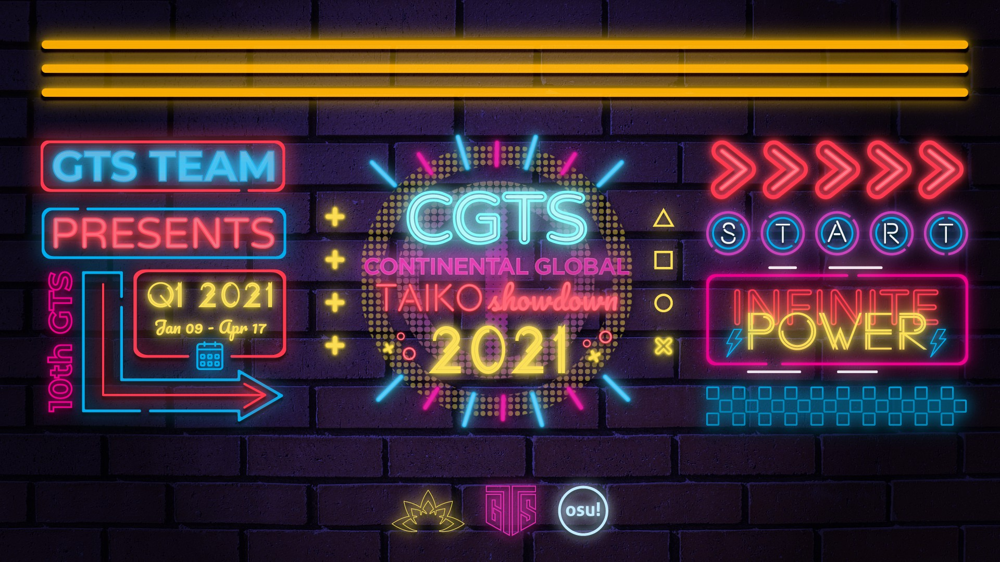

---
tags:
  - CGTS2021
  - CGTS
  - GTS
---

# Continental Global Taiko Showdown 2021

The **Continental Global Taiko Showdown 2021** (***CGTS 2021***) was a worldwide double-elimination osu!taiko tournament hosted by ::{ flag=FR }:: [\_yosh](https://osu.ppy.sh/users/7157133), ::{ flag=FR }:: [Kasumii-sama](https://osu.ppy.sh/users/6177263), and ::{ flag=FR }:: [Un bretzel](https://osu.ppy.sh/users/1542565). The tournament had a regional phase and a global phase: the regional phase was a 1v1 bracket to find the best players on each continent, and the global phase was a 4v4 bracket where the top players from each continent faced each other. It was the second instalment of the Continental Global Taiko Showdown and part of the Global Taiko Showdown series.

## Tournament schedule

### Regional phase

| Event | Timestamp |
| --: | :-- |
| Registration phase | 2021-01-09/2021-01-24 |
| Screening phase | 2021-01-24/2021-01-31 |
| Qualifiers | 2021-02-06/2021-02-07 |
| Round of 32 | 2021-02-13/2021-02-14 |
| Round of 16 | 2021-02-20/2021-02-21 |
| Quarterfinals | 2021-02-27/2021-02-28 |
| Semifinals | 2021-03-05/2021-03-07 |
| Finals | 2021-03-13/2021-03-14 |
| Grand Finals | 2021-03-20/2021-03-21 |

### Global phase

| Event | Timestamp |
| --: | :-- |
| Qualifiers | 2021-03-27/2021-03-28 |
| Semifinals | 2021-04-03/2021-04-04 |
| Finals | 2021-04-10/2021-04-11 |
| Grand Finals & Japan vs The Rest of the world | 2021-04-17 |

## Prizes

### Regional phase

| Placing | Prize(s) |
| :-: | :-- |
|  | US$40, special plaque with player's username, custom made osu!taiko keypad |
|  | US$20, special plaque with player's username, custom made osu!taiko keypad |
|  | US$10, special plaque with player's username, custom made osu!taiko keypad |

### Global phase

| Placing | Prize(s) |
| :-: | :-- |
|  | Unique profile badge, US$43.75, special plaque with player's username for each team member, custom made osu!taiko keypad for each team member |
|  | US$23.75, special plaque with player's username for each team member, custom made osu!taiko keypad for each team member |
|  | US$13.75, special plaque with player's username for each team member, custom made osu!taiko keypad for each team member |

A prize pool of $1,000 with physical prizes are made possible thanks to [Lotuspro](http://www.lotuspro.io/).

## Organisation

The Continental Global Taiko Showdown 2021 was run by various community members.

| Position | Member(s) |
| :-- | :-- |
| Organizer | ::{ flag=FR }:: [\_yosh](https://osu.ppy.sh/users/7157133), ::{ flag=FR }:: [Kasumii-sama](https://osu.ppy.sh/users/6177263), ::{ flag=FR }:: [Un bretzel](https://osu.ppy.sh/users/1542565) |
| Mappool selector (Global) | ::{ flag=MY }:: [\[Zeth\]](https://osu.ppy.sh/users/9912966), ::{ flag=US }:: [Backfire](https://osu.ppy.sh/users/263110), ::{ flag=US }:: [driodx](https://osu.ppy.sh/users/9709548), ::{ flag=US }:: [Mister Boo](https://osu.ppy.sh/users/2598555) |
| Mappool selector (Asia) | ::{ flag=MY }:: [\[Zeth\]](https://osu.ppy.sh/users/9912966), ::{ flag=DE }:: [Sayira](https://osu.ppy.sh/users/7253958), ::{ flag=ID }:: [Volta](https://osu.ppy.sh/users/4154071) |
| Mappool selector (Europe) | ::{ flag=DE }:: [frz](https://osu.ppy.sh/users/6956922), ::{ flag=NL }:: [TaikoMom](https://osu.ppy.sh/users/9086438), ::{ flag=DE }:: [xMrtn-](https://osu.ppy.sh/users/866297) |
| Mappool selector (North America) | ::{ flag=US }:: [driodx](https://osu.ppy.sh/users/9709548), ::{ flag=US }:: [Mister Boo](https://osu.ppy.sh/users/2598555), ::{ flag=CA }:: [rubies87](https://osu.ppy.sh/users/4949934) |
| Mappool selector (Oceania/SEA) | ::{ flag=MX }:: [Iojioji](https://osu.ppy.sh/users/1346121), ::{ flag=US }:: [kb131313](https://osu.ppy.sh/users/11229259), ::{ flag=SG }:: [kuudere-desu](https://osu.ppy.sh/users/10694200), ::{ flag=ID }:: [Reed\_405](https://osu.ppy.sh/users/9965069) |
| Mappool selector (South America) | ::{ flag=DE }:: [Ak1o](https://osu.ppy.sh/users/1600041), ::{ flag=AR }:: [Megafan](https://osu.ppy.sh/users/6632605), ::{ flag=DE }:: [Mew](https://osu.ppy.sh/users/2345156) |
| Referee | ::{ flag=MY }:: [\[Zeth\]](https://osu.ppy.sh/users/9912966), ::{ flag=FR }:: [\_yosh](https://osu.ppy.sh/users/7157133), ::{ flag=KR }:: [4\_4](https://osu.ppy.sh/users/1152851), ::{ flag=FR }:: [Aidown](https://osu.ppy.sh/users/1522146), ::{ flag=HK }:: [Akali393394](https://osu.ppy.sh/users/9686628), ::{ flag=NL }:: [Albionthegreat](https://osu.ppy.sh/users/9853595), ::{ flag=BR }:: [AnonX32](https://osu.ppy.sh/users/2730270), ::{ flag=HK }:: [BlackBq](https://osu.ppy.sh/users/6291741), ::{ flag=DE }:: [GDLenny](https://osu.ppy.sh/users/8406711), ::{ flag=US }:: [JDrago14](https://osu.ppy.sh/users/7690078), ::{ flag=FR }:: [Kasumii-sama](https://osu.ppy.sh/users/6177263), ::{ flag=SG }:: [kuudere-desu](https://osu.ppy.sh/users/10694200), ::{ flag=US }:: [Loopy542](https://osu.ppy.sh/users/5468461), ::{ flag=JP }:: [Maimaing](https://osu.ppy.sh/users/14520910), ::{ flag=FR }:: [Mimir](https://osu.ppy.sh/users/7382734), ::{ flag=KR }:: [oL0](https://osu.ppy.sh/users/1134683), ::{ flag=DE }:: [QEpicAce](https://osu.ppy.sh/users/9489153), ::{ flag=DE }:: [Sayira](https://osu.ppy.sh/users/7253958), ::{ flag=IN }:: [Speshimen](https://osu.ppy.sh/users/7720204), ::{ flag=NL }:: [TaikoMom](https://osu.ppy.sh/users/9086438), ::{ flag=FR }:: [Un bretzel](https://osu.ppy.sh/users/1542565) |
| Streamer | ::{ flag=CL }:: [\[GS\]Myuka](https://osu.ppy.sh/users/10072733), ::{ flag=US }:: [cheese salad](https://osu.ppy.sh/users/6349821), ::{ flag=FR }:: [Kasumii-sama](https://osu.ppy.sh/users/6177263), ::{ flag=US }:: [Mister Boo](https://osu.ppy.sh/users/2598555), ::{ flag=DE }:: [Sayira](https://osu.ppy.sh/users/7253958), ::{ flag=SG }:: [Spartric](https://osu.ppy.sh/users/7740442), ::{ flag=FR }:: [Un bretzel](https://osu.ppy.sh/users/1542565) |
| Commentator | ::{ flag=BR }:: [AnonX32](https://osu.ppy.sh/users/2730270), ::{ flag=GB }:: [B0tch3d](https://osu.ppy.sh/users/9864847), ::{ flag=AU }:: [Beat43210](https://osu.ppy.sh/users/5664171), ::{ flag=US }:: [driodx](https://osu.ppy.sh/users/9709548), ::{ flag=US }:: [Ethaaaan](https://osu.ppy.sh/users/9536977), ::{ flag=EC }:: [Gamelan4](https://osu.ppy.sh/users/9856910), ::{ flag=DE }:: [Heam](https://osu.ppy.sh/users/4705120), ::{ flag=CA }:: [janitore](https://osu.ppy.sh/users/3307897), ::{ flag=US }:: [JM-](https://osu.ppy.sh/users/10629673), ::{ flag=DE }:: [Joogs](https://osu.ppy.sh/users/8844167), ::{ flag=US }:: [kb131313](https://osu.ppy.sh/users/11229259), ::{ flag=GR }:: [Kerasi](https://osu.ppy.sh/users/6498810), ::{ flag=RU }:: [KeRLi\_](https://osu.ppy.sh/users/5902629), ::{ flag=US }:: [Loopy542](https://osu.ppy.sh/users/5468461), ::{ flag=DE }:: [Maou](https://osu.ppy.sh/users/3867109), ::{ flag=US }:: [Mister Boo](https://osu.ppy.sh/users/2598555), ::{ flag=KR }:: [Peaceful](https://osu.ppy.sh/users/165027), ::{ flag=DE }:: [QEpicAce](https://osu.ppy.sh/users/9489153), ::{ flag=NL }:: [TaikoMom](https://osu.ppy.sh/users/9086438), ::{ flag=AR }:: [Vaf](https://osu.ppy.sh/users/12589048), ::{ flag=GB }:: [w1ll](https://osu.ppy.sh/users/11406987) |
| Designer | ::{ flag=ID }:: [fajar13k](https://osu.ppy.sh/users/7100002), ::{ flag=PH }:: [OsuMe65](https://osu.ppy.sh/users/852867), ::{ flag=KR }:: [POCARI SWEAT](https://osu.ppy.sh/users/5082685) |
| Recruiter | ::{ flag=AR }:: [Vaf](https://osu.ppy.sh/users/12589048) |
| Translator | ::{ flag=JP }:: [\_Rise](https://osu.ppy.sh/users/5217107), ::{ flag=FR }:: [\_yosh](https://osu.ppy.sh/users/7157133), ::{ flag=IT }:: [LordEnder](https://osu.ppy.sh/users/4609767), ::{ flag=NL }:: [TaikoMom](https://osu.ppy.sh/users/9086438) |
| Developer | ::{ flag=US }:: [Cychloryn](https://osu.ppy.sh/users/6921736), ::{ flag=NL }:: [oliebol](https://osu.ppy.sh/users/2756335), ::{ flag=FR }:: [ThePooN](https://osu.ppy.sh/users/718454) |
| Wiki editor | ::{ flag=ID }:: [fajar13k](https://osu.ppy.sh/users/7100002) |

## Links

- [Discussion thread](https://osu.ppy.sh/community/forums/topics/1221339)
- [GTS Discord server](https://discord.gg/3mGC3HB)
- [GTS website](https://gtsosu.com)
- Livestream
  - [GTSosu](https://www.twitch.tv/gtsosu)
  - [GTSosu\_b](https://www.twitch.tv/gtsosu_b)
    - *Note: The second channel's purpose is to stream other match if there are more than one match happening at the same time.*
- Challonge bracket
  - [Global phase](https://challonge.com/cgts2021_4v4)
  - [Asia](https://challonge.com/CGTS2021_Asia)
  - [Europe](https://challonge.com/CGTS2021_Europe)
  - [North America](https://challonge.com/CGTS2021_NA)
  - [Oceania/SEA](https://challonge.com/CGTS2021_OSEA)
  - [South America](https://challonge.com/CGTS2021_SA)
- [Statistics sheet](https://docs.google.com/spreadsheets/d/e/2PACX-1vStfVzMzkNbi4gs_cfuXTuFVHLdY20VChL61mPRFzooxJ6BAmkliT5u0OG0hyYJv1ZEXcwy25otJA6n/pubhtml) provided by ::{ flag=US }:: [zachmanthethird](https://osu.ppy.sh/users/15048710)

## Participants

### Global phase

| Team | Members |
| :-- | :-- |
| Asia | ::{ flag=JP }:: **[uone](https://osu.ppy.sh/users/5321719)**, ::{ flag=JP }:: [C-light](https://osu.ppy.sh/users/7955738), ::{ flag=JP }:: [Grape\_Tea](https://osu.ppy.sh/users/9540073), ::{ flag=JP }:: [Seren58](https://osu.ppy.sh/users/15252950), ::{ flag=JP }:: [Shamirin\_mzk](https://osu.ppy.sh/users/11325757), ::{ flag=JP }:: [Six b0xes](https://osu.ppy.sh/users/8303357), ::{ flag=JP }:: [syaron105](https://osu.ppy.sh/users/8741695) |
| Europe | ::{ flag=IT }:: **[LordEnder](https://osu.ppy.sh/users/4609767)**, ::{ flag=IT }:: [A-40](https://osu.ppy.sh/users/14510301), ::{ flag=IT }:: [D3kuu](https://osu.ppy.sh/users/7807444), ::{ flag=GB }:: [goheegy](https://osu.ppy.sh/users/8057655), ::{ flag=IT }:: [Ikkun](https://osu.ppy.sh/users/1059945), ::{ flag=IT }:: [LordEnder](https://osu.ppy.sh/users/4609767), ::{ flag=GB }:: [mangomizer](https://osu.ppy.sh/users/1893718), ::{ flag=RU }:: [Starger](https://osu.ppy.sh/users/3398715), ::{ flag=DE }:: [Xayphon](https://osu.ppy.sh/users/961417) |
| North America | ::{ flag=CA }:: **[janitore](https://osu.ppy.sh/users/3307897)**, ::{ flag=US }:: [AuroraPhasmata](https://osu.ppy.sh/users/13664116), ::{ flag=CA }:: [beary605](https://osu.ppy.sh/users/2198070), ::{ flag=US }:: [cheese salad](https://osu.ppy.sh/users/6349821), ::{ flag=US }:: [Ethaaaan](https://osu.ppy.sh/users/9536977), ::{ flag=CA }:: [FusRoYay](https://osu.ppy.sh/users/5207783), ::{ flag=CA }:: [vysha](https://osu.ppy.sh/users/4908773), ::{ flag=US }:: [Whulf](https://osu.ppy.sh/users/11601107) |
| Oceania/SEA | ::{ flag=SG }:: **[Blerargh](https://osu.ppy.sh/users/7609510)**, ::{ flag=SG }:: [Bobfree](https://osu.ppy.sh/users/10096125), ::{ flag=ID }:: [Kaemz](https://osu.ppy.sh/users/8494233), ::{ flag=PH }:: [Pochacco](https://osu.ppy.sh/users/2927742), ::{ flag=SG }:: [Prehistoria](https://osu.ppy.sh/users/8364237), ::{ flag=AU }:: [r1chyy](https://osu.ppy.sh/users/11499467), ::{ flag=NZ }:: [Sparxe](https://osu.ppy.sh/users/5750235), ::{ flag=AU }:: [Tsubasa2](https://osu.ppy.sh/users/6835183) |
| South America | ::{ flag=EC }:: **[Gamelan4](https://osu.ppy.sh/users/9856910)**, ::{ flag=AR }:: [Atreevete](https://osu.ppy.sh/users/2615199), ::{ flag=CL }:: [daikiu](https://osu.ppy.sh/users/4232665), ::{ flag=BR }:: [Gustav0eiji](https://osu.ppy.sh/users/215127), ::{ flag=AR }:: [Jeshuan](https://osu.ppy.sh/users/14841911), ::{ flag=CO }:: [L1ght](https://osu.ppy.sh/users/9050875), ::{ flag=AR }:: [Nearex](https://osu.ppy.sh/users/1893238), ::{ flag=CL }:: [Necromancy-](https://osu.ppy.sh/users/1890084) |

### Regional phase

*Note: Global ranks are recorded at the end of registration.*

#### Asia

| Global rank | Player |
| --: | :-- |
| #1 | ::{ flag=JP }:: [syaron105](https://osu.ppy.sh/users/8741695) |
| #10 | ::{ flag=JP }:: [Seren58](https://osu.ppy.sh/users/15252950) |
| #12 | ::{ flag=JP }:: [uone](https://osu.ppy.sh/users/5321719) |
| #14 | ::{ flag=JP }:: [Grape\_Tea](https://osu.ppy.sh/users/9540073) |
| #39 | ::{ flag=JP }:: [Six b0xes](https://osu.ppy.sh/users/8303357) |
| #53 | ::{ flag=KR }:: [Laby](https://osu.ppy.sh/users/9085164) |
| #69 | ::{ flag=JP }:: [Shamirin\_mzk](https://osu.ppy.sh/users/11325757) |
| #263 | ::{ flag=HK }:: [Faputa](https://osu.ppy.sh/users/845733) |
| #395 | ::{ flag=JP }:: [C-light](https://osu.ppy.sh/users/7955738) |
| #36,477 | ::{ flag=LK }:: [Curi0](https://osu.ppy.sh/users/13737700) |

#### Europe

| Global rank | Player |
| --: | :-- |
| #23 | ::{ flag=GB }:: [goheegy](https://osu.ppy.sh/users/8057655) |
| #42 | ::{ flag=IT }:: [LordEnder](https://osu.ppy.sh/users/4609767) |
| #48 | ::{ flag=GB }:: [mangomizer](https://osu.ppy.sh/users/1893718) |
| #49 | ::{ flag=IT }:: [D3kuu](https://osu.ppy.sh/users/7807444) |
| #59 | ::{ flag=DE }:: [Xayphon](https://osu.ppy.sh/users/961417) |
| #79 | ::{ flag=IT }:: [A-40](https://osu.ppy.sh/users/14510301) |
| #99 | ::{ flag=IT }:: [Ikkun](https://osu.ppy.sh/users/1059945) |
| #146 | ::{ flag=IT }:: [coed](https://osu.ppy.sh/users/3716665) |
| #175 | ::{ flag=RU }:: [Akonine](https://osu.ppy.sh/users/7774222) |
| #181 | ::{ flag=CH }:: [MC2BP](https://osu.ppy.sh/users/11296097) |
| #322 | ::{ flag=DE }:: [Drecksackblase](https://osu.ppy.sh/users/6278008) |
| #465 | ::{ flag=NL }:: [Cookie\_Tree](https://osu.ppy.sh/users/502722) |
| #477 | ::{ flag=GB }:: [B0tch3d](https://osu.ppy.sh/users/9864847) |
| #480 | ::{ flag=RU }:: [Starger](https://osu.ppy.sh/users/3398715) |
| #526 | ::{ flag=RU }:: [TwinT](https://osu.ppy.sh/users/9976154) |
| #594 | ::{ flag=BG }:: [Makou](https://osu.ppy.sh/users/901896) |
| #635 | ::{ flag=NL }:: [Krekker](https://osu.ppy.sh/users/8265940) |
| #669 | ::{ flag=RU }:: [cloudfags](https://osu.ppy.sh/users/5285786) |
| #711 | ::{ flag=NL }:: [Boaz](https://osu.ppy.sh/users/13302996) |
| #896 | ::{ flag=FR }:: [Gintoki8](https://osu.ppy.sh/users/2239411) |
| #1,477 | ::{ flag=IT }:: [-Akyra](https://osu.ppy.sh/users/15457929) |
| #2,363 | ::{ flag=ES }:: [Celoluna](https://osu.ppy.sh/users/14571758) |
| #3,163 | ::{ flag=RU }:: [QuassBot](https://osu.ppy.sh/users/11117835) |
| #4,126 | ::{ flag=RU }:: [trevyt](https://osu.ppy.sh/users/10009465) |
| #8,369 | ::{ flag=BG }:: [MyPPLow](https://osu.ppy.sh/users/11533108) |
| #12,201 | ::{ flag=GB }:: [Mrshadow818](https://osu.ppy.sh/users/16968817) |
| #13,777 | ::{ flag=BG }:: [LazerDynamiX](https://osu.ppy.sh/users/9957793) |

#### North America

| Global rank | Player |
| --: | :-- |
| #38 | ::{ flag=CA }:: [vysha](https://osu.ppy.sh/users/4908773) |
| #85 | ::{ flag=US }:: [Whulf](https://osu.ppy.sh/users/11601107) |
| #86 | ::{ flag=CA }:: [janitore](https://osu.ppy.sh/users/3307897) |
| #141 | ::{ flag=US }:: [cheese salad](https://osu.ppy.sh/users/6349821) |
| #253 | ::{ flag=US }:: [AuroraPhasmata](https://osu.ppy.sh/users/13664116) |
| #424 | ::{ flag=CA }:: [beary605](https://osu.ppy.sh/users/2198070) |
| #721 | ::{ flag=US }:: [Ethaaaan](https://osu.ppy.sh/users/9536977) |
| #745 | ::{ flag=CR }:: [puijela](https://osu.ppy.sh/users/12687433) |
| #953 | ::{ flag=CA }:: [FusRoYay](https://osu.ppy.sh/users/5207783) |
| #982 | ::{ flag=US }:: [JM-](https://osu.ppy.sh/users/10629673) |
| #1,167 | ::{ flag=US }:: [MjIsMaster](https://osu.ppy.sh/users/9922896) |
| #1,383 | ::{ flag=US }:: [\_Leviathan\_](https://osu.ppy.sh/users/17841784) |
| #1,724 | ::{ flag=US }:: [Skey](https://osu.ppy.sh/users/7718539) |
| #1,769 | ::{ flag=US }:: [Chupalika](https://osu.ppy.sh/users/1926383) |
| #4,138 | ::{ flag=US }:: [5\_5](https://osu.ppy.sh/users/6853438) |
| #4,993 | ::{ flag=US }:: [zachmanthethird](https://osu.ppy.sh/users/15048710) |
| #5,630 | ::{ flag=CA }:: [keyrinn](https://osu.ppy.sh/users/10913015) |
| #5,895 | ::{ flag=US }:: [Rukairi](https://osu.ppy.sh/users/6642597) |
| #7,247 | ::{ flag=CA }:: [Sinaeb](https://osu.ppy.sh/users/1576095) |
| #7,904 | ::{ flag=US }:: [bvyans](https://osu.ppy.sh/users/7789926) |
| #10,159 | ::{ flag=US }:: [MrJamesGaming](https://osu.ppy.sh/users/13730858) |
| #12,547 | ::{ flag=US }:: [Nyahnny](https://osu.ppy.sh/users/16807933) |

#### Oceania/SEA

| Global rank | Player |
| --: | :-- |
| #52 | ::{ flag=SG }:: [Blerargh](https://osu.ppy.sh/users/7609510) |
| #195 | ::{ flag=NZ }:: [Sparxe](https://osu.ppy.sh/users/5750235) |
| #204 | ::{ flag=PH }:: [Pochacco](https://osu.ppy.sh/users/2927742) |
| #220 | ::{ flag=AU }:: [r1chyy](https://osu.ppy.sh/users/11499467) |
| #459 | ::{ flag=ID }:: [Kaemz](https://osu.ppy.sh/users/8494233) |
| #521 | ::{ flag=SG }:: [Prehistoria](https://osu.ppy.sh/users/8364237) |
| #532 | ::{ flag=SG }:: [Bobfree](https://osu.ppy.sh/users/10096125) |
| #828 | ::{ flag=AU }:: [Tsubasa2](https://osu.ppy.sh/users/6835183) |
| #929 | ::{ flag=SG }:: [Spartric](https://osu.ppy.sh/users/7740442) |
| #1,056 | ::{ flag=MY }:: [CrabCow](https://osu.ppy.sh/users/9755504) |
| #1,183 | ::{ flag=AU }:: [Beat43210](https://osu.ppy.sh/users/5664171) |
| #1,509 | ::{ flag=AU }:: [AmateurMonkeyYT](https://osu.ppy.sh/users/8379046) |
| #1,550 | ::{ flag=MY }:: [NOOB1200](https://osu.ppy.sh/users/6932501) |
| #2,075 | ::{ flag=MY }:: [Ping7731](https://osu.ppy.sh/users/7289284) |
| #3,660 | ::{ flag=SG }:: [dantoh000](https://osu.ppy.sh/users/11414361) |
| #6,234 | ::{ flag=SG }:: [\_gt](https://osu.ppy.sh/users/8301957) |
| #6,922 | ::{ flag=SG }:: [mhk05](https://osu.ppy.sh/users/2441810) |
| #8,660 | ::{ flag=ID }:: [Thatnoobguy](https://osu.ppy.sh/users/11091594) |

#### South America

| Global rank | Player |
| --: | :-- |
| #257 | ::{ flag=BR }:: [Gustav0eiji](https://osu.ppy.sh/users/215127) |
| #417 | ::{ flag=VE }:: [Shinsekai-](https://osu.ppy.sh/users/2140739) |
| #579 | ::{ flag=AR }:: [Atreevete](https://osu.ppy.sh/users/2615199) |
| #647 | ::{ flag=EC }:: [Gamelan4](https://osu.ppy.sh/users/9856910) |
| #724 | ::{ flag=CL }:: [Necromancy-](https://osu.ppy.sh/users/1890084) |
| #903 | ::{ flag=AR }:: [lTwinkle](https://osu.ppy.sh/users/5043517) |
| #953 | ::{ flag=CO }:: [L1ght](https://osu.ppy.sh/users/9050875) |
| #1,165 | ::{ flag=CO }:: [Hermite](https://osu.ppy.sh/users/7945286) |
| #1,249 | ::{ flag=CL }:: [daikiu](https://osu.ppy.sh/users/4232665) |
| #1,490 | ::{ flag=AR }:: [Nearex](https://osu.ppy.sh/users/1893238) |
| #2,973 | ::{ flag=AR }:: [Jeshuan](https://osu.ppy.sh/users/14841911) |
| #3,967 | ::{ flag=AR }:: [KyeXz](https://osu.ppy.sh/users/15118934) |
| #7,075 | ::{ flag=CO }:: [Jekuru](https://osu.ppy.sh/users/11727492) |
| #12,962 | ::{ flag=CL }:: [\[GS\]Myuka](https://osu.ppy.sh/users/10072733) |

## Podium

This competition has come to an end and resulted in the following podium:

### Global phase

| Placing | Team |
| :-: | :-- |
|  | **Asia** (::{ flag=JP }:: **[uone](https://osu.ppy.sh/users/5321719)**, ::{ flag=JP }:: [C-light](https://osu.ppy.sh/users/7955738), ::{ flag=JP }:: [Grape\_Tea](https://osu.ppy.sh/users/9540073), ::{ flag=JP }:: [Seren58](https://osu.ppy.sh/users/15252950), ::{ flag=JP }:: [Shamirin\_mzk](https://osu.ppy.sh/users/11325757), ::{ flag=JP }:: [Six b0xes](https://osu.ppy.sh/users/8303357), ::{ flag=JP }:: [syaron105](https://osu.ppy.sh/users/8741695)) |
|  | **Europe** (::{ flag=IT }:: **[LordEnder](https://osu.ppy.sh/users/4609767)**, ::{ flag=IT }:: [A-40](https://osu.ppy.sh/users/14510301), ::{ flag=IT }:: [D3kuu](https://osu.ppy.sh/users/7807444), ::{ flag=GB }:: [goheegy](https://osu.ppy.sh/users/8057655), ::{ flag=IT }:: [Ikkun](https://osu.ppy.sh/users/1059945), ::{ flag=IT }:: [LordEnder](https://osu.ppy.sh/users/4609767), ::{ flag=GB }:: [mangomizer](https://osu.ppy.sh/users/1893718), ::{ flag=RU }:: [Starger](https://osu.ppy.sh/users/3398715), ::{ flag=DE }:: [Xayphon](https://osu.ppy.sh/users/961417)) |
|  | **North America** (::{ flag=CA }:: **[janitore](https://osu.ppy.sh/users/3307897)**, ::{ flag=US }:: [AuroraPhasmata](https://osu.ppy.sh/users/13664116), ::{ flag=CA }:: [beary605](https://osu.ppy.sh/users/2198070), ::{ flag=US }:: [cheese salad](https://osu.ppy.sh/users/6349821), ::{ flag=US }:: [Ethaaaan](https://osu.ppy.sh/users/9536977), ::{ flag=CA }:: [FusRoYay](https://osu.ppy.sh/users/5207783), ::{ flag=CA }:: [vysha](https://osu.ppy.sh/users/4908773), ::{ flag=US }:: [Whulf](https://osu.ppy.sh/users/11601107)) |

### Regional phase

#### Asia

| Placing | Player |
| :-: | :-- |
|  | ::{ flag=JP }:: [Seren58](https://osu.ppy.sh/users/15252950) |
|  | ::{ flag=JP }:: [syaron105](https://osu.ppy.sh/users/8741695) |
|  | ::{ flag=JP }:: [uone](https://osu.ppy.sh/users/5321719) |

#### Europe

| Placing | Player |
| :-: | :-- |
|  | ::{ flag=IT }:: [D3kuu](https://osu.ppy.sh/users/7807444) |
|  | ::{ flag=IT }:: [Ikkun](https://osu.ppy.sh/users/1059945) |
|  | ::{ flag=DE }:: [Xayphon](https://osu.ppy.sh/users/961417) |

#### North America

| Placing | Player |
| :-: | :-- |
|  | ::{ flag=CA }:: [janitore](https://osu.ppy.sh/users/3307897) |
|  | ::{ flag=CA }:: [vysha](https://osu.ppy.sh/users/4908773) |
|  | ::{ flag=US }:: [cheese salad](https://osu.ppy.sh/users/6349821) |

#### Oceania/SEA

| Placing | Player |
| :-: | :-- |
|  | ::{ flag=SG }:: [Blerargh](https://osu.ppy.sh/users/7609510) |
|  | ::{ flag=AU }:: [r1chyy](https://osu.ppy.sh/users/11499467) |
|  | ::{ flag=SG }:: [Prehistoria](https://osu.ppy.sh/users/8364237) |

#### South America

| Placing | Player |
| :-: | :-- |
|  | ::{ flag=CL }:: [Necromancy-](https://osu.ppy.sh/users/1890084) |
|  | ::{ flag=BR }:: [Gustav0eiji](https://osu.ppy.sh/users/215127) |
|  | ::{ flag=AR }:: [Atreevete](https://osu.ppy.sh/users/2615199) |

## Mappools

### Global phase

#### Grand Finals

**[Download the mappack here! (102 MB)](https://mega.nz/file/V51V3KTY#teh9XpIBJPsp5Km5lsEJVwMsd4CBKwHN_y2p25ZTHDk)**

- NoMod
  1. [ReeK - Possesed By The Blood Moon (KTYN) \[Sacrifice\]](https://osu.ppy.sh/beatmapsets/1211308#taiko/2521563)
  2. [Sasaki Eri - Fuyu Biyori (Polcka Remix) (KTYN) \[Little Happiness\]](https://osu.ppy.sh/beatmapsets/1346344#taiko/2788245)
  3. [Retractable - Eye of xxxx (4sbet1) \[Oni\]](https://osu.ppy.sh/beatmapsets/1383882#taiko/2858741)
  4. [Foozogz - Seismo (Yuzeyun) \[Akumu\]](https://osu.ppy.sh/beatmapsets/1141442#taiko/2384114)
  5. [II-L - SPUTNIK-6 (woosungko) \[SUPERNOVA\]](https://osu.ppy.sh/beatmapsets/1400703#taiko/2889674)
  6. [katagiri - Heisei saikyou no Curry Ya (KitajimaYN) \[SPICE\]](https://osu.ppy.sh/beatmapsets/936833#taiko/1957032)
- Hidden
  1. [Feryquitous - Risk (ensan71714) \[Risky Oni\]](https://osu.ppy.sh/beatmapsets/858100#taiko/1793351)
  2. [Frums - Mdrqnxtagon (Nifty) \[Inner Oni\]](https://osu.ppy.sh/beatmapsets/967870#taiko/2134205)
  3. [katagiri - Angel's Salad (Socus) \[redefinition\]](https://osu.ppy.sh/beatmapsets/1295972#taiko/2778658)
- HardRock
  1. [xyst - Ylil's overed landscape (SKSalt) \[komasy's Inner Oni\]](https://osu.ppy.sh/beatmapsets/897948#taiko/1887454)
  2. [Frums - Star-of-the-COME ON!! (7\_7) \[Oni\]](https://osu.ppy.sh/beatmapsets/732882#taiko/1546204)
  3. [Silentroom - Nhelv (Faputa) \[Seeker\]](https://osu.ppy.sh/beatmapsets/1076775#taiko/2253084)
- DoubleTime
  1. [POLKADOT STINGRAY - Otoshimae (\[Zeth\]) \[Contention\]](https://osu.ppy.sh/beatmapsets/1306948#taiko/2709671)
  2. [Aiobahn & Yunomi - Ginga Tetsudou no Penguin ft. nicamoq (Stripe.P Remix) (KitajimaYN) \[Taiko of an Illusion\]](https://osu.ppy.sh/beatmapsets/673226#taiko/1424840)
  3. [AVTechNO!xTreow - DYE/Re:flection+ (Michiru) \[In:ner+Oni\]](https://osu.ppy.sh/beatmapsets/1019970#taiko/2134290)
- FreeMod
  1. [Camellia - Circles of Death (\[Zeth\]) \[Reincarnation\]](https://osu.ppy.sh/beatmapsets/1088266#taiko/2275550)
  2. [LeaF - UR+ MusicEater LV99 (yuzu\_\_rinrin) \[UNLIMITED Oni\]](https://osu.ppy.sh/beatmapsets/455972#taiko/1016347)
  3. [Kobaryo - SUPER REACTOR X \[feat. HiTNEX-X\] (Nifty) \[SUPER COLLAB X \[feat. rubies87\]\]](https://osu.ppy.sh/beatmapsets/1406016#taiko/2899359)
- Tiebreaker
  1. **[Sparxe - Chicxulub (\[Zeth\]) \[Continental Divide\]](https://osu.ppy.sh/beatmapsets/1429738#taiko/2943238)**

#### Finals

**[Download the mappack here! (101 MB)](https://mega.nz/file/g9UzxQ4T#sTOYr1vJaw21SU5hR5uGnqFohRcLTEaDc8XOWFxisP4)**

- NoMod
  1. [Camellia - WE ARE \*NOT\* CURZED (rubies87) \[CURZED ONI\]](https://osu.ppy.sh/beatmapsets/1070730#taiko/2241295)
  2. [iserobin - SSD (7\_7) \[?\]](https://osu.ppy.sh/beatmapsets/1155051#taiko/2410534)
  3. [Nasuno Takamiya - MeniMeni ManiMani (KawaiiBass) \[Money (Short Ver.)\]](https://osu.ppy.sh/beatmapsets/1250252#taiko/2598493)
  4. [Shawn Wasabi & YDG - Burnt Rice (feat. Yung GEMMY) (\[Zeth\]) \[Lemonade\]](https://osu.ppy.sh/beatmapsets/1183296#taiko/2466953)
  5. [Metaroom - Out of Control (Mister Boo) \[CGTS Edit Outroless\]](https://osu.ppy.sh/beatmapsets/1417213#taiko/2929624)
  6. [WE ARE AMEN ANONYMOUS - OiLIrGzpwuJy3z9SZn9Br7WxPgz8yh (extend) (KawaiiBass) \[820c4ccf7da7c761\]](https://osu.ppy.sh/beatmapsets/1310676#taiko/2716841)
- Hidden
  1. [Frums - memoryfactory.lzh (Nifty) \[DEFLATE.zip\]](https://osu.ppy.sh/beatmapsets/761900#taiko/1601977)
  2. [Mizuki Nana - Nageki no Hana (Slax Remix) (Salieri) \[OiOi Oni\]](https://osu.ppy.sh/beatmapsets/971144#taiko/2033466)
  3. [Rahatt - Mafijas Breakcore (Genjuro) \[Ulqui's Hell Oni\]](https://osu.ppy.sh/beatmapsets/1164471#taiko/2430214)
- HardRock
  1. [II-L - VANGUARD-1 (Idealism) \[VOYAGE\]](https://osu.ppy.sh/beatmapsets/1367925#taiko/2828901)
  2. [Camellia as "fluX Xroise" - Xronier (1RoHa\_) \[Inner Oni\]](https://osu.ppy.sh/beatmapsets/835443#taiko/1749771)
  3. [Snail's House - Snailchan Adventure (POCARI SWEAT) \[dream\]](https://osu.ppy.sh/beatmapsets/1207395#taiko/2514302)
- DoubleTime
  1. [ZUTOMAYO - Kansaete Kuyashiiwa (gaston\_2199) \[Inner Oni\]](https://osu.ppy.sh/beatmapsets/1309199#taiko/2714234)
  2. [Houshou Marine with Holoism Fantasy - Hoihoi\*Gensou Holoism (yassu-) \[\_Rise's Oni\]](https://osu.ppy.sh/beatmapsets/1336533#taiko/2785673)
  3. [Sophie Twilight (CV: Tomita Miyu) - DIARIUM\~Kindan no Grimoire\~ (Shamirin_mzk) \[Grimoire\]](https://osu.ppy.sh/beatmapsets/1275971#taiko/2651107)
- FreeMod
  1. [Soleily - Silent Rush (Skull Kid) \[End\]](https://osu.ppy.sh/beatmapsets/916558#taiko/1914161)
  2. [LeaF - Armageddon (Cynplytholowazy) \[Mystical Recreation\]](https://osu.ppy.sh/beatmapsets/1384091#taiko/2877224)
  3. [Masayoshi Iimori - NEWALONE (roufou) \[Flagrant\]](https://osu.ppy.sh/beatmapsets/1137961#taiko/2377216)
- Tiebreaker
  1. **[DJKurara - Parallel Equilibrium (D3kuu) \[T4tsujin\]](https://osu.ppy.sh/beatmapsets/1189259#taiko/2478145)**

#### Semifinals

**[Download the mappack here! (101 MB)](https://mega.nz/file/FstG0KgC#mbLOeDgpT_q_dX6MbF1KgsqL2GnXR2UFHPu1ZVBRkTA)**

- NoMod
  1. [t+pazolite feat. Nanahira - Niesonae (katacheh) \[Taiko H.S.\]](https://osu.ppy.sh/beatmapsets/974667#taiko/2040122)
  2. [Hikigaya vs Tamanawa - Oregairu Rap (katacheh) \[?\]](https://osu.ppy.sh/beatmapsets/1241799#taiko/2581682)
  3. [eicaTV vs kanone - MG277 (m1kado) \[Taiko\]](https://osu.ppy.sh/beatmapsets/724157#taiko/1529084)
  4. [SO-SO - Renegade VIP (Ulqui) \[ULTRA POWER\]](https://osu.ppy.sh/beatmapsets/1381444#taiko/2854271)
  5. [toby fox - Ruins (sasakure.UK Remix) (eae) \[Golden Flowers\]](https://osu.ppy.sh/beatmapsets/790685#taiko/1659016)
  6. [goreshit - wasting my time (yea) \[Stamina DX+\]](https://osu.ppy.sh/beatmapsets/790290#taiko/1658374)
- Hidden
  1. [tsunamix_underground - Period. ~ Seishin no Kousoku to Jiyuu o Tsukamu Jouka (nyanmi-1828) \[Oni\]](https://osu.ppy.sh/beatmapsets/1161785#taiko/2423706)
  2. [UNDEAD CORPORATION - Too Sweet (Jaye) \[Ura Oni\]](https://osu.ppy.sh/beatmapsets/807565#taiko/1696637)
  3. [Ruby My Dear - Spectacle (Ulqui) \[Inner Oni\]](https://osu.ppy.sh/beatmapsets/747789#taiko/1575570)
- HardRock
  1. [SCHOOL CASTE(Suzuri & Tooru) - Re:son D'etre (kei821) \[Inner Oni\]](https://osu.ppy.sh/beatmapsets/1236829#taiko/2570862)
  2. [Chroma - Sayonara Planet Wars (BrambleClaw) \[Inner Oni\]](https://osu.ppy.sh/beatmapsets/343432#taiko/758831)
  3. [Frank Zappa - The Black Page #1 (driodx) \[The Black Oni \[Varying SV\] (CGTS Edit)\]](https://osu.ppy.sh/beatmapsets/1028227#taiko/2918122)
- DoubleTime
  1. [Reol,nqrse - Ooedo Ranvu (zhu) \[Ayyri's Inner Oni\]](https://osu.ppy.sh/beatmapsets/703580#taiko/1607052)
  2. [Feryquitous feat. Sennzai - Koe (\_DUSK\_) \[Oni\]](https://osu.ppy.sh/beatmapsets/934045#taiko/2003524)
  3. [Nhato - Miss You (strickluke) \[Avarice\]](https://osu.ppy.sh/beatmapsets/638816#taiko/1354992)
- FreeMod
  1. [uraboroshi - Retrospective Arabesque (nananass) \[Oni\]](https://osu.ppy.sh/beatmapsets/1138012#taiko/2377472)
  2. [Sampling Masters MEGA - Kattobi KEIKYU Rider (7\_7) \[Gatagoto Gatagoto Oni\]](https://osu.ppy.sh/beatmapsets/673769#taiko/1425840)
  3. [Kijibato & Hoshimiya Toto - low-bit fantasy(you Remix) (Shamirin\_mzk) \[Shamikobayu!\]](https://osu.ppy.sh/beatmapsets/1333211#taiko/2762223)
- Tiebreaker
  1. **[Chroma - Destroy, Destroy, Destroy The Happy End (Eyenine) \[Inner Oni\]](https://osu.ppy.sh/beatmapsets/1265951#taiko/2631100)**

#### Qualifiers

**[Download the mappack here! (25 MB)](https://mega.nz/file/4wkiyTIK#drJTNT5_R6mydt4F5Zn548pyZisa5xUGm_fvzIIdovQ)**

- NoMod
  1. [Sven Noon - Difficult Mutations (Alchyr) \[Refi's Inner Oni\]](https://osu.ppy.sh/beatmapsets/935842#taiko/2521801)
  2. [Sta - Finite (Slipstream mix) (tasuke912) \[Infinite\]](https://osu.ppy.sh/beatmapsets/657599#taiko/1392874)
- Hidden
  1. [Frums - theyaremanycolors (Genjuro) \[Nifty's Inner Oni\]](https://osu.ppy.sh/beatmapsets/984900#taiko/2111626)
- HardRock
  1. [Nato - Yog-Sothoth (guro) \[Ayyri's Inner Oni\]](https://osu.ppy.sh/beatmapsets/704640#taiko/1603137)
- DoubleTime
  1. [REDALiCE feat. Usada Pekora & Sakura Miko - Peko Miko Daisensou!! (Cychloryn) \[Oni\]](https://osu.ppy.sh/beatmapsets/1303887#taiko/2706169)

### Regional phase

#### Asia

##### Grand Finals

**[Download the mappack here! (160 MB)](https://mega.nz/file/dstUHApS#Up_QlNpojYN3fOG5fhHpyDcpWrZfOaRy5p3RhWlv4rk)**

- NoMod
  1. [Aquellex - Tachyon Beam Cannon (3san) \[Lazer Beam Highway\]](https://osu.ppy.sh/beatmapsets/1028718#taiko/2151032)
  2. [Noisia - Vigilantes (tasuke912) \[Oni\]](https://osu.ppy.sh/beatmapsets/1221585#taiko/2541106)
  3. [Rissyuu feat. Choko - Bi (7_7) \[bi\]](https://osu.ppy.sh/beatmapsets/1061052#taiko/2221465)
  4. [Hakushi Hasegawa - Sabaku de (Skull Kid) \[a\]](https://osu.ppy.sh/beatmapsets/1376887#taiko/2845675)
  5. [Expander - diagram (nananass) \[Extra (Very Slow SV)\]](https://osu.ppy.sh/beatmapsets/1166697#taiko/2433516)
  6. [Frums - ultra-blazures (Vulkin) \[meltdown\]](https://osu.ppy.sh/beatmapsets/906494#taiko/1891643)
- Hidden
  1. [Kidkanevil - Lantern 1 (Nwolf) \[Spectre\]](https://osu.ppy.sh/beatmapsets/718631#taiko/1517792)
  2. [inabakumori - Lost Umbrella (Raphalge) \[Inner Oni\]](https://osu.ppy.sh/beatmapsets/1228409#taiko/2554322)
  3. [xi - Blue Zenith (Faputa) \[Amplitude\]](https://osu.ppy.sh/beatmapsets/1008969#taiko/2112246)
- HardRock
  1. [Rave Cyanide x Lunatic Sounds - Lost in the nowhere (Nwolf) \[lost some SV\]](https://osu.ppy.sh/beatmapsets/793405#taiko/2886102)
  2. [MisoilePunch - VVelcome!! (asuasu\_yura) \[It's Showtime <3\]](https://osu.ppy.sh/beatmapsets/1256988#taiko/2611950)
  3. [Kobaryo - The Lightning Sword (Ak1o) \[Final Oni\]](https://osu.ppy.sh/beatmapsets/1250146#taiko/2598253)
- DoubleTime
  1. [Polyphia - G.O.A.T (\[TaikoTori\]) \[Grotesque Oni: Anomaly Taiko (No SV)\]](https://osu.ppy.sh/beatmapsets/1235776#taiko/2888741)
  2. [hitorie - Little Cry Baby (Eyenine) \[Inner Oni\]](https://osu.ppy.sh/beatmapsets/1315240#taiko/2725640)
  3. [Sakaue Nachi - Crazy Hot (Capu) \[Crazy Oni\]](https://osu.ppy.sh/beatmapsets/1017039#taiko/2128691)
- FreeMod
  1. [Camellia - K.Y.A.F.A. (Kill You All Fucking Asshole) (SKSalt) \[Crazy Oni\]](https://osu.ppy.sh/beatmapsets/460282#taiko/985807)
  2. [SYUNN - Megalara Garuda (yea) \[Ultimatum\]](https://osu.ppy.sh/beatmapsets/869184#taiko/1816563)
  3. [U-F SEQUENCER - VENOM type: hallucinogenic (Zetera) \[Majin Oni\]](https://osu.ppy.sh/beatmapsets/1055342#taiko/2205107)
- Tiebreaker
  1. **[Frums - Nisemono (\_yu68) \[Pseudo\]](https://osu.ppy.sh/beatmapsets/1111785#taiko/2322902)**

##### Finals

**[Download the mappack here! (123 MB)](https://mega.nz/file/swMTmQTb#gQQkpfi1b62AYcst1OjIsia-ogPIcnrpF4Yji98Me9U)**

- NoMod
  1. [7\_7 - Ochame Kinou (7\_7 Remix) (X a v y) \[Xavy's >V<\]](https://osu.ppy.sh/beatmapsets/1209126#taiko/2517460)
  2. [The Flashbulb - Kirlian Shores (ZTH) \[Inner Oni\]](https://osu.ppy.sh/beatmapsets/1173785#taiko/2448167)
  3. [Various Artists - Yuni's Taiko Mapset Vol.2 -High BGM- (KTYN) \[Kairiki Bear - Disappearance Addication\]](https://osu.ppy.sh/beatmapsets/816222#taiko/1711728)
  4. [Ryu\* - !Viva! (Nofool) \[Insane Oni\]](https://osu.ppy.sh/beatmapsets/799895#taiko/1679280)
  5. [Cattle Decapitation - Bring Back the Plague (Raiden) \[Stamina Thief\]](https://osu.ppy.sh/beatmapsets/1117025#taiko/2333392)
  6. [Frums - My Capacitance (HiroK) \[Hell Oni\]](https://osu.ppy.sh/beatmapsets/1145495#taiko/2483700)
- Hidden
  1. [HuMeR - ChaserXX (Arrival) \[Oni\]](https://osu.ppy.sh/beatmapsets/1241502#taiko/2581049)
  2. [Calliope Mori - Excuse My Rudeness, but Could You Please RIP?<3 (t+pazolite Remix) (Capu) \[Genjuro's Hell Oni\]](https://osu.ppy.sh/beatmapsets/1278695#taiko/2725174)
  3. [MisoilePunch \~Takenoko Soe\~ - Fin.ArcDeaR Long ver. (goheegy) \[Oni\]](https://osu.ppy.sh/beatmapsets/1050511#taiko/2195621)
- HardRock
  1. [gmtn. (witch's slave) - Daraku no Sono (goheegy) \[oni\]](https://osu.ppy.sh/beatmapsets/700320#taiko/1482632)
  2. [xi - Last Resort (\[Zeth\]) \[Inner Oni (CGTS Edit)\]](https://osu.ppy.sh/beatmapsets/800270#taiko/2875809)
  3. [Juggernaut. - Revenant (J a c k y) \[Vengeance\]](https://osu.ppy.sh/beatmapsets/991469#taiko/2073507)
- DoubleTime
  1. [xi feat. Sta - Tiferet (yea) \[Master\]](https://osu.ppy.sh/beatmapsets/1073757#taiko/2247312)
  2. [Megpoid GUMI - Life Reset Button (tutuhaha) \[Love's Taiko\]](https://osu.ppy.sh/beatmapsets/40749#taiko/130897)
  3. [Pinky Pop Hepburn - MAD TIME LOVE (frz) \[CGTS JAMMING\]](https://osu.ppy.sh/beatmapsets/1393886#taiko/2877376)
- FreeMod
  1. [xi - Longinus (asuasu\_yura) \[Oni\]](https://osu.ppy.sh/beatmapsets/933530#taiko/1948897)
  2. [Cyte - Command Prompt (Idealism) \[C:\Program Files\Difficulties\434f525255505445442046494c45.exe\]](https://osu.ppy.sh/beatmapsets/1068145#taiko/2236237)
  3. [Quarkee - Arcade Beatdown (-Kazu-) \[Insert Coin\]](https://osu.ppy.sh/beatmapsets/1301059#taiko/2698626)
- Tiebreaker
  1. **[Camellia - Another Xronixle (rubies87) \[Xpert Oni\]](https://osu.ppy.sh/beatmapsets/1178916#taiko/2458489)**

##### Semifinals

**[Download the mappack here! (111 MB)](https://mega.nz/file/ZgViwLxY#tIkAZB3sxaXR5b-xEahFWOd-AXoqHGgFIACV7CP30aw)**

- NoMod
  1. [katagiri - L4.8TS (KTYN) \[Never Forgot\]](https://osu.ppy.sh/beatmapsets/729494#taiko/1539826)
  2. [Dz'Xa - 8284-TM (uone) \[Inner Oni\]](https://osu.ppy.sh/beatmapsets/1335803#taiko/2767410)
  3. [hanacco - Uchiage Hanabi, Doko kara Mirunen w (HEKUSODASU) \[KUSOni\]](https://osu.ppy.sh/beatmapsets/815747#taiko/1710824)
  4. [Kola Kid - good old times (Nwolf) \[slow oni\]](https://osu.ppy.sh/beatmapsets/1213598#taiko/2525737)
  5. [NORAZO - Bread (K-2) \[BBANG\]](https://osu.ppy.sh/beatmapsets/1332784#taiko/2761347)
  6. [meganeko - Feral (osu! edit) (Seren58) \[Ferocious Oni\]](https://osu.ppy.sh/beatmapsets/1157210#taiko/2414911)
- Hidden
  1. [Blue Stahli - Atom Smasher (DakeDekaane) \[Inner Oni\]](https://osu.ppy.sh/beatmapsets/1159893#taiko/2420195)
  2. [WANIMA - revenge (KTYN) \[Re:venge\]](https://osu.ppy.sh/beatmapsets/1082034#taiko/2263335)
  3. [Juggernaut. - Valkyrius:0 (taiko_maniac1811) \[Ura Oni\]](https://osu.ppy.sh/beatmapsets/1295415#taiko/2687892)
- HardRock
  1. [Rainbowdragoneyes - The Rift (Mew104) \[Ura Oni\]](https://osu.ppy.sh/beatmapsets/445365#taiko/1489206)
  2. [Camellia - Bangin'Burst (HiroK) \[Inner Oni\]](https://osu.ppy.sh/beatmapsets/697956#taiko/1478346)
  3. [Seiryu x BlackY - Deus Ex Machina (Arrival) \[Inner Oni\]](https://osu.ppy.sh/beatmapsets/585623#taiko/1240465)
- DoubleTime
  1. [R Sound Design feat. Hatsune Miku - Rhetenor (Raphalge) \[Oni\]](https://osu.ppy.sh/beatmapsets/946808#taiko/1977565)
  2. [Erio wo kamatte-chan - Os-Uchujin (RM J-core Remix) (7\_7) \[Inner Oni\]](https://osu.ppy.sh/beatmapsets/736797#taiko/1554891)
  3. [Amatsuki - Dramaturgy (Raphalge) \[Dramaturgy (SV edit)\]](https://osu.ppy.sh/beatmapsets/1384393#taiko/2860131)
- FreeMod
  1. [hino isuika - Dreamin' attraction!!(Extended) (asuasu\_yura) \[Attraction\]](https://osu.ppy.sh/beatmapsets/576641#taiko/1220751)
  2. [The Flashbulb - Ninedump (Arrival) \[Inner Oni\]](https://osu.ppy.sh/beatmapsets/984361#taiko/2059691)
  3. [PSYQUI - Hype feat.Such (lapix Remix) (goheegy) \[Oni\]](https://osu.ppy.sh/beatmapsets/847339#taiko/1772072)
- Tiebreaker
  1. **[Kobaryo feat. HiTNEX-X - SUPER MEMORIES (CrowWhite) \[Collab Flashback\]](https://osu.ppy.sh/beatmapsets/1130254#taiko/2361041)**

##### Quarterfinals

**[Download the mappack here! (75 MB)](https://mega.nz/file/OvYzEAxA#ckhHIMu9GeLxbL4EL7y-_YToC73HHgZgRlohJ_6GN7s)**

- NoMod
  1. [BABYMETAL - Sis. Anger (Love) \[Hate\]](https://osu.ppy.sh/beatmapsets/437458#taiko/941918)
  2. [xi - Ten'i Muhou (maziari1105) \[Flawless Oni\]](https://osu.ppy.sh/beatmapsets/614857#taiko/1296996)
  3. [Shibayan - Playful (Zetera) \[Mokujin Oni (nerfed Majin)\]](https://osu.ppy.sh/beatmapsets/1158040#taiko/2416782)
  4. [YUC'e - Chemical Cookie (Nozdormu) \[Mind Melting\]](https://osu.ppy.sh/beatmapsets/1226930#taiko/2551364)
  5. [Camellia feat. Nanahira - Konran shoujo Soflan-chan!! (Shamirin\_mzk) \[Konran x\_x\]](https://osu.ppy.sh/beatmapsets/1279994#taiko/2658930)
- Hidden
  1. [Floral - Climbing a Wall (goheegy) \[Oni\]](https://osu.ppy.sh/beatmapsets/1090621#taiko/2280013)
  2. [Toby Fox (remixed by Camellia) - Spider Dance (Camellia Remix) (OzzyOzrock) \[Arachnophilia\]](https://osu.ppy.sh/beatmapsets/565380#taiko/1194976)
- HardRock
  1. [s-don (Iriss-Frantzz) - Upshift (Maeda) \[Hell Oni\]](https://osu.ppy.sh/beatmapsets/1262660#taiko/2624437)
  2. [Veil Of Maya - Mikasa (Astolfo) \[mikasa su kasa\]](https://osu.ppy.sh/beatmapsets/662326#taiko/1402028)
- DoubleTime
  1. [C-Show - Night City Runway (Arrival) \[Oni\]](https://osu.ppy.sh/beatmapsets/945707#taiko/1974778)
  2. [Mameyudoufu - Dot to dot feat. shully (HEKUSODASU) \[Happy Birthday \_Kan2!!\]](https://osu.ppy.sh/beatmapsets/1154500#taiko/2409517)
- FreeMod
  1. [Zennihon Suppoko Nya-go Shin'eitai - Mu-nya Poyopoyo Suppoko Nya-go (Eyenine) \[Uranya\~go\]](https://osu.ppy.sh/beatmapsets/1225912#taiko/2552081)
  2. [7mai - CUTE-Reflection (MMzz) \[Inner Oni\]](https://osu.ppy.sh/beatmapsets/921607#taiko/1924587)
  3. [lapix - Debug Dance (\[\_Chichinya\_\]) \[Working on it\]](https://osu.ppy.sh/beatmapsets/1040395#taiko/2174463)
- Tiebreaker
  1. **[kors k - Rockin' Movin' (Zekk Remix) (goheegy) \[Oni\]](https://osu.ppy.sh/beatmapsets/824011#taiko/1726654)**

##### Qualifiers

**[Download the mappack here! (25 MB)](https://mega.nz/file/p41yyI5S#5CdpGwChpYJVv1bdB6Znj-BZTJSVo5o-HfhkMsXhR5w)**

- NoMod
  1. [BLUE ENCOUNT - HOPE (1RoHa\_) \[Nube Oni\]](https://osu.ppy.sh/beatmapsets/741825#taiko/1564916)
  2. [NARUTO - Artificial Intelligence Bomb (Hanjamon) \[Artificial Oni\]](https://osu.ppy.sh/beatmapsets/777896#taiko/1634036)
- Hidden
  1. [cybermiso - corps-sans-organes (Arrival) \[Oni\]](https://osu.ppy.sh/beatmapsets/1141437#taiko/2384102)
- HardRock
  1. [Nekomata Master - Despair of ELFERIA (Arrival) \[Inner Oni (CGTS edit)\]](https://osu.ppy.sh/beatmapsets/624568#taiko/1316346)
- DoubleTime
  1. [MAX - Sugar Conspiracy Theory (Arrival) \[Oni\]](https://osu.ppy.sh/beatmapsets/567244#taiko/1201517)

#### Europe

##### Grand Finals

**[Download the mappack here! (86 MB)](https://mega.nz/file/NpF3VAyR#Gpr4Pw45a-Sf47JBS8Bt2ypHBoVui-OJZP2nc9gyZG0)**

- NoMod
  1. [hanacco - My Friend (konohahakase) \[Konoha & Xavy's Friendship\]](https://osu.ppy.sh/beatmapsets/1237324#taiko/2571792)
  2. [BilliumMoto - HDHR (tasuke912) \[Upheaval\]](https://osu.ppy.sh/beatmapsets/977033#taiko/2044958)
  3. [ck vs Se-U-Ra - Syringa vulgaris (7\_7) \[Oni\]](https://osu.ppy.sh/beatmapsets/814077#taiko/1707286)
  4. [Hatsune Miku - Francium (-\[ ix Ishida xi \]-) \[-\[ ix Ttttaaiikkkkoo xi \]-\]](https://osu.ppy.sh/beatmapsets/816993#taiko/1713217)
  5. [DJ SHARPNEL - Marunouchi survivor 140 RUSH (KitajimaYN) \[Offensive Sp.\]](https://osu.ppy.sh/beatmapsets/823759#taiko/1726168)
  6. [James Landino x Akira Complex - Hydra (gaston\_2199) \[Glitch\]](https://osu.ppy.sh/beatmapsets/1176090#taiko/2453010)
- Hidden
  1. [Chroma - [@\_\_@] (Faputa) \[Inner Oni\]](https://osu.ppy.sh/beatmapsets/1048153#taiko/2190876)
  2. [Mr. Asyu - Haunted Dance (nananass) \[Ghost\]](https://osu.ppy.sh/beatmapsets/978191#taiko/2047156)
  3. [7\_7 - Nanikore!? Mix (KTYN) \[Nandacore\]](https://osu.ppy.sh/beatmapsets/1240813#taiko/2579507)
- HardRock
  1. [xi - Longinus (satera88) \[Hell\]](https://osu.ppy.sh/beatmapsets/1135870#taiko/2372182)
  2. [katagiri - #2wise4u (maguro869) \[#KTYN 250\]](https://osu.ppy.sh/beatmapsets/995928#taiko/2097446)
  3. [BEMANI Sound Team "Nekomata Master" - Life is beautiful (HiroK) \[Wonderland\]](https://osu.ppy.sh/beatmapsets/987083#taiko/2064825)
- DoubleTime
  1. [Omaru Polka - HOLOGRAM CIRCUS (Smallwu) \[Polka Oru yo! [x1.40]\]](https://osu.ppy.sh/beatmapsets/1360324#taiko/2816683)
  2. [Unkown Artist - Say Goodbye (Speed Up Ver.) (aHTaoN) \[Taiko\]](https://osu.ppy.sh/beatmapsets/1331809#taiko/2759235)
  3. [cYsmix - Abandoned Shrine Party (KaEDe1106) \[Inner Oni\]](https://osu.ppy.sh/beatmapsets/1106511#taiko/2312546)
- FreeMod
  1. [t+pazolite - Muzik Overload (vzk) \[OVERLOAD\]](https://osu.ppy.sh/beatmapsets/703640#taiko/1488655)
  2. [Blitz Lunar - Heavenly Spores (Xay) \[Meiosis\]](https://osu.ppy.sh/beatmapsets/769683#taiko/1618355)
  3. [Mitsuyoshi Takenobu no Ani - Amphisbaena (Nofool) \[Unstable Oni\]](https://osu.ppy.sh/beatmapsets/580314#taiko/1228720)
- Tiebreaker
  1. **[lapix - You're Beautiful (frz) \[Attraction\]](https://osu.ppy.sh/beatmapsets/1013263#taiko/2120895)**

##### Finals

**[Download the mappack here! (101 MB)](https://mega.nz/file/x8clzYgA#_LtnhGev55Tx8y_W--JJguxvAvbu36WgXBaDoOpv2y8)**

- NoMod
  1. [Bentham - TONIGHT (Raphalge) \[Inner Oni \[1,15x Rate\]\]](https://osu.ppy.sh/beatmapsets/833323#taiko/1745559)
  2. [uno(IOSYS) - #Fairy\_dancing\_in\_lake (Nofool) \[Insane Oni\]](https://osu.ppy.sh/beatmapsets/642247#taiko/1361632)
  3. [Ponchi feat. haxchi - Connect Colors (Jerry) \[YNZM's Rainbow\]](https://osu.ppy.sh/beatmapsets/1282848#taiko/2664333)
  4. [TMABird - Sweet Melty Memes (Mew104) \[FeelsTaikoMan\]](https://osu.ppy.sh/beatmapsets/437721#taiko/942408)
  5. [Noisestorm - Barracuda (Grimbow) \[Subtropical\]](https://osu.ppy.sh/beatmapsets/805766#taiko/1691365)
  6. [An - Cochma (SKSalt) \[Evil Oni\]](https://osu.ppy.sh/beatmapsets/438670#taiko/944237)
- Hidden
  1. [YUTO - Theory (te2035) \[Hyper Oni\]](https://osu.ppy.sh/beatmapsets/1187561#taiko/2484457)
  2. [Rohi - LvC3 (SKSalt) \[Inner Oni\]](https://osu.ppy.sh/beatmapsets/1380507#taiko/2852484)
  3. [Katagiri - Never to Fade Away (In Dark Sky) \[Master\]](https://osu.ppy.sh/beatmapsets/1032528#taiko/2158938)
- HardRock
  1. [Masahiro 'Godspeed' Aoki - Gate of Doom (roufou) \[Ura Oni\]](https://osu.ppy.sh/beatmapsets/1022478#taiko/2139150)
  2. [Kobayu - K.T.Y.N (Kobayu) \[KTYN's 245\]](https://osu.ppy.sh/beatmapsets/1171049#taiko/2456129)
  3. [Tomoyuki Uchida - forever under construction (Jaltzu) \[roufou's ura oni\]](https://osu.ppy.sh/beatmapsets/1188147#taiko/2475988)
- DoubleTime
  1. [Dirty Androids - Exchange Place (lapix Remix) (A New Beginning) \[A New Oni\]](https://osu.ppy.sh/beatmapsets/1193946#taiko/2487493)
  2. [luz & nqrse & mafumafu & soraru - Panda Hero (mihinho) \[Inner Oni\]](https://osu.ppy.sh/beatmapsets/1009166#taiko/2112658)
  3. [Porter Robinson - Musician (trollocat) \[Inner Oni\]](https://osu.ppy.sh/beatmapsets/1392203#taiko/2874480)
- FreeMod
  1. [Tina Cousins - Hymn (Nightcore Mix) (Aloda) \[Difficult\]](https://osu.ppy.sh/beatmapsets/696467#taiko/1475287)
  2. [Ryu\* feat. Seiryu - Geki (AO-Infinity MIX) (Arrival) \[Nofool's Ura Oni\]](https://osu.ppy.sh/beatmapsets/649197#taiko/1771623)
  3. [HiTECH NINJA - Modelista (Ak1o) \[Prototype Oni\]](https://osu.ppy.sh/beatmapsets/1390619#taiko/2871576)
- Tiebreaker
  1. **[Whispered - Fallen Amaterasu (lolcubes) \[Fallen Oni\]](https://osu.ppy.sh/beatmapsets/396428#taiko/862447)**

##### Semifinals

**[Download the mappack here! (98 MB)](https://mega.nz/file/99VCUBoK#eBReTmdB_WGFl0gefvQqAn7aHR2YXLcZLaNIdpI6Fd4)**

- NoMod
  1. [Feryquitous (Vo.Sennzai) - Koe (SKSalt) \[Inner Oni\]](https://osu.ppy.sh/beatmapsets/933777#taiko/1949377)
  2. [CDR - KIZZ (applerss) \[CHU\~\]](https://osu.ppy.sh/beatmapsets/1130847#taiko/2362192)
  3. [chelmico - Easy Breezy(Kur@ra Bootleg) (Kamome Yuki) \[yuki & KTYN's Boogie\]](https://osu.ppy.sh/beatmapsets/1107880#taiko/2315433)
  4. [Silentroom - NULCTRL (Vulkin) \[Pattern 21092018\]](https://osu.ppy.sh/beatmapsets/1224931#taiko/2547582)
  5. [sasakure.UK - searoad tracks =side blue= (S a n d) \[Regretless Oni\]](https://osu.ppy.sh/beatmapsets/943160#taiko/1969655)
  6. [USAO - Chariot (uone) \[Inner Oni\]](https://osu.ppy.sh/beatmapsets/1252022#taiko/2602256)
- Hidden
  1. [Porter Robinson & Madeon - Shelter (Coryn) \[Illusion Oni\]](https://osu.ppy.sh/beatmapsets/746158#taiko/1572719)
  2. [BlackY - KITTY FOILED (TKS) \[Inner Oni\]](https://osu.ppy.sh/beatmapsets/903288#taiko/1885701)
  3. [Kabocha - EgO (Capu) \[HiroK's Inner Oni\]](https://osu.ppy.sh/beatmapsets/1156337#taiko/2531793)
- HardRock
  1. [Yuuyu - Heartbreak Furry Fandom (namaniku) \[Inner Oni\]](https://osu.ppy.sh/beatmapsets/920192#taiko/1921778)
  2. [C-Show - Invitation from Mr.C (Endymion) \[inc's Inner Oni\]](https://osu.ppy.sh/beatmapsets/749426#taiko/1586713)
  3. [3R2 - Corruption (In Dark Sky) \[Inner Oni\]](https://osu.ppy.sh/beatmapsets/1119421#taiko/2338634)
- DoubleTime
  1. [Eve - Dramaturgy (Ulqui) \[Facade\]](https://osu.ppy.sh/beatmapsets/1243675#taiko/2585459)
  2. [Harumaki Gohan - If I Could Become a Comet (Raphalge) \[Oni\]](https://osu.ppy.sh/beatmapsets/1221951#taiko/2541710)
  3. [Feryquitous - I can avoid it.#owo (\_DUSK\_) \[#inner oni\]](https://osu.ppy.sh/beatmapsets/1363824#taiko/2821419)
- FreeMod
  1. [nyaso - Lonely Goddess (vzk) \[Lonesome\]](https://osu.ppy.sh/beatmapsets/886183#taiko/1852555)
  2. [Pa's Lam System - If (hoku-4625) \[FREEDOM\]](https://osu.ppy.sh/beatmapsets/769769#taiko/1618520)
  3. [Eagle - Hypersonik (Michiru) \[Hyper Rush\]](https://osu.ppy.sh/beatmapsets/985854#taiko/2062528)
- Tiebreaker
  1. **[kors k vs Camellia - The Rolling (goheegy) \[Oni\]](https://osu.ppy.sh/beatmapsets/724960#taiko/1530815)**

##### Quarterfinals

**[Download the mappack here! (100 MB)](https://mega.nz/file/6ig01J6Y#dvvGKeehUpiDK-RcIn16rZAff9_-w_mgnh4Gelc_5vQ)**

- NoMod
  1. [3R2 - Blow my mind (tpz Overheat Remix) (uone) \[Inner Oni\]](https://osu.ppy.sh/beatmapsets/1321475#taiko/2737347)
  2. [Sota Fujimori - ACCELERATE (HiroK) \[Max Speed!\]](https://osu.ppy.sh/beatmapsets/844461#taiko/1766496)
  3. [nameless - Milk Crown on Sonnetica (JarvisGaming) \[Fantasy\]](https://osu.ppy.sh/beatmapsets/840084#taiko/1759291)
  4. [Frums - Nothing (HiroK) \[Inner Oni\]](https://osu.ppy.sh/beatmapsets/1238437#taiko/2574929)
  5. [PinocchioP - Common World Domination (Raphalge) \[Inner Oni\]](https://osu.ppy.sh/beatmapsets/776201#taiko/1630934)
- Hidden
  1. [kanone - CO5M1C R4ILR0AD (TKS) \[Inner Oni\]](https://osu.ppy.sh/beatmapsets/582078#taiko/1231950)
  2. [Mia REGINA - I got it! (Slax Remix) (kqro) \[Just Moment.\]](https://osu.ppy.sh/beatmapsets/1160166#taiko/2420699)
- HardRock
  1. [Shouten Kazoku - Osenju Meditation (gaston\_2199) \[Inner Oni\]](https://osu.ppy.sh/beatmapsets/1045485#taiko/2185584)
  2. [StellaBee - Wanderlustism (GNKait) \[Inner Oni\]](https://osu.ppy.sh/beatmapsets/1059379#taiko/2218468)
- DoubleTime
  1. [Urbangarde - Baeruna (Faputa) \[Inner Oni\]](https://osu.ppy.sh/beatmapsets/1323774#taiko/2741966)
  2. [Alice Schach and the Magic Orchestra - Chocolate Missile (Ak1o) \[Taiko\]](https://osu.ppy.sh/beatmapsets/1077066#taiko/2253892)
- FreeMod
  1. [Rainbowdragoneyes - Universe On Fire (16-Bit Universe mix) (Nofool) \[Hard Oni\]](https://osu.ppy.sh/beatmapsets/503668#taiko/1071578)
  2. [siqlo - YInMn Blue (gaston\_2199) \[Inner Oni\]](https://osu.ppy.sh/beatmapsets/1233593#taiko/2564430)
  3. [M2U feat. Guriri - Marigold (Lamery) \[Despair\]](https://osu.ppy.sh/beatmapsets/674951#taiko/1427956)
- Tiebreaker
  1. **[sky\_delta VS lapix - NEXT LEVEL (MMzz) \[Inner Oni\]](https://osu.ppy.sh/beatmapsets/623246#taiko/1313652)**

##### Round of 16

**[Download the mappack here! (71 MB)](https://mega.nz/file/94VVTKga#xfGA696KRdQJAyRFZnmbKllRQWeZqdqnLIIwavfIldA)**

- NoMod
  1. [sasakure.UK - Puppet Theater of Twee-Box feat. Hatsune Miku (Raphalge) \[Inner Oni\]](https://osu.ppy.sh/beatmapsets/639825#taiko/1422355)
  2. [Nekomata Master+ - Proof of the existence (TKS) \[Oni\]](https://osu.ppy.sh/beatmapsets/1160329#taiko/2420964)
  3. [Lzie - Fading memory (KTYN) \[Fade\]](https://osu.ppy.sh/beatmapsets/1326133#taiko/2747479)
  4. [Se-U-Ra - Hope 4 Hopeful (Hivie) \[Optimism\]](https://osu.ppy.sh/beatmapsets/1302274#taiko/2700888)
  5. [lalanoi - nil phonation (Cut Ver.) (\_Rise) \[inhumanity\]](https://osu.ppy.sh/beatmapsets/1291046#taiko/2679892)
- Hidden
  1. [Houshou Marine - Ahoy!! Warera Houshou Kaizokudan\* (Jerry) \[Xavy's AHOY!\]](https://osu.ppy.sh/beatmapsets/1225446#taiko/2548603)
  2. [Helblinde - Finality (KuroKuroKuro) \[KurOni\]](https://osu.ppy.sh/beatmapsets/1212145#taiko/2544218)
- HardRock
  1. [Natsume Chiaki - Hanairo Biyori (DarkVortex) \[Inner Oni\]](https://osu.ppy.sh/beatmapsets/280663#taiko/635003)
  2. [Usagi Aikouka(cosMo syuri22) - Gamerz FestivaL (ll-oscar) \[ll-taiko\]](https://osu.ppy.sh/beatmapsets/638461#taiko/1354391)
- DoubleTime
  1. [Rin - Mythic set \~ Heart-Stirring Urban Legends (tasuke912) \[Oni\]](https://osu.ppy.sh/beatmapsets/935699#taiko/1954849)
  2. [Zekk - Fallen (Hivie) \[Oni\]](https://osu.ppy.sh/beatmapsets/1146734#taiko/2394738)
- FreeMod
  1. [t+pazolite - Chrome VOX (gaston_2199) \[Ayyri's Inner Oni\]](https://osu.ppy.sh/beatmapsets/1176081#taiko/2675819)
  2. [Culprate - Yellow (A Second Glimpse) (Ulqui) \[Inner Oni\]](https://osu.ppy.sh/beatmapsets/589814#taiko/1248351)
  3. [Toromaru - Shounen wa Sora o Tadoru Prog Piano Remix (Skull Kid) \[Inner Oni\]](https://osu.ppy.sh/beatmapsets/564918#taiko/1194117)
- Tiebreaker
  1. **[Camellia - Ethnik Khemikal Teknologi (Faputa) \[Jungle Invasion\]](https://osu.ppy.sh/beatmapsets/678415#taiko/1434483)**

##### Round of 32

**[Download the mappack here! (69 MB)](https://mega.nz/file/gsMWTRST#KznZTiye2q33m-6TRM3kC6YpjTAI_Vkk8yy5GT9PMwk)**

- NoMod
  1. [ARForest - Art for Rest (Eyenine) \[Inner Oni\]](https://osu.ppy.sh/beatmapsets/1177033#taiko/2454812)
  2. [Beltaine - Rockhill (Coryn) \[Inner Oni\]](https://osu.ppy.sh/beatmapsets/868701#taiko/1815702)
  3. [Kitcaliber - DIGI-ORDER (4\_4) \[Inner Oni\]](https://osu.ppy.sh/beatmapsets/1313885#taiko/2723102)
  4. [Hakushi Hasegawa - Doku (Ulqui) \[Inner Oni\]](https://osu.ppy.sh/beatmapsets/985128#taiko/2061162)
- Hidden
  1. [Nizikawa - F.K.S (Arrival) \[Inner Oni\]](https://osu.ppy.sh/beatmapsets/550245#taiko/1165727)
  2. [OISHII - COCOA WATERSLIDE (-OvO-) \[Inner Oni\]](https://osu.ppy.sh/beatmapsets/912064#taiko/1905708)
- HardRock
  1. [sky_delta - Cubicsphere (\_Rise) \[Inner Oni\]](https://osu.ppy.sh/beatmapsets/498320#taiko/1060833)
  2. [Juggernaut. - Valhalla:0 (Seren58) \[Oni\]](https://osu.ppy.sh/beatmapsets/1080767#taiko/2263392)
- DoubleTime
  1. [Tati Zaqui - Placa no Chao (Kuron-kun) \[Vem pro baile\]](https://osu.ppy.sh/beatmapsets/737724#taiko/1556963)
  2. [Rainbowdragoneyes - Starvved (\[R\]) \[Oni\]](https://osu.ppy.sh/beatmapsets/1082706#taiko/2277065)
- FreeMod
  1. [USAO - Night sky (Mel) \[Vortex's Inner Oni\]](https://osu.ppy.sh/beatmapsets/376397#taiko/824095)
  2. [brz1128 - BLAZING_LAZER (yuzu\_\_rinrin) \[w\]](https://osu.ppy.sh/beatmapsets/830989#taiko/1740996)
  3. [EBIMAYO - GOODWORLD (komasy) \[GOODWORLD\]](https://osu.ppy.sh/beatmapsets/938075#taiko/1959517)
- Tiebreaker
  1. **[Mtell & Riku - Arquebus (KTYN) \[7\_7 & KTYN's Eruption\]](https://osu.ppy.sh/beatmapsets/1129420#taiko/2359424)**

##### Qualifiers

**[Download the mappack here! (23 MB)](https://mega.nz/file/hgsGXCjZ#iIexzhVjKWXprGuS4EKMeu1bVN5NPHlLXyuivxX6DsQ)**

- NoMod
  1. [Hino Isuka - ULTRA MEGA HAPPY PARTY!!! (7\_7) \[ONI\]](https://osu.ppy.sh/beatmapsets/803307#taiko/1686050)
  2. [Ponkichi & Yunyun - SAMURAI TIGER (Lze) \[Inner Oni\]](https://osu.ppy.sh/beatmapsets/1128962#taiko/2358547)
- Hidden
  1. [SOUND HOLIC feat. Nana Takahashi - STARLIGHT JUNCTION (Luqua) \[Maeda's INNER ONI\]](https://osu.ppy.sh/beatmapsets/1102691#taiko/2303844)
- HardRock
  1. [Kurokotei - Liberation (Arrival) \[Inner Oni\]](https://osu.ppy.sh/beatmapsets/553266#taiko/1171465)
- DoubleTime
  1. [YUC'e - intro-duck-tion!! (komasy) \[o-ni!!\]](https://osu.ppy.sh/beatmapsets/700150#taiko/1482424)

#### North America

##### Grand Finals

**[Download the mappack here! (127 MB)](https://mega.nz/file/lgs0hQKA#QrB8MUOZKR-B0kYX-HGR73VUz1CRQRGk7VzWMR1Udek)**

- NoMod
  1. [Katagiri - Kedamono friends (Extended ver.) (rezi888) \[Crazy!\]](https://osu.ppy.sh/beatmapsets/920744#taiko/1922785)
  2. [7\_7 - Satori-chan (7\_7) \[Kawaii!!\]](https://osu.ppy.sh/beatmapsets/1040691#taiko/2174963)
  3. [Kobaryo - Pumpin' Junkies (Kobaryo's FTN-Remix) (MMzz) \[Tatsujin\]](https://osu.ppy.sh/beatmapsets/296900#taiko/666515)
  4. [SHIKI - Pure Ruby (Konpaku Sariel) \[Scarlet\]](https://osu.ppy.sh/beatmapsets/1123527#taiko/2347774)
  5. [Expander - diagram (nananass) \[Extra(Very Slow SV)\]](https://osu.ppy.sh/beatmapsets/1166697#taiko/2433516)
  6. [pianoid - 1 (7\_7) \[1! 1!\]](https://osu.ppy.sh/beatmapsets/689689#taiko/1459883)
- Hidden
  1. [sakuraburst - AETHERSONG (Faputa) \[EFFERVESCENCE\]](https://osu.ppy.sh/beatmapsets/1052481#taiko/2294946)
  2. [TUYU - Anoyo-iki no Bus ni Notte Saraba. (Sped Up Ver.) (uone) \[Inner Oni\]](https://osu.ppy.sh/beatmapsets/1219642#taiko/2537392)
  3. [Memme - Avalanche (Nofool) \[Blizzardy Oni\]](https://osu.ppy.sh/beatmapsets/710898#taiko/1502771)
- HardRock
  1. [onoken - ZADAMGA (agu) \[Fatale Oni\]](https://osu.ppy.sh/beatmapsets/458476#taiko/1026948)
  2. [Masa - Kitsune no Yomeiri (asuasu\_yura) \[Inner Oni\]](https://osu.ppy.sh/beatmapsets/335722#taiko/743086)
  3. [Dustvoxx - Trigger (Zekk Remix) (Nifty) \[Action\]](https://osu.ppy.sh/beatmapsets/1004571#taiko/2102464)
- DoubleTime
  1. [Sakuzyo - Amenohoakari (EdamaMe411) \[Inner Oni\]](https://osu.ppy.sh/beatmapsets/622563#taiko/1312425)
  2. [Dua Lipa - Break My Heart (Grimbow) \[Vogue\]](https://osu.ppy.sh/beatmapsets/1201481#taiko/2502422)
  3. [M2U - Dual Fractal (Cychloryn) \[Nautilus\]](https://osu.ppy.sh/beatmapsets/994663#taiko/2079706)
- FreeMod
  1. [Helblinde - Heaven's Fall (Speed Up Ver.) (hoku-4625) \[Yuni's Warrior(BPM220)\]](https://osu.ppy.sh/beatmapsets/764382#taiko/1610531)
  2. [Umeboshi Chazuke - Panic! Pop'n! Picnic! (asuasu\_yura) \[Oni\]](https://osu.ppy.sh/beatmapsets/541163#taiko/1147464)
  3. [cosMo@P - Anti the EuphoriaHOLiC (Nofool) \[Insane Oni\]](https://osu.ppy.sh/beatmapsets/858382#taiko/1793979)
- Tiebreaker
  1. **[Camellia - Tera I/O (rubies87) \[Terabyte\]](https://osu.ppy.sh/beatmapsets/1402377#taiko/2892998)**

##### Finals

**[Download the mappack here! (111 MB)](https://mega.nz/file/gkUVGKjR#msQuGfyDKw-9_jNAqloRRO8s5k7PYCWMKmKQm5nErhw)**

- NoMod
  1. [uma vs. Morimori Atsushi - Re:End of a Dream(long ver.) (\[\_Chichinya\_\]) \[Fapu's Inner Oni\]](https://osu.ppy.sh/beatmapsets/694828#taiko/1923925)
  2. [Hatsune Miku - Hatsune Miku no Shoushitsu -Gekijouban- (HiroK) \[Tilted\]](https://osu.ppy.sh/beatmapsets/653468#taiko/1385207)
  3. [Erina Koga - Lifelight (Camellia's Hardstyle Bootleg) (Nofool) \[Oni\]](https://osu.ppy.sh/beatmapsets/907833#taiko/1894500)
  4. [Camellia - Circles of Death (Cut Ver.) (Ulqui) \[Drums of Death\]](https://osu.ppy.sh/beatmapsets/1344917#taiko/2785453)
  5. [t+pazolite feat. Nanahira - Ukakuf Kins (katacheh) \[Tomorrow\]](https://osu.ppy.sh/beatmapsets/961953#taiko/2014222)
  6. [Frums - theyaremanycolors (Mister Boo) \[Blue\]](https://osu.ppy.sh/beatmapsets/867307#taiko/1813068)
- Hidden
  1. [ALEPH - Scintillations (Nardoxyribonucleic) \[Flash\]](https://osu.ppy.sh/beatmapsets/1037567#taiko/2169169)
  2. [Akhuta - Ludus In Tenebris (Nyan) \[Inner Oni\]](https://osu.ppy.sh/beatmapsets/443065#taiko/952713)
  3. [U1 overground - Dopamine (Backfire) \[Taikocalypse\]](https://osu.ppy.sh/beatmapsets/724767#taiko/1530386)
- HardRock
  1. [Kola Kid - a whole lotta Kola Kid songs (Raphalge) \[square spooner fisher pusher\]](https://osu.ppy.sh/beatmapsets/607839#taiko/1286167)
  2. [Sara - Ren Ren Ai Ai Cir Cir Cula Cula Tion Tion (Backfire) \[Tai Tai Ko Ko Calypse Calypse\]](https://osu.ppy.sh/beatmapsets/663337#taiko/1404088)
  3. [Camellia - Tornado (Nofool) \[Irma\]](https://osu.ppy.sh/beatmapsets/666923#taiko/1411326)
- DoubleTime
  1. [HHHxMMxST - Follow Tomorrow (for future mix) (Yales) \[Inner Oni\]](https://osu.ppy.sh/beatmapsets/841545#taiko/1761092)
  2. [JIN - Outer Science feat. Hiraga \[ dj-Jo Remix \] (Capu) \[Stingy's Oni\]](https://osu.ppy.sh/beatmapsets/1219663#taiko/2537432)
  3. [dj MAX STEROID - \[E\] (\_Rise) \[Oni\]](https://osu.ppy.sh/beatmapsets/1138010#taiko/2377470)
- FreeMod
  1. [Eity - M1R4CL3 M1M1K4 (7\_7) \[M1R4CL3 PE2\]](https://osu.ppy.sh/beatmapsets/742391#taiko/1571153)
  2. [Rhapsody - Emerald Sword (Nofool) \[S T R E A M W O R L D200BPM\]](https://osu.ppy.sh/beatmapsets/562881#taiko/1190355)
  3. [Dazsta - Drop It (roufou) \[Hell Oni\]](https://osu.ppy.sh/beatmapsets/1130352#taiko/2361220)
- Tiebreaker
  1. **[BlackY - AlphaOmega (driodx) \[Beginning and the End\]](https://osu.ppy.sh/beatmapsets/1394756#taiko/2878915)**

##### Semifinals

**[Download the mappack here! (103 MB)](https://mega.nz/file/p8EWFbSI#H4-fUNwhk4hrTPAzyM1RbShjMQIr27RkhT8mjCFAufg)**

- NoMod
  1. [Remo Prototype[CV: Hanamori Yumiri] - Sendan Life (Y O U T A) \[Inner Oni\]](https://osu.ppy.sh/beatmapsets/395660#taiko/861023)
  2. [M2U x NICODE - LUNE - Chiptune & Music Box Arrange Ver. (uone) \[Oni\]](https://osu.ppy.sh/beatmapsets/607963#taiko/1971980)
  3. [youman feat.GUMI - R.I.P. (ekumea1123) \[R.I.P.\]](https://osu.ppy.sh/beatmapsets/1039654#taiko/2173146)
  4. [Virtual Self - Ghost Voices (Ulqui) \[Myruki's Whisper\]](https://osu.ppy.sh/beatmapsets/848100#taiko/1773553)
  5. [MARETU - Koukatsu (nananass) \[.\]](https://osu.ppy.sh/beatmapsets/894505#taiko/1869191)
  6. [Yu\_Asahina feat Ritsuka - HAELE III \~Angel Worlds\~ (Extended ver.) (ll-oscar) \[ll-taiko St.\]](https://osu.ppy.sh/beatmapsets/699762#taiko/1481648)
  7. [MYUKKE. - OCCHOCO-REST-LESS (Jaye) \[Scatterbrain\]](https://osu.ppy.sh/beatmapsets/1041076#taiko/2175834)
  8. [Aline Barros - Eu Li Na Biblia (Speed Up Ver.) (xxluizxx47) \[Kannes' Tambor Sagrado\]](https://osu.ppy.sh/beatmapsets/1010845#taiko/2122063)
  9. [BVB - My Awesome Flat Chest On The Ground (Nofool) \[Special Oni\]](https://osu.ppy.sh/beatmapsets/706552#taiko/1493980)
- HardRock
  1. [Rahatt - Gas Gas (applerss) \[Gas\]](https://osu.ppy.sh/beatmapsets/858060#taiko/1793281)
  2. [Taishi - chapter4 Dream to the East (Rafael Nadal) \[chapter7 Journey to the West\]](https://osu.ppy.sh/beatmapsets/820100#taiko/1719302)
  3. [Riz - Lunate Elf (Riz Mix) (4sbet1) \[Inner Oni\]](https://osu.ppy.sh/beatmapsets/1152755#taiko/2406052)
- DoubleTime
  1. [EZFG - Hurting for a Very Hurtful Pain (Nwolf) \[Painful Demon\]](https://osu.ppy.sh/beatmapsets/955541#taiko/1995363)
  2. [Nanahira - Bakuure! Match Uri no Haken Shoujo (JarvisGaming) \[Cychlo's Oni\]](https://osu.ppy.sh/beatmapsets/1010029#taiko/2119295)
  3. [yst - the lost dedicated (Loopy542) \[cheater mode\]](https://osu.ppy.sh/beatmapsets/1003552#taiko/2100468)
- FreeMod
  1. [clipping. - Wriggle (Nifty) \[Ophidicism\]](https://osu.ppy.sh/beatmapsets/1103315#taiko/2304989)
  2. [t+pazolite - Elder Dragon Legend (ft. Kabocha) (Backfire) \[Taikocalypse\]](https://osu.ppy.sh/beatmapsets/761951#taiko/1602056)
  3. [loveaddictspropylhexedrineoverdose - only toying with me (D3kuu) \[love\]](https://osu.ppy.sh/beatmapsets/1242468#taiko/2583067)
- Tiebreaker
  1. **[Camellia - fastest crash (Camellia's "paroxysmal" Hitech Remix) (Sansheng) \["recrudescence" Energetic Oni\]](https://osu.ppy.sh/beatmapsets/846799#taiko/1770948)**

##### Quarterfinals

**[Download the mappack here! (77 MB)](https://mega.nz/file/i6QjiCab#6NAN_TiQoo75QWeMoi-IyKP0UIH8OYcfaVL8JaZQYV8)**

- NoMod
  1. [goreshit - glad you're back. (SKSalt) \[inner oni.\]](https://osu.ppy.sh/beatmapsets/920906#taiko/1923153)
  2. [Venetian Snares - Szamar Madar (Xay) \[Inner Oni\]](https://osu.ppy.sh/beatmapsets/685785#taiko/1451660)
  3. [Rabbit House - Rabbit In The Black Room (Nifty) \[Darkness\]](https://osu.ppy.sh/beatmapsets/954041#taiko/1991860)
  4. [ARM - Saisho kichiku zenbu koe (Ska Punk Flavor) (driodx) \[kata's-M KichikuTaiko (CGTS Edit)\]](https://osu.ppy.sh/beatmapsets/1381539#taiko/2854571)
  5. [Camellia feat. Nanahira - Super-Slow-Internet-san (Mister Boo) \[POCARI SWEAT's osoiyo -\_- Diff but cut for CGTSNA\]](https://osu.ppy.sh/beatmapsets/1381529#taiko/2854535)
- Hidden
  1. [Mala Fama - La resaca de tu amor (ARGENTINE DREAM) \[Extra Extrema\]](https://osu.ppy.sh/beatmapsets/734250#taiko/1549283)
  2. [goreshit - waste (Nepuri) \[garbage\]](https://osu.ppy.sh/beatmapsets/1086346#taiko/2271781)
- HardRock
  1. [Natsuiro baningurabu\*Prim - Sore wa hanabi no youna koi (agu) \[NIGHTMARE ONI\]](https://osu.ppy.sh/beatmapsets/680957#taiko/1439755)
  2. [DJ WAKARAN GIRL - Katyusha Hard bass (204 Edit) (rezi888) \[Kirsche's Soviet\]](https://osu.ppy.sh/beatmapsets/934350#taiko/1963815)
- DoubleTime
  1. [ParagonX9 - Infiltration (Genjuro) \[Inner Oni\]](https://osu.ppy.sh/beatmapsets/1069209#taiko/2238264)
  2. [Agnete Kjolsrud - Get Jinxed (Hanjamon) \[LZD's Oni\]](https://osu.ppy.sh/beatmapsets/122279#taiko/315606)
- FreeMod
  1. [Toromaru - Enigma (KinomiCandy) \[GRAVITY ONI\]](https://osu.ppy.sh/beatmapsets/444692#taiko/955334)
  2. [Reol - YoiYoi Kokon (steven1) \[Phylum\]](https://osu.ppy.sh/beatmapsets/509367#taiko/1083249)
  3. [BEMANI Sound Team "Sota Fujimori" - OZONE (Cychloryn) \[Inner Oni\]](https://osu.ppy.sh/beatmapsets/1131154#taiko/2362744)
- Tiebreaker
  1. **[BlackY - Indigo (Yooh Remix) (Mister Boo) \[Indigodisulfonate Clash\]](https://osu.ppy.sh/beatmapsets/1381506#taiko/2854408)**

##### Round of 16

**[Download the mappack here! (95 MB)](https://mega.nz/file/w4NDWC6S#uXd32Qj6iplORw3cNqp3PeKCW31RhhfmcX5n7hm3DDE)**

- NoMod
  1. [Negaren - Ha neul's Ambition (Raphalge) \[Inner Oni\]](https://osu.ppy.sh/beatmapsets/802117#taiko/1683534)
  2. [Cranky - Ran (tasuke912) \[Mid's Inner Oni\]](https://osu.ppy.sh/beatmapsets/789553#taiko/1707975)
  3. [Akhuta - Mira (agu) \[Ura Oni\]](https://osu.ppy.sh/beatmapsets/838471#taiko/1755426)
  4. [Warak - Cosmic Invaders (Lno) \[Oni v2\]](https://osu.ppy.sh/beatmapsets/765624#taiko/1978335)
  5. [C-Show - ERROR CODE (HiroK) \[Reading Not Found\]](https://osu.ppy.sh/beatmapsets/751740#taiko/1582524)
- Hidden
  1. [Metaroom - The Bad Room (Mister Boo) \[Oni (GTS Edit)\]](https://osu.ppy.sh/beatmapsets/1251647#taiko/2829740)
  2. [toby fox - ASGORE (Nofool) \[Inner Oni\]](https://osu.ppy.sh/beatmapsets/508421#taiko/1081273)
- HardRock
  1. [Tyrfing - Verflucht (MMzz) \[Leggendaria\]](https://osu.ppy.sh/beatmapsets/934209#taiko/1950426)
  2. [Uesaka Sumire - POP TEAM EPIC(YUKIYANAGI's Dubstep Edit) (KitajimaYN) \[EPIC\]](https://osu.ppy.sh/beatmapsets/751580#taiko/1582226)
- DoubleTime
  1. [Gloria Estefan - Conga (Nofool) \[monkaS\]](https://osu.ppy.sh/beatmapsets/822404#taiko/1723613)
  2. [kradness & Reol - Okochama Sensou (incandescence) \[Oni\]](https://osu.ppy.sh/beatmapsets/928375#taiko/1939130)
- FreeMod
  1. [Helblinde - Putin's Boner (KitajimaYN) \[Small Putin\]](https://osu.ppy.sh/beatmapsets/621547#taiko/1310558)
  2. [S3RL feat Harri Rush - Nostalgic (Nightcore Mix) (nold_1702) \[Nardo's Taiko Inner Oni\]](https://osu.ppy.sh/beatmapsets/591442#taiko/1282805)
  3. [IOSYS - Tanoshii Yoru no Ochakai - Ringo's Tea Party (katacheh) \[TaikoCarnival\]](https://osu.ppy.sh/beatmapsets/468400#taiko/1001888)
- Tiebreaker
  1. **[Camellia - wanna go to a beach! VS. Resort Sunset (Mister Boo) \[beach party versus!\]](https://osu.ppy.sh/beatmapsets/1375035#taiko/2842398)**

##### Qualifiers

**[Download the mappack here! (50 MB)](https://mega.nz/file/lwtgyKaB#thigRVuzQnC5efq8aAw6pEoerus6MdfHbt0GtVxLsbE)**

- NoMod
  1. [Thaehan - Doki-Doki (Taikocracy) \[Ayyri's Outer Oni\]](https://osu.ppy.sh/beatmapsets/626006#taiko/1319597)
  2. [Caravan Palace - Black Betty (incandescence) \[Betty White\]](https://osu.ppy.sh/beatmapsets/811664#taiko/1702547)
- Hidden
  1. [chelmico - Easy Breezy feat. Zenpaku \[ dj-Jo Trap Remix \] TV Size (radar) \[Fly!\]](https://osu.ppy.sh/beatmapsets/1133539#taiko/2367349)
- HardRock
  1. [SEVENTH SISTERS - SEVENTH HAVEN (Mtell Remix) (Shallty) \[5th Sister Yuni\]](https://osu.ppy.sh/beatmapsets/829545#taiko/1737950)
- DoubleTime
  1. [DJ S3RL - T-T-Techno (feat. Jesskah) (nold\_1702) \[m1ng's Inner Oni\]](https://osu.ppy.sh/beatmapsets/83560#taiko/635009)

#### Oceania/SEA

##### Grand Finals

**[Download the mappack here! (176 MB)](https://mega.nz/file/Vt9GBIjB#lgYcDNqpihe0SiMsGs-Tjo4SnKRCcqFtaCCaJWLm4DM)**

- NoMod
  1. [Katagiri feat. Hanacco - Kahen reishiki zettai kyomei hakai kosen (HiroK) \[Resonance\]](https://osu.ppy.sh/beatmapsets/957806#taiko/2005234)
  2. [phonon - polyriddim (GNKait) \[Hell Oni\]](https://osu.ppy.sh/beatmapsets/1272221#taiko/2643612)
  3. [PinocchioP - Loveit (Raphalge) \[Oni\]](https://osu.ppy.sh/beatmapsets/1285403#taiko/2668880)
  4. [Blacklolita - Praeteritum (Nwolf) \[Forgotten WereOni\]](https://osu.ppy.sh/beatmapsets/1195519#taiko/2490503)
  5. [Excision & Pegboard Nerds - Bring The Madness (Noisestorm Nightcore Remix) (Nwolf) \[True Madness\]](https://osu.ppy.sh/beatmapsets/665978#taiko/1449181)
  6. [Rhapsody - Emerald Sword (Nofool) \[S T R E A M G O D\]](https://osu.ppy.sh/beatmapsets/562881#taiko/1284558)
- Hidden
  1. [The Flashbulb - Mellan (Midnaait) \[Blemished Oni\]](https://osu.ppy.sh/beatmapsets/805407#taiko/1690674)
  2. [Manabu Namiki - Zatsuza (7\_7) \[oni\]](https://osu.ppy.sh/beatmapsets/1270174#taiko/2639623)
  3. [USAO - Hastur (Grimbow) \[Necronomicon\]](https://osu.ppy.sh/beatmapsets/1007958#taiko/2109639)
- HardRock
  1. [7\_7 - 7\_7 Appreciation Mapset (X a v y) \[Marunouchi Sadistic (7\_7 190bpm ver.)\]](https://osu.ppy.sh/beatmapsets/1401944#taiko/2892286)
  2. [UNDEAD CORPORATION - Everything will freeze (asuasu\_yura) \[Freeze\]](https://osu.ppy.sh/beatmapsets/496533#taiko/1056852)
  3. [tellur - Fluff (Footcore Remix) (applerss) \[99\]](https://osu.ppy.sh/beatmapsets/1319603#taiko/2733522)
- DoubleTime
  1. [.. - . (Vulkin) \[.....\]](https://osu.ppy.sh/beatmapsets/1294888#taiko/2686801)
  2. [Morimori Atsushi - Tits or get the fuck out!! (Jaye) \[Oni\]](https://osu.ppy.sh/beatmapsets/686555#taiko/1453073)
  3. [IOSYS - Tanoshii Yoru no Ochakai - Ringo's Tea Party (katacheh) \[TaikoParty\]](https://osu.ppy.sh/beatmapsets/468400#taiko/1001889)
- FreeMod
  1. [kemu - Reincarnation (maziari1105) \[Oni\]](https://osu.ppy.sh/beatmapsets/809693#taiko/1699000)
  2. [Kabocha - EmbryO (Eyenine) \[Egg\]](https://osu.ppy.sh/beatmapsets/1280143#taiko/2659224)
  3. [xi - Death Piano (Dark Espeon) \[Void Oni\]](https://osu.ppy.sh/beatmapsets/863856#taiko/1809505)
- Tiebreaker
  1. **[Sincroide - \:\:\:\_!\_\:\:\: (vrnl) \[Endgame\]](https://osu.ppy.sh/beatmapsets/776437#taiko/1631380)**

##### Finals

**[Download the mappack here! (99 MB)](https://mega.nz/file/d9cBmahY#XtDfRB1SAVN6qlPlLkOQrarakDYxAg5T85V8j6XOewg)**

- NoMod
  1. [Bring Me The Horizon - Anthem (ikin5050) \[The End of Everything\]](https://osu.ppy.sh/beatmapsets/297390#taiko/667585)
  2. [Kaitendaentai - Toki no Ryousen (Supire Remix) (Cut Ver.) (ZTH) \[Hell Oni\]](https://osu.ppy.sh/beatmapsets/1328092#taiko/2751963)
  3. [THE ORAL CIGARETTES - Kyouran Hey Kids!! (Maeda) \[Hey Kids!!\]](https://osu.ppy.sh/beatmapsets/1175197#taiko/2451226)
  4. [Juggernaut. - Revenant (J a c k y) \[sing's Hell Oni\]](https://osu.ppy.sh/beatmapsets/991469#taiko/2436049)
  5. [s-don vs. hiosamuisuka - Trrricksters!! (Guabi) \[Guabi's Inner Taiko\]](https://osu.ppy.sh/beatmapsets/1137309#taiko/2375631)
  6. [Qoiet - Shunyata (tasuke912) \[Expert\]](https://osu.ppy.sh/beatmapsets/667033#taiko/1411524)
- Hidden
  1. [Beltaine - Rockhill (Nwolf) \[Delrio (140 BPM)\]](https://osu.ppy.sh/beatmapsets/1180602#taiko/2461922)
  2. [WANIMA - revenge (KTYN) \[Re:venge\]](https://osu.ppy.sh/beatmapsets/1082034#taiko/2263335)
  3. [DJ Noriken - Quon (Iojioji) \[IojiOni\]](https://osu.ppy.sh/beatmapsets/1127294#taiko/2355293)
- HardRock
  1. [Yuuyu - Scrap Syndrome (Short cut.) (Nwolf) \[WereOni\]](https://osu.ppy.sh/beatmapsets/261311#taiko/596743)
  2. [t+pazolite - Rumble Kung-fu Showdown (incandescence) \[AyyriDescence's Inner Oni\]](https://osu.ppy.sh/beatmapsets/804330#taiko/1688435)
  3. [Pixel Terror ft. Aviella - Enigma (QEpicAce) \[Kryptographie\]](https://osu.ppy.sh/beatmapsets/1138418#taiko/2378158)
- DoubleTime
  1. [Eluveitie - King (frukoyurdakul) \[Inner Oni\]](https://osu.ppy.sh/beatmapsets/635088#taiko/1347668)
  2. [Foreground Eclipse - From Under Cover (Caught Up In A Love Song) (ikin5050) \[Oni\]](https://osu.ppy.sh/beatmapsets/1231886#taiko/2561454)
  3. [Boogie Belgique - Piccadilly (lazyboy007) \[West End\]](https://osu.ppy.sh/beatmapsets/717359#taiko/1515547)
- FreeMod
  1. [Ester - Dizzolve (\_DUSK\_) \[goheegy's Inner Oni\]](https://osu.ppy.sh/beatmapsets/817528#taiko/1714380)
  2. [Team Grimoire - Dyslexia (Faputa) \[Alexithymia\]](https://osu.ppy.sh/beatmapsets/1298713#taiko/2693749)
  3. [Ryu\* feat. Seiryu - Geki (AO-Infinity MIX) (Arrival) \[Nofool's Ura Oni\]](https://osu.ppy.sh/beatmapsets/649197#taiko/1771623)
- Tiebreaker
  1. **[Betwixt & Between - 12 little fragments of silence (Bareburs) \[?\]](https://osu.ppy.sh/beatmapsets/1267237#taiko/2633656)**

##### Semifinals

**[Download the mappack here! (103 MB)](https://mega.nz/file/hsNmjTCb#PQu0oDjxsErz4q_U3qR_15kxZH9GLQSrkFIWpOtA1b4)**

- NoMod
  1. [goreshit - wasting my time (SKSalt) \[Inner Oni\]](https://osu.ppy.sh/beatmapsets/494063#taiko/1052058)
  2. [Melissa Kinrenka - Eva (\_Rise) \[Mediocre Oni\]](https://osu.ppy.sh/beatmapsets/1154138#taiko/2408688)
  3. [TUYU - Anoyo-iki no Bus ni Notte Saraba. (mintong89) \[Cdh's Inner Oni\]](https://osu.ppy.sh/beatmapsets/1289201#taiko/2682462)
  4. [sasakure.UK - Xlo (tkdLolly) \[White\]](https://osu.ppy.sh/beatmapsets/1003058#taiko/2099337)
  5. [nora2r - B.B.K.K.B.K.K. (-TheHateD-) \[Let Kick The Bass\]](https://osu.ppy.sh/beatmapsets/447539#taiko/1261950)
  6. [A.SAKA - Nanatsu Shusuikou (acst\_\_) \[Hiiragi\]](https://osu.ppy.sh/beatmapsets/1328163#taiko/2751383)
- Hidden
  1. [tsunamix\_underground - Period. \~ Seishin no Kousoku to Jiyuu o Tsukamu Jouka (Nwolf) \[Inner Oni\]](https://osu.ppy.sh/beatmapsets/293560#taiko/660296)
  2. [MAX MAXIMIZER vs. DJ TOTTO - Rebellio (Greenshell) \[Inner Oni\]](https://osu.ppy.sh/beatmapsets/852429#taiko/1781766)
  3. [Yvklnx Mlyvzvwv - YUKINOFUNK (T o u c h e) \[Round 2\]](https://osu.ppy.sh/beatmapsets/1184519#taiko/2469248)
- HardRock
  1. [Umeboshi Chazuke - Dutch Courage! (7\_7) \[YuraOni\]](https://osu.ppy.sh/beatmapsets/759523#taiko/1625580)
  2. [Kano - Sukisuki Zecchoushou (asuasu\_yura) \[Oni\]](https://osu.ppy.sh/beatmapsets/701907#taiko/1485323)
  3. [BlackY - Harpuia (Ichigaki) \[Inner Oni\]](https://osu.ppy.sh/beatmapsets/295703#taiko/706841)
- DoubleTime
  1. [MALVA. - Trane (Raediaufar) \[Inner Oni\]](https://osu.ppy.sh/beatmapsets/1265489#taiko/2629991)
  2. [CHON - Sleepy Tea (Ulqui) \[Oni\]](https://osu.ppy.sh/beatmapsets/888578#taiko/1857269)
  3. [KNOWER - Overtime (Live Band Session) (Nifty) \[Onitime (Live Drum Session)\]](https://osu.ppy.sh/beatmapsets/983446#taiko/2108996)
- FreeMod
  1. [BeatMARIO - Night of Knights (USAO Remix) (Nishizumi) \[Inner Oni\]](https://osu.ppy.sh/beatmapsets/1093282#taiko/2285417)
  2. [Amebre Kizami - Yuzukosho No Kanata (hoku) \[Hurry up ^-^\]](https://osu.ppy.sh/beatmapsets/1334765#taiko/2765079)
  3. [Drop & Giu feat. HatsukiYura - Marionette Pure (Konpaku Sariel) \[Sar7's Marionette\]](https://osu.ppy.sh/beatmapsets/916736#taiko/1936176)
- Tiebreaker
  1. **[BlackY - Max Burning!! (2014 Update XXXtended!!!!) (HiroK) \[Inner Oni!!\]](https://osu.ppy.sh/beatmapsets/890954#taiko/1862476)**

##### Quarterfinals

**[Download the mappack here! (59 MB)](https://mega.nz/file/Pv4yFRAC#KnnPBn9ToLkele008KRnBCc93yf7nSbBBxv4eKus0RU)**

- NoMod
  1. [ayaponzu\* - Yakubyougami (gaston\_2199) \[Inner Oni\]](https://osu.ppy.sh/beatmapsets/742938#taiko/1659898)
  2. [ALEPH - Scintillations (Nardoxyribonucleic) \[Flash\]](https://osu.ppy.sh/beatmapsets/1037567#taiko/2169169)
  3. [xi - Freedom Dive (tpz Overcute Remix) (davidminh0111) \[Inner Oni\]](https://osu.ppy.sh/beatmapsets/1076933#taiko/2253548)
  4. [Camellia - Towards The Horizon (radar) \[Visions\]](https://osu.ppy.sh/beatmapsets/1192577#taiko/2485088)
  5. [2gou. - Genkyoku o Kizamu (nyanmi-1828) \[Inner Oni\]](https://osu.ppy.sh/beatmapsets/756214#taiko/2338047)
- Hidden
  1. [BEMANI Sound Team "Nekomata Master" - Life is beautiful (-MysticEyes) \[Fapu's Inner Oni\]](https://osu.ppy.sh/beatmapsets/860089#taiko/2007761)
  2. [Yorushika - Yuunagi, Bou, Hana Madoi (_Rise) \[Reminiscence\]](https://osu.ppy.sh/beatmapsets/1130382#taiko/2361279)
- HardRock
  1. [ginkiha - Star Chaser! (komasy) \[Inner Oni!\]](https://osu.ppy.sh/beatmapsets/1124089#taiko/2348881)
  2. [katagiri - Naopura2000 -Daybreak- (Nifty) \[Purple Another\]](https://osu.ppy.sh/beatmapsets/969821#taiko/2043188)
- DoubleTime
  1. [Taylor Swift - Look What You Made Me Do (Blackener) \[Look What Roger Made Me Play\]](https://osu.ppy.sh/beatmapsets/1056621#taiko/2212658)
  2. [UNDEAD CORPORATION - Karakurenai (ASPIRIN) \[Oni\]](https://osu.ppy.sh/beatmapsets/709336#taiko/1514281)
- FreeMod
  1. [Alstroemeria Records - SACRIFICE feat. ayame (asuasu_yura) \[Oni\]](https://osu.ppy.sh/beatmapsets/1201515#taiko/2504435)
  2. [dj TAKA meets DJ YOSHITAKA - Elemental Creation (Reed_405) \[7\_7 meets Oni\]](https://osu.ppy.sh/beatmapsets/862601#taiko/1808906)
  3. [penoreri - Lord=Crossight (Luqua) \[Inner Oni\]](https://osu.ppy.sh/beatmapsets/1067236#taiko/2234427)
- Tiebreaker
  1. **[t+pazolite - Pump up UR NRG (Ayyri) \[AriLights' Oni\]](https://osu.ppy.sh/beatmapsets/509112#taiko/1082699)**

##### Round of 16

**[Download the mappack here! (77 MB)](https://mega.nz/file/04FjEaZT#nxfJUsRV5qwqJBz9UUFjXb44DD1Tk-LzRq1en_e5eQU)**

- NoMod
  1. [DIVELA feat. Hatsune Miku - DITHER TUNE (uone) \[uone&Shallty's Inner Oni\]](https://osu.ppy.sh/beatmapsets/844655#taiko/1766838)
  2. [S.S.H. - BassTest (Ak1o) \[TEST\]](https://osu.ppy.sh/beatmapsets/666764#taiko/1411059)
  3. [Lite Show Magic - TRICKL4SH 220 (Monstrata) \[Kinomi's Oni\]](https://osu.ppy.sh/beatmapsets/690470#taiko/1462004)
  4. [Camellia - Proluvies (\_DUSK\_) \[Inner Oni\]](https://osu.ppy.sh/beatmapsets/766605#taiko/1611526)
  5. [KAH - energy night (gaston_2199) \[Megafan's Gran Ventilador\]](https://osu.ppy.sh/beatmapsets/1179615#taiko/2459801)
- Hidden
  1. [M2U - Nemesis (Greenshell) \[Inner Oni\]](https://osu.ppy.sh/beatmapsets/823347#taiko/1725484)
  2. [MIMI feat. Hatsune Miku - Ai no Sukima (Rock Cover) (Hivie) \[Kanpakyin's Inner Oni\]](https://osu.ppy.sh/beatmapsets/1096932#taiko/2310610)
- HardRock
  1. [be5moti - Trahison (houraizin) \[Inner Oni\]](https://osu.ppy.sh/beatmapsets/833305#taiko/1745532)
  2. [i.o - Aoiro Step (ll-oscar) \[QT & oscar's Taiko\]](https://osu.ppy.sh/beatmapsets/308162#taiko/689260)
- DoubleTime
  1. [IOSYS - Endless Tewi-ma Park (eLtigreXXx) \[Poke's Taiko Oni\]](https://osu.ppy.sh/beatmapsets/40495#taiko/183540)
  2. [HyuN feat. JeeE - Fallen Angel (Mao) \[oko's Oni\]](https://osu.ppy.sh/beatmapsets/891335#taiko/1863216)
- FreeMod
  1. [Furries in a Blender - Storm World (OzzyOzrock) \[Inner Oni\]](https://osu.ppy.sh/beatmapsets/319805#taiko/711728)
  2. [Naoki Miki (CV: Takahashi Rie) & Ebisuzawa Kurumi (CV: Ozawa Ari) - Unhappy End World (Tyistiana) \[Painful route\]](https://osu.ppy.sh/beatmapsets/818296#taiko/1715844)
  3. [lapix - Nexta (Midnaait) \[Data Overwrite\]](https://osu.ppy.sh/beatmapsets/734616#taiko/1550962)
- Tiebreaker
  1. **[NIWASHI - Playing with Ruby (Cychloryn) \[Axer's Inner Oni\]](https://osu.ppy.sh/beatmapsets/1328323#taiko/2777894)**

##### Qualifiers

**[Download the mappack here! (18 MB)](https://mega.nz/file/0k80EYQD#oOh2IMDOBHl4IEchtjdIA0742ZonQpKjnOP6L6N9anM)**

- NoMod
  1. [Tyrfing - Verflucht (MMzz) \[Leggendaria\]](https://osu.ppy.sh/beatmapsets/934209#taiko/1950426)
  2. [Infected Mushroom - Pink Nightmares (Yales) \[rubies87's Nightmare Oni\]](https://osu.ppy.sh/beatmapsets/966951#taiko/2267735)
- Hidden
  1. [TAKA respect for J.S.B - Ubertreffen (Philippines) \[Wmf's Taiko\]](https://osu.ppy.sh/beatmapsets/49568#taiko/157890)
- HardRock
  1. [Thaehan - Ohayou ! (incandescence) \[Inner Oni\]](https://osu.ppy.sh/beatmapsets/792231#taiko/1661738)
- DoubleTime
  1. [Mili - Nine Point Eight (ReySHeL) \[Oni\]](https://osu.ppy.sh/beatmapsets/198268#taiko/470278)

#### South America

##### Grand Finals

**[Download the mappack here! (107 MB)](https://mega.nz/file/88801QxI#YG4ZN9AblZ9ftro1wwyc2s5ub30CxcuSW0i6LDTN0bg)**

- NoMod
  1. [U-F SEQUENCER - TEMPEST ZONE -code BLOOD- (Nyan) \[Taiko Inner Oni (OD7)\]](https://osu.ppy.sh/beatmapsets/653906#taiko/1433533)
  2. [Noah - World's End (Umaibo\_Umai) \[DJ CHINKASU\]](https://osu.ppy.sh/beatmapsets/491479#taiko/1075513)
  3. [Se-U-Ra - Graffiti:Code -V0TL 3.90- (Eyenine) \[Inner Oni\]](https://osu.ppy.sh/beatmapsets/1302562#taiko/2701796)
  4. [lapix - Coloring (Megafan) \[Tritanopia\]](https://osu.ppy.sh/beatmapsets/1400064#taiko/2888586)
  5. [Zekk - Swampgator (Jaye) \[is better than Trigger\]](https://osu.ppy.sh/beatmapsets/758236#taiko/1595006)
  6. [INKYA - GOMIKASUSTEP (Socus) \[AHHHH!! YUNISOKASUUUU!!!!!\]](https://osu.ppy.sh/beatmapsets/1117944#taiko/2335273)
- Hidden
  1. [StripE - FIRE FIRE (roufou) \[Hell Oni\]](https://osu.ppy.sh/beatmapsets/348579#taiko/2333169)
  2. [YOASOBI - Ano Yume wo Nazotte (Speed Up ver.) (KTYN) \[245\]](https://osu.ppy.sh/beatmapsets/1250924#taiko/2599761)
  3. [nitro - (line:theta) (Genjuro) \[Thanatos\]](https://osu.ppy.sh/beatmapsets/1035066#taiko/2164108)
- HardRock
  1. [Ganso Boys Danshi Boys - X-Treme 6 (eae) \[X-Treme Oni\]](https://osu.ppy.sh/beatmapsets/867348#taiko/1813161)
  2. [inabakumori - Anticyclone (Raphalge) \[Inner Oni (NSV)\]](https://osu.ppy.sh/beatmapsets/1295384#taiko/2687824)
  3. [Umeboshi Chazuke - Panic! Pop'n! Picnic! (2019 REMASTER) (Reficul) \[Inner! Oni!\]](https://osu.ppy.sh/beatmapsets/1254755#taiko/2607739)
- DoubleTime
  1. [BanYa - Blazing (Tasha) \[Oni\]](https://osu.ppy.sh/beatmapsets/73722#taiko/209784)
  2. [HoneyWorks - Heroine Ikusei Keikaku (BrokenArrow) \[Inner Oni\]](https://osu.ppy.sh/beatmapsets/1277032#taiko/2653263)
  3. [The Flashbulb - Creep (Greenshell) \[komasy's Inner Oni\]](https://osu.ppy.sh/beatmapsets/966087#taiko/2100985)
- FreeMod
  1. [Nekomata Gekidan - AsiaN distractive (Zetera) \[Pleioblastus pygmaeus\]](https://osu.ppy.sh/beatmapsets/836226#taiko/1751238)
  2. [Papa Kahn - Rain (Wobbleice & Icecore Flip) (maguro869) \[Inner Oni\]](https://osu.ppy.sh/beatmapsets/1291092#taiko/2679969)
  3. [toach - Fill it a Try (tasuke912) \[Edit\]](https://osu.ppy.sh/beatmapsets/824580#taiko/1729490)
- Tiebreaker
  1. **[Kikuo - Reincarnation Ascension (Extended mix) (Nifty) \[Monstrosity\]](https://osu.ppy.sh/beatmapsets/1023408#taiko/2140892)**

##### Finals

**[Download the mappack here! (107 MB)](https://mega.nz/file/UkElWa6b#D_Ej2KTy_rPDxnA4MPXXIJWEUJQWpIznui34za_qZgU)**

- NoMod
  1. [Salvatore Ganacci&Megatone - Cake (4th Chiademan Edit) (hoku) \[GO CRAZY ^-^\]](https://osu.ppy.sh/beatmapsets/1236676#taiko/2570552)
  2. [98SKJ - Hutago Gattai Break (soloist) \[Yuni's Break\]](https://osu.ppy.sh/beatmapsets/686256#taiko/1463686)
  3. [sasakure.UK - Good bye, Mr.Jack (Axer) \[Farewell\]](https://osu.ppy.sh/beatmapsets/1214765#taiko/2528159)
  4. [Blue Stahli - Suit Up (Ak1o) \[Armor Up\]](https://osu.ppy.sh/beatmapsets/1393538#taiko/2876774)
  5. [Mayumi Morinaga - dreamin' feat. Ryu\* (Skull Kid) \[You are my dream\]](https://osu.ppy.sh/beatmapsets/1215588#taiko/2529628)
  6. [Igorrr - Unpleasant Sonata (Sieg) \[Loctav's Oni\]](https://osu.ppy.sh/beatmapsets/90385#taiko/262458)
- Hidden
  1. [t+pazolite - Troll The Cowardly (Sick Candy Terror Of Feryquitous) (tasuke912) \[Oni\]](https://osu.ppy.sh/beatmapsets/808095#taiko/1695840)
  2. [Amebre Kizami - Yuzukosho No Kanata (hoku) \[Hurry up ^-^\]](https://osu.ppy.sh/beatmapsets/1334765#taiko/2765079)
  3. [Good Game - Cheating the NASA Space Physical (Instrumental) (goheegy) \[Oni\]](https://osu.ppy.sh/beatmapsets/1381880#taiko/2855182)
- HardRock
  1. [Mia REGINA - I got it! (Slax Remix) (maguro869) \[Go Ahead\]](https://osu.ppy.sh/beatmapsets/1158443#taiko/2417540)
  2. [Lite Show Magic - Make Magic (Realazy) \[Ayyri's Inner Oni\]](https://osu.ppy.sh/beatmapsets/692914#taiko/1466206)
  3. [ARForest - Hemisphere (\[Zeth\]) \[Utopia\]](https://osu.ppy.sh/beatmapsets/1241825#taiko/2581713)
- DoubleTime
  1. [Nekomata Master+ - Spiral2005 (Shinsekai-) \[GOLAZO!\]](https://osu.ppy.sh/beatmapsets/1274973#taiko/2649157)
  2. [Natori Sana - PINK,ALL,PINK! (komasy) \[Happy Color\]](https://osu.ppy.sh/beatmapsets/1265594#taiko/2630180)
  3. [Jimmy Weckl - Icicles (OzzyOzrock) \[Inner Oni\]](https://osu.ppy.sh/beatmapsets/96115#taiko/257817)
- FreeMod
  1. [witch's slave - Daraku no Sono (ptar124) \[Inner Oni\]](https://osu.ppy.sh/beatmapsets/530398#taiko/1124389)
  2. [Yosk! - Ongaku (Nandemo Suikomu Pink iru no Tame no) (Vulkin) \[Kirby Silent\]](https://osu.ppy.sh/beatmapsets/1273701#taiko/2646664)
  3. [Umiai - Drizzling Sun (Zetera) \[Majin Oni - CANICULE\]](https://osu.ppy.sh/beatmapsets/665085#taiko/1407646)
- Tiebreaker
  1. **[Unlucky Morpheus - Angreifer (GoldenWolf) \[Inner Oni\]](https://osu.ppy.sh/beatmapsets/732121#taiko/1544815)**

##### Semifinals

**[Download the mappack here! (121 MB)](https://mega.nz/file/1wMgUB4R#Xq2RbGXyGrPNvU-cREQoJKaPWbcrXuk2kx6vQ15KQ_o)**

- NoMod
  1. [Pascal Michael Stiefel - Collapsing Rift (Cookie\_Tree) \[Hurry Up!\]](https://osu.ppy.sh/beatmapsets/1086749#taiko/2499632)
  2. [Lacer8 - Crab Stick Bumbaclot (Myckoll) \[Taikocalypse\]](https://osu.ppy.sh/beatmapsets/600270#taiko/1268455)
  3. [E.G.G. - Got noir forever. (Mrriichi) \[tasuke's Inner Oni\]](https://osu.ppy.sh/beatmapsets/326018#taiko/792672)
  4. [MYUKKE. - AKKERA-COUNTRY-BOY (Quorum) \[Inner Oni\]](https://osu.ppy.sh/beatmapsets/1333099#taiko/2762004)
  5. [Hommarju - Crazy Jackpot (BabySnakes) \[Poison\]](https://osu.ppy.sh/beatmapsets/846735#taiko/1770848)
  6. [RoughSketch - 666 (Cynplytholowazy) \[CHI'S GRAVITY\]](https://osu.ppy.sh/beatmapsets/1107042#taiko/2313755)
- Hidden
  1. [SOUND HOLIC Vs. dj TAKA feat. YURiCa - TIEFSEE (Nardoxyribonucleic) \[Inner Oni\]](https://osu.ppy.sh/beatmapsets/457878#taiko/981217)
  2. [Harunaba - Ghost Mask(7\_7's French) (KTYN) \[Truth\]](https://osu.ppy.sh/beatmapsets/1167725#taiko/2436321)
  3. [ChouchouP - Tsukimiyo Rabbit (Zero\_\_wind) \[Firce777's Inner Oni\]](https://osu.ppy.sh/beatmapsets/122342#taiko/332373)
- HardRock
  1. [pm04034 - Onis Keyboard (gaston_2199) \[mid's inner oni\]](https://osu.ppy.sh/beatmapsets/1176086#taiko/2568919)
  2. [MAX MAXIMIZER vs. DJ TOTTO - Rebellio (Greenshell) \[Inner Oni\]](https://osu.ppy.sh/beatmapsets/852429#taiko/1781766)
  3. [MAX - Requiem (Zetera) \[agu's Hell Oni\]](https://osu.ppy.sh/beatmapsets/436666#taiko/948516)
- DoubleTime
  1. [Araki x nqrse - Taiyoukei Disco (gaston\_2199) \[Spacedance\]](https://osu.ppy.sh/beatmapsets/1023913#taiko/2141837)
  2. [Endorfin. - Luminous Rage -Feryquitous Orderbless Remix- (senfla) \[Yuni's Oni\]](https://osu.ppy.sh/beatmapsets/780272#taiko/1640093)
  3. [WESTARENA by MLREC. - ROUND! (Sushi) \[Oni\]](https://osu.ppy.sh/beatmapsets/88125#taiko/254419)
- FreeMod
  1. [Iserobin - Acid Funkies 2(iserobin Remix) (7\_7) \[Oni\]](https://osu.ppy.sh/beatmapsets/858800#taiko/1794755)
  2. [Hino Isuka & Umeboshi Chazuke - Ultra Happy Miracle Bazoooooka! (Foxeru) \[Miracle Oni\]](https://osu.ppy.sh/beatmapsets/1103022#taiko/2304204)
  3. [ARM - Rhododendron (tasuke912) \[Oni\]](https://osu.ppy.sh/beatmapsets/386620#taiko/844135)
- Tiebreaker
  1. **[BABYMETAL - Tales of The Destinies (Monstrata) \[Chromoxx' Nightmare Oni\]](https://osu.ppy.sh/beatmapsets/534115#taiko/1207233)**

##### Quarterfinals

**[Download the mappack here! (101 MB)](https://mega.nz/file/buomRL7J#MqvyHuR1SnvcVrxJ_DtmISTgWNh_TgULxjHBVazkFFA)**

- NoMod
  1. [Helblinde - A Reyvateil's Curse (Rhytoly) \[Malediction\]](https://osu.ppy.sh/beatmapsets/862857#taiko/1804873)
  2. [Shara - Kimi Iro Palette (Speed Up Ver.) (Kobayu) \[Oni\]](https://osu.ppy.sh/beatmapsets/1306836#taiko/2709471)
  3. [Tsukasa Kaminose - ruin of opals (KyouRekii87) \[Taiko-K\]](https://osu.ppy.sh/beatmapsets/1365762#taiko/2825016)
  4. [t+pazolite - UMMU (senfla) \[Fahren's Oni\]](https://osu.ppy.sh/beatmapsets/1160563#taiko/2421422)
  5. [Mr.Asyu - Haunted Dance (KTYN) \[Inner Oni\]](https://osu.ppy.sh/beatmapsets/1339043#taiko/2774057)
- Hidden
  1. [Lokan - introspect (\_DUSK\_) \[inner oni\]](https://osu.ppy.sh/beatmapsets/1191111#taiko/2481762)
  2. [xi - Longinus (Faputa) \[Inner Oni\]](https://osu.ppy.sh/beatmapsets/963975#taiko/2018175)
- HardRock
  1. [YUC'e - YUC'e Songs Mapset (yyyyyyyyyyypetu) \[Magical Mixer(7\_7)\]](https://osu.ppy.sh/beatmapsets/776725#taiko/1631943)
  2. [Umeboshi Chazuke - Hacha-Mecha Traveler! (Quorum) \[Inner Oni\]](https://osu.ppy.sh/beatmapsets/1357248#taiko/2809521)
- DoubleTime
  1. [Janne Da Arc - WILD FANG (Servatory) \[Obliterate All Mavericks!!\]](https://osu.ppy.sh/beatmapsets/1300431#taiko/2698206)
  2. [Atoguru - Itoshi Kimi wo Mitsuke ni (bakabaka) \[Car's Taiko\]](https://osu.ppy.sh/beatmapsets/29044#taiko/98596)
- FreeMod
  1. [Silent Spica - Anhedonia (Vulkin) \[agu's Inner Oni\]](https://osu.ppy.sh/beatmapsets/681379#taiko/1440682)
  2. [USAO - Knight Rider (Arrival) \[Inner Oni\]](https://osu.ppy.sh/beatmapsets/1157923#taiko/2416550)
  3. [Yuuyu - Scrap Syndrome (Short cut.) (HiroK) \[Madness\]](https://osu.ppy.sh/beatmapsets/963822#taiko/2017891)
- Tiebreaker
  1. **[wa. vs ETIA. - Akasagarbha -extended mix- (Chromoxx) \[Timelapse\]](https://osu.ppy.sh/beatmapsets/720329#taiko/1563230)**

##### Round of 16

**[Download the mappack here! (102 MB)](https://mega.nz/file/98Fn1Q7a#vFYYEzA6GvNMqo2AqVy_9uHRmxlB4e6l2Ifyj-jrpYg)**

- NoMod
  1. [Demetori - Old Yuanxian (Love) \[Inner Oni\]](https://osu.ppy.sh/beatmapsets/182662#taiko/437920)
  2. [BilliumMoto - life flashes before weeb eyes (Faputa) \[Outer Oni\]](https://osu.ppy.sh/beatmapsets/975435#taiko/2043119)
  3. [Yooh - Butterfly Twist (7jasmine) \[Firce777's Taiko\]](https://osu.ppy.sh/beatmapsets/1276997#taiko/2653196)
  4. [Dylan Tallchief - SUPER MEGA KAWAII (7\_7) \[TJBC\]](https://osu.ppy.sh/beatmapsets/920204#taiko/1921797)
  5. [MASAKI - Scarlet Lance (ll-oscar) \[ll-taiko\]](https://osu.ppy.sh/beatmapsets/725296#taiko/1531405)
- Hidden
  1. [ChibaNyan vs. Otogibara Era - GOMIKASU -Original Mix- (Eyenine) \[Inner Gomi\]](https://osu.ppy.sh/beatmapsets/1200809#taiko/2500701)
  2. [sky\_delta - Crepuscular rays (\_DUSK\_) \[Inner Oni\]](https://osu.ppy.sh/beatmapsets/1078522#taiko/2256714)
- HardRock
  1. [Tyrfing - Verflucht (yuzu\_\_rinrin) \[Inner Oni\]](https://osu.ppy.sh/beatmapsets/726120#taiko/1533065)
  2. [tokiwa - Kotodama Refrain (katagiri Bootleg) (7\_7) \[Refrain\]](https://osu.ppy.sh/beatmapsets/924902#taiko/1932033)
- DoubleTime
  1. [karoi - Konkon Kitsune (Senko-san) \[Inner Oni\]](https://osu.ppy.sh/beatmapsets/1160222#taiko/2438860)
  2. [ONE OK ROCK - Mighty Long Fall (Chromoxx) \[Oni\]](https://osu.ppy.sh/beatmapsets/578492#taiko/1224841)
- FreeMod
  1. [EBIMAYO - BADTEK (GNKait) \[INNERONI\]](https://osu.ppy.sh/beatmapsets/1277370#taiko/2653928)
  2. [t+pazolite - Doku LOCANdy (eiri-) \[Outer Oni\]](https://osu.ppy.sh/beatmapsets/800811#taiko/1681203)
  3. [Yucha-P - Thieves Night Trick (tutuhaha) \[qoot8123's Oni\]](https://osu.ppy.sh/beatmapsets/78268#taiko/222740)
- Tiebreaker
  1. **[goreshit - the pain of relief (we have our vices one and all) (rubies87) \[inner oni\]](https://osu.ppy.sh/beatmapsets/1084028#taiko/2267070)**

##### Qualifiers

**[Download the mappack here! (45 MB)](https://mega.nz/file/N18mFY7B#egab6F4-l8ypbjbODY9CuhO4qrCKrWDJ-s3-l88ID-4)**

- NoMod
  1. [Kano - Houkago Stride (Pho) \[Ozzy's Inner Oni\]](https://osu.ppy.sh/beatmapsets/289985#taiko/704083)
  2. [Akhuta - Ludus In Tenebris (\_DUSK\_) \[Tenebrosity\]](https://osu.ppy.sh/beatmapsets/1123932#taiko/2348553)
- Hidden
  1. [Various Artists - 23-'s Beatmap pack (nyanmi-1828) \[Proof of the existence \[Inner Oni\]\]](https://osu.ppy.sh/beatmapsets/739752#taiko/1560831)
- HardRock
  1. [Toromaru - Out of Focus (Reficul) \[Inconspicuous\]](https://osu.ppy.sh/beatmapsets/1257772#taiko/2614064)
- DoubleTime
  1. [Rin - Kurikaeshi Hitotsubu (Charlotte) \[Inner Oni\]](https://osu.ppy.sh/beatmapsets/422377#taiko/913243)

## Match results

### Global phase

#### Grand Finals

Saturday, 17 April 2021:

| Team 1 |  |  | Team 2 | Match link |
| --: | :-: | :-: | :-- | :-- |
| **Asia** | **7** | 1 | Europe | [#1](https://osu.ppy.sh/community/matches/81084347) |
| **Japan** | **7** | 0 | Rest of the World | [#1](https://osu.ppy.sh/community/matches/81090281)[^jp-showcase] |

#### Finals

Saturday, 10 April 2021:

| Team 1 |  |  | Team 2 | Match link |
| --: | :-: | :-: | :-- | :-- |
| **Asia** | **7** | 0 | Europe | [#1](https://osu.ppy.sh/community/matches/80470565) |
| Oceania/SEA | 0 | **7** | **North America** | [#1](https://osu.ppy.sh/community/matches/80494048) |

Sunday, 11 April 2021:

| Team 1 |  |  | Team 2 | Match link |
| --: | :-: | :-: | :-- | :-- |
| **Europe** | **7** | 6 | North America | [#1](https://osu.ppy.sh/community/matches/80584586) |

#### Semifinals

Saturday, 3 April 2021:

| Team 1 |  |  | Team 2 | Match link |
| --: | :-: | :-: | :-- | :-- |
| **Oceania/SEA** | **7** | 2 | South America | [#1](https://osu.ppy.sh/community/matches/79811736) |
| **Europe** | **7** | 3 | North America | [#1](https://osu.ppy.sh/community/matches/79863702) |

Sunday, 4 April 2021:

| Team 1 |  |  | Team 2 | Match link |
| --: | :-: | :-: | :-- | :-- |
| **Asia** | **7** | 0 | Oceania/SEA | [#1](https://osu.ppy.sh/community/matches/79921411) |
| **North America** | **7** | 1 | South America | [#1](https://osu.ppy.sh/community/matches/79971843) |

#### Qualifiers

- More detailed qualifiers results can be accessed via the [statistics spreadsheet](https://docs.google.com/spreadsheets/d/1NprVvbs-70iTEpia-IS8JQwdg5qTyK_TJaU72ui8wfs/edit)
- Average rank is determined by `(Σ (position earned when playing the qualifiers mappool)) / (amount of Qualifiers mappool)`

| Seed | Team | Average rank |
| --: | :-- | --: |
| #1 | Asia | 1 |
| #2 | Europe | 2.2 |
| #3 | North America | 3.2 |
| #4 | Oceania/SEA | 4 |
| #5 | South America | 4.6 |

### Regional phase

#### Asia

##### Grand Finals

Saturday, 20 March 2021:

| Player 1 |  |  | Player 2 | Match link |
| --: | :-: | :-: | :-- | :-- |
| **Seren58** ::{ flag=JP }:: | **7** | 4 | ::{ flag=JP }:: syaron105 | [#1](https://osu.ppy.sh/community/matches/78548678) |

##### Finals

Saturday, 13 March 2021:

| Player 1 |  |  | Player 2 | Match link |
| --: | :-: | :-: | :-- | :-- |
| **syaron105** ::{ flag=JP }:: | **0** | -1 | ::{ flag=JP }:: Six b0xes | *win by default* |
| **Seren58** ::{ flag=JP }:: | **7** | 1 | ::{ flag=JP }:: uone | [#1](https://osu.ppy.sh/community/matches/77959359) |

Sunday, 14 March 2021:

| Player 1 |  |  | Player 2 | Match link |
| --: | :-: | :-: | :-- | :-- |
| uone ::{ flag=JP }:: | 4 | **7** | ::{ flag=JP }:: **syaron105** | [#1](https://osu.ppy.sh/community/matches/78039074) |

##### Semifinals

Saturday, 6 March 2021:

| Player 1 |  |  | Player 2 | Match link |
| --: | :-: | :-: | :-- | :-- |
| **Seren58** ::{ flag=JP }:: | **7** | 0 | ::{ flag=JP }:: Six b0xes | [#1](https://osu.ppy.sh/community/matches/77348638) |
| **uone** ::{ flag=JP }:: | **7** | 3 | ::{ flag=JP }:: syaron105 | [#1](https://osu.ppy.sh/community/matches/77353029) |
| **Six b0xes** ::{ flag=JP }:: | **7** | 5 | ::{ flag=JP }:: Shamirin\_mzk | [#1](https://osu.ppy.sh/community/matches/77354977) |

Sunday, 7 March 2021:

| Player 1 |  |  | Player 2 | Match link |
| --: | :-: | :-: | :-- | :-- |
| **syaron105** ::{ flag=JP }:: | **7** | 0 | ::{ flag=JP }:: Grape\_Tea | [#1](https://osu.ppy.sh/community/matches/77436522) |

##### Quarterfinals

Saturday, 27 February 2021:

| Player 1 |  |  | Player 2 | Match link |
| --: | :-: | :-: | :-- | :-- |
| Grape\_Tea ::{ flag=JP }:: | 4 | **6** | ::{ flag=JP }:: **Six b0xes** | [#1](https://osu.ppy.sh/community/matches/76772198) |
| **Seren58** ::{ flag=JP }:: | **0** | -1 | ::{ flag=KR }:: Laby | *win by default* |
| **uone** ::{ flag=JP }:: | **6** | 0 | ::{ flag=JP }:: C-light | [#1](https://osu.ppy.sh/community/matches/76798214) |
| **syaron105** ::{ flag=JP }:: | **6** | 2 | ::{ flag=JP }:: Shamirin\_mzk | [#1](https://osu.ppy.sh/community/matches/76800393) |

Sunday, 28 February 2021:

| Player 1 |  |  | Player 2 | Match link |
| --: | :-: | :-: | :-- | :-- |
| C-light ::{ flag=JP }:: | 3 | **6** | ::{ flag=JP }:: **Shamizin\_mzk** | [#1](https://osu.ppy.sh/community/matches/76884264) |

##### Qualifiers

- More detailed qualifiers results can be accessed via the [statistics spreadsheet](https://docs.google.com/spreadsheets/d/1cb_iD-tCl84eBxXituwcQ3dOD-oNvsWqGwaw5VS8eIM/edit)
- Average rank is determined by `(Σ (position earned when playing the qualifiers mappool)) / (amount of Qualifiers mappool)`
- Only the top 8 players can proceed to the Knockout Stage

| Seed | Player | Average rank |
| --: | :-- | --: |
| #1 | ::{ flag=JP }:: [Seren58](https://osu.ppy.sh/users/15252950) | 1.2 |
| #2 | ::{ flag=JP }:: [uone](https://osu.ppy.sh/users/5321719) | 1.8 |
| #3 | ::{ flag=JP }:: [syaron105](https://osu.ppy.sh/users/8741695) | 2.2 |
| #4 | ::{ flag=JP }:: [Grape\_Tea](https://osu.ppy.sh/users/9540073) | 2.4 |
| #5 | ::{ flag=JP }:: [Six b0xes](https://osu.ppy.sh/users/8303357) | 4.2 |
| #6 | ::{ flag=JP }:: [Shamirin_mzk](https://osu.ppy.sh/users/11325757) | 6.4 |
| #7 | ::{ flag=JP }:: [C-light](https://osu.ppy.sh/users/7955738) | 7.4 |
| #8 | ::{ flag=KR }:: [Laby](https://osu.ppy.sh/users/9085164) | 7.8 |
| #9 | ::{ flag=HK }:: [Faputa](https://osu.ppy.sh/users/845733) | 8.2 |
| #10 | ::{ flag=LK }:: [Curi0](https://osu.ppy.sh/users/13737700) | 10 |

#### Europe

##### Grand Finals

Sunday, 21 March 2021:

| Player 1 |  |  | Player 2 | Match link |
| --: | :-: | :-: | :-- | :-- |
| **D3kuu** ::{ flag=IT }:: | **7** | 5 | ::{ flag=IT }:: Ikkun | [#1](https://osu.ppy.sh/community/matches/78658174) |

##### Finals

Saturday, 13 March 2021:

| Player 1 |  |  | Player 2 | Match link |
| --: | :-: | :-: | :-- | :-- |
| **Ikkun** ::{ flag=IT }:: | **7** | 5 | ::{ flag=IT }:: LordEnder | [#1](https://osu.ppy.sh/community/matches/77968314) |
| **D3kuu** ::{ flag=IT }:: | **7** | 5 | ::{ flag=DE }:: Xayphon | [#1](https://osu.ppy.sh/community/matches/77978683) |

Sunday, 14 March 2021:

| Player 1 |  |  | Player 2 | Match link |
| --: | :-: | :-: | :-- | :-- |
| Xayphon ::{ flag=DE }:: | -1 | **0** | ::{ flag=IT }:: **Ikkun** | *win by default* |

##### Semifinals

Friday, 5 March 2021:

| Player 1 |  |  | Player 2 | Match link |
| --: | :-: | :-: | :-- | :-- |
| mangomizer ::{ flag=GB }:: | 5 | **7** | ::{ flag=IT }:: **D3kuu** | [#1](https://osu.ppy.sh/community/matches/77295051) |

Saturday, 6 March 2021:

| Player 1 |  |  | Player 2 | Match link |
| --: | :-: | :-: | :-- | :-- |
| Starger ::{ flag=RU }:: | 1 | **7** | ::{ flag=IT }:: **A-40** | [#1](https://osu.ppy.sh/community/matches/77370962) |
| goheegy ::{ flag=GB }:: | 5 | **7** | ::{ flag=IT }:: **LordEnder** | [#1](https://osu.ppy.sh/community/matches/77375100) |
| Ikkun ::{ flag=IT }:: | 4 | **7** | ::{ flag=DE }:: **Xayphon** | [#1](https://osu.ppy.sh/community/matches/77388475) |

Sunday, 7 March 2021:

| Player 1 |  |  | Player 2 | Match link |
| --: | :-: | :-: | :-- | :-- |
| mangomizer ::{ flag=GB }:: | 3 | **7** | ::{ flag=IT }:: **LordEnder** | [#1](https://osu.ppy.sh/community/matches/77451700) |
| **Ikkun** ::{ flag=IT }:: | **7** | 1 | ::{ flag=IT }:: A-40 | [#1](https://osu.ppy.sh/community/matches/77458494) |

##### Quarterfinals

Saturday, 27 February 2021:

| Player 1 |  |  | Player 2 | Match link |
| --: | :-: | :-: | :-- | :-- |
| Drecksackblase ::{ flag=DE }:: | 4 | **6** | ::{ flag=CH }:: **MC2BP** | [#1](https://osu.ppy.sh/community/matches/76819964) |
| Boaz ::{ flag=NL }:: | 5 | **6** | ::{ flag=GB }:: **B0tch3d** | [#1](https://osu.ppy.sh/community/matches/76828790) |
| **D3kuu** ::{ flag=IT }:: | **6** | 1 | ::{ flag=RU }:: Starger | [#1](https://osu.ppy.sh/community/matches/76828406) |
| **mangomizer** ::{ flag=GB }:: | **6** | 4 | ::{ flag=IT }:: A-40 | [#1](https://osu.ppy.sh/community/matches/76833449) |
| **Xayphon** ::{ flag=DE }:: | **6** | 4 | ::{ flag=GB }:: goheegy | [#1](https://osu.ppy.sh/community/matches/76839032) |

Sunday, 28 February 2021:

| Player 1 |  |  | Player 2 | Match link |
| --: | :-: | :-: | :-- | :-- |
| **Ikkun** ::{ flag=IT }:: | **6** | 2 | ::{ flag=IT }:: LordEnder | [#1](https://osu.ppy.sh/community/matches/76893392) |
| **Starger** ::{ flag=RU }:: | **6** | 4 | ::{ flag=CH }:: MC2BP | [#1](https://osu.ppy.sh/community/matches/76896793) |
| **LordEnder** ::{ flag=IT }:: | **6** | 1 | ::{ flag=BG }:: Makou | [#1](https://osu.ppy.sh/community/matches/76900251) |
| **A-40** ::{ flag=IT }:: | **6** | 3 | ::{ flag=NL }:: Cookie\_Tree | [#1](https://osu.ppy.sh/community/matches/76915201) |
| **goheegy** ::{ flag=GB }:: | **0** | -1 | ::{ flag=GB }:: B0tch3d | *win by default* |

##### Round of 16

Saturday, 20 February 2021:

| Player 1 |  |  | Player 2 | Match link |
| --: | :-: | :-: | :-- | :-- |
| **mangomizer** ::{ flag=GB }:: | **5** | 2 | ::{ flag=NL }:: Krekker | [#1](https://osu.ppy.sh/community/matches/76236072) |
| **D3kuu** ::{ flag=IT }:: | **5** | 0 | ::{ flag=GB }:: B0tch3d | [#1](https://osu.ppy.sh/community/matches/76239641) |
| **A-40** ::{ flag=IT }:: | **5** | 0 | ::{ flag=RU }:: Akonine | [#1](https://osu.ppy.sh/community/matches/76243943) |
| coed ::{ flag=IT }:: | -1 | **0** | ::{ flag=RU }:: **Starger** | *win by default* |
| **Ikkun** ::{ flag=IT }:: | **5** | 0 | ::{ flag=NL }:: Cookie\_Tree | [#1](https://osu.ppy.sh/community/matches/76252836) |
| **LordEnder** ::{ flag=IT }:: | **5** | 0 | ::{ flag=RU }:: TwinT | [#1](https://osu.ppy.sh/community/matches/76257767) |
| **Xayphon** ::{ flag=DE }:: | **5** | 0 | ::{ flag=CH }:: MC2BP | [#1](https://osu.ppy.sh/community/matches/76262537) |
| **goheegy** ::{ flag=GB }:: | **5** | 1 | ::{ flag=DE }:: Drecksackblase | [#1](https://osu.ppy.sh/community/matches/76267855) |

Sunday, 21 February 2021:

| Player 1 |  |  | Player 2 | Match link |
| --: | :-: | :-: | :-- | :-- |
| **Krekker** ::{ flag=NL }:: | **5** | 0 | ::{ flag=RU }:: trevYT | [#1](https://osu.ppy.sh/community/matches/76322553) |
| Akonine ::{ flag=RU }:: | 4 | **5** | ::{ flag=BG }:: **Makou** | [#1](https://osu.ppy.sh/community/matches/76325763) |
| coed ::{ flag=IT }:: | -1 | **0** | ::{ flag=NL }:: **Boaz** | *win by default* |
| **Cookie\_Tree** ::{ flag=NL }:: | **5** | 1 | ::{ flag=RU }:: cloudfags | [#1](https://osu.ppy.sh/community/matches/76335248) |
| **B0tch3d** ::{ flag=GB }:: | **0** | -1 | ::{ flag=RU }:: QuassBot | *win by default* |
| **TwinT** ::{ flag=RU }:: | **0** | -1 | ::{ flag=IT }:: -Akyra | *win by default* |
| **MC2BP** ::{ flag=CH }:: | **5** | 0 | ::{ flag=ES }:: Celoluna | [#1](https://osu.ppy.sh/community/matches/76343537) |
| **Drecksackblase** ::{ flag=DE }:: | **5** | 0 | ::{ flag=FR }:: Gintoki8 | [#1](https://osu.ppy.sh/community/matches/76348624) |

##### Round of 32

Saturday, 13 February 2021:

| Player 1 |  |  | Player 2 | Match link |
| --: | :-: | :-: | :-- | :-- |
| **Starger** ::{ flag=RU }:: | **5** | 0 | ::{ flag=RU }:: cloudfags | [#1](https://osu.ppy.sh/community/matches/75659667) |
| **A-40** ::{ flag=IT }:: | **5** | 0 | ::{ flag=BG }:: LazerDynamiX | [#1](https://osu.ppy.sh/community/matches/75665400) |
| **Krekker** ::{ flag=NL }:: | **5** | 2 | ::{ flag=FR }:: Gintoki8 | [#1](https://osu.ppy.sh/community/matches/75668901) |
| B0tch3d ::{ flag=GB }:: | -1 | **0** | ::{ flag=IT }:: -Akyra | *win by default* |
| **Akonine** ::{ flag=RU }:: | **5** | 0 | ::{ flag=ES }:: Celoluna | [#1](https://osu.ppy.sh/community/matches/75676361) |
| **Cookie\_Tree** ::{ flag=NL }:: | **5** | 2 | ::{ flag=NL }:: Boaz | [#1](https://osu.ppy.sh/community/matches/75676378) |
| LordEnder ::{ flag=IT }:: | -1 | **0** | ::{ flag=BG }:: **MyPPLow** | *win by default* |

Sunday, 14 February 2021:

| Player 1 |  |  | Player 2 | Match link |
| --: | :-: | :-: | :-- | :-- |
| **MC2BP** ::{ flag=CH }:: | **5** | 3 | ::{ flag=BG }:: Makou | [#1](https://osu.ppy.sh/community/matches/75742076) |
| **TwinT** ::{ flag=RU }:: | **5** | 1 | ::{ flag=RU }:: QuassBot | [#1](https://osu.ppy.sh/community/matches/75745403) |
| **goheegy** ::{ flag=GB }:: | **0** | -1 | ::{ flag=GB }:: Mrshadow818 | *win by default* |
| **Drecksackblase** ::{ flag=DE }:: | **5** | 0 | ::{ flag=RU }:: trevYT | [#1](https://osu.ppy.sh/community/matches/75747891) |
| LazerDynamiX ::{ flag=BG }:: | -1 | **0** | ::{ flag=ES }:: **Celoluna** | *win by default* |

##### Qualifiers

- More detailed qualifiers results can be accessed via the [statistics spreadsheet](https://docs.google.com/spreadsheets/d/1T6SBlSxIUKp5gKO97oMLFcVSJYYrrZSPrU3wbW79Sro/edit)
- Average rank is determined by `(Σ (position earned when playing the qualifiers mappool)) / (amount of Qualifiers mappool)`
- All 27 players participated in the Knockout Stage

| Seed | Player | Average rank |
| --: | :-- | --: |
| #1 | ::{ flag=GB }:: [mangomizer](https://osu.ppy.sh/users/1893718) | 2.8 |
| #2 | ::{ flag=IT }:: [Ikkun](https://osu.ppy.sh/users/1059945) | 3 |
| #3 | ::{ flag=DE }:: [Xayphon](https://osu.ppy.sh/users/961417) | 4.8 |
| #4 | ::{ flag=IT }:: [D3kuu](https://osu.ppy.sh/users/7807444) | 5.2 |
| #5 | ::{ flag=IT }:: [coed](https://osu.ppy.sh/users/3716665) | 5.2 |
| #5 | ::{ flag=GB }:: [goheegy](https://osu.ppy.sh/users/8057655) | 5.8 |
| #7 | ::{ flag=IT }:: [LordEnder](https://osu.ppy.sh/users/4609767) | 6.6 |
| #8 | ::{ flag=IT }:: [A-40](https://osu.ppy.sh/users/14510301) | 9.4 |
| #9 | ::{ flag=RU }:: [Akonine](https://osu.ppy.sh/users/7774222) | 10.2 |
| #10 | ::{ flag=RU }:: [TwinT](https://osu.ppy.sh/users/9976154) | 11.2 |
| #11 | ::{ flag=DE }:: [Drecksackblase](https://osu.ppy.sh/users/6278008) | 11.4 |
| #12 | ::{ flag=RU }:: [Starger](https://osu.ppy.sh/users/3398715) | 11.6 |
| #13 | ::{ flag=GB }:: [B0tch3d](https://osu.ppy.sh/users/9864847) | 12.2 |
| #13 | ::{ flag=CH }:: [MC2BP](https://osu.ppy.sh/users/11296097) | 12.2 |
| #15 | ::{ flag=NL }:: [Cookie\_Tree](https://osu.ppy.sh/users/502722) | 13.4 |
| #16 | ::{ flag=NL }:: [Krekker](https://osu.ppy.sh/users/8265940) | 15.8 |
| #16 | ::{ flag=FR }:: [Gintoki8](https://osu.ppy.sh/users/2239411) | 15.8 |
| #18 | ::{ flag=NL }:: [Boaz](https://osu.ppy.sh/users/13302996) | 16 |
| #19 | ::{ flag=BG }:: [Makou](https://osu.ppy.sh/users/901896) | 17.8 |
| #19 | ::{ flag=IT }:: [-Akyra](https://osu.ppy.sh/users/15457929) | 17.8 |
| #21 | ::{ flag=RU }:: [cloudfags](https://osu.ppy.sh/users/5285786) | 18.8 |
| #22 | ::{ flag=RU }:: [trevyt](https://osu.ppy.sh/users/10009465) | 22.6 |
| #23 | ::{ flag=RU }:: [QuassBot](https://osu.ppy.sh/users/11117835) | 23 |
| #24 | ::{ flag=ES }:: [Celoluna](https://osu.ppy.sh/users/14571758) | 23.4 |
| #25 | ::{ flag=BG }:: [LazerDynamiX](https://osu.ppy.sh/users/9957793) | 25 |
| #26 | ::{ flag=BG }:: [MyPPLow](https://osu.ppy.sh/users/11533108) | 26.2 |
| #27 | ::{ flag=GB }:: [Mrshadow818](https://osu.ppy.sh/users/16968817) | 26.6 |

#### North America

##### Grand Finals

Sunday, 21 March 2021:

| Player 1 |  |  | Player 2 | Match link |
| --: | :-: | :-: | :-- | :-- |
| **janitore** ::{ flag=CA }:: | **0** | -1 | ::{ flag=CA }:: vysha | *win by default* |

##### Finals

Saturday, 13 March 2021:

| Player 1 |  |  | Player 2 | Match link |
| --: | :-: | :-: | :-- | :-- |
| Whulf ::{ flag=US }:: | 4 | **7** | ::{ flag=US }:: **cheese salad** | [#1](https://osu.ppy.sh/community/matches/77990227) |
| **janitore** ::{ flag=CA }:: | **7** | 4 | ::{ flag=CA }:: vysha | [#1](https://osu.ppy.sh/community/matches/78011585) |

Sunday, 14 March 2021:

| Player 1 |  |  | Player 2 | Match link |
| --: | :-: | :-: | :-- | :-- |
| **vysha** ::{ flag=CA }:: | **7** | 4 | ::{ flag=US }:: cheese salad | [#1](https://osu.ppy.sh/community/matches/78072308) |

##### Semifinals

Saturday, 6 March 2021:

| Player 1 |  |  | Player 2 | Match link |
| --: | :-: | :-: | :-- | :-- |
| **AuroraPhasmata** ::{ flag=US }:: | **7** | 1 | ::{ flag=CA }:: beary605 | [#1](https://osu.ppy.sh/community/matches/77338185) |
| Ethaaaan ::{ flag=US }:: | -1 | **0** | ::{ flag=CA }:: **FusRoYay** | *win by default* |
| **janitore** ::{ flag=CA }:: | **7** | 1 | ::{ flag=US }:: Whulf | [#1](https://osu.ppy.sh/community/matches/77393445) |
| **vysha** ::{ flag=CA }:: | **7** | 4 | ::{ flag=US }:: cheese salad | [#1](https://osu.ppy.sh/community/matches/77404734) |

Sunday, 7 March 2021:

| Player 1 |  |  | Player 2 | Match link |
| --: | :-: | :-: | :-- | :-- |
| **Whulf** ::{ flag=US }:: | **7** | 4 | ::{ flag=US }:: AuroraPhasmata | [#1](https://osu.ppy.sh/community/matches/77416852) |
| **cheese salad** ::{ flag=US }:: | **7** | 2 | ::{ flag=CA }:: FusRoYay | [#1](https://osu.ppy.sh/community/matches/77423979) |

##### Quarterfinals

Saturday, 27 February 2021:

| Player 1 |  |  | Player 2 | Match link |
| --: | :-: | :-: | :-- | :-- |
| **cheese salad** ::{ flag=US }:: | **6** | 3 | ::{ flag=US }:: AuroraPhasmata | [#1](https://osu.ppy.sh/community/matches/76775399) |
| Ethaaaan ::{ flag=US }:: | 5 | **6** | ::{ flag=US }:: **Whulf** | [#1](https://osu.ppy.sh/community/matches/76778742) |
| **vysha** ::{ flag=CA }:: | **6** | 2 | ::{ flag=CA }:: beary605 | [#1](https://osu.ppy.sh/community/matches/76782407) |
| **janitore** ::{ flag=CA }:: | **6** | 0 | ::{ flag=CA }:: FusRoYay | [#1](https://osu.ppy.sh/community/matches/76786589) |

Sunday, 28 February 2021:

| Player 1 |  |  | Player 2 | Match link |
| --: | :-: | :-: | :-- | :-- |
| **FusRoYay** ::{ flag=CA }:: | **6** | 0 | ::{ flag=US }:: JM- | [#1](https://osu.ppy.sh/community/matches/76858295) |
| **Ethaaaan** ::{ flag=US }:: | **6** | 2 | ::{ flag=US }:: Chupalika | [#1](https://osu.ppy.sh/community/matches/76863043) |
| **beary605** ::{ flag=CA }:: | **6** | 0 | ::{ flag=US }:: Skey | [#1](https://osu.ppy.sh/community/matches/76865357) |
| **AuroraPhasmata** ::{ flag=US }:: | **6** | 2 | ::{ flag=CR }:: puijela | [#1](https://osu.ppy.sh/community/matches/76867775) |

##### Round of 16

Saturday, 20 February 2021:

| Player 1 |  |  | Player 2 | Match link |
| --: | :-: | :-: | :-- | :-- |
| **Whulf** ::{ flag=US }:: | **5** | 0 | ::{ flag=US }:: Skey | [#1](https://osu.ppy.sh/community/matches/76198690) |
| **AuroraPhasmata** ::{ flag=US }:: | **5** | 0 | ::{ flag=US }:: JM- | [#1](https://osu.ppy.sh/community/matches/76201484) |
| **vysha** ::{ flag=CA }:: | **5** | 0 | ::{ flag=US }:: 5\_5 | [#1](https://osu.ppy.sh/community/matches/76201509) |
| **beary605** ::{ flag=CA }:: | **5** | 0 | ::{ flag=US }:: Chupalika | [#1](https://osu.ppy.sh/community/matches/76204980) |
| **cheese salad** ::{ flag=US }:: | **5** | 0 | ::{ flag=US }:: MjIsMaster | [#1](https://osu.ppy.sh/community/matches/76208441) |
| **janitore** ::{ flag=CA }:: | **5** | 0 | ::{ flag=US }:: zachmanthethird | [#1](https://osu.ppy.sh/community/matches/76257708) |
| puijela ::{ flag=CR }:: | 3 | **5** | ::{ flag=CA }:: **FusRoYay** | [#1](https://osu.ppy.sh/community/matches/76262571) |
| **Ethaaaan** ::{ flag=US }:: | **5** | 0 | ::{ flag=US }:: \_Leviathan\_ | [#1](https://osu.ppy.sh/community/matches/76267892) |

Sunday, 21 February 2021:

| Player 1 |  |  | Player 2 | Match link |
| --: | :-: | :-: | :-- | :-- |
| zachmanthethird ::{ flag=US }:: | 1 | **5** | ::{ flag=CR }:: **puijela** | [#1](https://osu.ppy.sh/community/matches/76287732) |
| \_Leviathan\_ ::{ flag=US }:: | 1 | **5** | ::{ flag=SG }:: **Skey** | [#1](https://osu.ppy.sh/community/matches/76294290) |
| 5\_5 ::{ flag=US }:: | -1 | **0** | ::{ flag=US }:: **Chupalika** | *win by default* |
| MjIsMaster ::{ flag=US }:: | 2 | **5** | ::{ flag=US }:: **JM-** | [#1](https://osu.ppy.sh/community/matches/76297577) |

##### Qualifiers

- More detailed qualifiers results can be accessed via the [statistics spreadsheet](https://docs.google.com/spreadsheets/d/1WO4rxmOvKv4Nc7dLSTbb4XiDp8haU42oSR-H2dEkHSU/edit)
- Average rank is determined by `(Σ (position earned when playing the qualifiers mappool)) / (amount of Qualifiers mappool)`
- Only the top 16 players participated in the Knockout Stage

| Seed | Player | Average rank |
| --: | :-- | --: |
| #1 | ::{ flag=CA }:: [janitore](https://osu.ppy.sh/users/3307897) | 1.4 |
| #2 | ::{ flag=CA }:: [vysha](https://osu.ppy.sh/users/4908773) | 1.8 |
| #3 | ::{ flag=US }:: [cheese salad](https://osu.ppy.sh/users/6349821) | 3.6 |
| #4 | ::{ flag=US }:: [Ethaaaan](https://osu.ppy.sh/users/9536977) | 4.8 |
| #5 | ::{ flag=US }:: [Whulf](https://osu.ppy.sh/users/11601107) | 5.4 |
| #6 | ::{ flag=US }:: [AuroraPhasmata](https://osu.ppy.sh/users/13664116) | 5.8 |
| #6 | ::{ flag=CA }:: [beary605](https://osu.ppy.sh/users/2198070) | 5.8 |
| #8 | ::{ flag=CR }:: [puijela](https://osu.ppy.sh/users/12687433) | 7.8 |
| #9 | ::{ flag=CA }:: [FusRoYay](https://osu.ppy.sh/users/5207783) | 9 |
| #10 | ::{ flag=US }:: [Chupalika](https://osu.ppy.sh/users/1926383) | 9.2 |
| #11 | ::{ flag=US }:: [JM-](https://osu.ppy.sh/users/10629673) | 11.8 |
| #12 | ::{ flag=US }:: [Skey](https://osu.ppy.sh/users/7718539) | 12.2 |
| #13 | ::{ flag=US }:: [\_Leviathan\_](https://osu.ppy.sh/users/17841784) | 12.4 |
| #14 | ::{ flag=US }:: [MjIsMaster](https://osu.ppy.sh/users/9922896) | 13.8 |
| #15 | ::{ flag=US }:: [5_5](https://osu.ppy.sh/users/6853438) | 15 |
| #16 | ::{ flag=US }:: [zachmanthethird](https://osu.ppy.sh/users/15048710) | 15.6 |
| #17 | ::{ flag=CA }:: [keyrinn](https://osu.ppy.sh/users/10913015) | 17.4 |
| #18 | ::{ flag=US }:: [Rukairi](https://osu.ppy.sh/users/6642597) | 18.2 |
| #19 | ::{ flag=CA }:: [Sinaeb](https://osu.ppy.sh/users/1576095) | 18.4 |
| #20 | ::{ flag=US }:: [bvyans](https://osu.ppy.sh/users/7789926) | 19.4 |
| #21 | ::{ flag=US }:: [Nyahnny](https://osu.ppy.sh/users/16807933) | 21 |
| #22 | ::{ flag=US }:: [MrJamesGaming](https://osu.ppy.sh/users/13730858) | 22 |

#### Oceania/SEA

##### Grand Finals

Sunday, 21 March 2021:

| Player 1 |  |  | Player 2 | Match link |
| --: | :-: | :-: | :-- | :-- |
| **Blerargh** ::{ flag=SG }:: | **0** | -1 | ::{ flag=AU }:: r1chyy | *win by default* |

##### Finals

Saturday, 13 March 2021:

| Player 1 |  |  | Player 2 | Match link |
| --: | :-: | :-: | :-- | :-- |
| **Blerargh** ::{ flag=SG }:: | **7** | 0 | ::{ flag=SG }:: Prehistoria | [#1](https://osu.ppy.sh/community/matches/77946665) |
| **r1chyy** ::{ flag=AU }:: | **7** | 6 | ::{ flag=NZ }:: Sparxe | [#1](https://osu.ppy.sh/community/matches/77951868) |

Sunday, 14 March 2021:

| Player 1 |  |  | Player 2 | Match link |
| --: | :-: | :-: | :-- | :-- |
| Prehistoria ::{ flag=SG }:: | 0 | **7** | ::{ flag=AU }:: **r1chyy** | [#1](https://osu.ppy.sh/community/matches/78048689) |

##### Semifinals

Saturday, 6 March 2021:

| Player 1 |  |  | Player 2 | Match link |
| --: | :-: | :-: | :-- | :-- |
| **Blerargh** ::{ flag=SG }:: | **7** | 0 | ::{ flag=AU }:: r1chyy | [#1](https://osu.ppy.sh/community/matches/77350639) |
| Sparxe ::{ flag=NZ }:: | 5 | **7** | ::{ flag=SG }:: **Prehistoria** | [#1](https://osu.ppy.sh/community/matches/77354928) |
| **Bobfree** ::{ flag=SG }:: | **7** | 0 | ::{ flag=AU }:: Tsubasa2 | [#1](https://osu.ppy.sh/community/matches/77362984) |
| **Pochacco** ::{ flag=PH }:: | **7** | 0 | ::{ flag=ID }:: Kaemz | [#1](https://osu.ppy.sh/community/matches/77366980) |

Sunday, 7 March 2021:

| Player 1 |  |  | Player 2 | Match link |
| --: | :-: | :-: | :-- | :-- |
| **r1chyy** ::{ flag=AU }:: | **7** | 4 | ::{ flag=SG }:: Bobfree | [#1](https://osu.ppy.sh/community/matches/77438834) |
| **Sparxe** ::{ flag=NZ }:: | **7** | 4 | ::{ flag=PH }:: Pochacco | [#1](https://osu.ppy.sh/community/matches/77458509) |

##### Quarterfinals

Saturday, 27 February 2021:

| Player 1 |  |  | Player 2 | Match link |
| --: | :-: | :-: | :-- | :-- |
| **Blerargh** ::{ flag=SG }:: | **6** | 1 | ::{ flag=ID }:: Kaemz | [#1](https://osu.ppy.sh/community/matches/76805634) |
| **Sparxe** ::{ flag=NZ }:: | **6** | 3 | ::{ flag=AU }:: Tsubasa2 | [#1](https://osu.ppy.sh/community/matches/76805605) |
| **Prehistoria** ::{ flag=SG }:: | **6** | 4 | ::{ flag=SG }:: Bobfree | [#1](https://osu.ppy.sh/community/matches/76808303) |
| **r1chyy** ::{ flag=AU }:: | **6** | 3 | ::{ flag=PH }:: Pochacco | [#1](https://osu.ppy.sh/community/matches/76811850) |
| **Bobfree** ::{ flag=SG }:: | **6** | 0 | ::{ flag=AU }:: Beat43210 | [#1](https://osu.ppy.sh/community/matches/76879501) |

Sunday, 28 February 2021:

| Player 1 |  |  | Player 2 | Match link |
| --: | :-: | :-: | :-- | :-- |
| **Kaemz** ::{ flag=ID }:: | **6** | 4 | ::{ flag=MY }:: vun | [#1](https://osu.ppy.sh/community/matches/76888445) |
| **Pochacco** ::{ flag=PH }:: | **6** | 3 | ::{ flag=MY }:: CrabCrow | [#1](https://osu.ppy.sh/community/matches/76890487) |
| **Tsubasa2** ::{ flag=AU }:: | **6** | 2 | ::{ flag=SG }:: Spartric | [#1](https://osu.ppy.sh/community/matches/76890516) |

##### Round of 16

Friday, 19 February 2021:

| Player 1 |  |  | Player 2 | Match link |
| --: | :-: | :-: | :-- | :-- |
| **r1chyy** ::{ flag=AU }:: | **5** | 1 | ::{ flag=MY }:: Ping7731 | [#1](https://osu.ppy.sh/community/matches/76131390) |

Saturday. 20 February 2021:

| Player 1 |  |  | Player 2 | Match link |
| --: | :-: | :-: | :-- | :-- |
| **Bobfree** ::{ flag=SG }:: | **5** | 2 | ::{ flag=MY }:: vun | [#1](https://osu.ppy.sh/community/matches/76204507) |
| Beat43210 ::{ flag=AU }:: | -1 | **0** | ::{ flag=ID }:: **Kaemz** | *win by default* |
| CrabCrow ::{ flag=MY }:: | 2 | **5** | ::{ flag=AU }:: **Tsubasa2** | [#1](https://osu.ppy.sh/community/matches/76230502) |
| **Blerargh** ::{ flag=SG }:: | **5** | 0 | ::{ flag=SG }:: mhk05 | [#1](https://osu.ppy.sh/community/matches/76232615) |
| **Prehistoria** ::{ flag=SG }:: | **5** | 0 | ::{ flag=AU }:: AmateurMonkeyYT | [#1](https://osu.ppy.sh/community/matches/76233014) |
| **Pochacco** ::{ flag=PH }:: | **5** | 2 | ::{ flag=SG }:: Spartric | [#1](https://osu.ppy.sh/community/matches/76236005) |
| **Sparxe** ::{ flag=NZ }:: | **5** | 1 | ::{ flag=SG }:: dantoh000 | [#1](https://osu.ppy.sh/community/matches/76236110) |

Sunday, 21 February 2021:

| Player 1 |  |  | Player 2 | Match link |
| --: | :-: | :-: | :-- | :-- |
| mhk05 ::{ flag=SG }:: | 0 | **5** | ::{ flag=AU }:: **Beat43210** | [#1](https://osu.ppy.sh/community/matches/76307220) |
| Ping7731 ::{ flag=MY }:: | 1 | **5** | ::{ flag=SG }:: **Spartric** | [#1](https://osu.ppy.sh/community/matches/76310199) |
| dantoh000 ::{ flag=MY }:: | 0 | **5** | ::{ flag=MY }:: **CrabCow** | [#1](https://osu.ppy.sh/community/matches/76313025) |
| AmateurMonkeyYT ::{ flag=AU }:: | 1 | **5** | ::{ flag=MY }:: **vun** | [#1](https://osu.ppy.sh/community/matches/76315368) |

##### Qualifiers

- More detailed qualifiers results can be accessed via the [statistics spreadsheet](https://docs.google.com/spreadsheets/d/1Nblq6uZqjShlUUAJWi0VSxS7vCubwu9c8u1YiR00JXg/edit)
- Average rank was determined by `(Σ (position earned when playing the qualifiers mappool)) / (amount of Qualifiers mappool)`
- Only the top 16 players participated in the Knockout Stage

| Seed | Player | Average rank |
| --: | :-- | --: |
| #1 | ::{ flag=SG }:: [Blerargh](https://osu.ppy.sh/users/7609510) | 1 |
| #2 | ::{ flag=NZ }:: [Sparxe](https://osu.ppy.sh/users/5750235) | 3.2 |
| #3 | ::{ flag=SG }:: [Prehistoria](https://osu.ppy.sh/users/8364237) | 4 |
| #4 | ::{ flag=AU }:: [r1chyy](https://osu.ppy.sh/users/11499467) | 5.4 |
| #5 | ::{ flag=PH }:: [Pochacco](https://osu.ppy.sh/users/2927742) | 5.6 |
| #6 | ::{ flag=SG }:: [Bobfree](https://osu.ppy.sh/users/10096125) | 6 |
| #7 | ::{ flag=MY }:: [CrabCow](https://osu.ppy.sh/users/9755504) | 7.6 |
| #8 | ::{ flag=AU }:: [Beat43210](https://osu.ppy.sh/users/5664171) | 8 |
| #8 | ::{ flag=ID }:: [Kaemz](https://osu.ppy.sh/users/8494233) | 8 |
| #10 | ::{ flag=AU }:: [Tsubasa2](https://osu.ppy.sh/users/6835183) | 10.2 |
| #11 | ::{ flag=MY }:: [NOOB1200](https://osu.ppy.sh/users/6932501) | 11 |
| #12 | ::{ flag=SG }:: [Spartric](https://osu.ppy.sh/users/7740442) | 11.2 |
| #13 | ::{ flag=MY }:: [Ping7731](https://osu.ppy.sh/users/7289284) | 12.2 |
| #14 | ::{ flag=AU }:: [AmateurMonkeyYT](https://osu.ppy.sh/users/8379046) | 13 |
| #15 | ::{ flag=SG }:: [dantoh000](https://osu.ppy.sh/users/11414361) | 13.6 |
| #16 | ::{ flag=SG }:: [mhk05](https://osu.ppy.sh/users/2441810) | 16.2 |
| #17 | ::{ flag=SG }:: [\_gt](https://osu.ppy.sh/users/8301957) | 17.2 |
| #18 | ::{ flag=ID }:: [Thatnoobguy](https://osu.ppy.sh/users/11091594) | 17.6 |

#### South America

##### Grand Finals

Saturday, 20 March 2021:

| Player 1 |  |  | Player 2 | Match link |
| --: | :-: | :-: | :-- | :-- |
| Gustav0eiji ::{ flag=BR }:: | 1 | **7** | ::{ flag=CL }:: **Necromancy-** | [#1](https://osu.ppy.sh/community/matches/78587416) |
| **Necromancy-** ::{ flag=CL }:: | **7** | ::{ flag=BR }:: Gustav0eiji | [#1](https://osu.ppy.sh/community/matches/78594215) |

##### Finals

Saturday, 13 March 2021:

| Player 1 |  |  | Player 2 | Match link |
| --: | :-: | :-: | :-- | :-- |
| Gamelan4 ::{ flag=EC }:: | 5 | **7** | ::{ flag=AR }:: **Atreevete** | [#1](https://osu.ppy.sh/community/matches/77914582) |
| Gustav0eiji ::{ flag=BR }:: | **7** | 3 | ::{ flag=CL }:: Necromancy- | [#1](https://osu.ppy.sh/community/matches/78002719) |

Sunday, 14 March 2021:

| Player 1 |  |  | Player 2 | Match link |
| --: | :-: | :-: | :-- | :-- |
| **Necromancy-** ::{ flag=CL }:: | **7** | 2 | ::{ flag=AR }:: Atreevete | [#1](https://osu.ppy.sh/community/matches/78083029) |

##### Semifinals

Friday, 5 March 2021:

| Player 1 |  |  | Player 2 | Match link |
| --: | :-: | :-: | :-- | :-- |
| **Gustav0eiji** ::{ flag=BR }:: | **7** | 2 | ::{ flag=EC }:: Gamelan4 | [#1](https://osu.ppy.sh/community/matches/77312277) |

Saturday, 6 March 2021:

| Player 1 |  |  | Player 2 | Match link |
| --: | :-: | :-: | :-- | :-- |
| **L1ght** ::{ flag=CO }:: | **7** | 0 | ::{ flag=AR }:: Nearex | [#1](https://osu.ppy.sh/community/matches/77329322) |
| Jeshuan ::{ flag=AR }:: | 3 | **7** | ::{ flag=CL }:: **daikiu** | [#1](https://osu.ppy.sh/community/matches/77336025) |
| **Gamelan4** ::{ flag=EC }:: | **7** | 0 | ::{ flag=CL }:: daikiu | [#1](https://osu.ppy.sh/community/matches/77342500) |
| **Necromancy-** ::{ flag=CL }:: | **7** | 0 | ::{ flag=AR }:: Atreevete | [#1](https://osu.ppy.sh/community/matches/77400506) |

Sunday, 7 March 2021:

| Player 1 |  |  | Player 2 | Match link |
| --: | :-: | :-: | :-- | :-- |
| **Atreevete** ::{ flag=AR }:: | **7** | 6 | ::{ flag=CO }:: L1ght | [#1](https://osu.ppy.sh/community/matches/77423962) |

##### Quarterfinals

Saturday, 27 February 2021:

| Player 1 |  |  | Player 2 | Match link |
| --: | :-: | :-: | :-- | :-- |
| **Atreevete** ::{ flag=AR }:: | **6** | 1 | ::{ flag=AR }:: lTwinkle | [#1](https://osu.ppy.sh/community/matches/76772047) |
| **Gustav0eiji** ::{ flag=BR }:: | **6** | 0 | ::{ flag=AR }:: Nearex | [#1](https://osu.ppy.sh/community/matches/76772035) |
| L1ght ::{ flag=CO }:: | 4 | **6** | ::{ flag=EC }:: **Gamelan4** | [#1](https://osu.ppy.sh/community/matches/76775357) |
| **L1ght** ::{ flag=CO }:: | **6** | 0 | ::{ flag=CO }:: Hermite | [#1](https://osu.ppy.sh/community/matches/76782325) |
| **Necromancy-** ::{ flag=CL }:: | **6** | 1 | ::{ flag=CL }:: daikiu | [#1](https://osu.ppy.sh/community/matches/76811860) |
| **Nearex** ::{ flag=AR }:: | **6** | 0 | ::{ flag=CL }:: \[GS\]Myuka | [#1](https://osu.ppy.sh/community/matches/76854769) |

Sunday, 28 February 2021:

| Player 1 |  |  | Player 2 | Match link |
| --: | :-: | :-: | :-- | :-- |
| **daikiu** ::{ flag=CL }:: | **6** | 0 | ::{ flag=CO }:: Jekuru | [#1](https://osu.ppy.sh/community/matches/76862101) |
| lTwinkle ::{ flag=AR }:: | -1 | **0** | ::{ flag=AR }:: **Jeshuan** | *win by default* |

##### Round of 16

Saturday, 20 February 2021:

| Player 1 |  |  | Player 2 | Match link |
| --: | :-: | :-: | :-- | :-- |
| **Atreevete** ::{ flag=AR }:: | **5** | 0 | ::{ flag=CL }:: \[GS\]Myuka | [#1](https://osu.ppy.sh/community/matches/76198689) |
| **Nearex** ::{ flag=AR }:: | **5** | 4 | ::{ flag=AR }:: Jeshuan | [#1](https://osu.ppy.sh/community/matches/76198751) |
| **L1ght** ::{ flag=CO }:: | **5** | 0 | ::{ flag=AR }:: KyeXz | [#1](https://osu.ppy.sh/community/matches/76201523) |
| **Gamelan4** ::{ flag=EC }:: | **5** | 0 | ::{ flag=CO }:: Jekuru | [#1](https://osu.ppy.sh/community/matches/76204968) |
| **daikiu** ::{ flag=CL }:: | **5** | 0 | ::{ flag=CO }:: Hermite | [#1](https://osu.ppy.sh/community/matches/76208495) |
| **lTwinkle** ::{ flag=AR }:: | **0** | -1 | ::{ flag=VE }:: Shinsekai- | *win by default* |

Sunday, 21 February 2021:

| Player 1 |  |  | Player 2 | Match link |
| --: | :-: | :-: | :-- | :-- |
| KyeXz ::{ flag=AR }:: | -1 | **0** | ::{ flag=CO }:: **Jekuru** | *win by default* |
| **\[GS\]Myuka** ::{ flag=CL }:: | **0** | -1 | ::{ flag=VE }:: Shinsekai- | *win by default* |

##### Qualifiers

- More detailed qualifiers results can be accessed via the [statistics spreadsheet](https://docs.google.com/spreadsheets/d/13m-Y8oSviIBZ6r8-ChwORrKLxuu0c9k0G-89lH96FHk/edit)
- Average rank is determined by `(Σ (position earned when playing the qualifiers mappool)) / (amount of Qualifiers mappool)`
- All 14 players participated in the Knockout Stage

| Seed | Player | Average rank |
| --: | :-- | --: |
| #1 | ::{ flag=BR }:: [Gustav0eiji](https://osu.ppy.sh/users/215127) | 1.6 |
| #2 | ::{ flag=CL }:: [Necromancy-](https://osu.ppy.sh/users/1890084) | 2.4 |
| #3 | ::{ flag=AR }:: [Atreevete](https://osu.ppy.sh/users/2615199) | 3.4 |
| #4 | ::{ flag=CO }:: [L1ght](https://osu.ppy.sh/users/9050875) | 4.2 |
| #5 | ::{ flag=EC }:: [Gamelan4](https://osu.ppy.sh/users/9856910) | 4.4 |
| #6 | ::{ flag=AR }:: [lTwinkle](https://osu.ppy.sh/users/5043517) | 6.4 |
| #7 | ::{ flag=CL }:: [daikiu](https://osu.ppy.sh/users/4232665) | 6.8 |
| #8 | ::{ flag=AR }:: [Nearex](https://osu.ppy.sh/users/1893238) | 9 |
| #9 | ::{ flag=AR }:: [Jeshuan](https://osu.ppy.sh/users/14841911) | 9.2 |
| #10 | ::{ flag=CO }:: [Hermite](https://osu.ppy.sh/users/7945286) | 9.4 |
| #11 | ::{ flag=VE }:: [Shinsekai-](https://osu.ppy.sh/users/2140739) | 9.8 |
| #12 | ::{ flag=CO }:: [Jekuru](https://osu.ppy.sh/users/11727492) | 11.4 |
| #13 | ::{ flag=AR }:: [KyeXz](https://osu.ppy.sh/users/15118934) | 13.4 |
| #14 | ::{ flag=CL }:: [\[GS\]Myuka](https://osu.ppy.sh/users/10072733) | 13.6 |

## Ruleset

### General rules

1. This tournament consists of two parts. The first part will be a 1v1 tournament within different regions. There will be 5 of these, all played on the same dates. The second part will be a 4v4 between the top 8 of each region.
2. The players/teams will first play in Qualifiers to seed themselves accordingly, then head on to a double-elimination tournament.
3. The scoring system that will be used is **ScoreV2**.
4. Any members of staff apart from the **Hosts, Mappool Selectors, and Referees** are allowed to play.
5. Players and staff members must read this ruleset entirely (and we will assume everyone did so throughout the tournament).
6. All players must stay respectful and keep a proper attitude. Not following this rule can result in a ban/blacklist from the tournament. This rule concerns all the staff as well.
7. Any rule changes or unexpected occurrences will be announced in the thread and in the Discord server.

### Restrictions and registrations

1. Players must join the Discord server of the tournament to actually be counted as a player.
2. Players sign up individually. When their registration is accepted, they will get a player role with their respective region.
3. The captain for each region's team by default will be the winner of the 1v1 tournament for that region. He can either ask to change captain, if him and the new captain agree, or it can be changed by the team, if everyone else on the team agrees.
4. The captain is going to be the one who reschedules a match if needed and will ensure that his teammates are here for the matches.
5. Followings are the list of countries that can play from different continents:
   - Asia: Afghanistan, Armenia, Azerbaijan, Bahrain, Bangladesh, Bhutan, China, Cyprus, Georgia, Hong Kong, India, Iran, Iraq, Israel, Japan, Jordan, Kazakhstan, Kuwait, Kyrgyzstan, Lebanon, Maldives, Mongolia, Nepal, Oman, Pakistan, Palestine, Qatar, Saudi Arabia, South Korea, Sri Lanka, Syria, Taiwan, Tajikistan, Turkmenistan, United Arab Emirates (UAE), Uzbekistan, Yemen.
   - Europe: Andorra, Austria, Belgium, Czech Republic, Denmark, Estonia, Finland, France, Germany, Greece, Iceland, Italy, Ireland, Latvia, Liechtenstein, Lithuania, Luxembourg, Moldova, Monaco, Norway, Netherlands, Poland, Portugal, Romania, Russian Federation, Spain, Sweden, Switzerland, Turkey, United Kingdom, Ukraine.
   - North America: Bahamas, Barbados, Belize, Canada, Costa Rica, Cuba, Dominica, Dominican Republic, El Salvador, Grenada, Guatemala, Haiti, Honduras, Jamaica, Mexico, Nicaragua, Panama, Saint Kitts and Nevis, Saint Lucia, Saint Vincent and the Grenadines, Trinidad and Tobago, United States of America.
   - Oceania/South East Asia: Australia, Brunei, Cambodia, Fiji, Indonesia, Laos, Malaysia, Marshall Islands, Micronesia, Myanmar, Nauru, New Zealand, Palau, Papua New Guinea, Philippines, Samoa, Singapore, Solomon Islands, Thailand, Tonga, Tuvalu, Vanuatu, Vietnam.
   - South America: Argentina, Bolivia, Brazil, Chile, Colombia, Ecuador, Guyana, Paraguay, Peru, Suriname, Uruguay, Venezuela.

### Stage regulations

1. There are seven stages in the 1v1 tournament: the Qualifiers, the RO32, the RO16, the Quarterfinals, the Semifinals, the Finals, and the Grand Finals. It may change depending on if a region gets less players than expected, or much more than expected.
2. There are five stages in the team tournament: the Qualifiers, the Quarterfinals, the Semifinals, the Finals, and the Grand Finals.
3. Players/Teams will be seeded with the average of their ranks on each map during the Qualifiers round.
4. The first seed of the Qualifiers in the team tournament will get an advantage to get into the Semifinals directly.
5. In case there are more than 32 registered players, and less than 64, only the top 32 of the Qualifiers will go in the rest of the tournament.
6. The winning conditions for each stage are listed below:
   - the Round of 32 and the Round of 16: Best-of-9 (First to 5 points)
   - the Quarterfinals: Best-of-11 (First to 6 points)
   - the Semifinals, the Finals, and the Grand Finals: Best-of-13 (First to 7 points)

### Qualifiers regulations

1. During this round there will be multiple lobbies available at various hours.
2. A private match will be created and players will be invited into the lobby when it's their time. Make sure to be online at this time.
3. There will be no warmups during this stage.
4. Seeding will be made with the average rank of each player/team on each map.
5. Maps will be played twice in a row during the lobby. The best run will be taken into account for the ranking.
6. Only the 32 best players will continue on to the bracket stage.

### Mappool instructions

1. There will be 1 mappool for each of the following: Qualifiers, Round of 32, Round of 16, Quarterfinals, Semifinals, Finals, and Grand Finals. For the 1v1 tournaments, every mappool will be different per region.
2. The Loser's Bracket will play on the same pool as the Winner's bracket of the same weekend.
3. The Qualifiers pool will be different from all the other rounds, as it will have a format of 2 NoMod maps, 1 Hidden map, 1 HardRock map, 1 DoubleTime map.
4. Each mappool consists of 6 brackets: **NoMod, Hidden, HardRock, DoubleTime, FreeMod, and Tiebreaker**.
5. The mappools from Group Stage until Round of 16 will have 14 maps each. The quarterfinals mappool will have 15 maps. The mappools from Semifinals until Grand Finals will have 19 maps.
6. The size of the NoMod bracket will be of 4 in Group Stage until Round Of 16, it will be of 5 in Quarterfinals, and it will be of 6 in Semifinals until Grand Finals.
7. The size of the Hidden, Hard Rock, and Double Time will be of 2 from Group Stage until Quarterfinals, and it will be of 3 from Semifinals until Grand Finals.
8. The size of the FreeMod pool will be of 3 during the rest of the tournament.
9. The FreeMod pool is played with FreeMod activated. Every player **has** to pick Hidden, HardRock or both. In the team tournament, at least two players have to pick Hidden, HardRock or both.
10. The Tiebreaker is played under FreeMod conditions but it is not necessary to enable mods.
11. The mappool for each stage will be showcased a week before.

### Scheduling instructions

1. Every stage will be held **during the weekend**. It is, however, allowed to schedule it on another day, if no good time is found during the weekend and a referee is available.
2. We will try to schedule as good as possible to fit with the timezones. The schedule of each stage will be released on the weekend prior to it.
3. Reschedules will only be considered if both players/teams agree to a time, this needs to be done and notified to the tournament staff before **Thursday at 23:59 UTC** in that particular week when the match takes place.
4. For the team tournament, reschedules may only be requested by **the team captain**.

### Match regulations

1. A private lobby will be created 10 minutes before the scheduled match takes place by a referee. Both players will be invited into the room when it's match time.
2. If no staff or referee is available the match will be postponed.
3. If one of the players is late, the maximum time the match can be postponed by is 10 minutes.
4. There is no penalty for not joining the room instantly after match time as long as it's within the postponed time.
5. If neither of the players are in the lobby after 10 minutes, the highest seeded player will advance.
6. If neither of both teams have the minimum required players after 10 minutes, the highest seeded team will advance.
7. During the 1v1 tournament, matches will be played as Head to Head and ScoreV2. The name of the room will be "CGTS 2021: (Player 1) vs (Player 2)"
8. During the team tournament, matches will be played as Team VS and ScoreV2. The name of the room will be "CGTS 2021: (Team Red) vs (Team Blue)".
9. During the knockout stage, each player/team is allowed one warm-up and it must be below **3 minutes**, and must be sent to the referee and streamer of the match one hour prior to the match's start time. Otherwise, the player/team will have no warmups.
10. Each player/team has to ban one beatmap to be selected from the pool (apart from Tiebreaker). These beatmaps are not allowed to be picked by any player/team in the entire match.
11. Each player/team captains will roll with the command `!roll` in the chat.
12. The player/team with the highest roll bans second and picks first. The player/team with the lowest roll bans first and picks second.
13. Each player/team captain has 2 mins to announce their ban. If they didn't tell the referee by that time the ban will be made with a roll.
14. Beatmap selection will then alternate between each player/team captain selecting a beatmap out of the map pool.
15. Players/Team captains may pick freely from any bracket.
16. Players/Teams will have 2 minutes to pick a beatmap and 2 minutes to get ready. If a player didn't tell their pick before the end of the timer the map will be picked with a roll. And if players do not get ready before the end of the roll, the match will be started, no matter what.
17. During the team tournament, exchanging players during a match is allowed without limitations.
18. If a player disconnects between the beatmaps, the match can be delayed for 10 minutes at maximum. This delay can only be applied once.
19. If a player disconnects after 30 seconds, they are treated as if they have failed the map.
20. Disconnects within 30 seconds after beatmap begin can be rematched. This is only allowed once per match, per player/team.
21. Failed players' scores do count.
22. If the beatmap ends in a draw the game will be nullified and the map will be replayed. If it does end in a tie again, the map will be nullified again, and the player/team who picked it will have to pick another map.
23. In case of a tie in points (example: 4-4 in BO9) the Tiebreaker is selected.

## Notes

[^jp-showcase]: The match was a part of the Japan vs Rest of the World special match showcase.
