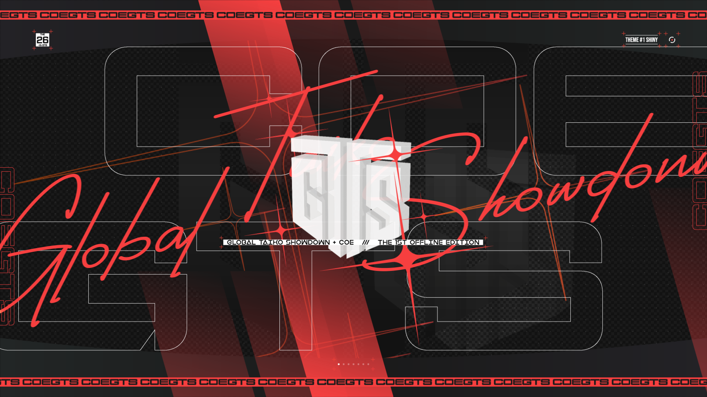

---
tags:
  - COEGTS 2023
  - COEGTS
  - COE GTS
  - COE GTS 2023
  - COE
  - cavoe's osu! event
  - GTS
---

# cavoe's osu! event's Global Taiko Showdown 2023

**cavoe's osu! event Global Taiko Showdown 2023** (***COEGTS 2023***) was a 1v1 single-elimination osu!taiko LAN tournament hosted by ::{ flag=FR }:: [Kasumi-sama](https://osu.ppy.sh/users/6177263) and ::{ flag=NL }:: [TaikoMom](https://osu.ppy.sh/users/9086438) during [cavoe's osu! event 2023 (COE 2023)](/wiki/Community/cavoe's_osu!_event/2023) at Brabanthallen in 's-Hertogenbosch, Netherlands. It was the first instalment of cavoe's osu! event's Global Taiko Showdown and the first offline tournament in the Global Taiko Showdown series.

## Tournament schedule

| Event | Timestamp (UTC+2) |
| --: | :-- |
| Registration phase | 2023-06-06/2023-06-25 |
| Screening phase | 2023-06-25/2023-07-09 |
| Qualifier mappool showcase | 2023-07-09 |
| Online qualifiers | 2023-07-15/2023-07-16 |
| Mappool showcase | 2023-07-31 (21:00) |
| Round of 16 | 2023-08-01 (14:00–22:00) |
| Quarterfinals to Finals | 2023-08-02 (14:00–22:00) |

The main mappool will be showcased on COE's stage. All stages and mappool showcases will be livestreamed on both GTS's and COE's Twitch channels.

## Prizes

| Placing | Prize(s) |
| :-: | :-- |
|  | Profile badge (pending), custom profile banner, grand physical prize |
|  | Custom profile banner, physical prize |
|  | Custom profile banner, physical prize |

## Organisation

cavoe's osu! event Global Taiko Showdown 2023 was run by various community members.

| Position | Member(s) |
| :-- | :-- |
| Organiser | ::{ flag=FR }:: [Kasumi-sama](https://osu.ppy.sh/users/6177263), ::{ flag=NL }:: [TaikoMom](https://osu.ppy.sh/users/9086438) |
| Mappool selector | ::{ flag=FR }:: [Briesmas](https://osu.ppy.sh/users/2865172), ::{ flag=HK }:: [Cynplytholowazy](https://osu.ppy.sh/users/3901754), ::{ flag=BR }:: [Ideal](https://osu.ppy.sh/users/3869519), ::{ flag=NO }:: [roufou](https://osu.ppy.sh/users/1109122) |
| Streamer | ::{ flag=FR }:: [Kasumi-sama](https://osu.ppy.sh/users/6177263), ::{ flag=NL }:: [TaikoMom](https://osu.ppy.sh/users/9086438) |
| Commentator | ::{ flag=US }:: [ETHN](https://osu.ppy.sh/users/9536977), ::{ flag=DE }:: [Joogs](https://osu.ppy.sh/users/8844167), ::{ flag=GB }:: [overdahedge2014](https://osu.ppy.sh/users/9864847), ::{ flag=NZ }:: [Sparxe](https://osu.ppy.sh/users/5750235), ::{ flag=GB }:: [Teezel](https://osu.ppy.sh/users/7528639) |
| Referee | ::{ flag=FR }:: [Kasumi-sama](https://osu.ppy.sh/users/6177263), ::{ flag=NL }:: [TaikoMom](https://osu.ppy.sh/users/9086438) |
| Mapper | ::{ flag=US }:: [5_5](https://osu.ppy.sh/users/6853438), ::{ flag=PT }:: [BabySnakes](https://osu.ppy.sh/users/4669728), ::{ flag=FR }:: [Briesmas](https://osu.ppy.sh/users/2865172), ::{ flag=HK }:: [Cynplytholowazy](https://osu.ppy.sh/users/3901754), ::{ flag=EC }:: [Gamelan4](https://osu.ppy.sh/users/9856910), ::{ flag=BR }:: [HiroK](https://osu.ppy.sh/users/4050738), ::{ flag=TN }:: [Hivie](https://osu.ppy.sh/users/14102976), ::{ flag=BR }:: [Ideal](https://osu.ppy.sh/users/3869519), ::{ flag=MY }:: [MTNTWarz](https://osu.ppy.sh/users/14036825), ::{ flag=DE }:: [Mew](https://osu.ppy.sh/users/2345156), ::{ flag=DE }:: [Nwolf](https://osu.ppy.sh/users/1910766), ::{ flag=TH }:: [Ph0eNiiXZ](https://osu.ppy.sh/users/9463721), ::{ flag=SE }:: [Raphalge](https://osu.ppy.sh/users/3918650), ::{ flag=NL }:: [TaikoMom](https://osu.ppy.sh/users/9086438), ::{ flag=TW }:: [X a v y](https://osu.ppy.sh/users/3738344), ::{ flag=US }:: [Yujki](https://osu.ppy.sh/users/14987094), ::{ flag=JP }:: [_Rise](https://osu.ppy.sh/users/5217107), ::{ flag=FR }:: [_yosh](https://osu.ppy.sh/users/7157133), ::{ flag=MY }:: [ler1211](https://osu.ppy.sh/users/19901680), ::{ flag=NO }:: [roufou](https://osu.ppy.sh/users/1109122) |
| Designer | ::{ flag=ID }:: [Aikosa](https://osu.ppy.sh/users/17730569), ::{ flag=MY }:: [Iyouka](https://osu.ppy.sh/users/7138499), ::{ flag=MY }:: [Jerry](https://osu.ppy.sh/users/605973), ::{ flag=PH }:: [OsuMe65](https://osu.ppy.sh/users/852867), ::{ flag=KR }:: [POCARI SWEAT](https://osu.ppy.sh/users/5082685), ::{ flag=HK }:: Transendium, ::{ flag=TH }:: [YuugenP](https://osu.ppy.sh/users/2014016), ::{ flag=MY }:: [[Zeth]](https://osu.ppy.sh/users/9912966) |
| Playtester | ::{ flag=US }:: [FrootLoopy542](https://osu.ppy.sh/users/5468461), ::{ flag=JP }:: [Grape_Tea](https://osu.ppy.sh/users/9540073), ::{ flag=GB }:: [overdahedge2014](https://osu.ppy.sh/users/9864847) |

## Links

- [Discussion thread](https://osu.ppy.sh/community/forums/topics/1775360)
- [GTS website](https://gtsosu.com/coegts/home)
- Livestream
  - [coevent](https://www.twitch.tv/coevent)
  - [GTSosu](https://www.twitch.tv/gtsosu)
  - [GTSosu\_b](https://www.twitch.tv/gtsosu_b)
- [COE Discord server](https://discord.com/invite/d6ru6PVcSY)
- [GTS Discord server](https://discord.com/invite/3mGC3HB)
- [COE Twitter](https://twitter.com/CavoesOsuEvent)
- [GTS Twitter](https://twitter.com/GTSosu)

## Participants

| Seed | Members |
| :-- | :-- |
| Top | ::{ flag=US }:: [AuroraPhasmata](https://osu.ppy.sh/users/13664116), ::{ flag=FI }:: [Mazzuli500](https://osu.ppy.sh/users/10648818), ::{ flag=IT }:: [D3kuu](https://osu.ppy.sh/users/7807444), ::{ flag=GB }:: [mangomizer](https://osu.ppy.sh/users/1893718) |
| High | ::{ flag=IT }:: [Ikkun](https://osu.ppy.sh/users/1059945), ::{ flag=DE }:: [Drecksackblase](https://osu.ppy.sh/users/6278008), ::{ flag=US }:: [Chupalika](https://osu.ppy.sh/users/1926383), ::{ flag=FI }:: [MEGAMELA](https://osu.ppy.sh/users/13613362) |
| Low | ::{ flag=NL }:: [Cookie_Tree](https://osu.ppy.sh/users/502722), ::{ flag=NL }:: [Krekker](https://osu.ppy.sh/users/8265940), ::{ flag=NL }:: [StrijkIjzer](https://osu.ppy.sh/users/4130926), ::{ flag=PL }:: [Qroissant](https://osu.ppy.sh/users/9511518) |
| Unseeded | ::{ flag=NL }:: [ikin5050](https://osu.ppy.sh/users/4007649), ::{ flag=NL }:: [Edesto](https://osu.ppy.sh/users/5088562), ::{ flag=GB }:: [aceticke](https://osu.ppy.sh/users/8838763), ::{ flag=NL }:: [demonking7447](https://osu.ppy.sh/users/11094496) |
| Eliminated | ::{ flag=DE }:: [afe](https://osu.ppy.sh/users/7344333), ::{ flag=DE }:: [ERA Punish](https://osu.ppy.sh/users/10615367), ::{ flag=DE }:: [Musubi](https://osu.ppy.sh/users/9562353) |

## Podium

This competition has come to an end and resulted in the following podium:

| Placing | Player |
| :-: | :-- |
|  | ::{ flag=US }:: [AuroraPhasmata](https://osu.ppy.sh/users/13664116) |
|  | ::{ flag=IT }:: [D3kuu](https://osu.ppy.sh/users/7807444) |
|  | ::{ flag=FI }:: [Mazzuli500](https://osu.ppy.sh/users/10648818) |

## Mappools

### Finals

- No Mod
  1. [xi - OBAMA DiVE (blobdash as "blobama" Bootleg) (Cynplytholowazy) [OBAMA DIMENSIONS]](https://osu.ppy.sh/beatmapsets/2036517#taiko/4247073)
  2. [Ludicin - Onus Regulus (Nwolf) [Against Overwhelming Odds]](https://osu.ppy.sh/beatmapsets/2036523#taiko/4247080)
  3. [Sydosys - Lunar Gateway (Gamelan4) [Molniya-M]](https://osu.ppy.sh/beatmapsets/2036508#taiko/4247062)
  4. [Sot-C - Extra Stage (5_5) [extra soup]](https://osu.ppy.sh/beatmapsets/2036499#taiko/4247052)
  5. [ITHAQUA - aoi kokoro (\_Rise) [hivie & \_rise's beloved]](https://osu.ppy.sh/beatmapsets/2036468#taiko/4246968)
  6. [LuzeriA - Nbt-Hwt (Mew) [The Pharaoh's Curse]](https://osu.ppy.sh/beatmapsets/2036532#taiko/4247092)
- Hidden
  1. [kou - Spectrum (Yujki) [Refraction]](https://osu.ppy.sh/beatmapsets/2036533#taiko/4247093)
  2. [Anfini - Gratia (X a v y) [Grace]](https://osu.ppy.sh/beatmapsets/2036550#taiko/4247123)
- Hard Rock
  1. [Sparxe - overdaedge3000 (BabySnakes) [3014]](https://osu.ppy.sh/beatmapsets/2036544#taiko/4247115)
  2. [celtix - Niflheimr (Raphalge) [Inner Oni]](https://osu.ppy.sh/beatmapsets/2036540#taiko/4247111)
- Double Time
  1. [takehirotei - Global Disco Showdown (TaikoMom) [Back in Mom's Day]](https://osu.ppy.sh/beatmapsets/2036595#taiko/4247191)
  2. [dev - last remote (Ideal) [^-^]](https://osu.ppy.sh/beatmapsets/2036549#taiko/4247122)
- Force Mod
  1. [N_dog - Dusk in overnight (Ph0eNiiXZ) [Endless Twilight]](https://osu.ppy.sh/beatmapsets/2036555#taiko/4247132)
  2. [Rukadesu & 5KiLOBYTE - ETERNAL (Cynplytholowazy) [FROZEN]](https://osu.ppy.sh/beatmapsets/2036562#taiko/4247139)
  3. [SDMNE - SPIR!TUAL-BARRICADE+ (MTNTWarz) [-FRONT!ER+]](https://osu.ppy.sh/beatmapsets/2036566#taiko/4247145)
- Tiebreaker
  1. **[GTS Sound Team - <<wr/d.:maker>> ~Harmony in Reset~ (Cynplytholowazy) [<<catharsis/onus.:expedition>>]](https://osu.ppy.sh/beatmapsets/2036571#taiko/4247150)**

### Qualifiers

**[Download the mappack here (53 MB)](https://mega.nz/file/GAwRlRRB#Wiy2qfs3Zhy0_N295QW3nWfLyj5FXcijpRKawDaepOo)**

- No Mod
  1. [ADA - cof (HiroK) [Inner Oni]](https://osu.ppy.sh/beatmapsets/2023393#taiko/4214663)
  2. [Raphlesia - PSYCHO-BOMB (\_Rise) [Inner Oni]](https://osu.ppy.sh/beatmapsets/2023470#taiko/4214804)
  3. [HAGISOPH - Trip Coffee (Cynplytholowazy) [Overdose]](https://osu.ppy.sh/beatmapsets/2023383#taiko/4214652)
- Hidden
  1. [Kurubukko - Inner World Monologue (\_yosh) [Inner Oni]](https://osu.ppy.sh/beatmapsets/2023498#taiko/4214857)
  2. [ptar124 - OCTAGRAM \~Dai Happyaku Hachijuu Hachi Ji Makai Taisen\~ (uone) [Prologue]](https://osu.ppy.sh/beatmapsets/2023321#taiko/4214458)
- Hard Rock
  1. [Azurux - Get this drums (roufou) [rollfou style]](https://osu.ppy.sh/beatmapsets/2023371#taiko/4214627)
  2. [4nzu - Aimgalc Girl (Reslice) (ler1211) [Magical Gril]](https://osu.ppy.sh/beatmapsets/2023508#taiko/4214871)
- Double Time
  1. [Gomadare - Resolver (Nwolf) [Bug fixed: SV is gone]](https://osu.ppy.sh/beatmapsets/2023265#taiko/4214288)
  2. [SiLiS - Bodysnatch (TaikoMom) [Pod People Party]](https://osu.ppy.sh/beatmapsets/2023516#taiko/4214881)
- Force Mod
  1. [NormalM feat. Usagi Denki - Luminous Entities Lost Heart (Briesmas) [Inner Oni]](https://osu.ppy.sh/beatmapsets/2023493#taiko/4214841)

## Match results

### Finals

Tuesday, 1 August 2023:

| Player 1 |  |  | Player 2 | Match link |
| --: | :-: | :-: | :-- | :-- |
| **AuroraPhasmata** ::{ flag=US }:: | **5** | 0 | ::{ flag=NL }:: demonking7447 | [#1](https://osu.ppy.sh/community/matches/109785152) |
| **MEGAMELA** ::{ flag=FI }:: | **5** | 2 | ::{ flag=NL }:: Cookie_Tree | [#1](https://osu.ppy.sh/community/matches/109785722) |
| mangomizer ::{ flag=GB }:: | 4 | **5** | ::{ flag=NL }:: **ikin5050** | [#1](https://osu.ppy.sh/community/matches/109786593) |
| **Ikkun** ::{ flag=IT }:: | **5** | 3 | ::{ flag=PL }:: Qroissant | [#1](https://osu.ppy.sh/community/matches/109787561) |
| **Mazzuli500** ::{ flag=FI }:: | **5** | 0 | ::{ flag=GB }:: aceticke | [#1](https://osu.ppy.sh/community/matches/109787561) |
| **Chupalika** ::{ flag=US }:: | **5** | 2 | ::{ flag=NL }:: Krekker | [#1](https://osu.ppy.sh/community/matches/109789333) |
| **D3kuu** ::{ flag=IT }:: | **5** | 0 | ::{ flag=NL }:: Edesto | [#1](https://osu.ppy.sh/community/matches/109789921) |
| **Drecksackblase** ::{ flag=DE }:: | **5** | 3 | ::{ flag=NL }:: StrijkIjzer | [#1](https://osu.ppy.sh/community/matches/109791022) |

Wednesday, 2 August 2023:

| Player 1 |  |  | Player 2 | Match link |
| --: | :-: | :-: | :-- | :-- |
| **AuroraPhasmata** ::{ flag=US }:: | **5** | 1 | ::{ flag=FI }:: MEGAMELA | [#1](https://osu.ppy.sh/community/matches/109800365) |
| ikin5050 ::{ flag=NL }:: | 1 | **5** | ::{ flag=IT }:: **Ikkun** | [#1](https://osu.ppy.sh/community/matches/109800921) |
| **Mazzuli500** ::{ flag=FI }:: | **5** | 1 | ::{ flag=US }:: Chupalika | [#1](https://osu.ppy.sh/community/matches/109801615) |
| **D3kuu** ::{ flag=IT }:: | **5** | 2 | ::{ flag=DE }:: Drecksackblase | [#1](https://osu.ppy.sh/community/matches/109802526) |
| **AuroraPhasmata** ::{ flag=US }:: | **5** | 1 | ::{ flag=IT }:: Ikkun | [#1](https://osu.ppy.sh/community/matches/109803284) |
| Mazzuli500 ::{ flag=FI }:: | 4 | **5** | ::{ flag=IT }:: **D3kuu** | [#1](https://osu.ppy.sh/community/matches/109804176) |
| Ikkun ::{ flag=IT }:: | 4 | **7** | ::{ flag=FI }:: **Mazzuli500** | [#1](https://osu.ppy.sh/community/matches/109804928) |
| **AuroraPhasmata** ::{ flag=US }:: | **7** | 1 | ::{ flag=IT }:: D3kuu | [#1](https://osu.ppy.sh/community/matches/109806593) |

### Qualifiers

Detailed statistics for this round can be found on the [GTS website](https://gtsosu.com/coegts/stats#0) alongside the final standings on which players made it through to the next stage.

## Ruleset

The full detailed rules are viewable in the [COEGTS 2023 rulebook](https://gtsosu.com/public/COEGTS-2023-Rules.pdf).

### Tournament rules

1. The game mode being played is osu!taiko, and all matches will be played using ScoreV2.
2. No custom skin elements that alter core gameplay elements or mechanics are allowed, nor any modifications to the game not indended by the developer.
3. Should a participant not be present at the allotted match time they will be given a forfeit loss.
4. Participants are expected to keep the match running fluently and without intentional delays. Excessive match delays results in penalties being applied at the discretion of the referee.
5. During the LAN stages of the tournament, participants are required to inform tournament staff ahead of time which drivers they need for their equipment. Drivers must be open source or supplied by the manufacturer of the peripheral device.
6. Participants will be given the chance before any LAN matches to configure their drivers and the rest of the setup to their liking.
7. The tournament staff reserves the right to inspect any equipment brought by participants and deny their use upon suspicion of attempted foul play.
8. Instructions of the referees and the tournament management are to be followed. Decisions labeled as final are not to be objected to.
9. Participants will be sanctioned for any of the following, or attempts thereof:
   - Using insulting language and/or gestures, in-game or in person.
   - Gaining an unfair advantage through any means, including but not limited to:
     - Cheating software
     - Information abuse
     - Doping
   - Showing unsportsmanlike behavior.
   - Impersonation or being misleading regarding identity.
   - Deceiving or misleading referees.
   - Not putting in any effort to win a match / match fixing.
   - Not following osu! community guidelines.
   - Breaking any local laws.
   - Betting on any matches. This also applies to all staff.
   - Damaging any equipment of another person.
10. The tournament organisers and referees reserve the right to apply the rules in relation to the tournament and all its matches and give warnings and/or penalties to the participants at their discretion.
11. The tournament organisers reserve the right to modify these rules at any moment. Any such changes will be announced in advance.

### Registration

1. While there are no rank restrictions for this tournament, players wishing to participate must sign up on the [GTS website](https://gtsosu.com/coegts/home). Any osu!taiko player who has not been restricted within the past 12 months may participate.
2. Every player participating in this tournament, even the online qualifiers, must be able to attend [cavoe's osu! event 2023](/wiki/Community/cavoe's_osu!_event/2023) for the full duration of the tournament. Having at least a midweek ticket (*BYOC* or *Spectator*) is recommended.
3. Players must log in to the GTS website with their osu! account, connect their Discord account, and join the [GTS Discord server](https://discord.com/invite/3mGC3HB). Both accounts must be used during the entire tournament and no change can be made after signing up.
4. All participants will be screened by osu! staff and are expected to adhere to the [osu! community rules](/wiki/Rules) in addition to these rules.
5. No member of the tournament organisation may sign up for the tournament, with the exception of commentators.

### Qualifier instructions

1. During the qualifier, each participant will be given two attempts to set a high score on each map of the mappool. These attempts will be in lobbies scheduled during the weekend of 15 July 15 to 16 July.
2. The matches will start once the scheduled time is reached and a referee is present.
3. There will be no warm-ups during the match. The maps in the mappool will be played in order.
4. A short break is given between each map, the exact duration of which being at the discretion of the referee.
5. Rounds with disconnects within 30 seconds or 25% of the beatmap length, whichever happens first, may be replayed at the discretion of the referee, as long as the problem is clearly communicated in time.
6. The qualifier seeding will be based on the average placement of each player on each map. The top 16 seeded teams will advance to the main bracket.

### Main bracket instructions

1. The tournament proper consist of a single-elimination bracket, with an additional match deciding the third place. All matches will be direct 1v1 best-of-9 matches, except for the Finals match, which will be a best-of-13.
2. The match schedule is determined beforehand and cannot be changed. If a player cannot participate at the scheduled time the match will be forfeited, and a win by default will be handed to the other player if present. Any changes to the schedule will be announced in due time.
3. Participants may recheck and reconfigure their setup up to 15 minutes before the scheduled match time.
4. Once both players and a referee join a match, both players will begin by rolling, either physically or via the `!roll` command. Both players get to ban one beatmap during the match, starting with the loser of the roll. The players then alternate picks starting from the winner of the roll until either player gets enough points to win, or both players reach match point, in which case the tiebreaker is played.
5. Between each map there is a short break of 120 seconds during which the next map must be picked. If a player does not pick a map during that timespan, the referee will pick a random map from the mappool using `!roll X`, where X is the number of beatmaps that were neither picked nor banned, excluding the tiebreaker.
6. Rounds with disconnects within 30 seconds or 25% of the beatmap length, whichever happens first, may be replayed at the discretion of the referee, as long as the problem is clearly communicated in time.
7. Should a map end in a draw, the beatmap will be replayed before moving on to the next pick.

### Mappools

The mappools for each stage are structured as follows:

| Stage | Beatmaps |
| :-- | :-- |
| Qualifiers | 3 NM, 2 HD, 2 HR, 2 DT, 1 FM |
| Finals | 6 NM, 2 HD, 2 HR, 2 DT, 3 FM, 1 TB |

For Free Mod maps, players are required to pick either Hidden, Hard Rock, or use both mods at once. Not using any mod is not allowed.

All beatmaps have songs made specifically for this tournament — please enjoy.
