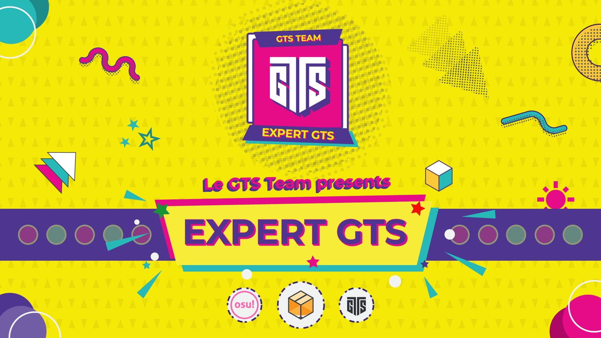
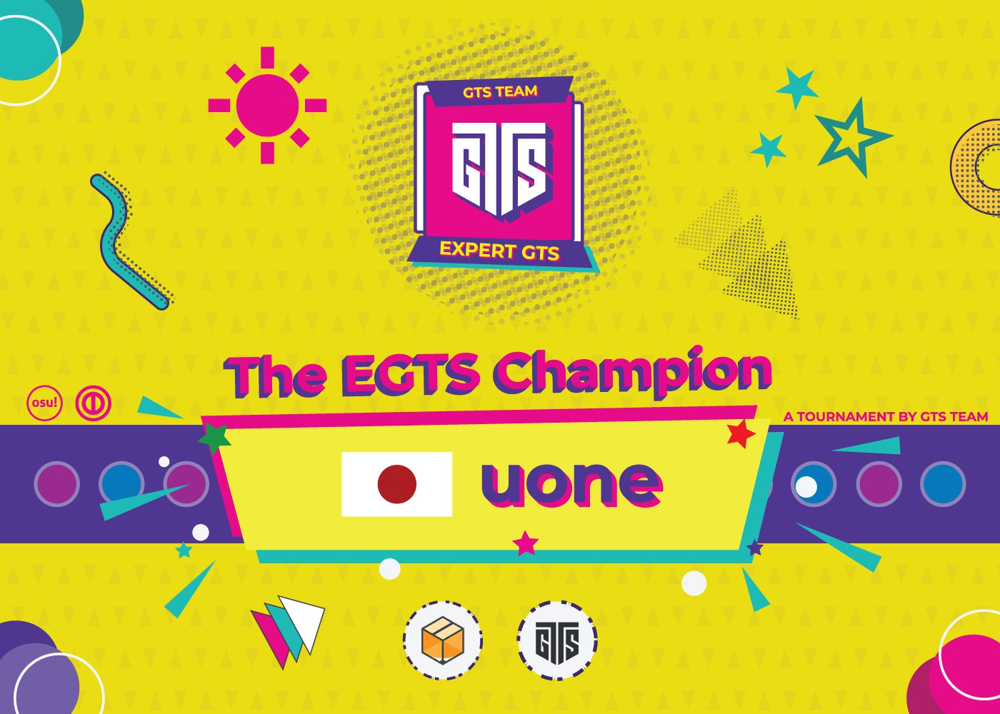
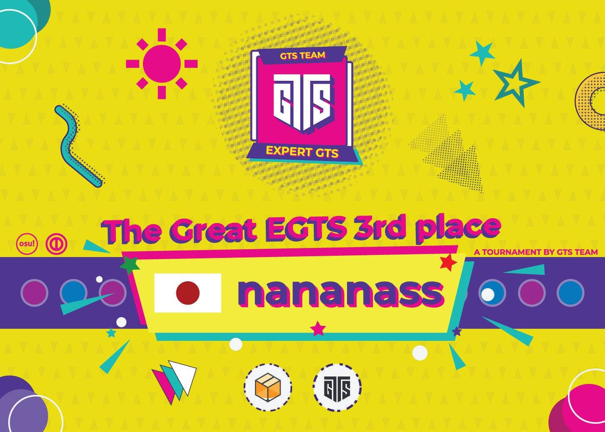

---
tags:
  - EGTS 2020
  - EGTS
  - GTS
---

# Expert Global Taiko Showdown 2020

The **Expert Global Taiko Showdown 2020** (***EGTS 2020***) was an expert worldwide double-elimination 1v1 osu!taiko tournament hosted by ::{ flag=FR }:: [Kasumii-sama](https://osu.ppy.sh/users/6177263), ::{ flag=FR }:: [Purettsu Eru](https://osu.ppy.sh/users/1542565), and ::{ flag=FR }:: [TLQ\_Yoshii](https://osu.ppy.sh/users/7157133). It was the first instalment of the Expert Global Taiko Showdown and part of the Global Taiko Showdown series.

## Tournament schedule

| Event | Timestamp |
| --: | :-- |
| Registration phase | 2020-05-03/2020-05-17 |
| Qualifiers | 2020-05-30/2020-05-31 |
| Group stage | 2020-06-06/2020-06-07 |
| Round of 32 | 2020-06-13/2020-06-14 |
| Round of 16 | 2020-06-19/2020-06-21 |
| Quarterfinals | 2020-06-27/2020-06-28 |
| Semifinals | 2020-07-04/2020-07-05 |
| Finals | 2020-07-11/2020-07-12 |
| Grand Finals | 2020-07-18 |

## Prizes

| Placing | Prize(s) |
| :-: | :-- |
|  | Unique profile badge, US$66 or 1 year of osu!supporter, GTS-themed mousepad |
|  | US$36 or 6 months of osu!supporter, GTS-themed mousepad |
|  | US$28 or 2 months of osu!supporter, GTS-themed mousepad |

Cash prizes were all provided by [Giveaway Cuties](https://discord.gg/f44GmgB) group and GTS-themed mousepads were sponsored and produced by [Foxbox](https://foxbox.io/).

## Organisation

The Expert Global Taiko Showdown 2020 was run by various community members.

| Position | Member(s) |
| :-- | :-- |
| Organizer | ::{ flag=FR }:: [Kasumii-sama](https://osu.ppy.sh/users/6177263), ::{ flag=FR }:: [Purettsu Eru](https://osu.ppy.sh/users/1542565), ::{ flag=FR }:: [TLQ\_Yoshii](https://osu.ppy.sh/users/7157133) |
| Mappool selector | ::{ flag=DE }:: [Capu](https://osu.ppy.sh/users/2474015), ::{ flag=US }:: [kb131313](https://osu.ppy.sh/users/11229259), ::{ flag=ES }:: [Raiden](https://osu.ppy.sh/users/2239480) |
| Referee | ::{ flag=HK }:: [Akali393394](https://osu.ppy.sh/users/9686628), ::{ flag=BR }:: [AnonX32](https://osu.ppy.sh/users/2730270), ::{ flag=AU }:: [Cactie](https://osu.ppy.sh/users/5592409), ::{ flag=CL }:: [Catulus](https://osu.ppy.sh/users/6276709), ::{ flag=DE }:: [Capu](https://osu.ppy.sh/users/2474015), ::{ flag=PL }:: [E-M-i](https://osu.ppy.sh/users/9148286), ::{ flag=DE }:: [GDLenny](https://osu.ppy.sh/users/8406711), ::{ flag=AU }:: [ill onion](https://osu.ppy.sh/users/8306102), ::{ flag=US }:: [JDrago14](https://osu.ppy.sh/users/7690078), ::{ flag=FR }:: [Kasumii-sama](https://osu.ppy.sh/users/6177263), ::{ flag=FR }:: [Mimir](https://osu.ppy.sh/users/7382734), ::{ flag=SE }:: [Nurend](https://osu.ppy.sh/users/9905079), ::{ flag=FR }:: [Purettsu Eru](https://osu.ppy.sh/users/1542565), ::{ flag=DE }:: [QEpicAce](https://osu.ppy.sh/users/9489153), ::{ flag=FR }:: [Satsukel](https://osu.ppy.sh/users/9066390), ::{ flag=DE }:: [Sayira](https://osu.ppy.sh/users/7253958), ::{ flag=RU }:: [Starger](https://osu.ppy.sh/users/3398715), ::{ flag=MY }:: [Stupid Idiot](https://osu.ppy.sh/users/8355574), ::{ flag=FR }:: [TLQ\_Yoshii](https://osu.ppy.sh/users/7157133) |
| Streamer | ::{ flag=BR }:: [AnonX32](https://osu.ppy.sh/users/2730270), ::{ flag=US }:: [cheese salad](https://osu.ppy.sh/users/6349821), ::{ flag=PL }:: [Deroo](https://osu.ppy.sh/users/8360475), ::{ flag=PL }:: [E-M-i](https://osu.ppy.sh/users/9148286), ::{ flag=FR }:: [Hifumin](https://osu.ppy.sh/users/7787785), ::{ flag=US }:: [ITotallyGetThat](https://osu.ppy.sh/users/8770622), ::{ flag=SE }:: [Mestro](https://osu.ppy.sh/users/4798263), ::{ flag=NL }:: [oliebol](https://osu.ppy.sh/users/2756335), ::{ flag=FR }:: [Purettsu Eru](https://osu.ppy.sh/users/1542565), ::{ flag=DE }:: [Sayira](https://osu.ppy.sh/users/7253958), ::{ flag=FR }:: [TLQ\_Yoshii](https://osu.ppy.sh/users/7157133) |
| Commentator | ::{ flag=AU }:: [AmateurMonkeyYT](https://osu.ppy.sh/users/8379046), ::{ flag=BR }:: [AnonX32](https://osu.ppy.sh/users/2730270), ::{ flag=AU }:: [Beat43210](https://osu.ppy.sh/users/5664171), ::{ flag=GB }:: [Doomsday](https://osu.ppy.sh/users/18983), ::{ flag=US }:: [Ethaaaan](https://osu.ppy.sh/users/9536977), ::{ flag=PL }:: [Finite](https://osu.ppy.sh/users/5385806), ::{ flag=EC }:: [Gamelan4](https://osu.ppy.sh/users/9856910), ::{ flag=DE }:: [Heam](https://osu.ppy.sh/users/4705120), ::{ flag=CA }:: [janitoreihil](https://osu.ppy.sh/users/3307897), ::{ flag=US }:: [JM-](https://osu.ppy.sh/users/10629673), ::{ flag=US }:: [kb131313](https://osu.ppy.sh/users/11229259), ::{ flag=US }:: [Loopy542](https://osu.ppy.sh/users/5468461), ::{ flag=DE }:: [Mew](https://osu.ppy.sh/users/2345156), ::{ flag=US }:: [Mister Boo](https://osu.ppy.sh/users/2598555), ::{ flag=DE }:: [QEpicAce](https://osu.ppy.sh/users/9489153), ::{ flag=SE }:: [Raphalge](https://osu.ppy.sh/users/3918650), ::{ flag=GB }:: [Teezel](https://osu.ppy.sh/users/7528639), ::{ flag=AR }:: [Vaf](https://osu.ppy.sh/users/12589048) |
| Designer | ::{ flag=ID }:: [fajar13k](https://osu.ppy.sh/users/7100002), ::{ flag=PH }:: [OsuMe65](https://osu.ppy.sh/users/852867), ::{ flag=KR }:: [POCARI SWEAT](https://osu.ppy.sh/users/5082685) |
| Translator | ::{ flag=JP }:: [\_Rise](https://osu.ppy.sh/users/5217107), ::{ flag=US }:: [0120](https://osu.ppy.sh/users/1901534), ::{ flag=BR }:: [AnonX32](https://osu.ppy.sh/users/2730270), ::{ flag=KR }:: [BamgoeSN](https://osu.ppy.sh/users/1152851), ::{ flag=MY }:: [cdhsausageboy](https://osu.ppy.sh/users/2403621), ::{ flag=EC }:: [Gamelan4](https://osu.ppy.sh/users/9856910), ::{ flag=IT }:: [LordEnder](https://osu.ppy.sh/users/4609767), ::{ flag=RU }:: [Starger](https://osu.ppy.sh/users/3398715), ::{ flag=FR }:: [TLQ\_Yoshii](https://osu.ppy.sh/users/7157133) |
| Developer | ::{ flag=US }:: [Cychloryn](https://osu.ppy.sh/users/6921736), ::{ flag=FR }:: [ThePooN](https://osu.ppy.sh/users/718454) |
| Wiki editor | ::{ flag=ID }:: [fajar13k](https://osu.ppy.sh/users/7100002) |

## Links

- [Discussion thread](https://osu.ppy.sh/community/forums/topics/1062772)
- [GTS Discord server](https://discord.gg/3mGC3HB)
- [GTS website](https://gtsosu.com/)
- Livestream
  - [GTSosu](https://www.twitch.tv/gtsosu)
  - [GTSosu\_b](https://www.twitch.tv/gtsosu_b)
- [Challonge brackets](https://challonge.com/EGTS2020)

## Participants

| Seed | Members |
| :-- | :-- |
| Top | ::{ flag=JP }:: [uone](https://osu.ppy.sh/users/5321719), ::{ flag=JP }:: [ekumea1123](https://osu.ppy.sh/users/9119501), ::{ flag=JP }:: [nekomusya1234](https://osu.ppy.sh/users/1382717), ::{ flag=CA }:: [janitore](https://osu.ppy.sh/users/3307897), ::{ flag=SG }:: [Blerargh](https://osu.ppy.sh/users/7609510), ::{ flag=JP }:: [zkane2](https://osu.ppy.sh/users/6359835), ::{ flag=ES }:: [AlvaroYL](https://osu.ppy.sh/users/6333166), ::{ flag=JP }:: [tamakagi2000](https://osu.ppy.sh/users/9540073), ::{ flag=CL }:: [Ulqui](https://osu.ppy.sh/users/1263669), ::{ flag=JP }:: [iceOC](https://osu.ppy.sh/users/5482401), ::{ flag=JP }:: [owatanimal](https://osu.ppy.sh/users/5769293), ::{ flag=JP }:: [nananass](https://osu.ppy.sh/users/7231722), ::{ flag=BR }:: [HiroK](https://osu.ppy.sh/users/4050738), ::{ flag=IT }:: [Ikkun](https://osu.ppy.sh/users/1059945), ::{ flag=KR }:: [BamgoeSN](https://osu.ppy.sh/users/1152851), ::{ flag=US }:: [Loopy542](https://osu.ppy.sh/users/5468461) |
| High | ::{ flag=DE }:: [Minekuchi](https://osu.ppy.sh/users/9584873), ::{ flag=CA }:: [Vysha](https://osu.ppy.sh/users/4908773), ::{ flag=BR }:: [Skull Kid](https://osu.ppy.sh/users/3044264), ::{ flag=US }:: [cheese salad](https://osu.ppy.sh/users/6349821), ::{ flag=BR }:: [Foxeru](https://osu.ppy.sh/users/7479684), ::{ flag=AR }:: [trollocat](https://osu.ppy.sh/users/9228032), ::{ flag=GR }:: [Genjuro](https://osu.ppy.sh/users/3196091), ::{ flag=IT }:: [D3kuu](https://osu.ppy.sh/users/7807444), ::{ flag=BR }:: [Kyoumo](https://osu.ppy.sh/users/8145223), ::{ flag=PL }:: [bernard351](https://osu.ppy.sh/users/9511518), ::{ flag=TW }:: [Yuemiao](https://osu.ppy.sh/users/4493348), ::{ flag=MY }:: [HHVanilla Ice](https://osu.ppy.sh/users/12803930), ::{ flag=JP }:: [Noko\_BSF](https://osu.ppy.sh/users/3811831), ::{ flag=GB }:: [Horiiizon](https://osu.ppy.sh/users/8071438), ::{ flag=JP }:: [shougi_55](https://osu.ppy.sh/users/10151766), ::{ flag=AR }:: [gaston\_2199](https://osu.ppy.sh/users/5938161) |
| Mid | ::{ flag=US }:: [jyake](https://osu.ppy.sh/users/9099822), ::{ flag=FR }:: [Ectomic](https://osu.ppy.sh/users/4069690), ::{ flag=JP }:: [amuzaK](https://osu.ppy.sh/users/3784062), ::{ flag=KR }:: [oL0](https://osu.ppy.sh/users/1134683), ::{ flag=JP }:: [butter0414](https://osu.ppy.sh/users/7935022), ::{ flag=MY }:: [\[Zeth\]](https://osu.ppy.sh/users/9912966), ::{ flag=AR }:: [BossPlays](https://osu.ppy.sh/users/7341471), ::{ flag=KR }:: [taeeunobrine](https://osu.ppy.sh/users/10894640), ::{ flag=US }:: [Etholux](https://osu.ppy.sh/users/8593837), ::{ flag=CH }:: [MC2BP](https://osu.ppy.sh/users/11296097), ::{ flag=ID }:: [Naverlyn](https://osu.ppy.sh/users/14324722), ::{ flag=FI }:: [vodnanen](https://osu.ppy.sh/users/10335557), ::{ flag=DE }:: [Drecksackblase](https://osu.ppy.sh/users/6278008), ::{ flag=BR }:: [Coryn](https://osu.ppy.sh/users/2828556), ::{ flag=IT }:: [LordEnder](https://osu.ppy.sh/users/4609767), ::{ flag=RU }:: [Dayzeek](https://osu.ppy.sh/users/5009970) |
| Low | ::{ flag=FI }:: [duski](https://osu.ppy.sh/users/6506484), ::{ flag=JP }:: [shakegohan\_jar](https://osu.ppy.sh/users/14088526), ::{ flag=IT }:: [A-40](https://osu.ppy.sh/users/14510301),::{ flag=AR }:: [Atreevete](https://osu.ppy.sh/users/2615199), ::{ flag=US }:: [AuroraPhasmata](https://osu.ppy.sh/users/13664116), ::{ flag=FR }:: [Gintoki8](https://osu.ppy.sh/users/2239411), ::{ flag=NL }:: [Krekker](https://osu.ppy.sh/users/8265940), ::{ flag=GB }:: [Metzo](https://osu.ppy.sh/users/10633982), ::{ flag=GR }:: [KostPer](https://osu.ppy.sh/users/10584732), ::{ flag=BO }:: [\[Jose20025\]](https://osu.ppy.sh/users/6623871), ::{ flag=US }:: [Garpo](https://osu.ppy.sh/users/4097035), ::{ flag=US }:: [Ethaaaan](https://osu.ppy.sh/users/9536977), ::{ flag=US }:: [driodx](https://osu.ppy.sh/users/9709548), ::{ flag=AU }:: [Tsubasa2](https://osu.ppy.sh/users/6835183), ::{ flag=US }:: [Backfire](https://osu.ppy.sh/users/263110), ::{ flag=BE }:: [XOlifreX](https://osu.ppy.sh/users/4328137) |
| Eliminated | ::{ flag=RU }:: [cloudfags](https://osu.ppy.sh/users/5285786), ::{ flag=AU }:: [Beat43210](https://osu.ppy.sh/users/5664171), ::{ flag=PL }:: [Agresywny Arbuz](https://osu.ppy.sh/users/7056658), ::{ flag=SG }:: [SilverSufuru](https://osu.ppy.sh/users/3769280), ::{ flag=EC }:: [Gamelan4](https://osu.ppy.sh/users/9856910), ::{ flag=GB }:: [hammygames](https://osu.ppy.sh/users/12232503), ::{ flag=TR }:: [NeuralG](https://osu.ppy.sh/users/13811400), ::{ flag=NL }:: [jesse-98](https://osu.ppy.sh/users/502722), ::{ flag=RU }:: [TwinT](https://osu.ppy.sh/users/9976154), ::{ flag=MX }:: [Yahiyahir](https://osu.ppy.sh/users/6932264), ::{ flag=CR }:: [Hotman](https://osu.ppy.sh/users/7902082), ::{ flag=FI }:: [YERTI](https://osu.ppy.sh/users/1490757), ::{ flag=IT }:: [VenomPlus](https://osu.ppy.sh/users/7722827), ::{ flag=JP }:: [BluePlusSymbol](https://osu.ppy.sh/users/6503700), ::{ flag=US }:: [giyokon](https://osu.ppy.sh/users/10852632), ::{ flag=US }:: [Glaceon-](https://osu.ppy.sh/users/6395930), ::{ flag=MX }:: [Ammy](https://osu.ppy.sh/users/4183406), ::{ flag=FI }:: [MEGAMELA](https://osu.ppy.sh/users/13613362), ::{ flag=NO }:: [1794766](https://osu.ppy.sh/users/1794766), ::{ flag=AT }:: [animexamera](https://osu.ppy.sh/users/7511357), ::{ flag=NO }:: [Mills](https://osu.ppy.sh/users/7234023), ::{ flag=NL }:: [ikin5050](https://osu.ppy.sh/users/4007649), ::{ flag=US }:: [3san](https://osu.ppy.sh/users/8050850), ::{ flag=NL }:: [Boaz](https://osu.ppy.sh/users/13302996), ::{ flag=GB }:: [w1ll](https://osu.ppy.sh/users/11406987), ::{ flag=DE }:: [Heam](https://osu.ppy.sh/users/4705120) |

## Groups

| Group | Top seed | High seed | Mid seed | Low seed |
| :-: | :-- | :-- | :-- | :-- |
| **A** | ::{ flag=JP }:: [owatanimal](https://osu.ppy.sh/users/5769293) | ::{ flag=US }:: [cheese salad](https://osu.ppy.sh/users/6349821) | ::{ flag=FR }:: [Ectomic](https://osu.ppy.sh/users/4069690) | ::{ flag=BE }:: [XOlifreX](https://osu.ppy.sh/users/4328137) |
| **B** | ::{ flag=CA }:: [janitore](https://osu.ppy.sh/users/3307897) | ::{ flag=CA }:: [Vysha](https://osu.ppy.sh/users/4908773) | ::{ flag=FI }:: [vodnanen](https://osu.ppy.sh/users/10335557) | ::{ flag=FR }:: [Gintoki8](https://osu.ppy.sh/users/2239411) |
| **C** | ::{ flag=JP }:: [uone](https://osu.ppy.sh/users/5321719) | ::{ flag=GR }:: [Genjuro](https://osu.ppy.sh/users/3196091) | ::{ flag=KR }:: [oL0](https://osu.ppy.sh/users/1134683) | ::{ flag=BO }:: [\[Jose20025\]](https://osu.ppy.sh/users/6623871) |
| **D** | ::{ flag=JP }:: [iceOC](https://osu.ppy.sh/users/5482401) | ::{ flag=JP }:: [Noko\_BSF](https://osu.ppy.sh/users/3811831) | ::{ flag=JP }:: [amuzaK](https://osu.ppy.sh/users/3784062) | ::{ flag=FI }:: [duski](https://osu.ppy.sh/users/6506484) |
| **E** | ::{ flag=JP }:: [ekumea1123](https://osu.ppy.sh/users/9119501) | ::{ flag=BR }:: [Skull Kid](https://osu.ppy.sh/users/3044264) | ::{ flag=US }:: [Etholux](https://osu.ppy.sh/users/8593837) | ::{ flag=GB }:: [Metzo](https://osu.ppy.sh/users/10633982) |
| **F** | ::{ flag=IT }:: [Ikkun](https://osu.ppy.sh/users/1059945) | ::{ flag=JP }:: [shougi\_55](https://osu.ppy.sh/users/10151766) | ::{ flag=MY }:: [\[Zeth\]](https://osu.ppy.sh/users/9912966) | ::{ flag=NL }:: [Krekker](https://osu.ppy.sh/users/8265940) |
| **G** | ::{ flag=US }:: [Loopy542](https://osu.ppy.sh/users/5468461) | ::{ flag=BR }:: [Kyoumo](https://osu.ppy.sh/users/8145223) | ::{ flag=DE }:: [Drecksackblase](https://osu.ppy.sh/users/6278008) | ::{ flag=IT }:: [A-40](https://osu.ppy.sh/users/14510301) |
| **H** | ::{ flag=KR }:: [BamgoeSN](https://osu.ppy.sh/users/1152851) | ::{ flag=MY }:: [HHVanilla Ice](https://osu.ppy.sh/users/12803930) | ::{ flag=AR }:: [BossPlays](https://osu.ppy.sh/users/7341471) | ::{ flag=US }:: [Ethaaaan](https://osu.ppy.sh/users/9536977) |
| **I** | ::{ flag=JP }:: [tamakagi2000](https://osu.ppy.sh/users/9540073) | ::{ flag=BR }:: [Foxeru](https://osu.ppy.sh/users/7479684) | ::{ flag=JP }:: [butter0414](https://osu.ppy.sh/users/7935022) | ::{ flag=US }:: [AuroraPhasmata](https://osu.ppy.sh/users/13664116) |
| **J** | ::{ flag=ES }:: [AlvaroYL](https://osu.ppy.sh/users/6333166) | ::{ flag=DE }:: [Minekuchi](https://osu.ppy.sh/users/9584873) | ::{ flag=KR }:: [taeeunobrine](https://osu.ppy.sh/users/10894640) | ::{ flag=GR }:: [KostPer](https://osu.ppy.sh/users/10584732) |
| **K** | ::{ flag=SG }:: [Blerargh](https://osu.ppy.sh/users/7609510) | ::{ flag=TW }:: [Yuemiao](https://osu.ppy.sh/users/4493348) | ::{ flag=US }:: [jyake](https://osu.ppy.sh/users/9099822) | ::{ flag=AU }:: [Tsubasa2](https://osu.ppy.sh/users/6835183) |
| **L** | ::{ flag=JP }:: [nekomusya1234](https://osu.ppy.sh/users/1382717) | ::{ flag=AR }:: [gaston\_2199](https://osu.ppy.sh/users/5938161) | ::{ flag=ID }:: [Naverlyn](https://osu.ppy.sh/users/14324722) | ::{ flag=US }:: [Garpo](https://osu.ppy.sh/users/4097035) |
| **M** | ::{ flag=JP }:: [zkane2](https://osu.ppy.sh/users/6359835) | ::{ flag=AR }:: [trollocat](https://osu.ppy.sh/users/9228032) | ::{ flag=BR }:: [Coryn](https://osu.ppy.sh/users/2828556) | ::{ flag=JP }:: [shakegohan\_jar](https://osu.ppy.sh/users/14088526) |
| **N** | ::{ flag=BR }:: [HiroK](https://osu.ppy.sh/users/4050738) | ::{ flag=GB }:: [Horiiizon](https://osu.ppy.sh/users/8071438) | ::{ flag=IT }:: [LordEnder](https://osu.ppy.sh/users/4609767) | ::{ flag=AR }:: [Atreevete](https://osu.ppy.sh/users/2615199) |
| **O** | ::{ flag=JP }:: [nananass](https://osu.ppy.sh/users/7231722) | ::{ flag=IT }:: [D3kuu](https://osu.ppy.sh/users/7807444) | ::{ flag=CH }:: [MC2BP](https://osu.ppy.sh/users/11296097) | ::{ flag=US }:: [driodx](https://osu.ppy.sh/users/9709548) |
| **P** | ::{ flag=CL }:: [Ulqui](https://osu.ppy.sh/users/1263669) | ::{ flag=PL }:: [bernard351](https://osu.ppy.sh/users/9511518) | ::{ flag=RU }:: [Dayzeek](https://osu.ppy.sh/users/5009970) | ::{ flag=US }:: [Backfire](https://osu.ppy.sh/users/263110) |

## Podium

This competition has come to an end and resulted in the following podium:

| Placing | Player |
| :-: | :-- |
|  | ::{ flag=JP }:: [uone](https://osu.ppy.sh/users/5321719) |
|  | ::{ flag=CA }:: [janitore](https://osu.ppy.sh/users/3307897) |
|  | ::{ flag=JP }:: [nananass](https://osu.ppy.sh/users/7231722) |

## Mappools

### Grand Finals

**[Download the mappack here! (104 MB)](https://mega.nz/file/aclVlQwS#fGyyyAO-YKyrfonIwF-UvjVxuynRf-yRrPcXlFw4AtY)**

- NoMod
  1. [Kobaryo - Sugary Meteor (ikin5050) \[Candy Comet\]](https://osu.ppy.sh/beatmapsets/1164072#taiko/2428352)
  2. [Rin - Super Kazuya no Theme - Ocelot Remix (mariopokemon) \[Gachi Oni\]](https://osu.ppy.sh/beatmapsets/829586#taiko/2099597)
  3. [Archspire - Involuntary Doppelganger (LZD) \[Terror Oni\]](https://osu.ppy.sh/beatmapsets/640419#taiko/1358230)
  4. [Excision & Pegboard Nerds - Bring The Madness (Noisestorm Nightcore Remix) (Nwolf) \[True Madness\]](https://osu.ppy.sh/beatmapsets/665978#taiko/1449181)
  5. [UNDEAD CORPORATION - The Empress (Raiden) \[Borderline Insanity\]](https://osu.ppy.sh/beatmapsets/452051#taiko/2414397)
  6. [U-F SEQUENCER - Invisible -Poltergeist mix- (tasuke912) \[TAIKO-HOLIC\]](https://osu.ppy.sh/beatmapsets/888776#taiko/1857729)
- Hidden
  1. [Frums - 24eeev0-$ (Gamelan4) \[Cychlo's eeev0lution-$\]](https://osu.ppy.sh/beatmapsets/1111340#taiko/2341735)
  2. [Shirotsu x Ruika x SHIWV - Matsuri (Yuemiao) \[Matsuri\]](https://osu.ppy.sh/beatmapsets/1172158#taiko/2444817)
  3. [Frums - Pictured As Perfect (\[Zeth\]) \[Binary Hypostasis\]](https://osu.ppy.sh/beatmapsets/904814#taiko/1888610)
- HardRock
  1. [USAO - Dynamite (Extended Mix) (Nofool) \[EXPLOSION\]](https://osu.ppy.sh/beatmapsets/698621#taiko/1479572)
  2. [niconico douga - H.T.cocoa ha furufuru nanoka? (yyyyyyyyyyypetu) \[Cocoa is urusai\]](https://osu.ppy.sh/beatmapsets/411529#taiko/1099697)
  3. [pm04034 - Onis Keyboard (gaston\_2199) \[pianitox\]](https://osu.ppy.sh/beatmapsets/1176086#taiko/2453006)
- DoubleTime
  1. [MYLK - Smile (Original Mix) (Nardoxyribonucleic) \[Inner Oni\]](https://osu.ppy.sh/beatmapsets/1065517#taiko/2231210)
  2. [Whispered - Kensei (MrKosiej) \[LZD's Sacred Sword\]](https://osu.ppy.sh/beatmapsets/1079398#taiko/2420863)
  3. [The Quick Brown Fox - Gotsta Terrify (Smoothie) \[PhNyx's Taiko Oni\]](https://osu.ppy.sh/beatmapsets/50019#taiko/1483397)
- FreeMod
  1. [xi - Blue Zenith (Capu) \[Ura Oni\]](https://osu.ppy.sh/beatmapsets/971982#taiko/2035029)
  2. [ZOGRAPHOS (Yu\_Asahina+Yamajet) - Verse IV (Vulkin) \[Lose Your Rhythm\]](https://osu.ppy.sh/beatmapsets/863289#taiko/1805734)
  3. [M2U - PandorA (Skull Kid) \[Blossom\]](https://osu.ppy.sh/beatmapsets/935627#taiko/1954723)
- Tiebreaker
  1. **[Camellia - NIGHTMARE CITY (Alchyr) \[DEMISE\]](https://osu.ppy.sh/beatmapsets/1208054#taiko/2515535)**

### Finals

**[Download the mappack here! (114 MB)](https://mega.nz/file/wMQgSAqR#wC-Vu9lT-2IBHaCbQARRNg6Ie8UqfWnMSE_QtBFkS98)**

- NoMod
  1. [Disarmonia Mundi - Clay of Hate (Mew104) \[Defiance\]](https://osu.ppy.sh/beatmapsets/426802#taiko/921457)
  2. [xi remixed by BACO feat. Emyuu - Halcyon -MY INTERPRETATION- (Wilben\_Chan) \[Wilben alive\]](https://osu.ppy.sh/beatmapsets/1129452#taiko/2359500)
  3. [easynam - silly 300bpm thing (7\_7) \[why\]](https://osu.ppy.sh/beatmapsets/793594#taiko/1666549)
  4. [2go Aniki - Cutting the music (nyanmi-1828) \[ka\]](https://osu.ppy.sh/beatmapsets/756214#taiko/1592330)
  5. [lapix feat. Renko from ORANGEJAM - Concept Of Reality (janitoreihil) \[Alternate ReOnity\]](https://osu.ppy.sh/beatmapsets/948200#taiko/1980366)
  6. [LSD - Stimulant Beatmaps (maziari1105) \[KatHarSis\]](https://osu.ppy.sh/beatmapsets/597075#taiko/1262365)
- Hidden
  1. [SENTIVE - Kaze no Yukue -2nd- (tasuke912) \[Wind\]](https://osu.ppy.sh/beatmapsets/970490#taiko/2031381)
  2. [Igorrr - Cheval (DukeDukeDura) \[DukeDukeDura's Oni\]](https://osu.ppy.sh/beatmapsets/624683#taiko/1318435)
  3. [Camellia - KillerBeast (Capu) \[Inner Oni\]](https://osu.ppy.sh/beatmapsets/1069639#taiko/2239078)
- HardRock
  1. [455-38B - gengaozo\_foon (applerss) \[Inner oni\]](https://osu.ppy.sh/beatmapsets/465321#taiko/996160)
  2. [RVFS - hatsu miku time (7\_7) \[bitch\]](https://osu.ppy.sh/beatmapsets/1140583#taiko/2382371)
  3. [BilliumMoto - 1xMISS (rubies87) \[99.92% (Ura Oni)\]](https://osu.ppy.sh/beatmapsets/1079811#taiko/2259190)
- DoubleTime
  1. [xi feat. Sta - Tiferet (yea) \[Master\]](https://osu.ppy.sh/beatmapsets/1073757#taiko/2247312)
  2. [Avalanch - Torquemada (Hanjamon) \[Inner Oni\]](https://osu.ppy.sh/beatmapsets/648914#taiko/1374716)
  3. [t+pazolite - Angelic Jelly (komasy) \[Angelic Oni\]](https://osu.ppy.sh/beatmapsets/690516#taiko/1461399)
- FreeMod
  1. [Erehamonika remixed by kors k - Der Wald (Kors K Remix) (Nofool) \[Insane Oni\]](https://osu.ppy.sh/beatmapsets/432406#taiko/1302635)
  2. [Run Girls, Run! - Share the light (TV Size) (realy0\_) \[Luminous Oni\]](https://osu.ppy.sh/beatmapsets/1128443#taiko/2357606)
  3. [Subheroine - 8tp46UgZ (applerss) \[6me21OzA\]](https://osu.ppy.sh/beatmapsets/1118042#taiko/2335417)
- Tiebreaker
  1. **[Xenoglossy - Kaihai no Northbridge (tasuke912) \[TAIKO-HOLIC\]](https://osu.ppy.sh/beatmapsets/868552#taiko/1815417)**

### Semifinals

**[Download the mappack here! (146 MB)](https://mega.nz/file/tkUHQAjR#2k1H5DMRaY4cwsSDrMX1zM3MjxV0ZU9m-_J2sf-6f-I)**

- NoMod
  1. [KASAI HARCORES - CYCLE HIT (offbeat swap edit) (Midnaait) \[Streki\]](https://osu.ppy.sh/beatmapsets/996644#taiko/2084655)
  2. [tarolabo - eth ken (\_DUSK\_) \[blossom\]](https://osu.ppy.sh/beatmapsets/1041596#taiko/2176932)
  3. [Jeff Williams feat. Casey Lee Williams & Lamar Hall - Ignite (HiroK) \[Inner Oni\]](https://osu.ppy.sh/beatmapsets/1039891#taiko/2173618)
  4. [Daddy Yankee - El Ritmo no Perdona (Myckoll) \[Tula Oni\]](https://osu.ppy.sh/beatmapsets/706309#taiko/1493576)
  5. [Camellia - Shun no Shifudo o Ikashita Kare Fumi Paeria (Nishizumi) \[Kraken\]](https://osu.ppy.sh/beatmapsets/542058#taiko/1149263)
  6. [(Seiryu) - AO-INFINITY (Nofool) \[Inner Oni\]](https://osu.ppy.sh/beatmapsets/869505#taiko/1817188)
- Hidden
  1. [Nakanojojo - Pararara (feat. Amekoya) (tasuke912) \[Oni\]](https://osu.ppy.sh/beatmapsets/930806#taiko/1943719)
  2. [xi - Glorious Crown (asuasu\_yura) \[Special\]](https://osu.ppy.sh/beatmapsets/806381#taiko/1692612)
  3. [sakuraburst - SELF DESTRUCT (\_DUSK\_) \[METASTABLE ONI\]](https://osu.ppy.sh/beatmapsets/963193#taiko/2016673)
- HardRock
  1. [Camellia vs. Akira Complex - Railgun Roulette (VIP) (Capu) \[H1gumo's Ammunition (EGTS Ver.)\]](https://osu.ppy.sh/beatmapsets/1201995#taiko/2503320)
  2. [Dz'Xa - Koinikko no Breaktime 2020 (applerss) \[Broken Clock\]](https://osu.ppy.sh/beatmapsets/1121466#taiko/2343521)
  3. [xyst - Ylil's overed landscape (SKSalt) \[komasy's Inner Oni\]](https://osu.ppy.sh/beatmapsets/897948#taiko/1887454)
- DoubleTime
  1. [Digital Math - The Musky Thrust (Jaltzu) \[Inner Oni\]](https://osu.ppy.sh/beatmapsets/1153833#taiko/2408145)
  2. [Denkare - Unbind (lolcubes) \[Unbound Deluxe\]](https://osu.ppy.sh/beatmapsets/239315#taiko/553271)
  3. [NU-KO - Pochiko no Shiawase na Nichijou (kanopu) \[TK'S Oni\]](https://osu.ppy.sh/beatmapsets/298187#taiko/673168)
- FreeMod
  1. [DROELOE - Limbo (Ulqui) \[Space Distortion\]](https://osu.ppy.sh/beatmapsets/831958#taiko/1743082)
  2. [nato - Nyarlathotep (Brasil) \[Inner Oni\]](https://osu.ppy.sh/beatmapsets/1146787#taiko/2394581)
  3. [BEATMARIO - Night of Knights (7jasmine) \[(USAO Remix) Rabi Style\]](https://osu.ppy.sh/beatmapsets/1140363#taiko/2385038)
- Tiebreaker
  1. **[Frums - Nisemono (\_yu68) \[Pseudo\]](https://osu.ppy.sh/beatmapsets/1111785#taiko/2322902)**

### Quarterfinals

**[Download the mappack here! (75 MB)](https://mega.nz/file/slcQgCIT#0RqamEOOC5qARyfbVBgQJPkj_nhXBVIlQSGv2Xxcv9M)**

- NoMod
  1. [lapix - Carry Me Away (Extended Mix) (juanilp4evr) \[Oni\]](https://osu.ppy.sh/beatmapsets/835912#taiko/1750641)
  2. [Toby Fox - Spider Dance (Camellia Remix) (nananass) \[Oni\]](https://osu.ppy.sh/beatmapsets/565493#taiko/1195443)
  3. [Camellia - Venomous Firefly (rezi888) \[Little Bug Storm\]](https://osu.ppy.sh/beatmapsets/853179#taiko/1783147)
  4. [sasakure.UK - The illegaL QueeN (tkdLolly) \[twcLolly\]](https://osu.ppy.sh/beatmapsets/881484#taiko/1843044)
  5. [Jaroslav Beck - Legend (feat. Backchat) (Nofool) \[Oni (fast)\]](https://osu.ppy.sh/beatmapsets/781553#taiko/1641403)
- Hidden
  1. [SHK - Super Fantasy (aabc271) \[Inner Oni+\]](https://osu.ppy.sh/beatmapsets/541523#taiko/1148729)
  2. [Shikkoku no EBONY - CHERNOBOG (roufou) \[NIGHTMARE ONI\]](https://osu.ppy.sh/beatmapsets/596366#taiko/2079191)
- HardRock
  1. [fn(ArcaeaSoundTeam) - Red and Blue and Green (\[\_Chichinya\_\]) \[Future\]](https://osu.ppy.sh/beatmapsets/952471#taiko/1988860)
  2. [t+pazolite - OTENAMI Hurricane (Kaxei) \[Inner Oni\]](https://osu.ppy.sh/beatmapsets/992992#taiko/2322038)
- DoubleTime
  1. [O2i3 - How to make Slime (Faputa) \[Inner Oni\]](https://osu.ppy.sh/beatmapsets/1135207#taiko/2370881)
  2. [Furries in a Blender - Storm World (Hanjamon) \[Inner Oni\]](https://osu.ppy.sh/beatmapsets/322150#taiko/716320)
- FreeMod
  1. [wa. vs ETIA. - Akasagarbha (\_DUSK\_) \[Perpetual\]](https://osu.ppy.sh/beatmapsets/709333#taiko/1499439)
  2. [seatrus - morgenrote (ekumea1123) \[Inner Oni\]](https://osu.ppy.sh/beatmapsets/1121619#taiko/2343813)
  3. [Uesaka Sumire - POP TEAM EPIC(YUKIYANAGI's Dubstep Edit) (KitajimaYN) \[Ahhhhhhh!!!!!!!\]](https://osu.ppy.sh/beatmapsets/751580#taiko/1583035)
- Tiebreaker
  1. **[Camellia - FM Synthesis Experiment (\[Zeth\]) \[Modulation Matrix\]](https://osu.ppy.sh/beatmapsets/1104178#taiko/2307191)**

### Round of 16

**[Download the mappack here! (78 MB)](https://mega.nz/file/QxtHyCaS#rk1W0mK1WpvzHUnNUf3H_klW3NimfDtjCFKgjplds94)**

- NoMod
  1. [Camellia - Kono Hoshi de... (\_DUSK\_) \[Raph's Inner Oni\]](https://osu.ppy.sh/beatmapsets/773105#taiko/1625231)
  2. [nitro - \[line:theta\] (rubies87) \[Omega\]](https://osu.ppy.sh/beatmapsets/948419#taiko/1980740)
  3. [cosMo@bousouP feat. Hatsune Miku, GUMI - Colorful Voice (Cychloryn) \[Supersonic Oni\]](https://osu.ppy.sh/beatmapsets/1032465#taiko/2177259)
  4. [Dokuzuhonsya - Fam Fam Time! (taiko\_ryuki) \[Family Oni\]](https://osu.ppy.sh/beatmapsets/1040917#taiko/2175422)
- Hidden
  1. [SHK - Identity Part II (aabc271) \[Inner Oni\]](https://osu.ppy.sh/beatmapsets/369708#taiko/810148)
  2. [Kotori - Nanamori (youth Remix) (nyanmi-1828) \[Two-side up\]](https://osu.ppy.sh/beatmapsets/1018730#taiko/2131733)
- HardRock
  1. [High Speed Music Team Sharpnel - Exciting Hyper Highspeed Star (Zetera) \[Inner Oni\]](https://osu.ppy.sh/beatmapsets/769006#taiko/1617086)
  2. [Sakamoto eizo x Takahama Yusuke - UNDEAD HEART(ikari no Warriors) (Firce777) \[Oni (Tatsujin)\]](https://osu.ppy.sh/beatmapsets/586605#taiko/1242251)
- DoubleTime
  1. [tarolabo - Kowatori (Nyan) \[Oni\]](https://osu.ppy.sh/beatmapsets/593543#taiko/1255681)
  2. [Hello Sleepwalkers - Shinwa Houkai (Capu) \[Inner Oni\]](https://osu.ppy.sh/beatmapsets/874856#taiko/1828391)
- FreeMod
  1. [DJ Ozawa - Tokyo (Innovaderz Remix) (Capu) \[Inner Oni\]](https://osu.ppy.sh/beatmapsets/1154042#taiko/2408517)
  2. [Akita Neru - Gotya Gotya Uruse! (Nofool) \[Inner Oni\]](https://osu.ppy.sh/beatmapsets/764965#taiko/1608469)
  3. [KNOWER - Overtime (Live Band Session) (Nifty) \[Inner Onitime (Live Drum Session)\]](https://osu.ppy.sh/beatmapsets/983446#taiko/2057888)
- Tiebreaker
  1. **[Nego\_tiator - Past megalopolis, twilight. (3san) \[A future, so bright.\]](https://osu.ppy.sh/beatmapsets/1097013#taiko/2292280)**

### Round of 32

**[Download the mappack here! (61 MB)](https://mega.nz/file/9ssTSZ6J#EcuBoSKqbP5jmmXzMIOaq8enDEHwKWJxszktBglurlA)**

- NoMod
  1. [Feryquitous - Lifill (SKSalt) \[Lifill Oni\]](https://osu.ppy.sh/beatmapsets/455031#taiko/975429)
  2. [M-O-T-U - Calculator (Midnaait) \[Quick Maths\]](https://osu.ppy.sh/beatmapsets/1184559#taiko/2469324)
  3. [katagiri - Reso\*nyan\*ce Fever (hoku-4625) \[hoku's Fever ^-^\]](https://osu.ppy.sh/beatmapsets/775555#taiko/1629729)
  4. [xi - Shoujo Kisokyoku \~ Speed Battle (Nofool) \[Hard Oni\]](https://osu.ppy.sh/beatmapsets/386135#taiko/843189)
- Hidden
  1. [Dokyou Kyoudai - DIAVOLO (Mrriichi) \[Mid's Inner Oni\]](https://osu.ppy.sh/beatmapsets/355440#taiko/806659)
  2. [Shiron + Kofu x Morimori Atsushi to Teikyo de okuri shimasu - Demise Quartet (Aras25) \[Sur x Shin's Inner Oni\]](https://osu.ppy.sh/beatmapsets/463431#taiko/1002365)
- HardRock
  1. [Fotzu - POTOMIRU PINERA (Vulkin) \[Axer's POTONI\]](https://osu.ppy.sh/beatmapsets/1118321#taiko/2394147)
  2. [Zekk - Hatsukoi Memories (namaniku) \[Inner Oni\]](https://osu.ppy.sh/beatmapsets/690025#taiko/1460477)
- DoubleTime
  1. [Yasui Yousuke - SUPER-REFLEX (Zetera) \[SUPER-ONI\]](https://osu.ppy.sh/beatmapsets/994476#taiko/2079306)
  2. [Endorfin. - Luminous Rage -Feryquitous OrderBless Remix- (SKSalt) \[Oni\]](https://osu.ppy.sh/beatmapsets/942719#taiko/1968637)
- FreeMod
  1. [Croove - BRAIN STORM (Trapmaniac) \[Ura Oni\]](https://osu.ppy.sh/beatmapsets/807990#taiko/1695649)
  2. [Eagle - Hypersonik (Michiru) \[23-'s Inner Oni\]](https://osu.ppy.sh/beatmapsets/985854#taiko/2064162)
  3. [Thaehan - Bwa ! (Nifty) \[Inner Oni\]](https://osu.ppy.sh/beatmapsets/1067599#taiko/2235174)
- Tiebreaker
  1. **[Unlucky Morpheus - FAITH / Konoha Tengu (Vulkin) \[Etherial Reward\]](https://osu.ppy.sh/beatmapsets/1024314#taiko/2142598)**

### Group stage

**[Download the mappack here! (83 MB)](https://mega.nz/file/NhsX1DTK#ckqXprnucBJI39-xweZF8PkFKshLIQfSX7Rl2kGglNQ)**

- NoMod
  1. [Omoi - Teo (asuasu\_yura) \[Expert\]](https://osu.ppy.sh/beatmapsets/799079#taiko/1677846)
  2. [Camellia - JDM (Jungle Dance Music) (Nishizumi) \[Dancing Oni\]](https://osu.ppy.sh/beatmapsets/911589#taiko/1902900)
  3. [Kano - Sukisuki Zecchoushou (incandescence) \[Inner Oni\]](https://osu.ppy.sh/beatmapsets/776399#taiko/1631310)
  4. [xi - Caramel Custard (tasuke912) \[Oni\]](https://osu.ppy.sh/beatmapsets/633825#taiko/1345081)
- Hidden
  1. [t+pazolite - Troll The Cowardly (Sick Candy Terror Of Feryquitous) (tasuke912) \[Oni\]](https://osu.ppy.sh/beatmapsets/808095#taiko/1695840)
  2. [Makai Toshi Niigata - Ukiyoe Yokochou (EdamaMe411) \[Inner Oni\]](https://osu.ppy.sh/beatmapsets/837057#taiko/1752691)
- HardRock
  1. [Hibiki Sakura & Naruzou Machio - Onegai Muscle (Mtell Remix) (KitajimaYN) \[Mascle Col\]](https://osu.ppy.sh/beatmapsets/1027991#taiko/2149532)
  2. [ayaponzu\* - Yakubyougami (gaston_2199) \[Inner Oni\]](https://osu.ppy.sh/beatmapsets/742938#taiko/1659898)
- DoubleTime
  1. [Hatsuki Yura - confession -Mitsuyaku Langage- (asuasu\_yura) \[Oni\]](https://osu.ppy.sh/beatmapsets/748786#taiko/1577369)
  2. [kradness - Senbonzakura (Love) \[Oni\]](https://osu.ppy.sh/beatmapsets/168367#taiko/408658)
- FreeMod
  1. [Uinyasu.Otthokobunny - Aa Kenran no Yume ga Gotoku(Epsilon Remix) (asuasu\_yura) \[Oni\]](https://osu.ppy.sh/beatmapsets/734435#taiko/1549623)
  2. [Getty - Pump It (yea) \[Lunatic Oni\]](https://osu.ppy.sh/beatmapsets/721544#taiko/1523623)
  3. [mafumafu - Hello Dystopia (JarvisGaming) \[Collapsing Reality\]](https://osu.ppy.sh/beatmapsets/809048#taiko/1697683)
- Tiebreaker
  1. **[Camellia - Luin of Celtchar (Yummy-) \[Fiery Lance\]](https://osu.ppy.sh/beatmapsets/1022227#taiko/2138687)**

### Qualifiers

**[Download the mappack here! (20 MB)](https://mega.nz/file/Up932KQS#LK5botTXGb5SwHu-P0aI5xHegT8WmXbQpN1Dm5Fb_74)**

- NoMod
  1. [BlackY - KITTY FOILED (TKS) \[Inner Oni\]](https://osu.ppy.sh/beatmapsets/903288#taiko/1885701)
  2. [xi - Parousia (D o t) \[Inner Oni\]](https://osu.ppy.sh/beatmapsets/956026#taiko/1997110)
- Hidden
  1. [lapix - Nexta (TKS) \[Inner Oni\]](https://osu.ppy.sh/beatmapsets/726669#taiko/1534162)
- HardRock
  1. [Umeboshi Chazuke - Galaxy in Toybox (asuasu\_yura) \[Oni\]](https://osu.ppy.sh/beatmapsets/709493#taiko/1499865)
- DoubleTime
  1. [DJ Fresh - Gold Dust (Vyiuri) \[Oni\]](https://osu.ppy.sh/beatmapsets/981799#taiko/2054840)

## Match results

### Grand Finals

Saturday, 18 July 2020:

| Player 1 |  |  | Player 2 | Match link |
| --: | :-: | :-: | :-- | :-- |
| janitore ::{ flag=CA }:: | 0 | **7** | ::{ flag=JP }:: **uone** | [#1](https://osu.ppy.sh/community/matches/64250146) |
| **uone** ::{ flag=JP }:: | **7** | 2 | ::{ flag=CA }:: janitore | [#1](https://osu.ppy.sh/community/matches/64251696) |

### Finals

Saturday, 11 July 2020:

| Player 1 |  |  | Player 2 | Match link |
| --: | :-: | :-: | :-- | :-- |
| Ulqui ::{ flag=CL }:: | 1 | **7** | ::{ flag=JP }:: **uone** | [#1](https://osu.ppy.sh/community/matches/63951594) |
| nananass ::{ flag=JP }:: | 1 | **7** | ::{ flag=CA }:: **janitore** | [#1](https://osu.ppy.sh/community/matches/63952919) |

Sunday, 12 July 2020:

| Player 1 |  |  | Player 2 | Match link |
| --: | :-: | :-: | :-- | :-- |
| nananass ::{ flag=JP }:: | 1 | **7** | ::{ flag=JP }:: **uone** | [#1](https://osu.ppy.sh/community/matches/64003514) |

### Semifinals

Saturday, 4 July 2020:

| Player 1 |  |  | Player 2 | Match link |
| --: | :-: | :-: | :-- | :-- |
| **janitore** ::{ flag=CA }:: | **7** | 5 | ::{ flag=JP }:: nekomusya1234 | [#1](https://osu.ppy.sh/community/matches/63684101) |
| ekumea1123 ::{ flag=JP }:: | 3 | **7** | ::{ flag=CL }:: **Ulqui** | [#1](https://osu.ppy.sh/community/matches/63686178) |
| **nananass** ::{ flag=JP }:: | **7** | 4 | ::{ flag=JP }:: uone | [#1](https://osu.ppy.sh/community/matches/63690713) |
| **iceOC** ::{ flag=JP }:: | **7** | 1 | ::{ flag=ES }:: AlvaroYL | [#1](https://osu.ppy.sh/community/matches/63694464) |

Sunday, 5 July 2020:

| Player 1 |  |  | Player 2 | Match link |
| --: | :-: | :-: | :-- | :-- |
| nekomusya1234 ::{ flag=JP }:: | 2 | **7** | ::{ flag=CL }:: **Ulqui** | [#1](https://osu.ppy.sh/community/matches/63724583) |
| **uone** ::{ flag=JP }:: | **7** | 2 | ::{ flag=JP }:: iceOC | [#1](https://osu.ppy.sh/community/matches/63735706) |

### Quarterfinals

Saturday, 27 June 2020:

| Player 1 |  |  | Player 2 | Match link |
| --: | :-: | :-: | :-- | :-- |
| **nananass** ::{ flag=JP }:: | **6** | 1 | ::{ flag=JP }:: tamakagi2000 | [#1](https://osu.ppy.sh/community/matches/63421067) |
| butter0414 ::{ flag=JP }:: | 0 | **6** | ::{ flag=CL }:: **Chile** | [#1](https://osu.ppy.sh/community/matches/63421102) |
| \[Zeth\] ::{ flag=MY }:: | -1 | **0** | ::{ flag=JP }:: **zkane2** | [#1](https://osu.ppy.sh/community/matches/63426642) |
| **uone** ::{ flag=JP }:: | **6** | 2 | ::{ flag=JP }:: ekumea1123 | [#1](https://osu.ppy.sh/community/matches/63433858) |
| Minekuchi ::{ flag=DE }:: | 1 | **6** | ::{ flag=JP }:: **owatanimal** | [#1](https://osu.ppy.sh/community/matches/63435758) |
| **Ikkun** ::{ flag=IT }:: | **6** | 4 | ::{ flag=BR }:: HiroK | [#1](https://osu.ppy.sh/community/matches/63441391) |
| **janitore** ::{ flag=CA }:: | **6** | 0 | ::{ flag=ES }:: AlvaroYL | [#1](https://osu.ppy.sh/community/matches/63443286) |

Sunday, 28 June 2020:

| Player 1 |  |  | Player 2 | Match link |
| --: | :-: | :-: | :-- | :-- |
| tamakagi2000 ::{ flag=JP }:: | 3 | **6** | ::{ flag=CL }:: **Ulqui** | [#1](https://osu.ppy.sh/community/matches/63458529) |
| iceOC ::{ flag=JP }:: | 3 | **6** | ::{ flag=JP }:: **nekomusya1234** | [#1](https://osu.ppy.sh/community/matches/63469196) |
| **AlvaroYL** ::{ flag=ES }:: | **6** | 3 | ::{ flag=JP }:: owatanimal | [#1](https://osu.ppy.sh/community/matches/63469157) |
| **ekumea1123** ::{ flag=JP }:: | **6** | 0 | ::{ flag=IT }:: Ikkun | [#1](https://osu.ppy.sh/community/matches/63470007) |
| **iceOC** ::{ flag=JP }:: | **6** | 1 | ::{ flag=JP }:: zkane2 | [#1](https://osu.ppy.sh/community/matches/63471465) |

### Round of 16

Friday, 19 June 2020:

| Player 1 |  |  | Player 2 | Match link |
| --: | :-: | :-: | :-- | :-- |
| Minekuchi ::{ flag=DE }:: | 2 | **5** | ::{ flag=JP }:: **tamakagi2000** | [#1](https://osu.ppy.sh/community/matches/63144466) |

Saturday, 20 June 2020:

| Player 1 |  |  | Player 2 | Match link |
| --: | :-: | :-: | :-- | :-- |
| owatanimal ::{ flag=JP }:: | 1 | **5** | ::{ flag=JP }:: **nananass** | [#1](https://osu.ppy.sh/community/matches/63155273) |
| butter0414 ::{ flag=JP }:: | 1 | **5** | ::{ flag=ES }:: **AlvaroYL** | [#1](https://osu.ppy.sh/community/matches/63160196) |
| **iceOC** ::{ flag=JP }:: | **5** | 1 | ::{ flag=BR }:: HiroK | [#1](https://osu.ppy.sh/community/matches/63161761) |
| Ikkun ::{ flag=IT }:: | 4 | **5** | ::{ flag=JP }:: **nekomusya1234** | [#1](https://osu.ppy.sh/community/matches/63161766) |
| **ekumea1123** ::{ flag=JP }:: | **5** | 0 | ::{ flag=MY }:: \[Zeth\] | [#1](https://osu.ppy.sh/community/matches/63163447) |
| **janitore** ::{ flag=CA }:: | **5** | 0 | ::{ flag=CL }:: Ulqui | [#1](https://osu.ppy.sh/community/matches/63177466) |

Sunday, 21 June 2020:

| Player 1 |  |  | Player 2 | Match link |
| --: | :-: | :-: | :-- | :-- |
| **owatanimal** ::{ flag=JP }:: | **5** | 0 | ::{ flag=BR }:: Skull Kid | [#1](https://osu.ppy.sh/community/matches/63187824) |
| **Ulqui** ::{ flag=CL }:: | **5** | 1 | ::{ flag=AR }:: gaston\_2199 | [#1](https://osu.ppy.sh/community/matches/63190228) |
| **uone** ::{ flag=JP }:: | **5** | 1 | ::{ flag=JP }:: zkane2 | [#1](https://osu.ppy.sh/community/matches/63196837) |
| **\[Zeth\]** ::{ flag=MY }:: | **0** | -1 | ::{ flag=IT }:: D3kuu | *win by default* |
| **HiroK** ::{ flag=BR }:: | **5** | 3 | ::{ flag=KR }:: BamgoeSN | [#1](https://osu.ppy.sh/community/matches/63199536) |
| **butter0414** ::{ flag=JP }:: | **5** | 3 | ::{ flag=GB }:: Horiiizon | [#1](https://osu.ppy.sh/community/matches/63199457) |
| **Minekuchi** ::{ flag=DE }:: | **5** | 3 | ::{ flag=JP }:: shakegohan\_jar | [#1](https://osu.ppy.sh/community/matches/63202285) |
| **zkane2** ::{ flag=JP }:: | **5** | 1 | ::{ flag=BR }:: Kyoumo | [#1](https://osu.ppy.sh/community/matches/63202516) |
| **Ikkun** ::{ flag=IT }:: | **5** | 1 | ::{ flag=CA }:: Vysha | [#1](https://osu.ppy.sh/community/matches/63211764) |

### Round of 32

Saturday, 13 June 2020:

| Player 1 |  |  | Player 2 | Match link |
| --: | :-: | :-: | :-- | :-- |
| **nekomusya1234** ::{ flag=JP }:: | **5** | 3 | ::{ flag=BR }:: Skull Kid | [#1](https://osu.ppy.sh/community/matches/62857063) |
| **ekumea1123** ::{ flag=JP }:: | **5** | 0 | ::{ flag=AR }:: gaston\_2199 | [#1](https://osu.ppy.sh/community/matches/62857859) |
| **tamakagi2000** ::{ flag=JP }:: | **5** | 1 | ::{ flag=KR }:: BamgoeSN | [#1](https://osu.ppy.sh/community/matches/62858679) |
| **nananass** ::{ flag=JP }:: | **5** | 3 | ::{ flag=CA }:: Vysha | [#1](https://osu.ppy.sh/community/matches/62858683) |
| Ethaaaan ::{ flag=US }:: | 4 | **5** | ::{ flag=JP }:: **butter0414** | [#1](https://osu.ppy.sh/community/matches/62860070) |
| **zkane2** ::{ flag=JP }:: | **5** | 1 | ::{ flag=JP }:: Noko\_BSF | [#1](https://osu.ppy.sh/community/matches/62865867) |
| **Ikkun** ::{ flag=IT }:: | **5** | 0 | ::{ flag=TW }:: Yuemiao | [#1](https://osu.ppy.sh/community/matches/62868128) |
| **uone** ::{ flag=JP }:: | **5** | 1 | ::{ flag=GB }:: Horiiizon | [#1](https://osu.ppy.sh/community/matches/62869660) |
| **owatanimal** ::{ flag=JP }:: | **5** | 1 | ::{ flag=PL }:: bernard351 | [#1](https://osu.ppy.sh/community/matches/62870975) |
| **iceOC** ::{ flag=JP }:: | **5** | 1 | ::{ flag=JP }:: shakegohan\_jar | [#1](https://osu.ppy.sh/community/matches/62872399) |
| **AlvaroYL** ::{ flag=ES }:: | **5** | 2 | ::{ flag=BR }:: Kyoumo | [#1](https://osu.ppy.sh/community/matches/62876707) |
| jyake ::{ flag=US }:: | 2 | **5** | ::{ flag=MY }:: **\[Zeth\]** | [#1](https://osu.ppy.sh/community/matches/62880645) |
| **HiroK** ::{ flag=BR }:: | **0** | -1 | ::{ flag=GR }:: Genjuro | *win by default* |
| Loopy542 ::{ flag=US }:: | 2 | **5** | ::{ flag=DE }:: **Minekuchi** | [#1](https://osu.ppy.sh/community/matches/62887301) |
| **janitore** ::{ flag=CA }:: | **5** | 2 | ::{ flag=IT }:: D3kuu | [#1](https://osu.ppy.sh/community/matches/62889620) |
| **Ulqui** ::{ flag=CL }:: | **5** | 0 | ::{ flag=US }:: cheese salad | [#1](https://osu.ppy.sh/community/matches/62891833) |
| Ethaaaan ::{ flag=US }:: | 1 | **5** | ::{ flag=BR }:: **Kyoumo** | [#1](https://osu.ppy.sh/community/matches/62895717) |

Sunday, 14 June 2020:

| Player 1 |  |  | Player 2 | Match link |
| --: | :-: | :-: | :-- | :-- |
| **gaston\_2199** ::{ flag=AR }:: | **5** | 2 | ::{ flag=US }:: jyake | [#1](https://osu.ppy.sh/community/matches/62897291) |
| Loopy542 ::{ flag=US }:: | 3 | **5** | ::{ flag=KR }:: **BamgoeSN** | [#1](https://osu.ppy.sh/community/matches/62900241) |
| Yuemiao ::{ flag=TW }:: | 1 | **5** | ::{ flag=BR }:: **Skull Kid** | [#1](https://osu.ppy.sh/community/matches/62900371) |
| **Horiiizon** ::{ flag=GB }:: | **0** | -1 | ::{ flag=JP }:: Noko\_BSF | *win by default* |
| **shakegohan\_jar** ::{ flag=JP }:: | **0** | -1 | ::{ flag=GR }:: Genjuro | *win by default* |
| **D3kuu** ::{ flag=IT }:: | **5** | 3 | ::{ flag=US }:: cheese salad | [#1](https://osu.ppy.sh/community/matches/62922827) |
| bernard351 ::{ flag=PL }:: | 1 | **5** | ::{ flag=CA }:: **Vysha** | [#1](https://osu.ppy.sh/community/matches/62926745) |

### Group stage

Saturday, 6 June 2020:

| Player 1 |  |  | Player 2 | Match link |
| --: | :-: | :-: | :-- | :-- |
| **HHVanilla Ice** ::{ flag=MY }:: | **0** | -1 | ::{ flag=AR }:: BossPlays | *win by default* |
| AuroraPhasmata ::{ flag=US }:: | 0 | **5** | ::{ flag=BR }:: **Foxeru** | [#1](https://osu.ppy.sh/community/matches/62562333) |
| \[Jose20025\] ::{ flag=BO }:: | 0 | **5** | ::{ flag=JP }:: **uone** | [#1](https://osu.ppy.sh/community/matches/62563974) |
| **trollocat** ::{ flag=AR }:: | **5** | 1 | ::{ flag=BR }:: Coryn | [#1](https://osu.ppy.sh/community/matches/62563990) |
| butter0414 ::{ flag=JP }:: | 0 | **5** | ::{ flag=JP }:: **tamakagi2000** | [#1](https://osu.ppy.sh/community/matches/62563746) |
| **zkane2** ::{ flag=JP }:: | **5** | 0 | ::{ flag=AR }:: trollocat | [#1](https://osu.ppy.sh/community/matches/62565504) |
| **Coryn** ::{ flag=BR }:: | **5** | 4 | ::{ flag=JP }:: shakegohan\_jar | [#1](https://osu.ppy.sh/community/matches/62565518) |
| **ekumea1123** ::{ flag=JP }:: | **5** | 0 | ::{ flag=BR }:: Skull Kid | [#1](https://osu.ppy.sh/community/matches/62565485) |
| Blerargh ::{ flag=SG }:: | -1 | **0** | ::{ flag=TW }:: **Yuemiao** | *win by default* |
| **butter0414** ::{ flag=JP }:: | **5** | 2 | ::{ flag=US }:: AuroraPhasmata | [#1](https://osu.ppy.sh/community/matches/62565558) |
| **Ethaaaan** ::{ flag=US }:: | **5** | 1 | ::{ flag=KR }:: BamgoeSN | [#1](https://osu.ppy.sh/community/matches/62565545) |
| Coryn ::{ flag=BR }:: | 2 | **5** | ::{ flag=JP }:: **zkane2** | [#1](https://osu.ppy.sh/community/matches/62567066) |
| **BamgoeSN** ::{ flag=KR }:: | **5** | 4 | ::{ flag=MY }:: HHVanilla Ice | [#1](https://osu.ppy.sh/community/matches/62568685) |
| Yuemiao ::{ flag=TW }:: | 2 | **5** | ::{ flag=US }:: **jyake** | [#1](https://osu.ppy.sh/community/matches/62569799) |
| shougi\_55 ::{ flag=JP }:: | 2 | **5** | ::{ flag=MY }:: **\[Zeth\]** | [#1](https://osu.ppy.sh/community/matches/62571304) |
| Naverlyn ::{ flag=ID }:: | 0 | **5** | ::{ flag=JP }:: **nekomusya1234** | [#1](https://osu.ppy.sh/community/matches/62571260) |
| **owatanimal** ::{ flag=JP }:: | **5** | 4 | ::{ flag=US }:: cheese salad | [#1](https://osu.ppy.sh/community/matches/62572461) |
| amuzaK ::{ flag=JP }:: | 0 | **5** | ::{ flag=JP }:: **iceOC** | [#1](https://osu.ppy.sh/community/matches/62575099) |
| **nananass** ::{ flag=JP }:: | **5** | 1 | ::{ flag=IT }:: D3kuu | [#1](https://osu.ppy.sh/community/matches/62576321) |
| **Ikkun** ::{ flag=IT }:: | **5** | 0 | ::{ flag=JP }:: shougi\_55 | [#1](https://osu.ppy.sh/community/matches/62576329) |
| XOlifreX ::{ flag=BE }:: | 0 | **5** | ::{ flag=JP }:: **owatanimal** | [#1](https://osu.ppy.sh/community/matches/62576409) |
| **uone** ::{ flag=JP }:: | **5** | 0 | ::{ flag=GR }:: Genjuro | [#1](https://osu.ppy.sh/community/matches/62576381) |
| **iceOC** ::{ flag=JP }:: | **5** | 0 | ::{ flag=JP }:: Noko\_BSF | [#1](https://osu.ppy.sh/community/matches/62577780) |
| **D3kuu** ::{ flag=IT }:: | **5** | 0 | ::{ flag=CH }:: MC2BP | [#1](https://osu.ppy.sh/community/matches/62577838) |
| Metzo ::{ flag=GB }:: | 0 | **5** | ::{ flag=JP }:: **ekumea1123** | [#1](https://osu.ppy.sh/community/matches/62577844) |
| **Minekuchi** ::{ flag=DE }:: | **5** | 0 | ::{ flag=KR }:: taeeunobrine | [#1](https://osu.ppy.sh/community/matches/62577848) |
| **Horiiizon** ::{ flag=GB }:: | **5** | 4 | ::{ flag=IT }:: LordEnder | [#1](https://osu.ppy.sh/community/matches/62577856) |
| shakegohan\_jar ::{ flag=JP }:: | 0 | **5** | ::{ flag=JP }:: **zkane2** | [#1](https://osu.ppy.sh/community/matches/62579301) |
| duski ::{ flag=FI }:: | 1 | **5** | ::{ flag=JP }:: **iceOC** | [#1](https://osu.ppy.sh/community/matches/62579305) |
| Krekker ::{ flag=NL }:: | -1 | **0** | ::{ flag=IT }:: **Ikkun** | *win by default* |
| **Noko\_BSF** ::{ flag=JP }:: | **5** | 3 | ::{ flag=JP }:: amuzaK | [#1](https://osu.ppy.sh/community/matches/62579293) |
| KostPer ::{ flag=GR }:: | 0 | **5** | ::{ flag=ES }:: **AlvaroYL** | [#1](https://osu.ppy.sh/community/matches/62579427) |
| **bernard351** ::{ flag=PL }:: | **5** | 1 | ::{ flag=RU }:: Dayzeek | [#1](https://osu.ppy.sh/community/matches/62579434) |
| Genjuro ::{ flag=GR }:: | **5** | 2 | ::{ flag=KR }:: oL0 | [#1](https://osu.ppy.sh/community/matches/62579452) |
| Ectomic ::{ flag=FR }:: | 0 | **5** | ::{ flag=JP }:: **owatanimal** | [#1](https://osu.ppy.sh/community/matches/62579461) |
| Ectomic ::{ flag=FR }:: | -1 | **0** | ::{ flag=BE }:: **XOlifreX** | *win by default* |
| driodx ::{ flag=US }:: | 0 | **5** | ::{ flag=JP }:: **nananass** | [#1](https://osu.ppy.sh/community/matches/62581216) |
| Drecksackblase ::{ flag=DE }:: | 3 | **5** | ::{ flag=IT }:: **A-40** | [#1](https://osu.ppy.sh/community/matches/62581268) |
| **Kyoumo** ::{ flag=BR }:: | **5** | 2 | ::{ flag=DE }:: Drecksackblase | [#1](https://osu.ppy.sh/community/matches/62583188) |
| **vodnanen** ::{ flag=FI }:: | **5** | 0 | ::{ flag=FR }:: Gintoki8 | [#1](https://osu.ppy.sh/community/matches/62583356) |
| **AlvaroYL** ::{ flag=ES }:: | **5** | 3 | ::{ flag=DE }:: Minekuchi | [#1](https://osu.ppy.sh/community/matches/62583373) |
| Gintoki8 ::{ flag=FR }:: | 0 | **5** | ::{ flag=CA }:: **janitore** | [#1](https://osu.ppy.sh/community/matches/62587580) |
| **Loopy542** ::{ flag=US }:: | **5** | 1 | ::{ flag=BR }:: Kyoumo | [#1](https://osu.ppy.sh/community/matches/62589845) |
| XOlifreX ::{ flag=BE }:: | 0 | **5** | ::{ flag=US }:: **cheese salad** | [#1](https://osu.ppy.sh/community/matches/62589805) |
| Gintoki8 ::{ flag=FR }:: | 0 | **5** | ::{ flag=CA }:: **Vysha** | [#1](https://osu.ppy.sh/community/matches/62589626) |
| **Vysha** ::{ flag=CA }:: | **5** | 2 | ::{ flag=FI }:: vodnanen | [#1](https://osu.ppy.sh/community/matches/62591618) |
| **HiroK** ::{ flag=BR }:: | **5** | 1 | ::{ flag=GB }:: Horiiizon | [#1](https://osu.ppy.sh/community/matches/62589644), [#2](https://osu.ppy.sh/community/matches/62589644) |
| **Ulqui** ::{ flag=CL }:: | **5** | 1 | ::{ flag=PL }:: bernard351 | [#1](https://osu.ppy.sh/community/matches/62593948) |
| **cheese salad** ::{ flag=US }:: | **5** | 0 | ::{ flag=FR }:: Ectomic | [#1](https://osu.ppy.sh/community/matches/62594079) |
| vodnanen ::{ flag=FI }:: | 2 | **5** | ::{ flag=CA }:: **janitore** | [#1](https://osu.ppy.sh/community/matches/62596611) |
| Atreevete ::{ flag=AR }:: | 0 | **5** | ::{ flag=BR }:: **HiroK** | [#1](https://osu.ppy.sh/community/matches/62598961) |
| **Skull Kid** ::{ flag=BR }:: | **5** | 1 | ::{ flag=US }:: Etholux | [#1](https://osu.ppy.sh/community/matches/62600882) |
| **janitore** ::{ flag=CA }:: | **5** | 2 | ::{ flag=CA }:: Vysha | [#1](https://osu.ppy.sh/community/matches/62603147) |
| Backfire ::{ flag=US }:: | -1 | **0** | ::{ flag=CL }:: **Ulqui** | *win by default* |
| Foxeru ::{ flag=BR }:: | 1 | **5** | ::{ flag=JP }:: **butter0414** | [#1](https://osu.ppy.sh/community/matches/62603418) |
| **nekomusya1234** ::{ flag=JP }:: | **5** | 1 | ::{ flag=AR }:: gaston\_2199 | [#1](https://osu.ppy.sh/community/matches/62603425) |

Sunday, 7 June 2020:

| Player 1 |  |  | Player 2 | Match link |
| --: | :-: | :-: | :-- | :-- |
| **tamakagi2000** ::{ flag=JP }:: | **5** | 2 | ::{ flag=BR }:: Foxeru | [#1](https://osu.ppy.sh/community/matches/62604813) |
| jyake ::{ flag=US }:: | 4 | **5** | ::{ flag=SG }:: **Blerargh** | [#1](https://osu.ppy.sh/community/matches/62604818) |
| **Ethaaaan** ::{ flag=US }:: | **5** | 3 | ::{ flag=MY }:: HHVanilla Ice | [#1](https://osu.ppy.sh/community/matches/62606430) |
| **shakegohan\_jar** ::{ flag=JP }:: | **5** | 2 | ::{ flag=AR }:: trollocat | [#1](https://osu.ppy.sh/community/matches/62606449) |
| **gaston\_2199** ::{ flag=AR }:: | **0** | -1 | ::{ flag=ID }:: Naverlyn | *win by default* |
| **oL0** ::{ flag=KR }:: | **5** | 4 | ::{ flag=BO }:: \[Jose20025\] | [#1](https://osu.ppy.sh/community/matches/62606431) |
| Etholux ::{ flag=US }:: | 1 | **5** | ::{ flag=JP }:: **ekumea1123** | [#1](https://osu.ppy.sh/community/matches/62607645) |
| AuroraPhasmata ::{ flag=US }:: | 0 | **5** | ::{ flag=JP }:: **tamakagi2000** | [#1](https://osu.ppy.sh/community/matches/62607648) |
| **jyake** ::{ flag=US }:: | **5** | 0 | ::{ flag=AU }:: Tsubasa2 | [#1](https://osu.ppy.sh/community/matches/62608064) |
| Garpo ::{ flag=US }:: | 0 | **5** | ::{ flag=JP }:: **nekomusya1234** | [#1](https://osu.ppy.sh/community/matches/62609087) |
| Tsubasa2 ::{ flag=AU }:: | 1 | **5** | ::{ flag=TW }:: **Yuemiao** | [#1](https://osu.ppy.sh/community/matches/62610693) |
| Tsubasa2 ::{ flag=AU }:: | 0 | **5** | ::{ flag=SG }:: **Blerargh** | [#1](https://osu.ppy.sh/community/matches/62612124) |
| taeeunobrine ::{ flag=KR }:: | 0 | **5** | ::{ flag=ES }:: **AlvaroYL** | [#1](https://osu.ppy.sh/community/matches/62616170) |
| Krekker ::{ flag=NL }:: | -1 | **0** | ::{ flag=JP }:: **shougi\_55** | *win by default* |
| **taeeunobrine** ::{ flag=KR }:: | **5** | 2 | ::{ flag=GR }:: KostPer | [#1](https://osu.ppy.sh/community/matches/62618684) |
| oL0 ::{ flag=KR }:: | 0 | **5** | ::{ flag=JP }:: **uone** | [#1](https://osu.ppy.sh/community/matches/62618725) |
| MC2BP ::{ flag=CH }:: | 1 | **5** | ::{ flag=JP }:: **nananass** | [#1](https://osu.ppy.sh/community/matches/62619982) |
| amuzaK ::{ flag=JP }:: | 3 | **5** | ::{ flag=FI }:: **duski** | [#1](https://osu.ppy.sh/community/matches/62619979) |
| \[Zeth\] ::{ flag=MY }:: | 0 | **5** | ::{ flag=IT }:: **Ikkun** | [#1](https://osu.ppy.sh/community/matches/62621499) |
| A-40 ::{ flag=IT }:: | 4 | **5** | ::{ flag=BR }:: **Kyoumo** | [#1](https://osu.ppy.sh/community/matches/62621496) |
| KostPer ::{ flag=GR }:: | 0 | **5** | ::{ flag=DE }:: **Minekuchi** | [#1](https://osu.ppy.sh/community/matches/62621624) |
| **\[Zeth\]** ::{ flag=MY }:: | **0** | -1 | ::{ flag=NL }:: Krekker | *win by default* |
| duski ::{ flag=FI }:: | 3 | **5** | ::{ flag=JP }:: **Noko\_BSF** | [#1](https://osu.ppy.sh/community/matches/62623475) |
| A-40 ::{ flag=IT }:: | 1 | **5** | ::{ flag=US }:: **Loopy542** | [#1](https://osu.ppy.sh/community/matches/62626498) |
| **Naverlyn** ::{ flag=ID }:: | **5** | 1 | ::{ flag=US }:: Garpo | [#1](https://osu.ppy.sh/community/matches/62627312) |
| Backfire ::{ flag=US }:: | 0 | 0 | ::{ flag=PL }:: bernard351 | *nullified* |
| LordEnder ::{ flag=IT }:: | 4 | **5** | ::{ flag=BR }:: **HiroK** | [#1](https://osu.ppy.sh/community/matches/62627575) |
| Metzo ::{ flag=GB }:: | 1 | **5** | ::{ flag=BR }:: **Skull Kid** | [#1](https://osu.ppy.sh/community/matches/62629268) |
| driodx ::{ flag=US }:: | 0 | **5** | ::{ flag=IT }:: **D3kuu** | [#1](https://osu.ppy.sh/community/matches/62629940) |
| **Dayzeek** ::{ flag=RU }:: | **0** | -1 | ::{ flag=US }:: Backfire | *win by default* |
| **LordEnder** ::{ flag=IT }:: | **5** | 0 | ::{ flag=AR }:: Atreevete | [#1](https://osu.ppy.sh/community/matches/62631334) |
| **Etholux** ::{ flag=US }:: | **5** | 1 | ::{ flag=GB }:: Metzo | [#1](https://osu.ppy.sh/community/matches/62633209) |
| Drecksackblase ::{ flag=DE }:: | 1 | **5** | ::{ flag=US }:: **Loopy542** | [#1](https://osu.ppy.sh/community/matches/62633214) |
| **MC2BP** ::{ flag=CH }:: | **5** | 0 | ::{ flag=US }:: driodx | [#1](https://osu.ppy.sh/community/matches/62633396) |
| \[Jose20025\] ::{ flag=BO }:: | 0 | **5** | ::{ flag=GR }:: **Genjuro** | [#1](https://osu.ppy.sh/community/matches/62635530) |
| Dayzeek ::{ flag=RU }:: | 0 | **5** | ::{ flag=CL }:: **Ulqui** | [#1](https://osu.ppy.sh/community/matches/62635557) |
| Atreevete ::{ flag=AR }:: | 2 | **5** | ::{ flag=GB }:: **Horiiizon** | [#1](https://osu.ppy.sh/community/matches/62638003) |
| Garpo ::{ flag=US }:: | 2 | **5** | ::{ flag=AR }:: **gaston\_2199** | [#1](https://osu.ppy.sh/community/matches/62642595) |

### Qualifiers

| Seed | Team | Average rank |
| --: | :-- | --: |
| #1 | ::{ flag=JP }:: [uone](https://osu.ppy.sh/users/5321719) | 1.2 |
| #2 | ::{ flag=JP }:: [ekumea1123](https://osu.ppy.sh/users/9119501) | 4 |
| #3 | ::{ flag=JP }:: [nekomusya1234](https://osu.ppy.sh/users/1382717) | 7.8 |
| #4 | ::{ flag=CA }:: [janitore](https://osu.ppy.sh/users/3307897) | 8.2 |
| #5 | ::{ flag=SG }:: [Blerargh](https://osu.ppy.sh/users/7609510) | 9.2 |
| #6 | ::{ flag=JP }:: [zkane2](https://osu.ppy.sh/users/6359835) | 9.6 |
| #7 | ::{ flag=ES }:: [AlvaroYL](https://osu.ppy.sh/users/6333166) | 10.4 |
| #8 | ::{ flag=JP }:: [tamakagi2000](https://osu.ppy.sh/users/9540073) | 10.8 |
| #9 | ::{ flag=CL }:: [Ulqui](https://osu.ppy.sh/users/1263669) | 11.2 |
| #10 | ::{ flag=JP }:: [iceOC](https://osu.ppy.sh/users/5482401) | 11.4 |
| #11 | ::{ flag=JP }:: [owatanimal](https://osu.ppy.sh/users/5769293) | 12 |
| #11 | ::{ flag=JP }:: [nananass](https://osu.ppy.sh/users/7231722) | 12 |
| #13 | ::{ flag=BR }:: [HiroK](https://osu.ppy.sh/users/4050738) | 12.4 |
| #14 | ::{ flag=IT }:: [Ikkun](https://osu.ppy.sh/users/1059945) | 15.2 |
| #15 | ::{ flag=KR }:: [BamgoeSN](https://osu.ppy.sh/users/1152851) | 17.2 |
| #15 | ::{ flag=US }:: [Loopy542](https://osu.ppy.sh/users/5468461) | 17.2 |
| #17 | ::{ flag=DE }:: [Minekuchi](https://osu.ppy.sh/users/9584873) | 17.8 |
| #18 | ::{ flag=CA }:: [Vysha](https://osu.ppy.sh/users/4908773) | 20.8 |
| #19 | ::{ flag=BR }:: [Skull Kid](https://osu.ppy.sh/users/3044264) | 21.8 |
| #20 | ::{ flag=US }:: [cheese salad](https://osu.ppy.sh/users/6349821) | 24.4 |
| #21 | ::{ flag=BR }:: [Foxeru](https://osu.ppy.sh/users/7479684) | 25.4 |
| #22 | ::{ flag=AR }:: [trollocat](https://osu.ppy.sh/users/9228032) | 27 |
| #23 | ::{ flag=GR }:: [Genjuro](https://osu.ppy.sh/users/3196091) | 27.8 |
| #24 | ::{ flag=IT }:: [D3kuu](https://osu.ppy.sh/users/7807444) | 31.8 |
| #25 | ::{ flag=BR }:: [Kyoumo](https://osu.ppy.sh/users/8145223) | 33.2 |
| #26 | ::{ flag=PL }:: [bernard351](https://osu.ppy.sh/users/9511518) | 33.4 |
| #27 | ::{ flag=TW }:: [Yuemiao](https://osu.ppy.sh/users/4493348) | 33.8 |
| #28 | ::{ flag=MY }:: [HHVanilla Ice](https://osu.ppy.sh/users/12803930) | 34 |
| #29 | ::{ flag=JP }:: [Noko\_BSF](https://osu.ppy.sh/users/3811831) | 34.2 |
| #29 | ::{ flag=GB }:: [Horiiizon](https://osu.ppy.sh/users/8071438) | 34.2 |
| #31 | ::{ flag=JP }:: [shougi_55](https://osu.ppy.sh/users/10151766) | 34.6 |
| #32 | ::{ flag=AR }:: [gaston\_2199](https://osu.ppy.sh/users/5938161) | 34.8 |
| #33 | ::{ flag=US }:: [jyake](https://osu.ppy.sh/users/9099822) | 35 |
| #34 | ::{ flag=FR }:: [Ectomic](https://osu.ppy.sh/users/4069690) | 35.8 |
| #35 | ::{ flag=JP }:: [amuzaK](https://osu.ppy.sh/users/3784062) | 36.6 |
| #36 | ::{ flag=KR }:: [oL0](https://osu.ppy.sh/users/1134683) | 36.8 |
| #37 | ::{ flag=JP }:: [butter0414](https://osu.ppy.sh/users/7935022) | 37.2 |
| #37 | ::{ flag=MY }:: [\[Zeth\]](https://osu.ppy.sh/users/9912966) | 37.2 |
| #39 | ::{ flag=AR }:: [BossPlays](https://osu.ppy.sh/users/7341471) | 37.4 |
| #40 | ::{ flag=KR }:: [taeeunobrine](https://osu.ppy.sh/users/10894640) | 39.6 |
| #41 | ::{ flag=US }:: [Etholux](https://osu.ppy.sh/users/8593837) | 41.4 |
| #42 | ::{ flag=CH }:: [MC2BP](https://osu.ppy.sh/users/11296097) | 42.4 |
| #43 | ::{ flag=ID }:: [Naverlyn](https://osu.ppy.sh/users/14324722) | 44.2 |
| #44 | ::{ flag=FI }:: [vodnanen](https://osu.ppy.sh/users/10335557) | 44.6 |
| #45 | ::{ flag=DE }:: [Drecksackblase](https://osu.ppy.sh/users/6278008) | 45.2 |
| #46 | ::{ flag=BR }:: [Coryn](https://osu.ppy.sh/users/2828556) | 45.6 |
| #47 | ::{ flag=IT }:: [LordEnder](https://osu.ppy.sh/users/4609767) | 46 |
| #48 | ::{ flag=RU }:: [Dayzeek](https://osu.ppy.sh/users/5009970) | 46.4 |
| #49 | ::{ flag=FI }:: [duski](https://osu.ppy.sh/users/6506484) | 47 |
| #50 | ::{ flag=JP }:: [shakegohan\_jar](https://osu.ppy.sh/users/14088526) | 50 |
| #51 | ::{ flag=IT }:: [A-40](https://osu.ppy.sh/users/14510301) | 50.6 |
| #52 | ::{ flag=AR }:: [Atreevete](https://osu.ppy.sh/users/2615199) | 51.8 |
| #53 | ::{ flag=US }:: [AuroraPhasmata](https://osu.ppy.sh/users/13664116) | 53 |
| #54 | ::{ flag=FR }:: [Gintoki8](https://osu.ppy.sh/users/2239411) | 54.2 |
| #54 | ::{ flag=NL }:: [Krekker](https://osu.ppy.sh/users/8265940) | 54.2 |
| #56 | ::{ flag=GB }:: [Metzo](https://osu.ppy.sh/users/10633982) | 54.6 |
| #57 | ::{ flag=GR }:: [KostPer](https://osu.ppy.sh/users/10584732) | 57 |
| #58 | ::{ flag=BO }:: [\[Jose20025\]](https://osu.ppy.sh/users/6623871) | 57.2 |
| #59 | ::{ flag=US }:: [Garpo](https://osu.ppy.sh/users/4097035) | 57.4 |
| #59 | ::{ flag=US }:: [Ethaaaan](https://osu.ppy.sh/users/9536977) | 57.4 |
| #61 | ::{ flag=US }:: [driodx](https://osu.ppy.sh/users/9709548) | 57.6 |
| #62 | ::{ flag=AU }:: [Tsubasa2](https://osu.ppy.sh/users/6835183) | 57.8 |
| #63 | ::{ flag=US }:: [Backfire](https://osu.ppy.sh/users/263110) | 60.2 |
| #64 | ::{ flag=BE }:: [XOlifreX](https://osu.ppy.sh/users/4328137) | 61.8 |
| #65 | ::{ flag=RU }:: [cloudfags](https://osu.ppy.sh/users/5285786) | 62 |
| #66 | ::{ flag=AU }:: [Beat43210](https://osu.ppy.sh/users/5664171) | 64 |
| #67 | ::{ flag=PL }:: [Agresywny Arbuz](https://osu.ppy.sh/users/7056658) | 64.2 |
| #68 | ::{ flag=SG }:: [SilverSufuru](https://osu.ppy.sh/users/3769280) | 64.6 |
| #69 | ::{ flag=EC }:: [Gamelan4](https://osu.ppy.sh/users/9856910) | 64.8 |
| #70 | ::{ flag=GB }:: [hammygames](https://osu.ppy.sh/users/12232503) | 65.8 |
| #71 | ::{ flag=TR }:: [NeuralG](https://osu.ppy.sh/users/13811400) | 67.2 |
| #72 | ::{ flag=NL }:: [jesse-98](https://osu.ppy.sh/users/502722) | 67.6 |
| #73 | ::{ flag=RU }:: [TwinT](https://osu.ppy.sh/users/9976154) | 68 |
| #74 | ::{ flag=MX }:: [Yahiyahir](https://osu.ppy.sh/users/6932264) | 69.8 |
| #75 | ::{ flag=CR }:: [Hotman](https://osu.ppy.sh/users/7902082) | 70.6 |
| #76 | ::{ flag=FI }:: [YERTI](https://osu.ppy.sh/users/1490757) | 71.2 |
| #77 | ::{ flag=IT }:: [VenomPlus](https://osu.ppy.sh/users/7722827) | 72 |
| #78 | ::{ flag=JP }:: [BluePlusSymbol](https://osu.ppy.sh/users/6503700) | 72.6 |
| #79 | ::{ flag=US }:: [giyokon](https://osu.ppy.sh/users/10852632) | 73.6 |
| #80 | ::{ flag=US }:: [Glaceon-](https://osu.ppy.sh/users/6395930) | 75 |
| #81 | ::{ flag=MX }:: [Ammy](https://osu.ppy.sh/users/4183406) | 75.6 |
| #82 | ::{ flag=FI }:: [MEGAMELA](https://osu.ppy.sh/users/13613362) | 77.4 |
| #83 | ::{ flag=NO }:: [1794766](https://osu.ppy.sh/users/1794766) | 77.6 |
| #84 | ::{ flag=AT }:: [animexamera](https://osu.ppy.sh/users/7511357) | 79 |
| #85 | ::{ flag=NO }:: [Mills](https://osu.ppy.sh/users/7234023) | 80 |
| #86 | ::{ flag=NL }:: [ikin5050](https://osu.ppy.sh/users/4007649) | 81.6 |
| #86 | ::{ flag=US }:: [3san](https://osu.ppy.sh/users/8050850) | 81.6 |
| #88 | ::{ flag=NL }:: [Boaz](https://osu.ppy.sh/users/13302996) | 86.2 |
| #89 | ::{ flag=GB }:: [w1ll](https://osu.ppy.sh/users/11406987) | 88.2 |
| #90 | ::{ flag=DE }:: [Heam](https://osu.ppy.sh/users/4705120) | 89.6 |

- Only the top 64 player could proceed to the Group Stage
- More detailed qualifiers result could be accessed via this [spreadsheet](https://docs.google.com/spreadsheets/d/1YrRmgfxLQABYzPVxNZhw5n32R_UZEUwKIIbVh3PQctg/edit?usp=sharing)
- Average rank was determined by `Σ position earned when playing the Qualifiers mappool / amount of Qualifiers mappool`

## Ruleset

### General rules

1. Expert Global Taiko Showdown is a **1v1 double-elimination tournament**.
2. All players will first play in the Qualifiers stage, then the top 128 players will be exceed and play on the **knockout stage**.
3. The scoring system that will be used is **ScoreV2**.
4. Any members of staff apart from the **Organizer, Map Selector, and Referees** are allowed to play.
5. Players and staff members must read this ruleset entirely beforehand.
6. Players who are on the [GTS blacklist](https://docs.google.com/spreadsheets/d/e/2PACX-1vR_ZTkA7f3Z_ApxUPtHKkdXncl_RVLA3pwFFsx-Me1RmJ4QpqsoUii-veVw00XJDYtV1XfJEgy7wfw0/pubhtml), specifically noted on the `Kasumii's Blacklist` sheet, **aren't permitted** entry in this tournament until the designated date on the spreadsheet.
7. All participants must stay respectful and keep a proper attitude. Not following this rule can result in a ban/blacklist within the tournament. This rule concerns all the staff as well.
8. Any rule changes or unexpected occurrences will be announced in the discussion thread and in the GTS Discord server.

### Stage regulations

1. There are nine stages in the tournament, includes: the Qualfiiers, the Group Stage, the Round of 32, the Round of 16, the Quarterfinals, the Semifinals, the Finals, and the Grand Finals. It may change depending on the number of registrants of the tournament.
2. Players will be seeded with the average of their ranks on each map during the Qualifiers stage.
3. In case there are more than 128 registered players, only the top 128 of the Qualifiers will exceed to the knockout stage.
4. The winning conditions for each stage are listed below:
   - the Group Stage, the Round of 32, and the Round of 16: Best-of-9 (First to 5 points)
   - the Quarterfinals: Best-of-11 (First to 6 points)
   - the Semifinals, the Finals, and the Grand Finals: Best-of-13 (First to 7 points)

### Qualifiers regulations

1. During this round there will be multiple lobbies available at various hours.
2. A private lobby will be created and players will be invited into the lobby when it's their time. Make sure to be available at this time.
3. There will be no warmups.
4. Seeding will be made with the average rank of each player on each map played.
5. Maps will be played twice in a row during the lobby. Best score from each player will be taken into account for the ranking.
6. Only the top 64 players will exceed to the knockout stage.

### Mappool instructions

1. There will be separate mappool for each stages.
2. The loser's bracket will play on **the same mappool** as the winner's bracket in the same weekend.
3. The Qualifiers pool will be different from all the other stages, as it will have a format of 2 NoMod, 1 Hidden, 1 HardRock, and 1 DoubleTime map.
4. Each mappool consists of 6 brackets: **NoMod, Hidden, HardRock, DoubleTime, FreeMod, and Tiebreaker**.
5. The mappools from Group Stage up until Round of 16 will have 14 maps each. The Quarterfinals mappool will have 15 maps and the remaining stage will have 19 maps.
6. The size of the NoMod bracket will be of 4 maps in Group Stage up until Round of 16, it will be increased to 5 maps in Quarterfinals, and finally it will be 6 maps in the remaining stages.
7. The size of the Hidden, HardRock, and DoubleTime will be of 2 maps in Group Stage up until Quarterfinals, the remaining stages will be of 3 maps.
8. The size of the FreeMod pool will be of 3 during the rest of the tournament.
9. The FreeMod pool will be played under FreeMod activated. Every individual player can pick Hidden, HardRock or a combination or both.
10. The Tiebreaker will be played under FreeMod conditions but it won't be mandatory pick.
11. The mappool for each stage will be showcased in the [GTS' channel](#links) a week before.

### Scheduling instructions

1. A private lobby will be created 10 minutes before the scheduled time by a referee. Both players will be invited into the room when the time is up.
2. If no staff or referee is available the match will be postponed.
3. If one of the players is late, the maximum time the match can be postponed is **10 minutes**.
4. There is no penalty for not joining the room instantly after match time as long as it's the postponed time.
5. If neither of the players are in the lobby after 10 minutes, the highest seeded player will advance.
6. The match will be played as **Head-to-Head** and **ScoreV2** scoring activated, the name of the room must be `EGTS 2020: (Player Red) vs (Player Blue)`.
7. Each player is allowed one warmup but it must be below **4:00**.
8. If a player takes more than 2 minutes to decide a warmup the referee has the rights to skip it.
9. Each player has to ban **one beatmap** to be excluded from the pool (apart from Tiebreaker bracket). Beatmaps under this cateogry aren't allowed to be picked by any player in the entire match.
10. Each player will do a `!roll` command in the chat.
11. The player with the **highest roll, bans second and picks first**. The player with the **lowest roll, bans first and picks second**.
12. Each player has **2 minutes** to announce their ban. If they fail to do so, ban will be made with a `!roll`.
13. Beatmap selection will then alternate between each player selecting a beatmap out of the mappool.
14. Players may pick freely from any bracket.
15. Players will have **2 minutes** to pick a beatmap and 2 minutes to get ready. If a player didn't inform their pick before the end of the timer, the map will be picked with a `!roll`. And if players don't get ready before the end of the `!roll`, the match will be started with force ready from the referee.
16. If a player disconnects between the beatmaps, the match can be deslayed up to **10 minutes** at maximum. This delay can only be applied once.
17. If a player disconnects after 30 seconds of the map played, they get treated as if they lost the map.
18. Disconnection within 30 seconds after map begin can be rematched. This decision can only be applied once per player.
19. Failed players' scores **do count**.
20. If the beatmap ends in a draw, the game will be nullified and the map will be replayed. If it does end in a tie again, the map will be nullified again, and the player who picked it will have to pick another map.
21. In case of a tie in match point, the tiebreaker will be selected and played.
