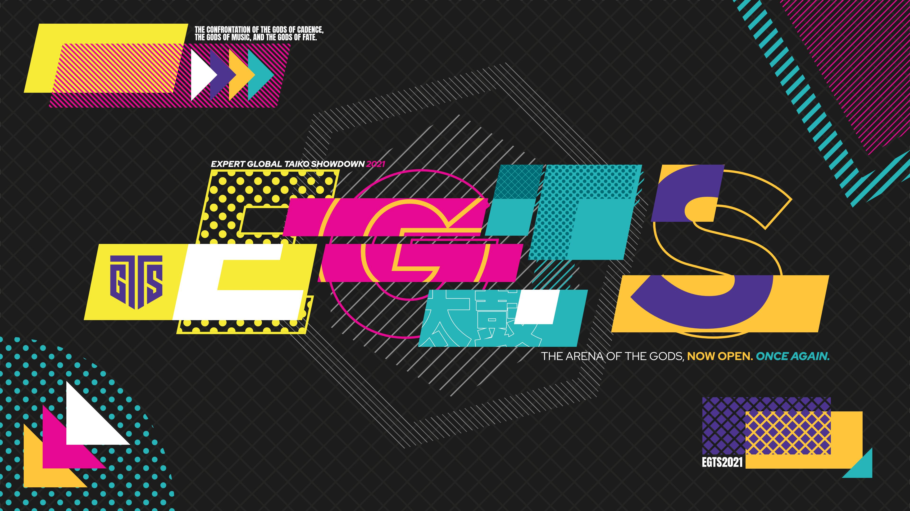

---
tags:
  - EGTS2021
  - EGTS
  - GTS
---

# Expert Global Taiko Showdown 2021

The **Expert Global Taiko Showdown 2021** (***EGTS 2021***) was a worldwide double-elimination 1v1 osu!taiko tournament hosted by ::{ flag=FR }:: [\_yosh](https://osu.ppy.sh/users/7157133), ::{ flag=FR }:: [Kasumi-sama](https://osu.ppy.sh/users/6177263), ::{ flag=DE }:: [Sayira](https://osu.ppy.sh/users/7253958), and ::{ flag=NL }:: [TaikoMom](https://osu.ppy.sh/users/9086438). A tournament targeted towards top osu!taiko players, with no rank limits. It was the second instalment of the Expert Global Taiko Showdown and part of the Global Taiko Showdown series.

## Tournament schedule

| Event | Timestamp |
| --: | :-- |
| Registration phase | 2021-09-04/2021-09-19 |
| Screening phase | 2021-09-19/2021-09-26 |
| Qualifiers | 2021-10-02/2021-10-03 |
| Round of 128 | 2021-10-08/2021-10-10 |
| Round of 64 | 2021-10-15/2021-10-17 |
| Round of 32 | 2021-10-21/2021-10-24 |
| Round of 16 | 2021-10-30/2021-10-31 |
| Quarterfinals | 2021-11-06/2021-11-07 |
| Semifinals | 2021-11-13/2021-11-14 |
| Finals | 2021-11-20/2021-11-21 |
| Grand Finals | 2021-11-27/2021-11-28 |

## Prizes

| Placing | Prize(s) |
| :-: | :-- |
|  | Unique profile badge |
|  | Unique profile badge |
|  | Unique profile badge |

  

## Organisation

The Expert Global Taiko Showdown 2021 was run by various community members.

| Position | Member(s) |
| :-- | :-- |
| Organiser | ::{ flag=FR }:: [\_yosh](https://osu.ppy.sh/users/7157133), ::{ flag=FR }:: [Kasumi-sama](https://osu.ppy.sh/users/6177263), ::{ flag=DE }:: [Sayira](https://osu.ppy.sh/users/7253958), ::{ flag=NL }:: [TaikoMom](https://osu.ppy.sh/users/9086438) |
| Head pooler | ::{ flag=FR }:: [Arrival](https://osu.ppy.sh/users/1694000), ::{ flag=GB }:: [mangomizer](https://osu.ppy.sh/users/1893718) |
| Mapper | ::{ flag=JP }:: [7\_7](https://osu.ppy.sh/users/7491106), ::{ flag=MY }:: [\[Zeth\]](https://osu.ppy.sh/users/9912966), ::{ flag=JP }:: [\_Rise](https://osu.ppy.sh/users/5217107), ::{ flag=DE }:: [Ak1o](https://osu.ppy.sh/users/1600041), ::{ flag=FR }:: [Arrival](https://osu.ppy.sh/users/1694000), ::{ flag=MY }:: [cdh](https://osu.ppy.sh/users/2403621), ::{ flag=JP }:: [Charlotte](https://osu.ppy.sh/users/3686901), ::{ flag=BR }:: [Coryn](https://osu.ppy.sh/users/2828556), ::{ flag=US }:: [Cychloryn](https://osu.ppy.sh/users/6921736), ::{ flag=DE }:: [DarkVortex](https://osu.ppy.sh/users/1940325), ::{ flag=HK }:: [Faputa](https://osu.ppy.sh/users/845733), ::{ flag=TW }:: [Firce777](https://osu.ppy.sh/users/274072), ::{ flag=BR }:: [Foxeru](https://osu.ppy.sh/users/7479684), ::{ flag=EC }:: [Gamelan4](https://osu.ppy.sh/users/9856910), ::{ flag=FR }:: [Heaxys](https://osu.ppy.sh/users/5671417), ::{ flag=BR }:: [HiroK](https://osu.ppy.sh/users/4050738), ::{ flag=TN }:: [Hivie](https://osu.ppy.sh/users/14102976), ::{ flag=JP }:: [iceOC](https://osu.ppy.sh/users/5482401), ::{ flag=BR }:: [Idealism](https://osu.ppy.sh/users/3869519), ::{ flag=TW }:: [katacheh](https://osu.ppy.sh/users/6651672), ::{ flag=JP }:: [kei821](https://osu.ppy.sh/users/5846289), ::{ flag=JP }:: [komasy](https://osu.ppy.sh/users/1980256), ::{ flag=KR }:: [Konpaku Sariel](https://osu.ppy.sh/users/533502), ::{ flag=JP }:: [KTYN](https://osu.ppy.sh/users/2250574), ::{ flag=GB }:: [mangomizer](https://osu.ppy.sh/users/1893718), ::{ flag=DE }:: [Mew](https://osu.ppy.sh/users/2345156), ::{ flag=NO }:: [Mikaruge](https://osu.ppy.sh/users/1109122), ::{ flag=AR }:: [Miyoi](https://osu.ppy.sh/users/1506011), ::{ flag=JP }:: [namaniku](https://osu.ppy.sh/users/2680544), ::{ flag=US }:: [MMzz](https://osu.ppy.sh/users/128993), ::{ flag=TW }:: [qoot8123](https://osu.ppy.sh/users/766371), ::{ flag=ES }:: [Raiden](https://osu.ppy.sh/users/2239480), ::{ flag=JP }:: [Shamirin\_mzk](https://osu.ppy.sh/users/11325757), ::{ flag=JP }:: [SKSalt](https://osu.ppy.sh/users/3280542), ::{ flag=JP }:: [TKS](https://osu.ppy.sh/users/940878), ::{ flag=US }:: [Wadsy](https://osu.ppy.sh/users/2598555), ::{ flag=TW }:: [X a v y](https://osu.ppy.sh/users/3738344), ::{ flag=JP }:: [yassu-](https://osu.ppy.sh/users/7095592), ::{ flag=JP }:: [yuzu\_\_rinrin](https://osu.ppy.sh/users/4616752), ::{ flag=JP }:: [yyyyyyyyyyypetu](https://osu.ppy.sh/users/468029), ::{ flag=DE }:: [Zetera](https://osu.ppy.sh/users/587737) |
| Mappool showcase | ::{ flag=DE }:: [Greenshell](https://osu.ppy.sh/users/8693851), ::{ flag=US }:: [JDrago14](https://osu.ppy.sh/users/7690078), ::{ flag=KR }:: [Konpaku Sariel](https://osu.ppy.sh/users/533502) |
| Referee | ::{ flag=US }:: [\[K\]](https://osu.ppy.sh/users/16551387), ::{ flag=MY }:: [\[Zeth\]](https://osu.ppy.sh/users/9912966), ::{ flag=FR }:: [\_yosh](https://osu.ppy.sh/users/7157133), ::{ flag=FR }:: [Aidown](https://osu.ppy.sh/users/1522146), ::{ flag=HK }:: [Akali393394](https://osu.ppy.sh/users/9686628), ::{ flag=PL }:: [alq](https://osu.ppy.sh/users/1083605), ::{ flag=SG }:: [arcpotato](https://osu.ppy.sh/users/12842392), ::{ flag=US }:: [JDrago14](https://osu.ppy.sh/users/7690078), ::{ flag=FR }:: [Kasumi-sama](https://osu.ppy.sh/users/6177263), ::{ flag=FR }:: [Satsukel](https://osu.ppy.sh/users/9066390), ::{ flag=DE }:: [Sayira](https://osu.ppy.sh/users/7253958), ::{ flag=SG }:: [Spartric](https://osu.ppy.sh/users/7740442), ::{ flag=NL }:: [TaikoMom](https://osu.ppy.sh/users/9086438), ::{ flag=DE }:: [xMrtn-](https://osu.ppy.sh/users/866297) |
| Streamer | ::{ flag=JP }:: [C-light](https://osu.ppy.sh/users/7955738), ::{ flag=FR }:: [Kasumi-sama](https://osu.ppy.sh/users/6177263), ::{ flag=NL }:: [oliebol](https://osu.ppy.sh/users/2756335), ::{ flag=AU }:: [r1chyy](https://osu.ppy.sh/users/11499467), ::{ flag=US }:: [Rukairi](https://osu.ppy.sh/users/6642597), ::{ flag=DE }:: [Sayira](https://osu.ppy.sh/users/7253958), ::{ flag=SG }:: [Spartric](https://osu.ppy.sh/users/7740442), ::{ flag=HK }:: [-Storm7-](https://osu.ppy.sh/users/12248285), ::{ flag=NL }:: [TaikoMom](https://osu.ppy.sh/users/9086438), ::{ flag=TW }:: [XzCraftP](https://osu.ppy.sh/users/1593180) |
| Commentator | ::{ flag=CA }:: [6\_6](https://osu.ppy.sh/users/5207783), ::{ flag=AU }:: [AmateurMonkeyYT](https://osu.ppy.sh/users/8379046), ::{ flag=AU }:: [Beat43210](https://osu.ppy.sh/users/5664171), ::{ flag=GB }:: [Doomsday](https://osu.ppy.sh/users/18983), ::{ flag=US }:: [driodx](https://osu.ppy.sh/users/9709548), ::{ flag=US }:: [Ethaaaan](https://osu.ppy.sh/users/9536977), ::{ flag=GB }:: [Ethereal\_Winter](https://osu.ppy.sh/users/9780417), ::{ flag=US }:: [FrootLoopy542](https://osu.ppy.sh/users/5468461), ::{ flag=EC }:: [Gamelan4](https://osu.ppy.sh/users/9856910), ::{ flag=DE }:: [Greenshell](https://osu.ppy.sh/users/8693851), ::{ flag=DE }:: [Joogs](https://osu.ppy.sh/users/8844167), ::{ flag=CO }:: [L1ght](https://osu.ppy.sh/users/9050875), ::{ flag=GB }:: [mangomizer](https://osu.ppy.sh/users/1893718), ::{ flag=DE }:: [Maou](https://osu.ppy.sh/users/3867109), ::{ flag=GB }:: [overdahedge2014](https://osu.ppy.sh/users/9864847), ::{ flag=SE }:: [Raphalge](https://osu.ppy.sh/users/3918650), ::{ flag=HK }:: [-Storm7-](https://osu.ppy.sh/users/12248285), ::{ flag=GB }:: [Teezel](https://osu.ppy.sh/users/7528639), ::{ flag=AR }:: [Vaf](https://osu.ppy.sh/users/12589048), ::{ flag=US }:: [Wadsy](https://osu.ppy.sh/users/2598555) |
| Designer | ::{ flag=MY }:: [\[Zeth\]](https://osu.ppy.sh/users/9912966), ::{ flag=PH }:: [OsuMe65](https://osu.ppy.sh/users/852867), ::{ flag=KR }:: [POCARI SWEAT](https://osu.ppy.sh/users/5082685) |
| Translator | ::{ flag=JP }:: [\_Rise](https://osu.ppy.sh/users/5217107), ::{ flag=FR }:: [\_yosh](https://osu.ppy.sh/users/7157133), ::{ flag=SG }:: [arcpotato](https://osu.ppy.sh/users/12842392), ::{ flag=IT }:: [Friggy-chan](https://osu.ppy.sh/users/6306704), ::{ flag=KR }:: [Jakads](https://osu.ppy.sh/users/259972), ::{ flag=DE }:: [Sayira](https://osu.ppy.sh/users/7253958) |
| Developer | ::{ flag=US }:: [Cychloryn](https://osu.ppy.sh/users/6921736), ::{ flag=FR }:: [ThePooN](https://osu.ppy.sh/users/718454) |
| Wiki editor | ::{ flag=ID }:: [fajar13k](https://osu.ppy.sh/users/7100002) |

## Links

- [Discussion thread](https://osu.ppy.sh/community/forums/topics/1412280)
- [GTS Discord server](https://discord.gg/3mGC3HB)
- [GTS website](https://gtsosu.com/2021/egts/home)
- Livestream
  - [GTSosu](https://www.twitch.tv/gtsosu)
  - [GTSosu\_b](https://www.twitch.tv/gtsosu_b)
- [Challonge bracket](https://challonge.com/EGTS2021)

## Participants

| Seed | Members |
| :-- | :-- |
| Top | ::{ flag=JP }:: [4sbet1](https://osu.ppy.sh/users/11563671), ::{ flag=KR }:: [5henry](https://osu.ppy.sh/users/3337332), ::{ flag=CR }:: [\_detarame](https://osu.ppy.sh/users/12687433), ::{ flag=AR }:: [\_Doodle\_](https://osu.ppy.sh/users/5427801), ::{ flag=US }:: [AuroraPhasmata](https://osu.ppy.sh/users/13664116), ::{ flag=IT }:: [D3kuu](https://osu.ppy.sh/users/7807444), ::{ flag=JP }:: [ekumea1123](https://osu.ppy.sh/users/9119501), ::{ flag=JP }:: [Eriha](https://osu.ppy.sh/users/16320311), ::{ flag=TR }:: [frukoyurdakul](https://osu.ppy.sh/users/7612550), ::{ flag=AR }:: [gaston\_2199](https://osu.ppy.sh/users/5938161), ::{ flag=JP }:: [gekiowata](https://osu.ppy.sh/users/8929896), ::{ flag=JP }:: [hz404](https://osu.ppy.sh/users/14947043), ::{ flag=IT }:: [Ikkun](https://osu.ppy.sh/users/1059945), ::{ flag=JP }:: [kanten\_07](https://osu.ppy.sh/users/11680357), ::{ flag=JP }:: [kotohira\_06](https://osu.ppy.sh/users/22444525), ::{ flag=IT }:: [LordEnder](https://osu.ppy.sh/users/4609767), ::{ flag=DE }:: [Luffy126](https://osu.ppy.sh/users/6851789), ::{ flag=DE }:: [Minekuchi](https://osu.ppy.sh/users/9584873), ::{ flag=SE }:: [Nurend](https://osu.ppy.sh/users/9905079), ::{ flag=TH }:: [Ponamis](https://osu.ppy.sh/users/7897892), ::{ flag=SG }:: [Prehistoria](https://osu.ppy.sh/users/8364237), ::{ flag=FR }:: [Ranshi](https://osu.ppy.sh/users/6680785), ::{ flag=SE }:: [Raphalge](https://osu.ppy.sh/users/3918650), ::{ flag=AU }:: [r1chyy](https://osu.ppy.sh/users/11499467), ::{ flag=JP }:: [Seren58](https://osu.ppy.sh/users/15252950), ::{ flag=CN }:: [shoucan91](https://osu.ppy.sh/users/9383908), ::{ flag=JP }:: [Six b0xes](https://osu.ppy.sh/users/8303357), ::{ flag=JP }:: [uone](https://osu.ppy.sh/users/5321719), ::{ flag=FI }:: [vodnanen](https://osu.ppy.sh/users/10335557), ::{ flag=CA }:: [vysha](https://osu.ppy.sh/users/4908773), ::{ flag=ID }:: [XK2238](https://osu.ppy.sh/users/1139209), ::{ flag=TW }:: [Yuemiao](https://osu.ppy.sh/users/4493348) |
| High | ::{ flag=FR }:: [-Akitai-](https://osu.ppy.sh/users/8897643), ::{ flag=US }:: [9\_9](https://osu.ppy.sh/users/7700831), ::{ flag=FI }:: [Antti](https://osu.ppy.sh/users/13281473), ::{ flag=JP }:: [BG\_SubMessy](https://osu.ppy.sh/users/24748957), ::{ flag=FR }:: [BigNounours](https://osu.ppy.sh/users/11632258), ::{ flag=FR }:: [Briesmas](https://osu.ppy.sh/users/2865172), ::{ flag=JP }:: [C-light](https://osu.ppy.sh/users/7955738), ::{ flag=NL }:: [Cookie\_Tree](https://osu.ppy.sh/users/502722), ::{ flag=FI }:: [duski](https://osu.ppy.sh/users/6506484), ::{ flag=FR }:: [Ekoro](https://osu.ppy.sh/users/284905), ::{ flag=DE }:: [Emre1504](https://osu.ppy.sh/users/13392709), ::{ flag=US }:: [Ethaaaan](https://osu.ppy.sh/users/9536977), ::{ flag=MY }:: [HHVanilla Ice](https://osu.ppy.sh/users/12803930), ::{ flag=JP }:: [ItsDiamond](https://osu.ppy.sh/users/12611862), ::{ flag=KR }:: [Jonah](https://osu.ppy.sh/users/5509009), ::{ flag=KR }:: [KAMENANO](https://osu.ppy.sh/users/16327582), ::{ flag=TW }:: [kolishimona](https://osu.ppy.sh/users/3811626), ::{ flag=US }:: [Miniature Lamp](https://osu.ppy.sh/users/9821194), ::{ flag=CA }:: [Nanners](https://osu.ppy.sh/users/459886), ::{ flag=JP }:: [Noko\_BSF](https://osu.ppy.sh/users/3811831), ::{ flag=PH }:: [Pochacco](https://osu.ppy.sh/users/2927742), ::{ flag=BR }:: [Skull Kid](https://osu.ppy.sh/users/3044264), ::{ flag=NZ }:: [Sparxe](https://osu.ppy.sh/users/5750235), ::{ flag=CN }:: [szh134](https://osu.ppy.sh/users/6844521), ::{ flag=CN }:: [te2035](https://osu.ppy.sh/users/6294200), ::{ flag=AU }:: [Tsubasa2](https://osu.ppy.sh/users/6835183), ::{ flag=DK }:: [Tsukani](https://osu.ppy.sh/users/5146144), ::{ flag=RU }:: [TwinT](https://osu.ppy.sh/users/9976154), ::{ flag=ID }:: [Volta](https://osu.ppy.sh/users/4154071), ::{ flag=US }:: [Whulf](https://osu.ppy.sh/users/11601107), ::{ flag=US }:: [YouCanNotKnow](https://osu.ppy.sh/users/9311768) |
| Mid | ::{ flag=FR }:: [Acii\_](https://osu.ppy.sh/users/11253595)::{ flag=JP }:: [BANkun](https://osu.ppy.sh/users/5707041), ::{ flag=NZ }:: [Blujae](https://osu.ppy.sh/users/10613885), ::{ flag=US }:: [BWithey](https://osu.ppy.sh/users/7330199), ::{ flag=US }:: [Chupalika](https://osu.ppy.sh/users/1926383), ::{ flag=MY }:: [CrabCow](https://osu.ppy.sh/users/9755504), ::{ flag=SG }:: [dantoh000](https://osu.ppy.sh/users/11414361), ::{ flag=VN }:: [davidminh0111](https://osu.ppy.sh/users/9623142), ::{ flag=US }:: [driodx](https://osu.ppy.sh/users/9709548), ::{ flag=PH }:: [Eyenine](https://osu.ppy.sh/users/1259391), ::{ flag=MY }:: [Fury Dragon](https://osu.ppy.sh/users/6332530), ::{ flag=FR }:: [Gintoki8](https://osu.ppy.sh/users/2239411), ::{ flag=CR }:: [Hotman](https://osu.ppy.sh/users/7902082), ::{ flag=ID }:: [ImChro](https://osu.ppy.sh/users/7280717), ::{ flag=US }:: [Inigo](https://osu.ppy.sh/users/5592441), ::{ flag=FR }:: [Issuko](https://osu.ppy.sh/users/11447466), ::{ flag=MY }:: [limchiasiang](https://osu.ppy.sh/users/7342322), ::{ flag=FI }:: [Mazzuli500](https://osu.ppy.sh/users/10648818), ::{ flag=US }:: [mBiscuit](https://osu.ppy.sh/users/17061174), ::{ flag=FI }:: [MEGAMELA](https://osu.ppy.sh/users/13613362), ::{ flag=ID }:: [Naverlyn](https://osu.ppy.sh/users/14324722), ::{ flag=JP }:: [nuku0315](https://osu.ppy.sh/users/8772103), ::{ flag=MD }:: [OldFriend](https://osu.ppy.sh/users/6412103), ::{ flag=FR }:: [omegaflo](https://osu.ppy.sh/users/83291), ::{ flag=ES }:: [OneBurstMan](https://osu.ppy.sh/users/5285438), ::{ flag=CN }:: [OtakusRin](https://osu.ppy.sh/users/3383404), ::{ flag=DE }:: [QEpicAce](https://osu.ppy.sh/users/9489153), ::{ flag=TW }:: [SeanLi](https://osu.ppy.sh/users/4327784), ::{ flag=VE }:: [Shinsekai-](https://osu.ppy.sh/users/2140739), ::{ flag=NO }:: [Vendelicious](https://osu.ppy.sh/users/8818089), ::{ flag=AR }:: [warning dark](https://osu.ppy.sh/users/5040981), ::{ flag=BE }:: [XOlifreX](https://osu.ppy.sh/users/4328137), ::{ flag=FI }:: [YERTI](https://osu.ppy.sh/users/1490757) |
| Low | ::{ flag=US }:: [-Schwarts](https://osu.ppy.sh/users/4673649), ::{ flag=FR }:: [49Leo](https://osu.ppy.sh/users/11823851), ::{ flag=JP }:: [a9uachan](https://osu.ppy.sh/users/14005209), ::{ flag=US }:: [aimebitte](https://osu.ppy.sh/users/17776893), ::{ flag=RU }:: [Ak1hiko](https://osu.ppy.sh/users/15305059), ::{ flag=ES }:: [Alsael](https://osu.ppy.sh/users/13938746), ::{ flag=AR }:: [Auredios](https://osu.ppy.sh/users/14697193), ::{ flag=CL }:: [Catulus](https://osu.ppy.sh/users/6276709), ::{ flag=FR }:: [Chernobog](https://osu.ppy.sh/users/3317042), ::{ flag=DE }:: [Dioramos](https://osu.ppy.sh/users/14415208), ::{ flag=CN }:: [Edward\_Tsui](https://osu.ppy.sh/users/8609627), ::{ flag=NL }:: [Glukeose](https://osu.ppy.sh/users/12276279), ::{ flag=SK }:: [Golden](https://osu.ppy.sh/users/12639462), ::{ flag=SG }:: [I luv loleez](https://osu.ppy.sh/users/18346655), ::{ flag=NZ }:: [idk123456](https://osu.ppy.sh/users/18718856), ::{ flag=US }:: [Jacerox](https://osu.ppy.sh/users/12962910), ::{ flag=PH }:: [Kotaro](https://osu.ppy.sh/users/796530), ::{ flag=TH }:: [Kusuhara Yui](https://osu.ppy.sh/users/9582525), ::{ flag=SG }:: [kuudere-desu](https://osu.ppy.sh/users/10694200), ::{ flag=NO }:: [Loff](https://osu.ppy.sh/users/8947341), ::{ flag=NL }:: [lukitsa124](https://osu.ppy.sh/users/8787678), ::{ flag=DE }:: [Maou](https://osu.ppy.sh/users/3867109), ::{ flag=SG }:: [MattrexDark](https://osu.ppy.sh/users/7171110), ::{ flag=JP }:: [Matusa Bomber](https://osu.ppy.sh/users/18603653), ::{ flag=RU }:: [QuassBot](https://osu.ppy.sh/users/11117835), ::{ flag=US }:: [Skey](https://osu.ppy.sh/users/7718539), ::{ flag=US }:: [SlipperyPickle](https://osu.ppy.sh/users/11969691), ::{ flag=US }:: [SolaEclipse](https://osu.ppy.sh/users/6621158), ::{ flag=JP }:: [yayuyoyo](https://osu.ppy.sh/users/8104504), ::{ flag=CH }:: [Zero1519](https://osu.ppy.sh/users/547957), ::{ flag=AU }:: [Zippywin](https://osu.ppy.sh/users/7269844) |
| Eliminated | ::{ flag=TW }:: [0Ixcy0](https://osu.ppy.sh/users/15086387), ::{ flag=SG }:: [\_gt](https://osu.ppy.sh/users/8301957), ::{ flag=NO }:: [Defectum](https://osu.ppy.sh/users/8631719), ::{ flag=DE }:: [DieButterStulle](https://osu.ppy.sh/users/4965323), ::{ flag=GB }:: [Ethereal\_Winter](https://osu.ppy.sh/users/9780417), ::{ flag=PL }:: [FuGuS](https://osu.ppy.sh/users/6537593), ::{ flag=BR }:: [gabrielmuniz](https://osu.ppy.sh/users/4598907), ::{ flag=LV }:: [Huntey](https://osu.ppy.sh/users/14451706), ::{ flag=DE }:: [JanteSmith](https://osu.ppy.sh/users/371772), ::{ flag=CR }:: [JostRc3](https://osu.ppy.sh/users/11211959), ::{ flag=DE }:: [Luna Yuuki](https://osu.ppy.sh/users/10098927), ::{ flag=RU }:: [Majesty Kitsune](https://osu.ppy.sh/users/8879204), ::{ flag=RU }:: [mekkimous](https://osu.ppy.sh/users/17381947), ::{ flag=JP }:: [misamisa\_taiko](https://osu.ppy.sh/users/11073212), ::{ flag=US }:: [Rukairi](https://osu.ppy.sh/users/6642597), ::{ flag=KR }:: [South Korea](https://osu.ppy.sh/users/12242622), ::{ flag=CL }:: [Touche](https://osu.ppy.sh/users/1603962), ::{ flag=TW }:: [TsubasaLife](https://osu.ppy.sh/users/884059), ::{ flag=US }:: [WolfBlood808](https://osu.ppy.sh/users/15526968), ::{ flag=US }:: [Xesphen](https://osu.ppy.sh/users/4723771), ::{ flag=AR }:: [ZelLink](https://osu.ppy.sh/users/6752242), ::{ flag=FR }:: [Zidyx](https://osu.ppy.sh/users/3859586) |

## Podium

This competition has come to an end and resulted in the following podium:

| Placing | Player |
| :-: | :-- |
|  | ::{ flag=JP }:: **[Seren58](https://osu.ppy.sh/users/15252950)** |
|  | ::{ flag=JP }:: **[ekumea1123](https://osu.ppy.sh/users/9119501)** |
|  | ::{ flag=JP }:: **[uone](https://osu.ppy.sh/users/5321719)** |

## Mappools

### Grand Finals

**[Download the mappack here! (126 MB)](https://mega.nz/file/3V5EAICZ#fZoPsvUqv0Bwe9wwtxAA2UZwh9I7Cy19I-sJIwqCzaM)**

- NoMod
  1. [Katagiri - Taboo Assembly (7\_7) \[Oni\]](https://osu.ppy.sh/beatmapsets/1632872#taiko/3333025)
  2. [naari3 - Ronarudo (Zetera) \[ketchukku\]](https://osu.ppy.sh/beatmapsets/1632762#taiko/3332820)
  3. [REDALiCE - Masakari Blade (Konpaku Sariel) \[Angel\]](https://osu.ppy.sh/beatmapsets/510998#taiko/3332765)
  4. [Kobaryo - Invisible Frenzy (Camellia's "593: Insanely Fluctuated" Remix) (Firce777) \[Firce Force (EGTS ver.)\]](https://osu.ppy.sh/beatmapsets/1632898#taiko/3333076)
  5. [II-L - Unidentified Frequency Op.3 (Type-Triangle) (Wilfred Murr) \[Expert Global Taiko Saucer\]](https://osu.ppy.sh/beatmapsets/1632760#taiko/3332816)
  6. [leroy - dyed my hair black (Mew) \[Unholy Trinity (EGTS ver.)\]](https://osu.ppy.sh/beatmapsets/1632364#taiko/3332075)
- Hidden
  1. [Shintomuma - LUSTCORE 2 (Zetera) \[pas d'octobre, pas de separation\]](https://osu.ppy.sh/beatmapsets/1632766#taiko/3332824)
  2. [TSAR - O V E R L O A D (KTYN) \[Catastrophic\]](https://osu.ppy.sh/beatmapsets/1632413#taiko/3332164)
- HardRock
  1. [xi - Last Resort (katacheh) \[Taiko\]](https://osu.ppy.sh/beatmapsets/1632782#taiko/3332850)
  2. [Frums - NEERWUISSALEARNTD (HiroK) \[Gekidon\]](https://osu.ppy.sh/beatmapsets/1632785#taiko/3332853)
- DoubleTime
  1. [paraoka (feat. haru\*nya) - Dreadnought (X a v y) \[let's play!!!\]](https://osu.ppy.sh/beatmapsets/1632786#taiko/3332855)
  2. [Kufu - Spooky swingin' ghosts (Ak1o) \[Inner Oni\]](https://osu.ppy.sh/beatmapsets/1632806#taiko/3332913)
- ForceMod
  1. [cosMo@BousouP - Imaginary Friend (cdh) \[Paracosm\]](https://osu.ppy.sh/beatmapsets/1632788#taiko/3332865)
  2. [Breakchild & II-L - METEORITE (Finana Ryugu) \[EXTRATERRESTRIAL\]](https://osu.ppy.sh/beatmapsets/1632780#taiko/3332848)
  3. [Frums - ultra-blazures (Finana Ryugu) \[overheat\]](https://osu.ppy.sh/beatmapsets/1632783#taiko/3332851)
- Tiebreaker
  1. **[Camellia - TremENDouS (\_Rise) \[StupENDouS\]](https://osu.ppy.sh/beatmapsets/1632807#taiko/3332914)**

### Finals

**[Download the mappack here! (110 MB)](https://www.dropbox.com/s/4d18qekx8mr8uny/EGTS2021%20Finals%20Mappack.zip)**

- NoMod
  1. [ptar124 - Aqua Regia (X a v y) \[Sonus Regius\]](https://osu.ppy.sh/beatmapsets/1627334#taiko/3322330)
  2. [Noah - Break down (Ak1o) \[Bite the Dust (EGTS edit)\]](https://osu.ppy.sh/beatmapsets/1627277#taiko/3322223)
  3. [katagiri - silly-willy-nilly (Arrival) \[Oni\]](https://osu.ppy.sh/beatmapsets/1627271#taiko/3322215)
  4. [Katagiri - One of Us (X a v y)\[EGTS Edit.\]](https://osu.ppy.sh/beatmapsets/1627332#taiko/3322322)
  5. [Aquestion - tell your worldddddddddddddd (X a v y) \[dddddddddddddddddddddddddddddddddddddddddddddddddddddddddddddddd\]](https://osu.ppy.sh/beatmapsets/1627337#taiko/3322333)
  6. [ReeK - Yubi Breaker (from TANOCCA) (Mew) \[Chaos Theory\]](https://osu.ppy.sh/beatmapsets/1627179#taiko/3322033)
- Hidden
  1. [UNDEAD CORPORATION - Sunny Rutile Flection (kei821) \[Invisibility\]](https://osu.ppy.sh/beatmapsets/1627285#taiko/3322243)
  2. [\*-Teris. - Xycle (Mew) \[Distorted Virtuoso\]](https://osu.ppy.sh/beatmapsets/1627172#taiko/3322026)
- HardRock
  1. [goreshit - xenobeat (DarkVortex) \[Relentless Oni\]](https://osu.ppy.sh/beatmapsets/1627092#taiko/3321879)
  2. [sewerslvt - Lexapro Delirium (metaroom remix) (Konpaku Sariel) \[drug remix\]](https://osu.ppy.sh/beatmapsets/1626957#taiko/3321623)
- DoubleTime
  1. [Sewerslvt - Psychosis (Genjuro) \[Inner Oni\]](https://osu.ppy.sh/beatmapsets/1627294#taiko/3322253)
  2. [Dogsix - Immortal Fairy (\_Rise) \[Inner Oni\]](https://osu.ppy.sh/beatmapsets/1627246#taiko/3322173)
- ForceMod
  1. [Lite Show Magic - Juggler's Maddness (Ak1o) \[Inner Oni\]](https://osu.ppy.sh/beatmapsets/1627296#taiko/3322255)
  2. [AAAA Chazuke - Witches and Goblins Mischief Factory (Ak1o) \[R.I.P.\]](https://osu.ppy.sh/beatmapsets/1627297#taiko/3322256)
  3. [Yuyoyuppe - AiAe (Zetera) \[Majin Oni\]](https://osu.ppy.sh/beatmapsets/1627212#taiko/3322101)
- Tiebreaker
  1. **[ReeK - Multigenre Smackdown (Arrival) \[Electro Genre Turnstile Sequencer\]](https://osu.ppy.sh/beatmapsets/1627304#taiko/3322271)**

### Semifinals

**[Download the mappack here! (85 MB)](https://mega.nz/file/ecgCgLzL#vh1b09iNIF9NK5QJKxJCYYtN9RhPZ3y4ZYf4xX32lg0)**

- NoMod
  1. [Rahatt - Dancin' In The Dream (Mew) \[Ballroom Frenzy\]](https://osu.ppy.sh/beatmapsets/1621656#taiko/3311000)
  2. [Sunless Rise - Nothing to Save (Raiden) \[Despair\]](https://osu.ppy.sh/beatmapsets/1621686#taiko/3311040)
  3. [Billain - Bilocation (Arrival) \[Oni\]](https://osu.ppy.sh/beatmapsets/1621668#taiko/3311018)
  4. [TJ.hangneil - Apollo (\_Rise) \[Hell Oni\]](https://osu.ppy.sh/beatmapsets/1621667#taiko/3311016)
  5. [Damjoy - The Lady Is A Trump (DarkVortex) \[Relentless Oni\]](https://osu.ppy.sh/beatmapsets/1621833#taiko/3311243)
  6. [Annoying Ringtone - Speedcore Reptile (Mew) \[Velocityraptor\]](https://osu.ppy.sh/beatmapsets/1621679#taiko/3311032)
- Hidden
  1. [DJ TOTTO - Crystalia (katacheh) \[Taiko\]](https://osu.ppy.sh/beatmapsets/1621644#taiko/3310972)
  2. [rN - opia (Finana Ryugu) \[ambivalence\]](https://osu.ppy.sh/beatmapsets/1621682#taiko/3311035)
- HardRock
  1. [LUZE - Tru'nembra (Mikaruge) \[Satan Taiko\]](https://osu.ppy.sh/beatmapsets/1621687#taiko/3311041)
  2. [Frums - isla (\_Rise) \[Hell Oni\]](https://osu.ppy.sh/beatmapsets/1621684#taiko/3311037)
- DoubleTime
  1. [ABSOLUTE CASTAWAY - KIRMES (kei821) \[Oni\]](https://osu.ppy.sh/beatmapsets/1621696#taiko/3311056)
  2. [Takagaki Ayahi, Akesaka Satomi, Tomatsu Haruka - Waga Na wa Shougakusei (iceOC) \[Oni\]](https://osu.ppy.sh/beatmapsets/1621695#taiko/3311054)
- ForceMod
  1. [Masahiro "Godspeed" Aoki - busy come, busy go (instrumental version) (Mikaruge) \[Hell Oni\]](https://osu.ppy.sh/beatmapsets/1622627#taiko/3313053)
  2. [Aphex Twin - Flim (Gamelan4) \[Inner Oni\]](https://osu.ppy.sh/beatmapsets/1621703#taiko/3311070)
  3. [Virt - The artichoke king (Mew) \[The art of choking\]](https://osu.ppy.sh/beatmapsets/1621707#taiko/3311074)
- Tiebreaker
  1. **[Ice - Conclusio Catastropha (Ak1o) \[Lament Denouement\]](https://osu.ppy.sh/beatmapsets/1621712#taiko/3311079)**

### Quarterfinals

**[Download the mappack here! (89 MB)](https://mega.nz/file/XE5BTI7b#19U1DrvJLw7maUWRmvLrAwSNRAHAcM2kYKDpoPjodbI)**

- NoMod
  1. [MITCH DOWNVELL - not sakura (Mikaruge) \[Modern Mapping\]](https://osu.ppy.sh/beatmapsets/1615436#taiko/3298139)
  2. [katagiri - Angel's Salad (HEKUSODASU) \[KUSOni\]](https://osu.ppy.sh/beatmapsets/1615718#taiko/3298700)
  3. [LeaF - ATHAZA (DarkVortex) \[Inner Oni\]](https://osu.ppy.sh/beatmapsets/1616081#taiko/3299466)
  4. [Empyrion - Infested (Raiden) \[Afterlife\]](https://osu.ppy.sh/beatmapsets/1616083#taiko/3299470)
  5. [colate - Teaspoon Story (katacheh) \[Taiko Tea\]](https://osu.ppy.sh/beatmapsets/1615767#taiko/3298791)
- Hidden
  1. [Akatsuki Records - Bhavacakra (\_Rise) \[Inner Oni\]](https://osu.ppy.sh/beatmapsets/1615893#taiko/3299167)
  2. [Igorrr - Fryzura Konika (Faputa) \[Inopiae Subvenisset\]](https://osu.ppy.sh/beatmapsets/1615853#taiko/3299113)
- HardRock
  1. [Noah - Touch and Go (Ak1o) \[Inner Oni\]](https://osu.ppy.sh/beatmapsets/1616020#taiko/3299358)
  2. [La Cataline - Chaotic (Zetera) \[Majin Oni\]](https://osu.ppy.sh/beatmapsets/1615903#taiko/3299185)
- DoubleTime
  1. [owl-tree - Baqeela (Ak1o) \[Inner Oni\]](https://osu.ppy.sh/beatmapsets/1616018#taiko/3299354)
  2. [Billx - Dynamite (Mew) \[Short Fuse\]](https://osu.ppy.sh/beatmapsets/1615756#taiko/3298761)
- ForceMod
  1. [Dopam!ne - Galaxy shot (Firce777) \[Firce777's Taiko\]](https://osu.ppy.sh/beatmapsets/1616675#taiko/3301014)
  2. [Thaehan - Chapo Chapo (DarkVortex) \[Bravissimo!\]](https://osu.ppy.sh/beatmapsets/1616112#taiko/3299506)
  3. [DJ Sharpnel - Tactical railroad (Faputa) \[Tactical oni\]](https://osu.ppy.sh/beatmapsets/1615855#taiko/3299115)
- Tiebreaker
  1. **[SDMNE - PATERA (HiroK) \[Systemically Disruptive MulitiNova Enantiomorph\]](https://osu.ppy.sh/beatmapsets/1616127#taiko/3299534)**

### Round of 16

**[Download the mappack here! (76 MB)](https://mega.nz/file/2IoVyCiL#xhql9Nqs1Fhc1BlfLP6eDgx93doGsRRRYayxpAXepDA)**

- NoMod
  1. [Nota - Frustration (Mikaruge) \[Ura Oni\]](https://osu.ppy.sh/beatmapsets/1609997#taiko/3287360)
  2. [II-L - VANGUARD-1 (Zetera) \[Multidimensional Oni\]](https://osu.ppy.sh/beatmapsets/1609985#taiko/3287336)
  3. [inabakumori - Lost Umbrella (\[Zeth\]) \[Misery\]](https://osu.ppy.sh/beatmapsets/1609998#taiko/3287361)
  4. [Rissyuu feat. Choko - Take (Genjuro) \[Hell Oni\]](https://osu.ppy.sh/beatmapsets/1609994#taiko/3287355)
  5. [HITORIE - curved edge (Finana Ryugu) \[two-faced\]](https://osu.ppy.sh/beatmapsets/1610000#taiko/3287365)
- Hidden
  1. [NIWASHI - Astronote. (cdh) \[Peregrinus.\]](https://osu.ppy.sh/beatmapsets/1610006#taiko/3287374)
  2. [Yu\_Asahina - Gianduja (namaniku) \[Oni\]](https://osu.ppy.sh/beatmapsets/1609890#taiko/3287112)
- HardRock
  1. [lapix - Venetian Drums (Arrival) \[Oni\]](https://osu.ppy.sh/beatmapsets/1609999#taiko/3287362)
  2. [lapix - Duality Rave (Zekk's 'FULL SPEC' Remix) (DarkVortex) \[Inner Oni\]](https://osu.ppy.sh/beatmapsets/1610016#taiko/3287387)
- DoubleTime
  1. [naruto x Aya Futatsuki x BouKiChi - AI Bomb on vocal (Miyoi) \[Full-Duplex, Hi-Speed!\]](https://osu.ppy.sh/beatmapsets/1609570#taiko/3286469)
  2. [Inugami Korone & Nekomata Okayu - Hyadain's Jojo Yujo (komasy) \[Oni (EGTS Edit)\]](https://osu.ppy.sh/beatmapsets/1609924#taiko/3287189)
- ForceMod
  1. [s-don vs. Hinoisuka - Trrricksters!! (Konpaku Sariel) \[Inner Oni!! nerfed for FM (EGTS)\]](https://osu.ppy.sh/beatmapsets/1609557#taiko/3286446)
  2. [Yuji Masubuchi - Fantaisie-Impromptu (Miyoi) \[Allegro Agitato\]](https://osu.ppy.sh/beatmapsets/1609569#taiko/3286468)
  3. [Children of Bodom - Needled 24 / 7 (Raiden) \[Inner Oni\]](https://osu.ppy.sh/beatmapsets/1609544#taiko/3286412)
- Tiebreaker
  1. **[First Fragment - L'entite (Raiden) \[Les Conquerants\]](https://osu.ppy.sh/beatmapsets/1609543#taiko/3292008)**

### Round of 32

**[Download the mappack here! (75 MB)](https://mega.nz/file/WB4inIQJ#dbhA5SlkHXRotNQLo6yUK5swTYXVkal3XL0iAE155MQ)**

- NoMod
  1. [Hakuryu - Genesis At Oasis (MOONLiGHT Mix) (Hivie) \[Hivism's Paradisum\]](https://osu.ppy.sh/beatmapsets/1604560#taiko/3276593)
  2. [Rahatt - pietreNorocoase (\_Rise) \[Inner Oni\]](https://osu.ppy.sh/beatmapsets/1604561#taiko/3276594)
  3. [J-CORE SLi//CER - Demo kegawa ga mofu mofu sugi! (Idealism) \[Blasting Off\]](https://osu.ppy.sh/beatmapsets/1604567#taiko/3276607)
  4. [nitro - \[line:zeta\] (Mew) \[Root of Unity\]](https://osu.ppy.sh/beatmapsets/1604569#taiko/3276609)
  5. [Hidra-Xjeil - bugs (7\_7) \[Oni\]](https://osu.ppy.sh/beatmapsets/1605135#taiko/3277721)
- Hidden
  1. [M2U - White Rose (HiroK) \[Inner Oni\]](https://osu.ppy.sh/beatmapsets/1604573#taiko/3276617)
  2. [Fallujah - Adrenaline (Cut Ver.) (Heaxys) \[Pressure\]](https://osu.ppy.sh/beatmapsets/1604564#taiko/3276600)
- HardRock
  1. [Laur - Nostalgic Blood of the Strife (kei821) \[Inner Oni\]](https://osu.ppy.sh/beatmapsets/1604363#taiko/3276235)
  2. [Cyte - Xinyi Dist (Gamelan4) \[Hell Oni\]](https://osu.ppy.sh/beatmapsets/1604579#taiko/3276629)
- DoubleTime
  1. [M2U - Zendai Mimon (Cychloryn) \[Inner Oni\]](https://osu.ppy.sh/beatmapsets/1604581#taiko/3276634)
  2. [Kano - Dear Brave (Finana Ryugu) \[To My Beloveds: Zeth & Gamelan\]](https://osu.ppy.sh/beatmapsets/1604583#taiko/3276637)
- ForceMod
  1. [Takenobu Mitsuyoshi - Ikazuchi (Mikaruge) \[Hell Oni\]](https://osu.ppy.sh/beatmapsets/1604585#taiko/3276643)
  2. [Reaper - Unreality (Arrival) \[Oni\]](https://osu.ppy.sh/beatmapsets/1604566#taiko/3276604)
  3. [Mr.Asyu - Haunted Dance (yyyyyyyyyyypetu) \[Inner Oni\]](https://osu.ppy.sh/beatmapsets/1604652#taiko/3276760)
- Tiebreaker
  1. **[EBICO & jioyi - Slit (DarkVortex) \[Inner Oni \[EGTS Edit\]\]](https://osu.ppy.sh/beatmapsets/1604589#taiko/3276650)**

### Round of 64

**[Download the mappack here! (75 MB)](https://mega.nz/file/mYomFKCR#BpF7uj1-2helKk-9YgrXwymvBCHWRgEinAAZN57kFdM)**

- NoMod
  1. [4nzu - ENIGMA ZAG (KTYN) \[INNER ONI\]](https://osu.ppy.sh/beatmapsets/1598544#taiko/3264737)
  2. [7\_7 - Nanikore!? Mix (yyyyyyyyyyypetu) \[Inner Oni\]](https://osu.ppy.sh/beatmapsets/1598812#taiko/3265413)
  3. [METAROOM - WORM RAVE (Zetera) \[EWW\]](https://osu.ppy.sh/beatmapsets/1599033#taiko/3265781)
  4. [Black hood - fragmentation (iceOC) \[iceOC\]](https://osu.ppy.sh/beatmapsets/1599042#taiko/3265799)
- Hidden
  1. [litmus\* - Rush-More (komasy) \[Inner-Oni\]](https://osu.ppy.sh/beatmapsets/1599189#taiko/3266120)
  2. [A Night in the Abyss - Begotten (Instrumental) (Cut Ver.) (Heaxys) \[Origin\]](https://osu.ppy.sh/beatmapsets/1599035#taiko/3265792)
- HardRock
  1. [MisoilePunch - Aya (\[Zeth\]) \[Niji\]](https://osu.ppy.sh/beatmapsets/1599050#taiko/3265809)
  2. [SEPHID - Striking G10ry! (Faputa) \[Inner 0ni!\]](https://osu.ppy.sh/beatmapsets/1599049#taiko/3265808)
- DoubleTime
  1. [Hoshimachi Suisei - Tenkyuu, Suisei wa Yoru o Mataide (\_Rise) \[Inner Oni (EGTS edit)\]](https://osu.ppy.sh/beatmapsets/1599053#taiko/3265812)
  2. [Sakuzyo feat. Hatsune Miku - ChaiN De/structioN (siilento's solid remix) (Konpaku Sariel) \[(-\_-) (EGTS)\]](https://osu.ppy.sh/beatmapsets/1598587#taiko/3264846)
- ForceMod
  1. [SymaG - Homing instinct-Boy by the mile- (Cut Ver.) (Coryn) \[Oni by the mile\]](https://osu.ppy.sh/beatmapsets/1599057#taiko/3265819)
  2. [Risshuu feat. Choko - Paa (Cychloryn) \[Inner Oni\]](https://osu.ppy.sh/beatmapsets/1599153#taiko/3266012)
  3. [Ester - Krave (komasy) \[Inner Oni\]](https://osu.ppy.sh/beatmapsets/1599186#taiko/3266112)
- Tiebreaker
  1. **[Kara & Kurokotei - Valley of Voices (Arrival) \[GTS Collab\]](https://osu.ppy.sh/beatmapsets/1599054#taiko/3265816)**

### Round of 128

**[Download the mappack here! (69 MB)](https://mega.nz/file/OcBkRbRC#Nc1B-5f2OW5U6H12I5Cx6oMIuyQTCEuvx6qC6AwbWP4)**

- NoMod
  1. [ELFENSJoN - STYX (yuzu\_\_rinrin) \[Inner Oni\]](https://osu.ppy.sh/beatmapsets/1593849#taiko/3255608)
  2. [umu. - humanly (DarkVortex) \[Oni\]](https://osu.ppy.sh/beatmapsets/1593273#taiko/3254167)
  3. [HiTECH NINJA - Technicians High (TKS) \[Oni (EGTS Edit)\]](https://osu.ppy.sh/beatmapsets/1593221#taiko/3254084)
  4. [Halogen - U Got That (Camellia's Neurofunk Bootleg) (iceOC) \[Oni (EGTS Edit)\]](https://osu.ppy.sh/beatmapsets/1593370#taiko/3254322)
- Hidden
  1. [sky\_delta - Lazy Addiction (Arrival) \[Oni\]](https://osu.ppy.sh/beatmapsets/1593369#taiko/3254321)
  2. [Luke Aldridge - Full English Breckerfest (mangomizer) \[Breckerfest\]](https://osu.ppy.sh/beatmapsets/1593353#taiko/3254298)
- HardRock
  1. [Antistar - Shore In The Rain (Foxeru) \[Storm (EGTS Edit)\]](https://osu.ppy.sh/beatmapsets/1593356#taiko/3254302)
  2. [Fractal Dreamers - Ad Astra (DarkVortex) \[Inner Oni\]](https://osu.ppy.sh/beatmapsets/1593274#taiko/3254168)
- DoubleTime
  1. [GARNiDELiA - Lamb. (kei821) \[Oni (EGTS edit)\]](https://osu.ppy.sh/beatmapsets/1593382#taiko/3254344)
  2. [mineko - Honpou Tora ^ Honsou Nezumi (Mikaruge) \[Oni\]](https://osu.ppy.sh/beatmapsets/1593219#taiko/3254082)
- ForceMod
  1. [Tokiwa - Syuou Sange (Shamirin\_mzk) \[Petal falling\]](https://osu.ppy.sh/beatmapsets/1593285#taiko/3254190)
  2. [432pro - kawaii-catgirl-gif.png (Foxeru) \[inner-oni.osu\]](https://osu.ppy.sh/beatmapsets/1593357#taiko/3254304)
  3. [Crossfaith - Diavolos (Ak1o) \[Inner Oni\]](https://osu.ppy.sh/beatmapsets/1593391#taiko/3254354)
- Tiebreaker
  1. **[Morimori Atsushi - Prismriver San Shimai no UK Hardcore ni Hamatte Iru Kata (VIP) (kei821) \[Prismriver\]](https://osu.ppy.sh/beatmapsets/1593392#taiko/3254355)**

### Qualifiers

**[Download the mappack here! (50 MB)](https://mega.nz/file/zBAX3AKb#GO3xo7ODXClgUWGVWavbJYgHrbiq07YixrYb0_InJW8)**

- NoMod
  1. [Rahatt - Kibori Breakcore (HiroK) \[Inner Oni\]](https://osu.ppy.sh/beatmapsets/1587090#taiko/3241499)
  2. [Ruby My Dear - Asile A La Plage (Genjuro) \[Inner Oni\]](https://osu.ppy.sh/beatmapsets/1587086#taiko/3241489)
  3. [REAPER - OBLIVION (Cut Ver.) (\[Zeth\]) \[DEMOLITION\]](https://osu.ppy.sh/beatmapsets/1587089#taiko/3241497)
- Hidden
  1. [DJ Myosuke - Behemoth (Arrival) \[Oni\]](https://osu.ppy.sh/beatmapsets/1587087#taiko/3241492)
  2. [katagiri - AMEN KATAGIRI GENERATION (Gamelan4) \[amenbreak.wav\]](https://osu.ppy.sh/beatmapsets/1587095#taiko/3241504)
- HardRock
  1. [seatrus - MONONOKE (Faputa) \[ALOOF\]](https://osu.ppy.sh/beatmapsets/1587097#taiko/3241506)
  2. [Halv - Kyubi (Ak1o) \[Inner Oni (EGTS edit)\]](https://osu.ppy.sh/beatmapsets/1587100#taiko/3241512)
- DoubleTime
  1. [lapix - Silvia (\_Rise) \[Inner Oni\]](https://osu.ppy.sh/beatmapsets/1587105#taiko/3241520)
  2. [Seiryu - Ultramarine (Zetera) \[Nautilus\]](https://osu.ppy.sh/beatmapsets/1587101#taiko/3241514)
- Hidden+HardRock
  1. [Zekk - Quantum L3ap (\[Zeth\]) \[Unc3rtainty\]](https://osu.ppy.sh/beatmapsets/1587092#taiko/3241501)

## Match results

### Grand Finals

Saturday, 27 November 2021:

| Player 1 |  |  | Player 2 | Match link |
| --: | :-: | :-: | :-- | :-- |
| uone ::{ flag=JP }:: | 1 | **7** | ::{ flag=JP }:: **ekumea1123** | [#1](https://osu.ppy.sh/community/matches/94502369) |

Sunday, 28 November 2021:

| Player 1 |  |  | Player 2 | Match link |
| --: | :-: | :-: | :-- | :-- |
| Seren58 ::{ flag=JP }:: | 3 | **7** | ::{ flag=JP }:: **ekumea1123** | [#1](https://osu.ppy.sh/community/matches/94554645) |
| ekumea1123 ::{ flag=JP }:: | 4 | **7** | ::{ flag=JP }:: **Seren58** | [#1](https://osu.ppy.sh/community/matches/94556604) |

### Finals

Saturday, 20 November 2021:

| Player 1 |  |  | Player 2 | Match link |
| --: | :-: | :-: | :-- | :-- |
| hz404 ::{ flag=JP }:: | 0 | **7** | ::{ flag=JP }:: **kanten\_07** | [#1](https://osu.ppy.sh/community/matches/94188526) |
| **ekumea1123** ::{ flag=JP }:: | **7** | 1 | ::{ flag=JP }:: gekiowata | [#1](https://osu.ppy.sh/community/matches/94194525) |

Sunday, 21 November 2021:

| Player 1 |  |  | Player 2 | Match link |
| --: | :-: | :-: | :-- | :-- |
| **ekumea1123** ::{ flag=JP }:: | **7** | 3 | ::{ flag=JP }:: kanten\_07 | [#1](https://osu.ppy.sh/community/matches/94244189) |
| **Seren58** ::{ flag=JP }:: | **7** | 1 | ::{ flag=JP }:: uone | [#1](https://osu.ppy.sh/community/matches/94246761) |

### Semifinals

Saturday, 13 November 2021:

| Player 1 |  |  | Player 2 | Match link |
| --: | :-: | :-: | :-- | :-- |
| **kanten\_07** ::{ flag=JP }:: | **7** | 0 | ::{ flag=JP }:: kotohira\_06 | [#1](https://osu.ppy.sh/community/matches/93868866) |
| **gekiowata** ::{ flag=JP }:: | **7** | 6 | ::{ flag=ID }:: XK2238 | [#1](https://osu.ppy.sh/community/matches/93871753) |
| **Six b0xes** ::{ flag=JP }:: | **7** | 2 | ::{ flag=IT }:: Ikkun | [#1](https://osu.ppy.sh/community/matches/93874670) |
| **Minekuchi** ::{ flag=DE }:: | **7** | 0 | ::{ flag=TR }:: frukoyurdakul | [#1](https://osu.ppy.sh/community/matches/93878637) |

Sunday, 14 November 2021:

| Player 1 |  |  | Player 2 | Match link |
| --: | :-: | :-: | :-- | :-- |
| ekumea1123 ::{ flag=JP }:: | 5 | **7** | ::{ flag=JP }:: **uone** | [#1](https://osu.ppy.sh/community/matches/93924197) |
| **Seren58** ::{ flag=JP }:: | **7** | 1 | ::{ flag=JP }:: hz404 | [#1](https://osu.ppy.sh/community/matches/93927517) |
| **kanten\_07** ::{ flag=JP }:: | **7** | 4 | ::{ flag=DE }:: Minekuchi | [#1](https://osu.ppy.sh/community/matches/93929893) |
| **gekiowata** ::{ flag=JP }:: | **7** | 3 | ::{ flag=JP }:: Six b0xes | [#1](https://osu.ppy.sh/community/matches/93931319) |

### Quarterfinals

Saturday, 6 November 2021:

| Player 1 |  |  | Player 2 | Match link |
| --: | :-: | :-: | :-- | :-- |
| Eriha ::{ flag=JP }:: | 4 | **6** | ::{ flag=IT }:: **LordEnder** | [#1](https://osu.ppy.sh/community/matches/93538825) |
| **kotohira\_06** ::{ flag=JP }:: | **6** | 1 | ::{ flag=CN }:: szh134 | [#1](https://osu.ppy.sh/community/matches/93550723) |
| **gekiowata** ::{ flag=JP }:: | **6** | 2 | ::{ flag=NZ }:: Sparxe | [#1](https://osu.ppy.sh/community/matches/93553494) |
| Yuemiao ::{ flag=TW }:: | 1 | **6** | ::{ flag=FI }:: **vodnanen** | [#1](https://osu.ppy.sh/community/matches/93557266) |
| shoucan91 ::{ flag=CN }:: | 4 | **6** | ::{ flag=FR }:: **Ekoro** | [#1](https://osu.ppy.sh/community/matches/93559555) |
| D3kuu ::{ flag=IT }:: | 3 | **6** | ::{ flag=TR }:: **frukoyurdakul** | [#1](https://osu.ppy.sh/community/matches/93562549) |
| **Ikkun** ::{ flag=IT }:: | **6** | 3 | ::{ flag=US }:: Whulf | [#1](https://osu.ppy.sh/community/matches/93571388) |

Sunday, 7 November 2021:

| Player 1 |  |  | Player 2 | Match link |
| --: | :-: | :-: | :-- | :-- |
| **ekumea1123** ::{ flag=JP }:: | **6** | 4 | ::{ flag=JP }:: kanten\_07 | [#1](https://osu.ppy.sh/community/matches/93603003) |
| Ekoro ::{ flag=FR }:: | 3 | **6** | ::{ flag=TR }:: **frukoyurdakul** | [#1](https://osu.ppy.sh/community/matches/93607269) |
| **uone** ::{ flag=JP }:: | **6** | 1 | ::{ flag=DE }:: Minekuchi | [#1](https://osu.ppy.sh/community/matches/93608389) |
| **Seren58** ::{ flag=JP }:: | **6** | 0 | ::{ flag=ID }:: XK2238 | [#1](https://osu.ppy.sh/community/matches/93609955) |
| **hz404** ::{ flag=JP }:: | **6** | 4 | ::{ flag=JP }:: Six b0xes | [#1](https://osu.ppy.sh/community/matches/93609956) |
| vodnanen ::{ flag=FI }:: | 0 | **6** | ::{ flag=IT }:: **Ikkun** | [#1](https://osu.ppy.sh/community/matches/93609945) |
| LordEnder ::{ flag=IT }:: | 2 | **6** | ::{ flag=JP }:: **kotohira\_06** | [#1](https://osu.ppy.sh/community/matches/93609942) |
| **Nurend** ::{ flag=SE }:: | **6** | 5 | ::{ flag=SE }:: Raphalge | [#1](https://osu.ppy.sh/community/matches/93612050) |
| Nurend ::{ flag=SE }:: | 5 | **6** | ::{ flag=JP }:: **gekiowata** | [#1](https://osu.ppy.sh/community/matches/93616914) |

### Round of 16

Saturday, 30 October 2021:

| Player 1 |  |  | Player 2 | Match link |
| --: | :-: | :-: | :-- | :-- |
| **KAMENANO** ::{ flag=KR }:: | **0** | -1 | ::{ flag=US }:: Miniature Lamp | *win by default* |
| \_detarame ::{ flag=CR }:: | -1 | **0** | ::{ flag=MY }:: **HHVanilla Ice** | *win by default* |
| vysha ::{ flag=CA }:: | 2 | **6** | ::{ flag=CN }:: **szh134** | [#1](https://osu.ppy.sh/community/matches/93182900) |
| **AuroraPhasmata** ::{ flag=US }:: | **6** | 0 | ::{ flag=JP }:: C-light | [#1](https://osu.ppy.sh/community/matches/93189507) |
| **Raphalge** ::{ flag=SE }:: | **6** | 3 | ::{ flag=CA }:: Nanners | [#1](https://osu.ppy.sh/community/matches/93189580) |
| **Six b0xes** ::{ flag=SG }:: | **6** | 2 | ::{ flag=TR }:: frukoyurdakul | [#1](https://osu.ppy.sh/community/matches/93193467) |
| 4sbet1 ::{ flag=JP }:: | -1 | **0** | ::{ flag=NZ }:: **Sparxe** | *win by default* |
| **vodnanen** ::{ flag=FI }:: | **6** | 4 | ::{ flag=AU }:: r1chyy | [#1](https://osu.ppy.sh/community/matches/93197839) |
| **hz404** ::{ flag=JP }:: | **6** | 0 | ::{ flag=CN }:: shoucan91 | [#1](https://osu.ppy.sh/community/matches/93200139) |
| Pochacco ::{ flag=PH }:: | -1 | **0** | ::{ flag=US }:: **Whulf** | *win by default* |
| **Sparxe** ::{ flag=NZ }:: | **6** | 3 | ::{ flag=MY }:: HHVanilla Ice | [#1](https://osu.ppy.sh/community/matches/93200108) |
| Ponamis ::{ flag=TH }:: | 3 | **6** | ::{ flag=IT }:: **LordEnder** | [#1](https://osu.ppy.sh/community/matches/93200375) |
| **ekumea1123** ::{ flag=JP }:: | **6** | 0 | ::{ flag=SE }:: Nurend | [#1](https://osu.ppy.sh/community/matches/93203178) |
| **D3kuu** ::{ flag=IT }:: | **6** | 0 | ::{ flag=SG }:: Prehistoria | [#1](https://osu.ppy.sh/community/matches/93203567) |
| **5henry** ::{ flag=KR }:: | **6** | 4 | ::{ flag=MY }:: CrabCow | [#1](https://osu.ppy.sh/community/matches/93206834) |
| Ranshi ::{ flag=FR }:: | 5 | **6** | ::{ flag=BR }:: **Skull Kid** | [#1](https://osu.ppy.sh/community/matches/93210610) |
| **Antti** ::{ flag=FI }:: | **6** | 2 | ::{ flag=FI }:: duski | [#1](https://osu.ppy.sh/community/matches/93214918) |
| **Raphalge** ::{ flag=SE }:: | **6** | 3 | ::{ flag=FI }:: Antti | [#1](https://osu.ppy.sh/community/matches/93223656) |
| **\_Doodle\_** ::{ flag=AR }:: | **6** | 0 | ::{ flag=FR }:: Gintoki8 | [#1](https://osu.ppy.sh/community/matches/93227975) |
| **Ekoro** ::{ flag=FR }:: | **6** | 0 | ::{ flag=RU }:: TwinT | [#1](https://osu.ppy.sh/community/matches/93232573) |
| **gaston\_2199** ::{ flag=AR }:: | **6** | 1 | ::{ flag=DK }:: Tsukani | [#1](https://osu.ppy.sh/community/matches/93232751) |

Sunday, 31 October 2021:

| Player 1 |  |  | Player 2 | Match link |
| --: | :-: | :-: | :-- | :-- |
| **Whulf** ::{ flag=US }:: | **6** | 2 | ::{ flag=KR }:: KAMENANO | [#1](https://osu.ppy.sh/community/matches/93252021) |
| 5henry ::{ flag=KR }:: | 4 | **6** | ::{ flag=CN }:: **szh134** | [#1](https://osu.ppy.sh/community/matches/93254451) |
| **uone** ::{ flag=JP }:: | **6** | 0 | ::{ flag=TW }:: Yuemiao | [#1](https://osu.ppy.sh/community/matches/93263859) |
| **kanten\_07** ::{ flag=JP }:: | **0** | -1 | ::{ flag=JP }:: gekiowata | *win by default* |
| **Seren58** ::{ flag=JP }:: | **6** | 0 | ::{ flag=JP }:: Eriha | [#1](https://osu.ppy.sh/community/matches/93273689) |
| kotohira\_06 ::{ flag=JP }:: | 3 | **6** | ::{ flag=ID }:: **XK2238** | [#1](https://osu.ppy.sh/community/matches/93276424) |
| **Minekuchi** ::{ flag=DE }:: | **6** | 3 | ::{ flag=IT }:: Ikkun | [#1](https://osu.ppy.sh/community/matches/93279348) |
| **vodnanen** ::{ flag=FI }:: | **0** | -1 | ::{ flag=BR }:: Skull Kid | *win by default* |
| **Ekoro** ::{ flag=FR }:: | **6** | 2 | ::{ flag=AR }:: \_Doodle\_ | [#1](https://osu.ppy.sh/community/matches/93285976) |
| AuroraPhasmata ::{ flag=US }:: | -1 | **0** | ::{ flag=IT }:: **D3kuu** | *win by default* |
| gaston\_2199 ::{ flag=AR }:: | 3 | **6** | ::{ flag=IT }:: **LordEnder** | [#1](https://osu.ppy.sh/community/matches/93296817) |

### Round of 32

Thursday, 21 October 2021:

| Player 1 |  |  | Player 2 | Match link |
| --: | :-: | :-: | :-- | :-- |
| **Cookie\_Tree** ::{ flag=NL }:: | **6** | 0 | ::{ flag=FR }:: Chernobog | [#1](https://osu.ppy.sh/community/matches/92715009) |
| **r1chyy** ::{ flag=AU }:: | **6** | 1 | ::{ flag=FR }:: omegaflo | [#1](https://osu.ppy.sh/community/matches/92727128) |

Friday, 22 October 2021:

| Player 1 |  |  | Player 2 | Match link |
| --: | :-: | :-: | :-- | :-- |
| **r1chyy** ::{ flag=AU }:: | **6** | 3 | ::{ flag=NL }:: Cookie\_Tree | [#1](https://osu.ppy.sh/community/matches/92760152) |
| **duski** ::{ flag=FI }:: | **6** | 1 | ::{ flag=NL }:: lukitsa124 | [#1](https://osu.ppy.sh/community/matches/92765821) |

Saturday, 23 October 2021:

| Player 1 |  |  | Player 2 | Match link |
| --: | :-: | :-: | :-- | :-- |
| **Nanners** ::{ flag=CA }:: | **6** | 5 | ::{ flag=US }:: mBiscuit | [#1](https://osu.ppy.sh/community/matches/92800388) |
| **hz404** ::{ flag=JP }:: | **6** | 0 | ::{ flag=CR }:: \_detarame | [#1](https://osu.ppy.sh/community/matches/92802198) |
| **Volta** ::{ flag=ID }:: | **6** | 4 | ::{ flag=US }:: Chupalika | [#1](https://osu.ppy.sh/community/matches/92804410) |
| **HHVanilla Ice** ::{ flag=US }:: | **6** | 5 | ::{ flag=US }:: 9\_9 | [#1](https://osu.ppy.sh/community/matches/92809306) |
| **Miniature Lamp** ::{ flag=US }:: | **6** | 0 | ::{ flag=SG }:: dantoh000 | [#1](https://osu.ppy.sh/community/matches/92808981) |
| te2035 ::{ flag=CN }:: | -1 | **0** | ::{ flag=US }:: **Skey** | *win by default* |
| **szh134** ::{ flag=CN }:: | **0** | -1 | ::{ flag=MY }:: Fury Dragon | *win by default* |
| **C-light** ::{ flag=JP }:: | **6** | 0 | ::{ flag=CN }:: Edward\_Tsui | [#1](https://osu.ppy.sh/community/matches/92812736) |
| **kolishimona** ::{ flag=TW }:: | **6** | 0 | ::{ flag=DE }:: QEpicAce | [#1](https://osu.ppy.sh/community/matches/92814191) |
| **Issuko** ::{ flag=FR }:: | **0** | -1 | ::{ flag=MY }:: limchiasiang | *win by default* |
| Briesmas ::{ flag=FR }:: | 0 | **6** | ::{ flag=JP }:: **C-light** | [#1](https://osu.ppy.sh/community/matches/92817269) |
| BG\_SubMessy ::{ flag=JP }:: | -1 | **0** | ::{ flag=ES }:: **Alsael** | *win by default* |
| Jonah ::{ flag=KR }:: | -1 | **0** | ::{ flag=FR }:: **Gintoki8** | *win by default* |
| **TwinT** ::{ flag=RU }:: | **0** | -1 | ::{ flag=FR }:: BigNounours | *win by default* |
| driodx ::{ flag=US }:: | 2 | **6** | ::{ flag=CN }:: **OtakusRin** | [#1](https://osu.ppy.sh/community/matches/92822459) |
| **YERTI** ::{ flag=FI }:: | **6** | 0 | ::{ flag=SG }:: I lux loleez | [#1](https://osu.ppy.sh/community/matches/92822833) |
| **Eriha** ::{ flag=JP }:: | **6** | 4 | ::{ flag=PH }:: Pochacco | [#1](https://osu.ppy.sh/community/matches/92822613) |
| **XOlifreX** ::{ flag=BE }:: | **6** | 2 | ::{ flag=NZ }:: Blujae | [#1](https://osu.ppy.sh/community/matches/92822608) |
| **Sparxe** ::{ flag=NZ }:: | **6** | 5 | ::{ flag=AU }:: Tsubasa2 | [#1](https://osu.ppy.sh/community/matches/92822637) |
| **CrabCow** ::{ flag=MY }:: | **6** | 0 | ::{ flag=MD }:: OldFriend | [#1](https://osu.ppy.sh/community/matches/92824967) |
| **Prehistoria** ::{ flag=SG }:: | **6** | 2 | ::{ flag=FI }:: MEGAMELA | [#1](https://osu.ppy.sh/community/matches/92825029) |
| Emre1504 ::{ flag=DE }:: | 0 | **6** | ::{ flag=JP }:: **ItsDiamond** | [#1](https://osu.ppy.sh/community/matches/92827487) |
| **gekiowata** ::{ flag=JP }:: | **6** | 4 | ::{ flag=FR }:: Ekoro | [#1](https://osu.ppy.sh/community/matches/92827308) |
| **LordEnder** ::{ flag=IT }:: | **6** | 0 | ::{ flag=JP }:: nuku0315 | [#1](https://osu.ppy.sh/community/matches/92827458) |
| 4sbet1 ::{ flag=JP }:: | -1 | **0** | ::{ flag=CN }:: **shoucan91** | *win by default* |
| **Eyenine** ::{ flag=PH }:: | **6** | 4 | ::{ flag=DE }:: Dioramos | [#1](https://osu.ppy.sh/community/matches/92830696) |
| -Akitai- ::{ flag=FR }:: | -1 | **0** | ::{ flag=VE }:: **Shinsekai-** | *win by default* |
| **Ethaaaan** ::{ flag=US }:: | **0** | -1 | ::{ flag=ID }:: ImChro | *win by default* |
| Noko\_BSF ::{ flag=JP }:: | 5 | **6** | ::{ flag=ES }:: **OneBurstMan** | [#1](https://osu.ppy.sh/community/matches/92834064) |
| **Tsukani** ::{ flag=DK }:: | **6** | 0 | ::{ flag=FI }:: Mazzuli500 | [#1](https://osu.ppy.sh/community/matches/92833836) |
| **Skull Kid** ::{ flag=BR }:: | **0** | -1 | ::{ flag=DK }:: Vendelicious | *win by default* |
| **Whulf** ::{ flag=US }:: | **6** | 1 | ::{ flag=FR }:: Acii\_ | [#1](https://osu.ppy.sh/community/matches/92844764) |
| **Ikkun** ::{ flag=IT }:: | **6** | 0 | ::{ flag=AR }:: gaston\_2199 | [#1](https://osu.ppy.sh/community/matches/92849062) |
| AuroraPhasmata ::{ flag=US }:: | 1 | **6** | ::{ flag=SE }:: **Nurend** | [#1](https://osu.ppy.sh/community/matches/92848236) |
| **YouCanNotKnow** ::{ flag=US }:: | **6** | 0 | ::{ flag=US }:: Inigo | [#1](https://osu.ppy.sh/community/matches/92851933) |
| **duski** ::{ flag=FI }:: | **6** | 0 | ::{ flag=CN }:: OtakusRin | [#1](https://osu.ppy.sh/community/matches/92857311) |

Sunday, 24 October 2021:

| Player 1 |  |  | Player 2 | Match link |
| --: | :-: | :-: | :-- | :-- |
| **Nanners** ::{ flag=CA }:: | **0** | -1 | ::{ flag=TW }:: kolishimona | *win by default* |
| **uone** ::{ flag=JP }:: | **6** | 2 | ::{ flag=CA }:: vysha | [#1](https://osu.ppy.sh/community/matches/92865589) |
| **Miniature Lamp** ::{ flag=US }:: | **6** | 0 | ::{ flag=US }:: Skey | [#1](https://osu.ppy.sh/community/matches/92865872) |
| **Yuemiao** ::{ flag=TW }:: | **6** | 0 | ::{ flag=KR }:: 5henry | [#1](https://osu.ppy.sh/community/matches/92869870) |
| **Seren58** ::{ flag=JP }:: | **6** | 0 | ::{ flag=KR }:: KAMENANO | [#1](https://osu.ppy.sh/community/matches/92873317) |
| **szh134** ::{ flag=CN }:: | **6** | 2 | ::{ flag=ES }:: OneBurstMan | [#1](https://osu.ppy.sh/community/matches/92874785) |
| **HHVanilla Ice** ::{ flag=MY }:: | **6** | 1 | ::{ flag=PH }:: Eyenine | [#1](https://osu.ppy.sh/community/matches/92876640) |
| **ekumea1123** ::{ flag=JP }:: | **0** | -1 | ::{ flag=IT }:: D3kuu | *win by default* |
| **Six b0xes** ::{ flag=JP }:: | **6** | 2 | ::{ flag=FI }:: Antii | [#1](https://osu.ppy.sh/community/matches/92879778) |
| **Minekuchi** ::{ flag=DE }:: | **6** | 0 | ::{ flag=TH }:: Ponamis | [#1](https://osu.ppy.sh/community/matches/92879625) |
| Volta ::{ flag=ID }:: | 0 | **6** | ::{ flag=DK }:: **Tsukani** | [#1](https://osu.ppy.sh/community/matches/92879566) |
| **Prehistoria** ::{ flag=SG }:: | **6** | 0 | ::{ flag=ES }:: Alsael | [#1](https://osu.ppy.sh/community/matches/92879676) |
| **Gintoki8** ::{ flag=FR }:: | **6** | 5 | ::{ flag=FI }:: YERTI | [#1](https://osu.ppy.sh/community/matches/92881639) |
| **kotohira\_06** ::{ flag=JP }:: | **6** | 2 | ::{ flag=FR }:: Ranshi | [#1](https://osu.ppy.sh/community/matches/92881571) |
| **LordEnder** ::{ flag=IT }:: | **6** | 0 | ::{ flag=FR }:: Issuko | [#1](https://osu.ppy.sh/community/matches/92881828) |
| **XK2238** ::{ flag=ID }:: | **6** | 0 | ::{ flag=FI }:: vodnanen | [#1](https://osu.ppy.sh/community/matches/92883860) |
| Shinsekai- ::{ flag=VE }:: | 1 | **6** | ::{ flag=MY }:: **CrabCow** | [#1](https://osu.ppy.sh/community/matches/92883852) |
| **TwinT** ::{ flag=RU }:: | **6** | 3 | ::{ flag=BE }:: XOlifreX | [#1](https://osu.ppy.sh/community/matches/92884007) |
| **kanten\_07** ::{ flag=JP }:: | **6** | 1 | ::{ flag=AR }:: \_Doodle\_ | [#1](https://osu.ppy.sh/community/matches/92886283) |
| ItsDiamond ::{ flag=JP }:: | 1 | **6** | ::{ flag=US }:: **Whulf** | [#1](https://osu.ppy.sh/community/matches/92889024) |
| **frukoyurdakul** ::{ flag=TR }:: | **6** | 4 | ::{ flag=SE }:: Raphalge | [#1](https://osu.ppy.sh/community/matches/92891700) |
| **Sparxe** ::{ flag=NZ }:: | **6** | 1 | ::{ flag=US }:: YouCanNotKnow | [#1](https://osu.ppy.sh/community/matches/92891630) |
| **Skull Kid** ::{ flag=BR }:: | **0** | -1 | ::{ flag=US }:: Ethaaaan | *win by default* |

### Round of 64

Friday, 15 October 2021:

| Player 1 |  |  | Player 2 | Match link |
| --: | :-: | :-: | :-- | :-- |
| Matusa Bomber ::{ flag=JP }:: | 4 | **5** | ::{ flag=ES }:: **OneBurstMan** | - |

Saturday, 16 October 2021:

| Player 1 |  |  | Player 2 | Match link |
| --: | :-: | :-: | :-- | :-- |
| SolaEclipse ::{ flag=US }:: | 0 | **5** | ::{ flag=CN }:: **OtakusRin** | [#1](https://osu.ppy.sh/community/matches/92455826) |
| **kanten\_07** ::{ flag=JP }:: | **5** | 2 | ::{ flag=US }:: Ethaaaan | [#1](https://osu.ppy.sh/community/matches/92457681) |
| **\_detarame** ::{ flag=CR }:: | **5** | 3 | ::{ flag=CN }:: szh134 | [#1](https://osu.ppy.sh/community/matches/92462396) |
| Jacerox ::{ flag=US }:: | 0 | **5** | ::{ flag=ID }:: **ImChro** | [#1](https://osu.ppy.sh/community/matches/92462253) |
| **Edward\_Tsui** ::{ flag=CN }:: | **5** | 0 | ::{ flag=VN }:: davidminh0111 | [#1](https://osu.ppy.sh/community/matches/92467127) |
| MattrexDark ::{ flag=SG }:: | 2 | **5** | ::{ flag=MY }:: **limchiasiang** | [#1](https://osu.ppy.sh/community/matches/92470340) |
| **uone** ::{ flag=JP }:: | **5** | 0 | ::{ flag=PH }:: Eyenine | [#1](https://osu.ppy.sh/community/matches/92473244) |
| **Ikkun** ::{ flag=IT }:: | **5** | 1 | ::{ flag=TW }:: kolishimona | [#1](https://osu.ppy.sh/community/matches/92475136) |
| **Ranshi** ::{ flag=FR }:: | **5** | 0 | ::{ flag=KR }:: Jonah | [#1](https://osu.ppy.sh/community/matches/92477023) |
| **Eriha** ::{ flag=JP }:: | **0** | -1 | ::{ flag=JP }:: C-light | *win by default* |
| **kotohoira\_06** ::{ flag=JP }:: | **5** | 1 | ::{ flag=FI }:: YERTI | [#1](https://osu.ppy.sh/community/matches/92479280) |
| Luffy126 ::{ flag=DE }:: | -1 | **0** | ::{ flag=PH }:: **Pochacco** | *win by default* |
| Prehistoria ::{ flag=SG }:: | 4 | **5** | ::{ flag=KR }:: **KAMENANO** | [#1](https://osu.ppy.sh/community/matches/92481437) |
| **XK2238** ::{ flag=JP }:: | **5** | 1 | ::{ flag=BE }:: XOlifreX | [#1](https://osu.ppy.sh/community/matches/92481444) |
| 0Ixcy0 ::{ flag=TW }:: | 3 | **5** | ::{ flag=SG }:: **dantoh000** | [#1](https://osu.ppy.sh/community/matches/92481450) |
| **5henry** ::{ flag=KR }:: | **5** | 4 | ::{ flag=NZ }:: Sparxe | [#1](https://osu.ppy.sh/community/matches/92481701) |
| **Alsael** ::{ flag=ES }:: | **0** | -1 | ::{ flag=ID }:: Naverlyn | *win by default* |
| **4sbet1** ::{ flag=JP }:: | **5** | 0 | ::{ flag=MY }:: CrabCow | [#1](https://osu.ppy.sh/community/matches/92484330) |
| aimebitte ::{ flag=US }:: | 0 | **5** | ::{ flag=FR }:: **omegaflo** | [#1](https://osu.ppy.sh/community/matches/92484196) |
| Loff ::{ flag=DK }:: | 0 | **5** | ::{ flag=FI }:: **MEGAMELA** | [#1](https://osu.ppy.sh/community/matches/92484461) |
| **Ponamis** ::{ flag=TH }:: | **5** | 1 | ::{ flag=FI }:: duski | [#1](https://osu.ppy.sh/community/matches/92487605) |
| **Nurend** ::{ flag=SE }:: | **5** | 1 | ::{ flag=DE }:: Emre1504 | [#1](https://osu.ppy.sh/community/matches/92488146) |
| **shoucan91** ::{ flag=CN }:: | **5** | 0 | ::{ flag=FR }:: -Akitai- | [#1](https://osu.ppy.sh/community/matches/92490807) |
| **Dioramos** ::{ flag=DE }:: | **0** | -1 | ::{ flag=TW }:: SeanLi | *win by default* |
| **vodnanen** ::{ flag=FI }:: | **5** | 1 | ::{ flag=RU }:: TwinT | [#1](https://osu.ppy.sh/community/matches/92490792) |
| LordEnder ::{ flag=IT }:: | -1 | **0** | ::{ flag=FI }:: **Antti** | [#1](https://osu.ppy.sh/community/matches/92494986) |
| **D3kuu** ::{ flag=IT }:: | **5** | 3 | ::{ flag=US }:: Miniature Lamp | [#1](https://osu.ppy.sh/community/matches/92498201) |
| Maou ::{ flag=DE }:: | -1 | **0** | ::{ flag=US }:: **9\_9** | *win by default* |
| Auredios ::{ flag=AR }:: | -1 | **0** | ::{ flag=US }:: **Chupalika** | *win by default* |
| **Chernobog** ::{ flag=FR }:: | **5** | 2 | ::{ flag=AR }:: warning dark | [#1](https://osu.ppy.sh/community/matches/92509667) |
| **AuroraPhasmata** ::{ flag=US }:: | **5** | 1 | ::{ flag=US }:: Whulf | [#1](https://osu.ppy.sh/community/matches/92509588) |
| **\_Doodle\_** ::{ flag=AR }:: | **5** | 3 | ::{ flag=BR }:: Skull Kid | [#1](https://osu.ppy.sh/community/matches/92519121) |
| r1chyy ::{ flag=AU }:: | 1 | **5** | ::{ flag=FR }:: **Ekoro** | [#1](https://osu.ppy.sh/community/matches/92515098) |
| Nanners ::{ flag=CA }:: | 3 | **5** | ::{ flag=AR }:: **gaston\_2199** | [#1](https://osu.ppy.sh/community/matches/92515114) |

Sunday, 17 October 2021:

| Player 1 |  |  | Player 2 | Match link |
| --: | :-: | :-: | :-- | :-- |
| **Yuemiao** ::{ flag=TW }:: | **5** | 2 | ::{ flag=US }:: YouCanNotKnow | [#1](https://osu.ppy.sh/community/matches/92519225) |
| idk123456 ::{ flag=NZ }:: | 1 | **5** | ::{ flag=US }:: **Inigo** | [#1](https://osu.ppy.sh/community/matches/92519231) |
| **I luv loleez** ::{ flag=SG }:: | **5** | 4 | ::{ flag=CR }:: Hotman | [#1](https://osu.ppy.sh/community/matches/92523558) |
| **Skey** ::{ flag=US }:: | **0** | -1 | ::{ flag=JP }:: BANkun | *win by default* |
| **Seren58** ::{ flag=JP }:: | **5** | 0 | ::{ flag=JP }:: BG\_SubMessy | [#1](https://osu.ppy.sh/community/matches/92525587) |
| **ekumea1123** ::{ flag=JP }:: | **0** | -1 | ::{ flag=CN }:: te2035 | *win by default* |
| -Schwarts ::{ flag=US }:: | 3 | **5** | ::{ flag=NZ }:: **Blujae** | [#1](https://osu.ppy.sh/community/matches/92530438) |
| **vysha** ::{ flag=CA }:: | **5** | 2 | ::{ flag=MY }:: HHVanilla Ice | [#1](https://osu.ppy.sh/community/matches/92530015) |
| Zippywin ::{ flag=AU }:: | 1 | **5** | ::{ flag=MY }:: **Fury Dragon** | [#1](https://osu.ppy.sh/community/matches/92531545) |
| 49Leo ::{ flag=FR }:: | 1 | **5** | ::{ flag=AU }:: **Tsubasa2** | [#1](https://osu.ppy.sh/community/matches/92533110) |
| **gekiowata** ::{ flag=JP }:: | **5** | 0 | ::{ flag=NL }:: Cookie\_Tree | [#1](https://osu.ppy.sh/community/matches/92534828) |
| **Raphalge** ::{ flag=SE }:: | **0** | -1 | ::{ flag=ID }:: Volta | *win by default* |
| **Six b0xes** ::{ flag=JP }:: | **5** | 0 | ::{ flag=FR }:: Issuko | [#1](https://osu.ppy.sh/community/matches/92536204) |
| **hz404** ::{ flag=JP }:: | **5** | 0 | ::{ flag=JP }:: Noko\_BSF | [#1](https://osu.ppy.sh/community/matches/92538279) |
| Glukeose ::{ flag=NL }:: | 0 | **5** | ::{ flag=JP }:: **nuku0315** | [#1](https://osu.ppy.sh/community/matches/92538129) |
| Kotaro ::{ flag=PH }:: | 1 | **5** | ::{ flag=MD }:: **OldFriend** | [#1](https://osu.ppy.sh/community/matches/92540355) |
| SlipperyPickle ::{ flag=US }:: | 1 | **5** | ::{ flag=JP }:: **ItsDiamond** | [#1](https://osu.ppy.sh/community/matches/92542448) |
| yayuyoyo ::{ flag=JP }:: | 0 | **5** | ::{ flag=FR }:: **BigNounours** | [#1](https://osu.ppy.sh/community/matches/92542263) |
| Ak1hiko ::{ flag=RU }:: | 0 | **5** | ::{ flag=DK }:: **Vendelicious** | [#1](https://osu.ppy.sh/community/matches/92544786) |
| **frukoyurdakul** ::{ flag=TR }:: | **5** | 1 | ::{ flag=DK }:: Tsukani | [#1](https://osu.ppy.sh/community/matches/92547530) |
| Golden ::{ flag=SK }:: | 1 | **5** | ::{ flag=FI }:: **Mazzuli500** | [#1](https://osu.ppy.sh/community/matches/92550464) |
| **Minekuchi** ::{ flag=DE }:: | **5** | 0 | ::{ flag=US }:: driodx | [#1](https://osu.ppy.sh/community/matches/92550466) |
| a9uachan ::{ flag=JP }:: | -1 | **0** | ::{ flag=FR }:: **Acii\_** | *win by default* |
| QuassBot ::{ flag=RU }:: | 4 | **5** | ::{ flag=US }:: **mBiscuit** | [#1](https://osu.ppy.sh/community/matches/92553078) |
| Catulus ::{ flag=CL }:: | -1 | **0** | ::{ flag=DE }:: **QEpicAce** | *win by default* |
| Zero1519 ::{ flag=CH }:: | 0 | **5** | ::{ flag=VE }:: **Shinsekai-** | [#1](https://osu.ppy.sh/community/matches/92560026) |
| Kusuhara Yui ::{ flag=TH }:: | 1 | **5** | ::{ flag=FR }:: **Briesmas** | [#1](https://osu.ppy.sh/community/matches/92563491) |

### Round of 128

Friday, 8 October 2021:

| Player 1 |  |  | Player 2 | Match link |
| --: | :-: | :-: | :-- | :-- |
| 9\_9 ::{ flag=US }:: | 4 | **5** | ::{ flag=BE }:: **XOlifreX** | [#1](https://osu.ppy.sh/community/matches/92093712) |

Saturday, 9 October 2021:

| Player 1 |  |  | Player 2 | Match link |
| --: | :-: | :-: | :-- | :-- |
| **ekumea1123** ::{ flag=JP }:: | **0** | -1 | ::{ flag=AR }:: Auredios | *win by default* |
| **Jonah** ::{ flag=KR }:: | **0** | -1 | ::{ flag=US }:: Inigo | *win by default* |
| **r1chyy** ::{ flag=AU }:: | **5** | 0 | ::{ flag=JP }:: Matusa Bomber | [#1](https://osu.ppy.sh/community/matches/92116815) |
| **C-light** ::{ flag=JP }:: | **0** | -1 | ::{ flag=US }:: BWithey | *win by default* |
| **5henry** ::{ flag=KR }:: | **5** | 0 | ::{ flag=SG }:: I luv loleez | [#1](https://osu.ppy.sh/community/matches/92123464) |
| **Pochacco** ::{ flag=PH }:: | **5** | 2 | ::{ flag=CN }:: OtakusRin | [#1](https://osu.ppy.sh/community/matches/92128689) |
| **uone** ::{ flag=JP }:: | **5** | 0 | ::{ flag=JP }:: yayuyoyo | [#1](https://osu.ppy.sh/community/matches/92128932) |
| **Ponamis** ::{ flag=TH }:: | **5** | 2 | ::{ flag=CN }:: Edward\_Tsui | [#1](https://osu.ppy.sh/community/matches/92128950) |
| **kolishimona** ::{ flag=TW }:: | **5** | 2 | ::{ flag=FI }:: MEGAMELA | [#1](https://osu.ppy.sh/community/matches/92130727) |
| **Seren58** ::{ flag=JP }:: | **5** | 1 | ::{ flag=RU }:: QuassBot | [#1](https://osu.ppy.sh/community/matches/92131979) |
| **Yuemiao** ::{ flag=TW }:: | **0** | -1 | ::{ flag=SG }:: kuudere-desu | *win by default* |
| **XK2238** ::{ flag=ID }:: | **5** | 0 | ::{ flag=DE }:: Maou | [#1](https://osu.ppy.sh/community/matches/92133840) |
| **KAMENANO** ::{ flag=KR }:: | **5** | 0 | ::{ flag=DE }:: QEpicAce | [#1](https://osu.ppy.sh/community/matches/92135454) |
| **Eriha** ::{ flag=JP }:: | **5** | 0 | ::{ flag=NL }:: lukitsa124 | [#1](https://osu.ppy.sh/community/matches/92137353) |
| Tsubasa2 ::{ flag=AU }:: | 2 | **5** | ::{ flag=FI }:: **YERTI** | [#1](https://osu.ppy.sh/community/matches/92137431) |
| **Noko\_BSF** ::{ flag=JP }:: | **5** | 3 | ::{ flag=FR }:: omegaflo | [#1](https://osu.ppy.sh/community/matches/92137464) |
| **kanten\_07** ::{ flag=JP }:: | **5** | 0 | ::{ flag=CH }:: Zero1519 | [#1](https://osu.ppy.sh/community/matches/92137468) |
| **HHVanilla Ice** ::{ flag=MY }:: | **5** | 0 | ::{ flag=NZ }:: Blujae | [#1](https://osu.ppy.sh/community/matches/92137426) |
| **Prehistoria** ::{ flag=SG }:: | **5** | 0 | ::{ flag=CL }:: Catulus | [#1](https://osu.ppy.sh/community/matches/92139468) |
| **CrabCow** ::{ flag=MY }:: | **5** | 1 | ::{ flag=DK }:: Vendelicious | [#1](https://osu.ppy.sh/community/matches/92139789) |
| **Tsukani** ::{ flag=DK }:: | **5** | 1 | ::{ flag=SG }:: dantoh000 | [#1](https://osu.ppy.sh/community/matches/92139478) |
| **szh134** ::{ flag=CN }:: | **5** | 0 | ::{ flag=AR }:: warning dark | [#1](https://osu.ppy.sh/community/matches/92142168) |
| **Nurend** ::{ flag=SE }:: | **5** | 1 | ::{ flag=SG }:: MattrexDark | [#1](https://osu.ppy.sh/community/matches/92142146) |
| BigNounours ::{ flag=FR }:: | 3 | **5** | ::{ flag=PH }:: **Eyenine** | [#1](https://osu.ppy.sh/community/matches/92141824) |
| **te2035** ::{ flag=CN }:: | **5** | 2 | ::{ flag=US }:: Chupalika | [#1](https://osu.ppy.sh/community/matches/92145519) |
| **Skull Kid** ::{ flag=BR }:: | **5** | 2 | ::{ flag=MD }:: OldFriend | [#1](https://osu.ppy.sh/community/matches/92145323) |
| **vodnanen** ::{ flag=FI }:: | **5** | 0 | ::{ flag=DE }:: Dioramos | [#1](https://osu.ppy.sh/community/matches/92148269) |
| **shoucan91** ::{ flag=CN }:: | **5** | 0 | ::{ flag=US }:: Jacerox | [#1](https://osu.ppy.sh/community/matches/92148215) |
| **AuroraPhasmata** ::{ flag=US }:: | **5** | 0 | ::{ flag=NL }:: Glukeose | [#1](https://osu.ppy.sh/community/matches/92148464) |
| **duski** ::{ flag=FI }:: | **5** | 2 | ::{ flag=VN }:: davidminh0111 | [#1](https://osu.ppy.sh/community/matches/92148283) |
| **Luffy126** ::{ flag=DE }:: | **0** | -1 | ::{ flag=US }:: SolaEclipse | *win by default* |
| **Emre1504** ::{ flag=DE }:: | **5** | 2 | ::{ flag=MY }:: limchiasiang | [#1](https://osu.ppy.sh/community/matches/92155365) |
| **YouCanNotKnow** ::{ flag=US }:: | **5** | 1 | ::{ flag=FR }:: Gintoki8 | [#1](https://osu.ppy.sh/community/matches/92155002) |
| **Raphalge** ::{ flag=SE }:: | **5** | 0 | ::{ flag=US }:: Skey | [#1](https://osu.ppy.sh/community/matches/92158840) |
| **Sparxe** ::{ flag=NZ }:: | **5** | 0 | ::{ flag=CR }:: Hotman | [#1](https://osu.ppy.sh/community/matches/92163147) |
| **Ethaaaan** ::{ flag=US }:: | **5** | 1 | ::{ flag=VE }:: Shinsekai- | [#1](https://osu.ppy.sh/community/matches/92166908) |
| **vysha** ::{ flag=CA }:: | **5** | 1 | ::{ flag=US }:: -Schwarts | [#1](https://osu.ppy.sh/community/matches/92169246) |
| **BG\_SubMessy** ::{ flag=JP }:: | **5** | 4 | ::{ flag=US }:: mBiscuit | [#1](https://osu.ppy.sh/community/matches/92171567) |

Sunday, 10 October 2021:

| Player 1 |  |  | Player 2 | Match link |
| --: | :-: | :-: | :-- | :-- |
| **hz404** ::{ flag=JP }:: | **5** | 0 | ::{ flag=US }:: aimebitte | [#1](https://osu.ppy.sh/community/matches/92173556) |
| **Whulf** ::{ flag=US }:: | **5** | 2 | ::{ flag=JP }:: nuku0315 | [#1](https://osu.ppy.sh/community/matches/92175289) |
| **Volta** ::{ flag=ID }:: | **5** | 2 | ::{ flag=JP }:: BANkun | [#1](https://osu.ppy.sh/community/matches/92177459) |
| **gekiowata** ::{ flag=JP }:: | **5** | 1 | ::{ flag=AU }:: Zippywin | [#1](https://osu.ppy.sh/community/matches/92183854) |
| **Nanners** ::{ flag=CA }:: | **5** | 1 | ::{ flag=ID }:: Naverlyn | [#1](https://osu.ppy.sh/community/matches/92185918) |
| **frukoyurdakul** ::{ flag=TR }:: | **5** | 1 | ::{ flag=TW }:: 0lxcy0 | [#1](https://osu.ppy.sh/community/matches/92187364) |
| **Ranshi** ::{ flag=FR }:: | **5** | 0 | ::{ flag=NZ }:: idk123456 | [#1](https://osu.ppy.sh/community/matches/92190311) |
| **Six b0xes** ::{ flag=JP }:: | **5** | 0 | ::{ flag=US }:: SlipperyPickle | [#1](https://osu.ppy.sh/community/matches/92190217) |
| **kotohira\_06** ::{ flag=JP }:: | **5** | 0 | ::{ flag=FR }:: 49Leo | [#1](https://osu.ppy.sh/community/matches/92192155) |
| **Cookie\_Tree** ::{ flag=NL }:: | **5** | 0 | ::{ flag=MY }:: Fury Dragon | [#1](https://osu.ppy.sh/community/matches/92192284) |
| **TwinT** ::{ flag=RU }:: | **5** | 2 | ::{ flag=TW }:: SeanLi | [#1](https://osu.ppy.sh/community/matches/92193702) |
| **4sbet1** ::{ flag=JP }:: | **5** | 0 | ::{ flag=RU }:: Ak1hiko | [#1](https://osu.ppy.sh/community/matches/92193673) |
| **-Akitai-** ::{ flag=FR }:: | **5** | 4 | ::{ flag=ID }:: ImChro | [#1](https://osu.ppy.sh/community/matches/92195690) |
| **LordEnder** ::{ flag=IT }:: | **5** | 0 | ::{ flag=JP }:: a9uachan | [#1](https://osu.ppy.sh/community/matches/92195612) |
| ItsDiamond ::{ flag=JP }:: | 3 | **5** | ::{ flag=FR }:: **Issuko** | [#1](https://osu.ppy.sh/community/matches/92197577) |
| **\_Doodle\_** ::{ flag=AR }:: | **5** |  | ::{ flag=PH }:: Kotaro | [#1](https://osu.ppy.sh/community/matches/92197912) |
| **Ekoro** ::{ flag=FR }:: | **5** | 0 | ::{ flag=ES }:: OneBurstMan | [#1](https://osu.ppy.sh/community/matches/92202702) |
| **Ikkun** ::{ flag=IT }:: | **5** | 0 | ::{ flag=DK }:: Loff | [#1](https://osu.ppy.sh/community/matches/92202722) |
| **Antti** ::{ flag=FI }:: | **5** | 0 | ::{ flag=FR }:: Acii\_ | [#1](https://osu.ppy.sh/community/matches/92205756) |
| **Miniature Lamp** ::{ flag=US }:: | **5** | 1 | ::{ flag=FI }:: Mazzuli500 | [#1](https://osu.ppy.sh/users/9821194) |
| **D3kuu** ::{ flag=IT }:: | **5** | 0 | ::{ flag=SK }:: Golden | [#1](https://osu.ppy.sh/community/matches/92208898) |
| **\_detarame** ::{ flag=CR }:: | **0** | -1 | ::{ flag=FR }:: Chernobog | *win by default* |
| **Minekuchi** ::{ flag=DE }:: | **5** | 0 | ::{ flag=TH }:: Kusuhara Yui | [#1](https://osu.ppy.sh/community/matches/92212126) |
| **gaston\_2199** ::{ flag=AR }:: | **0** | -1 | ::{ flag=ES }:: Alsael | *win by default* |
| Briesmas ::{ flag=FR }:: | 2 | **5** | ::{ flag=US }:: **driodx** | [#1](https://osu.ppy.sh/community/matches/92220892) |

### Qualifiers

Detailed statistics for this round can be found [here](https://docs.google.com/spreadsheets/d/1RRg-WQ0GHIkdJVUA20dbCayDUycxpVo9X3EzyUg9oMo/edit) alongside the final standings on which players made it through to the next stage.

## Ruleset

### General rules

1. This tournament is a **1v1 double-elimination tournament**, which players must first go through the Qualifiers first, then finally a double-elimination bracket.
2. The scoring system used will be **Score V2**.
3. Any player who meets the requirements stated in the [restrictions and registrations](#restrictions-and-registrations) section is allowed to sign up. Note that some players may be declined participation as part of tournament screening.
4. Any members of staff **apart from organisers, head poolers, mappers, and referees** are allowed to play.
5. Players and staff members must have read this ruleset entirely.
6. All participants must stay respectful and keep a proper attitude. Not following this rule can result in a ban/blacklist from the tournament. This rule concerns all staff members as well.
7. Any rule changes or unexpected occurrences will be announced in the Discord server.

### Restrictions and registrations

1. There are no limits regarding rank range, but players but submit their registration via the [GTS website](https://gtsosu.com/2021/egts/home).
2. Players must join the Discord server of the tournament to actually be counted as a player.
3. Players sign up individually. When their registration is accepted, they will get a player role.
4. osu! staff can refuse players from participating in the tournament if their skill is deemed much higher than the targeted rank range.

### Stage regulations

1. There are nine stages in the tournament: the Qualifiers, the Round of 128, the Round of 64, the Round of 32, the Round of 16, the Quarterfinals, the Semifinals, the Finals, and the Grand Finals.
2. Players will be seeded with the average of their ranks on each map during the Qualifiers round in 4 seeds: Top seed, High seed, Mid seed, and Low seed.
3. Each stage has the following win conditions:
   - **Round of 128 and Round of 64**: Best-of-9 (first to 5 points)
   - **Round of 32, Round of 16, and the Quarterfinals**: Best-of-11 (first to 6 points)
   - **Semifinals, the Finals, and the Grand Finals**: Best-of-13 (first to 7 points)

### Qualifier regulations

1. During this round there will be multiple lobbies available at various hours.
2. A private match will be created and players will be invited into the lobby when it is their time to play. Make sure to be online at this time.
3. There will be no warmups during this stage.
4. Seeding will be done with the average rank of each player on each map.
5. Maps will be played twice in a row during the lobby. The best run will be taken into account for the ranking.
6. Only the 128 best players will continue on to the bracket stage.

### Mappool instructions

1. There will be one mappool for each stage.
2. The loser's bracket will play on the same pool as the winner's bracket of the same weekend.
3. The Qualifier pool will be different from all other rounds, as it will have a format of 3 NoMod maps, 2 Hidden map, 2 HardRock map, 2 DoubleTime map, and 1 Hidden+HardRock map.
4. Each mappool consists of 6 sections: **NoMod, Hidden, HardRock, DoubleTime, ForceMod, and Tiebreaker**.
5. Total maps per stage will be listed as follows:
   - The Round of 128 and Round of 64 mappool will consist of 14 maps.
   - The Round of 32, Round of 16, and Quarterfinals mappools will consist of 15 maps.
   - The Semifinals, Finals and Grand Finals mappools will consist of 16 maps.
6. All stages will have 2 Hidden, HardRock, and DoubleTime maps, and 3 ForceMod maps.
7. The ForceMod pool is played with ForceMod activated. Every player **has to pick** either Hidden, HardRock, or both.
8. The tiebreaker is played under ForceMod conditions, but it is not necessary to have a mod activated.
9. The mappool for each stage will be showcased a week beforehand.

### Scheduling instructions

1. Every stage will be held **during the weekend**. It is, however, allowed to schedule it on another day, if no good time is found during the weekend and a referee is available.
2. Matches are allowed to overlap if referees are available.
3. A best effort will be made to fit schedules with applicable timezones. The schedule for each stage will be released the weekend prior to it.
4. Reschedules will only be considered if both players agree to a time. This needs to be done and notified to the tournament staff before **Thursday at 23:59 UTC** in the particular week when the match takes place.

### Match regulations

1. A private lobby will be created 10 minutes before a referee starts the match. Both players will be invited into the room before match time.
2. If no staff or referee is available, the match will be postponed.
3. If one of the players failed come late, the maximum time the match can be postponed is **10 minutes**.
4. There is no penalty for not joining the room instantly at match time as long as it is within the postponed time.
5. If neither players are in the lobby after 10 minutes, the highest seeded player will advance.
6. The match will be played with Head to Head and Score V2, and the name of the room must be: `EGTS 2021: ({Player Red}) vs ({Player Blue})`.
7. Each player is allowed one warm-up but it must be **below 3 minutes**, and must be sent to the referee and streamer of the match one hour prior to the match's start time. Otherwise, the player will have no warmups.
8. Each player has to ban **one beatmap** from the pool (apart from tiebreaker). These beatmaps are not allowed to be picked by any player in the entire match.
9. Each player will roll a number with the `!roll` command in the chat.
10. Player with the highest roll **bans second and picks first**. Player with the lowest roll **bans first and picks second**.
11. Each player has 2 minutes to announce their ban. If they do not tell the referee by that time, the ban will be made with a `!roll`.
12. Beatmap selection will then alternate between each player selecting a beatmap out of the map pool.
13. Players may pick freely from any bracket.
14. Players will have 2 minutes to pick a beatmap and 2 minutes to get ready. If a player does not pick before the end of the timer, the map will be picked with a `!roll`.
15. If a player disconnects between beatmaps, the match can be delayed 10 minutes at most. This delay can only be applied once.
16. If a player disconnects after 30 seconds the map already being played, they get treated as if they lost the map.
17. A beatmap can be replayed upon a disconnection that happened within 30 seconds of starting. This is only allowed once per player.
18. Failed scores do count.
19. If the beatmap ends in a draw, the game will be nullified and the map will be replayed. If it does end in a tie again, the map will be nullified again, and the player who picked it will have to pick another map.
20. In case of a tie in points (example: 4-4 in BO9) the tiebreaker is selected.
