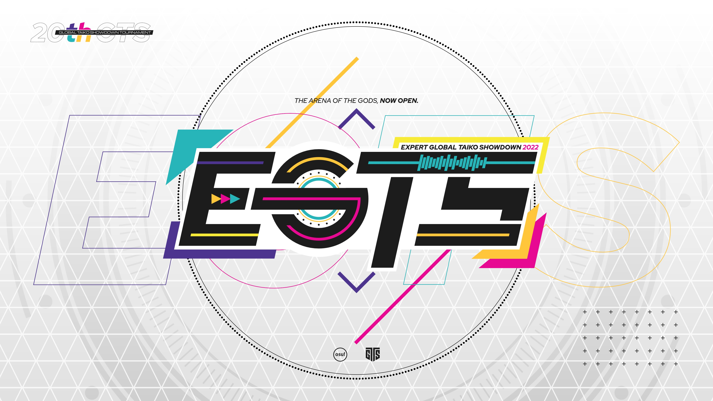
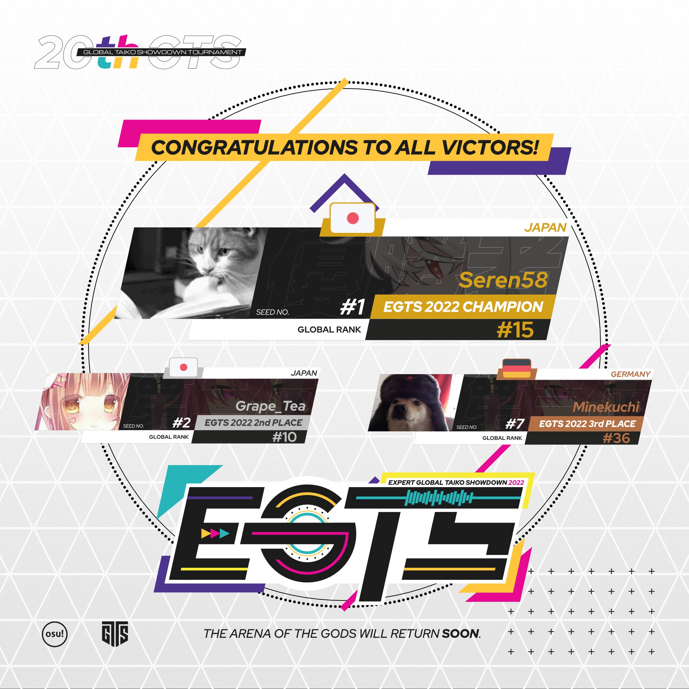

---
tags:
  - EGTS2022
  - EGTS
  - GTS
---

# Expert Global Taiko Showdown 2022

The **Expert Global Taiko Showdown 2022** (***EGTS 2022***) was a worldwide double-elimination osu!taiko tournament hosted by ::{ flag=FR }:: [\_yosh](https://osu.ppy.sh/users/7157133), ::{ flag=FR }:: [Briesmas](https://osu.ppy.sh/users/2865172), ::{ flag=FR }:: [Kasumi-sama](https://osu.ppy.sh/users/6177263), and ::{ flag=NL }:: [TaikoMom](https://osu.ppy.sh/users/9086438). The tournament was targeted for the top osu!taiko players, with no rank limits. It was the third instalment of the Expert Global Taiko Showdown and part of the Global Taiko Showdown series.

## Tournament schedule

| Event | Timestamp |
| --: | :-- |
| Registration phase | 2022-07-16/2022-07-31 |
| Screening phase | 2022-07-31/2022-08-07 |
| Qualifiers | 2022-08-11/2022-08-14 |
| Round of 96 | 2022-08-19/2022-08-21 |
| Round of 64 | 2022-08-27/2022-08-28 |
| Round of 32 | 2022-09-02/2022-08-04 |
| Round of 16 | 2022-09-10/2022-09-11 |
| Quarterfinals | 2022-09-17/2022-09-18 |
| Semifinals | 2022-09-24/2022-09-25 |
| Finals | 2022-10-01/2022-10-02 |
| Grand Finals | 2022-10-08/2022-10-09 |

## Prizes

| Placing | Prize(s) |
| :-: | :-- |
|  | Unique profile badge |
|  | Unique profile badge |
|  | Unique profile badge |

  

## Organisation

The Expert Global Taiko Showdown 2022 was run by various community members.

| Position | Member(s) |
| :-- | :-- |
| Organiser | ::{ flag=FR }:: [\_yosh](https://osu.ppy.sh/users/7157133), ::{ flag=MN }:: [Briesmas](https://osu.ppy.sh/users/2865172), ::{ flag=FR }:: [Kasumi-sama](https://osu.ppy.sh/users/6177263), ::{ flag=NL }:: [TaikoMom](https://osu.ppy.sh/users/9086438) |
| Head mappooler | ::{ flag=MN }:: [Briesmas](https://osu.ppy.sh/users/2865172), ::{ flag=GB }:: [mangomizer](https://osu.ppy.sh/users/1893718), ::{ flag=TW }:: [X a v y](https://osu.ppy.sh/users/3738344) |
| Mapper | ::{ flag=JP }:: [4sbet1](https://osu.ppy.sh/users/11563671), ::{ flag=US }:: [5\_5](https://osu.ppy.sh/users/6853438), ::{ flag=HK }:: [\_mtk](https://osu.ppy.sh/users/9468283), ::{ flag=MY }:: [\[Zeth\]](https://osu.ppy.sh/users/9912966), ::{ flag=DE }:: [Ak1o](https://osu.ppy.sh/users/1600041), ::{ flag=US }:: [Alchyr](https://osu.ppy.sh/users/4993032),::{ flag=PT }:: [BabySnakes](https://osu.ppy.sh/users/4669728),  ::{ flag=MN }:: [Briesmas](https://osu.ppy.sh/users/2865172), ::{ flag=MY }:: [cdh](https://osu.ppy.sh/users/2403621), ::{ flag=US }:: [Cychloryn](https://osu.ppy.sh/users/6921736), ::{ flag=HK }:: [Cynplytholowazy](https://osu.ppy.sh/users/3901754), ::{ flag=DE }:: [DarkVortex](https://osu.ppy.sh/users/1940325), ::{ flag=MN }:: [dtn](https://osu.ppy.sh/users/17630767), ::{ flag=JP }:: [ekumea1123](https://osu.ppy.sh/users/9119501), ::{ flag=HK }:: [Faputa](https://osu.ppy.sh/users/845733), ::{ flag=EC }:: [Gamelan4](https://osu.ppy.sh/users/9856910), ::{ flag=AR }:: [gaston\_2199](https://osu.ppy.sh/users/5938161), ::{ flag=FR }:: [Heaxys](https://osu.ppy.sh/users/5671417), ::{ flag=BR }:: [HiroK](https://osu.ppy.sh/users/4050738), ::{ flag=TN }:: [Hivie](https://osu.ppy.sh/users/14102976), ::{ flag=GB }:: [Horiiizon](https://osu.ppy.sh/users/8071438), ::{ flag=BR }:: [Ideal](https://osu.ppy.sh/users/3869519), ::{ flag=JP }:: [kei821](https://osu.ppy.sh/users/5846289), ::{ flag=JP }:: [KTYN](https://osu.ppy.sh/users/2250574), ::{ flag=MY }:: [ler1211](https://osu.ppy.sh/users/19901680), ::{ flag=DE }:: [Mew](https://osu.ppy.sh/users/2345156), ::{ flag=MY }:: [MTNTWarz](https://osu.ppy.sh/users/14036825), ::{ flag=DE }:: [Nwolf](https://osu.ppy.sh/users/1910766), ::{ flag=ES }:: [Raiden](https://osu.ppy.sh/users/2239480), ::{ flag=SE }:: [Raphalge](https://osu.ppy.sh/users/3918650), ::{ flag=NO }:: [roufou](https://osu.ppy.sh/users/1109122), ::{ flag=JP }:: [Roxy-](https://osu.ppy.sh/users/11931563), ::{ flag=CA }:: [rubies87](https://osu.ppy.sh/users/4949934), ::{ flag=US }:: [Stingy](https://osu.ppy.sh/users/6777358), ::{ flag=JP }:: [tasuke912](https://osu.ppy.sh/users/2774767), ::{ flag=AR }:: [trollocat](https://osu.ppy.sh/users/9228032), ::{ flag=CN }:: [UnagiDon](https://osu.ppy.sh/users/2062410), ::{ flag=JP }:: [uone](https://osu.ppy.sh/users/5321719), ::{ flag=TW }:: [X a v y](https://osu.ppy.sh/users/3738344), ::{ flag=DE }:: [Zetera](https://osu.ppy.sh/users/587737) |
| Mappool playtester | ::{ flag=HK }:: [\_mtk](https://osu.ppy.sh/users/9468283), ::{ flag=MY }:: [\[Zeth\]](https://osu.ppy.sh/users/9912966), ::{ flag=PT }:: [Babysnakes](https://osu.ppy.sh/users/4669728), ::{ flag=FI }:: [BFKB113PBK](https://osu.ppy.sh/users/13613362), ::{ flag=US }:: [ChurroChef](https://osu.ppy.sh/users/9258564), ::{ flag=HK }:: [Cynplytholowazy](https://osu.ppy.sh/users/3901754), ::{ flag=JP }:: [ekumea1123](https://osu.ppy.sh/users/9119501), ::{ flag=GB }:: [mangomizer](https://osu.ppy.sh/users/1893718), ::{ flag=DE }:: [Mew](https://osu.ppy.sh/users/2345156), ::{ flag=JP }:: [Noko\_BSF](https://osu.ppy.sh/users/3811831), ::{ flag=SE }:: [Raphalge](https://osu.ppy.sh/users/3918650), ::{ flag=JP }:: [syaron105](https://osu.ppy.sh/users/8741695), ::{ flag=JP }:: [shinchikuhome](https://osu.ppy.sh/users/3174184), ::{ flag=ID }:: [XK2238](https://osu.ppy.sh/users/1139209), ::{ flag=DE }:: [xMrtn-](https://osu.ppy.sh/users/866297) |
| Referee | ::{ flag=US }:: [\[K\]](https://osu.ppy.sh/users/16551387), ::{ flag=FR }:: [\_yosh](https://osu.ppy.sh/users/7157133), ::{ flag=CN }:: [154s8a6](https://osu.ppy.sh/users/7562543), ::{ flag=FR }:: [Aidown](https://osu.ppy.sh/users/1522146), ::{ flag=HK }:: [Akali393394](https://osu.ppy.sh/users/9686628), ::{ flag=SG }:: [arcpotato](https://osu.ppy.sh/users/12842392), ::{ flag=BE }:: [Brentywenty](https://osu.ppy.sh/users/22753946), ::{ flag=US }:: [cyger](https://osu.ppy.sh/users/20020441), ::{ flag=JP }:: [Noko\_BSF](https://osu.ppy.sh/users/3811831), ::{ flag=DE }:: [Sayira](https://osu.ppy.sh/users/7253958), ::{ flag=NL }:: [TaikoMom](https://osu.ppy.sh/users/9086438), ::{ flag=DE }:: [xMrtn-](https://osu.ppy.sh/users/866297) |
| Streamer | ::{ flag=HK }:: [-Storm7-](https://osu.ppy.sh/users/12248285), ::{ flag=US }:: [cheese salad](https://osu.ppy.sh/users/6349821), ::{ flag=FR }:: [Kasumi-sama](https://osu.ppy.sh/users/6177263), ::{ flag=IT }:: [ndrrr](https://osu.ppy.sh/users/4609767), ::{ flag=NL }:: [oliebol](https://osu.ppy.sh/users/2756335), ::{ flag=AU }:: [r1chyy](https://osu.ppy.sh/users/11499467), ::{ flag=SE }:: [Raphalge](https://osu.ppy.sh/users/3918650), ::{ flag=NL }:: [TaikoMom](https://osu.ppy.sh/users/9086438) |
| Commentator | ::{ flag=AU }:: [Beat43210](https://osu.ppy.sh/users/5664171), ::{ flag=VN }:: [davidminh0111](https://osu.ppy.sh/users/9623142), ::{ flag=US }:: [driodx](https://osu.ppy.sh/users/9709548), ::{ flag=GB }:: [Ethereal\_Winter](https://osu.ppy.sh/users/9780417), ::{ flag=US }:: [FrootLoopy542](https://osu.ppy.sh/users/5468461), ::{ flag=DE }:: [Joogs](https://osu.ppy.sh/users/8844167), ::{ flag=RU }:: [mekkimous](https://osu.ppy.sh/users/17381947), ::{ flag=GB }:: [overdahedge2014](https://osu.ppy.sh/users/9864847), ::{ flag=TW }:: [Polemo03](https://osu.ppy.sh/users/10726804), ::{ flag=SE }:: [Raphalge](https://osu.ppy.sh/users/3918650), ::{ flag=US }:: [SlipperyPickle](https://osu.ppy.sh/users/11969691), ::{ flag=NZ }:: [Sparxe](https://osu.ppy.sh/users/5750235), ::{ flag=GB }:: [Teezel](https://osu.ppy.sh/users/7528639), ::{ flag=GB }:: [willowww](https://osu.ppy.sh/users/11406987), ::{ flag=DE }:: [Zephyte](https://osu.ppy.sh/users/3867109) |
| Designer | ::{ flag=MY }:: [\[Zeth\]](https://osu.ppy.sh/users/9912966), ::{ flag=MY }:: [Jerry](https://osu.ppy.sh/users/605973), ::{ flag=PH }:: [OsuMe65](https://osu.ppy.sh/users/852867), ::{ flag=KR }:: [POCARI SWEAT](https://osu.ppy.sh/users/5082685), ::{ flag=TH }:: [YuugenP](https://osu.ppy.sh/users/2014016) |
| Character designer and illustrator | ::{ flag=PH }:: SPEC [(↗)](https://instagram.com/its_spec) |
| Translator | ::{ flag=FR }:: [\_yosh](https://osu.ppy.sh/users/7157133), ::{ flag=JP }:: [Noko\_BSF](https://osu.ppy.sh/users/3811831), ::{ flag=DE }:: [Sayira](https://osu.ppy.sh/users/7253958), ::{ flag=NL }:: [TaikoMom](https://osu.ppy.sh/users/9086438), ::{ flag=CN }:: [WonderMan](https://osu.ppy.sh/users/2221895) |
| Developer | ::{ flag=US }:: [Chupalika](https://osu.ppy.sh/users/1926383), ::{ flag=US }:: [Cychloryn](https://osu.ppy.sh/users/6921736), ::{ flag=NL }:: [oliebol](https://osu.ppy.sh/users/2756335), ::{ flag=FR }:: [ThePooN](https://osu.ppy.sh/users/718454) |
| Wiki editor | ::{ flag=ID }:: [fajar13k](https://osu.ppy.sh/users/7100002) |

## Links

- [Discussion thread](https://osu.ppy.sh/community/forums/topics/1612291)
- [Discord server](https://discord.gg/3mGC3HB)
- [EGTS website](https://gtsosu.com/egts/home)
- Livestream
  - [GTSosu](https://www.twitch.tv/gtsosu)
  - [GTSosu\_b](https://www.twitch.tv/gtsosu_b)
- [EGTS 2022 trailer](https://youtu.be/9RtCEP0e9H8)
- [Challonge bracket](https://challonge.com/EGTS2022)
- [Pick'em predictions website](https://pickem.hwc.hr/tournaments/94) hosted by ::{ flag=DE }:: [hallowatcher](https://osu.ppy.sh/users/1874761)

## Participants

| Seed | Members |
| :-- | :-- |
| Top | ::{ flag=JP }:: [Seren58](https://osu.ppy.sh/users/15252950), ::{ flag=JP }:: [Grape\_Tea](https://osu.ppy.sh/users/9540073), ::{ flag=GB }:: [goheegy](https://osu.ppy.sh/users/8057655), ::{ flag=JP }:: [hz404](https://osu.ppy.sh/users/14947043), ::{ flag=CL }:: [Ulqui](https://osu.ppy.sh/users/1263669), ::{ flag=JP }:: [kanten\_07](https://osu.ppy.sh/users/11680357), ::{ flag=DE }:: [Minekuchi](https://osu.ppy.sh/users/9584873), ::{ flag=JP }:: [Nekomusya7563](https://osu.ppy.sh/users/1382717), ::{ flag=JP }:: [\_Kan2](https://osu.ppy.sh/users/7160196), ::{ flag=JP }:: [kotohira\_06](https://osu.ppy.sh/users/22444525), ::{ flag=JP }:: [Six b0xes](https://osu.ppy.sh/users/8303357), ::{ flag=JP }:: [supesan](https://osu.ppy.sh/users/14623658), ::{ flag=IT }:: [Ikkun](https://osu.ppy.sh/users/1059945), ::{ flag=KR }:: [5henry](https://osu.ppy.sh/users/3337332), ::{ flag=TR }:: [frukoyurdakul](https://osu.ppy.sh/users/7612550), ::{ flag=IT }:: [LordEnder](https://osu.ppy.sh/users/4609767), ::{ flag=US }:: [Miniature Lamp](https://osu.ppy.sh/users/9821194), ::{ flag=SE }:: [Nurend](https://osu.ppy.sh/users/9905079), ::{ flag=JP }:: [ntefy\_](https://osu.ppy.sh/users/26454214), ::{ flag=US }:: [AuroraPhasmata](https://osu.ppy.sh/users/13664116), ::{ flag=US }:: [FrootLoopy542](https://osu.ppy.sh/users/5468461), ::{ flag=FI }:: [vodnanen](https://osu.ppy.sh/users/10335557), ::{ flag=FR }:: [Ekoro](https://osu.ppy.sh/users/284905), ::{ flag=MY }:: [CrabCow](https://osu.ppy.sh/users/9755504) |
| High | ::{ flag=FI }:: [Antti](https://osu.ppy.sh/users/13281473), ::{ flag=JP }:: [mizkifanboy](https://osu.ppy.sh/users/19148438), ::{ flag=TW }:: [CheeseStingy](https://osu.ppy.sh/users/16462012), ::{ flag=GB }:: [overdahedge2014](https://osu.ppy.sh/users/9864847), ::{ flag=FR }:: [Ranshi](https://osu.ppy.sh/users/6680785), ::{ flag=TW }:: [Smallwu](https://osu.ppy.sh/users/2512120), ::{ flag=JP }:: [BG\_SubMessy](https://osu.ppy.sh/users/24748957), ::{ flag=FI }:: [Mazzuli500](https://osu.ppy.sh/users/10648818), ::{ flag=IT }:: [D3kuu](https://osu.ppy.sh/users/7807444), ::{ flag=SG }:: [Prehistoria](https://osu.ppy.sh/users/8364237), ::{ flag=PH }:: [Pochacco](https://osu.ppy.sh/users/2927742), ::{ flag=NZ }:: [Zed0x](https://osu.ppy.sh/users/12136108), ::{ flag=ID }:: [Joltzzz](https://osu.ppy.sh/users/15436568), ::{ flag=FR }:: [QALF](https://osu.ppy.sh/users/11525993), ::{ flag=CN }:: [\[GB\]Edward\_Tsui](https://osu.ppy.sh/users/8609627), ::{ flag=CA }:: [Dizzayy](https://osu.ppy.sh/users/12014683), ::{ flag=DE }:: [frz](https://osu.ppy.sh/users/6956922), ::{ flag=US }:: [mBiscuit](https://osu.ppy.sh/users/17061174), ::{ flag=AR }:: [Megafan](https://osu.ppy.sh/users/6632605), ::{ flag=NL }:: [Boaz](https://osu.ppy.sh/users/13302996), ::{ flag=FI }:: [MEGAMELA](https://osu.ppy.sh/users/13613362), ::{ flag=TW }:: [qoot8123](https://osu.ppy.sh/users/766371), ::{ flag=US }:: [Chupalika](https://osu.ppy.sh/users/1926383), ::{ flag=GB }:: [Dusk-](https://osu.ppy.sh/users/6092181) |
| Low | ::{ flag=NL }:: [Cookie\_Tree](https://osu.ppy.sh/users/502722), ::{ flag=JP }:: [Ku\_Ren](https://osu.ppy.sh/users/2535243), ::{ flag=JP }:: [ICECAKE](https://osu.ppy.sh/users/16100800), ::{ flag=JP }:: [akumufangirl](https://osu.ppy.sh/users/6198876), ::{ flag=SG }:: [MattrexDark](https://osu.ppy.sh/users/7171110), ::{ flag=HK }:: [Shing\_](https://osu.ppy.sh/users/2211364), ::{ flag=VN }:: [davidminh0111](https://osu.ppy.sh/users/9623142), ::{ flag=NZ }:: [idk123456](https://osu.ppy.sh/users/18718856), ::{ flag=RU }:: [QuassBot](https://osu.ppy.sh/users/11117835), ::{ flag=US }:: [driodx](https://osu.ppy.sh/users/9709548), ::{ flag=US }:: [LuriCookie](https://osu.ppy.sh/users/9517612), ::{ flag=CH }:: [Zero1519](https://osu.ppy.sh/users/547957), ::{ flag=RU }:: [Dayzeek](https://osu.ppy.sh/users/5009970), ::{ flag=CA }:: [6\_6](https://osu.ppy.sh/users/5207783), ::{ flag=NO }:: [Vendelicious](https://osu.ppy.sh/users/8818089), ::{ flag=FR }:: [Gintoki8](https://osu.ppy.sh/users/2239411), ::{ flag=PH }:: [Eyenine](https://osu.ppy.sh/users/1259391), ::{ flag=US }:: [Etholux](https://osu.ppy.sh/users/8593837), ::{ flag=ES }:: [OneBurstMan](https://osu.ppy.sh/users/5285438), ::{ flag=FR }:: [Acii\_](https://osu.ppy.sh/users/11253595), ::{ flag=DE }:: [Dioramos](https://osu.ppy.sh/users/14415208), ::{ flag=TW }:: [0Ixcy0](https://osu.ppy.sh/users/15086387), ::{ flag=FR }:: [Rezyia](https://osu.ppy.sh/users/13911899), ::{ flag=NZ }:: [Blujae](https://osu.ppy.sh/users/10613885) |
| Unseeded | ::{ flag=CL }:: [Catulus](https://osu.ppy.sh/users/6276709), ::{ flag=FR }:: [Chernobog](https://osu.ppy.sh/users/3317042), ::{ flag=JP }:: [nuku0315](https://osu.ppy.sh/users/8772103), ::{ flag=CR }:: [Hotman](https://osu.ppy.sh/users/7902082), ::{ flag=US }:: [SolaEclipse](https://osu.ppy.sh/users/6621158), ::{ flag=VE }:: [Shinsekai-](https://osu.ppy.sh/users/2140739), ::{ flag=US }:: [ERA Klarion](https://osu.ppy.sh/users/13857986), ::{ flag=US }:: [\_Flamescion\_](https://osu.ppy.sh/users/17841784), ::{ flag=IT }:: [Plasmusss](https://osu.ppy.sh/users/20822544), ::{ flag=US }:: [SlipperyPickle](https://osu.ppy.sh/users/11969691), ::{ flag=NO }:: [Mist31](https://osu.ppy.sh/users/18916920), ::{ flag=LV }:: [Huntey](https://osu.ppy.sh/users/14451706), ::{ flag=IT }:: [KITEMMUORT322](https://osu.ppy.sh/users/10370310), ::{ flag=TW }:: [rex0988476](https://osu.ppy.sh/users/11426995), ::{ flag=MX }:: [Awwy](https://osu.ppy.sh/users/4183406), ::{ flag=HK }:: [Henry\_03](https://osu.ppy.sh/users/17413733), ::{ flag=MX }:: [-Devo](https://osu.ppy.sh/users/7090541), ::{ flag=IT }:: [megalovania lol](https://osu.ppy.sh/users/20215461), ::{ flag=EE }:: [PaskAcc](https://osu.ppy.sh/users/9040795), ::{ flag=HK }:: [YonGin](https://osu.ppy.sh/users/7109317), ::{ flag=ID }:: [Sleepti](https://osu.ppy.sh/users/7137930), ::{ flag=MX }:: [JunkyTrack](https://osu.ppy.sh/users/11720359), ::{ flag=JP }:: [yayuyoyo](https://osu.ppy.sh/users/8104504), ::{ flag=CA }:: [dots\_](https://osu.ppy.sh/users/15429414) |
| Eliminated | ::{ flag=DE }:: [Penggwin](https://osu.ppy.sh/users/14050018), ::{ flag=CA }:: [DimplesRMe](https://osu.ppy.sh/users/13348268), ::{ flag=RU }:: [mekkimous](https://osu.ppy.sh/users/17381947), ::{ flag=JP }:: [basshhii0610](https://osu.ppy.sh/users/27997121), ::{ flag=DE }:: [DieButterStulle](https://osu.ppy.sh/users/4965323), ::{ flag=MY }:: [JoelG 12](https://osu.ppy.sh/users/18403677), ::{ flag=PT }:: [ImDem0nPT](https://osu.ppy.sh/users/12733839), ::{ flag=PL }:: [404usernotfound](https://osu.ppy.sh/users/5274209), ::{ flag=US }:: [Chrono\_L](https://osu.ppy.sh/users/24638065), ::{ flag=VN }:: [JackTVN](https://osu.ppy.sh/users/12510704), ::{ flag=US }:: [AdrianLazer](https://osu.ppy.sh/users/10292643), ::{ flag=CA }:: [Garfield\_osu](https://osu.ppy.sh/users/9743947) |

## Podium

## Mappools

### Grand Finals

**[Download the mappack here! (98 MB)](https://mega.nz/file/2TwWgIIA#mLdAOD3tv10Ki73WL6zLPmpczKahOClfcjTl-gvgGvk)**

- NoMod
  1. [yukikaze - Osu no Toire de Kiita Kyoku (X a v y) \[rereretoilered\]](https://osu.ppy.sh/beatmapsets/1859294#taiko/3822031)
  2. [Mono. - PETIT SATURN (X a v y) \[PERIHELION\]](https://osu.ppy.sh/beatmapsets/1859295#taiko/3822034)
  3. [df - Phosphophyllite (X a v y) \[Phyllo\]](https://osu.ppy.sh/beatmapsets/1859297#taiko/3822036)
  4. [lhk - 5D TETRIS MATCH & REMATCH (cut ver.) (Mew) \[T-Spin Quadruple\]](https://osu.ppy.sh/beatmapsets/1859259#taiko/3821952)
  5. [nitro (as "DJ Curry") - IL-HEL-U (\_mtk) \[SPICE\]](https://osu.ppy.sh/beatmapsets/1859303#taiko/3822047)
  6. [Infant Annihilator - Ov Sacrament and Sincest (Ak1o) \[End\]](https://osu.ppy.sh/beatmapsets/1859317#taiko/3822094)
- Hidden
  1. [Louie Fibonacci feat. ricono - #DoomeyTunes (cdh) \[#HighDefinition1\]](https://osu.ppy.sh/beatmapsets/1859319#taiko/3822096)
  2. [DJ Myosuke & Noizenecio - Architecture (Cut Ver.) (Faputa) \[Under Construction\]](https://osu.ppy.sh/beatmapsets/1859298#taiko/3822037)
- HardRock
  1. [Juggernaut. - Devotion (Cynplytholowazy) \[Loyalty\]](https://osu.ppy.sh/beatmapsets/1859203#taiko/3821831)
  2. [celtix - Entanglement (KTYN) \[Disturbed Emotions\]](https://osu.ppy.sh/beatmapsets/1859291#taiko/3822025)
- DoubleTime
  1. [Sta - Conway's Child (\[Zeth\]) \[Game of Life\]](https://osu.ppy.sh/beatmapsets/1859289#taiko/3822023)
  2. [katagiri - Kemonomimi Loli no Wakusei (Cynplytholowazy) \[Nyan\~Nyan\~Planet\~\~ with KTYN\~\]](https://osu.ppy.sh/beatmapsets/1859204#taiko/3821832)
- ForceMod
  1. [Sot-C - Cursed Metamorph (Cut Ver.) (uone) \[Inner Oni (EGTS Edit)\]](https://osu.ppy.sh/beatmapsets/1859250#taiko/3821934)
  2. [LINKER - WASTED (GTS Edit) (rubies87) \[CH3-CH2-OH\]](https://osu.ppy.sh/beatmapsets/1859275#taiko/3821990)
  3. [Rukadesu & 5KiLOBYTE - ULTIMATE (MTNTWarz) \[babu Oni\]](https://osu.ppy.sh/beatmapsets/1859283#taiko/3822010)
- Tiebreaker
  1. **[GTS Sound Team - <</nttld.:beings>> \~Truth in Uncertainty\~ (Hivie) \[<</eclectic.:genesis>>\]](https://osu.ppy.sh/beatmapsets/1859338#taiko/3822143)**

### Finals

**[Download the mappack here! (91 MB)](https://mega.nz/file/nZg2xKja#c3tBX1VasuktYzJQgkIOlH9PQesl3P6Sb_XilX7OiUY)**

- NoMod
  1. [Shoebill - improvised mashcore (Raphalge) \[Inner Oni\]](https://osu.ppy.sh/beatmapsets/1855255#taiko/3812476)
  2. [Kobaryo - Put Your F\*cking Phone Down (Kobaryos FTN-Remix) (X a v y) \[Transilient Collab\]](https://osu.ppy.sh/beatmapsets/1855025#taiko/3812009)
  3. [Frums - Remnants of Turing (UnagiDon) \[CMU's Turing Complete\]](https://osu.ppy.sh/beatmapsets/1855263#taiko/3812489)
  4. [seatrus - The Daybreak Will Never Come Again. (Cynplytholowazy) \[Eternal Night.\]](https://osu.ppy.sh/beatmapsets/1855143#taiko/3812272)
  5. [CaNdy Sync - Step&Run with Depression (X a v y) \[Nutes\]](https://osu.ppy.sh/beatmapsets/1855281#taiko/3812536)
  6. [katagiri - Bootleg Heaven (KTYN) \[Forbidden Collab\]](https://osu.ppy.sh/beatmapsets/1855270#taiko/3812521)
- Hidden
  1. [Tyrrer & BilliumMoto - BEBEB3 (Cut Ver.) (MTNTWarz) \[BABABU\]](https://osu.ppy.sh/beatmapsets/1855247#taiko/3812457)
  2. [U-F SEQUENCER - TEMPEST ZONE -code BLOOD- (DJ Myosuke OVER 500!! Remix) (Ak1o) \[OUTER ONI\]](https://osu.ppy.sh/beatmapsets/1853556#taiko/3808737)
- HardRock
  1. [Tanchiky - rE:loaD (Nwolf) \[stage seven\]](https://osu.ppy.sh/beatmapsets/1855285#taiko/3812541)
  2. [Five Hammer - fffff op.2 (Raphalge) \[Inner Oni (EGTS)\]](https://osu.ppy.sh/beatmapsets/1855286#taiko/3812542)
- DoubleTime
  1. [KARUT - Assault Gear (KyeX) \[Overheat\]](https://osu.ppy.sh/beatmapsets/1855274#taiko/3812525)
  2. [goreshit - o'er the flood (\[Zeth\]) \[cascade\]](https://osu.ppy.sh/beatmapsets/1855113#taiko/3812204)
- ForceMod
  1. [Xyris - Terrablazer (Ak1o) \[Eruption\]](https://osu.ppy.sh/beatmapsets/1853559#taiko/3808743)
  2. [factal - Flux (Hivie) \[Quantum (feat. woosungko)\]](https://osu.ppy.sh/beatmapsets/1855293#taiko/3812555)
  3. [Laur - Chimi Moryou (Roxy-) \[KurOni (EGTS Ver.)\]](https://osu.ppy.sh/beatmapsets/1855258#taiko/3812482)
- Tiebreaker
  1. **[ikaruga\_nex vs. Kagetora. - Grabinschrift der Gotter (Roxy-) \[Flower, Isolate, Nightmare, Aberrant, and the Lucid\]](https://osu.ppy.sh/beatmapsets/1855299#taiko/3812563)**

### Semifinals

**[Download the mappack here! (90 MB)](https://mega.nz/file/vZgBTbCD#nqRYBScGRkp6tAz6cUUNpHRtVdYUlIUApQkAUzr3x8U)**

- NoMod
  1. [one fourteen - break through (Ideal) \[Armageddon (EGTS Edit)\]](https://osu.ppy.sh/beatmapsets/1850900#taiko/3802268)
  2. [Kobaryo - Theme for Psychopath Justice (Hivie) \[you lose (5)\]](https://osu.ppy.sh/beatmapsets/1850906#taiko/3802276)
  3. [Sven Noon - The Map (uone) \[Taiko\]](https://osu.ppy.sh/beatmapsets/1850669#taiko/3801800)
  4. [gingus - dont say "i can sample that" for 24 hours challenge (Mew) \[dont say "i can do nm4" for 1 week challenge\]](https://osu.ppy.sh/beatmapsets/1850910#taiko/3802289)
  5. [MYUKKE. - BUNA\*SYNERGY!!! (KTYN) \[SYNERGY\]](https://osu.ppy.sh/beatmapsets/1851093#taiko/3802715)
  6. [rN - ad:roreschach (\[Zeth\]) \[pareidolia\]](https://osu.ppy.sh/beatmapsets/1850832#taiko/3802131)
- Hidden
  1. [Frums - Living Will (\_mtk) \[Fapu & Mutsuki's Existential Crisis (Zeth ver.)\]](https://osu.ppy.sh/beatmapsets/1850837#taiko/3802137)
  2. [Xat0li - Rin (MTNTWarz) \[Phantasmagoria\]](https://osu.ppy.sh/beatmapsets/1850743#taiko/3801970)
- HardRock
  1. [MonarX - Nanzen Karakurenai No Mai (rubies87) \[Inner Oni\]](https://osu.ppy.sh/beatmapsets/1850969#taiko/3802457)
  2. [Zenpaku - Enkindle feat. vally.exe (Raphalge) \[Inner Oni\]](https://osu.ppy.sh/beatmapsets/1850934#taiko/3802329)
- DoubleTime
  1. [Ayaponzu\* - Streaming Heart (X a v y) \[Heartbreak\]](https://osu.ppy.sh/beatmapsets/1850620#taiko/3801713)
  2. [Alquimia - Indomable (Raiden) \[Unbreakable\]](https://osu.ppy.sh/beatmapsets/1850943#taiko/3802364)
- ForceMod
  1. [Camellia - THE MUZZLE FACING (Stingy) \[Stingy & Nwolf's Massacre\]](https://osu.ppy.sh/beatmapsets/1850945#taiko/3802374)
  2. [blobdash - Resentment (Ak1o) \[Inner Hatred\]](https://osu.ppy.sh/beatmapsets/1850544#taiko/3801533)
  3. [Sad Keyboard Guy - Reflection Shift (Cynplytholowazy) \[Universe\]](https://osu.ppy.sh/beatmapsets/1851049#taiko/3802634)
- Tiebreaker
  1. **[takehirotei as ''Infinite Limit'' - Rules of the Chaos Dilemma (MTNTWarz) \[Amplectere Confusionem\]](https://osu.ppy.sh/beatmapsets/1850782#taiko/3802036)**

### Quarterfinals

**[Download the mappack here! (76 MB)](https://mega.nz/file/WEQ11Sib#F6ggB55W8EkjoVaQkVGY4_9hjOSjxK07estwFq-Weuk)**

- NoMod
  1. [blobdash - Corrupted Binary StaR (Ak1o) \[Fatal BitfliP\]](https://osu.ppy.sh/beatmapsets/1846727#taiko/3793517)
  2. [Ashrount - LaureLs \~the Angelus\~ (Cynplytholowazy) \[Cynply & Xavy's HEAVENLY\]](https://osu.ppy.sh/beatmapsets/1846543#taiko/3793204)
  3. [KOAN Sound & Asa - fuego (sakuraburst remix) (4sbet1) \[inner oni\]](https://osu.ppy.sh/beatmapsets/1846587#taiko/3793286)
  4. [Emray - Misfortune\*Star (Mew) \[Shining\*Star\]](https://osu.ppy.sh/beatmapsets/1846731#taiko/3793523)
  5. [Paraoka - L9 (Raphalge) \[Inner Oni\]](https://osu.ppy.sh/beatmapsets/1846739#taiko/3793541)
- Hidden
  1. [winddrums - Enchante (Faputa) \[Fapu & Cynply's MAXIMUM\]](https://osu.ppy.sh/beatmapsets/1846549#taiko/3793222)
  2. [Silent Siren - Hachigatsu no Yoru (MathaFuckera.k.alziefuckuppunk270mix) (KTYN) \[Midsummer Night\]](https://osu.ppy.sh/beatmapsets/1846885#taiko/3793832)
- HardRock
  1. [Down - Ekoro (Zetera) \[Commemorative Oni\]](https://osu.ppy.sh/beatmapsets/1846753#taiko/3793560)
  2. [Se-U-Ra - Igallta (Hivie) \[okayge\]](https://osu.ppy.sh/beatmapsets/1846767#taiko/3793583)
- DoubleTime
  1. [OSTER project - piano x forte (Nwolf) \[Oni (EhGTS x Ehdit)\]](https://osu.ppy.sh/beatmapsets/1846758#taiko/3793566)
  2. [sawawa - Fire in the Phoenix (DarkVortex) \[Oni\]](https://osu.ppy.sh/beatmapsets/1846762#taiko/3793574)
- ForceMod
  1. [Kou! - Sanzui (kei821) \[Inner Oni\]](https://osu.ppy.sh/beatmapsets/1846769#taiko/3793585)
  2. [Kurosawa Daisuke - GIGA DRIVE (\_mtk) \[FLAMEWALL\]](https://osu.ppy.sh/beatmapsets/1846627#taiko/3793355)
  3. [pm04034 - Sugary Mocaccino (gaston\_2199) \[Bittersweet\]](https://osu.ppy.sh/beatmapsets/1846776#taiko/3793604)
- Tiebreaker
  1. **[kyou1110 - Mam rozbite sluchatka placem (dtn) \[oni\]](https://osu.ppy.sh/beatmapsets/1846616#taiko/3793337)**

### Round of 16

**[Download the mappack here! (118 MB)](https://mega.nz/file/WExz1IYI#iiV3lp3WPLeV3ds60t429_fNCn9SISmI1bNc1naLpTo)**

- NoMod
  1. [Gram - Nibelungen (Nwolf) \[Die Heldensage von Cynply, Faputa und dem Drachen\]](https://osu.ppy.sh/beatmapsets/1842708#taiko/3784936)
  2. [fnylsp - SuperMiracleEnsemble (Cynplytholowazy) \[VIVID\]](https://osu.ppy.sh/beatmapsets/1842410#taiko/3784311)
  3. [Dictate - Mitochondrion (Cut Ver.) (\[Zeth\]) \[Heatwave\]](https://osu.ppy.sh/beatmapsets/2180441#taiko/4605774)
  4. [MYUKKE. - Salmon It Up! (Mew) \[Wrap It Up!\]](https://osu.ppy.sh/beatmapsets/1842710#taiko/3784939)
  5. [Frums - Jam with Pancake (Alchyr) \[Good Morning\]](https://osu.ppy.sh/beatmapsets/1842712#taiko/3784941)
- Hidden
  1. [Kurubukko - Sora no Tonari (\_mtk) \[Sea of Stars\]](https://osu.ppy.sh/beatmapsets/1842523#taiko/3784622)
  2. [Inferi - Onslaught of the Covenant (Cut Ver.) (Ak1o) \[No Remorse\]](https://osu.ppy.sh/beatmapsets/1842720#taiko/3784955)
- HardRock
  1. [DJ Mass MAD Izm\* - Red. by Jack Trance (roufou) \[rollfou style\]](https://osu.ppy.sh/beatmapsets/1842616#taiko/3784794)
  2. [exnoiz - exnoiz Appreciation Mapset (X a v y) \[(not)Lonely girl (Xavy)\]](https://osu.ppy.sh/beatmapsets/1676148#taiko/3784652)
- DoubleTime
  1. [Tedjimo yomigY - JezoensiS (Cychloryn) \[Inner Oni\]](https://osu.ppy.sh/beatmapsets/1841481#taiko/3782248)
  2. [Tanchiky - Maneuver (Nwolf) \[Man uber (EhGTS Ehdit)\]](https://osu.ppy.sh/beatmapsets/1842730#taiko/3784968)
- ForceMod
  1. [4nzu - SCAN EGOEVIL (ekumea1123) \[HYPER\]](https://osu.ppy.sh/beatmapsets/1842570#taiko/3784715)
  2. [SOOOO - iiillluuuvvvUUU (Faputa) \[dddooouuulluuuvvvMMMEEE\]](https://osu.ppy.sh/beatmapsets/1842820#taiko/3785122)
  3. [DJ Witch Girl MIR4CLEN - Danrit (Gamelan4) \[F\*CK!!\]](https://osu.ppy.sh/beatmapsets/1842746#taiko/3784993)
- Tiebreaker
  1. **[rN vs. [Shanom, ptar124 & Zekai] - dichroma, ludiosia. (Briesmas) \[Dreams of Scarlet Oceans\]](https://osu.ppy.sh/beatmapsets/1842219#taiko/3783913)**

### Round of 32

**[Download the mappack here! (110 MB)](https://mega.nz/file/HQYgGLxS#nA8z_WgxiNNIcBc3DQW4ypNmXRtuWEK3Sd-V80xhwx8)**

- NoMod
  1. [Silentroom - The Nue and Morning Stars ('Daybreaker' Full Version) (\_mtk) \[Stardust\]](https://osu.ppy.sh/beatmapsets/1837986#taiko/3773992)
  2. [xavy - First Melody (Cut ver.) (5\_5) \[Tune\]](https://osu.ppy.sh/beatmapsets/1837972#taiko/3773964)
  3. [Nhato - Darkness Is The Colour (rubies87) \[150bpm (EGTS)\]](https://osu.ppy.sh/beatmapsets/1837926#taiko/3773885)
  4. [Iboibo - 25N168W (X a v y) \[egts\]](https://osu.ppy.sh/beatmapsets/1838165#taiko/3774357)
  5. [polysha - Orange Illusionista (Mew) \[Ace of Diamonds\]](https://osu.ppy.sh/beatmapsets/1838058#taiko/3774192)
- Hidden
  1. [Link"0 - Uro no Yorishiro (UnagiDon) \[Possession\]](https://osu.ppy.sh/beatmapsets/1837969#taiko/3773958)
  2. [sasakure.UK VS Daisuke Anayama - ANU (MTNTWarz) \[Empyreal\]](https://osu.ppy.sh/beatmapsets/1837919#taiko/3773874)
- HardRock
  1. [HATE - SOUNDWiTCH (HiroK) \[Inner Oni (EGTS ver.)\]](https://osu.ppy.sh/beatmapsets/1837833#taiko/3773712)
  2. [BlackY vs. WAiKURO - STEEL TRANSONIC (\_mtk) \[GUARDIANS (EGTS EDIT)\]](https://osu.ppy.sh/beatmapsets/1837982#taiko/3773987)
- DoubleTime
  1. [Sparxe - Dream Elevator (Cynplytholowazy) \[Descension\]](https://osu.ppy.sh/beatmapsets/1837865#taiko/3773779)
  2. [SOUND HOLIC - UNKNOWN REALITY (Ak1o) \[Inner Oni\]](https://osu.ppy.sh/beatmapsets/1836338#taiko/3770357)
- ForceMod
  1. [Slax - Blight My Name (Mew) \[Say it again.\]](https://osu.ppy.sh/beatmapsets/1838080#taiko/3774229)
  2. [Breakchild & Stoop - blue noah 2022 (Cut Ver.) (Cynplytholowazy) \[Hell Oni\]](https://osu.ppy.sh/beatmapsets/1837866#taiko/3773780)
  3. [METAROOM - METADATA (trollocat) \[METANOIA (EGTS EDIT)\]](https://osu.ppy.sh/beatmapsets/1838176#taiko/3774386)
- Tiebreaker
  1. **[DJ Raisei - Fractured Angel (roufou) \[Extirpated Gleaming Tatter of the Sacrament\]](https://osu.ppy.sh/beatmapsets/1838114#taiko/3774272)**

### Round of 64

**[Download the mappack here! (91 MB)](https://mega.nz/file/SZQy2aDZ#QwcEZrFyd-t-ZBPaBIJ9a2Aj7PSeU0zEjBw9dZkrC1o)**

- NoMod
  1. [NIWASHI - Silence is Golden, Speech is Golden (Cychloryn) \[Cychlo & HiroK are Golden\]](https://osu.ppy.sh/beatmapsets/1833489#taiko/3764096)
  2. [Kobaryo - SEITEN NO TERIYAKI (X a v y) \[LEGENDARY ONI\]](https://osu.ppy.sh/beatmapsets/1833494#taiko/3764104)
  3. [phonon - assembly (dtn) \[egts\]](https://osu.ppy.sh/beatmapsets/1833802#taiko/3764703)
  4. [MAX MAXIMIZER - CLAMARE (Cynplytholowazy) \[KING\]](https://osu.ppy.sh/beatmapsets/1833434#taiko/3763976)
- Hidden
  1. [Ujico\* - BLSTR (roufou) \[Game Over\]](https://osu.ppy.sh/beatmapsets/1833510#taiko/3764140)
  2. [Rita - dorchadas (Cut ver.) (Nwolf) \[Very Oni\]](https://osu.ppy.sh/beatmapsets/1833515#taiko/3764148)
- HardRock
  1. [nonoc - Memento (droplamp Remix) (tasuke912) \[Greed\]](https://osu.ppy.sh/beatmapsets/1833332#taiko/3763709)
  2. [BUTAOTOME - Trauma Recorder (Nwolf) \[Inner Oni\]](https://osu.ppy.sh/beatmapsets/1833526#taiko/3764166)
- DoubleTime
  1. [kozato snow - Rengetsu Ouka (Ideal) \[Snowy Ribbon\]](https://osu.ppy.sh/beatmapsets/1833532#taiko/3764176)
  2. [Hirasawa Yui (CV Toyosaki Aki) - Guitar ni Kubittake (kmsn\_dnb\_bootleg\_rmx) (BabySnakes) \[Inner Oni\]](https://osu.ppy.sh/beatmapsets/1833613#taiko/3764316)
- ForceMod
  1. [Aoi - TYPE-Rebellion (Cynplytholowazy) \[Resistance\]](https://osu.ppy.sh/beatmapsets/1833435#taiko/3763979)
  2. [Mifumei - Yurame (\[Zeth\]) \[Fluctuation\]](https://osu.ppy.sh/beatmapsets/1833425#taiko/3763957)
  3. [Maoki Yamamoto - Houkago concertino~watashi dake no bushitsu kyousoukyoku (roufou) \[Frenzy\]](https://osu.ppy.sh/beatmapsets/1833545#taiko/3764201)
- Tiebreaker
  1. **[Gardens - Rafflesia (5\_5) \[5\_5 and Unagi's Flower of Death\]](https://osu.ppy.sh/beatmapsets/1833491#taiko/3764098)**

### Round of 96

**[Download the mappack here! (73 MB)](https://mega.nz/file/2QATVbSD#jAPFWPwuBMfl7AtJP8I_pX8MzOyI63-jCsXKHxpZB84)**

- NoMod
  1. [goreshit - Still scared of ouija boards (BabySnakes) \[Inner Oni\]](https://osu.ppy.sh/beatmapsets/1828702#taiko/3753217)
  2. [Dz'Xa - Keqing 250 (X a v y) \[C1 (EGTS Ver.)\]](https://osu.ppy.sh/beatmapsets/1828476#taiko/3752724)
  3. [lapix - HiTECH Bass Loops Vol.1 (rubies87) \[Oni (EGTS Edit)\]](https://osu.ppy.sh/beatmapsets/1828205#taiko/3752111)
  4. [coltrane - this train going nowhere (Mew) \[final destination (egts ver.)\]](https://osu.ppy.sh/beatmapsets/1828705#taiko/3753223)
- Hidden
  1. [Eagle - Boomy and The Boost (roufou) \[ROCK IT ROCK IT\]](https://osu.ppy.sh/beatmapsets/1828582#taiko/3752956)
  2. [Slax - Giri The Giri (Horiiizon) \[ler & Horiiizon's Inner Oni\]](https://osu.ppy.sh/beatmapsets/1828739#taiko/3753299)
- HardRock
  1. [surk - Voltage (Ak1o) \[Inner Oni\]](https://osu.ppy.sh/beatmapsets/1828345#taiko/3752465)
  2. [USAO - Blows Up Everything (DarkVortex) \[Short Fuse\]](https://osu.ppy.sh/beatmapsets/1828587#taiko/3752963)
- DoubleTime
  1. [MEMODEMO - Extragalactic (Ak1o) \[Oni\]](https://osu.ppy.sh/beatmapsets/1828344#taiko/3752464)
  2. [Siren (CV: Liyuu) - Polaris (MTNTWarz) \[Elegance\]](https://osu.ppy.sh/beatmapsets/1828550#taiko/3752883)
- ForceMod
  1. [Emiru no Aishita Tsukiyo ni Dai San Gensou Kyoku wo - Saa Anata no Inochi wo Sasagete Nemure (Cynplytholowazy) \[Illusionary Existance\]](https://osu.ppy.sh/beatmapsets/1828484#taiko/3752737)
  2. [m108 - Crescent Sakura (Cynplytholowazy) \[Floret\]](https://osu.ppy.sh/beatmapsets/1828485#taiko/3752739)
  3. [KAH - JUDGE UP DOWN (BabySnakes) \[Inner Oni\]](https://osu.ppy.sh/beatmapsets/1828735#taiko/3753294)
- Tiebreaker
  1. **[blobdash & Raphlesia - Recollection (Nwolf) \[Collab of Memories\]](https://osu.ppy.sh/beatmapsets/1828727#taiko/3753265)**

### Qualifiers

**[Download the mappack here! (42 MB)](https://mega.nz/file/KaBlzYhZ#DJ-v_DsAdct_pIF3nNKNJcGA_1-rAkmsjcWErWqRt-c)**

- NoMod
  1. [exnoiz - Hello amen (ler1211) \[hihi ><\]](https://osu.ppy.sh/beatmapsets/1823672#taiko/3742073)
  2. [N^2 - PROPHET-73 (UnagiDon) \[PROPHECY-021 (EGTS Edit)\]](https://osu.ppy.sh/beatmapsets/1823571#taiko/3741842)
  3. [3R2 - Corruption ([Zeth]) \[E\_rR0rr\_\]](https://osu.ppy.sh/beatmapsets/1823735#taiko/3742210)
- Hidden
  1. [Angela - Angela's Got Her #EYES On U... (roufou) \[Funny Oni\]](https://osu.ppy.sh/beatmapsets/1823744#taiko/3742222)
  2. [Shibayan - Shock!! (S.S.H. Arrangement) (Zetera) \[Exceed\]](https://osu.ppy.sh/beatmapsets/1823654#taiko/3741993)
- HardRock
  1. [Halv - Amateras Rhythm (uone) \[Inner Oni\]](https://osu.ppy.sh/beatmapsets/1823609#taiko/3741894)
  2. [A? - WAVE PUNCH (Cynplytholowazy) \[UPSURGE\]](https://osu.ppy.sh/beatmapsets/1823663#taiko/3742034)
- DoubleTime
  1. [LeaF - Mere Fancy (extended ver.) (DarkVortex) \[Fancy\]](https://osu.ppy.sh/beatmapsets/1823598#taiko/3741881)
  2. [Fractal Dreamers - Monolithia (Nwolf) \[Ono\]](https://osu.ppy.sh/beatmapsets/1823577#taiko/3741852)
- ForceMod
  1. [BEMANI Sound Team 'TATSUYA' - Miwaku no YUMMY sweets (roufou) \[Monstrous Strength\]](https://osu.ppy.sh/beatmapsets/1823765#taiko/3742258)

## Match results

### Grand Finals

Saturday, 8 October 2022:

| Player 1 |  |  | Player 2 | Match link |
| --: | :-: | :-: | :-- | :-- |
| **Grape\_Tea** ::{ flag=JP }:: | **7** | 6 | ::{ flag=DE }:: Minekuchi | [#1](https://osu.ppy.sh/community/matches/104299641) |

Sunday, 9 October 2022:

| Player 1 |  |  | Player 2 | Match link |
| --: | :-: | :-: | :-- | :-- |
| **Seren58** ::{ flag=JP }:: | **7** | 1 | ::{ flag=JP }:: Grape\_Tea | [#1](https://osu.ppy.sh/community/matches/104322973) |

### Finals

Saturday, 1 October 2022:

| Player 1 |  |  | Player 2 | Match link |
| --: | :-: | :-: | :-- | :-- |
| hz404 ::{ flag=JP }:: | 5 | **7** | ::{ flag=DE }:: **Minekuchi** | [#1](https://osu.ppy.sh/community/matches/104146288) |
| **Seren58** ::{ flag=JP }:: | **7** | 3 | ::{ flag=JP }:: Grape\_Tea | [#1](https://osu.ppy.sh/community/matches/104148725) |
| **goheegy** ::{ flag=GB }:: | **7** | 0 | ::{ flag=CL }:: Ulqui | [#1](https://osu.ppy.sh/community/matches/104156893) |

Sunday, 2 October 2022:

| Player 1 |  |  | Player 2 | Match link |
| --: | :-: | :-: | :-- | :-- |
| goheegy ::{ flag=GB }:: | 6 | **7** | ::{ flag=DE }:: **Minekuchi** | [#1](https://osu.ppy.sh/community/matches/104178944) |

### Semifinals

Saturday, 24 September 2022:

| Player 1 |  |  | Player 2 | Match link |
| --: | :-: | :-: | :-- | :-- |
| **Minekuchi** ::{ flag=DE }:: | **7** | 5 | ::{ flag=JP }:: kanten\_07 | [#1](https://osu.ppy.sh/community/matches/103992098) |
| Nekomusya7563 ::{ flag=JP }:: | 1 | **7** | ::{ flag=JP }:: **kotohira\_06** | [#1](https://osu.ppy.sh/community/matches/103994978) |
| Six b0xes ::{ flag=JP }:: | -1 | **0** | ::{ flag=SE }:: **Nurend** | *win by default* |
| **Ulqui** ::{ flag=CL }:: | **7** | 3 | ::{ flag=US }:: Miniature Lamp | [#1](https://osu.ppy.sh/community/matches/104009963) |

Sunday, 25 September 2022:

| Player 1 |  |  | Player 2 | Match link |
| --: | :-: | :-: | :-- | :-- |
| **Minekuchi** ::{ flag=DE }:: | **0** | -1 | ::{ flag=SE }:: Nurend | *win by default* |
| **Seren58** ::{ flag=JP }:: | **7** | 2 | ::{ flag=JP }:: hz404 | [#1](https://osu.ppy.sh/community/matches/104021669) |
| **Grape\_Tea** ::{ flag=JP }:: | **7** | 4 | ::{ flag=GB }:: goheegy | [#1](https://osu.ppy.sh/community/matches/104022632) |
| kotohira\_06 ::{ flag=JP }:: | 6 | **7** | ::{ flag=CL }:: **Ulqui** | [#1](https://osu.ppy.sh/community/matches/104025263) |

### Quarterfinals

Saturday, 17 September 2022:

| Player 1 |  |  | Player 2 | Match link |
| --: | :-: | :-: | :-- | :-- |
| **kotohira\_06** ::{ flag=JP }:: | **6** | 2 | ::{ flag=IT }:: Ikkun | [#1](https://osu.ppy.sh/community/matches/103839777) |
| **ntefy\_** ::{ flag=JP }:: | **6** | 0 | ::{ flag=FI }:: Antti | [#1](https://osu.ppy.sh/community/matches/103842241) |
| **frz** ::{ flag=DE }:: | **0** | -1 | ::{ flag=TW }:: Smallwu | *win by default* |
| FrootLoopy542 ::{ flag=US }:: | 2 | **6** | ::{ flag=SE }:: **Nurend** | [#1](https://osu.ppy.sh/community/matches/103848786) |
| **frukoyurdakul** ::{ flag=TR }:: | **6** | 1 | ::{ flag=GB }:: overdahedge2014 | [#1](https://osu.ppy.sh/community/matches/103852015) |
| **AuroraPhasmata** ::{ flag=US }:: | **6** | 5 | ::{ flag=FR }:: Ekoro | [#1](https://osu.ppy.sh/community/matches/103856270) |

Sunday, 18 September 2022:

| Player 1 |  |  | Player 2 | Match link |
| --: | :-: | :-: | :-- | :-- |
| AuroraPhasmata ::{ flag=US }:: | 2 | **6** | ::{ flag=SE }:: **Nurend** | [#1](https://osu.ppy.sh/community/matches/103858806) |
| **hz404** ::{ flag=JP }:: | **6** | 5 | ::{ flag=CL }:: Ulqui | [#1](https://osu.ppy.sh/community/matches/103859737) |
| CheeseStingy ::{ flag=TW }:: | 3 | **6** | ::{ flag=US }:: **Miniature Lamp** | [#1](https://osu.ppy.sh/community/matches/103860715) |
| ntefy\_ ::{ flag=JP }:: | 5 | **6** | ::{ flag=US }:: **Miniature Lamp** | [#1](https://osu.ppy.sh/community/matches/103864314) |
| LordEnder ::{ flag=IT }:: | 1 | **6** | ::{ flag=JP }:: kanten\_07 | [#1](https://osu.ppy.sh/community/matches/103867714) |
| **Grape\_Tea** ::{ flag=JP }:: | **6** | 2 | ::{ flag=DE }:: Minekuchi | [#1](https://osu.ppy.sh/community/matches/103868724) |
| **kanten\_07** ::{ flag=JP }:: | **6** | 1 | ::{ flag=DE }:: frz | [#1](https://osu.ppy.sh/community/matches/103869764) |
| **Seren58** ::{ flag=JP }:: | **6** | 0 | ::{ flag=JP }:: Nekomusya7563 | [#1](https://osu.ppy.sh/community/matches/103869844) |
| frukoyurdakul ::{ flag=TR }:: | 1 | **6** | ::{ flag=JP }:: **kotohira\_06** | [#1](https://osu.ppy.sh/community/matches/103869788) |
| **goheegy** ::{ flag=GB }:: | **6** | 3 | ::{ flag=JP }:: Six b0xes | [#1](https://osu.ppy.sh/community/matches/103869775) |

### Round of 16

Saturday, 10 September 2022:

| Player 1 |  |  | Player 2 | Match link |
| --: | :-: | :-: | :-- | :-- |
| \_Kan2 ::{ flag=JP }:: | -1 | **0** | ::{ flag=US }:: **mBiscuit** | *win by default* |
| **hz404** ::{ flag=JP }:: | **6** | 0 | ::{ flag=US }:: AuroraPhasmata | [#1](https://osu.ppy.sh/community/matches/103683149) |
| **5henry** ::{ flag=KR }:: | **0** | -1 | ::{ flag=JP }:: akumufangirl | *win by default* |
| **Smallwu** ::{ flag=TW }:: | **6** | 2 | ::{ flag=NZ }:: Zed0x | [#1](https://osu.ppy.sh/community/matches/103686475) |
| **D3kuu** ::{ flag=IT }:: | **6** | 3 | ::{ flag=JP }:: BG\_SubMessy | [#1](https://osu.ppy.sh/community/matches/103687348) |
| Ranshi ::{ flag=FR }:: | 3 | **6** | ::{ flag=PH }:: **Pochacco** | [#1](https://osu.ppy.sh/community/matches/103688308) |
| mizkifanboy ::{ flag=JP }:: | -1 | **0** | ::{ flag=RU }:: **QuassBot** | *win by default* |
| **kanten\_07** ::{ flag=JP }:: | **6** | 1 | ::{ flag=CH }:: Zero1519 | [#1](https://osu.ppy.sh/community/matches/103688278) |
| **Ekoro** ::{ flag=FR }:: | **6** | 3 | ::{ flag=MY }:: CrabCow | [#1](https://osu.ppy.sh/community/matches/103689451) |
| **overdahedge2014** ::{ flag=GB }:: | **6** | 1 | ::{ flag=TW }:: 0Ixcy0 | [#1](https://osu.ppy.sh/community/matches/103690791) |
| **Nekomusya7563** ::{ flag=JP }:: | **6** | 0 | ::{ flag=DE }:: frz | [#1](https://osu.ppy.sh/community/matches/103692213) |
| **Antti** ::{ flag=FI }:: | **6** | 0 | ::{ flag=US }:: driodx | [#1](https://osu.ppy.sh/community/matches/103692204) |
| Prehistoria ::{ flag=SG }:: | -1 | **0** | ::{ flag=FI }:: **Mazzuli500** | *win by default* |
| **Nurend** ::{ flag=SE }:: | **6** | 1 | ::{ flag=GB }:: Dusk- | [#1](https://osu.ppy.sh/community/matches/103693792) |
| **vodnanen** ::{ flag=FI }:: | **0** | -1 | ::{ flag=NL }:: Boaz | *win by default* |
| **Miniature Lamp** ::{ flag=US }:: | **6** | 1 | ::{ flag=US }:: Chupalika | [#1](https://osu.ppy.sh/community/matches/103703248) |
| **Ikkun** ::{ flag=IT }:: | **6** | 0 | ::{ flag=NZ }:: Blujae | [#1](https://osu.ppy.sh/community/matches/103704278) |
| **Ulqui** ::{ flag=CL }:: | **6** | 0 | ::{ flag=US }:: FrootLoopy542 | [#1](https://osu.ppy.sh/community/matches/103704245) |

Sunday, 11 September 2022:

| Player 1 |  |  | Player 2 | Match link |
| --: | :-: | :-: | :-- | :-- |
| 5henry ::{ flag=KR }:: | 1 | **6** | ::{ flag=TW }:: **Smallwu** | [#1](https://osu.ppy.sh/community/matches/103713349) |
| **Ikkun** ::{ flag=IT }:: | **0** | -1 | ::{ flag=PH }:: Pochacco | *win by default* |
| **Grape\_Tea** ::{ flag=JP }:: | **6** | 0 | ::{ flag=TR }:: frukoyurdakul | [#1](https://osu.ppy.sh/community/matches/103715213) |
| vodnanen ::{ flag=FI }:: | 1 | **6** | ::{ flag=JP }:: **kanten\_07** | [#1](https://osu.ppy.sh/community/matches/103716452) |
| **Seren58** ::{ flag=JP }:: | **6** | 1 | ::{ flag=IT }:: LordEnder | [#1](https://osu.ppy.sh/community/matches/103716613) |
| **Ekoro** ::{ flag=FR }:: | **6** | 2 | ::{ flag=RU }:: QuassBot | [#1](https://osu.ppy.sh/community/matches/103717804) |
| **Minekuchi** ::{ flag=DE }:: | **6** | 3 | ::{ flag=JP }:: kotohira\_06 | [#1](https://osu.ppy.sh/community/matches/103717758) |
| **goheegy** ::{ flag=GB }:: | **6** | 1 | ::{ flag=JP }:: ntefy\_ | [#1](https://osu.ppy.sh/community/matches/103717651) |
| **Nurend** ::{ flag=SE }:: | **6** | 0 | ::{ flag=FI }:: Mazzuli500 | [#1](https://osu.ppy.sh/community/matches/103719020) |
| CheeseStingy ::{ flag=TW }:: | 1 | **6** | ::{ flag=JP }:: **Six b0xes** | [#1](https://osu.ppy.sh/community/matches/103719289) |
| **Miniature Lamp** ::{ flag=US }:: | **6** | 2 | ::{ flag=IT }:: D3kuu | [#1](https://osu.ppy.sh/community/matches/103721684) |
| Megafan ::{ flag=AR }:: | 1 | **6** | ::{ flag=GB }:: **overdahedge2014** | [#1](https://osu.ppy.sh/community/matches/103721654) |
| mBiscuit ::{ flag=US }:: | 1 | **6** | ::{ flag=FI }:: **Antti** | [#1](https://osu.ppy.sh/community/matches/103721627) |

### Round of 32

Friday, 2 September 2022:

| Player 1 |  |  | Player 2 | Match link |
| --: | :-: | :-: | :-- | :-- |
| **hz404** ::{ flag=JP }:: | **6** | 0 | ::{ flag=FR }:: Ranshi | [#1](https://osu.ppy.sh/community/matches/103506038) |
| **Pochacco** ::{ flag=PH }:: | **0** | -1 | ::{ flag=CL }:: Catulus | *win by default* |

Saturday, 3 September 2022:

| Player 1 |  |  | Player 2 | Match link |
| --: | :-: | :-: | :-- | :-- |
| qoot8123 ::{ flag=TW }:: | 1 | **6** | ::{ flag=NZ }:: **Blujae** | [#1](https://osu.ppy.sh/community/matches/103522671) |
| supesan ::{ flag=JP }:: | -1 | **0** | ::{ flag=US }:: **FrootLoopy542** | *win by default* |
| **6\_6** ::{ flag=CA }:: | **6** | 0 | ::{ flag=HK }:: Henry\_03 | [#1](https://osu.ppy.sh/community/matches/103524755) |
| **Zed0x** ::{ flag=NZ }:: | **6** | 1 | ::{ flag=VN }:: davidminh0111 | [#1](https://osu.ppy.sh/community/matches/103524706) |
| **idk123456** ::{ flag=NZ }:: | **6** | 1 | ::{ flag=MX }:: JunkyTrack | [#1](https://osu.ppy.sh/community/matches/103525727) |
| 5henry ::{ flag=KR }:: | 4 | **6** | ::{ flag=JP }:: **ntefy\_** | [#1](https://osu.ppy.sh/community/matches/103525776) |
| **0Ixcy0** ::{ flag=TW }:: | **0** | -1 | ::{ flag=IT }:: Plasmusss | *win by default* |
| Ku\_Ren ::{ flag=JP }:: | -1 | **0** | ::{ flag=HK }:: **YonGin** | *win by default* |
| **MattrexDark** ::{ flag=SG }:: | **6** | 0 | ::{ flag=JP }:: yayuyoyo | [#1](https://osu.ppy.sh/community/matches/103531639) |
| **frukoyurdakul** ::{ flag=TR }:: | **6** | 3 | ::{ flag=SE }:: Nurend | [#1](https://osu.ppy.sh/community/matches/103532676) |
| Vendelicious ::{ flag=NO }:: | -1 | **0** | ::{ flag=IT }:: **KITEMMUORT322** | *win by default* |
| **CrabCow** ::{ flag=MY }:: | **6** | 2 | ::{ flag=ES }:: OneBurstMan | [#1](https://osu.ppy.sh/community/matches/103532701) |
| **Nekomusya7563** ::{ flag=JP }:: | **6** | 3 | ::{ flag=FI }:: Antti | [#1](https://osu.ppy.sh/community/matches/103533820) |
| **Gintoki8** ::{ flag=FR }:: | **6** | 1 | ::{ flag=TW }:: rex0988476 | [#1](https://osu.ppy.sh/community/matches/103533878) |
| **MEGAMELA** ::{ flag=FI }:: | **6** | 3 | ::{ flag=FR }:: Rezyia | [#1](https://osu.ppy.sh/community/matches/103533929) |
| **kotohira\_06** ::{ flag=JP }:: | **6** | 4 | ::{ flag=FR }:: Ekoro | [#1](https://osu.ppy.sh/community/matches/103533938) |
| **Megafan** ::{ flag=AR }:: | **0** | -1 | ::{ flag=PH }:: Eyenine | *win by default* |
| Joltzzz ::{ flag=ID }:: | -1 | **0** | ::{ flag=US }:: **ERA Klarion** | *win by default* |
| **akumufangirl** ::{ flag=JP }:: | **6** | 0 | ::{ flag=IT }:: megalovania lol | [#1](https://osu.ppy.sh/community/matches/103535229) |
| **Mazzuli500** ::{ flag=FI }:: | **6** | 1 | ::{ flag=JP }:: nuku0315 | [#1](https://osu.ppy.sh/community/matches/103535248) |
| **goheegy** ::{ flag=GB }:: | **6** | 1 | ::{ flag=TW }:: | [#1](https://osu.ppy.sh/community/matches/103535548) |
| \_Kan2 ::{ flag=JP }:: | -1 | **0** | ::{ flag=DE }:: **frz** | *win by default* |
| **driodx** ::{ flag=US }:: | **6** | 1 | ::{ flag=AT }:: Huntey | [#1](https://osu.ppy.sh/community/matches/103537029) |
| **BG\_SubMessy** ::{ flag=JP }:: | **0** | -1 | ::{ flag=CR }:: Hotman | *win by default* |
| **Six b0xes** ::{ flag=JP }:: | **6** | 2 | ::{ flag=FI }:: vodnanen | [#1](https://osu.ppy.sh/community/matches/103536921) |
| **Chernobog** ::{ flag=FR }:: | **6** | 0 | ::{ flag=ID }:: Sleepti | [#1](https://osu.ppy.sh/community/matches/103538821) |
| **Dayzeek** ::{ flag=RU }:: | **6** | 1 | ::{ flag=MX }:: Awwy | [#1](https://osu.ppy.sh/community/matches/103538597) |
| Ikkun ::{ flag=IT }:: | 4 | **6** | ::{ flag=US }:: **AuroraPhasmata** | [#1](https://osu.ppy.sh/community/matches/103541748) |
| **Boaz** ::{ flag=NL }:: | **6** | 0 | ::{ flag=US }:: Etholux | [#1](https://osu.ppy.sh/community/matches/103543405) |
| **Zero1519** ::{ flag=CH }:: | **6** | 0 | ::{ flag=US }:: SlipperyPickle | [#1](https://osu.ppy.sh/community/matches/103543407) |
| QALF ::{ flag=FR }:: | -1 | **0** | ::{ flag=US }:: **\_Flamescion\_** | *win by default* |
| **LordEnder** ::{ flag=IT }:: | **6** | 4 | ::{ flag=US }:: Miniature Lamp | [#1](https://osu.ppy.sh/community/matches/103545205) |
| **Ulqui** ::{ flag=CL }:: | **6** | 0 | ::{ flag=GB }:: overdahedge2014 | [#1](https://osu.ppy.sh/community/matches/103544979) |
| **QuassBot** ::{ flag=RU }:: | **6** | 0 | ::{ flag=NO }:: Mist31 | [#1](https://osu.ppy.sh/community/matches/103545151) |
| **Chupalika** ::{ flag=US }:: | **6** | 1 | ::{ flag=DE }:: Dioramos | [#1](https://osu.ppy.sh/community/matches/103546632) |
| Dizzayy ::{ flag=CA }:: | -1 | **0** | ::{ flag=VE }:: **Shinsekai-** | *win by default* |
| **mBiscuit** ::{ flag=US }:: | **0** | -1 | ::{ flag=FR }:: Acii\_ | *win by default* |
| **Dusk-** ::{ flag=GB }:: | **0** | -1 | ::{ flag=US }:: LuriCookie | *win by default* |
| ICECAKE ::{ flag=JP }:: | -1 | **0** | ::{ flag=MX }:: **-Devo** | *win by default* |

Sunday, 3 September 2022:

| Player 1 |  |  | Player 2 | Match link |
| --: | :-: | :-: | :-- | :-- |
| \[GB\]Edward\_Tsui ::{ flag=CN }:: | -1 | **0** | ::{ flag=US }:: **SolaEclipse** | *win by default* |
| **Shing\_** ::{ flag=HK }:: | **6** | 3 | ::{ flag=CA }:: dots\_ | [#1](https://osu.ppy.sh/community/matches/103551680) |
| **Zed0x** ::{ flag=NZ }:: | **6** | 0 | ::{ flag=RU }:: Dayzeek | [#1](https://osu.ppy.sh/community/matches/103552895) |
| **Pochacco** ::{ flag=PH }:: | **6** | 2 | ::{ flag=CA }:: 6\_6 | [#1](https://osu.ppy.sh/community/matches/103554627) |
| **Megafan** ::{ flag=AR }:: | **6** | 3 | ::{ flag=CA }:: Shing\_ | [#1](https://osu.ppy.sh/community/matches/103554627) |
| **Blujae** ::{ flag=NZ }:: | **6** | 0 | ::{ flag=MX }:: -Devo | [#1](https://osu.ppy.sh/community/matches/103555380) |
| **CrabCow** ::{ flag=MY }:: | **6** | 3 | ::{ flag=NZ }:: idk123456 | [#1](https://osu.ppy.sh/community/matches/103557001) |
| **Grape\_Tea** ::{ flag=JP }:: | **6** | 0 | ::{ flag=SG }:: Prehistoria | [#1](https://osu.ppy.sh/community/matches/103558532) |
| **Minekuchi** ::{ flag=DE }:: | **6** | 0 | ::{ flag=JP }:: mizkifanboy | [#1](https://osu.ppy.sh/community/matches/103558534) |
| **BG\_SubMessy** ::{ flag=JP }:: | **0** | -1 | ::{ flag=IT }:: KITEMMUORT322 | *win by default* |
| MEGAMELA ::{ flag=FI }:: | 4 | **6** | ::{ flag=JP }:: **akumufangirl** | [#1](https://osu.ppy.sh/community/matches/103559311) |
| **Seren58** ::{ flag=JP }:: | **6** | 1 | ::{ flag=IT }:: D3kuu | [#1](https://osu.ppy.sh/community/matches/103560497) |
| **Chupalika** ::{ flag=US }:: | **6** | 1 | ::{ flag=HK }:: YonGin | [#1](https://osu.ppy.sh/community/matches/103560546) |
| **Boaz** ::{ flag=NL }:: | **6** | 3 | ::{ flag=SG }:: MattrexDark | [#1](https://osu.ppy.sh/community/matches/103560764) |
| **Mazzuli500** ::{ flag=FI }:: | **6** | 5 | ::{ flag=FR }:: Gintoki8 | [#1](https://osu.ppy.sh/community/matches/103560543) |
| kanten\_07 ::{ flag=JP }:: | 3 | **6** | ::{ flag=TW }:: **CheeseStingy** | [#1](https://osu.ppy.sh/community/matches/103563066) |
| **Dusk-** ::{ flag=GB }:: | **6** | 0 | ::{ flag=EE }:: PaskAcc | [#1](https://osu.ppy.sh/community/matches/103563071) |
| \_Flamescion\_ ::{ flag=US }:: | -1 | **0** | ::{ flag=TW }:: **0Ixcy0** | *win by default* |
| **mBiscuit** ::{ flag=US }:: | **6** | 0 | ::{ flag=FR }:: Chernobog | [#1](https://osu.ppy.sh/community/matches/103564658) |
| ERA Klarion ::{ flag=US }:: | 2 | **6** | ::{ flag=CH }:: **Zero1519** | [#1](https://osu.ppy.sh/community/matches/103564702) |
| Shinsekai- ::{ flag=VE }:: | -1 | **0** | ::{ flag=RU }:: **QuassBot** | *win by default* |
| SolaEclipse ::{ flag=US }:: | 2 | **6** | ::{ flag=US }:: **driodx** | [#1](https://osu.ppy.sh/community/matches/103564690) |

### Round of 64

Saturday, 27 August 2022:

| Player 1 |  |  | Player 2 | Match link |
| --: | :-: | :-: | :-- | :-- |
| **hz404** ::{ flag=JP }:: | **5** | 1 | ::{ flag=RU }:: Dayzeek | [#1](https://osu.ppy.sh/community/matches/103359670) |
| **\_Kan2** ::{ flag=JP }:: | **0** | -1 | ::{ flag=NZ }:: idk123456 | *win by default* |
| **supesan** ::{ flag=JP }:: | **5** | 1 | ::{ flag=SG }:: MattrexDark | [#1](https://osu.ppy.sh/community/matches/103365199) |
| **Ranshi** ::{ flag=FR }:: | **5** | 1 | ::{ flag=NZ }:: Zed0x | [#1](https://osu.ppy.sh/community/matches/103366752) |
| **Grape\_Tea** ::{ flag=JP }:: | **5** | 0 | ::{ flag=NO }:: Vendelicious | [#1](https://osu.ppy.sh/community/matches/103367585) |
| **Ikkun** ::{ flag=IT }:: | **5** | 0 | ::{ flag=JP }:: akumufangirl | [#1](https://osu.ppy.sh/community/matches/103368493) |
| **Seren58** ::{ flag=JP }:: | **5** | 0 | ::{ flag=FR }:: Gintoki8 | [#1](https://osu.ppy.sh/community/matches/103368508) |
| **CheeseStingy** ::{ flag=TW }:: | **5** | 1 | ::{ flag=FR }:: QALF | [#1](https://osu.ppy.sh/community/matches/103371803) |
| Mazzuli500 ::{ flag=FI }:: | 4 | **5** | ::{ flag=IT }:: **D3kuu** | [#1](https://osu.ppy.sh/community/matches/103371952) |
| CrabCow ::{ flag=MY }:: | 3 | **5** | ::{ flag=DE }:: **frz** | [#1](https://osu.ppy.sh/community/matches/103373483) |
| **Minekuchi** ::{ flag=DE }:: | **5** | 0 | ::{ flag=US }:: driodx | [#1](https://osu.ppy.sh/community/matches/103373291) |
| **LordEnder** ::{ flag=IT }:: | **0** | -1 | ::{ flag=NL }:: Cookie\_Tree | *win by default* |
| **Antti** ::{ flag=FI }:: | **5** | 1 | ::{ flag=CA }:: Dizzayy | [#1](https://osu.ppy.sh/community/matches/103376538) |
| **Ulqui** ::{ flag=CL }:: | **5** | 0 | ::{ flag=CH }:: Zero1519 | [#1](https://osu.ppy.sh/community/matches/103377594) |
| **FrootLoopy542** ::{ flag=US }:: | **5** | 0 | ::{ flag=NL }:: Boaz | [#1](https://osu.ppy.sh/community/matches/103377615) |
| **Miniature Lamp** ::{ flag=US }:: | **5** | 1 | ::{ flag=GB }:: Dusk- | [#1](https://osu.ppy.sh/community/matches/103380696) |

Sunday, 28 August 2022:

| Player 1 |  |  | Player 2 | Match link |
| --: | :-: | :-: | :-- | :-- |
| **ntefy\_** ::{ flag=JP }:: | **5** | 0 | ::{ flag=TW }:: qoot8123 | [#1](https://osu.ppy.sh/community/matches/103392211) |
| **kanten\_07** ::{ flag=JP }:: | **5** | 1 | ::{ flag=TW }:: 0Ixcy0 | [#1](https://osu.ppy.sh/community/matches/103392141) |
| **mizkifanboy** ::{ flag=JP }:: | **5** | 0 | ::{ flag=CN }:: \[GB\]Edward\_Tsui | [#1](https://osu.ppy.sh/community/matches/103393086) |
| **5henry** ::{ flag=KR }:: | **0** | -1 | ::{ flag=JP }:: ICECAKE | *win by default* |
| **Six b0xes** ::{ flag=JP }:: | **5** | 0 | ::{ flag=HK }:: Shing\_ | [#1](https://osu.ppy.sh/community/matches/103393005) |
| **Smallwu** ::{ flag=TW }:: | **5** | 2 | ::{ flag=PH }:: Pochacco | [#1](https://osu.ppy.sh/community/matches/103393907) |
| **frukoyurdakul** ::{ flag=TR }:: | **5** | 3 | ::{ flag=JP }:: Ku\_Ren | [#1](https://osu.ppy.sh/community/matches/103394710) |
| **Nekomusya7563** ::{ flag=JP }:: | **5** | 2 | ::{ flag=RU }:: QuassBot | [#1](https://osu.ppy.sh/community/matches/103395838) |
| BG\_SubMessy ::{ flag=JP }:: | 2 | **5** | ::{ flag=SG }:: **Prehistoria** | [#1](https://osu.ppy.sh/community/matches/103395671) |
| **Ekoro** ::{ flag=FR }:: | **5** | 1 | ::{ flag=US }:: mBiscuit | [#1](https://osu.ppy.sh/community/matches/103395662) |
| **kotohira\_06** ::{ flag=JP }:: | **5** | 0 | ::{ flag=FR }:: Chernobog | [#1](https://osu.ppy.sh/community/matches/103395709) |
| **overdahedge2014** ::{ flag=GB }:: | **5** | 4 | ::{ flag=ID }:: Joltzzz | [#1](https://osu.ppy.sh/community/matches/103398262) |
| **goheegy** ::{ flag=GB }:: | **5** | 0 | ::{ flag=CA }:: 6\_6 | [#1](https://osu.ppy.sh/community/matches/103399562) |
| **vodnanen** ::{ flag=FI }:: | **5** | 0 | ::{ flag=AR }:: Megafan | [#1](https://osu.ppy.sh/community/matches/103399494) |
| **Nurend** ::{ flag=SE }:: | **5** | 2 | ::{ flag=US }:: Chupalika | [#1](https://osu.ppy.sh/community/matches/103400764) |
| **AuroraPhasmata** ::{ flag=US }:: | **5** | 0 | ::{ flag=FI }:: MEGAMELA | [#1](https://osu.ppy.sh/community/matches/103406331) |

### Round of 96

Friday, 19 August 2022:

| Player 1 |  |  | Player 2 | Match link |
| --: | :-: | :-: | :-- | :-- |
| **Dusk** ::{ flag=GB }:: | **5** | 0 | ::{ flag=IT }:: Plasmusss | [#1](https://osu.ppy.sh/community/matches/103173461) |

Saturday, 20 August 2022:

| Player 1 |  |  | Player 2 | Match link |
| --: | :-: | :-: | :-- | :-- |
| **Dizzayy** ::{ flag=CA }:: | **0** | -1 | ::{ flag=IT }:: -Devo | *win by default* |
| **idk123456**  ::{ flag=NZ }:: | **5** | 4 | ::{ flag=CL }:: Catulus | [#1](https://osu.ppy.sh/community/matches/103195768) |
| **Cookie\_Tree** ::{ flag=NL }:: | **0** | -1 | ::{ flag=US }:: \_Flamescion\_ | *win by default* |
| **Pochacco** ::{ flag=PH }:: | **5** | 0 | ::{ flag=IT }:: JunkyTrack | [#1](https://osu.ppy.sh/community/matches/103197812) |
| **Zed0x** ::{ flag=NZ }:: | **5** | 0 | ::{ flag=ID }:: Sleepti | [#1](https://osu.ppy.sh/community/matches/103197761) |
| **frz** ::{ flag=DE }:: | **5** | 1 | ::{ flag=HK }:: Henry\_03 | [#1](https://osu.ppy.sh/community/matches/103203479) |
| **Gintoki8** ::{ flag=FR }:: | **5** | 2 | ::{ flag=PH }:: Eyenine | [#1](https://osu.ppy.sh/community/matches/103203549) |
| **Shing\_** ::{ flag=HK }:: | **5** | 3 | ::{ flag=JP }:: nuku0315 | [#1](https://osu.ppy.sh/community/matches/103204707) |
| **Megafan** ::{ flag=AR }:: | **5** | 1 | ::{ flag=TW }:: rex0988476 | [#1](https://osu.ppy.sh/community/matches/103204742) |
| **akumufangirl** ::{ flag=JP }:: | **5** | 2 | ::{ flag=US }:: SolaEclipse | [#1](https://osu.ppy.sh/community/matches/103208891) |
| **MEGAMELA** ::{ flag=FI }:: | **5** | 2 | ::{ flag=LV }:: Huntey | [#1](https://osu.ppy.sh/community/matches/103210386) |
| **Chupalika** ::{ flag=US }:: | **5** | 0 | ::{ flag=US }:: SlipperyPickle | [#1](https://osu.ppy.sh/community/matches/103211615) |
| **Boaz** ::{ flag=NL }:: | **5** | 0 | ::{ flag=IT }:: KITEMMUORT322 | [#1](https://osu.ppy.sh/community/matches/103212527) |
| **D3kuu** ::{ flag=IT }:: | **5** | 0 | ::{ flag=CA }:: dots\_ | [#1](https://osu.ppy.sh/community/matches/103213249) |
| **6\_6** ::{ flag=CA }:: | **5** | 0 | ::{ flag=ES }:: OneBurstMan | [#1](https://osu.ppy.sh/community/matches/103217408) |

Sunday, 21 August 2022:

| Player 1 |  |  | Player 2 | Match link |
| --: | :-: | :-: | :-- | :-- |
| **ICECAKE** ::{ flag=JP }:: | **5** | 1 | ::{ flag=VE }:: Shinsekai- | [#1](https://osu.ppy.sh/community/matches/103220424) |
| **MattrexDark** ::{ flag=SG }:: | **5** | 0 | ::{ flag=CR }:: Hotman | [#1](https://osu.ppy.sh/community/matches/103222322) |
| **Ku\_Ren** ::{ flag=JP }:: | **5** | 0 | ::{ flag=US }:: ERA Klarion | [#1](https://osu.ppy.sh/community/matches/103222414) |
| **Prehistoria** ::{ flag=SG }:: | **5** | 0 | ::{ flag=JP }:: yayuyoyo | [#1](https://osu.ppy.sh/community/matches/103225994) |
| **\[GB\]Edward\_Tsui** ::{ flag=CN }:: | **5** | 1 | ::{ flag=IT }:: megalovania lol | [#1](https://osu.ppy.sh/community/matches/103228305) |
| **qoot8123** ::{ flag=TW }:: | **5** | 1 | ::{ flag=NO }:: Mist31 | [#1](https://osu.ppy.sh/community/matches/103229222) |
| **QuassBot** ::{ flag=RU }:: | **5** | 1 | ::{ flag=NZ }:: Blujae | [#1](https://osu.ppy.sh/community/matches/103230271) |
| LuriCookie ::{ flag=US }:: | 4 | **5** | ::{ flag=TW }:: **0Ixcy0** | [#1](https://osu.ppy.sh/community/matches/103230275) |
| **Dayzeek** ::{ flag=RU }:: | **5** | 0 | ::{ flag=FR }:: Acii\_ | [#1](https://osu.ppy.sh/community/matches/103230128) |
| **Zero1519** ::{ flag=CH }:: | **5** | 1 | ::{ flag=DE }:: Dioramos | [#1](https://osu.ppy.sh/community/matches/103230225) |
| **Joltzzz** ::{ flag=ID }:: | **5** | 0 | ::{ flag=HK }:: YonGin | [#1](https://osu.ppy.sh/community/matches/103232771) |
| **QALF** ::{ flag=FR }:: | **0** | -1 | ::{ flag=EE }:: PaskAcc | *win by default* |
| **driodx** ::{ flag=US }:: | **5** | 4 | ::{ flag=FR }:: Rezyia | [#1](https://osu.ppy.sh/community/matches/103234253) |
| **mBiscuit** ::{ flag=US }:: | **5** | 0 | ::{ flag=IT }:: Awwy | [#1](https://osu.ppy.sh/community/matches/103234209) |
| davidminh0111 ::{ flag=VN }:: | -1 | **0** | ::{ flag=FR }:: **Chernobog** | *win by default* |
| **Vendelicious** ::{ flag=NO }:: | **5** | 1 | ::{ flag=US }:: Etholux | [#1](https://osu.ppy.sh/community/matches/103235450) |

### Qualifiers

Detailed statistics for this round can be found on [the GTS website](https://gtsosu.com/egts/stats#0) alongside the final standings on which players made it through to the next stage.

## Ruleset

### General rules

1. This tournament is a **1v1 double-elimination tournament**.
2. Players will first go through Qualifiers, then continuing to the double-elimination bracket.
3. The scoring system used will be **Score V2**.
4. Any player is allowed to sign up due to no rank limit.
5. Any members of staff **apart from organisers, mappool selectors, and referees** are allowed to play.
6. Players and staff members must have read this ruleset entirely.
7. All participants must stay respectful and keep a proper attitude. Not following this rule can result in a ban/blacklist from the tournament. This rule concerns all staff members as well.
8. Any rule changes or unexpected occurrences will be announced in the Discord server.

### Stage regulations

1. There are nine stages in the tournament: the Qualifiers, the Round of 96, the Round of 64, the Round of 32, the Round of 16, the Quarterfinals, the Semifinals, the Finals, and the Grand Finals.
2. Players will be seeded with the average of their ranks on each map during the Qualifiers round in 4 seeds: Top seed, High seed, Low seed, and Unseeded.
3. Each stage has the following win conditions:
   - **Round of 96, and Round of 64**: Best-of-9 (first to 5 points)
   - **Round of 32, Round of 16, and Quarterfinals**: Best-of-11 (first to 6 points)
   - **Semifinals, Finals, and Grand Finals**: Best-of-13 (first to 7 points)

### Qualifier regulations

1. During this round there will be multiple lobbies available at various hours.
2. A private match will be created and players will be invited into the lobby when it is their time to play. Make sure to be online at this time.
3. There will be no warmups during this stage.
4. Seeding will be made with the average rank of each player on each map.
5. Maps will be played twice in a row during the lobby. The best run will be taken into account for the ranking.
6. Only the 96 best players will continue on to the bracket stage.

### Mappool instructions

1. There will be one mappool for each stage.
2. The loser's bracket will play on the same pool as the winner's bracket of the same weekend.
3. The Qualifier pool will be different from all other rounds, as it will have a format of 3 NoMod maps, 2 Hidden maps, 2 HardRock maps, 2 DoubleTime maps, and 1 ForceMod map.
4. Each mappool consists of 6 sections: **NoMod, Hidden, HardRock, DoubleTime, ForceMod, and Tiebreaker**.
5. The total maps per stage will be listed as follows:
   - The Round of 96 and Round of 64 mappool will consist of 14 maps.
   - The Round of 32, Round of 16, and Quarterfinals mappools will consist of 15 maps.
   - The Semifinals, Finals and Grand Finals mappools will consist of 19 maps.
6. The size of the NoMod pool will be listed as follows:
   - The Round of 96 and Round of 64 mappool will have 4 NoMod maps.
   - The Round of 32, Round of 16, and Quarterfinals will have 5 NoMod maps.
   - The Semifinals, Finals, and Grand Finals will have 6 NoMod maps.
7. All stages will have 2 Hidden, HardRock, and DoubleTime maps, and 3 ForceMod maps.
8. The ForceMod pool is played with ForceMod activated. Every player has to pick Hidden, HardRock, or both.
9. The Tiebreaker is played under ForceMod conditions, but it is not necessary to have a mod activated.
10. The mappool for each stage will be showcased a week beforehand.

### Scheduling instructions

1. Every stage will be held **during the weekend**. It is, however, allowed to schedule it on another day, if no good time is found during the weekend and a referee is available.
2. Matches are allowed to overlap if referees are available.
3. A best effort will be made to fit schedules with applicable timezones. The schedule for each stage will be released the weekend prior to it.
4. Reschedules will only be considered if both players agree on a time. This needs to be done and notified to the tournament staff before **Thursday at 23:59 UTC** in the particular week when the match takes place.

### Match regulations

1. A private lobby will be created 10 minutes before a referee starts the match. Both players will be invited into the room before match time.
2. If no staff or referee is available, the match will be postponed.
3. If one of the players is late, the maximum time the match can be postponed is **10 minutes**.
4. There is no penalty for not joining the room instantly at match time as long as it is within the postponed time.
5. If neither of the players are in the lobby after 10 minutes, the highest seeded player will advance.
6. The match will be played with Head to Head and Score v2, and the name of the room must be: `EGTS 2022: ({Player Red}) vs ({Player Blue})`.
7. Each player is allowed one warmup map, but it must be **below 3 minutes in length**, and must be sent to the [GTS website](https://gtsosu.com/egts/home) up to one hour prior to the match's start time. Otherwise, the player will have no warmup.
8. Submitting a warmup less than one hour prior to the match will result in no warmup.
9. Warmups may not be offensive or NSFW (not safe for work).
10. Each player has to ban **one beatmap** from the pool (apart from tiebreaker). These beatmaps are not allowed to be picked by any player in the entire match.
11. Each player will roll with the `!roll` command in the chat.
12. The player with the highest roll **bans second and picks first**. The player with the lowest roll **bans first and picks second**.
13. Each player has 2 minutes to announce their ban. If they do not tell the referee by that time, the ban will be made with a `!roll`.
14. Beatmap selection will then alternate between each player selecting a beatmap out of the mappool.
15. Players may pick freely from any bracket.
16. Players will have 2 minutes to pick a beatmap and 2 minutes to get ready. If a player does not pick before the end of the timer, the map will be picked with a `!roll`.
17. If a player disconnects between beatmaps, the match can be delayed 10 minutes at most. This delay can only be applied once.
18. Disconnections are treated as failing the map.
19. A beatmap can be replayed upon a disconnection that happened within 30 seconds of starting. This is only allowed once per player.
20. Failed players' scores do count.
21. If the beatmap ends in a draw, the game will be nullified and the map will be replayed. If it does end in a tie again, the map will be nullified again, and the player who picked it will have to pick another map.
22. In case of a tie in points (example: 4-4 in BO9) the tiebreaker is selected.
