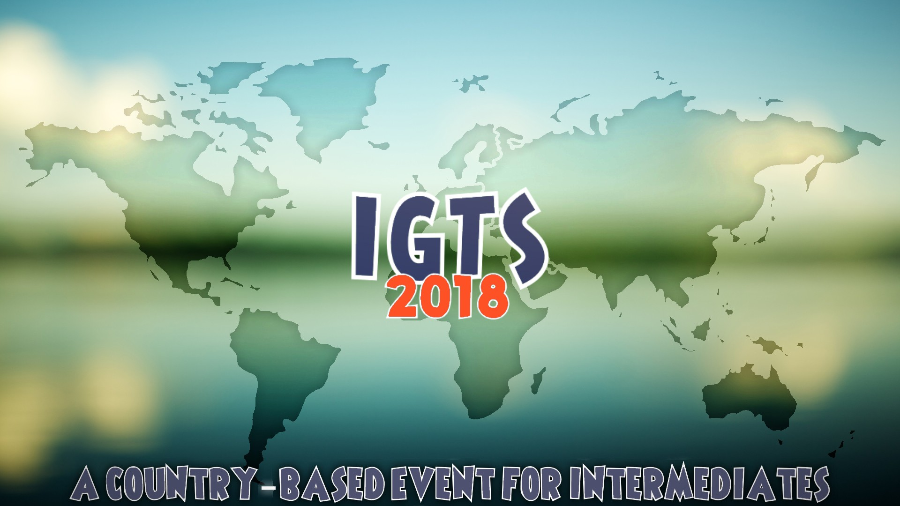

---
tags:
  - IGTS 2018
  - IGTS
  - GTS
---

# Intermediate Global Taiko Showdown 2018

The **Intermediate Global Taiko Showdown 2018** (***IGTS 2018***) was a country-based double-elimination 2v2 osu!taiko tournament hosted by ::{ flag=CA }:: [FlamingRok](https://osu.ppy.sh/users/2015353) and ::{ flag=FR }:: [Kasumii-sama](https://osu.ppy.sh/users/6177263). It was the first instalment of the Intermediate Global Taiko Showdown and part of the Global Taiko Showdown series.

## Tournament schedule

| Event | Timestamp |
| --: | :-- |
| Registration phase | 2018-06-30/2018-07-29 |
| Live drawings | 2018-07-29 (13:00 UTC) |
| Group stage | 2018-08-04/2018-08-12 |
| Round 1 (Lower Bracket) | 2018-08-18/2018-08-19 |
| Quarterfinals | 2018-08-25/2018-08-26 |
| Semifinals | 2018-09-01/2018-09-02 |
| Finals | 2018-09-08/2018-09-09 |
| Grand Finals | 2018-09-15/2018-09-16 |

## Prizes

| Placing | Prize(s) |
| :-: | :-- |
|  | 3 months of osu!supporter, userpage banner |
|  | 1 month of osu!supporter |
|  | 1 month of osu!supporter |

## Organisation

The Intermediate Global Taiko Showdown 2018 was run by various osu!taiko community members.

| Position | Member(s) |
| :-- | :-- |
| Organizer | ::{ flag=CA }:: [FlamingRok](https://osu.ppy.sh/users/2015353), ::{ flag=FR }:: [Kasumii-sama](https://osu.ppy.sh/users/6177263) |
| Mappool selector | ::{ flag=PT }:: [babysnakes](https://osu.ppy.sh/users/4669728), ::{ flag=CA }:: [FlamingRok](https://osu.ppy.sh/users/2015353), ::{ flag=ID }:: [Poii](https://osu.ppy.sh/users/7924938) |
| Referee | ::{ flag=JP }:: [Briesmas](https://osu.ppy.sh/users/2865172), ::{ flag=AU }:: [cactusthegreat](https://osu.ppy.sh/users/5592409), ::{ flag=US }:: [ITotallyGetThat](https://osu.ppy.sh/users/8770622), ::{ flag=FR }:: [Kasumii-sama](https://osu.ppy.sh/users/6177263), ::{ flag=RU }:: [-\_-Nico-\_-](https://osu.ppy.sh/users/9689534), ::{ flag=JP }:: [Noko_BSF](https://osu.ppy.sh/users/3811831), ::{ flag=TR }:: [oralekin](https://osu.ppy.sh/users/7631823), ::{ flag=FR }:: [TLQ\_Yoshii](https://osu.ppy.sh/users/7157133) |
| Streamer | ::{ flag=MY }:: [Bedwyr Aorta](https://osu.ppy.sh/users/10875855), ::{ flag=DE }:: [Heamburger](https://osu.ppy.sh/users/4705120), ::{ flag=US }:: [ITotallyGetThat](https://osu.ppy.sh/users/8770622), ::{ flag=US }:: [Swovine](https://osu.ppy.sh/users/6666316) |
| Commentator | ::{ flag=MY }:: [Bedwyr Aorta](https://osu.ppy.sh/users/10875855), ::{ flag=AR }:: [BossPlays\_02](https://osu.ppy.sh/users/7341471), ::{ flag=US }:: [CaptainEChan](https://osu.ppy.sh/users/9536977), ::{ flag=US }:: [Edgar\_Figaro](https://osu.ppy.sh/users/6508754), ::{ flag=EC }:: [Gamelan4](https://osu.ppy.sh/users/9856910), ::{ flag=DE }:: [Heamburger](https://osu.ppy.sh/users/4705120) |
| Designer | ::{ flag=US }:: [Swovine](https://osu.ppy.sh/users/6666316) |
| Statistician | ::{ flag=FR }:: [Kasumii-sama](https://osu.ppy.sh/users/6177263), ::{ flag=FR }:: [TLQ\_Yoshii](https://osu.ppy.sh/users/7157133) |
| Wiki editor | ::{ flag=ID }:: [fajar13k](https://osu.ppy.sh/users/7100002) |

## Links

- [Discussion thread](https://osu.ppy.sh/community/forums/topics/767841)
- [GTS Discord server](https://discord.gg/3mGC3HB)
- [GTS website](https://gtsosu.com)
- [Livestream](https://www.twitch.tv/igtsosu)
- **[Statistics sheet](https://docs.google.com/spreadsheets/d/e/2PACX-1vQ4vir4NFHj_ddiWiO14Tywkd8ZJNF5Zo_CmUb1vKcSOi5ReVFz23InJNg4rEfCtXYmKUq4Byf29SQd/pubhtml)**

## Participants

|  | Country | Members |
| :-: | :-: | :-- |
| ::{ flag=AR }:: | **Argentina** | **[un-plugged](https://osu.ppy.sh/users/8959673)**, [Kliu](https://osu.ppy.sh/users/7409391) |
| ::{ flag=AU }:: | **Australia** | **[mhyykl](https://osu.ppy.sh/users/7012650)**, [Zuikaku](https://osu.ppy.sh/users/4180857), [AmateurMonkeyYT](https://osu.ppy.sh/users/8379046), [Spearmint](https://osu.ppy.sh/users/5199710) |
| ::{ flag=BR }:: | **Brazil** | **[AnonX32](https://osu.ppy.sh/users/2730270)**, [Korkk](https://osu.ppy.sh/users/11227442), [Idealism](https://osu.ppy.sh/users/3869519), [Lolligerjoj](https://osu.ppy.sh/users/9053338) |
| ::{ flag=CA }:: | **Canada** | **[Road](https://osu.ppy.sh/users/8984404)**, [jeantommy5](https://osu.ppy.sh/users/3524805), [RoadRolla](https://osu.ppy.sh/users/9119271), [Leadenginer](https://osu.ppy.sh/users/3799991), [ZznightraiderzZ](https://osu.ppy.sh/users/8986265) |
| ::{ flag=CL }:: | **Chile** | **[ArmoredReaper](https://osu.ppy.sh/users/6276709)**, [\[Burno-\]](https://osu.ppy.sh/users/4397758), [Tomatitooo](https://osu.ppy.sh/users/6446118) |
| ::{ flag=CO }:: | **Colombia** | **[Juanisimo](https://osu.ppy.sh/users/9050875)**, [FuryOfTheStorm](https://osu.ppy.sh/users/1037898) |
| ::{ flag=CR }:: | **Costa Rica** | **[Titovare](https://osu.ppy.sh/users/7375505)**, [Alejo Q6](https://osu.ppy.sh/users/2116841) |
| ::{ flag=EC }:: | **Ecuador** | **[Gamelan4](https://osu.ppy.sh/users/9856910)**, [Electro2001](https://osu.ppy.sh/users/7826258), [Etsu](https://osu.ppy.sh/users/3442319), [Gato2499](https://osu.ppy.sh/users/7857559) |
| ::{ flag=FR }:: | **France** | **[Yales](https://osu.ppy.sh/users/2377881)**, [Adri](https://osu.ppy.sh/users/4579132), [ZeddaStake](https://osu.ppy.sh/users/8801844) |
| ::{ flag=DE }:: | **Germany** | **[Heamburger](https://osu.ppy.sh/users/4705120)**, [Capu](https://osu.ppy.sh/users/2474015), [Siegmund99](https://osu.ppy.sh/users/5168596), [Joogl](https://osu.ppy.sh/users/8844167), [QEpicAce](https://osu.ppy.sh/users/9489153) |
| ::{ flag=HK }:: | **Hong Kong** | **[Nabita](https://osu.ppy.sh/users/7468492)**, [kiki63520133](https://osu.ppy.sh/users/4984496), [\[\_isolated\_\]](https://osu.ppy.sh/users/6187838), [Best\_lolicon](https://osu.ppy.sh/users/2397818) |
| ::{ flag=ID }:: | **Indonesia** | **[Reed\_405](https://osu.ppy.sh/users/9965069)**, [Milliana](https://osu.ppy.sh/users/2304771), [Viewland](https://osu.ppy.sh/users/6250135), [Maneh](https://osu.ppy.sh/users/5179995), [Andhra\_](https://osu.ppy.sh/users/6176811) |
| ::{ flag=JP }:: | **Japan** | **[kusoteitoku\_aki](https://osu.ppy.sh/users/12399222)**, [croce\_latte](https://osu.ppy.sh/users/10948259), [Neon\_alfa](https://osu.ppy.sh/users/11612183) |
| ::{ flag=MY }:: | **Malaysia** | **[Bedwyr Aorta](https://osu.ppy.sh/users/10875855)**, [Minisora](https://osu.ppy.sh/users/9627666), [Heliscout](https://osu.ppy.sh/users/7538181) |
| ::{ flag=NL }:: | **Netherlands** | **[-omicron](https://osu.ppy.sh/users/11043157)**, [SpectreSan](https://osu.ppy.sh/users/11310442), [ASRaphie80](https://osu.ppy.sh/users/3773624), [Krekker](https://osu.ppy.sh/users/8265940), [Jinkela](https://osu.ppy.sh/users/5347374) |
| ::{ flag=PT }:: | **Portugal** | **[MeovvCAT](https://osu.ppy.sh/users/5905091)**, [Katsunaru](https://osu.ppy.sh/users/7103006), [BlackPet](https://osu.ppy.sh/users/3795067), [N1tro321](https://osu.ppy.sh/users/7385703) |
| ::{ flag=RU }:: | **Russian Federation** | **[izede](https://osu.ppy.sh/users/7559481)**, [JFred](https://osu.ppy.sh/users/9700317), [-Rmdy](https://osu.ppy.sh/users/1933816), [-dragon67](https://osu.ppy.sh/users/4328734), [oserry](https://osu.ppy.sh/users/11973082) |
| ::{ flag=SG }:: | **Singapore** | **[Kekneko](https://osu.ppy.sh/users/8414979)**, [uchuuj1n](https://osu.ppy.sh/users/9140302), [GDN3k0Chan](https://osu.ppy.sh/users/7394522) |
| ::{ flag=US }:: | **United States** | **[Swovine](https://osu.ppy.sh/users/6666316)**, [Rukairi](https://osu.ppy.sh/users/6642597), [Trilt](https://osu.ppy.sh/users/9292128), [CaptainEChan](https://osu.ppy.sh/users/9536977), [rg\_seo](https://osu.ppy.sh/users/8150728) |
| ::{ flag=VE }:: | **Venezuela** | **[Acetylcholine](https://osu.ppy.sh/users/4159873)**, [Syber\_Fox](https://osu.ppy.sh/users/6028905) |

## Groups

| Group | Top seed | High seed | Mid seed | Low seed | Unseeded |
| :-: | :-- | :-- | :-- | :-- | :-- |
| **A** | ::{ flag=US }:: United States | ::{ flag=JP }:: Japan | ::{ flag=AR }:: Argentina | ::{ flag=AU }:: Australia | ::{ flag=FR }:: France |
| **B** | ::{ flag=EC }:: Ecuador | ::{ flag=HK }:: Hong Kong | ::{ flag=CA }:: Canada | ::{ flag=DE }:: Germany | ::{ flag=VE }:: Venezuela |
| **C** | ::{ flag=PT }:: Portugal | ::{ flag=SG }:: Singapore | ::{ flag=RU }:: Russian Federation | ::{ flag=ID }:: Indonesia | ::{ flag=CO }:: Colombia |
| **D** | ::{ flag=MY }:: Malaysia | ::{ flag=NL }:: Netherlands | ::{ flag=BR }:: Brazil | ::{ flag=CL }:: Chile | ::{ flag=CR }:: Costa Rica |

## Podium

This competition has come to an end and resulted in the following podium:

| Placing | Country |
| :-- | :-- |
|  | ::{ flag=MY }:: Malaysia |
|  | ::{ flag=NL }:: Netherlands |
|  | ::{ flag=US }:: United States |

## Mappools

### Grand Finals

**[Download the mappack here! (107 MB)](https://mega.nz/#!Y8M2la6K!CHWMUKhMNOD4Cr3OKioBD6n1MiGRJIORYhqRJg9Hu-o)**

- NoMod
  1. [LOLI RIPE - All I wanna do is touch your power points (BabySnakes) \[PoisOni\]](https://osu.ppy.sh/beatmapsets/846727#taiko/1770837)
  2. [cillia - Fairytale, (mintong89) \[Taiko\]](https://osu.ppy.sh/beatmapsets/275331#taiko/624447)
  3. [Mediks - Mediks (Arrival) \[Arrival's Oni\]](https://osu.ppy.sh/beatmapsets/527082#taiko/1222234)
  4. [Kano - Houkago Stride (Short Ver.) (Lundlerol) \[Oni\]](https://osu.ppy.sh/beatmapsets/80983#taiko/225075)
  5. [SON OF KICK - Hours ft. Lady Leshurr & Paigey Cakey (Nwolf) \[Nwolf's Oni\]](https://osu.ppy.sh/beatmapsets/274111#taiko/667471)
- Hidden
  1. [t+pazolite - OMAKENO Stroke (JUDYDANNY) \[Oni\]](https://osu.ppy.sh/beatmapsets/371857#taiko/814566)
  2. [Rohi - Kodoku Egoism (hs714) \[714's Taiko Oni\]](https://osu.ppy.sh/beatmapsets/58737#taiko/196672)
  3. [Ci Mei Gui - Wu Xuan Lan (Nardoxyribonucleic) \[Inner Oni\]](https://osu.ppy.sh/beatmapsets/339558#taiko/751680)
- HardRock
  1. [3R2 - Brawl Breaks (Doyak) \[Inner Oni\]](https://osu.ppy.sh/beatmapsets/466564#taiko/998462)
  2. [toby fox - Amalgam (MMzz) \[Oni\]](https://osu.ppy.sh/beatmapsets/373264#taiko/817717)
  3. [USAO - BroGamer (Arrival) \[Oni\]](https://osu.ppy.sh/beatmapsets/635636#taiko/1355301)
- DoubleTime
  1. [Haruna Luna - Sora wa Takaku Kaze wa Utau (TV Size) (kazenotama) \[Tama's Taiko Oni\]](https://osu.ppy.sh/beatmapsets/48468#taiko/150757)
  2. [Nakamura Meiko - DIVINE FORTUNE (lolcubes) \[Muzukashii\]](https://osu.ppy.sh/beatmapsets/97132#taiko/260912)
  3. [Dan Winter - Don't Stop Push It Now (Nightcore Mix) (Gero, Hanjamon) \[Geromon's Muzukashii\]](https://osu.ppy.sh/beatmapsets/200374#taiko/478404)
- FreeMod
  1. [IA - Kisaragi Attention (spboxer3, kayesara) \[Sp3 & KS's Taiko Oni\]](https://osu.ppy.sh/beatmapsets/52830#taiko/167007)
  2. [onoken - ZADAMGA (agu) \[Oni\]](https://osu.ppy.sh/beatmapsets/458476#taiko/991780)
  3. [Mary - Artificial Rose (TKS) \[TK's Oni\]](https://osu.ppy.sh/beatmapsets/99434#taiko/281675)
- Tiebreaker
  1. **[DM DOKURO - g a r d e n (Vulkin) \[Vulkin's Kill Or Be Killed\]](https://osu.ppy.sh/beatmapsets/419120#taiko/944468)**

### Finals

**[Download the mappack here! (70 MB)](https://mega.nz/#!94dm3IIB!kdoUv1uMV09D0Jv15QiKsK4PSwbuaWCp09T2hLi6Mkg)**

- NoMod
  1. [Tomatsu Haruka, Hikasa Yoko, Amamiya Sora - Eyecatch! Too Much! (Volta) \[Oni\]](https://osu.ppy.sh/beatmapsets/554873#taiko/1187765)
  2. [t+pazolite - Knotfunk (eiri-, Nifty) \[Ayyfty's Oni\]](https://osu.ppy.sh/beatmapsets/716533#taiko/1514125)
  3. [Hanatan - Airman ga Taosenai (SOUND HOLIC Ver.) (aabc271) \[aabc's Taiko Oni\]](https://osu.ppy.sh/beatmapsets/134151#taiko/365129)
  4. [Cranky - R176 (Alace) \[Pangko\]](https://osu.ppy.sh/beatmapsets/31367#taiko/121335)
  5. [D.J.Amuro - ZZ (Nofool) \[Inner Oni\]](https://osu.ppy.sh/beatmapsets/357767#taiko/786903)
- Hidden
  1. [suzumu feat.soraru - Zetsubousei: Hero Chiryouyaku The Animation (Stefan) \[Oni\]](https://osu.ppy.sh/beatmapsets/416567#taiko/902308)
  2. [SOUND HOLIC Feat. Nana Takahashi - XINOBIKILL (HiroK) \[Oni\]](https://osu.ppy.sh/beatmapsets/744214#taiko/1569199)
- HardRock
  1. [AAAA Chazuke - Hop Step Adventure\* (TKS) \[Oni\]](https://osu.ppy.sh/beatmapsets/466471#taiko/1003336)
  2. [Jin feat. MARiA from GARNiDELiA - daze (short ver.) (Betsuto) \[Betsu's Taiko Oni\]](https://osu.ppy.sh/beatmapsets/165391#taiko/409134)
- DoubleTime
  1. [Ryu\* feat.Mayumi Morinaga - Din Don Dan (\[R\]) \[Oni\]](https://osu.ppy.sh/beatmapsets/397834#taiko/870741)
  2. [Nekomata Master - Deadman Falling (Azer) \[Muzukashii\]](https://osu.ppy.sh/beatmapsets/619878#taiko/1523533)
- FreeMod
  1. [Killerblood - Run Lads Run (Nwolf) \[Oni\]](https://osu.ppy.sh/beatmapsets/571334#taiko/1227621)
  2. [you - SUSHI Tabetai(Hardcore EDIT) (KitajimaYN) \[Yuni's TABETAI\]](https://osu.ppy.sh/beatmapsets/386633#taiko/844155)
  3. [nano.RIPE - Real World (mintong89) \[Oni\]](https://osu.ppy.sh/beatmapsets/419788#taiko/908415)
- Tiebreaker
  1. **[Sakamoto Maaya - Okaerinasai (tomatomerde Remix) (hikiko-) \[Memories\]](https://osu.ppy.sh/beatmapsets/544468#taiko/1153788)**

### Semifinals

**[Download the mappack here! (63 MB)](https://mega.nz/#!xt0gHSrT!Ea2AYNt6Zg6DNoYyiNSNmrCkALw34AZIcS2v_ol02Is)**

- NoMod
  1. [Culprate - Yellow (A Second Glimpse) (Ulqui) \[Oni\]](https://osu.ppy.sh/beatmapsets/589814#taiko/1500895)
  2. [Ryu\* - !Viva! (-Kazu-) \[Kazu's Oni\]](https://osu.ppy.sh/beatmapsets/526265#taiko/1130126)
  3. [C-Show - On the FM (Nofool) \[Oni\]](https://osu.ppy.sh/beatmapsets/568544#taiko/1205385)
  4. [Himeringo - Idola no Circus (hikikochan) \[Dance\]](https://osu.ppy.sh/beatmapsets/728008#taiko/1537074)
- Hidden
  1. [Memme - Acid Burst (MMzz) \[Oni\]](https://osu.ppy.sh/beatmapsets/215546#taiko/506333)
  2. [Akhuta - Ludus In Tenebris (Nyan) \[Muzukashii\]](https://osu.ppy.sh/beatmapsets/443065#taiko/964451)
- HardRock
  1. [Nekomata Master - Avalon Hill (LunaticP) \[Oni\]](https://osu.ppy.sh/beatmapsets/261935#taiko/597875)
  2. [xi - ANiMA (tasuke912) \[Oni\]](https://osu.ppy.sh/beatmapsets/326029#taiko/725277)
- DoubleTime
  1. [David Bergeaud - Joraal Nebula - Leviathan (Gezoda) \[Oni\]](https://osu.ppy.sh/beatmapsets/71072#taiko/268461)
  2. [siromaru + crankyHorie Yui - conflict (TKSalt) \[TK's Muzukashii\]](https://osu.ppy.sh/beatmapsets/103123#taiko/278005)
- FreeMod
  1. [ryo (supercell) - ODDS&ENDS (Short Ver.) (Ellyu) \[Cherry's Inner Taiko\]](https://osu.ppy.sh/beatmapsets/59981#taiko/179927)
  2. [KNOWER - Things About You (Nifty) \[Oni\]](https://osu.ppy.sh/beatmapsets/666935#taiko/1411347)
- Tiebreaker
  1. **[Mohican Sandbag - U.N. Owen is dead (OnosakiHito) \[Oni\]](https://osu.ppy.sh/beatmapsets/177908#taiko/428071)**

### Quarterfinals

**[Download the mappack here! (71 MB)](https://mega.nz/#!ktMHUaaK!2maoXyV1gqC6CyIABct9dwU-RFQk6N5Aa-TdPk0LCaQ)**

- NoMod
  1. [Cranky - Into the Unknown (Nofool) \[Oni\]](https://osu.ppy.sh/beatmapsets/738600#taiko/1558765)
  2. [OISHII - PIZZA PLAZA (Volta) \[Oni\]](https://osu.ppy.sh/beatmapsets/663500#taiko/1404697)
  3. [KNOWER - Time Traveler (Nifty) \[Oni\]](https://osu.ppy.sh/beatmapsets/622136#taiko/1362733)
  4. [LeaF - Kyouki Ranbu (DakeDekaane) \[Oni\]](https://osu.ppy.sh/beatmapsets/394552#taiko/858745)
- Hidden
  1. [Electric Six - Gay Bar (Deif) \[Oni\]](https://osu.ppy.sh/beatmapsets/129402#taiko/362948)
  2. [Junichi Masuda - Battle! (Legendary Pokemon) (Sala-fan) \[Sala-fan's Oni\]](https://osu.ppy.sh/beatmapsets/219713#taiko/525670)
- HardRock
  1. [t+pazolite - intrO - Don't be Foolish (incandescene) \[Oni\]](https://osu.ppy.sh/beatmapsets/733624#taiko/1548238)
  2. [DJ YOSHITAKA - FLOWER (Lost The Lights) \[Oni\]](https://osu.ppy.sh/beatmapsets/339001#taiko/750226)
- DoubleTime
  1. [Mikako Komatsu - Owaranai Melody o Utai Dashimashita. (qoot8123) \[qoot8123's Oni\]](https://osu.ppy.sh/beatmapsets/121689#taiko/313568)
  2. [Horie Yui - chocolate insomnia (TV Size) (NoHitter) \[Taiko Muzukashii\]](https://osu.ppy.sh/beatmapsets/104541#taiko/274833)
- FreeMod
  1. [Illion - AIWAGUMA (Ellyu) \[Oni\]](https://osu.ppy.sh/beatmapsets/533037#taiko/1247899)
  2. [MYTH & ROID - VORACITY (TV Size) (Nofool) \[Oni\]](https://osu.ppy.sh/beatmapsets/818008#taiko/1715246)
- Tiebreaker
  1. **[Chitose Haru & Kumagai Eri - Perfect Free (Nwolf) \[Oni\]](https://osu.ppy.sh/beatmapsets/549700#taiko/1164010)**

### Round 1 (Lower Bracket)

**[Download the mappack here! (56 MB)](https://mega.nz/#!CvhRhKZL!k3My3SDxVJiAmD8xZs27_nwmVsisrMY4O5NaqA1dW6w)**

- NoMod
  1. [Nekomata Master - Silence (Tasha) \[Oni\]](https://osu.ppy.sh/beatmapsets/127126#taiko/342676)
  2. [M2U - Masquerade (- Kagami Yuki -) \[Oni\]](https://osu.ppy.sh/beatmapsets/132040#taiko/332273)
  3. [Hommarju - Crazy Jackpot (aabc271) \[aabc's Oni\]](https://osu.ppy.sh/beatmapsets/717853#taiko/1517306)
  4. [Comp - Gensou no Satellite (Nwolf) \[Oni\]](https://osu.ppy.sh/beatmapsets/122757#taiko/313793)
- Hidden
  1. [Shoujo - Reminiscing (Jaye) \[Muzukashii\]](https://osu.ppy.sh/beatmapsets/682206#taiko/1442600)
  2. [Qrispy Joybox - Snow Prism (TKSalt) \[Oni\]](https://osu.ppy.sh/beatmapsets/72392#taiko/224326)
- HardRock
  1. [Hakobe Naru(CV:M.A.O) - Nekomatsuri (komasy) \[Oni\]](https://osu.ppy.sh/beatmapsets/659442#taiko/1418602)
  2. [Doma Umaru (CV. Tanaka Aimi) - Nimensei\*Uraomote Life! (Tyistiana) \[Oni\]](https://osu.ppy.sh/beatmapsets/707590#taiko/1502287)
- DoubleTime
  1. [Mili - world.execute(me); (Volta) \[volta.taiko(muzukashii);\]](https://osu.ppy.sh/beatmapsets/507196#taiko/1078865)
  2. [7!! - Hey! Calorie Queen (Etsu) \[Muzukashii\]](https://osu.ppy.sh/beatmapsets/459442#taiko/984288)
- FreeMod
  1. [HoneyWorks feat. Gero - Jakusha no Sengen (Poii) \[Poii's Oni\]](https://osu.ppy.sh/beatmapsets/643153#taiko/1450439)
  2. [M2U - Quo Vadis (TKSalt) \[Oni\]](https://osu.ppy.sh/beatmapsets/135324#taiko/339132)
- Tiebreaker
  1. **[Lovelicot - Indoa\*Ranburu (Kqrth) \[Rumble\]](https://osu.ppy.sh/beatmapsets/627513#taiko/1322323)**

### Group stage

**[Download the mappack here! (67 MB)](https://mega.nz/#!mzgBHYxJ!C7T6SS-wWBI85Ez0-iKGB62466pcE8iV_yJHKDAB8qQ)**

- NoMod
  1. [Fire EX. - Shattered Dreams (Nardoxyribonucleic) \[Nardo's Muzukashii\]](https://osu.ppy.sh/beatmapsets/287251#taiko/660343)
  2. [DJ Mendez - Tequila (lepidopodus) \[lepidon! - Taiko Oni\]](https://osu.ppy.sh/beatmapsets/23492#taiko/80658)
  3. [ARM (IOSYS) feat. Nicole Curry - Come to Life (Nofool) \[Muzukashii\]](https://osu.ppy.sh/beatmapsets/642762#taiko/1363511)
  4. [Camellia feat. Nana Takahashi - Mushi no Sumu Tokoro (Nwolf) \[Nwolf's Muzukashii\]](https://osu.ppy.sh/beatmapsets/436978#taiko/978373)
- Hidden
  1. [Chito (CV: Minase Inori), Yuuri (CV: Kubo Yurika) - More One Night (Assertive Hardcore Bootleg) [short ver.] (eiri-) \[Ayyri's Muzukashii\]](https://osu.ppy.sh/beatmapsets/741790#taiko/1567654)
  2. [P*Light - Gekkou Ranbu (Steins) \[Stein's Muzukashii\]](https://osu.ppy.sh/beatmapsets/406934#taiko/886669)
- HardRock
  1. [YUC'e - intro-duck-tion!! (\_yu68) \[\_yu68's muzu-kashi!!s\]](https://osu.ppy.sh/beatmapsets/700150#taiko/1528753)
  2. [Ryu\* feat. moimoi - OOO (\[R\]) \[Oni\]](https://osu.ppy.sh/beatmapsets/764462#taiko/1607509)
- DoubleTime
  1. [toby fox - Heartache (Lost The Lights) \[LTL's Muzukashii\]](https://osu.ppy.sh/beatmapsets/410256#taiko/890367)
  2. [7!! - Bye Bye (TV Size) (mingmichael) \[Muzukashii\]](https://osu.ppy.sh/beatmapsets/91594#taiko/247965)
- FreeMod
  1. [Kola Kid - Spaceman (Kokatsu) \[Muzukashii\]](https://osu.ppy.sh/beatmapsets/67703#taiko/196486)
  2. [Pinocchio-P - Mushroom Mother (MMzz) \[Muzukashii\]](https://osu.ppy.sh/beatmapsets/88802#taiko/241860)
- Tiebreaker
  1. **[Xandria - Call Of Destiny (Nardoxyribonucleic) \[Muzukashii\]](https://osu.ppy.sh/beatmapsets/635559#taiko/1408975)**

## Match results

### Grand Finals

Saturday, 15 September 2018:

| Team 1 |  |  | Team 2 | Match link |
| --: | :-: | :-: | :-- | :-- |
| **Malaysia** ::{ flag=MY }:: | **7** | 2 | ::{ flag=US }:: United States | [#1](https://osu.ppy.sh/community/matches/45981007) |

Sunday, 16 September 2018:

| Team 1 |  |  | Team 2 | Match link |
| --: | :-: | :-: | :-- | :-- |
| Netherlands ::{ flag=NL }:: | 0 | **7** | ::{ flag=MY }:: **Malaysia** | [#1](https://osu.ppy.sh/community/matches/46004124) |
| **Malaysia** ::{ flag=MY }:: | **7** | 0 | ::{ flag=NL }:: Netherlands | [#1](https://osu.ppy.sh/community/matches/46005358) |

### Finals

Saturday, 8 September 2018:

| Team 1 |  |  | Team 2 | Match link |
| --: | :-: | :-: | :-- | :-- |
| Malaysia ::{ flag=MY }:: | 1 | **6** | ::{ flag=NL }:: **Netherlands** | [#1](https://osu.ppy.sh/community/matches/45826179) |
| **United States** ::{ flag=US }:: | **6** | 3 | ::{ flag=DE }:: Germany | [#1](https://osu.ppy.sh/community/matches/45811926) |

### Semifinals

Saturday, 1 September 2018:

| Team 1 |  |  | Team 2 | Match link |
| --: | :-: | :-: | :-- | :-- |
| Japan ::{ flag=JP }:: | 2 | **5** | ::{ flag=MY }:: **Malaysia** | [#1](https://osu.ppy.sh/community/matches/45601494) |

Sunday, 2 September 2018:

| Team 1 |  |  | Team 2 | Match link |
| --: | :-: | :-: | :-- | :-- |
| Germany ::{ flag=DE }:: | 4 | **5** | ::{ flag=NL }:: **Netherlands** | [#1](https://osu.ppy.sh/community/matches/45616018) |
| Canada ::{ flag=CA }:: | 3 | **5** | ::{ flag=EC }:: **Ecuador** | [#1](https://osu.ppy.sh/community/matches/45626417) |
| Japan ::{ flag=JP }:: | 3 | **5** | ::{ flag=US }:: **United States** | [#1](https://osu.ppy.sh/community/matches/45614036) |
| **Germany** ::{ flag=DE }:: | **5** | 0 | ::{ flag=EC }:: Ecuador | [#1](https://osu.ppy.sh/community/matches/45651719) |
| **United States** ::{ flag=US }:: | **5** | 2 | ::{ flag=BR }:: Brazil | [#1](https://osu.ppy.sh/community/matches/45655615) |

### Quarterfinals

Friday, 24 August 2018:

| Team 1 |  |  | Team 2 | Match link |
| --: | :-: | :-: | :-- | :-- |
| **Netherlands** ::{ flag=NL }:: | **5** | 0 | ::{ flag=SG }:: Singapore | [#1](https://osu.ppy.sh/community/matches/45369844) |

Saturday, 25 August 2018:

| Team 1 |  |  | Team 2 | Match link |
| --: | :-: | :-: | :-- | :-- |
| **Japan** ::{ flag=JP }:: | **5** | 2 | ::{ flag=EC }:: Ecuador | [#1](https://osu.ppy.sh/community/matches/45385434) |
| Russian Federation ::{ flag=RU }:: | 2 | **5** | ::{ flag=MY }:: **Malaysia** | [#1](https://osu.ppy.sh/community/matches/45392371) |
| **Germany** ::{ flag=DE }:: | **5** | 0 | ::{ flag=FR }:: France | [#1](https://osu.ppy.sh/community/matches/45397375) |
| Singapore ::{ flag=SG }:: | 1 | **5** | ::{ flag=US }:: **United States** | [#1](https://osu.ppy.sh/community/matches/45402951) |

Sunday, 26 August 2018:

| Team 1 |  |  | Team 2 | Match link |
| --: | :-: | :-: | :-- | :-- |
| France ::{ flag=FR }:: | 2 | **5** | ::{ flag=BR }:: **Brazil** | [#1](https://osu.ppy.sh/community/matches/45434990) |
| Russian Federation ::{ flag=RU }:: | 1 | **5** | ::{ flag=CA }:: **Canada** | [#1](https://osu.ppy.sh/community/matches/45431679) |
| Ecuador ::{ flag=EC }:: | **5** | 0 | ::{ flag=PT }:: Portugal | *win by default* |

### Round 1 (Lower Bracket)

Saturday, 18 August 2018:

| Team 1 |  |  | Team 2 | Match link |
| --: | :-: | :-: | :-- | :-- |
| **United States** ::{ flag=US }:: | **5** | 0 | ::{ flag=HK }:: Hong Kong | *win by default* |
| Indonesia ::{ flag=ID }:: | 2 | **5** | ::{ flag=BR }:: **Brazil** | [#1](https://osu.ppy.sh/community/matches/45187249) |
| **Canada** ::{ flag=CA }:: | **5** | 1 | ::{ flag=AU }:: Australia | [#1](https://osu.ppy.sh/community/matches/45173889) |
| Chile ::{ flag=CL }:: | 0 | **5** | ::{ flag=PT }:: **Portugal** | *win by default* |

### Group stage

Saturday, 4 August 2018:

| Group | Team 1 |  |  | Team 2 | Match link |
| :-: | --: | :-: | :-: | :-- | :-- |
| C | Portugal ::{ flag=PT }:: | 2 | **4** | ::{ flag=SG }:: **Singapore** | [#1](https://osu.ppy.sh/community/matches/44759949) |
| C | **Russian Federation** ::{ flag=RU }:: | **4** | 1 | ::{ flag=ID }:: Indonesia | [#1](https://osu.ppy.sh/community/matches/44760724) |
| A | **Japan** ::{ flag=JP }:: | **4** | 0 | ::{ flag=AU }:: Australia | [#1](https://osu.ppy.sh/community/matches/44761958) |
| A | **Japan** ::{ flag=JP }:: | **4** | 1 | ::{ flag=FR }:: France | [#1](https://osu.ppy.sh/community/matches/44763071) |
| B | **Hong Kong** ::{ flag=HK }:: | **4** | 2 | ::{ flag=CA }:: Canada | [#1](https://osu.ppy.sh/community/matches/44766118) |
| A | **United States** ::{ flag=US }:: | **4** | 1 | ::{ flag=AR }:: Argentina | [#1](https://osu.ppy.sh/community/matches/44768946) |
| B | **Germany** ::{ flag=DE }:: | **4** | 0 | ::{ flag=VE }:: Venezuela | *win by default* |

Sunday, 5 August 2018:

| Group | Team 1 |  |  | Team 2 | Match link |
| :-: | --: | :-: | :-: | :-- | :-- |
| B | **Ecuador** ::{ flag=EC }:: | **4** | 0 | ::{ flag=HK }:: Hong Kong | *win by default* |
| A | Argentina ::{ flag=AR }:: | 1 | **4** | ::{ flag=AU }:: **Australia** | [#1](https://osu.ppy.sh/community/matches/44784450) |
| C | **Singapore** ::{ flag=SG }:: | **4** | 2 | ::{ flag=ID }:: Indonesia | [#1](https://osu.ppy.sh/community/matches/44787664) |
| A | Australia ::{ flag=AU }:: | 2 | **4** | ::{ flag=FR }:: **France** | [#1](https://osu.ppy.sh/community/matches/44791292) |
| D | **Malaysia** ::{ flag=MY }:: | **4** | 1 | ::{ flag=CL }:: Chile | [#1](https://osu.ppy.sh/community/matches/44793389) |
| D | Malaysia ::{ flag=MY }:: | 2 | **4** | ::{ flag=BR }:: **Brazil** | [#1](https://osu.ppy.sh/community/matches/44794671) |
| C | **Russian Federation** ::{ flag=RU }:: | **4** | 0 | ::{ flag=CO }:: Colombia | *win by default* |
| D | **Netherlands** ::{ flag=NL }:: | **4** | 1 | ::{ flag=BR }:: Brazil | [#1](https://osu.ppy.sh/community/matches/44796185) |
| D | **Netherlands** ::{ flag=NL }:: | **4** | 0 | ::{ flag=CR }:: Costa Rica | *win by default* |
| D | **Portugal** ::{ flag=PT }:: | **4** | 0 | ::{ flag=CO }:: Colombia | *win by default* |
| C | Canada ::{ flag=CA }:: | 2 | **4** | ::{ flag=DE }:: **Germany** | [#1](https://osu.ppy.sh/community/matches/44801932) |
| B | **Chile** ::{ flag=CL }:: | **4** | 0 | ::{ flag=CR }:: Costa Rica | *win by default* |
| B | Ecuador ::{ flag=EC }:: | 0 | **4** | ::{ flag=DE }:: **Germany** | [#1](https://osu.ppy.sh/community/matches/44803677) |

Saturday, 11 August 2018:

| Group | Team 1 |  |  | Team 2 | Match link |
| :-: | --: | :-: | :-: | :-- | :-- |
| A | United States ::{ flag=US }:: | 0 | **4** | ::{ flag=JP }:: **Japan** | [#1](https://osu.ppy.sh/community/matches/44956962) |
| A | **United States** ::{ flag=US }:: | **4** | 3 | ::{ flag=AU }:: Australia | [#1](https://osu.ppy.sh/community/matches/44957651) |
| C | **Indonesia** ::{ flag=ID }:: | **4** | 0 | ::{ flag=CO }:: Colombia | [#1](https://osu.ppy.sh/community/matches/44959016) |
| C | Portugal ::{ flag=PT }:: | 0 | **4** | ::{ flag=ID }:: **Indonesia** | [#1](https://osu.ppy.sh/community/matches/44967756) |
| C | Singapore ::{ flag=SG }:: | 2 | **4** | ::{ flag=RU }:: **Russian Federation** | [#1](https://osu.ppy.sh/community/matches/44969679) |
| A | **Japan** ::{ flag=JP }:: | **4** | 0 | ::{ flag=AR }:: Argentina | *win by default* |
| A | United States ::{ flag=US }:: | 2 | **4** | ::{ flag=FR }:: **France** | [#1](https://osu.ppy.sh/community/matches/44978315) |
| B | **Ecuador** ::{ flag=EC }:: | **4** | 0 | ::{ flag=VE }:: Venezuela | *win by default* |

Sunday, 12 August 2018:

| Group | Team 1 |  |  | Team 2 | Match link |
| :-: | --: | :-: | :-: | :-- | :-- |
| B | Hong Kong ::{ flag=HK }:: | 0 | 0 | ::{ flag=VE }:: Venezuela | *nullified* |
| C | **Singapore** ::{ flag=SG }:: | **4** | 1 | ::{ flag=CO }:: Colombia | [#1](https://osu.ppy.sh/community/matches/44992938) |
| D | **Malaysia** ::{ flag=MY }:: | **4** | 0 | ::{ flag=CR }:: Costa Rica | *win by default* |
| C | Portugal ::{ flag=PT }:: | 0 | **4** | ::{ flag=RU }:: **Russian Federation** | [#1](https://osu.ppy.sh/community/matches/45001911) |
| D | **Malaysia** ::{ flag=MY }:: | **4** | 3 | ::{ flag=NL }:: Netherlands | [#1](https://osu.ppy.sh/community/matches/45002051) |
| B | Hong Kong ::{ flag=HK }:: | 0 | **4** | ::{ flag=DE }:: **Germany** | [#1](https://osu.ppy.sh/community/matches/45004334) |
| D | Brazil ::{ flag=BR }:: | 0 | 0 | ::{ flag=CR }:: Costa Rica | *nullified* |
| D | **Netherlands** ::{ flag=NL }:: | **4** | 1 | ::{ flag=CL }:: Chile | [#1](https://osu.ppy.sh/community/matches/45008830) |
| A | Argentina ::{ flag=AR }:: | 0 | **4** | ::{ flag=FR }:: **France** | *win by default* |
| B | **Canada** ::{ flag=CA }:: | **4** | 0 | ::{ flag=VE }:: Venezuela | *win by default* |
| D | Brazil ::{ flag=BR }:: | 0 | **4** | ::{ flag=CL }:: **Chile** | *win by default* |
| B | **Ecuador** ::{ flag=EC }:: | **4** | 3 | ::{ flag=CA }:: Canada | [#1](https://osu.ppy.sh/community/matches/45021176) |

## Ruleset

### General rules

1. The Intermediate Global Taiko Showdown 2018 is a two-on-two Team Vs tournament, with the aspect of double-elimination bracket.
2. In order for your registration to count, you must meet following conditions:
   - Participant must fill out the provided form.
   - Participant must be within rank **3,500 - 10,000 during registrations.**
   - Participant is not allowed to rank up further than rank **2,500 during the tournament's occurrence.**
   - Participant must join tournament's Discord server.
3. The mapset will be announced the week before a stage begins.
4. Match schedule is decided by the organizers, which will announce schedule the same day as the mapset every week. Each stage of this tournament will last a week, and that week starts when the mapset is announced a day before, so players need to get their match in before the week is over.
5. If both teams get a tie on the Tiebreaker, the Tiebreaker will be replayed with FreeMod applied.
6. If a player disconnects from the game, the opponent wins the round.
   - If the player disconnects during the first five seconds of the song, the match will be restarted.
7. Maps cannot be used twice in the same round.
8. If a player does not show up within **15 minutes** of the start time, the enemy wins by default.
9. Any other rules, changes, or unexpected occurrences will be announced in the tournament's forum thread.

### Stage regulations

1. There are five stages to this tournament: Group Stage, First Round, Quarterfinals, Semifinals, and Finals.
2. Matches are seeded. Teams will be seeded by performance points.
3. In Group Stage, you need to win 4 beatmaps to win a match. (Best-of-7)
4. In First Round, Quarterfinals, and Semifinals, you need to win 5 beatmaps to win a match. (Best-of-9)
5. In Finals, you need to win 6 beatmaps to win a match. (Best-of-11)

### Match regulations

1. A private lobby will be created for the match, and both teams will be invited into their match following the agreed schedule. Match will be played as **TeamVs and ScoreV2.**
2. Each team is allowed to select one warm-up map.
   - During Group Stage, warm-ups must not exceed 5:00 minutes.
   - Offensive songs may be blocked by referees.
3. Map selection will be done by the team who is currently losing. At the start however, it will be whoever `!roll` the highest. When the starting team is decided, both teams will select one map to ban that is not the Tiebreaker.
4. In case of a tie, the Tiebreaker will be played.
5. Results will be displayed on Challonge, and announced by the referee.

### Mappool regulations

1. Each stage will receive its own mappool, and it will progressively become harder.
2. Each mappool consists of 6 brackets: NoMod, Hidden, HardRock, DoubleTime, FreeMod, and Tiebreaker.
3. Each mappool consists of 13 maps in total.
4. Finals mappool will have 15 maps in total.
5. The mappool consists of the following format:
   - 4 NoMod (5 in the Finals)
   - 2 Hidden
   - 2 HardRock
   - 2 DoubleTime
   - 2 FreeMod (3 in the Finals)
   - 1 Tiebreaker
6. The Tiebreaker will be played under NoMod conditions.
   - In case of a tie, the Tiebreaker will be replayed again with FreeMod activated.
7. The mappool will be released after the last match of the previous stage has been played.

### Scheduling regulations

1. Every stage is held **during the weekends.**
2. Matches are allowed to overlap if referees are available.
3. Scheduling will be handled by the Tournament Management. Schedules and mappools will be released on the Sunday before the first matches of the actual stage. The Tournament Management will try to create the schedule to respect the participant's time zone.
