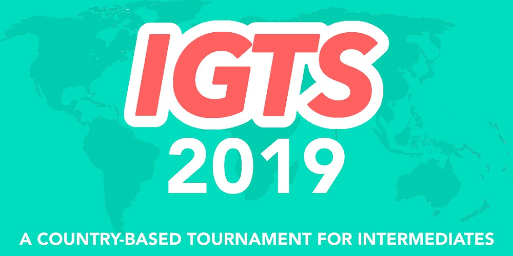

---
tags:
  - IGTS 2019
  - IGTS
  - GTS
---

# Intermediate Global Taiko Showdown 2019

**Intermediate Global Taiko Showdown 2019** (***IGTS 2019***) fue un torneo de osu!taiko por equipos basados en países de doble eliminación dos-contra-dos organizado por ::{ flag=JP }:: [Briesmas](https://osu.ppy.sh/users/2865172) y ::{ flag=FR }:: [Kasumii-sama](https://osu.ppy.sh/users/6177263). Esta fue la segunda edición del Intermediate Global Taiko Showdown.

## Calendario del torneo

| Evento | Fechas |
| --: | :-- |
| Fase de Registro | 11/5/2019 - 25/5/2019 |
| Stream de Apertura | 2/6/2019 (14:00 UTC) |
| Fase de Grupos | 8/6/2019 - 9/6/2019 |
| Octavos de Final | 15/6/2019 - 22/6/2019 |
| Cuartos de Final | 22/6/2019 - 23/6/2019 |
| Semifinales | 29/6/2019 - 30/6/2019 |
| Finales | 6/7/2019 - 7/7/2019 |
| Gran Finales | 13/7/2019 - 14/7/2019 |
| All-Star | 13/7/2019 - 14/7/2019 |

## Premios

| Puestos | Premio(s) |
| :-: | :-- |
|  | Medalla única de perfil, banner de equipo exclusivo |
|  | banner de equipo exclusivo |
|  | banner de equipo exclusivo |

## Organización

El Intermediate Global Taiko Showdown 2019 fue realizado por varios miembros de la comunidad, distribuyendo las variadas labores en ciertos campos de responsabilidades.

| Posición | Miembro(s) |
| :-- | :-- |
| Administración | ::{ flag=JP }:: [Briesmas](https://osu.ppy.sh/users/2865172), ::{ flag=FR }:: [Kasumii-sama](https://osu.ppy.sh/users/6177263) |
| Selectores de mapas | ::{ flag=MY }:: [Bedwyr Aorta](https://osu.ppy.sh/users/10875855), ::{ flag=DE }:: [Capu](https://osu.ppy.sh/users/2474015), ::{ flag=ID }:: [Poii](https://osu.ppy.sh/users/7924938) |
| Árbitros | ::{ flag=BR }:: [AnonX32](https://osu.ppy.sh/users/2730270), ::{ flag=AR }:: [BossPlays](https://osu.ppy.sh/users/7341471), ::{ flag=JP }:: [Briesmas](https://osu.ppy.sh/users/2865172), ::{ flag=DE }:: [Capu](https://osu.ppy.sh/users/2474015), ::{ flag=US }:: [cheese salad](https://osu.ppy.sh/users/6349821), ::{ flag=US }:: [Edgar\_Figaro](https://osu.ppy.sh/users/6508754), ::{ flag=EC }:: [Gamelan4](https://osu.ppy.sh/users/9856910), ::{ flag=DE }:: [GDLenny](https://osu.ppy.sh/users/8406711), ::{ flag=DE }:: [HiddenDenki](https://osu.ppy.sh/users/6868059), ::{ flag=NL }:: [Krekker](https://osu.ppy.sh/users/8265940), ::{ flag=BR }:: [Lolligerjoj](https://osu.ppy.sh/users/9053338), ::{ flag=FR }:: [Mirthille](https://osu.ppy.sh/users/7548517), ::{ flag=DE }:: [QEpicAce](https://osu.ppy.sh/users/9489153), ::{ flag=SG }:: [Rycy](https://osu.ppy.sh/users/7394522), ::{ flag=RU }:: [Starger](https://osu.ppy.sh/users/3398715), ::{ flag=NL }:: [SpectreSan](https://osu.ppy.sh/users/11310442) |
| Streamers | ::{ flag=BR }:: [AnonX32](https://osu.ppy.sh/users/2730270), ::{ flag=AU }:: [Beat43210](https://osu.ppy.sh/users/5664171), ::{ flag=JP }:: [Briesmas](https://osu.ppy.sh/users/2865172), ::{ flag=EC }:: [Gamelan4](https://osu.ppy.sh/users/9856910), ::{ flag=NL }:: [Krekker](https://osu.ppy.sh/users/8265940), ::{ flag=US }:: [Obvious](https://osu.ppy.sh/users/8770622) |
| Comentaristas | ::{ flag=NL }:: [-omicron](https://osu.ppy.sh/users/11043157), ::{ flag=ID }:: [AnimesLover123](https://osu.ppy.sh/users/7280717), ::{ flag=BR }:: [AnonX32](https://osu.ppy.sh/users/2730270), ::{ flag=AU }:: [Beat43210](https://osu.ppy.sh/users/5664171), ::{ flag=US }:: [Binsu](https://osu.ppy.sh/users/6236911), ::{ flag=US }:: [CaptainEChan](https://osu.ppy.sh/users/9536977), ::{ flag=US }:: [Edgar\_Figaro](https://osu.ppy.sh/users/6508754), ::{ flag=EC }:: [Gamelan4](https://osu.ppy.sh/users/9856910), ::{ flag=US }:: [MyAngelManasa](https://osu.ppy.sh/users/6666316), ::{ flag=DE }:: [QEpicAce](https://osu.ppy.sh/users/9489153), ::{ flag=US }:: [Rukairi](https://osu.ppy.sh/users/6642597), ::{ flag=SG }:: [Rycy](https://osu.ppy.sh/users/7394522), ::{ flag=SG }:: [uchuuj1n](https://osu.ppy.sh/users/9140302) |
| Diseñadores | ::{ flag=DE }:: [Celektus](https://osu.ppy.sh/users/4294993), ::{ flag=NL }:: [Krekker](https://osu.ppy.sh/users/8265940), ::{ flag=US }:: [MyAngelManasa](https://osu.ppy.sh/users/6666316) |
| Estadísticos | ::{ flag=FR }:: [Kasumii-sama](https://osu.ppy.sh/users/6177263), ::{ flag=CA }:: [Leadenginger](https://osu.ppy.sh/users/3799991), ::{ flag=GB }:: [Lno](https://osu.ppy.sh/users/1900787), ::{ flag=MY }:: [Minisora](https://osu.ppy.sh/users/9627666) |
| Traductores | ::{ flag=BR }:: [AnonX32](https://osu.ppy.sh/users/2730270), ::{ flag=KR }:: [BamgoeSN](https://osu.ppy.sh/users/1152851), ::{ flag=JP }:: [Briesmas](https://osu.ppy.sh/users/2865172), ::{ flag=DE }:: [Capu](https://osu.ppy.sh/users/2474015), ::{ flag=EC }:: [Gamelan4](https://osu.ppy.sh/users/9856910), ::{ flag=JP }:: [Noko\_BSF](https://osu.ppy.sh/users/3811831), ::{ flag=SG }:: [Rycy](https://osu.ppy.sh/users/7394522), ::{ flag=RU }:: [Starger](https://osu.ppy.sh/users/3398715), ::{ flag=HK }:: [tkdLolly](https://osu.ppy.sh/users/9035344), ::{ flag=JP }:: [Toorun12](https://osu.ppy.sh/users/10349712) |
| Desarrollador de Pick'em | ::{ flag=DE }:: [hallowatcher](https://osu.ppy.sh/users/1874761) |
| Editor de la wiki | ::{ flag=ID }:: [fajar13k](https://osu.ppy.sh/users/7100002) |

## Enlaces

- [Hilo de discusión](https://osu.ppy.sh/community/forums/topics/906298)
- [Servidor de Discord IGTS](https://discord.gg/a6PzzFz)
- [Servidor de Discord GTS](https://discord.gg/3mGC3HB)
- [Sitio web GTS](https://gtsosu.com/)
- [Transmisión en vivo](https://www.twitch.tv/igtsosu)
- [Challonge brackets](https://challonge.com/dqq46siu)
- [Sitio web de predicciones Pick'em](https://pickem.hwc.hr/tournaments/8) alojado por ::{ flag=DE }:: [hallowatcher](https://osu.ppy.sh/users/1874761)
- **[Hoja de estadísticas](https://docs.google.com/spreadsheets/d/1B_upGgX4mSHpWkvWLrfFRAakPKP77Wm_fDsoU1y3kyY/edit?usp=sharing)**

## Participantes

|  | País | Miembros |
| :-: | :-: | :-- |
| ::{ flag=AR }:: | **Argentina** | **[\_MMMMMM\_MMMMMM\_](https://osu.ppy.sh/users/8959673)**, [Sikei-](https://osu.ppy.sh/users/1543133), [ChronosRark1st](https://osu.ppy.sh/users/12020859), [Kliu](https://osu.ppy.sh/users/7409391) |
| ::{ flag=AU }:: | **Australia** | **[soliderror](https://osu.ppy.sh/users/10630542)**, [Olympyss](https://osu.ppy.sh/users/10654844), [andescot](https://osu.ppy.sh/users/8580085), [blakeando](https://osu.ppy.sh/users/11998322) |
| ::{ flag=BR }:: | **Brasil** | **[caaiomc](https://osu.ppy.sh/users/5206883)**, [guga2013](https://osu.ppy.sh/users/6035768), [Matsuoka-kun](https://osu.ppy.sh/users/3786541), [Kannes](https://osu.ppy.sh/users/10821432), [-Nozomi Tojo](https://osu.ppy.sh/users/8024582) |
| ::{ flag=CA }:: | **Canadá** | **[stravant](https://osu.ppy.sh/users/8887646)**, [xenogloss](https://osu.ppy.sh/users/12404211), [Dashthehedgehog](https://osu.ppy.sh/users/13261014), [Noahh](https://osu.ppy.sh/users/11838293) |
| ::{ flag=CL }:: | **Chile** | **[-NaNdo-](https://osu.ppy.sh/users/1934382)**, [joako 321](https://osu.ppy.sh/users/4450549), [SrPotato](https://osu.ppy.sh/users/4276807), [Takeshi Hiroshi](https://osu.ppy.sh/users/6109711), [nypd](https://osu.ppy.sh/users/77918) |
| ::{ flag=CN }:: | **China** | **[Nisoquo](https://osu.ppy.sh/users/12345370)**, [Flandre sca](https://osu.ppy.sh/users/10324309), [Dusat](https://osu.ppy.sh/users/11019434), [Evil Ryu](https://osu.ppy.sh/users/10130639) |
| ::{ flag=CO }:: | **Colombia** | **[Diomedes Daza](https://osu.ppy.sh/users/8950184)**, [Juanisimo](https://osu.ppy.sh/users/9050875), [KaledOSU](https://osu.ppy.sh/users/10828332) |
| ::{ flag=DK }:: | **Dinamarca** | **[Axewu](https://osu.ppy.sh/users/4776228)**, [raser1234](https://osu.ppy.sh/users/2527887) |
| ::{ flag=EC }:: | **Ecuador** | **[-Anmi-](https://osu.ppy.sh/users/7857559)**, [Etsu](https://osu.ppy.sh/users/3442319), [Mik3gam3r7919](https://osu.ppy.sh/users/10570577) |
| ::{ flag=FI }:: | **Finlandia** | **[\[Otto\]](https://osu.ppy.sh/users/5049430)**, [Zoel](https://osu.ppy.sh/users/7289244), [SSieni](https://osu.ppy.sh/users/2402008), [Wanderful](https://osu.ppy.sh/users/3386674), [Kuromiyaa](https://osu.ppy.sh/users/12811744) |
| ::{ flag=FR }:: | **Francia A** | **[Ladylag](https://osu.ppy.sh/users/2812098)**, [Kaho-Hinata](https://osu.ppy.sh/users/8903888), [Musclor](https://osu.ppy.sh/users/9637676), [Mimir](https://osu.ppy.sh/users/7382734), [Ladybug](https://osu.ppy.sh/users/4833654) |
| ::{ flag=FR }:: | **Francia B** | **[Lyseria-Miku](https://osu.ppy.sh/users/8972795)**, [kamaboko117](https://osu.ppy.sh/users/9508031), [Heartswimm](https://osu.ppy.sh/users/10936319), [Panda\_0ne](https://osu.ppy.sh/users/11216472) |
| ::{ flag=DE }:: | **Alemania** | **[Heam](https://osu.ppy.sh/users/4705120)**, [mulraf](https://osu.ppy.sh/users/1309242), [SarahIsWeird](https://osu.ppy.sh/users/11694604), [Felicia Yuuki](https://osu.ppy.sh/users/10098927) |
| ::{ flag=GR }:: | **Grecia** | **[- VayKay -](https://osu.ppy.sh/users/2559954)**, [KagamineAmy](https://osu.ppy.sh/users/8744228) |
| ::{ flag=HK }:: | **Hong Kong** | **[Brown918](https://osu.ppy.sh/users/9805760)**, [\[\_isolated\_\]](https://osu.ppy.sh/users/6187838), [ZinerX](https://osu.ppy.sh/users/9841478), [shikuro\_re](https://osu.ppy.sh/users/9338943) |
| ::{ flag=ID }:: | **Indonesia A** | **[Reed\_405](https://osu.ppy.sh/users/9965069)**, [Viewland](https://osu.ppy.sh/users/6250135), [Moka-san](https://osu.ppy.sh/users/1612606) |
| ::{ flag=ID }:: | **Indonesia B** | **[LoliVoiceASMR](https://osu.ppy.sh/users/12517831)**, [eltiras](https://osu.ppy.sh/users/6720962), [Kzl](https://osu.ppy.sh/users/7058490), [Lisieux-](https://osu.ppy.sh/users/13795552) |
| ::{ flag=IE }:: | **Irlanda** | **[Kawaii-lili](https://osu.ppy.sh/users/13816802)**, [-WizardyNinja-](https://osu.ppy.sh/users/2607778) |
| ::{ flag=JP }:: | **Japón** | **[RinNatsume1013](https://osu.ppy.sh/users/9022173)**, [tkpnender](https://osu.ppy.sh/users/12682785), [AILK](https://osu.ppy.sh/users/1212491), [mukuchan](https://osu.ppy.sh/users/9007431), [JPN](https://osu.ppy.sh/users/9122742) |
| ::{ flag=MX }:: | **México** | **[\[ Croqueto \]](https://osu.ppy.sh/users/1705608)**, [L\_CORTES\_01](https://osu.ppy.sh/users/12548363), [Darkside550](https://osu.ppy.sh/users/7320933), [GusPaloalto](https://osu.ppy.sh/users/13348305) |
| ::{ flag=NL }:: | **Países Bajos** | **[lukitsa124](https://osu.ppy.sh/users/8787678)**, [Mr HeliX](https://osu.ppy.sh/users/2330619), [Swerro](https://osu.ppy.sh/users/4507667) |
| ::{ flag=PE }:: | **Perú** | **[Spieler_Sync](https://osu.ppy.sh/users/10659299)**, [adriancaba](https://osu.ppy.sh/users/11543837) |
| ::{ flag=PH }:: | **Filipinas** | **[Yron8](https://osu.ppy.sh/users/1537747)**, [FinnB](https://osu.ppy.sh/users/2164993), [Tropixal](https://osu.ppy.sh/users/8085222), [jacarandang](https://osu.ppy.sh/users/4154069), [FPxOsu](https://osu.ppy.sh/users/3845828) |
| ::{ flag=PL }:: | **Polonia A** | **[BeatGoat](https://osu.ppy.sh/users/11308471)**, [C O L L A P S E](https://osu.ppy.sh/users/12042993), [Lama-aka-EMi](https://osu.ppy.sh/users/9148286), [Moonie Wolf](https://osu.ppy.sh/users/7070461) |
| ::{ flag=PL }:: | **Polonia B** | **[Deroo](https://osu.ppy.sh/users/8360475)**, [Konrad20050](https://osu.ppy.sh/users/8966140), [Lastminute7](https://osu.ppy.sh/users/7121313), [Bowashe](https://osu.ppy.sh/users/2163544) |
| ::{ flag=SG }:: | **Singapur** | **[uchuuj1n](https://osu.ppy.sh/users/9140302)**, [RundownPaper4](https://osu.ppy.sh/users/5349769), [C5H10](https://osu.ppy.sh/users/7003484) |
| ::{ flag=KR }:: | **Corea del Sur** | **[Civil oath](https://osu.ppy.sh/users/3216107)**, [MuangMuangE](https://osu.ppy.sh/users/3752338), [Hoshikuz](https://osu.ppy.sh/users/9892196), [Endroll](https://osu.ppy.sh/users/1399551) |
| ::{ flag=CH }:: | **Suiza** | **[HardNeper](https://osu.ppy.sh/users/9776256)**, [basti78](https://osu.ppy.sh/users/28222), [- DustyFlow -](https://osu.ppy.sh/users/824415), [-Shizue-](https://osu.ppy.sh/users/12819177) |
| ::{ flag=TW }:: | **Taiwán** | **[- DeveRUX -](https://osu.ppy.sh/users/2900875)**, [Dviler](https://osu.ppy.sh/users/10838779), [ipad\_siri](https://osu.ppy.sh/users/9930377), [NaleYuar](https://osu.ppy.sh/users/6701207), [Twinlight](https://osu.ppy.sh/users/9693274) |
| ::{ flag=GB }:: | **Reino Unido** | **[hammygames](https://osu.ppy.sh/users/12232503)**, [Livvo](https://osu.ppy.sh/users/8884687), [ChicagoTed7172](https://osu.ppy.sh/users/2948139), [Olii](https://osu.ppy.sh/users/7683305) |
| ::{ flag=US }:: | **Estados Unidos A** | **[Swovine](https://osu.ppy.sh/users/6666316)**, [Cychloryn](https://osu.ppy.sh/users/6921736), [Stan GFriend](https://osu.ppy.sh/users/1773605), [InsaneToe](https://osu.ppy.sh/users/6389252), [kb131313](https://osu.ppy.sh/users/11229259) |
| ::{ flag=US }:: | **Estados Unidos B** | **[Binsu](https://osu.ppy.sh/users/6236911)**, [Slav Man](https://osu.ppy.sh/users/11612235), [White Axl](https://osu.ppy.sh/users/12334307), [Tsred](https://osu.ppy.sh/users/2737667), [Carlohman1](https://osu.ppy.sh/users/12212290) |

### Grupos

| Grupo | Semilla superior | Semilla alta | Semilla baja | Sin semilla |
| :-: | :-- | :-- | :-- | :-- |
| **A** | ::{ flag=TW }:: Taiwán | ::{ flag=ID }:: Indonesia A | ::{ flag=DE }:: Alemania | ::{ flag=FI }:: Finlandia |
| **B** | ::{ flag=PL }:: Polonia A | ::{ flag=PH }:: Filipinas | ::{ flag=CH }:: Suiza | ::{ flag=GR }:: Grecia |
| **C** | ::{ flag=JP }:: Japón | ::{ flag=AU }:: Australia | ::{ flag=EC }:: Ecuador | ::{ flag=FR }:: Francia B |
| **D** | ::{ flag=KR }:: Corea del Sur | ::{ flag=FR }:: Francia A | ::{ flag=NL }:: Países Bajos | ::{ flag=SG }:: Singapur |
| **E** | ::{ flag=US }:: Estados Unidos B | ::{ flag=MX }:: México | ::{ flag=AR }:: Argentina | ::{ flag=GB }:: Reino Unido |
| **F** | ::{ flag=US }:: Estados Unidos A | ::{ flag=CN }:: China | ::{ flag=CA }:: Canadá | ::{ flag=DK }:: Dinamarca |
| **G** | ::{ flag=BR }:: Brasil | ::{ flag=CL }:: Chile | ::{ flag=ID }:: Indonesia B | ::{ flag=PE }:: Perú |
| **H** | ::{ flag=HK }:: Hong Kong | ::{ flag=PL }:: Polonia B | ::{ flag=CO }:: Colombia | ::{ flag=IE }:: Irlanda |

## Podio

Esta competición ha llegado a su fin y ha dado lugar al siguiente podio:

| Lugar | Equipo |
| :-: | :-- |
|  | ::{ flag=HK }:: Hong Kong |
|  | ::{ flag=US }:: Estados Unidos A |
|  | ::{ flag=CL }:: Chile |

## Mappools

### All-Stars Battle Royale

**[¡Descarga el paquete de mapas aquí! (73 MB)](https://mega.nz/#!HXByya4R!moeuOzFnwhOC5Ja2YqXWRY-dE5YYbMyR2jNGmnC2wpg)**

- NoMod
  1. [Silent Siren - Merry-Go-Round (hoku-4625) \[Shallty-Go-Round\]](https://osu.ppy.sh/beatmapsets/751585#taiko/1612301)
  2. [dj TAKA - RAIN (Ak1o) \[Ak1oni\]](https://osu.ppy.sh/beatmapsets/881815#taiko/1843675)
- Hidden
  1. [siromaru + cranky - conflict (Midnaait) \[komasy's Oni\]](https://osu.ppy.sh/beatmapsets/926839#taiko/1935852)
  2. [TERRA - REVOLUTION (TKS) \[MASTER\]](https://osu.ppy.sh/beatmapsets/106822#taiko/280302)
- HardRock
  1. [Se-U-Ra - The Endless for Traveler (ZethZ161) \[Oni\]](https://osu.ppy.sh/beatmapsets/692388#taiko/1467210)
  2. [Dirty Androids - Seaside Labyrinth (MMzz) \[Inner Oni\]](https://osu.ppy.sh/beatmapsets/687541#taiko/1454920)
- DoubleTime
  1. [Nyanners - Gucci Gang (Nifty) \[Uguuci Gang\]](https://osu.ppy.sh/beatmapsets/710007#taiko/1500870)
  2. [Kola Kid - a whole lotta Kola Kid songs (Raphalge) \[good old times\]](https://osu.ppy.sh/beatmapsets/607839#taiko/1283783)
- FreeMod
  1. [Ushirokara Haiyoritai G - Taiyou Iwaku Moeyo Chaos (An-bootleg) (Nifty) \[Ooh! Nya!\]](https://osu.ppy.sh/beatmapsets/779307#taiko/1636526)
  2. [Oxblud+ - the littlest things [Kesu+ Audio Scribble] (Vulkin) \[ulqui's inner oni\]](https://osu.ppy.sh/beatmapsets/579166#taiko/1755465)
- EX
  1. [DROELOE - Limbo (Ulqui) \[Space Distortion\]](https://osu.ppy.sh/beatmapsets/831958#taiko/1743082)
  2. [SEVENTH SISTERS - SEVENTH HAVEN (Mtell Remix) (Shallty) \[1st Sister Shallty\]](https://osu.ppy.sh/beatmapsets/829545#taiko/1737946)

### All-Stars

**[¡Descarga el paquete de mapas aquí! (84 MB)](https://mega.nz/#!iPAgxSpD!oZW07szzXj13W884z3zzw_6II2R8uqu1aWP22yxy8Vo)**

- NoMod
  1. [Yuyoyuppe - AiAe (asuasu\_yura) \[Inner Oni\]](https://osu.ppy.sh/beatmapsets/447734#taiko/961162)
  2. [ENNNN - Nightfall (DarkVortex) \[Oni\]](https://osu.ppy.sh/beatmapsets/655932#taiko/1389903)
  3. [Zetsubou Shoujotachi - Zetsubou Restaurant (TV Size) (Capu) \[Inner Oni\]](https://osu.ppy.sh/beatmapsets/869002#taiko/1816218)
- Hidden
  1. [Shiron + Kofu x Morimori Atsushi to Teikyo de okuri shimasu - Demise Quartet (Aras25) \[Ozzy's Oni\]](https://osu.ppy.sh/beatmapsets/463431#taiko/1016241)
  2. [Rabpit - Sanctity (tsuka) \[Taiko\]](https://osu.ppy.sh/beatmapsets/50017#taiko/161503)
  3. [t+pazolite - Candy Crack Curtain Call (tasuke912) \[Oni\]](https://osu.ppy.sh/beatmapsets/237272#taiko/928806)
- HardRock
  1. [KNOWER - Overtime (Zetera) \[Onitime\]](https://osu.ppy.sh/beatmapsets/927890#taiko/1938084)
  2. [Nekomata Master+ - POINT ZERO (Nyan) \[Taiko Oni\]](https://osu.ppy.sh/beatmapsets/303883#taiko/680908)
  3. [TOMOSUKE x Jazzin'park feat. LANA - Kiroku no Kakera (sasakure.UK Framework Remix) (SKSalt) \[Inner Oni\]](https://osu.ppy.sh/beatmapsets/369059#taiko/808984)
- DoubleTime
  1. [Utsu-P & Minatsuki Toka - Natsu Matsuri (DakeDekaane) \[Oni\]](https://osu.ppy.sh/beatmapsets/132262#taiko/487286)
  2. [Rainbowdragoneyes - Size My Day (Mew104) \[Muzukashii\]](https://osu.ppy.sh/beatmapsets/224043#taiko/566293)
  3. [DAOKO - Daisuki with TeddyLoid (Nifty) \[Oni\]](https://osu.ppy.sh/beatmapsets/707331#taiko/1495773)
- FreeMod
  1. [SWAN K feat. Asuka M - LOVE B.B.B (Nakagawa-Kanon) \[Taiko\]](https://osu.ppy.sh/beatmapsets/48537#taiko/150491)
  2. [Ice vs. Morimori Atsushi - RE:UNION -Duo Blade Against- (TKS) \[Oni\]](https://osu.ppy.sh/beatmapsets/853408#taiko/1783664)
  3. [PSYQUI feat.Such - Raise Your Hands (1rori) \[Future Oni\]](https://osu.ppy.sh/beatmapsets/883358#taiko/1846592)
- EX
  1. [tofubeats - CANDYYYLAND feat. LIZ (Pa's Lam System Remix) (Myckoll) \[Myruki's Sweet\]](https://osu.ppy.sh/beatmapsets/724269#taiko/1529288)
  2. [polysha - The Golden Era (Silentroom Remix) (EdamaMe411) \[TJBC#8\]](https://osu.ppy.sh/beatmapsets/844391#taiko/1766363)
  3. [doth - Toy Boxxxx (Sayaka-) \[Oni\]](https://osu.ppy.sh/beatmapsets/380854#taiko/833267)
- Desempate
  1. **[Kano - Stella-rium(DJ Noriken Bootleg Remix) (thika1432) \[Taiko Collab\]](https://osu.ppy.sh/beatmapsets/479881#taiko/1084587)**

### Gran final

**[¡Descarga el paquete de mapas aquí! (72 MB)](https://puu.sh/DPMoR/9704e02686.rar)**

- NoMod
  1. [xi - Blue Zenith (Capu) \[Oni\]](https://osu.ppy.sh/beatmapsets/971982#taiko/2035965)
  2. [Virt - Staring at my Spaceship (HashishKabob) \[Taiko Oni\]](https://osu.ppy.sh/beatmapsets/57145#taiko/172402)
  3. [Umeboshi Chazuke - Bison Charge (Midnaait) \[hikiko's Oni\]](https://osu.ppy.sh/beatmapsets/739116#taiko/1598892)
  4. [DIVERSA - atlas (Ulqui) \[Skull Kid's Oni\]](https://osu.ppy.sh/beatmapsets/875591#taiko/2002994)
  5. [wa. vs ETIA. - Akasagarbha (\_DUSK\_) \[Oni\]](https://osu.ppy.sh/beatmapsets/709333#taiko/1499438)
  6. [lapix - Kill The Beat (Nofool) \[Special Oni\]](https://osu.ppy.sh/beatmapsets/891525#taiko/1863761)
- Hidden
  1. [Sana - Hoshifuri (TKS) \[Oni\]](https://osu.ppy.sh/beatmapsets/195958#taiko/464760)
  2. [RoughSketch + DD"Nakata"Metal - Booths of Fighters (-Kazu-) \[EXHAUST\]](https://osu.ppy.sh/beatmapsets/185427#taiko/443331)
- HardRock
  1. [Memme - Starving Days (Charles445) \[Oni445\]](https://osu.ppy.sh/beatmapsets/157641#taiko/385907)
  2. [xi - Longinus (Faputa) \[Oni\]](https://osu.ppy.sh/beatmapsets/963975#taiko/2018178)
- DoubleTime
  1. [cYsmix - Dovregubben's Hall (Raiden) [Oni]](https://osu.ppy.sh/beatmapsets/363214#taiko/797639)
  2. [Anamanaguchi - Miku ft. Hatsune Miku (Nightcore Mix) (Backfire) \[Lyawi's Oni\]](https://osu.ppy.sh/beatmapsets/886962#taiko/1854203)
- FreeMod
  1. [Amane - DEADLYBLOW (Yoshi\_green) \[TK's Oni\]](https://osu.ppy.sh/beatmapsets/100155#taiko/327561)
  2. [SOOOO - Raven Haven (Raiden) \[Oni\]](https://osu.ppy.sh/beatmapsets/921535#taiko/1925777)
  3. [DJ Fresh - Gold Dust (Vyiuri) \[Oni\]](https://osu.ppy.sh/beatmapsets/981799#taiko/2054840)
- Desempate
  1. **[Yooh - Shigure (Karee Pan) \[Blue\]](https://osu.ppy.sh/beatmapsets/656246#taiko/1390464)**

### Finales

**[¡Descarga el paquete de mapas aquí! (91 MB)](https://puu.sh/DMtYB/f84ce587b2.rar)**

- NoMod
  1. [Reol - Gigantic O.T.N (snowball112) \[Oni\]](https://osu.ppy.sh/beatmapsets/434182#taiko/937232)
  2. [Shiokara-zu - Shiokara-Bushi (Skull Kid) \[Oni\]](https://osu.ppy.sh/beatmapsets/517401#taiko/1099368)
  3. [ITO KASHITARO - Yuudachi no Ribbon (Prophecy) \[Oni\]](https://osu.ppy.sh/beatmapsets/831573#taiko/1743336)
  4. [be5moti - Trahison (houraizin) \[Oni\]](https://osu.ppy.sh/beatmapsets/833305#taiko/1745535)
  5. [Sota Fujimori - polygon (Fallmorph) \[Fapu's Oni\]](https://osu.ppy.sh/beatmapsets/721297#taiko/1628101)
  6. [(Seiryu) - AO-INFINITY (Nofool) \[Oni\]](https://osu.ppy.sh/beatmapsets/869505#taiko/1824962)
- Hidden
  1. [Memme - Unison System (Love) \[Oni\]](https://osu.ppy.sh/beatmapsets/185198#taiko/442943)
  2. [40mP feat. Chano - Yuugure One Room (yuzu\_\_rinrin) \[Oni\]](https://osu.ppy.sh/beatmapsets/469504#taiko/1004024)
- HardRock
  1. [Mili - Summoning 101 (Dellvangel) \[Oni\]](https://osu.ppy.sh/beatmapsets/804107#taiko/1687872)
  2. [MY FIRST STORY - Fukagyaku Replace (Broccoly) \[qoot8123's Oni\]](https://osu.ppy.sh/beatmapsets/383270#taiko/896262)
- DoubleTime
  1. [Hanatan - Sarishinohara (Capu) \[Oni\]](https://osu.ppy.sh/beatmapsets/886776#taiko/1853891)
  2. [Yunomi with Momobako&miko - Soumatou Labyrinth (komasy) \[Muzukashii\]](https://osu.ppy.sh/beatmapsets/625493#taiko/1319575)
- FreeMod
  1. [MitiS - Pain (Original Mix) (game rock) \[Oni\]](https://osu.ppy.sh/beatmapsets/680259#taiko/1438414)
  2. [Ocelot - TSUBAKI (TKS) \[Oni\]](https://osu.ppy.sh/beatmapsets/177838#taiko/427931)
  3. [Orange Lounge - Les filles balancent (Zetera) \[Oni\]](https://osu.ppy.sh/beatmapsets/684224#taiko/1448036)
- Desempate
  1. **[EGOIST - The Everlasting Guilty Crown (JUDYDANNY) \[Taiko Crown\]](https://osu.ppy.sh/beatmapsets/658600#taiko/1430707)**

### Semifinales

**[¡Descarga el paquete de mapas aquí! (93 MB)](https://mega.nz/#!WwlilCBT!o9-f_FKiAmjCTBs3UEs-JW6Hl8F0ni-ZFH47SROQ42E)**

- NoMod
  1. [Buta-Otome - Towa no Maigo (404 AccNotFound) \[Oni\]](https://osu.ppy.sh/beatmapsets/622175#taiko/1317865)
  2. [Colorful Sounds Port - ETERNAL DRAIN (zigizigiefe) \[Oni\]](https://osu.ppy.sh/beatmapsets/692110#taiko/1464636)
  3. [Zekk - Sugary Daydream (Jaye) \[Lite Oni\]](https://osu.ppy.sh/beatmapsets/708322#taiko/1513610)
  4. [Halogen - U Got That (Camellia's Neurofunk Bootleg) (zhu) \[Fapu's Oni\]](https://osu.ppy.sh/beatmapsets/936772#taiko/1958124)
  5. [Pokota and Hanatan - Aa, Subarashiki Nyansei (Bedwyr Aorta) \[Teru's Oninyan (IGTS ver.)\]](https://osu.ppy.sh/beatmapsets/992200#taiko/2075012)
  6. [aran - Xperanza (Ulqui) \[Oni\]](https://osu.ppy.sh/beatmapsets/800399#taiko/1755536)
- Hidden
  1. [Dzeko & Torres - L'Amour Toujours feat. Delaney Jane (Nightcore Mix) (Rhytoly) \[Oni\]](https://osu.ppy.sh/beatmapsets/890586#taiko/1871013)
  2. [Se-U-Ra - The Endless for Traveler (ZethZ161) \[Muzukashii\]](https://osu.ppy.sh/beatmapsets/692388#taiko/1467259)
- HardRock
  1. [TAMAONSEN - Touhou Tanoshii feat. Matsu (Alwaysyukaz) \[Oni\]](https://osu.ppy.sh/beatmapsets/804456#taiko/1688737)
  2. [Silver Forest feat.Aki - Yami no Mahou Shoujo (\[Belajar-Osu\]) \[Yami no Oni\]](https://osu.ppy.sh/beatmapsets/873256#taiko/1825490)
- DoubleTime
  1. [GigaP feat. GUMI, KYO - Ooedo Ranvu (snowball112) \[Muzukashii\]](https://osu.ppy.sh/beatmapsets/345381#taiko/762900)
  2. [Yura Hatsuki x Seraph - Le Rouge et le Noir (-Tenshi-) \[Nardo's Muzukashii\]](https://osu.ppy.sh/beatmapsets/365971#taiko/823246)
- FreeMod
  1. [7 Sequence x M2U - Megaburn (JUDYDANNY) \[JuDa's Oni (IGTS ver.)\]](https://osu.ppy.sh/beatmapsets/991638#taiko/2073824)
  2. [Itou Kashitarou x Ron - Soushi Souai (newyams99) \[Oni\]](https://osu.ppy.sh/beatmapsets/635203#taiko/1347899)
  3. [Krewella X DISKORD - Beggars (Consouls Remix) (-omicron) \[Remus' Oni (IGTS ver.)\]](https://osu.ppy.sh/beatmapsets/991642#taiko/2073828)
- Desempate
  1. **[Culprate & Joe Ford - Gaucho (vrnl) \[Kqrth's Oni\]](https://osu.ppy.sh/beatmapsets/937645#taiko/1960216)**

### Cuartos de final

**[¡Descarga el paquete de mapas aquí! (80 MB)](https://mega.nz/#!2xlzGaDY!hXiqsiHh2U0iooB_5a0wnplYUC72is9m-3ifIYzaXgw)**

- NoMod
  1. [Dreamcatcher - Chase Me (-omicron) \[Jaye's Lite Oni (IGTS ver.)\]](https://osu.ppy.sh/beatmapsets/987174#taiko/2065074)
  2. [Frederic - Kanashii Ureshii (Nifty) \[Ayyri's Oni\]](https://osu.ppy.sh/beatmapsets/640443#taiko/1490351)
  3. [Camellia as "fluX Xroise" - Xronier (Felt7z) \[Muzukashii\]](https://osu.ppy.sh/beatmapsets/925700#taiko/1966652)
  4. [Chroma - Goodbye-bye Planet (butter0414) \[Oni\]](https://osu.ppy.sh/beatmapsets/694474#taiko/1469258)
  5. [onumi - REGRET PART TWO (Ulqui) \[muzukashii\]](https://osu.ppy.sh/beatmapsets/912552#taiko/1908118)
- Hidden
  1. [LukHash - MIDNIGHT LIGHTS (-omicron) \[Fleure De Lapin's Oni (IGTS ver.)\]](https://osu.ppy.sh/beatmapsets/987825#taiko/2066572)
  2. [TangJuan vs Black Box - Xetta (\_DUSK\_) \[Muzukashii\]](https://osu.ppy.sh/beatmapsets/819907#taiko/1718985)
- HardRock
  1. [Nekomata Master - Moffing (Tasha) \[MM's Oni\]](https://osu.ppy.sh/beatmapsets/104880#taiko/283871)
  2. [turdl3 - Lunatic Peels \~ Invisible Full Net (Midnaait) \[Muzukashii\]](https://osu.ppy.sh/beatmapsets/968108#taiko/2025848)
- DoubleTime
  1. [ClariS - Diary (captin1) \[Muzukashii\]](https://osu.ppy.sh/beatmapsets/156168#taiko/382737)
  2. [ClariS - Surely (JUDYDANNY) \[Oni\]](https://osu.ppy.sh/beatmapsets/170359#taiko/412493)
- FreeMod
  1. [DJ S3RL - T-T-Techno (feat. Jesskah) (nold\_1702) \[Oni\]](https://osu.ppy.sh/beatmapsets/83560#taiko/586601)
  2. [MY FIRST STORY - Missing You (-Sh1n1-) \[Oni\]](https://osu.ppy.sh/beatmapsets/869178#taiko/1816549)
  3. [Ice vs. Morimori Atsushi - RE:UNION -Duo Blade Against- (Capu) \[Muzukashii\]](https://osu.ppy.sh/beatmapsets/973031#taiko/2037090)
- Desempate
  1. **[Liz Triangle - past lover (Realazy) \[Lost Oni\]](https://osu.ppy.sh/beatmapsets/608260#taiko/1284600)**

### Octavos de final

**[¡Descarga el paquete de mapas aquí! (80 MB)](https://mega.nz/#!WSYUBY4Y!Hts6mX8TLvWtnolG42GhHyBQOHzM0lvMaBg8V0x_vDY)**

- NoMod
  1. [Yuuyu - Scrap Syndrome (Short cut.) (Nwolf) \[Oni\]](https://osu.ppy.sh/beatmapsets/261311#taiko/596741)
  2. [Akiyama Uni - Odoru Mizushibuki (Yumyum-) \[Oni\]](https://osu.ppy.sh/beatmapsets/924849#taiko/1932871)
  3. [REDALiCE - Always TANO\*C (Kobaryo's FTN-Remix) (yea) \[jyake's Muzukashii\]](https://osu.ppy.sh/beatmapsets/690365#taiko/1482770)
  4. [I SEE MONSTAS - Holdin On (Skrillex and Nero Remix) (QEpicAce) \[Surono's Oni (IGTS ver.)\]](https://osu.ppy.sh/beatmapsets/984425#taiko/2059807)
  5. [The Flashbulb - Creep (Greenshell) \[Volta's Muzukashii\]](https://osu.ppy.sh/beatmapsets/966087#taiko/2054858)
- Hidden
  1. [lapix - Nexta (TKS) \[Muzukashii\]](https://osu.ppy.sh/beatmapsets/726669#taiko/1549620)
  2. [xi - Bad Elixir (\_DUSK\_) \[Muzukashii\]](https://osu.ppy.sh/beatmapsets/937808#taiko/1959373)
- HardRock
  1. [Furries in a Blender - Storm World (OzzyOzrock) \[Muzukashii\]](https://osu.ppy.sh/beatmapsets/319805#taiko/711730)
  2. [Feryquitous (Vo.Sennzai) - Koe (SKSalt) \[Muzukashii\]](https://osu.ppy.sh/beatmapsets/933777#taiko/1968634)
- DoubleTime
  1. [U - Hi-Fi day (qoot8123) \[Oni\]](https://osu.ppy.sh/beatmapsets/285279#taiko/644393)
  2. [ONE OK ROCK - Mighty Long Fall (Chromoxx) \[Muzukashii\]](https://osu.ppy.sh/beatmapsets/578492#taiko/1225108)
- FreeMod
  1. [Kana Nishino - Sweet Dreams (11t dnb mix) (asuasu\_yura) \[Muzukashii\]](https://osu.ppy.sh/beatmapsets/684455#taiko/1459567)
  2. [Nekomata Master - Izanami no nageki (HiroK) \[Coryn's Muzukashii\]](https://osu.ppy.sh/beatmapsets/835429#taiko/1760172)
  3. [Pierce The Veil - She Sings In The Morning (puxtu) \[Vulkin's Muzukashii\]](https://osu.ppy.sh/beatmapsets/393110#taiko/1007023)
- Desempate
  1. **[RIOT - Overkill (Capu) \[Oni\]](https://osu.ppy.sh/beatmapsets/984743#taiko/2060444)**

### Fase de grupos

**[¡Descarga el paquete de mapas aquí! (81 MB)](https://mega.nz/#!uKBU1QbB!kFcNmKfvD8BPwchJ0YzcjH2Esf57g20iMq1PI58Ry7I)**

- NoMod
  1. [An - TearVid (Kokatsu) \[Muzukashii\]](https://osu.ppy.sh/beatmapsets/79647#taiko/222678)
  2. [dj TAKA - Liberation (rango) \[Yachiyo's Oni\]](https://osu.ppy.sh/beatmapsets/955818#taiko/1996686)
  3. [Lon - Yuru Fuwa Jukai Girl (Love) \[Muzukashii\]](https://osu.ppy.sh/beatmapsets/123810#taiko/315971)
  4. [PSYQUI - Architect (Nifty) \[Muzukashii\]](https://osu.ppy.sh/beatmapsets/874516#taiko/1828312)
- Hidden
  1. [Momokurotei Ichimon - Nippon Egao Hyakkei (Kite) \[Yia's Muzukashii\]](https://osu.ppy.sh/beatmapsets/59569#taiko/179782)
  2. [The Flashbulb - Lawn Wake III (Midnaait) \[Muzukashii\]](https://osu.ppy.sh/beatmapsets/458068#taiko/982978)
- HardRock
  1. [SOUND HOLIC Feat. Nana Takahashi - XINOBIKILL (HiroK) \[Muzukashii\]](https://osu.ppy.sh/beatmapsets/744214#taiko/1569197)
  2. [Buta-Otome - Mamanaranai (Karee Pan) \[Muzukashii\]](https://osu.ppy.sh/beatmapsets/722051#taiko/1524527)
- DoubleTime
  1. [BLACKPINK - AS IF IT'S YOUR LAST (QEpicAce) \[Blackener's Muzukashii (IGTS ver.)\]](https://osu.ppy.sh/beatmapsets/980788#taiko/2052592)
  2. [Team "Hanayamata" - Hana wa Odore ya Irohaniho (kjwkjw) \[Muzukashii\]](https://osu.ppy.sh/beatmapsets/215845#taiko/506832)
- FreeMod
  1. [GigaP feat. kradness - Senbonzakura (Soldsaga KunG) \[Muzukashii\]](https://osu.ppy.sh/beatmapsets/186878#taiko/453439)
  2. [Nanamori-chu \* Goraku-bu - Happy Time wa Owaranai (eiri-) \[Muzukashii\]](https://osu.ppy.sh/beatmapsets/773330#taiko/1625589)
  3. [lapix - Future Raver feat. Numb'n'dub (Arrival) \[Muzukashii\]](https://osu.ppy.sh/beatmapsets/963997#taiko/2024239)
- Desempate
  1. **[USAO - Chrono Diver -PENDULUMs- (USAO remix) (QEpicAce) \[-Jordan-'s Muzukashii (IGTS ver.)\]](https://osu.ppy.sh/beatmapsets/980250#taiko/2051403)**

## Resultado de los partidos

### Gran final

Sábado, 13 de julio de 2019:

| Equipo 1 |  |  | Equipo 2 | Enlace al partido |
| --: | :-: | :-: | :-- | :-- |
| Estados Unidos A ::{ flag=US }:: | 5 | **7** | ::{ flag=HK }:: **Hong Kong** | [#1](https://osu.ppy.sh/community/matches/53299127) |
| **Hong Kong** ::{ flag=HK }:: | **7** | 4 | ::{ flag=US }:: Estados Unidos A | [#1](https://osu.ppy.sh/community/matches/53300693) |

### Finales

Sábado, 6 de julio de 2019:

| Equipo 1 |  |  | Equipo 2 | Enlace al partido |
| --: | :-: | :-: | :-- | :-- |
| **Hong Kong** ::{ flag=HK }:: | **7** | 2 | ::{ flag=FR }:: Francia A | [#1](https://osu.ppy.sh/community/matches/53143747) |
| **Estados Unidos A** ::{ flag=US }:: | **7** | 3 | ::{ flag=CL }:: Chile | [#1](https://osu.ppy.sh/community/matches/53159685) |

Domingo, 7 de julio de 2019:

| Equipo 1 |  |  | Equipo 2 | Enlace al partido |
| --: | :-: | :-: | :-- | :-- |
| Chile ::{ flag=CL }:: | 1 | **7** | ::{ flag=HK }:: **Hong Kong** | [#1](https://osu.ppy.sh/community/matches/53162196) |

### Semifinales

Sábado, 29 de junio de 2019:

| Equipo 1 |  |  | Equipo 2 | Enlace al partido |
| --: | :-: | :-: | :-- | :-- |
| **Estados Unidos A** ::{ flag=US }:: | **7** | 4 | ::{ flag=PH }:: Filipinas | [#1](https://osu.ppy.sh/community/matches/52977372) |
| **Chile** ::{ flag=CL }:: | **7** | 5 | ::{ flag=CN }:: China | [#1](https://osu.ppy.sh/community/matches/52987753) |
| **Hong Kong** ::{ flag=HK }:: | **7** | 1 | ::{ flag=AR }:: Argentina | [#1](https://osu.ppy.sh/community/matches/52987594) |

Domingo, 30 de junio de 2019:

| Equipo 1 |  |  | Equipo 2 | Enlace al partido |
| --: | :-: | :-: | :-- | :-- |
| **Francia A** ::{ flag=FR }:: | **7** | 6 | ::{ flag=JP }:: Japón | [#1](https://osu.ppy.sh/community/matches/53005399) |
| Filipinas ::{ flag=PH }:: | 6 | **7** | ::{ flag=HK }:: **Hong Kong** | [#1](https://osu.ppy.sh/community/matches/53005654) |
| China ::{ flag=CN }:: | 1 | **7** | ::{ flag=FR }:: Francia A | [#1](https://osu.ppy.sh/community/matches/53009063) |

### Cuartos de Final

Sábado, 22 de junio de 2019:

| Equipo 1 |  |  | Equipo 2 | Enlace al partido |
| --: | :-: | :-: | :-- | :-- |
| Indonesia A ::{ flag=ID }:: | 0 | **6** | ::{ flag=US }:: **Estados Unidos A** | *victoria por ausencia* |
| Francia A ::{ flag=FR }:: | 4 | **6** | ::{ flag=PH }:: **Filipinas** | [#1](https://osu.ppy.sh/community/matches/52814381) |
| **China** ::{ flag=CN }:: | **6** | 2 | ::{ flag=TW }:: Taiwán | [#1](https://osu.ppy.sh/community/matches/52818020) |
| **Chile** ::{ flag=CL }:: | **6** | 1 | ::{ flag=SG }:: Singapur | [#1](https://osu.ppy.sh/community/matches/52820880) |
| Taiwán ::{ flag=TW }:: | 0 | **6** | ::{ flag=HK }:: **Hong Kong** | [#1](https://osu.ppy.sh/community/matches/52820731) |

Domingo, 23 de junio de 2019:

| Equipo 1 |  |  | Equipo 2 | Enlace al partido |
| --: | :-: | :-: | :-- | :-- |
| Indonesia A ::{ flag=ID }:: | 2 | **6** | ::{ flag=JP }:: **Japón** | [#1](https://osu.ppy.sh/community/matches/52845363) |
| Singapur ::{ flag=SG }:: | 5 | **6** | ::{ flag=AR }:: **Argentina** | [#1](https://osu.ppy.sh/community/matches/52848092) |
| **Francia A** ::{ flag=FR }:: | **6** | 3 | ::{ flag=MX }:: México | [#1](https://osu.ppy.sh/community/matches/52850794) |

### Octavos de Final

Sábado, 15 de junio de 2019:

| Equipo 1 |  |  | Equipo 2 | Enlace al partido |
| --: | :-: | :-: | :-- | :-- |
| **China** ::{ flag=CN }:: | **6** | 1 | ::{ flag=JP }:: Japón | [#1](https://osu.ppy.sh/community/matches/52630781) |
| Taiwán ::{ flag=TW }:: | 3 | **6** | ::{ flag=PL }:: **Polonia B** | [#1](https://osu.ppy.sh/community/matches/52636109) |
| **Indonesia A** ::{ flag=ID }:: | **6** | 3 | ::{ flag=HK }:: Hong Kong | [#1](https://osu.ppy.sh/community/matches/52637520) |
| **Filipinas** ::{ flag=PH }:: | **6** | 1 | ::{ flag=BR }:: Brasil | [#1](https://osu.ppy.sh/community/matches/52637498) |
| México ::{ flag=MX }:: | 1 | **6** | ::{ flag=SG }:: **Singapur** | [#1](https://osu.ppy.sh/community/matches/52641017) |
| Argentina ::{ flag=AR }:: | 3 | **6** | ::{ flag=FR }:: **Francia A** | [#1](https://osu.ppy.sh/community/matches/52644303) |
| Polonia A ::{ flag=PL }:: | 0 | **6** | ::{ flag=CL }:: **Chile** | [#1](https://osu.ppy.sh/community/matches/52647239) |
| **Estados Unidos A** ::{ flag=US }:: | **6** | 0 | ::{ flag=EC }:: Ecuador | [#1](https://www.twitch.tv/videos/439630298) |

Domingo, 16 de junio de 2019:

| Equipo 1 |  |  | Equipo 2 | Enlace al partido |
| --: | :-: | :-: | :-- | :-- |
| **Hong Kong** ::{ flag=HK }:: | **6** | 2 | ::{ flag=EC }:: Ecuador | [#1](https://osu.ppy.sh/community/matches/52657012) |
| Japón ::{ flag=JP }:: | 2 | **6** | ::{ flag=TW }:: **Taiwán** | [#1](https://osu.ppy.sh/community/matches/52661179) |
| Polonia A ::{ flag=PL }:: | 1 | **6** | ::{ flag=MX }:: **México** | [#1](https://osu.ppy.sh/community/matches/52673843) |
| **Argentina** ::{ flag=AR }:: | **6** | 4 | ::{ flag=BR }:: Brasil | [#1](https://osu.ppy.sh/community/matches/52676942) |

Sábado, 22 de junio de 2019:

| Equipo 1 |  |  | Equipo 2 | Enlace al partido |
| --: | :-: | :-: | :-- | :-- |
| **Taiwán** ::{ flag=TW }:: | **6** | 1 | ::{ flag=PL }:: Polonia B | [#1](https://osu.ppy.sh/community/matches/52815977) |
| **Japón** ::{ flag=JP }:: | **6** | 0 | ::{ flag=PL }:: Polonia B | *victoria por ausencia* |

### Fase de Grupos

Sábado, 8 de junio de 2019:

| Grupo | Equipo 1 |  |  | Equipo 2 | Enlace al partido |
| :-: | --: | :-: | :-: | :-- | :-- |
| F3 | **Estados Unidos A** ::{ flag=US }:: | **5** | 0 | ::{ flag=CN }:: China | [#1](https://osu.ppy.sh/community/matches/52446671) |
| G5 | Perú ::{ flag=PE }:: | 0 | **5** | ::{ flag=CL }:: **Chile** | [#1](https://osu.ppy.sh/community/matches/52446788) |
| C6 | Ecuador ::{ flag=EC }:: | 0 | **5** | ::{ flag=JP }:: **Japón** | *victoria por ausencia* |
| G4 | **Indonesia B** ::{ flag=ID }:: | **5** | 4 | ::{ flag=PE }:: Perú | [#1](https://osu.ppy.sh/community/matches/52447584) |
| G6 | Indonesia B ::{ flag=ID }:: | 1 | **5** | ::{ flag=BR }:: **Brasil** | [#1](https://osu.ppy.sh/community/matches/52476732 ) |
| D2 | Singapur ::{ flag=SG }:: | 2 | **5** | ::{ flag=KR }:: **Corea del Sur** | [#1](https://osu.ppy.sh/community/matches/52453695) |
| A3 | Taiwán ::{ flag=TW }:: | 2 | **5** | ::{ flag=ID }:: **Indonesia A** | [#1](https://osu.ppy.sh/community/matches/52457632) |
| B3 | Polonia A ::{ flag=PL }:: | 0 | **5** | ::{ flag=PH }:: **Filipinas** | *victoria por ausencia* |
| A2 | Finlandia ::{ flag=FI }:: | 1 | **5** | ::{ flag=TW }:: **Taiwán** | [#1](https://osu.ppy.sh/community/matches/52453686) |
| C5 | Francia B ::{ flag=FR }:: | 0 | **5** | ::{ flag=AU }:: **Australia** | [#1](https://osu.ppy.sh/community/matches/52453715) |
| B1 | **Filipinas** ::{ flag=PH }:: | **5** | 1 | ::{ flag=CH }:: Suiza | [#1](https://osu.ppy.sh/community/matches/52454819) |
| D3 | Corea del Sur ::{ flag=KR }:: | 0 | **5** | ::{ flag=FR }:: **Francia A** | [#1](https://osu.ppy.sh/community/matches/52454997) |
| C2 | Francia B ::{ flag=FR }:: | 0 | **5** | ::{ flag=JP }:: **Japón** | [#1](https://osu.ppy.sh/community/matches/52455708) |
| H2 | Irlanda ::{ flag=IE }:: | 0 | **5** | ::{ flag=HK }:: **Hong Kong** | *victoria por ausencia* |
| A1 | **Indonesia A** ::{ flag=ID }:: | **5** | 1 | ::{ flag=DE }:: Alemania | [#1](https://osu.ppy.sh/community/matches/52454774) |
| H3 | Hong Kong ::{ flag=HK }:: | 3 | **5** | ::{ flag=PL }:: **Polonia B** | [#1](https://osu.ppy.sh/community/matches/52457430) |
| D1 | **Francia A** ::{ flag=FR }:: | **5** | 2 | ::{ flag=NL }:: Países Bajos | [#1](https://osu.ppy.sh/community/matches/52459107) |
| B2 | Grecia ::{ flag=GR }:: | 0 | **5** | ::{ flag=PL }:: **Polonia A** | [#1](https://osu.ppy.sh/community/matches/52460776) |
| H1 | **Polonia B** ::{ flag=PL }:: | **5** | 0 | ::{ flag=CO }:: Colombia | *victoria por ausencia* |
| E4 | **Argentina** ::{ flag=AR }:: | **5** | 4 | ::{ flag=GB }:: Reino Unido | [#1](https://osu.ppy.sh/community/matches/52492419) |
| F2 | Dinamarca ::{ flag=DK }:: | 0 | **5** | ::{ flag=US }:: **Estados Unidos A** | [#1](https://osu.ppy.sh/community/matches/52468990) |
| E1 | México ::{ flag=MX }:: | 0 | **5** | ::{ flag=AR }:: **Argentina** | [#1](https://osu.ppy.sh/community/matches/52501005) |
| E3 | Estados Unidos B ::{ flag=US }:: | 2 | **5** | ::{ flag=MX }:: **México** | [#1](https://osu.ppy.sh/community/matches/52460665) |
| E6 | **Argentina** ::{ flag=AR }:: | **5** | 1 | ::{ flag=US }:: Estados Unidos B | [#1](https://osu.ppy.sh/community/matches/52498726) |

Domingo, 9 de junio de 2019:

| Grupo | Equipo 1 |  |  | Equipo 2 | Enlace al partido |
| :-: | --: | :-: | :-: | :-- | :-- |
| F6 | Canadá ::{ flag=CA }:: | 3 | **5** | ::{ flag=US }:: **Estados Unidos A** | [#1](https://osu.ppy.sh/community/matches/52474938) |
| G3 | Brasil ::{ flag=BR }:: | 2 | **5** | ::{ flag=CL }:: **Chile** | [#1](https://osu.ppy.sh/community/matches/52475794) |
| C1 | Australia ::{ flag=AU }:: | 4 | **5** | ::{ flag=EC }:: **Ecuador** | [#1](https://osu.ppy.sh/community/matches/52474929) |
| G2 | Perú ::{ flag=PE }:: | 0 | **5** | ::{ flag=BR }:: **Brasil** | [#1](https://osu.ppy.sh/community/matches/52474822) |
| F1 | **China** ::{ flag=CN }:: | **5** | 4 | ::{ flag=CA }:: Canadá | [#1](https://osu.ppy.sh/community/matches/52477719) |
| H6 | Colombia ::{ flag=CO }:: | 0 | **5** | ::{ flag=HK }:: **Hong Kong** | *victoria por ausencia* |
| G1 | **Chile** ::{ flag=CL }:: | **5** | 0 | ::{ flag=ID }:: Indonesia B | [#1](https://osu.ppy.sh/community/matches/52478417) |
| C3 | **Japón** ::{ flag=JP }:: | **5** | 3 | ::{ flag=AU }:: Australia | [#1](https://osu.ppy.sh/community/matches/52481439) |
| D4 | Países Bajos ::{ flag=NL }:: | 1 | **5** | ::{ flag=SG }:: **Singapur** | [#1](https://osu.ppy.sh/community/matches/52482358) |
| D5 | **Singapur** ::{ flag=SG }:: | **5** | 1 | ::{ flag=FR }:: Francia A | [#1](https://osu.ppy.sh/community/matches/52485481) |
| A6 | Alemania ::{ flag=DE }:: | 0 | **5** | ::{ flag=TW }:: **Taiwán** | [#1](http://osu.ppy.sh/community/matches/52484172) |
| F5 | Dinamarca ::{ flag=DK }:: | 3 | **5** | ::{ flag=CN }:: **China** | [#1](https://osu.ppy.sh/community/matches/52484212) |
| A5 | Finlandia ::{ flag=FI }:: | 3 | **5** | ::{ flag=ID }:: **Indonesia A** | [#1](https://osu.ppy.sh/community/matches/52485543) |
| D6 | Países Bajos ::{ flag=NL }:: | 4 | **5** | ::{ flag=KR }:: **Corea del Sur** | [#1](https://osu.ppy.sh/community/matches/52456119) |
| B5 | Grecia ::{ flag=GR }:: | 0 | **5** | ::{ flag=PH }:: **Filipinas** | [#1](https://osu.ppy.sh/community/matches/52486785) |
| B4 | Suiza ::{ flag=CH }:: | 0 | **5** | ::{ flag=GR }:: Grecia | [#1](https://osu.ppy.sh/community/matches/52488184) |
| A4 | Alemania ::{ flag=DE }:: | 2 | **5** | ::{ flag=FI }:: **Finlandia** | [#1](https://osu.ppy.sh/community/matches/52489442) |
| B6 | Suiza ::{ flag=CH }:: | 1 | **5** | ::{ flag=PL }:: **Polonia A** | [#1](https://osu.ppy.sh/community/matches/52490955) |
| H5 | Irlanda ::{ flag=IE }:: | 1 | **5** | ::{ flag=PL }:: **Polonia B** | [#1](https://osu.ppy.sh/community/matches/52488517) |
| C4 | **Ecuador** ::{ flag=EC }:: | **5** | 1 | ::{ flag=FR }:: Francia B | [#1](https://osu.ppy.sh/community/matches/52494321) |
| H4 | Colombia ::{ flag=CO }:: | 0 | **5** | ::{ flag=IE }:: **Irlanda** | *victoria por ausencia* |
| E2 | **Reino Unido** ::{ flag=GB }:: | **5** | 4 | ::{ flag=US }:: Estados Unidos B | [#1](https://osu.ppy.sh/community/matches/52496157) |
| F4 | Canadá ::{ flag=CA }:: | 4 | **5** | ::{ flag=DK }:: **Dinamarca** | [#1](https://osu.ppy.sh/community/matches/52495640) |
| E5 | Reino Unido ::{ flag=GB }:: | 1 | **5** | ::{ flag=MX }:: **México** | [#1](https://osu.ppy.sh/community/matches/52489459) |

## Reglas

### Reglas Generales

1. El torneo tiene un formato de **2v2 en equipos**, de **máximo 5 integrantes.**
2. Los equipos primero jugarán una **fase de grupos**, para luego entrar en un formato de **doble eliminación, con dos llaves.**
3. El sistema de puntaje que se usará será **Score V2.**
4. Cualquier jugador que cumpla los requisitos establecidos en la parte de restricciones de clasificación puede jugar. Dado que el objetivo del torneo es conseguir insignias, es posible que algunos jugadores sean rechazados por el personal de osu!.
5. Cualquier miembro del personal, excepto **organizadores, selectores de mapas y árbitros** serán capaces de jugar.
6. Los jugadores y miembros del personal deben haber leído este conjunto de reglas en su totalidad (y asumiremos que lo hiciste durante todo el torneo).
7. Todos los participantes deben ser respetuosos y mantener una actitud adecuada. No seguir esta regla puede resultar en una prohibición/lista negra del torneo. Esta regla concierne también a todo el personal.
8. Cualquier cambio de regla u ocurrencia inesperada se anunciará en el hilo y en el servidor de Discord.

### Restricciones de clasificación

1. Necesitas estar entre la clasificación #3500 - #10 000 durante el período de registro. Esto significa que debes mantenerte dentro de este margen hasta que **el período de registro se acabe.**
2. No puedes subir de clasificación más allá de **#2500 durante el torneo.** Si superas este límite serás **descalificado.**
3. Debes registrarte con la bandera del país de tu perfil.
4. Debes unirte al servidor de Discord del torneo.

### Registro y creación de equipos

1. Para participar, debes cumplir con los criterios establecidos en la parte **[restricciones de clasificación](#restricciones-de-clasificación).**
2. Los jugadores se registrarán individualmente. Cuando se acepte su registro, se les otorgará un rol de país en el servidor de Discord.
3. El personal puede rechazar a un jugador si considera que sus habilidades no son adecuadas para el torneo.
4. Este año aceptaremos dos equipos por país bajo ciertas condiciones:
   - Hay **6 o más** jugadores registrados para un país.
   - Cada equipo debe tener **al menos 3 integrantes.**
5. Debido a la regla anterior, habrán ciertas situaciones para crear los equipos:
   - Si hay 5 jugadores o menos inscritos para un país, esos jugadores formarán el equipo que representará a su país.
   - En caso de que haya más de 10 jugadores inscritos por un país, se elegirán los 10 mejores jugadores por clasificación para formar los dos equipos.
   - Si hay entre seis y diez jugadores (después de quedarse con los mejor clasificados) inscritos por un país, los jugadores de ese país tendrán unos días (la fecha exacta se anunciará más adelante) para decidir cómo dividirse en los dos equipos.
   - Se recomienda llegar a un acuerdo lo más rápido posible para luego decidir el capitán y poder programar y preparar sus partidos rápidamente.
   - En caso de que los jugadores no lleguen a un acuerdo, se clasificarán por pp y se colocarán en dos equipos con al menos tres integrantes en cada uno de ellos, los mejores en un primer equipo y los peores en el segundo.
   - Los jugadores decidirán el capitán de su equipo. La fecha límite para ello es un día después del de formación de los equipos.
   - Si los jugadores no pueden ponerse de acuerdo o encontrar un capitán, se elegirá al jugador con mejor clasificación.
6. El capitán será quien reprogramará un partido si es necesario y se asegurará de que sus compañeros estén disponibles para los partidos.

### Reglamento de las etapas

1. Hay seis etapas en este torneo: Fase de grupos, Octavos de final, Cuartos de final, Semifinales, Finales y Gran final.
2. El equipo será cabeza de serie con la media de las clasificaciones de sus 2 jugadores con mejor clasificación en 4 semillas: Semilla superior, Semilla alta, Semilla baja y Sin semilla.
3. En caso de que haya más de 32 equipos inscritos, los equipos con solo 2 jugadores o los segundos equipos de un país (semilla baja) serán considerados los primeros en no participar en el torneo. Los que tengan la clasificación media más baja de sus 2 mejores jugadores no participarán.
4. Los equipos se sortearán en **8 grupos de 4 equipos** durante un sorteo que tendrá lugar el domingo 2 de junio.
5. En la fase de grupos se enfrentarán todos los equipos de cada grupo. Los **mejores 2 equipos del grupo** avanzarán a la fase eliminatoria.
6. Las clasificaciones de cada grupo se determinan ordenando los resultados del desempeño de cada equipo en la siguiente prioridad:
   1. Partidas ganadas.
   2. Mayor puntuación (número de beatmaps ganados - número de beatmaps perdidos).
   3. Mayor cantidad de beatmaps ganados.
   4. Ganador de la partida anterior entre los equipos empatados.
7. En la fase de grupos, se considerará «victoria por ausencia» la victoria por 4:0, +1,0 de diferencia de puntos.
8. La condición de victoria para cada etapa es:
   - Fase de grupos: Al mejor de 9 (ganar 5 mapas)
   - Octavos de final y cuartos de final: Al mejor de 11 (ganar 6 mapas)
   - Semifinales, Finales y Gran Final: Al mejor de 13 (ganar 7 mapas)

### Instrucciones de la mappool

1. Habrá 1 mappool para cada uno de los siguientes: Fase de grupos, Octavos de final, Cuartos de final, Semifinales, Finales y Gran final. Se preparará una mappool diferente para el All-Stars (consulta las reglas del All-Star para obtener más detalles).
2. El loser's bracket jugará en la misma pool que el winner's bracket el mismo fin de semana.
3. Cada mappool consta de 6 brackets: NoMod, Hidden, HardRock, DoubleTime, FreeMod y Desempate.
4. A continuación se muestra la distribución de mapas para cada etapa:
   - La mappool de la fase de grupos constará de 14 mapas.
   - Los octavos de final y cuartos de final constarán de 15 mapas.
   - La mappool de Semifinales, Finales y Gran final constará de 16 mapas.
5. La cantidad de mapas para Hidden, HardRock and DoubleTime será de 2, y 3 para FreeMod en todas las etapas.
6. Los mapas de FreeMod serán jugados con «Mods libres» activado. Cada jugador podrá colocarse **Hidden, HardRock o ambos mods. Al menos uno de los jugadores deberá tener un mod activado.**
7. El mapa de desempate será jugado bajo las mismas condiciones de FreeMod pero no es necesario que al menos un jugador tenga al menos un mod activado.
8. Los mapas para cada etapa se mostrarán una semana antes.

### Instrucciones de programación

1. Cada etapa se disputará **durante los fines de semana**. (sin embargo, se permite programar otro día si no se encuentra un buen horario durante un fin de semana)
2. Se permite que los partidos se superpongan si hay árbitros disponibles.
3. Intentaremos programar lo mejor posible para adaptarnos a las zonas horarias. El horario se dará a conocer el fin de semana anterior de cada etapa.
4. Las reprogramaciones solo se considerarán si ambos equipos acuerdan un horario; esto debe hacerse y notificarse al personal del torneo antes del **jueves a las 23:59 UTC+0** de esa semana en particular en la que se lleve a cabo el partido.
5. Las reprogramaciones solo pueden ser solicitadas por **el capitán del equipo**.

### Reglamento del partido

1. Un árbitro creará un sala privada 10 minutos antes del partido. Los capitanes de ambos equipos serán invitados a la sala cuando llegue el momento del partido. Luego los árbitros o los capitanes invitarán a los demás jugadores a la sala.
2. Si no hay personal o árbitro disponible, el partido se pospondrá.
3. Si asisten menos jugadores del mínimo requerido, el tiempo máximo que se podrá posponer el partido será de 10 minutos.
4. Si ninguno de los dos equipos tiene el mínimo de jugadores requeridos después de 10 minutos, se contará como un partido pérdido para ambos equipos en la fase de grupos. En el bracket de doble eliminación, avanzará a la siguiente etapa el equipo con la semilla más alta.
5. El partido se jugará en un formato de TeamVs y con ScoreV2, y el nombre de la sala debe ser: «IGTS 2019: (Team Red) vs (Team Blue)».
6. Cada equipo tendran el derecho de jugar un mapa de calentamiento, pero debe ser inferior a 4 minutos. Todos los jugadores del equipo serán permitidos dentro de la sala durante los calentamientos.
7. Cada capitán tiene que banear **un beatmap** de la mappool, excepto el mapa de desempate. Ningún equipo puede elegir estos beatmaps durante todo el partido.
8. El capitán de cada equipo usará el comando `!roll` en el chat.
9. El equipo con **el roll más alto banea segundo y elige primero.** El equipo con **el roll más bajo banea primero y elige segundo.**
10. A partir de eso, la selección de beatmaps se alternará entre cada capitán seleccionando un beatmap de la mappool.
11. Los capitanes podrán escoger cualquier mapa de la mappool independiente de su bracket.
12. Se permite el intercambio de jugadores durante un partido sin limitaciones.
13. Si un jugador se desconecta entre los beatmaps y el equipo no puede proporcionar un intercambio, el partido puede retrasarse 10 minutos como máximo.
14. Si un jugador se desconecta, se le trata como si hubiera fallado en el mapa.
15. Las desconexiones dentro de los 30 segundos posteriores al inicio del beatmap se pueden volver a jugar. Esto solo está permitido una vez por equipo.
16. Las puntuaciones fallidas de los jugadores no se suman a la puntuación del equipo.
17. Si el beatmap termina en empate, el juego se anulará y el mapa se volverá a jugar.
18. En caso de empate en puntos (ejemplo: 4-4 al mejor de 9), se eligirá el mapa de desempate.

### Reglas del All-star

¡All-star es un evento especial que tendrá lugar el mismo fin de semana que la Gran Final! Mostrará a los mejores jugadores del torneo jugando entre sí en dos tipos diferentes de partidos.

1. En este evento participarán 12 jugadores. Se decidirán mediante votación.
2. Los 12 mejores jugadores jugarán en el All-Star. Si hay más de 2 jugadores de un país entre los 12 jugadores más votados, solo los 2 mejores participarán en el All-Star.
3. Los capitanes escogerán a los integrantes de su equipo que estén dentro de los 10 restantes de lo más votados. El segundo jugador más votado empezará a elegir primero.
4. Primero se llevarán a cabo 2 partidas de Battle Royale 3 contra 3 con una mappool de 12 mapas (2 NM, HR, HD, DT, FM, EX). (EX = mapas difíciles) Los mapas se seleccionan al azar con una ruleta.
5. También se disputará un partido 4 vs 4 con las siguientes reglas:
   - 1 mappool de 5 NM, HR, HD, DT, FM, EX y 1 TB (las mismas reglas de las partidas normales para los mods).
   - Los baneos están prohibidos.
   - Los mods serán escogidos aleatoriamente por un `!roll` (de acuerdo a una tabla) y luego se elegirá el mapa.
   - Se permite el intercambio de jugadores durante el partido sin limitaciones.
   - Mismas reglas que un partido normal para las desconexiones. 
