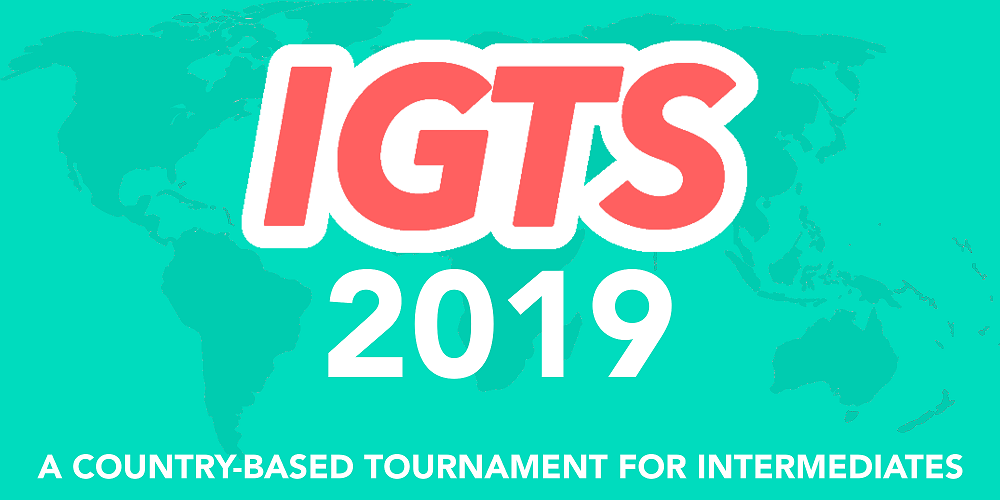

---
tags:
  - IGTS 2019
  - IGTS
  - GTS
outdated: true
---

# Intermediate Global Taiko Showdown 2019

O **Intermediate Global Taiko Showdown 2019** (***IGTS 2019***) foi um torneio 2 vs 2, de eliminação dupla e baseado em países, organizado por ![][flag_JP] [Briesmas](https://osu.ppy.sh/users/2865172) e ![][flag_FR] [Kasumii-sama](https://osu.ppy.sh/users/6177263). Essa foi a segunda edição do Intermediate Global Taiko Showdown.

## Cronograma do Torneio

| Evento | Data(s) |
| --: | :-- |
| Período de inscrição | 2019-05-11/2019-05-25 |
| Sorteio de grupos | 2019-06-02 (14:00 UTC) |
| Fase de grupos | 2019-06-08/2019-06-09 |
| Oitavas de final | 2019-06-15/2019-06-22 |
| Quartas de final | 2019-06-22/2019-06-23 |
| Semifinal | 2019-06-29/2019-06-30 |
| Finais | 2019-07-06/2019-07-07 |
| Grande Final | 2019-07-13/2019-07-14 |
| All-Stars | 2019-07-13/2019-07-14 |

## Premiações

| Colocação | Prêmio(s) |
| :-: | :-- |
|  | Badge único do perfil, banner exclusivo do time |
|  | banner exclusivo do time |
|  | banner exclusivo do time |

## Organização

O Intermediate Global Taiko Showdown 2019 foi realizado por vários membros da comunidade, distribuindo diferentes tarefas em diversas responsabilidades.

| Posição | Membro(s) |
| :-- | :-- |
| Administração | ![][flag_JP] [Briesmas](https://osu.ppy.sh/users/2865172), ![][flag_FR] [Kasumii-sama](https://osu.ppy.sh/users/6177263) |
| Seletores de beatmap | ![][flag_MY] [Bedwyr Aorta](https://osu.ppy.sh/users/10875855), ![][flag_DE] [Capu](https://osu.ppy.sh/users/2474015), ![][flag_ID] [Poii](https://osu.ppy.sh/users/7924938) |
| Juízes | ![][flag_BR] [AnonX32](https://osu.ppy.sh/users/2730270), ![][flag_AR] [BossPlays](https://osu.ppy.sh/users/7341471), ![][flag_JP] [Briesmas](https://osu.ppy.sh/users/2865172), ![][flag_DE] [Capu](https://osu.ppy.sh/users/2474015), ![][flag_US] [cheese salad](https://osu.ppy.sh/users/6349821), ![][flag_US] [Edgar\_Figaro](https://osu.ppy.sh/users/6508754), ![][flag_EC] [Gamelan4](https://osu.ppy.sh/users/9856910), ![][flag_DE] [GDLenny](https://osu.ppy.sh/users/8406711), ![][flag_DE] [HiddenDenki](https://osu.ppy.sh/users/6868059), ![][flag_NL] [Krekker](https://osu.ppy.sh/users/8265940), ![][flag_BR] [Lolligerjoj](https://osu.ppy.sh/users/9053338), ![][flag_FR] [Mirthille](https://osu.ppy.sh/users/7548517), ![][flag_DE] [QEpicAce](https://osu.ppy.sh/users/9489153), ![][flag_SG] [Rycy](https://osu.ppy.sh/users/7394522), ![][flag_RU] [Starger](https://osu.ppy.sh/users/3398715), ![][flag_NL] [SpectreSan](https://osu.ppy.sh/users/11310442) |
| Streamers | ![][flag_BR] [AnonX32](https://osu.ppy.sh/users/2730270), ![][flag_AU] [Beat43210](https://osu.ppy.sh/users/5664171), ![][flag_JP] [Briesmas](https://osu.ppy.sh/users/2865172), ![][flag_EC] [Gamelan4](https://osu.ppy.sh/users/9856910), ![][flag_NL] [Krekker](https://osu.ppy.sh/users/8265940), ![][flag_US] [Obvious](https://osu.ppy.sh/users/8770622) |
| Comentaristas | ![][flag_NL] [-omicron](https://osu.ppy.sh/users/11043157), ![][flag_ID] [AnimesLover123](https://osu.ppy.sh/users/7280717), ![][flag_BR] [AnonX32](https://osu.ppy.sh/users/2730270), ![][flag_AU] [Beat43210](https://osu.ppy.sh/users/5664171), ![][flag_US] [Binsu](https://osu.ppy.sh/users/6236911), ![][flag_US] [CaptainEChan](https://osu.ppy.sh/users/9536977), ![][flag_US] [Edgar\_Figaro](https://osu.ppy.sh/users/6508754), ![][flag_EC] [Gamelan4](https://osu.ppy.sh/users/9856910), ![][flag_US] [MyAngelManasa](https://osu.ppy.sh/users/6666316), ![][flag_DE] [QEpicAce](https://osu.ppy.sh/users/9489153), ![][flag_US] [Rukairi](https://osu.ppy.sh/users/6642597), ![][flag_SG] [Rycy](https://osu.ppy.sh/users/7394522), ![][flag_SG] [uchuuj1n](https://osu.ppy.sh/users/9140302) |
| Designers | ![][flag_DE] [Celektus](https://osu.ppy.sh/users/4294993), ![][flag_NL] [Krekker](https://osu.ppy.sh/users/8265940), ![][flag_US] [MyAngelManasa](https://osu.ppy.sh/users/6666316) |
| Estatísticos | ![][flag_FR] [Kasumii-sama](https://osu.ppy.sh/users/6177263), ![][flag_CA] [Leadenginger](https://osu.ppy.sh/users/3799991), ![][flag_GB] [Lno](https://osu.ppy.sh/users/1900787), ![][flag_MY] [Minisora](https://osu.ppy.sh/users/9627666) |
| Tradutores | ![][flag_BR] [AnonX32](https://osu.ppy.sh/users/2730270), ![][flag_KR] [BamgoeSN](https://osu.ppy.sh/users/1152851), ![][flag_JP] [Briesmas](https://osu.ppy.sh/users/2865172), ![][flag_DE] [Capu](https://osu.ppy.sh/users/2474015), ![][flag_EC] [Gamelan4](https://osu.ppy.sh/users/9856910), ![][flag_JP] [Noko\_BSF](https://osu.ppy.sh/users/3811831), ![][flag_SG] [Rycy](https://osu.ppy.sh/users/7394522), ![][flag_RU] [Starger](https://osu.ppy.sh/users/3398715), ![][flag_HK] [tkdLolly](https://osu.ppy.sh/users/9035344), ![][flag_JP] [Toorun12](https://osu.ppy.sh/users/10349712) |
| Wiki | ![][flag_ID] [Naruk](https://osu.ppy.sh/users/7100002) |
| Desenvolvedor do Pick'em | ![][flag_DE] [hallowatcher](https://osu.ppy.sh/users/1874761) |

## Links

- [Página de discussão](https://osu.ppy.sh/community/forums/topics/906298)
- [Server do Discord do IGTS](https://discord.gg/a6PzzFz)
- [Canal de transmissão](https://www.twitch.tv/igtsosu)
- [Website do Pick'em](https://pickem.hwchr.com/tournaments/8)
- [Suportes do Challonge](https://challonge.com/dqq46siu)
- **[Página de estatísticas](https://docs.google.com/spreadsheets/d/1B_upGgX4mSHpWkvWLrfFRAakPKP77Wm_fDsoU1y3kyY/edit?usp=sharing)**

---

## Participantes

|  | País | Membros |
| :-: | :-: | :-- |
| ![][flag_DE] | **Alemanha** | **[Heam](https://osu.ppy.sh/users/4705120)**, [mulraf](https://osu.ppy.sh/users/1309242), [SarahIsWeird](https://osu.ppy.sh/users/11694604), [Felicia Yuuki](https://osu.ppy.sh/users/10098927) |
| ![][flag_AR] | **Argentina** | **[\_MMMMMM\_MMMMMM\_](https://osu.ppy.sh/users/8959673)**, [Sikei-](https://osu.ppy.sh/users/1543133), [ChronosRark1st](https://osu.ppy.sh/users/12020859), [Kliu](https://osu.ppy.sh/users/7409391) |
| ![][flag_AU] | **Austrália** | **[soliderror](https://osu.ppy.sh/users/10630542)**, [Olympyss](https://osu.ppy.sh/users/10654844), [andescot](https://osu.ppy.sh/users/8580085), [blakeando](https://osu.ppy.sh/users/11998322) |
| ![][flag_BR] | **Brasil** | **[caaiomc](https://osu.ppy.sh/users/5206883)**, [guga2013](https://osu.ppy.sh/users/6035768), [Matsuoka-kun](https://osu.ppy.sh/users/3786541), [Kannes](https://osu.ppy.sh/users/10821432), [-Nozomi Tojo](https://osu.ppy.sh/users/8024582) |
| ![][flag_CA] | **Canadá** | **[stravant](https://osu.ppy.sh/users/8887646)**, [xenogloss](https://osu.ppy.sh/users/12404211), [Dashthehedgehog](https://osu.ppy.sh/users/13261014), [Noahh](https://osu.ppy.sh/users/11838293) |
| ![][flag_CL] | **Chile** | **[-NaNdo-](https://osu.ppy.sh/users/1934382)**, [joako 321](https://osu.ppy.sh/users/4450549), [SrPotato](https://osu.ppy.sh/users/4276807), [Takeshi Hiroshi](https://osu.ppy.sh/users/6109711), [nypd](https://osu.ppy.sh/users/77918) |
| ![][flag_CN] | **China** | **[Nisoquo](https://osu.ppy.sh/users/12345370)**, [Flandre sca](https://osu.ppy.sh/users/10324309), [Dusat](https://osu.ppy.sh/users/11019434), [Evil Ryu](https://osu.ppy.sh/users/10130639) |
| ![][flag_CO] | **Colômbia** | **[Diomedes Daza](https://osu.ppy.sh/users/8950184)**, [Juanisimo](https://osu.ppy.sh/users/9050875), [KaledOSU](https://osu.ppy.sh/users/10828332) |
| ![][flag_KR] | **Coréia do Sul** | **[Civil oath](https://osu.ppy.sh/users/3216107)**, [MuangMuangE](https://osu.ppy.sh/users/3752338), [Hoshikuz](https://osu.ppy.sh/users/9892196), [Endroll](https://osu.ppy.sh/users/1399551) |
| ![][flag_DK] | **Dinamarca** | **[Axewu](https://osu.ppy.sh/users/4776228)**, [raser1234](https://osu.ppy.sh/users/2527887) |
| ![][flag_EC] | **Equador** | **[-Anmi-](https://osu.ppy.sh/users/7857559)**, [Etsu](https://osu.ppy.sh/users/3442319), [Mik3gam3r7919](https://osu.ppy.sh/users/10570577) |
| ![][flag_US] | **Estados Unidos A** | **[Swovine](https://osu.ppy.sh/users/6666316)**, [Cychloryn](https://osu.ppy.sh/users/6921736), [Stan GFriend](https://osu.ppy.sh/users/1773605), [InsaneToe](https://osu.ppy.sh/users/6389252), [kb131313](https://osu.ppy.sh/users/11229259) |
| ![][flag_US] | **Estados Unidos B** | **[Binsu](https://osu.ppy.sh/users/6236911)**, [Slav Man](https://osu.ppy.sh/users/11612235), [White Axl](https://osu.ppy.sh/users/12334307), [Tsred](https://osu.ppy.sh/users/2737667), [Carlohman1](https://osu.ppy.sh/users/12212290) |
| ![][flag_PH] | **Filipinas** | **[Yron8](https://osu.ppy.sh/users/1537747)**, [FinnB](https://osu.ppy.sh/users/2164993), [Tropixal](https://osu.ppy.sh/users/8085222), [jacarandang](https://osu.ppy.sh/users/4154069), [FPxOsu](https://osu.ppy.sh/users/3845828) |
| ![][flag_FI] | **Finlândia** | **[\[Otto\]](https://osu.ppy.sh/users/5049430)**, [Zoel](https://osu.ppy.sh/users/7289244), [SSieni](https://osu.ppy.sh/users/2402008), [Wanderful](https://osu.ppy.sh/users/3386674), [Kuromiyaa](https://osu.ppy.sh/users/12811744) |
| ![][flag_FR] | **França A** | **[Ladylag](https://osu.ppy.sh/users/2812098)**, [Kaho-Hinata](https://osu.ppy.sh/users/8903888), [Musclor](https://osu.ppy.sh/users/9637676), [Mimir](https://osu.ppy.sh/users/7382734), [Ladybug](https://osu.ppy.sh/users/4833654) |
| ![][flag_FR] | **França B** | **[Lyseria-Miku](https://osu.ppy.sh/users/8972795)**, [kamaboko117](https://osu.ppy.sh/users/9508031), [Heartswimm](https://osu.ppy.sh/users/10936319), [Panda\_0ne](https://osu.ppy.sh/users/11216472) |
| ![][flag_GR] | **Grécia** | **[- VayKay -](https://osu.ppy.sh/users/2559954)**, [KagamineAmy](https://osu.ppy.sh/users/8744228) |
| ![][flag_NL] | **Holanda** | **[lukitsa124](https://osu.ppy.sh/users/8787678)**, [Mr HeliX](https://osu.ppy.sh/users/2330619), [Swerro](https://osu.ppy.sh/users/4507667) |
| ![][flag_HK] | **Hong Kong** | **[Brown918](https://osu.ppy.sh/users/9805760)**, [\[\_isolated\_\]](https://osu.ppy.sh/users/6187838), [ZinerX](https://osu.ppy.sh/users/9841478), [shikuro\_re](https://osu.ppy.sh/users/9338943) |
| ![][flag_ID] | **Indonésia A** | **[Reed\_405](https://osu.ppy.sh/users/9965069)**, [Viewland](https://osu.ppy.sh/users/6250135), [Moka-san](https://osu.ppy.sh/users/1612606) |
| ![][flag_ID] | **Indonésia B** | **[LoliVoiceASMR](https://osu.ppy.sh/users/12517831)**, [eltiras](https://osu.ppy.sh/users/6720962), [Kzl](https://osu.ppy.sh/users/7058490), [Lisieux-](https://osu.ppy.sh/users/13795552) |
| ![][flag_IE] | **Irlanda** | **[Kawaii-lili](https://osu.ppy.sh/users/13816802)**, [-WizardyNinja-](https://osu.ppy.sh/users/2607778) |
| ![][flag_JP] | **Japão** | **[RinNatsume1013](https://osu.ppy.sh/users/9022173)**, [tkpnender](https://osu.ppy.sh/users/12682785), [AILK](https://osu.ppy.sh/users/1212491), [mukuchan](https://osu.ppy.sh/users/9007431), [JPN](https://osu.ppy.sh/users/9122742) |
| ![][flag_MX] | **México** | **[\[ Croqueto \]](https://osu.ppy.sh/users/1705608)**, [L\_CORTES\_01](https://osu.ppy.sh/users/12548363), [Darkside550](https://osu.ppy.sh/users/7320933), [GusPaloalto](https://osu.ppy.sh/users/13348305) |
| ![][flag_PE] | **Peru** | **[Spieler_Sync](https://osu.ppy.sh/users/10659299)**, [adriancaba](https://osu.ppy.sh/users/11543837) |
| ![][flag_PL] | **Polônia A** | **[BeatGoat](https://osu.ppy.sh/users/11308471)**, [C O L L A P S E](https://osu.ppy.sh/users/12042993), [Lama-aka-EMi](https://osu.ppy.sh/users/9148286), [Moonie Wolf](https://osu.ppy.sh/users/7070461) |
| ![][flag_PL] | **Polônia B** | **[Deroo](https://osu.ppy.sh/users/8360475)**, [Konrad20050](https://osu.ppy.sh/users/8966140), [Lastminute7](https://osu.ppy.sh/users/7121313), [Bowashe](https://osu.ppy.sh/users/2163544) |
| ![][flag_GB] | **Reino Unido** | **[hammygames](https://osu.ppy.sh/users/12232503)**, [Livvo](https://osu.ppy.sh/users/8884687), [ChicagoTed7172](https://osu.ppy.sh/users/2948139), [Olii](https://osu.ppy.sh/users/7683305) |
| ![][flag_SG] | **Singapura** | **[uchuuj1n](https://osu.ppy.sh/users/9140302)**, [RundownPaper4](https://osu.ppy.sh/users/5349769), [C5H10](https://osu.ppy.sh/users/7003484) |
| ![][flag_CH] | **Suíça** | **[HardNeper](https://osu.ppy.sh/users/9776256)**, [basti78](https://osu.ppy.sh/users/28222), [- DustyFlow -](https://osu.ppy.sh/users/824415), [-Shizue-](https://osu.ppy.sh/users/12819177) |
| ![][flag_TW] | **Taiwan** | **[- DeveRUX -](https://osu.ppy.sh/users/2900875)**, [Dviler](https://osu.ppy.sh/users/10838779), [ipad\_siri](https://osu.ppy.sh/users/9930377), [NaleYuar](https://osu.ppy.sh/users/6701207), [Twinlight](https://osu.ppy.sh/users/9693274) |

### Grupos

| Grupo | Top Seed | High Seed | Low Seed | Unseeded |
| :-: | :-- | :-- | :-- | :-- |
| **A** | ![][flag_TW] Taiwan | ![][flag_ID] Indonésia A | ![][flag_DE] Alemanha | ![][flag_FI] Finlândia |
| **B** | ![][flag_PL] Polônia A | ![][flag_PH] Filipinas | ![][flag_CH] Suíça | ![][flag_GR] Grécia |
| **C** | ![][flag_JP] Japão | ![][flag_AU] Austrália | ![][flag_EC] Equador | ![][flag_FR] França B |
| **D** | ![][flag_KR] Coréia do Sul | ![][flag_FR] França A | ![][flag_NL] Holanda | ![][flag_SG] Singapura |
| **E** | ![][flag_US] Estados Unidos B | ![][flag_MX] México | ![][flag_AR] Argentina | ![][flag_GB] Reino Unido |
| **F** | ![][flag_US] Estados Unidos A | ![][flag_CN] China | ![][flag_CA] Canadá | ![][flag_DK] Dinamarca |
| **G** | ![][flag_BR] Brasil | ![][flag_CL] Chile | ![][flag_ID] Indonésia B | ![][flag_PE] Peru |
| **H** | ![][flag_HK] Hong Kong | ![][flag_PL] Polônia B | ![][flag_CO] Colômbia | ![][flag_IE] Irlanda |

---

## Pódio

Essa competição chegou ao fim e resultou no seguinte pódio:

| Colocação | Time |
| :-: | :-- |
|  | ![][flag_HK] Hong Kong |
|  | ![][flag_US] Estados Unidos A |
|  | ![][flag_CL] Chile |

---

## Mappools

### All-Stars Battle Royale

**[Baixe o pacote de mapas aqui! (73 MB)](https://mega.nz/#!HXByya4R!moeuOzFnwhOC5Ja2YqXWRY-dE5YYbMyR2jNGmnC2wpg)**

- NoMod
  - [Silent Siren - Merry-Go-Round (hoku-4625) \[Shallty-Go-Round\]](https://osu.ppy.sh/beatmapsets/751585#taiko/1612301)
  - [dj TAKA - RAIN (Ak1o) \[Ak1oni\]](https://osu.ppy.sh/beatmapsets/881815#taiko/1843675)
- Hidden
  - [siromaru + cranky - conflict (Midnaait) \[komasy's Oni\]](https://osu.ppy.sh/beatmapsets/926839#taiko/1935852)
  - [TERRA - REVOLUTION (TKS) \[MASTER\]](https://osu.ppy.sh/beatmapsets/106822#taiko/280302)
- HardRock
  - [Se-U-Ra - The Endless for Traveler (ZethZ161) \[Oni\]](https://osu.ppy.sh/beatmapsets/692388#taiko/1467210)
  - [Dirty Androids - Seaside Labyrinth (MMzz) \[Inner Oni\]](https://osu.ppy.sh/beatmapsets/687541#taiko/1454920)
- DoubleTime
  - [Nyanners - Gucci Gang (Nifty) \[Uguuci Gang\]](https://osu.ppy.sh/beatmapsets/710007#taiko/1500870)
  - [Kola Kid - a whole lotta Kola Kid songs (Raphalge) \[good old times\]](https://osu.ppy.sh/beatmapsets/607839#taiko/1283783)
- FreeMod
  - [Ushirokara Haiyoritai G - Taiyou Iwaku Moeyo Chaos (An-bootleg) (Nifty) \[Ooh! Nya!\]](https://osu.ppy.sh/beatmapsets/779307#taiko/1636526)
  - [Oxblud+ - the littlest things [Kesu+ Audio Scribble] (Vulkin) \[ulqui's inner oni\]](https://osu.ppy.sh/beatmapsets/579166#taiko/1755465)
- EX
  - [DROELOE - Limbo (Ulqui) \[Space Distortion\]](https://osu.ppy.sh/beatmapsets/831958#taiko/1743082)
  - [SEVENTH SISTERS - SEVENTH HAVEN (Mtell Remix) (Shallty) \[1st Sister Shallty\]](https://osu.ppy.sh/beatmapsets/829545#taiko/1737946)

### All-Stars

**[Baixe o pacote de mapas aqui! (84 MB)](https://mega.nz/#!iPAgxSpD!oZW07szzXj13W884z3zzw_6II2R8uqu1aWP22yxy8Vo)**

- NoMod
  - [Yuyoyuppe - AiAe (asuasu\_yura) \[Inner Oni\]](https://osu.ppy.sh/beatmapsets/447734#taiko/961162)
  - [ENNNN - Nightfall (DarkVortex) \[Oni\]](https://osu.ppy.sh/beatmapsets/655932#taiko/1389903)
  - [Zetsubou Shoujotachi - Zetsubou Restaurant (TV Size) (Capu) \[Inner Oni\]](https://osu.ppy.sh/beatmapsets/869002#taiko/1816218)
- Hidden
  - [Shiron + Kofu x Morimori Atsushi to Teikyo de okuri shimasu - Demise Quartet (Aras25) \[Ozzy's Oni\]](https://osu.ppy.sh/beatmapsets/463431#taiko/1016241)
  - [Rabpit - Sanctity (tsuka) \[Taiko\]](https://osu.ppy.sh/beatmapsets/50017#taiko/161503)
  - [t+pazolite - Candy Crack Curtain Call (tasuke912) \[Oni\]](https://osu.ppy.sh/beatmapsets/237272#taiko/928806)
- HardRock
  - [KNOWER - Overtime (Zetera) \[Onitime\]](https://osu.ppy.sh/beatmapsets/927890#taiko/1938084)
  - [Nekomata Master+ - POINT ZERO (Nyan) \[Taiko Oni\]](https://osu.ppy.sh/beatmapsets/303883#taiko/680908)
  - [TOMOSUKE x Jazzin'park feat. LANA - Kiroku no Kakera (sasakure.UK Framework Remix) (SKSalt) \[Inner Oni\]](https://osu.ppy.sh/beatmapsets/369059#taiko/808984)
- DoubleTime
  - [Utsu-P & Minatsuki Toka - Natsu Matsuri (DakeDekaane) \[Oni\]](https://osu.ppy.sh/beatmapsets/132262#taiko/487286)
  - [Rainbowdragoneyes - Size My Day (Mew104) \[Muzukashii\]](https://osu.ppy.sh/beatmapsets/224043#taiko/566293)
  - [DAOKO - Daisuki with TeddyLoid (Nifty) \[Oni\]](https://osu.ppy.sh/beatmapsets/707331#taiko/1495773)
- FreeMod
  - [SWAN K feat. Asuka M - LOVE B.B.B (Nakagawa-Kanon) \[Taiko\]](https://osu.ppy.sh/beatmapsets/48537#taiko/150491)
  - [Ice vs. Morimori Atsushi - RE:UNION -Duo Blade Against- (TKS) \[Oni\]](https://osu.ppy.sh/beatmapsets/853408#taiko/1783664)
  - [PSYQUI feat.Such - Raise Your Hands (1rori) \[Future Oni\]](https://osu.ppy.sh/beatmapsets/883358#taiko/1846592)
- EX
  - [tofubeats - CANDYYYLAND feat. LIZ (Pa's Lam System Remix) (Myckoll) \[Myruki's Sweet\]](https://osu.ppy.sh/beatmapsets/724269#taiko/1529288)
  - [polysha - The Golden Era (Silentroom Remix) (EdamaMe411) \[TJBC#8\]](https://osu.ppy.sh/beatmapsets/844391#taiko/1766363)
  - [doth - Toy Boxxxx (Sayaka-) \[Oni\]](https://osu.ppy.sh/beatmapsets/380854#taiko/833267)
- Tiebreaker
  - **[Kano - Stella-rium(DJ Noriken Bootleg Remix) (thika1432) \[Taiko Collab\]](https://osu.ppy.sh/beatmapsets/479881#taiko/1084587)**

### Grande Final

**[Baixe o pacote de mapas aqui! (72 MB)](https://puu.sh/DPMoR/9704e02686.rar)**

- NoMod
  - [xi - Blue Zenith (Capu) \[Oni\]](https://osu.ppy.sh/beatmapsets/971982#taiko/2035965)
  - [Virt - Staring at my Spaceship (HashishKabob) \[Taiko Oni\]](https://osu.ppy.sh/beatmapsets/57145#taiko/172402)
  - [Umeboshi Chazuke - Bison Charge (Midnaait) \[hikiko's Oni\]](https://osu.ppy.sh/beatmapsets/739116#taiko/1598892)
  - [DIVERSA - atlas (Ulqui) \[Skull Kid's Oni\]](https://osu.ppy.sh/beatmapsets/875591#taiko/2002994)
  - [wa. vs ETIA. - Akasagarbha (\_DUSK\_) \[Oni\]](https://osu.ppy.sh/beatmapsets/709333#taiko/1499438)
  - [lapix - Kill The Beat (Nofool) \[Special Oni\]](https://osu.ppy.sh/beatmapsets/891525#taiko/1863761)
- Hidden
  - [Sana - Hoshifuri (TKS) \[Oni\]](https://osu.ppy.sh/beatmapsets/195958#taiko/464760)
  - [RoughSketch + DD"Nakata"Metal - Booths of Fighters (-Kazu-) \[EXHAUST\]](https://osu.ppy.sh/beatmapsets/185427#taiko/443331)
- HardRock
  - [Memme - Starving Days (Charles445) \[Oni445\]](https://osu.ppy.sh/beatmapsets/157641#taiko/385907)
  - [xi - Longinus (Faputa) \[Oni\]](https://osu.ppy.sh/beatmapsets/963975#taiko/2018178)
- DoubleTime
  - [cYsmix - Dovregubben's Hall (Raiden) [Oni]](https://osu.ppy.sh/beatmapsets/363214#taiko/797639)
  - [Anamanaguchi - Miku ft. Hatsune Miku (Nightcore Mix) (Backfire) \[Lyawi's Oni\]](https://osu.ppy.sh/beatmapsets/886962#taiko/1854203)
- FreeMod
  - [Amane - DEADLYBLOW (Yoshi\_green) \[TK's Oni\]](https://osu.ppy.sh/beatmapsets/100155#taiko/327561)
  - [SOOOO - Raven Haven (Raiden) \[Oni\]](https://osu.ppy.sh/beatmapsets/921535#taiko/1925777)
  - [DJ Fresh - Gold Dust (Vyiuri) \[Oni\]](https://osu.ppy.sh/beatmapsets/981799#taiko/2054840)
- Tiebreaker
  - **[Yooh - Shigure (Karee Pan) \[Blue\]](https://osu.ppy.sh/beatmapsets/656246#taiko/1390464)**

### Finais

**[Baixe o pacote de mapas aqui! (91 MB)](https://puu.sh/DMtYB/f84ce587b2.rar)**

- NoMod
  - [Reol - Gigantic O.T.N (snowball112) \[Oni\]](https://osu.ppy.sh/beatmapsets/434182#taiko/937232)
  - [Shiokara-zu - Shiokara-Bushi (Skull Kid) \[Oni\]](https://osu.ppy.sh/beatmapsets/517401#taiko/1099368)
  - [ITO KASHITARO - Yuudachi no Ribbon (Prophecy) \[Oni\]](https://osu.ppy.sh/beatmapsets/831573#taiko/1743336)
  - [be5moti - Trahison (houraizin) \[Oni\]](https://osu.ppy.sh/beatmapsets/833305#taiko/1745535)
  - [Sota Fujimori - polygon (Fallmorph) \[Fapu's Oni\]](https://osu.ppy.sh/beatmapsets/721297#taiko/1628101)
  - [(Seiryu) - AO-INFINITY (Nofool) \[Oni\]](https://osu.ppy.sh/beatmapsets/869505#taiko/1824962)
- Hidden
  - [Memme - Unison System (Love) \[Oni\]](https://osu.ppy.sh/beatmapsets/185198#taiko/442943)
  - [40mP feat. Chano - Yuugure One Room (yuzu\_\_rinrin) \[Oni\]](https://osu.ppy.sh/beatmapsets/469504#taiko/1004024)
- HardRock
  - [Mili - Summoning 101 (Dellvangel) \[Oni\]](https://osu.ppy.sh/beatmapsets/804107#taiko/1687872)
  - [MY FIRST STORY - Fukagyaku Replace (Broccoly) \[qoot8123's Oni\]](https://osu.ppy.sh/beatmapsets/383270#taiko/896262)
- DoubleTime
  - [Hanatan - Sarishinohara (Capu) \[Oni\]](https://osu.ppy.sh/beatmapsets/886776#taiko/1853891)
  - [Yunomi with Momobako&miko - Soumatou Labyrinth (komasy) \[Muzukashii\]](https://osu.ppy.sh/beatmapsets/625493#taiko/1319575)
- FreeMod
  - [MitiS - Pain (Original Mix) (game rock) \[Oni\]](https://osu.ppy.sh/beatmapsets/680259#taiko/1438414)
  - [Ocelot - TSUBAKI (TKS) \[Oni\]](https://osu.ppy.sh/beatmapsets/177838#taiko/427931)
  - [Orange Lounge - Les filles balancent (Zetera) \[Oni\]](https://osu.ppy.sh/beatmapsets/684224#taiko/1448036)
- Tiebreaker
  - **[EGOIST - The Everlasting Guilty Crown (JUDYDANNY) \[Taiko Crown\]](https://osu.ppy.sh/beatmapsets/658600#taiko/1430707)**

### Semifinal

**[Baixe o pacote de mapas aqui! (93 MB)](https://mega.nz/#!WwlilCBT!o9-f_FKiAmjCTBs3UEs-JW6Hl8F0ni-ZFH47SROQ42E)**

- NoMod
  - [Buta-Otome - Towa no Maigo (404 AccNotFound) \[Oni\]](https://osu.ppy.sh/beatmapsets/622175#taiko/1317865)
  - [Colorful Sounds Port - ETERNAL DRAIN (zigizigiefe) \[Oni\]](https://osu.ppy.sh/beatmapsets/692110#taiko/1464636)
  - [Zekk - Sugary Daydream (Jaye) \[Lite Oni\]](https://osu.ppy.sh/beatmapsets/708322#taiko/1513610)
  - [Halogen - U Got That (Camellia's Neurofunk Bootleg) (zhu) \[Fapu's Oni\]](https://osu.ppy.sh/beatmapsets/936772#taiko/1958124)
  - [Pokota and Hanatan - Aa, Subarashiki Nyansei (Bedwyr Aorta) \[Teru's Oninyan (IGTS ver.)\]](https://osu.ppy.sh/beatmapsets/992200#taiko/2075012)
  - [aran - Xperanza (Ulqui) \[Oni\]](https://osu.ppy.sh/beatmapsets/800399#taiko/1755536)
- Hidden
  - [Dzeko & Torres - L'Amour Toujours feat. Delaney Jane (Nightcore Mix) (Rhytoly) \[Oni\]](https://osu.ppy.sh/beatmapsets/890586#taiko/1871013)
  - [Se-U-Ra - The Endless for Traveler (ZethZ161) \[Muzukashii\]](https://osu.ppy.sh/beatmapsets/692388#taiko/1467259)
- HardRock
  - [TAMAONSEN - Touhou Tanoshii feat. Matsu (Alwaysyukaz) \[Oni\]](https://osu.ppy.sh/beatmapsets/804456#taiko/1688737)
  - [Silver Forest feat.Aki - Yami no Mahou Shoujo (\[Belajar-Osu\]) \[Yami no Oni\]](https://osu.ppy.sh/beatmapsets/873256#taiko/1825490)
- DoubleTime
  - [GigaP feat. GUMI, KYO - Ooedo Ranvu (snowball112) \[Muzukashii\]](https://osu.ppy.sh/beatmapsets/345381#taiko/762900)
  - [Yura Hatsuki x Seraph - Le Rouge et le Noir (-Tenshi-) \[Nardo's Muzukashii\]](https://osu.ppy.sh/beatmapsets/365971#taiko/823246)
- FreeMod
  - [7 Sequence x M2U - Megaburn (JUDYDANNY) \[JuDa's Oni (IGTS ver.)\]](https://osu.ppy.sh/beatmapsets/991638#taiko/2073824)
  - [Itou Kashitarou x Ron - Soushi Souai (newyams99) \[Oni\]](https://osu.ppy.sh/beatmapsets/635203#taiko/1347899)
  - [Krewella X DISKORD - Beggars (Consouls Remix) (-omicron) \[Remus' Oni (IGTS ver.)\]](https://osu.ppy.sh/beatmapsets/991642#taiko/2073828)
- Tiebreaker
  - **[Culprate & Joe Ford - Gaucho (vrnl) \[Kqrth's Oni\]](https://osu.ppy.sh/beatmapsets/937645#taiko/1960216)**

### Quartas de final

**[Baixe o pacote de mapas aqui! (80 MB)](https://mega.nz/#!2xlzGaDY!hXiqsiHh2U0iooB_5a0wnplYUC72is9m-3ifIYzaXgw)**

- NoMod
  - [Dreamcatcher - Chase Me (-omicron) \[Jaye's Lite Oni (IGTS ver.)\]](https://osu.ppy.sh/beatmapsets/987174#taiko/2065074)
  - [Frederic - Kanashii Ureshii (Nifty) \[Ayyri's Oni\]](https://osu.ppy.sh/beatmapsets/640443#taiko/1490351)
  - [Camellia as "fluX Xroise" - Xronier (Felt7z) \[Muzukashii\]](https://osu.ppy.sh/beatmapsets/925700#taiko/1966652)
  - [Chroma - Goodbye-bye Planet (butter0414) \[Oni\]](https://osu.ppy.sh/beatmapsets/694474#taiko/1469258)
  - [onumi - REGRET PART TWO (Ulqui) \[muzukashii\]](https://osu.ppy.sh/beatmapsets/912552#taiko/1908118)
- Hidden
  - [LukHash - MIDNIGHT LIGHTS (-omicron) \[Fleure De Lapin's Oni (IGTS ver.)\]](https://osu.ppy.sh/beatmapsets/987825#taiko/2066572)
  - [TangJuan vs Black Box - Xetta (\_DUSK\_) \[Muzukashii\]](https://osu.ppy.sh/beatmapsets/819907#taiko/1718985)
- HardRock
  - [Nekomata Master - Moffing (Tasha) \[MM's Oni\]](https://osu.ppy.sh/beatmapsets/104880#taiko/283871)
  - [turdl3 - Lunatic Peels \~ Invisible Full Net (Midnaait) \[Muzukashii\]](https://osu.ppy.sh/beatmapsets/968108#taiko/2025848)
- DoubleTime
  - [ClariS - Diary (captin1) \[Muzukashii\]](https://osu.ppy.sh/beatmapsets/156168#taiko/382737)
  - [ClariS - Surely (JUDYDANNY) \[Oni\]](https://osu.ppy.sh/beatmapsets/170359#taiko/412493)
- FreeMod
  - [DJ S3RL - T-T-Techno (feat. Jesskah) (nold\_1702) \[Oni\]](https://osu.ppy.sh/beatmapsets/83560#taiko/586601)
  - [MY FIRST STORY - Missing You (-Sh1n1-) \[Oni\]](https://osu.ppy.sh/beatmapsets/869178#taiko/1816549)
  - [Ice vs. Morimori Atsushi - RE:UNION -Duo Blade Against- (Capu) \[Muzukashii\]](https://osu.ppy.sh/beatmapsets/973031#taiko/2037090)
- Tiebreaker
  - **[Liz Triangle - past lover (Realazy) \[Lost Oni\]](https://osu.ppy.sh/beatmapsets/608260#taiko/1284600)**

### Oitavas de final

**[Baixe o pacote de mapas aqui! (80 MB)](https://mega.nz/#!WSYUBY4Y!Hts6mX8TLvWtnolG42GhHyBQOHzM0lvMaBg8V0x_vDY)**

- NoMod
  - [Yuuyu - Scrap Syndrome (Short cut.) (Nwolf) \[Oni\]](https://osu.ppy.sh/beatmapsets/261311#taiko/596741)
  - [Akiyama Uni - Odoru Mizushibuki (Yumyum-) \[Oni\]](https://osu.ppy.sh/beatmapsets/924849#taiko/1932871)
  - [REDALiCE - Always TANO\*C (Kobaryo's FTN-Remix) (yea) \[jyake's Muzukashii\]](https://osu.ppy.sh/beatmapsets/690365#taiko/1482770)
  - [I SEE MONSTAS - Holdin On (Skrillex and Nero Remix) (QEpicAce) \[Surono's Oni (IGTS ver.)\]](https://osu.ppy.sh/beatmapsets/984425#taiko/2059807)
  - [The Flashbulb - Creep (Greenshell) \[Volta's Muzukashii\]](https://osu.ppy.sh/beatmapsets/966087#taiko/2054858)
- Hidden
  - [lapix - Nexta (TKS) \[Muzukashii\]](https://osu.ppy.sh/beatmapsets/726669#taiko/1549620)
  - [xi - Bad Elixir (\_DUSK\_) \[Muzukashii\]](https://osu.ppy.sh/beatmapsets/937808#taiko/1959373)
- HardRock
  - [Furries in a Blender - Storm World (OzzyOzrock) \[Muzukashii\]](https://osu.ppy.sh/beatmapsets/319805#taiko/711730)
  - [Feryquitous (Vo.Sennzai) - Koe (SKSalt) \[Muzukashii\]](https://osu.ppy.sh/beatmapsets/933777#taiko/1968634)
- DoubleTime
  - [U - Hi-Fi day (qoot8123) \[Oni\]](https://osu.ppy.sh/beatmapsets/285279#taiko/644393)
  - [ONE OK ROCK - Mighty Long Fall (Chromoxx) \[Muzukashii\]](https://osu.ppy.sh/beatmapsets/578492#taiko/1225108)
- FreeMod
  - [Kana Nishino - Sweet Dreams (11t dnb mix) (asuasu\_yura) \[Muzukashii\]](https://osu.ppy.sh/beatmapsets/684455#taiko/1459567)
  - [Nekomata Master - Izanami no nageki (HiroK) \[Coryn's Muzukashii\]](https://osu.ppy.sh/beatmapsets/835429#taiko/1760172)
  - [Pierce The Veil - She Sings In The Morning (puxtu) \[Vulkin's Muzukashii\]](https://osu.ppy.sh/beatmapsets/393110#taiko/1007023)
- Tiebreaker
  - **[RIOT - Overkill (Capu) \[Oni\]](https://osu.ppy.sh/beatmapsets/984743#taiko/2060444)**

### Fase de grupos

**[Baixe o pacote de mapas aqui! (81 MB)](https://mega.nz/#!uKBU1QbB!kFcNmKfvD8BPwchJ0YzcjH2Esf57g20iMq1PI58Ry7I)**

- NoMod
  - [An - TearVid (Kokatsu) \[Muzukashii\]](https://osu.ppy.sh/beatmapsets/79647#taiko/222678)
  - [dj TAKA - Liberation (rango) \[Yachiyo's Oni\]](https://osu.ppy.sh/beatmapsets/955818#taiko/1996686)
  - [Lon - Yuru Fuwa Jukai Girl (Love) \[Muzukashii\]](https://osu.ppy.sh/beatmapsets/123810#taiko/315971)
  - [PSYQUI - Architect (Nifty) \[Muzukashii\]](https://osu.ppy.sh/beatmapsets/874516#taiko/1828312)
- Hidden
  - [Momokurotei Ichimon - Nippon Egao Hyakkei (Kite) \[Yia's Muzukashii\]](https://osu.ppy.sh/beatmapsets/59569#taiko/179782)
  - [The Flashbulb - Lawn Wake III (Midnaait) \[Muzukashii\]](https://osu.ppy.sh/beatmapsets/458068#taiko/982978)
- HardRock
  - [SOUND HOLIC Feat. Nana Takahashi - XINOBIKILL (HiroK) \[Muzukashii\]](https://osu.ppy.sh/beatmapsets/744214#taiko/1569197)
  - [Buta-Otome - Mamanaranai (Karee Pan) \[Muzukashii\]](https://osu.ppy.sh/beatmapsets/722051#taiko/1524527)
- DoubleTime
  - [BLACKPINK - AS IF IT'S YOUR LAST (QEpicAce) \[Blackener's Muzukashii (IGTS ver.)\]](https://osu.ppy.sh/beatmapsets/980788#taiko/2052592)
  - [Team "Hanayamata" - Hana wa Odore ya Irohaniho (kjwkjw) \[Muzukashii\]](https://osu.ppy.sh/beatmapsets/215845#taiko/506832)
- FreeMod
  - [GigaP feat. kradness - Senbonzakura (Soldsaga KunG) \[Muzukashii\]](https://osu.ppy.sh/beatmapsets/186878#taiko/453439)
  - [Nanamori-chu \* Goraku-bu - Happy Time wa Owaranai (eiri-) \[Muzukashii\]](https://osu.ppy.sh/beatmapsets/773330#taiko/1625589)
  - [lapix - Future Raver feat. Numb'n'dub (Arrival) \[Muzukashii\]](https://osu.ppy.sh/beatmapsets/963997#taiko/2024239)
- Tiebreaker
  - **[USAO - Chrono Diver -PENDULUMs- (USAO remix) (QEpicAce) \[-Jordan-'s Muzukashii (IGTS ver.)\]](https://osu.ppy.sh/beatmapsets/980250#taiko/2051403)**

---

## Resultados das partidas

### Grande Final

| Sábado, 2019-07-13 |  |  |  |  |
| --: | :-: | :-: | :-- | :-- |
| Estados Unidos A ![][flag_US] | 5 | **7** | ![][flag_HK] **Hong Kong** | [#1](https://osu.ppy.sh/community/matches/53299127) |
| **Hong Kong** ![][flag_HK] | **7** | 4 | ![][flag_US] Estados Unidos A | [#1](https://osu.ppy.sh/community/matches/53300693) |

### Finais

| Sábado, 2019-07-06 |  |  |  |  |
| --: | :-: | :-: | :-- | :-- |
| **Hong Kong** ![][flag_HK] | **7** | 2 | ![][flag_FR] França A | [#1](https://osu.ppy.sh/community/matches/53143747) |
| **Estados Unidos A** ![][flag_US] | **7** | 3 | ![][flag_CL] Chile | [#1](https://osu.ppy.sh/community/matches/53159685) |

| Domingo, 2019-07-07 |  |  |  |  |
| --: | :-: | :-: | :-- | :-- |
| Chile ![][flag_CL] | 1 | **7** | ![][flag_HK] **Hong Kong** | [#1](https://osu.ppy.sh/community/matches/53162196) |

### Semifinal

| Sábado, 2019-06-29 |  |  |  |  |
| --: | :-: | :-: | :-- | :-- |
| **Estados Unidos A** ![][flag_US] | **7** | 4 | ![][flag_PH] Filipinas | [#1](https://osu.ppy.sh/community/matches/52977372) |
| **Chile** ![][flag_CL] | **7** | 5 | ![][flag_CN] China | [#1](https://osu.ppy.sh/community/matches/52987753) |
| **Hong Kong** ![][flag_HK] | **7** | 1 | ![][flag_AR] Argentina | [#1](https://osu.ppy.sh/community/matches/52987594) |

| Domingo, 2019-06-30 |  |  |  |  |
| --: | :-: | :-: | :-- | :-- |
| **França A** ![][flag_FR] | **7** | 6 | ![][flag_JP] Japão | [#1](https://osu.ppy.sh/community/matches/53005399) |
| Filipinas ![][flag_PH] | 6 | **7** | ![][flag_HK] **Hong Kong** | [#1](https://osu.ppy.sh/community/matches/53005654) |
| China ![][flag_CN] | 1 | **7** | ![][flag_FR] França A | [#1](https://osu.ppy.sh/community/matches/53009063) |

### Quartas de final

| Sábado, 2019-06-22 |  |  |  |  |
| --: | :-: | :-: | :-- | :-- |
| Indonésia A ![][flag_ID] | 0 | **6** | ![][flag_US] **Estados Unidos A** | -win by default- |
| França A ![][flag_FR] | 4 | **6** | ![][flag_PH] **Filipinas** | [#1](https://osu.ppy.sh/community/matches/52814381) |
| **China** ![][flag_CN] | **6** | 2 | ![][flag_TW] Taiwan | [#1](https://osu.ppy.sh/community/matches/52818020) |
| **Chile** ![][flag_CL] | **6** | 1 | ![][flag_SG] Singapura | [#1](https://osu.ppy.sh/community/matches/52820880) |
| Taiwan ![][flag_TW] | 0 | **6** | ![][flag_HK] **Hong Kong** | [#1](https://osu.ppy.sh/community/matches/52820731) |

| Domingo, 2019-06-23 |  |  |  |  |
| --: | :-: | :-: | :-- | :-- |
| Indonésia A ![][flag_ID] | 2 | **6** | ![][flag_JP] **Japão** | [#1](https://osu.ppy.sh/community/matches/52845363) |
| Singapura ![][flag_SG] | 5 | **6** | ![][flag_AR] **Argentina** | [#1](https://osu.ppy.sh/community/matches/52848092) |
| **França A** ![][flag_FR] | **6** | 3 | ![][flag_MX] México | [#1](https://osu.ppy.sh/community/matches/52850794) |

### Oitavas de final

| Sábado, 2019-06-15 |  |  |  |  |
| --: | :-: | :-: | :-- | :-- |
| **China** ![][flag_CN] | **6** | 1 | ![][flag_JP] Japão | [#1](https://osu.ppy.sh/community/matches/52630781) |
| Taiwan ![][flag_TW] | 3 | **6** | ![][flag_PL] **Polônia B** | [#1](https://osu.ppy.sh/community/matches/52636109) |
| **Indonésia A** ![][flag_ID] | **6** | 3 | ![][flag_HK] Hong Kong | [#1](https://osu.ppy.sh/community/matches/52637520) |
| **Filipinas** ![][flag_PH] | **6** | 1 | ![][flag_BR] Brasil | [#1](https://osu.ppy.sh/community/matches/52637498) |
| México ![][flag_MX] | 1 | **6** | ![][flag_SG] **Singapura** | [#1](https://osu.ppy.sh/community/matches/52641017) |
| Argentina ![][flag_AR] | 3 | **6** | ![][flag_FR] **França A** | [#1](https://osu.ppy.sh/community/matches/52644303) |
| Polônia A ![][flag_PL] | 0 | **6** | ![][flag_CL] **Chile** | [#1](https://osu.ppy.sh/community/matches/52647239) |
| **Estados Unidos A** ![][flag_US] | **6** | 0 | ![][flag_EC] Equador | [#1](https://www.twitch.tv/videos/439630298) |

| Domingo, 2019-06-16 |  |  |  |  |
| --: | :-: | :-: | :-- | :-- |
| **Hong Kong** ![][flag_HK] | **6** | 2 | ![][flag_EC] Equador | [#1](https://osu.ppy.sh/community/matches/52657012) |
| Japão ![][flag_JP] | 2 | **6** | ![][flag_TW] **Taiwan** | [#1](https://osu.ppy.sh/community/matches/52661179) |
| Polônia A ![][flag_PL] | 1 | **6** | ![][flag_MX] **México** | [#1](https://osu.ppy.sh/community/matches/52673843) |
| **Argentina** ![][flag_AR] | **6** | 4 | ![][flag_BR] Brasil | [#1](https://osu.ppy.sh/community/matches/52676942) |

| Sábado, 2019-06-22 |  |  |  |  |
| --: | :-: | :-: | :-- | :-- |
| **Taiwan** ![][flag_TW] | **6** | 1 | ![][flag_PL] Polônia B | [#1](https://osu.ppy.sh/community/matches/52815977) |
| **Japão** ![][flag_JP] | **6** | 0 | ![][flag_PL] Polônia B | -win by default- |

### Fase de grupos

| Groupo | Sábado, 2019-06-08 |  |  |  |  |
| :-: | --: | :-: | :-: | :-- | :-- |
| F3 | **Estados Unidos A** ![][flag_US] | **5** | 0 | ![][flag_CN] China | [#1](https://osu.ppy.sh/community/matches/52446671) |
| G5 | Peru ![][flag_PE] | 0 | **5** | ![][flag_CL] **Chile** | [#1](https://osu.ppy.sh/community/matches/52446788) |
| C6 | Equador ![][flag_EC] | 0 | **5** | ![][flag_JP] **Japão** | -win by default- |
| G4 | **Indonésia B** ![][flag_ID] | **5** | 4 | ![][flag_PE] Peru | [#1](https://osu.ppy.sh/community/matches/52447584) |
| G6 | Indonésia B ![][flag_ID] | 1 | **5** | ![][flag_BR] **Brasil** | [#1](https://osu.ppy.sh/community/matches/52476732 ) |
| D2 | Singapura ![][flag_SG] | 2 | **5** | ![][flag_KR] **Coréia do Sul** | [#1](https://osu.ppy.sh/community/matches/52453695) |
| A3 | Taiwan ![][flag_TW] | 2 | **5** | ![][flag_ID] **Indonésia A** | [#1](https://osu.ppy.sh/community/matches/52457632) |
| B3 | Polônia A ![][flag_PL] | 0 | **5** | ![][flag_PH] **Filipinas** | -win by default- |
| A2 | Finlândia ![][flag_FI] | 1 | **5** | ![][flag_TW] **Taiwan** | [#1](https://osu.ppy.sh/community/matches/52453686) |
| C5 | França B ![][flag_FR] | 0 | **5** | ![][flag_AU] **Austrália** | [#1](https://osu.ppy.sh/community/matches/52453715) |
| B1 | **Filipinas** ![][flag_PH] | **5** | 1 | ![][flag_CH] Suíça | [#1](https://osu.ppy.sh/community/matches/52454819) |
| D3 | Coréia do Sul ![][flag_KR] | 0 | **5** | ![][flag_FR] **França A** | [#1](https://osu.ppy.sh/community/matches/52454997) |
| C2 | França B ![][flag_FR] | 0 | **5** | ![][flag_JP] **Japão** | [#1](https://osu.ppy.sh/community/matches/52455708) |
| H2 | Irlanda ![][flag_IE] | 0 | **5** | ![][flag_HK] **Hong Kong** | -win by default- |
| A1 | **Indonésia A** ![][flag_ID] | **5** | 1 | ![][flag_DE] Alemanha | [#1](https://osu.ppy.sh/community/matches/52454774) |
| H3 | Hong Kong ![][flag_HK] | 3 | **5** | ![][flag_PL] **Polônia B** | [#1](https://osu.ppy.sh/community/matches/52457430) |
| D1 | **França A** ![][flag_FR] | **5** | 2 | ![][flag_NL] Holanda | [#1](https://osu.ppy.sh/community/matches/52459107) |
| B2 | Grécia ![][flag_GR] | 0 | **5** | ![][flag_PL] **Polônia A** | [#1](https://osu.ppy.sh/community/matches/52460776) |
| H1 | **Polônia B** ![][flag_PL] | **5** | 0 | ![][flag_CO] Colômbia | -win by default- |
| E4 | **Argentina** ![][flag_AR] | **5** | 4 | ![][flag_GB] Reino Unido | [#1](https://osu.ppy.sh/community/matches/52492419) |
| F2 | Dinamarca ![][flag_DK] | 0 | **5** | ![][flag_US] **Estados Unidos A** | [#1](https://osu.ppy.sh/community/matches/52468990) |
| E1 | México ![][flag_MX] | 0 | **5** | ![][flag_AR] **Argentina** | [#1](https://osu.ppy.sh/community/matches/52501005) |
| E3 | Estados Unidos B ![][flag_US] | 2 | **5** | ![][flag_MX] **México** | [#1](https://osu.ppy.sh/community/matches/52460665) |
| E6 | **Argentina** ![][flag_AR] | **5** | 1 | ![][flag_US] Estados Unidos B | [#1](https://osu.ppy.sh/community/matches/52498726) |

| Groupo | Domingo, 2019-06-09 |  |  |  |  |
| :-: | --: | :-: | :-: | :-- | :-- |
| F6 | Canadá ![][flag_CA] | 3 | **5** | ![][flag_US] **Estados Unidos A** | [#1](https://osu.ppy.sh/community/matches/52474938) |
| G3 | Brasil ![][flag_BR] | 2 | **5** | ![][flag_CL] **Chile** | [#1](https://osu.ppy.sh/community/matches/52475794) |
| C1 | Austrália ![][flag_AU] | 4 | **5** | ![][flag_EC] **Equador** | [#1](https://osu.ppy.sh/community/matches/52474929) |
| G2 | Peru ![][flag_PE] | 0 | **5** | ![][flag_BR] **Brasil** | [#1](https://osu.ppy.sh/community/matches/52474822) |
| F1 | **China** ![][flag_CN] | **5** | 4 | ![][flag_CA] Canadá | [#1](https://osu.ppy.sh/community/matches/52477719) |
| H6 | Colômbia ![][flag_CO] | 0 | **5** | ![][flag_HK] **Hong Kong** | -win by default- |
| G1 | **Chile** ![][flag_CL] | **5** | 0 | ![][flag_ID] Indonésia B | [#1](https://osu.ppy.sh/community/matches/52478417) |
| C3 | **Japão** ![][flag_JP] | **5** | 3 | ![][flag_AU] Austrália | [#1](https://osu.ppy.sh/community/matches/52481439) |
| D4 | Holanda ![][flag_NL] | 1 | **5** | ![][flag_SG] **Singapura** | [#1](https://osu.ppy.sh/community/matches/52482358) |
| D5 | **Singapura** ![][flag_SG] | **5** | 1 | ![][flag_FR] França A | [#1](https://osu.ppy.sh/community/matches/52485481) |
| A6 | Alemanha ![][flag_DE] | 0 | **5** | ![][flag_TW] **Taiwan** | [#1](http://osu.ppy.sh/community/matches/52484172) |
| F5 | Dinamarca ![][flag_DK] | 3 | **5** | ![][flag_CN] **China** | [#1](https://osu.ppy.sh/community/matches/52484212) |
| A5 | Finlândia ![][flag_FI] | 3 | **5** | ![][flag_ID] **Indonésia A** | [#1](https://osu.ppy.sh/community/matches/52485543) |
| D6 | Holanda ![][flag_NL] | 4 | **5** | ![][flag_KR] **Coréia do Sul** | [#1](https://osu.ppy.sh/community/matches/52456119) |
| B5 | Grécia ![][flag_GR] | 0 | **5** | ![][flag_PH] **Filipinas** | [#1](https://osu.ppy.sh/community/matches/52486785) |
| B4 | Suíça ![][flag_CH] | 0 | **5** | ![][flag_GR] Grécia | [#1](https://osu.ppy.sh/community/matches/52488184) |
| A4 | Alemanha ![][flag_DE] | 2 | **5** | ![][flag_FI] **Finlândia** | [#1](https://osu.ppy.sh/community/matches/52489442) |
| B6 | Suíça ![][flag_CH] | 1 | **5** | ![][flag_PL] **Polônia A** | [#1](https://osu.ppy.sh/community/matches/52490955) |
| H5 | Irlanda ![][flag_IE] | 1 | **5** | ![][flag_PL] **Polônia B** | [#1](https://osu.ppy.sh/community/matches/52488517) |
| C4 | **Equador** ![][flag_EC] | **5** | 1 | ![][flag_FR] França B | [#1](https://osu.ppy.sh/community/matches/52494321) |
| H4 | Colômbia ![][flag_CO] | 0 | **5** | ![][flag_IE] **Irlanda** | -win by default- |
| E2 | **Reino Unido** ![][flag_GB] | **5** | 4 | ![][flag_US] Estados Unidos B | [#1](https://osu.ppy.sh/community/matches/52496157) |
| F4 | Canadá ![][flag_CA] | 4 | **5** | ![][flag_DK] **Dinamarca** | [#1](https://osu.ppy.sh/community/matches/52495640) |
| E5 | Reino Unido ![][flag_GB] | 1 | **5** | ![][flag_MX] **México** | [#1](https://osu.ppy.sh/community/matches/52489459) |

---

## Regras

### Regras gerais

1. Este é um **torneio de times 2v2** com times de **5 jogadores no máximo.**
2. Os times jogarão inicialmente em uma **fase de grupos** e depois entrarão em **chaves de eliminação dupla.**
3. O Sistema de Pontuação utilizado será **Score V2.**
4. Qualquer jogador que tenha os requisitos necessários mencionados nas restrições de rank tem permissão para jogar. Já que temos a intenção de conseguir um badge para este torneio, alguns jogadores podem ser recusados pela equipe do osu!
5. Qualquer membro da equipe organizadora do torneio com exceção dos **Organizadores, Mappoolers e Juízes** pode jogar.
6. Jogadores e membros da equipe organizadora do torneio devem ler essa lista de regras por completo (e nós vamos assumir que você assim o fez durante todo o torneio).
7. Todos os participantes devem ser respeitosos and manter uma atitude adequada. Não seguir essa regra pode resultar em remoção/banimento permanente deste torneio. Essa regra também se aplica a equipe organizadora do torneio.
8. Qualquer mudança nas regras e ocorrências inesperadas serão anunciadas neste post e também no server do Discord.

### Restrições de Rank

1. Você deve estar entre os ranks #3,500 - #10,000 durante as inscrições. Isso significa que você deve estar nesse limite de rank **até o final das inscrições.**
2. Não é permitido subir acima do rank **#2,500 durante o torneio.** Caso ultrapasse esse limite, você será **desqualificado.**
3. Você deve se inscrever com o país registrado no seu perfil.
4. Você deve entrar no server do Discord do torneio.

### Inscrição no Torneio e Criação de Times

1. Para participar, você deve cumprir os critérios definidos na **parte de [restrição de Rank](#Restri%C3%A7%C3%B5es-de-Rank).**
2. Jogadores se inscrevem individualmente. Quando sua inscrição é aceita, seu país será designado através de uma "role".
3. A equipe organizadora pode recusar o jogador caso julgue que sua habilidade não se encaixa no torneio.
4. Este ano permitimos 2 times por país sob certas condições:
   - Existem **6 ou mais jogadores** inscritos para um país.
   - Cada time deve ter **pelo menos 3 jogadores.**
5. Em razão da última regra, existirão diferentes situações para a criação de times:
   - Se há 5 jogadores ou menos inscritos para um país, estes jogadores formarão um time representando seu país.
   - Caso tenham mais de 10 jogadores inscritos para um país, os 10 melhores jogadores por ranking serão escolhidos para formarem 2 times.
   - Se tiverem 6 a 10 jogadores (após deixar aqueles com os melhores ranks) inscritos para um país, os jogadores desse país terão alguns dias (data exata em um anúncio futuro) para decidir como vão se dividir entre 2 times.
   - É recomendado que um acordo seja feito o mais rápido possível para então definir um capitão e conseguir agendar e preparar suas partidas rapidamente.
   - Caso os jogadores não entrem em um acordo, eles serão ranqueados por pp e colocados em 2 times com pelo menos 3 membros em cada com os jogadores com maior rank em um primeiro time e os jogadores com um menor rank em um segundo time.
   - Os jogadores decidirão qual será o capitão do seu time. O prazo para isso é o dia após a formação dos times.
   - Caso os jogadores não entrem em um acordo ou encontrem um capitão, o jogador de maior rank será escolhido como capitão.
6. O capitão será aquele que fará o reagendamento da partida caso necessário e garantirá que seus colegas de equipe estejam presentes para a partida.

### Regulamentos das fases

1. Há 6 fases neste torneio: Fase de grupos, Oitavas de final, Quartas de final, Semifinais, Finais e Grande Final.
2. O time será classificado a partir da média de ranks dos seus 2 jogadores de maior rank em 4 classificações: Top seed, High seed, Low seed and Unseeded.
3. Caso tenham mais que 32 times registrados, os times com apenas 2 jogadores ou os times secundários de um país classificado como lower seed serão considerados como os primeiros a não participar do torneio. Aqueles com a média de rank mais baixa entre seus 2 jogadores de maior rank não poderão participar.
4. Os times serão sorteados em **8 grupos de 4 times** durante uma transmissão que acontecerá no Domingo, 2 de Junho.
5. Na Fase de Grupos, todos os países de cada grupo irão se enfrentar. Os **2 melhores times** avançarão para a próxima fase.
6. Ranking de cada grupo será determinado sorteando os resultados da performance de cada time na seguinte prioridade:
   1. Maior número de partidas vencidas.
   2. Maior (número de beatmaps vencidos - número de beatmaps perdidos) pontuação.
   3. Maior número de beatmaps vencidos.
   4. Vencedor da partida jogada anteriormente entre os times empatados.
7. Durante a Fase de Grupos, 'Vitória por ausência' será considerada uma vitória por 4:0, +1.0 razão da diferença de score.
8. A condição para vitória de cada estágio é:
   - Fase de Grupos: Melhor de 9. (Vitória com 5 beatmaps)
   - Oitavas de final, Quartas de final e 1ª e 2ª rodada da chave dos perdedores: Melhor de 11. (Vitória com 6 beatmaps)
   - Semifinais, Finais, Grande Final e 3ª e 4ª rodada da Chave dos Perdedores: Melhor de 13. (Vitória com 7 beatmaps)

### Regulamentos da Mappool

1. Haverá 1 mappool para cada uma das seguintes fases: Fase de Grupos, Oitavas de final, Quartas de final, Semifinais, Finais e Grande Final. Uma mappool diferente será preparada para o All-Star (veja Regras do All-Star para mais informações).
2. A Chave dos Perdedores jogará a mesma mappool que a Chave dos Vencedores do mesmo final de semana.
3. Cada mappool possui 6 chaves: NoMod, Hidden, HardRock, DoubleTime, FreeMod e Tiebraker.
4. A mappool da Fase de Grupos terá 14 beatmaps, Oitavas de final e Quartas de final terá 15 beatmaps, Semifinais, Finais e Grande Final terão uma mappool de 16 beatmaps.
5. As chaves de Hidden, HardRock e DoubleTime terão 2 beatmaps e a chave de FreeMod terá 3 beatmaps em todas as fases.
6. A mappool de FreeMod é jogada com FreeMod ativado. Cada jogador individual poderá escolher **Hidden, HardRock ou ambos. Pelo menos um jogador de cada time deve ter pelo menos um mod ativado.**
7. O Tiebraker é jogado sob as mesmas condições do FreeMod, mas não é necessário que pelo menos um jogador tenha no mínimo um mod ativado.
8. A mappool de cada fase será exibida uma semana anterior as partidas.

### Instruções para agendamento

1. Todas as fases acontecerão **durante finais de semana.** (Entretanto, é permitido agendar para outro dia caso não tenha um bom horário no final de semana.)
2. Diferentes partidas podem acontecer ao mesmo tempo se houverem juízes disponíveis.
3. Tentaremos agendar as partidas para que encaixem da melhor forma possível com os fuso horários. A programação será liberada na semana anterior a cada fase.
4. Reagendamentos só serão considerados caso ambos os times decidam um horário, o que deve ser feito e a equipe de organização do torneio deve ser notificada antes de **Quinta-feira às 23:59 UTC+0 (20h59 Horário de Brasília)** na semana específica que acontecerá sua partida.
5. Reagendamentos só podem ser requisitados por um **capitão.**

### Regulamentos da partida

1. Uma sala privada será criada 10 minutos antes do início da sua partida por um juíz. Os capitães de ambos os times serão convidados para a sala quando for o horário da partida. Então os juízes ou capitães convidarão os outros jogadores para a sala.
2. Se nenhum juíz ou membro da equipe organizadora estiver disponível, a partida será adiada.
3. Se comparecerem menos jogadores do que o mínimo necessário, a partida poderá ser adiada até, no máximo, 10 minutos.
4. Se nenhum dos dois times tiverem a mínima quantidade de jogadores necessária após 10 minutos, ambos os times terão uma derrota na Fase de Grupos. Nas chaves de eliminação dupla, o time com maior rank avançará para a próxima fase.
5. A partida será jogada como TeamVs e ScoreV2 e o nome da sala deve ser: "IGTS 2019: (Time Vermelho) vs (Time Azul)".
6. Cada time tem direito a um warm-up, o qual deve ter 4 minutos ou menos. Todos podem estar na sala durante os warm-ups.
7. Cada capitão deve banir **um beatmap** selecionado da mappool (com exceção do Tiebreaker). Estes beatmaps não podem ser escolhidos por qualquer time durante toda a partida.
8. O capitão de cada time rolará um comando `!roll` no chat.
9. O time com **maior roll realizará o segundo banimento e terá a primeira escolha.** O time com **menor roll terá o primeiro banimento e realizará a segunda escolha.**
10. Seleção de beatmaps alternará então entre cada capitão selecionando um beatmap da mappool.
11. Capitães podem escolher livremente de qualquer chave.
12. A troca de jogadores durante a partida é permitida sem nenhuma restrição.
13. Caso um jogador seja desconectado entre os beatmaps e o time não puder realizar uma troca, a partida pode ser adiada até, no máximo, 10 minutos.
14. Caso um jogador seja desconectado, este será considerado como se tivesse falhado no beatmap.
15. Caso a desconexão ocorra nos primeiros 30 segundos do beatmap, este pode ser jogado novamente. Isso só é permitido uma vez por time.
16. A pontuação de jogadores que falharam no mapa não será considerado na pontuação geral do time.
17. Caso o beatmap termine em empate, este será anulado e o beatmap será jogado novamente.
18. Caso um empate de pontos aconteça (por exemplo: 4-4 em um Melhor de 9), o Tiebreaker será selecionado.

### Regras do All-Star

O All-star é um evento divertido que acontecerá no mesmo final de semana da Grande Final! Exibirá os melhores jogadores do torneio competindo uns contra os outros em dois tipos diferentes de partida.

1. 12 jogadores participarão neste evento. Eles serão decididos por uma votação.
2. Os 12 jogadores mais votados jogarão no All-star. Se, dentre esses 12 jogadores, existirem mais de 2 do mesmo país, somente os 2 melhores participarão do All-Star.
3. Os 2 jogadores com mais votos serão os capitães de cada time e estes escolherão sua equipe entre os 10 jogadores restantes. O 2º jogador com mais votos terá a primeira escolha.
4. Primeiramente, acontecerão 2 partidas battle royale 3 vs 3 com uma mappool de 12 beatmaps (2x NM,HR,HD,DT,FM,EX). (EX = mapas difíceis) Os mapas serão escolhidos aleatoriamente com uma roleta.
5. Uma partida 4 vs 4 também acontecerá com as seguintes regras:
   - mappool com 5 NM,HR,HD,DT,FM,EX e 1 TB (as regras de partidas normais para mods se aplicam também neste caso).
   - não há banimentos.
   - o mod será escolhido aleatoriamente de acordo com um roll (de acordo com uma tabela) e então o beatmap será escolhido com uma roleta.
   - é permitido trocar jogadores sem restrições durante uma partida.
   - Em relação à desconexões, se aplicam as mesmas regras das partidas normais.

[flag_AR]: /wiki/shared/flag/AR.gif
[flag_AU]: /wiki/shared/flag/AU.gif
[flag_BR]: /wiki/shared/flag/BR.gif
[flag_CA]: /wiki/shared/flag/CA.gif
[flag_CH]: /wiki/shared/flag/CH.gif
[flag_CL]: /wiki/shared/flag/CL.gif
[flag_CN]: /wiki/shared/flag/CN.gif
[flag_CO]: /wiki/shared/flag/CO.gif
[flag_DK]: /wiki/shared/flag/DK.gif
[flag_DE]: /wiki/shared/flag/DE.gif
[flag_EC]: /wiki/shared/flag/EC.gif
[flag_FI]: /wiki/shared/flag/FI.gif
[flag_FR]: /wiki/shared/flag/FR.gif
[flag_GB]: /wiki/shared/flag/GB.gif
[flag_GR]: /wiki/shared/flag/GR.gif
[flag_HK]: /wiki/shared/flag/HK.gif
[flag_ID]: /wiki/shared/flag/ID.gif
[flag_IE]: /wiki/shared/flag/IE.gif
[flag_JP]: /wiki/shared/flag/JP.gif
[flag_KR]: /wiki/shared/flag/KR.gif
[flag_MX]: /wiki/shared/flag/MX.gif
[flag_MY]: /wiki/shared/flag/MY.gif
[flag_NL]: /wiki/shared/flag/NL.gif
[flag_PE]: /wiki/shared/flag/PE.gif
[flag_PH]: /wiki/shared/flag/PH.gif
[flag_PL]: /wiki/shared/flag/PL.gif
[flag_RU]: /wiki/shared/flag/RU.gif
[flag_SG]: /wiki/shared/flag/SG.gif
[flag_TW]: /wiki/shared/flag/TW.gif
[flag_US]: /wiki/shared/flag/US.gif
