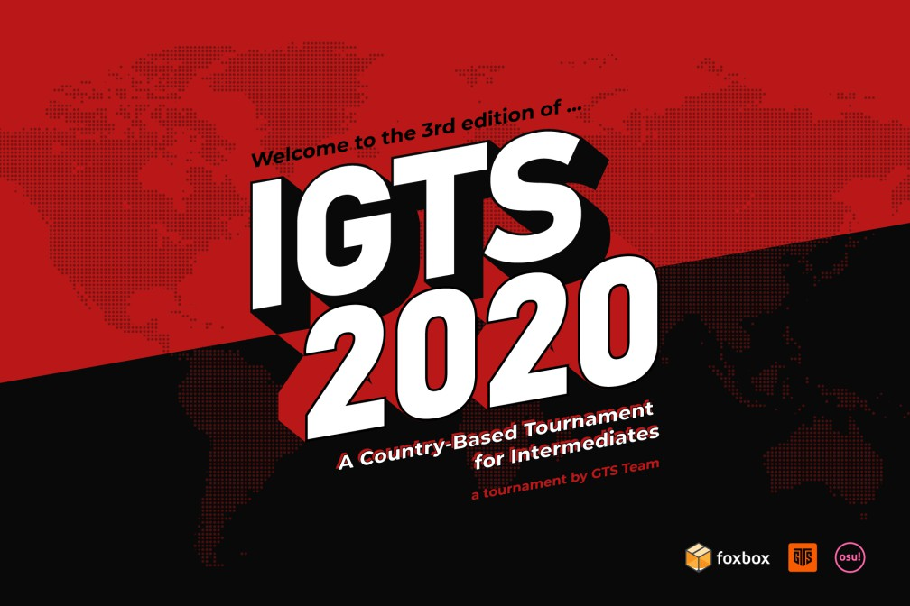
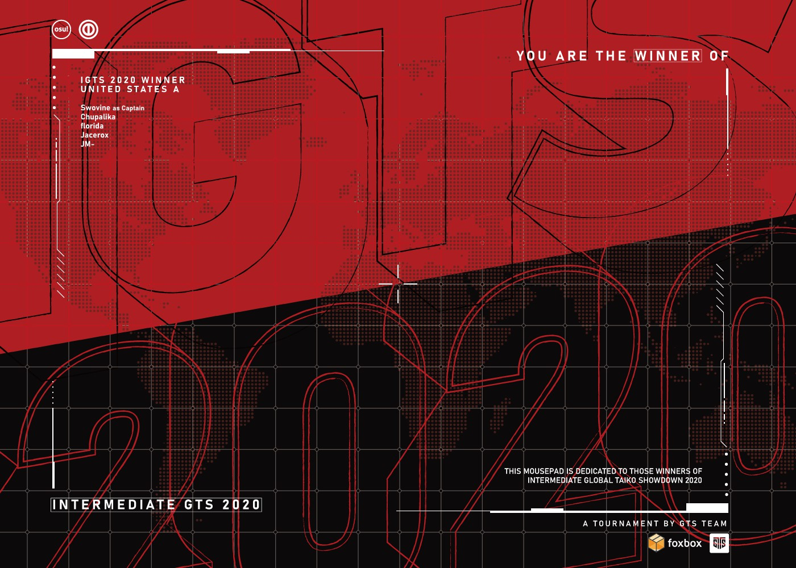

---
tags:
  - IGTS 2020
  - IGTS
  - GTS
---

# Intermediate Global Taiko Showdown 2020

The **Intermediate Global Taiko Showdown 2020** (***IGTS 2020***) was an Intermediate worldwide country-based double-elimination 2v2 osu!taiko tournament hosted by ::{ flag=FR }:: [Briesmas](https://osu.ppy.sh/users/2865172) and ::{ flag=FR }:: [Kasumii-sama](https://osu.ppy.sh/users/6177263). It was the third instalment of the Intermediate Global Taiko Showdown and part of the Global Taiko Showdown series.

## Tournament schedule

| Event | Timestamp |
| --: | :-- |
| Registration phase | 2020-05-03/2020-05-24 |
| Screening and team creations | 2020-05-24/2020-05-31 |
| Qualifiers | 2020-06-06/2020-06-07 |
| Group stage | 2020-06-13/2020-06-14 |
| Round of 16 | 2020-06-20/2020-06-21 |
| Quarterfinals | 2020-06-27/2020-06-28 |
| Semifinals | 2020-07-04/2020-07-05 |
| Finals | 2020-07-11/2020-07-12 |
| All Stars & Grand Finals | 2020-07-18/2020-07-19 |

## Prizes

| Placing | Prize(s) |
| :-: | :-- |
|  | Unique profile badge, US$64 or 6 months of osu!supporter, first place team banner, GTS-themed mousepad sponsored and produced by [Foxbox](https://foxbox.io/) |
|  | US$48 or 6 months of osu!supporter, second place team banner |
|  | US$32 or 2 months of osu!supporter, third place team banner |

Cash prizes were provided by ::{ flag=US }:: [Cor](https://osu.ppy.sh/users/9745242), ::{ flag=US }:: [Glaceon-](https://osu.ppy.sh/users/6395930), and ::{ flag=US }:: [Horo](https://osu.ppy.sh/users/992439).

## Organisation

The Intermediate Global Taiko Showdown 2020 was run by various community members.

| Position | Member(s) |
| :-- | :-- |
| Organizer | ::{ flag=FR }:: [Briesmas](https://osu.ppy.sh/users/2865172), ::{ flag=FR }:: [Kasumii-sama](https://osu.ppy.sh/users/6177263) |
| Mappool selector | ::{ flag=MY }:: [Bedwyr Aorta](https://osu.ppy.sh/users/10875855), ::{ flag=DE }:: [Capu](https://osu.ppy.sh/users/2474015), ::{ flag=US }:: [Cychloryn](https://osu.ppy.sh/users/6921736) |
| All Stars mappool selector | ::{ flag=HK }:: [Brown918](https://osu.ppy.sh/users/9805760), ::{ flag=EC }:: [Gamelan4](https://osu.ppy.sh/users/9856910), ::{ flag=US }:: [kb131313](https://osu.ppy.sh/users/11229259) |
| Referee | ::{ flag=MX }:: [Ammy](https://osu.ppy.sh/users/4183406), ::{ flag=BR }:: [AnonX32](https://osu.ppy.sh/users/2730270), ::{ flag=KR }:: [BamgoeSN](https://osu.ppy.sh/users/1152851), ::{ flag=US }:: [Bathym-](https://osu.ppy.sh/users/10674189), ::{ flag=HK }:: [Brown918](https://osu.ppy.sh/users/9805760), ::{ flag=PL }:: [E-M-i](https://osu.ppy.sh/users/9148286), ::{ flag=EC }:: [Gamelan4](https://osu.ppy.sh/users/9856910), ::{ flag=DE }:: [GDLenny](https://osu.ppy.sh/users/8406711), ::{ flag=MX }:: [Iojioji](https://osu.ppy.sh/users/1346121), ::{ flag=US }:: [JDrago14](https://osu.ppy.sh/users/7690078), ::{ flag=FR }:: [Kasumii-sama](https://osu.ppy.sh/users/6177263), ::{ flag=FR }:: [Madeline](https://osu.ppy.sh/users/2812098), ::{ flag=FR }:: [Purettsu Eru](https://osu.ppy.sh/users/1542565), ::{ flag=DE }:: [QEpicAce](https://osu.ppy.sh/users/9489153), ::{ flag=DE }:: [Sayira](https://osu.ppy.sh/users/7253958), ::{ flag=RU }:: [Starger](https://osu.ppy.sh/users/3398715) |
| Streamer | ::{ flag=BR }:: [AnonX32](https://osu.ppy.sh/users/2730270), ::{ flag=US }:: [cheese salad](https://osu.ppy.sh/users/6349821), ::{ flag=PL }:: [Deroo](https://osu.ppy.sh/users/8360475), ::{ flag=US }:: [ITotallyGetThat](https://osu.ppy.sh/users/8770622), ::{ flag=FR }:: [Kasumii-sama](https://osu.ppy.sh/users/6177263), ::{ flag=RU }:: [KeRLi\_](https://osu.ppy.sh/users/5902629), ::{ flag=US }:: [Mister Boo](https://osu.ppy.sh/users/2598555), ::{ flag=FR }:: [Purettsu Eru](https://osu.ppy.sh/users/1542565), ::{ flag=US }:: [Rukairi](https://osu.ppy.sh/users/6642597), ::{ flag=DE }:: [Sayira](https://osu.ppy.sh/users/7253958), ::{ flag=FR }:: [TLQ\_Yoshii](https://osu.ppy.sh/users/7157133) |
| Commentator | ::{ flag=AU }:: [Beat43210](https://osu.ppy.sh/users/5664171), ::{ flag=US }:: [Cychloryn](https://osu.ppy.sh/users/6921736), ::{ flag=US }:: [DiggyDogg](https://osu.ppy.sh/users/5014664), ::{ flag=DE }:: [DrugManager](https://osu.ppy.sh/users/8694649), ::{ flag=PL }:: [E-M-i](https://osu.ppy.sh/users/9148286), ::{ flag=US }:: [Ethaaaan](https://osu.ppy.sh/users/9536977), ::{ flag=PL }:: [Finite](https://osu.ppy.sh/users/5385806), ::{ flag=DE }:: [Heam](https://osu.ppy.sh/users/4705120), ::{ flag=US }:: [ITotallyGetThat](https://osu.ppy.sh/users/8770622), ::{ flag=US }:: [JM-](https://osu.ppy.sh/users/10629673), ::{ flag=US }:: [kb131313](https://osu.ppy.sh/users/11229259), ::{ flag=RU }:: [KeRLi\_](https://osu.ppy.sh/users/5902629), ::{ flag=IT }:: [Kozzo](https://osu.ppy.sh/users/11993912), ::{ flag=US }:: [Loopy542](https://osu.ppy.sh/users/5468461), ::{ flag=US }:: [Mister Boo](https://osu.ppy.sh/users/2598555), ::{ flag=DE }:: [QEpicAce](https://osu.ppy.sh/users/9489153), ::{ flag=US }:: [Rukairi](https://osu.ppy.sh/users/6642597), ::{ flag=US }:: [Swovine](https://osu.ppy.sh/users/6666316), ::{ flag=GB }:: [Teezel](https://osu.ppy.sh/users/7528639), ::{ flag=AR }:: [Vaf](https://osu.ppy.sh/users/12589048), ::{ flag=GB }:: [w1ll](https://osu.ppy.sh/users/11406987) |
| Designer | ::{ flag=ID }:: [fajar13k](https://osu.ppy.sh/users/7100002), ::{ flag=PH }:: [OsuMe65](https://osu.ppy.sh/users/852867), ::{ flag=KR }:: [POCARI SWEAT](https://osu.ppy.sh/users/5082685) |
| Recruiter | ::{ flag=KR }:: [Civil oath](https://osu.ppy.sh/users/3216107), ::{ flag=EC }:: [Gamelan4](https://osu.ppy.sh/users/9856910), ::{ flag=ID }:: [Reed_405](https://osu.ppy.sh/users/9965069), ::{ flag=US }:: [Swovine](https://osu.ppy.sh/users/6666316), ::{ flag=AR }:: [Vaf](https://osu.ppy.sh/users/12589048), ::{ flag=HK }:: [ZinerX](https://osu.ppy.sh/users/9841478) |
| Translator | ::{ flag=FR }:: [Briesmas](https://osu.ppy.sh/users/2865172), ::{ flag=PL }:: [E-M-i](https://osu.ppy.sh/users/9148286), ::{ flag=EC }:: [Gamelan4](https://osu.ppy.sh/users/9856910), ::{ flag=DE }:: [Maou](https://osu.ppy.sh/users/3867109), ::{ flag=KR }:: [MuangMuangE](https://osu.ppy.sh/users/3752338), ::{ flag=DE }:: [QEpicAce](https://osu.ppy.sh/users/9489153), ::{ flag=RU }:: [Starger](https://osu.ppy.sh/users/3398715), ::{ flag=HK }:: [-Storm7-](https://osu.ppy.sh/users/12248285) |
| Developer | ::{ flag=US }:: [Cychloryn](https://osu.ppy.sh/users/6921736), ::{ flag=FR }:: [ThePooN](https://osu.ppy.sh/users/718454) |
| Wiki editor | ::{ flag=ID }:: [fajar13k](https://osu.ppy.sh/users/7100002) |

## Links

- [Discussion thread](https://osu.ppy.sh/community/forums/topics/1062773)
- [IGTS Discord server](https://discord.gg/a6PzzFz)
- [GTS website](https://gtsosu.com/)
- Livestream
  - [GTSosu](https://www.twitch.tv/gtsosu)
  - [GTSosu_b](https://www.twitch.tv/gtsosu_b)
- [Challonge brackets](https://challonge.com/IGTS2020)
- [Pick'em predictions website](https://pickem.hwc.hr/tournaments/34) hosted by ::{ flag=DE }:: [hallowatcher](https://osu.ppy.sh/users/1874761)

## Participants

|  | Country | Members |
| :-: | :-: | :-- |
| ::{ flag=AR }:: | **Argentina A** | **[\_MMMMMM\_MMMMMM\_](https://osu.ppy.sh/users/8959673)**, [lTwinkle](https://osu.ppy.sh/users/5043517), [juan736](https://osu.ppy.sh/users/6957262), [Sikei-](https://osu.ppy.sh/users/1543133), [Megafan](https://osu.ppy.sh/users/6632605) |
| ::{ flag=AR }:: | **Argentina B** | **[elcho](https://osu.ppy.sh/users/11276129)**, [Emiru Ikuno 13](https://osu.ppy.sh/users/9786011), [Domple](https://osu.ppy.sh/users/9964420), [zVape](https://osu.ppy.sh/users/13130520) |
| ::{ flag=AU }:: | **Australia** | **[Olympyss](https://osu.ppy.sh/users/10654844)**, [- Heatwave -](https://osu.ppy.sh/users/4166621), [- ease -](https://osu.ppy.sh/users/10692856), [Zuikaku](https://osu.ppy.sh/users/4180857), [Arbusion](https://osu.ppy.sh/users/11469447) |
| ::{ flag=BE }:: | **Belgium** | **[shigatori123](https://osu.ppy.sh/users/12609194)**, [Xenosi](https://osu.ppy.sh/users/6157735) |
| ::{ flag=BR }:: | **Brazil** | **[caaiomc](https://osu.ppy.sh/users/5206883)**, [Toddynho\_1](https://osu.ppy.sh/users/8171420), [-Nozomi Tojo](https://osu.ppy.sh/users/8024582), [My Angelsim](https://osu.ppy.sh/users/3149577), [MatvEvolution](https://osu.ppy.sh/users/9306627) |
| ::{ flag=CA }:: | **Canada** | **[FusRoYay](https://osu.ppy.sh/users/5207783)**, [unnamedau](https://osu.ppy.sh/users/15541593), [83338](https://osu.ppy.sh/users/11118020), [ZznightraiderzZ](https://osu.ppy.sh/users/8986265), [Dashthehedgehog](https://osu.ppy.sh/users/13261014) |
| ::{ flag=CL }:: | **Chile** | **[daikiu](https://osu.ppy.sh/users/4232665)**, [ElMatrix\_](https://osu.ppy.sh/users/2195263), [Cirno Senpai](https://osu.ppy.sh/users/9337497) |
| ::{ flag=CN }:: | **China** | **[WonderMan](https://osu.ppy.sh/users/2221895)**, [betairylia](https://osu.ppy.sh/users/1558839), [Kafuu Cirno](https://osu.ppy.sh/users/4314222), [lzxstupid](https://osu.ppy.sh/users/609536), [acst\_\_](https://osu.ppy.sh/users/6443264) |
| ::{ flag=CO }:: | **Colombia** | **[Elperaman](https://osu.ppy.sh/users/8352567)**, [F1nd23](https://osu.ppy.sh/users/9050875), [ChaosGamer10](https://osu.ppy.sh/users/7945286) |
| ::{ flag=CR }:: | **Costa Rica** | **[Titovare](https://osu.ppy.sh/users/7375505)**, [Belencita11](https://osu.ppy.sh/users/9595508), [JostRc3](https://osu.ppy.sh/users/11211959) |
| ::{ flag=CZ }:: | **Czech Republic** | **[Akami-](https://osu.ppy.sh/users/3807724)**, [JaneD221](https://osu.ppy.sh/users/7566331), [Krtek-Chan](https://osu.ppy.sh/users/4818355), [Henry1160](https://osu.ppy.sh/users/11624041) |
| ::{ flag=EC }:: | **Ecuador** | **[Etsu](https://osu.ppy.sh/users/3442319)**, [AlexIDK](https://osu.ppy.sh/users/9861206), [Gato2499](https://osu.ppy.sh/users/7857559), [Reo09](https://osu.ppy.sh/users/10211528) |
| ::{ flag=FI }:: | **Finland** | **[Mesda](https://osu.ppy.sh/users/5049430)**, [Kuromiyaa](https://osu.ppy.sh/users/12811744), [-azer-](https://osu.ppy.sh/users/4223010), [Zippiqwq](https://osu.ppy.sh/users/10065976) |
| ::{ flag=FR }:: | **France A** | **[Mimir](https://osu.ppy.sh/users/7382734)**, [Heaxys](https://osu.ppy.sh/users/5671417), [Fenrir029](https://osu.ppy.sh/users/11262025), [victor80697](https://osu.ppy.sh/users/11592579), [Heartswimm](https://osu.ppy.sh/users/10936319) |
| ::{ flag=FR }:: | **France B** | **[TLQ\_Yoshii](https://osu.ppy.sh/users/7157133)**, [JiMmYBiX](https://osu.ppy.sh/users/8241712), [Libegon](https://osu.ppy.sh/users/9922381), [Panda\_0ne](https://osu.ppy.sh/users/11216472), [Lyseria-Miku](https://osu.ppy.sh/users/8972795) |
| ::{ flag=DE }:: | **Germany A** | **[DrugManager](https://osu.ppy.sh/users/8694649)**, [Zhuosh](https://osu.ppy.sh/users/11056763), [Felicia Yuuki](https://osu.ppy.sh/users/10098927), [Heam](https://osu.ppy.sh/users/4705120) |
| ::{ flag=DE }:: | **Germany B** | **[Maou](https://osu.ppy.sh/users/3867109)**, [pandagoesleet](https://osu.ppy.sh/users/3451184), [Malox](https://osu.ppy.sh/users/4516252), [JanteSmith](https://osu.ppy.sh/users/371772), [Kirross](https://osu.ppy.sh/users/10893243) |
| ::{ flag=GR }:: | **Greece** | **[Kerasi](https://osu.ppy.sh/users/6498810)**, [KagamineAmy](https://osu.ppy.sh/users/8744228), [themis21212](https://osu.ppy.sh/users/13029254) |
| ::{ flag=HK }:: | **Hong Kong** | **[BlackBq](https://osu.ppy.sh/users/6291741)**, [Ansonjason2005](https://osu.ppy.sh/users/13271178), [-Storm7-](https://osu.ppy.sh/users/12248285), [shikuro\_re](https://osu.ppy.sh/users/9338943) |
| ::{ flag=ID }:: | **Indonesia A** | **[Raediaufar](https://osu.ppy.sh/users/5156086)**, [Kzl](https://osu.ppy.sh/users/7058490), [Stelar](https://osu.ppy.sh/users/15205070) |
| ::{ flag=ID }:: | **Indonesia B** | **[Reed\_405](https://osu.ppy.sh/users/9965069)**, [stuffy](https://osu.ppy.sh/users/10250455), [Kanon Matsubara](https://osu.ppy.sh/users/7813289), [Fleure De Lapin](https://osu.ppy.sh/users/5569341) |
| ::{ flag=IT }:: | **Italy** | **[Kozzo](https://osu.ppy.sh/users/11993912)**, [Kurotsuki37](https://osu.ppy.sh/users/11764134), [Maoslat](https://osu.ppy.sh/users/11786656), [Friedchicken](https://osu.ppy.sh/users/10458237) |
| ::{ flag=JP }:: | **Japan A** | **[C-light](https://osu.ppy.sh/users/7955738)**, [Tsubackyy](https://osu.ppy.sh/users/13082668), [shiroino](https://osu.ppy.sh/users/1751879), [yayuyoyo](https://osu.ppy.sh/users/8104504), [DefiantJ](https://osu.ppy.sh/users/1100246) |
| ::{ flag=JP }:: | **Japan B** | **[tatsu5558](https://osu.ppy.sh/users/9235738)**, [kogeyashi](https://osu.ppy.sh/users/6478296), [nsBrawlStars](https://osu.ppy.sh/users/14037167), [bitanami](https://osu.ppy.sh/users/14093336) |
| ::{ flag=MY }:: | **Malaysia A** | **[-\[KIVA\]-](https://osu.ppy.sh/users/10573017)**, [nikolpai_15](https://osu.ppy.sh/users/11584592), [Ping7731](https://osu.ppy.sh/users/7289284), [Kyrzer](https://osu.ppy.sh/users/5616675) |
| ::{ flag=MY }:: | **Malaysia B** | **[tzexuuan](https://osu.ppy.sh/users/1380183)**, [DXA FonG](https://osu.ppy.sh/users/15019527), [jinkian](https://osu.ppy.sh/users/903605) |
| ::{ flag=MX }:: | **Mexico** | **[DarkDesire](https://osu.ppy.sh/users/1705608)**, [- Markuru -](https://osu.ppy.sh/users/8503913), [Tenchin777](https://osu.ppy.sh/users/7747872) |
| ::{ flag=NL }:: | **Netherlands** | **[Boaz](https://osu.ppy.sh/users/13302996)**, [lukitsa124](https://osu.ppy.sh/users/8787678), [Edesto](https://osu.ppy.sh/users/5088562), [jackylam5](https://osu.ppy.sh/users/1540807), [TsukoteAmie](https://osu.ppy.sh/users/9086438) |
| ::{ flag=NO }:: | **Norway** | **[Vendelicious](https://osu.ppy.sh/users/8818089)**, [Groex](https://osu.ppy.sh/users/3970664) |
| ::{ flag=PH }:: | **Philippines** | **[Eryzr](https://osu.ppy.sh/users/7301817)**, [bartensphee](https://osu.ppy.sh/users/3679969), [CoEqual](https://osu.ppy.sh/users/14167247) |
| ::{ flag=PL }:: | **Poland** | **[Finite](https://osu.ppy.sh/users/5385806)**, [WubWoofWolf](https://osu.ppy.sh/users/39828), [Sypro2000](https://osu.ppy.sh/users/3622412), [Lastminute7](https://osu.ppy.sh/users/7121313), [Konrad20050](https://osu.ppy.sh/users/8966140) |
| ::{ flag=PT }:: | **Portugal** | **[Rodrig0v](https://osu.ppy.sh/users/138866)**, [ninjatory3](https://osu.ppy.sh/users/11429256), [\_Creamy](https://osu.ppy.sh/users/9354008) |
| ::{ flag=RU }:: | **Russian Federation A** | **[CrayZeei](https://osu.ppy.sh/users/10625447)**, [Tomyra](https://osu.ppy.sh/users/11194489), [DuckOn Keyboard](https://osu.ppy.sh/users/4944211), [SergoM4444](https://osu.ppy.sh/users/10515166), [Vasyadogs](https://osu.ppy.sh/users/7239762) |
| ::{ flag=RU }:: | **Russian Federation B** | **[Zenseky](https://osu.ppy.sh/users/8860812)**, [lxlANANASlxl](https://osu.ppy.sh/users/13092108), [freishmejt](https://osu.ppy.sh/users/13364001) |
| ::{ flag=SG }:: | **Singapore** | **[Spartric](https://osu.ppy.sh/users/7740442)**, [uchuuj1n](https://osu.ppy.sh/users/9140302), [kuudere-desu](https://osu.ppy.sh/users/10694200), [C5H10](https://osu.ppy.sh/users/7003484), [Grantorio](https://osu.ppy.sh/users/5623529) |
| ::{ flag=KR }:: | **South Korea** | **[Civil oath](https://osu.ppy.sh/users/3216107)**, [Elfin](https://osu.ppy.sh/users/1399551), [COCOA ANGEL](https://osu.ppy.sh/users/10049161) |
| ::{ flag=ES }:: | **Spain** | **[forcegk](https://osu.ppy.sh/users/8566580)**, [adrian\_beade](https://osu.ppy.sh/users/5568171), [Lunako](https://osu.ppy.sh/users/2041945), [hunterjos999](https://osu.ppy.sh/users/10733787), [misterbola8](https://osu.ppy.sh/users/3610305) |
| ::{ flag=CH }:: | **Switzerland** | **[Glacy](https://osu.ppy.sh/users/12819177)**, [HardNeper](https://osu.ppy.sh/users/9776256) |
| ::{ flag=TH }:: | **Thailand** | **[KappuChinooo](https://osu.ppy.sh/users/9582525)**, [ppgamer](https://osu.ppy.sh/users/7172288) |
| ::{ flag=TN }:: | **Tunisia** | **[LQss](https://osu.ppy.sh/users/5168238)**, [nojott](https://osu.ppy.sh/users/13801036) |
| ::{ flag=UA }:: | **Ukraine** | **[fetet](https://osu.ppy.sh/users/12341492)**, [Tadakichi](https://osu.ppy.sh/users/5569003), [-Lilu](https://osu.ppy.sh/users/9979328) |
| ::{ flag=GB }:: | **United Kingdom** | **[w1ll](https://osu.ppy.sh/users/11406987)**, [DatMan212](https://osu.ppy.sh/users/13780435), [B0tch3d](https://osu.ppy.sh/users/9864847), [hornedlove](https://osu.ppy.sh/users/14072678), [Livvo](https://osu.ppy.sh/users/8884687) |
| ::{ flag=US }:: | **United States A** | **[Swovine](https://osu.ppy.sh/users/6666316)**, [JM-](https://osu.ppy.sh/users/10629673), [florida](https://osu.ppy.sh/users/7700831), [Jacerox](https://osu.ppy.sh/users/12962910), [Chupalika](https://osu.ppy.sh/users/1926383) |
| ::{ flag=US }:: | **United States B** | **[epilouge1](https://osu.ppy.sh/users/4697635)**, [Nuggets-](https://osu.ppy.sh/users/9676809), [Trollface3399](https://osu.ppy.sh/users/4635728), [White Axl](https://osu.ppy.sh/users/12334307), [Yujki](https://osu.ppy.sh/users/14987094) |
| ::{ flag=VE }:: | **Venezuela** | **[\[OSC\]Rirutok](https://osu.ppy.sh/users/7846939)**, [Switch\_](https://osu.ppy.sh/users/13726103) |

## All Stars participants

Both teams were formed by a vote held in the IGTS Discord server. Participants with the most votes got to be the captain for each team, and the rest of the members were decided by rankings as stated in the [All Stars rules](#all-stars-rules).

| Team | Members |
| :-- | :-- |
| **LETSfiretruckINGGO.mp4** | ::{ flag=JP }:: **[C-light](https://osu.ppy.sh/users/7955738)**, ::{ flag=CN }:: [betairylia](https://osu.ppy.sh/users/1558839), ::{ flag=GB }:: [B0tch3d](https://osu.ppy.sh/users/9864847), ::{ flag=SG }:: [C5H10](https://osu.ppy.sh/users/7003484) |
| **Shibe Gang** | ::{ flag=US }:: **[florida](https://osu.ppy.sh/users/7700831)**, ::{ flag=CA }:: [FusRoYay](https://osu.ppy.sh/users/5207783), ::{ flag=AR }:: [juan736](https://osu.ppy.sh/users/6957262), ::{ flag=DE }:: [Malox](https://osu.ppy.sh/users/4516252) |

## Groups

| Group | Top seed | High seed | Low seed | Unseeded |
| :-: | :-- | :-- | :-- | :-- |
| **A** | ::{ flag=AR }:: Argentina A | ::{ flag=NL }:: Netherlands | ::{ flag=PT }:: Portugal | ::{ flag=NO }:: Norway |
| **B** | ::{ flag=CN }:: China | ::{ flag=DE }:: Germany B | ::{ flag=IT }:: Italy | ::{ flag=BR }:: Brazil |
| **C** | ::{ flag=KR }:: South Korea | ::{ flag=ES }:: Spain | ::{ flag=PH }:: Philippines | ::{ flag=JP }:: Japan B |
| **D** | ::{ flag=SG }:: Singapore | ::{ flag=HK }:: Hong Kong | ::{ flag=GR }:: Greece | ::{ flag=ID }:: Indonesia B |
| **E** | ::{ flag=US }:: United States A | ::{ flag=CL }:: Chile | ::{ flag=FR }:: France A | ::{ flag=BE }:: Belgium |
| **F** | ::{ flag=US }:: United States B | ::{ flag=ID }:: Indonesia A | ::{ flag=AU }:: Australia | ::{ flag=CO }:: Colombia |
| **G** | ::{ flag=PL }:: Poland | ::{ flag=CA }:: Canada | ::{ flag=MY }:: Malaysia A | ::{ flag=CZ }:: Czech Republic |
| **H** | ::{ flag=JP }:: Japan A | ::{ flag=GB }:: United Kingdom | ::{ flag=RU }:: Russian Federation A | ::{ flag=AR }:: Argentina B |

## Podium

This competition has come to an end and resulted in the following podium:

| Placing | Team |
| :-: | :-- |
|  | ::{ flag=US }:: **United States A** (**[Swovine](https://osu.ppy.sh/users/6666316)**, [JM-](https://osu.ppy.sh/users/10629673), [florida](https://osu.ppy.sh/users/7700831), [Jacerox](https://osu.ppy.sh/users/12962910), [Chupalika](https://osu.ppy.sh/users/1926383)) |
|  | ::{ flag=JP }:: **Japan A** (**[C-light](https://osu.ppy.sh/users/7955738)**, [Tsubackyy](https://osu.ppy.sh/users/13082668), [shiroino](https://osu.ppy.sh/users/1751879), [yayuyoyo](https://osu.ppy.sh/users/8104504), [DefiantJ](https://osu.ppy.sh/users/1100246)) |
|  | ::{ flag=SG }:: **Singapore** (**[Spartric](https://osu.ppy.sh/users/7740442)**, [uchuuj1n](https://osu.ppy.sh/users/9140302), [kuudere-desu](https://osu.ppy.sh/users/10694200), [C5H10](https://osu.ppy.sh/users/7003484), [Grantorio](https://osu.ppy.sh/users/5623529)) |

## Mappools

### All Stars

**[Download the map pack here! (101 MB)](https://mega.nz/file/fOQRXQJB#90Kjf6cGPI-boeKG_3jigMF6jlNXK7tT2yZQJuebOrY)**

- DoubleTime
  1. [Reol - Drop Pop Candy (Rumovik) \[Rumovik's Oni\]](https://osu.ppy.sh/beatmapsets/417257#taiko/903582)
  2. [Yunomi - Jellyfish (feat. Roller Girl) (kamaboko117) \[Oni\]](https://osu.ppy.sh/beatmapsets/901952#taiko/1887699)
- FreeMod
  1. [t+pazolite - Against Gilgamesh (Louis Cyphre) \[Ono's Taiko Inner Oni\]](https://osu.ppy.sh/beatmapsets/39816#taiko/127115)
  2. [Erio o Kamattechan - Os-Uchuujin(Asterisk Makina Remix) (namaniku) \[Inner Oni\]](https://osu.ppy.sh/beatmapsets/637573#taiko/1352595)
  3. [pm04034 - Cute-D Galaxy (Midnaait) \[Inner Oni\]](https://osu.ppy.sh/beatmapsets/1110857#taiko/2321063)
  4. [DIVERSA - atlas (Ulqui) \[Inner Oni\]](https://osu.ppy.sh/beatmapsets/875591#taiko/1829790)
  5. [SEVENTH SISTERS - SEVENTH HAVEN (Mtell Remix) (Shallty) \[2nd Sister hoku^-^\]](https://osu.ppy.sh/beatmapsets/829545#taiko/1737947)
  6. [Hiyano Aya, Katou Emiri, Fukuhara Kaori & Endou Aya - Motteke! Sailor Fuku (D-D-Duke) \[Duke's Oni\]](https://osu.ppy.sh/beatmapsets/739573#taiko/1560464)
  7. [Frums - memoryfactory.lzh (Nifty) \[inneroni.rar\]](https://osu.ppy.sh/beatmapsets/761900#taiko/1601980)
  8. [Kobaryo - Invisible Frenzy (Cychloryn) \[Oni\]](https://osu.ppy.sh/beatmapsets/1083165#taiko/2268907)
  9. [kaitendaentai - Hizai ni Negu (maziari1105) \[EM's Oni\]](https://osu.ppy.sh/beatmapsets/653870#taiko/1592124)
  10. [lapix - Kill The Beat (HiroK) \[Inner Oni\]](https://osu.ppy.sh/beatmapsets/986572#taiko/2063920)
  11. [Morimori Atsushi - Funkotsusaishin Casino (BrosephStalin) \[Inner Oni\]](https://osu.ppy.sh/beatmapsets/830726#taiko/1740461)
  12. [LeaF - Aleph-0 (Nifty) \[Temptation Oni\]](https://osu.ppy.sh/beatmapsets/675465#taiko/1428910)
  13. [KikuoHana - Paper doll (Alchyr) \[Fluttering\]](https://osu.ppy.sh/beatmapsets/1146689#taiko/2394270)
  14. [Umeboshi Chazuke - Dutch Courage! (Skull Kid) \[iceOC\]](https://osu.ppy.sh/beatmapsets/845412#taiko/1772272)
  15. [BVB - My Awesome Flat Chest On The Ground (Nofool) \[Special Oni\]](https://osu.ppy.sh/beatmapsets/706552#taiko/1493980)
  16. [Peggy Suave - Best Buns In Town (Nofool) \[Special Oni\]](https://osu.ppy.sh/beatmapsets/860858#taiko/1801106)
- HalfTime
  1. [VINRG - Do It Now (\_Rise) \[100%\]](https://osu.ppy.sh/beatmapsets/1082788#taiko/2264890)
  2. [tarolabo - NijiBishox1HadairoSenjoSenjo (Nyan) \[Inner Oni\]](https://osu.ppy.sh/beatmapsets/328741#taiko/751051)
- Tiebreaker
  1. **[Tomita Miyu, Sasahara Yuu, Lynn, Waki Azumi - +Kyuutie Ladies+ (nenpulse bootleg remix) (Shallty) \[Shallty & KTYN's Vampire\]](https://osu.ppy.sh/beatmapsets/904754#taiko/1888472)**

### Grand Finals

**[Download the map pack here! (85 MB)](https://mega.nz/file/LkVVVKaY#gyJlIZPmlWT5yZRCnWRg4pn688mel9Mz_KiSZ4Nvwx0)**

- NoMod
  1. [PSYQUI feat. Such - Raise Your Hands (Yuemiao) \[D3kuu's Inner Oni\]](https://osu.ppy.sh/beatmapsets/897856#taiko/2454968)
  2. [Dirty Androids - Seaside Labyrinth (MMzz) \[Inner Oni\]](https://osu.ppy.sh/beatmapsets/687541#taiko/1454920)
  3. [Laur - Nostalgic Blood of Strife (sendol) \[Oni\]](https://osu.ppy.sh/beatmapsets/968515#taiko/2031229)
  4. [Katsuro Tajima - Charlie Dash! (Midnaait) \[Oni!\]](https://osu.ppy.sh/beatmapsets/1100294#taiko/2298702)
  5. [ginkiha - ARCADE_MEMORIES (Ulqui) \[Inner Oni\]](https://osu.ppy.sh/beatmapsets/1123482#taiko/2347692)
  6. [FAKE TYPE. - FAKE STYLE II (Nofool) \[Inner Oni\]](https://osu.ppy.sh/beatmapsets/832516#taiko/1744082)
- Hidden
  1. [Euchaeta - Kokoro (ailv) \[Ayyri's Oni\]](https://osu.ppy.sh/beatmapsets/728885#taiko/1569395)
  2. [fallen shepherd feat. RabbiTon Strings - ENDYMION (Capu) \[Lite Oni\]](https://osu.ppy.sh/beatmapsets/1078749#taiko/2329083)
- HardRock
  1. [Cranky - Libera me (eiri-) \[Oni\]](https://osu.ppy.sh/beatmapsets/757813#taiko/1594141)
  2. [DM Ashura - Ignis Fatuus (Will o'the Wisp) (Midnaait) \[2199's Oni\]](https://osu.ppy.sh/beatmapsets/871553#taiko/1836782)
- DoubleTime
  1. [ALI - Wild Side (Ney) \[HiroK's Oni: Canis\]](https://osu.ppy.sh/beatmapsets/1090317#taiko/2290635)
  2. [Panda Eyes - On My Own (Cynplytholowazy) \[Fapu's Oni\]](https://osu.ppy.sh/beatmapsets/1065837#taiko/2233195)
- FreeMod
  1. [O2i3 - Heart Function (Capu) \[Oni\]](https://osu.ppy.sh/beatmapsets/1132966#taiko/2366370)
  2. [Happy Kuru Kuru - Sayonara Cricket (komasy) \[Inner Oni\]](https://osu.ppy.sh/beatmapsets/568096#taiko/1203947)
  3. [Kido Ibuki & Yamazaki Erii - pupa (Faputa) \[Inner Oni\]](https://osu.ppy.sh/beatmapsets/988918#taiko/2068582)
- Tiebreaker
  1. **[VIRTUAL SELF - ANGEL VOICES (HiroK) \[Angelus Transposition\]](https://osu.ppy.sh/beatmapsets/1001789#taiko/2097051)**

### Finals

**[Download the map pack here! (78 MB)](https://mega.nz/file/esV3TYgJ#nZSmk_k9Js0CSJHL24IFSY7JhknN2VnzH6xTEba_Sj8)**

- NoMod
  1. [Floxytek vs Billx - 30's Swing Tek (DarkTigrus) \[\~Heuss'Taiko Swing\~\]](https://osu.ppy.sh/beatmapsets/45107#taiko/159871)
  2. [HHHxMMxST - Oboro (Bedwyr Aorta) \[Stefan's Inner Oni (IGTS ver.)\]](https://osu.ppy.sh/beatmapsets/1207266#taiko/2514093)
  3. [UNDEAD CORPORATION - Too Sweet (Jaye) \[Oni\]](https://osu.ppy.sh/beatmapsets/807565#taiko/1696636)
  4. [Camellia - \*Feels Seasickness...\* (Vulkin) \[\*Oni...\*\]](https://osu.ppy.sh/beatmapsets/1051724#taiko/2197918)
  5. [MiddleIsland - Achromat (Nwolf) \[Oni\]](https://osu.ppy.sh/beatmapsets/588729#taiko/1246304)
  6. [Shawn Wasabi + YDG feat. YUNG GEMMY - Burnt Rice (Aiobahn & Jh-Anu Remix) (Cychloryn) \[Inner Oni\]](https://osu.ppy.sh/beatmapsets/1206425#taiko/2512410)
- Hidden
  1. [sasakure.UK - Epitorica no Matsuri (tasuke912) \[yassu-'s Oni\]](https://osu.ppy.sh/beatmapsets/511420#taiko/1110609)
  2. [Toby Fox (remixed by Camellia) - Spider Dance (Camellia Remix) (hikiko-) \[Oni\]](https://osu.ppy.sh/beatmapsets/565226#taiko/1512798)
- HardRock
  1. [Function Phantom - Neuronecia (tasuke912) \[Quartic\]](https://osu.ppy.sh/beatmapsets/827822#taiko/1773125)
  2. [An - LittleGameStar (Bedwyr Aorta) \[Eyenine's Oni (IGTS ver.)\]](https://osu.ppy.sh/beatmapsets/1207331#taiko/2514216)
- DoubleTime
  1. [x0o0x\_ -  (nyanmi-1828) \[;\]](https://osu.ppy.sh/beatmapsets/1128229#taiko/2358776)
  2. [Hanatan - Romeo and Cinderella (Bedwyr Aorta) \[ll-oscar's ll-taiko (IGTS ver.)\]](https://osu.ppy.sh/beatmapsets/1207333#taiko/2514218)
- FreeMod
  1. [LeaF - Evanescent (Krah) \[Oni\]](https://osu.ppy.sh/beatmapsets/176646#taiko/454878)
  2. [rejection - Signal feat. Such (Mameyudoufu Remix) (KappuChinooo) \[Oni\]](https://osu.ppy.sh/beatmapsets/1190233#taiko/2479872)
  3. [Rob Gasser - Taking Over (feat. Miyoki) (-OvO-) \[Oni\]](https://osu.ppy.sh/beatmapsets/1118937#taiko/2339203)
- Tiebreaker
  1. **[Stonebank - Stronger (feat. EMEL) (Bedwyr Aorta) \[Deathwing1306's Inner Oni (IGTS ver.)\]](https://osu.ppy.sh/beatmapsets/1207327#taiko/2514212)**

### Semifinals

**[Download the map pack here! (81 MB)](https://mega.nz/file/upklnJhQ#-YfhkCE1xBeGXxZ4c2CyahuKkxN1l-QfRl1N_v_m2OU)**

- NoMod
  1. [cosMo@bousouP - Nee, Kowareta Ningyou wa Doko e Suterareru no? (Rhytoly) \[Oni?\]](https://osu.ppy.sh/beatmapsets/854011#taiko/1785798)
  2. [Eve - Heart Forecast (Raphalge) \[Inner Oni\]](https://osu.ppy.sh/beatmapsets/1175679#taiko/2452133)
  3. [t+pazolite - Magical Higan Tour 2009 (eiri-) \[Oni\]](https://osu.ppy.sh/beatmapsets/838744#taiko/1757104)
  4. [Machine Girl - Cloud99 (As Above Mix) (Genjuro) \[Oni\]](https://osu.ppy.sh/beatmapsets/1127497#taiko/2357465)
  5. [NICODE - Nyanya no Uta (Faputa) \[Oni\]](https://osu.ppy.sh/beatmapsets/918651#taiko/1920409)
  6. [Wowkie Zhang - Sunshine, Rainbow, White pony (Cychloryn) \[Sunshine, Rainbow, White oni\]](https://osu.ppy.sh/beatmapsets/1202461#taiko/2504229)
- Hidden
  1. [SHK - Super Fantasy (aabc271) \[Inner Oni\]](https://osu.ppy.sh/beatmapsets/541523#taiko/1148213)
  2. [Culprate - Yellow (A Second Glimpse) (Ulqui) \[Oni\]](https://osu.ppy.sh/beatmapsets/589814#taiko/1761603)
- HardRock
  1. [Shiron - Deadly Dolly Dance (Bedwyr Aorta) \[komasy's Oni (IGTS ver.)\]](https://osu.ppy.sh/beatmapsets/1202631#taiko/2504548)
  2. [DECO\*27 - Ghost Rule feat. Hatsune Miku (Bedwyr Aorta) \[mintong89's Taiko Oni (IGTS ver.)\]](https://osu.ppy.sh/beatmapsets/1202626#taiko/2504540)
- DoubleTime
  1. [meganeko - Computer Blues (Axer) \[Vulkin's Muzukashii\]](https://osu.ppy.sh/beatmapsets/1147128#taiko/2434870)
  2. [Sorry about my face - 161914 (vrnl) \[muzukashii\]](https://osu.ppy.sh/beatmapsets/832971#taiko/1746027)
- FreeMod
  1. [IOSYS - Sai wa Nagerareta (yea) \[jyake's Oni\]](https://osu.ppy.sh/beatmapsets/932724#taiko/1957538)
  2. [Eagle - Hypersonik (Michiru) \[Oni\]](https://osu.ppy.sh/beatmapsets/985854#taiko/2106170)
  3. [James Landino & Kabuki - Birdsong (Nifty) \[Oni\]](https://osu.ppy.sh/beatmapsets/1010367#taiko/2115067)
- Tiebreaker
  1. **[WAiKURO - Androgynos (Raytoly) \[Note\]](https://osu.ppy.sh/beatmapsets/666397#taiko/1504541)**

### Quarterfinals

**[Download the map pack here! (76 MB)](https://mega.nz/file/vokwSC5Y#H6k-EQHlw9xV-GRayCpPTrSDTe0lym5oggSAAxym9CM)**

- NoMod
  1. [sky\_delta - Grenade (Nerova Riuz GX) \[Oni\]](https://osu.ppy.sh/beatmapsets/920666#taiko/1937208)
  2. [sasakure.UK - SAMPLING MONSTER feat. Hatsune Miku (tasuke912) \[nass's Oni\]](https://osu.ppy.sh/beatmapsets/740600#taiko/1569534)
  3. [Zou Tian Heng - No.1127 (-OvO-) \[Oni\]](https://osu.ppy.sh/beatmapsets/969775#taiko/2028875)
  4. [ziki\_7 - Leviathan (yassu-) \[Oni\]](https://osu.ppy.sh/beatmapsets/1013884#taiko/2188042)
  5. [kyou1110 vs. Takuya Namba - "Alice in Wonderland" : crazy apple could not live in real life (-Kazu-) \[Oni\]](https://osu.ppy.sh/beatmapsets/742005#taiko/1974557)
- Hidden
  1. [Xceon - Fuyutsubaki feat. Kanae Asaba (Charlotte) \[Vulkin's Oni\]](https://osu.ppy.sh/beatmapsets/827227#taiko/2260330)
  2. [Camellia - Ultimate Ascension (\_DUSK\_) \[Muzukashii\]](https://osu.ppy.sh/beatmapsets/760523#taiko/1957589)
- HardRock
  1. [M2U feat. NICODE - Breach (\_DUSK\_) \[Oni\]](https://osu.ppy.sh/beatmapsets/957893#taiko/2006052)
  2. [REDALiCE vs USAO - SAIKYO STRONGER (MMzz) \[Chromoxx' Muzukashii\]](https://osu.ppy.sh/beatmapsets/1145432#taiko/2409492)
- DoubleTime
  1. [KNOWER - Overtime (Zetera) \[Muzukashii\]](https://osu.ppy.sh/beatmapsets/927890#taiko/2168075)
  2. [JIN feat. Yoshida Takumi (phatmans after school) - Kuusou Forest (Zhuosh) \[Muzukashii\]](https://osu.ppy.sh/beatmapsets/1131091#taiko/2364202)
- FreeMod
  1. [FELT - Oblivion (sendol) \[Oni\]](https://osu.ppy.sh/beatmapsets/897333#taiko/1970355)
  2. [kanone feat. Senzai - Hana to, Yuki to, Drum'n'bass. (Bedwyr Aorta) \[Blackener's Oni (IGTS ver.)\]](https://osu.ppy.sh/beatmapsets/1197720#taiko/2494749)
  3. [Sakuzyo - Eater Merry (eiri-) \[Oni\]](https://osu.ppy.sh/beatmapsets/1097688#taiko/2293612)
- Tiebreaker
  1. **[Camellia - Beyond the Geostationary Orbit Level (Axer) \[2199's Oni\]](https://osu.ppy.sh/beatmapsets/975512#taiko/2042400)**

### Round of 16

**[Download the map pack here! (93 MB)](https://mega.nz/file/T1tVVbyZ#Cn-uhZgtCiCwQ67HMly9AA9pQQfFxXRiySnPqkr4ikc)**

- NoMod
  1. [chelmico - Easy Breezy feat. Zenpaku (dj-Jo Remix) (D3kuu) \[Oni\]](https://osu.ppy.sh/beatmapsets/1122895#taiko/2346587)
  2. [Akira Complex - Ether Strike (Raytoly) \[Oni\]](https://osu.ppy.sh/beatmapsets/1022223#taiko/2168809)
  3. [uma vs. Morimori Atsushi - GLORY: ROAD (Capu) \[CYCHLO'S MUZUKASHII\]](https://osu.ppy.sh/beatmapsets/1085285#taiko/2269499)
  4. [goreshit - broken promises/shattered dreams (HiroK) \[Capu's Muzukashii\]](https://osu.ppy.sh/beatmapsets/1077202#taiko/2280397)
  5. [Tomoya Ohtani - Louvre Museum Invasion (Cychloryn) \[Finisher Thief\]](https://osu.ppy.sh/beatmapsets/1191586#taiko/2483055)
- Hidden
  1. [Remixed by DJ Command - Mermaid girl -Akiba Koubou MIX- (Nishizumi) \[Oni\]](https://osu.ppy.sh/beatmapsets/340132#taiko/752428)
  2. [Camellia - Racemization (Squigly) \[Jerry's Muzukashii\]](https://osu.ppy.sh/beatmapsets/373363#taiko/896660)
- HardRock
  1. [Zekk - Foresight (Stingy) \[Muzukashii\]](https://osu.ppy.sh/beatmapsets/1149296#taiko/2399454)
  2. [BeatMARIO - Night of Knights (USAO Remix) (Nishizumi) \[Muzukashii\]](https://osu.ppy.sh/beatmapsets/1093282#taiko/2287760)
- DoubleTime
  1. [O2i3 - How to make Slime (Faputa) \[Muzukashii\]](https://osu.ppy.sh/beatmapsets/1135207#taiko/2372527)
  2. [Yunomi - Tokyo Snorkel (feat. nicamoq) (\[R\]) \[Muzukashii\]](https://osu.ppy.sh/beatmapsets/979346#taiko/2049587)
- FreeMod
  1. [Niwashi+Aoi - Nostalgic Lost Logic (Lyrio\_jet) \[Muzukashii\]](https://osu.ppy.sh/beatmapsets/675886#taiko/1429661)
  2. [Kraus - Pitch Fucker (Nifty) \[Oni: Panic\]](https://osu.ppy.sh/beatmapsets/703595#taiko/1488561)
  3. [lapix - BRAND NEW DAY feat. Numb'n'dub (Cychloryn) \[Muzukashii\]](https://osu.ppy.sh/beatmapsets/1056895#taiko/2211097)
- Tiebreaker
  1. **[Tia - Love Me Gimme (toara\_fict) \[Oni\]](https://osu.ppy.sh/beatmapsets/472373#taiko/1009422)**

### Group stage

**[Download the map pack here! (65 MB)](https://mega.nz/file/3wFnTazb#-ONnI0-BFICX7IHmNR-zHmpK4qhWyJw9-AgzjZSiqCE)**

- NoMod
  1. [ONE OK ROCK - Clock Strikes (Chromoxx) \[Oni\]](https://osu.ppy.sh/beatmapsets/602619#taiko/1272846)
  2. [Zektbach - Turii \~Panta rhei\~ (Yales) \[Ron's Oni\]](https://osu.ppy.sh/beatmapsets/902770#taiko/2281596)
  3. [F-T-K & 4ra8 -shiraha- - SingularityAlteR:Ego (\[\_Chichinya\_\]) \[Muzukashii\]](https://osu.ppy.sh/beatmapsets/1058794#taiko/2220695)
  4. [MYUKKE. - OCCHOCO-REST-LESS (Jaye) \[Muzukashii\]](https://osu.ppy.sh/beatmapsets/1041076#taiko/2177417)
- Hidden
  1. [StripE - FIRE FIRE (roufou) \[Oni\]](https://osu.ppy.sh/beatmapsets/348579#taiko/2334545)
  2. [xi - Quietus Ray (\_DUSK\_) \[yzrin's Muzukashii\]](https://osu.ppy.sh/beatmapsets/776093#taiko/1668226)
- HardRock
  1. [Arcaea Sound Team against. ETIA. - Singularity VVVIP (Raytoly) \[Muzukashii\]](https://osu.ppy.sh/beatmapsets/1139960#taiko/2382097)
  2. [ianmirror - yahirodono (Michiru) \[2199's Muzukashii\]](https://osu.ppy.sh/beatmapsets/1005489#taiko/2121096)
- DoubleTime
  1. [Tanemura Koyori (CV: Oowada Hitomi) - Akairo Little Leader (yuki\_momoiro722) \[Muzukashii\]](https://osu.ppy.sh/beatmapsets/994248#taiko/2081704)
  2. [Yuzuhiko - Sasha (Bedwyr Aorta) \[Mystyk's Muzukashii (IGTS ver.)\]](https://osu.ppy.sh/beatmapsets/1187569#taiko/2474893)
- FreeMod
  1. [ALiCE'S EMOTiON - Cold Rain (snowball112) \[Oni\]](https://osu.ppy.sh/beatmapsets/172052#taiko/506940)
  2. [cillia - Rolling Girl (mintong89) \[Muzukashii Lv.17\]](https://osu.ppy.sh/beatmapsets/434536#taiko/1447804)
  3. [Sakuzyo - Lie (komasy) \[Muzukashii\]](https://osu.ppy.sh/beatmapsets/920188#taiko/1925861)
- Tiebreaker
  1. **[kamome sano - starlights feat. TEA (you Remix) (Killer\_Dal) \[sendol's Oni\]](https://osu.ppy.sh/beatmapsets/1125172#taiko/2391592)**

### Qualifiers

**[Download the map pack here! (25 MB)](https://mega.nz/file/M0YR1SoR#6NXysw4sUBS0SP9gPbdeA4IHCortqTWJSjesueE75Fo)**

- NoMod
  1. [8284 - Connaextion (Nwolf) \[--- -. ..\]](https://osu.ppy.sh/beatmapsets/660649#taiko/1956165)
  2. [The Flashbulb - Lawn Wake IX (yassu-) \[Oni\]](https://osu.ppy.sh/beatmapsets/662638#taiko/1402659)
- Hidden
  1. [DROELOE - Backbone (feat. Nevve) (Lyawi) \[Oni\]](https://osu.ppy.sh/beatmapsets/727710#taiko/1536474)
- HardRock
  1. [t+pazolite feat. Rizna - Buzy Lake (Suzux) \[Muzukashii\]](https://osu.ppy.sh/beatmapsets/980094#taiko/2052901)
- DoubleTime
  1. [Ayu Ting Ting - Sambalado (Volta) \[Muzukashii\]](https://osu.ppy.sh/beatmapsets/542425#taiko/1630672)

## Match results

### All Stars

Sunday, 19 July 2020:

| Team 1 |  |  | Team 2 | Match link |
| --: | :-: | :-: | :-- | :-- |
| Shibe Gang | 3 | **8** | **LETSfiretruckINGGO.mp4** | [#1](https://osu.ppy.sh/community/matches/64290257) |

### Grand Finals

Saturday, 18 July 2020:

| Team 1 |  |  | Team 2 | Match link |
| --: | :-: | :-: | :-- | :-- |
| **United States A** ::{ flag=US }:: | **7** | 3 | ::{ flag=JP }:: Japan A | [#1](https://osu.ppy.sh/community/matches/64234355) |

### Finals

Saturday, 11 July 2020:

| Team 1 |  |  | Team 2 | Match link |
| --: | :-: | :-: | :-- | :-- |
| Netherlands ::{ flag=NL }:: | 5 | **7** | ::{ flag=SG }:: **Singapore** | [#1](https://osu.ppy.sh/community/matches/63970280) |

Sunday, 12 July 2020:

| Team 1 |  |  | Team 2 | Match link |
| --: | :-: | :-: | :-- | :-- |
| **United States A** ::{ flag=US }:: | **7** | 5 | ::{ flag=JP }:: Japan A | [#1](https://osu.ppy.sh/community/matches/63991392) |
| **Japan A** ::{ flag=JP }:: | **7** | 2 | ::{ flag=SG }:: Singapore | [#1](https://osu.ppy.sh/community/matches/63999044) |

### Semifinals

Saturday, 4 July 2020:

| Team 1 |  |  | Team 2 | Match link |
| --: | :-: | :-: | :-- | :-- |
| **South Korea** ::{ flag=KR }:: | **7** | 6 | ::{ flag=PL }:: Poland | [#1](https://osu.ppy.sh/community/matches/63700000) |
| **Japan A** ::{ flag=JP }:: | **7** | 5 | ::{ flag=SG }:: Singapore | [#1](https://osu.ppy.sh/community/matches/63701864) |
| United States B ::{ flag=US }:: | 5 | **7** | ::{ flag=DE }:: **Germany B** | [#1](https://osu.ppy.sh/community/matches/63705467) |
| Netherlands ::{ flag=NL }:: | 1 | **7** | ::{ flag=US }:: **United States A** | [#1](https://osu.ppy.sh/community/matches/63713731) |

Sunday, 5 July 2020:

| Team 1 |  |  | Team 2 | Match link |
| --: | :-: | :-: | :-- | :-- |
| **Singapore** ::{ flag=SG }:: | **7** | 2 | ::{ flag=KR }:: South Korea | [#1](https://osu.ppy.sh/community/matches/63730684) |
| **Netherlands** ::{ flag=NL }:: | **7** | 4 | ::{ flag=DE }:: Germany B | [#1](https://osu.ppy.sh/community/matches/63745065) |

### Quarterfinals

Saturday, 27 June 2020:

| Team 1 |  |  | Team 2 | Match link |
| --: | :-: | :-: | :-- | :-- |
| South Korea ::{ flag=KR }:: | 0 | **6** | ::{ flag=US }:: **United States A** | [#1](https://osu.ppy.sh/community/matches/63421179) |
| Colombia ::{ flag=CO }:: | 1 | **6** | ::{ flag=HK }:: **Hong Kong** | [#1](https://osu.ppy.sh/community/matches/63422713) |
| United Kingdom ::{ flag=GB }:: | 4 | **6** | ::{ flag=CN }:: **China** | [#1](https://osu.ppy.sh/community/matches/63432343) |
| Germany B ::{ flag=DE }:: | 0 | **6** | ::{ flag=JP }:: **Japan A** | [#1](https://osu.ppy.sh/community/matches/63437646) |
| Malaysia A ::{ flag=MY }:: | 1 | **6** | ::{ flag=AR }:: **Argentina A** | [#1](https://osu.ppy.sh/community/matches/63437627) |
| France A ::{ flag=FR }:: | 4 | **6** | ::{ flag=ES }:: **Spain** | [#1](https://osu.ppy.sh/community/matches/63439535) |
| **Netherlands** ::{ flag=NL }:: | **6** | 3 | ::{ flag=PL }:: Poland | [#1](https://osu.ppy.sh/community/matches/63443275) |

Sunday, 28 June 2020:

| Team 1 |  |  | Team 2 | Match link |
| --: | :-: | :-: | :-- | :-- |
| **Singapore** ::{ flag=SG }:: | **6** | 4 | ::{ flag=US }:: United States B | [#1](https://osu.ppy.sh/community/matches/63458873) |
| **United States B** ::{ flag=US }:: | **6** | 3 | ::{ flag=CN }:: China | [#1](https://osu.ppy.sh/community/matches/63460527) |
| **Germany B** ::{ flag=DE }:: | **6** | 3 | ::{ flag=HK }:: Hong Kong | [#1](https://osu.ppy.sh/community/matches/63473000) |
| **South Korea** ::{ flag=KR }:: | **6** | 3 | ::{ flag=AR }:: Argentina A | [#1](https://osu.ppy.sh/community/matches/63475724) |
| **Poland** ::{ flag=PL }:: | **6** | 2 | ::{ flag=ES }:: Spain | [#1](https://osu.ppy.sh/community/matches/63476783) |

### Round of 16

Saturday, 20 June 2020:

| Team 1 |  |  | Team 2 | Match link |
| --: | :-: | :-: | :-- | :-- |
| **Japan A** ::{ flag=JP }:: | **6** | 4 | ::{ flag=AR }:: Argentina A | [#1](https://osu.ppy.sh/community/matches/63147053) |
| **United States A** ::{ flag=US }:: | **6** | 1 | ::{ flag=HK }:: Hong Kong | [#1](https://osu.ppy.sh/community/matches/63148472) |
| **Singapore** ::{ flag=SG }:: | **6** | 0 | ::{ flag=FR }:: France A | [#1](https://osu.ppy.sh/community/matches/63161885) |

Sunday, 21 June 2020:

| Team 1 |  |  | Team 2 | Match link |
| --: | :-: | :-: | :-- | :-- |
| **United States B** ::{ flag=US }:: | **6** | 5 | ::{ flag=ES }:: Spain | [#1](https://osu.ppy.sh/community/matches/63195717) |
| **Poland** ::{ flag=PL }:: | **6** | 2 | ::{ flag=CN }:: China | [#1](https://osu.ppy.sh/community/matches/63198016) |
| **Germany B** ::{ flag=DE }:: | **6** | 2 | ::{ flag=MY }:: Malaysia A | [#1](https://osu.ppy.sh/community/matches/63202358) |
| **Netherlands** ::{ flag=NL }:: | **6** | 1 | ::{ flag=GB }:: United Kingdom | [#1](https://osu.ppy.sh/community/matches/63206000) |
| **South Korea** ::{ flag=KR }:: | **6** | 2 | ::{ flag=CO }:: Colombia | [#1](https://osu.ppy.sh/community/matches/63208390) |

### Group stage

Saturday, 13 June 2020:

| Team 1 |  |  | Team 2 | Match link |
| --: | :-: | :-: | :-- | :-- |
| Indonesia A ::{ flag=ID }:: | 1 | **5** | ::{ flag=CO }:: **Colombia** | [#1](https://osu.ppy.sh/community/matches/62858691) |
| **Indonesia A** ::{ flag=ID }:: | **5** | 2 | ::{ flag=AU }:: Australia | [#1](https://osu.ppy.sh/community/matches/62863111) |
| **South Korea** ::{ flag=KR }:: | **5** | 1 | ::{ flag=PH }:: Philippines | [#1](https://osu.ppy.sh/community/matches/62867115) |
| **Singapore** ::{ flag=SG }:: | **5** | 0 | ::{ flag=GR }:: Greece | [#1](https://osu.ppy.sh/community/matches/62868256) |
| **Greece** ::{ flag=GR }:: | **5** | 1 | ::{ flag=ID }:: Indonesia B | [#1](https://osu.ppy.sh/community/matches/62870223) |
| **Poland** ::{ flag=PL }:: | **5** | 0 | ::{ flag=MY }:: Malaysia A | [#1](https://osu.ppy.sh/community/matches/62871050) |
| **China** ::{ flag=CN }:: | **5** | 1 | ::{ flag=IT }:: Italy | [#1](https://osu.ppy.sh/community/matches/62872481) |
| **Singapore** ::{ flag=SG }:: | **5** | 1 | ::{ flag=HK }:: Hong Kong | [#1](https://osu.ppy.sh/community/matches/62874419) |
| **Japan A** ::{ flag=JP }:: | **5** | 1 | ::{ flag=AR }:: Argentina B | [#1](https://osu.ppy.sh/community/matches/62874410) |
| **South Korea** ::{ flag=KR }:: | **5** | 3 | ::{ flag=ES }:: Spain | [#1](https://osu.ppy.sh/community/matches/62874285) |
| **China** ::{ flag=CN }:: | **5** | 3 | ::{ flag=BR }:: Brazil | [#1](https://osu.ppy.sh/community/matches/62876342) |
| **Philippines** ::{ flag=PH }:: | **5** | 0 | ::{ flag=JP }:: Japan B | [#1](https://osu.ppy.sh/community/matches/62878454) |
| **Poland** ::{ flag=PL }:: | **5** | 4 | ::{ flag=CZ }:: Czech Republic | [#1](https://osu.ppy.sh/community/matches/62878457) |
| **United Kingdom** ::{ flag=GB }:: | **5** | 4 | ::{ flag=RU }:: Russian Federation A | [#1](https://osu.ppy.sh/community/matches/62878502) |
| **Singapore** ::{ flag=SG }:: | **5** | 0 | ::{ flag=ID }:: Indonesia B | [#1](https://osu.ppy.sh/community/matches/62880703) |
| **Germany B** ::{ flag=DE }:: | **5** | 1 | ::{ flag=BR }:: Brazil | [#1](https://osu.ppy.sh/community/matches/62880810) |
| Chile ::{ flag=CL }:: | 1 | **5** | ::{ flag=FR }:: **France A** | [#1](https://osu.ppy.sh/community/matches/62885074) |
| **United States B** ::{ flag=US }:: | **5** | 2 | ::{ flag=CO }:: Colombia | [#1](https://osu.ppy.sh/community/matches/62887390) |
| Argentina A ::{ flag=AR }:: | 3 | **5** | ::{ flag=NL }:: **Netherlands** | [#1](https://osu.ppy.sh/community/matches/62887268) |
| **United States A** ::{ flag=US }:: | **5** | 0 | ::{ flag=BE }:: Belgium | [#1](https://osu.ppy.sh/community/matches/62887151) |
| Canada ::{ flag=CA }:: | 2 | **5** | ::{ flag=CZ }:: Czech Republic | [#1](https://osu.ppy.sh/community/matches/62889448) |

Sunday, 14 June 2020:

| Team 1 |  |  | Team 2 | Match link |
| --: | :-: | :-: | :-- | :-- |
| **United States B** ::{ flag=US }:: | **5** | 1 | ::{ flag=AU }:: Australia | [#1](https://osu.ppy.sh/community/matches/62898816) |
| Canada ::{ flag=CA }:: | 4 | **5** | ::{ flag=MY }:: **Malaysia A** | [#1](https://osu.ppy.sh/community/matches/62900014) |
| Australia ::{ flag=AU }:: | 4 | **5** | ::{ flag=CO }:: **Colombia** | [#1](https://osu.ppy.sh/community/matches/62901742) |
| United States B ::{ flag=US }:: | 2 | **5** | ::{ flag=ID }:: **Indonesia A** | [#1](https://osu.ppy.sh/community/matches/62901750) |
| **South Korea** ::{ flag=KR }:: | **5** | 1 | ::{ flag=JP }:: Japan B | [#1](https://osu.ppy.sh/community/matches/62905714) |
| **Japan A** ::{ flag=JP }:: | **5** | 2 | ::{ flag=RU }:: Russian Federation A | [#1](https://osu.ppy.sh/community/matches/62909489) |
| **Hong Kong** ::{ flag=HK }:: | **5** | 1 | ::{ flag=GR }:: Greece | [#1](https://osu.ppy.sh/community/matches/62910578) |
| **Malaysia A** ::{ flag=MY }:: | **5** | 2 | ::{ flag=CZ }:: Czech Republic | [#1](https://osu.ppy.sh/community/matches/62910564) |
| **Spain** ::{ flag=ES }:: | **5** | 1 | ::{ flag=PH }:: Philippines | [#1](https://osu.ppy.sh/community/matches/62910553) |
| **Japan A** ::{ flag=JP }:: | **5** | 0 | ::{ flag=GB }:: United Kingdom | [#1](https://osu.ppy.sh/community/matches/62912087) |
| **Hong Kong** ::{ flag=HK }:: | **5** | 0 | ::{ flag=ID }:: Indonesia B | [#1](https://osu.ppy.sh/community/matches/62915346) |
| **France A** ::{ flag=FR }:: | **5** | 0 | ::{ flag=BE }:: Belgium | [#1](https://osu.ppy.sh/community/matches/62915359) |
| **Netherlands** ::{ flag=NL }:: | **5** | 0 | ::{ flag=NO }:: Norway | [#1](https://osu.ppy.sh/community/matches/62917824) |
| China ::{ flag=CN }:: | 3 | **5** | ::{ flag=DE }:: **Germany B** | [#1](https://osu.ppy.sh/community/matches/62917425) |
| **Spain** ::{ flag=ES }:: | **5** | 0 | ::{ flag=JP }:: Japan B | [#1](https://osu.ppy.sh/community/matches/62917338) |
| **Netherlands** ::{ flag=NL }:: | **5** | 0 | ::{ flag=PT }:: Portugal | [#1](https://osu.ppy.sh/community/matches/62921070) |
| Italy ::{ flag=IT }:: | 2 | **5** | ::{ flag=BR }:: **Brazil** | [#1](https://osu.ppy.sh/community/matches/62921091) |
| **Portugal** ::{ flag=PT }:: | **5** | 2 | ::{ flag=NO }:: Norway | [#1](https://osu.ppy.sh/community/matches/62922874) |
| **Poland** ::{ flag=PL }:: | **5** | 2 | ::{ flag=CA }:: Canada | [#1](https://osu.ppy.sh/community/matches/62922581) |
| **United Kingdom** ::{ flag=GB }:: | **5** | 2 | ::{ flag=AR }:: Argentina B | [#1](https://osu.ppy.sh/community/matches/62922886) |
| **Germany B** ::{ flag=DE }:: | **5** | 1 | ::{ flag=IT }:: Italy | [#1](https://osu.ppy.sh/community/matches/62924710) |
| Russian Federation A ::{ flag=RU }:: | 4 | **5** | ::{ flag=AR }:: **Argentina B** | [#1](https://osu.ppy.sh/community/matches/62924734) |
| **Chile** ::{ flag=CL }:: | **5** | 0 | ::{ flag=BE }:: Belgium | [#1](https://osu.ppy.sh/community/matches/62924763) |
| **Argentina A** ::{ flag=AR }:: | **5** | 1 | ::{ flag=PT }:: Portugal | [#1](https://osu.ppy.sh/community/matches/62926830) |
| **United States A** ::{ flag=US }:: | **5** | 3 | ::{ flag=FR }:: France A | [#1](https://osu.ppy.sh/community/matches/62926850) |
| **United States A** ::{ flag=US }:: | **5** | 1 | ::{ flag=CL }:: Chile | [#1](https://osu.ppy.sh/community/matches/62931026) |
| **Argentina A** ::{ flag=AR }:: | **5** | 1 | ::{ flag=NO }:: Norway | [#1](https://osu.ppy.sh/community/matches/62932919) |

### Qualifiers

| Seed | Team | Average rank |
| --: | :-- | --: |
| #1 | ::{ flag=AR }:: Argentina A | 1.2 |
| #2 | ::{ flag=JP }:: Japan A | 3.4 |
| #3 | ::{ flag=US }:: United States B | 6.6 |
| #4 | ::{ flag=CN }:: China | 7.8 |
| #5 | ::{ flag=KR }:: South Korea | 9.6 |
| #6 | ::{ flag=PL }:: Poland | 10.2 |
| #6 | ::{ flag=SG }:: Singapore | 10.2 |
| #8 | ::{ flag=US }:: United States A | 10.6 |
| #9 | ::{ flag=HK }:: Hong Kong | 11.4 |
| #9 | ::{ flag=NL }:: Netherlands | 11.4 |
| #11 | ::{ flag=DE }:: Germany B | 12.2 |
| #12 | ::{ flag=CL }:: Chile | 15 |
| #13 | ::{ flag=ES }:: Spain | 16 |
| #14 | ::{ flag=ID }:: Indonesia A | 16.6 |
| #15 | ::{ flag=CA }:: Canada | 17.2 |
| #15 | ::{ flag=GB }:: United Kingdom | 17.2 |
| #17 | ::{ flag=RU }:: Russian Federation A | 17.6 |
| #18 | ::{ flag=PH }:: Philippines | 18.2 |
| #19 | ::{ flag=GR }:: Greece | 19.4 |
| #20 | ::{ flag=PT }:: Portugal | 20.2 |
| #21 | ::{ flag=FR }:: France A | 21.6 |
| #22 | ::{ flag=MY }:: Malaysia A | 21.8 |
| #23 | ::{ flag=AU }:: Australia | 22.4 |
| #24 | ::{ flag=IT }:: Italy | 23 |
| #25 | ::{ flag=ID }:: Indonesia B | 23.8 |
| #26 | ::{ flag=CO }:: Colombia | 24 |
| #27 | ::{ flag=AR }:: Argentina B | 26.8 |
| #28 | ::{ flag=CZ }:: Czech Republic | 28 |
| #29 | ::{ flag=BE }:: Belgium | 28.2 |
| #30 | ::{ flag=JP }:: Japan B | 28.8 |
| #31 | ::{ flag=BR }:: Brazil | 30.2 |
| #32 | ::{ flag=NO }:: Norway | 30.8 |
| #33 | ::{ flag=FI }:: Finland | 31.2 |
| #34 | ::{ flag=EC }:: Ecuador | 31.4 |
| #35 | ::{ flag=FR }:: France B | 31.8 |
| #36 | ::{ flag=DE }:: Germany A | 33 |
| #36 | ::{ flag=VE }:: Venezuela | 33 |
| #38 | ::{ flag=RU }:: Russian Federation B | 36.2 |
| #39 | ::{ flag=MX }:: Mexico | 36.8 |
| #40 | ::{ flag=UA }:: Ukraine | 37 |
| #41 | ::{ flag=TN }:: Tunisia | 37.2 |
| #42 | ::{ flag=CR }:: Costa Rica | 37.8 |
| #43 | ::{ flag=MY }:: Malaysia B | 41.4 |
| #44 | ::{ flag=TH }:: Thailand | 41.8 |

- Only the top 32 team can proceed to the Group Stage
- More detailed qualifiers result can be accessed via this [spreadsheet](https://docs.google.com/spreadsheets/d/1VxF7lvt09sR7NrG2JOEQR1F8RQiymb3XMARC6OudF_E/edit?usp=sharing)
- Average rank is determined by `Σ position earned when playing the Qualifiers mappool / amount of Qualifiers mappool`

## Ruleset

### General rules

1. Intermediate Global Taiko Showdown is a **2v2 double-elimination tournament** with teams of **5 players maximum**.
2. The teams will first go through a **Qualifiers**. Then they will play in a **Group Stage** and finally play in a **double-elimination bracket**.
3. The scoring system that will be used is **ScoreV2**.
4. Any player who meets the requirements stated in the [rank restrictions](#rank-restrictions) section is allowed to sign up. Since IGTS will aim to get badged, some players might be declined by the osu! staff (via screening).
5. Any members of staff apart from **Organizer, Map Selector (both general and All Stars), and Referees** are allowed to play.
6. Players and staff members must have read this ruleset entirely (and we will assume you did so throughout the tournament).
7. All participants must stay respectful and keep a proper attitude. Not following this rule can result in a ban/blacklist from the tournament. This rule concerns all the staff as well.
8. Any rule changes or unexpected occurences will be announced in the IGTS Discord server.

### Rank restrictions

1. Players must be within the rank of #3,500 - #10,000 during registrations. This means that they have to be in this rank range **until the end of registrations**.
2. Players are not allowed to rank up further than **#2,500 during the tournament**. If they pass the limit, they will be disqualified immediately.
3. Players must sign up with the country flag of their profile.
4. Players must join the Discord server of the tournament.

### Tournament registration and teams creation

1. In order to participate, players need to meet the criteria stated in the [rank restriction](#rank-restrictions) section.
2. Players sign up individually. When their registration is accepted, they will get a country role in the Discord server.
3. The staff can decline a player from participating in the tournament if the staff deem their skill is much higher than the targeted rank range.
4. This iteration, we are allowing 2 teams coming from a country under certain conditions:
   - There are **7 or more players** signed up for a country.
   - Each team has to have **at least 3 players**.
5. Because of the previous rule, there are going to be different scenarios when creating the teams:
   - If there are 5 players or less signed up for a country, those players will form the team representing their country.
   - In case there are more than 10 players signed up for a country, players will decide amnong themselves who will partake in the tournament. If they cannot decide the top 10 players, the staff will choose it sorted by ranking to form the 2 teams.
   - If there are 6 players, players will have to decide on the 5 players who will partake in the tournament. If they cannot decide the top 5 players, the staff will choose it sorted by ranking to form the team.
   - If there are players between 7 to 10 players (after keeping the best ranked ones) signed up for a country, the players from that country will have a few days to decide how to split themselves between the 2 teams. It's recommended to come to an agreement as fast as possible to then decide on the captain and be able to schedule and prepare their matches rapidly.
   - In case the players can't come to an agreement, they will be ranked by pp (performance point) and put in the 2 teams with at least 3 members in each of them with the best ones in a first team and the lowest in the second.
   - The players wil decide on the captain of their team.
   - If the players can't agree or name a captain, the highest ranked player will be chosen by default.
6. The captain is going to be the one to reschedule a match if needed and will ensure that the team is ready for the matches.

### Stage regulations

1. There are seven stages in the tournament: the Qualifiers, the Group Stage, the Round of 16, the Quarterfinals, the Semifinals, the Finals, and the Grand Finals.
2. The team will be seeded with the average of their ranks on each map during the Qualifiers round in 4 seeds: Top seed, High seed, Low seed, and Unseeded. (The seeding process will be explained more precisely in the [qualifiers regulations](#qualifiers-regulations) part)
3. Teams will be drawn in **8 groups of 4 teams** during the live drawings which will happen on **Sunday, June 7th 2020**.
4. In the Group Stage, all teams from each group will face each other. The **best 2 teams** get our of their group.
5. Rankings of each group are determined by sorting the results of each team's performance in the following priority:
   1. Most matches won.
   2. Highest (number of beatmaps won - number of maps lost) score.
   3. Most beatmaps won.
   4. Winner of the match played previously between the tied teams.
6. In Group Stage, "Win by Default" will be considered as win by 5:0, +1.0 score difference ratio.
7. The winning conditions for each stage are listed below:
   - the Group Stage: Best-of-9 (First to 5 points)
   - the Round of 16, the Quarterfinals: Best-of-11 (First to 6 points)
   - the Semifinals, the Finals, and the Grand Finals: Best-of-13 (First to 7 points)

### Qualifiers regulations

1. During this round, there will be multiple lobbies available at various hours.
2. A private match will be created and teams will be invited into the lobby when it's their time. Make sure to be available at this time.
3. There are no warmups.
4. Only two players from a team will be playing per map. There is no limitation on player swapping.
5. Seedings will be done with the average rank of each team on each map.
6. Maps will be played twice in a row during the lobby. The best run will be taken into account for the ranking.
7. Only the best 32 teams will continue on to the Group Stage.

### Match regulations

1. A private lobby will be created 10 minutes before your match by a referee. Both team's captain will be invited into the room when it's match time. Then the referee of the captains will invite the other players into the room.
2. If no staff or referee is available, the match will be postponed.
3. If less than the minimum required players attend, the maximum time the match can be postponed is 10 minutes.
4. There is no penalty for not joining the room instantly after match time as long as it's within the postponed time.
5. If neither of both teams have the minimum required players after 10 minutes, it will count as a loss for both teams in Group Stage. In the double-elimination bracket, the highest seeded team will advance.
6. The match will be played as **TeamVs** and **ScoreV2** and the name of the room will be: "IGTS 2020: (Team Red) vs (Team Blue)".
7. Each team is allowed one warmup but it must be below **3:00**. Everyone is allowed in the room during warmups.
8. If a team takes more than 2 minutes to decide on a warmup the referee will be skipping it.
9. Each captain has to ban **one beatmap** from the mappool (apart from Tiebreaker). These beatmaps are not allowed to be picked by any team in the entire match.
10. The captain of each team will do `!roll` in the chat.
11. The team with the highest `!roll` **bans second and picks first**. The team with the lowest `!roll` **bans first and picks second**.
12. Each captain has 2 minutes to name their ban. If they fail to do so, the ban will be made with a `!roll`.
13. Beatmap selection will then alternate between each captain selecting a beatmap out of the mappool.
14. Captains may pick freely from any bracket.
15. Teams will have 2 minutes to pick a beatmap and 2 minutes to get ready. If a team didn't name their pick before the end of the timer, the map will be picked with a `!roll`.
16. Exchanging players during a match is allowed without limitations.
17. If a player disconnects between the beatmaps and the team cannot provide an exchange, the match can be delayed 10 minutes at most. This delay can only be applied once.
18. If a player disconnects, they get treated as if they failed the map.
19. Disconnects within 30 seconds after the beatmap was started allows the map to be replayed. This is only allowed once per team.
20. Failed players' scores don't get added to the team score.
21. If the beatmap ends in a draw, the game will be nullified and the map will be replayed.
22. In case of a tie in points (example: 4-4 in BO9) the tiebreaker will be played.

### Mappool instructions

1. There will be separate mappool for each stages.
2. The Qualifiers pool will be different from all the other round as it will have a format of 2 NoMod, 1 Hidden, 1 HardRock, and 1 DoubleTime maps.
3. The loser's bracket will play on the same mappool as the winner's bracket of the same weekend.
4. Each mappool consists of 6 brackets: NoMod, Hidden, HardRock, DoubleTime, FreeMod, and Tiebreaker.
5. The Group Stage mappool will consist of 14 maps, the Round of 16 and the Quarterfinals will consist of 15 maps, the Semifinals, the Finals, and the Grand Finals will consist of 16 maps.
6. The size of the Hidden, HardRock, and DoubleTime brackets will be 2 and 3 for the FreeMod bracket in all stages.
7. The FreeMod bracket is played with FreeMod activated. Every individual player can pick **Hidden, HardRock, or both. At least one player of each team must have at least one mod activated**.
8. The Tiebreaker will be played under FreeMod conditions but it won't be mandatory pick.
9. The mappool for each stage will be showcased in the [GTS' channel](#links) a week before.

### Scheduling instructions

1. Every stage is held during the weekend. (It is however allowed to schedule on another day if no agreement is found on a time during the weekend)
2. Matches are allowed to overlap if referees are available.
3. The organizer will try to schedule as best as possible so it fits with the timezones. The schedule will be released the previous weekend of each stage.
4. Reschedules will only be considered if both teams agree on a time. Proof of that needs to be sent to the tournament staff before **Thursday at 23:59 UTC+0** in that particular week when their match takes place.
5. Reschedules may only be requested by a team captain.

### All Stars rules

1. All Stars is a fun event taking place on the same weekend as the Grand Finals! It'll showcase the best players of the tournament playing against each other in a special match.
2. 8 players will participate in this event. They will be decided by a vote.
3. The top 8 players will play in All Stars. If there are more than 2 players from a country in the top 8 most voted players only the 2 best will partake in All Stars.
4. The top 2 players will be captains of each team. Their teammates will be decided by the ranking of the next 6 players. The topmost voted player will play with players with an odd number and the second most voted player with players with an even number.
5. The mappool will be made by a special team of mappoolers.
6. The event will be a 4 vs 4 match with the following rules:
   - Best-of-15 format (First to 8 points).
   - Mappool will consist of 20 FreeMod maps and 1 TB. All the maps can be played with any mod combinations. Some of them might be impossible to put a mod on though!
   - No bans.
   - Map selection is the same as a normal match.
   - Same rules as a normal match for disconnections.
