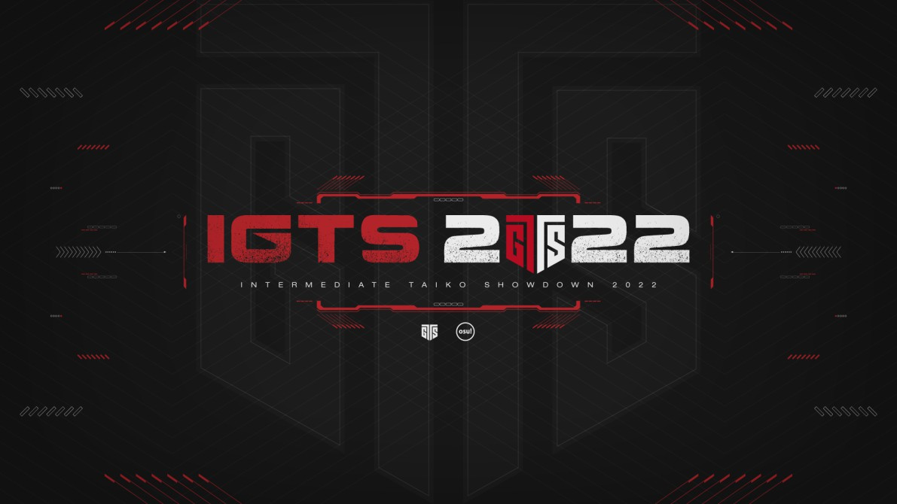

---
tags:
  - IGTS2022
  - IGTS
  - GTS
---

# Intermediate Global Taiko Showdown 2022

The **Intermediate Global Taiko Showdown 2022** (***IGTS 2022***) was a worldwide double-elimination osu!taiko tournament hosted by ::{ flag=FR }:: [Briesmas](https://osu.ppy.sh/users/2865172) and ::{ flag=FR }:: [Kasumi-sama](https://osu.ppy.sh/users/6177263). Players ranked between #4,500 and #10,000 were able to participate. It was the fifth instalment of the Intermediate Global Taiko Showdown and part of the Global Taiko Showdown series.

## Tournament schedule

| Event | Timestamp |
| --: | :-- |
| Registration phase | 2022-02-05/2022-03-06 |
| Screening phase | 2022-03-06/2022-03-19 |
| Qualifiers | 2022-03-26/2022-03-27 |
| Group Stage | 2022-04-02/2022-04-03 |
| Round of 16 | 2022-04-09/2022-04-10 |
| Quarterfinals | 2022-04-16/2022-04-17 |
| Semifinals | 2022-04-23/2022-04-24 |
| Finals | 2022-04-30/2022-05-01 |
| All Stars & Grand Finals | 2022-05-07/2022-05-08 |

## Prizes

| Placing | Prize(s) |
| :-: | :-- |
|  | Unique profile badge, exclusive team banner |
|  | Exclusive team banner |
|  | Exclusive team banner |

## Organisation

The Intermediate Global Taiko Showdown 2022 was run by various community members.

| Position | Member(s) |
| :-- | :-- |
| Organiser | ::{ flag=FR }:: [Briesmas](https://osu.ppy.sh/users/2865172), ::{ flag=FR }:: [Kasumi-sama](https://osu.ppy.sh/users/6177263) |
| Head mappooler | ::{ flag=HK }:: [Brown918](https://osu.ppy.sh/users/9805760), ::{ flag=US }:: [Cychloryn](https://osu.ppy.sh/users/6921736), ::{ flag=FR }:: [Briesmas](https://osu.ppy.sh/users/2865172), ::{ flag=EC }:: [Gamelan4](https://osu.ppy.sh/users/9856910) |
| Mapper | ::{ flag=MY }:: [\[Zeth\]](https://osu.ppy.sh/users/9912966), ::{ flag=SG }:: [\_gt](https://osu.ppy.sh/users/8301957), ::{ flag=FR }:: [\_yosh](https://osu.ppy.sh/users/7157133), ::{ flag=SG }:: [arcpotato](https://osu.ppy.sh/users/12842392), ::{ flag=HK }:: [BlackBN](https://osu.ppy.sh/users/6291741), ::{ flag=NL }:: [Boaz](https://osu.ppy.sh/users/13302996), ::{ flag=MY }:: [cdh](https://osu.ppy.sh/users/2403621), ::{ flag=VN }:: [davidminh0111](https://osu.ppy.sh/users/9623142), ::{ flag=JP }:: [Eriha](https://osu.ppy.sh/users/16320311), ::{ flag=PH }:: [Fynbi](https://osu.ppy.sh/users/2164993), ::{ flag=TN }:: [Hivie](https://osu.ppy.sh/users/14102976), ::{ flag=JP }:: [KuroKuroKuro](https://osu.ppy.sh/users/11931563), ::{ flag=TH }:: [Kusuhara Yui](https://osu.ppy.sh/users/9582525), ::{ flag=MY }:: [ler1211](https://osu.ppy.sh/users/19901680), ::{ flag=JP }:: [Maimaing](https://osu.ppy.sh/users/14520910), ::{ flag=AR }:: [Megafan](https://osu.ppy.sh/users/6632605), ::{ flag=MY }:: [MTNTWarz](https://osu.ppy.sh/users/14036825), ::{ flag=CL }:: [Necromancy-](https://osu.ppy.sh/users/1890084), ::{ flag=RU }:: [Nozdormu](https://osu.ppy.sh/users/7169208), ::{ flag=TH }:: [Ph0eNiiXZ](https://osu.ppy.sh/users/9463721), ::{ flag=CA }:: [Senko-san](https://osu.ppy.sh/users/2065771), ::{ flag=DE }:: [Sayira](https://osu.ppy.sh/users/7253958), ::{ flag=JP }:: [Seren58](https://osu.ppy.sh/users/15252950), ::{ flag=AR }:: [trollocat](https://osu.ppy.sh/users/9228032), ::{ flag=CN }:: [UnagiDon](https://osu.ppy.sh/users/2062410) |
| Mappool showcase | ::{ flag=HK }:: [-Storm7-](https://osu.ppy.sh/users/12248285), ::{ flag=JP }:: [Grape\_Tea](https://osu.ppy.sh/users/9540073), ::{ flag=US }:: [ITotallyGetThat](https://osu.ppy.sh/users/8770622), ::{ flag=GB }:: [My Angel Subaru](https://osu.ppy.sh/users/17797595), ::{ flag=US }:: [SlipperyPickle](https://osu.ppy.sh/users/11969691), ::{ flag=DE }:: [Zephyte](https://osu.ppy.sh/users/3867109) |
| Referee | ::{ flag=US }:: [9\_9](https://osu.ppy.sh/users/7700831), ::{ flag=TW }:: [\[-Neon-\]](https://osu.ppy.sh/users/10530606), ::{ flag=MY }:: [\[Zeth\]](https://osu.ppy.sh/users/9912966), ::{ flag=HK }:: [Akali393394](https://osu.ppy.sh/users/9686628), ::{ flag=SG }:: [arcpotato](https://osu.ppy.sh/users/12842392), ::{ flag=NL }:: [Boaz](https://osu.ppy.sh/users/13302996), ::{ flag=BE }:: [Brentywenty](https://osu.ppy.sh/users/22753946), ::{ flag=FR }:: [Briesmas](https://osu.ppy.sh/users/2865172), ::{ flag=US }:: [Chupalika](https://osu.ppy.sh/users/1926383), ::{ flag=LV }:: [Huntey](https://osu.ppy.sh/users/14451706), ::{ flag=US }:: [JDrago14](https://osu.ppy.sh/users/7690078), ::{ flag=FR }:: [Kasumi-sama](https://osu.ppy.sh/users/6177263), ::{ flag=US }:: [Kinovia](https://osu.ppy.sh/users/10674189), ::{ flag=TH }:: [Kusuhara Yui](https://osu.ppy.sh/users/9582525), ::{ flag=DE }:: [Penggwin](https://osu.ppy.sh/users/14050018), ::{ flag=DE }:: [QEpicAce](https://osu.ppy.sh/users/9489153), ::{ flag=ID }:: [Reen](https://osu.ppy.sh/users/3285139), ::{ flag=KR }:: [South Korea](https://osu.ppy.sh/users/12242622), ::{ flag=DE }:: [TheHunter1](https://osu.ppy.sh/users/6496016), ::{ flag=NO }:: [Vendelicious](https://osu.ppy.sh/users/8818089) |
| Streamer | ::{ flag=HK }:: [-Storm7-](https://osu.ppy.sh/users/12248285), ::{ flag=KR }:: [4\_4](https://osu.ppy.sh/users/1152851), ::{ flag=US }:: [Chupalika](https://osu.ppy.sh/users/1926383), ::{ flag=US }:: [ITotallyGetThat](https://osu.ppy.sh/users/8770622), ::{ flag=FR }:: [Kasumi-sama](https://osu.ppy.sh/users/6177263), ::{ flag=TH }:: [Kusuhara Yui](https://osu.ppy.sh/users/9582525), ::{ flag=DE }:: [Penggwin](https://osu.ppy.sh/users/14050018), ::{ flag=US }:: [Rukairi](https://osu.ppy.sh/users/6642597), ::{ flag=SG }:: [Rycy](https://osu.ppy.sh/users/7394522), ::{ flag=KR }:: [South Korea](https://osu.ppy.sh/users/12242622) |
| Commentator | ::{ flag=US }:: [-Schwarts](https://osu.ppy.sh/users/4673649), ::{ flag=US }:: [5\_5](https://osu.ppy.sh/users/6853438), ::{ flag=CA }:: [6\_6](https://osu.ppy.sh/users/5207783), ::{ flag=TW }:: [\[-Neon-\]](https://osu.ppy.sh/users/10530606), ::{ flag=FR }:: [Briesmas](https://osu.ppy.sh/users/2865172), ::{ flag=CL }:: [Catulus](https://osu.ppy.sh/users/6276709), ::{ flag=US }:: [driodx](https://osu.ppy.sh/users/9709548), ::{ flag=GB }:: [El Jamon Juegos](https://osu.ppy.sh/users/12232503), ::{ flag=GB }:: [Ethereal\_Winter](https://osu.ppy.sh/users/9780417), ::{ flag=US }:: [ETHN](https://osu.ppy.sh/users/9536977), ::{ flag=ES }:: [Helox](https://osu.ppy.sh/users/18275040), ::{ flag=ES }:: [hunterjos](https://osu.ppy.sh/users/10733787), ::{ flag=DE }:: [Joogs](https://osu.ppy.sh/users/8844167), ::{ flag=TH }:: [Kusuhara Yui](https://osu.ppy.sh/users/9582525), ::{ flag=CO }:: [L1ght](https://osu.ppy.sh/users/9050875), ::{ flag=RU }:: [mekkimous](https://osu.ppy.sh/users/17381947), ::{ flag=DE }:: [Minekuchi](https://osu.ppy.sh/users/9584873), ::{ flag=GB }:: [My Angel Subaru](https://osu.ppy.sh/users/17797595), ::{ flag=GB }:: [overdahedge2014](https://osu.ppy.sh/users/9864847), ::{ flag=US }:: [PorkIsGreat](https://osu.ppy.sh/users/10756322), ::{ flag=DE }:: [QEpicAce](https://osu.ppy.sh/users/9489153), ::{ flag=CA }:: [Senko-san](https://osu.ppy.sh/users/2065771), ::{ flag=HK }:: [shikuro\_re](https://osu.ppy.sh/users/9338943), ::{ flag=US }:: [SlipperyPickle](https://osu.ppy.sh/users/11969691), ::{ flag=KR }:: [South Korea](https://osu.ppy.sh/users/12242622), ::{ flag=NL }:: [StrijkIjzer](https://osu.ppy.sh/users/4130926), ::{ flag=GB }:: [willowww](https://osu.ppy.sh/users/11406987), ::{ flag=HK }:: [YonGin](https://osu.ppy.sh/users/7109317) |
| Designer | ::{ flag=KR }:: [POCARI SWEAT](https://osu.ppy.sh/users/5082685) |
| Recruiter | ::{ flag=TW }:: [\[-Neon-\]](https://osu.ppy.sh/users/10530606), ::{ flag=US }:: [9\_9](https://osu.ppy.sh/users/7700831), ::{ flag=FR }:: [Briesmas](https://osu.ppy.sh/users/2865172), ::{ flag=LV }:: [Huntey](https://osu.ppy.sh/users/14451706), ::{ flag=ID }:: [Reed_405](https://osu.ppy.sh/users/9965069), ::{ flag=HK }:: [shikuro\_re](https://osu.ppy.sh/users/9338943), ::{ flag=JP }:: [shiroino](https://osu.ppy.sh/users/1751879) |
| Translator | ::{ flag=SG }:: [arcpotato](https://osu.ppy.sh/users/12842392), ::{ flag=FR }:: [Briesmas](https://osu.ppy.sh/users/2865172), ::{ flag=DE }:: [QEpicAce](https://osu.ppy.sh/users/9489153), ::{ flag=DE }:: [Sayira](https://osu.ppy.sh/users/7253958), ::{ flag=HK }:: [shikuro\_re](https://osu.ppy.sh/users/9338943), ::{ flag=JP }:: [shiroino](https://osu.ppy.sh/users/1751879), ::{ flag=CN }:: [WonderMan](https://osu.ppy.sh/users/2221895) |
| Developer | ::{ flag=US }:: [Chupalika](https://osu.ppy.sh/users/1926383), ::{ flag=US }:: [Cychloryn](https://osu.ppy.sh/users/6921736), ::{ flag=FR }:: [ThePooN](https://osu.ppy.sh/users/718454) |
| Wiki editor | ::{ flag=ID }:: [fajar13k](https://osu.ppy.sh/users/7100002) |

## Links

- [Discussion thread](https://osu.ppy.sh/community/forums/topics/1525704)
- Discord server
  - [GTS server](https://discord.gg/3mGC3HB)
  - [IGTS server](https://discord.gg/a6PzzFz)
- [GTS website](https://gtsosu.com/igts/home)
- Livestream
  - [GTSosu](https://www.twitch.tv/gtsosu)
  - [GTSosu\_b](https://www.twitch.tv/gtsosu_b)
- [Challonge bracket](https://challonge.com/IGTS2022)
- [Pick'em predictions website](https://pickem.hwc.hr/tournaments/83) hosted by ::{ flag=DE }:: [hallowatcher](https://osu.ppy.sh/users/1874761)

## Participants

|  | Team | Members |
| :-: | :-- | :-- |
| ::{ flag=AR }:: | **Argentina A** | **[galogk](https://osu.ppy.sh/users/7781648)**, [LemonDust](https://osu.ppy.sh/users/8065042), [Playersesamol](https://osu.ppy.sh/users/9288649) |
| ::{ flag=AR }:: | **Argentina B** | **[Santi199](https://osu.ppy.sh/users/9346502)**, [Alan Reaven](https://osu.ppy.sh/users/5422789), [hivstex](https://osu.ppy.sh/users/14597896), [VIolE\_](https://osu.ppy.sh/users/19213988) |
| ::{ flag=BE }:: | **Belgium** | **[autolsfanboy](https://osu.ppy.sh/users/10742890)**, [Xenosi](https://osu.ppy.sh/users/6157735) |
| ::{ flag=BR }:: | **Brazil** | **[gabrielmuniz](https://osu.ppy.sh/users/4598907)**, [Mixtrik](https://osu.ppy.sh/users/7902567) |
| ::{ flag=CA }:: | **Canada** | **[dots\_](https://osu.ppy.sh/users/15429414)**, [Aidrestan](https://osu.ppy.sh/users/11928691), [DimplesRMe](https://osu.ppy.sh/users/13348268), [Imacow46](https://osu.ppy.sh/users/4366403), [Phoenixien](https://osu.ppy.sh/users/13254473) |
| ::{ flag=CL }:: | **Chile** | **[Xeroblic](https://osu.ppy.sh/users/8004633)**, [\[ w q l f \]](https://osu.ppy.sh/users/11966019), [Mr Benya kun](https://osu.ppy.sh/users/17429506) |
| ::{ flag=CN }:: | **China** | **[154s8a6](https://osu.ppy.sh/users/7562543)**, [imzk](https://osu.ppy.sh/users/2526837), [lolol727](https://osu.ppy.sh/users/15030466), [shenglinnn](https://osu.ppy.sh/users/10286018) |
| ::{ flag=CO }:: | **Colombia** | **[Carlosflow](https://osu.ppy.sh/users/11940767)**, [Alidrio73](https://osu.ppy.sh/users/23292800), [JhonDarkness](https://osu.ppy.sh/users/9116107), [ParraCharlie](https://osu.ppy.sh/users/18425848) |
| ::{ flag=FI }:: | **Finland** | **[Mesda](https://osu.ppy.sh/users/5049430)**, [Minami-Kotori](https://osu.ppy.sh/users/3083539) |
| ::{ flag=FR }:: | **France** | **[Reia](https://osu.ppy.sh/users/2672643)**, [Haypzeh](https://osu.ppy.sh/users/9950381), [Nozuchi](https://osu.ppy.sh/users/5858447), [Sobarashi](https://osu.ppy.sh/users/14105435), [thereal8tsu](https://osu.ppy.sh/users/24854553) |
| ::{ flag=DE }:: | **Germany A** | **[ph1](https://osu.ppy.sh/users/22194163)**, [Horsti](https://osu.ppy.sh/users/21774764), [LilacCos](https://osu.ppy.sh/users/12265200), [Max Schradin](https://osu.ppy.sh/users/3268096) |
| ::{ flag=DE }:: | **Germany B** | **[Musubi](https://osu.ppy.sh/users/9562353)**, [Njorn5](https://osu.ppy.sh/users/14021759), [OcklePod](https://osu.ppy.sh/users/7094393), [VANCANTORUS](https://osu.ppy.sh/users/12820940) |
| ::{ flag=HK }:: | **Hong Kong** | **[YonGin](https://osu.ppy.sh/users/7109317)**, [autofanboy](https://osu.ppy.sh/users/636114), [boeing747](https://osu.ppy.sh/users/5975021), [Tsuwagi](https://osu.ppy.sh/users/9313951) |
| ::{ flag=ID }:: | **Indonesia A** | **[Zedfish](https://osu.ppy.sh/users/22615825)**, [AciTelor](https://osu.ppy.sh/users/16390988), [Sagasemat](https://osu.ppy.sh/users/16761278), [Sleepti](https://osu.ppy.sh/users/7137930), [Tegarpmngks](https://osu.ppy.sh/users/8819702) |
| ::{ flag=ID }:: | **Indonesia B** | **[raynald](https://osu.ppy.sh/users/25094413)**, [salym](https://osu.ppy.sh/users/19089549), [tjandra](https://osu.ppy.sh/users/13695950), [Zest2822](https://osu.ppy.sh/users/24002878) |
| ::{ flag=IT }:: | **Italy** | **[CAZZO ANTONIO](https://osu.ppy.sh/users/20822544)**, [DarkGiangi](https://osu.ppy.sh/users/16896082), [davipetre](https://osu.ppy.sh/users/22524142), [neymar95you](https://osu.ppy.sh/users/4734947), [silvia\_osu](https://osu.ppy.sh/users/22074782) |
| ::{ flag=JP }:: | **Japan A** | **[PetitRabbit](https://osu.ppy.sh/users/16716194)**, [KleCru\_Ranma](https://osu.ppy.sh/users/15868630), [kumakki](https://osu.ppy.sh/users/11680013), [MODE\_SP](https://osu.ppy.sh/users/15010333), [WhiteSakata](https://osu.ppy.sh/users/15400295) |
| ::{ flag=JP }:: | **Japan B** | **[basshhii0610](https://osu.ppy.sh/users/27997121)**, [empoyo\_silva](https://osu.ppy.sh/users/15882542), [hinun](https://osu.ppy.sh/users/21642305) |
| ::{ flag=LT }:: | **Lithuania** | **[eimazuba](https://osu.ppy.sh/users/8513077)**, [Strategas](https://osu.ppy.sh/users/2971837) |
| ::{ flag=MY }:: | **Malaysia** | **[JoelG 12](https://osu.ppy.sh/users/18403677)**, [5oulpoint](https://osu.ppy.sh/users/10194919), [AstralLoki](https://osu.ppy.sh/users/14100384), [Haryume](https://osu.ppy.sh/users/9351030), [Koeil](https://osu.ppy.sh/users/16663752) |
| ::{ flag=MX }:: | **Mexico** | **[Hivan111](https://osu.ppy.sh/users/13525805)**, [Ganz0](https://osu.ppy.sh/users/26193210), [Yawlo](https://osu.ppy.sh/users/10869622) |
| ::{ flag=NZ }:: | **New Zealand** | **[Bulturst](https://osu.ppy.sh/users/14777912)**, [g l o w g l o w](https://osu.ppy.sh/users/13701453) |
| ::{ flag=NO }:: | **Norway** | **[Defectum](https://osu.ppy.sh/users/8631719)**, [wohooooooo](https://osu.ppy.sh/users/3095685) |
| ::{ flag=PE }:: | **Peru** | **[FabriGamer84](https://osu.ppy.sh/users/20882798)**, [DaKub](https://osu.ppy.sh/users/11885200), [StarrySergal](https://osu.ppy.sh/users/14429959) |
| ::{ flag=PH }:: | **Philippines** | **[Shiori Shiomiya](https://osu.ppy.sh/users/11154860)**, [-Birds-](https://osu.ppy.sh/users/15273352), [Euanofthedead](https://osu.ppy.sh/users/15676812), [Syntoxical](https://osu.ppy.sh/users/18105116), [Vanossfoxy24](https://osu.ppy.sh/users/21152418) |
| ::{ flag=PL }:: | **Poland** | **[LewusekX44](https://osu.ppy.sh/users/9997359)**, [-Green tea-](https://osu.ppy.sh/users/12130367), [FuGuS](https://osu.ppy.sh/users/6537593), [pypieci909](https://osu.ppy.sh/users/7843038), [Szafa11x](https://osu.ppy.sh/users/14075839) |
| ::{ flag=PT }:: | **Portugal** | **[ImDem0nPT](https://osu.ppy.sh/users/12733839)**, [Warpzoned](https://osu.ppy.sh/users/18649724) |
| ::{ flag=RU }:: | **Russian Federation** | **[Vasyadogs](https://osu.ppy.sh/users/7239762)**, [AlloRus](https://osu.ppy.sh/users/16418971), [Kandelion](https://osu.ppy.sh/users/20779044), [mekkimous](https://osu.ppy.sh/users/17381947), [SergoM4444](https://osu.ppy.sh/users/10515166) |
| ::{ flag=SG }:: | **Singapore** | **[helios44](https://osu.ppy.sh/users/7838361)**, [AngelicK0](https://osu.ppy.sh/users/14319366), [Kings](https://osu.ppy.sh/users/1016926), [lovemathboy](https://osu.ppy.sh/users/4220829) |
| ::{ flag=KR }:: | **South Korea** | **[Civil oath](https://osu.ppy.sh/users/3216107)**, [0Lo](https://osu.ppy.sh/users/21598290), [Amamya](https://osu.ppy.sh/users/1997633) |
| ::{ flag=ES }:: | **Spain** | **[Pollo del KFC](https://osu.ppy.sh/users/20047906)**, [9237](https://osu.ppy.sh/users/28604533), [\[-Vappy-\]](https://osu.ppy.sh/users/10588504), [Helox](https://osu.ppy.sh/users/18275040), [WIzh](https://osu.ppy.sh/users/25458009) |
| ::{ flag=SE }:: | **Sweden** | **[TpSlimigt](https://osu.ppy.sh/users/2813324)**, [MCR](https://osu.ppy.sh/users/16064026), [NinjaKitty](https://osu.ppy.sh/users/4331767) |
| ::{ flag=TW }:: | **Taiwan** | **[-Maruko-](https://osu.ppy.sh/users/16494567)**, [HaHaNa](https://osu.ppy.sh/users/6951543), [Joylintp](https://osu.ppy.sh/users/13579078), [Mashyuf](https://osu.ppy.sh/users/14356517), [X\_rrrr\_X](https://osu.ppy.sh/users/15478284) |
| ::{ flag=TH }:: | **Thailand** | **[\[ Naris \]](https://osu.ppy.sh/users/7033479)**, [krakenlord420](https://osu.ppy.sh/users/13238024), [poomzza](https://osu.ppy.sh/users/7617580), [ppgamer](https://osu.ppy.sh/users/7172288) |
| ::{ flag=GB }:: | **United Kingdom A** | **[Ethereal\_Winter](https://osu.ppy.sh/users/9780417)**, [arialle](https://osu.ppy.sh/users/18597899), [Fyll-nds](https://osu.ppy.sh/users/14878199), [MaranTheLemon](https://osu.ppy.sh/users/13969379), [esperism](https://osu.ppy.sh/users/16583271) |
| ::{ flag=GB }:: | **United Kingdom B** | **[Fluxey](https://osu.ppy.sh/users/9098192)**, [Greninja](https://osu.ppy.sh/users/8579186), [JudePrice11](https://osu.ppy.sh/users/10494749) |
| ::{ flag=US }:: | **United States A** | **[BlitzArk](https://osu.ppy.sh/users/7330584)**, [bvyans](https://osu.ppy.sh/users/7789926), [CacoPholey](https://osu.ppy.sh/users/11722058), [Lecter](https://osu.ppy.sh/users/5121499) |
| ::{ flag=US }:: | **United States B** | **[Vitamim](https://osu.ppy.sh/users/16700987)**, [Cm0nsters](https://osu.ppy.sh/users/10951981), [LuriCookie](https://osu.ppy.sh/users/9517612), [Morivv](https://osu.ppy.sh/users/14961676), [Nyahnny](https://osu.ppy.sh/users/16807933) |
| ::{ flag=VE }:: | **Venezuela** | **[RaFaReAcH](https://osu.ppy.sh/users/10491903)**, [PikachuMeh](https://osu.ppy.sh/users/10524500) |
| ::{ flag=VN }:: | **Vietnam A** | **[njshift1](https://osu.ppy.sh/users/16688499)**, [-M\_A\_T\_C\_H\_A-](https://osu.ppy.sh/users/26012543), [-Triet-](https://osu.ppy.sh/users/26266042), [Creeperbrine303](https://osu.ppy.sh/users/22515524) |
| ::{ flag=VN }:: | **Vietnam B** | **[MyWifeMiku](https://osu.ppy.sh/users/21290592)**, [DeepInDark](https://osu.ppy.sh/users/19817503), [hi\_there\_osu](https://osu.ppy.sh/users/22698999) |

## All Stars participants

Both teams were formed by a vote held in the IGTS Discord server. Participants with the most votes got to be the captain for each team, and the rest of the members were decided by rankings as stated in the [All Stars rules](#all-stars-rules).

| Team | Members |
| :-- | :-- |
| **Briesman fan club** | ::{ flag=CA }:: **[dots\_](https://osu.ppy.sh/users/15429414)**, ::{ flag=HK }:: [autofanboy](https://osu.ppy.sh/users/636114), ::{ flag=JP }:: [basshhii0610](https://osu.ppy.sh/users/27997121), ::{ flag=GB }:: [Ethereal\_Winter](https://osu.ppy.sh/users/9780417), ::{ flag=US }:: [LuriCookie](https://osu.ppy.sh/users/9517612), ::{ flag=VN }:: [njshift1](https://osu.ppy.sh/users/16688499) |
| **Yongong.gif** | ::{ flag=HK }:: **[YonGin](https://osu.ppy.sh/users/7109317)**, ::{ flag=PL }:: [-Green tea-](https://osu.ppy.sh/users/12130367), ::{ flag=CO }:: [Carlosflow](https://osu.ppy.sh/users/11940767), ::{ flag=KR }:: [Civil oath](https://osu.ppy.sh/users/3216107), ::{ flag=JP }:: [kumakki](https://osu.ppy.sh/users/11680013), ::{ flag=ES }:: [Pollo del KFC](https://osu.ppy.sh/users/20047906) |

## Groups

| Group | Top seed | High seed | Low seed | Unseeded |
| :-: | :-- | :-- | :-- | :-- |
| **A** | ::{ flag=RU }:: Russian Federation | ::{ flag=US }:: United States B | ::{ flag=VN }:: Vietnam A | ::{ flag=CL }:: Chile |
| **B** | ::{ flag=US }:: United States A | ::{ flag=PH }:: Philippines | ::{ flag=KR }:: South Korea | ::{ flag=AR }:: Argentina A |
| **C** | ::{ flag=JP }:: Japan A | ::{ flag=DE }:: Germany A | ::{ flag=MY }:: Malaysia | ::{ flag=AR }:: Argentina B |
| **D** | ::{ flag=HK }:: Hong Kong | ::{ flag=GB }:: United Kingdom A | ::{ flag=GB }:: United Kingdom B | ::{ flag=PT }:: Portugal |
| **E** | ::{ flag=SG }:: Singapore | ::{ flag=CA }:: Canada | ::{ flag=ID }:: Indonesia B | ::{ flag=JP }:: Japan B |
| **F** | ::{ flag=CN }:: China | ::{ flag=PL }:: Poland | ::{ flag=ES }:: Spain | ::{ flag=BE }:: Belgium |
| **G** | ::{ flag=ID }:: Indonesia A | ::{ flag=TW }:: Taiwan | ::{ flag=FR }:: France | ::{ flag=DE }:: Germany B |
| **H** | ::{ flag=CO }:: Colombia | ::{ flag=TH }:: Thailand | ::{ flag=IT }:: Italy | ::{ flag=MX }:: Mexico |

## Podium

This competition has come to an end and resulted in the following podium:

| Placing | Team |
| :-: | :-- |
|  | ::{ flag=JP }:: **Japan A** (**[PetitRabbit](https://osu.ppy.sh/users/16716194)**, [KleCru\_Ranma](https://osu.ppy.sh/users/15868630), [kumakki](https://osu.ppy.sh/users/11680013), [MODE\_SP](https://osu.ppy.sh/users/15010333), [WhiteSakata](https://osu.ppy.sh/users/15400295)) |
|  | ::{ flag=HK }:: **Hong Kong** (**[YonGin](https://osu.ppy.sh/users/7109317)**, [autofanboy](https://osu.ppy.sh/users/636114), [boeing747](https://osu.ppy.sh/users/5975021), [Tsuwagi](https://osu.ppy.sh/users/9313951)) |
|  | ::{ flag=US }:: **United States B** (**[Vitamim](https://osu.ppy.sh/users/16700987)**, [Cm0nsters](https://osu.ppy.sh/users/10951981), [LuriCookie](https://osu.ppy.sh/users/9517612), [Morivv](https://osu.ppy.sh/users/14961676), [Nyahnny](https://osu.ppy.sh/users/16807933)) |

## Mappools

### Grand Finals

**This mappool was played during Grand Finals and the All Stars stage.**

**[Download the mappack here! (81 MB)](https://mega.nz/file/DFI2zR7Z#mUHq4nCM1WW6UY8mcxghYh3XgZjJMyABlpSiyNLp98s)**

- NoMod
  1. [katagiri - We are not the kyuutie Ladies (Hivie) \[Hivie & Kuro's Kyuutie Collab\]](https://osu.ppy.sh/beatmapsets/1754869#taiko/3591266)
  2. [wataame - mono crossroad (Sped Up Ver.) (arcpotato) \[monochrome\]](https://osu.ppy.sh/beatmapsets/1754864#taiko/3591260)
  3. [Camellia - ORCA (Cychloryn) \[Inner Salmon\]](https://osu.ppy.sh/beatmapsets/1754853#taiko/3591233)
  4. [KryptoDigital - Fallen Theory (Sayira) \[Gimmick Theory\]](https://osu.ppy.sh/beatmapsets/1754808#taiko/3591169)
  5. [MYUKKE. - Quinsialyn (Necromancy-) \[Almighty Enchantress\]](https://osu.ppy.sh/beatmapsets/1754876#taiko/3591274)
  6. [Laur feat. Mishamo - Let's! Miracle\*HARDCORE! (\_yosh) \[cute & funny collab\]](https://osu.ppy.sh/beatmapsets/1754885#taiko/3591291)
- Hidden
  1. [Luze - Eta Beta Eta (Kusuhara Yui) \[Oni\]](https://osu.ppy.sh/beatmapsets/1754851#taiko/3591231)
  2. [Colors\*Slash - Colors Power ni Omakasero! (Sober Bear Remix) (Nozdormu) \[My Love for IGTS Players is Immeasurable\]](https://osu.ppy.sh/beatmapsets/1754881#taiko/3591286)
- HardRock
  1. [Team Grimoire - saQrifice (MTNTWarz) \[eXitium\]](https://osu.ppy.sh/beatmapsets/1754797#taiko/3591139)
  2. [MisoilePunch - Mesheer (Ph0eNiiXZ) \[Oni\]](https://osu.ppy.sh/beatmapsets/1754844#taiko/3591222)
- DoubleTime
  1. [25-ji, Nightcord de. x Hatsune Miku - Tricologe (cdh) \[Faint Elpis\]](https://osu.ppy.sh/beatmapsets/1754890#taiko/3591296)
  2. [Ryokuoushoku Shakai - Little Singer (Seren58) \[Be Myself\]](https://osu.ppy.sh/beatmapsets/1754849#taiko/3591228)
- FreeMod
  1. [ak+q - Ardentium Nova (Megafan) \[Cosmic Destiny\]](https://osu.ppy.sh/beatmapsets/1099242#taiko/3591303)
  2. [7mai - Chelsea (davidminh0111) \[>w<\]](https://osu.ppy.sh/beatmapsets/1754898#taiko/3591312)
  3. [Zekk - Burn (UnagiDon) \[Overheat\]](https://osu.ppy.sh/beatmapsets/1754897#taiko/3591311)
- Tiebreaker
  1. **[Sparxe - Zinnober (Gamelan4) \[Scarlet Heist\]](https://osu.ppy.sh/beatmapsets/1754903#taiko/3591317)**

### Finals

**[Download the mappack here! (84 MB)](https://mega.nz/file/GbZkzLiL#NBTFlkQqzpT6N-Qf4B79PkFBlat95vLlhyEpo_oFZFo)**

- NoMod
  1. [Kano - Platonic Love (ler1211) \[Platonic Collab\]](https://osu.ppy.sh/beatmapsets/1749823#taiko/3579780)
  2. [t+pazolite - Garakuta Doll Play (davidminh0111) \[hehe\]](https://osu.ppy.sh/beatmapsets/1749829#taiko/3579789)
  3. [LeaF - Ka (Eyenine) \[Oni\]](https://osu.ppy.sh/beatmapsets/1530955#taiko/3131352)
  4. [PinocchioP - God-ish feat. Hatsune Miku (Fynbi) \[Oni-ish\]](https://osu.ppy.sh/beatmapsets/1749833#taiko/3579796)
  5. [Collapsed Plug - Acceleration Insanity (Miyoi) \[uone's Oni\]](https://osu.ppy.sh/beatmapsets/1716645#taiko/3521892)
  6. [sakuraburst - Glacierfall (Park Remix) (Finana Ryugu) \[oni\]](https://osu.ppy.sh/beatmapsets/1580490#taiko/3300423)
- Hidden
  1. [Mitsukiyo - Summer Bounce (Senko-san) \[Collab Oni\]](https://osu.ppy.sh/beatmapsets/1749807#taiko/3579747)
  2. [rehirable - Shalalala Amen 2 (Briesmas) \[Oni\]](https://osu.ppy.sh/beatmapsets/1749873#taiko/3579889)
- HardRock
  1. [NIWASHI - Y (sendol) \[O\]](https://osu.ppy.sh/beatmapsets/1698690#taiko/3472930)
  2. [USAO - Blows Up Everything (KuroKuroKuro) \[KurOni (IGTS Ver.)\]](https://osu.ppy.sh/beatmapsets/1749718#taiko/3579570)
- DoubleTime
  1. [Azealia Banks - 212 (feat. Lazy Jay) (Ney) \[Oni\]](https://osu.ppy.sh/beatmapsets/716931#taiko/1522659)
  2. [THE BINARY - Zurukute Sugoi (arcpotato) \[I Got Too Sad\]](https://osu.ppy.sh/beatmapsets/1749847#taiko/3579830)
- FreeMod
  1. [ginkiha x t+pazolite x Hommarju - CROSSING DELTA (Ph0eNiiXZ) \[ONI (IGTS Ver.)\]](https://osu.ppy.sh/beatmapsets/1749855#taiko/3579855)
  2. [#EmoCosine - VIVID DEBUT! (Lamery) \[Oni (Edit Ver.)\]](https://osu.ppy.sh/beatmapsets/1300202#taiko/3578303)
  3. [SEVENTH SISTERS - SEVENTH HAVEN (Mtell Remix) (ler1211) \[ONI (IGTS ver.)\]](https://osu.ppy.sh/beatmapsets/1749857#taiko/3579863)
- Tiebreaker
  1. **[Camellia - Tornado (incandescence) \[Nardo's EF-4\]](https://osu.ppy.sh/beatmapsets/1110326#taiko/2584807)**

### Semifinals

**[Download the mappack here! (67 MB)](https://mega.nz/file/3fx2kSKR#6Rma8wBlMpQcqWMSmyVoMbqT7GILNf1ovjmPl_ex__M)**

- NoMod
  1. [Endorfin. - Luminous Rage -Feryquitous OrderBless Remix- (SKSalt) \[Oni\]](https://osu.ppy.sh/beatmapsets/942719#taiko/1968637)
  2. [Rohi - Slan Leat (Irone OSU) \[Oni\]](https://osu.ppy.sh/beatmapsets/1654909#taiko/3378065)
  3. [The Flashbulb - That Missing Week (Alternate) (ZTH) \[Oni\]](https://osu.ppy.sh/beatmapsets/931375#taiko/2209198)
  4. [Silentroom - Fallensquare (UnagiDon) \[Hiddencircle\]](https://osu.ppy.sh/beatmapsets/1744695#taiko/3568256)
  5. [LeaF - Aleph-0 (Nifty) \[Oni\]](https://osu.ppy.sh/beatmapsets/675465#taiko/1451091)
- Hidden
  1. [Raimukun - Firmament Star (Seren58) \[Radiance\]](https://osu.ppy.sh/beatmapsets/1744740#taiko/3568415)
  2. [siqlo - One Way Street (Faputa) \[Oni\]](https://osu.ppy.sh/beatmapsets/1272851#taiko/2898091)
- HardRock
  1. [kiraku - connection (Cynplytholowazy) \[Oni\]](https://osu.ppy.sh/beatmapsets/1183142#taiko/2466544)
  2. [masaka - Memories of Summer (Osamix) \[Oni\]](https://osu.ppy.sh/beatmapsets/622159#taiko/1311664)
- DoubleTime
  1. [bill wurtz - money (Senko-san) \[happy birthday\]](https://osu.ppy.sh/beatmapsets/1744752#taiko/3568443)
  2. [Ikuta Teru, Tachibana Rika, Ousaki Chiyo - Athanasia (Eriha) \[MASTER\]](https://osu.ppy.sh/beatmapsets/1744690#taiko/3568249)
- FreeMod
  1. [Hino Isuka - Moonheart (Mameyudoufu Remix) (Irone OSU) \[Oni\]](https://osu.ppy.sh/beatmapsets/1412393#taiko/2911527)
  2. [Feryquitous - Chat perdu (Boaz) \[Lost Cat\]](https://osu.ppy.sh/beatmapsets/1744044#taiko/3565664)
  3. [Ice meets t+pazolite - Wicked Ceremony (Fynbi) \[Oni\]](https://osu.ppy.sh/beatmapsets/1744763#taiko/3568472)
- Tiebreaker
  1. **[Kohta Takahashi - Move Me (siqlo's "Observatory Downhill" Bootleg) (Megafan) \[Megafan & davidminh's Grand Prix\]](https://osu.ppy.sh/beatmapsets/1744769#taiko/3568491)**

### Quarterfinals

**[Download the mappack here! (69 MB)](https://mega.nz/file/OGx3hLKA#_Dys144AvqEHubzd-em1hEo938VPSjyoVBAXuBKDLzs)**

- NoMod
  1. [Aoi Eir - Brainwash (BlackBN) \[Oni\]](https://osu.ppy.sh/beatmapsets/1739252#taiko/3554635)
  2. [G2 - Our Way (\_gt) \[I Got Tuberculo Sis\]](https://osu.ppy.sh/beatmapsets/1739162#taiko/3554440)
  3. [Purukichi - Encode (cdh) \[Oni\]](https://osu.ppy.sh/beatmapsets/1739270#taiko/3554688)
  4. [Brookes Brothers feat. Georgie Allen - New Wave (Nozdormu) \[Misdirection\]](https://osu.ppy.sh/beatmapsets/1739267#taiko/3554685)
  5. [Tennyson - L'oiseau qui danse (Nifty) \[Oni\]](https://osu.ppy.sh/beatmapsets/1509029#taiko/3205987)
- Hidden
  1. [Chicala Lpis - Skrik (Capu) \[Lite Oni\]](https://osu.ppy.sh/beatmapsets/1128817#taiko/2358277)
  2. [MYUKKE. - AI\[UE\]OON (ler1211) \[ONI (IGTS ver.)\]](https://osu.ppy.sh/beatmapsets/1739266#taiko/3554683)
- HardRock
  1. [Hakushi Hasegawa - Scary Point (woosungko) \[Oni\]](https://osu.ppy.sh/beatmapsets/1715489#taiko/3505282)
  2. [Getty vs. DJ DiA - SQUAD-Phvntom- (\_yosh) \[LITE ONI-Phvntom-\]](https://osu.ppy.sh/beatmapsets/1739280#taiko/3554708)
- DoubleTime
  1. [Fearofdark - Staying Afloat (feat. Danimal Cannon) (Megafan) \[Oni\]](https://osu.ppy.sh/beatmapsets/1738799#taiko/3553828)
  2. [Beniiro Litmus - Rin to Shite Saku Hana no Gotoku (Genjuro) \[Muzukashii\]](https://osu.ppy.sh/beatmapsets/1417157#taiko/2922011)
- FreeMod
  1. [mafumafu - Art wo Kagaku Suru (KuroKuroKuro) \[KurOni (IGTS Ver.)\]](https://osu.ppy.sh/beatmapsets/1739195#taiko/3554489)
  2. [Nekomata Master+ - Lost wing at.0 (yassu-) \[Oni\]](https://osu.ppy.sh/beatmapsets/768685#taiko/1617721)
  3. [Denkishiki Karen Ongaku Shuudan - Natsu no Owari (Soleily Remix) (Cut ver.) (Kusuhara Yui) \[Oni\]](https://osu.ppy.sh/beatmapsets/1738883#taiko/3553978)
- Tiebreaker
  1. **[EmoCosine - Black sour Ruby (ler1211) \[Oni\]](https://osu.ppy.sh/beatmapsets/1715813#taiko/3506667)**

### Round of 16

**[Download the mappack here! (70 MB)](https://mega.nz/file/6GIgyBjT#pHMrpYc_Cn6i6kN0ZEoAMhdCurQdDMsGSOVlHG-st_Y)**

- NoMod
  1. [KAF feat. KAFU - phony (komasy) \[oni\]](https://osu.ppy.sh/beatmapsets/1669463#taiko/3409444)
  2. [Lzie - Itte. (Nightcore amen Mix) (MTNTWarz) \[Please say it\]](https://osu.ppy.sh/beatmapsets/1733874#taiko/3543849)
  3. [Hatito - Floating (Gamelan4) \[Hover\]](https://osu.ppy.sh/beatmapsets/1733830#taiko/3543771)
  4. [factal - Flux (Megafan) \[Ichorous Group of Test Subjects\]](https://osu.ppy.sh/beatmapsets/1333664#taiko/3543519)
  5. [Sobrem x Silentroom - Random (rubies87) \[Oni\]](https://osu.ppy.sh/beatmapsets/1627748#taiko/3396772)
- Hidden
  1. [uno feat. Chiyoko (IOSYS) - Twin Rocket (Genjuro) \[Muzukashii\]](https://osu.ppy.sh/beatmapsets/1080416#taiko/2262980)
  2. [M2U - Felis (davidminh0111) \[Capu's Muzukashii\]](https://osu.ppy.sh/beatmapsets/1332612#taiko/2783010)
- HardRock
  1. [Cansol - 1,2,3,4! (uone) \[Muzukashii\]](https://osu.ppy.sh/beatmapsets/1658671#taiko/3390689)
  2. [Ookuni Kanon - Fuuen no 135-byou (GOD82028) \[Muzukashii\]](https://osu.ppy.sh/beatmapsets/1261365#taiko/2656168)
- DoubleTime
  1. [MYUKKE. - YOKKORA-SHOW-TIME (Necromancy-) \[IT'S-SHOW-TIME\]](https://osu.ppy.sh/beatmapsets/1734122#taiko/3544425)
  2. [BLACKPINK - Ice Cream (with Selena Gomez) (davidminh0111) \[Yum\]](https://osu.ppy.sh/beatmapsets/1734174#taiko/3544532)
- FreeMod
  1. [BPM15Q - GOOD LUCK (Cut Ver.) (Yuemiao) \[ONI\]](https://osu.ppy.sh/beatmapsets/1569340#taiko/3204745)
  2. [kamome sano - Rainmaker (UnagiDon) \[Light Rain Oni (IGTS ver)\]](https://osu.ppy.sh/beatmapsets/1734178#taiko/3544538)
  3. [Zekk - Vespera (\[Zeth\]) \[My Angel My Angel Subaru\]](https://osu.ppy.sh/beatmapsets/1733642#taiko/3543412)
- Tiebreaker
  1. **[Chito (CV: Minase Inori), Yuuri (CV: Kubo Yurika) - Ugoku, Ugoku (nenpulse bootleg remix) (Faputa) \[Black's Oni\]](https://osu.ppy.sh/beatmapsets/1408369#taiko/2920635)**

### Group Stage

**[Download the mappack here! (71 MB)](https://mega.nz/file/rIpVxbzJ#OMKrh_ovasfN3XgXrWFv0zVJvqYp7XV-MEYatmKlRqw)**

- NoMod
  1. [Yorushika - Gogatsu wa Hana Rokushou no Madobe Kara (Hivie) \[how the which\]](https://osu.ppy.sh/beatmapsets/1729133#taiko/3533767)
  2. [MisoilePunch \~Takenoko Soe\~ - Fin.ArcDeaR (arcpotato) \[Finale\]](https://osu.ppy.sh/beatmapsets/1729134#taiko/3533768)
  3. [Camellia - PURE SILVER (-Dusk) \[ZTH's Muzukashii\]](https://osu.ppy.sh/beatmapsets/1355679#taiko/3314161)
  4. [Jvla - Such a Whore (Stellular Remix) (trollocat) \[Twerking Cat\]](https://osu.ppy.sh/beatmapsets/1729146#taiko/3533810)
- Hidden
  1. [Ardolf - Chromatic (Fynbi) \[Muzukashii\]](https://osu.ppy.sh/beatmapsets/1538237#taiko/3145082)
  2. [Yunomi feat. nicamoq - Hachimitsu Adventure (komasy) \[Muzukashii\]](https://osu.ppy.sh/beatmapsets/767708#taiko/1614202)
- HardRock
  1. [NIWASHI - Sapphire On Fire (Hivie) \[Cychlo's Muzukashii\]](https://osu.ppy.sh/beatmapsets/1698611#taiko/3480430)
  2. [Yuma Mizoguchi feat. Ryuai Ose - Tie me down gently (davidminh0111) \[Muzukashii\]](https://osu.ppy.sh/beatmapsets/1729152#taiko/3533817)
- DoubleTime
  1. [Colorful Sounds Port feat. Sennzai - Jewelry Beans (Faputa) \[Muzukashii\]](https://osu.ppy.sh/beatmapsets/1234969#taiko/2609060)
  2. [Tsukino - Dohna Dohna no Uta (Ph0eNiiXZ) \[Muzukashii\]](https://osu.ppy.sh/beatmapsets/1729061#taiko/3533633)
- FreeMod
  1. [Nanawo Akari - One Room Sugar Life (Nozdormu) \[Muzukashii\]](https://osu.ppy.sh/beatmapsets/1729160#taiko/3533831)
  2. [Zekk - SUMMER (Cut Ver.) (Fynbi) \[MUZUKASHII\]](https://osu.ppy.sh/beatmapsets/1729166#taiko/3533840)
  3. [nitro - ignotus -afterburn- (Sayira) \[Muzukashii\]](https://osu.ppy.sh/beatmapsets/1729163#taiko/3533834)
- Tiebreaker
  1. **[tokiwa - Memoirs feat. Aitsuki Nakuru (\_Kobii) \[Fapu's Recollection\]](https://osu.ppy.sh/beatmapsets/976366#taiko/2043924)**

### Qualifiers

**[Download the mappack here! (32 MB)](https://mega.nz/file/7D5gjSYY#X1nyU0mZ48zV3fJv8V-koG_oZg9aO9YYk7DmGO5LMuU)**

- NoMod
  1. [An - Cochma (Ulqui) \[Quorum's Oni\]](https://osu.ppy.sh/beatmapsets/1381447#taiko/3319176)
  2. [Warak - Once Upon A Time (Nozdormu) \["Oni"\]](https://osu.ppy.sh/beatmapsets/1718822#taiko/3512624)
- Hidden
  1. [Memme - Goat Fantasia (Boaz) \[Dream\]](https://osu.ppy.sh/beatmapsets/1718798#taiko/3512555)
- HardRock
  1. [Getty vs. DJ DiA - Antifront Gears (Faputa) \[Muzukashii\]](https://osu.ppy.sh/beatmapsets/1043137#taiko/2330893)
- DoubleTime
  1. [Haruka Shimotsuki - Yuuki no Mahou (Kusuhara Yui) \[Muzukashii\]](https://osu.ppy.sh/beatmapsets/1718836#taiko/3512643)
- FreeMod
  1. [KEiNA - Karen Setsugetsuka (Artethia & Epsilon Remix) (yassu-) \[Oni\]](https://osu.ppy.sh/beatmapsets/953713#taiko/2003666)

## Match results

### All Stars

Sunday, 8 May 2022:

| Team 1 |  |  | Team 2 | Match link |
| --: | :-: | :-: | :-- | :-- |
| **Yongong gif** | **8** | 4 | Briesman fan club | [#1](https://osu.ppy.sh/community/matches/100452192) |

### Grand Finals

Saturday, 7 May 2022:

| Team 1 |  |  | Team 2 | Match link |
| --: | :-: | :-: | :-- | :-- |
| **Japan A** ::{ flag=JP }:: | **7** | 1 | ::{ flag=HK }:: Hong Kong | [#1](https://osu.ppy.sh/community/matches/100416615) |

### Finals

Saturday, 30 April 2022:

| Team 1 |  |  | Team 2 | Match link |
| --: | :-: | :-: | :-- | :-- |
| **Japan A** ::{ flag=JP }:: | **7** | 6 | ::{ flag=HK }:: Hong Kong | [#1](https://osu.ppy.sh/community/matches/100216582) |

Sunday, 1 May 2022:

| Team 1 |  |  | Team 2 | Match link |
| --: | :-: | :-: | :-- | :-- |
| **United States B** ::{ flag=US }:: | **7** | 6 | ::{ flag=US }:: United States A | [#1](https://osu.ppy.sh/community/matches/100240194) |
| **Hong Kong** ::{ flag=HK }:: | **7** | 5 | ::{ flag=US }:: United States B | [#1](https://osu.ppy.sh/community/matches/100259384) |

### Semifinals

Saturday, 23 April 2022:

| Team 1 |  |  | Team 2 | Match link |
| --: | :-: | :-: | :-- | :-- |
| United States A ::{ flag=US }:: | 3 | **6** | ::{ flag=HK }:: **Hong Kong** | [#1](https://osu.ppy.sh/community/matches/100008068) |
| Indonesia A ::{ flag=ID }:: | 4 | **6** | ::{ flag=JP }:: **Japan A** | [#1](https://osu.ppy.sh/community/matches/100022955) |
| United Kingdom A ::{ flag=GB }:: | 1 | **6** | ::{ flag=SG }:: **Singapore** | [#1](https://osu.ppy.sh/community/matches/100022808) |
| **United States B** ::{ flag=US }:: | **6** | 0 | ::{ flag=CA }:: Canada | [#1](https://osu.ppy.sh/community/matches/100038863) |

Sunday, 24 April 2022:

| Team 1 |  |  | Team 2 | Match link |
| --: | :-: | :-: | :-- | :-- |
| Indonesia A ::{ flag=ID }:: | 2 | **6** | ::{ flag=US }:: **United States B** | [#1](https://osu.ppy.sh/community/matches/100044387) |
| **United States A** ::{ flag=US }:: | **6** | 5 | ::{ flag=SG }:: Singapore | [#1](https://osu.ppy.sh/community/matches/100045708) |

### Quarterfinals

Saturday, 16 April 2022:

| Team 1 |  |  | Team 2 | Match link |
| --: | :-: | :-: | :-- | :-- |
| **United States B** ::{ flag=US }:: | **6** | 0 | ::{ flag=PH }:: Philippines | [#1](https://osu.ppy.sh/community/matches/99792969) |
| **China** ::{ flag=CN }:: | **6** | 2 | ::{ flag=DE }:: Germany A | [#1](https://osu.ppy.sh/community/matches/99802591) |
| **Hong Kong** ::{ flag=HK }:: | **6** | 1 | ::{ flag=CN }:: China | [#1](https://osu.ppy.sh/community/matches/99806715) |
| **Japan A** ::{ flag=JP }:: | **6** | 1 | ::{ flag=GB }:: United Kingdom A | [#1](https://osu.ppy.sh/community/matches/99806594) |
| **Singapore** ::{ flag=SG }:: | **6** | 1 | ::{ flag=DE }:: Germany A | [#1](https://osu.ppy.sh/community/matches/99808597) |
| Colombia ::{ flag=CO }:: | 1 | **6** | ::{ flag=ID }:: **Indonesia A** | [#1](https://osu.ppy.sh/community/matches/99810167) |
| **Taiwan** ::{ flag=TW }:: | **6** | 3 | ::{ flag=TH }:: Thailand | [#1](https://osu.ppy.sh/community/matches/99810264) |
| Spain ::{ flag=ES }:: | 3 | **6** | ::{ flag=CA }:: **Canada** | [#1](https://osu.ppy.sh/community/matches/99814699) |
| **United States A** ::{ flag=US }:: | **6** | 1 | ::{ flag=RU }:: Russian Federation | [#1](https://osu.ppy.sh/community/matches/99816514) |
| Russian Federation ::{ flag=RU }:: | 3 | **6** | ::{ flag=CA }:: **Canada** | [#1](https://osu.ppy.sh/community/matches/99820705) |

Sunday, 17 April 2022:

| Team 1 |  |  | Team 2 | Match link |
| --: | :-: | :-: | :-- | :-- |
| China ::{ flag=CN }:: | 5 | **6** | ::{ flag=US }:: **United States B** | [#1](https://osu.ppy.sh/community/matches/99829927) |
| Colombia ::{ flag=CO }:: | 4 | **6** | ::{ flag=SG }:: **Singapore** | [#1](https://osu.ppy.sh/community/matches/99831312) |
| **United Kingdom A** ::{ flag=GB }:: | **6** | 2 | ::{ flag=TW }:: Taiwan | [#1](https://osu.ppy.sh/community/matches/99846677) |

### Round of 16

Saturday, 9 April 2022:

| Team 1 |  |  | Team 2 | Match link |
| --: | :-: | :-: | :-- | :-- |
| **Indonesia A** ::{ flag=ID }:: | **6** | 1 | ::{ flag=PH }:: Philippines | [#1](https://osu.ppy.sh/community/matches/99563293) |
| Thailand ::{ flag=TH }:: | 3 | **6** | ::{ flag=RU }:: **Russian Federation** | [#1](https://osu.ppy.sh/community/matches/99568808) |
| **Japan A** ::{ flag=JP }:: | **6** | 2 | ::{ flag=ES }:: Spain | [#1](https://osu.ppy.sh/community/matches/99573148) |
| United States B ::{ flag=US }:: | 3 | **6** | ::{ flag=CO }:: **Colombia** | [#1](https://osu.ppy.sh/community/matches/99577866) |

Sunday, 10 April 2022:

| Team 1 |  |  | Team 2 | Match link |
| --: | :-: | :-: | :-- | :-- |
| **United States A** ::{ flag=US }:: | **6** | 0 | ::{ flag=TW }:: Taiwan | [#1](https://osu.ppy.sh/community/matches/99596886) |
| **China** ::{ flag=CN }:: | **6** | 1 | ::{ flag=DE }:: Germany A | [#1](https://osu.ppy.sh/community/matches/99608530) |
| **Hong Kong** ::{ flag=HK }:: | **6** | 1 | ::{ flag=SG }:: Singapore | [#1](https://osu.ppy.sh/community/matches/99612089) |
| Canada ::{ flag=CA }:: | 4 | **6** | ::{ flag=GB }:: **United Kingdom A** | [#1](https://osu.ppy.sh/community/matches/99624078) |

### Group Stage

Saturday, 2 April 2022:

| Team 1 |  |  | Team 2 | Match link |
| --: | :-: | :-: | :-- | :-- |
| Argentina B ::{ flag=AR }:: | 1 | **5** | ::{ flag=JP }:: **Japan A** | [#1](https://osu.ppy.sh/community/matches/99325365) |
| **United States B** ::{ flag=US }:: | **5** | 4 | ::{ flag=VN }:: Vietnam A | [#1](https://osu.ppy.sh/community/matches/99326720) |
| **United States A** ::{ flag=US }:: | **5** | 1 | ::{ flag=PH }:: Philippines | [#1](https://osu.ppy.sh/community/matches/99328370) |
| **Indonesia B** ::{ flag=ID }:: | **5** | 2 | ::{ flag=JP }:: Japan B | [#1](https://osu.ppy.sh/community/matches/99332123) |
| Indonesia B ::{ flag=ID }:: | 0 | **5** | ::{ flag=SG }:: **Singapore** | [#1](https://osu.ppy.sh/community/matches/99334165) |
| Belgium ::{ flag=BE }:: | 2 | **5** | ::{ flag=PL }:: **Poland** | [#1](https://osu.ppy.sh/community/matches/99336481) |
| **Japan A** ::{ flag=JP }:: | **5** | 2 | ::{ flag=DE }:: Germany A | [#1](https://osu.ppy.sh/community/matches/99337807) |
| **Thailand** ::{ flag=TH }:: | **5** | 3 | ::{ flag=IT }:: Italy | [#1](https://osu.ppy.sh/community/matches/99340928) |
| **South Korea** ::{ flag=KR }:: | **5** | 0 | ::{ flag=AR }:: Argentina A | [#1](https://osu.ppy.sh/community/matches/99342800) |
| **Malaysia** ::{ flag=MY }:: | **5** | 2 | ::{ flag=AR }:: Argentina B | [#1](https://osu.ppy.sh/community/matches/99342706) |
| **Hong Kong** ::{ flag=HK }:: | **5** | 3 | ::{ flag=GB }:: United Kingdom A | [#1](https://osu.ppy.sh/community/matches/99342712) |
| Germany B ::{ flag=DE }:: | 1 | **5** | ::{ flag=ID }:: **Indonesia A** | [#1](https://osu.ppy.sh/community/matches/99342787) |
| Chile ::{ flag=CL }:: | -1 | **0** | ::{ flag=RU }:: **Russian Federation** | *win by default* |
| Japan B ::{ flag=JP }:: | -1 | **0** | ::{ flag=CA }:: **Canada** | *win by default* |
| Poland ::{ flag=PL }:: | 4 | **5** | ::{ flag=ES }:: **Spain** | [#1](https://osu.ppy.sh/community/matches/99351828) |
| Russian Federation ::{ flag=RU }:: | 4 | **5** | ::{ flag=US }:: **United States B** | [#1](https://osu.ppy.sh/community/matches/99362378) |

Sunday, 3 April 2022:

| Team 1 |  |  | Team 2 | Match link |
| --: | :-: | :-: | :-- | :-- |
| Mexico ::{ flag=MX }:: | 2 | **5** | ::{ flag=CO }:: **Colombia** | [#1](https://osu.ppy.sh/community/matches/99365091) |
| South Korea ::{ flag=KR }:: | 1 | **5** | ::{ flag=US }:: **United States A** | [#1](https://osu.ppy.sh/community/matches/99366494) |
| **Canada** ::{ flag=CA }:: | **5** | 4 | ::{ flag=ID }:: Indonesia B | [#1](https://osu.ppy.sh/community/matches/99366562) |
| Mexico ::{ flag=MX }:: | 0 | **5** | ::{ flag=TH }:: **Thailand** | [#1](https://osu.ppy.sh/community/matches/99368021) |
| **Philippines** ::{ flag=PH }:: | **5** | 4 | ::{ flag=KR }:: South Korea | [#1](https://osu.ppy.sh/community/matches/99372144) |
| **Indonesia A** ::{ flag=ID }:: | **5** | 0 | ::{ flag=TW }:: Taiwan | [#1](https://osu.ppy.sh/community/matches/99372062) |
| Malaysia ::{ flag=MY }:: | 0 | **5** | ::{ flag=JP }:: **Japan A** | [#1](https://osu.ppy.sh/community/matches/99373232) |
| **Germany A** ::{ flag=DE }:: | **5** | 4 | ::{ flag=MY }:: Malaysia | [#1](https://osu.ppy.sh/community/matches/99375458) |
| Portugal ::{ flag=PT }:: | 0 | **5** | ::{ flag=HK }:: **Hong Kong** | [#1](https://osu.ppy.sh/community/matches/99376661) |
| **China** ::{ flag=CN }:: | **0** | -1 | ::{ flag=PL }:: Poland | *win by default* |
| Vietnam A ::{ flag=VN }:: | 0 | **5** | ::{ flag=RU }:: **Russian Federation** | [#1](https://osu.ppy.sh/community/matches/99377879) |
| **France** ::{ flag=FR }:: | **5** | 3 | ::{ flag=DE }:: Germany B | [#1](https://osu.ppy.sh/community/matches/99379417) |
| United Kingdom B ::{ flag=GB }:: | 0 | **5** | ::{ flag=HK }:: **Hong Kong** | [#1](https://osu.ppy.sh/community/matches/99381265) |
| Japan B ::{ flag=JP }:: | -1 | **0** | ::{ flag=SG }:: **Singapore** | *win by default* |
| Belgium ::{ flag=BE }:: | 3 | **5** | ::{ flag=CN }:: **China** | [#1](https://osu.ppy.sh/community/matches/99381296) |
| **Vietnam A** ::{ flag=VN }:: | **5** | 0 | ::{ flag=CL }:: Chile | [#1](https://osu.ppy.sh/community/matches/99383231) |
| Argentina A ::{ flag=AR }:: | 3 | **5** | ::{ flag=PH }:: **Philippines** | [#1](https://osu.ppy.sh/community/matches/99383188) |
| France ::{ flag=FR }:: | 0 | **5** | ::{ flag=ID }:: **Indonesia A** | [#1](https://osu.ppy.sh/community/matches/99383077) |
| **United Kingdom B** ::{ flag=GB }:: | **5** | 3 | ::{ flag=PT }:: Portugal | [#1](https://osu.ppy.sh/community/matches/99385279) |
| Singapore ::{ flag=SG }:: | 3 | **5** | ::{ flag=CA }:: **Canada** | [#1](https://osu.ppy.sh/community/matches/99385435) |
| Spain ::{ flag=ES }:: | 3 | **5** | ::{ flag=CN }:: **China** | [#1](https://osu.ppy.sh/community/matches/99385125) |
| **Taiwan** ::{ flag=TW }:: | **5** | 2 | ::{ flag=FR }:: France | [#1](https://osu.ppy.sh/community/matches/99385393) |
| Colombia ::{ flag=CO }:: | 3 | **5** | ::{ flag=TH }:: **Thailand** | [#1](https://osu.ppy.sh/community/matches/99385396) |
| Portugal ::{ flag=PT }:: | 0 | **5** | ::{ flag=GB }:: **United Kingdom A** | [#1](https://osu.ppy.sh/community/matches/99387190) |
| Germany B ::{ flag=DE }:: | 0 | **5** | ::{ flag=TW }:: **Taiwan** | [#1](https://osu.ppy.sh/community/matches/99387308) |
| Italy ::{ flag=IT }:: | 1 | **5** | ::{ flag=CO }:: **Colombia** | [#1](https://osu.ppy.sh/community/matches/99387503) |
| Argentina B ::{ flag=AR }:: | 3 | **5** | ::{ flag=DE }:: **Germany A** | [#1](https://osu.ppy.sh/community/matches/99391451) |
| **United Kingdom A** ::{ flag=GB }:: | **5** | 1 | ::{ flag=GB }:: United Kingdom B | [#1](https://osu.ppy.sh/community/matches/99391599) |
| **Spain** ::{ flag=ES }:: | **5** | 2 | ::{ flag=BE }:: Belgium | [#1](https://osu.ppy.sh/community/matches/99391572) |
| Chile ::{ flag=CL }:: | 0 | **5** | ::{ flag=US }:: **United States B** | [#1](https://osu.ppy.sh/community/matches/99394073) |
| **Italy** ::{ flag=IT }:: | **5** | 2 | ::{ flag=MX }:: Mexico | [#1](https://osu.ppy.sh/community/matches/99393783) |
| Argentina A ::{ flag=AR }:: | 1 | **5** | ::{ flag=US }:: **United States A** | [#1](https://osu.ppy.sh/community/matches/99399463) |

### Qualifiers

Detailed statistics for this round can be found [here](https://gtsosu.com/igts/stats#0) alongside the final standings on which teams made it through to the next stage.

## Ruleset

### General rules

1. This tournament is a **2v2 team tournament** with teams of **5 players maximum**.
2. The teams will first go through Qualifiers, then Group stage, then finally a double-elimination bracket.
3. The scoring system used will be **Score V2**.
4. Any player who meets the requirements stated in the [restrictions and registrations](#restrictions-and-registrations) section is allowed to sign up. Note that some players may be declined participation as part of tournament screening.
5. Any members of staff **apart from organisers, mappool selectors, and referees** are allowed to play.
6. Players and staff members must have read this ruleset entirely.
7. All participants must stay respectful and keep a proper attitude. Not following this rule can result in a ban/blacklist from the tournament. This rule concerns all staff members as well.
8. Any rule changes or unexpected occurrences will be announced in the Discord server.

### Restrictions and registrations

1. In order to participate, players need to be in the rank range of #4,500 – #11,000.
2. Players are not allowed to rank up further than #4,000 during the tournament. Passing this limit will result in disqualification.
3. Players must join the Discord server of the tournament to actually be counted as a player.
4. Players sign up individually. When their registration is accepted, they will get a player role with their respective country.
5. osu! staff can refuse players from participating in the tournament if their skill is deemed much higher than the targeted rank range.
6. If there are 35 or more unique countries able to participate after screening, only **1 team per country** will be allowed. In that case, if there are more than 5 players signed up for a country, they will have to decide among themselves who will partake in the tournament. If they cannot elect the players, they will be chosen by ranking to form the new team.
7. If there are less than 35 unique countries, 2 teams for a country may be allowed under certain conditions:
   - There are **7 or more players** signed up for a country.
   - Each team has to have **at least 3 players**.
8. Teams are otherwise assembled in the following way:
   - If there are 5 players or less signed up for a country, those players will form the team representing their country.
   - In case there are more than 10 players signed up for a country, players will decide among themselves who will partake in the tournament. If they cannot decide, the top 10 players by ranking will be chosen to form the 2 teams.
   - If there are 6 players, players will have to decide on the 5 players who will partake in the tournament. If they cannot decide, the top 5 players by ranking will be chosen to form the team.
   - If there are 7 to 10 players (after keeping the best-ranked ones) signed up for a country, the players from that country will have a few days to decide how to split themselves between the 2 teams. It is recommended to come to an agreement as fast as possible and decide on a captain to aid in scheduling.
   - In case the players cannot come to an agreement, they will put in 2 teams with at least 3 members in each in order of global ranking.
   - If the players cannot agree or find a captain, the highest-ranked player will be chosen.
9. It is recommended to come to an agreement as fast as possible to then decide on the captain and be able to schedule and prepare matches rapidly.
   - The players will decide on the captain of their team.
   - If players cannot agree or find a captain, the highest-ranked player will be chosen by default.
   - The captain is going to be the one to reschedule a match if needed and will ensure that all the team members are present for the matches.

### Stage regulations

1. There are seven stages in the tournament: the Qualifiers, the Group stage, the Round of 16, the Quarterfinals, the Semifinals, the Finals, and the Grand Finals.
2. Teams will be seeded with the average of their ranks on each map during the Qualifiers round in 4 seeds: Top seed, High seed, Low seed, and Unseeded.
3. Teams will be drawn in **8 groups of 4 teams** during live drawings which will happen on Sunday, 20 March 2022 (18:00 UTC).
4. In the Group stage, all the teams from each group will face each other. The **best 2 teams** advance from their groups.
5. Rankings of each group are determined by sorting the results of each team's performance in the following priority:
   1. Most matches won.
   2. Highest "score" (number of beatmaps won - number of maps lost).
   3. Most beatmaps won.
   4. Winner of the match played previously between the tied teams.
6. During the Group stage, winning 5:0 or having +1.0 score difference ratio will be considered a win by default.
7. Each stage has the following win conditions:
   - **Group Stage**: Best-of-9 (first to 5 points)
   - **Round of 16, and Quarterfinals**: Best-of-11 (first to 6 points)
   - **Semifinals, Finals, and Grand Finals**: Best-of-13 (first to 7 points)

### Qualifier regulations

1. During this round there will be multiple lobbies available at various hours.
2. A private match will be created and teams will be invited into the lobby when it is their time to play. Make sure to be online at this time.
3. There will be no warmups during this stage.
4. Failed scores will count.
5. Only two players from each team will be playing per map. There are no limitations on player swapping.
6. Seeding will be done with the average rank of each team on each map.
7. If two teams are tied, the team that has the highest combined score of their best runs across all maps will be seeded higher.
8. Maps will be played twice in a row during the lobby. The best run will be taken into account for the ranking.
9. Only the 32 best teams will continue on to the bracket stage.

### Mappool instructions

1. There will be one mappool for each stage.
2. The loser's bracket will play on the same pool as the winner's bracket of the same weekend.
3. The Qualifier pool will be different from all other rounds, as it will have a format of 2 NoMod maps, 1 Hidden map, 1 HardRock map, 1 DoubleTime map, and 1 FreeMod map.
4. Each mappool consists of 6 sections: **NoMod, Hidden, HardRock, DoubleTime, FreeMod, and Tiebreaker**.
5. The total maps per stage will be listed as follows:
   - The Group stage mappool will consist of 14 maps.
   - The Round of 16 and Quarterfinals mappools will consist of 15 maps.
   - The Semifinals, Finals and Grand Finals mappools will consist of 16 maps.
6. All stages will have 2 Hidden, HardRock, and DoubleTime maps, and 3 FreeMod maps.
7. The FreeMod pool is played with FreeMod activated. Every player may pick a combination of Hidden and HardRock, but at least one player from each team must have at least one mod activated.
8. Players cannot pick the same mod combination as their team member.
9. The tiebreaker is played under FreeMod conditions, but it is not necessary to have a mod activated.
10. The mappool for each stage will be showcased a week beforehand.

### Scheduling instructions

1. Every stage will be held **during the weekend**. It is, however, allowed to schedule it on another day, if no good time is found during the weekend and a referee is available.
2. Matches are allowed to overlap if referees are available.
3. A best effort will be made to fit schedules with applicable timezones. The schedule for each stage will be released the weekend prior to it.
4. Reschedules will only be considered if both teams agree on a time. This needs to be done and notified to the tournament staff before **Thursday at 23:59 UTC** in the particular week when the match takes place.
5. Reschedules may only be requested **by the team captain**.

### Match regulations

1. A private lobby will be created 10 minutes before a referee starts the match. Both teams' captains will be invited into the room before match time, and the referee or the captains will invite the other players into the room.
2. If no staff or referee is available, the match will be postponed.
3. If less than the minimum required players attend, the maximum time the match can be postponed is **10 minutes**.
4. There is no penalty for not joining the room instantly at match time as long as it is within the postponed time.
5. If neither of both teams have the minimum required players after 10 minutes, it will count as a loss for both teams in Group stage. In the double-elimination bracket, the highest-seeded team will advance.
6. The match will be played with Team VS and Score v2, and the name of the room must be: `IGTS 2022: ({Team Red}) vs ({Team Blue})`.
7. Each team is allowed one warmup but it must be **below 3 minutes**, and must be sent to the referee and streamer of the match one hour prior to the match's start time. Otherwise, the team will have no warmups.
8. Submitting a warmup less than one hour prior to the match will result in no warmup.
9. Each captain has to ban **one beatmap** from the pool (apart from tiebreaker). These beatmaps are not allowed to be picked by any team in the entire match.
10. The captain of each team will roll with the `!roll` command in the chat.
11. The team with the highest roll **bans second and picks first**. The team with the lowest roll **bans first and picks second**.
12. Each captain has 2 minutes to announce their ban. If they do not tell the referee by that time, the ban will be made with a `!roll`.
13. Beatmap selection will then alternate between each captain selecting a beatmap out of the mappool.
14. Captains may pick freely from any bracket.
15. Teams will have 2 minutes to pick a beatmap and 2 minutes to get ready. If a team does not pick before the end of the timer, the map will be picked with a `!roll`.
16. Exchanging players during a match is allowed without limitations.
17. If a player disconnects between beatmaps and the team cannot provide a substitute, the match can be delayed 10 minutes at most. This delay can only be applied once.
18. Disconnections are treated as failing the map.
19. A beatmap can be replayed upon a disconnection that happened within 30 seconds of starting. This is only allowed once per team.
20. Failed players' scores do get added to the team score.
21. If the beatmap ends in a draw, the game will be nullified and the map will be replayed.
22. In case of a tie in points (example: 4-4 in BO9) the tiebreaker is selected.

### All Stars rules

1. All Stars is a fun event taking place on the same weekend as the Grand Finals! It will showcase the best players of the tournament playing against each other in a special match.
2. 12 players will participate in this event. They will be decided by a vote.
3. If there are more than 2 players from a country in the top 12 most voted players, only the 2 best will partake in All Stars.
4. The top 2 players will be captains of each team. Their teammates will be decided by the ranking of the next 6 players. The topmost voted player will play with players with an odd number and the second most voted player with players with an even number.
5. The mappool will be made by a special team of mappoolers.
6. The event will be a 4 vs 4 match with the following rules:
   - Best-of-15 format (first to 8 points).
   - All the maps are played under FreeMod rules, meaning players are free to pick any of the following mods or a combination of them: NoMod, Hidden, HardRock.
   - No bans.
   - Map selection is the same as a normal match.
   - The same rules as normal matches apply regarding disconnections.
