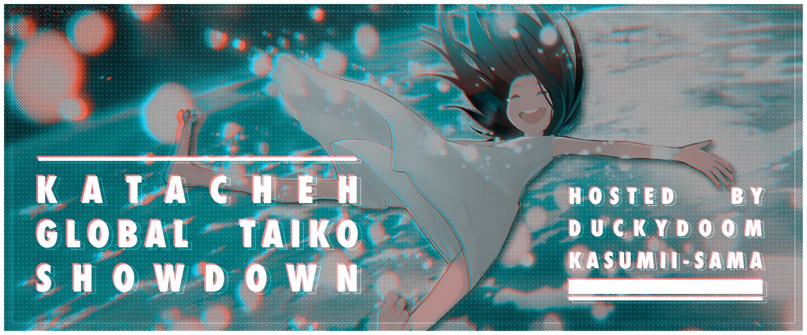

---
tags:
  - KGTS 2019
  - KGTS
  - GTS
---

# Katacheh Global Taiko Showdown 2019

The **Katacheh Global Taiko Showdown 2019** (***KGTS 2019***) was a double-elimination 1v1 osu!taiko tournament hosted by ![][flag_FR] [Kasumii-sama](https://osu.ppy.sh/users/6177263), ![][flag_CA] [DuckyDoom](https://osu.ppy.sh/users/3153062), and ![][flag_FR] [TLQ\_Yoshii](https://osu.ppy.sh/users/7157133). The mappool used in the tournament includes only **[katacheh maps](https://osu.ppy.sh/beatmapsets?m=1&s=any&q=katacheh)**. It was the first installment of the Katacheh Global Taiko Showdown and part of the Global Taiko Showdown series.

## Tournament schedule

| Event | Timestamp |
| --: | :-- |
| Registration phase | 2019-08-27/2019-09-15 |
| Live drawings | 2019-09-21 (15:00 UTC) |
| Qualifiers | 2019-09-28/2019-09-29 |
| Week 1 | 2019-10-05/2019-10-06 |
| Week 2 | 2019-10-12/2019-10-13 |

## Prizes

| Placing | Prize |
| :-: | :-- |
|  | Unique profile badge |

## Organisation

The Katacheh Global Taiko Showdown 2019 was run by various community members.

| Position | Member(s) |
| :-- | :-- |
| Manager | ![][flag_FR] [Kasumii-sama](https://osu.ppy.sh/users/6177263), ![][flag_CA] [DuckyDoom](https://osu.ppy.sh/users/3153062), ![][flag_FR] [TLQ\_Yoshii](https://osu.ppy.sh/users/7157133) |
| Map selector | ![][flag_TW] [katacheh](https://osu.ppy.sh/users/6651672) |
| Referee | ![][flag_HK] [Akali393394](https://osu.ppy.sh/users/9686628), ![][flag_FR] [Apsuko](https://osu.ppy.sh/users/9313135), ![][flag_MA] [clorox\_1g](https://osu.ppy.sh/users/9702728), ![][flag_US] [JDrago14](https://osu.ppy.sh/users/7690078), ![][flag_FR] [Kasumii-sama](https://osu.ppy.sh/users/6177263), ![][flag_NL] [Krekker](https://osu.ppy.sh/users/8265940), ![][flag_DE] [QEpicAce](https://osu.ppy.sh/users/9489153), ![][flag_RU] [Starger](https://osu.ppy.sh/users/3398715), ![][flag_FR] [TLQ\_Yoshii](https://osu.ppy.sh/users/7157133) |
| Streamer | ![][flag_AU] [Beat43210](https://osu.ppy.sh/users/5664171), ![][flag_US] [cheese salad](https://osu.ppy.sh/users/6349821), ![][flag_PL] [Deroo](https://osu.ppy.sh/users/8360475), ![][flag_US] [ITotallyGetThat](https://osu.ppy.sh/users/8770622), ![][flag_FR] [TLQ\_Yoshii](https://osu.ppy.sh/users/7157133) |
| Commentator | ![][flag_AU] [Beat43210](https://osu.ppy.sh/users/5664171), ![][flag_EC] [Gamelan4](https://osu.ppy.sh/users/9856910), ![][flag_DE] [Heam](https://osu.ppy.sh/users/4705120), ![][flag_CA] [janitoreihil](https://osu.ppy.sh/users/3307897), ![][flag_US] [kb131313](https://osu.ppy.sh/users/11229259), ![][flag_NZ] [Sparxe](https://osu.ppy.sh/users/5750235) |
| Designer | ![][flag_SG] [youi](https://osu.ppy.sh/users/7537133) |
| Statistician | ![][flag_FR] [Kasumii-sama](https://osu.ppy.sh/users/6177263) |
| Wiki editor | ![][flag_ID] [fajar13k](https://osu.ppy.sh/users/7100002) |

## Links

- [Discussion thread](https://osu.ppy.sh/community/forums/topics/953470)
- [GTS Discord server](https://discord.gg/3mGC3HB)
- [GTS website](https://gtsosu.com/)
- [Livestream](https://www.twitch.tv/gtsosu)
- [Challonge brackets](https://challonge.com/KGTS2019)
- **[Statistics sheet](https://docs.google.com/spreadsheets/d/1RVS_bKkwI1WN-DYg3vm28nP4HhdMmFRFfEz-v0jOvNs/edit?usp=sharing)**

## Participants

| Seed | Members |
| :-- | :-- |
| Top | ![][flag_IT] [Ikkun](https://osu.ppy.sh/users/1059945), ![][flag_ES] [Maitgon](https://osu.ppy.sh/users/4875451), ![][flag_ES] [AlvaroYL](https://osu.ppy.sh/users/6333166), ![][flag_US] [cheese salad](https://osu.ppy.sh/users/6349821) |
| High | ![][flag_CA] [janitoreihil](https://osu.ppy.sh/users/3307897), ![][flag_BR] [Foxeru](https://osu.ppy.sh/users/7479684), ![][flag_TW] [seanhappy8520](https://osu.ppy.sh/users/949455?), ![][flag_KR] [POCARI-SWEAT](https://osu.ppy.sh/users/5082685) |
| Low | ![][flag_GB] [Metzo](https://osu.ppy.sh/users/10633982), ![][flag_MY] [\[Zeth\]](https://osu.ppy.sh/users/9912966), ![][flag_FR] [maximaxiU](https://osu.ppy.sh/users/4069690), ![][flag_JP] [Saikoro](https://osu.ppy.sh/users/741819) |
| Unseeded | ![][flag_BR] [Kyoumo](https://osu.ppy.sh/users/8145223), ![][flag_BR] [Skull Kid](https://osu.ppy.sh/users/3044264), ![][flag_AU] [Beat43210](https://osu.ppy.sh/users/5664171), ![][flag_MY] [imnoobatosuosu](https://osu.ppy.sh/users/12086753) |

## Podium

This competition has come to an end and resulted in the following podium:

| Placing | Player |
| :-: | :-- |
|  | ![][flag_IT] [Ikkun](https://osu.ppy.sh/users/1059945) |
|  | ![][flag_CA] [janitoreihil](https://osu.ppy.sh/users/3307897) |
|  | ![][flag_ES] [Maitgon](https://osu.ppy.sh/users/4875451) |

## Mappools

### Week 2

**[Download the map pack here! (257 MB)](https://mega.nz/#!ksd22AJI!tkIx7KJuhgHlRjBI8NNaUrsJS6QMo960MVon7OsqzTs)**

- NoMod
  - [Omoi feat. Hatsune Miku - Chiisana Koi no Uta (Synth Rock Cover) (seanhappy8520) \[kata's Taiko\]](https://osu.ppy.sh/beatmapsets/619757#taiko/2125364)
  - [Camellia feat. Nanahira - Toryoka (katacheh) \[Taiko\]](https://osu.ppy.sh/beatmapsets/1021737#taiko/2137764)
  - [Camellia feat. Nanahira - NANI THE FUCK!! (katacheh) \[!@#$%^&\*\]](https://osu.ppy.sh/beatmapsets/1030207#taiko/2154163)
  - [DJ Noriken feat. Nanahira - Sweet Wishes (katacheh) \[LastWish\]](https://osu.ppy.sh/beatmapsets/670625#taiko/1418246)
  - [Camellia feat. Nanahira - Energy Drink Girl Fein-chan! (Camellia-s "MONSTERISTIC" Remix) (katacheh) \[Cannabis\]](https://osu.ppy.sh/beatmapsets/911801#taiko/1903847)
  - [Camellia feat. Nanahira - Bassdrop Freaks (2018 "Redrop" ver.) (katacheh) \[Braindropped\]](https://osu.ppy.sh/beatmapsets/758043#taiko/1594580)
- Hidden
  - [Camellia feat. Nanahira - Tsukitourou (Lite Show Magic Remix) (katacheh) \[Taiko\*\]](https://osu.ppy.sh/beatmapsets/715813#taiko/1512541)
- HardRock
  - [xi - Azalea (katacheh) \[Taiko\]](https://osu.ppy.sh/beatmapsets/921318#taiko/1923909)
- DoubleTime
  - [Liz Triangle - The Night Circus (katacheh) \[kata's kAlEiDoScOpE\]](https://osu.ppy.sh/beatmapsets/429603#taiko/926907)
  - [FamilyMart Jingle (katacheh) \[kata's FaMiLyMaRt\]](https://osu.ppy.sh/beatmapsets/417976#taiko/904910)
  - [Valkyrie - Ikenai Borderline (katacheh) \[KataKataEYE\]](https://osu.ppy.sh/beatmapsets/453428#taiko/972337)
- FreeMod
  - [G.I.Joe - Katacheh (bobson860412) \[katacheh\]](https://osu.ppy.sh/beatmapsets/952496#taiko/1989237)
  - [Camellia feat. Nanahira - Bassline Yatteru? w (katacheh) \[Line? Holy shit!!\]](https://osu.ppy.sh/beatmapsets/821339#taiko/1721561)
  - [Toromaru - Enigma II (katacheh) \[Taiko\]](https://osu.ppy.sh/beatmapsets/967637#taiko/2024993)
- Tiebreaker
  - **[RoughSketch & Massive New Krew ft. Nanahira - Extreme Music School (katacheh) \[Taiko^School+Extreme\]](https://osu.ppy.sh/beatmapsets/608906#taiko/1285965)**

### Week 1

**[Download the map pack here! (61 MB)](https://mega.nz/#!B50RkarY!iGux2mHdNWUx1Yiel9fc0XF7tWNrcxKKODTQEaw6OrU)**

- NoMod
  - [LeaF - Aleph-0 (katacheh) \[Level Aleph\]](https://osu.ppy.sh/beatmapsets/587295#taiko/1243626)
  - [t+pazolite feat. Nanahira - Ukakuf Kins (katacheh) \[Tomorrow\]](https://osu.ppy.sh/beatmapsets/961953#taiko/2014222)
- Hidden
  - [ARForest - Final Resonance (katacheh) \[Taiko\]](https://osu.ppy.sh/beatmapsets/1016259#taiko/2126946)
- HardRock
  - [xi - over the top (katacheh) \[kata's Taiko\]](https://osu.ppy.sh/beatmapsets/464217#taiko/993972)
- DoubleTime
  - [Umetora - Ifuudoudou (katacheh) \[kata's UltimateDance\]](https://osu.ppy.sh/beatmapsets/377666#taiko/826668)
  - [Emilia(CV:Setsunan) - Unfinished START (katacheh) \[Oni\]](https://osu.ppy.sh/beatmapsets/477590#taiko/1207303)
- FreeMod
  - [ARM vs uno - Shoujo Satori no Satorittaa (katacheh) \[kata's-M SatoriTaiko<3\]](https://osu.ppy.sh/beatmapsets/507946#taiko/1080370)
  - [ARForest - Hemisphere (katacheh) \[kata'sphere\]](https://osu.ppy.sh/beatmapsets/531722#taiko/1130030)
  - [Camellia feat. Nanahira - Rawstyle Bomb (katacheh) \[ks.\]](https://osu.ppy.sh/beatmapsets/837825#taiko/1754180)
- Tiebreaker
  - **[Ryu\* - Cirno's Perfect Math Class - Ryu\* remix - (katacheh) \[kata's PerfectShiftClass\]](https://osu.ppy.sh/beatmapsets/481441#taiko/1027526)**

### Qualifiers

**[Download the map pack here! (20 MB)](https://mega.nz/#!99cylKYb!ccf43d3e7MlEQwRM8C0DBwxoe1_ZlagETHCFOviObDg)**

- NoMod
  - [IOSYS - The dive in cucumber bar (katacheh) \[kata's-M cUcUmbAr\]](https://osu.ppy.sh/beatmapsets/423020#taiko/914272)
  - [nora2r - ULTRA B+K (bobson860412) \[Bass Kata\]](https://osu.ppy.sh/beatmapsets/559634#taiko/1183557)
- Hidden
  - [IOSYS - Tanoshii Yoru no Ochakai - Ringo's Tea Party (katacheh) \[TaikoParty\]](https://osu.ppy.sh/beatmapsets/468400#taiko/1001889)
- HardRock
  - [Neko Hacker feat. Nanahira - Chocolate Adventure (katacheh) \[Taiko\]](https://osu.ppy.sh/beatmapsets/947466#taiko/1978869)
- DoubleTime
  - [HimeHina - Hitogata (katacheh) \[Jojijoji Taiko\]](https://osu.ppy.sh/beatmapsets/915443#taiko/1911868)

## Match results

### Week 2

Saturday, 12 October 2019:

| Player 1 |  |  | Player 2 | Match link |
| --: | :-: | :-: | :-- | :-- |
| **AlvaroYL** ![][flag_ES] | **6** | 2 | ![][flag_TW] seanhappy8520 | [#1](https://osu.ppy.sh/community/matches/55499753) |
| **Maitgon** ![][flag_ES] | **6** | 0 | ![][flag_BR] Foxeru | [#1](https://osu.ppy.sh/community/matches/55503556) |
| **janitoreihil** ![][flag_CA] | **6** | 1 | ![][flag_KR] POCARI-SWEAT | [#1](https://osu.ppy.sh/community/matches/55505338) |
| **Ikkun** ![][flag_IT] | **6** | 0 | ![][flag_US] cheese salad | [#1](https://osu.ppy.sh/community/matches/55514888) |
| cheese salad ![][flag_US] | 0 | **4** | ![][flag_ES] **AlvaroYL** | *win by default* |
| Foxeru ![][flag_BR] | 0 | **4** | ![][flag_CA] **janitoreihil** | *win by default* |

Sunday, 13 October 2019:

| Player 1 |  |  | Player 2 | Match link |
| --: | :-: | :-: | :-- | :-- |
| AlvaroYL ![][flag_ES] | 3 | **7** | ![][flag_CA] **janitoreihil** | [#1](https://osu.ppy.sh/community/matches/55534955) |
| **Ikkun** ![][flag_IT] | **7** | 4 | ![][flag_ES] Maitgon | [#1](https://osu.ppy.sh/community/matches/55537726) |
| Maitgon ![][flag_ES] | 0 | **7** | ![][flag_CA] **janitoreihil** | [#1](https://osu.ppy.sh/community/matches/55541019) |
| Ikkun ![][flag_IT] | 1 | **7** | ![][flag_CA] **janitoreihil** | [#1](https://osu.ppy.sh/community/matches/55545515) |
| janitoreihil ![][flag_CA] | 5 | **7** | ![][flag_IT] **Ikkun** | [#1](https://osu.ppy.sh/community/matches/55547569) |

### Week 1

Saturday, 5 October 2019:

| Player 1 |  |  | Player 2 | Match link |
| --: | :-: | :-: | :-- | :-- |
| **janitoreihil** ![][flag_CA] | **4** | 0 | ![][flag_JP] Saikoro | [#1](https://osu.ppy.sh/community/matches/55327557) |
| **Ikkun** ![][flag_IT] | **4** | 0 | ![][flag_MY] imnoobatosuosu | [#1](https://osu.ppy.sh/community/matches/55334605) |
| **POCARI-SWEAT** ![][flag_KR] | **4** | 2 | ![][flag_GB] Metzo | [#1](https://osu.ppy.sh/community/matches/55335417) |
| **Maitgon** ![][flag_ES] | **4** | 0 | ![][flag_AU] Beat43210 | *win by default* |
| imnoobatosuosu ![][flag_MY] | 2 | **4** | ![][flag_GB] **Metzo** | [#1](https://osu.ppy.sh/community/matches/55336681) |
| **Ikkun** ![][flag_IT] | **4** | 0 | ![][flag_KR] POCARI-SWEAT | [#1](https://osu.ppy.sh/community/matches/55338000) |
| **seanhappy8520** ![][flag_TW] | **4** | 0 | ![][flag_MY] \[Zeth\] | *win by default* |
| **Maitgon** ![][flag_ES] | **4** | 0 | ![][flag_TW] seanhappy8520 | [#1](https://osu.ppy.sh/community/matches/55339690) |
| Beat43210 ![][flag_AU] | 0 | 0 | ![][flag_MY] \[Zeth\] | *nullified* |
| **cheese salad** ![][flag_US] | **4** | 0 | ![][flag_BR] Kyoumo | *win by default* |
| **Foxeru** ![][flag_BR] | **4** | 0 | ![][flag_FR] maximaxiU | [#1](https://osu.ppy.sh/community/matches/55347203) |
| **AlvaroYL** ![][flag_ES] | **4** | 1 | ![][flag_BR] Skull Kid | [#1](https://osu.ppy.sh/community/matches/55347205) |
| **Skull Kid** ![][flag_BR] | **4** | 0 | ![][flag_FR] maximaxiU | [#1](https://osu.ppy.sh/community/matches/55351516) |

Sunday, 6 October 2019:

| Player 1 |  |  | Player 2 | Match link |
| --: | :-: | :-: | :-- | :-- |
| Kyoumo ![][flag_BR] | 2 | **4** | ![][flag_JP] **Saikoro** | [#1](https://osu.ppy.sh/community/matches/55358888) |
| **cheese salad** ![][flag_US] | **4** | 3 | ![][flag_CA] janitoreihil | [#1](https://osu.ppy.sh/community/matches/55359856) |
| AlvaroYL ![][flag_ES] | 2 | **4** | ![][flag_BR] **Foxeru** | [#1](https://osu.ppy.sh/community/matches/55366733) |
| **seanhappy8520** ![][flag_TW] | **4** | 1 | ![][flag_JP] Saikoro | [#1](https://osu.ppy.sh/community/matches/55371169) |
| **POCARI-SWEAT** ![][flag_KR] | **4** | 0 | ![][flag_BR] Skull Kid | [#1](https://osu.ppy.sh/community/matches/55371430) |
| **janitoreihil** ![][flag_CA] | **4** | 0 | ![][flag_MY] \[Zeth\] | *win by default* |
| **AlvaroYL** ![][flag_ES] | **4** | 0 | ![][flag_GB] Metzo | [#1](https://osu.ppy.sh/community/matches/55376101) |

## Ruleset

### General rules

1. Katacheh Global Taiko Showdown 2019 is a double-elimination tournament spread out on three weeks.
2. The players will first play a Qualifiers Stage to seed them accordingly, then will head on to a double-elimination tournament.
3. The Scoring System used will be **Score V1**.
4. Any player who plays taiko is allowed to play, expect this tournament to be geared towards pretty high skilled players though. Since this tournament will aim to get badged, some players might be declined by osu staff, which is the screening part, we cannot accept any player refused from it, otherwise we will be losing the badge for this. Reasons may vary from being unrestricted within the past year, multiaccounting, boosting accounts, etc. The hosts will not be made aware of the exact reasons as to why a player will be declined. Please do not ask them, and contact osu! support instead.
5. Any staff member apart from **Manager, Mappool Selector, and Referee** is allowed to play.
6. Players and staff members must have read this ruleset entirely (and we will assume you did so throughout the tournament).
7. All participants must stay respectful and keep a proper attitude. Not following this rule can result in a ban/blacklist from the tournament. This rule concerns all the staff as well.
8. Any rule changes or unexpected occurrences will be announced in the thread and in the Discord server.

### Stage regulations

1. There are three weeks worth of stages in the 1v1 tournament.
   - The first week will be the Qualifiers.
   - The Week 1 of Knockout Stages consists of the Round of 16 and the Quarterfinals.
   - The Week 2 of Knockout Stages consists of the Semifinals, the Finals, and the Grand Finals.
2. Players will be seeded with the average of their ranks on each map during the Qualifiers round.
3. In case there are more than 32 registered players, only the top 32 of the Qualifiers will go in the rest of the tournament.
4. The winning condition for each stage is:
   - Round Of 16: Best-Of-7 (First to 4 points)
   - Quarterfinals: Best-Of-9 (First to 5 points)
   - Semifinals: Best-Of-11 (First to 6 points)
   - **Finals and Grand Finals**: Best-Of-13 (First to 7 points)

### Mappool instructions

1. There will be 1 mappool for every week in this tournament.
2. The Loser's Bracket will always play on the same pool as the Winner's bracket of the same weekend.
3. The Qualifiers pool will be different from all the other rounds, as it will have a format of 2 NoMod maps, 1 Hidden map, 1 HardRock map, 1 DoubleTime map.
4. Each mappool consists of 6 brackets: NoMod, Hidden, HardRock, DoubleTime, FreeMod, and Tiebreaker.
5. The first week mappool will have 12 maps. The second week mappool will have 15 maps.
6. The size of the NoMod bracket will be of 4 in the first week of matches, and of 6 in the second week of matches.
7. The size of the Hidden, HardRock bracket will be of 1 for the entire tournament, and the size of the DoubleTime bracket will be of 2 for first and it will be of 3 for second week.
8. The size of the FreeMod pool will be of 3 during the entire tournament.
9. The FreeMod bracket is played with FreeMod activated. Each player must have at least **one mod** selected between Hidden, and HardRock.
10. The Tiebreaker is played under FreeMod conditions but it is not necessary that at least one player has at least one mod activated.
11. The mappool for each stage will be showcased a week before.

### Scheduling instructions

1. Every stage is held during the weekend. (It is however allowed to schedule on another day if no good time is found during the weekend, and a referee is available)
2. We will try to schedule as best as possible to fit with the timezones. The schedule will be released the previous weekend of each stage.
3. Reschedules will only be considered if both players/teams agree to a time, this needs to be done and notified to the tournament staff before **Thursday at 23:59 UTC+0** in that particular week when your match takes place.

### Match regulations

1. A private lobby will be created 10 minutes before your match by a referee. You will get invited by the referee either right then, or right at the match time. During the team tournament, both teams captains will be invited into the room when it's match time. Then the referees or the captains will invite the other players into the room.
2. If no staff or referee is available, the match will be postponed.
3. If less than the minimum required players attend, the maximum time the match can be postponed is 10 minutes. After then, it will be a WBD no matter what, unless if the players in the lobby do not mind waiting more time.
4. If neither of both teams have the minimum required players after 10 minutes, the highest seeded team will advance.
5. During this tournament, matches will be played as Head to Head and Score V1. The name of the room will be "KGTS 2019: (Player 1) vs (Player 2)"
6. Each player is allowed one warm-up but it must be below 4 minutes.
7. Each player has to ban **one beatmap** to be selected from the pool (apart from Tiebreaker). These beatmaps are not allowed to be picked by any team in the entire match.
8. Players will roll with the command `!roll` in the chat.
9. The player with the highest roll **bans second and picks first**. The playerwith the lowest roll **bans first and picks second**.
10. Beatmap selection will then alternate between each player selecting a beatmap out of the map pool.
11. Players may pick freely from any bracket.
12. Players will have 2 minutes to ban and pick maps, and to get ready as well. If by the end of the timer no map is picked, the referee will !roll with the number of maps left in the pool, and the number he will fall on will be the pick.
13. If a player disconnects between the beatmaps and he can not provide an exchange, the match can be delayed 10 minutes at maximum.
14. If a player disconnects, they get treated as if they failed the map.
15. Disconnects within 30 seconds after beatmap begin can be rematched. This is only allowed once per player/team.
16. Failed players' scores will count in this tournament.
17. If the beatmap ends in a draw, the game will be nullified and the map will be replayed. If a second tie happens, the map will be nullified, and the team picking this map will have to pick another map.
18. In case of a tie in points (example: 4-4 in BO9), the tiebreaker is selected.

[flag_AU]: /wiki/shared/flag/AU.gif "Australia"
[flag_BR]: /wiki/shared/flag/BR.gif "Brazil"
[flag_CA]: /wiki/shared/flag/CA.gif "Canada"
[flag_DE]: /wiki/shared/flag/DE.gif "Germany"
[flag_EC]: /wiki/shared/flag/EC.gif "Ecuador"
[flag_ES]: /wiki/shared/flag/ES.gif "Spain"
[flag_FR]: /wiki/shared/flag/FR.gif "France"
[flag_GB]: /wiki/shared/flag/GB.gif "United Kingdom"
[flag_HK]: /wiki/shared/flag/HK.gif "Hong Kong"
[flag_ID]: /wiki/shared/flag/ID.gif "Indonesia"
[flag_IT]: /wiki/shared/flag/IT.gif "Italy"
[flag_JP]: /wiki/shared/flag/JP.gif "Japan"
[flag_KR]: /wiki/shared/flag/KR.gif "South Korea"
[flag_MA]: /wiki/shared/flag/MA.gif "Morocco"
[flag_MY]: /wiki/shared/flag/MY.gif "Malaysia"
[flag_NL]: /wiki/shared/flag/NL.gif "Netherlands"
[flag_NZ]: /wiki/shared/flag/NZ.gif "New Zealand"
[flag_PL]: /wiki/shared/flag/PL.gif "Poland"
[flag_RU]: /wiki/shared/flag/RU.gif "Russian Federation"
[flag_SG]: /wiki/shared/flag/SG.gif "Singapore"
[flag_TW]: /wiki/shared/flag/TW.gif "Taiwan"
[flag_US]: /wiki/shared/flag/US.gif "United States"
