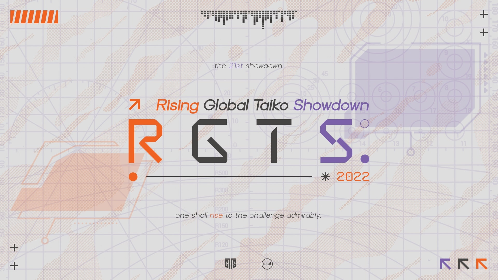

---
tags:
  - RGTS2022
  - RGTS
  - GTS
---

# Rising Global Taiko Showdown 2022

The **Rising Global Taiko Showdown 2022** (***RGTS 2022***) is a worldwide double-elimination 2v2 osu!taiko tournament hosted by ::{ flag=FR }:: [\_yosh](https://osu.ppy.sh/users/7157133), ::{ flag=DE }:: [Sayira](https://osu.ppy.sh/users/7253958), and ::{ flag=NL }:: [TaikoMom](https://osu.ppy.sh/users/9086438). Only players ranked between #1,500 and #4,500 may participate. It is the second instalment of the Rising Global Taiko Showdown and part of the Global Taiko Showdown series.

## Tournament schedule

| Event | Timestamp |
| --: | :-- |
| Registration phase | 2022-10-10/2022-10-23 |
| Screening phase | 2022-10-23/2022-10-30 |
| Qualifiers | 2022-11-05/2022-11-06 |
| Group stage | 2022-11-12/2022-11-13 |
| Round of 16 | 2022-11-19/2022-11-20 |
| Quarterfinals | 2022-11-26/2022-11-27 |
| Semifinals | 2022-12-03/2022-12-04 |
| Finals | 2022-12-10/2022-12-11 |
| All Stars & Grand Finals | 2022-12-17/2022-12-18 |

## Prizes

| Placing | Prize |
| :-: | :-- |
|  | Unique profile badge |

## Organisation

The Rising Global Taiko Showdown 2022 is run by various community members.

| Position | Member(s) |
| :-- | :-- |
| Organiser | ::{ flag=FR }:: [\_yosh](https://osu.ppy.sh/users/7157133), ::{ flag=DE }:: [Sayira](https://osu.ppy.sh/users/7253958), ::{ flag=NL }:: [TaikoMom](https://osu.ppy.sh/users/9086438) |
| Mappool selector | ::{ flag=NL }:: [Boaz](https://osu.ppy.sh/users/13302996), ::{ flag=CA }:: [NeoAxel](https://osu.ppy.sh/users/6806934), ::{ flag=KR }:: [sendol](https://osu.ppy.sh/users/4433058) |
| Referee | ::{ flag=US }:: [\[K\]](https://osu.ppy.sh/users/16551387), ::{ flag=MY }:: [\[Zeth\]](https://osu.ppy.sh/users/9912966), ::{ flag=HK }:: [Akali393394](https://osu.ppy.sh/users/9686628), ::{ flag=PE }:: [alemagno333](https://osu.ppy.sh/users/11411697), ::{ flag=SG }:: [arcpotato](https://osu.ppy.sh/users/12842392), ::{ flag=US }:: [Chupalika](https://osu.ppy.sh/users/1926383), ::{ flag=US }:: [cyger](https://osu.ppy.sh/users/20020441), ::{ flag=CA }:: [dots\_](https://osu.ppy.sh/users/15429414), ::{ flag=JP }:: [Noko\_BSF](https://osu.ppy.sh/users/3811831), ::{ flag=DE }:: [QEpicAce](https://osu.ppy.sh/users/9489153), ::{ flag=AU }:: [r1chyy](https://osu.ppy.sh/users/11499467), ::{ flag=SE }:: [Raphalge](https://osu.ppy.sh/users/3918650), ::{ flag=DE }:: [Sayira](https://osu.ppy.sh/users/7253958), ::{ flag=NL }:: [TaikoMom](https://osu.ppy.sh/users/9086438), ::{ flag=DE }:: [xMrtn-](https://osu.ppy.sh/users/866297) |
| Streamer | ::{ flag=US }:: [Chupalika](https://osu.ppy.sh/users/1926383), ::{ flag=US }:: [ITotallyGetThat](https://osu.ppy.sh/users/8770622), ::{ flag=SE }:: [Raphalge](https://osu.ppy.sh/users/3918650), ::{ flag=DE }:: [Sayira](https://osu.ppy.sh/users/7253958), ::{ flag=NL }:: [TaikoMom](https://osu.ppy.sh/users/9086438) |
| Commentator | ::{ flag=US }:: [AuroraPhasmata](https://osu.ppy.sh/users/13664116), ::{ flag=CL }:: [Catulus](https://osu.ppy.sh/users/6276709), ::{ flag=VN }:: [davidminh0111](https://osu.ppy.sh/users/9623142), ::{ flag=US }:: [driodx](https://osu.ppy.sh/users/9709548), ::{ flag=GB }:: [Ethereal\_Winter](https://osu.ppy.sh/users/9780417), ::{ flag=US }:: [FrootLoopy542](https://osu.ppy.sh/users/5468461), ::{ flag=DE }:: [Joogs](https://osu.ppy.sh/users/8844167), ::{ flag=RU }:: [mekkimous](https://osu.ppy.sh/users/17381947), ::{ flag=GB }:: [My Angel Subaru](https://osu.ppy.sh/users/17797595), ::{ flag=GB }:: [overdahedge2014](https://osu.ppy.sh/users/9864847), ::{ flag=SE }:: [Raphalge](https://osu.ppy.sh/users/3918650), ::{ flag=KR }:: [South Korea](https://osu.ppy.sh/users/12242622), ::{ flag=NL }:: [TaikoMom](https://osu.ppy.sh/users/9086438), ::{ flag=AR }:: [Vaf](https://osu.ppy.sh/users/12589048), ::{ flag=GB }:: [willowww](https://osu.ppy.sh/users/11406987), ::{ flag=HK }:: [YonGin](https://osu.ppy.sh/users/7109317) |
| Designer | ::{ flag=MY }:: [\[Zeth\]](https://osu.ppy.sh/users/9912966) |
| Wiki writer | ::{ flag=ID }:: [fajar13k](https://osu.ppy.sh/users/7100002) |

## Links

- [Discussion thread](https://osu.ppy.sh/community/forums/topics/1658437)
- [GTS Discord server](https://discord.gg/3mGC3HB)
- [GTS website](https://gtsosu.com/rgts/home)
- Livestream
  - [GTSosu](https://www.twitch.tv/gtsosu)
  - [GTSosu\_b](https://www.twitch.tv/gtsosu_b)

## Participants

*Participants will be announced soon after the screening phase has ended.*

## Mappools

### Group Stage

**[Download the mappack here! (72 MB)](https://mega.nz/file/ORYDQYSJ#aZ4Ql5BSneVlM64UxTYNh17A6RGgXeeIX6LsLmTMiLI)**

- NoMod
  1. [Himeringo - Idola no Circus (hikikochan) \[Dance\]](https://osu.ppy.sh/beatmapsets/728008#taiko/1537074)
  2. [Mikito-P feat. Kagamine Rin - Roki (7\_7's frenchcore(?) bootleg) (Boaz) \[BOAZ AND ARC'S ONI\]](https://osu.ppy.sh/beatmapsets/1880669#taiko/3871836)
  3. [LeaF - Arianrhod (Nwolf) \[Oni\]](https://osu.ppy.sh/beatmapsets/1880675#taiko/3871843)
  4. [Tsukino - Dohna Dohna no Uta (himiko Jersey Club Edit) (davidminh0111) \[davidminh's bad oni >w<\]](https://osu.ppy.sh/beatmapsets/1880677#taiko/3871845)
- Hidden
  1. [Ryu\* - Plan 8 (Eyenine) \[Oni\]](https://osu.ppy.sh/beatmapsets/1569366#taiko/3204893)
  2. [kerosene - LET GO (Briesmas) \[Oni (RGTS Edit)\]](https://osu.ppy.sh/beatmapsets/1878843#taiko/3867642)
- HardRock
  1. [Aoi vs. siqlo - Hacktivism (Faputa) \[Oni\]](https://osu.ppy.sh/beatmapsets/1488148#taiko/3064347)
  2. [Mitsukiyo - Luminous Memory \~Raytoly Artcore Remix\~ (Raytoly) \[Oni\]](https://osu.ppy.sh/beatmapsets/1825848#taiko/3748584)
- DoubleTime
  1. [FELT - Hail Storm (sendol) \[Oni\]](https://osu.ppy.sh/beatmapsets/1687662#taiko/3449057)
  2. [wotoha - Digital Life Hacker (BlackBN) \[Muzukashii\]](https://osu.ppy.sh/beatmapsets/1522733#taiko/3132494)
- FreeMod
  1. [Memme - BSPower Explosion (iceOC) \[Oni\]](https://osu.ppy.sh/beatmapsets/1029211#taiko/2152144)
  2. [Natori Sana - Mondainai Tripper! (Seren58) \[ler's Oni\]](https://osu.ppy.sh/beatmapsets/1765094#taiko/3613174)
  3. [seatrus - ILLEGAL LEGACY (arcpotato) \[arc & Noz's Oni\]](https://osu.ppy.sh/beatmapsets/1880705#taiko/3871884)
- Tiebreaker
  1. **[Shimotsuki Haruka - Youka to Yumeutsutsu (Genjuro) \[Inner Oni\]](https://osu.ppy.sh/beatmapsets/1491579#taiko/3057432)**

### Qualifiers

**[Download the mappack here! (47 MB)](https://mega.nz/file/XQ4SVbRb#9i75Ud1-ETvpxHS6xBQ4eH_E0DFH0SzKsvIa2cHV-jo)**

- NoMod
  1. [Inugami Korone - SAIKYO TENSAI WONDERFUL WORLD of KORONE (snowball112) \[Inner Oni\]](https://osu.ppy.sh/beatmapsets/1437416#taiko/2957437)
  2. [Tanchiky - TouchDown (Nwolf) \[stage zero (RGTS ver.)\]](https://osu.ppy.sh/beatmapsets/1876172#taiko/3860973)
  3. [SWAN K feat. Asuka M - LOVE B.B.B (Nozdormu) \[Luminescence\]](https://osu.ppy.sh/beatmapsets/1876177#taiko/3860984)
- Hidden
  1. [MORE MORE JUMP!, Hatsune Miku - MORE! JUMP! MORE! (Seren58) \[More! (GTS Edit)\]](https://osu.ppy.sh/beatmapsets/1304041#taiko/3860926)
  2. [Hinomori Shizuku (CV: Honnizumi Rina) - Shoujo Rei (cdh) \[Oni\]](https://osu.ppy.sh/beatmapsets/1845190#taiko/3790383)
- HardRock
  1. [siromaru - Absurd Gaff (-Kamikaze-) \[Zetera's Oni\]](https://osu.ppy.sh/beatmapsets/365073#taiko/1083359)
  2. [coltrane - zeke didn't "invent dariacore", i did (TaikoMom) \[Oni\]](https://osu.ppy.sh/beatmapsets/1876188#taiko/3861010)
- DoubleTime
  1. [yanaginagi - Tokohana (Nokduro) \[ler's Oni\]](https://osu.ppy.sh/beatmapsets/1762654#taiko/3607847)
- FreeMod
  1. [HyuN - Fuyu no Hime (Charlotte) \[komasy's Oni\]](https://osu.ppy.sh/beatmapsets/1202956#taiko/2523647)

## Match results

### Qualifiers

Detailed statistics for this round can be found in [this spreadsheet](https://gtsosu.com/rgts/stats#0) alongside the final standings on which players made it through to the next stage.

## Ruleset

### General rules

1. This tournament is a **2v2 team tournament** with teams of **5 players maximum**.
2. The teams will first go through Qualifiers, then Group stage, then finally a double-elimination bracket.
3. The scoring system used will be **Score V2**.
4. Any player who meets the requirements stated in the [restrictions and registrations](#restrictions-and-registrations) section is allowed to sign up. Note that some players may be declined participation as part of tournament screening.
5. Any members of staff **apart from organisers, mappool selectors, and referees** are allowed to play.
6. All participants must stay respectful and keep a proper attitude. Not following this rule can result in a ban/blacklist from the tournament. This rule concerns all staff members as well.
7. Any rule changes or unexpected occurrences will be announced in the Discord server.

### Restrictions and registrations

1. In order to participate, players need to be in the rank range of #1,500 – #4,500.
2. Players are not allowed to rank up further than #1,500 during the tournament. Passing this limit will result in disqualification.
3. Players must join the Discord server of the tournament to actually be counted as a player.
4. Players sign up individually. When their registration is accepted, they will get a player role with their respective country.
5. Tournament staff can refuse players from participating in the tournament if their skill is deemed much higher than the targeted rank range.
6. Two teams for a country may be allowed under certain conditions:
   - There are **7 or more players** signed up for a country.
   - Each team has to have **at least 3 players**.
7. Teams are otherwise assembled in the following way:
   - If there are 5 players or less signed up for a country, those players will form the team representing their country.
   - In case there are more than 10 players signed up for a country, players will decide among themselves who will partake in the tournament. If they cannot decide, the top 10 players by ranking will be chosen to form the 2 teams.
   - If there are 6 players, players will have to decide on the 5 players who will partake in the tournament. If they cannot decide, the top 5 players by ranking will be chosen to form the team.
   - If there are 7 to 10 players (after keeping the best ranked ones) signed up for a country, the players from that country will have a few days to decide how to split themselves between the 2 teams. It is recommended to come to an agreement as fast as possible and decide on a captain to aid in scheduling.
   - In case the players cannot come to an agreement, they will be put in 2 teams with at least 3 members in each in order of global ranking.
   - If the players cannot agree or find a captain, the highest ranked player will be chosen.
8. The captain has the responsibility to reschedule a match if needed and will ensure their teammates are present for the matches.

### Stage regulations

1. There are seven stages in the tournament: the Qualifiers, the Group stage, the Round of 16, the Quarterfinals, the Semifinals, the Finals, and the Grand Finals.
2. Teams will be seeded with the average of their ranks on each map during the Qualifiers round in 4 seeds: Top seed, High seed, Low seed, and Unseeded.
3. Teams will be drawn in **8 groups of 4 teams** during live drawings which will happen on Sunday, 6 November 2022 (18:00 UTC).
4. In the Group stage, all the teams from each group will face each other. The **best 2 teams** advance from their groups.
5. Rankings of each group are determined by sorting the results of each team's performance in the following order:
   1. Most matches won.
   2. Highest "score" (number of beatmaps won - number of maps lost).
   3. Most beatmaps won.
   4. Winner of the match played previously between the tied teams.
6. During the Group stage, winning 5:0 or having +1.0 score difference ratio will be considered a win by default.
7. Each stage has the following win conditions:
   - **Group Stage**: Best-of-9 (first to 5 points)
   - **Round of 16, and the Quarterfinals**: Best-of-11 (first to 6 points)
   - **Semifinals, the Finals, and the Grand Finals**: Best-of-13 (first to 7 points)

### Qualifier regulations

1. During this round there will be multiple lobbies available at various hours.
2. A private match will be created and teams will be invited into the lobby when it is their time to play. Make sure to be online at this time.
3. There will be no warmups during this stage.
4. Failed scores will count.
5. Only two players from each team will be playing per map. There are no limitations on player swapping.
6. Seeding will be done with the average rank of each team on each map.
7. Maps will be played twice in a row during the lobby. The best run will be taken into account for the ranking.
8. Only the 32 best teams will continue on to the bracket stage.

### Mappool instructions

1. There will be one mappool for each stage.
2. The loser's bracket will play on the same pool as the winner's bracket of the same weekend.
3. The Qualifier pool will be different from all other rounds, as it will have a format of 3 NoMod maps, 2 Hidden map, 2 HardRock map, 1 DoubleTime map, and 1 FreeMod map.
4. Each mappool consists of 6 sections: **NoMod, Hidden, HardRock, DoubleTime, FreeMod, and Tiebreaker**.
5. Total maps per stage will be listed as follows:
   - The Group stage mappool will consist of 14 maps.
   - The Round of 16 and Quarterfinals mappools will consist of 15 maps.
   - The Semifinals, Finals and Grand Finals mappools will consist of 16 maps.
6. All stages will have 2 Hidden, HardRock, and DoubleTime maps, and 3 FreeMod maps.
7. The FreeMod pool is played with FreeMod activated. Every player may pick a combination of Hidden and HardRock, but at least one player of each team must have at least one mod activated.
8. Players cannot pick the same mod combination as their team member.
9. The tiebreaker is played under FreeMod conditions, but it is not necessary to have a mod activated.
10. The mappool for each stage will be showcased a week beforehand.

### Scheduling instructions

1. Every stage will be held **during the weekend**. It is, however, allowed to schedule it on another day, if no good time is found during the weekend and a referee is available.
2. Matches are allowed to overlap if referees are available.
3. A best effort will be made to fit schedules with applicable timezones. The schedule for each stage will be released the weekend prior to it.
4. Reschedules will only be considered if both teams agree to a time. This needs to be done and communicated to the tournament staff before **Thursday at 23:59 UTC** in the particular week when the match takes place.
5. Reschedules may only be requested **by the team captain**.

### Match regulations

1. A private lobby will be created 10 minutes before a referee starts the match. Both teams' captains will be invited into the room before match time, and the referee or the captains will invite the other players into the room.
2. If no staff or referee is available, the match will be postponed.
3. If less than the minimum required players attend, the maximum time the match can be postponed for is **10 minutes**.
4. There is no penalty for not joining the room instantly at match time as long as it is within the postponed time.
5. If neither team has the minimum required players after 10 minutes, it will count as a loss for both teams in Group stage. In the double-elimination bracket, the highest seeded team will advance.
6. The match will be played with Team VS and Score v2, and the name of the room must be: `RGTS 2022: ({Team Red}) vs ({Team Blue})`.
7. Each player is allowed one warmup map, but it must be **below 3 minutes in length**, and must be sent to the [GTS website](https://gtsosu.com/egts/home) up to one hour prior to the match's start time.
8. Submitting a warmup less than one hour prior to the match will result in no warmup.
9. Warmups may not be offensive or NSFW (not safe for work).
10. Each captain has to ban **one beatmap** from the pool (apart from tiebreaker). These beatmaps are not allowed to be picked by any team in the entire match.
11. The captain of each team will roll with the `!roll` command in the chat.
12. The team with the highest roll **bans second and picks first**. The team with the lowest roll **bans first and picks second**.
13. Each captain has 2 minutes to announce their ban. If they do not tell the referee by that time, the ban will be made with a `!roll`.
14. Beatmap selection will then alternate between each captain selecting a beatmap out of the mappool.
15. Captains may pick freely from any bracket.
16. Teams will have 2 minutes to pick a beatmap and 2 minutes to get ready. If a team does not pick before the end of the timer, the map will be picked with a `!roll`.
17. Exchanging players during a match is allowed without limitations.
18. If a player disconnects between beatmaps and the team cannot provide a substitute, the match can be delayed by 10 minutes at most. This delay can only be applied once.
19. Disconnections are treated as failing the map.
20. A beatmap can be replayed upon a disconnection that happened within 30 seconds of starting. This is only allowed once per team.
21. Failed players' scores do get added to the team score.
22. If the beatmap ends in a draw, the game will be nullified and the map will be replayed.
23. In case of a tie in points (example: 4-4 in BO9) the tiebreaker is selected.

### All Stars rules

1. All Stars is a fun event taking place on the same weekend as the Grand Finals! It will showcase the best players of the tournament playing against each other in a special match.
2. 12 players will participate in this event. They will be decided by a vote.
3. If there are more than 2 players from a country in the top 12 most voted players, only the 2 best will partake in All Stars.
4. The top 2 players will be captains of each team. Their teammates will be decided by the ranking of the next 6 players. The topmost voted player will play with players with an odd number and the second most voted player with players with an even number.
5. The mappool is the same as the one in the Grand Finals.
6. The event will be a 4 vs. 4 match with the following rules:
   - Best-of-15 format (First to 8 points).
   - All the maps are played under FreeMod rules, meaning players are free to pick any of the following mods or a combination of them: NoMod, Hidden, HardRock.
   - No bans.
   - Map selection is the same as a normal match.
   - The same rules as normal matches apply regarding disconnections.
