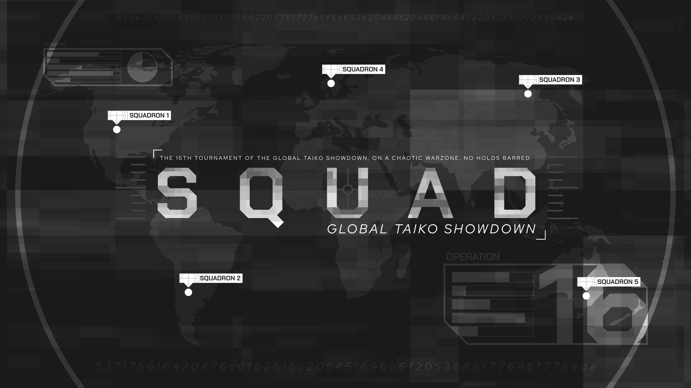

---
tags:
  - SGTS2021
  - SGTS
  - GTS
---

# Squad Global Taiko Showdown 2021

The **Squad Global Taiko Showdown 2021** (***SGTS 2021***) was a worldwide double-elimination 3v3 osu!taiko tournament hosted by ::{ flag=FR }:: [Arrival](https://osu.ppy.sh/users/1694000), ::{ flag=NL }:: [TaikoMom](https://osu.ppy.sh/users/9086438), and ::{ flag=US }:: [Wadsy](https://osu.ppy.sh/users/2598555). This was a tournament where players could decide their own teams up to 6 players with no rank restrictions. It was the first instalment of the Squad Global Taiko Showdown and part of the Global Taiko Showdown series.

## Tournament schedule

| Event | Timestamp |
| --: | :-- |
| Registration phase | 2021-11-27/2021-12-12 |
| Screening phase | 2021-12-12/2022-01-02 |
| Qualifiers | 2022-01-08/2022-01-09 |
| Round of 32 | 2022-01-15/2022-01-16 |
| Round of 16 | 2022-01-22/2022-01-23 |
| Quarterfinals | 2022-01-29/2022-01-30 |
| Semifinals | 2022-02-05/2022-02-06 |
| Finals | 2022-02-12/2022-02-13 |
| Grand Finals | 2022-02-20 |

## Prizes

| Placing | Prize(s) |
| :-: | :-- |
|  | Unique profile badge |

## Organisation

The Squad Global Taiko Showdown 2021 was run by various community members.

| Position | Member(s) |
| :-- | :-- |
| Organiser | ::{ flag=FR }:: [Arrival](https://osu.ppy.sh/users/1694000), ::{ flag=NL }:: [TaikoMom](https://osu.ppy.sh/users/9086438), ::{ flag=US }:: [Wadsy](https://osu.ppy.sh/users/2598555) |
| Mappool selector | ::{ flag=FR }:: [Briesmas](https://osu.ppy.sh/users/2865172), ::{ flag=JP }:: [kei821](https://osu.ppy.sh/users/5846289), ::{ flag=JP }:: [Shamirin\_mzk](https://osu.ppy.sh/users/11325757) |
| Mapper | ::{ flag=MY }:: [\[Zeth\]](https://osu.ppy.sh/users/9912966), ::{ flag=DE }:: [Ak1o](https://osu.ppy.sh/users/1600041), ::{ flag=FR }:: [Briesmas](https://osu.ppy.sh/users/2865172), ::{ flag=DE }:: [Greenshell](https://osu.ppy.sh/users/8693851), ::{ flag=DE }:: [Heaxys](https://osu.ppy.sh/users/5671417), ::{ flag=TN }:: [Hivie](https://osu.ppy.sh/users/14102976), ::{ flag=MY }:: [Jerry](https://osu.ppy.sh/users/605973), ::{ flag=JP }:: [KTYN](https://osu.ppy.sh/users/2250574), ::{ flag=ES }:: [Raiden](https://osu.ppy.sh/users/2239480), ::{ flag=SE }:: [Raphalge](https://osu.ppy.sh/users/3918650), ::{ flag=CA }:: [rubies87](https://osu.ppy.sh/users/4949934), ::{ flag=TW }:: [X a v y](https://osu.ppy.sh/users/3738344) |
| Referee | ::{ flag=US }:: [\[K\]](https://osu.ppy.sh/users/16551387), ::{ flag=MY }:: [\[Zeth\]](https://osu.ppy.sh/users/9912966), ::{ flag=FR }:: [\_yosh](https://osu.ppy.sh/users/7157133), ::{ flag=FR }:: [Aidown](https://osu.ppy.sh/users/1522146), ::{ flag=HK }:: [Akali393394](https://osu.ppy.sh/users/9686628), ::{ flag=SG }:: [arcpotato](https://osu.ppy.sh/users/12842392), ::{ flag=DE }:: [QEpicAce](https://osu.ppy.sh/users/9489153), ::{ flag=NL }:: [TaikoMom](https://osu.ppy.sh/users/9086438), ::{ flag=DE }:: [TheHunter1](https://osu.ppy.sh/users/6496016), ::{ flag=CN }:: [WonderMan](https://osu.ppy.sh/users/2221895), ::{ flag=US }:: [zachmanthethird](https://osu.ppy.sh/users/15048710) |
| Streamer | ::{ flag=KR }:: [4\_4](https://osu.ppy.sh/users/1152851), ::{ flag=US }:: [Ethaaaan](https://osu.ppy.sh/users/9536977), ::{ flag=US }:: [ITotallyGetThat](https://osu.ppy.sh/users/8770622), ::{ flag=US }:: [Rukairi](https://osu.ppy.sh/users/6642597), ::{ flag=NL }:: [TaikoMom](https://osu.ppy.sh/users/9086438), ::{ flag=TW }:: [XzCraftP](https://osu.ppy.sh/users/1593180), ::{ flag=US }:: [zachmanthethird](https://osu.ppy.sh/users/15048710) |
| Commentator | ::{ flag=MY }:: [\[Zeth\]](https://osu.ppy.sh/users/9912966), ::{ flag=PT }:: [BabySnakes](https://osu.ppy.sh/users/4669728), ::{ flag=AU }:: [Beat43210](https://osu.ppy.sh/users/5664171), ::{ flag=CL }:: [Catulus](https://osu.ppy.sh/users/6276709), ::{ flag=US }:: [driodx](https://osu.ppy.sh/users/9709548), ::{ flag=US }:: [Ethaaaan](https://osu.ppy.sh/users/9536977), ::{ flag=GB }:: [Ethereal\_Winter](https://osu.ppy.sh/users/9780417), ::{ flag=EC }:: [Gamelan4](https://osu.ppy.sh/users/9856910), ::{ flag=MY }:: [Jerry](https://osu.ppy.sh/users/605973), ::{ flag=DE }:: [Joogs](https://osu.ppy.sh/users/8844167), ::{ flag=GB }:: [mangomizer](https://osu.ppy.sh/users/1893718), ::{ flag=GB }:: [My Angel Subaru](https://osu.ppy.sh/users/17797595), ::{ flag=GB }:: [overdahedge2014](https://osu.ppy.sh/users/9864847), ::{ flag=DE }:: [QEpicAce](https://osu.ppy.sh/users/9489153), ::{ flag=NL }:: [Strijkljzer](https://osu.ppy.sh/users/4130926), ::{ flag=GB }:: [Teezel](https://osu.ppy.sh/users/7528639), ::{ flag=GB }:: [willowww](https://osu.ppy.sh/users/11406987), ::{ flag=US }:: [zachmanthethird](https://osu.ppy.sh/users/15048710) |
| Designer | ::{ flag=MY }:: [\[Zeth\]](https://osu.ppy.sh/users/9912966), ::{ flag=MY }:: [Jerry](https://osu.ppy.sh/users/605973), ::{ flag=PH }:: [OsuMe65](https://osu.ppy.sh/users/852867) |
| Translator | ::{ flag=SG }:: [arcpotato](https://osu.ppy.sh/users/12842392), ::{ flag=PT }:: [BabySnakes](https://osu.ppy.sh/users/4669728), ::{ flag=HK }:: [BlackBN](https://osu.ppy.sh/users/6291741), ::{ flag=CL }:: [Catulus](https://osu.ppy.sh/users/6276709), ::{ flag=DE }:: [Sayira](https://osu.ppy.sh/users/7253958), ::{ flag=NL }:: [TaikoMom](https://osu.ppy.sh/users/9086438), ::{ flag=CN }:: [WonderMan](https://osu.ppy.sh/users/2221895) |
| Developer | ::{ flag=US }:: [Cychloryn](https://osu.ppy.sh/users/6921736), ::{ flag=FR }:: [ThePooN](https://osu.ppy.sh/users/718454) |
| Wiki editor | ::{ flag=ID }:: [fajar13k](https://osu.ppy.sh/users/7100002) |

## Links

- [Discussion thread](https://osu.ppy.sh/community/forums/topics/1471607)
- [GTS Discord server](https://discord.gg/3mGC3HB)
- [GTS website](https://gtsosu.com/2021/sgts/home)
- Livestream
  - [GTSosu](https://www.twitch.tv/gtsosu)
  - [GTSosu\_b](https://www.twitch.tv/gtsosu_b)
- [Challonge bracket](https://challonge.com/SGTS2022)
- [Pick'em predictions website](https://pickem.hwc.hr/tournaments/78) hosted by ::{ flag=DE }:: [hallowatcher](https://osu.ppy.sh/users/1874761)

## Participants

| Team | Members |
| :-- | :-- |
| **#hr-chat** | ::{ flag=RU }:: **[Dayzeek](https://osu.ppy.sh/users/5009970)**, ::{ flag=RU }:: [Den4ik228](https://osu.ppy.sh/users/7115174), ::{ flag=RU }:: [Naninub](https://osu.ppy.sh/users/8188876), ::{ flag=RU }:: [night\_flower](https://osu.ppy.sh/users/11574707), ::{ flag=RU }:: [QuassBot](https://osu.ppy.sh/users/11117835), ::{ flag=RU }:: [TwinT](https://osu.ppy.sh/users/9976154) |
| **:eh:** | ::{ flag=LV }:: **[Huntey](https://osu.ppy.sh/users/14451706)**, ::{ flag=LV }:: [\_upo\_](https://osu.ppy.sh/users/10774000), ::{ flag=LV }:: [Piparkuucinsh](https://osu.ppy.sh/users/7453024) |
| **Average Applerss Enjoyers** | ::{ flag=RU }:: **[Ak1hiko](https://osu.ppy.sh/users/15305059)**, ::{ flag=RU }:: [-asayi](https://osu.ppy.sh/users/4824714), ::{ flag=RU }:: [CrayZeei](https://osu.ppy.sh/users/10625447), ::{ flag=RU }:: [MuraToy](https://osu.ppy.sh/users/15870307), ::{ flag=CW }:: [TheMoonBunny](https://osu.ppy.sh/users/902250) |
| **Congrats syaron's team for winning SGTS** | ::{ flag=CL }:: **[Necromancy-](https://osu.ppy.sh/users/1890084)**, ::{ flag=CL }:: [Catulus](https://osu.ppy.sh/users/6276709), ::{ flag=FR }:: [Issuko](https://osu.ppy.sh/users/11447466), ::{ flag=CO }:: [L1ght](https://osu.ppy.sh/users/9050875), ::{ flag=FR }:: [QALF](https://osu.ppy.sh/users/11525993), ::{ flag=FR }:: [YaniFR](https://osu.ppy.sh/users/11260982) |
| **Dönerverwöhner** | ::{ flag=DE }:: **[Joogs](https://osu.ppy.sh/users/8844167)**, ::{ flag=DE }:: [\[TaikoTori\]](https://osu.ppy.sh/users/1074143), ::{ flag=DE }:: [Mew](https://osu.ppy.sh/users/2345156), ::{ flag=DE }:: [Sayira](https://osu.ppy.sh/users/7253958), ::{ flag=DE }:: [Xay](https://osu.ppy.sh/users/961417), ::{ flag=DE }:: [xMrtn-](https://osu.ppy.sh/users/866297) |
| **Failed Sorry** | ::{ flag=KR }:: **[GoZaRaNi](https://osu.ppy.sh/users/2879608)**, ::{ flag=KR }:: [boxqkrtm](https://osu.ppy.sh/users/2771670), ::{ flag=KR }:: [hyun1](https://osu.ppy.sh/users/6528929), ::{ flag=KR }:: [Koea](https://osu.ppy.sh/users/10269683), ::{ flag=KR }:: [l4d2\_shine](https://osu.ppy.sh/users/1481080), ::{ flag=KR }:: [Lamery](https://osu.ppy.sh/users/4557972) |
| **Fatherland Community** | ::{ flag=FI }:: **[duski](https://osu.ppy.sh/users/6506484)**, ::{ flag=FI }:: [Antti](https://osu.ppy.sh/users/13281473), ::{ flag=FI }:: [MEGAMELA](https://osu.ppy.sh/users/13613362), ::{ flag=FI }:: [pupu5](https://osu.ppy.sh/users/7140680), ::{ flag=FI }:: [vodnanen](https://osu.ppy.sh/users/10335557), ::{ flag=FI }:: [YERTI](https://osu.ppy.sh/users/1490757) |
| **Federers Toblerone** | ::{ flag=CH }:: **[Zero1519](https://osu.ppy.sh/users/547957)**, ::{ flag=DE }:: [Drecksackblase](https://osu.ppy.sh/users/6278008), ::{ flag=BG }:: [giyokon](https://osu.ppy.sh/users/10852632), ::{ flag=CH }:: [3347_3358](https://osu.ppy.sh/users/11296097), ::{ flag=CH }:: [Oui](https://osu.ppy.sh/users/5538419), ::{ flag=CH }:: [Upgradefort](https://osu.ppy.sh/users/7184619) |
| **GUNGACOPIUM** | ::{ flag=US }:: **[\_Flamescion\_](https://osu.ppy.sh/users/17841784)**, ::{ flag=US }:: [Chupalika](https://osu.ppy.sh/users/1926383), ::{ flag=VN }:: [davidminh0111](https://osu.ppy.sh/users/9623142), ::{ flag=SK }:: [Golden](https://osu.ppy.sh/users/12639462), ::{ flag=JP }:: [Matusa Bomber](https://osu.ppy.sh/users/18603653), ::{ flag=US }:: [Skey](https://osu.ppy.sh/users/7718539) |
| **Ham** | ::{ flag=JP }:: **[Noko_BSF](https://osu.ppy.sh/users/3811831)**, ::{ flag=JP }:: [ca08](https://osu.ppy.sh/users/8027517), ::{ flag=JP }:: [kiyozi11](https://osu.ppy.sh/users/9551196), ::{ flag=JP }:: [Maimaing](https://osu.ppy.sh/users/14520910), ::{ flag=JP }:: [Majimanjiwwwww](https://osu.ppy.sh/users/12337864), ::{ flag=JP }:: [Seren58](https://osu.ppy.sh/users/15252950) |
| **idk** | ::{ flag=BR }:: **[Kyoumo](https://osu.ppy.sh/users/8145223)**, ::{ flag=KR }:: [5henry](https://osu.ppy.sh/users/3337332), ::{ flag=BR }:: [Gustav0eiji](https://osu.ppy.sh/users/215127), ::{ flag=BR }:: [HiroK](https://osu.ppy.sh/users/4050738), ::{ flag=BR }:: [Ppus](https://osu.ppy.sh/users/5918857) |
| **kanjut badag** | ::{ flag=ID }:: **[Naverlyn](https://osu.ppy.sh/users/14324722)**, ::{ flag=ID }:: [ImChro](https://osu.ppy.sh/users/7280717), ::{ flag=ID }:: [Joltzzz](https://osu.ppy.sh/users/15436568), ::{ flag=ID }:: [Katdon\_donKat](https://osu.ppy.sh/users/8089664), ::{ flag=ID }:: [Mikurio](https://osu.ppy.sh/users/10734140), ::{ flag=ID }:: [misaki\_tk](https://osu.ppy.sh/users/3866964) |
| **Kasumi-sama 越过篱笆 165.208.64.194 KFC** | ::{ flag=GB }:: **[overdahedge2014](https://osu.ppy.sh/users/9864847)**, ::{ flag=NL }:: [Boaz](https://osu.ppy.sh/users/13302996), ::{ flag=IT }:: [D3kuu](https://osu.ppy.sh/users/7807444), ::{ flag=GB }:: [-Dusk](https://osu.ppy.sh/users/6092181), ::{ flag=US }:: [FrootLoopy542](https://osu.ppy.sh/users/5468461), ::{ flag=GB }:: [My Angel Subaru](https://osu.ppy.sh/users/17797595) |
| **King Flan & the Taiko Wizards** | ::{ flag=GB }:: **[Flan\_Fan](https://osu.ppy.sh/users/13780435)**, ::{ flag=US }:: [Arityle](https://osu.ppy.sh/users/18397349), ::{ flag=FI }:: [Mazzuli500](https://osu.ppy.sh/users/10648818), ::{ flag=FR }:: [Nozuchi](https://osu.ppy.sh/users/5858447), ::{ flag=KR }:: [South Korea](https://osu.ppy.sh/users/12242622), ::{ flag=AR }:: [ZelLink](https://osu.ppy.sh/users/6752242) |
| **Lets Die in SGTS** | ::{ flag=HK }:: **[YonGin](https://osu.ppy.sh/users/7109317)**, ::{ flag=IT }:: [Garda](https://osu.ppy.sh/users/8127849), ::{ flag=US }:: [kablaze](https://osu.ppy.sh/users/3043603), ::{ flag=IT }:: [Minion24](https://osu.ppy.sh/users/10021819), ::{ flag=US }:: [-Schwarts](https://osu.ppy.sh/users/4673649), ::{ flag=IT }:: [Valery\_\_](https://osu.ppy.sh/users/17701221) |
| **Mugi's Harem** | ::{ flag=MY }:: **[JyaKeii](https://osu.ppy.sh/users/12086753)**, ::{ flag=MY }:: [6gicha](https://osu.ppy.sh/users/12273160), ::{ flag=MY }:: [CrabCow](https://osu.ppy.sh/users/9755504), ::{ flag=MY }:: [HenNEET](https://osu.ppy.sh/users/14225265), ::{ flag=MY }:: [HHVanilla Ice](https://osu.ppy.sh/users/12803930), ::{ flag=MY }:: [Ping7731](https://osu.ppy.sh/users/7289284) |
| **Nanamitaly** | ::{ flag=TH }:: **[Kusuhara Yui](https://osu.ppy.sh/users/9582525)**, ::{ flag=IT }:: [A-40](https://osu.ppy.sh/users/14510301), ::{ flag=PH }:: [Aiery](https://osu.ppy.sh/users/10363380), ::{ flag=PH }:: [Fynbi](https://osu.ppy.sh/users/2164993), ::{ flag=PH }:: [Pochacco](https://osu.ppy.sh/users/2927742), ::{ flag=TH }:: [Ponamis](https://osu.ppy.sh/users/7897892) |
| **Nyoomers** | ::{ flag=US }:: **[Rukairi](https://osu.ppy.sh/users/6642597)**, ::{ flag=PL }:: [-Green tea-](https://osu.ppy.sh/users/12130367), ::{ flag=CA }:: [Shizuku](https://osu.ppy.sh/users/8623922), ::{ flag=US }:: [Vitamim](https://osu.ppy.sh/users/16700987) |
| **Onii-sama no BAKA!!!** | ::{ flag=CN }:: **[Ookura Risona](https://osu.ppy.sh/users/2073644)**, ::{ flag=CN }:: [betairylia](https://osu.ppy.sh/users/1558839), ::{ flag=CN }:: [Edward\_Tsui](https://osu.ppy.sh/users/8609627), ::{ flag=CN }:: [Flandre sca](https://osu.ppy.sh/users/10324309), ::{ flag=CN }:: [Hynix](https://osu.ppy.sh/users/10507557), ::{ flag=CN }:: [Michaelonl](https://osu.ppy.sh/users/12480076) |
| **OSU!TAIKO FURROSPICIO** | ::{ flag=CL }:: **[DaiKiu](https://osu.ppy.sh/users/4232665)**, ::{ flag=CL }:: [Chieri\_](https://osu.ppy.sh/users/10268533), ::{ flag=AR }:: [Ingrid10](https://osu.ppy.sh/users/9786011), ::{ flag=AR }:: [Kiara](https://osu.ppy.sh/users/5043517), ::{ flag=CL }:: [Jesus](https://osu.ppy.sh/users/5071871), ::{ flag=CL }:: [Shiny Froakie](https://osu.ppy.sh/users/6194830) |
| **PegNog** | ::{ flag=NL }:: **[StrijkIjzer](https://osu.ppy.sh/users/4130926)**, ::{ flag=US }:: [AuroraPhasmata](https://osu.ppy.sh/users/13664116), ::{ flag=US }:: [cheese salad](https://osu.ppy.sh/users/6349821), ::{ flag=NL }:: [Cookie\_Tree](https://osu.ppy.sh/users/502722), ::{ flag=US }:: [Ethaaaan](https://osu.ppy.sh/users/9536977), ::{ flag=AU }:: [r1chyy](https://osu.ppy.sh/users/11499467) |
| **Pelotones homosexuales MX:tm:** | ::{ flag=MX }:: **[Tatane](https://osu.ppy.sh/users/10208984)**, ::{ flag=MX }:: [- Markuru -](https://osu.ppy.sh/users/8503913), ::{ flag=MX }:: [JunkyTrack](https://osu.ppy.sh/users/11720359), ::{ flag=MX }:: [Kenrit-San](https://osu.ppy.sh/users/13054150), ::{ flag=MX }:: [-Teka-](https://osu.ppy.sh/users/5065096), ::{ flag=MX }:: [ZaveryK](https://osu.ppy.sh/users/10913397) |
| **Psyduck Supremacy** | ::{ flag=DE }:: **[Emre1504](https://osu.ppy.sh/users/13392709)**, ::{ flag=FR }:: [-Akitai-](https://osu.ppy.sh/users/8897643), ::{ flag=NZ }:: [Blujae](https://osu.ppy.sh/users/10613885), ::{ flag=DE }:: [Kirross](https://osu.ppy.sh/users/10893243), ::{ flag=DE }:: [Malox](https://osu.ppy.sh/users/4516252), ::{ flag=DE }:: [Maou](https://osu.ppy.sh/users/3867109) |
| **shinchikuhome voice\* nom nomnom** | ::{ flag=US }:: **[general chicken](https://osu.ppy.sh/users/8050850)**, ::{ flag=US }:: [pet](https://osu.ppy.sh/users/1656336), ::{ flag=US }:: [R J](https://osu.ppy.sh/users/6490509), ::{ flag=BR }:: [Skull Kid](https://osu.ppy.sh/users/3044264), ::{ flag=CA }:: [vysha](https://osu.ppy.sh/users/4908773), ::{ flag=US }:: [Whulf](https://osu.ppy.sh/users/11601107) |
| **speed chuzzle** | ::{ flag=US }:: **[cyger](https://osu.ppy.sh/users/20020441)**, ::{ flag=US }:: [Appleman99999](https://osu.ppy.sh/users/20909399), ::{ flag=US }:: [Doelon](https://osu.ppy.sh/users/17422924), ::{ flag=US }:: [LittleDogLooney](https://osu.ppy.sh/users/21612016), ::{ flag=US }:: [SunApple](https://osu.ppy.sh/users/11817622), ::{ flag=US }:: [TheSensinator](https://osu.ppy.sh/users/12835496) |
| **spexo.** | ::{ flag=SG }:: **[Spartric](https://osu.ppy.sh/users/7740442)**, ::{ flag=MY }:: [cdh](https://osu.ppy.sh/users/2403621), ::{ flag=PH }:: [Eyenine](https://osu.ppy.sh/users/1259391), ::{ flag=SG }:: [kuudere-desu](https://osu.ppy.sh/users/10694200), ::{ flag=PH }:: [qish](https://osu.ppy.sh/users/17050115), ::{ flag=MY }:: [vun](https://osu.ppy.sh/users/6932501) |
| **SubMessy and Pleasant Companions** | ::{ flag=JP }:: **[BG\_SubMessy](https://osu.ppy.sh/users/24748957)**, ::{ flag=JP }:: [a9uachan](https://osu.ppy.sh/users/14005209), ::{ flag=JP }:: [kalmlpv](https://osu.ppy.sh/users/19148438), ::{ flag=JP }:: [masakun913](https://osu.ppy.sh/users/16375559) |
| **Super idol 的笑容和 105 度水** | ::{ flag=DE }:: **[frz](https://osu.ppy.sh/users/6956922)**, ::{ flag=IT }:: [Ikkun](https://osu.ppy.sh/users/1059945), ::{ flag=IT }:: [LordEnder](https://osu.ppy.sh/users/4609767), ::{ flag=DE }:: [Minekuchi](https://osu.ppy.sh/users/9584873), ::{ flag=SE }:: [Nurend](https://osu.ppy.sh/users/9905079), ::{ flag=ID }:: [XK2238](https://osu.ppy.sh/users/1139209) |
| **Team on and Pumbaa** | ::{ flag=GB }:: **[Ethereal\_Winter](https://osu.ppy.sh/users/9780417)**, ::{ flag=NL }:: [490](https://osu.ppy.sh/users/19728707), ::{ flag=CR }:: [Hotman](https://osu.ppy.sh/users/7902082), ::{ flag=MY }:: [htd\_hsk\_](https://osu.ppy.sh/users/9539334), ::{ flag=GB }:: [mangomizer](https://osu.ppy.sh/users/1893718), ::{ flag=JP }:: [nuku0315](https://osu.ppy.sh/users/8772103) |
| **The East Asian Taiko Council** | ::{ flag=KR }:: **[POCARI SWEAT](https://osu.ppy.sh/users/5082685)**, ::{ flag=CN }:: [A New Beginning](https://osu.ppy.sh/users/2349769), ::{ flag=CN }:: [Blastix Riotz](https://osu.ppy.sh/users/5310623), ::{ flag=KR }:: [ILOVEMARISA](https://osu.ppy.sh/users/8767392), ::{ flag=JP }:: [Ku\_Ren](https://osu.ppy.sh/users/2535243), ::{ flag=JP }:: [owatanimal](https://osu.ppy.sh/users/5769293) |
| **Wastelands Rangers** | ::{ flag=RU }:: **[Kandelion](https://osu.ppy.sh/users/20779044)**, ::{ flag=RU }:: [Denry](https://osu.ppy.sh/users/10854710), ::{ flag=RU }:: [mekkimous](https://osu.ppy.sh/users/17381947), ::{ flag=KZ }:: [Provoda228](https://osu.ppy.sh/users/16058676), ::{ flag=RU }:: [xovazka](https://osu.ppy.sh/users/14544810) |
| **where did the other 3 gamelans go...** | ::{ flag=CL }:: **[Ulqui](https://osu.ppy.sh/users/1263669)**, ::{ flag=CL }:: [\[GS\]Myuka](https://osu.ppy.sh/users/10072733), ::{ flag=EC }:: [Gamelan4](https://osu.ppy.sh/users/9856910), ::{ flag=CL }:: [-Kazu-](https://osu.ppy.sh/users/920861), ::{ flag=CL }:: [Touche](https://osu.ppy.sh/users/1603962) |
| **π2dos** | ::{ flag=MX }:: **[Awwy](https://osu.ppy.sh/users/4183406)**, ::{ flag=AR }:: [Auredios](https://osu.ppy.sh/users/14697193), ::{ flag=AR }:: [Coria](https://osu.ppy.sh/users/10980464), ::{ flag=MX }:: [-HiddenTaco-](https://osu.ppy.sh/users/7320933), ::{ flag=MX }:: [Iojioji](https://osu.ppy.sh/users/1346121) |
| **おまかせ** | ::{ flag=JP }:: **[Six b0xes](https://osu.ppy.sh/users/8303357)**, ::{ flag=JP }:: [\_Kan2](https://osu.ppy.sh/users/7160196), ::{ flag=JP }:: [kanten\_07](https://osu.ppy.sh/users/11680357), ::{ flag=JP }:: [kotohira\_06](https://osu.ppy.sh/users/22444525), ::{ flag=JP }:: [syaron105](https://osu.ppy.sh/users/8741695), ::{ flag=JP }:: [uone](https://osu.ppy.sh/users/5321719) |
| **嘉心糖** | ::{ flag=CN }:: **[shoucan91](https://osu.ppy.sh/users/9383908)**, ::{ flag=CN }:: [\[Lily\_White\]](https://osu.ppy.sh/users/12749779), ::{ flag=CN }:: [Lubei\_01](https://osu.ppy.sh/users/11692528), ::{ flag=CN }:: [szh134](https://osu.ppy.sh/users/6844521), ::{ flag=CN }:: [ThomasZQY](https://osu.ppy.sh/users/21799255) |
| **我真的需要睡眠 (I really need sleep.)** | ::{ flag=AR }:: **[Megafan](https://osu.ppy.sh/users/6632605)**, ::{ flag=FR }:: [Chernobog](https://osu.ppy.sh/users/3317042), ::{ flag=NO }:: [Loff](https://osu.ppy.sh/users/8947341), ::{ flag=US }:: [mBiscuit](https://osu.ppy.sh/users/17061174), ::{ flag=NO }:: [Vendelicious](https://osu.ppy.sh/users/8818089) |
| **皇-SUMERAGI-** | ::{ flag=JP }:: **[Eriha](https://osu.ppy.sh/users/16320311)**, ::{ flag=JP }:: [gekiowata](https://osu.ppy.sh/users/8929896), ::{ flag=JP }:: [Grape\_Tea](https://osu.ppy.sh/users/9540073), ::{ flag=JP }:: [H1gu\_mo](https://osu.ppy.sh/users/6876752), ::{ flag=JP }:: [miki308](https://osu.ppy.sh/users/7632508), ::{ flag=JP }:: [nananass](https://osu.ppy.sh/users/7231722) |
| **ＴＷＣ历届冠军ＣＧＴＳ这些坚果ＡＧＴＳ笨蛋ＩＧＴＳ冰淇淋Ｂｌｅａｒｒｇｈඞ性感的** | ::{ flag=US }:: **[9\_9](https://osu.ppy.sh/users/7700831)**, ::{ flag=CA }:: [6\_6](https://osu.ppy.sh/users/5207783), ::{ flag=SG }:: [Blerargh](https://osu.ppy.sh/users/7609510), ::{ flag=JP }:: [ItsDiamond](https://osu.ppy.sh/users/12611862), ::{ flag=US }:: [Miniature Lamp](https://osu.ppy.sh/users/9821194), ::{ flag=SG }:: [Prehistoria](https://osu.ppy.sh/users/8364237) |

## Podium

This competition has come to an end and resulted in the following podium:

| Placing | Team |
| :-: | :-- |
|  | **おまかせ** (::{ flag=JP }:: **[Six b0xes](https://osu.ppy.sh/users/8303357)**, ::{ flag=JP }:: [\_Kan2](https://osu.ppy.sh/users/7160196), ::{ flag=JP }:: [kanten\_07](https://osu.ppy.sh/users/11680357), ::{ flag=JP }:: [kotohira\_06](https://osu.ppy.sh/users/22444525), ::{ flag=JP }:: [syaron105](https://osu.ppy.sh/users/8741695), ::{ flag=JP }:: [uone](https://osu.ppy.sh/users/5321719)) |
|  | **Ham** (::{ flag=JP }:: **[Noko_BSF](https://osu.ppy.sh/users/3811831)**, ::{ flag=JP }:: [ca08](https://osu.ppy.sh/users/8027517), ::{ flag=JP }:: [kiyozi11](https://osu.ppy.sh/users/9551196), ::{ flag=JP }:: [Maimaing](https://osu.ppy.sh/users/14520910), ::{ flag=JP }:: [Majimanjiwwwww](https://osu.ppy.sh/users/12337864), ::{ flag=JP }:: [Seren58](https://osu.ppy.sh/users/15252950)) |
|  | **皇-SUMERAGI-** (::{ flag=JP }:: **[Eriha](https://osu.ppy.sh/users/16320311)**, ::{ flag=JP }:: [gekiowata](https://osu.ppy.sh/users/8929896), ::{ flag=JP }:: [Grape\_Tea](https://osu.ppy.sh/users/9540073), ::{ flag=JP }:: [H1gu\_mo](https://osu.ppy.sh/users/6876752), ::{ flag=JP }:: [miki308](https://osu.ppy.sh/users/7632508), ::{ flag=JP }:: [nananass](https://osu.ppy.sh/users/7231722)) |

## Mappools

### Grand Finals

**[Download the mappack here! (104 MB)](https://mega.nz/file/3NpwGCAK#jtbBgb8iRlw8gj0e-tyFV1gUgjupc4z8a-xnOJfp-0U)**

- NoMod
  1. [Silentroom vs. Frums - Aegleseeker (Ulqui) \[Collab\]](https://osu.ppy.sh/beatmapsets/1478562#taiko/3033355)
  2. [Kobaryo - Rainbow Freeze (X a v y) \[Prismatic Oni\]](https://osu.ppy.sh/beatmapsets/1698240#taiko/3469768)
  3. [df - Phosphophyllite (\_Rise) \[Hell Oni\]](https://osu.ppy.sh/beatmapsets/1691073#taiko/3455719)
  4. [Dennoko P - Ningen tte Yada na (Ophthalmologist) \[Dystopian Oni\]](https://osu.ppy.sh/beatmapsets/1147393#taiko/2395867)
  5. [UNDEAD CORPORATION - Necrophilia (Ekoro) \[Sorcery Light\]](https://osu.ppy.sh/beatmapsets/730642#taiko/1541973)
  6. [Hino Isuka - #be\_fortunate (Shamirin\_mzk) \[Kinpatsu Loni (SGTS edit)\]](https://osu.ppy.sh/beatmapsets/1698357#taiko/3470195)
- Hidden
  1. [Noah - Deadly force (Nofool) \[Insane Oni\]](https://osu.ppy.sh/beatmapsets/781551#taiko/1641401)
  2. [The Flashbulb - Ant IDM (\_Rise) \[Hell Oni\]](https://osu.ppy.sh/beatmapsets/1433940#taiko/2950947)
- HardRock
  1. [Audio - Shatterdome (Cut Ver.) (4sbet1) \[Schizophrenia ; Mild\]](https://osu.ppy.sh/beatmapsets/1564084#taiko/3193978)
  2. [NIWASHI - T\_ritama Breaker (Raphalge) \[Inner Oni\]](https://osu.ppy.sh/beatmapsets/1698336#taiko/3470153)
- DoubleTime
  1. [Nekomata Master - Smile of Split (\_DUSK\_) \[Fissure\]](https://osu.ppy.sh/beatmapsets/988553#taiko/2067860)
  2. [BUTAOTOME - Gensou no Satellite (kei821) \[Inner Oni\]](https://osu.ppy.sh/beatmapsets/1698377#taiko/3470229)
- FreeMod
  1. [BlackY feat. Risa Yuzuki - Emma (ekumea1123) \[Inner Oni\]](https://osu.ppy.sh/beatmapsets/1698379#taiko/3470231)
  2. [Frums - Q.E. (HiroK) \[Mirage\]](https://osu.ppy.sh/beatmapsets/1530469#taiko/3130422)
  3. [DJ SHARPNEL - Mmmmmmm (Volta) \[Masochist Oni\]](https://osu.ppy.sh/beatmapsets/1578943#taiko/3223993)
- Tiebreaker
  1. **[Ice vs Yukino - R4incarnation (Ak1o) \[Squadrons' Grand Terminal Showdown\]](https://osu.ppy.sh/beatmapsets/1698384#taiko/3470245)**

### Finals

**[Download the mappack here! (93 MB)](https://mega.nz/file/SEx2AbBb#052B-2gougZbYnaO8PUXxK1Sn8uP1HlBC0JFiOtlPNU)**

- NoMod
  1. [Spyro Kong - Euouae (maziari1105) \[Amen\]](https://osu.ppy.sh/beatmapsets/728163#taiko/1537391)
  2. [CUN7 - my love for you will begin after i kill you (ekumea1123) \[my kill for you will begin after i love you\]](https://osu.ppy.sh/beatmapsets/1692985#taiko/3459492)
  3. [IMANU - Monchou (TRINIST Remix) (ekumea1123) \[Inner Oni\]](https://osu.ppy.sh/beatmapsets/1692990#taiko/3459500)
  4. [Rish feat.Choko - Tanaka (Shamirin_mzk) \[Excess (OD8)\]](https://osu.ppy.sh/beatmapsets/1623669#taiko/3459238)
  5. [Aversions Crown - Erebus (Heaxys) \[Guilt\]](https://osu.ppy.sh/beatmapsets/1692984#taiko/3459491)
  6. [EmoCosine - Nekojarashi (X a v y) \[Nya\~\]](https://osu.ppy.sh/beatmapsets/1692982#taiko/3459489)
- Hidden
  1. [technoplanet - Fly Like You (Hivie) \[HEAVENLY\]](https://osu.ppy.sh/beatmapsets/1692994#taiko/3459505)
  2. [kagi - tried to make ducc but it succ (7\_7) \[ahiru\]](https://osu.ppy.sh/beatmapsets/1198368#taiko/2495831)
- HardRock
  1. [Ik4sumi - Detach (Seren58) \[Strip\]](https://osu.ppy.sh/beatmapsets/1556889#taiko/3180486)
  2. [Umeboshi Chazuke - ICHIBANBOSHI\*ROCKET (goheegy) \[Oni\]](https://osu.ppy.sh/beatmapsets/962033#taiko/3459441)
- DoubleTime
  1. [samayuzame - Lotus Farm (Alchyr) \[Uncertainty (SGTS Edit)\]](https://osu.ppy.sh/beatmapsets/1621897#taiko/3459523)
  2. [Konuko - Toumei Elegy (N a N a) \[Oni\]](https://osu.ppy.sh/beatmapsets/1383976#taiko/2859210)
- FreeMod
  1. [cosMo@bousouP feat. Hatsune Miku, GUMI - Colorful Voice (HiroK) \[Inner Oni\]](https://osu.ppy.sh/beatmapsets/1341670#taiko/2779253)
  2. [seatrus - O (rubies87) \[Event Horizon (SGTS edit\]](https://osu.ppy.sh/beatmapsets/1693010#taiko/3459541)
  3. [DJ Sharpnel - FUWATANITY (Ak1o) \[PuniPuni Oni (SGTS 1.05x rate up edit)\]](https://osu.ppy.sh/beatmapsets/1692981#taiko/3459486)
- Tiebreaker
  1. **[Camellia - FM Synthesis Experiment (KawaiiBass) \[Catalyst (SGTS edit)\]](https://osu.ppy.sh/beatmapsets/1515015#taiko/3458522)**

### Semifinals

**[Download the mappack here! (81 MB)](https://mega.nz/file/OVgW3Tob#1c7szfMS76PUJJqcx8Y2DJPGa1HMnS3kdwIcIu9rHoY)**

- NoMod
  1. [Frums - NEERWUISSALEARNTD (ikin5050) \[NIFTY'S BIG HUNT\]](https://osu.ppy.sh/beatmapsets/1623177#taiko/3314104)
  2. [katagiri - Breakcore Kakumei Zenya (Exodus ver.) (KTYN) \[Revolution\]](https://osu.ppy.sh/beatmapsets/1687107#taiko/3448016)
  3. [Virtual Riot - CHROMA (\_Rise) \[Inner Oni\]](https://osu.ppy.sh/beatmapsets/1550719#taiko/3168832)
  4. [II-L - VANGUARD-2 (Shamirin\_mzk) \[COLONIST\]](https://osu.ppy.sh/beatmapsets/1664132#taiko/3397266)
  5. [Irreversible Mechanism - Abolution (Heaxys) \[Timeless\]](https://osu.ppy.sh/beatmapsets/1687439#taiko/3448613)
  6. [Black Hole - Pluto (Shamirin\_mzk) \[Darkness\]](https://osu.ppy.sh/beatmapsets/1687257#taiko/3448299)
- Hidden
  1. [Camellia - Spin Eternally (JarvisGaming) \[Revolution\]](https://osu.ppy.sh/beatmapsets/1411461#taiko/2909869)
  2. [U-ske - Astro Cycler (feat. Natsume Itsuki) (Maeda) \[phi (no sv)\]](https://osu.ppy.sh/beatmapsets/1659356#taiko/3387352)
- HardRock
  1. [pm04034 - sn4pside (Miyoi) \[demilune\]](https://osu.ppy.sh/beatmapsets/1502424#taiko/3078219)
  2. [+TEK - BOSU SHAKI (Ak1o) \[Inner Oni\]](https://osu.ppy.sh/beatmapsets/1687438#taiko/3448612)
- DoubleTime
  1. [Ogura Yui - Hitomi no kuni no Alice(CKP Remix) (Shamirin\_mzk) \[Dreamin'\]](https://osu.ppy.sh/beatmapsets/1687284#taiko/3448340)
  2. [colate - Strobe Girl (Extended) \[Oni\]](https://osu.ppy.sh/beatmapsets/414031#taiko/897649)
- FreeMod
  1. [The Flashbulb - The Bridgeport Run (Faputa) \[Hell Oni\]](https://osu.ppy.sh/beatmapsets/1215016#taiko/3301943)
  2. [Soba Yamomori - SYNTHETICS (\_DUSK\_) \[INNER ONI\]](https://osu.ppy.sh/beatmapsets/1056867#taiko/2209100)
  3. [Camellia - Maboroshi (Fantazy) \[Maboroshi no waifu\]](https://osu.ppy.sh/beatmapsets/1528143#taiko/3126126)
- Tiebreaker
  1. **[Natsu - Regression (kei821) \[Hell Oni\]](https://osu.ppy.sh/beatmapsets/1687471#taiko/3448680)**

### Quarterfinals

**[Download the mappack here! (66 MB)](https://mega.nz/file/jcgknJJa#TbbW7qEYpk4WEad1N_0FObToC7ulhUXAg8oI0p2Xaeo)**

- NoMod
  1. [kors k - Empire of Fury (femboy mapper) \[TERROR ONI\]](https://osu.ppy.sh/beatmapsets/1414668#taiko/2915829)
  2. [OCTOFRAME - This Will Be The Day (Sped Up Ver.) (Jerry) \[Ruby Rose\]](https://osu.ppy.sh/beatmapsets/1681720#taiko/3435882)
  3. [kyou1110 - I'm gonNA choke (Nifty) \[fart oni\]](https://osu.ppy.sh/beatmapsets/1489498#taiko/3053337)
  4. [breakchild - SWiTCH DAT (Horiiizon) \[HiroK & Horiiizon's Switch\]](https://osu.ppy.sh/beatmapsets/1600485#taiko/3268573)
  5. [DJ Mass MAD Izm\* - Shakunetsu Beach Side Bunny (Greenshell) \[Green & Raph's ONE MORE EXTRA STAGE\]](https://osu.ppy.sh/beatmapsets/1681888#taiko/3436229)
- Hidden
  1. [yu2u - Kawaki Wo Ameku 235 (X a v y) \[Rain\]](https://osu.ppy.sh/beatmapsets/1681860#taiko/3436192)
  2. [wotaku feat. Hatsune Miku - snooze (ekumea1123) \[oni\]](https://osu.ppy.sh/beatmapsets/1681845#taiko/3436157)
- HardRock
  1. [soyomogi - Toys Etude (Faputa) \[Inner Oni\]](https://osu.ppy.sh/beatmapsets/1264579#taiko/2628238)
  2. [asteria - i didn't need you anyway (Raphalge) \[inner oni\]](https://osu.ppy.sh/beatmapsets/1681892#taiko/3436233)
- DoubleTime
  1. [Feryquitous feat. Aitsuki Nakuru - Evil Bubble (Nepoch) \[Hatred\]](https://osu.ppy.sh/beatmapsets/1370050#taiko/2832822)
  2. [DJPoyoshi & lapix feat.Such - thanks and goodbye(PSYQUI remix) (1rori) \[Future Oni\]](https://osu.ppy.sh/beatmapsets/998263#taiko/2087993)
- FreeMod
  1. [Diceros Bicornis - Calamity Tempest (kei821) \[Inner Oni\]](https://osu.ppy.sh/beatmapsets/1392802#taiko/2875526)
  2. [Zekk - Libertas (HiroK) \[Hell Oni\]](https://osu.ppy.sh/beatmapsets/1452287#taiko/2986139)
  3. [R!N - fragment (Jerry) \[shattered\]](https://osu.ppy.sh/beatmapsets/1681714#taiko/3435875)
- Tiebreaker
  1. **[Null Specification - Kimi no Tonari de (\_Rise) \[Inner Oni\]](https://osu.ppy.sh/beatmapsets/1490989#taiko/3060006)**

### Round of 16

**[Download the mappack here! (67 MB)](https://mega.nz/file/nRRBCaQI#ZYeDlE6oCkMIG2bkfDSwa5ho74bVgVwDOx6tyPdS35A)**

- NoMod
  1. [Aether Realm - She's Back (Greenshell) \[Guess Who!\]](https://osu.ppy.sh/beatmapsets/1676156#taiko/3424312)
  2. [exnoiz - Paralysis (X a v y) \[Shutdown\]](https://osu.ppy.sh/beatmapsets/1676148#taiko/3424299)
  3. [Silentroom - 9876734123 ([Zeth]) \[9912966\]](https://osu.ppy.sh/beatmapsets/1676141#taiko/3424291)
  4. [MYUKKE. - Ginevra (Nofool) \[Inner Oni\]](https://osu.ppy.sh/beatmapsets/1472373#taiko/3022335)
- Hidden
  1. [uma - take a step forward (Fahrenheit7) \[yassu-'s Inner Oni\]](https://osu.ppy.sh/beatmapsets/1063076#taiko/2229792)
  2. [Camellia feat. Nanahira - PAPAYAPA BASS (\_Rise) \[Inner Oni\]](https://osu.ppy.sh/beatmapsets/809989#taiko/2641167)
- HardRock
  1. [Getty vs. DJ DiA - Ops:Code-Rapture- (Extended Mix) (Faputa) \[Inner Oni\]](https://osu.ppy.sh/beatmapsets/1110034#taiko/2319629)
  2. [Serina Akesaka(CV:Emi Nitta) - Heart Beat (Y O U T A) \[Listen\]](https://osu.ppy.sh/beatmapsets/734348#taiko/3425250)
- DoubleTime
  1. [Nanawo Akari - Turing Love feat. Sou (KTYN) \[YNZM's BPM\]](https://osu.ppy.sh/beatmapsets/1256453#taiko/2610987)
  2. [Imy - Zanshou no Resonance (layxa) \[Standard\]](https://osu.ppy.sh/beatmapsets/1316740#taiko/2728291)
- FreeMod
  1. [jioyi attacked by mirror - I lost my flp (Capu) \[I lost my Inner Oni\]](https://osu.ppy.sh/beatmapsets/1539520#taiko/3147420)
  2. [Srav3R - N3XTAGE (TKS) \[Oni\]](https://osu.ppy.sh/beatmapsets/1452394#taiko/2986311)
  3. [Pa's Lam System - I'm Coming (Mtell Future core Bootleg) (maguro869) \[Superior Force\]](https://osu.ppy.sh/beatmapsets/1081513#taiko/2262398)
- Tiebreaker
  1. **[Camellia - Controlled dive (Shinsekai-) \[Freedom\]](https://osu.ppy.sh/beatmapsets/1401818#taiko/2892005)**

### Round of 32

**[Download the mappack here! (73 MB)](https://mega.nz/file/TYpUBYzY#2O_Q1NahXyi2jNU9-xGnQbYpx32wFDO_MdkDELUZLkI)**

- NoMod
  1. [UNDEAD CORPORATION - Yoru Naku Usagi wa Yume o Miru (kei821) \[Inner Oni\]](https://osu.ppy.sh/beatmapsets/1265306#taiko/2629651)
  2. [TUYU - Shuuten no Saki ga Aru to Suru Naraba. (gaston\_2199) \[Inner Oni\]](https://osu.ppy.sh/beatmapsets/1547558#taiko/3162581)
  3. [MYUKKE. - ARIGA THESIS (Arrival) \[INNER ONI\]](https://osu.ppy.sh/beatmapsets/1611394#taiko/3290012)
  4. [Hommarju - Beat Juggling Mix (HiroK) \[BREAKDOWN\]](https://osu.ppy.sh/beatmapsets/1444516#taiko/2971405)
- Hidden
  1. [Shiina Ringo - Marunouchi Sadistic (7\_7's bpm190 edit) (HEKUSODASU) \[Shallty's Sadistic\]](https://osu.ppy.sh/beatmapsets/1336291#taiko/2768345)
  2. [Gentle Stick X M2U - Ineffabilis (TKS) \[Inner Oni\]](https://osu.ppy.sh/beatmapsets/1527174#taiko/3124187)
- HardRock
  1. [Sweet Trip - Tekka (Genjuro) \[Collab\]](https://osu.ppy.sh/beatmapsets/1540427#taiko/3149036)
  2. [YOASOBI - Yoru ni Kakeru (7\_7 bootleg) (Macaroz) \[Deep Night (SGTS edit)\]](https://osu.ppy.sh/beatmapsets/1613583#taiko/3411289)
- DoubleTime
  1. [Andrew Huang - You ([Zeth]) \[Yours\]](https://osu.ppy.sh/beatmapsets/1540976#taiko/3150017)
  2. [miroir - O-Ku-Ri-Mo-No Sunday! (Mtell Hardcore Bootleg) (ler1211) \[Oni\]](https://osu.ppy.sh/beatmapsets/1661627#taiko/3392081)
- FreeMod
  1. [Hiiragi Magnetite feat. Kafu - Marshall Maximizer (\_Rise) \[Inner Oni\]](https://osu.ppy.sh/beatmapsets/1588958#taiko/3245513)
  2. [Camellia feat. Nanahira - POLKAMANIA (Faputa) \[INNER ONI\]](https://osu.ppy.sh/beatmapsets/1613520#taiko/3297906)
  3. [YUC'e - Yum Yum Jelly (yassu-) \[Inner Oni\]](https://osu.ppy.sh/beatmapsets/1291074#taiko/2679936)
- Tiebreaker
  1. **[meganeko - Delete (gaston\_2199) \[Technokinesis\]](https://osu.ppy.sh/beatmapsets/1009840#taiko/2113997)**

### Qualifiers

**[Download the mappack here! (29 MB)](https://mega.nz/file/6Hx2RCzR#EQ-TGVtM7aluH0aBO0vaXENbwWLVL1auqNew0BbIMls)**

- NoMod
  1. [nyaso - Lonely Goddess (vizokaa) \[Lonesome \[SGTS Edit\]\]](https://osu.ppy.sh/beatmapsets/886183#taiko/3399298)
  2. [BilliumMoto - LINK\[INIT\] (Capu) \[Cychlo's Hell Oni\]](https://osu.ppy.sh/beatmapsets/1483609#taiko/3042786)
- Hidden
  1. [U1 overground - Never See You Again (Taka030) \[EXTREME (SGTS edit)\]](https://osu.ppy.sh/beatmapsets/756766#taiko/3398651)
- HardRock
  1. [Cansol - Mind Collision (Shamirin_mzk) \[Emotional\]](https://osu.ppy.sh/beatmapsets/1665116#taiko/3399307)
- DoubleTime
  1. [Mirai Akari - Mirai to Mirai (rezi888) \[Hello\]](https://osu.ppy.sh/beatmapsets/969912#taiko/2029081)
- FreeMod
  1. [Aoi - c.s.q.n (\_DUSK\_) [Inner Oni]](https://osu.ppy.sh/beatmapsets/1372961#taiko/2838368)

## Match results

### Grand Finals

Sunday, 20 February 2022:

| Team 1 |  |  | Team 2 | Match link |
| --: | :-: | :-: | :-- | :-- |
| **おまかせ** | **7** | 0 | Ham | [#1](https://osu.ppy.sh/community/matches/97993163) |

### Finals

Saturday, 12 February 2022:

| Team 1 |  |  | Team 2 | Match link |
| --: | :-: | :-: | :-- | :-- |
| **おまかせ** | **7** | 3 | Ham | [#1](https://osu.ppy.sh/community/matches/97693721) |
| **皇-SUMERAGI-** | **7** | 3 | Super idol 的笑容和 105 度水 | [#1](https://osu.ppy.sh/community/matches/97693671) |

Sunday, 13 February 2022:

| Team 1 |  |  | Team 2 | Match link |
| --: | :-: | :-: | :-- | :-- |
| **Ham** | **7** | 2 | 皇-SUMERAGI- | [#1](https://osu.ppy.sh/community/matches/97735363) |

### Semifinals

Saturday, 5 February 2022:

| Team 1 |  |  | Team 2 | Match link |
| --: | :-: | :-: | :-- | :-- |
| **Ham** | **7** | 6 | 皇-SUMERAGI- | [#1](https://osu.ppy.sh/community/matches/97418909) |
| **おまかせ** | **7** | 3 | Super idol 的笑容和 105 度水 | [#1](https://osu.ppy.sh/community/matches/97419683) |
| **The East Asian Taiko Council** | **7** | 0 | Mugi's Harem | [#1](https://osu.ppy.sh/community/matches/97421528) |
| Kasumi-sama 越过篱笆 165.208.64.194 KFC | 0 | **7** | **shinchikuhome voice\* nom nomnom** | [#1](https://osu.ppy.sh/community/matches/97435803) |

Sunday, 6 February 2022:

| Team 1 |  |  | Team 2 | Match link |
| --: | :-: | :-: | :-- | :-- |
| **皇-SUMERAGI-** | **7** | 0 | The East Asian Taiko Council | [#1](https://osu.ppy.sh/community/matches/97462825) |
| **Super idol 的笑容和 105 度水** | **7** | 2 | shinchikuhome voice\* nom nomnom | [#1](https://osu.ppy.sh/community/matches/97466321) |

### Quarterfinals

Saturday, 29 January 2022:

| Team 1 |  |  | Team 2 | Match link |
| --: | :-: | :-: | :-- | :-- |
| **おまかせ** | **6** | 0 | Mugi's Harem | [#1](https://osu.ppy.sh/community/matches/97132700) |
| **The East Asian Taiko Council** | **6** | 0 | Dönerverwöhner | [#1](https://osu.ppy.sh/community/matches/97137477) |
| **PegNog** | **6** | 0 | Nanamitaly | [#1](https://osu.ppy.sh/community/matches/97137571) |
| idk | 3 | **6** | **Super idol 的笑容和 105 度水** | [#1](https://osu.ppy.sh/community/matches/97139684) |
| **皇-SUMERAGI-** | **6** | 1 | Kasumi-sama 越过篱笆 165.208.64.194 KFC | [#1](https://osu.ppy.sh/community/matches/97142073) |
| **Ham** | **6** | 0 | shinchikuhome voice\* nom nomnom | [#1](https://osu.ppy.sh/community/matches/97147238) |
| **Fatherland Community** | **6** | 1 | Congrats syaron's team for winning SGTS | [#1](https://osu.ppy.sh/community/matches/97152626) |

Sunday, 30 January 2022:

| Team 1 |  |  | Team 2 | Match link |
| --: | :-: | :-: | :-- | :-- |
| ＴＷＣ历届冠军ＣＧＴＳ这些坚果ＡＧＴＳ笨蛋ＩＧＴＳ冰淇淋Ｂｌｅａｒｒｇｈඞ性感的 | 4 | **6** | **kanjut badag** | [#1](https://osu.ppy.sh/community/matches/97175591) |
| **Mugi's Harem** | **6** | 4 | kanjut badag | [#1](https://osu.ppy.sh/community/matches/97179772) |
| **Kasumi-sama 越过篱笆 165.208.64.194 KFC** | **6** | 5 | Fatherland Community | [#1](https://osu.ppy.sh/community/matches/97187710) |
| idk | 4 | **6** | **The East Asian Taiko Council** | [#1](https://osu.ppy.sh/community/matches/97189979) |
| **shinchikuhome voice\* nom nomnom** | **6** | 0 | PegNog | [#1](https://osu.ppy.sh/community/matches/97194438) |

### Round of 16

Saturday, 22 January 2022:

| Team 1 |  |  | Team 2 | Match link |
| --: | :-: | :-: | :-- | :-- |
| **shinchikuhome voice\* nom nomnom** | **5** | 0 | ＴＷＣ历届冠军ＣＧＴＳ这些坚果ＡＧＴＳ笨蛋ＩＧＴＳ冰淇淋Ｂｌｅａｒｒｇｈඞ性感的 | [#1](https://osu.ppy.sh/community/matches/96815463) |
| spexo. | 1 | **5** | **Psyduck Supremacy** | [#1](https://osu.ppy.sh/community/matches/96829500) |
| Failed Sorry | 0 | **5** | **Federers Toblerone** | [#1](https://osu.ppy.sh/community/matches/96831919) |
| **皇-SUMERAGI-** | **0** | -1 | Dönerverwöhner | *win by default* |
| **Ham** | **5** | 0 | Onii-sama no BAKA!!! | [#1](https://osu.ppy.sh/community/matches/96833625) |
| **idk** | **5** | 0 | Congrats syaron's team for winning SGTS | [#1](https://osu.ppy.sh/community/matches/96836658) |
| **Super idol 的笑容和 105 度水** | **5** | 1 | Fatherland Community | [#1](https://osu.ppy.sh/community/matches/96836485) |
| PegNog | 4 | **5** | **Mugi's Harem** | [#1](https://osu.ppy.sh/community/matches/96836793) |
| Pelotones homosexuales MX:tm: | 0 | **5** | **嘉心糖** | [#1](https://osu.ppy.sh/community/matches/96839623) |
| The East Asian Taiko Council | 2 | **5** | **Kasumi-sama 越过篱笆 165.208.64.194 KFC** | [#1](https://osu.ppy.sh/community/matches/96839667) |
| Lets Die in SGTS | 1 | **5** | **#hr-chat** | [#1](https://osu.ppy.sh/community/matches/96845222) |
| 我真的需要睡眠 (I really need sleep.) | 4 | **5** | **Team on and Pumbaa** | [#1](https://osu.ppy.sh/community/matches/96845132) |
| π2dos | 0 | **5** | **kanjut badag** | [#1](https://osu.ppy.sh/community/matches/96848156) |

Sunday, 23 January 2022:

| Team 1 |  |  | Team 2 | Match link |
| --: | :-: | :-: | :-- | :-- |
| SubMessy and Pleasant Companions | 2 | **5** | **GUNGACOPIUM** | [#1](https://osu.ppy.sh/community/matches/96864979) |
| **おまかせ** | **5** | 0 | Nanamitaly | [#1](https://osu.ppy.sh/community/matches/96881756) |
| **Nanamitaly** | **5** | 2 | Psyduck Supremacy | [#1](https://osu.ppy.sh/community/matches/96883091) |
| **The East Asian Taiko Council** | **5** | 0 | #hr-chat | [#1](https://osu.ppy.sh/community/matches/96884594) |
| Onii-sama no BAKA!!! | 3 | **5** | **kanjut badag** | [#1](https://osu.ppy.sh/community/matches/96886538) |
| **Fatherland Community** | **5** | 0 | Federers Toblerone | [#1](https://osu.ppy.sh/community/matches/96888960) |
| **Congrats syaron's team for winning SGTS** | **5** | 0 | GUNGACOPIUM | [#1](https://osu.ppy.sh/community/matches/96891658) |
| **PegNog** | **0** | -1 | 嘉心糖 | *win by default* |
| **ＴＷＣ历届冠军ＣＧＴＳ这些坚果ＡＧＴＳ笨蛋ＩＧＴＳ冰淇淋Ｂｌｅａｒｒｇｈඞ性感的** | **5** | 0 | OSU!TAIKO FURROSPICIO | [#1](https://osu.ppy.sh/community/matches/96894088) |
| **Dönerverwöhner** | **5** | 0 | Team on and Pumbaa | [#1](https://osu.ppy.sh/community/matches/96894198) |

### Round of 32

Saturday, 15 January 2022:

| Team 1 |  |  | Team 2 | Match link |
| --: | :-: | :-: | :-- | :-- |
| Federers Toblerone | 3 | **5** | **Onii-sama no BAKA!!!** | [#1](https://osu.ppy.sh/community/matches/96536303) |
| **Dönerverwöhner** | **5** | 0 | 嘉心糖 | [#1](https://osu.ppy.sh/community/matches/96536315) |
| **The East Asian Taiko Council** | **5** | 0 | spexo. | [#1](https://osu.ppy.sh/community/matches/96536191) |
| **Fatherland Community** | **5** | 4 | kanjut badag | [#1](https://osu.ppy.sh/community/matches/96538656) |
| **Kasumi-sama 越过篱笆 165.208.64.194 KFC** | **5** | 0 | Psyduck Supremacy | [#1](https://osu.ppy.sh/community/matches/96538524) |
| **Super idol 的笑容和 105 度水** | **5** | 0 | π2dos | [#1](https://osu.ppy.sh/community/matches/96541095) |
| **Ham** | **5** | 0 | Failed Sorry | [#1](https://osu.ppy.sh/community/matches/96540619) |

Sunday, 16 January 2022:

| Team 1 |  |  | Team 2 | Match link |
| --: | :-: | :-: | :-- | :-- |
| **ＴＷＣ历届冠军ＣＧＴＳ这些坚果ＡＧＴＳ笨蛋ＩＧＴＳ冰淇淋Ｂｌｅａｒｒｇｈඞ性感的** | **5** | 1 | GUNGACOPIUM | [#1](https://osu.ppy.sh/community/matches/96564562) |
| **idk** | **5** | 0 | OSU!TAIKO FURROSPICIO | [#1](https://osu.ppy.sh/community/matches/96566573) |
| **Roblox voice: \*nom nomnom** | **5** | 0 | SubMessy and Pleasant Companions | [#1](https://osu.ppy.sh/community/matches/96567012) |
| **皇-SUMERAGI-** | **5** | 0 | Pelotones homosexuales MX:tm: | [#1](https://osu.ppy.sh/community/matches/96570225) |
| **おまかせ** | **5** | 0 | Lets Die in SGTS | [#1](https://osu.ppy.sh/community/matches/96581177) |
| **Nanamitaly** | **5** | 3 | #hr-chat | [#1](https://osu.ppy.sh/community/matches/96582585) |
| **PegNog** | **5** | 1 | 我真的需要睡眠 (I really need sleep.) | [#1](https://osu.ppy.sh/community/matches/96588134) |
| **Mugi's Harem** | **5** | 1 | Team on and Pumbaa | [#1](https://osu.ppy.sh/community/matches/96590549) |
| where did the other 3 gamelans go... | -1 | **0** | **Congrats syaron's team for winning SGTS** | *win by default* |

### Qualifiers

Detailed statistics for this round can be found [here](https://docs.google.com/spreadsheets/d/1xYmkLtJUualZXV8__03NSVfFQY_o69p9CaLsWJ2z7Yw/edit) alongside the final standings on which teams made it through to the next stage.

## Ruleset

### General rules

1. This tournament is a **3v3 team tournament** with teams of **6 players maximum**.
2. The teams will first go through Qualifiers, then finally a double-elimination bracket.
3. The scoring system used will be **Score V2**.
4. Any player who meets the requirements stated in the [restrictions and registrations](#restrictions-and-registrations) section is allowed to sign up. Note that some players may be declined participation as part of tournament screening.
5. Any members of staff **apart from organisers, mappool selectors, mappers, and referees** are allowed to play.
6. Players and staff members must have read this ruleset entirely.
7. All participants must stay respectful and keep a proper attitude. Not following this rule can result in a ban/blacklist from the tournament. This rule concerns all staff members as well.
8. Any rule changes or unexpected occurrences will be announced in the Discord server.

### Restrictions and registrations

1. Players need to be in a team of **3 to 6 players** of their choosing. There is no limit to who they can have on their team, with exception to the staff mentioned [above](#general-rules) and people who are already on another team.
2. Captain of the team should be decided before their team sign up to the tournament.
3. The captain has the responsibility to reschedule a match if needed and will ensure their teammates are present for the matches.
4. To sign up, the captain will need to register their entire team via `register` button on the GTS web page.
   - The person in the first slot is the captain. This will be filled automatically by default using already logged in credentials.
   - Captain must fill in the `custom team name` field.
   - Optionally, it is possible to have a custom flag. The `custom flag` field must be filled with a link to an image with dimensions limit of 70x47, leaving this field blank means the country flag of the team captain is taken as that team's flag.
5. One of the organisers will give the captain and respective team members player roles in the Discord server, as well as access to dedicated team chat. It might take some time before this is done as this needs to be done manually.
6. Teams will be numbered on order of signup. This number will be used for their team chat, as well as their teamname if they didn't submit a custom team name.

### Stage regulations

1. There are seven stages in the tournament: the Qualifiers, the Round of 32, the Round of 16, the Quarterfinals, the Semifinals, the Finals, and the Grand Finals.
2. Teams will be seeded with the average of their ranks on each map during the Qualifiers round in 4 seeds: Top seed, High seed, Low seed, and Unseeded.
3. Each stage has the following win conditions:
   - **Group Stage**: Best-of-9 (first to 5 points)
   - **Round of 16, and the Quarterfinals**: Best-of-11 (first to 6 points)
   - **Semifinals, the Finals, and the Grand Finals**: Best-of-13 (first to 7 points)

### Qualifiers regulations

1. During this round there will be multiple lobbies available at various hours.
2. A private match will be created and teams will be invited into the lobby when it is their time to play. Make sure to be online at this time.
3. There will be no warmups during this stage.
4. Seeding will be done with the average rank of each team on each map.
5. Maps will be played twice in a row during the lobby. The best run will be taken into account for the ranking.
6. Only the 32 best teams will continue on to the bracket stage.

### Mappool instructions

1. There will be one mappool for each stage.
2. The loser's bracket will play on the same pool as the winner's bracket of the same weekend.
3. The Qualifier pool will be different from all other rounds, as it will have a format of 2 NoMod maps, 1 Hidden map, 1 HardRock map, 1 DoubleTime map, and 1 FreeMod map.
4. Each mappool consists of 6 sections: **NoMod, Hidden, HardRock, DoubleTime, FreeMod, and Tiebreaker**.
5. Total maps per stage will be listed as follows:
   - The Round of 32 and Round of 16 mappool will consist of 14 maps.
   - The Quarterfinals mappools will consist of 15 maps.
   - The Semifinals, Finals and Grand Finals mappools will consist of 16 maps.
6. All stages will have 2 Hidden, HardRock, and DoubleTime maps, and 3 FreeMod maps.
7. The FreeMod pool is played with FreeMod activated. Each team needs to have a minimum of 2 mods selected for FreeMod picks. This can be Hidden or Hard Rock and both mods can be selected by one player to satisfy the 2-mod requirement.
8. Players cannot pick the same mod combination as their team member.
9. The tiebreaker is played under FreeMod conditions, but it is not necessary to have a mod activated.
10. The mappool for each stage will be showcased a week beforehand.

### Scheduling instructions

1. Every stage will be held **during the weekend**. It is, however, allowed to schedule it on another day, if no good time is found during the weekend and a referee is available.
2. Matches are allowed to overlap if referees are available.
3. A best effort will be made to fit schedules with applicable timezones. The schedule for each stage will be released the weekend prior to it.
4. Reschedules will only be considered if both teams agree to a time. This needs to be done and notified to the tournament staff before **Thursday at 23:59 UTC** in the particular week when the match takes place.
5. Reschedules may only be requested **by the team captain**.

### Match regulations

1. A private lobby will be created 10 minutes before a referee starts the match. Both teams' captains will be invited into the room before match time, and the referee or the captains will invite the other players into the room.
2. If no staff or referee is available, the match will be postponed.
3. If less than the minimum required players attend, the maximum time the match can be postponed is **10 minutes**.
4. There is no penalty for not joining the room instantly at match time as long as it is within the postponed time.
5. If neither of both teams have the minimum required players after 10 minutes, it will count as a loss for both teams in Group stage. In the double-elimination bracket, the highest seeded team will advance.
6. The match will be played with Team VS and Score v2, and the name of the room must be: `SGTS 2021: ({Team Red}) vs ({Team Blue})`.
7. Each team is allowed one warm-up but it must be **below 3 minutes**, and must be sent to the referee and streamer of the match one hour prior to the match's start time. Otherwise, the team will have no warmups.
8. Submitting a warmup less than one hour prior to the match will result in no warmup.
9. Each captain has to ban **one beatmap** from the pool (apart from tiebreaker). These beatmaps are not allowed to be picked by any team in the entire match.
10. The captain of each team will roll with the `!roll` command in the chat.
11. The team with the highest roll **bans second and picks first**. The team with the lowest roll **bans first and picks second**.
12. Each captain has 2 minutes to announce their ban. If they do not tell the referee by that time, the ban will be made with a `!roll`.
13. Beatmap selection will then alternate between each captain selecting a beatmap out of the map pool.
14. Captains may pick freely from any bracket.
15. Teams will have 2 minutes to pick a beatmap and 2 minutes to get ready. If a team does not pick before the end of the timer, the map will be picked with a `!roll`.
16. Exchanging players during a match is allowed without limitations.
17. If a player disconnects between beatmaps and the team cannot provide a substitute, the match can be delayed 10 minutes at most. This delay can only be applied once.
18. Disconnections are treated as failing the map.
19. A beatmap can be replayed upon a disconnection that happened within 30 seconds of starting. This is only allowed once per team.
20. Failed players' scores do get added to the team score.
21. If the beatmap ends in a draw, the game will be nullified and the map will be replayed.
22. In case of a tie in points (example: 4-4 in BO9) the tiebreaker is selected.
