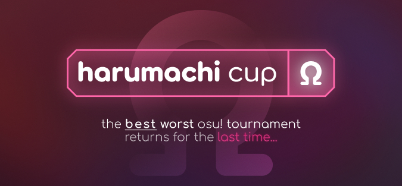

---
tags:
  - HCΩ
  - HCOmega
---

# Harumachi Cup Ω

The **Harumachi Cup Ω** (***HCΩ***) is a worldwide single-elimination osu! tournament hosted by ::{ flag=GB }:: [chromb](https://osu.ppy.sh/users/10238680). The tournament is completely comprised of the song *Harumachi Clover* in various remixes done by individuals in the osu! community and through osu!'s Featured Artist program. It is the third instalment of the Harumachi Cup series.

## Tournament schedule

| Event | Timestamp |
| --: | :-- |
| Registration phase | 2022-06-03/2022-06-11 |
| Qualifiers | 2022-07-02/2022-07-07 |
| Group heats | 2022-07-09/2022-07-13 |
| Round of 16 | 2022-07-15/2022-07-17 |
| Quarterfinals | 2022-07-22/2022-07-24 |
| Semifinals | 2022-07-30 |
| Grand Finals | 2022-07-31 |

## Prizes

| Placing | Prize(s) |
| :-: | :-- |
|  | 12 months of osu!supporter |
|  | 6 months of osu!supporter |
|  | 3 months of osu!supporter |

## Organisation

Harumachi Cup Ω is run by various community members.

| Position | Member(s) |
| :-- | :-- |
| Organiser | ::{ flag=GB }:: [chromb](https://osu.ppy.sh/users/10238680), ::{ flag=GB }:: [Hubz](https://osu.ppy.sh/users/10379965), ::{ flag=GB }:: [mangomizer](https://osu.ppy.sh/users/1893718) |
| Guest mapper | ::{ flag=US }:: [Nao Tomori](https://osu.ppy.sh/users/5364763), ::{ flag=FR }:: [Nozhomi](https://osu.ppy.sh/users/2716981), ::{ flag=TR }:: [Orkay](https://osu.ppy.sh/users/9321674) |
| Streamer | ::{ flag=GB }:: [Hubz](https://osu.ppy.sh/users/10379965) |
| Commentator | ::{ flag=GB }:: [chromb](https://osu.ppy.sh/users/10238680), ::{ flag=GB }:: [Teezel](https://osu.ppy.sh/users/7528639) |
| Designer | ::{ flag=GB }:: [Hubz](https://osu.ppy.sh/users/10379965) |
| Outreach/Consultant | ::{ flag=GB }:: [mangomizer](https://osu.ppy.sh/users/1893718) |
| Referee | ::{ flag=US }:: [Blushing](https://osu.ppy.sh/users/5927823), ::{ flag=GB }:: [chromb](https://osu.ppy.sh/users/10238680), ::{ flag=ZA }:: [KaedeSnowyyy](https://osu.ppy.sh/users/18323026), ::{ flag=EE }:: [megahello](https://osu.ppy.sh/users/11155994), ::{ flag=VN }:: [My Angel Chino](https://osu.ppy.sh/users/20547597) |
| Statistician | ::{ flag=GB }:: [chromb](https://osu.ppy.sh/users/10238680) |
| Wiki editor | ::{ flag=US }:: [Blushing](https://osu.ppy.sh/users/5927823) |

## Links

- [Discord server](https://discord.com/invite/eHBQX8pc5v)
- [Discussion thread](https://osu.ppy.sh/community/forums/topics/1587551?n=1)
- [Livestream channel](https://twitch.tv/chr0mb)
- [Website](https://harumachi.chromb.uk/)

## Participants

A list of all participants before seeding can be found [here](https://docs.google.com/spreadsheets/d/1kvtbMT6g3_FaHT5qM0E72tt31YeGmn-BepkmOohXY-U/edit#gid=759770838).

## Seeding results

| Seed | Players |
| :-- | :-- |
| 1–8 | ::{ flag=SK }:: [PeteX](https://osu.ppy.sh/users/1285945), ::{ flag=SA }:: [-Peachii](https://osu.ppy.sh/users/9683186), ::{ flag=FR }:: [Sukiye](https://osu.ppy.sh/users/3674590), ::{ flag=US }:: [Venpris](https://osu.ppy.sh/users/8861593), ::{ flag=US }:: [Cocoamallows](https://osu.ppy.sh/users/9436126), ::{ flag=TR }:: [LyeRR](https://osu.ppy.sh/users/13068741), ::{ flag=KR }:: [Piper](https://osu.ppy.sh/users/10592853), ::{ flag=HU }:: [gecseboti](https://osu.ppy.sh/users/15213139) |
| 9–16 | ::{ flag=DE }:: [TobisawaMisaki](https://osu.ppy.sh/users/11393715), ::{ flag=FR }:: [TotorPotate 2](https://osu.ppy.sh/users/10325072), ::{ flag=CY }:: [Def0ltt](https://osu.ppy.sh/users/12221151), ::{ flag=AU }:: [Cereal](https://osu.ppy.sh/users/6541627), ::{ flag=DE }:: [Finney](https://osu.ppy.sh/users/11393702), ::{ flag=US }:: [KoiFishu](https://osu.ppy.sh/users/4539930), ::{ flag=GB }:: [Matt4132](https://osu.ppy.sh/users/11706972), ::{ flag=NO }:: [Frodo55](https://osu.ppy.sh/users/14398471) |
| 17–24 | ::{ flag=KR }:: [Garalulu](https://osu.ppy.sh/users/757783), ::{ flag=SI }:: [Sirek](https://osu.ppy.sh/users/14666725), ::{ flag=US }:: [Gabey](https://osu.ppy.sh/users/12904237), ::{ flag=ID }:: [DeathHydra](https://osu.ppy.sh/users/7457788), ::{ flag=CL }:: [suntan](https://osu.ppy.sh/users/19998548), ::{ flag=HK }:: [Legitted](https://osu.ppy.sh/users/12387359), ::{ flag=TH }:: [namirin1](https://osu.ppy.sh/users/10249166), ::{ flag=AR }:: [Keyz](https://osu.ppy.sh/users/10408325) |
| 25–32 | ::{ flag=US }:: [[Mocha]](https://osu.ppy.sh/users/13888092), ::{ flag=DE }:: [SgtCataclyst](https://osu.ppy.sh/users/7947626), ::{ flag=US }:: [Wikip3dia](https://osu.ppy.sh/users/17299001), ::{ flag=SG }:: [qstronaut](https://osu.ppy.sh/users/10958852), ::{ flag=PL }:: [LewusekX44](https://osu.ppy.sh/users/9997359), ::{ flag=US }:: [XD piranha](https://osu.ppy.sh/users/13182910), ::{ flag=SK }:: [TenIdiotZTelky](https://osu.ppy.sh/users/10069181), ::{ flag=NZ }:: [pii](https://osu.ppy.sh/users/13588932) |
| 33–40 | ::{ flag=CA }:: [McNonal](https://osu.ppy.sh/users/10395167), ::{ flag=US }:: [ZephyrCo](https://osu.ppy.sh/users/7516954), ::{ flag=GB }:: [rubrub](https://osu.ppy.sh/users/16764402), ::{ flag=US }:: [Luqkay](https://osu.ppy.sh/users/16538717), ::{ flag=AT }:: [Aureola](https://osu.ppy.sh/users/4929497), ::{ flag=VN }:: [Chipperonio](https://osu.ppy.sh/users/13141032), ::{ flag=CZ }:: [Silver Tail](https://osu.ppy.sh/users/13334570), ::{ flag=BG }:: [hlanden](https://osu.ppy.sh/users/4934554) |
| 41–48 | ::{ flag=BG }:: [Arthus](https://osu.ppy.sh/users/1869492), ::{ flag=RU }:: [Verneo](https://osu.ppy.sh/users/6842477), ::{ flag=PT }:: [uatzap](https://osu.ppy.sh/users/16509171), ::{ flag=US }:: [bazingasdead](https://osu.ppy.sh/users/14139392), ::{ flag=TR }:: [y4kr3b](https://osu.ppy.sh/users/10991434), ::{ flag=MY }:: [Lunasa](https://osu.ppy.sh/users/16436446), ::{ flag=BR }:: [-Matyr-](https://osu.ppy.sh/users/13771539), ::{ flag=PL }:: [xMatrix382](https://osu.ppy.sh/users/12047601) |
| 49–56 | ::{ flag=NL }:: [ShiRonium](https://osu.ppy.sh/users/13956957), ::{ flag=US }:: [elite975](https://osu.ppy.sh/users/15475797), ::{ flag=US }:: [WhirI](https://osu.ppy.sh/users/13593866), ::{ flag=GB }:: [Blobritto](https://osu.ppy.sh/users/15300480), ::{ flag=KZ }:: [Plombire](https://osu.ppy.sh/users/15656399), ::{ flag=AU }:: [hayleyisgoat](https://osu.ppy.sh/users/17720805), ::{ flag=BG }:: [ShellBusterTTV](https://osu.ppy.sh/users/16301044), ::{ flag=TW }:: [james2323123](https://osu.ppy.sh/users/13222659) |
| 57–64 | ::{ flag=PL }:: [Placek21](https://osu.ppy.sh/users/8369677), ::{ flag=US }:: [Chromasia](https://osu.ppy.sh/users/7306251), ::{ flag=PL }:: [Tutka](https://osu.ppy.sh/users/8170022), ::{ flag=SE }:: [girl liker](https://osu.ppy.sh/users/13065776), ::{ flag=US }:: [glyph on osu](https://osu.ppy.sh/users/11612720), ::{ flag=AT }:: [z9a](https://osu.ppy.sh/users/13057699), ::{ flag=US }:: [BuySharp](https://osu.ppy.sh/users/15100885), ::{ flag=SK }:: [-Seam-](https://osu.ppy.sh/users/10876026) |

## Mappools

### Qualifiers

**[Download the mappack here! (14 MB)](https://drive.google.com/file/d/1nPtasOkuwmdRPwL9kIcoTiX28MLygtXW/view)**

- NoMod
  - [Hanasaka Yui(CV: M.A.O) - Harumachi Clover (ezek) [Fiery's Extra]](https://osu.ppy.sh/beatmapsets/652412#osu/1396152)
- Hidden
  - [Hanasaka Yui(CV: M.A.O) - Harumachi Clover (Uber) [pishi's Extra]](https://osu.ppy.sh/beatmapsets/594207#osu/1257217)
- HardRock
  - [Hanasaka Yui(CV: M.A.O) - Harumachi Clover (Naotoshi) [ktgster's Cloverdose]](https://osu.ppy.sh/beatmapsets/591987#osu/1253252)
- DoubleTime
  - [Hanasaka Yui(CV: M.A.O) - Harumachi Clover (Hanasaka Yui) [Insane]](https://osu.ppy.sh/beatmapsets/933554#osu/1948943)
- FreeMod
  - [Hanasaka Yui(CV: M.A.O) - Harumachi Clover (Reillia) [VINXIS' Insane]](https://osu.ppy.sh/beatmapsets/567163#osu/1201369)

### Group heats

**[Download the mappack here! (13 MB)](https://drive.google.com/file/d/1rJlui9yYFaFiG2wZFNPb2-kgUKljjNpU/view)**

- NoMod
  - [Hanasaka Yui(CV: M.A.O) - Harumachi Clover -GOLDENWOLF METAL MIX- (Nao Tomori) [Wolf's Extra Stage]](https://osu.ppy.sh/beatmapsets/675685#osu/1429346)
- Hidden
  - [Hanasaka Yui(CV: M.A.O) - Harumachi Clover (lit120) [Lasse's Insane]](https://osu.ppy.sh/beatmapsets/558217#osu/1181061)
- HardRock
  - [Hanasaka Yui(CV: M.A.O) - Harumachi Clover (Naotoshi) [ktgster's Special]](https://osu.ppy.sh/beatmapsets/649373#osu/1385215)
- DoubleTime
  - [Hanasaka Yui(CV: M.A.O) - Harumachi Clover (ezek) [Insane]](https://osu.ppy.sh/beatmapsets/652412#osu/1383388)
- FreeMod
  - [Will Stetson - Harumachi Clover (Swing Arrangement) (Will Stetson) [Expert]](https://osu.ppy.sh/beatmapsets/859783#osu/1849505)

### Round of 16

**[Download the mappack here! (23 MB)](https://drive.google.com/file/d/1cuC1OhIdxnYTXYIXtW682fFxakWhnoSB/view)**

- NoMod
  - [Will Stetson - Harumachi Clover (Swing Arrangement) \<Dictate Edit\> (Sotarks) [Oh no!]](https://osu.ppy.sh/beatmapsets/842412#osu/1764213)
  - [Will Stetson - Harumachi Clover (Swing Arrangement) (Will Stetson) [Fiery's Extreme]](https://osu.ppy.sh/beatmapsets/859783#osu/1893461)
- Hidden
  - [Hanasaka Yui(CV: M.A.O) - Harumachi Clover -blooming mix- (Naotoshi) [Spring Breeze]](https://osu.ppy.sh/beatmapsets/627085#osu/1321495)
- HardRock
  - [Hanasaka Yui(CV: M.A.O) - Harumachi Clover (TV Size) (Hanasaka Yui) [Hanasaka Yui]](https://osu.ppy.sh/beatmapsets/933554#osu/1948941)
- DoubleTime
  - [Hanasaka Yui(CV: M.A.O) ft. Koalazy - Harumachi Clover (Hey lululu) [Extra]](https://osu.ppy.sh/beatmapsets/780651#osu/1639738)
- FreeMod
  - [Will Stetson - Harumachi Clover (Swing Arrangement) (Will Stetson) [Akitoshi's Extra]](https://osu.ppy.sh/beatmapsets/859783#osu/1797548)
- Tiebreaker
  - [Hanasaka Yui (CV: M.A.O) - Harumachi Clover (NAGI vs 14 Remix) (naotoshi) [Naorumirchi Clover]](https://osu.ppy.sh/beatmapsets/708763#osu/1538589)

## Ruleset

### General

1. This tournament is broken up into 3 divisions of player versus player (see the [Tournament staging](#tournament-staging) section below), with a single-elimination bracket.
2. The scoring system used will be **ScoreV2**.
3. This tournament is an **osu!** tournament.
4. Match scheduling is decided by the organisers. Players may feel free to ask for a reschedule if the given schedule conflicts with the player. If a reschedule is approved, it might not be streamed or recorded due to staff availability.
5. If there is no referee available, the match may be postponed.
6. If both players tie on a map, the map will be replayed again; if the players tie once again, the map will be nullified, and the player who picked the map will be able to pick a new one. In the case there is no other map than the one already played, there will be a brief break and the map will be replayed once more.
7. If a player disconnects from the game, the opposite player will get a point. This is nullified if a player disconnects within **30 seconds** after beginning the map, in which case the map will be restarted. Any deliberate abuse of this rule will be penalised at the tournament staff's discretion.
8. Players have **10 minutes** to show up to their scheduled match. A referee will ping the two players 15 minutes before their scheduled match time via osu! private message and Discord.
9. If the opponent fails to show up, the player who does show up automatically advances.
   - If both players fail to show up, the player with the higher seed will advance.
10. The tournament staff reserves the right to disqualify any player who exhibits harmful or unbecoming behaviour.
11. Any other rule changes or unexpected occurrences will be announced in the Discord server. Please pay attention.

### Registration

This tournament is **strictly** for those between the ranks of **999 and infinity** exclusive (after BWS calculation). If the players meet this primary condition, they will also need to:

1. Sign up through the [website](https://harumachi.chromb.uk/home)
2. All players **must** be in the [Discord server](https://discord.com/invite/eHBQX8pc5v)

### Tournament staging

There are 3 divisions in this tournament: Qualifiers, Group heats, and a single-elimination bracket. The bracket includes the Quarterfinals, Semifinals, and Grand Finals, totalling 5 tournament stages.

#### Qualifiers

- This stage consists of multiple lobbies over the week and will contain up to 15 players per lobby.
- Seeding will take place after the final lobby of the Qualifiers is complete.
- **Players who seeded in the top 64 will qualify.**
- Players are seeded by their **total** score across all five qualifier maps.
- The mappool will be played through twice, but only the **highest score** is recorded for seeding purposes.
- There are no warmups for the Qualifiers.

#### Group heats

- Similar format as Qualifiers.
- Qualified players are seeded into one of eight groups.
- Multiple lobbies will be available due to time zone conflicts. **Please let tournament staff know if there is a conflict.**
- The mappool will consist of 5 maps.
- The mappool will be played through twice, with the player's **highest score** being recorded for seeding.
- **The top 2 players from each group will advance to the 1v1 bracket.**
- There are no warmups for the Group heats.

#### Bracket

- Classic 1v1 format.
- Rounds are seeded based on positions from the Group heats.
- No bans.
- `!roll` to pick.
- The winner of each round proceeds to the next round.

#### Best-of format

| Stage | Format |
| :-- | :-- |
| Qualifiers / Group heats | No best-of format. Play with the intent to get the highest score. |
| Round of 16 / Quarterfinals | Best-of-7 |
| Semifinals | Best-of-9 |
| Grand Finals | Best-of-11 |

### Scheduling

1. The schedule for the tournament is listed under the [Tournament schedule](#tournament-schedule) section. Please use the time in between to practise the mappools.
2. Matches are allowed to overlap if referees are available.
3. For the 1v1 bracket:
   - If both players can come up with a better time than what is scheduled, please inform the organisers as soon as possible so they can make adjustments.

### Mappools

1. See the [Mappools](#mappools) section for more specifics on what maps will be played.
2. There will be a variety of *Harumachi Clover* maps to choose from in each stage of the tournament.
   - Note that bans **are not** allowed in the [1v1 bracket](#bracket).
3. Each stage will have the number of maps and mods as seen below:

| Stage | Map counts |
| :-- | :-- |
| Qualifiers / Groups | 1 NM, 1 HD, 1 HR, 1 DT, 1 FM |
| Round of 16 / Quarterfinals | 2 NM, 1 HD, 1 HR, 1 DT, 1 FM, 1 TB |
| Semifinals | 2 NM, 1 HD, 1 HR, 2 DT, 2 FM, 1 TB |
| Grand Finals | 2 NM, 2 HD, 2 HR, 2 DT, 2 FM, 1 TB |

### Seeding specifics

1. Seeding will take place during the Qualifiers and the Group heats.
2. During the Qualifiers there will be multiple lobbies open for sign-ups. Please make sure to sign up for a time that best fits your schedule.
3. The Qualifiers are used to help eliminate people who do not show up and to get the participation count to the nice number of 64.
4. There will be no warmups for the Qualifiers and Group heats. Remember that since this is a *Harumachi Clover* tournament, the maps are only 40 seconds at most.
5. Seeding will be calculated by taking the highest score recorded and comparing them of the other players.

### Lobby specifics

1. A private match will be created for the matches. The players will be invited to the associated match around 15 minutes before the match time. Make sure to have PMs enabled for everyone, not just for those on your friends list, as the invite does **not** bypass this setting. If you are unable to make it to the match due to this issue, your position in the tournament is **not** guaranteed.
2. During the 1v1 bracket, each player will `!roll`, and the winner of the roll **picks who will pick the first map**. To reiterate, if you win the `!roll`, this does **not** mean you pick the first map, this means you pick whether you pick the first map or your opponent does. Choose wisely!
3. For the Qualifiers and Group heats, **the mappool will be played through twice**.
4. Players will be allowed to ask for a brief break at the end of the first run-through of the mappool.
5. There are **no** bans.
6. There are **no** warmups. Be prepared.
7. 1v1 bracket only: in case of a tie, the tiebreaker will be played. See [rule 6 of the general rules](#general) for more details.
