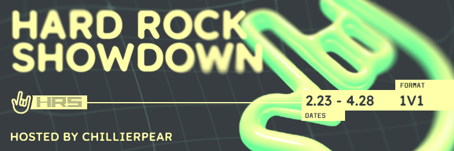
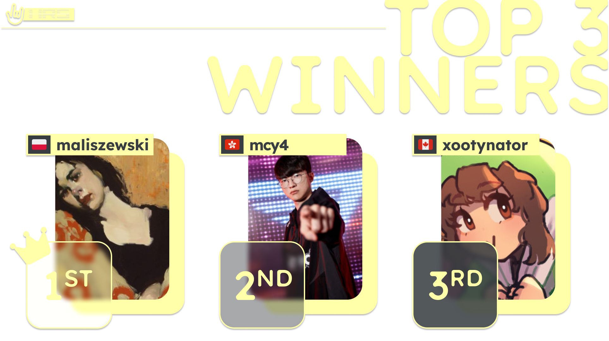

---
tags:
  - HRS
  - HRS2024
---

# Hard Rock Showdown 2024

**Hard Rock Showdown 2024** (***HRS 2024***) was an international 1v1 osu! tournament hosted by ::{ flag=US }:: [ChillierPear](https://osu.ppy.sh/users/9501251). It was the first instalment of the Hard Rock Showdown.

## Tournament schedule

| Event | Timestamp |
| --: | :-- |
| Registration phase | 2024-02-23/2024-03-08 (23:59 UTC) |
| Qualifier showcase | 2024-03-10 (16:00 UTC) |
| Qualifier stage | 2024-03-15/2024-03-17 |
| Round of 32 | 2024-03-22/2024-03-24 |
| Round of 16 | 2024-03-29/2024-03-31 |
| Quarterfinals | 2024-04-05/2024-04-07 |
| Semifinals | 2024-04-12/2024-04-14 |
| Finals | 2024-04-19/2024-04-21 |
| Grand Finals | 2024-04-26/2024-04-28 |

## Prizes

| Placing | Prizes |
| :-: | :-- |
|  | Profile badge (pending), Wooting UwU keypad |
|  | Foxbox tablet cover (HRS-themed) |
|  | 6 months of osu!supporter |

## Organisation

Hard Rock Showdown 2024 was run by various community members.

| Position | Member(s) |
| :-- | :-- |
| Manager | ::{ flag=US }:: [ChillierPear](https://osu.ppy.sh/users/9501251) |
| Mappool selector | ::{ flag=US }:: [ChillierPear](https://osu.ppy.sh/users/9501251), ::{ flag=GB }:: [lystia](https://osu.ppy.sh/users/11042418) |
| Mappool playtester | ::{ flag=US }:: [Belladonna](https://osu.ppy.sh/users/11758404), ::{ flag=US }:: [ChillierPear](https://osu.ppy.sh/users/9501251), ::{ flag=CA }:: [D I O](https://osu.ppy.sh/users/3958619), ::{ flag=US }:: [M I L E S](https://osu.ppy.sh/users/6036351), ::{ flag=CA }:: [rayuii](https://osu.ppy.sh/users/6304246), ::{ flag=CA }:: [Yip](https://osu.ppy.sh/users/5177569) |
| Mapper | ::{ flag=US }:: [captin1](https://osu.ppy.sh/users/689997), ::{ flag=TW }:: [knowledgeking](https://osu.ppy.sh/users/8022517), ::{ flag=AR }:: [Megafan](https://osu.ppy.sh/users/6632605) |
| Commentator | ::{ flag=US }:: [ChillierPear](https://osu.ppy.sh/users/9501251) |
| Streamer | ::{ flag=US }:: [ChillierPear](https://osu.ppy.sh/users/9501251) |
| Referee | ::{ flag=US }:: [AccNome](https://osu.ppy.sh/users/10976433), ::{ flag=US }:: [akace100](https://osu.ppy.sh/users/9308128), ::{ flag=DE }:: [Beuto](https://osu.ppy.sh/users/15115857), ::{ flag=RO }:: [BeZonaurul](https://osu.ppy.sh/users/11068604), ::{ flag=FR }:: [Emezys](https://osu.ppy.sh/users/5054244), ::{ flag=PE }:: [ERA Xuste](https://osu.ppy.sh/users/17989444), ::{ flag=FI }:: [Laurakko](https://osu.ppy.sh/users/7253731), ::{ flag=GB }:: [pericrayola](https://osu.ppy.sh/users/31184671), ::{ flag=US }:: [ROB\_](https://osu.ppy.sh/users/12455868), ::{ flag=FR }:: [Sohlayce](https://osu.ppy.sh/users/17649736), ::{ flag=DE }:: [Spunout](https://osu.ppy.sh/users/9620860), ::{ flag=IN }:: [TsukiUwU](https://osu.ppy.sh/users/14926905), ::{ flag=US }:: [vleth](https://osu.ppy.sh/users/18556796), ::{ flag=US }:: [\[K\]](https://osu.ppy.sh/users/16551387) |
| Technical | ::{ flag=CA }:: [D I O](https://osu.ppy.sh/users/3958619), ::{ flag=US }:: [\[K\]](https://osu.ppy.sh/users/16551387) |
| Designer | ::{ flag=CA }:: [kaetwo](https://osu.ppy.sh/users/1997719) |

## Links

- [Information spreadsheet](https://docs.google.com/spreadsheets/d/1cPIjLK9939txj99_fkf34AujWlxC3M0Ra_DPX0iebks/edit#gid=26758724)
- [Discord server](https://discord.gg/aEkWWEeaaq)
- [Forum thread](https://osu.ppy.sh/community/forums/topics/1887917?n=1)
- [Livestream](https://www.twitch.tv/ChillierPear)
- [Challonge bracket](https://challonge.com/HRS2024)

## Participants

|  | Seed | Participant |
| :-: | :-: | :-- |
| ::{ flag=PL }:: | **1** | **[maliszewski](https://osu.ppy.sh/users/12408961)** |
| ::{ flag=HK }:: | **2** | **[mcy4](https://osu.ppy.sh/users/2165650)** |
| ::{ flag=CA }:: | **3** | **[his kitten](https://osu.ppy.sh/users/3717598)** |
| ::{ flag=KR }:: | **4** | **[Amamya Kokoro](https://osu.ppy.sh/users/2511839)** |
| ::{ flag=RU }:: | **5** | **[Welter](https://osu.ppy.sh/users/11552867)** |
| ::{ flag=RU }:: | **6** | **[Chicony](https://osu.ppy.sh/users/5199332)** |
| ::{ flag=CA }:: | **7** | **[Zylice](https://osu.ppy.sh/users/5033077)** |
| ::{ flag=RO }:: | **8** | **[Lucrise](https://osu.ppy.sh/users/9719351)** |
| ::{ flag=CN }:: | **9** | **[Crystal](https://osu.ppy.sh/users/1646397)** |
| ::{ flag=RU }:: | **10** | **[desuqe](https://osu.ppy.sh/users/9712285)** |
| ::{ flag=US }:: | **11** | **[fieryrage](https://osu.ppy.sh/users/3533958)** |
| ::{ flag=JP }:: | **12** | **[Sabakan-](https://osu.ppy.sh/users/12941954)** |
| ::{ flag=NZ }:: | **13** | **[Saiyku](https://osu.ppy.sh/users/13767572)** |
| ::{ flag=CN }:: | **14** | **[lolol233](https://osu.ppy.sh/users/11375105)** |
| ::{ flag=NO }:: | **15** | **[antonyw](https://osu.ppy.sh/users/12959983)** |
| ::{ flag=HK }:: | **16** | **[Hibiki](https://osu.ppy.sh/users/5413624)** |
| ::{ flag=RU }:: | **17** | **[Skrowell](https://osu.ppy.sh/users/9694263)** |
| ::{ flag=UA }:: | **18** | **[RafGPio](https://osu.ppy.sh/users/13705417)** |
| ::{ flag=SG }:: | **19** | **[GSBlank](https://osu.ppy.sh/users/2312106)** |
| ::{ flag=CA }:: | **20** | **[GENDER BENDER](https://osu.ppy.sh/users/2758279)** |
| ::{ flag=IL }:: | **21** | **[PaintedKoala](https://osu.ppy.sh/users/10056419)** |
| ::{ flag=CA }:: | **22** | **[Saryi](https://osu.ppy.sh/users/10051720)** |
| ::{ flag=NO }:: | **23** | **[nanolini](https://osu.ppy.sh/users/12353810)** |
| ::{ flag=TR }:: | **24** | **[Shinkiro](https://osu.ppy.sh/users/6093148)** |
| ::{ flag=DE }:: | **25** | **[rundyyy](https://osu.ppy.sh/users/10917620)** |
| ::{ flag=UY }:: | **26** | **[Rebo](https://osu.ppy.sh/users/6942259)** |
| ::{ flag=IT }:: | **27** | **[ILBOSSDELPOPPIN](https://osu.ppy.sh/users/13925698)** |
| ::{ flag=RU }:: | **28** | **[Majewski](https://osu.ppy.sh/users/10064064)** |
| ::{ flag=US }:: | **29** | **[Flameztear](https://osu.ppy.sh/users/13207763)** |
| ::{ flag=HU }:: | **30** | **[defii](https://osu.ppy.sh/users/8698024)** |
| ::{ flag=AR }:: | **31** | **[R1cho](https://osu.ppy.sh/users/13065919)** |
| ::{ flag=LV}:: | **32** | **[hihihaha142](https://osu.ppy.sh/users/21653406)** |

## Podium

## Mappools

### Grand Finals

**[Download the mappack here (188 MB)](https://drive.google.com/file/d/1u_p0Q_qonf4hxbsmYVguFiiWb-W5r7mO/view?usp=sharing)**

- Hard Rock
  1. [SymaG - Fuckin' Friday \[REAL\]](https://osu.ppy.sh/beatmapsets/2088552#osu/4376786)
  2. [Ludicin - Bismuth \[Celestial Journey\]](https://osu.ppy.sh/beatmapsets/2111658#osu/4432931)
  3. [yuikonnu - Kakushigoto [Distressed, Lonely and Deciduous]](https://osu.ppy.sh/beatmapsets/2169997#osu/4579475)
  4. [kors k vs. Camellia - The Rolling \[song is nice though\]](https://osu.ppy.sh/beatmapsets/688576#osu/1457148)
  5. [BlackY vs. cosMo@BousouP - Improvisation Colosseum \[Nattu vs. Ciyus Miapah : The First Duty on Battlefield\]](https://osu.ppy.sh/beatmapsets/1045242#osu/2185106)
  6. [WALKURE - Ikenai Borderline \(Speed Up Ver.\) \[Your voice may even reach the heavens one day\]](https://osu.ppy.sh/beatmapsets/525461#osu/1230854)
  7. [Tsukidono - Neon Street Front \[Adrenaline Rush\]](https://osu.ppy.sh/beatmapsets/1812854#osu/3718868)
  8. [Five Hammer - fffff \[Forte fortissississimo\]](https://osu.ppy.sh/beatmapsets/1290926#osu/2679663)
  9. [Wagakki Band - Tengaku \[Uncompressed Fury of a Raging Japanese God\]](https://osu.ppy.sh/beatmapsets/336414#osu/816327)
  10. [F A K E S - Last Words \[Kaleidoscope\]](https://osu.ppy.sh/beatmapsets/1497474#osu/3069381)
  11. [Camellia - R U Still xxxx? \[Extra\]](https://osu.ppy.sh/beatmapsets/384402#osu/839947)
  12. [Various Artists - We are DREAMERS!! \[HASHIRE!!\]](https://osu.ppy.sh/beatmapsets/1984834#osu/4122431)
  13. [Masafumi Takada - Ms. Monomi's Practice Lesson \[Aery Light\]](https://osu.ppy.sh/beatmapsets/927033#osu/1936867)
  14. [Frums - XNOR XNOR XNOR \[Fire\]](https://osu.ppy.sh/beatmapsets/1236927#osu/2573162)
  15. [Kanpyohgo - Unmei no Dark Side -Rolling Gothic mix \[FreeSongs' Rolling Hell\]](https://osu.ppy.sh/beatmapsets/514980#osu/1093703)
  16. [seatrus - O \[4th Dimension\]](https://osu.ppy.sh/beatmapsets/2169867#osu/4579201)
  17. [P-MODEL - LAB=01 \[Stealthman\]](https://osu.ppy.sh/beatmapsets/1550895#osu/3169255)
  18. [Seiryu - AO-Infinity \[Infinity\]](https://osu.ppy.sh/beatmapsets/595127#osu/1258579)
  19. [Taku Inoue - Yoake made Ato 3 Byou \[Dawn\]](https://osu.ppy.sh/beatmapsets/768893#osu/1616928)
  20. [EGOIST - Eiyuu Unmei no Uta \(TV Edit\) \[Irre's Extra\]](https://osu.ppy.sh/beatmapsets/637050#osu/1426307)
- Tiebreaker
  1. **[AAAA - Hoshi o Kakeru Adventure ~ we are forever friends! ~ \[Long ver.\] \[Memory\]](https://osu.ppy.sh/beatmapsets/1844826#osu/3789556)**

### Finals

**[Download the mappack here (163 MB)](https://drive.google.com/file/d/1qWQh_mr_zXV6hsEG4-1hg9I3QfRXuVxu/view?usp=sharing)**

- Hard Rock
  1. [AISHA, Epsilon Zero - Love the Subhuman Self \[JOUNZAN'S LUST SHAKER\]](https://osu.ppy.sh/beatmapsets/1829281#osu/3754404)
  2. [Cranky vs. HiTECH NINJA - HiT! HiT! HiT! \[GREETINGS FROM HELL\]](https://osu.ppy.sh/beatmapsets/1176223#osu/2453247)
  3. [lapix - SYNERGY \[REEEEEEEEEEEEEEEEEEEEEE\]](https://osu.ppy.sh/beatmapsets/637233#osu/1351972)
  4. [LV.4 - Burning Star \[Burn Out\]](https://osu.ppy.sh/beatmapsets/2095154#osu/4393036)
  5. [PinocchioP - Reincarnation Apple feat. Hatsune Miku \[Horsace's Favorite Apple\]](https://osu.ppy.sh/beatmapsets/1976954#osu/4103881)
  6. [Jeff Williams feat. Casey Lee Williams & Lamar Hall - Ignite \[Eyes of Fire\]](https://osu.ppy.sh/beatmapsets/1581335#osu/3229024)
  7. [sabi - true DJ MAG top ranker's song Zenpen (katagiri Remix) \[KEMOMIMI EDM SQUAD\]](https://osu.ppy.sh/beatmapsets/1357624#osu/2809623)
  8. [Camellia - werewolf howls. \["Growling" Long ver.\] \[OUTRAGE\]](https://osu.ppy.sh/beatmapsets/970653#osu/2034862)
  9. [Whispered - Jikininki \[Japanese Ghost\]](https://osu.ppy.sh/beatmapsets/750201#osu/1579914)
  10. [NOMA - Brain Power(Cranky Remix) \[Eurobrain\]](https://osu.ppy.sh/beatmapsets/1333176#osu/2762163)
  11. [Tomita Miyu, Onishi Saori, Ohzora Naomi, Hanazawa Kana - Hallelujah*Essaim \[DILF\]](https://osu.ppy.sh/beatmapsets/1197074#osu/2526166)
  12. [SMiLE.dk - Koko Soko (AKIBA KOUBOU Eurobeat Remix) \[INCREDIBILIS\]](https://osu.ppy.sh/beatmapsets/1143822#osu/2388297)
  13. [Camellia - Ryuuseigun \[Perseids\]](https://osu.ppy.sh/beatmapsets/1188437#osu/3087146)
  14. [Imy - Drowning in you \[hr tourney\]](https://osu.ppy.sh/beatmapsets/2166585#osu/4570971)
  15. [IOSYS - Kanbu de Tomatte Sugu Tokeru ~ Kyouki no Udongein \[Ayyri & Zelq's Expert\]](https://osu.ppy.sh/beatmapsets/1442363#osu/3086275)
  16. [S2TB Recording - Super Luminal \[SHD\]](https://osu.ppy.sh/beatmapsets/1620087#osu/3307758)
  17. [setup - Ypsilon \[\[//\]\]](https://osu.ppy.sh/beatmapsets/1751322#osu/3582892)
  18. [Igorrr - Houmous \[squirrelp's Expert\]](https://osu.ppy.sh/beatmapsets/703568#osu/1535062)
  19. [Gesu no Kiwami Otome. - Digital Mogura \[Idealist\]](https://osu.ppy.sh/beatmapsets/737340#osu/1556011)
  20. [TSUNKU - Kumitate Koujou \[Ameth's Scale\]](https://osu.ppy.sh/beatmapsets/504165#osu/1077307)
- Tiebreaker
  1. **[Camellia - Nacreous Snowmelt \[Hypothermia\]](https://osu.ppy.sh/beatmapsets/1449188#osu/2979785)**

### Semifinals

**[Download the mappack here (161 MB)](https://drive.google.com/file/d/1lWRK0BZADBqR5zS5vWOpibJuFdQ2nN6C/view?usp=sharing)**

- Hard Rock
  1. [sokoninaru - Tenohira de odoru \[Dancer\]](https://osu.ppy.sh/beatmapsets/773686#osu/1626300)
  2. [ReeK - Possesed By The Blood Moon \[BLACKMAGIK BLAZING\]](https://osu.ppy.sh/beatmapsets/1096471#osu/2291305)
  3. [Mindless Self Indulgence - Faggot \[p****\]](https://osu.ppy.sh/beatmapsets/1780095#osu/3645482)
  4. [tn-shi - Synthesis. \[.Dimension \(Lancien\)\]](https://osu.ppy.sh/beatmapsets/2088830#osu/4417955)
  5. [AAAA vs. Frums - beepbit * futures \[rektygons * expert\]](https://osu.ppy.sh/beatmapsets/1633221#osu/4041465)
  6. [Camellia - We Magicians Still Alive in 2021 \[Unification\]](https://osu.ppy.sh/beatmapsets/1516120#osu/3117364)
  7. [xi - FREEDOM DiVE \[UberFazz's ViViD\]](https://osu.ppy.sh/beatmapsets/1667560#osu/3508931)
  8. [SIDxRAM - RAMSING \[CULT LEADER METAMORPHOSIS\]](https://osu.ppy.sh/beatmapsets/1137778#osu/2376713)
  9. [Camellia - Routing \[Comfort\]](https://osu.ppy.sh/beatmapsets/403282#osu/967546)
  10. [SEPHID - Critical Cannonball \(Extended ver.\) \[Limit Break\]](https://osu.ppy.sh/beatmapsets/1189616#osu/2478754)
  11. [3R2 - Sudden Death \[X-Bunny\]](https://osu.ppy.sh/beatmapsets/605109#osu/1765587)
  12. [Hakushi Hasegawa - Sabaku de \[iPhone Six Plus\]](https://osu.ppy.sh/beatmapsets/1360892#osu/2815972)
  13. [Fallen Shepherd ft. RabbiTon Strings - ENDYMION \[Challenge\]](https://osu.ppy.sh/beatmapsets/1131952#osu/2364427)
  14. [DragonForce - Seasons \[Legend\]](https://osu.ppy.sh/beatmapsets/449873#osu/965243)
  15. [kamome sano - archive::zip \[Axarious' Expert \(#3\)\]](https://osu.ppy.sh/beatmapsets/1060190#osu/2219880)
  16. [Sakuzyo - Stoicism \[Jazz!\]](https://osu.ppy.sh/beatmapsets/705318#osu/1491800)
  17. [Silentroom - Primatrix \[Acyl's Expert\]](https://osu.ppy.sh/beatmapsets/1247457#osu/2631387)
  18. [MuryokuP - Catastrophe \[Catastrophe\]](https://osu.ppy.sh/beatmapsets/1850971#osu/3802467)
  19. [paraoka feat. haru*nya - Rampage \[Kyshiro's Ultra\]](https://osu.ppy.sh/beatmapsets/505170#osu/1074894)
  20. [DragonForce - Ashes of the Dawn \[Extreme\]](https://osu.ppy.sh/beatmapsets/786141#osu/1713929)
- Tiebreaker
  1. **[gmtn. (witch's slave) - furioso melodia \[Wrath\]](https://osu.ppy.sh/beatmapsets/280107#osu/633993)**

### Quarterfinals

**[Download the mappack here (128 MB)](https://drive.google.com/file/d/1ccc8MHo3Sb_cPOVupQdAi9VPjEI4LFt-/view?usp=sharing)**

- Hard Rock
  1. [Alfakyun. x Camellia - calling \[Prestissimo\]](https://osu.ppy.sh/beatmapsets/523558#osu/1111493)
  2. [Zmey Gorynich - Aynane \[Brown-eyed Beauty\]](https://osu.ppy.sh/beatmapsets/1842684#osu/3784901)
  3. [Sorry about my face - Call me with you \[\[ya otpravlus' za toboi\]\]](https://osu.ppy.sh/beatmapsets/1621877#osu/3311312)
  4. [40mP feat. chano - Yuugure One Room \[Luscent's Expert\]](https://osu.ppy.sh/beatmapsets/1790796#osu/3669551)
  5. [UNDEAD CORPORATION - Everything will freeze \[Freezing\]](https://osu.ppy.sh/beatmapsets/336471#osu/744673)
  6. [rei sirose - Hakidasu \[Splooge\]](https://osu.ppy.sh/beatmapsets/1759673#osu/3601518)
  7. [Iyowa feat. KAFU - Kyu-kurarin \[Anxiety\]](https://osu.ppy.sh/beatmapsets/1591460#osu/3250375)
  8. [lapix & BEMANI Sound Team "Sota Fujimori" - HI-TECH TOKIO \[STREAM RIDING\]](https://osu.ppy.sh/beatmapsets/1769354#osu/3621995)
  9. [Nana Takahashi/SOUND HOLIC - XINOBIKILL \[brain cells unite\]](https://osu.ppy.sh/beatmapsets/1497294#osu/3069073)
  10. [MYUKKE. - Anti Safety Zone \[Loli & Ducky's Hell Extra\]](https://osu.ppy.sh/beatmapsets/2041230#osu/4258540)
  11. [RAM - Mertvetsy \[Requiem\]](https://osu.ppy.sh/beatmapsets/1627456#osu/3322526)
  12. [Tanchiky - ENERGY SYNERGY MATRIX (Extended) \[ESM COLLAB\]](https://osu.ppy.sh/beatmapsets/2091981#osu/4385157)
  13. [Kuroneko Dungeon - Ryoushi no Umi no Lindwurm \[jyc's ULTRA\]](https://osu.ppy.sh/beatmapsets/372850#osu/827926)
  14. [Rish feat. Choko - Tanaka \[zzx's Extra\]](https://osu.ppy.sh/beatmapsets/1626188#osu/3387672)
  15. [Tatsh - reunion \<Platinum Long Version\> \[Collab Expert\]](https://osu.ppy.sh/beatmapsets/1884903#osu/3880919)
  16. [Ryu* - Mind Mapping (kors k mix) \[EXTRA\]](https://osu.ppy.sh/beatmapsets/1774369#osu/3633083)
  17. [lapix - Flamenco House \[Axaptice's Expert\]](https://osu.ppy.sh/beatmapsets/1865291#osu/3836665)
  18. [LeaF - Monkey Business -Satire mix- \[-PC's Krazy\]](https://osu.ppy.sh/beatmapsets/1221791#osu/2541434)
  19. [KNOWER - The Government Knows \[MOMOHD'S GRID KNOWS\]](https://osu.ppy.sh/beatmapsets/721707#osu/1707533)
  20. [Asuka Ohta, Ryo Nagamatsu - Grumble Volcano \[Apollo's Extra\]](https://osu.ppy.sh/beatmapsets/1763010#osu/3610264)
- Tiebreaker
  1. **[goreshit - game over. \[the end\]](https://osu.ppy.sh/beatmapsets/986213#osu/2314855)**

### Round of 16

**[Download the mappack here (116 MB)](https://drive.google.com/file/d/1jI0qzHWZQD_bo-wJrnPo7y5LgVKkZYCD/view?usp=sharing)**

- Hard Rock
  1. [Summoning The Lich - Death Crystal \[BLOODSTAINED SACRIFICE\]](https://osu.ppy.sh/beatmapsets/1615076#osu/3297498)
  2. [Inori Minase - brave climber \[journey\]](https://osu.ppy.sh/beatmapsets/1873914#osu/3855961)
  3. [Nanahoshi Kangengakudan - Meisou Suru Saraband \[Zarabanda!\]](https://osu.ppy.sh/beatmapsets/1103560#osu/2305462)
  4. [ARForest - Virtual Throne \[Simulated Universe\]](https://osu.ppy.sh/beatmapsets/2011722#osu/4186224)
  5. [black midi - Welcome To Hell \[pocket's providence\]](https://osu.ppy.sh/beatmapsets/1936909#osu/4003657)
  6. [G2 - Our Way \[kodoku's EX\]](https://osu.ppy.sh/beatmapsets/1681416#osu/3434979)
  7. [Sabaton - Twilight Of The Thunder God \[Ragnarok awaits\]](https://osu.ppy.sh/beatmapsets/1616046#osu/3299406)
  8. [KikuoHana - Desert Theater \[Mirage (#1)\]](https://osu.ppy.sh/beatmapsets/1382362#osu/2856086)
  9. [kors k vs. Camellia - The Rolling \[Velocity\]](https://osu.ppy.sh/beatmapsets/1346760#osu/2788974)
  10. [Jun Kuroda - Cybernetics \[Emergence\]](https://osu.ppy.sh/beatmapsets/1325579#osu/2745957)
  11. [Luschka - Kami no Kotoba \[Voice of God\]](https://osu.ppy.sh/beatmapsets/817667#osu/1714637)
  12. [Feryquitous - Quon \[Celestial Crown\]](https://osu.ppy.sh/beatmapsets/990035#osu/2070999)
  13. [Kamisama Club - No. 5 \[Capital\]](https://osu.ppy.sh/beatmapsets/1626872#osu/3321406)
  14. [Ayaponzu* - Streaming Heart \[Extra\]](https://osu.ppy.sh/beatmapsets/552702#osu/1216282)
  15. [Tomita Miyu - OveR \[ExperT\]](https://osu.ppy.sh/beatmapsets/1862561#osu/3830718)
- Tiebreaker
  1. **[Luze - HERA (LONG Version) \[Parthenos\]](https://osu.ppy.sh/beatmapsets/1482719#osu/3105129)**

### Round of 32

**[Download the mappack here (121 MB)](https://drive.google.com/file/d/1kwJzQ9g-P6QnRGIpXTmzyJldt91U87wX/view?usp=sharing)**

- Hard Rock
  1. [Kobaryo - Future Downloader \[Violacea\]](https://osu.ppy.sh/beatmapsets/1871713#osu/3851186)
  2. [Imperial Circus Dead Decadence - Shinbatsu o Tadori Kyoukotsu ni Itaru \[Extreme\]](https://osu.ppy.sh/beatmapsets/482382#osu/2039543)
  3. [Sakin - Denek Hayatim \[bir collab sekiz dokuz.\]](https://osu.ppy.sh/beatmapsets/2033084#osu/4238281)
  4. [Kuba Oms - My Love (Maemi No Yume's Remix) \[Kalindraz & Sakura Airi Splendid Reality\]](https://osu.ppy.sh/beatmapsets/1389127#osu/2868791)
  5. [Power Of Nature - Shounen wa Sora o Tadoru \[Gordon's Expert\]](https://osu.ppy.sh/beatmapsets/1373545#osu/3207766)
  6. [Shaun Martin - Madiba \[Dynamic\]](https://osu.ppy.sh/beatmapsets/1301789#osu/2700108)
  7. [lapix - Day by day (PSYQUI Remix) \[Edge of Tomorrow\]](https://osu.ppy.sh/beatmapsets/1318545#osu/2731544)
  8. [paraoka feat. haru*nya - Hokori Yuki \[BabeLisM\]](https://osu.ppy.sh/beatmapsets/1636932#osu/3340750)
  9. [Kero Kero Bonito - Flamingo (WTN3 Remix) \[Expert\]](https://osu.ppy.sh/beatmapsets/1271938#osu/2643126)
  10. [KUMOKIRI - Shippuujinrai \[Expert\]](https://osu.ppy.sh/beatmapsets/1631947#osu/3331199)
  11. [DJ TOTTO feat. 3L - Youkakushi -Ayakashi Kakushi- \[Difficult\]](https://osu.ppy.sh/beatmapsets/1354863#osu/2804225)
  12. [sakuzyo - AXION \[Another\]](https://osu.ppy.sh/beatmapsets/115193#osu/297811)
  13. [onoken - Lisrim \[Extreme\]](https://osu.ppy.sh/beatmapsets/1471079#osu/3020119)
  14. [dandeless - micro.wav \[USA Tryouts\]](https://osu.ppy.sh/beatmapsets/1499766#osu/3198204)
  15. [YUI - again \[Rizen's Insane\]](https://osu.ppy.sh/beatmapsets/623911#osu/1372702)
- Tiebreaker
  1. **[OctagonCollaboration - The Glorious Octagon of Destiny \[Glorious\]](https://osu.ppy.sh/beatmapsets/1039769#osu/2210170)**

### Qualifiers

**[Download the mappack here (76 MB)](https://drive.google.com/file/d/1IsYP3QBgnp8-XZj2ivR5FaLPxjpxJ_vj/view?usp=sharing)**

- Hard Rock
  1. [youman feat. GUMI - Weenywalker \[holy flip dude\]](https://osu.ppy.sh/beatmapsets/2085331#osu/4368596)
  2. [L.E.D. - INVISIBLE STRIX \[Winged Shadow\]](https://osu.ppy.sh/beatmapsets/1136884#osu/2374190)
  3. [Yousei Teikoku - Autoscopy \[Extreme\]](https://osu.ppy.sh/beatmapsets/1633220#osu/3333699)
  4. [cosMo@BousouP feat. Hatsune Miku - Machinegun Poem Doll \[Chaotic Burst of Maniac Rhythm\]](https://osu.ppy.sh/beatmapsets/1606218#osu/3279860)
  5. [Seiryu - Critical Crystal \[Ultra\]](https://osu.ppy.sh/beatmapsets/199535#osu/473210)
- Precision
  1. [KOTOKO - INFINITE SKY \[Beyond the Geostationary Orbit Level\]](https://osu.ppy.sh/beatmapsets/1050152#osu/2194715)
  2. [MYUKKE. - ARIGA THESIS \[born to cs5 forced to nm6\]](https://osu.ppy.sh/beatmapsets/1829054#osu/3753988)
  3. [xi feat. Sta - Tiferet \[Another\]](https://osu.ppy.sh/beatmapsets/714225#osu/1509637)
  4. [Julian Smith - Racist Coffee (Speed Up Ver.) \[All Drinks Are Created Equal\]](https://osu.ppy.sh/beatmapsets/871225#osu/2056505)
  5. [kanone - The Sea of Memory \[PaRaDogi's Extra\]](https://osu.ppy.sh/beatmapsets/1347768#osu/3137731)

## Match Results

### Grand Finals

Detailed statistics for this round can be found [here](https://docs.google.com/spreadsheets/d/1uQb7xfJjR7rXyirINmu14o-yrwinEx4L5m-zq71ffYQ/edit?usp=sharing).

Saturday, 27 April 2024:

| Player A |  |  | Player B | Match link |
| --: | :-: | :-: | :-- | :-- |
| [his kitten](https://osu.ppy.sh/users/3717598) ::{ flag=CA }:: | 5 | **7** | ::{ flag=HK }:: **[mcy4](https://osu.ppy.sh/users/2165650)** | [#1](https://osu.ppy.sh/community/matches/113655852) |

Sunday, 28 April 2024:

| Player A |  |  | Player B | Match link |
| --: | :-: | :-: | :-- | :-- |
| **[maliszewski](https://osu.ppy.sh/users/12408961)** ::{ flag=PL }:: | **7** | 0 | ::{ flag=HK }:: [mcy4](https://osu.ppy.sh/users/2165650) | [#1](https://osu.ppy.sh/community/matches/113666470) |

### Finals

Detailed statistics for this round can be found [here](https://docs.google.com/spreadsheets/d/1EOfCB-A7flb771CTWJnBRLHQ1-tJBP7K8odKed8Alf0/edit?usp=sharing).

Saturday, 20 April 2024:

| Player A |  |  | Player B | Match link |
| --: | :-: | :-: | :-- | :-- |
| **[Amamya Kokoro](https://osu.ppy.sh/users/2511839)** ::{ flag=KR }:: | **7** | 1 | ::{ flag=CA }:: [Saryi](https://osu.ppy.sh/users/10051720) | [#1](https://osu.ppy.sh/community/matches/113566065) |
| **[mcy4](https://osu.ppy.sh/users/2165650)** ::{ flag=HK }:: | **7** | 0 | ::{ flag=CN }:: [Crystal](https://osu.ppy.sh/users/1646397) | [#1](https://osu.ppy.sh/community/matches/113568035) |

Sunday, 21 April 2024:

| Player A |  |  | Player B | Match link |
| --: | :-: | :-: | :-- | :-- |
| **[maliszewski](https://osu.ppy.sh/users/12408961)** ::{ flag=PL }:: | **7** | 1 | ::{ flag=CA }:: [his kitten](https://osu.ppy.sh/users/3717598) | [#1](https://osu.ppy.sh/community/matches/113584551) |
| **[mcy4](https://osu.ppy.sh/users/2165650)** ::{ flag=HK }:: | **0** | -1 | ::{ flag=KR }:: [Amamya Kokoro](https://osu.ppy.sh/users/2511839) | *forfeit* |

### Semifinals

Detailed statistics for this round can be found [here](https://docs.google.com/spreadsheets/d/1iBpbwZd9fV7BzTMkePV_C4910f2_8j2_KTHjcdlwKHs/edit?usp=sharing).

Thursday, 11 April 2024:

| Player A |  |  | Player B | Match link |
| --: | :-: | :-: | :-- | :-- |
| **[maliszewski](https://osu.ppy.sh/users/12408961)** ::{ flag=PL }:: | **6** | 4 | ::{ flag=KR }:: [Amamya Kokoro](https://osu.ppy.sh/users/2511839) | [#1](https://osu.ppy.sh/community/matches/113449204) |

Saturday, 13 April 2024:

| Player A |  |  | Player B | Match link |
| --: | :-: | :-: | :-- | :-- |
| **[Saryi](https://osu.ppy.sh/users/10051720)** ::{ flag=CA }:: | **6** | 5 | ::{ flag=NO }:: [antonyw](https://osu.ppy.sh/users/12959983) | [#1](https://osu.ppy.sh/community/matches/113478928) |
| **[Welter](https://osu.ppy.sh/users/11552867)** ::{ flag=RU }:: | **6** | 0 | ::{ flag=RO }:: [Lucrise](https://osu.ppy.sh/users/9719351) | [#1](https://osu.ppy.sh/community/matches/113476251) |
| **[Crystal](https://osu.ppy.sh/users/1646397)** ::{ flag=CN }:: | **6** | 5 | ::{ flag=RU }:: [desuqe](https://osu.ppy.sh/users/9712285) | [#1](https://osu.ppy.sh/community/matches/113474585) |

Sunday, 14 April 2024:

| Player A |  |  | Player B | Match link |
| --: | :-: | :-: | :-- | :-- |
| [Welter](https://osu.ppy.sh/users/11552867) ::{ flag=RU }:: | 3 | **6** | ::{ flag=CN }:: **[**Crystal](https://osu.ppy.sh/users/1646397)** | [#1](https://osu.ppy.sh/community/matches/113490253) |
| [mcy4](https://osu.ppy.sh/users/2165650) ::{ flag=HK }:: | 4 | **6** | ::{ flag=CA }:: **[his kitten](https://osu.ppy.sh/users/3717598)** | [#1](https://osu.ppy.sh/community/matches/113492752) |

Friday, 19 April 2024:

| Player A |  |  | Player B | Match link |
| --: | :-: | :-: | :-- | :-- |
| [Zylice](https://osu.ppy.sh/users/5033077) ::{ flag=CA }:: | 4 | **6** | ::{ flag=US }:: **[fieryrage](https://osu.ppy.sh/users/3533958)** | [#1](https://osu.ppy.sh/community/matches/113555226) |
| **[Saryi](https://osu.ppy.sh/users/10051720)** ::{ flag=CA }:: | **6** | 4 | ::{ flag=US }:: [fieryrage](https://osu.ppy.sh/users/3533958) | [#1](https://osu.ppy.sh/community/matches/113556882) |

### Quarterfinals

Detailed statistics for this round can be found [here](https://docs.google.com/spreadsheets/d/1qI8HGXqGLKBCvfxIzZWFb_cxoC_pdNMaLS978e6XhXo/edit#gid=795207119).

Saturday, 6 April 2024:

| Player A |  |  | Player B | Match link |
| --: | :-: | :-: | :-- | :-- |
| [Skrowell](https://osu.ppy.sh/users/9694263) ::{ flag=RU }:: | 5 | **6** | ::{ flag=US }:: **[fieryrage](https://osu.ppy.sh/users/3533958)** | [#1](https://osu.ppy.sh/community/matches/113387696) |
| [rundyyy](https://osu.ppy.sh/users/10917620) ::{ flag=DE }:: | -1 | **0** | ::{ flag=SG }:: **[GSBlank](https://osu.ppy.sh/users/2312106)** | *forfeit* |
| [PaintedKoala](https://osu.ppy.sh/users/10056419) ::{ flag=IL }:: | -1 | **0** | ::{ flag=NO }:: **[antonyw](https://osu.ppy.sh/users/12959983)** | *forfeit* |
| **[RafGPio](https://osu.ppy.sh/users/13705417)** ::{ flag=UA }:: | **0** | -1 | ::{ flag=JP }:: [Sabakan-](https://osu.ppy.sh/users/12941954) | *forfeit* |
| **[desuqe](https://osu.ppy.sh/users/9712285)** ::{ flag=RU }:: | **6** | 0 | ::{ flag=US }:: [Flameztear](https://osu.ppy.sh/users/13207763) | [#1](https://osu.ppy.sh/community/matches/113385132) |
| [lolol233](https://osu.ppy.sh/users/11375105) ::{ flag=CN }:: | 2 | **6** | ::{ flag=RO }:: **[Lucrise](https://osu.ppy.sh/users/9719351)** | [#1](https://osu.ppy.sh/community/matches/113384045) |
| [Chicony](https://osu.ppy.sh/users/5199332) ::{ flag=RU }:: | -1 | **0** | ::{ flag=LV }:: **[hihihaha142](https://osu.ppy.sh/users/21653406)** | *forfeit* |
| **[his kitten](https://osu.ppy.sh/users/3717598)** ::{ flag=CA }:: | **6** | 1 | ::{ flag=CA }:: [Saryi](https://osu.ppy.sh/users/10051720) | [#1](https://osu.ppy.sh/community/matches/113386841) |

Sunday, 7 April 2024:

| Player A |  |  | Player B | Match link |
| --: | :-: | :-: | :-- | :-- |
| **[Saiyku](https://osu.ppy.sh/users/13767572)** ::{ flag=NZ }:: | **6** | 0 | [Rebo](https://osu.ppy.sh/users/6942259) | [#1](https://osu.ppy.sh/community/matches/113394293) |
| [GSBlank](https://osu.ppy.sh/users/2312106) ::{ flag=SG }:: | 4 | **6** | ::{ flag=US }:: **[fieryrage](https://osu.ppy.sh/users/3533958)** | [#1](https://osu.ppy.sh/community/matches/113403577) |
| **[antonyw](https://osu.ppy.sh/users/12959983)** ::{ flag=NO }:: | **6** | 0 | ::{ flag=NZ }:: [Saiyku](https://osu.ppy.sh/users/13767572) | [#1](https://osu.ppy.sh/community/matches/113398777) |
| **[desuqe](https://osu.ppy.sh/users/9712285)** ::{ flag=RU }:: | **0** | -1 | ::{ flag=UA }:: [RafGPio](https://osu.ppy.sh/users/13705417) | *forfeit* |
| [hihihaha142](https://osu.ppy.sh/users/21653406) ::{ flag=LV }:: | 1 | **6** | ::{ flag=RO }:: **[Lucrise](https://osu.ppy.sh/users/9719351)** | [#1](https://osu.ppy.sh/community/matches/113400323) |
| **[maliszewski](https://osu.ppy.sh/users/12408961)** ::{ flag=PL }:: | **6** | 0 | ::{ flag=CN }:: [Crystal](https://osu.ppy.sh/users/1646397) | [#1](https://osu.ppy.sh/community/matches/113400185) |
| **[Amamya Kokoro](https://osu.ppy.sh/users/2511839)** ::{ flag=KR }:: | **6** | 2 | ::{ flag=RU }:: [Welter](https://osu.ppy.sh/users/11552867) | [#1](https://osu.ppy.sh/community/matches/113401577) |
| **[mcy4](https://osu.ppy.sh/users/2165650)** ::{ flag=HK }:: | **6** | 1 | ::{ flag=CA }:: [Zylice](https://osu.ppy.sh/users/5033077) | [#1](https://osu.ppy.sh/community/matches/113402795) |

### Round of 16

Detailed statistics for this round can be found [here](https://docs.google.com/spreadsheets/d/1ql6qTq1Bg1bkFc8Bi274tcF9BcWGGLD_D0EYYRFIeHY/edit#gid=795207119).

Friday, 29 March 2024:

| Player A |  |  | Player B | Match link |
| --: | :-: | :-: | :-- | :-- |
| **[Flameztear](https://osu.ppy.sh/users/13207763)** ::{ flag=US }:: | **5** | 3 | ::{ flag=CA }:: [GENDER BENDER](https://osu.ppy.sh/users/2758279) | [#1](https://osu.ppy.sh/community/matches/113285861) |
| **[mcy4](https://osu.ppy.sh/users/2165650)** ::{ flag=HK }:: | **5** | 2 | ::{ flag=UA }:: [RafGPio](https://osu.ppy.sh/users/13705417) | [#1](https://osu.ppy.sh/community/matches/113279047) |

Saturday, 30 March 2024:

| Player A |  |  | Player B | Match link |
| --: | :-: | :-: | :-- | :-- |
| **[hihihaha142](https://osu.ppy.sh/users/21653406)** ::{ flag=LV }:: | **5** | 4 | ::{ flag=HK }:: [Hibiki](https://osu.ppy.sh/users/5413624) | [#1](https://osu.ppy.sh/community/matches/113291795) |
| [Majewski](https://osu.ppy.sh/users/10064064) ::{ flag=RU }:: | 2 | **5** | ::{ flag=JP }:: **[Sabakan-](https://osu.ppy.sh/users/12941954)** | [#1](https://osu.ppy.sh/community/matches/113290259) |
| [R1cho](https://osu.ppy.sh/users/13065919) ::{ flag=AR }:: | -1 | **0** | ::{ flag=NO }:: **[antonyw](https://osu.ppy.sh/users/12959983)** | *forfeit* |
| [defii](https://osu.ppy.sh/users/8698024) ::{ flag=HU }:: | 4 | **5** | ::{ flag=SG }:: **[GSBlank](https://osu.ppy.sh/users/2312106)** | [#1](https://osu.ppy.sh/community/matches/113294356) |
| **[maliszewski](https://osu.ppy.sh/users/12408961)** ::{ flag=PL }:: | **5** | 0 | ::{ flag=RU }:: [Skrowell](https://osu.ppy.sh/users/9694263) | [#1](https://osu.ppy.sh/community/matches/113295192) |
| **[his kitten](https://osu.ppy.sh/users/3717598)** ::{ flag=CA }:: | **5** | 2 | ::{ flag=CN }:: [lolol233](https://osu.ppy.sh/users/11375105) | [#1](https://osu.ppy.sh/community/matches/113295119) |

Sunday, 31 March 2024:

| Player A |  |  | Player B | Match link |
| --: | :-: | :-: | :-- | :-- |
| **[Lucrise](https://osu.ppy.sh/users/9719351)** ::{ flag=RO }:: | **5** | 0 | ::{ flag=TR }:: [Shinkiro](https://osu.ppy.sh/users/6093148) | [#1](https://osu.ppy.sh/community/matches/113311054) |
| **[Rebo](https://osu.ppy.sh/users/6942259)** ::{ flag=UY }:: | **5** | 4 | ::{ flag=NO }:: [nanolini](https://osu.ppy.sh/users/12353810) | [#1](https://osu.ppy.sh/community/matches/113310998) |
| [ILBOSSDELPOPPIN](https://osu.ppy.sh/users/13925698) ::{ flag=IT }:: | 3 | **5** | ::{ flag=US }:: **[fieryrage](https://osu.ppy.sh/users/3533958)** | [#1](https://osu.ppy.sh/community/matches/113311788) |
| [rundyyy](https://osu.ppy.sh/users/10917620) ::{ flag=DE }:: | -1 | **0** | ::{ flag=CN }:: **[Crystal](https://osu.ppy.sh/users/1646397)** | *forfeit* |
| **[Amamya Kokoro](https://osu.ppy.sh/users/2511839)** ::{ flag=KR }:: | **5** | 2 | ::{ flag=NZ }:: [Saiyku](https://osu.ppy.sh/users/13767572) | [#1](https://osu.ppy.sh/community/matches/113306387) |
| **[Welter](https://osu.ppy.sh/users/11552867)** ::{ flag=RU }:: | **0** | -1 | ::{ flag=IL }:: [PaintedKoala](https://osu.ppy.sh/users/10056419) | *forfeit* |
| **[Zylice](https://osu.ppy.sh/users/5033077)** ::{ flag=CA }:: | **5** | 2 | ::{ flag=RU }:: [desuqe](https://osu.ppy.sh/users/9712285) | [#1](https://osu.ppy.sh/community/matches/113308434) |
| **[Chicony](https://osu.ppy.sh/users/5199332)** ::{ flag=RU }:: | -1 | **0** | ::{ flag=CA }:: [Saryi](https://osu.ppy.sh/users/10051720) | *forfeit* |

### Round of 32

Detailed statistics for this round can be found [here](https://docs.google.com/spreadsheets/d/1x12zpERrE3IO0iqs840YBVJDFuAOOHxU4en4v3bdSbU/edit#gid=795207119).

Saturday, 23 March 2024:

| Player A |  |  | Player B | Match link |
| --: | :-: | :-: | :-- | :-- |
| **[Amamya Kokoro](https://osu.ppy.sh/users/2511839)** ::{ flag=KR }:: | **5** | 1 | ::{ flag=US }:: [Flameztear](https://osu.ppy.sh/users/13207763) | [#1](https://osu.ppy.sh/community/matches/113187469) |
| **[Welter](https://osu.ppy.sh/users/11552867)** ::{ flag=RU }:: | **5** | 3 | ::{ flag=RU }:: [Majewski](https://osu.ppy.sh/users/10064064) | [#1](https://osu.ppy.sh/community/matches/113191823) |
| **[desuqe](https://osu.ppy.sh/users/9712285)** ::{ flag=RU }:: | **5** | 1 | ::{ flag=NO }:: [nanolini](https://osu.ppy.sh/users/12353810) | [#1](https://osu.ppy.sh/community/matches/113192105) |
| **[Crystal](https://osu.ppy.sh/users/1646397)** ::{ flag=CN }:: | **5** | 0 | ::{ flag=TR }:: [Shinkiro](https://osu.ppy.sh/users/6093148) | [#1](https://osu.ppy.sh/community/matches/113193128) |
| [Hibiki](https://osu.ppy.sh/users/5413624) ::{ flag=HK }:: | 1 | **5** | ::{ flag=RU }:: **[Skrowell](https://osu.ppy.sh/users/9694263)** | [#1](https://osu.ppy.sh/community/matches/113193633) |
| **[maliszewski](https://osu.ppy.sh/users/12408961)** ::{ flag=PL }:: | **5** | 0 | ::{ flag=LV }:: [hihihaha142](https://osu.ppy.sh/users/21653406) | [#1](https://osu.ppy.sh/community/matches/113194116) |
| **[mcy4](https://osu.ppy.sh/users/2165650)** ::{ flag=HK }:: | **0** | -1 | ::{ flag=AR }:: [R1cho](https://osu.ppy.sh/users/13065919) | *forfeit* |
| **[Zylice](https://osu.ppy.sh/users/5033077)** ::{ flag=CA }:: | **5** | 2 | ::{ flag=UY }:: [Rebo](https://osu.ppy.sh/users/6942259) | [#1](https://osu.ppy.sh/community/matches/113198059) |
| **[his kitten](https://osu.ppy.sh/users/3717598)** ::{ flag=CA }:: | **5** | 0 | ::{ flag=HU }:: [defii](https://osu.ppy.sh/users/8698024) | [#1](https://osu.ppy.sh/community/matches/113198986) |
| **[Chicony](https://osu.ppy.sh/users/5199332)** ::{ flag=RU }:: | **5** | 0 | ::{ flag=IT }:: [ILBOSSDELPOPPIN](https://osu.ppy.sh/users/13925698) | [#1](https://osu.ppy.sh/community/matches/113193138) |

Sunday, 24 March 2024:

| Player A |  |  | Player B | Match link |
| --: | :-: | :-: | :-- | :-- |
| **[Saiyku](https://osu.ppy.sh/users/13767572)** ::{ flag=NZ }:: | **5** | 4 | ::{ flag=CA }:: [GENDER BENDER](https://osu.ppy.sh/users/2758279) | [#1](https://osu.ppy.sh/community/matches/113204313) |
| [Sabakan-](https://osu.ppy.sh/users/12941954) ::{ flag=JP }:: | 1 | **5** | ::{ flag=IL }:: **[PaintedKoala](https://osu.ppy.sh/users/10056419)** | [#1](https://osu.ppy.sh/community/matches/113209994) |
| **[lolol233](https://osu.ppy.sh/users/11375105)** ::{ flag=CN }:: | **5** | 2 | ::{ flag=SG }:: [GSBlank](https://osu.ppy.sh/users/2312106) | [#1](https://osu.ppy.sh/community/matches/113211785) |
| [antonyw](https://osu.ppy.sh/users/12959983) ::{ flag=NO }:: | 1 | **5** | ::{ flag=UA }:: **[RafGPio](https://osu.ppy.sh/users/13705417)** | [#1](https://osu.ppy.sh/community/matches/113214644) |
| [Lucrise](https://osu.ppy.sh/users/9719351) ::{ flag=RO }:: | 4 | **5** | ::{ flag=DE }:: **[rundyyy](https://osu.ppy.sh/users/10917620)** | [#1](https://osu.ppy.sh/community/matches/113214579) |
| [fieryrage](https://osu.ppy.sh/users/3533958) ::{ flag=US }:: | 2 | **5** | ::{ flag=CA }:: **[Saryi](https://osu.ppy.sh/users/10051720)** | [#1](https://osu.ppy.sh/community/matches/113215577) |

### Qualifiers

The final standings for the Qualifier stage can be found in the following [spreadsheet](https://docs.google.com/spreadsheets/d/1cPIjLK9939txj99_fkf34AujWlxC3M0Ra_DPX0iebks/edit#gid=343226199).

| Seed | Participant | %MAX sum[^qualifiers-seeding] | avg. score[^qualifiers-tiebreaker] |
| :-: | :-- | --: | --: |
| #1 | ::{ flag=PL }:: **[maliszewski](https://osu.ppy.sh/users/12408961)** | 8.577 | 819,855 |
| #2 | ::{ flag=HK }:: **[mcy4](https://osu.ppy.sh/users/2165650)** | 7.789 | 740,309 |
| #3 | ::{ flag=CA }:: **[his kitten](https://osu.ppy.sh/users/3717598)** | 7.673 | 735,020 |
| #4 | ::{ flag=KR }:: **[Amamya Kokoro](https://osu.ppy.sh/users/2511839)** | 7.653 | 732,703 |
| #5 | ::{ flag=RU }:: **[Welter](https://osu.ppy.sh/users/11552867)** | 6.832 | 635,846 |
| #6 | ::{ flag=RU }:: **[Chicony](https://osu.ppy.sh/users/5199332)** | 6.757 | 643,828 |
| #7 | ::{ flag=CA }:: **[Zylice](https://osu.ppy.sh/users/5033077)** | 6.668 | 631,814 |
| #8 | ::{ flag=RO }:: **[Lucrise](https://osu.ppy.sh/users/9719351)** | 6.492 | 625,739 |
| #9 | ::{ flag=CN }:: **[Crystal](https://osu.ppy.sh/users/1646397)** | 6.416 | 610,993 |
| #10 | ::{ flag=RU }:: **[desuqe](https://osu.ppy.sh/users/9712285)** | 6.142 | 591,963 |
| #11 | ::{ flag=US }:: **[fieryrage](https://osu.ppy.sh/users/3533958)** | 5.975 | 541,174 |
| #12 | ::{ flag=JP }:: **[Sabakan-](https://osu.ppy.sh/users/12941954)** | 5.916 | 547,442 |
| #13 | ::{ flag=NZ }:: **[Saiyku](https://osu.ppy.sh/users/13767572)** | 5.897 | 569,605 |
| #14 | ::{ flag=CN }:: **[lolol233](https://osu.ppy.sh/users/11375105)** | 5.893 | 566,044 |
| #15 | ::{ flag=NO }:: **[antonyw](https://osu.ppy.sh/users/12959983)** | 5.756 | 543,608 |
| #16 | ::{ flag=HK }:: **[Hibiki](https://osu.ppy.sh/users/5413624)** | 5.691 | 547,235 |
| #17 | ::{ flag=RU }:: **[Skrowell](https://osu.ppy.sh/users/9694263)** | 5.641 | 523,578 |
| #18 | ::{ flag=UA }:: **[RafGPio](https://osu.ppy.sh/users/13705417)** | 5.582 | 526,130 |
| #19 | ::{ flag=SG }:: **[GSBlank](https://osu.ppy.sh/users/2312106)** | 5.574 | 544,819 |
| #20 | ::{ flag=CA }:: **[GENDER BENDER](https://osu.ppy.sh/users/2758279)** | 5.436 | 519,842 |
| #21 | ::{ flag=IL }:: **[PaintedKoala](https://osu.ppy.sh/users/10056419)** | 5.427 | 519,146 |
| #22 | ::{ flag=CA }:: **[Saryi](https://osu.ppy.sh/users/10051720)** | 5.406 | 511,492 |
| #23 | ::{ flag=NO }:: **[nanolini](https://osu.ppy.sh/users/12353810)** | 5.311 | 516,754 |
| #24 | ::{ flag=TR }:: **[Shinkiro](https://osu.ppy.sh/users/6093148)** | 5.273 | 500,461 |
| #25 | ::{ flag=DE }:: **[rundyyy](https://osu.ppy.sh/users/10917620)** | 5.078 | 479,218 |
| #26 | ::{ flag=UY }:: **[Rebo](https://osu.ppy.sh/users/6942259)** | 5.052 | 493,625 |
| #27 | ::{ flag=IT }:: **[ILBOSSDELPOPPIN](https://osu.ppy.sh/users/13925698)** | 5.024 | 490,448 |
| #28 | ::{ flag=RU }:: **[Majewski](https://osu.ppy.sh/users/10064064)** | 4.995 | 476,714 |
| #29 | ::{ flag=US }:: **[Flameztear](https://osu.ppy.sh/users/13207763)** | 4.990 | 482,046 |
| #30 | ::{ flag=HU }:: **[defii](https://osu.ppy.sh/users/8698024)** | 4.964 | 471,771 |
| #31 | ::{ flag=AR }:: **[R1cho](https://osu.ppy.sh/users/13065919)** | 4.855 | 473,609 |
| #32 | ::{ flag=LV}:: **[hihihaha142](https://osu.ppy.sh/users/21653406)** | 4.840 | 468,076 |
| #33 | ::{ flag=FI }:: [Amasetic](https://osu.ppy.sh/users/11375251) | 4.815 | 467,918 |
| #34 | ::{ flag=NL }:: [chillington 15](https://osu.ppy.sh/users/6744123) | 4.806 | 451,814 |
| #35 | ::{ flag=CO }:: [Carlosflow](https://osu.ppy.sh/users/11940767) | 4.728 | 446,859 |
| #36 | ::{ flag=AU }:: [Arbusion](https://osu.ppy.sh/users/11469447) | 4.702 | 447,358 |
| #37 | ::{ flag=US }:: [Bazingasdead](https://osu.ppy.sh/users/14139392) | 4.65 | 446,607 |
| #38 | ::{ flag=SE }:: [Andros](https://osu.ppy.sh/users/9072586) | 4.644 | 449,208 |
| #39 | ::{ flag=US }:: [BoshyMan741](https://osu.ppy.sh/users/4830687) | 4.63 | 440,318 |
| #40 | ::{ flag=CL }:: [YukariSmug](https://osu.ppy.sh/users/12211248) | 4.597 | 441,708 |
| #41 | ::{ flag=PL }:: [kiir0chii](https://osu.ppy.sh/users/9322480) | 4.532 | 439,687 |
| #42 | ::{ flag=RU }:: [Endura](https://osu.ppy.sh/users/7774197) | 4.531 | 443,878 |
| #43 | ::{ flag=US }:: [kendrekk lamar](https://osu.ppy.sh/users/11962818) | 4.488 | 433,061 |
| #44 | ::{ flag=CL }:: [Jyuifty](https://osu.ppy.sh/users/3595282) | 4.482 | 423,448 |
| #45 | ::{ flag=CA }:: [neuro](https://osu.ppy.sh/users/3737401) | 4.406 | 413,698 |
| #46 | ::{ flag=US }:: [costco hotdog](https://osu.ppy.sh/users/9507565) | 4.393 | 423,866 |
| #47 | ::{ flag=US }:: [Rimor](https://osu.ppy.sh/users/14442548) | 4.379 | 426,410 |
| #48 | ::{ flag=PL }:: [Tartis](https://osu.ppy.sh/users/9513980) | 4.333 | 421,304 |
| #49 | ::{ flag=US }:: [Jakson](https://osu.ppy.sh/users/8788058) | 4.268 | 413,141 |
| #50 | ::{ flag=AL }:: [Taldux](https://osu.ppy.sh/users/7249261) | 4.254 | 412,882 |
| #51 | ::{ flag=CL }:: [NO37](https://osu.ppy.sh/users/4653583) | 4.243 | 402,901 |
| #52 | ::{ flag=FI }:: [nemq](https://osu.ppy.sh/users/11644972) | 4.215 | 403,395 |
| #53 | ::{ flag=SE }:: [melwem](https://osu.ppy.sh/users/10349559) | 4.089 | 405,924 |
| #54 | ::{ flag=US }:: [AlmightyDoor](https://osu.ppy.sh/users/11715109) | 4.06 | 395,457 |
| #55 | ::{ flag=CA }:: [DarkKarate](https://osu.ppy.sh/users/8666950) | 4.018 | 373,603 |
| #56 | ::{ flag=US }:: [Raoul](https://osu.ppy.sh/users/9924405) | 4.006 | 377,902 |
| #57 | ::{ flag=FI }:: [shdewz](https://osu.ppy.sh/users/10000899) | 3.953 | 380,840 |
| #58 | ::{ flag=US }:: [Daitaku Helios](https://osu.ppy.sh/users/16538717) | 3.876 | 378,949 |
| #59 | ::{ flag=PE }:: [miss yo](https://osu.ppy.sh/users/12728547) | 3.774 | 367,757 |
| #60 | ::{ flag=KR }:: [KRZY](https://osu.ppy.sh/users/114017) | 3.706 | 358,379 |
| #61 | ::{ flag=US }:: [Spoodermane](https://osu.ppy.sh/users/9536345) | 3.698 | 361,072 |
| #62 | ::{ flag=RO }:: [Kehest](https://osu.ppy.sh/users/6145000) | 3.694 | 353,609 |
| #63 | ::{ flag=RU }:: [DJ EBAN](https://osu.ppy.sh/users/9053619) | 3.628 | 352,744 |
| #64 | ::{ flag=KR }:: [Nopekjk](https://osu.ppy.sh/users/4585186) | 3.588 | 332,376 |
| #65 | ::{ flag=FR }:: [Qumania](https://osu.ppy.sh/users/17467899) | 3.561 | 344,310 |
| #66 | ::{ flag=CL }:: [Siiphs](https://osu.ppy.sh/users/11786864) | 3.534 | 329,937 |
| #67 | ::{ flag=JP }:: [stone\_bream](https://osu.ppy.sh/users/14800198) | 3.459 | 322,369 |
| #68 | ::{ flag=US }:: [mrshmary](https://osu.ppy.sh/users/12476276) | 3.455 | 335,199 |
| #69 | ::{ flag=DE }:: [Th1](https://osu.ppy.sh/users/15441612) | 3.412 | 319,321 |
| #70 | ::{ flag=UE }:: [magnatagamer123](https://osu.ppy.sh/users/7587763) | 3.402 | 326,032 |
| #71 | ::{ flag=RO }:: [\_Silvian](https://osu.ppy.sh/users/8511882) | 3.401 | 318,586 |
| #72 | ::{ flag=GB }:: [polski1](https://osu.ppy.sh/users/18131614) | 3.366 | 335,023 |
| #73 | ::{ flag=US }:: [Rykic](https://osu.ppy.sh/users/12667143) | 3.27 | 329,678 |
| #74 | ::{ flag=EG }:: [Foufo](https://osu.ppy.sh/users/23613892) | 3.253 | 314,465 |
| #75 | ::{ flag=KR }:: [ch0co](https://osu.ppy.sh/users/9737185) | 3.075 | 290,206 |
| #76 | ::{ flag=DE }:: [jaaysfa](https://osu.ppy.sh/users/8508931) | 3.035 | 286,007 |
| #77 | ::{ flag=US }:: [Doggie](https://osu.ppy.sh/users/4930467) | 2.985 | 299,346 |
| #78 | ::{ flag=DE }:: [Strecka](https://osu.ppy.sh/users/3249839) | 2.949 | 292,079 |
| #79 | ::{ flag=US }:: [Kiruko](https://osu.ppy.sh/users/30771147) | 2.947 | 291,481 |
| #80 | ::{ flag=IN }:: [GENDER BLENDER](https://osu.ppy.sh/users/1788022) | 2.926 | 277,607 |
| #81 | ::{ flag=US }:: [FILIPINO](https://osu.ppy.sh/users/9878349) | 2.918 | 277,492 |
| #82 | ::{ flag=US }:: [OmegaOrigins](https://osu.ppy.sh/users/12566632) | 2.82 | 272,995 |
| #83 | ::{ flag=ES }:: [Pagoz](https://osu.ppy.sh/users/12675978) | 2.813 | 277,180 |
| #84 | ::{ flag=RU }:: [Kyori](https://osu.ppy.sh/users/6660546) | 2.793 | 267,897 |
| #85 | ::{ flag=CL }:: [Rinyeki](https://osu.ppy.sh/users/13249394) | 2.781 | 263,832 |
| #86 | ::{ flag=US }:: [Blendra](https://osu.ppy.sh/users/3619583) | 2.776 | 270,478 |
| #87 | ::{ flag=ES }:: [ESCRUPULILLO](https://osu.ppy.sh/users/18217876) | 2.774 | 269,296 |
| #88 | ::{ flag=US }:: [daniel\_](https://osu.ppy.sh/users/13139356) | 2.719 | 264,994 |
| #89 | ::{ flag=TH }:: [\_Arigato](https://osu.ppy.sh/users/9317938) | 2.718 | 267,069 |
| #90 | ::{ flag=US }:: [leggings](https://osu.ppy.sh/users/5427223) | 2.71 | 256,101 |
| #91 | ::{ flag=SK }:: [PeteX](https://osu.ppy.sh/users/1285945) | 2.643 | 256,455 |
| #92 | ::{ flag=KR }:: [Gulbang](https://osu.ppy.sh/users/13783044) | 2.642 | 265,692 |
| #93 | ::{ flag=US }:: [JoshuaGC](https://osu.ppy.sh/users/17636394) | 2.635 | 249,887 |
| #94 | ::{ flag=US }:: [Swizzy](https://osu.ppy.sh/users/12967587) | 2.562 | 253,420 |
| #95 | ::{ flag=RU }:: [Uzer](https://osu.ppy.sh/users/13583469) | 2.535 | 248,326 |
| #96 | ::{ flag=GR }:: [HR sketos](https://osu.ppy.sh/users/3478000) | 2.459 | 244,565 |
| #97 | ::{ flag=NO }:: [Kailler](https://osu.ppy.sh/users/14935208) | 2.431 | 240,121 |
| #98 | ::{ flag=CA }:: [Rimoro](https://osu.ppy.sh/users/15408674) | 2.404 | 231,169 |
| #99 | ::{ flag=AU }:: [UnwaryTuba77](https://osu.ppy.sh/users/17133127) | 2.389 | 229,939 |
| #100 | ::{ flag=DE }:: [Katharsis](https://osu.ppy.sh/users/10212942) | 2.311 | 220,595 |
| #101 | ::{ flag=DE }:: [GrafStolberg](https://osu.ppy.sh/users/7388142) | 2.304 | 222,298 |
| #102 | ::{ flag=AU }:: [\-cy](https://osu.ppy.sh/users/12263141) | 2.298 | 221,705 |
| #103 | ::{ flag=RU }:: [kanagava](https://osu.ppy.sh/users/16858397) | 2.261 | 220,497 |
| #104 | ::{ flag=CN }:: [Aimseky](https://osu.ppy.sh/users/4464845) | 2.213 | 213,462 |
| #105 | ::{ flag=AU }:: [5ixty](https://osu.ppy.sh/users/18321104) | 2.204 | 216,852 |
| #106 | ::{ flag=US }:: [zaul](https://osu.ppy.sh/users/14017843) | 2.196 | 226,028 |
| #107 | ::{ flag=NO }:: [Nairda\_](https://osu.ppy.sh/users/9291448) | 2.136 | 212,091 |
| #108 | ::{ flag=TW }:: [Summer\_Ouo](https://osu.ppy.sh/users/15184992) | 2.103 | 196,854 |
| #109 | ::{ flag=AU }:: [zzzbored](https://osu.ppy.sh/users/3222676) | 2.099 | 198,293 |
| #110 | ::{ flag=SE }:: [SWEDENTRUCKER13](https://osu.ppy.sh/users/14945721) | 2.079 | 20,7073 |
| #111 | ::{ flag=AU }:: [Dumb-Andy](https://osu.ppy.sh/users/20963631) | 2.059 | 200,457 |
| #112 | ::{ flag=IT }:: [Chiicco](https://osu.ppy.sh/users/13103667) | 2.026 | 200,449 |
| #113 | ::{ flag=KR }:: [kailburn](https://osu.ppy.sh/users/9586445) | 2.023 | 196,591 |
| #114 | ::{ flag=CN }:: [No rank](https://osu.ppy.sh/users/10436444) | 1.999 | 198,874 |
| #115 | ::{ flag=LT }:: [scarfz](https://osu.ppy.sh/users/10290012) | 1.938 | 192,791 |
| #116 | ::{ flag=UE }:: [KillomTry](https://osu.ppy.sh/users/14106178) | 1.936 | 194,010 |
| #117 | ::{ flag=US }:: [FrenZ](https://osu.ppy.sh/users/9531903) | 1.913 | 194,718 |
| #118 | ::{ flag=US }:: [Kahli](https://osu.ppy.sh/users/8926244) | 1.89 | 187,986 |
| #119 | ::{ flag=CN }:: [Knd](https://osu.ppy.sh/users/3367476) | 1.818 | 184,085 |
| #120 | ::{ flag=RU }:: [SpidiMun](https://osu.ppy.sh/users/10414827) | 1.785 | 172,358 |
| #121 | ::{ flag=CN }:: [970](https://osu.ppy.sh/users/4075655) | 1.768 | 172,494 |
| #122 | ::{ flag=BO }:: [Voctok](https://osu.ppy.sh/users/13881936) | 1.74 | 172,439 |
| #123 | ::{ flag=SE }:: [Timpower](https://osu.ppy.sh/users/11533034) | 1.728 | 174,080 |
| #124 | ::{ flag=RU }:: [uhm\_](https://osu.ppy.sh/users/20636251) | 1.723 | 169,437 |
| #125 | ::{ flag=US }:: [Relicx](https://osu.ppy.sh/users/19672313) | 1.701 | 163,869 |
| #126 | ::{ flag=CZ }:: [dad0ja](https://osu.ppy.sh/users/7592805) | 1.675 | 163,292 |
| #127 | ::{ flag=CN }:: [Michka](https://osu.ppy.sh/users/10636530) | 1.596 | 149,564 |
| #128 | ::{ flag=CH }:: [xeladir](https://osu.ppy.sh/users/19680480) | 1.574 | 155,516 |
| #129 | ::{ flag=CN }:: [\[Crz\]xz1z1z](https://osu.ppy.sh/users/10500832) | 1.415 | 136,108 |
| #130 | ::{ flag=AU }:: [Onmichi](https://osu.ppy.sh/users/19031441) | 1.399 | 142,353 |
| #131 | ::{ flag=US }:: [SkadiMyMommy](https://osu.ppy.sh/users/14102544) | 1.35 | 127,597 |
| #132 | ::{ flag=DE }:: [joelcoolyt](https://osu.ppy.sh/users/16006274) | 1.342 | 133,487 |
| #133 | ::{ flag=MX }:: [\[Andy\]](https://osu.ppy.sh/users/13611061) | 1.19 | 118,270 |
| #134 | ::{ flag=AU }:: [HR Best Mod](https://osu.ppy.sh/users/25414223) | 1.187 | 116,186 |
| #135 | ::{ flag=ID }:: [Azasapag](https://osu.ppy.sh/users/18347666) | 1.114 | 110,702 |
| #136 | ::{ flag=US }:: [coolnuck210](https://osu.ppy.sh/users/11847973) | 0.919 | 94,089 |
| #137 | ::{ flag=FR }:: [Colgate Enjoyer](https://osu.ppy.sh/users/20198397) | 0.802 | 78,710 |
| #138 | ::{ flag=RO }:: [AkakiKN](https://osu.ppy.sh/users/12875343) | 0.802 | 80,226 |
| #139 | ::{ flag=US }:: [Thrylos](https://osu.ppy.sh/users/11579921) | 0.762 | 73,976 |
| #140 | ::{ flag=FR }:: [MiniQumania](https://osu.ppy.sh/users/22677147) | 0.623 | 63,276 |

## Ruleset

### Tournament rules

1. Hard Rock Showdown is an international 1 versus 1 double-elimination tournament, played on the osu! game mode.
2. Beatmap scoring is based on ScoreV2.
3. The mappool for each round will be announced by the mappool selectors on the official stream, on the Sunday before the matches take place.
4. The match schedules for each round will be announced by the tournament managers on this page, as well as the information spreadsheet, on the Sunday before the matches take place.
5. Use of the Visual Settings to alter background dim or disable beatmap elements like storyboards and skins is allowed.
   - Custom skin elements must not be used to alter core gameplay elements or mechanics in unintended ways.
6. If either player is not present at match time, the match can be postponed for up to 10 minutes. If after this period there are still players missing, a *win by default* will be declared for the side who was present.
   - The minimum amount of required players is the amount of players needed to play a beatmap without any vacant spots in the lobby (i.e. the participant must be present for the match to begin).
   - If neither side is present, both players will be eliminated from the tournament.
7. If a point ends in a draw, it will be nullified and the beatmap will be replayed.
8. Players may ask for a rematch if they encounter technical issues while playing within 30 seconds or 25% of the beatmap drain length (whichever happens first) of the game's start. Referees may, at their discretion, veto this request.
   - "Lag spikes" are not considered a valid reason to rematch a beatmap.
   - This rule is not to be abused. Referees may veto a rematch request if they find that this is the case.
9. If a player disconnects mid-game, their scores will not be counted, unless adequate proof of said score is provided. The following are considered as acceptable proof:
   - Player point-of-view live stream snippets (commonly referred to as "clips" or "VODs"). The entirety of the play, along with the results screen must be clearly visible along with the affected player's score.
   - Replay files of the play, taken directly from the "Local scores" tab on the affected player's client (the timestamps must exactly match the time at which the game took place, as seen on the multiplayer lobby link).
   - Screenshots from other players taken directly in-game that show the affected player's score.
   - Screenshots from the results screen must clearly show the affected player's score. This is the preferred method.
   - Screenshots taken in-game at the time of disconnection may be accepted. Note that this method does not provide a one-to-one representation of that player's score. Using this method is not encouraged and it may be denied at the referee's discretion if the information provided is not sufficient to identify the player/score.
   - All screenshots **MUST** be taken using the game itself (using `Shift` + `F12`), that is, they must be hosted on the `https://osu.ppy.sh/` domain. Any other form of screenshot will be denied.
   - Player scores may be derived from the official stream as a last resort, in cases where the match is streamed.
10. Players are expected to keep the match running fluently and without delays. Excessive match delays from the players' side may result in penalties being applied by the tournament managers. Disrupting the match by foul play, insulting or provoking other players or staff, delaying the match, and other deliberate inappropriate misbehaviour are strictly prohibited, and will be punished accordingly.
11. Any attempts to manipulate bracket outcomes or future matchups may result in the immediate disqualification of the player from the competition. Examples of manipulative behavior include, but are not limited to:
    - Colluding with other players to force a desired matchup.
    - Deliberately playing poorly to lose a game or match.
    - Forfeiting bracket matches without providing an adequate reasoning, or with the intention of getting a more favourable matchup.
12. All players and staff must be treated with respect. Instructions from the referees and the tournament managers are to be followed. Decisions labelled as final are not to be objected.
13. The multiplayer chatrooms underlie the [osu! community rules](/wiki/Rules). All chat rules apply to the multiplayer chatrooms where the matches will take place.
14. Penalties for violating the tournament rules include, but are not limited to:
    - Declaring a point as a win by default for the other player.
    - Declaring the match as forfeited, or as a win by default for the other player.
    - Disqualification from the entire tournament.
    - Disqualification from the current and future official tournaments, until appealed.
15. Referees may allow, at their discretion, lower or higher tolerances for timers.
16. The tournament managers may request liveplays or recordings of individual players or teams at any point in the tournament without prior warning.
17. The tournament managers will be responsible for receiving and investigating any tournament-related complaints.
18. The tournament managers reserve the right to modify these rules at any moment. Any such changes will be announced in advance.

### Tournament registration

1. Every user interested in participating signs up individually.
2. To ensure valid registrations, every prospective participant will be manually checked by the [tournament screening](/wiki/Tournaments/Official_support#tournament-screening) process that is offered to community tournaments.
   - To be successfully accepted on the list, players are required to be placed #15000 or higher on the osu! global ranking including [BWS](/wiki/Tournaments/Badge-weighted_seeding), and not have violated the [osu! community rules](/wiki/Rules) within the last 12 months.
3. Tournament staff members are **not** allowed to play in the tournament, with the exception of commentators, statisticians, and streamers.
   - The tournament managers must ensure that such staff members do not have access to any priviledged data, e.g. Qualifiers score information, or mappool information before the mappool showcase.

### Qualifier instructions

1. In the Qualifier stage, all players will play a specific pool designed by the mappool selectors.
2. The mappool will contain 2 brackets: [Hard Rock](/wiki/Gameplay/Game_modifier/Hard_Rock), and Precision. There will be no Free Mods or tiebreakers for this stage.
   - "Precision" is a mod pool specific to HRS which includes only maps with a CS rating >=6.5 after adding [Hard Rock](/wiki/Gameplay/Game_modifier/Hard_Rock).
3. The Qualifier pool will feature 10 beatmaps, organised as such:
   - Hard Rock: 5 beatmaps
   - Precision: 5 beatmaps
4. Players will be asked to play the mappool twice at a designated time. Each players's best playthrough will be used for seeding.
5. The mappool is to be played according to the order listed on this page.
   - Players may skip playing any beatmap on their second run.
6. An optional 3-minute break will be offered between the first and second playthrough of the mappool.
7. All players will play their qualifiers in rooms of up to 16 players. It is *suggested* that players do not broadcast or share their results publicly to avoid seed manipulation.
8. Only the top 32 seeded players will advance to the Round of 32.

### Stage instructions

1. Following the Qualifiers, a double-elimination bracket will be played — for players in the winners bracket, the winning player continues in the same bracket, while the losing player gets moved to the losers bracket, where any further defeats will eliminate them from the competition.
2. Players in the losers bracket must play up to 2 matches each weekend, starting from the Quarterfinals.

### Win conditions

- In the Qualifiers, players need to place in the top 32 seeded spots in order to advance to the double-elimination bracket.
- In the Round of 32 and Round of 16, players need to win 5 maps to win a match (best of 9).
- In the Quarterfinals and Semifinals, players need to win 6 maps to win a match (best of 11).
- In the Finals and Grand Finals, players need to win 7 maps to win a match (best of 13).
- *Note: for the Grand Finals match, the player that is coming from the winners bracket is required to win one "set", that is, one best of 13, to win the tournament. The player coming from the losers bracket, however, needs to win 2 sets.*

### Match procedures

1. A referee will create a multiplayer room 10 minutes before the scheduled match time. Players must join the lobby in that period.
   - The room settings are `Game mode: "osu!"`, `Team mode: "Head-to-head"` and `Score mode: "ScoreV2"`. The room name must follow the pattern of `HRS2024: ({Player 1}) VS ({Player 2})`.
2. Each player may ban **one beatmap** to be selected from the pool in the Round of 32 and Round of 16, increased to **two beatmaps** from Quarterfinals onwards. These beatmaps may not be picked by any player for the entire duration of the match.
3. Each player must use `!roll` once in the match's chatroom. After the rolls are set, the pick and ban phase will have the following steps:
   - The winner of the `!roll` may decide either the **pick** or **ban** order.
   - The loser of the `!roll` decides the remaining order.
   - **From Quarterfinals onwards, the first player will ban one beatmap, followed by two bans from second player, finishing with one ban from the first player.**
4. After bans are decided, both players will take turns in picking a beatmap from the mappool.
5. Players will be allowed 2 minutes to pick a beatmap and 2 minutes to press the `Ready` button on their client. If a player takes more time than allotted for either action, the procedures adopted will be as follows:
   - For the first occurrence:
     - The player will receive a verbal warning from the referee.
     - If the player does not pick a map within 15 seconds from when the timer expires, the referee will apply the procedure for subsequent occurrences listed below, i.e. a random pick will be used for a pick timer, and the match will be forcefully started for a ready timer.
   - On subsequent occurrences:
     - For a pick timer: a random map will be chosen from the mappool using `!roll X`, where X is the number of beatmaps that were neither picked nor banned, excluding the tiebreaker.
     - For a ready timer: the referee will issue the `!mp start 10` command, regardless of whether both players are present in the lobby. The results for such games are to be taken as is.
     - Repeat offenders may receive further sanctions from the tournament managers.

### Mappool information

1. Every stage will have its own mappool.
2. Each mappool will consist of only 1 bracket: [Hard Rock](/wiki/Gameplay/Game_modifier/Hard_Rock).
3. The mappool sizes are as follows:
   - Qualifiers: 10 beatmaps
   - Round of 32 and Round of 16: 15 beatmaps
   - Quarterfinals, Semifinals, Finals, and Grand Finals: 20 beatmaps
4. The bracket will be played with the [Hard Rock](/wiki/Gameplay/Game_modifier/Hard_Rock) mod enabled for all players.
   - Players may optionally take [Hidden](/wiki/Gameplay/Game_modifier/Hidden) on all picks, but the 1.06x score multiplier will be removed after map completion.
5. Failed scores will be counted. To that end, the [No Fail](/wiki/Gameplay/Game_modifier/No_Fail) mod will be enforced on every beatmap.
6. The tiebreaker will be played under normal bracket conditions.

### Scheduling information

1. Each stage will be held on **a single weekend**.
2. Matches in the Qualifiers will be held during specific time slots proposed by the tournament managers. Each player may choose a time slot in which they want to play.
   - **Players that do not pick a time slot by Sunday, 17 March 2024 (23:59 UTC) will be disqualified from the competition.**
   - If none of the available time slots are satisfactory for a player they may, under extenuating circumstances, request a *custom time*. These times will only be approved at the discretion of tournament management.
3. All bracket stages will be held between Saturday 00:00 and Sunday 20:00 UTC.
4. Match scheduling will be handled by the tournament managers. Schedules will be released on the Sunday before the first matches of the stage. The tournament managers will try to create the schedule to respect the participants' time zones.
   - In the Quarterfinals and subsequent stages, players may inform tournament managers if they expect a specific time slot to be unavailable in the following week.
5. **Reschedules will only be considered if both players agree to a time and communicate it to the tournament managers, before Friday 16:00 UTC of the week when the match is to take place.**
   - Matches may not be scheduled to any time beyond **Sunday, 20:00 UTC** of the week they are to be played at.
   - **Do not ask for a reschedule unless it is absolutely necessary. The tournament managers reserve the right to deny any rescheduling request.**
   - Late reschedule requests will not be accepted under any circumstances.
6. Players are responsible for their own availability.

## Notes

[^qualifiers-seeding]: Used as the main seeding method
[^qualifiers-tiebreaker]: Used as a tiebreaker when two players have the same rating sum
