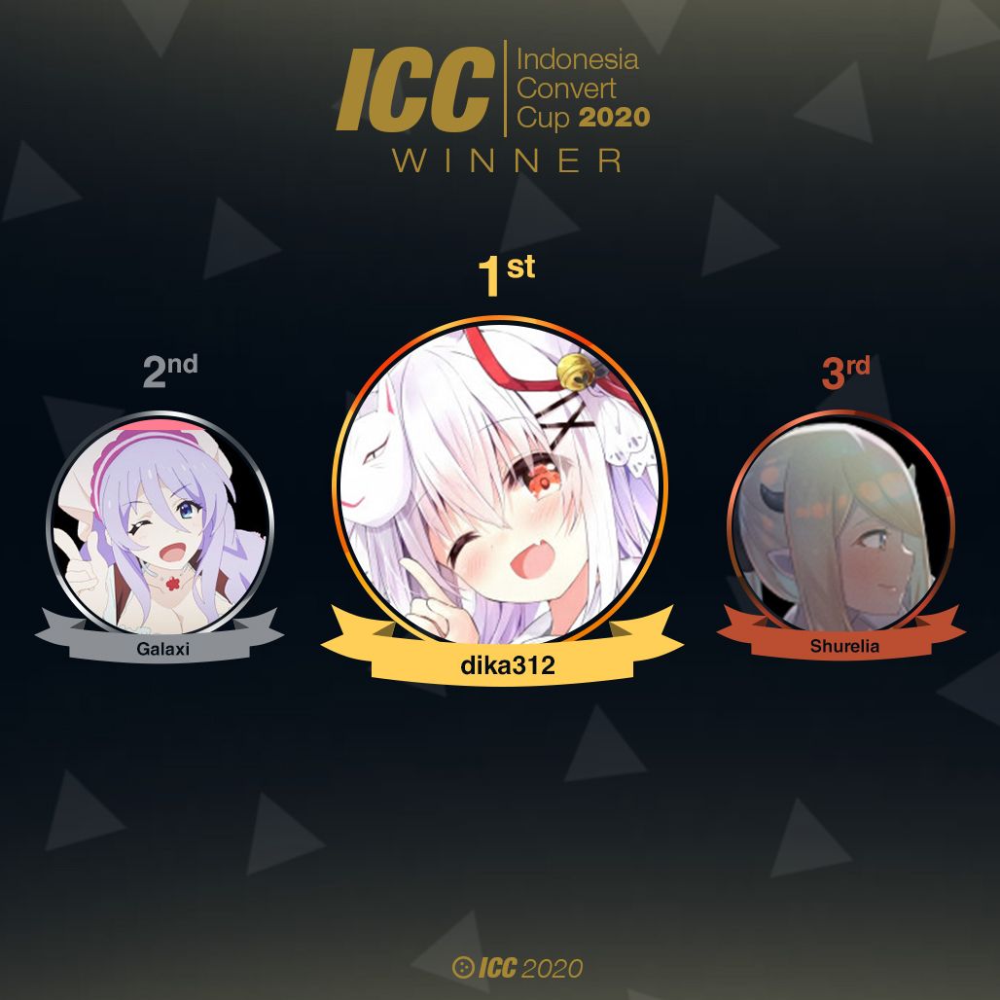

---
tags:
  - ICC2020
  - ICC 2020
---

# Indonesia Convert Cup 2020

The **Indonesia Convert Cup 2020** (***ICC 2020***) was a double-elimination 1v1 osu!catch tournament hosted by ::{ flag=ID }:: [Eum](https://osu.ppy.sh/users/16552751), ::{ flag=ID }:: [Kazuyo](https://osu.ppy.sh/users/5604201), and ::{ flag=ID }:: [Dapuluous](https://osu.ppy.sh/users/8140944) in which all the beatmaps were [converts from the osu! game mode](/wiki/Beatmap/Converts). The tournament was open to all osu!catch players from Indonesia with over 5,000 osu!catch playcount regardless of rank. It was the first instalment of the Indonesia Convert Cup.

## Tournament schedule

| Event | Timestamp |
| --: | :-- |
| Registration phase | 2020-09-13/2020-09-23 |
| Screening phase | 2020-09-24/2020-09-30 |
| Group stage | 2020-10-05/2020-10-11 |
| Round of 16 | 2020-10-12/2020-10-18 |
| Quarterfinals | 2020-10-19/2020-10-25 |
| Semifinals | 2020-10-26/2020-11-01 |
| Finals | 2020-11-02/2020-11-08 |

## Prizes

| Placing | Prizes |
| :-: | :-- |
|  | IDR 1.000.000, ~50% of the raised prize pool, unique profile badge |
|  | IDR 600.000, ~30% of the raised prize pool |
|  | IDR 450.000, ~20% of the raised prize pool |

## Organisation

ICC 2020 was run by various osu! community members predominantly hailing from Indonesia.

| Position | Member(s) |
| :-- | :-- |
| Host | ::{ flag=ID }:: [Eum](https://osu.ppy.sh/users/16552751), ::{ flag=ID }:: [Kazuyo](https://osu.ppy.sh/users/5604201), ::{ flag=ID }:: [Dapuluous](https://osu.ppy.sh/users/8140944) |
| Mappool selector | ::{ flag=ID }:: [Constantine](https://osu.ppy.sh/users/3221898), ::{ flag=ID }:: [Yuri-](https://osu.ppy.sh/users/4983719), ::{ flag=ID }:: [Toka](https://osu.ppy.sh/users/1595221) |
| Streamer | ::{ flag=TW }:: [XzCraftP](https://osu.ppy.sh/users/1593180), ::{ flag=ID }:: [xHirayuki](https://osu.ppy.sh/users/3245206), ::{ flag=ID }:: [Suikami](https://osu.ppy.sh/users/1929336), ::{ flag=ID }:: [Netamaru](https://osu.ppy.sh/users/1830361), ::{ flag=ID }:: [Victim\_Crasher](https://osu.ppy.sh/users/2084869) |
| Commentator | ::{ flag=ID }:: [Eum](https://osu.ppy.sh/users/16552751), ::{ flag=ID }:: [Dapuluous](https://osu.ppy.sh/users/8140944), ::{ flag=ID }:: [Toka](https://osu.ppy.sh/users/1595221), ::{ flag=ID }:: [Victim\_Crasher](https://osu.ppy.sh/users/2084869), ::{ flag=ID }:: [Niva](https://osu.ppy.sh/users/197805), ::{ flag=ID }:: [CamXDanna](https://osu.ppy.sh/users/3243148), ::{ flag=ID }:: [Tix](https://osu.ppy.sh/users/11421465), ::{ flag=ID }:: [Shurelia](https://osu.ppy.sh/users/3807986), ::{ flag=ID }:: [Juragan_Piscok1](https://osu.ppy.sh/users/15507280) |
| Referee | ::{ flag=ID }:: [mina-](https://osu.ppy.sh/users/4670692), ::{ flag=ID }:: [Avoya](https://osu.ppy.sh/users/3136817), ::{ flag=ID }:: [CamXDanna](https://osu.ppy.sh/users/3243148), ::{ flag=ID }:: [Yuina Hotaru](https://osu.ppy.sh/users/1104256),  ::{ flag=ID }:: [- Ruu -](https://osu.ppy.sh/users/3811821), ::{ flag=ID }:: [Intention](https://osu.ppy.sh/users/3416858) |
| Graphic designer | ::{ flag=ID }:: [mina-](https://osu.ppy.sh/users/4670692), ::{ flag=ID }:: [Avoya](https://osu.ppy.sh/users/3136817) |
| Spreadsheet manager | ::{ flag=ID }:: [Eum](https://osu.ppy.sh/users/16552751), ::{ flag=ID }:: [Dapuluous](https://osu.ppy.sh/users/8140944) |
| Wiki editor | ::{ flag=ID }:: [Niva](https://osu.ppy.sh/users/197805) |

## Links

- **[Main spreadsheet](http://docs.google.com/spreadsheets/d/e/2PACX-1vTjldrvfwKxuc3x8QyhVAcccvGm6z2FDR-BZuxyX68GkQkdXoWwkcUlD0gaNA__aKJRlX3WSMfW5Pkj/pubhtml#)**
- [Discussion thread](http://osu.ppy.sh/community/forums/topics/1141903)
- [Discord server](http://discord.gg/7g6TAj2)
- [Livestream](https://www.twitch.tv/osuIndonesia)

## Participants

| Group |  |  |  |  |
| :-: | :-- | :-- | :-- | :-- |
| **A** | ::{ flag=ID }:: [Fyl](https://osu.ppy.sh/users/10069307) | ::{ flag=ID }:: [Shurelia](https://osu.ppy.sh/users/3807986) | ::{ flag=ID }:: [yogafm](https://osu.ppy.sh/users/3247173) | ::{ flag=ID }:: [Rossi](https://osu.ppy.sh/users/5569341) |
| **B** | ::{ flag=ID }:: [Chroneko](https://osu.ppy.sh/users/5472877) | ::{ flag=ID }:: [ilhamuharam](https://osu.ppy.sh/users/7657968) | ::{ flag=ID }:: [-Nana -](https://osu.ppy.sh/users/8738085) | ::{ flag=ID }:: [Suikami](https://osu.ppy.sh/users/1929336) |
| **C** | ::{ flag=ID }:: [dika312](https://osu.ppy.sh/users/741613) | ::{ flag=ID }:: [BitDust](https://osu.ppy.sh/users/9573836) | ::{ flag=ID }:: [Sololiquy](https://osu.ppy.sh/users/4350087) | *N/A* |
| **D** | ::{ flag=ID }:: [Minalinsky-](https://osu.ppy.sh/users/2823883) | ::{ flag=ID }:: [dedotikea](https://osu.ppy.sh/users/8805157) | ::{ flag=ID }:: [Funtastic](https://osu.ppy.sh/users/3555626) | *N/A* |
| **E** | ::{ flag=ID }:: [LeWind](https://osu.ppy.sh/users/9718235) | ::{ flag=ID }:: [Zylin](https://osu.ppy.sh/users/6692990) | ::{ flag=ID }:: [Galaxi](https://osu.ppy.sh/users/2552435) | *N/A* |
| **F** | ::{ flag=ID }:: [Reen](https://osu.ppy.sh/users/3285139) | ::{ flag=ID }:: [Yui\_](https://osu.ppy.sh/users/8264181) | ::{ flag=ID }:: [Riria Rakira](https://osu.ppy.sh/users/6310025) | *N/A* |
| **G** | ::{ flag=ID }:: [Valskiel](https://osu.ppy.sh/users/1254639) | ::{ flag=ID }:: [moncar321](https://osu.ppy.sh/users/1400073) | ::{ flag=ID }:: [Koimeji](https://osu.ppy.sh/users/4137039) | *N/A* |
| **H** | ::{ flag=ID }:: [Intel21](https://osu.ppy.sh/users/1272422) | ::{ flag=ID }:: [MrGulla](https://osu.ppy.sh/users/4540721) | ::{ flag=ID }:: [INFormal](https://osu.ppy.sh/users/6525565) | *N/A* |

## Podium

## Mappools

### Finals

**[Download the mappack here! (188 MB)](https://drive.google.com/file/d/1w426oYWbotWp80oQZriFgPsdUZ-DFwR4/view)**

- NoMod
  1. [Omoi - Snow Drive(01.23) (Kroytz) \[Arigatou\]](https://osu.ppy.sh/beatmapsets/478405#fruits/1083052)
  2. [Toromaru - Enigma (AtHeoN) \[MASTER\]](https://osu.ppy.sh/beatmapsets/527869#fruits/2290441)
  3. [KOAN Sound & Asa - fuego (sakuraburst remix) (Shiirn) \[Dreaming of Embers\]](https://osu.ppy.sh/beatmapsets/611806#fruits/1291369)
  4. [TRUE - Divine Spell (Atalanta) \[Awoke\]](https://osu.ppy.sh/beatmapsets/886712#fruits/1853779)
  5. [DJ Okawari - Flower Dance (Short Ver.) (-Hanayuki-) \[Hus AR9\]](https://osu.ppy.sh/beatmapsets/252981#fruits/674285)
- Hidden
  1. [Jin feat. MARiA from GARNiDELiA - daze (\_kotachi\_) \[Let's "Excitement"\]](https://osu.ppy.sh/beatmapsets/620132#fruits/1307021)
  2. [Memme - Sky of the Ocean (Syph) \[Hikaru's Extra.\]](https://osu.ppy.sh/beatmapsets/668888#fruits/1429744)
  3. [SHK - Imagination (ktgster) \[SHD\]](https://osu.ppy.sh/beatmapsets/1078340#fruits/2256378)
  4. [solfa feat.Shimotsuki Haruka - leap in your mind (Garden) \[Decay\]](https://osu.ppy.sh/beatmapsets/569071#fruits/1206489)
- HardRock
  1. [a\_hisaxChicking - The Navigator's Hope (Rohit6) \[Endurance of the Seafarer\]](https://osu.ppy.sh/beatmapsets/439225#fruits/945304)
  2. [nmk - sola (sjoy) \[Extra\]](https://osu.ppy.sh/beatmapsets/183267#fruits/439135)
  3. [YURRY CANON - Nadeshiko color Heart (kwk) \[Sakase\]](https://osu.ppy.sh/beatmapsets/682996#fruits/1451733)
  4. [Uinyasu, Occhoko Bunny - Tougen Roman (Epsilon Remix) (Sakura Airi) \[Odore\]](https://osu.ppy.sh/beatmapsets/1173379#fruits/2447252)
- DoubleTime
  1. [KOTOKO - Light My Fire (Dada) \[Vintage\]](https://osu.ppy.sh/beatmapsets/935912#fruits/1955207)
  2. [Uehara Rena - Answer (Shad0w1and) \[Shinjitsu\]](https://osu.ppy.sh/beatmapsets/430141#fruits/927939)
  3. [Shikata Akiko - Katayoku no Tori (IceKalt) \[Rio & Ice's Insane\]](https://osu.ppy.sh/beatmapsets/622500#fruits/1361543)
  4. [Yuki Kajiura - Mezame (mercury2004) \[Mai\]](https://osu.ppy.sh/beatmapsets/22659#fruits/78049)
- Tiebreaker
  1. **[Diao ye zong feat. Meramipop - Shinkirou (jonathanlfj) \[Collab Masquerade\]](https://osu.ppy.sh/beatmapsets/628765#fruits/1325510)**

### Semifinals

**[Download the mappack here! (125 MB)](https://drive.google.com/file/d/1wo0pn8_Bmv342QbOjDTopaPOIqxD7VNK/view)**

- NoMod
  1. [Ayumi. - Hanagoyomi (Mimari) \[Spirit.\]](https://osu.ppy.sh/beatmapsets/1155366#fruits/2411125)
  2. [MaxNRG - Hide Away My Heart (Silverboxer) \[Always\]](https://osu.ppy.sh/beatmapsets/904621#fruits/1888178)
  3. [Britney Spears - Toxic (schoolboy) \[In The Zone\]](https://osu.ppy.sh/beatmapsets/1061947#fruits/2223745)
  4. [Rolling Contact - Technical Master (Naidaaka) \[owo\]](https://osu.ppy.sh/beatmapsets/630818#fruits/1331610)
  5. [reworu - Gigantic O.T.N (murasaki_sk) \[AR9\]](https://osu.ppy.sh/beatmapsets/80906#fruits/230398)
- Hidden
  1. [Getty vs. DJ DiA - Grayed Out -Antifront- (Arbane) \[Xtra\]](https://osu.ppy.sh/beatmapsets/598182#fruits/1264457)
  2. [Hello, Happy World! - Goka! Gokai!? Phantom Thief! (Atalanta) \[Aqua's Another\]](https://osu.ppy.sh/beatmapsets/708445#fruits/1643246)
  3. [x0o0x\_ - Big Brother (Luscent) \[Thoughtcrime\]](https://osu.ppy.sh/beatmapsets/1120687#fruits/2341682)
  4. [ShinRa-Bansho - Marisa wa Taihen na Mono o Nusunde Ikimashita ShinRa-Bansho Ver (Len) \[Classic Extra\]](https://osu.ppy.sh/beatmapsets/1024028#fruits/2142037)
- HardRock
  1. [Nanamori-chu \* Goraku-bu - Happy Time wa Owaranai (Hivie) \[Neiro's Another\]](https://osu.ppy.sh/beatmapsets/1043808#fruits/2220124)
  2. [Kuroneko Dungeon - Ryuu to Shoujo to Decoherence (kiddly) \[Mythic\]](https://osu.ppy.sh/beatmapsets/84777#fruits/601731)
  3. [Susumu Hirasawa - The Girl in Byakkoya (Pata-Mon) \[Paprika\]](https://osu.ppy.sh/beatmapsets/770240#osu/1619425)
  4. [Ice vs. Morimori Atsushi - RE:UNION -Duo Blade Against- (Realazy) \[Alliance\]](https://osu.ppy.sh/beatmapsets/848977#fruits/1775315)
- DoubleTime
  1. [Sakaue Nachi - Crazy Hot (Mythol) \[Lunatic\]](https://osu.ppy.sh/beatmapsets/54289#fruits/173567)
  2. [Shikata Akiko - Akatsuki (Linada) \[Expert\]](https://osu.ppy.sh/beatmapsets/861819#fruits/1802834)
  3. [KOTOKO - jihad (Mariko Sakuragi) \[Insane+\]](https://osu.ppy.sh/beatmapsets/1135541#fruits/2371574)
  4. [Vira (CV: Imai Asami) - Another Sky (Meg) \[Devotes myself for you\]](https://osu.ppy.sh/beatmapsets/898041#fruits/1876081)
- Tiebreaker
  1. **[Yousei Teikoku - Kokou no Sousei (Kalibe) \[Despair\]](https://osu.ppy.sh/beatmapsets/744554#fruits/1569836)**

### Quarterfinals

**[Download the mappack here! (136 MB)](https://drive.google.com/file/d/1Aj6QhmqhMUgBcrOcM90fztnf9BAibgVw/view)**

- NoMod
  1. [CELLON. - Labyrinth of Darkness (Mir) \[Expert\]](https://osu.ppy.sh/beatmapsets/778383#fruits/1634887)
  2. [Mastermind(xi+nora2r) - Dreadnought (Cherry Blossom) \[Final Destination\]](https://osu.ppy.sh/beatmapsets/361306#fruits/793845)
  3. [CloZee - Koto (galvenize) \[Extra\]](https://osu.ppy.sh/beatmapsets/517055#fruits/1098833)
  4. [MISATO - Necro Fantasia (WORSTPOLACKEU) \[Sakura no Yume\]](https://osu.ppy.sh/beatmapsets/626406#fruits/1320292)
- Hidden
  1. [Yousei Teikoku - Shinteki Souzou (-Keitaro) \[AncuL's Extra\]](https://osu.ppy.sh/beatmapsets/985170#fruits/2068168)
  2. [MAMI - Kaze no Uta (Garden) \[Extra\]](https://osu.ppy.sh/beatmapsets/624037#fruits/1315307)
  3. [That Poppy - Altar (-NeBu-) \[Apollo's Old-Style Getaway Car\]](https://osu.ppy.sh/beatmapsets/685822#fruits/2200803)
- HardRock
  1. [onoken - Amnolys (DreaM117er) \[Skystar x Crystal's Twin Star Extra\]](https://osu.ppy.sh/beatmapsets/1069791#fruits/2277760)
  2. [ginkiha - EOS (11t) \[Another\]](https://osu.ppy.sh/beatmapsets/125079#fruits/318562)
  3. [Leftymonster - START (HanzeR) \[Finish\]](https://osu.ppy.sh/beatmapsets/70102#osu/201700)
- DoubleTime
  1. [fripSide - black bullet (Cyndere) \[insane: initiator\]](https://osu.ppy.sh/beatmapsets/905839#fruits/1894827)
  2. [KOTOKO - Wing my Way (CXu) \[Endless Sky\]](https://osu.ppy.sh/beatmapsets/850548#fruits/1778268)
  3. [monet - Kagami no Sekai ni wa Watashi shika Inai -another version- (Mirash) \[PandaHero's Insane\]](https://osu.ppy.sh/beatmapsets/685725#fruits/1469159)
- Tiebreaker
  1. **[USAO - Showdown (Hikaru Rose) \[Crisis\]](https://osu.ppy.sh/beatmapsets/446658#fruits/959194)**

### Round of 16

**[Download the mappack here! (161 MB)](https://drive.google.com/file/d/1jrKZkbuDOEAkgkAZ8NpGCYRV3psqlb-W/view)**

- NoMod
  1. [Pendulum - Witchcraft (Zarerion) \[Jenny\]](https://osu.ppy.sh/beatmapsets/55982#fruits/169993)
  2. [Magnetude - Signals (Firebool) \[adioni's 100 MHz\]](https://osu.ppy.sh/beatmapsets/850972#fruits/1834172)
  3. [Little Big - UNO (Gero) \[UNO, DOS, DOS, CUATRO\]](https://osu.ppy.sh/beatmapsets/1128448#fruits/2357612)
  4. [Poppin'Party - Time Lapse (browiec) \[Time Lapse\]](https://osu.ppy.sh/beatmapsets/1018483#fruits/2131344)
- Hidden
  1. [Sayaki Sasaka - Sakura, Reincarnation (Flower) \[Extra\]](https://osu.ppy.sh/beatmapsets/884081#fruits/1863992)
  2. [Major Lazer - Lean On (feat. MO \& DJ Snake) (Beige) \[Expert\]](https://osu.ppy.sh/beatmapsets/487544#fruits/1067625)
  3. [Kawada Mami - JOINT (Mariko Sakuragi) \[Extra\]](https://osu.ppy.sh/beatmapsets/1051651#fruits/2197734)
- HardRock
  1. [Daisy x Daisy - Aoi Tsuki (Asuka\_-) \[Insane\]](https://osu.ppy.sh/beatmapsets/968777#fruits/2027056)
  2. [Eguchi Takahiro - silver temple (LKs) \[Insane\]](https://osu.ppy.sh/beatmapsets/59345#fruits/177916)
  3. [KOTOKO - Agony (SOGASOGAMO) \[Miko\]](https://osu.ppy.sh/beatmapsets/13510#fruits/49952)
- DoubleTime
  1. [Rita - Alea jacta est! (DELiS) \[Insane\]](https://osu.ppy.sh/beatmapsets/112150#fruits/291402)
  2. [Feryquitous feat. Aitsuki Nakuru - Ether (Acyl) \[\_todestrieb's Light Insane\]](https://osu.ppy.sh/beatmapsets/902425#fruits/1947616)
  3. [Marika - quantum jump (Shurelia) \[Insane\]](https://osu.ppy.sh/beatmapsets/183467#fruits/1618565)
- Tiebreaker
  1. **[Nhato - Delay Order (Shizuku-) \[Time Manipulation\]](https://osu.ppy.sh/beatmapsets/580214#fruits/1228509)**

### Group stage

**[Download the mappack here! (117 MB)](https://drive.google.com/file/d/1E8h7BBl3Bz-woN4Bw4rjUomWapceTeWU/view)**

- NoMod
  1. [Ichinose Shiki (CV: Aihara Kotomi) - Himitsu no Toilette (domSaur) \[MASTER+\]](https://osu.ppy.sh/beatmapsets/734093#fruits/1549043)
  2. [void - Sun Goes Down (BMS edit) (Frey) \[Insane\]](https://osu.ppy.sh/beatmapsets/382413#fruits/836269)
  3. [HyuN - Infinity Heaven (Niva) \[Ad Infinitum\]](https://osu.ppy.sh/beatmapsets/891345#fruits/1863246)
  4. [Yellow Zebra - Koi no Flame (m3gb3g) \[Lunatic\]](https://osu.ppy.sh/beatmapsets/908831#fruits/2205008)
- Hidden
  1. [Dio ft. Sef - Tijdmachine (GladiOol) \[Lesjuh! '11\]](https://osu.ppy.sh/beatmapsets/6997#fruits/129875)
  2. [Rise Against - State of the Union (pishifat) \[Milan-'s Baby Insane\]](https://osu.ppy.sh/beatmapsets/387185#fruits/849438)
  3. [An - Xhroria (Cherry Blossom) \[Another\]](https://osu.ppy.sh/beatmapsets/82258#fruits/227772)
- HardRock
  1. [yuzen - Ouka Ryouran (tsuka) \[Another\]](https://osu.ppy.sh/beatmapsets/37647#fruits/133383)
  2. [Rita - Aka no Sora (NatsumeRin) \[Rin\]](https://osu.ppy.sh/beatmapsets/17746#fruits/63188)
  3. [KOTOKO - Shichiten Hakki, Shijou Shugi! (kiddly) \[Challenging\]](https://osu.ppy.sh/beatmapsets/13042#fruits/48498)
- DoubleTime
  1. [Ray - lull \~Soshite Bokura wa\~ (Delis) \[Insane\]](https://osu.ppy.sh/beatmapsets/172450#fruits/438061)
  2. [07th Expansion - the executioner (Natteke) \[Hard\]](https://osu.ppy.sh/beatmapsets/27146#fruits/91198)
  3. [yuikonnu - Shinkai Shoujo (Kibbleru) \[Insane\]](https://osu.ppy.sh/beatmapsets/165752#fruits/403180)
- Tiebreaker
  1. **[HIELO - La Posesion Du Mimi - ILLUMINATEK Rmx - HIELO Refuck! (Euny) \[Natsu's Insane\]](https://osu.ppy.sh/beatmapsets/358353#fruits/806625)**

## Match results

### Finals

Friday, 6 November 2020:

| Bracket | Player 1 |  |  | Player 2 | Match link |
| :-: | --: | :-: | :-: | :-- | :-- |
| Upper | [Shurelia](https://osu.ppy.sh/users/3807986) ::{ flag=ID }:: | 4 | **7** | ::{ flag=ID }:: **[Galaxi](https://osu.ppy.sh/users/2552435)** | [#1](https://osu.ppy.sh/community/matches/69381788) |

Saturday, 7 November 2020:

| Bracket | Player 1 |  |  | Player 2 | Match link |
| :-: | --: | :-: | :-: | :-- | :-- |
| Lower | [Shurelia](https://osu.ppy.sh/users/3807986) ::{ flag=ID }:: | 0 | **7** | ::{ flag=ID }:: **[dika312](https://osu.ppy.sh/users/741613)** | [#1](https://osu.ppy.sh/community/matches/69445742) |

Sunday, 8 November 2020 (Grand Finals):

| Bracket | Player 1 |  |  | Player 2 | Match link |
| :-: | --: | :-: | :-: | :-- | :-- |
| Grand Finals | [Galaxi](https://osu.ppy.sh/users/2552435) ::{ flag=ID }:: | 3 | **7** | ::{ flag=ID }:: **[dika312](https://osu.ppy.sh/users/741613)** | [#1](https://osu.ppy.sh/community/matches/69502037) |
| Grand Finals (Bracket Reset) | **[dika312](https://osu.ppy.sh/users/741613)** ::{ flag=ID }:: | **7** | 3 | ::{ flag=ID }:: [Galaxi](https://osu.ppy.sh/users/2552435) | [#1](https://osu.ppy.sh/community/matches/69505076) |

### Semifinals

Friday, 30 October 2020:

| Bracket | Player 1 |  |  | Player 2 | Match link |
| :-: | --: | :-: | :-: | :-- | :-- |
| Upper | **[Galaxi](https://osu.ppy.sh/users/2552435)** ::{ flag=ID }:: | **6** | 4 | ::{ flag=ID }:: [Funtastic](https://osu.ppy.sh/users/3555626) | [#1](https://osu.ppy.sh/community/matches/69022506) |
| Upper | **[Shurelia](https://osu.ppy.sh/users/3807986)** ::{ flag=ID }:: | **6** | 1 | ::{ flag=ID }:: [Valskiel](https://osu.ppy.sh/users/1254639) | [#1](https://osu.ppy.sh/community/matches/69026276) |

Saturday, 1 November 2020:

| Bracket | Player 1 |  |  | Player 2 | Match link |
| :-: | --: | :-: | :-: | :-- | :-- |
| Lower | **[Funtastic](https://osu.ppy.sh/users/3555626)** ::{ flag=ID }:: | **6** | 4 | ::{ flag=ID }:: [LeWind](https://osu.ppy.sh/users/9718235) | [#1](https://osu.ppy.sh/community/matches/69080526) |
| Lower | [Valskiel](https://osu.ppy.sh/users/1254639) ::{ flag=ID }:: | 0 | **6** | ::{ flag=ID }:: **[dika312](https://osu.ppy.sh/users/741613)** | *win by default* |

Sunday, 2 November 2020:

| Bracket | Player 1 |  |  | Player 2 | Match link |
| :-: | --: | :-: | :-: | :-- | :-- |
| Lower | [Funtastic](https://osu.ppy.sh/users/3555626) ::{ flag=ID }:: | 0 | **6** | ::{ flag=ID }:: **[dika312](https://osu.ppy.sh/users/741613)** | [#1](https://osu.ppy.sh/community/matches/69130378) |

### Quarterfinals

Friday, 23 October 2020:

| Bracket | Player 1 |  |  | Player 2 | Match link |
| :-: | --: | :-: | :-: | :-- | :-- |
| Upper | **[Galaxi](https://osu.ppy.sh/users/2552435)** ::{ flag=ID }:: | **5** | 0 | ::{ flag=ID }:: [Suikami](https://osu.ppy.sh/users/1929336) | [#1](https://osu.ppy.sh/community/matches/68673897) |
| Upper | **[Shurelia](https://osu.ppy.sh/users/3807986)** ::{ flag=ID }:: | **5** | 2 | ::{ flag=ID }:: [Intel21](https://osu.ppy.sh/users/1272422) | [#1](https://osu.ppy.sh/community/matches/68675865) |
| Upper | **[Valskiel](https://osu.ppy.sh/users/1254639)** ::{ flag=ID }:: | **5** | 0 | ::{ flag=ID }:: [Riria Rakira](https://osu.ppy.sh/users/6310025) | *win by default* |
| Upper | [dika312](https://osu.ppy.sh/users/2823883) ::{ flag=ID }:: | 0 | **5** | ::{ flag=ID }:: **[Funtastic](https://osu.ppy.sh/users/3555626)** | *win by default* |

Saturday, 24 October 2020:

| Bracket | Player 1 |  |  | Player 2 | Match link |
| :-: | --: | :-: | :-: | :-- | :-- |
| Lower | **[dika312](https://osu.ppy.sh/users/2823883)** ::{ flag=ID }:: | **5** | 0 | ::{ flag=ID }:: [Koimeji](https://osu.ppy.sh/users/4137039) | [#1](https://osu.ppy.sh/community/matches/68724162) |
| Lower | [Suikami](https://osu.ppy.sh/users/1929336) ::{ flag=ID }:: | 4 | **5** | ::{ flag=ID }:: **[yogafm](https://osu.ppy.sh/users/3247173)** | [#1](https://osu.ppy.sh/community/matches/68726334) |
| Lower | [Riria Rakira](https://osu.ppy.sh/users/6310025) ::{ flag=ID }:: | 0 | **5** | ::{ flag=ID }:: **[LeWind](https://osu.ppy.sh/users/9718235)** | [#1](https://osu.ppy.sh/community/matches/68728650) |
| Lower | **[Intel21](https://osu.ppy.sh/users/1272422)** ::{ flag=ID }:: | **5** | 4 | ::{ flag=ID }:: [Chroneko](https://osu.ppy.sh/users/5472877) | [#1](https://osu.ppy.sh/community/matches/68731357) |

Sunday, 25 October 2020:

| Bracket | Player 1 |  |  | Player 2 | Match link |
| :-: | --: | :-: | :-: | :-- | :-- |
| Lower | **[dika312](https://osu.ppy.sh/users/2823883)** ::{ flag=ID }:: | **5** | 0 | ::{ flag=ID }:: [yogafm](https://osu.ppy.sh/users/3247173) | [#1](https://osu.ppy.sh/community/matches/68778988) |
| Lower | **[LeWind](https://osu.ppy.sh/users/9718235)** ::{ flag=ID }:: | **5** | 0 | ::{ flag=ID }:: [Intel21](https://osu.ppy.sh/users/1272422) | [#1](https://osu.ppy.sh/community/matches/68780712) |

### Round of 16

Friday, 16 October 2020:

| Bracket | Player 1 |  |  | Player 2 | Match link |
| :-: | --: | :-: | :-: | :-- | :-- |
| Upper | **[Intel21](https://osu.ppy.sh/users/1272422)** ::{ flag=ID }:: | **4** | 0 | ::{ flag=ID }:: [Koimeji](https://osu.ppy.sh/users/4137039) | [#1](https://osu.ppy.sh/community/matches/68343246) |
| Upper | [yogafm](https://osu.ppy.sh/users/3247173) ::{ flag=ID }:: | 0 | **4** | ::{ flag=ID }:: **[Valskiel](https://osu.ppy.sh/users/1254639)** | [#1](https://osu.ppy.sh/community/matches/68345426) |
| Upper | **[Galaxi](https://osu.ppy.sh/users/2552435)** ::{ flag=ID }:: | **4** | 1 | ::{ flag=ID }:: [LeWind](https://osu.ppy.sh/users/9718235) | [#1](https://osu.ppy.sh/community/matches/68345704) |
| Upper | [Minalinsky-](https://osu.ppy.sh/users/2823883) ::{ flag=ID }:: | 0 | **4** | ::{ flag=ID }:: **[Shurelia](https://osu.ppy.sh/users/3807986)** | [#1](https://osu.ppy.sh/community/matches/68348324) |

Saturday, 17 October 2020:

| Bracket | Player 1 |  |  | Player 2 | Match link |
| :-: | --: | :-: | :-: | :-- | :-- |
| Upper | [BitDust](https://osu.ppy.sh/users/9573836) ::{ flag=ID }:: | 3 | **4** | ::{ flag=ID }:: **[Suikami](https://osu.ppy.sh/users/1929336)** | [#1](https://osu.ppy.sh/community/matches/68395720) |
| Upper | **[dika312](https://osu.ppy.sh/users/741613)** ::{ flag=ID }:: | **4** | 1 | ::{ flag=ID }:: [Chroneko](https://osu.ppy.sh/users/5472877) | [#1](https://osu.ppy.sh/community/matches/68397642) |
| Upper | **[Funtastic](https://osu.ppy.sh/users/3555626)** ::{ flag=ID }:: | **4** | 0 | ::{ flag=ID }:: [INFormal](https://osu.ppy.sh/users/6525565) | [#1](https://osu.ppy.sh/community/matches/68399499) |
| Upper | **[Riria Rakira](https://osu.ppy.sh/users/6310025)** ::{ flag=ID }:: | **4** | 0 | ::{ flag=ID }:: [Reen](https://osu.ppy.sh/users/3285139) | [#1](https://osu.ppy.sh/community/matches/68390045) |

Sunday, 18 October 2020:

| Bracket | Player 1 |  |  | Player 2 | Match link |
| :-: | --: | :-: | :-: | :-- | :-- |
| Lower | **[yogafm](https://osu.ppy.sh/users/3247173)** ::{ flag=ID }:: | **4** | 0 | ::{ flag=ID }:: [Reen](https://osu.ppy.sh/users/3285139) | [#1](https://osu.ppy.sh/community/matches/68440371) |
| Lower | **[LeWind](https://osu.ppy.sh/users/9718235)** ::{ flag=ID }:: | **4** | 0 | ::{ flag=ID }:: [BitDust](https://osu.ppy.sh/users/9573836) | [#1](https://osu.ppy.sh/community/matches/68443374) |
| Lower | **[Chroneko](https://osu.ppy.sh/users/5472877)** ::{ flag=ID }:: | **4** | 0 | ::{ flag=ID }:: [INFormal](https://osu.ppy.sh/users/6525565) | [#1](https://osu.ppy.sh/community/matches/68445354) |
| Lower | **[Koimeji](https://osu.ppy.sh/users/4137039)** ::{ flag=ID }:: | **4** | 0 | ::{ flag=ID }:: [Minalinsky-](https://osu.ppy.sh/users/2823883) | *win by default* |

### Group stage

Friday, 9 October 2020:

| Group | Player 1 | Player 2 | Player 3 | Player 4 | Match link |
| :-: | :-: | :-: | :-: | :-: | :-- |
| **A** | ::{ flag=ID }:: **[Shurelia](https://osu.ppy.sh/users/3807986) (12 pts)** | ::{ flag=ID }:: **[yogafm](https://osu.ppy.sh/users/3247173) (4 pts)** | ::{ flag=ID }:: [Fyl](https://osu.ppy.sh/users/10069307) (3 pts) | ::{ flag=ID }:: [Rossi](https://osu.ppy.sh/users/5569341) (0 pts) | [#1](https://osu.ppy.sh/community/matches/68039823) |
| **B** | ::{ flag=ID }:: [ilhamuharam](https://osu.ppy.sh/users/7657968) (8 pts) | ::{ flag=ID }:: [-Nana -](https://osu.ppy.sh/users/8738085) (0 pts) | ::{ flag=ID }:: **[Chroneko](https://osu.ppy.sh/users/5472877) (15 pts)** | ::{ flag=ID }:: **[Suikami](https://osu.ppy.sh/users/1929336) (9 pts)** | [#1](https://osu.ppy.sh/community/matches/68042564) |
| **E** | ::{ flag=ID }:: **[LeWind](https://osu.ppy.sh/users/9718235) (8 pts)** | ::{ flag=ID }:: [Zylin](https://osu.ppy.sh/users/6692990) (0 pts) | ::{ flag=ID }:: **[Galaxi](https://osu.ppy.sh/users/2552435) (8 pts)** | *N/A* | [#1](https://osu.ppy.sh/community/matches/68043608) |

Saturday, 10 October 2020:

| Group | Player 1 | Player 2 | Player 3 | Player 4 | Match link |
| :-: | :-: | :-: | :-: | :-: | :-- |
| **C** | ::{ flag=ID }:: **[dika312](https://osu.ppy.sh/users/741613) (8 pts)** | ::{ flag=ID }:: **[BitDust](https://osu.ppy.sh/users/9573836) (5 pts)** | ::{ flag=ID }:: [Sololiquy](https://osu.ppy.sh/users/4350087) (3 pts) | *N/A* | [#1](https://osu.ppy.sh/community/matches/68088933) |
| **D** | ::{ flag=ID }:: **[Minalinsky-](https://osu.ppy.sh/users/2823883) (6 pts)** | ::{ flag=ID }:: [dedotikea](https://osu.ppy.sh/users/8805157) (2 pts) | ::{ flag=ID }:: **[Funtastic](https://osu.ppy.sh/users/3555626) (8 pts)** | *N/A* | [#1](https://osu.ppy.sh/community/matches/68090808) |

Sunday, 11 August 2020:

| Group |  |  |  |  | Match link |
| :-: | :-: | :-: | :-: | :-: | :-- |
| **F** | ::{ flag=ID }:: **[Reen](https://osu.ppy.sh/users/3285139) (5 pts)** | ::{ flag=ID }:: [Yui\_](https://osu.ppy.sh/users/8264181) (4 pts) | ::{ flag=ID }:: **[Riria Rakira](https://osu.ppy.sh/users/6310025) (8 pts)** | *N/A* | [#1](https://osu.ppy.sh/community/matches/64886373) |
| **G** | ::{ flag=ID }:: **[Valskiel](https://osu.ppy.sh/users/1254639) (8 pts)** | ::{ flag=ID }:: [moncar321](https://osu.ppy.sh/users/1400073) (0 pts) | ::{ flag=ID }:: **[Koimeji](https://osu.ppy.sh/users/4137039) (8 pts)** | *N/A* | [#1](https://osu.ppy.sh/community/matches/68138601) |
| **H** | ::{ flag=ID }:: **[Intel21](https://osu.ppy.sh/users/1272422) (8 pts)** | ::{ flag=ID }:: [MrGulla](https://osu.ppy.sh/users/4540721) (2 pts) | ::{ flag=ID }:: **[INFormal](https://osu.ppy.sh/users/6525565) (6 pts)** | *N/A* | [#1](https://osu.ppy.sh/community/matches/68140401) |

## Ruleset

### General rules

1. Map scoring is based on **Score V2.**
2. The mapsets for each round will be announced by the Tournament Management in advance before the actual matches take place.
3. Match schedules will be predetermined by the Tournament Management. Had there been any player(s) who were unable to attend the current schedule for any reason, affected player(s) may apply and settle for a reschedule at the #reschedule channel in the tournament's Discord server.
4. A referee will create a multiplayer room 10 minutes in advance and will start to send out invites.
5. If a player does not show up within **10 minutes** of the start time, their opponent wins by default.
6. If no staff or referee is available, the match will be postponed.
7. If a player disconnects, it will be treated as if they failed the map.
   - Disconnects that occur within a few seconds after map is started by the referee can be rematched.
8. If a player disconnects between the beatmaps, the match can be delayed up to 15 minutes max.
   - In case the disconnected player failed to report back or to be replaced with another player after the maximum allowance of 15 minutes has passed, the opposing player may be declared to be winning the match by default.
9. Lag is not a valid reason to nullify a map.
10. If there are any problems during the match occurence, the Tournament Management will make a decision based on referee's report.
11. It is expected to be polite and respectful to each other. Penalties will be given if participants violate.
    - If there are participant(s) who are engaging in an offensive provocation towards other participant(s), the participant(s) who are deemed responsible for the provocation  will be reported to the Tournament Management and may be considered to be blacklisted in the future instalment(s) of ICC.
    - Usage of any illegal programs will be reported to the osu!staff and will be blacklisted in the next instalment(s) of ICC.
    - If there is anyone other than the said participant who is trying to play as a participant, both the participant and the helper will be blacklisted in the next instalment(s) of ICC.

### Tournament registration

1. All interested participants are required to register into the tournament individually.
   - In order to be eligible to play in the tournament, a participant must have the Indonesian flag displayed on their profile and at least 5000 playcounts under their profile.
2. To ensure valid and serious registrations, every registered participant will be checked by the Tournament Management and screened by osu!'s Tournament Staff.
3. The list of participants who have passed the screening and are able to compete in the tournament will be published after the Registration Phase has ended.
4. The Tournament Management will only account for a maximum of 32 participants to take part in the tournament.
   - In the case where the number of concerned registrants exceeds 32, the Tournament Management will only enlist 32 registrants with the highest osu!catch pp under their account to participate as players in the tournament.
5. Referees and map selectors may not participate as players in this tournament.

### Group stage rules

1. In the Group Stage, all participants will be divided into 8 different groups.
2. All participants in each group will compete against each other in a single multiplayer lobby using the Battle Royale system. In this system, all participants will each in turn pick out maps from the mappool to be played with the following turnouts after each map:
   - **+2 points** (1st place) / **+1 point** (2nd place) / **+1 point** (3rd place) / **0 points** (4th place) in groups with 4 players.
   - **+1 point** (1st place) / **+1 point** (2nd place) / **0 points** (3rd place) in groups with 3 players.
3. There will be a total of 8 maps to be played in each group stage match, with each player picking out two maps from the pool.
   - In groups with 3 players, the final two maps will be picked by the player with the highest `!roll` score and the player with the second highest `!roll` score respectively.
4. Participants are **not allowed** to ban maps in the Group Stage.
5. There is no Lower Bracket in the Group Stage.
6. Rankings of each group are determined by sorting the results of each individual player's performance in the following priority:
   - Most points obtained.
   - Winner of the Tiebreaker.
   - Player(s) who Win By Default.
   - Whether there are player(s) who got disqualified during the match.
7. Two players who placed on top of their respective groups' rankings based on the criteria listed above will advance to the knock-out stage.

### Knockout stage rules

1. The 16 players who managed to get through from the Group Stage will be matched to each other based on a randomized result.
2. Players will compete against each other using the Double Elimination system.
3. The Double Elimination System works as following:
   - Players who lose in the Upper Bracket can still play again on the Lower Bracket.
   - Players who lose in the Lower Bracket will be eliminated from the tournament.
   - In the Grand Finals, the winner of the the Upper Bracket only needs to win a single match against their opponent in order to claim the championship title. The winner of the Lower Bracket, however, needs to win two matches and enforce a Bracket Reset against their opponent in order to claim the championship title.
4. Players who can compete in the next round are determined by:
   - In the Round of 16, each player needs to win 4 points in order to win a match. (Best-of-7)
   - In the Quarterfinals, each player needs to win 5 points in order to win a match. (Best-of-9)
   - In the Semifinals, each player needs to win 6 points in order to win a match. (Best-of-11)
   - In the Finals and the Grand Finals, each player needs to win 7 points in order to win the match. (Best-of-13)
   - Player(s) who Win By Default.
   - Whether there are player(s) who got disqualified during the match.

### Match regulations

1. Each player must use the `!roll` command once in `#multiplayer` in order to determine the banning and picking order.
   - The winner of the `!roll` gets to decide which player gets to pick and ban first.
   - This rule does not apply in the Group Stage lobbies.
2. Each player has to ban **one beatmap** (in the Round of 16 and the Quarterfinals) or **two maps** (in the Semifinals, Finals, and the Grand Finals) from the mappool. These beatmaps are not allowed to be picked by any player during the entire match.
   - This rule does not apply in the Group Stage lobbies.
3. Each player is free to select one warm-up beatmap. Using beatmaps with questionable content is prohibited.
   - Warm-ups do not apply in the Group Stage lobbies.
4. The results of each match and any other relevant information regarding the match will be posted on the Discord server after the match has concluded by the responsible referees.
