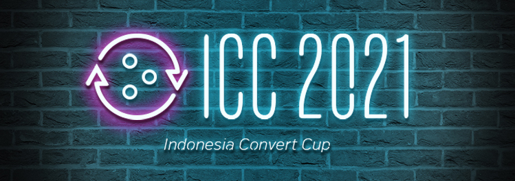
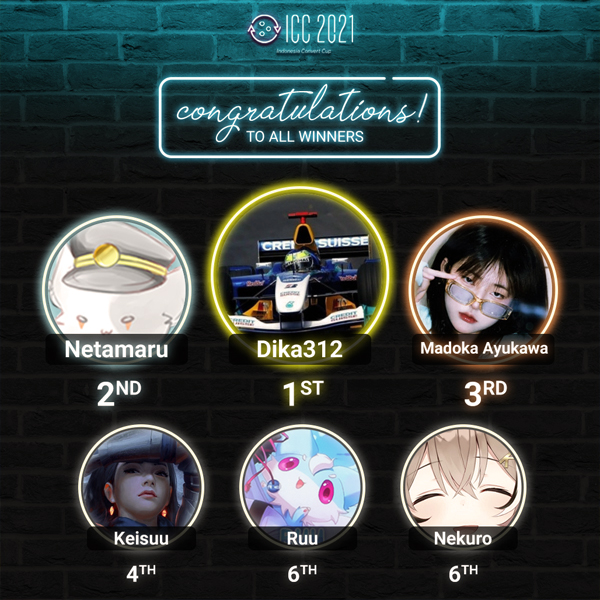

---
tags:
  - ICC 2021
  - ICC2
---

# Indonesia Convert Cup 2021

The **Indonesia Convert Cup 2021** (***ICC 2021***) was a double-elimination 1v1 osu!catch tournament hosted by ::{ flag=ID }:: [Chroneko](https://osu.ppy.sh/users/5472877) and ::{ flag=ID }:: [Urabe Mikoto](https://osu.ppy.sh/users/1272422) in which all the beatmaps were [converts from the osu! game mode](/wiki/Beatmap/Converts). The tournament was open to all players from Indonesia with a playcount of 3,000 or above in osu!catch regardless of rank. It was the second iteration of the Indonesia Convert Cup.

## Tournament schedule

| Event | Timestamp |
| --: | :-- |
| Registration phase | 2021-08-16/2021-08-23 |
| Screening phase | 2021-08-24/2021-09-05 |
| Group stage | 2021-09-06/2021-09-12 |
| Round of 16 | 2021-09-13/2021-09-19 |
| Quarterfinals | 2021-09-20/2021-09-26 |
| Semifinals | 2021-09-27/2021-10-03 |
| Finals | 2021-10-04/2021-10-11 |

## Prizes

| Placing | Prizes |
| :-: | :-- |
|  | 50% of the raised prize pool, unique profile badge |
|  | 30% of the raised prize pool |
|  | 20% of the raised prize pool |

## Organisation

ICC 2021 was run by various osu! community members predominantly hailing from Indonesia.

| Position | Member(s) |
| :-- | :-- |
| Host | ::{ flag=ID }:: [Chroneko](https://osu.ppy.sh/users/5472877), ::{ flag=ID }:: [Urabe Mikoto](https://osu.ppy.sh/users/1272422) |
| Co-host | ::{ flag=ID }:: [Kazuyo](https://osu.ppy.sh/users/5604201), ::{ flag=ID }:: [Eum](https://osu.ppy.sh/users/16552751) |
| Mappool selector | ::{ flag=ID }:: [Chroneko](https://osu.ppy.sh/users/5472877), ::{ flag=ID }:: [Urabe Mikoto](https://osu.ppy.sh/users/1272422), ::{ flag=ID }:: [Constantine](https://osu.ppy.sh/users/3221898), ::{ flag=ID }:: [Shurelia](https://osu.ppy.sh/users/3807986) |
| Streamer | ::{ flag=ID }:: [Netamaru](https://osu.ppy.sh/users/1830361), ::{ flag=ID }:: [Victim\_Crasher](https://osu.ppy.sh/users/2084869), ::{ flag=TW }:: [XzCraftP](https://osu.ppy.sh/users/1593180) |
| Commentator | ::{ flag=ID }:: [Chroneko](https://osu.ppy.sh/users/5472877), ::{ flag=ID }:: [Urabe Mikoto](https://osu.ppy.sh/users/1272422), ::{ flag=ID }:: [Eum](https://osu.ppy.sh/users/16552751), ::{ flag=ID }:: [Constantine](https://osu.ppy.sh/users/3221898), ::{ flag=ID }:: [Shurelia](https://osu.ppy.sh/users/3807986), ::{ flag=ID }:: [Victim\_Crasher](https://osu.ppy.sh/users/2084869), ::{ flag=ID }:: [Niva](https://osu.ppy.sh/users/197805), ::{ flag=ID }:: [-Hex-](https://osu.ppy.sh/users/8630988), ::{ flag=ID }:: [Dapuluous](https://osu.ppy.sh/users/8140944), ::{ flag=ID }:: [Neptunia-chan](https://osu.ppy.sh/users/11608122), ::{ flag=ID }:: [CamXDanna](https://osu.ppy.sh/users/3243148) |
| Referee | ::{ flag=ID }:: [Chroneko](https://osu.ppy.sh/users/5472877), ::{ flag=ID }:: [-Hex-](https://osu.ppy.sh/users/8630988), ::{ flag=ID }:: [Dapuluous](https://osu.ppy.sh/users/8140944), ::{ flag=ID }:: [Koimeji](https://osu.ppy.sh/users/4137039), ::{ flag=TH }:: [Azuria](https://osu.ppy.sh/users/16102533) |
| Graphic designer | ::{ flag=ID }:: [Avoya](https://osu.ppy.sh/users/3136817) |
| Wiki editor | ::{ flag=ID }:: [Niva](https://osu.ppy.sh/users/197805) |

## Links

- **[Main spreadsheet](https://docs.google.com/spreadsheets/d/e/2PACX-1vSQgtDnGz_FA1vq4BaLElDgZUyw7fF2sZMsRBF8T9ke_Xg_v_AvqCUf46P6iSW8YvJIXvGYHC3FtCUC/pubhtml#)**
- [Discussion thread](https://osu.ppy.sh/community/forums/topics/1390980)
- [Discord server](https://discord.gg/7g6TAj2)
- [Challonge brackets](https://challonge.com/ICC_2021)
- [Livestream channel](https://www.twitch.tv/osuIndonesia/)

## Participants

Listed below are the players who were admitted into the Group stage along with their respective seeding and group placements.

| Group | High Seed | Mid Seed | Low Seed A | Low Seed B |
| :-- | :-- | :-- | :-- | :-- |
| A | ::{ flag=ID }:: [Nekuro](https://osu.ppy.sh/users/3222638) | ::{ flag=ID }:: [dedotikea](https://osu.ppy.sh/users/8805157) | ::{ flag=ID }:: [Ihram-San](https://osu.ppy.sh/users/9908055) | *N/A* |
| B | ::{ flag=ID }:: [Netamaru](https://osu.ppy.sh/users/1830361) | ::{ flag=ID }:: [Zvenx](https://osu.ppy.sh/users/14613788) | ::{ flag=ID }:: [Mixuri](https://osu.ppy.sh/users/9153772) | *N/A* |
| C | ::{ flag=ID }:: [XxepandevanxX](https://osu.ppy.sh/users/13194580) | ::{ flag=ID }:: [Keisuu](https://osu.ppy.sh/users/3856673) | ::{ flag=ID }:: [\[-BlackShadow-\]](https://osu.ppy.sh/users/18156034) | *N/A* |
| D | ::{ flag=ID }:: [Madoka Ayukawa](https://osu.ppy.sh/users/1595221) | ::{ flag=ID }:: [Ilhamuharam](https://osu.ppy.sh/users/7657968) | ::{ flag=ID }:: [Kenneth Alfredo](https://osu.ppy.sh/users/829469) | *N/A* |
| E | ::{ flag=ID }:: [CamXDanna](https://osu.ppy.sh/users/3243148) | ::{ flag=ID }:: [Konami-kun](https://osu.ppy.sh/users/15931741) | ::{ flag=ID }:: [Latina-](https://osu.ppy.sh/users/15015592) | *N/A* |
| F | ::{ flag=ID }:: [dika312](https://osu.ppy.sh/users/741613) | ::{ flag=ID }:: [Galaxi](https://osu.ppy.sh/users/2552435) | ::{ flag=ID }:: [athayaa](https://osu.ppy.sh/users/11477302) | ::{ flag=ID }:: [moncar321](https://osu.ppy.sh/users/1400073) |
| G | ::{ flag=ID }:: [Sololiquy](https://osu.ppy.sh/users/4350087) | ::{ flag=ID }:: [BitDust](https://osu.ppy.sh/users/9573836) | ::{ flag=ID }:: [troke](https://osu.ppy.sh/users/3133671) | ::{ flag=ID }:: [Kinora](https://osu.ppy.sh/users/20571283) |
| H | ::{ flag=ID }:: [LeWind](https://osu.ppy.sh/users/9718235) | ::{ flag=ID }:: [Ruu](https://osu.ppy.sh/users/3212755) | ::{ flag=ID }:: [Francesca](https://osu.ppy.sh/users/8995235) | ::{ flag=ID }:: [OrdinaryDaffa](https://osu.ppy.sh/users/8404301) |

## Podium

## Mappools

### Finals

**[Download the mappack here! (144 MB)](https://drive.google.com/u/0/uc?id=1pC_tzYe-pfkRSE-71XAosA8vSCLI4Nx2&export=download)**

- NoMod
  1. [KOTOKO - Art as Heart (Nana Abe) \[Pastel Love Melody\]](https://osu.ppy.sh/beatmapsets/1267314#fruits/2633788)
  2. [BEMANI Sound Team "Nekomata Master" - Painful Fate (Down) \[Dailycare's Nosedive\]](https://osu.ppy.sh/beatmapsets/1193072#fruits/2486013)
  3. [Tadokoro Azusa - 1HOPE SNIPER (Sotarks) \[Kalibe's Extra\]](https://osu.ppy.sh/beatmapsets/824132#fruits/1726866)
  4. [ISOMERZ (DJ Raisei + seatrus) - Symmetric (Realazy) \[Emantiomorphs\]](https://osu.ppy.sh/beatmapsets/1381824#fruits/2855075)
  5. [Bossfight - Milky Ways (-GN) \[Extreme AR9\]](https://osu.ppy.sh/beatmapsets/1526769#fruits/3147006)
- Hidden
  1. [KikuoHana - Desert Theater (Keqing) \[Mirage (\#1)\]](https://osu.ppy.sh/beatmapsets/1382362#fruits/2856086)
  2. [Katakiri Rekka - Answer (ShirohaMyMommy) \[GlazeE's Extra\]](https://osu.ppy.sh/beatmapsets/1062653#fruits/2237075)
  3. [Falcom Sound Team jdk - Seductive Shudder (jonathanlfj) \[Bewitching OWC\]](https://osu.ppy.sh/beatmapsets/1306626#fruits/2709094)
  4. [L.E.D. - CHRONO DIVER -NORNIR- (yf\_bmp) \[Gust's Another\]](https://osu.ppy.sh/beatmapsets/1363479#fruits/2831889)
- HardRock
  1. [Yonekura Chihiro - DEAR MY WAKER (Skystar) \[Overdrive\]](https://osu.ppy.sh/beatmapsets/1579180#fruits/3224533)
  2. [UNDEAD CORPORATION - Flowering Night Fever (Alheak) \[Flowering\]](https://osu.ppy.sh/beatmapsets/393663#fruits/856743)
  3. [ICE - Entrance (Icekalt) \[Ausgang\]](https://osu.ppy.sh/beatmapsets/1276389#fruits/2651888)
  4. [Nekomata Master+ - Rengoku no Elferia (Muya) \[Another\]](https://osu.ppy.sh/beatmapsets/1489153#fruits/3052739)
- DoubleTime
  1. [Shimotsuki Haruka - Akahitoha (ImpurePug) \[Lv9's Insane\]](https://osu.ppy.sh/beatmapsets/974417#fruits/2249851)
  2. [Yousei Teikoku - last moment (IsomirDiAngelo) \[meiikyuu's Insane\]](https://osu.ppy.sh/beatmapsets/1172342#fruits/2612500)
  3. [Yorushika - Tada Kimi ni Hare (GreenHue) \[KKip's Stone in a Summer Moor\]](https://osu.ppy.sh/beatmapsets/847238#fruits/1816958)
  4. [Mandy Moore - Lock Me In Your Heart (Raburauza) \[We'll dance together\]](https://osu.ppy.sh/beatmapsets/1260471#fruits/2620285)
- Tiebreaker
  1. **[Camellia - GHOST (2020 Halloween+++++++++ VIP) (Iled) \[We will meet again...\]](https://osu.ppy.sh/beatmapsets/1464577#fruits/3008085)**

### Semifinals

**[Download the mappack here! (116 MB)](https://drive.google.com/u/0/uc?id=1QhezIrutzzr1sF00YTg_LLYW7vy9Ch9o&export=download)**

- NoMod
  1. [Poparzeni Kawa Trzy - Bylas dla mnie wszystkim (fartownik) \[Skubi's Poetry\]](https://osu.ppy.sh/beatmapsets/555030#fruits/1193512)
  2. [Project Grimoire - Aenbharr (Star Stream) \[Aonbharr\]](https://osu.ppy.sh/beatmapsets/1367187#fruits/2830966)
  3. [In Flames - Take This Life (LMT) \[End Me\]](https://osu.ppy.sh/beatmapsets/709296#fruits/1499387)
  4. [sakuraburst - dragonlands (Minorsonek) \[Pulchritudinous\]](https://osu.ppy.sh/beatmapsets/1009637#fruits/2113585)
  5. [Creo - Shape of the Sun (NeilPerry) \[Conflux\]](https://osu.ppy.sh/beatmapsets/1051126#fruits/2196768)
- Hidden
  1. [REOL - VIP KID (Sparhten) \[Isolophobia\]](https://osu.ppy.sh/beatmapsets/1164168#fruits/2609556)
  2. [Ricky Montgomery - Line Without a Hook (Cheri) \[Expert\]](https://osu.ppy.sh/beatmapsets/1172523#fruits/2445615)
  3. [koushirou - Amata no Mai -Dance of many- (IOException) \[Expert\]](https://osu.ppy.sh/beatmapsets/1228557#fruits/2554582)
  4. [TOTAL OBJECTION - Higurashi Moratorium (rollpan) \[ExtrA\]](https://osu.ppy.sh/beatmapsets/702512#fruits/1486534)
- HardRock
  1. [Falcom Sound Team jdk - Desert After Tears (Deca) \[lfj's Nightmare\]](https://osu.ppy.sh/beatmapsets/1150262#fruits/2524307)
  2. [S.F.A - Dienos Advento (Nathan) \[Luscent's Extra\]](https://osu.ppy.sh/beatmapsets/1085630#fruits/2367232)
  3. [BEMANI Sound Team "Nekomata Master" - The last of world music (LMT) \[Expert\]](https://osu.ppy.sh/beatmapsets/1060582#fruits/2220546)
  4. [ZUN - The Venerable Ancient Battlefield \~ Suwa Foughten Field (sjoy) \[Extra\]](https://osu.ppy.sh/beatmapsets/100444#fruits/266778)
- DoubleTime
  1. [Dark PHOENiX - Taketori Hishou (KanbeKotori) \[Extra\]](https://osu.ppy.sh/beatmapsets/22276#fruits/86324)
  2. [Tatsh - Lunatic Tears... (Tatsh Remix) (Mordred) \[Insane\]](https://osu.ppy.sh/beatmapsets/1460718#fruits/3001358)
  3. [Hiroyuki Sawano - BLOWIN' (ktgster) \[Insane\]](https://osu.ppy.sh/beatmapsets/560165#fruits/1185385)
  4. [Noisia - Groundhog (Beat Juggle) (Arphimigon) \[Pro\]](https://osu.ppy.sh/beatmapsets/475154#fruits/1130379)
- Tiebreaker
  1. **[USAO - TAPIOCA (Realazy) \[Fury\]](https://osu.ppy.sh/beatmapsets/1267298#fruits/2633754)**

### Quarterfinals

**[Download the mappack here! (105 MB)](https://drive.google.com/u/0/uc?id=1rdBRZtIkpWYC7rKyRsEnChvf_PPWeu1n&export=download)**

- NoMod
  1. [Yorushika - Itte. (AIR) \[Hard\]](https://osu.ppy.sh/beatmapsets/1190533#fruits/2480520)
  2. [Mitsuyoshi Takenobu no Ani - Amphisbaena (toybot) \[Demonic Another\]](https://osu.ppy.sh/beatmapsets/576022#fruits/1219592)
  3. [Elements Garden - Mugen Kidou (Nathan) \[AR9.2\]](https://osu.ppy.sh/beatmapsets/1312130#fruits/2719438)
  4. [Silentroom - Nhelv (Nyxa) \[Shiirn's inferiorem\]](https://osu.ppy.sh/beatmapsets/917915#fruits/2011189)
- Hidden
  1. [Izumi Akazawa (CV. Madoka Yonezawa) - Responsibility Response (Natsu) \[Salsa\]](https://osu.ppy.sh/beatmapsets/420677#fruits/909990)
  2. [tarolabo - Zeitmesser (Charles445) \[Expert\]](https://osu.ppy.sh/beatmapsets/310339#fruits/693542)
  3. [ZUN - Heian Alien (Halfslashed) \[Extra Stage\]](https://osu.ppy.sh/beatmapsets/1301413#fruits/2699287)
- HardRock
  1. [Rigel Theatre - Rinn Ding Dong (kwk) \[Sakase\]](https://osu.ppy.sh/beatmapsets/804648#fruits/1689162)
  2. [yumemidoll - Lyrith -Meikyuu Lyrith- (eiri-) \[Alheak's Extra\]](https://osu.ppy.sh/beatmapsets/757681#fruits/1593926)
  3. [Fujiwara Marina - Zettai\*Daisuki (Natteke desu) \[Diffname was redacted by corsace staff and i can't blame them\]](https://osu.ppy.sh/beatmapsets/1544407#fruits/3156684)
- DoubleTime
  1. [Suzuyu - Mezameta Asa ni wa Kimi ga Tonari ni (Riana) \[Insane\]](https://osu.ppy.sh/beatmapsets/1293806#fruits/2684841)
  2. [-45 - Midorigo Queen Bee (Luscent) \[Collapse\]](https://osu.ppy.sh/beatmapsets/1055780#fruits/2206544)
  3. [Hana - Kuukirikigaku Shoujo to Shounen no Uta (Bellicose) \[Gust's Another\]](https://osu.ppy.sh/beatmapsets/1055510#fruits/2262846)
- Tiebreaker
  1. **[TRUE - Hiryuu no Kishi (Atalanta) \[Beyond the Sky\]](https://osu.ppy.sh/beatmapsets/734191#fruits/1549194)**

### Round of 16

**[Download the mappack here! (94 MB)](https://drive.google.com/u/0/uc?id=1n6zq2kuoN79QqndoptT5g1OBSFhLF4Hc&export=download)**

- NoMod
  1. [gi(a)rlish number - Bloom (Azunyan-) \[My Voice\]](https://osu.ppy.sh/beatmapsets/1373933#fruits/2840314)
  2. [Chroma - I (Kawashiro) \[MAXIMUM\]](https://osu.ppy.sh/beatmapsets/880256#fruits/1877959)
  3. [Sota Fujimori - ACCELERATE (Chaoslitz) \[Ametrin's Extra (\#9)\]](https://osu.ppy.sh/beatmapsets/852406#fruits/1782387)
  4. [FELT - a wonderful moon (Naitoshi) \[Lunatic\]](https://osu.ppy.sh/beatmapsets/190847#fruits/454385)
- Hidden
  1. [zts - lastendconductor (Yohanes) \[Intricate\]](https://osu.ppy.sh/beatmapsets/685558#fruits/1451093)
  2. [Parov Stelar - Catgroove (Blue Dragon) \[Insane\]](https://osu.ppy.sh/beatmapsets/144955#fruits/359780)
  3. [KOTOKO - Unite + reactioN (-Gamu-) \[D.N.Angel\]](https://osu.ppy.sh/beatmapsets/49406#fruits/153451)
- HardRock
  1. [Hoshimachi Suisei & Amane Kanata - Tsukiakari (KotarOwU) \[Insane\]](https://osu.ppy.sh/beatmapsets/1293878#fruits/2727727)
  2. [Zekk - Duplication (Elayue) \[Insane\]](https://osu.ppy.sh/beatmapsets/1484383#fruits/3044231)
  3. [Falcom Sound Team jdk - Over Drive (Kite) \[Origin\]](https://osu.ppy.sh/beatmapsets/40233#fruits/127846)
- DoubleTime
  1. [556t - Kyuuen no Hana (Kyubey) \[Lunatic\]](https://osu.ppy.sh/beatmapsets/484497#fruits/1033514)
  2. [Kanzaki Elza starring ReoNa - step, step (Stratos) \[Kowari's Insane\]](https://osu.ppy.sh/beatmapsets/1337889#fruits/2771476)
  3. [Shikata Akiko - Haizora no Shizuku (ScubDomino) \[Reiji x Shurelia's Insane\]](https://osu.ppy.sh/beatmapsets/1438186#fruits/3139332)
- Tiebreaker
  1. **[Camellia - PLANET//SHAPER (Leader) \[Collab\]](https://osu.ppy.sh/beatmapsets/346853#fruits/765525)**

### Group stage

**[Download the mappack here! (101 MB)](https://drive.google.com/u/0/uc?id=1bJFVnOkST8dFyFd_FgHMtHKiqM2bAsiE&export=download)**

- NoMod
  1. [Hotaru Murasaki - Re:TrymenT (Kyuukai) \[SeaRasp's:InsanE\]](https://osu.ppy.sh/beatmapsets/563680#fruits/1199190)
  2. [ESTi X M2U - Obelisque (Strawberry) \[SRY\]](https://osu.ppy.sh/beatmapsets/92265#fruits/249530)
  3. [KOKIA - Chouwa oto \~with reflection\~ (Mirash) \[three twenty five fifteen twenty one twenty three one\]](https://osu.ppy.sh/beatmapsets/848951#fruits/1775268)
  4. [Linkin Park - Breaking The Habit (Mordred) \[LMT's Extra\]](https://osu.ppy.sh/beatmapsets/1365175#fruits/2925905)
- Hidden
  1. [narry feat. F9 - aquamarine (Shurelia) \[Deep Blue\]](https://osu.ppy.sh/beatmapsets/1557792#fruits/3182198)
  2. [xi - Valhalla (Nyquill) \[445\]](https://osu.ppy.sh/beatmapsets/81681#fruits/226576)
  3. [Festa - Lemuria (QuiescentRabbit) \[Elcheer's Extra\]](https://osu.ppy.sh/beatmapsets/835474#fruits/1766008)
- HardRock
  1. [Saratoga (CV: Uesaka Sumire) - Souzetsu Gekkou (Kirylin) \[Hard\]](https://osu.ppy.sh/beatmapsets/765452#fruits/2178005)
  2. [t+pazolite - Oshama Scramble! (DTM9 Nowa) \[thiev's EXPERT\]](https://osu.ppy.sh/beatmapsets/833895#fruits/2021785)
  3. [Namie Amuro - Hope (iYiyo) \[Insane\]](https://osu.ppy.sh/beatmapsets/677398#fruits/1432615)
- DoubleTime
  1. [onoken feat. Misaki - Mayoi Zuki (Firika) \[Lost\]](https://osu.ppy.sh/beatmapsets/1087208#fruits/2273789)
  2. [FELT - Story (Yohanes) \[Fizz's Insane\]](https://osu.ppy.sh/beatmapsets/297409#fruits/732932)
  3. [Foreground Eclipse - To The Terminus (Giralda) \[captin's Hard\]](https://osu.ppy.sh/beatmapsets/277481#fruits/724226)
- Tiebreaker
  1. **[Chata - Nocte of desperatio (Giralda) \[Walpurgisnacht\]](https://osu.ppy.sh/beatmapsets/178685#fruits/429789)**

## Match results

### Finals

Friday, 8 October 2021:

| Bracket | Player 1 |  |  | Player 2 | Match link |
| :-: | --: | :-: | :-: | :-- | :-- |
| Upper | [Netamaru](https://osu.ppy.sh/users/3222638) ::{ flag=ID }:: | 6 | **7** | ::{ flag=ID }:: **[dika312](https://osu.ppy.sh/users/741613)** | [#1](https://osu.ppy.sh/community/matches/92082907) |

Saturday, 9 October 2021:

| Bracket | Player 1 |  |  | Player 2 | Match link |
| :-: | --: | :-: | :-: | :-- | :-- |
| Lower | **[Netamaru](https://osu.ppy.sh/users/3222638)** ::{ flag=ID }:: | **7** | 4 | ::{ flag=ID }:: [Madoka Ayukawa](https://osu.ppy.sh/users/1595221) | [#1](https://osu.ppy.sh/community/matches/92145372) |

Sunday, 10 October 2021, Grand Final:

| Bracket | Player 1 |  |  | Player 2 | Match link |
| :-: | --: | :-: | :-: | :-- | :-- |
| Grand Final | **[dika312](https://osu.ppy.sh/users/741613)** ::{ flag=ID }:: | **7** | 4 | ::{ flag=ID }:: [Netamaru](https://osu.ppy.sh/users/3222638) | [#1](https://osu.ppy.sh/community/matches/92195490) |

### Semifinals

Friday, 1 October 2021:

| Bracket | Player 1 |  |  | Player 2 | Match link |
| :-: | --: | :-: | :-: | :-- | :-- |
| Upper | [Nekuro](https://osu.ppy.sh/users/3222638) ::{ flag=ID }:: | 1 | **6** | ::{ flag=ID }:: **[Netamaru](https://osu.ppy.sh/users/1830361)** | [#1](https://osu.ppy.sh/community/matches/91741318) |
| Upper | **[dika312](https://osu.ppy.sh/users/741613)** ::{ flag=ID }:: | **6** | 2 | ::{ flag=ID }:: [Madoka Ayukawa](https://osu.ppy.sh/users/1595221) | [#1](https://osu.ppy.sh/community/matches/91745392) |

Saturday, 2 October 2021:

| Bracket | Player 1 |  |  | Player 2 | Match link |
| :-: | --: | :-: | :-: | :-- | :-- |
| Lower | [Nekuro](https://osu.ppy.sh/users/3222638) ::{ flag=ID }:: | 4 | **6** | ::{ flag=ID }:: **[Keisuu](https://osu.ppy.sh/users/3856673)** | [#1](https://osu.ppy.sh/community/matches/91798609) |
| Lower | **[Madoka Ayukawa](https://osu.ppy.sh/users/1595221)** ::{ flag=ID }:: | **6** | 4 | ::{ flag=ID }:: [Ruu](https://osu.ppy.sh/users/3212755) | [#1](https://osu.ppy.sh/community/matches/91804828) |

Sunday, 3 October 2021:

| Bracket | Player 1 |  |  | Player 2 | Match link |
| :-: | --: | :-: | :-: | :-- | :-- |
| Lower | [Keisuu](https://osu.ppy.sh/users/3856673) ::{ flag=ID }:: | 2 | **6** | ::{ flag=ID }:: **[Madoka Ayukawa](https://osu.ppy.sh/users/1595221)** | [#1](https://osu.ppy.sh/community/matches/91860910) |

### Quarterfinals

Friday, 24 September 2021:

| Bracket | Player 1 |  |  | Player 2 | Match link |
| :-: | --: | :-: | :-: | :-- | :-- |
| Upper | [Sololiquy](https://osu.ppy.sh/users/4350087) ::{ flag=ID }:: | 2 | **5** | ::{ flag=ID }:: **[Madoka Ayukawa](https://osu.ppy.sh/users/1595221)** | [#1](https://osu.ppy.sh/community/matches/91399776) |
| Upper | **[Nekuro](https://osu.ppy.sh/users/3222638)** ::{ flag=ID }:: | **5** | 1 | ::{ flag=ID }:: [CamXDanna](https://osu.ppy.sh/users/3243148) | [#1](https://osu.ppy.sh/community/matches/91394509) |
| Upper | [Ruu](https://osu.ppy.sh/users/3212755) ::{ flag=ID }:: | 1 | **5** | ::{ flag=ID }:: **[Netamaru](https://osu.ppy.sh/users/1830361)** | [#1](https://osu.ppy.sh/community/matches/91396522) |

Saturday, 25 September 2021:

| Bracket | Player 1 |  |  | Player 2 | Match link |
| :-: | --: | :-: | :-: | :-- | :-- |
| Upper | **[dika312](https://osu.ppy.sh/users/741613)** ::{ flag=ID }:: | **5** | 3 | ::{ flag=ID }:: [Keisuu](https://osu.ppy.sh/users/3856673) | [#1](https://osu.ppy.sh/community/matches/91450519) |
| Lower | **[Ruu](https://osu.ppy.sh/users/3212755)** ::{ flag=ID }:: | **5** | 0 | ::{ flag=ID }:: [dedotikea](https://osu.ppy.sh/users/8805157) | [#1](https://osu.ppy.sh/community/matches/91459819) |
| Lower | [Sololiquy](https://osu.ppy.sh/users/4350087) ::{ flag=ID }:: | 2 | **5** | ::{ flag=ID }:: **[LeWind](https://osu.ppy.sh/users/9718235)** | [#1](https://osu.ppy.sh/community/matches/91448402) |
| Lower | [CamXDanna](https://osu.ppy.sh/users/3243148) ::{ flag=ID }:: | 4 | **5** | ::{ flag=ID }:: **[XxepandevanxX](https://osu.ppy.sh/users/13194580)** | [#1](https://osu.ppy.sh/community/matches/91456664) |

Sunday, 26 September 2021:

| Bracket | Player 1 |  |  | Player 2 | Match link |
| :-: | --: | :-: | :-: | :-- | :-- |
| Lower | **[Keisuu](https://osu.ppy.sh/users/3856673)** ::{ flag=ID }:: | **5** | 0 | ::{ flag=ID }:: [BitDust](https://osu.ppy.sh/users/9573836) | [#1](https://osu.ppy.sh/community/matches/91509582) |
| Lower | [XxepandevanxX](https://osu.ppy.sh/users/13194580) ::{ flag=ID }:: | 0 | **5** | ::{ flag=ID }:: **[Ruu](https://osu.ppy.sh/users/3212755)** | [#1](https://osu.ppy.sh/community/matches/91448402) |

Monday, 26 September 2021:

| Bracket | Player 1 |  |  | Player 2 | Match link |
| :-: | --: | :-: | :-: | :-- | :-- |
| Lower | **[Keisuu](https://osu.ppy.sh/users/3856673)** ::{ flag=ID }:: | **5** | 4 | ::{ flag=ID }:: [LeWind](https://osu.ppy.sh/users/9718235) | [#1](https://osu.ppy.sh/community/matches/91525881) |

### Round of 16

Friday, 17 September 2021:

| Bracket | Player 1 |  |  | Player 2 | Match link |
| :-: | --: | :-: | :-: | :-- | :-- |
| Upper | **[Ruu](https://osu.ppy.sh/users/3212755)** ::{ flag=ID }:: | **5** | 0 | ::{ flag=ID }:: [BitDust](https://osu.ppy.sh/users/9573836) | [#1](https://osu.ppy.sh/community/matches/91042813) |
| Upper | **[Keisuu](https://osu.ppy.sh/users/3856673)** ::{ flag=ID }:: | **5** | 3 | ::{ flag=ID }:: [dedotikea](https://osu.ppy.sh/users/8805157) | [#1](https://osu.ppy.sh/community/matches/91037387) |
| Upper | **[Netamaru](https://osu.ppy.sh/users/1830361)** ::{ flag=ID }:: | **5** | 0 | ::{ flag=ID }:: [athayaa](https://osu.ppy.sh/users/11477302) | [#1](https://osu.ppy.sh/community/matches/91044569) |

Saturday, 18 September 2021:

| Bracket | Player 1 |  |  | Player 2 | Match link |
| :-: | --: | :-: | :-: | :-- | :-- |
| Upper | **[dika312](https://osu.ppy.sh/users/741613)** ::{ flag=ID }:: | **5** | 0 | ::{ flag=ID }:: [Ilhamuharam](https://osu.ppy.sh/users/7657968) | [#1](https://osu.ppy.sh/community/matches/91037547) |
| Upper | **[Madoka Ayukawa](https://osu.ppy.sh/users/1595221)** ::{ flag=ID }:: | **5** | 1 | ::{ flag=ID }:: [XxepandevanxX](https://osu.ppy.sh/users/13194580) | [#1](https://osu.ppy.sh/community/matches/91107817) |
| Upper | **[Sololiquy](https://osu.ppy.sh/users/4350087)** ::{ flag=ID }:: | **5** | 0 | ::{ flag=ID }:: [Mixuri](https://osu.ppy.sh/users/9153772) | [#1](https://osu.ppy.sh/community/matches/91104776) |
| Upper | **[CamXDanna](https://osu.ppy.sh/users/3243148)** ::{ flag=ID }:: | **5** | 1 | ::{ flag=ID }:: [Latina-](https://osu.ppy.sh/users/15015592) | [#1](https://osu.ppy.sh/community/matches/91097712) |
| Upper | **[Nekuro](https://osu.ppy.sh/users/3222638)** ::{ flag=ID }:: | **5** | 0 | ::{ flag=ID }:: [LeWind](https://osu.ppy.sh/users/9718235) | *win by default* |

Sunday, 19 September 2021:

| Bracket | Player 1 |  |  | Player 2 | Match link |
| :-: | --: | :-: | :-: | :-- | :-- |
| Lower | [Ilhamuharam](https://osu.ppy.sh/users/7657968) ::{ flag=ID }:: | 1 | **5** | ::{ flag=ID }:: **[dedotikea](https://osu.ppy.sh/users/8805157)** | [#1](https://osu.ppy.sh/community/matches/91159535) |
| Lower | **[LeWind](https://osu.ppy.sh/users/9718235)** ::{ flag=ID }:: | **5** | 3 | ::{ flag=ID }:: [Latina-](https://osu.ppy.sh/users/15015592) | [#1](https://osu.ppy.sh/community/matches/91152595) |
| Lower | [Mixuri](https://osu.ppy.sh/users/9153772) ::{ flag=ID }:: | 1 | **5** | ::{ flag=ID }:: **[XxepandevanxX](https://osu.ppy.sh/users/13194580)** | [#1](https://osu.ppy.sh/community/matches/91162634) |
| Lower | **[BitDust](https://osu.ppy.sh/users/9573836)** ::{ flag=ID }:: | **5** | 3 | ::{ flag=ID }:: [athayaa](https://osu.ppy.sh/users/11477302) | [#1](https://osu.ppy.sh/community/matches/91155995) |

### Group stage

Friday, 10 September 2021:

| Group |  |  |  | Match link |
| :-: | :-: | :-: | :-: | :-- |
| **A** | ::{ flag=ID }:: **[Nekuro](https://osu.ppy.sh/users/3222638) (11 pts)** | ::{ flag=ID }:: **[dedotikea](https://osu.ppy.sh/users/8805157) (10 pts)** | ::{ flag=ID }:: [Ihram-San](https://osu.ppy.sh/users/9908055) (6 pts) | [#1](https://osu.ppy.sh/community/matches/90669261) |
| **B** | ::{ flag=ID }:: **[Netamaru](https://osu.ppy.sh/users/1830361) (12 pts)** | ::{ flag=ID }:: [Zvenx](https://osu.ppy.sh/users/14613788) (7 pts) | ::{ flag=ID }:: **[Mixuri](https://osu.ppy.sh/users/9153772) (8 pts)** | [#1](https://osu.ppy.sh/community/matches/90671758) |

Saturday, 11 September 2021:

| Group |  |  |  | Match link |
| :-: | :-: | :-: | :-: | :-- |
| **C** | ::{ flag=ID }:: **[XxepandevanxX](https://osu.ppy.sh/users/13194580) (8 pts)** | ::{ flag=ID }:: **[Keisuu](https://osu.ppy.sh/users/3856673) (10 pts)** | ::{ flag=ID }:: [\[-BlackShadow-\]](https://osu.ppy.sh/users/18156034) (6 pts) | [#1](https://osu.ppy.sh/community/matches/90788088) |
| **D** | ::{ flag=ID }:: **[Madoka Ayukawa](https://osu.ppy.sh/users/1595221) (12 pts)** | ::{ flag=ID }:: **[Ilhamuharam](https://osu.ppy.sh/users/7657968) (8 pts)** | ::{ flag=ID }:: [Kenneth Alfredo](https://osu.ppy.sh/users/829469) (7 pts) | [#1](https://osu.ppy.sh/community/matches/90733194) |
| **E** | ::{ flag=ID }:: **[CamXDanna](https://osu.ppy.sh/users/3243148) (11 pts)** | ::{ flag=ID }:: [Konami-kun](https://osu.ppy.sh/users/15931741) (6 pts) | ::{ flag=ID }:: **[Latina-](https://osu.ppy.sh/users/15015592) (7 pts)** | [#1](https://osu.ppy.sh/community/matches/90736348) |

Sunday, 12 September 2021:

| Group |  |  |  |  | Match link |
| :-: | :-: | :-: | :-: | :-: | :-- |
| **F** | ::{ flag=ID }:: **[dika312](https://osu.ppy.sh/users/741613) (15 pts)** | ::{ flag=ID }:: [Galaxi](https://osu.ppy.sh/users/2552435) (8 pts) | ::{ flag=ID }:: **[athayaa](https://osu.ppy.sh/users/11477302) (9 pts)** | ::{ flag=ID }:: [moncar321](https://osu.ppy.sh/users/1400073) (1 pt) | [#1](https://osu.ppy.sh/community/matches/90794859) |
| **G** | ::{ flag=ID }:: **[Sololiquy](https://osu.ppy.sh/users/4350087) (13 pts)** | ::{ flag=ID }:: **[BitDust](https://osu.ppy.sh/users/9573836) (11 pts)** | ::{ flag=ID }:: [troke](https://osu.ppy.sh/users/3133671) (0 pts) | ::{ flag=ID }:: [Kinora](https://osu.ppy.sh/users/20571283) (8 pts) | [#1](https://osu.ppy.sh/community/matches/90797826) |
| **H** | ::{ flag=ID }:: **[LeWind](https://osu.ppy.sh/users/9718235) (7 pts)** | ::{ flag=ID }:: **[Ruu](https://osu.ppy.sh/users/3212755) (11 pts)** | ::{ flag=ID }:: [Francesca](https://osu.ppy.sh/users/8995235) (0 pts) | ::{ flag=ID }:: [OrdinaryDaffa](https://osu.ppy.sh/users/8404301) (6 pts) | [#1](https://osu.ppy.sh/community/matches/90799873) |

## Ruleset

### General rules

1. Map scoring is based on **[ScoreV2](/wiki/Gameplay/Score#scorev2).**
2. The mapsets for each round will be announced by the Tournament Management in advance before the actual matches take place.
3. Match schedules will be predetermined by the Tournament Management. If there are any players who are unable to attend the current schedule for any reason, all other affected players may apply and settle for a reschedule at the `#reschedule-request` channel in the tournament's Discord server.
4. A referee will create a multiplayer room 10 minutes in advance and will start to send out invites.
5. If a player does not show up within **10 minutes** of the start time, their opponent wins by default.
6. If no staff or referee is available, the match will be postponed.
7. If a player disconnects, it will be treated as if they had failed the beatmap.
   - A match can be rematched for disconnects that occur within a few seconds after the beatmap has been started by the referee.
8. If a player disconnects between beatmaps, the match can be delayed up to 15 minutes at most.
   - In case the disconnected player failed to report back after the maximum allowance of 15 minutes had passed, the opposing player may be declared to be winning the match by default.
9. Lag is not a valid reason to nullify a beatmap.
10. If any problems during the match occur, the Tournament Management will make a decision based on referee's report.
11. It is expected that all players be polite and respectful to each other. Penalties will be given upon violation.
    - If a player is found to be engaging in an act that is deemed to be distasteful or provocative, the corresponding player may be disqualified right away from the tournament and/or blacklisted from the tournament altogether by the Tournament Management.
    - Usage of any tools and programs that are against [osu!'s community rules](/wiki/Rules#community-rules) is strictly prohibited and will be straight up reported to the osu! team at will.

### Tournament registration

1. All interested players are required to register into the tournament individually.
   - In order to be eligible to play in the tournament, each player is required to have the Indonesian flag displayed on their profile and a playcount of 3,000 or more in osu!catch.
2. To ensure that all incoming registrations are serious and valid, every registered player will be checked in detail by the Tournament Management.
3. The list of players who are deemed to be eligible to compete in the tournament will be published by the Tournament Management after the Registration phase has ended.
4. The Tournament Management will only account for a maximum of 32 players to take part in the tournament.
   - In the case where the number of registrants exceeds 32, the Tournament Management will only enlist 32 registrants with the highest osu!catch pp to participate in the tournament.
5. Testplayers, referees, and map selectors may not participate as players in this tournament.

### Group stage rules

1. In the Group stage, all qualified players will be situated into different seeds based on considerations listed on [this table](https://cdn.discordapp.com/attachments/747506228577697973/884397385793564682/unknown.png). The players from each seed will then be drawn into eight groups at random based on the result of a livestreamed [random.org](http://www.random.org/lists/) draw.
2. All players in each group will compete against each other in a single multiplayer lobby using the Battle Royale system. In this system, all players will each in turn pick out two maps from the mappool to be played with the following turnouts after each map:
   - 1st place: **+2 points**
   - 2nd place: **+1 point**
   - 3rd place: **+1 point**
   - 4th place: **0 points**
   - Winner of the Tiebreaker: **+1 point**
3. Players are **not allowed** to ban maps in the Group stage.
4. There is no Lower Bracket in the Group stage.
5. Rankings of each group are determined by sorting the results of each individual player's performance in the following priority:
   - Most points obtained.
   - Winner of the Tiebreaker.
   - Players who win by default.
   - Whether there are players who are disqualified from the tournament.
6. Two players who placed on top of their respective groups' rankings based on the criteria listed above will advance to the Knock-out stage.

### Knock-out stage rules

1. The eight Group stage winners will be matched to the eight Group stage runners-up at random; that is, instead of following a predetermined match-up format (A1 vs H2, B1 vs G2, and so on), all the match-ups will be based on the result of a livestreamed [random.org](http://www.random.org/lists/) draw.
2. Players will compete against each other using the Double Elimination system.
3. The Double Elimination System works as following:
   - Players who lose in the Upper Bracket can still play again on the Lower Bracket.
   - Players who lose in the Lower Bracket will be eliminated from the tournament.
   - In the Grand Finals, the winner of the the Upper Bracket only needs to win a single match against their opponent in order to clinch the championship title. The winner of the Lower Bracket, however, needs to win two matches and enforce a Bracket Reset against their opponent in order to clinch the championship title.
4. Players who can compete in the next round are determined by:
   - In the Round of 16 and the Quarterfinals, each player needs to win 5 points in order to win a match. (Best-of-9)
   - In the Semifinals, each player needs to win 6 points in order to win a match. (Best-of-11)
   - In the Finals, each player needs to win 7 points in order to win the match. (Best-of-13)
   - Players who win by default.
   - Whether there are players who are disqualified from the tournament.

### Match regulations

1. Each player must use the `!roll` command once in `#multiplayer` in order to determine the ban and pick order.
   - The winner of the `!roll` gets to decide which player gets to pick and ban first.
   - This rule does not apply in the Group stage lobbies.
2. Each player is obligated to ban either one beatmap (in the Round of 16 and the Quarterfinals) or two beatmaps (in the Semifinals and the Finals) from the mappool. All banned beatmaps are not allowed to be picked by any player in the match.
   - This rule does not apply in the Group stage lobbies.
3. Each player is free to select one warm-up beatmap. Using beatmaps with questionable content is prohibited.
   - Warm-ups do not apply in the Group stage lobbies.
4. In case of a tiebreaker, **the tiebreaker beatmap will be played without any mods enabled** (NoMod).
5. The results of each match and any other relevant information regarding the match will be posted on the Discord server after the match has been concluded by the responsible referees.
