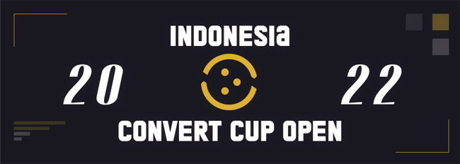
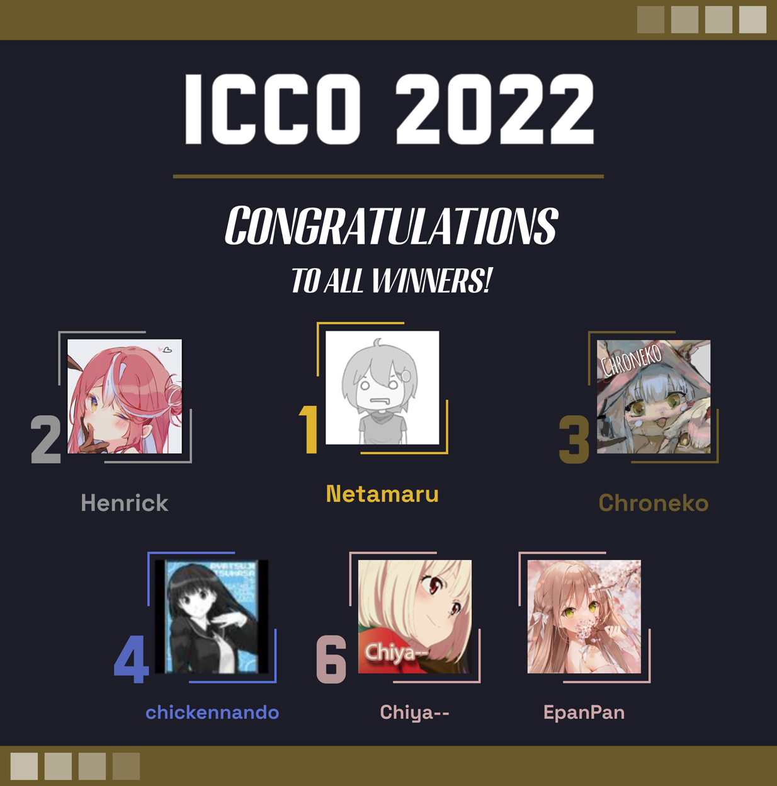

---
tags:
  - ICCO2022
  - ICCO 2022
---

# Indonesia Convert Cup Open 2022

The **Indonesia Convert Cup Open 2022** (***ICCO 2022***) was a double-elimination 1v1 osu!catch tournament hosted by ::{ flag=ID }:: [Urabe Mikoto](https://osu.ppy.sh/users/1272422) in which all the beatmaps were [converts from the osu! game mode](/wiki/Beatmap/Converts). Despite its name, the tournament was open to all players from all ten [ASEAN member states](https://asean.org/about-asean/member-states/) as well as ::{ flag=TL }:: Timor-Leste, ::{ flag=NZ }:: New Zealand, and ::{ flag=AU }:: Australia with 3,000 play count or more in the osu!catch game mode to their name. It was regarded as the third instalment of the Indonesia Convert Cup tournament series.

## Tournament schedule

| Event | Timestamp |
| --: | :-- |
| Registration phase | 2022-09-22/2022-10-02 |
| Screening phase | 2022-10-03/2022-10-09 |
| Qualifiers | 2022-10-10/2022-10-16 |
| Round of 32 | 2022-10-17/2022-10-23 |
| Round of 16 | 2022-10-24/2022-10-30 |
| Quarterfinals | 2022-10-31/2022-11-06 |
| Semifinals | 2022-11-07/2022-11-13 |
| Finals (week 1) | 2022-11-14/2022-11-20 |
| Finals (week 2) | 2022-11-21/2022-11-27 |

## Prizes

| Placing | Prize(s) |
| :-: | :-- |
|  | 30 USD, unique profile badge |
|  | 20 USD |
|  | 10 USD |

## Organisation

ICCO 2022 was run by various osu! community members from Indonesia and beyond.

| Position | Member(s) |
| :-- | :-- |
| Host | ::{ flag=ID }:: [Urabe Mikoto](https://osu.ppy.sh/users/1272422) |
| Co-host | ::{ flag=ID }:: [Madoka Ayukawa](https://osu.ppy.sh/users/1595221) |
| Mappool selector | ::{ flag=ID }:: [Urabe Mikoto](https://osu.ppy.sh/users/1272422), ::{ flag=ID }:: [Madoka Ayukawa](https://osu.ppy.sh/users/1595221), ::{ flag=ID }:: [Constantine](https://osu.ppy.sh/users/3221898) |
| Playtester | ::{ flag=KR }:: [Abstract-](https://osu.ppy.sh/users/3097304), ::{ flag=KR }:: [\[Amazing\]](https://osu.ppy.sh/users/1391036), ::{ flag=NL }:: [Selo](https://osu.ppy.sh/users/3212806), ::{ flag=CL }:: [Pekorrat](https://osu.ppy.sh/users/1250096) |
| Streamer | ::{ flag=ID }:: [Netamaru](https://osu.ppy.sh/users/1830361), ::{ flag=ID }:: [Chroneko](https://osu.ppy.sh/users/5472877), ::{ flag=TH }:: [Azuria](https://osu.ppy.sh/users/16102533), ::{ flag=AU }:: [Kureiji Ollie](https://osu.ppy.sh/users/11435502), ::{ flag=AU }:: [wangwangg](https://osu.ppy.sh/users/6416920) |
| Commentator | ::{ flag=ID }:: [Juragan\_Piscok1](https://osu.ppy.sh/users/15507280), ::{ flag=ID }:: [Dedot](https://osu.ppy.sh/users/8805157), ::{ flag=ID }:: [Neptunia-chan](https://osu.ppy.sh/users/11608122), ::{ flag=ID }:: [Shurelia](https://osu.ppy.sh/users/3807986), ::{ flag=TH }:: [RAISE MY SWORD](https://osu.ppy.sh/users/17385454), ::{ flag=AU }:: [Kureiji Ollie](https://osu.ppy.sh/users/11435502), ::{ flag=AU }:: [wangwangg](https://osu.ppy.sh/users/6416920), ::{ flag=AU }:: [Corrosion](https://osu.ppy.sh/users/16899553), ::{ flag=AU }:: [CrimsonPleaseee](https://osu.ppy.sh/users/3743985), ::{ flag=KR }:: [\[Amazing\]](https://osu.ppy.sh/users/1391036) |
| Referee | ::{ flag=ID }:: [Lunatier](https://osu.ppy.sh/users/27913451), ::{ flag=ID }:: [Kenneth Alfredo](https://osu.ppy.sh/users/829469), ::{ flag=ID }:: [Dapuluous](https://osu.ppy.sh/users/8140944), ::{ flag=ID }:: [nabirra](https://osu.ppy.sh/users/16053739), ::{ flag=TH }:: [Azuria](https://osu.ppy.sh/users/16102533), ::{ flag=KR }:: [\[Amazing\]](https://osu.ppy.sh/users/1391036) |
| Graphic designer | ::{ flag=RU }:: [ThankYou](https://osu.ppy.sh/users/4571241) |
| Spreadsheet manager | ::{ flag=ID }:: [Madoka Ayukawa](https://osu.ppy.sh/users/1595221) |
| Sponsor | ::{ flag=ID }:: [-Hex-](https://osu.ppy.sh/users/8630988), ::{ flag=MY }:: [Moeruattack](https://osu.ppy.sh/users/4480237) |
| Wiki editor | ::{ flag=ID }:: [Niva](https://osu.ppy.sh/users/197805) |

## Links

- **[Main spreadsheet](https://docs.google.com/spreadsheets/u/1/d/e/2PACX-1vRLbMRr5JVXAYJx5l7DY-Vecwo7ESaLgmFieo8rQwbAqlmC_o9SRo072JadnxcSzAbG0eWncroKBq91/pubhtml#)**
- [Forum thread](https://osu.ppy.sh/community/forums/topics/1649090)
- [Discord server](https://discord.gg/7g6TAj2)
- [Challonge brackets](https://challonge.com/ICCO_2022)
- [Livestream channel](https://www.twitch.tv/osucatchid)

## Participants

Listed below are the players who managed to qualify into the Round of 32 (along with their seed number and average map rank combined across each Qualifier beatmap) out of 39 registered players in total.

| Seed no. | Player | Avg. map rank |
| :-: | :-- | :-- |
| 1 | ::{ flag=ID }:: [Chroneko](https://osu.ppy.sh/users/5472877) | 2.88 |
| 2 | ::{ flag=ID }:: [Netamaru](https://osu.ppy.sh/users/1830361) | 3.75 |
| 3 | ::{ flag=AU }:: [chickennando](https://osu.ppy.sh/users/5818665) | 4.88 |
| 4 | ::{ flag=CA }:: (::{ flag=PH }::) [Henrick](https://osu.ppy.sh/users/8840982) | 6.13 |
| 5 | ::{ flag=ID }:: [Chiya--](https://osu.ppy.sh/users/7934854) | 6.75 |
| 6 | ::{ flag=ID }:: [Nekuro](https://osu.ppy.sh/users/3222638) | 8.88 |
| 7 | ::{ flag=AU }:: [Golterboose](https://osu.ppy.sh/users/4327130) | 9.25 |
| 8 | ::{ flag=ID }:: [Galaxi](https://osu.ppy.sh/users/2552435) | 10.25 |
| 9 | ::{ flag=PH }:: [-Rustyy](https://osu.ppy.sh/users/16355636) | 11.63 |
| 10 | ::{ flag=ID }:: [Shurelia](https://osu.ppy.sh/users/3807986) | 12.25 |
| 11 | ::{ flag=ID }:: [EpanPan](https://osu.ppy.sh/users/13194580) | 12.88 |
| 12 | ::{ flag=AU }:: [KWYJIBO](https://osu.ppy.sh/users/7178386) | 13.38 |
| 13 | ::{ flag=ID }:: [Dedot](https://osu.ppy.sh/users/8805157) | 14.50 |
| 14 | ::{ flag=ID }:: [Sololiquy](https://osu.ppy.sh/users/4350087) | 14.63 |
| 15 | ::{ flag=AU }:: [TheTixTop](https://osu.ppy.sh/users/19236870) | 16.75 |
| 16 | ::{ flag=MY }:: [\[MY\]error\_exe](https://osu.ppy.sh/users/6056288) | 17.50 |
| 17 | ::{ flag=AU }:: [pandaBear](https://osu.ppy.sh/users/107553) | 17.88 |
| 18 | ::{ flag=TH }:: [Kukkai](https://osu.ppy.sh/users/7811952) | 17.88 |
| 19 | ::{ flag=ID }:: [Mamat](https://osu.ppy.sh/users/3031177) | 17.88 |
| 20 | ::{ flag=AU }:: [Geniance](https://osu.ppy.sh/users/4229240) | 18.63 |
| 21 | ::{ flag=TH }:: [RAISE MY SWORD](https://osu.ppy.sh/users/17385454) | 19.75 |
| 22 | ::{ flag=ID}:: [Mixuri](https://osu.ppy.sh/users/9153772) | 19.88 |
| 23 | ::{ flag=MY }:: [Asteristia](https://osu.ppy.sh/users/9434933) | 21.00 |
| 24 | ::{ flag=MY }:: [DTNLRiki](https://osu.ppy.sh/users/12382410) | 22.75 |
| 25 | ::{ flag=ID }:: [Zvenx](https://osu.ppy.sh/users/14613788) | 23.13 |
| 26 | ::{ flag=ID }:: [Mochi -](https://osu.ppy.sh/users/20424806) | 23.13 |
| 27 | ::{ flag=ID }:: [Kinora](https://osu.ppy.sh/users/20571283) | 26.25 |
| 28 | ::{ flag=PH }:: [-HyperDream](https://osu.ppy.sh/users/12410693) | 26.25 |
| 29 | ::{ flag=ID }:: [Fisicia](https://osu.ppy.sh/users/6556054) | 26.63 |
| 30 | ::{ flag=PH }:: [-Isla-](https://osu.ppy.sh/users/17745759) | 29.13 |
| 31 | ::{ flag=PH }:: [Chloebe](https://osu.ppy.sh/users/4577865) | 29.25 |
| 32 | ::{ flag=ID }:: [Cera-](https://osu.ppy.sh/users/1974131) | 29.75 |

## Podium

## Mappools

### Finals (week 2)

**[Download the mappack here! (199 MB)](https://drive.google.com/file/d/170v1au8ewGDINsSHNFm3qiyK-ZZFX1PA/view)**

- NoMod
  1. [Sasaki Sayaka - FEELxALIVE (KuranteMelodii) \[BAKUON AR9.7\]](https://osu.ppy.sh/beatmapsets/477628#fruits/1020297)
  2. [Umeboshi Chazuke - Galaxy in Toybox (DC update ver.) (Star Stream) \[Expert\]](https://osu.ppy.sh/beatmapsets/1155525#fruits/2411404)
  3. [sasakure.UK - Xlo (Yusomi) \[Another AR9.7\]](https://osu.ppy.sh/beatmapsets/1018087#fruits/2130633)
  4. [USAO - Cthugha (Otosaka-Yu) \[MASTER\]](https://osu.ppy.sh/beatmapsets/1370925#fruits/2834637)
  5. [Iyowa feat. KAFU - Kyu-kurarin (0ugi) \[0pp's Tecxpert\]](https://osu.ppy.sh/beatmapsets/1591460#fruits/3405314)
  6. [The Gentle Men - Your Boyfriend Doesn't Scare Me (feat. KMac2021) (Kalibe) \[Daydream\]](https://osu.ppy.sh/beatmapsets/1799259#fruits/3688467)
- Hidden
  1. [Co shu Nie - Yume o Kin'iro ni Somete (Mystiarch) \[DeviousPanda's Abberation\]](https://osu.ppy.sh/beatmapsets/1632207#fruits/3338304)
  2. [seiya-murai feat. ALT - Sumidagawa Karenka (SkyFlame) \[Oriental Blossom\]](https://osu.ppy.sh/beatmapsets/1356636#fruits/2807621)
  3. [POLKADOT STINGRAY - Benikurage (Bazz B) \[Turitopsis Sp.\]](https://osu.ppy.sh/beatmapsets/1345187#fruits/2785953)
- HardRock
  1. [AliA - impulse (SkyFlame) \[Emotions\]](https://osu.ppy.sh/beatmapsets/1133470#fruits/2367231)
  2. [Otsukisama Koukyoukyoku - ultima Thule (Hey lululu) \[2014 MU9\]](https://osu.ppy.sh/beatmapsets/1507229#fruits/3087082)
  3. [Streetlight Manifesto - Punk Rock Girl (Milan-) \[pishi's Extra\]](https://osu.ppy.sh/beatmapsets/577394#fruits/1225554)
- DoubleTime
  1. [Yousei Teikoku - Astral Dogma (Net0) \[Saten's Dogma\]](https://osu.ppy.sh/beatmapsets/1008085#fruits/2109844)
  2. [Sakurakou K-ON Bu - Cagayake!GIRLS (TheShadowOfDark) \[Never-Ending Girls' Song (ICCO Edit)\]](https://osu.ppy.sh/beatmapsets/1888638#fruits/3889637)
  3. [Shimotsuki Haruka & Yamamoto Mineko - Masterpiece! (Nana Abe) \[Lydie\]](https://osu.ppy.sh/beatmapsets/1259704#fruits/2618969)
- Tiebreaker
  1. **[Sad Keyboard Guy, sleepless & Myntian - Alter//Strife feat. vally.exe (Alvearia) \[Sharded Memories Into Spaces Once Gone\]](https://osu.ppy.sh/beatmapsets/1881706#fruits/3873990)**

### Finals (week 1)

**[Download the mappack here! (119 MB)](https://drive.google.com/file/d/1b0h1imFzbma3UyGYq2kdrNyUt7JnHsQ4/view)**

- NoMod
  1. [HO-KAGO TEA TIME - Girls in Wonderland (TheShadowOfDark) \[Walao's Extra\]](https://osu.ppy.sh/beatmapsets/1266700#fruits/2659748)
  2. [A-One feat. ayaponzu\* - Justice Monster (Chizu-kun) \[Phantasm\]](https://osu.ppy.sh/beatmapsets/1513750#fruits/3099250)
  3. [Roselia - Shin'ai (-Aqua) \[Agony\]](https://osu.ppy.sh/beatmapsets/765499#fruits/1674700)
  4. [EmoCosine - MAGENTA POTION (short ver.) (Starfy) \[Hallucination\]](https://osu.ppy.sh/beatmapsets/1079970#fruits/3075536)
  5. [Yooh - Decoy (fanzhen0019) \[D\]](https://osu.ppy.sh/beatmapsets/1074610#fruits/2248810)
  6. [Nei Kino - Usan no Kaori (Parachute) \[Insane\]](https://osu.ppy.sh/beatmapsets/189625#fruits/451764)
- Hidden
  1. [Dirtyphonics - Night Ride (Halgoh) \[Ultimate Drift\]](https://osu.ppy.sh/beatmapsets/1621891#fruits/3311337)
  2. [SHK - Death Moon (Musty) \[SHD\]](https://osu.ppy.sh/beatmapsets/497027#fruits/1058054)
  3. [Aitsuki Nakuru - Daisan no Shinzou (captin1) \[nakuru\]](https://osu.ppy.sh/beatmapsets/1833750#fruits/3764586)
- HardRock
  1. [memex - Influence Exception (Akebana Yukio) \[Heartless\]](https://osu.ppy.sh/beatmapsets/1342856#fruits/2781552)
  2. [Hakushi Hasegawa - Doku (zglock) \[Expert\]](https://osu.ppy.sh/beatmapsets/1674871#fruits/3539717)
  3. [Chroma - Black Emperor (Azer) \[INFINITE\]](https://osu.ppy.sh/beatmapsets/297744#fruits/668301)
- DoubleTime
  1. [R96neko - Uso no Hibana (keevy) \[Insane\]](https://osu.ppy.sh/beatmapsets/1347368#fruits/2884129)
  2. [Sakaue Nachi - Crazy Hot (Satellite) \[Lunatic\]](https://osu.ppy.sh/beatmapsets/1850048#fruits/3800326)
  3. [iojjj - Torikago (Lanzhu) \[Insane\]](https://osu.ppy.sh/beatmapsets/1667873#fruits/3407910)
- Tiebreaker
  1. **[Release Hallucination - I.F. (Livermorium) \[My Loneliness Grows as the Moment of Farewell Surrounds Us\]](https://osu.ppy.sh/beatmapsets/1575103#fruits/3215934)**

### Semifinals

**[Download the mappack here! (97 MB)](https://drive.google.com/file/d/1LMQv6bS0AbYc-eCND4IF6UvTp-gmU1HA/view)**

- NoMod
  1. [HO-KAGO TEA TIME - Kira Kira Days (Keqing) \[Ram's Expert\]](https://osu.ppy.sh/beatmapsets/1234080#fruits/2859961)
  2. [sekai - God-ish (seros) \[?\]](https://osu.ppy.sh/beatmapsets/1759764#fruits/3601681)
  3. [UNDEAD - Melody in the Dark (kakifly) \[Resurgence\]](https://osu.ppy.sh/beatmapsets/1620141#fruits/3307859)
  4. [xi - Angel's Ladder (iljaaz) \[Arcana\]](https://osu.ppy.sh/beatmapsets/1850924#fruits/3802317)
  5. [Spire - Somnambulism (verychill) \[Sleep Terror\]](https://osu.ppy.sh/beatmapsets/1171893#fruits/2444332)
- Hidden
  1. [senya - Kowareta Unmei o Tsumuide (Satellite) \[Koume's Extra\]](https://osu.ppy.sh/beatmapsets/935811#fruits/2109559)
  2. [BEMANI Sound Team "Nekomata Gekidan" - Afterimage d'automne (Lulu-) \[Decaying Foliage\]](https://osu.ppy.sh/beatmapsets/1083051#fruits/2271628)
  3. [Brymir - Nephilim (LMT) \[Unholy Ritualus\]](https://osu.ppy.sh/beatmapsets/1271973#fruits/2643166)
- HardRock
  1. [Higuchi Madoka (CV: Tsuchiya Rio) - Itsudatte Bokura wa (Higuchi Madoka ver.) (\[Boy\]DaLat) \[Hikan's Extra\]](https://osu.ppy.sh/beatmapsets/1747715#fruits/3587675)
  2. [LeaF - Calamity Fortune (Frostings) \[Cataclysm\]](https://osu.ppy.sh/beatmapsets/359168#fruits/789752)
  3. [-45 - Aci-L (Luscent) \[Collab Extra\]](https://osu.ppy.sh/beatmapsets/1783108#fruits/3651716)
- DoubleTime
  1. [SHIKI - Lapis (JeZag) \[Another\]](https://osu.ppy.sh/beatmapsets/1543395#fruits/3154788)
  2. [mafumafu feat. soraru - ROKI (AirinCat) \[Insane.\]](https://osu.ppy.sh/beatmapsets/1587613#fruits/3242402)
  3. [Wanuka - Tipsy (climbx3145) \[Mature\]](https://osu.ppy.sh/beatmapsets/1611451#fruits/3290120)
- Tiebreaker
  1. **[Yunosuke - Loop Memory (Tycani) \[Repeating Repetitive Repetition\]](https://osu.ppy.sh/beatmapsets/1703935#fruits/3481651)**

### Quarterfinals

**[Download the mappack here! (90 MB)](https://drive.google.com/file/d/1Qa3iNncl4UuxsCryqScgD7xrlSTsPDps/view)**

- NoMod
  1. [LiSA - Rally Go Round (FrostxE) \[Extra\]](https://osu.ppy.sh/beatmapsets/317275#fruits/740692)
  2. [Yunomi feat. TORIENA - Bamboo Disco (Alden) \[\| D \| I \| S \| C \| O \|\]](https://osu.ppy.sh/beatmapsets/809345#fruits/1698363)
  3. [DJ Witch Girl Miracle - Mafain (Nelitoru) \[Neli's Extra : OwO AwA\]](https://osu.ppy.sh/beatmapsets/1599270#fruits/3266273)
  4. [TAG underground - POSSESSION (pewdekz) \[CHALLENGE\]](https://osu.ppy.sh/beatmapsets/1691083#fruits/3455732)
  5. [Black Eyed Peas - Boom Boom Pow (mrowswares) \[Ultra\]](https://osu.ppy.sh/beatmapsets/1263837#fruits/2626918)
- Hidden
  1. [MIHARU - Yakkami-Okami (Irohas) \[Expert\]](https://osu.ppy.sh/beatmapsets/1798704#fruits/3687258)
  2. [Blacklolita - Praeteritum (JeZag) \[Anachronism\]](https://osu.ppy.sh/beatmapsets/651006#fruits/2406944)
  3. [Newton - Arcade Love (feat. KNVWN) (Alvearia) \[Insane\]](https://osu.ppy.sh/beatmapsets/1794829#fruits/3678828)
- HardRock
  1. [BAND-MAID - CROSS (keevy) \YUKIYO'S INSANE\]](https://osu.ppy.sh/beatmapsets/1221201#fruits/2672135)
  2. [daisan - -+ (RikiH\_) \[Extra\]](https://osu.ppy.sh/beatmapsets/135094#fruits/338544)
  3. [MYUKKE. - The 89's Momentum (Akareh) \[Collab Insane\]](https://osu.ppy.sh/beatmapsets/1361463#fruits/2863365)
- DoubleTime
  1. [HO-KAGO TEA TIME - Singing! (CDFA) \[Insane\]](https://osu.ppy.sh/beatmapsets/54083#fruits/164603)
  2. [Utada Hikaru - Beautiful World (tutuhaha) \[Beautiful\]](https://osu.ppy.sh/beatmapsets/240627#fruits/556052)
  3. [Lia - Toki o Kizamu Uta (Dada) \[Epilogue\]](https://osu.ppy.sh/beatmapsets/1550603#fruits/3168616)
- Tiebreaker
  1. **[Roselia - FIRE BIRD (Kowari) \[CONFLAGRATION\]](https://osu.ppy.sh/beatmapsets/1451503#fruits/2984644)**

### Round of 16

**[Download the mappack here! (81 MB)](https://drive.google.com/file/d/10oWZmh9838C_DcxjwZMMnDWptnPT7dzJ/view)**

- NoMod
  1. [Eve - Kaikai Kitan (AirinCat) \[Extra\]](https://osu.ppy.sh/beatmapsets/1273536#fruits/2646355)
  2. [REAPER - HEATSEEKER (keevy) \[DETERMINATION\]](https://osu.ppy.sh/beatmapsets/1739056#fruits/3554263)
  3. [aran - L.F.O (Pipuuko) \[Orange's Extra\]](https://osu.ppy.sh/beatmapsets/1377112#fruits/3206318)
  4. [bbno$ & Rich Brian - edamame (Bakugo-) \[hanging low\]](https://osu.ppy.sh/beatmapsets/1557107#fruits/3180981)
- Hidden
  1. [Alvaro Soler - El Mismo Sol (Mosebye) \[Expert\]](https://osu.ppy.sh/beatmapsets/1696649#fruits/3466532)
  2. [cYsmix - Classic Pursuit (-kevincela-) \[Expert\]](https://osu.ppy.sh/beatmapsets/488238#fruits/1040942)
  3. [Ito Kanako - Tsuisou no Despair (Phynta) \[Insane\]](https://osu.ppy.sh/beatmapsets/1691178#fruits/3644675)
- HardRock
  1. [HO-KAGO TEA TIME - Fuwa Fuwa Time (VNtXDDD) \[Dream Night!!\]](https://osu.ppy.sh/beatmapsets/1337320#fruits/2770271)
  2. [m108 - Shinku no Senkou (Leader) \[Extra\]](https://osu.ppy.sh/beatmapsets/1551011#fruits/3169485)
  3. [Lil Nas X - THATS WHAT I WANT (KaedaharaKazuha) \[DESIRE\]](https://osu.ppy.sh/beatmapsets/1632817#fruits/3332931)
- DoubleTime
  1. [Another Infinity feat. Mayumi Morinaga - kotone (Leader) \[Insane\]](https://osu.ppy.sh/beatmapsets/838991#fruits/1756434)
  2. [dj TAKA - V -conclusion- (toybot) \[Another\]](https://osu.ppy.sh/beatmapsets/1829276#fruits/3754397)
  3. [Rihanna ft. Jay-Z - Umbrella (Agent Spin Here) \[Insane\]](https://osu.ppy.sh/beatmapsets/9873#fruits/38971)
- Tiebreaker
  1. **[lapix - Live Nor Die feat. Kanae Asaba (Nhato Remix) (Shiguri) \[Breaking Free\]](https://osu.ppy.sh/beatmapsets/898690#fruits/1877363)**

### Round of 32

**[Download the mappack here! (95 MB)](https://drive.google.com/file/d/11R4g0vJXUl466w_m2_Iykw5eGqyeeqm9/view)**

- NoMod
  1. [HO-KAGO TEA TIME - U&I (bossandy) \[Graduation\]](https://osu.ppy.sh/beatmapsets/976322#fruits/2155854)
  2. [cranky - R176 (Skull Kid) \[Insane\]](https://osu.ppy.sh/beatmapsets/359740#fruits/791016)
  3. [cosMo@BousouP - For UltraPlayers (rui) \[N a s y a's EXHAUST\]](https://osu.ppy.sh/beatmapsets/137969#fruits/462157)
  4. [sekai - p.h. (Petal) \[Namki's Extreme\]](https://osu.ppy.sh/beatmapsets/1461554#fruits/3155890)
- Hidden
  1. [Far East Movement feat. The Cataracs, DEV - Like A G6 (wafer) \[Batatin's E4\]](https://osu.ppy.sh/beatmapsets/1566608#fruits/3213072)
  2. [nora2r - B.B.K.K.B.K.K (rezoons) \[Another\]](https://osu.ppy.sh/beatmapsets/153920#fruits/378178)
  3. [Aimer - L-O-V-E (yuuya\_ke) \[sunset serenade\]](https://osu.ppy.sh/beatmapsets/974709#fruits/2040225)
- HardRock
  1. [Foreground Eclipse - From Under Cover (Caught Up In A Love Song) (Seni) \[Hard\]](https://osu.ppy.sh/beatmapsets/462386#fruits/1053802)
  2. [cosMo@BousouP feat. Hatsune Miku - Machinegun Poem Doll (Zoli) \[Light Insane\]](https://osu.ppy.sh/beatmapsets/1606218#fruits/3312872)
  3. [Shade - Rebirth the edge (Astom) \[Nyo\]](https://osu.ppy.sh/beatmapsets/34277#fruits/121195)
- DoubleTime
  1. [Train - 50 Ways to Say Goodbye (mancusojuanmattos) \[Insane\]](https://osu.ppy.sh/beatmapsets/92893#fruits/250926)
  2. [DECO\*27 - Reversible Campaign (tutuhaha) \[Hard\]](https://osu.ppy.sh/beatmapsets/616482#fruits/1309271)
  3. [KIRA - Circles (feat. GUMI) (Niva) \[3.14\]](https://osu.ppy.sh/beatmapsets/854098#fruits/1784877)
- Tiebreaker
  1. **[t+pazolite - Pump up UR NRG (RLC) \[Kinetic\]](https://osu.ppy.sh/beatmapsets/541226#fruits/1147647)**

### Qualifiers

**[Download the mappack here! (56 MB)](https://drive.google.com/file/d/17fE2rOp0bIq6WlhxOqVlz6thykSXHoEx/view)**

- NoMod
  1. [Dreamcatcher - Sleep-walking (Natsu) \[Midnight\]](https://osu.ppy.sh/beatmapsets/645655#fruits/1368107)
  2. [DWMw - Shirayama Hime no Kami (Luscent) \[DeviousPanda's Extravaganza\]](https://osu.ppy.sh/beatmapsets/1367344#fruits/2983174)
- Hidden
  1. [King Gizzard & The Lizard Wizard - Wah Wah (Kowari) \[Bizarre\]](https://osu.ppy.sh/beatmapsets/1769472#fruits/3622214)
  2. [Ryokuoushoku Shakai - LADYBUG (RLC) \[Rebirth\]](https://osu.ppy.sh/beatmapsets/1441587#fruits/2965623)
- HardRock
  1. [mary x jon-YAKITORY - Koko de Ikiteru (Amateurre) \[Yogurre's Insane\]](https://osu.ppy.sh/beatmapsets/1541131#fruits/3152525)
  2. [Amuro vs Killer - Mei (Acylica) \[Muya's Another\]](https://osu.ppy.sh/beatmapsets/1148799#fruits/2411485d)
- DoubleTime
  1. [Hikasa Yoko - Listen!! (CDFA) \[Collab\]](https://osu.ppy.sh/beatmapsets/24610#fruits/83603)
  2. [Starving Trancer feat. Maki - Agony (Nagi Hisakawa) \[Insane\]](https://osu.ppy.sh/beatmapsets/1262428#fruits/2623973)

## Match results

### Finals (week 2)

Saturday. 26 November 2022:

| Bracket | Player 1 |  |  | Player 2 | Match link |
| :-: | --: | :-: | :-: | :-- | :-- |
| Lower | **[Henrick](https://osu.ppy.sh/users/8840982)** ::{ flag=CA }:: (::{ flag=PH }::) | **7** | 1 | ::{ flag=ID }:: [Chroneko](https://osu.ppy.sh/users/5472877) | [#1](https://osu.ppy.sh/community/matches/105294799) |

Sunday, 27 November 2022, Grand Final:

| Bracket | Player 1 |  |  | Player 2 | Match link |
| :-: | --: | :-: | :-: | :-- | :-- |
| Grand Final | [Netamaru](https://osu.ppy.sh/users/1830361) ::{ flag=ID }:: | 5 | **7** | ::{ flag=CA }:: (::{ flag=PH }::) **[Henrick](https://osu.ppy.sh/users/8840982)** | [#1](https://osu.ppy.sh/community/matches/105310232) |
| Grand Final (bracket reset) | [Henrick](https://osu.ppy.sh/users/8840982) ::{ flag=CA }:: (::{ flag=PH }::) | 3 | **7** | ::{ flag=ID }:: **[Netamaru](https://osu.ppy.sh/users/1830361)** | [#1](https://osu.ppy.sh/community/matches/105311285) |

### Finals (week 1)

Saturday. 19 November 2022:

| Bracket | Player 1 |  |  | Player 2 | Match link |
| :-: | --: | :-: | :-: | :-- | :-- |
| Lower | **[Chroneko](https://osu.ppy.sh/users/5472877)** ::{ flag=ID }:: | **7** | 0 | ::{ flag=ID }:: [EpanPan](https://osu.ppy.sh/users/13194580) | [#1](https://osu.ppy.sh/community/matches/105151605) |

Sunday, 20 November 2022:

| Bracket | Player 1 |  |  | Player 2 | Match link |
| :-: | --: | :-: | :-: | :-- | :-- |
| Upper | [Henrick](https://osu.ppy.sh/users/8840982) ::{ flag=CA }:: (::{ flag=PH }::) | 1 | **7** | ::{ flag=ID }:: **[Netamaru](https://osu.ppy.sh/users/1830361)** | [#1](https://osu.ppy.sh/community/matches/105172280) |
| Lower | **[chickennando](https://osu.ppy.sh/users/5818665)** ::{ flag=AU }:: | **7** | 0 | ::{ flag=ID }:: [Chiya--](https://osu.ppy.sh/users/7934854) | [#1](https://osu.ppy.sh/community/matches/105175822) |

Monday, 21 November 2022:

| Bracket | Player 1 |  |  | Player 2 | Match link |
| :-: | --: | :-: | :-: | :-- | :-- |
| Lower | [chickennando](https://osu.ppy.sh/users/5818665) ::{ flag=AU }:: | 5 | **7** | ::{ flag=ID }:: **[Chroneko](https://osu.ppy.sh/users/5472877)** | [#1](https://osu.ppy.sh/community/matches/105177488) |

### Semifinals

Friday, 11 November 2022:

| Bracket | Player 1 |  |  | Player 2 | Match link |
| :-: | --: | :-: | :-: | :-- | :-- |
| Lower | **[Chiya--](https://osu.ppy.sh/users/7934854)** ::{ flag=ID }:: | **6** | 0 | ::{ flag=ID }:: [Mamat](https://osu.ppy.sh/users/6231292) | [#1](https://osu.ppy.sh/community/matches/104987406) |
| Lower | [-Rustyy](https://osu.ppy.sh/users/16355636) ::{ flag=PH }:: | 2 | **6** | ::{ flag=ID }:: **[Shurelia](https://osu.ppy.sh/users/3807986)** | [#1](https://osu.ppy.sh/community/matches/104988289) |

Saturday, 12 November 2022:

| Bracket | Player 1 |  |  | Player 2 | Match link |
| :-: | --: | :-: | :-: | :-- | :-- |
| Upper | **[Netamaru](https://osu.ppy.sh/users/1830361)** ::{ flag=ID }:: | **6** | 5 | ::{ flag=AU }:: [chickennando](https://osu.ppy.sh/users/5818665) | [#1](https://osu.ppy.sh/community/matches/105010824) |
| Lower | **[EpanPan](https://osu.ppy.sh/users/13194580)** ::{ flag=ID }:: | **6** | 0 | ::{ flag=TH }:: [RAISE MY SWORD](https://osu.ppy.sh/users/17385454) | [#1](https://osu.ppy.sh/community/matches/105010684) |
| Lower | **[Chiya--](https://osu.ppy.sh/users/7934854)** ::{ flag=ID }:: | **6** | 2 | ::{ flag=ID }:: [Shurelia](https://osu.ppy.sh/users/3807986) | [#1](https://osu.ppy.sh/community/matches/105012786) |
| Lower | [Golterboose](https://osu.ppy.sh/users/12443104) ::{ flag=AU }:: | 0 | **6** | ::{ flag=ID }:: **[Sololiquy](https://osu.ppy.sh/users/4350087)** | *win by default* |

Sunday, 13 November 2022:

| Bracket | Player 1 |  |  | Player 2 | Match link |
| :-: | --: | :-: | :-: | :-- | :-- |
| Lower | **[EpanPan](https://osu.ppy.sh/users/13194580)** ::{ flag=ID }:: | **6** | 2 | ::{ flag=ID }:: [Sololiquy](https://osu.ppy.sh/users/4350087) | [#1](https://osu.ppy.sh/community/matches/105037142) |
| Upper | [Chroneko](https://osu.ppy.sh/users/5472877) ::{ flag=ID }:: | 1 | **6** | ::{ flag=CA }:: (::{ flag=PH }::) **[Henrick](hhttps://osu.ppy.sh/users/8840982)** | [#1](https://osu.ppy.sh/community/matches/105034444) |

### Quarterfinals

Friday, 4 November 2022:

| Bracket | Player 1 |  |  | Player 2 | Match link |
| :-: | --: | :-: | :-: | :-- | :-- |
| Lower | **[RAISE MY SWORD](https://osu.ppy.sh/users/17385454)** ::{ flag=TH }:: | **6** | 5 | ::{ flag=TH }:: [Kukkai](https://osu.ppy.sh/users/7811952) | [#1](https://osu.ppy.sh/community/matches/104848826) |
| Lower | [Dedot](https://osu.ppy.sh/users/8805157) ::{ flag=ID }:: | 5 | **6** | ::{ flag=MY }:: **[Asteristia](https://osu.ppy.sh/users/9434933)** | [#1](https://osu.ppy.sh/community/matches/104851554) |
| Lower | **[Mamat](https://osu.ppy.sh/users/3031177)** ::{ flag=ID }:: | **6** | 0 | ::{ flag=ID }:: [Galaxi](https://osu.ppy.sh/users/2552435) | *win by default* |
| Lower | [Kinora](https://osu.ppy.sh/users/20571283) ::{ flag=ID }:: | 0 | **6** | ::{ flag=MY }:: **[\[MY\]error\_exe](https://osu.ppy.sh/users/6056288)** | *win by default* |

Saturday, 5 November 2022:

| Bracket | Player 1 |  |  | Player 2 | Match link |
| :-: | --: | :-: | :-: | :-- | :-- |
| Lower | [pandaBear](https://osu.ppy.sh/users/107553) ::{ flag=AU }:: | 3 | **6** | ::{ flag=ID }:: **[Mixuri](https://osu.ppy.sh/users/9153772)** | [#1](https://osu.ppy.sh/community/matches/104869313) |
| Lower | [Zvenx](https://osu.ppy.sh/users/14613788) ::{ flag=ID }:: | 1 | **6** | ::{ flag=ID }:: **[Sololiquy](https://osu.ppy.sh/users/4350087)** | [#1](https://osu.ppy.sh/community/matches/104873875) |
| Upper | **[Netamaru](https://osu.ppy.sh/users/1830361)** ::{ flag=ID }:: | **6** | 2 | ::{ flag=AU }:: [Golterboose](https://osu.ppy.sh/users/4327130) | [#1](https://osu.ppy.sh/community/matches/104897865) |
| Lower | [\[MY\]error\_exe](https://osu.ppy.sh/users/6056288) ::{ flag=MY }:: | 3 | **6** | ::{ flag=ID }:: **[Mamat](https://osu.ppy.sh/users/3031177)** | [#1](https://osu.ppy.sh/community/matches/104874441) |

Sunday, 20 November 2022:

| Bracket | Player 1 |  |  | Player 2 | Match link |
| :-: | --: | :-: | :-: | :-- | :-- |
| Lower | **[Shurelia](https://osu.ppy.sh/users/3807986)** ::{ flag=ID }:: | **6** | 0 | ::{ flag=AU }:: [Geniance](https://osu.ppy.sh/users/4229240) | [#1](https://osu.ppy.sh/community/matches/104871756) |
| Upper | **[Chroneko](https://osu.ppy.sh/users/5472877)** ::{ flag=ID }:: | **6** | 0 | ::{ flag=PH }:: [-Rustyy](https://osu.ppy.sh/users/16355636) | [#1](https://osu.ppy.sh/community/matches/104898873) |
| Upper | **[Henrick](https://osu.ppy.sh/users/8840982)** ::{ flag=CA }:: (::{ flag=PH }::) | **6** | 0 | ::{ flag=ID }:: [Chiya--](https://osu.ppy.sh/users/7934854) | [#1](https://osu.ppy.sh/community/matches/104902058) |
| Lower | [TheTixTop](https://osu.ppy.sh/users/19236870) ::{ flag=AU }:: | 1 | **6** | ::{ flag=AU }:: **[KWYJIBO](https://osu.ppy.sh/users/7178386)** | [#1](https://osu.ppy.sh/community/matches/104893860) |
| Lower | **[Sololiquy](https://osu.ppy.sh/users/4350087)** ::{ flag=ID }:: | **6** | 3 | ::{ flag=ID }:: [Mixuri](https://osu.ppy.sh/users/9153772) | [#1](https://osu.ppy.sh/community/matches/104895860) |
| Upper | **[chickennando](https://osu.ppy.sh/users/5818665)** ::{ flag=AU }:: | **6** | 2 | ::{ flag=ID }:: [EpanPan](https://osu.ppy.sh/users/13194580) | [#1](https://osu.ppy.sh/community/matches/104896466) |
| Lower | **[Shurelia](https://osu.ppy.sh/users/3807986)** ::{ flag=ID }:: | **6** | 5 | ::{ flag=AU }:: [KWYJIBO](https://osu.ppy.sh/users/7178386) | [#1](https://osu.ppy.sh/community/matches/104895208) |
| Lower | **[RAISE MY SWORD](https://osu.ppy.sh/users/3031177)** ::{ flag=TH }:: | **6** | 0 | ::{ flag=MY }:: [Asteristia](https://osu.ppy.sh/users/9434933) | *win by default* |

### Round of 16

Friday, 28 October 2022:

| Bracket | Player 1 |  |  | Player 2 | Match link |
| :-: | --: | :-: | :-: | :-- | :-- |
| Lower | [Cera-](https://osu.ppy.sh/users/1974131) ::{ flag=ID }:: | 0 | **5** | ::{ flag=MY }:: **[\[MY\]error\_exe](https://osu.ppy.sh/users/6056288)** | [#1](https://osu.ppy.sh/community/matches/104700021) |
| Lower | [-HyperDream](https://osu.ppy.sh/users/12410693) ::{ flag=PH }:: | 0 | **5** | ::{ flag=AU }:: **[KWYJIBO](https://osu.ppy.sh/users/7178386)** | [#1](https://osu.ppy.sh/community/matches/104693315) |
| Upper | **[EpanPan](https://osu.ppy.sh/users/13194580)** ::{ flag=ID }:: | **5** | 0 | ::{ flag=ID }:: [Kinora](https://osu.ppy.sh/users/20571283) | *win by default* |
| Lower | **[Galaxi](https://osu.ppy.sh/users/2552435)** ::{ flag=ID }:: | **5** | 0 | ::{ flag=MY }:: [DTNLRiki](https://osu.ppy.sh/users/12382410) | *win by default* |

Saturday, 29 October 2022:

| Bracket | Player 1 |  |  | Player 2 | Match link |
| :-: | --: | :-: | :-: | :-- | :-- |
| Upper | **[Chroneko](https://osu.ppy.sh/users/5472877)** ::{ flag=ID }:: | **5** | 0 | ::{ flag=AU }:: [pandaBear](https://osu.ppy.sh/users/107553) | [#1](https://osu.ppy.sh/community/matches/104721252) |
| Lower | [Mochi -](https://osu.ppy.sh/users/20424806) ::{ flag=ID }:: | 0 | **5** | ::{ flag=MY }:: **[Asteristia](https://osu.ppy.sh/users/9434933)** | [#1](https://osu.ppy.sh/community/matches/104721000) |
| Upper | **[Henrick](https://osu.ppy.sh/users/8840982)** ::{ flag=CA }:: (::{ flag=PH }::) | **5** | 0 | ::{ flag=ID }:: [Dedot](https://osu.ppy.sh/users/8805157) | [#1](https://osu.ppy.sh/community/matches/104727567) |
| Lower | [Chloebe](https://osu.ppy.sh/users/4577865) ::{ flag=PH }:: | 2 | **5** | ::{ flag=TH }:: **[Kukkai](https://osu.ppy.sh/users/7811952)** | [#1](https://osu.ppy.sh/community/matches/104722619) |
| Upper | **[Golterboose](https://osu.ppy.sh/users/4327130)** ::{ flag=AU }:: | **5** | 3 | ::{ flag=ID }:: [Shurelia](https://osu.ppy.sh/users/3807986) | [#1](https://osu.ppy.sh/community/matches/104723770) |
| Lower | **[Mixuri](https://osu.ppy.sh/users/9153772)** ::{ flag=ID }:: | **5** | 0 | ::{ flag=ID }:: [Nekuro](https://osu.ppy.sh/users/3222638) | *win by default* |
| Lower | **[Sololiquy](https://osu.ppy.sh/users/4350087)** ::{ flag=ID }:: | **5** | 0 | ::{ flag=PH }:: [-Isla-](https://osu.ppy.sh/users/17745759) | *win by default* |

Sunday, 30 October 2022:

| Bracket | Player 1 |  |  | Player 2 | Match link |
| :-: | --: | :-: | :-: | :-- | :-- |
| Upper | **[Chiya--](https://osu.ppy.sh/users/7934854)** ::{ flag=ID }:: | **5** | 0 | ::{ flag=TH }:: [RAISE MY SWORD](https://osu.ppy.sh/users/17385454) | [#1](https://osu.ppy.sh/community/matches/104749476) |
| Lower | [Fisicia](https://osu.ppy.sh/users/6556054) ::{ flag=ID }:: | 2 | **5** | ::{ flag=AU }:: **[Geniance](https://osu.ppy.sh/users/4229240)** | [#1](https://osu.ppy.sh/community/matches/104745815) |
| Upper | **[Netamaru](https://osu.ppy.sh/users/1830361)** ::{ flag=ID }:: | **5** | 3 | ::{ flag=AU }:: [TheTixTop](https://osu.ppy.sh/users/19236870) | [#1](https://osu.ppy.sh/community/matches/104745580) |
| Upper | [Zvenx](https://osu.ppy.sh/users/14613788) ::{ flag=ID }:: | 1 | **5** | ::{ flag=PH }:: **[-Rustyy](https://osu.ppy.sh/users/16355636)** | [#1](https://osu.ppy.sh/community/matches/104750724) |
| Upper | **[chickennando](https://osu.ppy.sh/users/5818665)** ::{ flag=AU }:: | **5** | 0 | ::{ flag=ID }:: [Mamat](https://osu.ppy.sh/users/3031177) | [#1](https://osu.ppy.sh/community/matches/104746875) |

### Round of 32

Friday, 21 October 2022:

| Bracket | Player 1 |  |  | Player 2 | Match link |
| :-: | --: | :-: | :-: | :-- | :-- |
| Upper | **[EpanPan](https://osu.ppy.sh/users/13194580)** ::{ flag=ID }:: | **5** | 4 | ::{ flag=ID }:: [Mixuri](https://osu.ppy.sh/users/9153772) | [#1](https://osu.ppy.sh/community/matches/104555143) |
| Upper | [KWYJIBO](https://osu.ppy.sh/users/7178386) ::{ flag=AU }:: | 3 | **5** | ::{ flag=TH }:: **[RAISE MY SWORD](https://osu.ppy.sh/users/17385454)** | [#1](https://osu.ppy.sh/community/matches/104552114) |
| Upper | **[-Rustyy](https://osu.ppy.sh/users/16355636)** ::{ flag=PH }:: | **5** | 1 | ::{ flag=MY }:: [DTNLRiki](https://osu.ppy.sh/users/12382410) | [#1](https://osu.ppy.sh/community/matches/104553434) |
| Upper | **[Chroneko](https://osu.ppy.sh/users/5472877)** ::{ flag=ID }:: | **5** | 2 | ::{ flag=ID }:: [Cera-](https://osu.ppy.sh/users/1974131) | [#1](https://osu.ppy.sh/community/matches/104556216) |

Saturday, 22 October 2022:

| Bracket | Player 1 |  |  | Player 2 | Match link |
| :-: | --: | :-: | :-: | :-- | :-- |
| Upper | [Galaxi](https://osu.ppy.sh/users/2552435) ::{ flag=ID }:: | 4 | **5** | ::{ flag=ID }:: **[Zvenx](https://osu.ppy.sh/users/14613788)** | [#1](https://osu.ppy.sh/community/matches/104580816) |
| Upper | **[Shurelia](https://osu.ppy.sh/users/3807986)** ::{ flag=ID }:: | **5** | 3 | ::{ flag=MY }:: [Asteristia](https://osu.ppy.sh/users/9434933) | [#1](https://osu.ppy.sh/community/matches/104574555) |
| Upper | **[Chiya--](https://osu.ppy.sh/users/7934854)** ::{ flag=ID }:: | **5** | 1 | ::{ flag=PH }:: [HyperDream](https://osu.ppy.sh/users/12410693) | [#1](https://osu.ppy.sh/community/matches/104575328) |
| Upper | **[Golterboose](https://osu.ppy.sh/users/4327130)** ::{ flag=AU }:: | **5** | 0 | ::{ flag=ID }:: [Mochi -](https://osu.ppy.sh/users/20424806) | [#1](https://osu.ppy.sh/community/matches/104575849) |
| Upper | [\[MY\]error\_exe](https://osu.ppy.sh/users/6056288) ::{ flag=MY }:: | 2 | **5** | ::{ flag=AU }:: **[pandaBear](https://osu.ppy.sh/users/107553)** | [#1](https://osu.ppy.sh/community/matches/104576028) |
| Upper | **[Henrick](https://osu.ppy.sh/users/8840982)** ::{ flag=CA }:: (::{ flag=PH }::) | **5** | 1 | ::{ flag=ID }:: [Fisicia](https://osu.ppy.sh/users/6556054) | [#1](https://osu.ppy.sh/community/matches/104581140) |
| Upper | **[TheTixTop](https://osu.ppy.sh/users/19236870)** ::{ flag=AU }:: | **5** | 0 | ::{ flag=TH }:: [Kukkai](https://osu.ppy.sh/users/7811952) | *win by default* |

Sunday, 23 October 2022:

| Bracket | Player 1 |  |  | Player 2 | Match link |
| :-: | --: | :-: | :-: | :-- | :-- |
| Upper | [Sololiquy](https://osu.ppy.sh/users/4350087) ::{ flag=ID }:: | 4 | **5** | ::{ flag=ID }:: **[Mamat](https://osu.ppy.sh/users/3031177)** | [#1](https://osu.ppy.sh/community/matches/104605679) |
| Upper | **[chickennando](https://osu.ppy.sh/users/5818665)** ::{ flag=AU }:: | **5** | 0 | ::{ flag=PH }:: [-Isla-](https://osu.ppy.sh/users/17745759) | [#1](https://osu.ppy.sh/community/matches/104603795) |
| Upper | **[Netamaru](https://osu.ppy.sh/users/1830361)** ::{ flag=ID }:: | **5** | 1 | ::{ flag=PH }:: [Chloebe](https://osu.ppy.sh/users/4577865) | [#1](https://osu.ppy.sh/community/matches/104601630) |
| Upper | **[Dedot](https://osu.ppy.sh/users/8805157)** ::{ flag=ID }:: | **5** | 1 | ::{ flag=AU }:: [Geniance](https://osu.ppy.sh/users/4229240) | [#1](https://osu.ppy.sh/community/matches/104601420) |

## Ruleset

### General rules

1. Beatmap scoring is based on **[ScoreV2](/wiki/Gameplay/Score#scorev2).**
2. The mappools for each round will be announced by the tournament management in advance before the actual matches take place.
   - All beatmaps in the tournament will feature songs that are related to video games in one way or another.
3. Match schedules will be predetermined by the tournament management. If there are any players who are unable to attend the current schedule for any reason, all other affected players may apply and settle for a reschedule at the `#scheduling` channel in the tournament's Discord server.
4. A referee will create a multiplayer room 10 minutes in advance and will start to send out invites.
5. If a player does not show up within **10 minutes** of the start time, their opponent wins by default.
6. If no staff or referee is available, the match will be postponed.
7. **NoFail will be enforced in all beatmaps.** This is to ensure that the points are to be awarded more fairly towards players who perform better in general during the course of the beatmap regardless of their remaining health at the end.
8. If a player disconnects, the referee will note the score the player had achieved at the end of the beatmap directly from their PC and adjust the outcome of the pick accordingly.
9. Lag is not a valid reason to nullify a beatmap.
10. If any problems during the match occur, the tournament management will make a decision based on the referee's report.
11. It is expected that all players be polite and respectful to each other. Penalties will be given upon violation.
    - If a player is found to be engaging in an act that is deemed to be distasteful or provocative, the corresponding player may be disqualified right away from the tournament and/or blacklisted from future iterations of the tournament by the tournament management.
    - Usage of any tools or programs that are against the [osu! community rules](/wiki/Rules#community-rules) is strictly prohibited and will be straight up reported to the osu! team at will.

### Tournament registration

1. All interested players are required to register into the tournament individually through [this form](https://forms.gle/G3dJovwbmR5kwQhk6).
   - In order to be eligible to play in the tournament, a player must either:
     - Have the flag of any of the ten [ASEAN member states](https://asean.org/about-asean/member-states/) (::{ flag=BN }:: Brunei Darussalam, ::{ flag=KH }:: Cambodia, ::{ flag=ID }:: Indonesia, ::{ flag=LA }:: Laos, ::{ flag=MY }:: Malaysia, ::{ flag=MM }:: Myanmar, ::{ flag=PH }:: The Philippines, ::{ flag=SG }:: Singapore, ::{ flag=TH }:: Thailand, and ::{ flag=VN }:: Vietnam) or the flag of either ::{ flag=TL }:: Timor-Leste, ::{ flag=NZ }:: New Zealand, and ::{ flag=AU }:: Australia bound to their osu! account, ***or***
     - Be in possession of a valid identity document (i.e. passport or ID card) issued by one of the aforementioned countries.
2. To ensure that all incoming registrations are serious and valid, every registered player will be checked in detail by the tournament management.
3. The list of players who are deemed to be eligible to compete in the tournament will be published by the tournament management after the registration phase has ended.
4. Testplayers, referees, and mappool selectors may not participate as players in this tournament.

### Round-specific rules

#### Qualifier rules

1. Each player will have to sign up to one of the Qualifier lobbies that have been scheduled and prepared by the tournament management in advance.
2. In the lobby, all players will have to consecutively play all of the eight Qualifier beatmaps in the order of NM1 -> NM2 -> HD1 -> HD2 -> HR1 -> HR2 -> DT1 -> DT2.
3. Players **are not allowed** to ban any beatmaps in the Qualifiers.
4. Players **are not allowed** to join (or register for) more than one Qualifier lobby.
5. Based on their performance in the Qualifiers, players will be ranked based on their average rank combined across each Qualifier beatmap.
6. 32 players with the **highest average rank overall** will advance to the knock-out stages.
   - If there are two (or more) players who share the same average rank, the player holding the higher total score combined from all eight Qualifier beatmaps will be placed in the higher seed.
7. Failure to attend in any of the predetermined Qualifier lobbies will result in an instant elimination from the tournament.

#### Knock-out stage rules

1. The 32 players who managed to get through from the Qualifiers will be matched to each other based on their Qualifiers seeding.
2. Players will compete against each other using the double-elimination system.
3. The double-elimination system works as follows:
   - Players who lose in the upper bracket can still play again on the lower bracket.
   - Players who lose in the lower bracket will be eliminated from the tournament.
   - In the Grand Final, the winner of the the upper bracket will only need to win a single match against their opponent in order to claim the championship title. The winner of the lower bracket, however, will need to win two matches and enforce a *bracket reset* against their opponent in order to claim the championship title.
4. Players who can compete in the next round are determined by:
   - In the Round of 32 and the Round of 16, each player needs to win 5 points in order to win a match. (Best of 9)
   - In the Quarterfinals and the Semifinals, each player needs to win 6 points in order to win a match. (Best of 11)
   - In both of the Finals weeks, each player needs to win 7 points in order to win a match. (Best of 13)
   - Whether there are players who are declared to win the match by default.
   - Whether there are players who are disqualified from the tournament.

### Match instructions

1. Each player must use the `!roll` command once in the multiplayer lobby in order to determine the banning and picking order.
   - The winner of the `!roll` gets to determine who gets the first pick and the second ban.
   - The loser of the `!roll` gets the opposite by default.
   - This rule does not apply in the Qualifier lobbies.
2. Each player has to ban **one beatmap** from the corresponding mappool. These beatmaps will not be allowed to be picked by any player during the entire match.
   - Barring the tiebreaker, there are no restrictions as to which maps may and may not be banned in a match.
   - Banning does not apply in the Qualifier lobbies.
3. Each player is free to select one warm-up beatmap. Using beatmaps with questionable content is prohibited.
   - Warm-ups do not apply in the Qualifier lobbies.
4. **There will be no dedicated FreeMod picks in the tournament.** However, when playing a map from the HardRock or DoubleTime pool, Hidden can be used optionally on top of the corresponding mod by any player.
5. In the case of a tiebreaker, the tiebreaker map will be played with the FreeMod option enabled which allows players to play the tiebreaker map with Easy, HardRock, Hidden, or any possible combinations of the three mods should they wish to.
   - Playing the tiebreaker map with a mod is *not* mandatory.
6. The results of each match and any other relevant information regarding the match will be noted by the referee after the match has been concluded.
