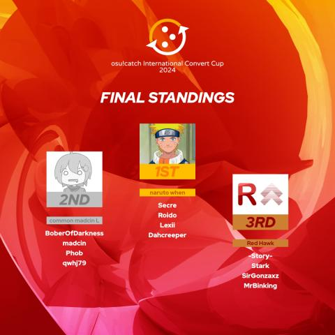

---
tags:
  - ICC
  - ICC Season 1
---

# International Convert Cup 2024

The **International Convert Cup 2024** (***ICC 2024***) was a double-elimination 2v2 osu!catch tournament hosted by ::{ flag=ID }:: [Urabe Mikoto](https://osu.ppy.sh/users/1272422), ::{ flag=ID }:: [Constantine](https://osu.ppy.sh/users/3221898), ::{ flag=ID }:: [Madoka Ayukawa](https://osu.ppy.sh/users/1595221), ::{ flag=NL }:: [Wesley](https://osu.ppy.sh/users/2407265), and ::{ flag=US }:: [Snowleopard](https://osu.ppy.sh/users/3790227) in which all the beatmaps were [converts from the osu! game mode](/wiki/Beatmap/Converts). Although it was the first to be held under the "International Convert Cup" banner, the tournament was considered as an expansion of the preceeding [Indonesia Convert Cup](/wiki/Tournaments/ICC) and [osu!catch Convert Cup Open](/wiki/Tournaments/o!cCO) series.

## Tournament schedule

| Event | Timestamp |
| --: | :-- |
| Registration phase | 2024-10-24/2024-11-06 |
| Screening phase | 2024-11-07/2024-11-24 |
| Qualifiers | 2024-11-25/2024-12-01 |
| Round of 32 | 2024-12-02/2024-12-08 |
| Round of 16 | 2024-12-09/2024-12-15 |
| *Winter break* | 2024-12-16/2024-12-29 |
| Quarterfinals | 2024-12-30/2023-01-05 |
| Semifinals | 2025-01-06/2023-01-12 |
| Finals (week 1) | 2025-01-13/2025-01-19 |
| Finals (week 2) | 2025-01-27/2025-02-02 |

## Prizes

| Placing | Prize(s) |
| :-: | :-- |
|  | 16 USD or 6 months of osu!supporter for each team member, unique profile badge |
|  | 12 USD or 4 months of osu!supporter for each team member |
|  | 8 USD or 2 months of osu!supporter for each team member |

## Organisation

The International Convert Cup 2024 was run by various community members from all around the world.

| Position | Member(s) |
| :-- | :-- |
| Host | ::{ flag=ID }:: [Urabe Mikoto](https://osu.ppy.sh/users/1272422), ::{ flag=ID }:: [Constantine](https://osu.ppy.sh/users/3221898), ::{ flag=ID }:: [Madoka Ayukawa](https://osu.ppy.sh/users/1595221), ::{ flag=NL }:: [Wesley](https://osu.ppy.sh/users/2407265), ::{ flag=US }:: [Snowleopard](https://osu.ppy.sh/users/3790227) |
| Mappool selector | ::{ flag=ID }:: [Urabe Mikoto](https://osu.ppy.sh/users/1272422), ::{ flag=ID }:: [Constantine](https://osu.ppy.sh/users/3221898), ::{ flag=ID }:: [Madoka Ayukawa](https://osu.ppy.sh/users/1595221), ::{ flag=KR }:: [[Amazing]](https://osu.ppy.sh/users/1391036), ::{ flag=KR }:: [Abstract-](https://osu.ppy.sh/users/3097304), ::{ flag=HK }:: [autofanboy](https://osu.ppy.sh/users/636114), ::{ flag=MX }:: [MILK\_16](https://osu.ppy.sh/users/9137627), ::{ flag=CL }:: [Pekorrat](https://osu.ppy.sh/users/1250096) |
| Playtester and replayer | ::{ flag=ID }:: [Urabe Mikoto](https://osu.ppy.sh/users/1272422), ::{ flag=ID }:: [Constantine](https://osu.ppy.sh/users/3221898), ::{ flag=ID }:: [Madoka Ayukawa](https://osu.ppy.sh/users/1595221), ::{ flag=SG }:: [Ekseff](https://osu.ppy.sh/users/13966422), ::{ flag=MY }:: [Zakrusta](https://osu.ppy.sh/users/5034270), ::{ flag=KR }:: [[Amazing]](https://osu.ppy.sh/users/1391036),, ::{ flag=KR }:: [Motion](https://osu.ppy.sh/users/3885626), ::{ flag=AU }:: [Tixcyte](https://osu.ppy.sh/users/19236870), ::{ flag=FR }:: [Electr0o](https://osu.ppy.sh/users/9484428), ::{ flag=PL }:: [trig0n](https://osu.ppy.sh/users/3704228), ::{ flag=CL }:: [Lechu FAQ 35P](https://osu.ppy.sh/users/2872000), ::{ flag=CL }:: [Aryssiel](https://osu.ppy.sh/users/2389481) |
| Streamer | ::{ flag=ID }:: [Urabe Mikoto](https://osu.ppy.sh/users/1272422), ::{ flag=NL }:: [Wesley](https://osu.ppy.sh/users/2407265), ::{ flag=US }:: [Snowleopard](https://osu.ppy.sh/users/3790227), ::{ flag=ID }:: [Dapulezatos](https://osu.ppy.sh/users/8140944), ::{ flag=SG }:: [Ekseff](https://osu.ppy.sh/users/13966422), ::{ flag=IN }:: [Pilot_BFFRI](https://osu.ppy.sh/users/27266540), ::{ flag=DE }:: [Iskas](https://osu.ppy.sh/users/16816551), ::{ flag=RU }:: [Rainbowtaves](https://osu.ppy.sh/users/10079847), ::{ flag=US }:: [bvyans](https://osu.ppy.sh/users/7789926), ::{ flag=VE }:: [MiquelVZLA](https://osu.ppy.sh/users/11148079) |
| Commentator | ::{ flag=NL }:: [Wesley](https://osu.ppy.sh/users/2407265), ::{ flag=US }:: [Snowleopard](https://osu.ppy.sh/users/3790227), ::{ flag=SG }:: [Ekseff](https://osu.ppy.sh/users/13966422), ::{ flag=AU }:: [Maitoo](https://osu.ppy.sh/users/16899553), ::{ flag=DE }:: [Cynaestra](https://osu.ppy.sh/users/2103365), ::{ flag=ME }:: [Melodieyy-](https://osu.ppy.sh/users/33526381), ::{ flag=US }:: [[-Sisyphus-]](https://osu.ppy.sh/users/20345199), ::{ flag=US }:: [Owen123c](https://osu.ppy.sh/users/12433794) |
| Referee | ::{ flag=ID }:: [Urabe Mikoto](https://osu.ppy.sh/users/1272422), ::{ flag=NL }:: [Wesley](https://osu.ppy.sh/users/2407265), ::{ flag=US }:: [Snowleopard](https://osu.ppy.sh/users/3790227), ::{ flag=SG }:: [Ekseff](https://osu.ppy.sh/users/13966422), ::{ flag=VN }:: [-[SnowFlakes]-](https://osu.ppy.sh/users/19207842), ::{ flag=IN }:: [Pilot\_BFFRI](https://osu.ppy.sh/users/27266540), ::{ flag=AU }:: [Tixcyte](https://osu.ppy.sh/users/19236870), ::{ flag=DE }:: [Cynaestra](https://osu.ppy.sh/users/2103365), ::{ flag=IL }:: [Tourb0](https://osu.ppy.sh/users/19471527), ::{ flag=UA }:: [Shinohara Yuu](https://osu.ppy.sh/users/35761100), ::{ flag=AT }:: [Mashiro Mama](https://osu.ppy.sh/users/10415976), ::{ flag=RU }:: [Rainbowtaves](https://osu.ppy.sh/users/10079847), ::{ flag=US }:: [[-Sisyphus-]](https://osu.ppy.sh/users/20345199), ::{ flag=US }:: [Liyac](https://osu.ppy.sh/users/4994598), ::{ flag=US }:: [akace100](https://osu.ppy.sh/users/9308128), ::{ flag=CL }:: [Des9](https://osu.ppy.sh/users/5404711) |
| Graphic designer | ::{ flag=PH }:: [OsuMe65](https://osu.ppy.sh/users/852867) |
| Scheduler | ::{ flag=ID }:: [Urabe Mikoto](https://osu.ppy.sh/users/1272422), ::{ flag=US }:: [Snowleopard](https://osu.ppy.sh/users/3790227) |
| Statistician and spreadsheet manager | ::{ flag=ID }:: [Urabe Mikoto](https://osu.ppy.sh/users/1272422) |
| Wiki editor | ::{ flag=ID }:: [Niva](https://osu.ppy.sh/users/197805) |

## Links

- **[Official website](https://wybin.xyz/tournaments/icc2024)**
- [Forum thread](https://osu.ppy.sh/community/forums/topics/1991639)
- [Discord server](https://discord.gg/PDVF3tbhY8)
- [Challonge brackets](https://challonge.com/ICC_2024)
- [Livestream channel](https://www.twitch.tv/osucatchid)

## Participants

| Team name | Members |
| :-: | :-- |
| 3difdigits | ::{ flag=US }:: **[ChewyTarTar](https://osu.ppy.sh/users/13978275)**, ::{ flag=GB }:: [Nathanial](https://osu.ppy.sh/users/9169747), ::{ flag=US }:: [DeadFireFly962](https://osu.ppy.sh/users/35067734) |
| +4 ARAM | ::{ flag=VN }:: **[Stardust Prism](https://osu.ppy.sh/users/8525921)**, ::{ flag=VN }:: [-Miya](https://osu.ppy.sh/users/1942877), ::{ flag=VN }:: [Shu](https://osu.ppy.sh/users/4744615), ::{ flag=VN }:: [S h i g u r e](https://osu.ppy.sh/users/4372552) |
| :cat: | ::{ flag=TW }:: **[Psc\_IceRain](https://osu.ppy.sh/users/3359485)**, ::{ flag=TW }:: [\_Nanami](https://osu.ppy.sh/users/1929450), ::{ flag=TW }:: [Happiness Fish](https://osu.ppy.sh/users/4586766), ::{ flag=TW }:: [Oktavia](https://osu.ppy.sh/users/1952803) |
| :tac: | ::{ flag=TW }:: **[DoDoEbi](https://osu.ppy.sh/users/1177233)**, ::{ flag=TW }:: [Sanami](https://osu.ppy.sh/users/1629471), ::{ flag=TW }:: [Formosa\_333](https://osu.ppy.sh/users/1936711), ::{ flag=TW }:: [Saru8na](https://osu.ppy.sh/users/4787989) |
| abubeshki | ::{ flag=RU }:: **[Mizujin](https://osu.ppy.sh/users/12405160)**, ::{ flag=RU }:: [Morusya](https://osu.ppy.sh/users/13681464), ::{ flag=RU }:: [2zz](https://osu.ppy.sh/users/8201267), ::{ flag=RU }:: [yuinn](https://osu.ppy.sh/users/11239593) |
| Albacete x ICC | ::{ flag=ES }:: **[MusicDropZ](https://osu.ppy.sh/users/12759554)**, ::{ flag=ES }:: [DPJ9fuegos](https://osu.ppy.sh/users/869471), ::{ flag=ES }:: [Alepe](https://osu.ppy.sh/users/15273403), ::{ flag=CL }:: [-Naroh](https://osu.ppy.sh/users/9087831) |
| Barely Managing | ::{ flag=BE }:: **[TWXC](https://osu.ppy.sh/users/12239488)**, ::{ flag=RO }:: [ChrisS3097](https://osu.ppy.sh/users/4400693), ::{ flag=TR }:: [Yasi6n](https://osu.ppy.sh/users/17482520), ::{ flag=BE }:: [ElSkeffe](https://osu.ppy.sh/users/6283136) |
| Bashame X Osaka | ::{ flag=CA }:: **[mieldeprairie](https://osu.ppy.sh/users/19290397)**, ::{ flag=SA }:: [WOAH0](https://osu.ppy.sh/users/18336339), ::{ flag=US }:: [SheepBlade15](https://osu.ppy.sh/users/31499081), ::{ flag=US }:: [Katsue](https://osu.ppy.sh/users/22708842) |
| Capo so cute v3 | ::{ flag=FR }:: **[Holloh](https://osu.ppy.sh/users/7612994)**, ::{ flag=JP }:: [Molqus](https://osu.ppy.sh/users/1927193), ::{ flag=TN }:: [-Ken](https://osu.ppy.sh/users/4430811), ::{ flag=CA }:: [Katsuragi](https://osu.ppy.sh/users/3616480) |
| Ciel Enchanteur | ::{ flag=BR }:: **[\_Alice](https://osu.ppy.sh/users/8024582)**, ::{ flag=BR }:: [A n t o t s u](https://osu.ppy.sh/users/7094470), ::{ flag=CL }:: [Osjux](https://osu.ppy.sh/users/7161836), ::{ flag=BR }:: [Juicy Fruit](https://osu.ppy.sh/users/4099041) |
| Colo-Colo | ::{ flag=CL }:: **[DateLix](https://osu.ppy.sh/users/9200197)**, ::{ flag=PL }:: [Szczyr](https://osu.ppy.sh/users/17329923), ::{ flag=PL }:: [Kael_DK](https://osu.ppy.sh/users/11289377), ::{ flag=CL }:: [YeaaBoiii](https://osu.ppy.sh/users/14630452) |
| common madcin L | ::{ flag=PL }:: **[BoberOfDarkness](https://osu.ppy.sh/users/3427748)**, ::{ flag=KR }:: [qwhj79](https://osu.ppy.sh/users/7547506), ::{ flag=PL }:: [Phob](https://osu.ppy.sh/users/6069462), ::{ flag=PL }:: [madcin](https://osu.ppy.sh/users/2957534) |
| Convert noob | ::{ flag=TW }:: **[VaMePirE](https://osu.ppy.sh/users/8411195)**, ::{ flag=TW }:: [kinjacky](https://osu.ppy.sh/users/2035091), ::{ flag=TW }:: [gensouyume](https://osu.ppy.sh/users/14782787), ::{ flag=TW }:: [Flyer](https://osu.ppy.sh/users/9767342) |
| ctb = danmaku | ::{ flag=SE }:: **[hypnoSpirA](https://osu.ppy.sh/users/1352257)**, ::{ flag=FR }:: [Fuka Pura](https://osu.ppy.sh/users/2326688), ::{ flag=PL }:: [LaviSorrow](https://osu.ppy.sh/users/9966768), ::{ flag=FI }:: [Paku-](https://osu.ppy.sh/users/7385701) |
| D. Continental | ::{ flag=GR }:: **[Nokashi](https://osu.ppy.sh/users/5431196)**, ::{ flag=ID }:: [Shurelia](https://osu.ppy.sh/users/3807986), ::{ flag=KR }:: [Kuzino](https://osu.ppy.sh/users/158552), ::{ flag=GR }:: [[Romanos]](https://osu.ppy.sh/users/4682813) |
| Enterprise | ::{ flag=PH }:: **[-Steven08-](https://osu.ppy.sh/users/13654885)**, ::{ flag=KR }:: [Perfect Day](https://osu.ppy.sh/users/367756), ::{ flag=ME }:: [Melodieyy-](https://osu.ppy.sh/users/33526381), ::{ flag=SE }:: [DataPata](https://osu.ppy.sh/users/985360) |
| EUphoria | ::{ flag=PL }:: **[Mniam](https://osu.ppy.sh/users/6050530)**, ::{ flag=SE }:: [Shameimaru](https://osu.ppy.sh/users/20340480), ::{ flag=FI }:: [YERTI](https://osu.ppy.sh/users/1490757), ::{ flag=DE }:: [13187berlin](https://osu.ppy.sh/users/4035950) |
| Fate | ::{ flag=TR }:: **[1Haruki](https://osu.ppy.sh/users/11152537)**, ::{ flag=AT }:: [i suck at ctb](https://osu.ppy.sh/users/9677924), ::{ flag=TR }:: [gorkem_xd](https://osu.ppy.sh/users/27415754), ::{ flag=DZ }:: [Demon-kira](https://osu.ppy.sh/users/20232838) |
| For fun gamers | ::{ flag=PL }:: **[Pawelek12](https://osu.ppy.sh/users/19609351)**, ::{ flag=ID }:: [Strict\_Lane](https://osu.ppy.sh/users/24810703), ::{ flag=PL }:: [Oriio](https://osu.ppy.sh/users/7657912), ::{ flag=PL }:: [-ExGon-](https://osu.ppy.sh/users/7552274) |
| GiGiLuNi | ::{ flag=DE }:: **[GinIkari](https://osu.ppy.sh/users/6083491)**, ::{ flag=DE }:: [Lume](https://osu.ppy.sh/users/4691991), ::{ flag=DE }:: [Ginoshi](https://osu.ppy.sh/users/5398106), ::{ flag=DE }:: [-Nirfu-](https://osu.ppy.sh/users/7332050) |
| Haters in Abyss | ::{ flag=NL }:: **[Selo](https://osu.ppy.sh/users/3212806)**, ::{ flag=ID }:: [Chroneko](https://osu.ppy.sh/users/5472877), ::{ flag=DE }:: [Yoomara](https://osu.ppy.sh/users/3123719), ::{ flag=AT }:: [Daletto](https://osu.ppy.sh/users/7592136) |
| Jump the Beat | ::{ flag=JP }:: **[sawarabi](https://osu.ppy.sh/users/29847781)**, ::{ flag=JP }:: [S B K](https://osu.ppy.sh/users/29783499), ::{ flag=JP }:: [Touca](https://osu.ppy.sh/users/32920228), ::{ flag=JP }:: [giru HD](https://osu.ppy.sh/users/707456) |
| looking for a team name | ::{ flag=MA }:: **[OSUjanaiKATSURAda](https://osu.ppy.sh/users/2154499)**, ::{ flag=US }:: [Tibalt](https://osu.ppy.sh/users/34875408), ::{ flag=PE }:: [aleZer0](https://osu.ppy.sh/users/214574) |
| Maid Girl UwU | ::{ flag=ID }:: **[Renessia](https://osu.ppy.sh/users/34606048)**, ::{ flag=ID }:: [Minang](https://osu.ppy.sh/users/30511396), ::{ flag=ID }:: [Reid Hezzel](https://osu.ppy.sh/users/5604201), ::{ flag=TH }:: [Azuria](https://osu.ppy.sh/users/16102533) |
| Mr. Ladybug | ::{ flag=US }:: **[Prince Zariel](https://osu.ppy.sh/users/7293637)**, ::{ flag=FR }:: [floflim](https://osu.ppy.sh/users/5954015), ::{ flag=US }:: [yeeeter](https://osu.ppy.sh/users/15274666), ::{ flag=US }:: [Digitalfear117](https://osu.ppy.sh/users/6715645) |
| naruto when | ::{ flag=US }:: **[Secre](https://osu.ppy.sh/users/2306637)**, ::{ flag=PH }:: [Roido](https://osu.ppy.sh/users/6829103), ::{ flag=US }:: [Dahcreeper](https://osu.ppy.sh/users/6926006), ::{ flag=US }:: [Lexii](https://osu.ppy.sh/users/7226149) |
| NoApple4 | ::{ flag=IS }:: **[kiriwi](https://osu.ppy.sh/users/6953927)**, ::{ flag=NO }:: [manok](https://osu.ppy.sh/users/18569771), ::{ flag=DK }:: [tjukas](https://osu.ppy.sh/users/19132590), ::{ flag=LV }:: [AnApple7](https://osu.ppy.sh/users/12567935) |
| NSMBW | ::{ flag=NZ }:: **[Wettham77](https://osu.ppy.sh/users/14476098)**, ::{ flag=AU }:: [Maitoo](https://osu.ppy.sh/users/16899553), ::{ flag=NZ }:: [Starwide](https://osu.ppy.sh/users/9926856), ::{ flag=SE }:: [sd enjoyer](https://osu.ppy.sh/users/16669841) |
| OldCloudPlayers | ::{ flag=CN }:: **[-Yui](https://osu.ppy.sh/users/6649605)**, ::{ flag=CN }:: [dazzulay](https://osu.ppy.sh/users/1948043), ::{ flag=CN }:: [Murasaki Shion](https://osu.ppy.sh/users/568950), ::{ flag=CN }:: [Nagato](https://osu.ppy.sh/users/260373) |
| OwOgres | ::{ flag=PL }:: **[Jakkubon](https://osu.ppy.sh/users/3396013)**, ::{ flag=PL }:: [Mawers](https://osu.ppy.sh/users/14522883), ::{ flag=PL }:: [-Filow-](https://osu.ppy.sh/users/3157472), ::{ flag=PE }:: [Boltico](https://osu.ppy.sh/users/5297904) |
| pending | ::{ flag=CA }:: **[SadEgg](https://osu.ppy.sh/users/10278243)**, ::{ flag=AU }:: [KWYJIBO](https://osu.ppy.sh/users/7178386), ::{ flag=US }:: [GiGas](https://osu.ppy.sh/users/7300747), ::{ flag=CA }:: [sularis](https://osu.ppy.sh/users/14571181) |
| PICK DT2!!1!!11 | ::{ flag=GI }:: **[CirnUwU](https://osu.ppy.sh/users/11713317)**, ::{ flag=IL }:: [LiL L1ghtMare](https://osu.ppy.sh/users/16782179), ::{ flag=BG }:: [Azakriel](https://osu.ppy.sh/users/30653081), ::{ flag=PL }:: [Blue Vaporous](https://osu.ppy.sh/users/8800023) |
| Red Hawk | ::{ flag=AR }:: **[-Story-](https://osu.ppy.sh/users/8172283)**, ::{ flag=CL }:: [Stark](https://osu.ppy.sh/users/1565036), ::{ flag=VE }:: [Mrbinking](https://osu.ppy.sh/users/6492475), ::{ flag=AR }:: [SirGonzaxz](https://osu.ppy.sh/users/17309439) |
| Seed \#33 | ::{ flag=DE }:: **[Zephyte](https://osu.ppy.sh/users/3867109)**, ::{ flag=DE }:: [LwL](https://osu.ppy.sh/users/3556856), ::{ flag=GB }:: [Withered Lotus](https://osu.ppy.sh/users/3546931), ::{ flag=US }:: [Zileni](https://osu.ppy.sh/users/23525574) |
| Sightread Gaming | ::{ flag=MY }:: **[Asteristia](https://osu.ppy.sh/users/9434933)**, ::{ flag=ID }:: [Fisicia](https://osu.ppy.sh/users/6556054), ::{ flag=DE }:: [Daihmuddah](https://osu.ppy.sh/users/1619007) |
| Steam Happy | ::{ flag=FI }:: **[Leinou](https://osu.ppy.sh/users/7024526)**, ::{ flag=ID }:: [Chiya--](https://osu.ppy.sh/users/7934854), ::{ flag=ES }:: [Eyminz](https://osu.ppy.sh/users/13845399), ::{ flag=FI }:: [Veeti](https://osu.ppy.sh/users/12863098) |
| turu | ::{ flag=ID }:: **[Mixuri](https://osu.ppy.sh/users/9153772)**, ::{ flag=ID }:: [Honkenway](https://osu.ppy.sh/users/11582543), ::{ flag=ID }:: [Nomiru](https://osu.ppy.sh/users/17514687), ::{ flag=ID }:: [Copano\_Lucky](https://osu.ppy.sh/users/26377086) |
| you tell me | ::{ flag=MY }:: **[kokomi on osu](https://osu.ppy.sh/users/12382410)**, ::{ flag=ID }:: [Ruu](https://osu.ppy.sh/users/3212755), ::{ flag=TH }:: [EzyS](https://osu.ppy.sh/users/16271283), ::{ flag=US }:: [bvyans](https://osu.ppy.sh/users/7789926) |

## Podium

## Mappools

### Finals (week 2)

- No Mod
  1. [Laur - Afflict (feat. Risa Yuzuki) (R3m) \[FINAL\]](https://osu.ppy.sh/beatmapsets/1618700#fruits/3304843)
  2. [t+pazolite - Nekosogi Destruction (quantumvortex) \[Firestorm\]](https://osu.ppy.sh/beatmapsets/2199864#fruits/4655647)
  3. [Freezer - Narcissus At Oasis (Freezer Remix) (EijiKuinbii) \[Master\]](https://osu.ppy.sh/beatmapsets/614615#fruits/1442992)
  4. [katagiri - Code Name: Romeo (Nozuchi) \[Surreality\]](https://osu.ppy.sh/beatmapsets/2028145#fruits/4226273)
  5. [P-MODEL - LAB=01 (Starroddkirby86) \[Stealthman\]](https://osu.ppy.sh/beatmapsets/1550895#fruits/3169255)
- Hidden
  1. [Sasuke Haraguchi - Cubibibibism (Seox) \[seocky collab\]](https://osu.ppy.sh/beatmapsets/2230191#fruits/4732604)
  2. [GARBAGECAN - Rebellious automaton (Shinjuko) \[Destined Ascension\]](https://osu.ppy.sh/beatmapsets/2273165#fruits/4842619)
  3. [Rohi feat. Kagamine Rin - Kakuzetsu Thanatos (YaMaDarknesss) \[Collaboration of The End\]](https://osu.ppy.sh/beatmapsets/2205703#fruits/4669813)
- Hard Rock
  1. [UNDEAD CORPORATION - Everything will freeze (LeCandy) \[Camo's Extra Stage\]](https://osu.ppy.sh/beatmapsets/2128889#fruits/4521012)
  2. [cosMo\@Bousou-P - End Mark ni Kibou to Namida wo soete (iljaaz) \[Rising\]](https://osu.ppy.sh/beatmapsets/898712#fruits/1877419)
  3. [Thaehan - Help (\_Epreus) \[Nostalgic Reminiscence\]](https://osu.ppy.sh/beatmapsets/977631#fruits/2046116)
- Double Time
  1. [Saiya - Remote Control (Linada) \[Take Control!\]](https://osu.ppy.sh/beatmapsets/530445#fruits/1221602)
  2. [Chata - Remind (Patchouli) \[Overdrive!!\]](https://osu.ppy.sh/beatmapsets/37292#fruits/120030)
  3. [Lil Uzi Vert feat. Bring Me The Horizon - Werewolf (chests) \[Awoo\]](https://osu.ppy.sh/beatmapsets/2072374#fruits/4336970)
  4. [ZUN - Guuzou ni Sekai o Yudanete \~ Idoratrize World (Halfslashed) \[Shurelia's Heritage\]](https://osu.ppy.sh/beatmapsets/1813899#fruits/3929565)
- Mixed Mod
  1. [:) feat. KAFU - Ren'ai Heiki! Lethal Weapon-chan (- akiira -) \[0ugi's Ultra\]](https://osu.ppy.sh/beatmapsets/1832014#fruits/3889557)
  2. [Kairiki Bear - Mellomelloid (dectopia) \[:heart\_eyes:\]](https://osu.ppy.sh/beatmapsets/2261253#fruits/4812838)
  3. [Hino Isuka - Dreamin' attraction!! (Extended) (lahphnya) \[AR9.5\]](https://osu.ppy.sh/beatmapsets/450340#fruits/966202)
- Tiebreaker
  1. **[Camellia - Flamewall (Sotarks) \[ETERNAL SACRED FIRE\]](https://osu.ppy.sh/beatmapsets/1533028#fruits/3135149)**

### Finals (week 1)

- No Mod
  1. [WAGAMAMA RAKIA - SURVIVE (Alumetri) \[Destroy & Survive\]](https://osu.ppy.sh/beatmapsets/2075863#fruits/4346107)
  2. [Raja Kumari, Stefflon Don & Jarina De Marco - Renegade (We Never Run) (shimni) \[We Never Run\]](https://osu.ppy.sh/beatmapsets/2280277#fruits/4860823)
  3. [beatMARIO - Night of Knights (Camellia's "Once Upon A Night" Remix) (iljaaz) \[World of Nights\]](https://osu.ppy.sh/beatmapsets/2223639#fruits/4715384)
  4. [PhaseOne - Lost (ft. Koven) (Firiiu) \[Extra\]](https://osu.ppy.sh/beatmapsets/2292971#fruits/4896078)
  5. [School Food Punishment - fiction nonfiction (Ternafis) \[refraction\]](https://osu.ppy.sh/beatmapsets/2237576#fruits/4754260)
- Hidden
  1. [ELFENSJoN - ZENITH (Aeril) \[FATE COLLAB\]](https://osu.ppy.sh/beatmapsets/2300117#fruits/4915138)
  2. [DECO\*27 - Cinderella feat. Hatsune Miku (Giga First Night Remix) (SkyFlame) \[Princess\]](https://osu.ppy.sh/beatmapsets/1952097#fruits/4042315)
  3. [Ricky Martin - Maria (Pablo Flores Spanglish Radio Edit) (Raburauza) \[Un dos tres!\]](https://osu.ppy.sh/beatmapsets/2131486#fruits/4483322)
- Hard Rock
  1. [TK from Ling tosite sigure - first death (aishiteiru-) \[raijodo's extreme\]](https://osu.ppy.sh/beatmapsets/2033133#fruits/4469976)
  2. [kagerow - Odore Full Fire (Musty) \[we bombing\]](https://osu.ppy.sh/beatmapsets/1710961#fruits/3496001)
  3. [Expander - Diagram (anna apple) \[Ayaya's 54321\]](https://osu.ppy.sh/beatmapsets/1518937#fruits/3109248)
- Double Time
  1. [Hoshimi Production - Sayonara kara Hajimaru Monogatari (karupa) \[Miracle\]](https://osu.ppy.sh/beatmapsets/2128407#fruits/4474914)
  2. [Dark PHOENiX - Koiiro Master Spark (MaridiuS) \[Magus\]](https://osu.ppy.sh/beatmapsets/855751#fruits/1787964)
  3. [BilliumMoto - Amethyst Aurora (fanzhen0019) \[ajmosca's Expert\]](https://osu.ppy.sh/beatmapsets/2095140#fruits/4500092)
  4. [Susumu Hirasawa - The Secret of The Flowers of Phenomenon (jesse1412) \[Insane\]](https://osu.ppy.sh/beatmapsets/70247#fruits/201974)
- Mixed Mod
  1. [:)  feat. KAFU - Egonomy (Ryuusei Aika) \[0ugi's Ultra\]](https://osu.ppy.sh/beatmapsets/1745150#fruits/3595696)
  2. [inabakumori - Float Play (-Stocking) \[Drifting\]](https://osu.ppy.sh/beatmapsets/1921679#fruits/3966597)
  3. [Morimori Atsushi - Apsaras (Rtyzen) \[Dance\]](https://osu.ppy.sh/beatmapsets/1192309#fruits/2484453)
- Tiebreaker
  1. **[FELT - Lost My Way (Daiyousei) \[i just trimmed the filesize\]](https://osu.ppy.sh/beatmapsets/884404#fruits/2020747)**

### Semifinals

- No Mod
  1. [MIYAVI - Running In My Head (Nevo) \[Schizophrenia\]](https://osu.ppy.sh/beatmapsets/2263891#fruits/4819368)
  2. [Akatsuki Records - Rock 'n' Rock 'n' Beat (Villdjack) \[Stacked\]](https://osu.ppy.sh/beatmapsets/2163697#fruits/4563330)
  3. [Getty - METEOR BURST (Extend Mix) (SkyFlame) \[Astral Explosion\]](https://osu.ppy.sh/beatmapsets/2033213#fruits/4238597)
  4. [Umeboshi Chazuke - Dotabata Oikakekko Boy! (syuq) \[Pudding Chase\]](https://osu.ppy.sh/beatmapsets/2061506#fruits/4309650)
- Hidden
  1. [TrySail - adrenaline!!! (Rizia) \[Milan-'s Insane\]](https://osu.ppy.sh/beatmapsets/613347#fruits/1355859)
  2. [Sasuke Haraguchi feat. Kasane Teto - Hontono (Madoka Ayukawa) \[Kagamine Rin's Expert\]](https://osu.ppy.sh/beatmapsets/2306254#fruits/4931683)
  3. [Lon - Yuru Fuwa Jukai Girl (Plasma) \[plambob\]](https://osu.ppy.sh/beatmapsets/2179165#fruits/4602542)
- Hard Rock
  1. [Kaarija x Erika Vikman - Ruoska (Eterdesp) \[Extreme\]](https://osu.ppy.sh/beatmapsets/2134016#fruits/4489714)
  2. [gmtn. (witch's slave) - Daraku no Sono (yf\_bmp) \[SB's Extra\]](https://osu.ppy.sh/beatmapsets/1470956#fruits/3302302)
  3. [Kishida Kyoudan & The Akeboshi Rockets - Maiden's Capriccio (- Sukii -) \[Shrine Maiden\]](https://osu.ppy.sh/beatmapsets/1813324#fruits/3719803)
- Double Time
  1. [Masatoshi Ono - departure! (Malphs) \[endless journey!\]](https://osu.ppy.sh/beatmapsets/2149858#fruits/4529168)
  2. [Official HIGE DANdism - Shukumei (alevi) \[Celebration\]](https://osu.ppy.sh/beatmapsets/1773551#fruits/3631356)
  3. [Kawada Mami - FIXED STAR (Reiji Maigo) \[awa\]](https://osu.ppy.sh/beatmapsets/1550367#fruits/3168103)
- Mixed Mod
  1. [Haru Nemuri - Narashite (wafer) \[ar edit\]](https://osu.ppy.sh/beatmapsets/2141379#fruits/4767855)
  2. [seleP - Re;2 (P\_O) \[This background reminds me of a certain farm map\]](https://osu.ppy.sh/beatmapsets/2238720#fruits/4757236)
- Tiebreaker
  1. **[Release Hallucination - VANITAS (Mordred) \[The Silent Lament of Broken Wings\]](https://osu.ppy.sh/beatmapsets/2095177#fruits/4393066)**

### Quarterfinals

- No Mod
  1. [Bring Me The Horizon - AmEN! feat. Lil Uzi Vert & Daryl Palumbo of Glassjaw (Eterdesp) \[EpIpHAnY oF HuMaNiTY!\]](https://osu.ppy.sh/beatmapsets/2085178#fruits/4482732)
  2. [HIMEHINA - Mother Drug (Vanya) \[Exalted\]](https://osu.ppy.sh/beatmapsets/2226999#fruits/4724370)
  3. [Laur vs CK - Last Celebration (IAmSnowball) \[Ravalo's Glory Extreme\]](https://osu.ppy.sh/beatmapsets/1639502#fruits/3362316)
  4. [LV.4 - Burning Star (ktgster) \[Nytro's Earthgrazer Extreme\]](https://osu.ppy.sh/beatmapsets/2095154#fruits/4452821)
- Hidden
  1. [Toby Fox & ZUN - U.N Owen Was Hero? (Local Hero) \[U.N. Owen Was Local, Shurelia, Yokespai, and Halfslashed?\]](https://osu.ppy.sh/beatmapsets/2164488#fruits/4860302)
  2. [saaa + kei\_iwata + stuv + wakadori - New York Back Raise (Ryuusei Aika) \[Blacky's Extra\]](https://osu.ppy.sh/beatmapsets/2186413#fruits/4622520)
  3. [Rita - Distant Promise (Hollow Wings) \[Kinomi's Ex\]](https://osu.ppy.sh/beatmapsets/2199286#fruits/4709246)
- Hard Rock
  1. [Ducky Chix - Prayer (Taikuta) \[Specialist\]](https://osu.ppy.sh/beatmapsets/954556#fruits/1992818)
  2. [F-777 - Unsafe Speeds (Nozhomi) \[Extra\]](https://osu.ppy.sh/beatmapsets/1311130#fruits/2717662)
  3. [ZUN & ELEMENTAS (A-ONE) - Night Falls \~ Evening Stars (HonoKaze) \[Extra Stage\]](https://osu.ppy.sh/beatmapsets/745459#fruits/1571567)
- Double Time
  1. [Mizukara o Enshutsu Suru Otome no Kai - Girlish Lover (- Ex -) \[Insane\]](https://osu.ppy.sh/beatmapsets/1956141#fruits/4052224)
  2. [Yuuyu - Akutagawa Ryuunosuke no Kappa \~ Candid Friend (Halfslashed) \[Collab Insane\]](https://osu.ppy.sh/beatmapsets/1703912#fruits/4042385)
  3. [AAAA Chazuke - Myosotis no Hanataba (Elcheer) \[Forget Me Not\]](https://osu.ppy.sh/beatmapsets/2170021#fruits/4579550)
- Mixed Mod
  1. [raito - Beat Eat Nest (DeviousPanda) \[Expert\]](https://osu.ppy.sh/beatmapsets/2137956#fruits/4499443)
  2. [capitaro - Tenshinranman High Collar Hime (dakiwii) \[Ura Oni\]](https://osu.ppy.sh/beatmapsets/2160056#fruits/4634934)
- Tiebreaker
  1. **[Laur - Sound Chimera (Down) \[Chimera\]](https://osu.ppy.sh/beatmapsets/1910654#fruits/3941047)**

### Round of 16

- No Mod
  1. [kessoku band - Guitar to Kodoku to Aoi Hoshi (Amateurre) \[Spotlight\]](https://osu.ppy.sh/beatmapsets/1922323#fruits/3968104)
  2. [Minamotoya feat. Kuroa\* - Hana Kagerou (Luscent) \[Petals\]](https://osu.ppy.sh/beatmapsets/929130#fruits/1963382)
  3. [Teminite - Ghost Ship (Pandize) \[Jiysea's Expert\]](https://osu.ppy.sh/beatmapsets/1757902#fruits/3693544)
  4. [xaev - GLACIER (dakiwii) \[wafer's Crosswalx\]](https://osu.ppy.sh/beatmapsets/2262898#fruits/4817026)
- Hidden
  1. [Camellia - \*Feels Seasickness...\* (Nakano Itsuki) \[musou no hitotachi\]](https://osu.ppy.sh/beatmapsets/1575350#fruits/3216417)
  2. [Aitsuki Nakuru - FAKE IDOL (Schoki) \[Please love the "real" me\]](https://osu.ppy.sh/beatmapsets/2196073#fruits/4646937)
- Hard Rock
  1. [Yuuri - Hikousen (alevi) \[Kirishima-'s Expert\]](https://osu.ppy.sh/beatmapsets/1762468#fruits/3642326)
  2. [lapix - Nexta (Realazy) \[Ayyri's GRAVITY\]](https://osu.ppy.sh/beatmapsets/1050635#fruits/2319981)
- Double Time
  1. [Foreground Eclipse - Forget Me Not (Seni) \[Everlasting Promise Of Our Heartfelt Reunion\]](https://osu.ppy.sh/beatmapsets/843294#fruits/2472715)
  2. [senya - Tamashii no Katari ni Michibikarete (Satellite) \[Djulus' Lunatic\]](https://osu.ppy.sh/beatmapsets/2129313#fruits/4487652)
  3. [inabakumori - Denki Yohou feat. Hatsune Miku (-Stocking) \[Kard's Insane\]](https://osu.ppy.sh/beatmapsets/2072324#fruits/4376395)
- Mixed Mod
  1. [Bring Me The Horizon - Dear Diary, (Cut Ver.) (Eterdesp) \[Expert\]](https://osu.ppy.sh/beatmapsets/2206858#fruits/4674342)
  2. [Hige Driver - ukigumo (Lude) \[..- -.- .. --. ..- -- ---\]](https://osu.ppy.sh/beatmapsets/1827928#fruits/3751557)
- Tiebreaker
  1. **[Nyankovsky - Firmament [feat. blaxervant] (Seiioh) \[V565\]](https://osu.ppy.sh/beatmapsets/1735601#fruits/3547292)**

### Round of 32

- No Mod
  1. [natori - Absolute Zero (AirinCat) \[FuJu x Kyouren's Extra\]](https://osu.ppy.sh/beatmapsets/2161438#fruits/4576281)
  2. [MIYAVI vs. KenKen - Flashback (Sotarks) \[oko's Extra\]](https://osu.ppy.sh/beatmapsets/2254260#fruits/4803887)
  3. [Getty vs. DJ DiA - Engage-Rex- (Realazy) \[captin's Extra\]](https://osu.ppy.sh/beatmapsets/1336197#fruits/2768157)
  4. [MiddleIsland - Piano Concerto No.1 "Scream" (PaRaDogi) \[pocket's Extra\]](https://osu.ppy.sh/beatmapsets/2077193#fruits/4349258)
- Hidden
  1. [HaKoniwalily - Kyorikan (climbx3145) \[Insane\]](https://osu.ppy.sh/beatmapsets/1761202#fruits/3604579)
  2. [ESHIKARA - Fuwari (feat. MIMI, KAFU, Hatsune Miku) (smolship) \[Duet\]](https://osu.ppy.sh/beatmapsets/2274543#fruits/4846389)
- Hard Rock
  1. [TWICE - CRY FOR ME (Nabori) \[Rainfall\]](https://osu.ppy.sh/beatmapsets/1317379#fruits/2729553)
  2. [A.SAKA - Nanatsu Hiiragisuikou (scenic mix) (Flask) \[Petals\]](https://osu.ppy.sh/beatmapsets/1834104#fruits/3765312)
- Double Time
  1. [Earth, Wind & Fire - Can't Let Go (quantumvortex) \[Insane\]](https://osu.ppy.sh/beatmapsets/2217735#fruits/4700630)
  2. [t+pazolite with siromaru - Chambarising (Renumi) \[Insane\]](https://osu.ppy.sh/beatmapsets/1969979#fruits/4089677)
  3. [yuchaP - Pokerface (Nevo) \[Len's Classic Insane\]](https://osu.ppy.sh/beatmapsets/1703042#fruits/3508522)
- Mixed Mod
  1. [ETIA. feat. Jenga - Say A Vengeance (Foreverends) \[Ends\]](https://osu.ppy.sh/beatmapsets/174470#fruits/421238)
  2. [glass beach - cold weather (alexiiosu) \[i love the way you make me feel\]](https://osu.ppy.sh/beatmapsets/1512409#fruits/3096787)
- Tiebreaker
  1. **[meganeko - The Cyber Grind (Icekalt) \[Killing Spree ft. Niva\]](https://osu.ppy.sh/beatmapsets/1663147#fruits/3395033)**

### Qualifiers

- No Mod
  1. [Kano - Yuudachi no Ribbon (moph) \[Extreme\]](https://osu.ppy.sh/beatmapsets/456237#fruits/977770)
  2. [32ki feat. Hatsune Miku & Kasane Teto - Mesmerizer (Nathan) \[hypnosis\]](https://osu.ppy.sh/beatmapsets/2215986#fruits/4695360)
- Hidden
  1. [ginkiha - Shadow Castle (JeZag) \[destiny's Opal\]](https://osu.ppy.sh/beatmapsets/1859697#fruits/4180832)
  2. [Kairiki bear feat. Hatsune Miku - BUG (sukii) \[Lost Extra\]](https://osu.ppy.sh/beatmapsets/1796464#fruits/4058452)
- Hard Rock
  1. [BUTAOTOME - Yurara Kamishibai (sstari) \[Expert\]](https://osu.ppy.sh/beatmapsets/2148067#fruits/4717103)
  2. [Nekomata L.E.D.Master+ - Chrono Diver -PENDULUMs- (yf\_bmp) \[-Visceral-'s Extreme\]](https://osu.ppy.sh/beatmapsets/714552#fruits/2592033)
- Double Time
  1. [Dark PHOENiX - Taketori Hishou (Heilia) \[diuS' Lunatic\]](https://osu.ppy.sh/beatmapsets/1893810#fruits/4008397)
  2. [Takahashi Yoko - Zankoku na Tenshi no These (Director's Edit. Ver.) (Net0) \[Extra\]](https://osu.ppy.sh/beatmapsets/1164031#fruits/2428270)

## Match results

### Finals (week 2)

Saturday, 1 February 2025:

| Bracket | Team 1 |  |  | Team 2 | Match link |
| :-: | --: | :-: | :-: | :-- | :-- |
| Lower | **naruto when** | **7** | 4 | Red Hawk | [#1](https://osu.ppy.sh/community/matches/117031360) |

Sunday, 2 February 2025:

| Bracket | Team 1 |  |  | Team 2 | Match link |
| :-: | --: | :-: | :-: | :-- | :-- |
| Grand Final | common madcin L | 5 | **7** | **naruto when** | [#1](https://osu.ppy.sh/community/matches/117037050) |
| Grand Final (bracket reset) | **naruto when** | **7** | 2 | common madcin L | [#1](https://osu.ppy.sh/community/matches/117038512) |

### Finals (week 1)

Saturday, 18 January 2025:

| Bracket | Team 1 |  |  | Team 2 | Match link |
| :-: | --: | :-: | :-: | :-- | :-- |
| Lower | **Red Hawk** | **7** | 3 | EUphoria | [#1](https://osu.ppy.sh/community/matches/116857578) |
| Upper | naruto when | 6 | **7** | **common madcin L** | [#1](https://osu.ppy.sh/community/matches/116871945) |
| Lower | **Capo so cute v3** | **7** | 1 | OwOgres | [#1](https://osu.ppy.sh/community/matches/116858450) |

Sunday, 19 January 2025:

| Bracket | Team 1 |  |  | Team 2 | Match link |
| :-: | --: | :-: | :-: | :-- | :-- |
| Lower | Capo so cute v3 | 6 | **7** | **Red Hawk** | [#1](https://osu.ppy.sh/community/matches/116872764) |

### Semifinals

Saturday, 11 January 2025:

| Bracket | Team 1 |  |  | Team 2 | Match link |
| :-: | --: | :-: | :-: | :-- | :-- |
| Lower | **Steam Happy** | **6** | 0 | :tac: | [#1](https://osu.ppy.sh/community/matches/116781650) |
| Lower | **EUphoria** | **6** | 0 | +4 ARAM | [#1](https://osu.ppy.sh/community/matches/116782780) |
| Lower | **OwOgres** | **6** | 1 | GiGiLuNi | [#1](https://osu.ppy.sh/community/matches/116784279) |
| Lower | **you tell me** | **6** | 1 | :cat: | [#1](https://osu.ppy.sh/community/matches/116783427) |

Sunday, 12 January 2025:

| Bracket | Team 1 |  |  | Team 2 | Match link |
| :-: | --: | :-: | :-: | :-- | :-- |
| Upper | **common madcin L** | **6** | 3 | Capo so cute v3 | [#1](https://osu.ppy.sh/community/matches/116794428) |
| Lower | Steam Happy | 3 | **6** | **EUphoria** | [#1](https://osu.ppy.sh/community/matches/116795201) |
| Lower | **OwOgres** | **6** | 0 | you tell me | [#1](https://osu.ppy.sh/community/matches/112094244) |
| Upper | **naruto when** | **6** | 3 | Red Hawk | [#1](https://osu.ppy.sh/community/matches/116796546) |

### Quarterfinals

Saturday, 4 January 2025:

| Bracket | Team 1 |  |  | Team 2 | Match link |
| :-: | --: | :-: | :-: | :-- | :-- |
| Lower | **:tac:** | **6** | 2 | ctb = danmaku | [#1](https://osu.ppy.sh/community/matches/116708422) |
| Lower | Maid Girl UwU | 4 | **6** | **PICK DT2!!1!!11** | [#1](https://osu.ppy.sh/community/matches/116710749) |
| Lower | **Haters in Abyss** | **6** | 0 | pending | [#1](https://osu.ppy.sh/community/matches/116712129) |
| Lower | **OldCloudPlayers** | **6** | 2 | Mr. Ladybug | [#1](https://osu.ppy.sh/community/matches/116710770) |
| Lower | **Jump the Beat** | **6** | 0 | NoApple4 | [#1](https://osu.ppy.sh/community/matches/116708762) |
| Lower | **+4 ARAM** | **6** | 1 | Seed \#33 | [#1](https://osu.ppy.sh/community/matches/116711507) |
| Lower | **GiGiLuNi** | **6** | 2 | D. Continental | [#1](https://osu.ppy.sh/community/matches/116710794) |
| Lower | **:cat:** | **6** | 0 | NSMBW | [#1](https://osu.ppy.sh/community/matches/116708138) |

Sunday, 5 January 2025:

| Bracket | Team 1 |  |  | Team 2 | Match link |
| :-: | --: | :-: | :-: | :-- | :-- |
| Lower | **:tac:** | **6** | 1 | Jump the Beat | [#1](https://osu.ppy.sh/community/matches/116720250) |
| Lower | Haters in Abyss | 3 | **6** | **+4 ARAM** | [#1](https://osu.ppy.sh/community/matches/116722571) |
| Upper | **Capo so cute v3** | **6** | 0 | Steam Happy | [#1](https://osu.ppy.sh/community/matches/116720591) |
| Upper | **Red Hawk** | **6** | 4 | OwOgres | [#1](https://osu.ppy.sh/community/matches/116723132) |
| Upper | **common madcin L** | **6** | 0 | EUphoria | [#1](https://osu.ppy.sh/community/matches/116721937) |
| Upper | **naruto when** | **6** | 1 | you tell me | [#1](https://osu.ppy.sh/community/matches/116722561) |
| Lower | **GiGiLuNi** | **6** | 1 | PICK DT2!!1!!11 | [#1](https://osu.ppy.sh/community/matches/116723704) |
| Lower | **:cat:** | **6** | 2 | OldCloudPlayers | [#1](https://osu.ppy.sh/community/matches/116721954) |

### Round of 16

Saturday, 14 December 2025:

| Bracket | Team 1 |  |  | Team 2 | Match link |
| :-: | --: | :-: | :-: | :-- | :-- |
| Upper | **OwOgres** | **5** | 0 | :tac: | [#1](https://osu.ppy.sh/community/matches/116494921) |
| Lower | turu | 0 | **5** | **NoApple4** | [#1](https://osu.ppy.sh/community/matches/116493563) |
| Upper | **Red Hawk** | **5** | 0 | Jump the Beat | [#1](https://osu.ppy.sh/community/matches/116489733) |
| Lower | Fate | 0 | **5** | **D. Continental** | [#1](https://osu.ppy.sh/community/matches/116494245) |
| Lower | Ciel Enchanteur | 3 | **5** | **Seed \#33** | [#1](https://osu.ppy.sh/community/matches/116496454) |
| Lower | Bashame X Osaka | 3 | **5** | **NSMBW** | [#1](https://osu.ppy.sh/community/matches/116491921) |
| Lower | Barely Managing | 3 | **5** | **PICK DT2!!1!!11** | [#1](https://osu.ppy.sh/community/matches/116494949) |

Sunday, 15 December 2024:

| Bracket | Team 1 |  |  | Team 2 | Match link |
| :-: | --: | :-: | :-: | :-- | :-- |
| Upper | **Steam Happy** | **5** | 4 | GiGiLuNi | [#1](https://osu.ppy.sh/community/matches/116506004) |
| Lower | Colo-Colo | 1 | **5** | **Mr. Ladybug** | [#1](https://osu.ppy.sh/community/matches/116507704) |
| Upper | **you tell me** | **5** | 2 | Haters in Abyss | [#1](https://osu.ppy.sh/community/matches/116507124) |
| Upper | **Capo so cute v3** | **5** | 1 | Maid Girl UwU | [#1](https://osu.ppy.sh/community/matches/116504973) |
| Lower | Convert noob | 0 | **5** | **ctb = danmaku** | [#1](https://osu.ppy.sh/community/matches/116504475) |
| Upper | **naruto when** | **5** | 0 | +4 ARAM | [#1](https://osu.ppy.sh/community/matches/116507119) |
| Upper | **common madcin L** | **5** | 0 | OldCloudPlayers | [#1](https://osu.ppy.sh/community/matches/116506519) |
| Upper | **EUphoria** | **5** | 3 | :cat: | [#1](https://osu.ppy.sh/community/matches/116506492) |
| Lower | Sightread Gaming | 0 | **5** | **pending** | *win by default* |

### Round of 32

Saturday, 7 December 2024:

| Bracket | Team 1 |  |  | Team 2 | Match link |
| :-: | --: | :-: | :-: | :-- | :-- |
| Upper | **:tac:** | **5** | 2 | Mr. Ladybug | [#1](https://osu.ppy.sh/community/matches/116425376) |
| Upper | D. Continental | 1 | **5** | **+4 ARAM** | [#1](https://osu.ppy.sh/community/matches/116424056) |
| Upper | **Red Hawk** | **5** | 0 | Bashame X Osaka | [#1](https://osu.ppy.sh/community/matches/116419992) |
| Upper | **Haters in Abyss** | **5** | 1 | PICK DT2!!1!!11 | [#1](https://osu.ppy.sh/community/matches/116425358) |
| Upper | **you tell me** | **5** | 1 | Barely Managing | [#1](https://osu.ppy.sh/community/matches/116426062) |
| Upper | **common madcin L** | **5** | 0 | Convert noob | [#1](https://osu.ppy.sh/community/matches/116424610) |
| Upper | **:cat:** | **5** | 3 | NoApple4 | [#1](https://osu.ppy.sh/community/matches/116423556) |

Sunday, 8 December 2024:

| Bracket | Team 1 |  |  | Team 2 | Match link |
| :-: | --: | :-: | :-: | :-- | :-- |
| Upper | **OldCloudPlayers** | **5** | 0 | ctb = danmaku | [#1](https://osu.ppy.sh/community/matches/116437251) |
| Upper | **GiGiLuNi** | **5** | 2 | Seed \#33 | [#1](https://osu.ppy.sh/community/matches/116438573) |
| Upper | **naruto when** | **5** | 0 | Fate | [#1](https://osu.ppy.sh/community/matches/116438544) |
| Upper | **Jump the Beat** | **5** | 2 | NSMBW | [#1](https://osu.ppy.sh/community/matches/116435080) |
| Upper | **EUphoria** | **5** | 0 | turu | [#1](https://osu.ppy.sh/community/matches/116437381) |
| Upper | **OwOgres** | **5** | 1 | Colo-Colo | [#1](https://osu.ppy.sh/community/matches/116439131) |
| Upper | **Capo so cute v3** | **5** | 0 | Sightread Gaming | [#1](https://osu.ppy.sh/community/matches/116435735) |
| Upper | **Steam Happy** | **5** | 0 | Ciel Enchanteur | *win by default* |
| Upper | **Maid Girl UwU** | **5** | 0 | pending | *win by default* |

### Qualifiers

Detailed information on the standings of the Qualifier stage can be found in [the following spreadsheet](https://docs.google.com/spreadsheets/d/1Fut4e4ABYano1sYGa6wokzx9kqEFaVwyfaufN1YzoZU/edit?usp=sharing).

| Seed | Team name | Avg. rank |
| :-: | :-- | --: |
| 1 | naruto when | 2.63 |
| 2 | common madcin L | 3.00 |
| 3 | Capo so cute v3 | 4.25 |
| 4 | Red Hawk | 4.50 |
| 5 | OwOgres | 5.63 |
| 6 | Steam Happy | 5.88 |
| 7 | EUphoria | 7.38 |
| 8 | you tell me | 8.75 |
| 9 | Haters in Abyss | 10.75 |
| 10 | :cat: | 11.75 |
| 11 | GiGiLuNi | 12.00 |
| 12 | :tac: | 12.50 |
| 13 | Jump the Beat | 14.63 |
| 14 | Maid Girl UwU | 15.63 |
| 15 | OldCloudPlayers | 16.75 |
| 16 | D. Continental | 17.25 |
| 17 | +4 ARAM | 17.50 |
| 18 | ctb = danmaku | 18.13 |
| 19 | pending | 18.50 |
| 20 | NSMBW | 19.13 |
| 21 | Mr. Ladybug | 20.00 |
| 22 | Seed #33 | 21.25 |
| 23 | NoApple4 | 21.75 |
| 24 | PICK DT2!!1!!11 | 23.50 |
| 25 | Barely Managing | 23.75 |
| 26 | turu | 26.38 |
| 27 | Ciel Enchanteur | 26.63 |
| 28 | Colo-Colo | 28.38 |
| 29 | Bashame X Osaka | 28.63 |
| 30 | Sightread Gaming | 28.75 |
| 31 | Convert noob | 29.50 |
| 32 | Fate | 29.75 |
| 33 | Enterprise | 31.25 |
| 34 | For fun gamers | 31.38 |
| 35 | 3 dif digits | 33.63 |
| 36 | looking for a team name | 35.00 |
| N/A | abubeshki | *DNP* |
| N/A | Albacete x ICC | *DNP* |

## Ruleset

### General rules

1. Match lobbies across the tournament will adhere to the following room settings:
   - Team Mode: `Head-to-head`
   - Win Condition: [`ScoreV2`](/wiki/Gameplay/Score#scorev2)
2. The mappools for each round will be announced by the tournament management in advance before the actual matches take place.
3. Match schedules will be predetermined by the tournament management. If there are any teams who are unable to attend the current schedule for any reason, all other affected teams may apply and settle for a reschedule at the `#reschedule` channel in the tournament's Discord server.
4. A referee will create a multiplayer room 10 minutes in advance and will start to send out invites.
5. If a team does not show up or is unable to field in a sizeable 2v2 roster within **10 minutes** of the start time, their opponent gets to win by default.
6. If no staff or referee is available, the match will be postponed.
7. **No Fail will be enforced in all beatmaps.** This is to ensure that the points are to be awarded more fairly towards teams who perform better in general during the course of the beatmap regardless of their remaining health at the end.
8. If a player disconnects, it will be treated as if they had failed the beatmap.
   - A match can be rematched for disconnects that occur within a few seconds after the beatmap has been started by the referee.
9. Lag is not a valid reason to nullify a beatmap.
10. If any problems during the match occur, the tournament management will make a decision based on the referee's report.
11. It is expected that all players be polite and respectful to each other. Penalties will be given upon violation.
    - If a player is found to be engaging in an act that is deemed to be distasteful or provocative, the corresponding player or their team may be disqualified right away from the tournament and/or blacklisted from future iterations of the tournament by the tournament management.
    - Usage of any tools or programs that are against the [osu! community rules](/wiki/Rules#community-rules) is strictly prohibited and will be straight up reported to the osu! team at will.

### Tournament registration

1. In order to participate, players are required to form a team and register into the tournament as a team through [the tournament's website](https://wybin.xyz/tournaments/icc2024).
   - Each team may only enlist one player ranked #1 – #50 and one player ranked #50 – #100 according to [osupepe.com's convert ranking](https://osupepe.com) at the time of registration in their roster.
2. Each team has to submit a designated team captain and a team name to the tournament management before the end of the screening phase.
   - Additionally, teams may also appoint one or more vice-captains who will be in charge of their team should the captain be unavailable.
   - Team names may not violate the [osu! community rules](/wiki/Rules#community-rules).
3. To ensure that all incoming registrations are serious and valid, every registered player will be checked in detail by the tournament management.
4. The list of players who are deemed to be eligible to compete in the tournament will be published by the tournament management after the registration phase has ended.
5. Testplayers, referees, custom mappers, and mappool selectors may not participate as players in this tournament.
   - Eliminated players are free to enlist as replay providers for the later stages of the tournament in accordance to the [official tournament support guidelines](/wiki/Tournaments/Official_support#staff). 

### Round-specific rules

#### Qualifier rules

1. Each team will have to sign up to one of the Qualifier lobbies that have been scheduled and prepared by the tournament management in advance.
2. In the lobby, all teams will have to consecutively play all of the eight Qualifier beatmaps in the order of NM1 -> NM2 -> HD1 -> HD2 -> HR1 -> HR2 -> DT1 -> DT2.
   - Teams are given **two attempts** at playing all the Qualifier beatmaps, although the second attempt is completely optional and teams may choose to skip this opportunity should they wish to.
   - Only **the team's best playthrough for each beatmap** will be used to determine the Qualifier rankings. 
3. Teams **are not allowed** to ban any beatmaps in the Qualifiers.
4. Teams **are not allowed** to join (or register for) more than one Qualifier lobby.
5. Based on their performance in the Qualifier, teams will be ranked according to their average beatmap rank across all eight Qualifier beatmaps.
6. The 32 teams with the **highest average beatmap rank** according to the above criteria will advance to the knock-out stages. 
   - If there are two (or more) teams that share the same average beatmap rank, the teams will be ordered based on their average score across all eight Qualifier beatmaps.
7. Failure to attend in any of the predetermined Qualifier lobbies will result in an outright elimination from the tournament.

#### Knock-out stage rules

1. The 32 teams who got through from the Qualifiers will be matched against each other based on their Qualifier seeding (e.g. Seed #1 vs. Seed #32, Seed #2 vs. Seed #31, and so on).
2. Teams will compete against each other using the double-elimination system.
3. The double-elimination system works as follows: 
   - Teams who lose in the upper bracket can still play again in the lower bracket.
   - Teams who lose in the lower bracket will be eliminated from the tournament.
   - In the Grand Final match, the winner of the the upper bracket will only need to win a single match to win the tournament. The winner of the lower bracket, however, will need to win two matches and enforce a *bracket reset* in order to do so.
4. Teams who can compete in the next round are determined by:
   - In the Round of 32 and the Round of 16, each team needs to win 5 points in order to win a match. (Best of 9)
   - In the Quarterfinals and the Semifinals, each team needs to win 6 points in order to win a match. (Best of 11)
   - In both of the Finals weeks, each team needs to win 7 points in order to win a match. (Best of 13)
   - Whether there are teams who are declared to win the match by default.
   - Whether there are teams who are disqualified from the tournament.

### Match regulations

1. Prior to starting the match, representatives from each team must run the `!roll` command in order to determine the banning and picking order. 
   - The winner of the `!roll` gets to determine who gets the first pick and the second ban.
   - The loser of the `!roll` gets the opposite by default.
   - This rule does not apply in the Qualifier lobbies.
2. Each team has to **ban one beatmap** from the corresponding mappool. These beatmaps will not be allowed to be picked by any team during the entire match. 
   - Barring the tiebreaker, there are no restrictions as to which maps may and may not be banned in a match.
   - Banning does not apply in the Qualifier lobbies.
3. Each team will be given a chance to pick **one warm-up beatmap** to be played in the lobby.
   - Playing a warm-up beatmap is not mandatory, and teams may elect to skip their warm-up pick should they wish to.
4. Teams are expected to exercise common sense in pick time windows.
   - Teams are given 2 minutes to pick a beatmap and 2 minutes to press the Ready button on their client.
   - If a team is unable to come up with a pick within their time window, the pick will be chosen by random by the referee using the `!roll X` command.
5. Not counting the Qualifiers, each stage of the tournament will feature a **Mixed Mod pool** that goes as follows: 
   - The Mixed Mod pool will be played with Free Mod activated.
   - During a Mixed Mod pick, one player from each team will have to play the map with the Hidden mod activated, while the other player will have to play with either Hard Rock or Hidden + Hard Rock.
6. When playing a map from the Hard Rock or Double Time pool, the Hidden modification may additionally be used by any player.
7. In the case of a tiebreaker, the tiebreaker map will be played with the Free Mod option enabled. Players are free to play the tiebreaker map with Hidden, Hard Rock, or Hidden + Hard Rock should they wish to. 
   - Playing the tiebreaker map with a mod is *not* mandatory.
8. The results of each match and any other relevant information regarding the match will be noted by the referee after the match has been concluded.
