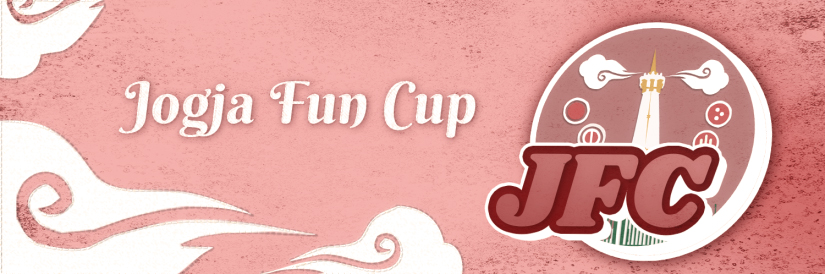

---
tags:
  - JFC
  - Jogja Fun Cup 2024
---

# Jogja Fun Cup

The **Jogja Fun Cup** (***JFC***) is a double-elimination 2v2 osu! tournament hosted by ::{ flag=ID }:: [ZStreak](https://osu.ppy.sh/users/2754434) and ::{ flag=ID }:: [centrux](https://osu.ppy.sh/users/5426769) of the [osu! Region Ngayogyakarta](https://instagram.com/oren_jogja) community in collaboration with the doujin circle [LUMINOZ](https://luminoz.bandcamp.com/). The tournament is open to teams of Indonesian players with a global rank of #1,000 or lower. It is the first instalment of the Jogja Fun Cup.

## Tournament schedule

| Event | Timestamp |
| --: | :-- |
| Registration phase | 2024-06-18/2024-06-30 |
| Qualifiers | 2024-07-01/2024-07-07 |
| Round of 16 | 2024-07-08/2024-07-14 |
| Quarterfinals | 2024-07-15/2024-07-21 |
| Semifinals | 2024-07-22/2024-07-28 |
| Finals (week 1) | 2024-07-29/2024-08-04 |
| Finals (week 2) | 2024-08-05/2024-08-11 |

## Prizes

| Placing | Prize(s) |
| :-: | :-- |
|  | €150.00 (courtesy of ::{ flag=NL }:: [Miya the turtle](https://osu.ppy.sh/users/13032176)), 1 month of osu!supporter for each team member, exclusive [LUMINOZ](https://luminoz.bandcamp.com/) goodie pack, custom-made profile banner |
|  | Exclusive [LUMINOZ](https://luminoz.bandcamp.com/) goodie pack, custom-made profile banner |
|  | Custom-made profile banner |

## Organisation

The Jogja Fun Cup is run by various osu! community members from Indonesia and beyond.

| Position | Member(s) |
| :-- | :-- |
| Host | ::{ flag=ID }:: [ZStreak](https://osu.ppy.sh/users/2754434), ::{ flag=ID }:: [centrux](https://osu.ppy.sh/users/5426769) |
| Mappool selector | ::{ flag=ID }:: [ZStreak](https://osu.ppy.sh/users/2754434), ::{ flag=ID }:: [Seox](https://osu.ppy.sh/users/3793938), ::{ flag=ID }:: [Ascaveth](https://osu.ppy.sh/users/3245206), ::{ flag=ID }:: [StayMusical](https://osu.ppy.sh/users/12688176), ::{ flag=US }:: [Lifan Li](https://osu.ppy.sh/users/4050359) |
| Playtester | *to be announced* |
| Streamer | ::{ flag=ID }:: [Seox](https://osu.ppy.sh/users/3793938) |
| Commentator | ::{ flag=ID }:: [ZStreak](https://osu.ppy.sh/users/2754434), ::{ flag=ID }:: [Seox](https://osu.ppy.sh/users/3793938),::{ flag=ID }:: [MejiroMcQueen](https://osu.ppy.sh/users/11320627), ::{ flag=ID }:: [DAMB-](https://osu.ppy.sh/users/14748550), ::{ flag=ID }:: [BlankTap](https://osu.ppy.sh/users/10137131) |
| Referee | ::{ flag=ID }:: [ZStreak](https://osu.ppy.sh/users/2754434), ::{ flag=ID }:: [dhimas arya](https://osu.ppy.sh/users/7108145), ::{ flag=ID }:: [BeefyNoragami](https://osu.ppy.sh/users/11065629), ::{ flag=NL }:: [Miya the turtle](https://osu.ppy.sh/users/13032176) |
| Graphic designer | ::{ flag=ID }:: [hikimaruy](https://osu.ppy.sh/users/9510067) |
| Spreadsheet manager | ::{ flag=HK }:: [ShadeCegLgMn](https://osu.ppy.sh/users/12609866) |
| Wiki editor | ::{ flag=ID }:: [Niva](https://osu.ppy.sh/users/197805) |

## Links

- **[Master spreadsheet](https://docs.google.com/spreadsheets/d/1hdu0eQKPnA-9y48VV-PWSMDpSDm-Y1e69PoguFraYeE/edit?gid=287204203#gid=287204203)**
- [Forum thread](https://osu.ppy.sh/community/forums/topics/1936900?n=1)
- [Discord server](https://discord.com/invite/kQuJAEbnXe)
- [Livestream channel](https://www.twitch.tv/osuindonesia)

## Participants

*This list is tentative as of June 27, 2024.*

| Team name | Members |
| :-: | :-- |
| apa | ::{ flag=ID }:: **[-TwiHD](https://osu.ppy.sh/users/5470299)**, ::{ flag=ID }:: [Celine](https://osu.ppy.sh/users/7348744), ::{ flag=ID }:: [araran](https://osu.ppy.sh/users/8937198) |
| Bakpia Kukus | ::{ flag=ID }:: **[beabadobee](https://osu.ppy.sh/users/8688737)**, ::{ flag=ID }:: [Suikami](https://osu.ppy.sh/users/1929336), ::{ flag=ID }:: [BlankTap](https://osu.ppy.sh/users/10137131) |
| BAKPIA KUKUS KILLER | ::{ flag=ID }:: **[MejiroMcQueen](https://osu.ppy.sh/users/11320627)**, ::{ flag=ID }:: [FAW](https://osu.ppy.sh/users/11070577), ::{ flag=ID }:: [ThatNOOBGuy](https://osu.ppy.sh/users/11091594) |
| Ban HR2 | ::{ flag=ID }:: **[ruruichi](https://osu.ppy.sh/users/6717559)**, ::{ flag=ID }:: [moyamoyano\_sa](https://osu.ppy.sh/users/3891439), ::{ flag=ID }:: [Azasapag](https://osu.ppy.sh/users/18347666) |
| daan mogot | ::{ flag=ID }:: **[Sunohara Kokona](https://osu.ppy.sh/users/11421465)**, ::{ flag=ID }:: [Zavier](https://osu.ppy.sh/users/11379592), ::{ flag=ID }:: [Zankur](https://osu.ppy.sh/users/16249373) |
| Duo Ambatron | ::{ flag=ID }:: **[bramasetio](https://osu.ppy.sh/users/34354002)**, ::{ flag=ID }:: [tempegapakenasi](https://osu.ppy.sh/users/34079628) |
| Hina Dutro | ::{ flag=ID }:: **[Mipol](https://osu.ppy.sh/users/10954080)**, ::{ flag=ID }:: [Zevonik](https://osu.ppy.sh/users/11753540), ::{ flag=ID }:: [RAKAMILKITA](https://osu.ppy.sh/users/18405313) |
| Kagamarcchino ﾃﾞﾗｸｽ | ::{ flag=ID }:: **[Xicyte](https://osu.ppy.sh/users/10212581)**, ::{ flag=ID }:: [Zoont](https://osu.ppy.sh/users/7109269), ::{ flag=ID }:: [Anphans](https://osu.ppy.sh/users/14231431) |
| Mie Ayam Afui | ::{ flag=ID }:: **[-Blue21-](https://osu.ppy.sh/users/12517079)**, ::{ flag=ID }:: [mkoean-](https://osu.ppy.sh/users/11847189), ::{ flag=ID }:: [retot](https://osu.ppy.sh/users/17996877) |
| Nasi Kuning Pakai Kecap | ::{ flag=ID }:: **[Sirius Symboli](https://osu.ppy.sh/users/11025519)**, ::{ flag=ID }:: [Somay 287](https://osu.ppy.sh/users/4314559), ::{ flag=ID }:: [Zonii](https://osu.ppy.sh/users/6596134) |
| reto pengkhianat | ::{ flag=ID }:: **[Mashima Himeko](https://osu.ppy.sh/users/10474988)**, ::{ flag=ID }:: [FishStar](https://osu.ppy.sh/users/12563284), ::{ flag=ID }:: [laks](https://osu.ppy.sh/users/9519657) |
| Santoso | ::{ flag=ID }:: **[JSpiriT](https://osu.ppy.sh/users/16804164)**, ::{ flag=ID }:: [NaFish](https://osu.ppy.sh/users/9974314), ::{ flag=ID }:: [malvon](https://osu.ppy.sh/users/11113661) |
| Suikambing | ::{ flag=ID }:: **[fnayR](https://osu.ppy.sh/users/2800253)**, ::{ flag=ID }:: [DeathHydra](https://osu.ppy.sh/users/7457788), ::{ flag=ID }:: [Walfrid](https://osu.ppy.sh/users/6600809) |
| Tahu Sumedang | ::{ flag=ID }:: **[lucidators](https://osu.ppy.sh/users/10154981)**, ::{ flag=ID }:: [controlledHive](https://osu.ppy.sh/users/11182595), ::{ flag=ID }:: [Mank](https://osu.ppy.sh/users/18263974) |
| YJJA | ::{ flag=ID }:: **[Xenoid](https://osu.ppy.sh/users/26993756)**, ::{ flag=ID }:: [kairazhel](https://osu.ppy.sh/users/32835998), ::{ flag=ID }:: [GranXso](https://osu.ppy.sh/users/32189812) |

## Ruleset

### General rules

1. All match lobbies across the tournament will adhere to the following room settings:
   - Team Mode: `Team VS` (2v2)
   - Win Condition: [`ScoreV2`](/wiki/Gameplay/Score#scorev2)
2. The mappools for each round will be announced by the tournament management in advance before the actual matches take place.
3. Match schedules will be predetermined by the tournament management. If there are any teams who are unable to attend the current schedule for any reason, all other affected teams may apply and settle for a reschedule at the `#reschedule` channel in the tournament's Discord server.
4. A referee will create a multiplayer room 10 minutes in advance and will start to send out invites.
5. If a team does not show up or is unable to field in a sizeable 2v2 roster within **10 minutes** of the start time, their opponent wins by default.
6. If no staff or referee is available, the match will be postponed.
7. **No Fail will be enforced in all beatmaps.** This is to ensure that the points are to be awarded more fairly towards teams who perform better in general during the course of the beatmap regardless of their remaining health at the end.
8. If a player disconnects, it will be treated as if they had failed the beatmap.
   - A beatmap can be replayed for disconnects that occur within a few seconds after it has been started by the referee.
9. Lag is not a valid reason to nullify a beatmap.
10. If any problems during the match occur, the tournament management will make a decision based on the referee's report.
11. It is expected that all players be polite and respectful to each other. Penalties will be given upon violation.
    - If a player is found to be engaging in an act that is deemed to be distasteful or provocative, the corresponding player or their team may be disqualified right away from the tournament and/or blacklisted from future iterations of the tournament by the tournament management.
    - Usage of any tools or programs that are against the [osu! community rules](/wiki/Rules#community-rules) is strictly prohibited and will be straight up reported to the osu! team at will.

### Tournament registration

1. In order to participate, players are required to form a team of 2–3 players and register into the tournament as a team through [this form](https://forms.gle/Pyf4VE5LcfY5FSb76).
2. Each team has to submit a designated team captain and a team name to the tournament management before the end of the screening phase.
   - Team names may not violate the [osu! community rules](/wiki/Rules#community-rules).
3. To ensure that all incoming registrations are serious and valid, every registered player will be checked in detail by the tournament management.
4. The list of players and teams who are deemed to be eligible to compete in the tournament will be published by the tournament management after the registration phase has ended.
5. Testplayers, referees, and mappool selectors may not participate as players in this tournament.

### Round-specific rules

#### Qualifier rules

1. Each team will have to sign up to one of the Qualifier lobbies that have been scheduled and prepared by the tournament management in advance.
2. In the lobby, all teams will have to consecutively play all of the eight Qualifier beatmaps in the order of NM1 -> NM2 -> HD1 -> HD2 -> HR1 -> HR2 -> DT1 -> DT2.
3. Teams **are not allowed** to ban any beatmaps in the Qualifiers.
4. Teams **are not allowed** to join (or register for) more than one Qualifier lobby.
5. Based on their performance in the Qualifier, teams will be ranked based on their average rank combined from each individual Qualifier beatmaps.
6. 16 teams with the **highest average rank** according to the above criteria will advance to the knock-out stages.
   - If there are two (or more) teams that share the same average rank, the teams will be ordered based on their average score across all eight Qualifier beatmaps.
7. Failure to attend in any of the predetermined Qualifier lobbies will result in an instant elimination from the tournament.

#### Knock-out stage rules

1. The 16 teams who got through from the Qualifiers will be matched against each other based on their Qualifier seeding (e.g. Seed #1 vs. Seed #16, Seed #2 vs. Seed #15, and so on).
2. Teams will compete against each other using the double-elimination system.
3. The double-elimination system works as follows:
   - Teams who lose in the upper bracket can still play again in the lower bracket.
   - Teams who lose in the lower bracket will be eliminated from the tournament.
   - In the Grand Final, the winner of the the upper bracket will only need to win a single match in order to claim the championship title. The winner of the lower bracket, however, will need to win two matches and enforce a *bracket reset* in order to clinch the championship title.
4. Teams who can compete in the next round are determined by:
   - In the Round of 16, each team needs to win 5 points in order to win a match. (Best of 9)
   - In the Quarterfinals and the Semifinals, each team needs to win 6 points in order to win a match. (Best of 11)
   - In both of the Finals weeks, each team needs to win 7 points in order to win a match. (Best of 13)
   - Whether there are teams who are declared to win the match by default.
   - Whether there are teams who are disqualified from the tournament.

### Match regulations

1. Prior to starting the match, representatives from each team must run the `!roll` command in order to determine the banning and picking order.
   - The winner of the `!roll` gets to determine who gets the first pick and the second ban.
   - The loser of the `!roll` gets the opposite by default.
   - This rule does not apply in the Qualifier lobbies.
2. Each team has to ban **one beatmap** (on the Round of 16) or **two beatmaps** (from the Quarterfinals onwards) from the corresponding mappool. These beatmaps will not be allowed to be picked by any team during the entire match.
   - Each team **may not ban two beatmaps from the same mod pool**.
   - The tiebreaker map is not allowed to be banned.
3. Barring the No Mod pool, each team **may not pick beatmaps from the same mod pool consecutively**.
4. Each team will be given a chance to pick **one warm-up beatmap** (up to 4 minutes max) to be played in the lobby before the match.
   - Playing a warm-up beatmap is not mandatory, and teams may elect to skip their warm-up pick should they wish to.
5. In a Free Mod pick, each player has to apply at least one mod to play the beatmap with. Allowed mods are Easy, Hard Rock, Hidden, or any possible combinations of the three mods.
   - Each player will have to pick a mod or mod combination that is different to their own teammate's pick. **Playing a Free Mod pick without any mods applied is not allowed.**
   - Players opting to play with Easy will have their scores multiplied by `x1.7` up to a maximum of 850,000 points.
6. In the case of a tiebreaker, the tiebreaker map will be played with the Free Mod option enabled. Players are free to play the tiebreaker map with Hidden, Hard Rock, or Hidden + Hard Rock should they wish to.
   - Playing the tiebreaker map with a mod is *not* mandatory.
7. The results of each match and any other relevant information regarding the match will be noted by the referee after the match has been concluded.
