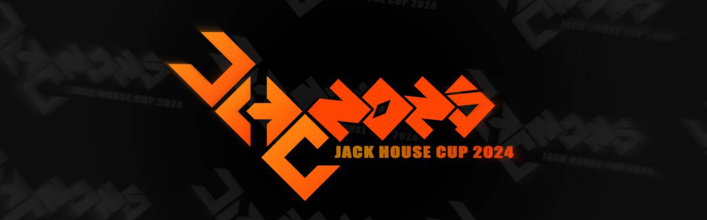

---
tags:
  - JHC
  - JHC24
  - JHC 24
  - JHC2024
  - JHC 2024
---

# JHC 2024

The **JHC 2024** (***Jack House Cup 2024***) was a team–based osu!mania 4K tournament hosted by ::{ flag=CN }:: [Blue_Potion](https://osu.ppy.sh/users/13094831) and ::{ flag=CN }:: [\[GB\]GanyuAngel](https://osu.ppy.sh/users/27233308). It was the first instalment of the Jack House Cup.

## Tournament schedule

| Event | Timestamp |
| --: | :-- |
| Registration phase | 2023-11-26/2024-01-06 |
| Qualifier showcase | 2024-01-13 |
| Qualifier stage | 2024-01-20/2024-01-21 |
| Round of 32 | 2024-01-27/2024-02-04 |
| Round of 16 | 2024-02-10/2024-02-11 |
| Quarterfinals | 2024-02-17/2024-02-18 |
| Semifinals | 2024-02-24/2024-02-25 |
| Finals | 2024-03-02/2024-03-03 |
| Grand Finals | 2024-03-09/2024-03-10 |

## Prizes

For solo teams, the prize of osu!supporter was doubled.

| Placing | Prizes |
| :-: | :-- |
|  | 6 months of osu!supporter, profile badge |
|  | 4 months of osu!supporter |
|  | 3 months of osu!supporter |
| #4 – #6 | 2 months of osu!supporter |
| #7 – #12 | 1 month of osu!supporter |

## Organisation

| Position | Member(s) |
| :-- | :-- |
| Host | ::{ flag=CN }:: [Blue_Potion](https://osu.ppy.sh/users/13094831), ::{ flag=CN }:: [\[GB\]GanyuAngel](https://osu.ppy.sh/users/27233308) |
| Mappool selector | ::{ flag=CN }:: [Blue_Potion](https://osu.ppy.sh/users/13094831), ::{ flag=CN }:: [ieFaH](https://osu.ppy.sh/users/24243177), ::{ flag=CN }:: [yks1](https://osu.ppy.sh/users/26030234) |
| Mappool helper | ::{ flag=CN }:: [\[Crz\]Leaves\_](https://osu.ppy.sh/users/9644708), ::{ flag=CN }:: [\[GB\]GanyuAngel](https://osu.ppy.sh/users/27233308), ::{ flag=CN }:: [\[GB\]nyasun](https://osu.ppy.sh/users/16277321), ::{ flag=CN }:: [\[GB\]sherweifa](https://osu.ppy.sh/users/17457562), ::{ flag=CN }:: [\[GB\]Tyris](https://osu.ppy.sh/users/10497659), ::{ flag=CN }:: [\[GB\]V1do](https://osu.ppy.sh/users/17527968), ::{ flag=CN }:: [\[Paw\]doudou0310](https://osu.ppy.sh/users/13478805), ::{ flag=CN }:: [\[Paw\]Komane\_63](https://osu.ppy.sh/users/7143444), ::{ flag=CN }:: [CaptainLan](https://osu.ppy.sh/users/18483399), ::{ flag=CN }:: [CH3OHM](https://osu.ppy.sh/users/14066511), ::{ flag=CN }:: [crazyrenard](https://osu.ppy.sh/users/30325323), ::{ flag=CN }:: [Dreamemory](https://osu.ppy.sh/users/35406589), ::{ flag=CN }:: [Glorionoly](https://osu.ppy.sh/users/8957029), ::{ flag=CN }:: [Idkwto](https://osu.ppy.sh/users/32379983), ::{ flag=CN }:: [Suirent](https://osu.ppy.sh/users/10687430), ::{ flag=CN }:: [To2](https://osu.ppy.sh/users/26683857), ::{ flag=CN }:: [Ycloki](https://osu.ppy.sh/users/10861624), ::{ flag=CN }:: [YuEast 2018](https://osu.ppy.sh/users/13953619), ::{ flag=CN }:: [yzmengx](https://osu.ppy.sh/users/17721427) |
| Referee | ::{ flag=CN }:: [\[GB\]ChickenGold](https://osu.ppy.sh/users/16586663), ::{ flag=CN }:: [\[GB\]GanyuAngel](https://osu.ppy.sh/users/27233308), ::{ flag=CN }:: [\[GB\]Mafufu](https://osu.ppy.sh/users/10884561), ::{ flag=CN }:: [\[GB\]R\-Trigger](https://osu.ppy.sh/users/25308131), ::{ flag=CN }:: [\[GB\]Rush\_FTK](https://osu.ppy.sh/users/3046856), ::{ flag=CN }:: [\[GB\]sherweifa](https://osu.ppy.sh/users/17457562), ::{ flag=US }:: [akace100](https://osu.ppy.sh/users/9308128), ::{ flag=CN }:: [Blue\_Potion](https://osu.ppy.sh/users/13094831), ::{ flag=CN }:: [cdwcgt](https://osu.ppy.sh/users/14721101), ::{ flag=PE }:: [ERA Xuste](https://osu.ppy.sh/users/17989444), ::{ flag=CN }:: [TianRS](https://osu.ppy.sh/users/23929228), ::{ flag=CN }:: [yks1](https://osu.ppy.sh/users/26030234), ::{ flag=CN }:: [YuEast 2018](https://osu.ppy.sh/users/13953619) |
| Commentator | ::{ flag=CN }:: [\[Crz\]Leaves\_](https://osu.ppy.sh/users/9644708), ::{ flag=CN }:: [\[GB\]ChickenGold](https://osu.ppy.sh/users/16586663), ::{ flag=CN }:: [\[GB\]Rush_FTK](https://osu.ppy.sh/users/3046856), ::{ flag=CN }:: [\[GB\]Tyris](https://osu.ppy.sh/users/10497659), ::{ flag=CN }:: [Blue_Potion](https://osu.ppy.sh/users/13094831), ::{ flag=CN }:: [cdwcgt](https://osu.ppy.sh/users/14721101), ::{ flag=CN }:: [MGU1](https://osu.ppy.sh/users/27192847), ::{ flag=CN }:: [Ycloki](https://osu.ppy.sh/users/10861624) |
| Streamer | ::{ flag=CN }:: [\[GB\]ChickenGold](https://osu.ppy.sh/users/16586663), ::{ flag=CN }:: [\[GB\]Rush_FTK](https://osu.ppy.sh/users/3046856), ::{ flag=CN }:: [\[GB\]Tyris](https://osu.ppy.sh/users/10497659), ::{ flag=CN }:: [Blue_Potion](https://osu.ppy.sh/users/13094831), ::{ flag=CN }:: [cdwcgt](https://osu.ppy.sh/users/14721101) |
| Statistician & wiki editor | ::{ flag=CN }:: [\[GB\]GanyuAngel](https://osu.ppy.sh/users/27233308), ::{ flag=CN }:: [\[GB\]Rush_FTK](https://osu.ppy.sh/users/3046856), ::{ flag=CN }:: [Blue_Potion](https://osu.ppy.sh/users/13094831), ::{ flag=CN }:: [cdwcgt](https://osu.ppy.sh/users/14721101), ::{ flag=CN }:: [YuEast 2018](https://osu.ppy.sh/users/13953619) |
| Designer | ::{ flag=CN }:: [AZSDSC](https://osu.ppy.sh/users/17895656) |

## Links

- [Discussion thread](https://osu.ppy.sh/community/forums/topics/1827578)
- [Livestream](https://live.bilibili.com/10100307)
- [Challonge bracket](https://challonge.com/ehi7s3y0)
- [QQ group](https://qm.qq.com/cgi-bin/qm/qr?_wv=1027&k=pRNiqDnTUmLKQgy8iy2LnLx3uTYIL0dG)
- [Discord server](https://discord.gg/DqPuRU8Bhc)
- [Information spreadsheet](https://docs.google.com/spreadsheets/d/1Qm2BfIc2LFbf59-2RBkqnOde95y2WgoyO_XRNSrvNa4/)

## Participants

|  | Team Name | Member(s) |
| :-: | :-: | :-- |
| 1 | 1 Man Army | [LegendofLink](https://osu.ppy.sh/users/18423304), [Shinrisha](https://osu.ppy.sh/users/12173637) |
| 2 | 2007 Toyota Camry | [\-slink\-](https://osu.ppy.sh/users/13155680) |
| 3 | adalah alat tempur mutakhir dari korea | [nyawaa](https://osu.ppy.sh/users/10235085), [Lenny\_cL](https://osu.ppy.sh/users/12793583) |
| 4 | AdrianLazer | [AdrianLazer](https://osu.ppy.sh/users/10292643) |
| 5 | alone jacker | [hel0l](https://osu.ppy.sh/users/28554005) |
| 6 | Amogus enjoyers | [CrewposerAlusET](https://osu.ppy.sh/users/14700283), [thuypb2009](https://osu.ppy.sh/users/24291557) |
| 7 | ANTI YAPPERS | [Maijeraor](https://osu.ppy.sh/users/31003592) |
| 8 | Antijacker | [\[Crz\]Xinyi2016](https://osu.ppy.sh/users/14213841) |
| 9 | aomdco | [AomDCO](https://osu.ppy.sh/users/21072569) |
| 10 | AwakeGiant | [Catcay12334](https://osu.ppy.sh/users/27308730), [jjjwiwi](https://osu.ppy.sh/users/30184594) |
| 11 | Bert | [Iobyagmi](https://osu.ppy.sh/users/17905269) |
| 12 | break is 143bpm | [astal\_](https://osu.ppy.sh/users/32151196), [YoungBurger16](https://osu.ppy.sh/users/33833222) |
| 13 | Buckbuck Monke | [Halkas](https://osu.ppy.sh/users/29373725) |
| 14 | Chika Fujiwara Simp | [trooperr](https://osu.ppy.sh/users/32028459) |
| 15 | choke gang | [Tosai\_](https://osu.ppy.sh/users/3760209), [JayLye](https://osu.ppy.sh/users/14892447) |
| 16 | choke99 | [yoth99](https://osu.ppy.sh/users/15727775) |
| 17 | ETA | [ime](https://osu.ppy.sh/users/11649450), [Truzko](https://osu.ppy.sh/users/9921804) |
| 18 | fastest crashers | [Rand0mwastaken](https://osu.ppy.sh/users/24449678), [RyanWong1216](https://osu.ppy.sh/users/19030562) |
| 19 | FurryLover | [kissnolook](https://osu.ppy.sh/users/11608591), [loki96k](https://osu.ppy.sh/users/22933961) |
| 20 | GangWonDuo | [Selitation](https://osu.ppy.sh/users/25311011), [ggeexx1](https://osu.ppy.sh/users/17494164) |
| 21 | garfield exterminators if fortnite | [Znow](https://osu.ppy.sh/users/15513303), [\[LS\]Mari](https://osu.ppy.sh/users/15270411) |
| 22 | Handstream>Jack | [Lotex09](https://osu.ppy.sh/users/14114899), [antip0is0n](https://osu.ppy.sh/users/8576168) |
| 23 | hawk | [Hawkfrost](https://osu.ppy.sh/users/15555328), [\[Paw\]Fish\_wood](https://osu.ppy.sh/users/31185655) |
| 24 | Hop on Lethal Company | [paws at u](https://osu.ppy.sh/users/15608573) |
| 25 | hop on quaver | [\-\-Dragon\-\-](https://osu.ppy.sh/users/11924624), [Reihynn](https://osu.ppy.sh/users/16630515) |
| 26 | hsod | [hsod](https://osu.ppy.sh/users/15391485) |
| 27 | HTBL achang | [dzq](https://osu.ppy.sh/users/23697335) |
| 28 | I don't have teammate \:sob\: | [EliasGoku\_zk](https://osu.ppy.sh/users/24907290) |
| 29 | I\_Cant\_Jack\_150 | [LVkinght](https://osu.ppy.sh/users/25654619) |
| 30 | Idk help i suck | [Gametytnt](https://osu.ppy.sh/users/26646928) |
| 31 | index.html | [ERA Xuste](https://osu.ppy.sh/users/17989444) |
| 32 | Jack hater unite | [Datnonameboi](https://osu.ppy.sh/users/14217761) |
| 33 | Jack Hunter | [Raon2007](https://osu.ppy.sh/users/25850141), [Reflec](https://osu.ppy.sh/users/19255377) |
| 34 | kiopm | [\[LS\]Nemesis](https://osu.ppy.sh/users/20544648) |
| 35 | lsjx追逐梦想 | [endterminal](https://osu.ppy.sh/users/20992774), [ohhhhhhhhhh](https://osu.ppy.sh/users/29591499) |
| 36 | M | [minhhuyosuer](https://osu.ppy.sh/users/19626270) |
| 37 | meow :3 | [\[HD\]tapgame](https://osu.ppy.sh/users/20094344) |
| 38 | MyonMyon零轮游 | [NaOHshenhuoFzzT](https://osu.ppy.sh/users/27074502) |
| 39 | OBLIKULIVO | [MiniEgg\_23](https://osu.ppy.sh/users/25914360), [Abyss 0](https://osu.ppy.sh/users/24780565) |
| 40 | onurun annesi | [Heumrage](https://osu.ppy.sh/users/19664675) |
| 41 | OsuBadPlayEtterna | [\_jpg](https://osu.ppy.sh/users/17300655) |
| 42 | ovo | [Amisher](https://osu.ppy.sh/users/21400407), [ovo\_seshirira](https://osu.ppy.sh/users/32825526) |
| 43 | Polygon | [Achino](https://osu.ppy.sh/users/13349388), [yuukituk](https://osu.ppy.sh/users/11998955) |
| 44 | Pookie Bears | [\[KC\]CruB](https://osu.ppy.sh/users/22708257), [ComboCatt](https://osu.ppy.sh/users/29968719) |
| 45 | SESBIAN LEX | [Unitori\-](https://osu.ppy.sh/users/15772814), [Rxizuna](https://osu.ppy.sh/users/16055641) |
| 46 | Shangus | [lianic](https://osu.ppy.sh/users/13975661) |
| 47 | soloist | [Shirobi](https://osu.ppy.sh/users/18804586) |
| 48 | SV Player | [\[Crz\]yomogi237](https://osu.ppy.sh/users/28571440) |
| 49 | Team White Dress | [lonelyxvi](https://osu.ppy.sh/users/24133264) |
| 50 | Techno Music | [neeko the rock](https://osu.ppy.sh/users/13471840) |
| 51 | THE TROLLERS | [Takedown05](https://osu.ppy.sh/users/18060303), [\[GE\] Arthur](https://osu.ppy.sh/users/24122055) |
| 52 | THE TRUTH OF NOCENT | [ERA Veryi](https://osu.ppy.sh/users/13878539), [\[Crz\]Nickname](https://osu.ppy.sh/users/10817494) |
| 53 | We can't late game | [SHOKO \-](https://osu.ppy.sh/users/10279743), [MatchaLatte\-](https://osu.ppy.sh/users/15944956) |
| 54 | We can't mid game | [\- Rinmoz \-](https://osu.ppy.sh/users/16639144), [Freshky](https://osu.ppy.sh/users/11959687) |
| 55 | wehehe | [Eliminate](https://osu.ppy.sh/users/9169747), [myucchii](https://osu.ppy.sh/users/10072733) |
| 56 | ♿🍔♿🀄♿ | [\[GB\]Burger king](https://osu.ppy.sh/users/9841162), [MidRed](https://osu.ppy.sh/users/17641994) |
| 57 | まひろ隊 | [tianzitanhua](https://osu.ppy.sh/users/32196635) |
| 58 | 不喜欢打叠 | [GinaFujino](https://osu.ppy.sh/users/25864079), [XeOF4](https://osu.ppy.sh/users/22692196) |
| 59 | 原核生物队 | [Infinityyyyyyyy](https://osu.ppy.sh/users/26233818) |
| 60 | 取队伍名称好难 | [\[GB\]Lingyu](https://osu.ppy.sh/users/29743849), [Takoke](https://osu.ppy.sh/users/11628037) |
| 61 | 大天空killers | [\[Crz\]Yurucawaii](https://osu.ppy.sh/users/25682415), [\[Crz\]bubu](https://osu.ppy.sh/users/28251667) |
| 62 | 帝者战神白武男 | [\_Glass\_](https://osu.ppy.sh/users/21239735) |
| 63 | 影流之主 | [\[GB\]QAQlingjiu](https://osu.ppy.sh/users/27288518) |
| 64 | 快手极速版 | [Na2He](https://osu.ppy.sh/users/20298842), [Az-Q](https://osu.ppy.sh/users/32613475) |
| 65 | 憋笑 | [chino3310](https://osu.ppy.sh/users/16626292), [\-Thirteen\-](https://osu.ppy.sh/users/34241263) |
| 66 | 我先睡了队 | [WELUVMYUKA](https://osu.ppy.sh/users/29949157), [chana](https://osu.ppy.sh/users/18375016) |
| 67 | 打胶队 | [qiaolilailai](https://osu.ppy.sh/users/13809991), [\-\-achang\-\-](https://osu.ppy.sh/users/31485150) |
| 68 | 海陆 | [CaptainLan](https://osu.ppy.sh/users/18483399) |
| 69 | 痛恨叠键 | [sarc6o9](https://osu.ppy.sh/users/23135250) |
| 70 | 白 | [Lonann](https://osu.ppy.sh/users/14617751) |
| 71 | 绝不认输 | [Styrene](https://osu.ppy.sh/users/16998777) |
| 72 | 👍 | [TheOPmeme](https://osu.ppy.sh/users/15763622) |

## Podium

| Rank | Team |
| :-: | :-- |
|  | wehehe |
|  | GangWonDuo |
|  | hsod |
| #4 – #6 | garfield exterminators if fortnite, hawk, SV Player |
| #7 – #12 | Shangus, 👍, ETA, THE TRUTH OF NOCENT, 原核生物队, 大天空killers |

## Mappools

### Grand Finals

[Download the mappack here! (282 MB)](https://drive.google.com/file/d/1ALGhSIzcqcQA-VEQheKu6ww4PMHNrD8p/view?usp=sharing)

- Full Jack
  1. [katagiri - STRONG 280 (\[LS\]chilling) \[\[4K\] Challenge (Isxl)\]](https://osu.ppy.sh/beatmapsets/2004781#mania/4169243)
  2. [FFFanwen - East Shenzhen (ieFaH) \[\[4K\] Busy City 0.95x\]](https://osu.ppy.sh/beatmapsets/2080087#mania/4510738)
- Dense Chordjack
  1. [Yooh vs. siromaru - Antagonism (Jhown) \[\[4K\] Obliterate\]](https://osu.ppy.sh/beatmapsets/1722943#mania/3521326)
  2. [Block B - HER (Ena) \[\[4K\] x\_x\]](https://osu.ppy.sh/beatmapsets/1851582#mania/3804409)
- Middle Chordjack
  1. [ZUN arr. Komso - Eternal Spring Dream (Hylotl) \[\[4K\] 123123123 \[1.1x Rate\]\]](https://osu.ppy.sh/beatmapsets/1996575#mania/4149521)
  2. [Dragonforce - Symphony of the Night (Cut Ver.) (LiMerenDx) \[\[4K\] DragonJack\]](https://osu.ppy.sh/beatmapsets/2143608#mania/4512869)
- Light Chordjack
  1. [Itaojirou - Tze-Chiang (\[GB\]nyasun) \[\[4K\] \[\#22J\]14\]](https://osu.ppy.sh/beatmapsets/2106870#mania/4421123)
  2. [ayaponzu\* - Super Nuko Ni Naritai (YuEast 2018) \[\[4K\] Super Jeck Ni Naritai\]](https://osu.ppy.sh/beatmapsets/1774715#mania/3634309)
- Anchor Jack
  1. [PINOCCHIOP feat. Kagamine Rin \& Hatsune Miku - Nee Nee Nee. (LaoXiao-) \[\[4K\] Hey Hey Hey @Jack x1.15\]](https://osu.ppy.sh/beatmapsets/1552231#mania/3171777)
  2. [Ganeme - See you again... (To2) \[\[4K\] Retrospect x1.05\_P\]](https://osu.ppy.sh/beatmapsets/1884119#mania/3879256)
- Difficult Jack
  1. [Camellia - Looking for Edge of Ground (ieFaH) \[\[4K\] Exploring in the Infinite World\]](https://osu.ppy.sh/beatmapsets/2143204#mania/4511881)
- Quadstream
  1. [fether - Piano Concerto No. 1 "Scorpion Fire" (Nandemo Suikomu Pink Iro no Tameno) (yks1) \[\[4K\] Devour 205\]](https://osu.ppy.sh/beatmapsets/2144954#mania/4517823)
- Minijack
  1. [Camellia - ANOMALY (To2) \[\[4K\] MAL"FUNCT!ON" x1.1\_P\]](https://osu.ppy.sh/beatmapsets/2138131#mania/4499788)
- Rhythm Jack
  1. [Shiron - iNSPiRED (yks1) \[\[4K\] LEiTFADEN\]](https://osu.ppy.sh/beatmapsets/2144953#mania/4517821)
- Tiebreaker
  1. **[Yooh - RPG (\[GB\]Tyris) \[\[4K\] -Disguise//Impersonation//Procrypsis-\]](https://osu.ppy.sh/beatmapsets/2144958#mania/4517829)**

### Finals

[Download the mappack here! (249 MB)](https://drive.google.com/file/d/1-2K0EV7yWMFOEy0VMDUgb-_XMKxZqkY7/view?usp=sharing)

- Full Jack
  1. [Yooh - Maou (Yooh Remix) \[\[4K\] Doomsday x1.05\_P\]](https://osu.ppy.sh/beatmapsets/2141619#mania/4507644)
  2. [Kyarypamyupamyu - Candy Candy (\[Szy\]MongolCJ) \[\[4K\] \^\^ 1.15x\]](https://osu.ppy.sh/beatmapsets/1765697#mania/3614272)
- Dense Chordjack
  1. [uma feat. Mashiro - take me to the moon (Hylotl) \[\[4K\] Lv.32 \[1.05x Rate\]\]](https://osu.ppy.sh/beatmapsets/2141825#mania/4508096)
  2. [Housei Satoh - Ultraviolet (yks1) \[\[4K\] MURASAKI (158bpm)\]](https://osu.ppy.sh/beatmapsets/2141316#mania/4507001)
- Middle Chordjack
  1. [LV.4 - Burning Star (\[GB\]nyasun) \[\[4K\] Combustion\]](https://osu.ppy.sh/beatmapsets/2103169#mania/4412772)
  2. [Camellia - The Night Is On Fire (To2) \[\[4K\] rughss's NSV flame\]](https://osu.ppy.sh/beatmapsets/2141323#mania/4507029)
- Light Chordjack
  1. [Camellia - D'endrrah (\[GB\]Tyris) \[\[4K\] Jack Apocalypse (cut)\]](https://osu.ppy.sh/beatmapsets/2129359#mania/4477550)
  2. [Foreground Eclipse - Last Liar Standing (YuEast 2018) \[\[4K\] Usotsuki x1.15\]](https://osu.ppy.sh/beatmapsets/1544122#mania/3156174)
- Anchor Jack
  1. [Camellia - GHOST-NOVA \[\[4K\] THE NIGHT MIGHT BE CRAZY x1.15\_P\]](https://osu.ppy.sh/beatmapsets/1904585#mania/3927149)
  2. [Lee Jung-hyun - Moon ah Moon (Ycloki) \[\[4K\] Lunar Anchor \[150 edit\]\]](https://osu.ppy.sh/beatmapsets/2141353#mania/4507084)
- Quadstream
  1. [ShinRa-Bansho - Shiga Futari omu Subumade (ieFaH) \[\[4K\] Till Death 1.05x\]](https://osu.ppy.sh/beatmapsets/2140566#mania/4505184)
- Minijack
  1. [CHARAN-PO-RANTAN - Anoko no Jinta(TAROLIN Remix) (YuEast 2018) \[\[4K\] x1.05\]](https://osu.ppy.sh/beatmapsets/2141670#mania/4507926)
- Rhythm Jack
  1. [Juggernaut. - Godslain (\[GB\]Tyris) \[\[4K\] Legendary x1.1\]](https://osu.ppy.sh/beatmapsets/2140634#mania/4505399)
- Tiebreaker
  1. **[Kobaryo feat. HiTNEX-X - SUPER MEMORIES (Ycloki) \[\[4K\] M3M0RY : R3C0N5TRUCTi0N\]](https://osu.ppy.sh/beatmapsets/2141351#mania/4507082)**

### Semifinals

[Download the mappack here! (201 MB)](https://drive.google.com/file/d/1Ufq57PUXZHx90vjONIBt8hFG6CQu_USV/view?usp=sharing)

- Full Jack
  1. [Coakira - KAMISORI (Hoshimiya\_) \[\[4K\] Jack\]](https://osu.ppy.sh/beatmapsets/2137662#mania/4498741)
  2. [KORDHELL - Murder In My Mind (\[Szy\]MongolCJ) \[\[4K\] \^\^ 1.15x\]](https://osu.ppy.sh/beatmapsets/1812178#mania/3717286)
- Dense Chordjack
  1. [Cascada - Bad Boy (Ycloki) \[\[4K\] Rude Chordjack \[1.1x Rate\]\]](https://osu.ppy.sh/beatmapsets/2138111#mania/4499747)
  2. [sukuramu42 - Final examination (Suirent) \[\[4K\] Chordjack\]](https://osu.ppy.sh/beatmapsets/2102772#mania/4411830)
- Middle Chordjack
  1. [kanone - CO5M1C R4ILR0AD (Hoshimiya\_) \[\[4K\] 1.05x\]](https://osu.ppy.sh/beatmapsets/2137654#mania/4498707)
  2. [UNDEAD CORPORATION - Tokoyo Omohikane no Kami (Dreamemory) \[\[4K\] ~ 1.15x\]](https://osu.ppy.sh/beatmapsets/2138068#mania/4499654)
- Light Chordjack
  1. [DECO*27 - Rabbit Hole (YuEast 2018) \[\[4K\] x1.00\]](https://osu.ppy.sh/beatmapsets/2033969#mania/4240484)
  2. [Unlucky Morpheus - Danzai wa Amaneku Ningen no Motto ni (YuEast 2018) \[\[4K\] x1.00\]](https://osu.ppy.sh/beatmapsets/2138112#mania/4499749)
- Anchor Jack
  1. [Zero Hero - Bass Drop (Guilhermeziat) \[\[4K\] Bass Flop 1.05\]](https://osu.ppy.sh/beatmapsets/616168#mania/1780964)
  2. [GET IN THE RING - Forgotten Paradise (To2) \[\[4K\] cut x1.1\_P\]](https://osu.ppy.sh/beatmapsets/2135186#mania/4492757)
- Quadstream
  1. [ETIA. - Singularity (Ycloki) \[\[4K\] Quadlarity of 185\]](https://osu.ppy.sh/beatmapsets/2138116#mania/4499758)
- Minijack
  1. [Mr. Asyu - Haunted Dance (ieFaH) \[\[4K\] nightmare\]](https://osu.ppy.sh/beatmapsets/2137579#mania/4498542)
- Rhythm Jack
  1. [ilem - Lai Chun Da Ma (\[GB\]sherweifa) \[\[4K\] ga der ga der \[1.05x Rate\]\]](https://osu.ppy.sh/beatmapsets/2138084#mania/4499695)
- Tiebreaker
  1. **[nora2r - B.B.K.K.B.K.K. (Hexacube vs Xeudo Code Remix) (Ycloki) \[\[4K\] ? ? JACK JACK ? JACK JACK\]](https://osu.ppy.sh/beatmapsets/2138114#mania/4499751)**

### Quarterfinals

[Download the mappack here! (211 MB)](https://drive.google.com/file/d/18T3E85pgWd1DhfT7CTknyDI25HY5N6hH/)

- Full Jack
  1. [Yuk1nA - Ave Mujica (French Kick Edit) (ieFaH) \[\[4K\] full.ver 1.15x\]](https://osu.ppy.sh/beatmapsets/2131509#mania/4483389)
  2. [Imperial Circus Dead Decadence - Shinbatsu o Tadori Kyo Kotsu ni Itaru \[\[4K\] dou-jack cut\]](https://osu.ppy.sh/beatmapsets/2134609#mania/4491272)
- Dense Chordjack
  1. [CLIFF EDGE feat. Nakamura Maiko - Angel (Cut ver.) (Hylotl) \[\[4K\] 2024 Edit\]](https://osu.ppy.sh/beatmapsets/2134596#mania/4491253)
  2. [mitssi feat. SeeU - You (Ycloki) \[\[4K\] pure.melancholy\]](https://osu.ppy.sh/beatmapsets/2134554#mania/4491171)
- Middle Chordjack
  1. [Junk - Looking for Stella (\[GB\]nyasun) \[\[4K\] Interstellar 1.05x (151bpm) OD8\]](https://osu.ppy.sh/beatmapsets/2097825#mania/4399966)
  2. [Aly & Fila/Luke Bond/Audrey Gallagher - Million Voices (Radio Edit) (Ycloki) \[\[4K\] 150 decibel\]](https://osu.ppy.sh/beatmapsets/2134560#mania/4491179)
- Light Chordjack
  1. [Muramasa Qualia - Kurokami Midareshi Shura to Narite (\[GB\]GanyuAngel) \[\[4K\] sukaretto x1.05\]](https://osu.ppy.sh/beatmapsets/2127079#mania/4487868)
  2. [SHIKI - KLEINE (To2) \[\[4K\] Bara x1.1\_P\]](https://osu.ppy.sh/beatmapsets/1839836#mania/3778777)
- Anchor Jack
  1. [Riko (CV: Tomita Miyu), Regu (CV: Mariya Ise) - Deep in Abyss (\[GB\]V1do) \[\[4K\] Cut ver. 1.1x (149bpm) OD8\]](https://osu.ppy.sh/beatmapsets/2133824#mania/4489000)
  2. [Natsume Itsuki - Secret of my heart (ieFaH) \[\[4K\] love 1.05x\]](https://osu.ppy.sh/beatmapsets/2131468#mania/4483273)
- Quadstream
  1. [LV.4 - Spriggan (Ramn) \[\[4K\] Valkyrie(Cut)\]](https://osu.ppy.sh/beatmapsets/2007194#mania/4175001)
- Minijack
  1. [Yooh - Astrum (Blue\_Potion) \[\[4K\] Mindset\]](https://osu.ppy.sh/beatmapsets/2134511#mania/4491068)
- Rhythm Jack
  1. [Creepy Nuts - Bling-Bang-Bang-Born (\[GB\]sherweifa) \[\[4K\] chou flex\]](https://osu.ppy.sh/beatmapsets/2133864#mania/4489182)
- Tiebreaker
  1. **[Noma Nadeshiko - Sanzu no Kawa Ninngyou Gekijyou (Blue\_Potion) \[\[4K\] Truth in the Forgotten Memory\]](https://osu.ppy.sh/beatmapsets/2134599#mania/4491258)**

### Round of 16

- Full Jack
  1. [DVRST - Close Eyes (ieFaH) \[\[4K\] Blaze 1.2x\]](https://osu.ppy.sh/beatmapsets/2127303#mania/4471993)
  2. [Kotone - Autonomy (rhdqogh1) \[\[4K\] SMOCMouse\[CHORDJACK\] 1.05x (241bpm) OD8\]](https://osu.ppy.sh/beatmapsets/1686062#mania/3445881)
- Dense Chordjack
  1. [Nachi - Sezon de cirese (Cut Ver.) (\[Crz\]Leaves\_) \[\[4K\] Sakura\]](https://osu.ppy.sh/beatmapsets/2130375#mania/4479942)
  2. [siinamota - Shoujo A (\[GB\]nyasun) \[\[4K\] xwx\]](https://osu.ppy.sh/beatmapsets/2100381#mania/4406160)
- Middle Chordjack
  1. [Tommee Profitt/Jung Youth - Only one king (\[GB\]Tyris) \[\[4K\] JACK\]](https://osu.ppy.sh/beatmapsets/1888563#mania/3889451)
  2. [SOUND HOLIC - chinmoku \~serukuiyuno shoujo\~ (yks1) \[\[4K\] ZUN (Less LN)\]](https://osu.ppy.sh/beatmapsets/2128748#mania/4475821)
- Light Chordjack
  1. [Umeboshi Chazuke - Hoshi no Oujisama (Hoshimiya\_) \[\[4K\] 1.05x\]](https://osu.ppy.sh/beatmapsets/2129760#mania/4478480)
  2. [Utsu-P - Poster Girl's Prank (YuEast 2018) \[\[4K\] x1.00\]](https://osu.ppy.sh/beatmapsets/2130581#mania/4480823)
- Anchor Jack
  1. [Such & PSYQUI - Secret Dance Hall (\[GB\]GanyuAngel) \[\[4K\] Collab Dance\]](https://osu.ppy.sh/beatmapsets/2130570#mania/4480792)
- Minijack
  1. [Gawr Gura - REFLECT (Assertive Hardcore Bootleg) (Cut Ver.) (\[GB\]V1do) \[\[4K\] Jack Under the Sea\]](https://osu.ppy.sh/beatmapsets/2130329#mania/4479853)
- Rhythm Jack
  1. [SharaX - V.I.P. (Blue\_Potion) \[\[4K\] Ridiculous\]](https://osu.ppy.sh/beatmapsets/2130566#mania/4480788)
- Tiebreaker
  1. **[Camellia - Glitch Nerds (Evening's Extended Mix) (Ycloki) \[\[4K\] DEBUGing...\]](https://osu.ppy.sh/beatmapsets/2130568#mania/4480790)**

### Round of 32

[Download the mappack here! (181 MB)](https://drive.google.com/file/d/1OvOSp6LxH5AX3p5g1KLecvQsWrLdFBE1/view?usp=sharing)

- Full Jack
  1. [Reol - No title (YuEast 2018) \[\[4K\] 1.1\]](https://osu.ppy.sh/beatmapsets/1313383#mania/2722002)
  2. [Waterflame - Glorious Morning 2 (crazyrenard) \[\[4K\] Jack is war\]](https://osu.ppy.sh/beatmapsets/2123681#mania/4463126)
- Dense Chordjack
  1. [Hatsuki Yura - Yoiyami Hanabi (Ycloki) \[\[4K\] loneliness Under the Mask \[1.05x Rate\]\]](https://osu.ppy.sh/beatmapsets/2123676#mania/4463100)
  2. [Hatsune Miku & Megurine Luka - Magnet (\[Crz\]Rachel) \[\[4K\] 1.0x \[1.1x Rate\]\]](https://osu.ppy.sh/beatmapsets/1174224#mania/2449053)
- Middle Chordjack
  1. [Grand Thaw - Freezing Floweret (\[Paw\]doudou0310) \[\[4K\] dou-jack (Less LN)\]](https://osu.ppy.sh/beatmapsets/2123708#mania/4463184)
  2. [Nanashi Mumei - A New Start (\[GB\]Sanae) \[\[4K\] Flawless World (132bpm)\]](https://osu.ppy.sh/beatmapsets/1868394#mania/3921220)
- Light Chordjack
  1. [Yuri Yuzriha - At The Distant World of Stars (Suirent) \[\[4K\] Aw.0000\]](https://osu.ppy.sh/beatmapsets/2123671#mania/4463091)
  2. [HHHxMMxST - Follow Tomorrow (STARLiGHT Mix) (cdwcgt) \[\[4K\] Autumn Memories' Follow the Future 1.0x\]](https://osu.ppy.sh/beatmapsets/2123683#mania/4463132)
- Anchor Jack
  1. [BRIGHT - Ichinen Nikagetsu Hatsuka (cdwcgt) \[\[4K\] Autumn Memories' Love 1.0x\]](https://osu.ppy.sh/beatmapsets/2123684#mania/4463137)
- Minijack
  1. [Getty - Sonic Bass (\[GB\]Tyris) \[\[4K\] Jack Challenge (Less LN) 0.95x\]](https://osu.ppy.sh/beatmapsets/1892972#mania/4462793)
- Rhythm Jack
  1. [litmus* - Showdown (Blue_Potion) \[\[4K\] Rhythm Markup\]](https://osu.ppy.sh/beatmapsets/2123677#mania/4463102)
- Tiebreaker
  1. **[SharaX - Tick Tock (Blue_Potion) \[\[4K\] Pure\]](https://osu.ppy.sh/beatmapsets/2123680#mania/4463124)**

### Qualifiers

[Download the mappack here (27 MB)](https://drive.google.com/file/d/1CRqEYk2C21Ju4C7_ijL8Ol-m9tF5JWVF/view?usp=sharing)

- Dense Chordjack
  1. [M2U \& Este - Obelisque (Ycloki) \[Stage 1: Objective\]](https://osu.ppy.sh/beatmapsets/2099900#mania/4405224)
- Middle Chordjack
  1. [Banshi - cHeefully (Dreamemory) \[Stage 2: Upcoming Spring\]](https://osu.ppy.sh/beatmapsets/2118128#mania/4448638)
- Light Chordjack
  1. [F-777 - Sonic Blaster (Glorionoly) \[Stage 3: Sonication\]](https://osu.ppy.sh/beatmapsets/2118150#mania/4448682)
- Rhythm Jack
  1. [Zekk - Foresight (Blue_Potion) \[Stage 4: Beyond the Horizon\]](https://osu.ppy.sh/beatmapsets/2118140#mania/4448669)
- Heavy Jack
  1. [Taishi feat. IA - Diaphanser (ieFaH) \[Stage 5: Invisible Beauty\]](https://osu.ppy.sh/beatmapsets/2118127#mania/4448637)
- Speed Jack
  1. [Hommarju - Crazy Jackpot (\[GB\]V1do) \[Stage 6: JACKpot\]](https://osu.ppy.sh/beatmapsets/2118126#mania/4448636)

## Match results

The full match results are also available in the [master sheet](https://docs.google.com/spreadsheets/d/1Qm2BfIc2LFbf59-2RBkqnOde95y2WgoyO_XRNSrvNa4/).

### Grand Finals

Saturday, 9 March 2024:

| # | Team Red |  |  | Team Blue | Match link | VOD link |
| :-: | --: | :-: | :-: | :-- | :-: | :-: |
| 77 | **GangWonDuo** | **7** | 5 | hsod | [#1](https://osu.ppy.sh/community/matches/113001768) | [#1](https://www.bilibili.com/video/BV12Z42187nP/) |

Sunday, 10 March 2024:

| # | Team Red |  |  | Team Blue | Match link | VOD link |
| :-: | --: | :-: | :-: | :-- | :-: | :-: |
| 78 | **wehehe** | **7** | 0 | GangWonDuo | [#1](https://osu.ppy.sh/community/matches/113019292) | [#1](https://www.bilibili.com/video/BV1Nr421p76T/) |

### Finals

Saturday, 2 March 2024:

| # | Team Red |  |  | Team Blue | Match link | VOD link |
| :-: | --: | :-: | :-: | :-- | :-: | :-: |
| 74 | SV Player | 0 | **6** | **hsod** | [#1](https://osu.ppy.sh/community/matches/112902834) | [#1](https://www.bilibili.com/video/BV1WH4y1j76j/) |
| 76 | GangWonDuo | 3 | **6** | **wehehe** | [#1](https://osu.ppy.sh/community/matches/112902144) | [#1](https://www.bilibili.com/video/BV1zj421U7hi/) |

Sunday, 3 March 2024:

| # | Team Red |  |  | Team Blue | Match link | VOD link |
| :-: | --: | :-: | :-: | :-- | :-: | :-: |
| 73 | **garfield exterminators if fortnite** | **3** | 1 | hawk | [*win by default*](https://osu.ppy.sh/community/matches/112914432) | [#1](https://www.bilibili.com/video/BV1dz421D79L/) |
| 75 | garfield exterminators if fortnite | 1 | **6** | **hsod** | [#1](https://osu.ppy.sh/community/matches/112923823) | [#1](https://www.bilibili.com/video/BV1Rx421y7Wd/) |

### Semifinals

Thursday, 22 February 2024:

| # | Team Red |  |  | Team Blue | Match link | VOD link |
| :-: | --: | :-: | :-: | :-- | :-: | :-: |
| 66 | **hsod** | **6** | 2 | 大天空killers | [#1](https://osu.ppy.sh/community/matches/112777332) | [#1](https://www.bilibili.com/video/BV1fi421o7Aa/) |

Saturday, 24 February 2024:

| # | Team Red |  |  | Team Blue | Match link | VOD link |
| :-: | --: | :-: | :-: | :-- | :-: | :-: |
| 65 | **Shangus** | **6** | 2 | 原核生物队 | [#1](https://osu.ppy.sh/community/matches/112805342) | [#1](https://www.bilibili.com/video/BV1B2421K7pd/) |
| 67 | ETA | 0 | **6** | **hawk** | [#1](https://osu.ppy.sh/community/matches/112806191) | [#1](https://www.bilibili.com/video/BV17x42127NK/) |
| 68 | THE TRUTH OF NOCENT | -1 | **0** | 👍 | [*win by default*](https://osu.ppy.sh/community/matches/112807067) |  |
| 71 | **GangWonDuo** | **6** | 4 | garfield exterminators if fortnite | [#1](https://osu.ppy.sh/community/matches/112800964) | [#1](https://www.bilibili.com/video/BV1wt421t7jG/) |

Sunday, 25 February 2024:

| # | Team Red |  |  | Team Blue | Match link | VOD link |
| :-: | --: | :-: | :-: | :-- | :-: | :-: |
| 70 | **hawk** | **6** | 0 | 👍 | [#1](https://osu.ppy.sh/community/matches/112823335) | [#1](https://www.bilibili.com/video/BV1SW421w77Z/) |
| 72 | SV Player | 0 | **6** | **wehehe** | [#1](https://osu.ppy.sh/community/matches/112822608) | [#1](https://www.bilibili.com/video/BV1fr421p7vU/) |

Monday, 26 February 2024:

| # | Team Red |  |  | Team Blue | Match link | VOD link |
| :-: | --: | :-: | :-: | :-- | :-: | :-: |
| 69 | Shangus | 1 | **6** | **hsod** | [#1](https://osu.ppy.sh/community/matches/112837674) | [#1](https://www.bilibili.com/video/BV16w4m1Z7QQ/) |

### Quarterfinals

Friday, 16 February 2024:

| # | Team Red |  |  | Team Blue | Match link | VOD link |
| :-: | --: | :-: | :-: | :-- | :-: | :-: |
| 49 | 👍 | **6** | 3 | 快手极速版 | [#1](https://osu.ppy.sh/community/matches/112686492) | [#1](https://www.bilibili.com/video/BV1h2421F7We/) |
| 53 | choke99 | -1 | **0** | **海陆** | [*win by default*](https://osu.ppy.sh/community/matches/112688031) |  |
| 54 | **大天空killers** | **0** | -1 | soloist | [*win by default*](https://osu.ppy.sh/community/matches/112686888) |  |

Saturday, 17 February 2024:

| # | Team Red |  |  | Team Blue | Match link | VOD link |
| :-: | --: | :-: | :-: | :-- | :-: | :-: |
| 50 | **OBLIKULIVO** | **6** | 1 | fastest crashers | [#1](https://osu.ppy.sh/community/matches/112703895) | [#1](https://www.bilibili.com/video/BV1cm411Q7wf/) |
| 51 | **hawk** | **6** | 3 | AwakeGiant | [#1](https://osu.ppy.sh/community/matches/112703812) | [#1](https://www.bilibili.com/video/BV1yJ4m1W7nE/) |
| 52 | **SESBIAN LEX** | **6** | 0 | THE TROLLERS | [#1](https://osu.ppy.sh/community/matches/112704579) | [#1](https://www.bilibili.com/video/BV1Xv421k7WZ/) |
| 55 | Techno Music | -1 | **0** | **原核生物队** | [*win by default*](https://osu.ppy.sh/community/matches/112704693) |  |
| 56 | **We can't late game** | **0** | -1 | 憋笑 | [*win by default*](https://osu.ppy.sh/community/matches/112703049) |  |
| 59 | **大天空killers** | **6** | 1 | 海陆 | [#1](https://osu.ppy.sh/community/matches/112704655) | [#1](https://www.bilibili.com/video/BV1qz421f7hd/) |
| 63 | ETA | 3 | **6** | **SV Player** | [#1](https://osu.ppy.sh/community/matches/112705493) | [#1](https://www.bilibili.com/video/BV1jq421P7qH/) |

Sunday, 18 February 2024:

| # | Team Red |  |  | Team Blue | Match link | VOD link |
| :-: | --: | :-: | :-: | :-- | :-: | :-: |
| 57 | OBLIKULIVO | 1 | **6** | 👍 | [#1](https://osu.ppy.sh/community/matches/112721402) | [#1](https://www.bilibili.com/video/BV1tv421C7b9/) |
| 58 | SESBIAN LEX | 1 | **6** | **hawk** | [#1](https://osu.ppy.sh/community/matches/112720123) | [#1](https://www.bilibili.com/video/BV1n2421F7vq/) |
| 60 | We can't late game | 0 | **6** | **原核生物队** | [#1](https://osu.ppy.sh/community/matches/112721295) | [#1](https://www.bilibili.com/video/BV1o2421F7ae/) |
| 61 | **GangWonDuo** | **6** | 2 | Shangus | [#1](https://osu.ppy.sh/community/matches/112722112) | [#1](https://www.bilibili.com/video/BV1Lu4m1A7di/) |
| 62 | hsod | 5 | **6** | **garfield exterminators if fortnite** | [#1](https://osu.ppy.sh/community/matches/112725820) | [#1](https://www.bilibili.com/video/BV1Ux421Z7pL/) |
| 64 | **wehehe** | **0** | -1 | THE TRUTH OF NOCENT | [*win by default*](https://osu.ppy.sh/community/matches/112720688) |  |

### Round of 16

Friday, 9 February 2024:

| # | Team Red |  |  | Team Blue | Match link | VOD link |
| :-: | --: | :-: | :-: | :-- | :-: | :-: |
| 34 | HTBL achang | -1 | **0** | **soloist** | [*win by default*](https://osu.ppy.sh/community/matches/112587966) |  |
| 37 | kiopm | -1 | **0** | **快手极速版** | [*win by default*](https://osu.ppy.sh/community/matches/112585498) |  |
| 40 | ♿🍔♿🀄♿ | 4 | **5** | **THE TROLLERS** | [#1](https://osu.ppy.sh/community/matches/112587834) | [#1](https://www.bilibili.com/video/BV1rJ4m1W7Jw/) |

Saturday, 10 February 2024:

| # | Team Red |  |  | Team Blue | Match link | VOD link |
| :-: | --: | :-: | :-: | :-- | :-: | :-: |
| 33 | **海陆** | **5** | 3 | Antijacker | [#1](https://osu.ppy.sh/community/matches/112602438) | [#1](https://www.bilibili.com/video/BV1Zy421b7tn/) |
| 36 | 痛恨叠键 | 2 | **5** | **憋笑** | [#1](https://osu.ppy.sh/community/matches/112602564) | [#1](https://www.bilibili.com/video/BV16j421X7m2/) |
| 39 | aomdco | 3 | **5** | **AwakeGiant** | [#1](https://osu.ppy.sh/community/matches/112601174) | [#1](https://www.bilibili.com/video/BV1jS421K7Hp/) |
| 42 | **Shangus** | **5** | 4 | OBLIKULIVO | [#1](https://osu.ppy.sh/community/matches/112604205) | [#1](https://www.bilibili.com/video/BV18j421X7aY/) |
| 45 | **ETA** | **5** | 0 | choke99 | [#1](https://osu.ppy.sh/community/matches/112604359) | [#1](https://www.bilibili.com/video/BV1Mp421d78x/) |
| 46 | 大天空killers | 1 | **5** | **SV Player** | [#1](https://osu.ppy.sh/community/matches/112601259) |  |
| 48 | **THE TRUTH OF NOCENT** | **5** | 1 | We can't late game | [#1](https://osu.ppy.sh/community/matches/112605433) | [#1](https://www.bilibili.com/video/BV1Sm411D7EK/) |

Sunday, 11 February 2024:

| # | Team Red |  |  | Team Blue | Match link | VOD link |
| :-: | --: | :-: | :-: | :-- | :-: | :-: |
| 35 | choke gang | 4 | **5** | **原核生物队** | [#1](https://osu.ppy.sh/community/matches/112619475) | [#1](https://www.bilibili.com/video/BV1Mp421d78x/) |
| 38 | **fastest crashers** | **0** | -1 | 不喜欢打叠 | [*win by default*](https://osu.ppy.sh/community/matches/112618828) |  |
| 41 | **GangWonDuo** | **0** | -1 | 👍 | [*win by default*](https://osu.ppy.sh/community/matches/112621034) |  |
| 43 | hawk | 4 | **5** | **hsod** | [#1](https://osu.ppy.sh/community/matches/112620173) | [#1](https://www.bilibili.com/video/BV1XJ4m1x7TA/) |
| 44 | SESBIAN LEX | 4 | **5** | **garfield exterminators if fortnite** | [#1](https://osu.ppy.sh/community/matches/112622765) | [#1](https://www.bilibili.com/video/BV1Z6421u7iE/) |
| 47 | **wehehe** | **5** | 0 | Techno Music | [#1](https://osu.ppy.sh/community/matches/112620156) | [#1](https://www.bilibili.com/video/BV1Fv421y7pu/) |

### Round of 32

Saturday, 27 January 2024:

| # | Team Red |  |  | Team Blue | Match link | VOD link |
| :-: | --: | :-: | :-: | :-- | :-: | :-: |
| 1 | **GangWonDuo** | **5** | 0 | hop on quaver | [#1](https://osu.ppy.sh/community/matches/112396290) | [#1](https://www.bilibili.com/video/BV1WC411r7Xq/) |
| 2 | 👍 | **5** | 0 | 海陆 | [#1](https://osu.ppy.sh/community/matches/112396823) | [#1](https://www.bilibili.com/video/BV1Ka4y1C7Mj/) |
| 6 | **hsod** | **5** | 2 | Polygon | [#1](https://osu.ppy.sh/community/matches/112396815) | [#1](https://www.bilibili.com/video/BV1kK4y117Hm/) |
| 7 | **SESBIAN LEX** | **5** | 1 | 憋笑 | [#1](https://osu.ppy.sh/community/matches/112398557) | [#1](https://www.bilibili.com/video/BV1KH4y1v7Wt/) |
| 10 | kiopm | 1 | **5** | **choke99** | [#1](https://osu.ppy.sh/community/matches/112404110) |  |
| 11 | **大天空killers** | **5** | 0 | Amogus enjoyers | [#1](https://osu.ppy.sh/community/matches/112398384) | [#1](https://www.bilibili.com/video/BV1Pw4117729/) |
| 12 | **SV Player** | **5** | 0 | FurryLover | [#1](https://osu.ppy.sh/community/matches/112397887) | [#1](https://www.bilibili.com/video/BV1sV411S795/) |
| 14 | **Techno Music** | **5** | 2 | Jack Hunter | [#1](https://osu.ppy.sh/community/matches/112396678) | [#1](https://www.bilibili.com/video/BV1Mm41197Dr/) |
| 16 | **We can't late game** | **5** | 1 | lsjx追逐梦想 | [#1](https://osu.ppy.sh/community/matches/112393888) | [#1](https://www.bilibili.com/video/BV1Ri4y1H7px/) |

Sunday, 28 January 2024:

| # | Team Red |  |  | Team Blue | Match link | VOD link |
| :-: | --: | :-: | :-: | :-- | :-: | :-: |
| 3 | **Shangus** | **5** | 2 | soloist | [#1](https://osu.ppy.sh/community/matches/112415448) | [#1](https://www.bilibili.com/video/BV1XH4y1a7e6/) |
| 4 | **OBLIKULIVO** | **5** | 0 | 绝不认输 | [#1](https://osu.ppy.sh/community/matches/112414464) | [#1](https://www.bilibili.com/video/BV1zT4y1t7U8/) |
| 5 | **hawk** | **5** | 1 | 原核生物队 | [#1](https://osu.ppy.sh/community/matches/112415382) | [#1](https://www.bilibili.com/video/BV12D4y1f7Wu/) |
| 8 | **garfield exterminators if fortnite** | **0** | -1 | Hop on Lethal Company | *win by default* |  |
| 9 | **ETA** | **5** | 0 | We can't mid game | [#1](https://osu.ppy.sh/community/matches/112415472) |  |
| 13 | **wehehe** | **5** | 1 | AwakeGiant | [#1](https://osu.ppy.sh/community/matches/112413909) | [#1](https://www.bilibili.com/video/BV1xv421i72e/) |
| 15 | **THE TRUTH OF NOCENT** | **0** | -1 | adalah alat tempur mutakhir dari korea | *win by default* |  |

Friday, 2 February 2024:

| # | Team Red |  |  | Team Blue | Match link | VOD link |
| :-: | --: | :-: | :-: | :-- | :-: | :-: |
| 26 | **kiopm** | **5** | 2 | Handstream>Jack | [#1](https://osu.ppy.sh/community/matches/112492856) |  |

Saturday, 3 February 2024:

| # | Team Red |  |  | Team Blue | Match link | VOD link |
| :-: | --: | :-: | :-: | :-- | :-: | :-: |
| 20 | 绝不认输 | 3 | **5** | **HTBL achang** | [#1](https://osu.ppy.sh/community/matches/112500235) | [#1](https://www.bilibili.com/video/BV16A4m157pB/) |
| 23 | **憋笑** | **5** | 4 | alone jacker | [#1](https://osu.ppy.sh/community/matches/112501870) | [#1](https://www.bilibili.com/video/BV1BA4m1571r/) |
| 25 | We can't mid game | 0 | **5** | **快手极速版** | [#1](https://osu.ppy.sh/community/matches/112498456) | [#1](https://www.bilibili.com/video/BV1oK421y7ep/) |
| 28 | FurryLover | 1 | **5** | **fastest crashers** | [#1](https://osu.ppy.sh/community/matches/112500992) | [#1](https://www.bilibili.com/video/BV1Zm411X7F1/) |
| 29 | **AwakeGiant** | **5** | 4 | 取队伍名称好难 | [#1](https://osu.ppy.sh/community/matches/112499586) |  |

Sunday, 4 February 2024:

| # | Team Red |  |  | Team Blue | Match link | VOD link |
| :-: | --: | :-: | :-: | :-- | :-: | :-: |
| 17 | hop on quaver | 3 | **5** | **Antijacker** | [#1](https://osu.ppy.sh/community/matches/112518542) | [#1](https://www.bilibili.com/video/BV1yu4m1N7kW/) |
| 18 | **海陆** | **5** | 0 | 打胶队 | [#1](https://osu.ppy.sh/community/matches/112520770) | [#1](https://www.bilibili.com/video/BV12u4m1N7Q1/) |
| 19 | **soloist** | **0** | -1 | Pookie Bears | [*win by default*](https://osu.ppy.sh/community/matches/112521613) |  |
| 21 | **原核生物队** | **5** | 0 | 我先睡了 | [#1](https://osu.ppy.sh/community/matches/112520044) | [#1](https://www.bilibili.com/video/BV1DA4m157Xx/) |
| 22 | Polygon | 4 | **5** | **choke gang** | [#1](https://osu.ppy.sh/community/matches/112519095) |  |
| 24 | Hop on Lethal Company | -1 | **0** | **痛恨叠键** | [*win by default*](https://osu.ppy.sh/community/matches/112520736) |  |
| 27 | Amogus enjoyers | 4 | **5** | **不喜欢打叠** | [#1](https://osu.ppy.sh/community/matches/112515839) | [#1](https://www.bilibili.com/video/BV18H4y1Y7v1/) |
| 30 | Jack Hunter | 1 | **5** | **aomdco** | [#1](https://osu.ppy.sh/community/matches/112519128) |  |
| 31 | adalah alat tempur mutakhir dari korea | 3 | **5** | **THE TROLLERS** | [#1](https://osu.ppy.sh/community/matches/112521586) | [#1](https://www.bilibili.com/video/BV1Nt421a7Qf/) |
| 32 | lsjx追逐梦想 | 2 | **5** | ♿🍔♿🀄♿ | [#1](https://osu.ppy.sh/community/matches/112519029) |  |

### Qualifiers

Detailed statistics can be seen in the [statistics sheet](https://docs.google.com/spreadsheets/d/1q0Hbqt5Rqz78IHnMo2t-WhMl2oyrxNoTHdysYngH3Jc/).

| Seed | Team | Total score |
| :-: | :-: | :-: |
| #1 | GangWonDuo | 5,992,794 |
| #2 | ETA | 5,987,777 |
| #3 | wehehe | 5,986,734 |
| #4 | hawk | 5,985,790 |
| #5 | SESBIAN LEX | 5,982,875 |
| #6 | THE TRUTH OF NOCENT | 5,981,554 |
| #7 | 大天空killers | 5,980,772 |
| #8 | Shangus | 5,974,366 |
| #9 | OBLIKULIVO | 5,974,363 |
| #10 | SV Player | 5,972,191 |
| #11 | We can't late game | 5,965,617 |
| #12 | garfield exterminators if fortnite | 5,965,224 |
| #13 | hsod | 5,962,196 |
| #14 | Techno Music | 5,961,050 |
| #15 | kiopm | 5,960,046 |
| #16 | 👍 | 5,952,479 |
| #17 | 海陆 | 5,949,151 |
| #18 | choke99 | 5,948,625 |
| #19 | Jack hunter | 5,945,047 |
| #20 | Polygon | 5,938,694 |
| #21 | Hop on Lethal Company | 5,937,175 |
| #22 | lsjx追逐梦想 | 5,934,146 |
| #23 | FurryLover | 5,930,108 |
| #24 | 绝不认输 | 5,929,204 |
| #25 | soloist | 5,928,918 |
| #26 | Amogus enjoyers | 5,928,801 |
| #27 | adalah alat tempur mutakhir dari korea | 5,927,725 |
| #28 | 憋笑 | 5,923,507 |
| #29 | 原核生物队 | 5,923,147 |
| #30 | AwakeGiant | 5,919,787 |
| #31 | We can't mid game | 5,914,913 |
| #32 | hop on quaver | 5,913,855 |
| #33 | ♿🍔♿🀄♿ | 5,912,751 |
| #34 | 痛恨叠键 | 5,909,613 |
| #35 | HTBL achang | 5,909,127 |
| #36 | fastest crashers | 5,908,606 |
| #37 | Handstream>Jack | 5,902,819 |
| #38 | 打胶队 | 5,900,827 |
| #39 | choke gang | 5,892,062 |
| #40 | aomdco | 5,889,970 |
| #41 | 取队伍名称好难 | 5,885,675 |
| #42 | 我先睡了队 | 5,881,084 |
| #43 | Antijacker | 5,865,341 |
| #44 | 快手极速版 | 5,863,032 |
| #45 | 不喜欢打叠 | 5,846,600 |
| #46 | pookie bears | 5,844,816 |
| #47 | alone jacker | 5,840,878 |
| #48 | THE TROLLERS | 5,809,027 |
| #49 | 白 | 5,770,441 |
| #50 | Jack hater unite | 5,769,837 |
| #51 | I\_Cant\_Jack\_150 | 5,718,455 |
| #52 | Team White Dress | 5,716,025 |
| #53 | Idk help i suck | 5,673,282 |
| #54 | 帝者战神白武男 | 5,597,180 |
| #55 | Chika Fujiwara Simp | 5,589,888 |
| #56 | index.html | 5,557,853 |
| #57 | ovo | 5,547,394 |
| #58 | まひろ隊 | 5,064,553 |
| #59 | 1 Man Army | 2,384,887 |
| #60 | AdrianLazer | 1,550,891 |
| #61 | 2007 Toyota Camry | 0 |
| #61 | ANTI YAPPERS | 0 |
| #61 | Bert | 0 |
| #61 | break is 143bpm | 0 |
| #61 | Buckbuck Monke | 0 |
| #61 | I don't have teammate \:sob\: | 0 |
| #61 | M | 0 |
| #61 | meow :3 | 0 |
| #61 | MyonMyon零轮游 | 0 |
| #61 | onurun annesi | 0 |
| #61 | OsuBadPlayEtterna | 0 |
| #61 | 影流之主 | 0 |

## Ruleset

### Tournament rules

1. The Jack House Cup 2024 is a team–based 1 versus 1 double-elimination team tournament, played on the osu!mania game mode (4K variant).
2. Beatmap scoring is based on ScoreV2.
3. The size for a team is 1–2 players.
4. The mappool for each round will be announced by the mappool selectors on the main stage, in 1 week before the matches take place.
5. The match schedules for each round will be announced by the tournament managers on this page, as well as the information sheet, in 1 week before the matches take place.
6. Use of the Visual Settings to alter background dim or disable beatmap elements like storyboards and skins is allowed.
   - Custom skin elements must not be used to alter core gameplay elements or mechanics in unintended ways.
7. If no players are present at the match time, the match can be postponed for up to 10 minutes. If after this period there are still no players for either team, a *win by default* will be declared for the side with a member present; if after this period there are still no players for both teams, a *win by default* will be declared for the team with higher seed in qualifiers.
   - The minimum amount of required players is the amount of players needed to play a beatmap without any vacant spots in the lobby (i.e. at least 1 participant from each team must be present for the match to begin).
8. There is no warm-up stage in the match.
9. Exchanging players between games is allowed without limitations.
10. If a game ends in a draw, it will be nullified and the beatmap will be replayed.
11. Teams may ask for a rematch if a team member encounters technical issues while playing within 30 seconds or 25% of the beatmap drain length (whichever happens first) of the game's start. Referees may, at their discretion, veto this request.
    - "Lag spikes" are not considered a valid reason to rematch a beatmap.
    - The roster for each team during a rematch must remain the same as the original run. If that is not possible, e.g. by virtue of a technical issue that prevents a player from entering the lobby, both teams will be allowed to swap rosters.
    - This rule is not to be abused. Referees may veto a rematch request if they find that this is the case.
12. If a player disconnects mid-game, their scores will not be counted towards their team's total, unless adequate proof of said score is provided. The following are considered as acceptable proof:
    - Player point-of-view live stream snippets (commonly referred to as "clips" or "VODs"). The entirety of the play, along with the results screen must be clearly visible along with the affected player's score.
    - Replay files of the play, taken directly from the "Local scores" tab on the affected player's client (the timestamps must exactly match the time at which the game took place, as seen on the multiplayer lobby link).
    - Screenshots from other players taken directly in-game that show the affected player's score.
      - Screenshots from the results screen must clearly show the affected player's score. This is the preferred method.
      - Screenshots taken in-game at the time of disconnection may be accepted. Note that this method does not provide a one-to-one representation of that player's score. Using this method is not encouraged and it may be denied at the referee's discretion if the information provided is not sufficient to identify the player/score.
      - All screenshots **MUST** be taken using the game itself (using `Shift` + `F12`), that is, they must be hosted on the `https://osu.ppy.sh/` domain. Any other form of screenshot will be denied.
    - Player scores may be derived from the official stream as a last resort, in cases where the match is streamed.
13. Players are expected to keep the match running fluently and without delays. Excessive match delays from the players' side may result in penalties being applied by the tournament managers. Disrupting the match by foul play, insulting or provoking other players or staff, delaying the match, and other deliberate inappropriate misbehaviour are strictly prohibited, and will be punished accordingly.
14. Any attempts to manipulate bracket outcomes or future matchups may result in the immediate disqualification of the player or team from the competition. Examples of manipulative behavior include, but are not limited to:
    - Colluding with other players or teams to force a desired matchup.
    - Deliberately playing poorly to lose a game or match.
    - Forfeiting bracket matches without providing an adequate reasoning, or with the intention of getting a more favourable matchup.
15. All players and staff must be treated with respect. Instructions from the referees and the tournament managers are to be followed. Decisions labelled as final are not to be objected.
16. The multiplayer chatrooms underlie the [osu! community rules](/wiki/Rules). All chat rules apply to the multiplayer chatrooms where the matches will take place.
    - Breaking the chat rules may result in a silence. Silenced players cannot participate in multiplayer matches and must be exchanged for the duration of the punishment.
17. Penalties for violating the tournament rules include, but are not limited to:
    - Exclusion of specific players for one beatmap.
    - Exclusion of specific players for an entire match.
    - Declaring the match as forfeited, or as a win by default for the other team.
    - Disqualification from the entire tournament.
    - Disqualification from the current and future Jack House Cup tournaments, until appealed.
18. Referees may allow, at their discretion, lower or higher tolerances for timers.
19. The tournament managers may request liveplays or recordings of individual players or teams at any point in the tournament without prior warning.
20. Any tournament-related complaints shall be sent to the [osu! tournament report form](https://tcomm.hivie.tn/reports/create).
21. The tournament managers reserve the right to modify these rules at any moment. Any such changes will be announced in advance.

### Tournament registration

1. Please fill this [Google Form](https://forms.gle/guwZqn8513SuFAYe8) or this [Tencent Form](https://docs.qq.com/form/page/DUFlBd2NzYXVqTGxO) to register.
   - Player **must** join this [Discord server](https://discord.gg/DqPuRU8Bhc) or this [QQ group](https://qm.qq.com/cgi-bin/qm/qr?_wv=1027&k=pRNiqDnTUmLKQgy8iy2LnLx3uTYIL0dG) after registering.
2. To ensure valid registrations, a list of every participant will be sent for [tournament screening](/wiki/Tournaments/Official_support#tournament-screening).
   - Players must not have violated the [osu! community rules](/wiki/Rules) within the last 12 months.
3. A list of all successfully registered players will be published after registration.
4. [Tournament staff members](/wiki/Tournaments/Official_support#staff) must not participate as players in the tournament.

### Qualifier instructions

1. In the Qualifier stage, all teams will play a specific pool designed by the mappool selectors.
2. The Qualifier pool contains 6 maps, all of which will use [Free Mod](/wiki/Gameplay/Game_modifier#free-mod) rules. The map types are:
   - DS: Dense Chordjack
   - MD: Middle Chordjack
   - LT: Light Chordjack
   - RM: Rhythm Jack
   - HV: Heavy Jack (Anchor Jack & Full Jack)
   - SP: Speed Jack (Quadstream & Minijack)
3. Players will play the mappool at least once (and up to twice) at a designated time. Their best combined score will be the final result.
4. The mappool will be played in the following order: DS, MD, LT, RM, HV, SP. Players may not ask to play the pool in any other order.
   - Teams may skip playing any beatmap on their second run.
5. For each map, each team must have **only 1 member** to play. They may be exchanged freely after a map is concluded.
6. An optional 5-minute break will be offered between the first and second playthroughs of the mappool.
7. All teams will play their qualifiers in separate rooms.
   - It is *suggested* that teams do not broadcast or share their results publicly to avoid seed manipulation.
8. The top 32 seeded teams will advance to the Round of 32, and the teams seeded #33 – #48 will advance to the losers' bracket.

### Win conditions

1. In the Qualifiers, teams need to place in the top 48 seeded teams in order to advance to the double-elimination stage.
2. In the Round of 32 and Round of 16, teams need to win 5 maps to win a match (best of 9).
3. In the Quarterfinals, Semifinals and Finals, teams need to win 6 maps to win a match (best of 11).
4. In the Grand Finals, teams need to win 7 maps to win the match (best of 13).

### Match instructions

1. A referee will create a multiplayer room 15 minutes before the scheduled match time. Teams must join the lobby in that period.
   - The room settings are `Game mode: "osu!mania"`, `Team mode: "Team Vs"` and `Score mode: "ScoreV2"`. The room name must follow the pattern of `JHC2024: ({Red Team}) VS ({Blue Team})`. The team mentioned first in the room name must be the red team, the team mentioned second in the room name must be the blue team.
   - If the team name is too long or contains illegal characters such that the room cannot be created, it may be considered to shorten or change the team name.
2. Each captain must use `!roll` once in `#multiplayer`. After the rolls are set, the winner may choose to pick first or ban first in the match. The other choice will be used by roll loser.
3. Each team can ban **one beatmap** from the pool. These beatmaps cannot be picked by any team for the entire duration of the match.
4. Both captains will alternate picking a beatmap from the mappool.
5. Teams will be allowed 2 minutes to pick a beatmap and 2 minutes to press the `Ready` button on their client. If a team takes more time than allowed, the procedures adopted will be as follows:
   - For the first occurrence:
     - The team will receive a verbal warning from the referee.
   - On subsequent occurrences:
     - For map bans, the team forfeits the ban.
     - For map picks, a random map will be chosen from the mappool using `!roll X`, where X is the number of maps that were neither picked nor banned, excluding the tiebreaker.
     - For a ready timer, the referee will issue the `!mp start 10` command, regardless of how many players from each team are present in the lobby, using `!mp kick` on any extra players for each team, starting from the top (i.e. the first valid player combination for each team will be forced to play the pick). The results for such games are to be taken as is.
     - Repeat offenders may receive further sanctions from staffs.
6. Each team will receive one "tactical timeout" of 2 minutes, to be used as extra time to ban, pick, or ready for a beatmap. *The tactical timeout is optional.*
   - The tactical timeout may be called on a tiebreaker, provided that both teams agree to it.

### Mappool instructions

1. Every stage will have its own mappool.
2. Each mappool consists of a fixed amount of maps for each stage, all of which will be played under [Free Mod](/wiki/Gameplay/Game_modifier#free-mod) conditions.
3. The mappool sizes are as follows:
   - Qualifiers: 6 beatmaps
   - Round of 32 and Round of 16: 12 beatmaps
   - Quarterfinals, Semifinals and Finals: 14 beatmaps
   - Grand Finals: 15 beatmaps
4. Each mappool has one tiebreaker, except for the Qualifiers.
5. Possible mod choices for the Free Mod bracket are `No Fail`, `Hidden`, `Fade In`, `Flashlight`, and `Mirror`.
6. The tiebreaker will be played under Free Mod conditions.

### Scheduling information

1. Each stage will be held on **a single weekend**.
2. Matches in the Qualifiers will be held during specific time slots proposed by the tournament managers. Each team may choose a time slot in which they want to play.
   - **Teams that do not pick a time slot will be disqualified from the competition.**
3. All bracket stages will be held between Saturday 00:00 and Sunday 23:59 (UTC+8) except some special cases.
4. Match scheduling will be handled by the tournament managers. Schedules will be released on the Sunday before the first matches of the stage. The tournament managers will try to create the schedule to respect the participants' time zones.
   - In the Quarterfinals and subsequent stages, team captains may inform tournament managers if they expect a specific time slot to be unavailable in the following week.
5. **Reschedules will only be considered if both teams agree to a time and communicate it to the tournament managers, 1 day before the match begins.**
   - Matches may not be scheduled to any time beyond **Sunday, 23:00 (UTC+8)** of the week they are to be played at, unless it is unavoidable and both sides and the tournament managers agree.
   - **Do not ask for a reschedule unless it is absolutely necessary. The tournament managers reserve the right to deny any reschedule request.**
   - The tournament managers reserve the right to deny late reschedule requests.
