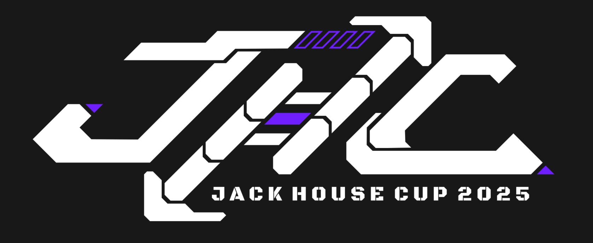

# 叠屋杯 2025

**叠屋杯 2025** (***JHC 2025***) 是由 ::{ flag=CN }:: [Blue_Potion](https://osu.ppy.sh/users/13094831)，::{ flag=CN }:: [CuteNatro](https://osu.ppy.sh/users/27233308)，和 ::{ flag=CN }:: [yks1](https://osu.ppy.sh/users/26030234) 主办的 1v1 队伍制 osu!mania 4K 项目赛事。本届比赛是叠屋杯系列赛事的第二届正式比赛。

## 比赛日程

| 事项 | 时间 |
| --: | :-- |
| 报名阶段 | 2025-06-01/2025-06-15 |
| 资格赛图池展示 | 2025-06-22 |
| 资格赛 | 2025-06-28/2025-06-29 |
| 32 强赛 | 2025-07-05/2025-07-06 |
| 16 强赛 | 2025-07-12/2025-07-13 |
| 四分之一决赛 | 2025-07-20/2025-07-21 |
| 半决赛 | 2025-07-26/2025-07-27 |
| 决赛 | 2025-08-02/2025-08-03 |
| 总决赛 | 2025-08-09/2025-08-10 |

## 奖励

*单人参赛的队伍，osu!supporter 奖励时长翻倍。*

| 名次 | 奖励 |
| :-: | :-- |
|  | 个人资料徽章，*待定* |
|  | *待定* |
|  | *待定* |

## 组织

| 职务 | 成员 |
| --: | :-- |
| 主办方 | ::{ flag=CN }:: [Blue_Potion](https://osu.ppy.sh/users/13094831), ::{ flag=CN }:: [CuteNatro](https://osu.ppy.sh/users/27233308), ::{ flag=CN }:: [yks1](https://osu.ppy.sh/users/26030234) |
| 图池管理 | ::{ flag=CN }:: [Blue_Potion](https://osu.ppy.sh/users/13094831), *待定* |
| 谱师 | *待定* |
| 测试 | ::{ flag=SG }:: [Koishi Komeijie](https://osu.ppy.sh/users/15763622), *待定* |
| 裁判 | *待定* |
| 直播 | *待定* |
| 解说 | *待定* |
| 数据统计 & wiki 编写 | ::{ flag=CN }:: [Blue_Potion](https://osu.ppy.sh/users/13094831), *待定* |
| 设计 | ::{ flag=CN }:: [AZSDSC](https://osu.ppy.sh/users/17895656), ::{ flag=CN }:: [ItzSocn](https://osu.ppy.sh/users/13971632) |

## 链接

- 论坛讨论帖
- [直播主舞台](https://www.twitch.tv/jack_house_cup)
- [淘汰赛赛程](https://challonge.com/JHC2025)
- [比赛 QQ 群](https://qm.qq.com/cgi-bin/qm/qr?_wv=1027&k=pRNiqDnTUmLKQgy8iy2LnLx3uTYIL0dG)
- [比赛 Discord 服务器](https://discord.gg/DqPuRU8Bhc)
- 赛事信息表格

## 规则

### 比赛规则

1. 叠屋杯 2025 是队式 1 vs 1 双败制比赛，使用的是 osu!mania 4K 模式。
2. 谱面计分方式采用 ScoreV2。
3. 一支队伍由 1–2 名玩家组成。
4. 比赛开始前一周内将于主舞台发布图池。
5. 比赛开始前一周内将预设好每轮的比赛的日程。
6. 允许使用皮肤或者修改显示设定禁用叙事板及打击音效。
   - 皮肤不可以修改核心游戏机制。
7. 如果比赛时一方无人到场，比赛可以被推迟最多 10 分钟。如果 10 分钟后一方还是缺人，那么到场的队伍 *默认获胜*；如果 10 分钟后双方均缺人，那么资格赛排名更高的队伍 *默认获胜*。
   - 最少的比赛人数是使房间没有任何空位的最低人数，因此每队至少需要 1 人到场才能开赛。
8. 比赛没有热手阶段。
9. 比赛中可以自由上下选手，除了触发特定规则的情况下。
10. 如果一局比赛以平局结束，这局将会重赛。
11. 如果队员比赛中遇到了技术问题，在 30 秒内或者谱面的 25% 时间内掉线可以申请重赛。裁判可以自行决定是否否决这一请求。
    - 游戏卡顿延迟并不会被作为一个可行的理由。
    - 如果发生了重赛，那么比赛双方的选手必须保持和初次相同。如果其中有选手确实无法比赛，那么双方都允许换人。
    - 禁止滥用此规则，如果裁判发现有队伍故意利用此规则，其可以拒绝重赛请求。
12. 如果选手掉线，成绩不会被计入总分，除非该选手提供成绩证明。可接受的内容如下：
    - 选手视角的直播片段，必须包含清晰的游戏画面和结尾的成绩结算界面。
    - osr 回放文件，从选手的本地成绩中直接导出，开始时间必须和房间内的比赛开始时间严格契合。
    - 来自其他选手的游戏内截图，可以展示掉线选手的成绩。
      - 结算界面的截图必须清晰的展示掉线选手的成绩。比较推荐使用此方法。
      - 掉线时，截取的游戏内截图也可接受。此方法仅认定截图内显示的分数。不鼓励使用这种方法，如果提供的信息不足以识别选手得分，裁判有权否决分数认定。
      - 所有的截图 **必须** 使用 `Shift + F12` 在游戏内截取，并提交到 `https://osu.ppy.sh/` 域名下获得，其他方式的截图均会被拒绝。
    - 如果比赛是主舞台转播的，作为最后手段，选手分数可以从主舞台的转播处获得。
13. 选手应该保持比赛流畅，严禁故意拖延。如选手过度的拖延时间，裁判可自行决定是否判罚。严禁通过犯规、侮辱或挑衅其他选手或工作人员、拖延时间或其他故意不当行为来扰乱比赛，如有违反将受到相应的惩罚。
14. 任何试图操纵比赛结果或之后比赛的企图将可能导致队伍和队员立刻被撤销比赛资格，这些行为包括但不限于：
    - 与其他队伍或队员串通，以迫使他们进行所需的比赛。
    - 故意打得不好而输掉一局或一整场。
    - 在没有提供充分理由，或为了获得更有利的局面的情况下放弃一场比赛。
15. 比赛期间，必须尊重所有选手和工作人员，遵循裁判和主办方的指示，不得反对裁判和主办方最终决定。
16. 比赛房间中的聊天室也受到 [规章制度](/wiki/Rules) 的约束，玩家在比赛房间中所有聊天信息均需遵守相应规则。
    - 违法规则将会被判罚禁言。选手被禁言期间不能参赛，在规定时间内必须被换下。
17. 违反比赛规则的处罚包括但不限于：
    - 禁止选手在某张图上场；
    - 禁止选手在整场比赛上场；
    - 整队判负；
    - 取消本届比赛资格；
    - 取消本届和未来叠屋杯系列赛的比赛资格，直至提出上诉。
18. 裁判可以根据情况调整 timers 的长度。
19. 主办方可以在没有事先警告的情况下，要求选手开直播或录像。
20. 任何与赛事相关的投诉应发送至 [osu! 官方举报表单](https://tcomm.hivie.tn/reports/create)。
21. 主办方保留修改规则的权利，任何修改将会提前宣布。

### 比赛报名

1. 请填写该 [谷歌表格](https://forms.gle/bi7Hhci8gnFL3SaE6) 来进行报名。
   - 报名后的选手 **必须** 加入此 [Discord 服务器](https://discord.gg/DqPuRU8Bhc) 或此 [QQ 群](https://qm.qq.com/cgi-bin/qm/qr?_wv=1027&k=pRNiqDnTUmLKQgy8iy2LnLx3uTYIL0dG)。
2. 为了保证报名有效，所有参赛选手将递交至 [锦标赛筛查](/wiki/Tournaments/Official_support#tournament-screening)。
   - 选手不得在 12 个月内有违反 [osu! 社区规则](/wiki/Rules) 的记录。
3. 报名结束后，主办方会公布所有成功报名玩家的名单。
4. [比赛工作人员](/wiki/Tournaments/Official_support#staff) 与叠屋杯 2024 的冠军队成员不能作为选手参加本次比赛。

### 资格赛介绍

1. 资格赛阶段中，每个选手需要游玩由图池管理员定制的谱面组成的图池。
2. 资格赛图池包含 7 张谱面，均应用 [Free Mod](/wiki/Gameplay/Game_modifier#自由选择模组-(free-mod)) 规则。
3. 选手需要在指定时间，在房间内连续打完整个图池，最多可以打两次，最后的成绩为所有单曲最高分的和。
4. 图池需要按顺序进行游玩，此顺序不可更改。
   - 任何队伍打第二轮的时候可以跳过任意谱面。
5. 每一张谱面，每队必须 **仅上场 1 人** 游玩。可以在每张图结束后换人。
6. 在第一轮游玩和第二轮游玩图池的中间，队伍可以选择休息 5 分钟。
7. 所有选手会在其单独的资格赛房间进行游戏。
   - 主办方不建议选手直播资格赛，以防止露分控分导致操纵资格赛排名。
8. 预选赛使用的排名方法是「排名总和法」，即将每支队伍在各张图中的排名相加，得到该队的最终得分，然后根据得分从低到高进行排序，得分最低的队伍为第一种子队。
9. 资格赛排名前 32 的队伍进入胜者组 32 强。

### 胜利条件

1. 资格赛阶段，排名前 32 的队伍才能晋级双败制比赛阶段。
2. 在 32 强和 16 强赛，赢下比赛需要赢下 5 张谱面（BO9）。
3. 在 8 强赛和半决赛，赢下比赛需要赢下 6 张谱面（BO11）。
4. 在决赛和总决赛，赢下比赛需要赢下 7 张谱面（BO13）。

### 比赛流程

1. 比赛开始前 15 分钟，裁判提前建好多人房间，选手必须在此期间进房。
   - 房间设置为：`游戏模式: "osu!mania"`，`分组方式: "Team Vs"` 和 `胜利条件: "ScoreV2"`. 房间名必须命名为：`JHC2025: ({TeamRed}) vs ({TeamBlue})`。房间名中在前面的队伍是红队，在后面的队伍是蓝队。
   - 若因为队伍名称过长或队伍名称含有非法字符导致无法创建房间，将会考虑缩短或更改队名。
2. 每个队长在 `#multiplayer` 频道里使用 `!roll` 指令获得点数，随后按照如下顺序进行保图、禁图、选图：
   1. roll 点高者首先保护一张图，然后 roll 点低者保护一张图。两队不能保护同一张图。被保护的图将不能被禁用。
   2. roll 点低者首先禁用一张图，然后 roll 点高者禁用一张图。两队不能禁用同一张图。被禁用的图将不能被选择。
   3. roll 点高者选择第一张图进行比赛。
3. 在禁图结束后，每个队伍轮流从图池中选择一张谱面并进行比赛。
4. 每个队伍有 2 分钟 30 秒的时间选图，接下来有 2 分钟 30 秒的时间准备就绪。如果一个队伍超时了，那么过程如下:
   - 第一次发生：
     - 队伍会收到来自裁判的警告。
   - 后续再次发生：
     - 如果在 ban 图，那么此次 ban 图作废。
     - 如果在选图，裁判使用 roll 点指令从图池可用谱面中随机选择一张谱面进行游玩。
     - 如果在准备期间，裁判会直接使用 `!mp start 10` 指令开始游戏倒计时，不管房间内人数是否够。每队多余的选手会被 `!mp kick` 踢出。
     - 持续违反此项规则可能会受到工作人员进一步的惩罚。
5. 每个队伍每场比赛有一次可选的 2 分钟 30 秒的技术暂停机会，作为 ban 图、选图及准备地图的额外时间。
   - 可以在 TB 决胜局叫暂停，但是需要比赛双方均同意。

### 图池结构

1. 各阶段有各自的图池。
2. 每轮图池的所有谱面都是在 [Free Mod](/wiki/Gameplay/Game_modifier#自由选择模组-(free-mod)) 条件下游玩。
3. 每轮图池的数量如下:
   - 资格赛：7 张
   - 32 强赛和 16 强赛：13 张
   - 四分之一决赛和半决赛：15 张
   - 决赛和总决赛：17 张
4. 除资格赛图池之外，每个图池包含一张 TB 决胜局谱面，也将在 FreeMod 条件下游玩。
5. Free Mod 所允许的模组包括 `No Fail`, `Hidden`, `Fade In`, `Flashlight` 和 `Mirror`。
6. 决胜图将会在 Free Mod 条件下进行。

### 日程信息

1. 每轮比赛都会在单独的 **一个周末** 进行。
2. 资格赛的比赛将在特定的时间区间进行。每个选手可以自由选择一个想要比赛的时间区间。
   - **如果队伍在资格赛未选择区间，会被视作弃赛。**
3. 除特殊情况外，所有的比赛会在周六 0:00 到周日 23:59 之间进行（UTC+8）。
4. 比赛日程由主办方来进行安排。主办方会在比赛开始前的上个周日提前预设好每轮的比赛的日程，尽量创造一个所有参赛选手都满意的时间安排。
   - 从 8 强赛开始，如果队伍想要特定的时间段，他们可以通知主办方。
5. **只有双方队伍都同意并跟主办方沟通之后才可以在比赛开始 1 天前修改时间。**
   - 时间不会安排到每周 **周日 23:00 之后**，除非这无法避免且双方和主办方都同意。
   - **主办方有权拒绝修改时间的申请，所以请尽量少提交申请除非真的必要。**
   - 主办方有权拒绝太迟的日程重排请求。
