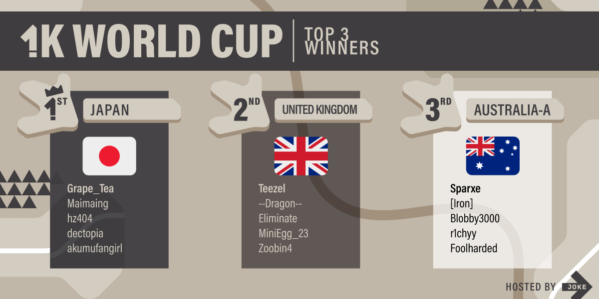

---
tags:
  - JOKE
  - 1KWC
  - 1KWC 2024
---

# One Key World Cup 2024

**One Key World Cup 2024** (***1KWC***) was a country-based 2v2, double-elimination osu!mania 1-key tournament hosted by ::{ flag=AU }:: [Jaye](https://osu.ppy.sh/users/4841352).

## Tournament schedule

| Event | Timestamp |
| --: | :-- |
| Registration phase | 2024-04-10/2024-04-21 |
| Screening phase | 2024-04-22/2024-04-27 |
| Qualifiers showcase | 2024-04-28 |
| Qualifiers | 2024-05-04/2024-05-05 |
| Round of 24 | 2024-05-11/2024-05-12 |
| Round of 16 | 2024-05-18/2024-05-19 |
| Quarterfinals | 2024-05-25/2024-05-26 |
| Semifinals | 2024-06-01/2024-06-02 |
| Finals | 2024-06-08/2024-06-09 |
| Grand Finals | 2024-06-15/2024-06-16 |

## Prizes

| Placing | Prize(s) |
| :-: | :-- |
|  | profile badge |

## Organisation

| Position | Member(s) |
| :-- | :-- |
| Host | ::{ flag=AU }:: [Jaye](https://osu.ppy.sh/users/4841352) |
| Streamer | ::{ flag=US }:: [EpsilonMaiagare](https://osu.ppy.sh/users/3855052), ::{ flag=US }:: [ethfan922](https://osu.ppy.sh/users/10402769) |
| Commentator | ::{ flag=AU }:: [Beat43210](https://osu.ppy.sh/users/5664171), ::{ flag=CA }:: [ERA Sunny](https://osu.ppy.sh/users/16468962), ::{ flag=AU }:: [Jaye](https://osu.ppy.sh/users/4841352), ::{ flag=GB }:: [NHawk](https://osu.ppy.sh/users/7218024), ::{ flag=FR }:: [Paturages](https://osu.ppy.sh/users/1375479), ::{ flag=US }:: [Sparky](https://osu.ppy.sh/users/3187959), ::{ flag=NZ }:: [Sparxe](https://osu.ppy.sh/users/5750235), ::{ flag=GB }:: [Teezel](https://osu.ppy.sh/users/7528639), ::{ flag=HK }:: [YonGin](https://osu.ppy.sh/users/7109317) |
| Referee | ::{ flag=VN }:: [\[LS\]Sagirium](https://osu.ppy.sh/users/16530364), ::{ flag=TH }:: [\[Ping\]](https://osu.ppy.sh/users/6291395), ::{ flag=US }:: [akace100](https://osu.ppy.sh/users/9308128), ::{ flag=US }:: [Dynascape](https://osu.ppy.sh/users/8784587), ::{ flag=US }:: [EpsilonMaiagare](https://osu.ppy.sh/users/3855052), ::{ flag=PE }:: [ERA Xuste](https://osu.ppy.sh/users/17989444), ::{ flag=US }:: [ethfan922](https://osu.ppy.sh/users/10402769), ::{ flag=FI }:: [Laurakko](https://osu.ppy.sh/users/7253731), ::{ flag=VN }:: [rock-on](https://osu.ppy.sh/users/9676089) |
| Designer | ::{ flag=CA }:: [kaetwo](https://osu.ppy.sh/users/1997719) |
| Statistician | ::{ flag=NL }:: [Albionthegreat](https://osu.ppy.sh/users/9853595), ::{ flag=AU }:: [Fuel](https://osu.ppy.sh/users/5155081), ::{ flag=AU }:: [Jaye](https://osu.ppy.sh/users/4841352) |

## Links

- [Discussion thread](https://osu.ppy.sh/community/forums/topics/1907935)
- [JOKE Discord server](https://discord.gg/35kN3dF)
- [Livestream](https://www.twitch.tv/jokeOfficial)
- [Tournament bracket](https://challonge.com/1KWC2024)
- Spreadsheets
  - **[Master](https://docs.google.com/spreadsheets/d/1TUzrH_aghPFXONk6mP5HBE6LxK-ouDy7RDoJvCfbuho)**
  - [Statistics](https://docs.google.com/spreadsheets/d/1soXDtSUmP23RE-WqEWZZ7QXHQHEnRMD1UW6iFg741BM)

## Participants

|  | Country | Members |
| :-: | :-: | :-- |
| ::{ flag=CA }:: | **99% Canadian** | **[ERA Sunny](https://osu.ppy.sh/users/16468962)**, [DimplesRMe](https://osu.ppy.sh/users/13348268), [Verdon](https://osu.ppy.sh/users/14196373) |
| ::{ flag=AU }:: | **Australia-A** | **[Sparxe](https://osu.ppy.sh/users/5750235)**, [\[Iron\]](https://osu.ppy.sh/users/13171482), [Blobby3000](https://osu.ppy.sh/users/6916774), [r1chyy](https://osu.ppy.sh/users/11499467), [Foolharded](https://osu.ppy.sh/users/27394972) |
| ::{ flag=AU }:: | **Australia-B** | **[Tsubasa2](https://osu.ppy.sh/users/6835183)**, [Eresh](https://osu.ppy.sh/users/8259292), [XimperiaL](https://osu.ppy.sh/users/11883100), [5ixty](https://osu.ppy.sh/users/18321104) |
| ::{ flag=BR }:: | **Brazil** | **[Brasil](https://osu.ppy.sh/users/3949268)**, [Pluko](https://osu.ppy.sh/users/15813305), [SillyFangirl](https://osu.ppy.sh/users/2288363), [Warpzoned](https://osu.ppy.sh/users/18649724) |
| ::{ flag=CA }:: | **Canada** | **[femboy nixii-](https://osu.ppy.sh/users/24834393)**, [MCGjazz](https://osu.ppy.sh/users/25978378), [Nokia_420](https://osu.ppy.sh/users/29944977), [tulipily](https://osu.ppy.sh/users/25764990) |
| ::{ flag=CN }:: | **China** | **[WLYMinato](https://osu.ppy.sh/users/12703319)**, [Ookura Risona](https://osu.ppy.sh/users/2073644), [laisbgvi](https://osu.ppy.sh/users/7241253), [FORMless000](https://osu.ppy.sh/users/8697654), [Lubei_01](https://osu.ppy.sh/users/11692528) |
| ::{ flag=CZ }:: | **Czechoslovakia** | **[Kiruliatkoska](https://osu.ppy.sh/users/13013350)**, [FlipRopiik](https://osu.ppy.sh/users/10806437), [Ticy](https://osu.ppy.sh/users/15142530), [Domajnyk Pear](https://osu.ppy.sh/users/13941662), [grillroasted](https://osu.ppy.sh/users/18271627) |
|  | **East Europe** | **[1qxz](https://osu.ppy.sh/users/24641997)**, [SumaFora](https://osu.ppy.sh/users/34824044), [GloWer](https://osu.ppy.sh/users/15442379), [lefruitit227](https://osu.ppy.sh/users/5774467), [TomisNotGood](https://osu.ppy.sh/users/16360055) |
| ::{ flag=FR }:: | **France** | **[Adri](https://osu.ppy.sh/users/4579132)**, [Paturages](https://osu.ppy.sh/users/1375479), [PatouZ](https://osu.ppy.sh/users/7306522), [Le_Zozoien](https://osu.ppy.sh/users/25354335), [Chernobog](https://osu.ppy.sh/users/3317042) |
| ::{ flag=DE }:: | **Germany-A** | **[ERA Punish](https://osu.ppy.sh/users/10615367)**, [ERA Sirbeyy](https://osu.ppy.sh/users/12917829), [ERA medium kek](https://osu.ppy.sh/users/11625617), [ERA Aracium](https://osu.ppy.sh/users/15882740), [datnonameboi](https://osu.ppy.sh/users/14217761) |
| ::{ flag=DE }:: | **Germany-B** | **[Neqoo](https://osu.ppy.sh/users/5035932)**, [Bayern](https://osu.ppy.sh/users/16474595), [YasiCreeper](https://osu.ppy.sh/users/15586183), [Jesus Christus](https://osu.ppy.sh/users/14661718) |
| ::{ flag=HK }:: | **Hong Kong** | **[DC2_727](https://osu.ppy.sh/users/17483369)**, [fua](https://osu.ppy.sh/users/21138904), [HKGamerNoob](https://osu.ppy.sh/users/18470402) |
| ::{ flag=ID }:: | **Indonesia** | **[Reihynn](https://osu.ppy.sh/users/16630515)**, [iSxga](https://osu.ppy.sh/users/15801261), [IzKun-](https://osu.ppy.sh/users/9104881), [AzusaNakano2](https://osu.ppy.sh/users/9821346), [Lightning Wyvern](https://osu.ppy.sh/users/1533122) |
| ::{ flag=IE }:: | **Ireland** | **[-uyetb-](https://osu.ppy.sh/users/22945300)**, [\[LS\]Nightkore](https://osu.ppy.sh/users/26311862) |
| ::{ flag=IT }:: | **Italian Plumbers** | **[D3kuu](https://osu.ppy.sh/users/7807444)**, [ndrrr](https://osu.ppy.sh/users/4609767), [Ikkun](https://osu.ppy.sh/users/1059945), [A-40](https://osu.ppy.sh/users/14510301), [ERA Veryi](https://osu.ppy.sh/users/13878539) |
| ::{ flag=IT }:: | **Italy** | **[24Marzo](https://osu.ppy.sh/users/17952001)**, [\[SPNG\] Sim0](https://osu.ppy.sh/users/3262821), [\[SPNG\]Tom](https://osu.ppy.sh/users/6083660), [NeSsUnO-_-](https://osu.ppy.sh/users/14374361), [Kiraz](https://osu.ppy.sh/users/3807675) |
| ::{ flag=JP }:: | **Japan** | **[Grape_Tea](https://osu.ppy.sh/users/9540073)**, [Maimaing](https://osu.ppy.sh/users/14520910), [hz404](https://osu.ppy.sh/users/14947043), [dectopia](https://osu.ppy.sh/users/2845904), [akumufangirl](https://osu.ppy.sh/users/6198876) |
| ::{ flag=MY }:: | **Malaysia-A** | **[ERA Leon](https://osu.ppy.sh/users/13382147)**, [Fuuneral](https://osu.ppy.sh/users/31042682), [Minisora](https://osu.ppy.sh/users/9627666), [K0rd31HP](https://osu.ppy.sh/users/15231510), [CJPGaming](https://osu.ppy.sh/users/26377628) |
| ::{ flag=MY }:: | **Malaysia-B** | **[Onlinee](https://osu.ppy.sh/users/13630137)**, [DXA FonG](https://osu.ppy.sh/users/15019527), [Drysilas](https://osu.ppy.sh/users/16766719) |
| ::{ flag=MX }:: | **Mexico** | **[ElzeFanBoy](https://osu.ppy.sh/users/15513303)**, [happergamer](https://osu.ppy.sh/users/15513319), [Darkhechiser](https://osu.ppy.sh/users/23392961), [\[LS\]Mari](https://osu.ppy.sh/users/15270411), [ERA GulMyMummy](https://osu.ppy.sh/users/15186865) |
| ::{ flag=NL }:: | **Netherlands** | **[Shoira](https://osu.ppy.sh/users/13377652)**, [Freek](https://osu.ppy.sh/users/9630674), [Boaz](https://osu.ppy.sh/users/13302996), [samuelhklumpers](https://osu.ppy.sh/users/10945523) |
| ::{ flag=NO }:: | **Norway** | **[Crustbell](https://osu.ppy.sh/users/7859738)**, [Mills](https://osu.ppy.sh/users/7234023), [Ziquids](https://osu.ppy.sh/users/10972799), [xxxbruhmanxxx](https://osu.ppy.sh/users/23726452) |
| ::{ flag=PE }:: | **Peru** | **[alemagno333](https://osu.ppy.sh/users/11411697)**, [Dinki](https://osu.ppy.sh/users/23361435), [Brunixxx](https://osu.ppy.sh/users/16517079) |
| ::{ flag=SG }:: | **Singapore Adam** | **[TheFunk](https://osu.ppy.sh/users/13981991)**, [ERA Adam](https://osu.ppy.sh/users/12297375), [skythedumbdumb](https://osu.ppy.sh/users/21749745), [chairless](https://osu.ppy.sh/users/26031453), [pwod](https://osu.ppy.sh/users/20846896) |
| ::{ flag=SG }:: | **Singapore Blerargh** | **[_gt](https://osu.ppy.sh/users/8301957)**, [Blerargh](https://osu.ppy.sh/users/7609510), [Prehistoria](https://osu.ppy.sh/users/8364237), [dantoh00](https://osu.ppy.sh/users/11414361), [Rycy](https://osu.ppy.sh/users/7394522) |
| ::{ flag=KR }:: | **South Korea** | **[Selitation](https://osu.ppy.sh/users/25311011)**, [South Korea](https://osu.ppy.sh/users/12242622), [PocaFanboy](https://osu.ppy.sh/users/6912079), [PocaFangirl](https://osu.ppy.sh/users/18278945), [Pocafanboyfan](https://osu.ppy.sh/users/10344857) |
| ::{ flag=GB }:: | **United Kingdom** | **[Teezel](https://osu.ppy.sh/users/7528639)**, [--Dragon--](https://osu.ppy.sh/users/11924624), [Eliminate](https://osu.ppy.sh/users/9169747), [MiniEgg_23](https://osu.ppy.sh/users/25914360), [Zoobin4](https://osu.ppy.sh/users/10055204) |
| ::{ flag=US }:: | **United States-A** | **[Sydosys](https://osu.ppy.sh/users/17523947)**, [ForestMastr](https://osu.ppy.sh/users/9199901), [La Fluffy](https://osu.ppy.sh/users/7001787), [\[LS\]Gavin](https://osu.ppy.sh/users/10888689), [Jakson](https://osu.ppy.sh/users/8788058) |
| ::{ flag=US }:: | **United States-B** | **[DeltaNami](https://osu.ppy.sh/users/10352045)**, [cyger](https://osu.ppy.sh/users/20020441), [Sparky](https://osu.ppy.sh/users/3187959), [Backfire](https://osu.ppy.sh/users/263110) |
| ::{ flag=US }:: | **United States-C** | **[-Daku](https://osu.ppy.sh/users/6377828)**, [AdrianLazer](https://osu.ppy.sh/users/10292643), [ERA Basil](https://osu.ppy.sh/users/7097990), [OSUjanaiKATSURAda](https://osu.ppy.sh/users/2154499), [-Kori](https://osu.ppy.sh/users/12490530) |
| ::{ flag=VN }:: | **Vietnam-A** | **[Lott](https://osu.ppy.sh/users/13821222)**, [RandomNameIdk](https://osu.ppy.sh/users/24042710), [\[LS\]Tokiyume](https://osu.ppy.sh/users/13219309), [nahieu2005](https://osu.ppy.sh/users/22069182), [Cessna](https://osu.ppy.sh/users/16868806) |
| ::{ flag=VN }:: | **Vietnam-B** | **[Walker37712](https://osu.ppy.sh/users/30644569)**, [ldminh4354](https://osu.ppy.sh/users/30855778), [aiyern](https://osu.ppy.sh/users/13826244) |

## Podium

This competition has come to an end and resulted in the following podium:

| Placing | Team |
| :-: | :-- |
|  | ::{ flag=JP }:: **Japan** (**[Grape_Tea](https://osu.ppy.sh/users/9540073)**, [Maimaing](https://osu.ppy.sh/users/14520910), [hz404](https://osu.ppy.sh/users/14947043), [dectopia](https://osu.ppy.sh/users/2845904), [akumufangirl](https://osu.ppy.sh/users/6198876)) |
|  | ::{ flag=GB }:: **United Kingdom** (**[Teezel](https://osu.ppy.sh/users/7528639)**, [--Dragon--](https://osu.ppy.sh/users/11924624), [Eliminate](https://osu.ppy.sh/users/9169747), [MiniEgg_23](https://osu.ppy.sh/users/25914360), [Zoobin4](https://osu.ppy.sh/users/10055204)) |
|  | ::{ flag=AU }:: **Australia-A** (**[Sparxe](https://osu.ppy.sh/users/5750235)**, [\[Iron\]](https://osu.ppy.sh/users/13171482), [Blobby3000](https://osu.ppy.sh/users/6916774), [r1chyy](https://osu.ppy.sh/users/11499467), [Foolharded](https://osu.ppy.sh/users/27394972)) |

## Mappools

### Grand Finals

- Rice
  1. [SOOOO - iiillluuuvvvUUU (Jaye)](https://osu.ppy.sh/beatmapsets/1649296#mania/3366417)
  2. [Getty - Pump It (Sparxe)](https://osu.ppy.sh/beatmapsets/1649296#mania/3366415)
  3. [Wiklund - Crystal Dimension (Sparxe)](https://osu.ppy.sh/beatmapsets/2101556#mania/4408818)
  4. [Dev/Null - Zombie Sunset (Jaye)](https://osu.ppy.sh/beatmapsets/1238678#mania/2575405)
- LN
  1. [Kommisar - Clover (Jaye)](https://osu.ppy.sh/beatmapsets/2101556#mania/4408814)
  2. [Snail's House - Ma Chouchoute (Cut Ver.) (Sparxe)](https://osu.ppy.sh/beatmapsets/2101556#mania/4408816)
  3. [Frums - Pictured as Perfect (Jaye)](https://osu.ppy.sh/beatmapsets/1649296#mania/3366414)
- Hybrid
  1. [ZxNX as "Delaina" - End Me (Cut Ver.) (Sparxe)](https://osu.ppy.sh/beatmapsets/2101558#mania/4408826)
  2. [KikuoHana - Hibi Darake no Me (Sparxe)](https://osu.ppy.sh/beatmapsets/2101558#mania/4408826)
  3. [BilliumMoto - four veiled stars (Jaye)](https://osu.ppy.sh/beatmapsets/1238676#mania/2575394)
  4. [Silentroom - Nhelv (Sparxe)](https://osu.ppy.sh/beatmapsets/1649300#mania/3366428)
- Speed
  1. [Rish feat. Choko - Punai Punai Gensou (Sparxe)](https://osu.ppy.sh/beatmapsets/2101558#mania/4408823)
  2. [Fleshgod Apocalypse - Mitra (Jaye)](https://osu.ppy.sh/beatmapsets/1649300#mania/3366424)
- SV
  1. [Culprate & Bloom - Aurora (Cut Ver.) (HowToPlayLN)](https://osu.ppy.sh/beatmapsets/1649300#mania/3366423)
  2. [U1 overground - Endorphin (Erkfir)](https://osu.ppy.sh/beatmapsets/1238676#mania/2575401)
- Tiebreaker
  1. **[katagiri - 1KNITE (Jaye) [1NF1N1TY]](https://osu.ppy.sh/beatmapsets/2195525#mania/4645532)**

### Finals

- Rice
  1. [II-L - VANGUARD-1 (Jaye)](https://osu.ppy.sh/beatmapsets/2098409#mania/4401570)
  2. [Raimukun - Nyarlathotep's Dreamland (Sparxe)](https://osu.ppy.sh/beatmapsets/2098409#mania/4401572)
  3. [xi - Mirage Garden (Jaye)](https://osu.ppy.sh/beatmapsets/2098409#mania/4401575)
  4. [Masahiro 'Godspeed' Aoki - Gate of Doom (Jaye)](https://osu.ppy.sh/beatmapsets/1232550#mania/2562358)
- LN
  1. [Geoxor - Lollipop (Sparxe)](https://osu.ppy.sh/beatmapsets/1644998#mania/3357827)
  2. [Memme - Acid Burst (Jaye)](https://osu.ppy.sh/beatmapsets/1232550#mania/2562359)
- Hybrid
  1. [The Flashbulb - The Bridgeport Run (Sparxe)](https://osu.ppy.sh/beatmapsets/1639184#mania/3345594)
  2. [Sot-C - Deep Ocean (Sparxe)](https://osu.ppy.sh/beatmapsets/2098412#mania/4401587)
  3. [Sephid - Epistrofi (Sparxe)](https://osu.ppy.sh/beatmapsets/2098412#mania/4401586)
- Speed
  1. [BilliumMoto - Rocky Buinne (Short Ver.) (Jaye)](https://osu.ppy.sh/beatmapsets/1645002#mania/3357839)
  2. [antiPLUR - Speed of Link (Jaye)](https://osu.ppy.sh/beatmapsets/1645002#mania/3357837)
- SV
  1. [AAAA - w = addict (Paturages)](https://osu.ppy.sh/beatmapsets/2098412#mania/4401582)
  2. [onumi - CONFUSION PART ONE (Erkfir)](https://osu.ppy.sh/beatmapsets/1232556#mania/2562379)
- Tiebreaker
  1. **[Billain & Vorso - Transhumanist (Sparxe)](https://osu.ppy.sh/beatmapsets/1645002#mania/3357838)**

### Semifinals

- Rice
  1. [HyuN feat. YURI - Disorder (Tsubasa2)](https://osu.ppy.sh/beatmapsets/1639181#mania/3345577)
  2. [Umeboshi Chazuke - Re:inG (Jaye)](https://osu.ppy.sh/beatmapsets/1639181#mania/3345582)
  3. [ginkiha - Shadow Castle (Jaye)](https://osu.ppy.sh/beatmapsets/1228113#mania/2553705)
  4. [m108 - XIII Charlotte (Jaye)](https://osu.ppy.sh/beatmapsets/2095334#mania/4393370)
- LN
  1. [MYUKKE. - The 89's Momentum (Jaye)](https://osu.ppy.sh/beatmapsets/2095334#mania/4393371)
  2. [Aiyru - Elevator (Jaye)](https://osu.ppy.sh/beatmapsets/2095334#mania/4393366)
- Hybrid
  1. [Tedjimo yomigY - Edelweiss (Sparxe)](https://osu.ppy.sh/beatmapsets/2095335#mania/4393379)
  2. [Seiryu - AO-Infinity (Jaye)](https://osu.ppy.sh/beatmapsets/1228117#mania/2553717)
  3. [METAROOM - .ANGEL (Sparxe)](https://osu.ppy.sh/beatmapsets/2095335#mania/4393375)
- Speed
  1. [Umeboshi Chazuke - Bison Charge (Jaye)](https://osu.ppy.sh/beatmapsets/1232556#mania/2562381)
  2. [Masahiro "Godspeed" Aoki - The Game Changer (Jaye)](https://osu.ppy.sh/beatmapsets/2095335#mania/4393374)
- SV
  1. [LeaF - Aleph-0 (Erkfir)](https://osu.ppy.sh/beatmapsets/1228117#mania/2553714)
  2. [onumi - spider tank (Paturages)](https://osu.ppy.sh/beatmapsets/2095335#mania/4393376)
- Tiebreaker
  1. **[Kobaryo feat. HiTNEX-X - SUPER MEMORIES (Sparxe)](https://osu.ppy.sh/beatmapsets/1639184#mania/3345588)**

### Quarterfinals

- Rice
  1. [LV.4 - Angel dust (2016 Radio Mix) (Sparxe)](https://osu.ppy.sh/beatmapsets/2088535#mania/4376752)
  2. [kanone - MASAMUNE (Jaye)](https://osu.ppy.sh/beatmapsets/1633213#mania/3333677)
  3. [U1 overground - Dopamine (Jaye)](https://osu.ppy.sh/beatmapsets/1222899#mania/2543731)
  4. [CHON - Ghost (Jaye)](https://osu.ppy.sh/beatmapsets/2091977#mania/4385138)
- LN
  1. [Expander - Move That Body (Jaye)](https://osu.ppy.sh/beatmapsets/1222899#mania/2543726)
  2. [dark cat - hot chocolate (Sparxe)](https://osu.ppy.sh/beatmapsets/2091977#mania/4385141)
- Hybrid
  1. [Mameyudoufu - Quality Control (Cut Ver.) (Sparxe)](https://osu.ppy.sh/beatmapsets/2091977#mania/4385143)
  2. [A? - ENERGY INFLATION (Jaye)](https://osu.ppy.sh/beatmapsets/1633216#mania/3333687)
  3. [Tanchiky - STEP BY STEP (Jaye)](https://osu.ppy.sh/beatmapsets/2091977#mania/4385146)
- Speed
  1. [Masahiro "Godspeed" Aoki - busy come, busy go (Jaye)](https://osu.ppy.sh/beatmapsets/1639184#mania/3345589)
- SV
  1. [KOAN Sound - Radiant (Cut Ver.) (Paturages)](https://osu.ppy.sh/beatmapsets/1633216#mania/3333690)
- Tiebreaker
  1. **[Street - Aiwv (Sparxe)](https://osu.ppy.sh/beatmapsets/2091977#mania/4385145)**

### Round of 16

- Rice
  1. [Kuroneko dungeon - Dragon and Girl and Decoherence (juankristal)](https://osu.ppy.sh/beatmapsets/1217949#mania/2534011)
  2. [ARForest - Metheus (Jaye)](https://osu.ppy.sh/beatmapsets/1626620#mania/3320785)
  3. [sasakure.UK - Atropos (Short Edit) (Jaye)](https://osu.ppy.sh/beatmapsets/1222899#mania/2543730)
  4. [LEAF XCEED Music Division - Guitar vs Piano (Jaye)](https://osu.ppy.sh/beatmapsets/1633213#mania/3333679)
- LN
  1. [Amidst - Treat (Cut Ver.) (Jaye)](https://osu.ppy.sh/beatmapsets/2088535#mania/4376748)
  2. [Tokyo Machine - TURBO (Cut Ver.) (Jaye)](https://osu.ppy.sh/beatmapsets/2085035#mania/4367726)
- Hybrid
  1. [litmus* - Rush-More (Jaye)](https://osu.ppy.sh/beatmapsets/2078445#mania/4352064)
  2. [Thank You Scientist - Wrinkle (Jaye)](https://osu.ppy.sh/beatmapsets/1626621#mania/3320798)
  3. [rN - fragments.arc (Jaye)](https://osu.ppy.sh/beatmapsets/1622253#mania/3312223)
- Speed
  1. [Melt-Banana - Lie Lied Lies (Jaye)](https://osu.ppy.sh/beatmapsets/1228117#mania/2553715)
- SV
  1. [ulko - look at her (Hydria)](https://osu.ppy.sh/beatmapsets/1213077#mania/2524768)
- Tiebreaker
  1. **[Sparxe - Zinnober (Sparxe)](https://osu.ppy.sh/beatmapsets/2088535#mania/4376757)**

### Round of 24

- Rice
  1. [Heartresonator - Love so "Radio active mix" (Jaye)](https://osu.ppy.sh/beatmapsets/1213077#mania/2524762)
  2. [Aitsuki Nakuru & Yosuke@KG - Monochrome Butterfly (Jaye)](https://osu.ppy.sh/beatmapsets/1622250#mania/3312211)
  3. [Stage 1: yanaginagi - Killer Song (Short ver.) (Jaye)](https://osu.ppy.sh/beatmapsets/1206687#mania/2512984)
  4. [paraoka feat. yusuke - center piercing (sakuzyo bootleg) (Jaye)](https://osu.ppy.sh/beatmapsets/1213077#mania/2524764)
- LN
  1. [2ToneDisco x Milkoi - Lemon (Sparxe)](https://osu.ppy.sh/beatmapsets/2085035#mania/4367717)
  2. [Panda Eyes & Teminite - Highscore (Jaye)](https://osu.ppy.sh/beatmapsets/1622250#mania/3312215)
- Hybrid
  1. [Shawn Wasabi + YDG feat. YUNG GEMMY - Burnt Rice (Aiobahn & Jh-Anu Remix) (Jaye)](https://osu.ppy.sh/beatmapsets/2085035#mania/4367724)
  2. [Bossfight - The Maze of Mayonnaise (Sparxe)](https://osu.ppy.sh/beatmapsets/1622253#mania/3312220)
  3. [Task Horizon - Flame Fetish (Jaye)](https://osu.ppy.sh/beatmapsets/1622253#mania/3312224)
- Speed
  1. [INNOCENT NOIZE - Reverse Clock (Cut Ver.) (Jaye)](https://osu.ppy.sh/beatmapsets/2088535#mania/4376746)
- SV
  1. [cute girls doing cute things - Main Heroine (Cut Ver.) (Paturages)](https://osu.ppy.sh/beatmapsets/1622253#mania/3312221)
- Tiebreaker
  1. **[Kurokotei - Lusamine in a Perfect World (Sparxe)](https://osu.ppy.sh/beatmapsets/1622253#mania/3312222)**

### Qualifiers

1. [seatrus - Raindrop (Jaye)](https://osu.ppy.sh/beatmapsets/1626620#mania/3320790)
2. [II-L - LEVEL-DOWN (Jaye)](https://osu.ppy.sh/beatmapsets/1626620#mania/3320787)
3. [Good Kid - Faster (Sparxe)](https://osu.ppy.sh/beatmapsets/2088535#mania/4376750)
4. [Shawn Wasabi + YDG - Burnt Rice (feat. YUNG GEMMY) (r1chyy)](https://osu.ppy.sh/beatmapsets/1615618#mania/3298514)
5. [BLOOD STAIN CHILD - La+ (Jaye)](https://osu.ppy.sh/beatmapsets/2085035#mania/4367718)
6. [Sota Fujimori - ACCELERATE (Erkfir)](https://osu.ppy.sh/beatmapsets/1222901#mania/2543741)

## Match results

### Grand Finals

Saturday, 15 May 2024:

| Team 1 |  |  | Team 2 | Match link |
| --: | :-: | :-: | :-- | :-- |
| Australia-A ::{ flag=AU }:: | 4 | **7** | ::{ flag=GB }:: **United Kingdom** | *win by default* |

Sunday, 16 May 2024:

| Team 1 |  |  | Team 2 | Match link |
| --: | :-: | :-: | :-- | :-- |
| **Japan** ::{ flag=JP }:: | **7** | 0 | ::{ flag=GB }:: United Kingdom | [#1](https://osu.ppy.sh/community/matches/114315266) |

### Finals

Saturday, 8 June 2024:

| Team 1 |  |  | Team 2 | Match link |
| --: | :-: | :-: | :-- | :-- |
| China ::{ flag=CN }:: | 2 | **6** | ::{ flag=US }:: **United States-A** | [#1](https://osu.ppy.sh/community/matches/114208563) |
| **United Kingdom** ::{ flag=GB }:: | **6** | 0 | ::{ flag=US }:: United States-C | *win by default* |

Sunday, 9 June 2024:

| Team 1 |  |  | Team 2 | Match link |
| --: | :-: | :-: | :-- | :-- |
| **Japan** ::{ flag=JP }:: | **6** | 0 | ::{ flag=AU }:: Australia-A | [#1](https://osu.ppy.sh/community/matches/114222541) |
| **United Kingdom** ::{ flag=GB }:: | **6** | 5 | ::{ flag=US }:: United States-A | [#1](https://osu.ppy.sh/community/matches/114229195) |

### Semifinals

Saturday, 1 June 2024:

| Team 1 |  |  | Team 2 | Match link |
| --: | :-: | :-: | :-- | :-- |
| **Malaysia-A** ::{ flag=MY }:: | **6** | 0 | ::{ flag=CZ }:: Czechoslovakia | *win by default* |
| **Australia-A** ::{ flag=AU }:: | **6** | 4 | ::{ flag=CN }:: China | [#1](https://osu.ppy.sh/community/matches/114115667) |
| **United States-C** ::{ flag=US }:: | **6** | 0 | ::{ flag=FR }:: France | [#1](https://osu.ppy.sh/community/matches/114115968) |
| **United States-C** ::{ flag=US }:: | **6** | 0 | ::{ flag=MY }:: Malaysia-A | [#1](https://osu.ppy.sh/community/matches/114116758) |
| **United States-A** ::{ flag=US }:: | **6** | 0 | ::{ flag=PE }:: Peru | [#1](https://osu.ppy.sh/community/matches/114118786) |

Sunday, 2 June 2024:

| Team 1 |  |  | Team 2 | Match link |
| --: | :-: | :-: | :-- | :-- |
| **United States-B** ::{ flag=US }:: | **6** | 5 | ::{ flag=CA }:: 99% Canadian | [#1](https://osu.ppy.sh/community/matches/114124282) |
| **Japan** ::{ flag=JP }:: | **6** | 2 | ::{ flag=GB }:: United Kingdom | [#1](https://osu.ppy.sh/community/matches/114130153) |
| **United States-A** ::{ flag=US }:: | **6** | 0 | ::{ flag=US }:: United States-B | [#1](https://osu.ppy.sh/community/matches/114138470) |

### Quarterfinals

Saturday, 25 May 2024:

| Team 1 |  |  | Team 2 | Match link |
| --: | :-: | :-: | :-- | :-- |
| **Australia-A** ::{ flag=AU }:: | **5** | 0 | ::{ flag=MY }:: Malaysia-A | [#1](https://osu.ppy.sh/community/matches/114021197) |
| Singapore Blerargh ::{ flag=SG }:: | 0 | **5** | ::{ flag=CZ }:: **Czechoslovakia** | *win by default* |
| Germany-A ::{ flag=DE }:: | 2 | **5** | ::{ flag=CA }:: **99% Canadian** | [#1](https://osu.ppy.sh/community/matches/114028162) |

Sunday, 26 May 2024:

| Team 1 |  |  | Team 2 | Match link |
| --: | :-: | :-: | :-- | :-- |
| **Japan** ::{ flag=JP }:: | **5** | 0 | ::{ flag=US }:: United States-B | [#1](https://osu.ppy.sh/community/matches/114039132) |
| **Peru** ::{ flag=PE }:: | **5** | 4 | ::{ flag=IT }:: Italian Plumbers | [#1](https://osu.ppy.sh/community/matches/114039188) |
| **China** ::{ flag=CN }:: | **5** | 0 | ::{ flag=US }:: United States-C | [#1](https://osu.ppy.sh/community/matches/114040713) |
| Netherlands ::{ flag=NL }:: | 1 | **5** | ::{ flag=FR }:: **France** | [#1](https://osu.ppy.sh/community/matches/114041504) |
| United States-A ::{ flag=US }:: | 2 | **5** | ::{ flag=GB }:: **United Kingdom** | [#1](https://osu.ppy.sh/community/matches/114042276) |

### Round of 16

Saturday, 18 May 2024:

| Team 1 |  |  | Team 2 | Match link |
| --: | :-: | :-: | :-- | :-- |
| **Australia-A** ::{ flag=AU }:: | **5** | 0 | ::{ flag=PE }:: Peru | [#1](https://osu.ppy.sh/community/matches/113931146) |

Sunday, 19 May 2024:

| Team 1 |  |  | Team 2 | Match link |
| --: | :-: | :-: | :-- | :-- |
| **United States-C** ::{ flag=US }:: | **5** | 0 | ::{ flag=CA }:: 99% Canadian | [#1](https://osu.ppy.sh/community/matches/113940294) |
| **United States-A** ::{ flag=US }:: | **5** | 0 | ::{ flag=SG }:: Singapore Blerargh | *win by default* |
| **China** ::{ flag=CN }:: | **5** | 0 | ::{ flag=DE }:: Germany-A | [#1](https://osu.ppy.sh/community/matches/113947088) |
| **Japan** ::{ flag=JP }:: | **5** | 0 | ::{ flag=NL }:: Netherlands | [#1](https://osu.ppy.sh/community/matches/113947078) |
| **Malaysia-A** ::{ flag=MY }:: | **5** | 2 | ::{ flag=IT }:: Italian Plumbers | [#1](https://osu.ppy.sh/community/matches/113947870) |
| **United Kingdom** ::{ flag=GB }:: | **5** | 1 | ::{ flag=CZ }:: Czechoslovakia | [#1](https://osu.ppy.sh/community/matches/113950510) |
| **United States-B** ::{ flag=US }:: | **5** | 2 | ::{ flag=FR }:: France | [#1](https://osu.ppy.sh/community/matches/113950500) |

### Round of 24

Saturday, 11 May 2024:

| Team 1 |  |  | Team 2 | Match link |
| --: | :-: | :-: | :-- | :-- |
| **99% Canadian** ::{ flag=CA }:: | **5** | 0 | ::{ flag=AU }:: Australia-B | [#1](https://osu.ppy.sh/community/matches/113832509) |
| **France** ::{ flag=FR }:: | **5** | 1 | ::{ flag=MY }:: Malaysia-B | [#1](https://osu.ppy.sh/community/matches/113838033) |
| **Germany-A** ::{ flag=DE }:: | **5** | 1 | ::{ flag=ID }:: Indonesia | [#1](https://osu.ppy.sh/community/matches/113839683) |
| Singapore Adam ::{ flag=SG }:: | 3 | **5** | ::{ flag=SG }:: **Singapore Blerargh** | [#1](https://osu.ppy.sh/community/matches/113839676) |
| Mexico ::{ flag=MX }:: | 4 | **5** | ::{ flag=NL }:: **Netherlands** | [#1](https://osu.ppy.sh/community/matches/113843309) |

Sunday, 12 May 2024:

| Team 1 |  |  | Team 2 | Match link |
| --: | :-: | :-: | :-- | :-- |
| **Peru** ::{ flag=PE }:: | **5** | 0 | ::{ flag=VN }:: Vietnam-A | [#1](https://osu.ppy.sh/community/matches/113855659) |
| **Italian Plumbers** ::{ flag=IT }:: | **5** | 1 | ::{ flag=NO }:: Norway | [#1](https://osu.ppy.sh/community/matches/113856523) |
| Brazil ::{ flag=BR }:: | 0 | **5** | ::{ flag=CZ }:: **Czechoslovakia** | [#1](https://osu.ppy.sh/community/matches/113857360) |

### Qualifiers

Seeding results are calculated based on rank sum across the 4 qualifier stages, with average score used to break ties. The results of the Qualifiers can be found in [this spreadsheet](https://docs.google.com/spreadsheets/d/1soXDtSUmP23RE-WqEWZZ7QXHQHEnRMD1UW6iFg741BM).

## Ruleset

### Tournament Information

1. One Key World Cup (1KWC) is a 2v2 tournament with team sizes of min:2 / max:5.
2. Beatmap scoring is based on **Team VS**, **ScoreV2**.
3. All maps used in the tournament are dedicated 1-key osu!mania maps.
4. The tournament is Free Mod: players are allowed to use Hidden, Fade In, Flashlight, Mirror, any of the xK mods, or No Mod.
5. The NF mod may be used but is not mandatory; failed scores do not count to the end result.
6. If the map ends in a draw: Picker's Privilege - the team that picked the map will be awarded 1 point, and the match will proceed as normal. In the unlikely event that a draw happens on the Tiebreaker map, the map will be replayed.
7. If a player disconnects: they are treated as if they failed. Map aborting for a "false start" is up to the referee's discretion (and is guaranteed to take place if a disconnect occurs within the first 30 seconds of a map).
8. Warmups should preferably be 1-key osu!mania maps or 1-key osu!mania converts, but teams are free to use something else if their opponent agrees.
9. The usual osu! rules apply; therefore, macroing and the likes is strictly prohibited. If you want to be 100% safe, please just use one key for input. If you want to try something unique out for yourself: don't hesitate to ask staff if your play method is allowed.
10. Please be kind to other players and members of staff; referees have the ability to issue punishments to players or teams based on the severity of rudeness/disruptiveness.

### Registrations

1. The registration form can be found both on the Master Sheet as well as in our Discord server.
2. Participants are required to both complete the form and be a member of our Discord server. This is for identification/legitimacy of registration purposes and for convenience in posting updates about the tournament. If the registration form is filled out and the user is not present in the server when the Registration Phase concludes they will automatically be withdrawn from the registrant list.
3. A temporary captain will be nominated and contacted regarding their entrance into the tournament. This captain will be provided with a list of all player signups for their respective region. The captain has until **April 27 (23:59 UTC)** to submit a team list.
4. It is possible for some regions to merge if desired, and other countries to have multiple teams (ie. A-team and B-team). If captains are interested in this, please contact the tournament host to discuss.
5. There are no restrictions for signing up: any rank, any mode, any region is allowed. Please note that osu! tournament staff hold the right to screen you out of the tournament.

### Stage Instructions

1. The first weekend will be the Qualifiers. Team captains will nominate a day/time for their team to participate. All teams will then play through the Qualifiers mappool, followed by a 5 minute break (Teams may opt to skip this), and then through the Qualifiers mappool for a second time (Teams may opt to skip playing certain maps again, or the whole pool).
2. The Round of 24 (following Qualifiers) is single-elimination. Teams seeded 1-8 will have a bye. Teams seeded 9-24 will compete to advance to the Bracket Stage.
3. The Bracket Stage (following the Round of 24) is double-elimination.
4. The winning condition for each stage is as follows:

| Round | Format |
| --: | :-- |
| Round of 24 | Best of 9 |
| Round of 16 | Best of 9 |
| Quarterfinals | Best of 9 |
| Semifinals | Best of 11 |
| Finals | Best of 11 |
| Grand Finals | Best of 13 |

### Match Instructions

1. A referee will create a multiplayer room approx 10 minutes in advance. Players must gather during this period.
2. Room settings are `Game mode: "osu!mania"`, `Team mode: "Team VS"`, `Score mode: "ScoreV2"`. Room name must be `1KWC: Qualifiers ({team})` for Qualifiers, and `1KWC: ({Red Team}) vs ({Blue Team})` for every other round.
3. Teams will be listed as having forfeited should they fail to gather at least 2 eligible players 10 minutes after the scheduled match time.
4. Excluding Qualifiers, each team is free to select 1 warmup per match, which may not be longer than 4 minutes.
5. Each team must ban one beatmap selected from the pool. These beatmaps are not allowed to be picked by any team during the match.
6. The team captain must use `!roll` in #multiplayer. If the captain is unavailable: a member of that team must be nominated for the roll.
   - The loser of the `!roll` will nominate the first ban of the pool.
   - The winner of the `!roll` will then nominate the second ban, and then the first pick of the pool.
7. In case of a tie, the tiebreaker map will be played.

### Mappool Instructions

1. There will be one mappool per week.
2. The maps used in this tournament are all from the [JOKE](/wiki/Tournaments/JOKE) series of tournaments ([JOKE](/wiki/Tournaments/JOKE/1), [JOKE2](/wiki/Tournaments/JOKE/2), and [JOKE3](/wiki/Tournaments/JOKE/3)). The pools for each round will be randomly selected via wheel during a livestream once all matches for a round have concluded.
3. Mappools do not contain mod categories, but are instead aimed at meeting certain mapping-styled criteria. These include: Rice, LN, Hybrid, Speed, and SV.
4. The size of the mappool will increase by 2 when the win condition calls for it (see Stage Instructions).

### Scheduling Instructions

1. Each stage will be held on a single weekend.
2. Scheduling will be handled by the staff team; match times will be based on the local times of the participating countries.
3. To successfully complete a reschedule: agreement between the captains of the competing teams must be provided (excluding Qualifiers, where teams are free to pick a lobby time that they wish to enter).
4. The deadline for rescheduling is always **Thursday, 23:59 UTC**. The latest a match can be rescheduled to is **Sunday, 19:00 UTC**. Times outside of this range or reschedules requested after the deadline are subject to staff availability and may be rejected.
