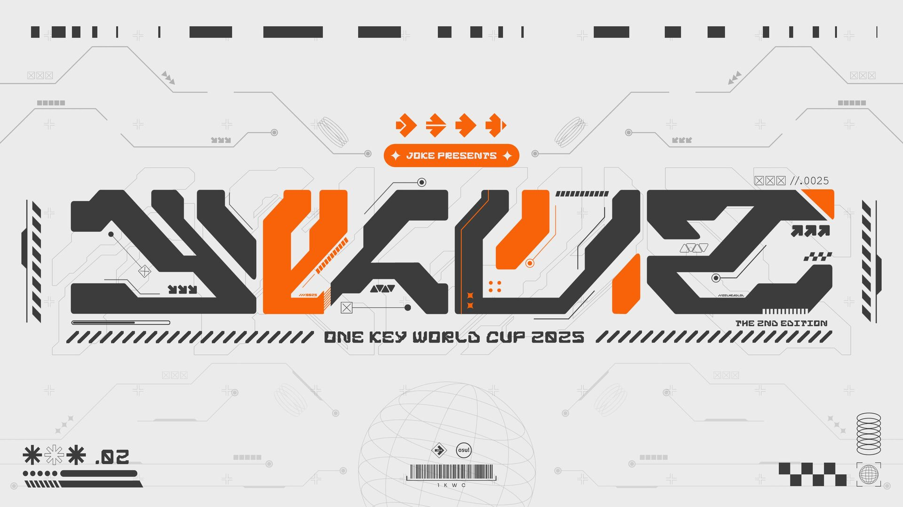

---
tags:
  - JOKE
  - 1KWC
  - 1KWC 2025
---

# One Key World Cup 2025

**One Key World Cup 2025** (***1KWC 2025***) was a country-based 2v2, double-elimination osu!mania 1-key tournament hosted by ::{ flag=AU }:: [Jaye](https://osu.ppy.sh/users/4841352).

## Tournament schedule

| Event | Timestamp |
| --: | :-- |
| Registration phase | 2025-04-02/2025-04-10 |
| Screening phase | 2025-04-11/2025-04-19 |
| Qualifiers showcase | 2025-04-20 |
| Qualifiers | 2025-04-26/2025-04-27 |
| Round of 20 | 2025-05-03/2025-05-04 |
| Round of 16 | 2025-05-10/2025-05-11 |
| Quarterfinals | 2025-05-17/2025-05-18 |
| Semifinals | 2025-05-24/2025-05-25 |
| Finals | 2025-05-31/2025-06-01 |
| Grand Finals | 2025-06-07/2025-06-08 |

## Prizes

| Placing | Prize(s) |
| :-: | :-- |
|  | profile badge |

## Organisation

| Position | Member(s) |
| :-- | :-- |
| Host | ::{ flag=AU }:: [Jaye](https://osu.ppy.sh/users/4841352) |
| Streamer | ::{ flag=US }:: [EpsilonMaiagare](https://osu.ppy.sh/users/3855052), ::{ flag=US }:: [ethfan922](https://osu.ppy.sh/users/10402769) |
| Commentator | ::{ flag=AU }:: [\[Iron\]](https://osu.ppy.sh/users/13171482), ::{ flag=AU }:: [Beat43210](https://osu.ppy.sh/users/5664171), ::{ flag=GB }:: [epic man 2](https://osu.ppy.sh/users/14566000), ::{ flag=US }:: [ERA Basil](https://osu.ppy.sh/users/7097990), ::{ flag=CA }:: [ERA Sunny](https://osu.ppy.sh/users/16468962), ::{ flag=AU }:: [Jaye](https://osu.ppy.sh/users/4841352), ::{ flag=US }:: [Sleeby Maddy](https://osu.ppy.sh/users/7001787), ::{ flag=US }:: [Sparky](https://osu.ppy.sh/users/3187959), ::{ flag=NZ }:: [Sparxe](https://osu.ppy.sh/users/5750235), ::{ flag=GB }:: [Teezel](https://osu.ppy.sh/users/7528639) |
| Referee | ::{ flag=GB }:: [--Dragon--](https://osu.ppy.sh/users/11924624), ::{ flag=VN }:: [\[LS\]Sagirium](https://osu.ppy.sh/users/16530364), ::{ flag=TH }:: [\[Ping\]](https://osu.ppy.sh/users/6291395), ::{ flag=US }:: [akace100](https://osu.ppy.sh/users/9308128), ::{ flag=NL }:: [Albionthegreat](https://osu.ppy.sh/users/9853595), ::{ flag=PL }:: [bapril](https://osu.ppy.sh/users/12726001), ::{ flag=US }:: [EpsilonMaiagare](https://osu.ppy.sh/users/3855052), ::{ flag=CA }:: [ERA Sunny](https://osu.ppy.sh/users/16468962), ::{ flag=FI }:: [Laurakko](https://osu.ppy.sh/users/7253731) |
| Designer | ::{ flag=MY }:: [Jerry](https://osu.ppy.sh/users/605973) |
| Statistician | ::{ flag=NL }:: [Albionthegreat](https://osu.ppy.sh/users/9853595), ::{ flag=AU }:: [Jaye](https://osu.ppy.sh/users/4841352) |

## Links

- [Discussion thread](https://osu.ppy.sh/community/forums/topics/2061386)
- [JOKE Discord server](https://discord.gg/35kN3dF)
- [Livestream](https://www.twitch.tv/jokeOfficial)
- [Tournament bracket](https://challonge.com/1KWC2025)
- Spreadsheets
  - **[Master](https://docs.google.com/spreadsheets/d/15Nb7ATN29NxQCKitzglF5OidP6XcEK8xypjzrqGtjbw)**
  - [Statistics](https://docs.google.com/spreadsheets/d/1r6umDyzR3KSCGu5c0jLrQS6BvpWTtVPFdecmhyyyiTs)

## Participants

|  | Country | Members |
| :-: | :-: | :-- |
| ::{ flag=CA }:: | **66% Canadian** | **[Verdon](https://osu.ppy.sh/users/14196373)**, [DimplesRMe](https://osu.ppy.sh/users/13348268), [TGJ Chocomist](https://osu.ppy.sh/users/19342423) |
| ::{ flag=AU }:: | **Australia** | **[Tsubasa2](https://osu.ppy.sh/users/6835183)**, [Eresh](https://osu.ppy.sh/users/8259292), [rango](https://osu.ppy.sh/users/7728466) |
| ::{ flag=DE }:: | **Autobahn Avengers** | **[datnonameboi](https://osu.ppy.sh/users/14217761)**, [jojo_flower](https://osu.ppy.sh/users/28236847) |
| ::{ flag=CN }:: | **China** | **[WLYMinato](https://osu.ppy.sh/users/12703319)**, [FORMless000](https://osu.ppy.sh/users/8697654), [Lubei_01](https://osu.ppy.sh/users/11692528), [eiqmy](https://osu.ppy.sh/users/35404573) |
| ::{ flag=HR }:: | **Croatia** | **[brainstorm](https://osu.ppy.sh/users/20846774)**, [VISIONASCEPT](https://osu.ppy.sh/users/29225346) |
| ::{ flag=US }:: | **Furnited States** | **[BR00KLYN](https://osu.ppy.sh/users/9199901)**, [cyger](https://osu.ppy.sh/users/20020441), [Sparky](https://osu.ppy.sh/users/3187959) |
| ::{ flag=DE }:: | **Germany** | **[Hopes](https://osu.ppy.sh/users/4907504)**, [TerliManor](https://osu.ppy.sh/users/3372322) |
| ::{ flag=ID }:: | **Idkdonesia** | **[Az-u](https://osu.ppy.sh/users/15801261)**, [ocaibo](https://osu.ppy.sh/users/30615609), [[GB]Xenotia-](https://osu.ppy.sh/users/13865224), [KinoJourney](https://osu.ppy.sh/users/15798093) |
| ::{ flag=JP }:: | **Japan** | **[Grape_Tea](https://osu.ppy.sh/users/9540073)**, [hz404](https://osu.ppy.sh/users/14947043), [[Crz]yomogi237](https://osu.ppy.sh/users/28571440), [SORA_T4kAhqSh1](https://osu.ppy.sh/users/30549266) |
| ::{ flag=MX }:: | **Mexico** | **[Znow](https://osu.ppy.sh/users/15513303)**, [happergamer](https://osu.ppy.sh/users/15513319), [[LS]Mari](https://osu.ppy.sh/users/15270411), [AsaelmasterHola](https://osu.ppy.sh/users/19311562) |
| ::{ flag=ID }:: | **Mixedonesia** | **[--Glitchy--](https://osu.ppy.sh/users/30644569)**, [Reihynn](https://osu.ppy.sh/users/16630515), [Noko_BSF](https://osu.ppy.sh/users/3811831), [Aikiyo Fuuka](https://osu.ppy.sh/users/5179764) |
| ::{ flag=NZ }:: | **New Zealand** | **[cyndrean](https://osu.ppy.sh/users/12872893)**, [Emilbus](https://osu.ppy.sh/users/11141578), [Dabble](https://osu.ppy.sh/users/10102221) |
| ::{ flag=NO }:: | **Norway** | **[Crustbell](https://osu.ppy.sh/users/7859738)**, [Ziquids](https://osu.ppy.sh/users/10972799) |
| ::{ flag=PE }:: | **Peru es clave** | **[alemagno333](https://osu.ppy.sh/users/11411697)**, [Dinki](https://osu.ppy.sh/users/23361435), [Brunixxx](https://osu.ppy.sh/users/16517079) |
| ::{ flag=PL }:: | **Poland** | **[Murtaj](https://osu.ppy.sh/users/18962055)**, [Beajek](https://osu.ppy.sh/users/12696546), [bagjettka](https://osu.ppy.sh/users/18338179) |
| ::{ flag=RS }:: | **Random States A** | **[JoseloFxD7](https://osu.ppy.sh/users/34362997)**, [mBiscuit](https://osu.ppy.sh/users/17061174), [Pacific Girls](https://osu.ppy.sh/users/9054531), [Dohland](https://osu.ppy.sh/users/5220511) |
| ::{ flag=RS }:: | **Random States B** | **[AdrianLazer](https://osu.ppy.sh/users/10292643)**, [ethfan922](https://osu.ppy.sh/users/10402769), [Paino](https://osu.ppy.sh/users/15599629), [Pop06](https://osu.ppy.sh/users/22620088) |
| ::{ flag=SE }:: | **Sweden** | **[diamondBlaze](https://osu.ppy.sh/users/10553827)**, [NeonDrakon](https://osu.ppy.sh/users/6315000), [TheKubaX](https://osu.ppy.sh/users/5186648), [Anders8KJS](https://osu.ppy.sh/users/36024737) |
| ::{ flag=TW }:: | **Taiwan** | **[wee](https://osu.ppy.sh/users/24533726)**, [masssss](https://osu.ppy.sh/users/30795600), [yth666h](https://osu.ppy.sh/users/20509581), [leegun](https://osu.ppy.sh/users/33413887) |
| ::{ flag=GB }:: | **United Kingdom** | **[MiniEgg_23](https://osu.ppy.sh/users/25914360)**, [Sparxe](https://osu.ppy.sh/users/5750235), [Teezel](https://osu.ppy.sh/users/7528639), [Zoobin4](https://osu.ppy.sh/users/10055204) |
| ::{ flag=US }:: | **United States** | **[Sleeby Maddy](https://osu.ppy.sh/users/7001787)**, [Sydosys](https://osu.ppy.sh/users/17523947), [ERA Basil](https://osu.ppy.sh/users/7097990), [ERA Dev](https://osu.ppy.sh/users/16407268) |
| ::{ flag=GB }:: | **United Tingdom** | **[TingMomentum](https://osu.ppy.sh/users/12489832)**, [Pulsing](https://osu.ppy.sh/users/19141386), [-XxbluezaperxX-](https://osu.ppy.sh/users/12264218) |

## Podium

This competition has come to an end and resulted in the following podium:

| Placing | Team |
| :-: | :-- |
|  | **Japan** (**[Grape_Tea](https://osu.ppy.sh/users/9540073)**, [hz404](https://osu.ppy.sh/users/14947043), [[Crz]yomogi237](https://osu.ppy.sh/users/28571440), [SORA_T4kAhqSh1](https://osu.ppy.sh/users/30549266)) |
|  | **United States** (**[Sleeby Maddy](https://osu.ppy.sh/users/7001787)**, [Sydosys](https://osu.ppy.sh/users/17523947), [ERA Basil](https://osu.ppy.sh/users/7097990), [ERA Dev](https://osu.ppy.sh/users/16407268)) |
|  | **United Kingdom** (**[MiniEgg_23](https://osu.ppy.sh/users/25914360)**, [Sparxe](https://osu.ppy.sh/users/5750235), [Teezel](https://osu.ppy.sh/users/7528639), [Zoobin4](https://osu.ppy.sh/users/10055204)) |

## Mappools

### Grand Finals

- Classic
  1. [cYsmix - Arcade Busters (Sparxe)](https://osu.ppy.sh/beatmapsets/1644998#mania/3357825)
  2. [w_tre - Shannon's Theorem (Sparxe)](https://osu.ppy.sh/beatmapsets/2101556#mania/4408817)
  3. [Krimek - The Dark (Jaye)](https://osu.ppy.sh/beatmapsets/2101556#mania/4408815)
  4. [Chroma - Field : Kaerezu no Chi (Jaye)](https://osu.ppy.sh/beatmapsets/2101556#mania/4408813)
  5. [technoplanet - Intuition (Jaye)](https://osu.ppy.sh/beatmapsets/2101558#mania/4408825)
  6. [Marmalade butcher - Floccinaucinihilipilification (Sparxe)](https://osu.ppy.sh/beatmapsets/2101558#mania/4408822)
  7. [UNDEAD CORPORATION - Embraced by the Flame (Jaye)](https://osu.ppy.sh/beatmapsets/1649296#mania/3366418)
- Old
  1. [t+pazolite - !!!Chaos Time!!! (Jaye)](https://osu.ppy.sh/beatmapsets/1238676#mania/2575398)
- Fan
  1. [stereoberry - ametsuchi (\[Iron\]) [downpour]](https://osu.ppy.sh/beatmapsets/2207397#mania/4674190)
  2. [BEMANI Sound Team "PHQUASE & ZAQUVA" - QQ (FORMless000) [MAGNUM OPUS]](https://osu.ppy.sh/beatmapsets/2180064#mania/4604943)
  3. [1KWC (-Kori)](https://osu.ppy.sh/beatmapsets/2087258#mania/5146385)
- New
  1. [KASHIWA Daisuke - Aqua Regia (Cut Ver.) (Jaye)](https://osu.ppy.sh/beatmapsets/2361967#mania/5146389)
  2. [Xeven - MMXVI (Jaye)](https://osu.ppy.sh/beatmapsets/2361967#mania/5146390)
- Tiebreaker
  1. **[TB | BilliumMoto & rN - 1KOSAHEDRA (Jaye, -Kori, \[Iron\]) [1NF1N1TY]](https://osu.ppy.sh/beatmapsets/2380729#mania/5146396)**

### Finals

- Classic
  1. [BilliumMoto - 1xMISS (Sparxe)](https://osu.ppy.sh/beatmapsets/2101556#mania/4408811)
  2. [LeaF - Kyouki Ranbu (Jaye)](https://osu.ppy.sh/beatmapsets/1644998#mania/3357829)
  3. [seatrus x Se-U-Ra - Weiss Schwarz (r1chyy)](https://osu.ppy.sh/beatmapsets/1644998#mania/3357831)
  4. [Creo - Challenger (Jaye)](https://osu.ppy.sh/beatmapsets/1649296#mania/3366411)
  5. [Jun Kuroda - Cybernetics (Jaye)](https://osu.ppy.sh/beatmapsets/1645002#mania/3357842)
  6. [Yooh - Heracles (Sparxe)](https://osu.ppy.sh/beatmapsets/2098412#mania/4401588)
  7. [Se-U-Ra - Tsui no Maihime (Jaye)](https://osu.ppy.sh/beatmapsets/1639184#mania/3345592)
- Old
  1. [fallen shepherd feat. RabbiTon Strings - ENDYMION (Jaye)](https://osu.ppy.sh/beatmapsets/1232556#mania/2562377)
- Fan
  1. [ZxNX - Schadenfreude (Sparxe) [Expert]](https://osu.ppy.sh/beatmapsets/1975850#mania/4100950)
  2. [MisomyL - Desive (superSSS) [Last Dream]](https://osu.ppy.sh/beatmapsets/2173658#mania/4588756)
  3. [Zekk - Quantum L3ap (hz404) [Rice]](https://osu.ppy.sh/beatmapsets/2197807#mania/4650937)
- New
  1. [Andromedik - Don't Say (osu! edit) (Jaye)](https://osu.ppy.sh/beatmapsets/2361967#mania/5135379)
  2. [Trina Lydia - Late-Night Rocket Ride (Jaye) [Distance]](https://osu.ppy.sh/beatmapsets/2377074#mania/5135381)
- Tiebreaker
  1. **[Cansol - Train of Thought (Jaye)](https://osu.ppy.sh/beatmapsets/2361968#mania/5135387)**

### Semifinals

- Classic
  1. [Fractal Dreamers - Gardens Under A Spring Sky (Jaye)](https://osu.ppy.sh/beatmapsets/1644998#mania/3357826)
  2. [NIWASHI - Astronote. (Jaye)](https://osu.ppy.sh/beatmapsets/2098409#mania/4401571)
  3. [tokiwa - Syuou Sange (Sparxe)](https://osu.ppy.sh/beatmapsets/2098409#mania/4401574)
  4. [Street - Hestia (r1chyy)](https://osu.ppy.sh/beatmapsets/1639184#mania/3345593)
  5. [OISHII - COCOA WATERSLIDE (r1chyy)](https://osu.ppy.sh/beatmapsets/1633213#mania/3333681)
  6. [Rabbit House - Gehenna (Jaye)](https://osu.ppy.sh/beatmapsets/2095335#mania/4393377)
- Old
  1. [Chaos City Niigata - Ukiyoe Yokochou (Jaye)](https://osu.ppy.sh/beatmapsets/1232556#mania/2562376)
- Fan
  1. [pm04034 - sn4pside (alemagno333) [pianito]](https://osu.ppy.sh/beatmapsets/2201615#mania/4659458)
  2. [We Own the Night (ERA Basil)](https://osu.ppy.sh/beatmapsets/2226890#mania/4738052)
- New
  1. [awfuless - Temptation (Jaye)](https://osu.ppy.sh/beatmapsets/2361967#mania/5124370)
  2. [Ardolf - FragmentOf(soul) (Jaye) [Radiance]](https://osu.ppy.sh/beatmapsets/2373226#mania/5124375)
- Tiebreaker
  1. **[Xyris - Reikoku Assassins (Jaye)](https://osu.ppy.sh/beatmapsets/2361968#mania/5124383)**

### Quarterfinals

- Classic
  1. [A-One feat. Rute & Aki - Scream out! (Cut Ver.) (Jaye)](https://osu.ppy.sh/beatmapsets/2091977#mania/4385136)
  2. [ICDD - Danzai No Honoo To Koibito-Tachi No Rondo (Jaye)](https://osu.ppy.sh/beatmapsets/1639181#mania/3345578)
  3. [Yunosuke - GLAZ (Jaye)](https://osu.ppy.sh/beatmapsets/2095334#mania/4393372)
  4. [IAHN - Transform (Original Mix) (Jaye)](https://osu.ppy.sh/beatmapsets/1644998#mania/3357828)
  5. [Aethral - It's Boss Time, dude (Jaye)](https://osu.ppy.sh/beatmapsets/2088535#mania/4376754)
  6. [MDK - Press Start (Jaye)](https://osu.ppy.sh/beatmapsets/1633216#mania/3333691)
- Old
  1. [sky_delta - Midnight City Warfare (Jaye)](https://osu.ppy.sh/beatmapsets/1232556#mania/2562380)
- Fan
  1. [Cansol - 1,2,3,4! (Teezel) [1,1,1,1!]](https://osu.ppy.sh/beatmapsets/2163496#mania/4562880)
  2. [Thaehan - Doki-Doki (NamesAreRubbish) [1k Crazy Godmode]](https://osu.ppy.sh/beatmapsets/573904#mania/1226569)
- New
  1. [0 K - Luminous * Ciel (Jaye)](https://osu.ppy.sh/beatmapsets/2361967#mania/5111853)
  2. [MYUKKE. - Seal the Deal (Jaye) [Alliance]](https://osu.ppy.sh/beatmapsets/2369288#mania/5111855)
- Tiebreaker
  1. **[Kou! - Youkaikakushi Nijyusekai (Jaye)](https://osu.ppy.sh/beatmapsets/2361968#mania/5111862)**

### Round of 16

- Classic
  1. [James Landino - Hide And Seek (Jaye)](https://osu.ppy.sh/beatmapsets/1626620#mania/3320788)
  2. [Sound Souler - Aqua Stars (Sparxe)](https://osu.ppy.sh/beatmapsets/1639181#mania/3345581)
  3. [PTB10 - Aeronautica (Jaye)](https://osu.ppy.sh/beatmapsets/2088535#mania/4376756)
  4. [False Noise - Space Angel (Cut Ver.) (Jaye)](https://osu.ppy.sh/beatmapsets/1626621#mania/3320794)
  5. [Rohi - Slan Leat (Jaye)](https://osu.ppy.sh/beatmapsets/1626621#mania/3320797)
- Old
  1. [E.G.G. - Got noir forever. (Jaye)](https://osu.ppy.sh/beatmapsets/1228113#mania/2553702)
- Fan
  1. [Shounen wa Sora wo Tadoru Prog Piano Remix (arpia97)](https://osu.ppy.sh/beatmapsets/1200685#mania/2500466)
- New
  1. [Grant Bowtie - Cloud Nine (Jaye)](https://osu.ppy.sh/beatmapsets/2361967#mania/5101838)
  2. [ZxNX - NULLPARS (Jaye) [Elegance]](https://osu.ppy.sh/beatmapsets/2365820#mania/5101848)
- Tiebreaker
  1. **[Our Stolen Theory - United (L.A.O.S Remix) (Jaye)](https://osu.ppy.sh/beatmapsets/2361968#mania/5101839)**

### Round of 20

- Classic
  1. [Origami Angel - The Title Track (Jaye)](https://osu.ppy.sh/beatmapsets/2078445#mania/4352065)
  2. [Fuki - Zekkai no Juliet (Jaye)](https://osu.ppy.sh/beatmapsets/1622250#mania/3312212)
  3. [Celldweller - Senorita Bonita (Jaye)](https://osu.ppy.sh/beatmapsets/1626620#mania/3320786)
  4. [Miss Bass & Rusty K - Palm Shot (Edit) (Cut Ver.) (Jaye)](https://osu.ppy.sh/beatmapsets/1626621#mania/3320796)
  5. [BLANKFIELD - Half Ghost (Jaye)](https://osu.ppy.sh/beatmapsets/1622253#mania/3312219)
- Old
  1. [ESTi X M2U - Obelisque (Jaye)](https://osu.ppy.sh/beatmapsets/1217957#mania/2534032)
- Fan
  1. [Jimmy Weckl - Icicles (Paturages) [Stalactite]](https://osu.ppy.sh/beatmapsets/1216278#mania/2530795)
- New
  1. [my sound life - waterflowing (Jaye)](https://osu.ppy.sh/beatmapsets/2361967#mania/5091329)
  2. [siqlo - Beyond the Decision (Jaye) [Defiance]](https://osu.ppy.sh/beatmapsets/2361970#mania/5091332)
- Tiebreaker
  1. **[Dazuko as "Kazuya" - Pixel Love (Feeling Naughty) (Jaye)](https://osu.ppy.sh/beatmapsets/2361968#mania/5091330)**

### Qualifiers

1. [nekodex - Moonlight Feast (Cut Ver.) (Jaye)](https://osu.ppy.sh/beatmapsets/2358104#mania/5079998)
2. [Kagetora. - Reimei (Jaye)](https://osu.ppy.sh/beatmapsets/2358104#mania/5079997)
3. [Akiri - Backlash (Jaye)](https://osu.ppy.sh/beatmapsets/2358104#mania/5079995)
4. [Virtual Self - Particle Arts (Jaye)](https://osu.ppy.sh/beatmapsets/2358104#mania/5079999)
5. [Ben Briggs - Fearless Living (Jaye)](https://osu.ppy.sh/beatmapsets/2358104#mania/5079996)
6. [Krimek feat. eili - Aquira  (Jaye) [Entrance]](https://osu.ppy.sh/beatmapsets/2358106#mania/5080003)

## Match results

### Grand Finals

Saturday, 7 June 2025:

| Team 1 |  |  | Team 2 | Match link |
| --: | :-: | :-: | :-- | :-: |
| United Kingdom ::{ flag=GB }:: | 3 | **7** | ::{ flag=US }:: **United States** |  |

Sunday, 8 June 2025:

| Team 1 |  |  | Team 2 | Match link |
| --: | :-: | :-: | :-- | :-: |
| **Japan** ::{ flag=JP }:: | **7** | 2 | ::{ flag=US }:: United States |  |

### Finals

Saturday, 31 May 2025:

| Team 1 |  |  | Team 2 | Match link |
| --: | :-: | :-: | :-- | :-: |
| **United States** ::{ flag=US }:: | **7** | 0 | ::{ flag=CN }:: China |  |
| **United Tingdom** ::{ flag=GB }:: | **7** | 0 | ::{ flag=US }:: Furnited States |  |
| **United States** ::{ flag=US }:: | **7** | 0 | ::{ flag=GB }:: United Tingdom |  |

Sunday, 1 June 2025:

| Team 1 |  |  | Team 2 | Match link |
| --: | :-: | :-: | :-- | :-: |
| **Japan** ::{ flag=JP }:: | **7** | 0 | ::{ flag=GB }:: United Kingdom |  |

### Semifinals

Friday, 23 May 2025:

| Team 1 |  |  | Team 2 | Match link |
| --: | :-: | :-: | :-- | :-: |
| **Sweden** ::{ flag=SE }:: | **6** | 1 | ::{ flag=ID }:: Idkdonesia |  |

Saturday, 24 May 2025:

| Team 1 |  |  | Team 2 | Match link |
| --: | :-: | :-: | :-- | :-: |
| **China** ::{ flag=CN }:: | **6** | 0 | ::{ flag=AU }:: Australia |  |
| **Japan** ::{ flag=JP }:: | **6** | 1 | ::{ flag=US }:: United States |  |
| **Mexico** ::{ flag=MX }:: | **6** | 1 | ::{ flag=CA }:: 66% Canadian |  |

Sunday, 25 May 2025:

| Team 1 |  |  | Team 2 | Match link |
| --: | :-: | :-: | :-- | :-: |
| Mexico ::{ flag=MX }:: | 3 | **6** | ::{ flag=CN }:: **China** |  |
| **Furnited States** ::{ flag=US }:: | **6** | 1 | ::{ flag=PE }:: Peru es clave |  |
| **United Kingdom** ::{ flag=GB }:: | **6** | 1 | ::{ flag=GB }:: United Tingdom |  |
| **Furnited States** ::{ flag=US }:: | **6** | 0 | ::{ flag=SE }:: Sweden |  |

### Quarterfinals

Saturday, 17 May 2025:

| Team 1 |  |  | Team 2 | Match link |
| --: | :-: | :-: | :-- | :-: |
| **Japan** ::{ flag=JP }:: | **6** | 0 | ::{ flag=SE }:: Sweden |  |
| Mexico ::{ flag=MX }:: | 1 | **6** | ::{ flag=GB }:: **United Tingdom** |  |
| Random States A ::{ flag=US }:: | 0 | **6** | ::{ flag=CA }:: **66% Canadian** |  |

Sunday, 18 May 2025:

| Team 1 |  |  | Team 2 | Match link |
| --: | :-: | :-: | :-- | :-: |
| **United States** ::{ flag=US }:: | **6** | 1 | ::{ flag=US }:: Furnited States |  |
| Norway ::{ flag=NO }:: | 2 | **6** | ::{ flag=AU }:: **Australia** |  |
| **Idkdonesia** ::{ flag=ID }:: | **6** | 4 | ::{ flag=ID }:: Mixedonesia |  |
| Taiwan ::{ flag=TW }:: | 0 | **6** | ::{ flag=PE }:: **Peru es clave** |  |
| **United Kingdom** ::{ flag=GB }:: | **6** | 4 | ::{ flag=CN }:: China |  |

### Round of 16

Saturday, 10 May 2025:

| Team 1 |  |  | Team 2 | Match link |
| --: | :-: | :-: | :-- | :-: |
| **United Kingdom** ::{ flag=GB }:: | **5** | 0 | ::{ flag=TW }:: Taiwan |  |
| 66% Canadian ::{ flag=CA }:: | 0 | **5** | ::{ flag=SE }:: **Sweden** |  |
| **United States** ::{ flag=US }:: | **5** | 0 | ::{ flag=NO }:: Norway |  |

Sunday, 11 May 2025:

| Team 1 |  |  | Team 2 | Match link |
| --: | :-: | :-: | :-- | :-: |
| **Furnited States** ::{ flag=US }:: | **5** | 0 | ::{ flag=AU }:: Australia |  |
| **Japan** ::{ flag=JP }:: | **5** | 0 | ::{ flag=US }:: Random States A |  |
| Peru es clave ::{ flag=PE }:: | 0 | **5** | ::{ flag=CN }:: **China** |  |
| **Mexico** ::{ flag=MX }:: | **5** | 2 | ::{ flag=ID }:: Idkdonesia |  |
| **United Tingdom** ::{ flag=GB }:: | **5** | 0 | ::{ flag=ID }:: Mixedonesia |  |

### Round of 20

Saturday, 3 May 2025:

| Team 1 |  |  | Team 2 | Match link |
| --: | :-: | :-: | :-- | :-: |
| **Japan** ::{ flag=JP }:: | **5** | 0 | ::{ flag=AU }:: Australia |  |
| **Random States A** ::{ flag=US }:: | **5** | 3 | ::{ flag=HR }:: Croatia |  |
| **Norway** ::{ flag=NO }:: | **5** | 0 | ::{ flag=DE }:: Autobahn Avengers |  |
| **Furnited States** ::{ flag=US }:: | **5** | 1 | ::{ flag=CA }:: 66% Canadian |  |

Sunday, 4 May 2025:

| Team 1 |  |  | Team 2 | Match link |
| --: | :-: | :-: | :-- | :-: |
| China ::{ flag=CN }:: | 1 | **5** | ::{ flag=MX }:: **Mexico** |  |
| **Idkdonesia** ::{ flag=ID }:: | **5** | 0 | ::{ flag=PL }:: Poland |  |
| **United Kingdom** ::{ flag=GB }:: | **5** | 0 | ::{ flag=ID }:: Mixedonesia |  |
| Random States B ::{ flag=US }:: | 1 | **5** | ::{ flag=TW }:: **Taiwan** |  |
| **United Tingdom** ::{ flag=GB }:: | **5** | 1 | ::{ flag=PE }:: Peru es clave |  |
| **United States** ::{ flag=US }:: | **5** | 0 | ::{ flag=SE }:: Sweden |  |

### Qualifiers

Seeding results are calculated based on rank sum across the 6 qualifier stages, with average score used to break ties. The results of the Qualifiers can be found in [this spreadsheet](https://docs.google.com/spreadsheets/d/1r6umDyzR3KSCGu5c0jLrQS6BvpWTtVPFdecmhyyyiTs).

## Ruleset

### Tournament Information

1. One Key World Cup 2025 (1KWC 2025) is a 2v2 tournament with team sizes of 2-4.
2. Beatmap scoring is based on **Team VS**, **ScoreV2**.
3. All maps used in the tournament are dedicated 1-key osu!mania maps.
4. The tournament is Free Mod: players are allowed to use Hidden, Fade In, Flashlight, Mirror, any of the xK mods, or No Mod.
5. The NF mod may be used but is not mandatory; failed scores do not count to the end result.
6. If a map ends in a draw: the beatmap will be replayed. If the map ends in a draw: Picker's Privilege - the team that picked the map will be awarded 1 point, and the match will proceed as normal. In the unlikely event that a draw happens on the Tiebreaker map, the map will be replayed.
   - Teams cannot win a match via the Picker's Privilege rule. In cases where this would occur the map will be replayed until a winner is decided.
7. If a player disconnects: they are treated as if they failed. Map aborting for a "false start" is up to the referee's discretion (and is guaranteed to take place if a disconnect occurs within the first 30 seconds of a map).
8. The usual osu! rules apply; therefore, macroing and the likes is strictly prohibited. If you want to be 100% safe, please just use one key for input. If you want to try something unique out for yourself: don't hesitate to ask staff if your play method is allowed.
9. Please be kind to other players and members of staff; referees have the ability to issue punishments to players or teams based on the severity of rudeness/disruptiveness.

### Registrations

1. The registration form can be found both on the Master Sheet as well as in our Discord server.
2. Participants are required to both complete the form and be a member of our Discord server. This is for identification/legitimacy of registration purposes and for convenience in posting updates about the tournament. If the registration form is filled out and the user is not present in the server when the Registration Phase concludes they will automatically be withdrawn from the registrant list.
3. In cases where a registration for a full team has been completed: the first player listed will automatically be designated as the team captain (this may be changed). In all other cases: captaincy will be discussed by the team members once a team is constructed.
4. It is possible for some regions to merge if desired, and other countries to have multiple teams (ie. A-team and B-team). If captains are interested in this, please contact the tournament host to discuss.
5. There are no restrictions for signing up: any rank, any mode, any region is allowed. Please note that osu! tournament staff hold the right to screen you out of the tournament.

### Stage Instructions

1. The first weekend will be the Qualifiers. Team captains will nominate a day/time for their team to participate. All teams will then play through the Qualifiers mappool, followed by a 5 minute break (Teams may opt to skip this), and then through the Qualifiers mappool for a second time (Teams may opt to skip playing certain maps again, or the whole pool).
2. Following Qualifiers will be the Round of 20.
   - Teams seeded 1st - 12th will play in a no-elimination match where the higher seeded team will fight to retain their seed; if the lower seeded team wins this matchup: both teams will swap seeds heading into the Round of 16.
   - Teams seeded 13th - 20th will play in a single-elimination match with the winner advancing to the Round of 16. Their seed will be equal to the higher seeded team of their respective matchup.
3. The Bracket Stage (following the Round of 20) is double-elimination.
4. The winning condition for each stage is as follows:

| Round | Format |
| --: | :-- |
| Round of 20 | Best of 9 |
| Round of 16 | Best of 9 |
| Quarterfinals | Best of 11 |
| Semifinals | Best of 11 |
| Finals | Best of 13 |
| Grand Finals | Best of 13 |

### Match Instructions

1. A referee will create a multiplayer room approx 10 minutes in advance. Players must gather during this period.
2. Room settings are `Game mode: "osu!mania"`, `Team mode: "Team VS"`, `Score mode: "ScoreV2"`. Room name must be `1KWC: Qualifiers ({team})` for Qualifiers, and `1KWC: ({Red Team}) vs ({Blue Team})` for every other round.
3. Teams will be listed as having forfeited should they fail to gather at least 2 eligible players 10 minutes after the scheduled match time.
4. This tournament will not feature warmups.
5. There will be no bans in this tournament.
6. The team captain must use `!roll` in #multiplayer. If the captain is unavailable: a member of that team must be nominated for the roll.
   - The winner of the `!roll` will proceed to pick the first map of the pool.
7. In case of a tie at the penultimate point needed to win, the tiebreaker map will be played.

### Mappool Instructions

1. There will be one mappool per week.
2. The maps used in this tournament are all from the [JOKE](/wiki/Tournaments/JOKE) series of tournaments ([JOKE](/wiki/Tournaments/JOKE/1), [JOKE2](/wiki/Tournaments/JOKE/2), and [JOKE3](/wiki/Tournaments/JOKE/3)) complemented with a handful of new maps. The pools for each round will be revealed after the conclusion of all matches in the previous round.
3. Mappools do not contain mod categories, but are instead categorised as follows: Classic, Old, Fan, New, Tiebreaker.
4. The size of the mappool will increase by 2 when the win condition calls for it (see [Stage Instructions](#stage-instructions)).

### Scheduling Instructions

1. Each stage will be held on a single weekend.
2. Scheduling will be handled by the staff team; match times will be based on the local times of the participating countries.
3. To successfully complete a reschedule: agreement between the captains of the competing teams must be provided (excluding Qualifiers, where teams are free to pick a lobby time that they wish to enter).
4. The deadline for rescheduling is always **Wednesday, 23:59 UTC**. The latest a match can be rescheduled to is **Sunday, 19:00 UTC**. Times outside of this range or reschedules requested after the deadline are subject to staff availability and may be rejected.
