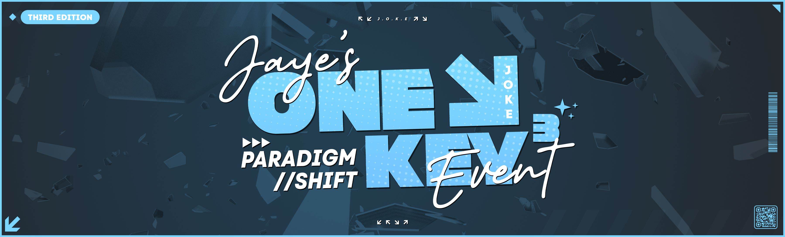
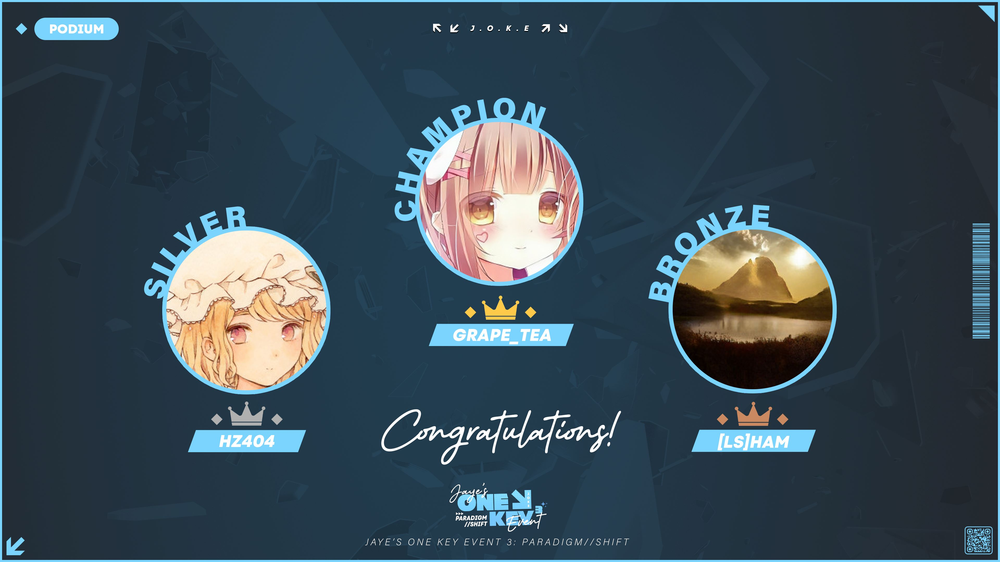

---
tags:
  - JOKE
  - JOKE 3
---

# Jaye's One Key Event 3: paradigm//SHIFT

**Jaye's One Key Event 3: paradigm//SHIFT** (***JOKE***) was a 1v1, double-elimination, global osu!mania 1-key tournament hosted by ::{ flag=AU }:: [Jaye](https://osu.ppy.sh/users/4841352) and ::{ flag=NZ }:: [Sparxe](https://osu.ppy.sh/users/5750235). It was the third instalment in the JOKE series.

## Tournament schedule

| Event | Timestamp |
| --: | :-- |
| Registration phase | 2023-10-05/2023-10-20 |
| Screening phase | 2023-10-21/2023-10-27 |
| Qualifiers showcase | 2023-10-22 |
| Qualifiers | 2023-10-28/2023-10-29 |
| Round of 32 | 2023-11-11/2023-11-12 |
| Round of 16 | 2023-11-18/2023-11-19 |
| Quarterfinals | 2023-11-25/2023-11-26 |
| Semifinals | 2023-12-02/2023-12-03 |
| Finals | 2023-12-09/2023-12-10 |
| Grand Finals | 2023-12-16/2023-12-17 |

## Prizes

| Placing | Prize(s) |
| :-: | :-- |
|  | $405 AUD, profile badge |
|  | $225 AUD |
|  | $126 AUD |
| 4th place | $72 AUD |
| 5th-6th place | $36 AUD |

## Organisation

| Position | Member(s) |
| :-- | :-- |
| Host | ::{ flag=AU }:: [Jaye](https://osu.ppy.sh/users/4841352), ::{ flag=NZ }:: [Sparxe](https://osu.ppy.sh/users/5750235) |
| Mapper | ::{ flag=AU }:: [Jaye](https://osu.ppy.sh/users/4841352), ::{ flag=FR }:: [Paturages](https://osu.ppy.sh/users/1375479), ::{ flag=NZ }:: [Sparxe](https://osu.ppy.sh/users/5750235) |
| Playtester | ::{ flag=AU }:: [r1chyy](https://osu.ppy.sh/users/11499467) |
| Streamer | ::{ flag=NL }:: [Albionthegreat](https://osu.ppy.sh/users/9853595), ::{ flag=US }:: [Dynascape](https://osu.ppy.sh/users/8784587), ::{ flag=US }:: [EpsilonMaiagare](https://osu.ppy.sh/users/3855052), ::{ flag=US }:: [ethfan922](https://osu.ppy.sh/users/10402769), ::{ flag=VN }:: [rock-on](https://osu.ppy.sh/users/9676089) |
| Commentator | ::{ flag=NL }:: [Albionthegreat](https://osu.ppy.sh/users/9853595), ::{ flag=AU }:: [Beat43210](https://osu.ppy.sh/users/5664171), ::{ flag=US }:: [Dynascape](https://osu.ppy.sh/users/8784587), ::{ flag=FR }:: [Paturages](https://osu.ppy.sh/users/1375479), ::{ flag=US }:: [Sparky](https://osu.ppy.sh/users/3187959), ::{ flag=NZ }:: [Sparxe](https://osu.ppy.sh/users/5750235), ::{ flag=GB }:: [Teezel](https://osu.ppy.sh/users/7528639), ::{ flag=US }:: [trooperr](https://osu.ppy.sh/users/32028459), ::{ flag=CA }:: [walmart5193](https://osu.ppy.sh/users/16468962) |
| Designer | ::{ flag=MY }:: [Jerry](https://osu.ppy.sh/users/605973) |
| Referee | ::{ flag=TH }:: [\[Ping\]](https://osu.ppy.sh/users/6291395), ::{ flag=US }:: [akace100](https://osu.ppy.sh/users/9308128), ::{ flag=HK }:: [Akali393394](https://osu.ppy.sh/users/9686628), ::{ flag=AU }:: [Beat43210](https://osu.ppy.sh/users/5664171), ::{ flag=US }:: [Dynascape](https://osu.ppy.sh/users/8784587), ::{ flag=US }:: [EpsilonMaiagare](https://osu.ppy.sh/users/3855052), ::{ flag=PE }:: [ERA Xuste](https://osu.ppy.sh/users/17989444), ::{ flag=AU }:: [Fairy Bread](https://osu.ppy.sh/users/8306102), ::{ flag=NZ }:: [Firefaux](https://osu.ppy.sh/users/15146838), ::{ flag=VN }:: [rock-on](https://osu.ppy.sh/users/9676089), ::{ flag=AU }:: [shnacc](https://osu.ppy.sh/users/11373924), ::{ flag=NZ }:: [Sparxe](https://osu.ppy.sh/users/5750235), ::{ flag=US }:: [trooperr](https://osu.ppy.sh/users/32028459), ::{ flag=CA }:: [walmart5193](https://osu.ppy.sh/users/16468962) |
| Statistician | ::{ flag=NL }:: [Albionthegreat](https://osu.ppy.sh/users/9853595), ::{ flag=AU }:: [Jaye](https://osu.ppy.sh/users/4841352) |

## Links

- [Discussion thread](https://osu.ppy.sh/community/forums/topics/1829307)
- [JOKE Discord server](https://discord.gg/35kN3dF)
- [Livestream](https://www.twitch.tv/jokeOfficial)
- [Tournament bracket](https://challonge.com/Jaye1K2023)
- Spreadsheets
  - **[Master](https://docs.google.com/spreadsheets/d/1Q3NTkMSpp-scnYrjrbVoCzXNaiTALDNcc7Fk3rMgVdI)**
  - [Mappools](https://docs.google.com/spreadsheets/d/1dOsqRLoOLJbYBaTThLqaugmGpZx34RBcVzAADcwhSGk)
  - [Statistics](https://docs.google.com/spreadsheets/d/12XzTFONCiuS5cQWntHxSi3xVEo6UIBnCI7xc8BwmX2o)

## Participants

| Seed | Player |
| :-- | :-- |
| 1 | ::{ flag=US }:: [\[LS\]Ham](https://osu.ppy.sh/users/17523947) |
| 2 | ::{ flag=JP }:: [Grape_Tea](https://osu.ppy.sh/users/9540073) |
| 3 | ::{ flag=JP }:: [hz404](https://osu.ppy.sh/users/14947043) |
| 4 | ::{ flag=BR }:: [SillyFangirl](https://osu.ppy.sh/users/2288363) |
| 5 | ::{ flag=DE }:: [ERA Punish](https://osu.ppy.sh/users/10615367) |
| 6 | ::{ flag=GB }:: [Teezel](https://osu.ppy.sh/users/7528639) |
| 7 | ::{ flag=BR }:: [Brasil](https://osu.ppy.sh/users/3949268) |
| 8 | ::{ flag=US }:: [Backfire](https://osu.ppy.sh/users/263110) |
| 9 | ::{ flag=AU }:: [Blobby3000](https://osu.ppy.sh/users/6916774) |
| 10 | ::{ flag=IT }:: [D3kuu](https://osu.ppy.sh/users/7807444) |
| 11 | ::{ flag=JP }:: [Maimaing](https://osu.ppy.sh/users/14520910) |
| 12 | ::{ flag=TH }:: [ZeroKungz](https://osu.ppy.sh/users/23155757) |
| 13 | ::{ flag=FR }:: [Adri](https://osu.ppy.sh/users/4579132) |
| 14 | ::{ flag=ID }:: [XK2238](https://osu.ppy.sh/users/1139209) |
| 15 | ::{ flag=US }:: [BugsLife](https://osu.ppy.sh/users/12903478) |
| 16 | ::{ flag=US }:: [Sparky](https://osu.ppy.sh/users/3187959) |
| 17 | ::{ flag=US }:: [cyger](https://osu.ppy.sh/users/20020441) |
| 18 | ::{ flag=CL }:: [-Kori](https://osu.ppy.sh/users/12490530) |
| 19 | ::{ flag=US }:: [Delta386](https://osu.ppy.sh/users/10352045) |
| 20 | ::{ flag=US }:: [Jakson](https://osu.ppy.sh/users/8788058) |
| 21 | ::{ flag=JP }:: [dectopia](https://osu.ppy.sh/users/2845904) |
| 22 | ::{ flag=CA }:: [DimplesRMe](https://osu.ppy.sh/users/13348268) |
| 23 | ::{ flag=DE }:: [ERA Sirbeyy](https://osu.ppy.sh/users/12917829) |
| 24 | ::{ flag=ID }:: [Xicyte](https://osu.ppy.sh/users/10212581) |
| 25 | ::{ flag=US }:: [ForestMastr](https://osu.ppy.sh/users/9199901) |
| 26 | ::{ flag=GB }:: [MiniEgg_23](https://osu.ppy.sh/users/25914360) |
| 27 | ::{ flag=BR }:: [Pluko](https://osu.ppy.sh/users/15813305) |
| 28 | ::{ flag=CA }:: [Nathan7978](https://osu.ppy.sh/users/8599166) |
| 29 | ::{ flag=GB }:: [--Dragon--](https://osu.ppy.sh/users/11924624) |
| 30 | ::{ flag=PH }:: [DaMeMeThEiFxD](https://osu.ppy.sh/users/14324153) |
| 31 | ::{ flag=AR }:: [APRL03](https://osu.ppy.sh/users/11394892) |
| 32 | ::{ flag=MX }:: [happergamer](https://osu.ppy.sh/users/15513319) |

## Podium

This competition has come to an end and resulted in the following podium:

| Placing | Player |
| :-: | :-- |
|  | ::{ flag=JP }:: [Grape_Tea](https://osu.ppy.sh/users/9540073) |
|  | ::{ flag=JP }:: [hz404](https://osu.ppy.sh/users/14947043) |
|  | ::{ flag=US }:: [\[LS\]Ham](https://osu.ppy.sh/users/17523947) |

 

## Mappools

### Grand Finals

- Rice
  1. [BilliumMoto - 1xMISS (Sparxe)](https://osu.ppy.sh/beatmapsets/2101556#mania/4408811)
  2. [Wiklund - Crystal Dimension (Sparxe)](https://osu.ppy.sh/beatmapsets/2101556#mania/4408818)
  3. [Krimek - The Dark (Jaye)](https://osu.ppy.sh/beatmapsets/2101556#mania/4408815)
  4. [w_tre - Shannon's Theorem (Sparxe)](https://osu.ppy.sh/beatmapsets/2101556#mania/4408817)
- Stream
  1. [Camellia - FINAL BLENDERMAN APPEARED. (feat. RichaadEB) (Sparxe)](https://osu.ppy.sh/beatmapsets/2101556#mania/4408812)
- LN
  1. [Snail's House - Ma Chouchoute (Cut Ver.) (Sparxe)](https://osu.ppy.sh/beatmapsets/2101556#mania/4408816)
  2. [Chroma - Field: Kaerezu no Chi (Jaye)](https://osu.ppy.sh/beatmapsets/2101556#mania/4408813)
  3. [Kommisar - Clover (Jaye)](https://osu.ppy.sh/beatmapsets/2101556#mania/4408814)
- Hybrid
  1. [Marmalade butcher - Floccinaucinihilipilification (Sparxe)](https://osu.ppy.sh/beatmapsets/2101558#mania/4408822)
  2. [technoplanet - Intuition (Jaye)](https://osu.ppy.sh/beatmapsets/2101558#mania/4408825)
  3. [69 de 74 - LWVIIX (Jaye)](https://osu.ppy.sh/beatmapsets/2101558#mania/4408820)
  4. [ZxNX as "Delaina" - End Me (Cut Ver.) (Sparxe)](https://osu.ppy.sh/beatmapsets/2101558#mania/4408826)
- Speed
  1. [Rish feat. Choko - Punai Punai Gensou (Sparxe)](https://osu.ppy.sh/beatmapsets/2101558#mania/4408823)
  2. [Kobaryo - HUG AND KILL (Sparxe)](https://osu.ppy.sh/beatmapsets/2101558#mania/4408821)
- SV
  1. [Spire - Libidinem (Cut Ver.) (Paturages)](https://osu.ppy.sh/beatmapsets/2101558#mania/4408824)
- Tiebreaker
  1. **[ZxNX & Sot-C - 1KONOS (Jaye) [1NF1N1TY]](https://osu.ppy.sh/beatmapsets/2101561#mania/4408834)**

### Finals

- Rice
  1. [NIWASHI - Astronote. (Jaye)](https://osu.ppy.sh/beatmapsets/2098409#mania/4401571)
  2. [II-L - VANGUARD-1 (Jaye)](https://osu.ppy.sh/beatmapsets/2098409#mania/4401570)
  3. [xi - Mirage Garden (Jaye)](https://osu.ppy.sh/beatmapsets/2098409#mania/4401575)
- Stream
  1. [Raimukun - Nyarlathotep's Dreamland (Sparxe)](https://osu.ppy.sh/beatmapsets/2098409#mania/4401572)
- LN
  1. [tokiwa - Syuou Sange (Sparxe)](https://osu.ppy.sh/beatmapsets/2098409#mania/4401574)
  2. [HyuN feat. LyuU - CROSS OVER (Sparxe)](https://osu.ppy.sh/beatmapsets/2098409#mania/4401569)
  3. [Synthion - VIVIDVELOCITY (Jaye)](https://osu.ppy.sh/beatmapsets/2098409#mania/4401573)
- Hybrid
  1. [Sot-C - Deep Ocean (Sparxe)](https://osu.ppy.sh/beatmapsets/2098412#mania/4401587)
  2. [Yooh - Heracles (Sparxe)](https://osu.ppy.sh/beatmapsets/2098412#mania/4401588)
  3. [Sephid - Epistrofi (Sparxe)](https://osu.ppy.sh/beatmapsets/2098412#mania/4401586)
- Speed
  1. [Aquellex - Wanderflux (Sparxe)](https://osu.ppy.sh/beatmapsets/2098412#mania/4401584)
  2. [ABSOLUTE CASTAWAY - Ouka Enbu (Jaye)](https://osu.ppy.sh/beatmapsets/2098412#mania/4401583)
- SV
  1. [AAAA - w = addict (Paturages)](https://osu.ppy.sh/beatmapsets/2098412#mania/4401582)
- Tiebreaker
  1. **[Kurokotei feat. Sennzai - escape (the looking-glass, and what alice found there) (Sparxe)](https://osu.ppy.sh/beatmapsets/2098412#mania/4401585)**

### Semifinals

- Rice
  1. [LandRoot - Need To De-stress (Jaye)](https://osu.ppy.sh/beatmapsets/2095334#mania/4393369)
  2. [Jun Kuroda - Anokumene (Jaye)](https://osu.ppy.sh/beatmapsets/2095334#mania/4393368)
  3. [Alkome - Run to You (Jaye)](https://osu.ppy.sh/beatmapsets/2095334#mania/4393367)
- Stream
  1. [m108 - XIII Charlotte (Jaye)](https://osu.ppy.sh/beatmapsets/2095334#mania/4393370)
- LN
  1. [MYUKKE. - The 89's Momentum (Jaye)](https://osu.ppy.sh/beatmapsets/2095334#mania/4393371)
  2. [Yunosuke - GLAZ (Jaye)](https://osu.ppy.sh/beatmapsets/2095334#mania/4393372)
  3. [Aiyru - Elevator (Jaye)](https://osu.ppy.sh/beatmapsets/2095334#mania/4393366)
- Hybrid
  1. [Tedjimo yomigY - Edelweiss (Sparxe)](https://osu.ppy.sh/beatmapsets/2095335#mania/4393379)
  2. [ISOMERZ (DJ Raisei + seatrus) - Symmetric (Jaye)](https://osu.ppy.sh/beatmapsets/2095335#mania/4393373)
  3. [METAROOM - .ANGEL (Sparxe)](https://osu.ppy.sh/beatmapsets/2095335#mania/4393375)
- Speed
  1. [Rabbit House - Gehenna (Jaye)](https://osu.ppy.sh/beatmapsets/2095335#mania/4393377)
  2. [Masahiro "Godspeed" Aoki - The Game Changer (Jaye)](https://osu.ppy.sh/beatmapsets/2095335#mania/4393374)
- SV
  1. [onumi - spider tank (Paturages)](https://osu.ppy.sh/beatmapsets/2095335#mania/4393376)
- Tiebreaker
  1. **[Sad Keyboard Guy, Myntian & Sleepless - Chroma//Surge (Sparxe)](https://osu.ppy.sh/beatmapsets/2095335#mania/4393378)**

### Quarterfinals

- Rice
  1. [Venetian Snares - Shaky Sometimes (Sparxe)](https://osu.ppy.sh/beatmapsets/2091977#mania/4385147)
  2. [A-One feat. Rute & Aki - Scream out! (Cut Ver.) (Jaye)](https://osu.ppy.sh/beatmapsets/2091977#mania/4385136)
  3. [CHON - Ghost (Jaye)](https://osu.ppy.sh/beatmapsets/2091977#mania/4385138)
- Stream
  1. [Cres. - End Time (Sparxe)](https://osu.ppy.sh/beatmapsets/2091977#mania/4385139)
- LN
  1. [Boom Kitty - Warzone (Jaye)](https://osu.ppy.sh/beatmapsets/2091977#mania/4385137)
  2. [dark cat - hot chocolate (Sparxe)](https://osu.ppy.sh/beatmapsets/2091977#mania/4385141)
- Hybrid
  1. [Mameyudoufu - Quality Control (Cut Ver.) (Sparxe)](https://osu.ppy.sh/beatmapsets/2091977#mania/4385143)
  2. [Se-U-Ra - Empuxa (Jaye)](https://osu.ppy.sh/beatmapsets/2091977#mania/4385144)
  3. [Tanchiky - STEP BY STEP (Jaye)](https://osu.ppy.sh/beatmapsets/2091977#mania/4385146)
- Speed
  1. [ELFENSJoN - INHERIT (Jaye)](https://osu.ppy.sh/beatmapsets/2091977#mania/4385142)
- SV
  1. [C-Show - DROP THE RAVE (Paturages)](https://osu.ppy.sh/beatmapsets/2091977#mania/4385140)
- Tiebreaker
  1. **[Street - Aiwv (Sparxe)](https://osu.ppy.sh/beatmapsets/2091977#mania/4385145)**

### Round of 16

- Rice
  1. [Kurubukko vs. yukitani - Minamichita EVOLVED (Jaye)](https://osu.ppy.sh/beatmapsets/2088535#mania/4376751)
  2. [DJ Mashiro - Prismatic Lollipops (Sparxe)](https://osu.ppy.sh/beatmapsets/2088535#mania/4376749)
  3. [P4koo - Crystal Illusion (Sparxe)](https://osu.ppy.sh/beatmapsets/2088535#mania/4376753)
- Stream
  1. [LV.4 - Angel dust (2016 Radio Mix) (Sparxe)](https://osu.ppy.sh/beatmapsets/2088535#mania/4376752)
- LN
  1. [Amidst - Treat (Cut Ver.) (Jaye)](https://osu.ppy.sh/beatmapsets/2088535#mania/4376748)
  2. [Good Kid - Faster (Sparxe)](https://osu.ppy.sh/beatmapsets/2088535#mania/4376750)
- Hybrid
  1. [PTB10 - Aeronautica (Jaye)](https://osu.ppy.sh/beatmapsets/2088535#mania/4376756)
  2. [Aethral - It's Boss Time, dude (Jaye)](https://osu.ppy.sh/beatmapsets/2088535#mania/4376754)
  3. [fiend - Fever Dream (feat. yzzyx) (Jaye)](https://osu.ppy.sh/beatmapsets/2088535#mania/4376745)
- Speed
  1. [INNOCENT NOIZE - Reverse Clock (Cut Ver.) (Jaye)](https://osu.ppy.sh/beatmapsets/2088535#mania/4376746)
- SV
  1. [James Landino - Anti Hero (Paturages)](https://osu.ppy.sh/beatmapsets/2088535#mania/4376755)
- Tiebreaker
  1. **[Sparxe - Zinnober (Sparxe)](https://osu.ppy.sh/beatmapsets/2088535#mania/4376757)**

### Round of 32

- Rice
  1. [Riya - Cleyera (Jaye)](https://osu.ppy.sh/beatmapsets/2085035#mania/4367722)
  2. [SEBii - Play Poker Remix (w/Maple) (Cut Ver.) (Sparxe)](https://osu.ppy.sh/beatmapsets/2085035#mania/4367723)
- Stream
  1. [HyuN - Infinity Heaven (TheFunk)](https://osu.ppy.sh/beatmapsets/2085035#mania/4367720)
- LN
  1. [2ToneDisco x Milkoi - Lemon (Sparxe)](https://osu.ppy.sh/beatmapsets/2085035#mania/4367717)
  2. [Tokyo Machine - TURBO (Cut Ver.) (Jaye)](https://osu.ppy.sh/beatmapsets/2085035#mania/4367726)
- Hybrid
  1. [EmoCosine - This Club is Not 4 U (short ver.) (Jaye)](https://osu.ppy.sh/beatmapsets/2085035#mania/4367719)
  2. [Shawn Wasabi + YDG feat. YUNG GEMMY - Burnt Rice (Aiobahn & Jh-Anu Remix) (Jaye)](https://osu.ppy.sh/beatmapsets/2085035#mania/4367724)
- Speed
  1. [BLOOD STAIN CHILD - La+ (Jaye)](https://osu.ppy.sh/beatmapsets/2085035#mania/4367718)
- SV
  1. [Sound Souler - Funky Life (Paturages)](https://osu.ppy.sh/beatmapsets/2085035#mania/4367725)
- Tiebreaker
  1. **[Magnetude - I'm For You (Jaye)](https://osu.ppy.sh/beatmapsets/2085035#mania/4367721)**

### Qualifiers

1. [Origami Angel - The Title Track (Jaye)](https://osu.ppy.sh/beatmapsets/2078445#mania/4352065)
2. [Sound piercer - Ten, Sen, Men, Rittai (Jaye)](https://osu.ppy.sh/beatmapsets/2078445#mania/4352066)
3. [litmus* - Rush-More (Jaye)](https://osu.ppy.sh/beatmapsets/2078445#mania/4352064)
4. [Junk - Aihana (Jaye)](https://osu.ppy.sh/beatmapsets/2078445#mania/4352063)

## Match results

### Grand Finals

Sunday, 17 December 2023:

| Player 1 |  |  | Player 2 | Match link |
| --: | :-: | :-: | :-- | :-- |
| \[LS\]Ham ::{ flag=US }:: | 0 | **7** | ::{ flag=JP }:: **hz404** | [#1](https://osu.ppy.sh/community/matches/111762053) |
| **Grape_Tea** ::{ flag=JP }:: | **7** | 3 | ::{ flag=JP }:: hz404 | [#1](https://osu.ppy.sh/community/matches/111768121) |

### Finals

Saturday, 9 December 2023:

| Player 1 |  |  | Player 2 | Match link |
| --: | :-: | :-: | :-- | :-- |
| **hz404** ::{ flag=JP }:: | **6** | 1 | ::{ flag=ID }:: XK2238 | [#1](https://osu.ppy.sh/community/matches/111637611) |
| dectopia ::{ flag=JP }:: | 0 | **6** | ::{ flag=DE }:: **ERA Punish** | [#1](https://osu.ppy.sh/community/matches/111643002) |

Sunday, 10 December 2023:

| Player 1 |  |  | Player 2 | Match link |
| --: | :-: | :-: | :-- | :-- |
| **hz404** ::{ flag=JP }:: | **6** | 2 | ::{ flag=DE }:: ERA Punish | [#1](https://osu.ppy.sh/community/matches/111661963) |

Tuesday, 12 December 2023:

| Player 1 |  |  | Player 2 | Match link |
| --: | :-: | :-: | :-- | :-- |
| \[LS\]Ham ::{ flag=US }:: | 2 | **6** | ::{ flag=JP }:: **Grape_Tea** | [#1](https://osu.ppy.sh/community/matches/111685440) |

### Semifinals

Saturday, 2 December 2023:

| Player 1 |  |  | Player 2 | Match link |
| --: | :-: | :-: | :-- | :-- |
| Teezel ::{ flag=GB }:: | 0 | **6** | ::{ flag=DE }:: **ERA Punish** | [#1](https://osu.ppy.sh/community/matches/111537802) |
| Adri ::{ flag=FR }:: | 0 | **6** | ::{ flag=ID }:: **XK2238** | [#1](https://osu.ppy.sh/community/matches/111544915) |

Sunday, 3 December 2023:

| Player 1 |  |  | Player 2 | Match link |
| --: | :-: | :-: | :-- | :-- |
| **Brasil** ::{ flag=BR }:: | **6** | 4 | ::{ flag=US }:: Sparky | [#1](https://osu.ppy.sh/community/matches/111552052) |
| **ForestMastr** ::{ flag=US }:: | **6** | 3 | ::{ flag=US }:: Jakson | [#1](https://osu.ppy.sh/community/matches/111552039) |
| **\[LS\]Ham** ::{ flag=US }:: | **6** | 3 | ::{ flag=JP }:: dectopia | [#1](https://osu.ppy.sh/community/matches/111555619) |
| **XK2238** ::{ flag=ID }:: | **6** | 4 | ::{ flag=US }:: ForestMastr | [#1](https://osu.ppy.sh/community/matches/111555628) |
| **Grape_Tea** ::{ flag=JP }:: | **6** | 4 | ::{ flag=JP }:: hz404 | [#1](https://osu.ppy.sh/community/matches/111559366) |
| **ERA Punish** ::{ flag=DE }:: | **6** | 1 | ::{ flag=BR }:: Brasil | [#1](https://osu.ppy.sh/community/matches/111566180) |

### Quarterfinals

Saturday, 25 November 2023:

| Player 1 |  |  | Player 2 | Match link |
| --: | :-: | :-: | :-- | :-- |
| **Grape_Tea** ::{ flag=JP }:: | **5** | 0 | ::{ flag=BR }:: Brasil | [#1](https://osu.ppy.sh/community/matches/111444635) |
| **XK2238** ::{ flag=ID }:: | **5** | 0 | ::{ flag=US }:: Backfire | *win by default* |
| D3kuu ::{ flag=IT }:: | 4 | **5** | ::{ flag=US }:: **Jakson** | [#1](https://osu.ppy.sh/community/matches/111449937) |
| **ERA Punish** ::{ flag=DE }:: | **5** | 0 | ::{ flag=CL }:: -Kori | *win by default* |
| SillyFangirl ::{ flag=BR }:: | 0 | **5** | ::{ flag=GB }:: **MiniEgg_23** | *win by default* |
| **Sparky** ::{ flag=US }:: | **5** | 0 | ::{ flag=CA }:: DimplesRMe | [#1](https://osu.ppy.sh/community/matches/111454147) |

Sunday, 26 November 2023:

| Player 1 |  |  | Player 2 | Match link |
| --: | :-: | :-: | :-- | :-- |
| **Blobby3000** ::{ flag=AU }:: | **5** | 0 | ::{ flag=US }:: Delta386 | [#1](https://osu.ppy.sh/community/matches/111457113) |
| Maimaing ::{ flag=JP }:: | 0 | **5** | ::{ flag=US }:: **cyger** | *win by default* |
| Blobby3000 ::{ flag=AU }:: | 4 | **5** | ::{ flag=US }:: **Sparky** | [#1](https://osu.ppy.sh/community/matches/111457551) |
| cyger ::{ flag=US }:: | 0 | **5** | ::{ flag=ID }:: **XK2238** | [#1](https://osu.ppy.sh/community/matches/111458916) |
| **hz404** ::{ flag=JP }:: | **5** | 1 | ::{ flag=GB }:: Teezel | [#1](https://osu.ppy.sh/community/matches/111462054) |
| Adri ::{ flag=FR }:: | 1 | **5** | ::{ flag=JP }:: **dectopia** | [#1](https://osu.ppy.sh/community/matches/111464839) |
| **ERA Punish** ::{ flag=DE }:: | **5** | 0 | ::{ flag=GB }:: MiniEgg_23 | [#1](https://osu.ppy.sh/community/matches/111465667) |
| **BugsLife** ::{ flag=US }:: | **5** | 4 | ::{ flag=CA }:: Nathan7978 | [#1](https://osu.ppy.sh/community/matches/111467395) |
| **\[LS\]Ham** ::{ flag=US }:: | **5** | 0 | ::{ flag=US }:: ForestMastr | [#1](https://osu.ppy.sh/community/matches/111468310) |
| **Jakson** ::{ flag=US }:: | **5** | 2 | ::{ flag=US }:: BugsLife | [#1](https://osu.ppy.sh/community/matches/111469434) |

### Round of 16

Saturday, 18 November 2023:

| Player 1 |  |  | Player 2 | Match link |
| --: | :-: | :-: | :-- | :-- |
| **hz404** ::{ flag=JP }:: | **5** | 0 | ::{ flag=ID }:: XK2238 | *win by default* |
| **MiniEgg_23** ::{ flag=GB }:: | **5** | 1 | ::{ flag=DE }:: ERA Sirbeyy | [#1](https://osu.ppy.sh/community/matches/111349866) |
| **Backfire** ::{ flag=US }:: | **5** | 3 | ::{ flag=ID }:: Xicyte | [#1](https://osu.ppy.sh/community/matches/111350614) |
| ERA Punish ::{ flag=DE }:: | 3 | **5** | ::{ flag=JP }:: **dectopia** | [#1](https://osu.ppy.sh/community/matches/111351646) |
| **Nathan7978** ::{ flag=CA }:: | **5** | 1 | ::{ flag=TH }:: ZeroKungz | [#1](https://osu.ppy.sh/community/matches/111352247) |
| happergamer ::{ flag=MX }:: | 0 | **5** | ::{ flag=US }:: **cyger** | *win by default* |
| **\[LS\]Ham** ::{ flag=US }:: | **5** | 0 | ::{ flag=US }:: Sparky | [#1](https://osu.ppy.sh/community/matches/111357776) |
| Pluko ::{ flag=BR }:: | 2 | **5** | ::{ flag=CA }:: **DimplesRMe** | [#1](https://osu.ppy.sh/community/matches/111358937) |

Sunday, 19 November 2023:

| Player 1 |  |  | Player 2 | Match link |
| --: | :-: | :-: | :-- | :-- |
| **Brasil** ::{ flag=BR }:: | **5** | 4 | ::{ flag=IT }:: D3kuu | [#1](https://osu.ppy.sh/community/matches/111360115) |
| DaMeMeThEiFxD ::{ flag=PH }:: | 0 | **5** | ::{ flag=US }:: **Delta386** | [#1](https://osu.ppy.sh/community/matches/111362888) |
| **ForestMastr** ::{ flag=US }:: | **5** | 1 | ::{ flag=AU }:: Blobby3000 | [#1](https://osu.ppy.sh/community/matches/111363345) |
| **Grape_Tea** ::{ flag=JP }:: | **5** | 0 | ::{ flag=US }:: BugsLife | [#1](https://osu.ppy.sh/community/matches/111366413) |
| **Teezel** ::{ flag=GB }:: | **5** | 3 | ::{ flag=JP }:: Maimaing | [#1](https://osu.ppy.sh/community/matches/111368070) |
| SillyFangirl ::{ flag=BR }:: | 0 | **5** | ::{ flag=FR }:: **Adri** | *win by default* |
| --Dragon-- ::{ flag=GB }:: | 0 | **5** | ::{ flag=US }:: **Jakson** | [#1](https://osu.ppy.sh/community/matches/111371104) |

Monday, 20 November 2023:

| Player 1 |  |  | Player 2 | Match link |
| --: | :-: | :-: | :-- | :-- |
| APRL03 ::{ flag=AR }:: | 0 | **5** | ::{ flag=CL }:: **-Kori** | *win by default* |

### Round of 32

Saturday, 11 November 2023:

| Player 1 |  |  | Player 2 | Match link |
| --: | :-: | :-: | :-- | :-- |
| **Blobby3000** ::{ flag=AU }:: | **4** | 0 | ::{ flag=ID }:: Xicyte | *win by default* |
| ZeroKungz ::{ flag=TH }:: | 1 | **4** | ::{ flag=JP }:: **dectopia** | [#1](https://osu.ppy.sh/community/matches/111257044) |
| **ERA Punish** ::{ flag=DE }:: | **4** | 0 | ::{ flag=CA }:: Nathan7978 | [#1](https://osu.ppy.sh/community/matches/111258961) |
| **Adri** ::{ flag=FR }:: | **4** | 0 | ::{ flag=US }:: Jakson | *win by default* |
| **Sparky** ::{ flag=US }:: | **4** | 1 | ::{ flag=US }:: cyger | [#1](https://osu.ppy.sh/community/matches/111263102) |
| **\[LS\]Ham** ::{ flag=US }:: | **4** | 0 | ::{ flag=MX }:: happergamer | [#1](https://osu.ppy.sh/community/matches/111265946) |
| Backfire ::{ flag=US }:: | 1 | **4** | ::{ flag=US }:: **ForestMastr** | [#1](https://osu.ppy.sh/community/matches/111269318) |

Sunday, 12 November 2023:

| Player 1 |  |  | Player 2 | Match link |
| --: | :-: | :-: | :-- | :-- |
| **Grape_Tea** ::{ flag=JP }:: | **4** | 0 | ::{ flag=AR }:: APRL03 | [#1](https://osu.ppy.sh/community/matches/111267577) |
| **Maimaing** ::{ flag=JP }:: | **4** | 2 | ::{ flag=CA }:: DimplesRMe | [#1](https://osu.ppy.sh/community/matches/111268746) |
| **hz404** ::{ flag=JP }:: | **4** | 0 | ::{ flag=PH }:: DaMeMeThEiFxD | [#1](https://osu.ppy.sh/community/matches/111269273) |
| **D3kuu** ::{ flag=IT }:: | **4** | 1 | ::{ flag=DE }:: ERA Sirbeyy | [#1](https://osu.ppy.sh/community/matches/111274175) |
| **XK2238** ::{ flag=ID }:: | **4** | 2 | ::{ flag=US }:: Delta386 | [#1](https://osu.ppy.sh/community/matches/111275258) |
| **SillyFangirl** ::{ flag=BR }:: | **4** | 0 | ::{ flag=GB }:: --Dragon-- | [#1](https://osu.ppy.sh/community/matches/111276044) |
| **BugsLife** ::{ flag=US }:: | **4** | 1 | ::{ flag=CL }:: -Kori | [#1](https://osu.ppy.sh/community/matches/111277844) |
| **Brasil** ::{ flag=BR }:: | **4** | 1 | ::{ flag=GB }:: MiniEgg_23 | [#1](https://osu.ppy.sh/community/matches/111277845) |
| **Teezel** ::{ flag=GB }:: | **4** | 1 | ::{ flag=BR }:: Pluko | [#1](https://osu.ppy.sh/community/matches/111277846) |

### Qualifiers

Seeding results are calculated based on average placement across the 4 qualifier stages, with total score used to break ties. The results of the Qualifiers can be found in [this spreadsheet](https://docs.google.com/spreadsheets/d/12XzTFONCiuS5cQWntHxSi3xVEo6UIBnCI7xc8BwmX2o).

## Ruleset

### Tournament Information

1. Jaye's One Key Event (JOKE) is a 1v1 tournament; you're on your own out there!
2. Beatmap scoring is based on ScoreV2.
3. The maps for each round will be announced during a live showcase once all matches for a round have concluded (otherwise, it will be announced in the Discord server). Only the announced maps will be used during the respective matches.
4. The tournament is Free Mod: players are free to use either Hidden, Fade In, Flashlight, Mirror, any of the xK mods, or No Mod.
5. The NF mod may be used but is not mandatory; failed scores do not count towards the end result; in the event that both players fail, the higher scoring player will claim one point.
6. If the map ends in a draw: Picker's Privilege - the player who picked the map will be awarded 1 point, and the match will proceed as normal. In the unlikely event that a draw happens on the Tiebreaker map, the map will be replayed.
7. If a player disconnects, they are treated as if they failed. Map aborting for a "false start" is up to the referee's discretion (and will likely take place if a disconnect occurs within the first 30 seconds of a map).
8. Warmups are limited to 1-key Mania maps or 1-key Standard converts.
9. The usual osu! rules apply; therefore, macroing/double-binding/and the likes, is strictly prohibited. If you want to be 100% safe, please just use one key (I mean, that is the entire point of the tournament).
10. Please be kind to other players and members of staff; referees have permission to punish players based on any rudeness and/or disruptiveness.

### Registrations

1. A registration form can be found on the Master Sheet.
2. Participants are required to both complete the form and be a member of our Discord server. This is for identification/legitimacy of registration purposes and for convenience in posting updates about the tournament. If the registration form is filled out and the user is not present in the server when the Screening Phase concludes they will automatically be withdrawn from the registrant list.
3. There are no restrictions for entry: any rank, any mode, and any country is allowed. Please note that osu! tournament staff hold the right to screen you out of the tournament.

### Stage Instructions

1. The first weekend will be the "Qualifiers". All participants will be assigned to a multiplayer lobby at a specified time. All participants will then play through the Qualifiers mappool, followed by a 5-minute break (players may opt to skip this), after which they will play through the Qualifiers mappool for a second time (players may opt to skip this as well).
2. The bracket stage (following Qualifiers) is Double Elimination.
3. The winning condition for each stage is as follows:

| Round | Format |
| --: | :-- |
| Round of 32 | Best of 7 |
| Round of 16 | Best of 9 |
| Quarterfinals | Best of 9 |
| Semifinals | Best of 11 |
| Finals | Best of 11 |
| Grand Finals | Best of 13 |

### Match Instructions

1. A referee will create a multiplayer room approx. 10 minutes in advance. Players must gather during this period.
2. Room settings are `Game mode: "osu!mania"`, `Score mode: "ScoreV2"`. Room name must be `JOKE: Lobby #` for Qualifying Round, and `JOKE: ({Player 1}) vs ({Player 2})` for every other round.
3. Players will forcibly forfeit should they fail to show up 10 minutes after the scheduled match time.
4. Excluding Qualifiers, each player is free to select 1 warmup per match, which may not be longer than 5 minutes.
5. Each player must ban one beatmap selected from the pool. These beatmaps are not allowed to be picked by any player during the match.
6. Each player must use `!roll` in #multiplayer.
   - The winner of the `!roll` will be allowed first pick of the pool.
   - The loser of the `!roll` will be allowed first ban of the pool.
7. In case of a tie, the tiebreaker map must be played.

### Mappool Instructions

1. There will be one mappool for each round (as stated above).
2. Mappools do not contain mod categories, but are instead aimed at meeting certain mapping-styled criteria. These include: Rice, Stream, LN, Hybrid, Speed, and SV.
3. The size of the mappool will increase by 2 when the win condition calls for it so (see Stage Instructions).
4. The mappools will be uploaded by Jaye after the showcase concludes. The pool will be a multi-song mapset available on the osu! website (in the case of Round of 32 and onwards, the pool will be two multi-song mapsets).

### Scheduling Instructions

1. Each stage will be held on a single weekend.
2. Scheduling will be handled by the staff team; match times will be based on the time zones provided by players during the Registration Phase.
3. Reschedules will only be considered if involved parties are all in agreeance (minus Qualifiers, where you are free to pick a lobby time that you wish to enter, provided there is lobby space to accommodate you).
4. Reschedules are always accepted so long as they are at least 48 hours before the first scheduled match of the round; any later and staff have the right to reject.
