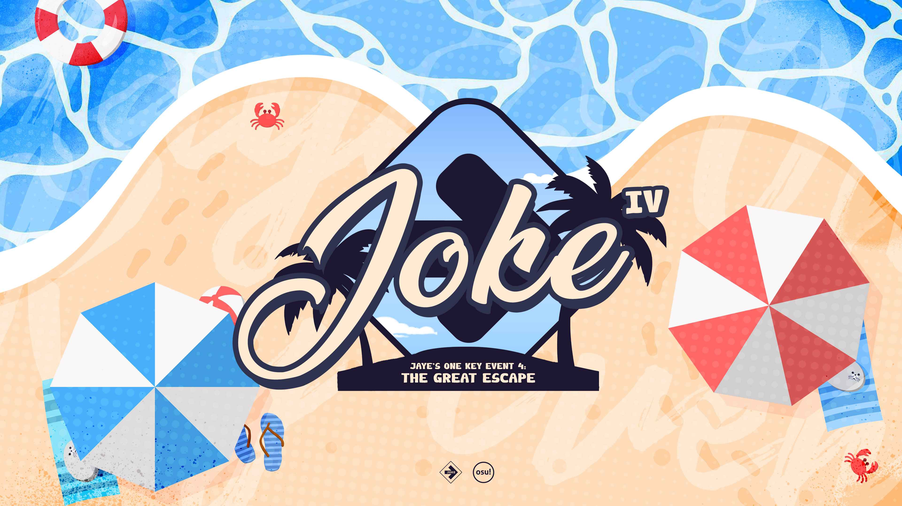

---
tags:
  - JOKE
  - JOKE 4
---

# Jaye's One Key Event 4: The Great Escape

**Jaye's One Key Event 4: The Great Escape** (***JOKE***) is a 1v1, double-elimination, global osu!mania 1-key tournament hosted by ::{ flag=AU }:: [Jaye](https://osu.ppy.sh/users/4841352). It is the fourth instalment in the JOKE series.

## Tournament schedule

| Event | Timestamp |
| --: | :-- |
| Registration phase | 2025-09-21/2025-10-05 |
| Screening phase | 2025-10-06/2025-10-19 |
| Qualifiers showcase | 2025-10-19 |
| Qualifiers | 2025-10-25/2025-10-26 |
| Round of 32 | 2025-11-01/2025-11-02 |
| Round of 16 | 2025-11-08/2025-11-09 |
| Quarterfinals | 2025-11-15/2025-11-16 |
| Semifinals | 2025-11-22/2025-11-23 |
| Finals | 2025-11-29/2025-11-30 |
| Grand Finals | 2025-12-06/2025-12-07 |

## Prizes

| Placing | Prize(s) |
| :-: | :-- |
|  | $450 AUD, profile badge |
|  | $250 AUD |
|  | $140 AUD |
| 4th place | $80 AUD |
| 5th–6th place | $40 AUD |

## Organisation

| Position | Member(s) |
| :-- | :-- |
| Host | ::{ flag=AU }:: [Jaye](https://osu.ppy.sh/users/4841352) |
| Mapper | ::{ flag=AU }:: [\[Iron\]](https://osu.ppy.sh/users/13171482), ::{ flag=US }:: [ERA Basil](https://osu.ppy.sh/users/7097990), ::{ flag=AU }:: [Jaye](https://osu.ppy.sh/users/4841352), ::{ flag=NZ }:: [Sparxe](https://osu.ppy.sh/users/5750235), ::{ flag=GB }:: [Teezel](https://osu.ppy.sh/users/7528639) |
| Streamer | ::{ flag=US }:: [EpsilonMaiagare](https://osu.ppy.sh/users/3855052), ::{ flag=US }:: [ethfan922](https://osu.ppy.sh/users/10402769) |
| Commentator | ::{ flag=AU }:: [Beat43210](https://osu.ppy.sh/users/5664171), ::{ flag=GB }:: [epic man 2](https://osu.ppy.sh/users/14566000), ::{ flag=US }:: [ERA Basil](https://osu.ppy.sh/users/7097990), ::{ flag=CA }:: [ERA Sunny](https://osu.ppy.sh/users/16468962), ::{ flag=AU }:: [Jaye](https://osu.ppy.sh/users/4841352), ::{ flag=US }:: [Sparky](https://osu.ppy.sh/users/3187959), ::{ flag=NZ }:: [Sparxe](https://osu.ppy.sh/users/5750235), ::{ flag=GB }:: [Teezel](https://osu.ppy.sh/users/7528639) |
| Referee | ::{ flag=GB }:: [--Dragon--](https://osu.ppy.sh/users/11924624), ::{ flag=VN }:: [\[LS\]Sagirium](https://osu.ppy.sh/users/16530364), ::{ flag=TH }:: [\[Ping\]](https://osu.ppy.sh/users/6291395), ::{ flag=US }:: [akace100](https://osu.ppy.sh/users/9308128), ::{ flag=HK }:: [Akali393394](https://osu.ppy.sh/users/9686628), ::{ flag=NL }:: [Albionthegreat](https://osu.ppy.sh/users/9853595), ::{ flag=PL }:: [bapril](https://osu.ppy.sh/users/12726001), ::{ flag=US }:: [EpsilonMaiagare](https://osu.ppy.sh/users/3855052), ::{ flag=US }:: [trooperr](https://osu.ppy.sh/users/32028459) |
| Designer | ::{ flag=MY }:: [Jerry](https://osu.ppy.sh/users/605973) |
| Admin | ::{ flag=NL }:: [Albionthegreat](https://osu.ppy.sh/users/9853595), ::{ flag=US }:: [Sydosys](https://osu.ppy.sh/users/17523947) |

## Links

- [Announcement post](https://osu.ppy.sh/home/news/2025-09-21-joke-4-registrations-now-open)
- [Discussion thread](https://osu.ppy.sh/community/forums/topics/2131047)
- [JOKE Discord server](https://discord.com/invite/35kN3dF)
- [Livestream](https://www.twitch.tv/jokeOfficial)
- Spreadsheets
  - **[Master](https://docs.google.com/spreadsheets/d/1_VQ9NY7ntjDWDoxrGtAkBJbG3Z8CfOeV8vpMXJge9SE)**

## Ruleset

### Tournament information

1. Jaye's One Key Event (JOKE) is a 1v1 tournament.
2. Beatmap scoring is based on ScoreV2.
3. The maps for each round will be announced during a live showcase once all matches for a round have concluded (otherwise, it will be announced in the Discord server). Only the announced maps will be used during the respective matches.
4. The tournament is Free Mod: players are free to use either Hidden, Fade In, Flashlight, Mirror, any of the xK mods, or No Mod.
5. The NF mod may be used but is not mandatory. Failed scores do not count towards the end result. In the event that both players fail, the higher scoring player will claim one point.
6. If a map ends in a draw, it will be replayed. If the map ends in a draw again after this, the Picker's Privilege rule is envoked: the team that picked the map will be awarded 1 point, and the match will proceed as normal. In the unlikely event that a draw happens on the tiebreaker map, the map will be replayed until a winner is decided.
   - Teams cannot win a match via the Picker's Privilege rule. In cases where this would occur the map will be replayed until a winner is decided.
7. If a player disconnects, they are treated as if they failed. Map aborting for a "false start" is up to the referee's discretion (and will likely take place if a disconnect occurs within the first 30 seconds of a map).
8. The usual osu! rules apply; therefore, macroing and the likes is strictly prohibited. If you want to be 100% safe, please just use one key for input. If you want to try something unique out for yourself, don't hesitate to ask staff if your play method is allowed.
9. Please be kind to other players and members of staff; referees have permission to punish players based on any rudeness and/or disruptiveness.

### Registrations

1. A registration form can be found on the Master Sheet.
2. Participants are required to both complete the form and be a member of our Discord server. This is for identification/legitimacy of registration purposes and for convenience in posting updates about the tournament. If the registration form is filled out and the user is not present in the server when the Screening Phase concludes they will automatically be withdrawn from the registrant list.
3. There are no restrictions for entry: any rank, any mode, and any country is allowed. Please note that osu! tournament staff hold the right to screen you out of the tournament.

### Stage instructions

1. The first weekend will be the "Qualifiers". All participants will be able to choose a multiplayer lobby at a specified time. All participants will then play through the Qualifiers mappool, followed by a 5-minute break (players may opt to skip this), after which they will play through the Qualifiers mappool for a second time (players may opt to skip this as well).
2. The bracket stage (following Qualifiers) is Double Elimination.
3. The winning condition for each stage is as follows:

| Round | Format |
| --: | :-- |
| Round of 32 | Best of 7 |
| Round of 16 | Best of 9 |
| Quarterfinals | Best of 9 |
| Semifinals | Best of 11 |
| Finals | Best of 11 |
| Grand Finals | Best of 13 |

### Match instructions

1. A referee will create a multiplayer room approx. 10 minutes in advance. Players must gather during this period.
2. Room settings are `Game mode: "osu!mania"`, `Score mode: "ScoreV2"`. Room name must be `JOKE: Lobby #` for the Qualifying round, and `JOKE: ({Player 1}) vs ({Player 2})` for every other round.
3. Players will forcibly forfeit should they fail to show up 10 minutes after the scheduled match time.
4. This tournament will not feature warmups.
5. There will be no bans in this tournament.
6. Each player must use `!roll` in `#multiplayer`.
   - The winner of the `!roll` will be allowed the first pick of the pool.
7. In case of a tie at the penultimate point needed to win, the tiebreaker map will be played.

### Mappool instructions

1. There will be one mappool for each round (as stated above).
2. Mappools do not contain mod categories, but are instead aimed at meeting certain mapping-styled criteria. These include: Rice, LN, Hybrid, Speed, and EX.
3. The size of the mappool will increase by 2 when the win condition calls for it so (see the [stage instructions](#stage-instructions)).
4. The mappools will be uploaded by Jaye after the showcase concludes. The pool will be a multi-song mapset available on the osu! website.

### Scheduling instructions

1. Each stage will be held on a single weekend.
2. Scheduling will be handled by the staff team; match times will be based on the time zones provided by players during the registration phase.
3. Reschedules will only be considered if involved parties are all in agreeance (minus Qualifiers, where you are free to pick a lobby time that you wish to enter, provided there is lobby space to accommodate you).
4. Reschedules are always accepted so long as they are at least 48 hours before the first scheduled match of the round; any later and staff have the right to reject.
