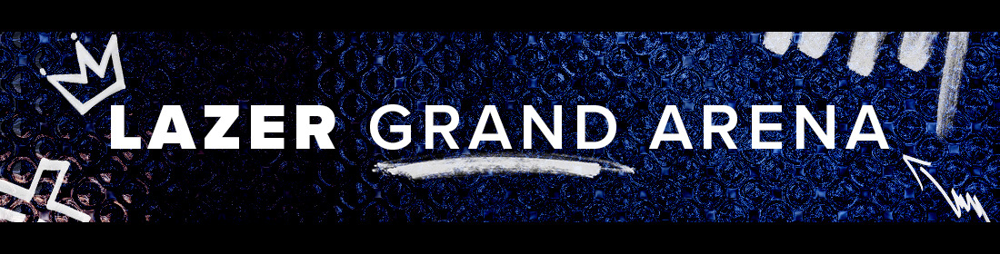

---
tags:
  - lazer
  - grand
  - arena
  - osulazer
  - grand arena
  - lazer grand arena
---

# Lazer Grand Arena

The **Lazer Grand Arena** (***LGA***) was an osu!(lazer) tournament hosted by the [osu! team](/wiki/People/osu!_team).

## Tournament schedule

| Event | Timestamp |
| --: | :-- |
| Registration phase | 2024-06-18 (10:00 UTC)/2024-07-01 (23:59 UTC) |
| Qualifier and tournament format showcase | 2024-07-06 (17:00 UTC) |
| Qualifier stage | 2024-07-13/2024-07-14 |
| Bracket stage (single elimination) | 2024-07-20/2024-07-21 |
| Top 8 (single elimination)/top 4 (double elimination) | 2024-07-27/2024-07-28 |

## Prizes

The Lazer Grand Arena offered limited-edition merch (courtesy of [megumic](https://osu.ppy.sh/users/7537133)).

| Placing | Prizes |
| :-: | :-- |
|  | Profile badge, single-run merch |
|  | single-run merch |
|  | single-run merch |

## Organisation

The Lazer Grand Arena was run by the [osu! team](/wiki/People/osu!_team) and various community members.

| Position | Member(s) |
| :-- | :-- |
| Manager | ::{ flag=CA }:: [Azer](https://osu.ppy.sh/users/2155578), ::{ flag=US }:: [ChillierPear](https://osu.ppy.sh/users/9501251), ::{ flag=BR }:: [LeoFLT](https://osu.ppy.sh/users/3668779) |
| Mappool selector | ::{ flag=CA }:: [Azer](https://osu.ppy.sh/users/2155578), ::{ flag=CA }:: [chiv](https://osu.ppy.sh/users/6701656), ::{ flag=BR }:: [Dada](https://osu.ppy.sh/users/9119507), ::{ flag=US }:: [Librarian](https://osu.ppy.sh/users/10083084) |
| Mappool playtester | ::{ flag=PL }:: [\-Sylvari](https://osu.ppy.sh/users/3493804), ::{ flag=GB }:: [Bubbleman](https://osu.ppy.sh/users/5182050), ::{ flag=US }:: [DigitalHypno](https://osu.ppy.sh/users/4384207), ::{ flag=CA }:: [El Condor Pasa](https://osu.ppy.sh/users/4415285), ::{ flag=US }:: [Emerald Ages](https://osu.ppy.sh/users/10224047), ::{ flag=US }:: [Jakson](https://osu.ppy.sh/users/8788058), ::{ flag=CA }:: [Wieran](https://osu.ppy.sh/users/2303856) |
| Mapper | ::{ flag=US }:: [captin1](https://osu.ppy.sh/users/689997), ::{ flag=EE }:: [riot1133](https://osu.ppy.sh/users/11877992), ::{ flag=CA }:: [Sing](https://osu.ppy.sh/users/3795679) |
| Commentator | ::{ flag=CA }:: [Azer](https://osu.ppy.sh/users/2155578), ::{ flag=CA }:: [D I O](https://osu.ppy.sh/users/3958619), ::{ flag=GB }:: [Damarsh](https://osu.ppy.sh/users/7465147), ::{ flag=US }:: [Dohland](https://osu.ppy.sh/users/5220511), ::{ flag=GB }:: [Doomsday](https://osu.ppy.sh/users/18983), ::{ flag=US }:: [fieryrage](https://osu.ppy.sh/users/3533958), ::{flag=CA}:: [I-Flame](https://osu.ppy.sh/users/11257542), ::{ flag=AU }:: [Jordan The Bear](https://osu.ppy.sh/users/7477458), ::{ flag=AU }:: [Mavs](https://osu.ppy.sh/users/11076938), ::{ flag=US }:: [M I L E S](https://osu.ppy.sh/users/6036351), ::{ flag=AU }:: [Monk Gyatso](https://osu.ppy.sh/users/4012086), ::{flag=GB}:: [SadShiba](https://osu.ppy.sh/users/10747626), ::{ flag=US }:: [this1neguy](https://osu.ppy.sh/users/1797189), ::{flag=AU}:: [Vordi](https://osu.ppy.sh/users/6659116) |
| Referee | ::{ flag=FR }:: [Aidown](https://osu.ppy.sh/users/1522146), ::{ flag=NL }:: [Albionthegreat](https://osu.ppy.sh/users/9853595), ::{ flag=BR }:: [LeoFLT](https://osu.ppy.sh/users/3668779), ::{ flag=NL }:: [nik](https://osu.ppy.sh/users/10077264), ::{ flag=IN }:: [Speshimen](https://osu.ppy.sh/users/7720204), ::{ flag=FI }:: [shdewz](https://osu.ppy.sh/users/10000899), ::{ flag=US }:: [tigereyes144](https://osu.ppy.sh/users/6499811), ::{ flag=GB }:: [Yazzehh](https://osu.ppy.sh/users/7068973), ::{ flag=US }:: [\[K\]](https://osu.ppy.sh/users/16551387) |
| Statistician | ::{ flag=BR }:: [LeoFLT](https://osu.ppy.sh/users/3668779), ::{ flag=FI }:: [shdewz](https://osu.ppy.sh/users/10000899) |

## Links

- [Information spreadsheet](https://docs.google.com/spreadsheets/d/1dc3O3hHW-pPBh8j316iUkCjcVLBF-P4rckhsbFu3jmk)
- [Discussion thread](https://osu.ppy.sh/community/forums/topics/1936749)
- [Livestream](https://www.twitch.tv/osulive)
- [Tournament listing](https://osu.ppy.sh/community/tournaments/45)

## Participants

|  | Country | Username |
| :-: | :-: | :-- |
| ::{ flag=RS }:: | **Serbia** | [-Petar](https://osu.ppy.sh/users/9106690) |
| ::{ flag=NZ }:: | **New Zealand** | [2oomer](https://osu.ppy.sh/users/11141578) |
| ::{ flag=ES }:: | **Spain** | [A N T O N I O](https://osu.ppy.sh/users/12760743) |
| ::{ flag=AU }:: | **Australia** | [aknzx](https://osu.ppy.sh/users/9938943) |
| ::{ flag=FI }:: | **Finland** | [AllyrD](https://osu.ppy.sh/users/9561644) |
| ::{ flag=KR }:: | **South Korea** | [Amamya Kokoro](https://osu.ppy.sh/users/2511839) |
| ::{ flag=FI }:: | **Finland** | [Amasetic](https://osu.ppy.sh/users/11375251) |
| ::{ flag=US }:: | **United States** | [ampy](https://osu.ppy.sh/users/4458239) |
| ::{ flag=FR }:: | **France** | [Arakii](https://osu.ppy.sh/users/6133101) |
| ::{ flag=RU }:: | **Russian Federation** | [arqx](https://osu.ppy.sh/users/2569683) |
| ::{ flag=PH }:: | **Philippines** | [enri](https://osu.ppy.sh/users/8640970) |
| ::{ flag=KR }:: | **South Korea** | [FlyingTuna](https://osu.ppy.sh/users/9224078) |
| ::{ flag=NO }:: | **Norway** | [Hundur](https://osu.ppy.sh/users/3145033) |
| ::{ flag=CL }:: | **Chile** | [Intercambing](https://osu.ppy.sh/users/2546001) |
| ::{ flag=PL }:: | **Poland** | [Kosiarek](https://osu.ppy.sh/users/9086565) |
| ::{ flag=BR }:: | **Brazil** | [Kurumiw](https://osu.ppy.sh/users/11415687) |
| ::{ flag=FI }:: | **Finland** | [Nev-](https://osu.ppy.sh/users/11836334) |
| ::{ flag=CA }:: | **Canada** | [nick1324](https://osu.ppy.sh/users/612898) |
| ::{ flag=KR }:: | **South Korea** | [Nopekjk](https://osu.ppy.sh/users/4585186) |
| ::{ flag=NO }:: | **Norway** | [Pinguinzi](https://osu.ppy.sh/users/9414229) |
| ::{ flag=GB }:: | **United Kingdom** | [rudj](https://osu.ppy.sh/users/11592896) |
| ::{ flag=MN }:: | **Mongolia** | [seegii](https://osu.ppy.sh/users/4659319) |
| ::{ flag=DK }:: | **Denmark** | [Sobu-](https://osu.ppy.sh/users/13872272) |
| ::{ flag=PL }:: | **Poland** | [Sowisty](https://osu.ppy.sh/users/6808620) |
| ::{ flag=SG }:: | **Singapore** | [Tebi](https://osu.ppy.sh/users/5407620) |
| ::{ flag=US }:: | **United States** | [ThisIsGod](https://osu.ppy.sh/users/6736936) |
| ::{ flag=US }:: | **United States** | [TrickyPugster](https://osu.ppy.sh/users/8082362) |
| ::{ flag=SE }:: | **Sweden** | [trumpatino69](https://osu.ppy.sh/users/10903510) |
| ::{ flag=RU }:: | **Russian Federation** | [Welter](https://osu.ppy.sh/users/11552867) |
| ::{ flag=CA }:: | **Canada** | [xootynator](https://osu.ppy.sh/users/3717598) |
| ::{ flag=NO }:: | **Norway** | [YokesPai](https://osu.ppy.sh/users/6399568) |
| ::{ flag=SA }:: | **Saudi Arabia** | [Zesdash](https://osu.ppy.sh/users/5965797) |

The complete sign-up list can be found [here](https://gist.github.com/LeoFLT/8475d0c316b1ea7c1cb66ca93902d810).

## Mappools

### Week 2

**[Download the mappack here (116 MB)](https://packs.ppy.sh/P255%20-%20Lazer%20Grand%20Arena%202024%3A%20Week%202.zip)**\
[View the showcase VOD here](https://www.twitch.tv/videos/2210925901)

- No Mod
  1. [t+pazolite - Bad Boy's missa (DoKito) \[DoKo\]](https://osu.ppy.sh/beatmapsets/408820#osu/887621)
  2. [Hino Isuka - Dreamin' attraction!! (Extended) (BarkingMadDog) \[extreme!!\]](https://osu.ppy.sh/beatmapsets/729549#osu/1539911)
  3. [Kabocha - Draw me a map, Let me feel the tap (toybot) \[Extreme\]](https://osu.ppy.sh/beatmapsets/2051856#osu/4284969)
  4. [Silentroom - Nhelv (Halgoh) \[Disruption of Ataraxia\]](https://osu.ppy.sh/beatmapsets/2049001#osu/4278109)
  5. [Plum - Mad Piano Party (Pennek) \[Dance!\]](https://osu.ppy.sh/beatmapsets/1799229#osu/3688379)
- Hidden
  1. [Camellia feat. Nanahira - Touryouka (jonathanlfj) \[captin's Extra\]](https://osu.ppy.sh/beatmapsets/1022167#osu/2176591)
  2. [Cranky - Bestrafung (Icekalt) \[Folter\]](https://osu.ppy.sh/beatmapsets/1633283#osu/3333793)
  3. [ginkiha - Shadow Castle (JeZag) \[Baroque\]](https://osu.ppy.sh/beatmapsets/1859697#osu/3822820)
- Hard Rock
  1. [-45 - Kuina (Local Hero) \[When They Cry\]](https://osu.ppy.sh/beatmapsets/2051811#osu/4284866)
  2. [HyuN - Infinity Heaven (Bakugo-) \[Ethereal\]](https://osu.ppy.sh/beatmapsets/1750508#osu/3581290)
  3. [HyuN - Grin (ktgster) \[Extreme\]](https://osu.ppy.sh/beatmapsets/947770#osu/1979462)
- Double Time (variable speed multiplier)
  1. (1.50x) [ABSOLUTE CASTAWAY - Konpeitou Retrotica (Akito) \[Mayu's Expert\]](https://osu.ppy.sh/beatmapsets/1522511#osu/3121000)
  2. (1.20x) [Aether Realm - Tarot (SILENCE PLAYER) \[Final Stand\]](https://osu.ppy.sh/beatmapsets/1291247#osu/2680248)
  3. (1.20x) [Krimek - The Dark (fergas) \[Finsternis\]](https://osu.ppy.sh/beatmapsets/2008599#osu/4178415)
  4. (1.40x) [Mili - String Theocracy (\[Arc\]) \[Theatrically Interesting\]](https://osu.ppy.sh/beatmapsets/1192164#osu/2484169)
- 7th pick (Finals/Grand Finals)
  - (Finals) [WangleLine - Attacked by the Cosmic Beast (riot1133) \[UNSTOPPABLE BUNNY BARRAGE\]](https://osu.ppy.sh/beatmapsets/2222345#osu/4712272)
  - (Grand Finals) [Sydosys - HONOR//REPROACH (captin1) \[LGA\]](https://osu.ppy.sh/beatmapsets/2222372#osu/4712336)

### Week 1

**[Download the mappack here (76 MB)](https://packs.ppy.sh/P254%20-%20Lazer%20Grand%20Arena%202024%3A%20Week%201.zip?1720996372)**\
[View the showcase VOD here](https://www.twitch.tv/videos/2197828415?t=0h47m30s)

- No Mod
  1. [Alestorm - Keelhauled (Camo) \[GIVE NO QUARTER\]](https://osu.ppy.sh/beatmapsets/1537993#osu/3144568)
  2. [UNDEAD CORPORATION - Put curse on you (Halfslashed) \[Malediction\]](https://osu.ppy.sh/beatmapsets/1276314#osu/2651771)
  3. [ALEPH - Delirium (Mir) \[Vexation\]](https://osu.ppy.sh/beatmapsets/1799349#osu/3688631)
  4. [NIWASHI - Let's quartz (dectopia) \[Lucidity\]](https://osu.ppy.sh/beatmapsets/2151839#osu/4533859)
- Hidden
  1. [Marmalade butcher - Amanita (Camo) \[X\]](https://osu.ppy.sh/beatmapsets/1473778#osu/3350946)
  2. [-45 - Rougoku STRIP (Deramok) \[..!\]](https://osu.ppy.sh/beatmapsets/583171#osu/1234064)
- Hard Rock
  1. [Zekk - Kaleidoscope (Heilia) \[Selcouth\]](https://osu.ppy.sh/beatmapsets/1148786#osu/2399834)
  2. [A.SAKA - Nanatsu Momijiakari (xLolicore-) \[Vert's Extra\]](https://osu.ppy.sh/beatmapsets/768281#osu/1619010)
- Double Time (variable speed multiplier)
  1. (1.50x) [Wiklund - Billy Boogie (yeahyeahyeahhh) \[16 bits?!\]](https://osu.ppy.sh/beatmapsets/9040#osu/36547)
  2. (1.50x) [James Landino - Aresene's Bazaar (Sylas) \[Collab Insane\]](https://osu.ppy.sh/beatmapsets/1972749#osu/4093505)
  3. (1.60x) [Nekrogoblikon - Dragons (Nao Tomori) \[Soaring in the Sky\]](https://osu.ppy.sh/beatmapsets/1083931#osu/2266883)

### Qualifiers

**[Download the mappack here (100 MB)](https://packs.ppy.sh/P253%20-%20Lazer%20Grand%20Arena%202024%3A%20Qualifiers.zip)**\
[View the showcase VOD here](https://www.twitch.tv/videos/2191069196)

- No Mod
  1. [ELFENSJoN - STYX (Ryuusei Aika) \[Extreme\]](https://osu.ppy.sh/beatmapsets/1769468#osu/3622209)
  2. [Kardashev - Lux (kiwies) \[Delicate Abstraction\]](https://osu.ppy.sh/beatmapsets/1839540#osu/3777926)
  3. [siromaru + cranky - conflict (yf\_bmp) \[Intersection\]](https://osu.ppy.sh/beatmapsets/1212359#osu/3107406)
  4. [Silentroom - NULCTRL (DeviousPanda) \[MAO'S EXPERIMENT\]](https://osu.ppy.sh/beatmapsets/1969316#osu/4084959)
- Hidden
  1. [Tanchiky - Riot (Feiri) \[Expert\]](https://osu.ppy.sh/beatmapsets/1645961#osu/3359700)
  2. [Hige Driver - ukigumo (Lude) \[..- -.- .. --. ..- -- ---\]](https://osu.ppy.sh/beatmapsets/1827928#osu/3751557)
- Hard Rock
  1. [uma vs. Morimori Atsushi - Re:End of a Dream (Battle) \[Re:Vival\]](https://osu.ppy.sh/beatmapsets/557039#osu/1178810)
  2. [-45 - Midorigo Queen Bee (PandaHero) \[EijiKuinbii's Expert\]](https://osu.ppy.sh/beatmapsets/812792#osu/1791372)
- Double Time (variable speed multiplier)
  1. (1.60x) [ginkiha - EOS (alacat) \[RLC's Another\]](https://osu.ppy.sh/beatmapsets/151720#osu/421532) 
  2. (1.50x) [Yu\_Asahina vs. orangentle - EMOTIONALL BRINGBACKK (Niva) \[METAMORPHOSIS\]](https://osu.ppy.sh/beatmapsets/1799341#osu/3688619)
  3. (1.40x) [Camellia - Fly to night, tonight (My Angel Watame) \[Heatwave's Insane\]](https://osu.ppy.sh/beatmapsets/1119638#osu/2343884)

## Match results

### Week 2

Saturday, 27 July 2024:

| Stage | Red Player |  |  | Blue Player | Match link | VOD link |
| :-- | --: | :-: | :-: | :-- | :-- | :-- |
| Quarterfinals | **[Amamya Kokoro](https://osu.ppy.sh/users/2511839)** | **5.02 M** | 4.48 M | [enri](https://osu.ppy.sh/users/8640970) | [#1](https://osu.ppy.sh/multiplayer/rooms/799914) | [#1](https://www.twitch.tv/videos/2210815333) |
| Quarterfinals | [Nopekjk](https://osu.ppy.sh/users/4585186) | 3.58 M | **4.21 M** | **[Tebi](https://osu.ppy.sh/users/5407620)** | [#1](https://osu.ppy.sh/multiplayer/rooms/799656) | [#1](https://www.twitch.tv/videos/2210932598) |
| Quarterfinals | **[aknzx](https://osu.ppy.sh/users/9938943)** | **5.23 M** | 5.17 M | [xootynator](https://osu.ppy.sh/users/3717598) | [#1](https://osu.ppy.sh/multiplayer/rooms/799918) | [#1](https://www.twitch.tv/videos/2210937061) |
| Quarterfinals | [Welter](https://osu.ppy.sh/users/11552867) | FF | **0.00 M** | **[FlyingTuna](https://osu.ppy.sh/users/9224078)** |  |  |
| Semifinals | **[Amamya Kokoro](https://osu.ppy.sh/users/2511839)** | **5.05 M** | 4.36 M | [Tebi](https://osu.ppy.sh/users/5407620) | [#1](https://osu.ppy.sh/multiplayer/rooms/800094) | [#1](https://www.twitch.tv/videos/2210939520) |

Sunday, 28 July 2024:

| Stage | Red Player |  |  | Blue Player | Match link | VOD link |
| :-- | --: | :-: | :-: | :-- | :-- | :-- |
| Semifinals | [aknzx](https://osu.ppy.sh/users/9938943) | 5.16 M | **5.45 M** | **[FlyingTuna](https://osu.ppy.sh/users/9224078)** | [#1](https://osu.ppy.sh/multiplayer/rooms/801277) | [#1](https://www.twitch.tv/videos/2210941471) |
| Finals (LB) | [Tebi](https://osu.ppy.sh/users/5407620) | 4.01 M | **5.36 M** | **[aknzx](https://osu.ppy.sh/users/9938943)** | [#1](https://osu.ppy.sh/multiplayer/rooms/801552) | [#1](https://www.twitch.tv/videos/2210971660) |
| Finals (WB) | [Amamya Kokoro](https://osu.ppy.sh/users/2511839) | 5.01 M | **5.64 M** | **[FlyingTuna](https://osu.ppy.sh/users/9224078)** | [#1](https://osu.ppy.sh/multiplayer/rooms/801647) | [#1](https://www.twitch.tv/videos/2210975699) |
| Grand Finals (LB) | [Amamya Kokoro](https://osu.ppy.sh/users/2511839) | 4.70 M | **4.94 M** | **[aknzx](https://osu.ppy.sh/users/9938943)** | [#1](https://osu.ppy.sh/multiplayer/rooms/801736) | [#1](https://www.twitch.tv/videos/2210975700) |
| Grand Finals | [aknzx](https://osu.ppy.sh/users/9938943) | 4.78 M | **5.43 M** | **[FlyingTuna](https://osu.ppy.sh/users/9224078)** | [#1](https://osu.ppy.sh/multiplayer/rooms/801806) | [#1](https://www.twitch.tv/videos/2210975698) |

### Week 1

Saturday, 20 July 2024:

| Stage | Red Player |  |  | Blue Player | Match link | VOD link |
| :-- | --: | :-: | :-: | :-- | :-- | :-- |
| RO32 | **[FlyingTuna](https://osu.ppy.sh/users/9224078)** | **4.25 M** | 2.72 M | [Nev-](https://osu.ppy.sh/users/11836334) | [#1](https://osu.ppy.sh/multiplayer/rooms/788242) | [#1](https://www.twitch.tv/videos/2210828680) |
| RO32 | **[Tebi](https://osu.ppy.sh/users/5407620)** | **3.35 M** | 2.44 M | [YokesPai](https://osu.ppy.sh/users/6399568) | [#1](https://osu.ppy.sh/multiplayer/rooms/788313) | [#1](https://www.twitch.tv/videos/2210828681) |
| RO32 | **[2oomer](https://osu.ppy.sh/users/11141578)** | **3.35 M** | 2.13 M | [Kosiarek](https://osu.ppy.sh/users/9086565) | [#1](https://osu.ppy.sh/multiplayer/rooms/788311) |  |
| RO32 | **[Nopekjk](https://osu.ppy.sh/users/4585186)** | **3.26 M** | 2.68 M | [Zesdash](https://osu.ppy.sh/users/5965797) | [#1](https://osu.ppy.sh/multiplayer/rooms/788385) | [#1](https://www.twitch.tv/videos/2210828682) |
| RO32 | **[aknzx](https://osu.ppy.sh/users/9938943)** | **2.97 M** | 2.80 M | [arqx](https://osu.ppy.sh/users/2569683) | [#1](https://osu.ppy.sh/multiplayer/rooms/788397) |  |
| RO32 | **[Sobu-](https://osu.ppy.sh/users/13872272)** | **3.62 M** | 3.14 M | [trumpatino69](https://osu.ppy.sh/users/10903510) | [#1](https://osu.ppy.sh/multiplayer/rooms/788523) | [#1](https://www.twitch.tv/videos/2210852909) |
| RO32 | **[Amasetic](https://osu.ppy.sh/users/11375251)** | **3.82 M** | 3.57 M | [Kurumiw](https://osu.ppy.sh/users/11415687) | [#1](https://osu.ppy.sh/multiplayer/rooms/788632) | [#1](https://www.twitch.tv/videos/2210852910) |
| RO32 | [AllyrD](https://osu.ppy.sh/users/9561644) | 3.69 M | **3.70 M** | **[seegii](https://osu.ppy.sh/users/4659319)** | [#1](https://osu.ppy.sh/multiplayer/rooms/788630) | [#1](https://www.twitch.tv/videos/2204729842) |
| RO32 | **[Amamya Kokoro](https://osu.ppy.sh/users/2511839)** | **4.03 M** | 1.91 M | [ThisIsGod](https://osu.ppy.sh/users/6736936) | [#1](https://osu.ppy.sh/multiplayer/rooms/788722) | [#1](https://www.twitch.tv/videos/2210852906) |
| RO32 | **[nick1324](https://osu.ppy.sh/users/612898)** | **3.17 M** | 2.89 M | [Sowisty](https://osu.ppy.sh/users/6808620) | [#1](https://osu.ppy.sh/multiplayer/rooms/788827) | [#1](https://www.twitch.tv/videos/2210852907) |
| RO32 | **[Welter](https://osu.ppy.sh/users/11552867)** | **3.79 M** | 3.00 M | [-Petar](https://osu.ppy.sh/users/9106690) | [#1](https://osu.ppy.sh/multiplayer/rooms/788913) | [#1](https://www.twitch.tv/videos/2210852908) |
| RO32 | **[Intercambing](https://osu.ppy.sh/users/2546001)** | **3.50 M** | 2.37 M | [Arakii](https://osu.ppy.sh/users/6133101) | [#1](https://osu.ppy.sh/multiplayer/rooms/789062) | [#1](https://www.twitch.tv/videos/2210855646) |
| RO32 | **[xootynator](https://osu.ppy.sh/users/3717598)** | **3.90 M** | 2.67 M | [TrickyPugster](https://osu.ppy.sh/users/8082362) | [#1](https://osu.ppy.sh/multiplayer/rooms/789074) |  |
| RO16 | **[Amamya Kokoro](https://osu.ppy.sh/users/2511839)** | **4.16 M** | 3.63 M | [Sobu-](https://osu.ppy.sh/users/13872272) | [#1](https://osu.ppy.sh/multiplayer/rooms/788831) | [#1](https://www.twitch.tv/videos/2204731424) |

Sunday, 21 July 2024:

| Stage | Red Player |  |  | Blue Player | Match link | VOD link |
| :-- | --: | :-: | :-: | :-- | :-- | :-- |
| RO16 | [Intercambing](https://osu.ppy.sh/users/2546001) | 2.84 M | **3.66 M** | **[Nopekjk](https://osu.ppy.sh/users/4585186)** | [#1](https://osu.ppy.sh/multiplayer/rooms/790385) | [#1](https://www.twitch.tv/videos/2210917956) |
| RO16 | [nick1324](https://osu.ppy.sh/users/612898) | 2.48 M | **3.03 M** | **[Tebi](https://osu.ppy.sh/users/5407620)** | [#1](https://osu.ppy.sh/multiplayer/rooms/790361) | [#1](https://www.twitch.tv/videos/2210917954) |
| RO16 | **[aknzx](https://osu.ppy.sh/users/9938943)** | **4.25 M** | 3.58 M | [2oomer](https://osu.ppy.sh/users/11141578) | [#1](https://osu.ppy.sh/multiplayer/rooms/789920) | [#1](https://www.twitch.tv/videos/2210861845) |
| RO16 | **[xootynator](https://osu.ppy.sh/users/3717598)** | **3.84 M** | 3.77 M | [A N T O N I O](https://osu.ppy.sh/users/12760743) | [#1](https://osu.ppy.sh/multiplayer/rooms/790544) | [#1](https://www.twitch.tv/videos/2210921410) |
| RO16 | **[Welter](https://osu.ppy.sh/users/11552867)** | **3.43 M** | 3.38 M | [seegii](https://osu.ppy.sh/users/4659319) | [#1](https://osu.ppy.sh/multiplayer/rooms/789975) | [#1](https://www.twitch.tv/videos/2210861846) |
| RO16 | **[FlyingTuna](https://osu.ppy.sh/users/9224078)** | **3.89 M** | 2.89 M | [ampy](https://osu.ppy.sh/users/4458239) | [#1](https://osu.ppy.sh/multiplayer/rooms/790439) | [#1](https://www.twitch.tv/videos/2210917955) |

Monday, 22 July 2024:

| Stage | Red Player |  |  | Blue Player | Match link | VOD link |
| :-- | --: | :-: | :-: | :-- | :-- | :-- |
| RO16 | [Amasetic](https://osu.ppy.sh/users/11375251) | 3.51 M | **3.71 M** | **[enri](https://osu.ppy.sh/users/8640970)** | [#1](https://osu.ppy.sh/multiplayer/rooms/791681) | [#1](https://www.twitch.tv/videos/2210923049) |

### Qualifiers

| Seed | Player | %MAX sum[^qualifiers-seeding] | avg. score[^qualifiers-tiebreaker] |
| :-: | :-- | --: | --: |
| #1 | Amamya Kokoro | 9.108 | 848,516 |
| #2 | aknzx | 8.768 | 845,310 |
| #3 | Welter | 8.690 | 842,629 |
| #4 | Intercambing | 8.477 | 815,191 |
| #5 | nick1324 | 8.431 | 819,364 |
| #6 | FlyingTuna | 8.336 | 811,354 |
| #7 | xootynator | 8.324 | 781,736 |
| #8 | Amasetic | 8.187 | 796,008 |
| #9 | enri | 8.107 | 787,504 |
| #10 | A N T O N I O | 7.832 | 738,215 |
| #11 | ampy | 7.595 | 730,363 |
| #12 | Tebi | 7.536 | 717,099 |
| #13 | Nopekjk | 7.448 | 689,419 |
| #14 | AllyrD | 7.423 | 700,047 |
| #15 | 2oomer | 7.411 | 713,713 |
| #16 | Sobu- | 7.282 | 683,338 |
| #17 | trumpatino69 | 7.268 | 704,637 |
| #18 | Kosiarek | 7.192 | 666,739 |
| #19 | seegii | 7.145 | 702,652 |
| #20 | Zesdash | 6.998 | 656,752 |
| #21 | YokesPai | 6.848 | 631,424 |
| #22 | rudj | 6.568 | 629,243 |
| #23 | Hundur | 6.367 | 626,276 |
| #24 | Pinguinzi | 6.259 | 615,574 |
| #25 | Kurumiw | 6.228 | 681,218 |
| #26 | TrickyPugster | 6.161 | 599,212 |
| #27 | Nev- | 6.150 | 583,118 |
| #28 | Sowisty | 6.008 | 577,510 |
| #29 | Arakii | 5.975 | 584,219 |
| #30 | -Petar | 5.891 | 549,345 |
| #31 | arqx | 5.872 | 575,421 |
| #32 | ThisIsGod | 5.796 | 568,578 |
| #33 | soft bunny | 5.780 | 544,198 |
| #34 | Freddie Benson | 5.759 | 628,649 |
| #35 | nase | 5.756 | 567,035 |
| #36 | GalaxyGaming | 5.740 | 563,278 |
| #37 | Alfiu | 5.738 | 564,388 |
| #38 | fieryrage | 5.699 | 620,237 |
| #39 | respektive | 5.536 | 517,303 |
| #40 | Bazingasdead | 5.394 | 497,820 |
| #41 | Coal | 4.980 | 489,997 |
| #42 | Doomsday | 4.892 | 457,210 |
| #43 | HikkaSka | 4.847 | 472,289 |
| #44 | Mitake | 4.824 | 474,704 |
| #45 | R2cubika | 4.626 | 455,156 |
| #46 | PeteX | 4.544 | 494,426 |
| #47 | Tiller | 4.236 | 512,638 |
| #48 | polski1 | 4.025 | 562,422 |
| #49 | Peti | 3.671 | 513,687 |
| #50 | The Hassle | 3.254 | 352,247 |
| #51 | KonKonKinakoN | 1.728 | 854,369 |
| #52 | Kzox | 1.099 | 568,744 |

## Ruleset

### Tournament rules

1. The Lazer Grand Arena is a multi-bracket (single, and later double elimination) tournament, played on osu!(lazer), osu! ruleset.
2. Beatmap scoring is based on the default osu!(lazer) scoring.
3. The mappool for each stage will be announced by the mappool selectors on the official stream at appropriate times.
4. The match schedules for each stage will be announced by the tournament managers on this page, as well as the information spreadsheet, on the Sunday before the matches take place.
5. Use of the Visual Settings to alter background dim or disable beatmap elements like storyboards and skins is allowed.
   - Custom skin elements must not be used to alter core gameplay elements or mechanics in unintended ways.
6. If either player is not present at match time, the match can be postponed for up to 10 minutes. If after this period either player is not present, a *win by default* will be declared for the other player. If neither player is present, the match will be nullified and the player who was slated to play against the winner of this match will receive one bye.
7. Players may ask for a rematch if they encounter technical issues while playing within 30 seconds or 25% of the beatmap drain length (whichever happens first) of the game's start. Referees may, at their discretion, veto this request.
   - "Lag spikes" are not considered a valid reason to rematch a beatmap.
   - This rule is not to be abused. Referees may veto a rematch request if they find that this is the case.
8. If a player disconnects mid-game, their score will not be counted towards their cumulative, unless adequate proof of said score is provided. The following are considered as acceptable proof:
   - Player point-of-view live stream snippets (commonly referred to as "clips" or "VODs"). The entirety of the play, along with the results screen must be clearly visible along with the affected player's score.
   - Replay files of the play, taken directly from the "Local scores" tab on the affected player's client (the timestamps must exactly match the time at which the game took place, as seen on the multiplayer lobby link).
   - Player scores may be derived from the official stream as a last resort, in cases where the match is streamed.
9. Players are expected to keep the match running fluently and without delays. Excessive match delays from the players' side may result in penalties being applied by the tournament managers. Disrupting the match by foul play, insulting or provoking other players or staff, delaying the match, and other deliberate inappropriate misbehaviour are strictly prohibited, and will be punished accordingly.
10. Any attempts to manipulate bracket outcomes or future matchups may result in the immediate disqualification of the player from the competition. Examples of manipulative behavior include, but are not limited to:
    - Deliberately playing poorly to lose a game or match.
    - Colluding with other players to force a desired matchup.
    - Forfeiting bracket matches without providing an adequate reasoning, or with the intention of getting a more favourable matchup.
11. All players and staff must be treated with respect. Instructions from the referees and the tournament managers are to be followed. Decisions labelled as final are not to be objected.
12. The multiplayer chatrooms underlie the [osu! community rules](/wiki/Rules). All chat rules apply to the multiplayer chatrooms where the matches will take place.
    - Breaking the chat rules may result in a silence. Silenced players cannot participate in multiplayer matches for the duration of the punishment and, as a result, can have their match forfeited.
13. Penalties for violating the tournament rules include, but are not limited to:
    - Removal of pick rights for a game or match.
    - Point deductions.
    - Declaring the match as forfeited, or as a win by default for the other player.
    - Disqualification from the entire tournament.
    - Disqualification from the current and future official tournaments, until appealed.
14. Referees may allow, at their discretion, lower or higher tolerances for timers.
15. The tournament managers may request liveplays or recordings of individual players at any point in the tournament without prior warning.
16. The tournament managers will be responsible for receiving and investigating any tournament-related complaints.
17. The tournament managers reserve the right to modify these rules at any moment. Any such changes will be announced in advance.

### Tournament registration

1. Every user interested in playing will be be required to sign up by utilising the osu! tournament listing [linked above](#links).
   - Exceptionally, every player placed #2,500 or higher on the osu! global ranking that participates on the osu!(lazer) playlist, as detailed on the [Qualifier information](#qualifier-information) section will be eligible for participation as competitors, provided that they pass our internal checks before playing bracket stage matches (if applicable). Players that meet these criteria and place on the top 32 qualified players will be messaged individually via the website.
2. To ensure valid registrations, every prospective participant will be manually checked by the [account support team](/wiki/People/Account_support_team), in a manner similar to the [tournament screening](/wiki/Tournaments/Official_support#tournament-screening) that is offered to community tournaments. To be successfully accepted on the list, players are required to be placed #2,500 or higher on the osu! global ranking, and not have violated the [osu! community rules](/wiki/Rules) within the last 12 months.
3. All successfully registered players will be published after the registration phase on this page.
4. Participants will be briefed on further steps via an announcement message on the website.
5. Tournament staff members are **not** allowed to play in the tournament, with the exception of commentators, statisticians, and streamers.
   - The tournament managers must ensure that such staff members do not have access to priviledged information, e.g. Qualifiers score information, mappool information before the mappool showcase, etc. They are to be treated as regular players whenever possible.

### Qualifier information

1. In the Qualifier stage, all players will play a specific pool designed by the mappool selectors.
2. The mappool will contain 4 brackets: No Mod, [Hidden](/wiki/Gameplay/Game_modifier/Hidden), [Hard Rock](/wiki/Gameplay/Game_modifier/Hard_Rock), and [Double Time](/wiki/Gameplay/Game_modifier/Double_Time).
3. The Qualifier pool will feature 11 beatmaps, organised as such:
   - No Mod: 4 beatmaps
   - Hidden: 2 beatmaps
   - Hard Rock: 2 beatmaps
   - Double Time: 3 beatmaps
4. Players will participate in an osu!(lazer) playlist lobby, which can be completed anywhere from Sunday, July 7 19:00 UTC to Sunday, July 14 19:00 UTC.
   - The playlist to be played is titled `Lazer Grand Arena - Qualifiers`, hosted by [LeoFLT](https://osu.ppy.sh/users/3668779).
   - *Notice: the playlist **closes** on July 14, 19:00 UTC, at which point no new scores will be allowed. No exceptions will be made.*
5. Players will have 22 tries to use across the 11 playlist entries, with no restrictions on the order of play or amount of tries per individual item.
6. To be eligible for seeding, every player must submit *at least* one score for every beatmap listed.
7. Only the player's best attempt (i.e. highest score) will be used for every beatmap listed.
8. The lowest score across the 11 beatmaps will be removed from each player's seeding calculations.
9. The seeding method used for Qualifiers will be %MAX — the highest score for each map will receive 100% of the points, and every other player will be awarded a percentage of that top score.
The exact formula that will be used for all players (and for each map) is `Final Score = Player Score / MAX Score`, where:
   - `Final Score` is the percentage awarded to the current player
   - `Player Score` is the score the current player achieved on the current map
   - `MAX Score` is the highest score achieved for the current map
10. The top 32 seeded players will advance to the bracket stage.

### Bracket stage information

1. Matches for this stage of the tournament will have players play a fixed amount of maps, and the cumulative score difference across all maps will decide the winner.
2. Draft order will follow the ABBA format, where the first player (A) and the second player (B) will take turns picking and banning beatmaps.
3. Following the Qualifiers, the bracket stage will have two phases (one per weekend):
   - For the first weekend, a single-elimination bracket will be played from the Round of 32 up until the Quarterfinals.
     - All matches in this phase will utilise the same mappool. The player with the highest cumulative score across the 5 picks wins.
     - The first weekend's pool will feature 11 maps, organised as such:
       - No Mod: 4 beatmaps
       - Hidden: 2 beatmaps
       - Hard Rock: 2 beatmaps
       - Double Time: 3 beatmaps
     - The draft order will be as follows:
       1. The first player (A) will ban one beatmap, followed by the second player (B) also banning a beatmap: AB
       2. Players will pick two beatmaps respecting the following order: BAAB
       3. Both players will ban two maps, as such: BAAB
       4. The last beatmap remaining in the pool will be used as the 5th pick for the match.
   - For the second weekend, The 8 remaining players from the previous phase will then then play another set of matches, after which the remaining 4 players will be placed on a double-elimination bracket.
     - All matches in this phase will utilise the same mappool, except for the Losers' Bracket Finals and Grand Finals, where a new [osu! original](/wiki/osu!_originals) will be introduced into the pool. The player with the highest cumulative score across the 7 picks wins.
     - The second weekend's pool will feature 15 maps, organised as such:
       - No Mod: 5 beatmaps
       - Hidden: 3 beatmaps
       - Hard Rock: 3 beatmaps
       - Double Time: 4 beatmaps
     - The draft order will be as follows:
       1. The first player (A) will ban one beatmap, followed by the second player (B) also banning a beatmap: AB
       2. Players will pick two beatmaps respecting the following order: BAAB
       3. Both players will ban two beatmaps, as such: ABBA
       4. Both players will pick one beatmap: AB
       5. Both players will ban one beatmap: BA
       6. The last beatmap remaining in the pool will be used as the 7th pick for the match.
       7. Exceptionally, for the Losers' Bracket Finals and Grand Finals, steps 5 and 6 will not be applied, and the last pick will be an osu! original beatmap, to be released at match time.

### Win conditions

- In the Qualifiers, players need to place in the top 32 in order to advance to the single-elimination bracket stage.
  - Seeding for this stage will follow the %MAX format — the highest score for each map will receive 100% of the points (i.e. 1 point), and every other player will be awarded a percentage of that top score. The sum of the highest score for every map will be used as the final seeding, with a higher point sum meaning higher placement (i.e. sorted in descending order).
    - The exact formula that will be used for all players (and for each map) is `Final Score = Player Map Score / MAX Score`, where:
      - `Final Score` is the numerical value awarded to the current player for each map.
      - `Player Map Score` is the score the player being evaluated achieved on the current map, taking the best score out of two.
      - `MAX Score` is the highest score achieved for the current map across all players and all runs.
- For the bracket stage, the player with the highest cumulative score across all picks in a match wins.

### Match procedures

1. A referee will create a multiplayer room 10 minutes before the scheduled match time. Players must join the lobby in that period.
   - The room settings are `Ruleset: "osu!"` and `Game type: "Team Vs"`. The room name must follow the pattern of `LGA: ({Red Player}) VS ({Blue Player})`. The player mentioned first in the room name must be the red player, and the player mentioned second in the room name must be the blue player.
2. Each player will receive one "tactical timeout" of 2 minutes, to be used as extra time to ban, pick, or ready for a beatmap. The tactical timeout may not be called on the opposing player's pick or ban phase.
3. Players will be allowed 2 minutes for each pick/ban phase (as described on the [bracket stage instructions](#bracket-stage-information) section), and an additional 2 minutes to press the `Ready` button on their client before play commences. If a player takes more time than allotted for either action, the procedures adopted will be as follows:
   - For the first occurrence:
     - The player will receive a verbal warning from the referee; in addition, the referee may opt to forcefully use the player's tactical timeout to allow for the player to pick.
     - If the player does not pick a map within 15 seconds from when the timer expires, the referee will apply the procedure for subsequent occurrences listed below, i.e. a random pick will be used for a pick timer, and the match will be forcefully started for a ready timer.
   - On subsequent occurrences:
     - For a pick timer: a random map will be chosen from the mappool by rolling a random number, based on the amount of beatmaps that were neither picked nor banned.
     - For a ready timer: the referee will issue the start command on a 10-second countdown. In this scenario, if the referee starts the match and either player is not present in the lobby, their opponent will receive the point instead.
     - Repeat offenders may receive further sanctions from the tournament managers.

### Scheduling information

1. Each stage (as described on the [Tournament schedule](#tournament-schedule) table) will be held on **a single weekend**.
2. Qualifiers are not eligible for scheduling. Instead, players must take part in an osu!(lazer) playlist, as detailed on the [Qualifier information](#qualifier-information) section.
3. All bracket stages will be held between Saturday 00:00 and Sunday 19:00 UTC.
   - Exceptions may be made where possible; please consult the tournament managers for more information.
4. Match scheduling will be handled by the tournament managers. Schedules will be released on the Sunday before the first matches of the stage. The tournament managers will try to create the schedule to respect the participants' time zones.
5. **Reschedules will only be considered if both players agree to a time and communicate it to the tournament managers, before Wednesday 23:59 UTC of the week when the match is to take place.**
   - Matches may not be scheduled to any time beyond **Sunday, 19:00 UTC** of the week they are to be played at.
   - Times earlier than **Saturday, 0:00 UTC** may be considered under specific circumstances. Please contact the tournament managers for more information. 
   - **Do not ask for a reschedule unless it is absolutely necessary. The tournament managers reserve the right to deny any rescheduling request.**
   - Late reschedule requests will not be accepted under any circumstances.

## Notes

[^qualifiers-seeding]: Used as the main seeding method
[^qualifiers-tiebreaker]: Used as a tiebreaker when two players have the same MAX sum
