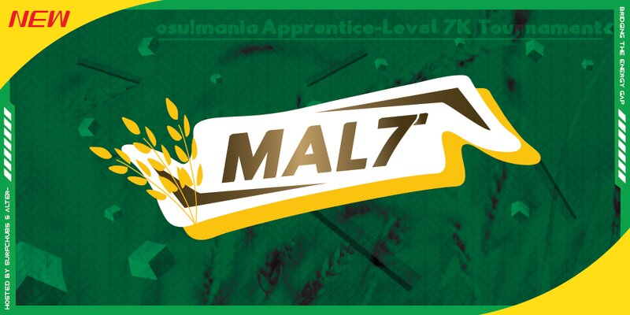

---
tags:
  - MALT
  - MAL7
---

# osu!mania Apprentice-level 7K Tournament

The **osu!mania Apprentice-level 7K Tournament** (***MALT***) was a 1v1 country-independent rank-restricted osu!mania 7-key tournament. It was aimed towards players who are not yet at the top level, but wants to experience tournament play.

## Tournament Schedule

| Event | Timestamp |
| --: | :-- |
| Registration phase | 2023-07-22/2023-08-06 (15:59 UTC) |
| Qualifiers showcase | 2023-08-20 (14:00 UTC) |
| Qualifiers | 2023-08-26/2023-08-27 |
| Play-offs | 2023-09-02/2023-09-03 |
| Round of 32 | 2023-09-09/2023-09-10 |
| Round of 16 | 2023-09-16/2023-09-17 |
| Quarterfinals |  2023-09-23/2023-09-24 |
| Semifinals | 2023-09-30/2023-10-01 |
| Finals | 2023-10-07/2023-10-08 |
| Grand Finals | 2023-10-14/2023-10-15 |

## Prizes

The osu!mania Apprentice-level 7K Tournament offered a $240 cash prize pool!

| Placing | Prize(s) |
| :-: | :-- |
|  | $120, profile badge |
|  | $80 |
|  | $40 |

## Organization

| Position | Member(s) |
| :-- | :-- |
| Host | ::{ flag=NL }:: [Albionthegreat](https://osu.ppy.sh/users/9853595), ::{ flag=US }:: [Alter-]https://osu.ppy.sh/users/4980256), ::{ flag=PH }:: [SurfChu85](https://osu.ppy.sh/users/4469895) |
| Mappool Selector | ::{ flag=US }:: [Alter-]https://osu.ppy.sh/users/4980256), ::{ flag=DE }:: [Leeju](https://osu.ppy.sh/users/18219603), ::{ flag=BR }:: [Makiba](https://osu.ppy.sh/users/7539957). ::{ flag=PH }:: [SurfChu85](https://osu.ppy.sh/users/4469895) |
| Charters and Testers | ::{ flag=US }:: [-NoName-](https://osu.ppy.sh/users/10400730), ::{ flag=HK }:: [Irone OSU](https://osu.ppy.sh/users/10678230), ::{ flag=PH }:: [[LS]Tenshi](https://osu.ppy.sh/users/18520056), ::{ flag=PH }:: [lenpai](https://osu.ppy.sh/users/5314573), ::{ flag=PH }:: [MapleSyrup-](https://osu.ppy.sh/users/1192936), ::{ flag=HK }:: [pwhk](https://osu.ppy.sh/users/4887865), ::{ flag=US }:: [tastydumpl1ng](https://osu.ppy.sh/users/18496063), ::{ flag=PH }:: [yukina meng](https://osu.ppy.sh/users/9919550) |
| Referee | ::{ flag=PH }:: [-Ichinose](https://osu.ppy.sh/users/12635292), ::{ flag=US }:: [akace100](https://osu.ppy.sh/users/9308128), ::{ flag=NL }:: [Albionthegreat](https://osu.ppy.sh/users/9853595), ::{ flag=US }:: [Dynascape](https://osu.ppy.sh/users/8784587), ::{ flag=US }:: [EpsilonMaiagare](https://osu.ppy.sh/users/3855052), ::{ flag=PE }:: [ERA Xuste](https://osu.ppy.sh/users/17989444), ::{ flag=TH }:: [Infinitstart](https://osu.ppy.sh/users/4026124), ::{ flag=VN }:: [Poity](https://osu.ppy.sh/users/17148657), ::{ flag=PH }:: [RinatoPotato](https://osu.ppy.sh/users/23743034), ::{ flag=PH }:: [SurfChu85](https://osu.ppy.sh/users/4469895), ::{ flag=DE }:: [TheHunter1](https://osu.ppy.sh/users/6496016), ::{ flag=CA }:: [walmart5193](https://osu.ppy.sh/users/16468962) |
| Streamer | ::{ flag=US }:: [Alter-](https://osu.ppy.sh/users/4980256), ::{ flag=US }:: [EpsilonMaiagare](https://osu.ppy.sh/users/3855052), ::{ flag=SE }:: [Logg54vs](https://osu.ppy.sh/users/8684540), ::{ flag=US }:: [Male Parent](https://osu.ppy.sh/users/8985153) |
| Commentator | ::{ flag=US }:: [Alter-](https://osu.ppy.sh/users/4980256), ::{ flag=FR }:: [Baguette2Pain](https://osu.ppy.sh/users/11818585), ::{ flag=US }:: [Dynascape](https://osu.ppy.sh/users/8784587), ::{ flag=ID }:: [Mipha](https://osu.ppy.sh/users/5767941), ::{ flag=AU }:: [PotassiumF](https://osu.ppy.sh/users/4247722), ::{ flag=US }:: [RhymesWithMash](https://osu.ppy.sh/users/18834550), ::{ flag=PH }:: [Silhoueska Elze](https://osu.ppy.sh/users/11517895), ::{ flag=US }:: [Sparky](https://osu.ppy.sh/users/3187959), ::{ flag=PH }:: [SurfChu85](https://osu.ppy.sh/users/4469895). ::{ flag=PH }:: [yukina meng](https://osu.ppy.sh/users/9919550) |
| GFX and Design | ::{ flag=EC }:: [iSmileZ](https://osu.ppy.sh/users/10081404), ::{ flag=SG }:: [Polytetral](https://osu.ppy.sh/users/8612061), ::{ flag=PH }:: [yukina meng](https://osu.ppy.sh/users/9919550) |
| Statistician | ::{ flag=NL }:: [2fast](https://osu.ppy.sh/users/5183940), ::{ flag=NL }:: [Albionthegreat](https://osu.ppy.sh/users/9853595), ::{ flag=PH }:: [SurfChu85](https://osu.ppy.sh/users/4469895) |

## Links

- [Discussion thread](https://osu.ppy.sh/community/forums/topics/1796801)
- [Livestream](https://www.twitch.tv/surfchu85)
- [VOD Archive](https://www.youtube.com/playlist?list=PLG_VJPfLMAZ2upqmkW7KMV0gDkkwbI7Di)
- [MALT Discord server](https://discord.gg/Uzzq9x93Yz)
- [Challonge](https://challonge.com/osu_MALT)
- Spreadsheets
  - [Master](https://docs.google.com/spreadsheets/d/1MFAImGm6o4CGiJpMR4g8XuzCRtqn3U9VX_qMTQBXU2M/edit?rm=minimal)
  - [Statistics]( https://docs.google.com/spreadsheets/d/1WZMBWnq-Mv-n791tDTASkQQZNsHOpgP3xCn98vBZdm4/edit?rm=minimal)

## Participants

| Seed | Users |
| :-- | :-- |
| 1 | ::{ flag=CA }:: [Axelerrixx](https://osu.ppy.sh/users/18236316) |
| 2 | ::{ flag=TH }:: [nanonbandusty](https://osu.ppy.sh/users/15543726) |
| 3 | ::{ flag=PH }:: [Silhoueska Elze](https://osu.ppy.sh/users/11517895) |
| 4 | ::{ flag=US }:: [RhymesWithMash](https://osu.ppy.sh/users/18834550) |
| 5 | ::{ flag=HK }:: [Annbee](https://osu.ppy.sh/users/12018352) |
| 6 | ::{ flag=US }:: [Delta386](https://osu.ppy.sh/users/10352045) |
| 7 | ::{ flag=FR }:: [CharlisMadCut](https://osu.ppy.sh/users/2863607) |
| 8 | ::{ flag=MY }:: [Kzon](https://osu.ppy.sh/users/2007579) |
| 9 | ::{ flag=CN }:: [Nene Sakura](https://osu.ppy.sh/users/6701104) |
| 10 | ::{ flag=BH }:: [Unitori-](https://osu.ppy.sh/users/15772814) |
| 11 | ::{ flag=NO }:: [Ziquids](https://osu.ppy.sh/users/10972799) |
| 12 | ::{ flag=FR }:: [PouletFurtif](https://osu.ppy.sh/users/1271018) |
| 13 | ::{ flag=MY }:: [Qosu_](https://osu.ppy.sh/users/25660423) |
| 14 | ::{ flag=US }:: [yellowbadbeast](https://osu.ppy.sh/users/22613611) |
| 15 | ::{ flag=SG }:: [Japeynius](https://osu.ppy.sh/users/13993659) |
| 16 | ::{ flag=UA }:: [Lazurent](https://osu.ppy.sh/users/17272017) |
| 17 | ::{ flag=SG }:: [\[Crz\]howardong](https://osu.ppy.sh/users/6392075) |
| 18 | ::{ flag=DE }:: [ERA Sirbeyy](https://osu.ppy.sh/users/12917829) |
| 19 | ::{ flag=FR }:: [Exilfaker](https://osu.ppy.sh/users/2735466) |
| 20 | ::{ flag=US }:: [Evaluation](https://osu.ppy.sh/users/14236912) |
| 21 | ::{ flag=US }:: [Playboi Carti](https://osu.ppy.sh/users/4833676) |
| 22 | ::{ flag=TH }:: [--Pavin--](https://osu.ppy.sh/users/12046267) |
| 23 | ::{ flag=CN }:: [SHABEST](https://osu.ppy.sh/users/18756838) |
| 24 | ::{ flag=CL }:: [Shikitashi](https://osu.ppy.sh/users/6298898) |
| 25 | ::{ flag=FR }:: [loleur361](https://osu.ppy.sh/users/16399680) |
| 26 | ::{ flag=ID }:: [Nqinn](https://osu.ppy.sh/users/11312272) |
| 27 | ::{ flag=CA }:: [Holo the Wise](https://osu.ppy.sh/users/17036270) |
| 28 | ::{ flag=US }:: [ERA Jungle](https://osu.ppy.sh/users/9709652) |
| 29 | ::{ flag=AU }:: [PotassiumF](https://osu.ppy.sh/users/4247722) |
| 30 | ::{ flag=AU }:: [Orcanos](https://osu.ppy.sh/users/13762441/mania) |
| 31 | ::{ flag=FR }:: [Musty](https://osu.ppy.sh/users/251683) |
| 32 | ::{ flag=US }:: [TPColor](https://osu.ppy.sh/users/19102458) |
| 33 | ::{ flag=RU }:: [joune](https://osu.ppy.sh/users/8757093) |
| 34 | ::{ flag=PH }:: [\[KN\]Lordieee](https://osu.ppy.sh/users/10010130) |
| 35 | ::{ flag=BE }:: [Reilyy](https://osu.ppy.sh/users/6539319) |
| 36 | ::{ flag=BE }:: [Theangeloflie](https://osu.ppy.sh/users/28282580) |
| 37 | ::{ flag=SE }:: [Logg45vs](https://osu.ppy.sh/users/8684540) |
| 38 | ::{ flag=US }:: [Mables](https://osu.ppy.sh/users/12306030) |
| 39 | ::{ flag=ID }:: [Maxus](https://osu.ppy.sh/users/4335785) |
| 40 | ::{ flag=IT }:: [Lorak_80](https://osu.ppy.sh/users/20028293) |
| 41 | ::{ flag=PH }:: [c_latte](https://osu.ppy.sh/users/22668430) |
| 42 | ::{ flag=IQ }:: [The_SMasher_sni](https://osu.ppy.sh/users/29613861) |
| 43 | ::{ flag=PL }:: [Seemoon](https://osu.ppy.sh/users/2383766) |
| 44 | ::{ flag=ID }:: [-Yubi-](https://osu.ppy.sh/users/17851478) |
| 45 | ::{ flag=FR }:: [poketoine](https://osu.ppy.sh/users/27254270/mania) |
| 46 | ::{ flag=ID }:: [Mipha-](https://osu.ppy.sh/users/5767941) |
| 47 | ::{ flag=GT }:: [Votchis](https://osu.ppy.sh/users/14862011) |
| 48 | ::{ flag=VE }:: [Shiro_122](https://osu.ppy.sh/users/28455993) |

## Podium

This competition ended with the following podium:

| Placing | User |
| :-: | :-- |
|  | ::{ flag=CA }:: [Axelerrixx](https://osu.ppy.sh/users/18236316) |
|  | ::{ flag=US }:: [RhymesWithMash](https://osu.ppy.sh/users/18834550) |
|  | ::{ flag=TH }:: [nanonbandusty](https://osu.ppy.sh/users/15543726) |

## Mappools

### Grand Finals

**[You may download the mappack here](https://drive.google.com/file/d/1NgVbulF1E4VGoJq4y53lCSpEOYCi6zC2/view?usp=sharing)**

- Rice
  1. [syatten - aliceblue (roko100789) \[Alice is a cutie\]](https://osu.ppy.sh/beatmaps/3633299)
  2. [callasoiled - My Druggy First Kiss (SurfChu85) \[sp3 cut (MALT edit)\]](https://osu.ppy.sh/beatmaps/4337195)
  3. [SP-# - tinnitus (taba2) \[Another\]](https://osu.ppy.sh/beatmaps/4269214)
  4. [corok-Bb - Signager (SurfChu85) \[eh (MALT edit)\]](https://osu.ppy.sh/beatmaps/4337203)
  5. [sasakure.UK - Merry Christmas Mr.Lawrence (SurfChu85) \[i_10 (MALT edit)\]](https://osu.ppy.sh/beatmaps/4337204)
  6. [Cait Sith - Area -> Idea (SurfChu85) \[sl_7 (MALT edit)\]](https://osu.ppy.sh/beatmaps/4337205)
  7. [Sheena Ringo - Kouzen no Himitsu (Irone OSU) \[Irresistible Aroma\]](https://osu.ppy.sh/beatmaps/4337128)
- LN
  1. [Nanahira - cache cache (Nananana) \[ribbon ribbon\]](https://osu.ppy.sh/beatmaps/2129773)
  2. [Freestyle - Please Tell Me Why (Wilben_Chan) \[I LOVE U\]](https://osu.ppy.sh/beatmaps/1808096)
  3. [bbangsami - Ladymade coreSTAR ~LMS Hardcore remix~ (MapleSyrup-) \[Dreaming Heart\]](https://osu.ppy.sh/beatmaps/4337114)
  4. [Mitsukiyo - Dream Leaf (Leeju) \[Leeju's 7K Sacred Forest\]](https://osu.ppy.sh/beatmaps/3999951)
  5. [Nego_tiator x Jinguu kaname x Avtorica - Inori ame no ayame (pwhk) \[Black Another\]](https://osu.ppy.sh/beatmaps/4337107)
- Hybrid
  1. [LhoU - Renaissance (SurfChu85) \[Venus (MALT edit)\]](https://osu.ppy.sh/beatmaps/4337207)
  2. [Ramenbot - Ramen is God (Makiba) \[Stage 3: Hybrid Tonkotsu Ramen\]](https://osu.ppy.sh/beatmaps/3501734)
  3. [Camellia - NEURO-CLOUD-9 (SurfChu85) \[neuron activation: Hybrid (MALT edit)\]](https://osu.ppy.sh/beatmaps/4337194)
- Tiebreaker
  1. [SDMNE - VOID'S BLOSSOM // - + - // Tragedy_Eternal (Leeju) \[Blooming / + / Emptiness\]](https://osu.ppy.sh/beatmaps/4337392)

### Finals

**[You may download the mappack here](https://drive.google.com/file/d/1_oMGLNHhgJBG5KbQtnIE5V4ahuMZgzd2/view?usp=sharing)**

- Rice
  1. [Colorful Sounds Port - ETERNAL DRAIN (Jinjin) \[Jinjin's Delayanother Lv.8\]](https://osu.ppy.sh/beatmaps/1672616)
  2. [DJ Sharpnel - SHINE!! (Illumnus) \[Hard\]](https://osu.ppy.sh/beatmaps/2161974)
  3. [tokiwa - Abyssal sky of Indicolite (Makiba) \[Makibother\]](https://osu.ppy.sh/beatmaps/4329383)
  4. [syatten - The sinking world (SurfChu85) \[drown (MALT edit)\]](https://osu.ppy.sh/beatmaps/4329393)
  5. [Igorrr, Ruby My dear - Alain (SurfChu85) \[wizardoffail's Greyhound (MALT edit)\]](https://osu.ppy.sh/beatmaps/4329395)
  6. [polysha - It's "alice" dream (Makiba) \[Makibother\]](https://osu.ppy.sh/beatmaps/4329381)
  7. [DJ Genki - Area11 (Mashiro-Fang) \[Another\]](https://osu.ppy.sh/beatmaps/2191646)
- LN
  1. [Nekomata Okayu & Ookami Mio - Otona no Okite (tastydumpl1ng) \[7k Insane\]](https://osu.ppy.sh/beatmaps/4329349)
  2. [Astolsko - Witchery interlude (SurfChu85) \[Arcane\]](https://osu.ppy.sh/beatmaps/4329328)
  3. [Magnus Palsson - Potential for Anything (Cut Ver.) (lenpai) \[turkey\]](https://osu.ppy.sh/beatmaps/3067468)
  4. [ano - Smile Agenai (lenpai) \[milo mcflurry\]](https://osu.ppy.sh/beatmaps/4329304)
  5. [CINDERELLA MASTER jewelries! - Susume*Otome ~jewel parade~ (lenpai) \[7k - hard lvl 37\]](https://osu.ppy.sh/beatmaps/4331244)
- Hybrid
  1. [Wonderlands x Showtime - TONDEMO-WONDERZ (JuHaa) \[o'\]](https://osu.ppy.sh/beatmaps/3263666)
  2. [James Landino - Shiba Paradise (lenpai) \[Insane\]](https://osu.ppy.sh/beatmaps/4092861)
  3. [Joji - SLOW DANCING IN THE DARK (sankansuki) \[in the dark\]](https://osu.ppy.sh/beatmaps/4145757)
- Tiebreaker
  1. [Camellia - SLIME INCIDENT (pwhk) \[RUNAWAY MOULD\]](https://osu.ppy.sh/beatmaps/4329307)

### Semifinals

**[You may download the mappack here](https://drive.google.com/file/d/1sxRp77ZsBmpElVZyuLQ6H5q8PnfGPkYb/view?usp=sharing)**

- Rice
  1. [AAAA - A (pwhk) \[Another\]](https://osu.ppy.sh/beatmaps/4322024)
  2. [Xeon - Dream of Winds (Kawawa) \[BMS LV.04 wawather [Stream]\]](https://osu.ppy.sh/beatmaps/1344803)
  3. [Niji no Conquistador - Summer to Kimi Watashi nari!! (lenpai) \[NemoChan <3\]](https://osu.ppy.sh/beatmaps/4322067)
  4. [Ino(chronoize) - Neko no Te Karita Girl (lenpai) \[Virtual [edit]\]](https://osu.ppy.sh/beatmaps/4322076)
  5. [Tarolabo & Sakuzyo - Nemuri no Hanataba (Kawawa) \[BMS LV.06 wawather Zero LN!!\]](https://osu.ppy.sh/beatmaps/3116704)
  6. [NIWASHI - Playing with Ruby (Cut Ver.) (Critical_Star) \[Piano\]](https://osu.ppy.sh/beatmaps/4321964)
- LN
  1. [Kirara Magic feat. Shion - Floating Star (Irone OSU) \[Floating Wishes (Cut & Edit)\]](https://osu.ppy.sh/beatmaps/4322056)
  2. [Yuki Kajiura - Himeboshi (\_underjoy) \[Reverie\]](https://osu.ppy.sh/beatmaps/2239631)
  3. [IM Chang Jung - I hate Trot (TakJun) \[SingerJun\]](https://osu.ppy.sh/beatmaps/4321828)
  4. [xi - .357 Magnum (Makiba) \[Bullet\]](https://osu.ppy.sh/beatmaps/4322449)
- Hybrid
  1. [BlackY feat. Risa Yuzuki - HaruTsugeKoChou (Wonki) \[EXHAUST\]](https://osu.ppy.sh/beatmaps/2572652)
  2. [Jun Kuroda - Lily (\_Rokii) \[Lilium\]](https://osu.ppy.sh/beatmaps/2162518)
  3. [Cansol - Happily Ever After (JuHaa) \[Be Happy o_<\]](https://osu.ppy.sh/beatmaps/3112695)
  1. [t+pazolite - Ultrasonic Anthem (ExNeko) \[Expert // co. tyrcs\]](https://osu.ppy.sh/beatmaps/3959555)
- Tiebreaker

### Quarterfinals

**[You may download the mappack here](https://drive.google.com/file/d/1JHLBf2M91LDe-h7ocePYzYMnA-5BXfGf/view?usp=sharing)**

- Rice
  1. [uynet - Mach space journey (yahweh) \[Insane\]](https://osu.ppy.sh/beatmaps/2769816)
  2. [Jonas Munk Lindbo - Lunar (yahweh) \[Tanuki City\]](https://osu.ppy.sh/beatmaps/2753040)
  3. [Mattias Westlund - Over the Northern Mountains (pwhk) \[Legend\]](https://osu.ppy.sh/beatmaps/4313956)
  4. [Tedjimo TomigY - Edelweiss (lenpai) \[SP ANOTHER [edit]\]](https://osu.ppy.sh/beatmaps/4313958)
  5. [Lafale - Hydreripia (tyrcs) \[Insane\]](https://osu.ppy.sh/beatmaps/3850895)
  6. [AOiRO_Manbow - Kirby SDX Ending (W-L-K Edit) (ExPew) \[Another\]](https://osu.ppy.sh/beatmaps/861637)
- LN
  1. [Neko Hacker - Sigh (feat. wotoha) (SurfChu85) \[zoning out\]](https://osu.ppy.sh/beatmaps/4313959)
  2. [Valentin - A Little Story (Cryolien) \[Stage 3: Hold\]](https://osu.ppy.sh/beatmaps/1640175)
  3. [shadow_bling - Crush Alcohol (Makiba) \[Makibother (MALT edit)\]](https://osu.ppy.sh/beatmaps/4314233)
  4. [Phyrnna - A Joyful Snowfall (SurfChu85) \[An Invigorating Flurry\]](https://osu.ppy.sh/beatmaps/3869814)
- Hybrid
  1. [Junk - Life is PIANO ([ A v a l o n ]) \[Another\]](https://osu.ppy.sh/beatmaps/1985074)
  2. [Little V Mills - John Cena Theme Djent Cover (Mage) \[Cena\]](https://osu.ppy.sh/beatmaps/971751)
  3. [Junk - Qualia (Mashiro-Fang) \[mia-'s 7K MX\]](https://osu.ppy.sh/beatmaps/430351)
- Tiebreaker
  1. [Rigel Theatre - Lurie (Irone OSU) \[Wanderer in the Mystic Plain\]](https://osu.ppy.sh/beatmaps/4313949)

### Round of 16

**[You may download the mappack here](https://drive.google.com/file/d/1fRnlfa-UhS9XsQ61E9eDSYKh0CYEldi2/view?usp=sharing)**

- Rice
  1. [7mai - Boxel Adventure (SurfChu85) \[sl_0 (MALT Edit)\]](https://osu.ppy.sh/beatmaps/4304087)
  2. [r - Baby (pwhk) \[Newborn\]](https://osu.ppy.sh/beatmaps/4304109)
  3. [ZOC - Chu-pri (lenpai) \[Chu~shite!\]](https://osu.ppy.sh/beatmaps/4304091)
  4. [Phantasma - Decipher (spoonguy) \[Fase 2: Prisma\]](https://osu.ppy.sh/beatmaps/2481055)
  5. [Chilldive - Oekaki (pwhk) \[Another\]](https://osu.ppy.sh/beatmaps/4304100)
- LN
  1. [nyamura - you are my curse (lenpai) \[hard\]](https://osu.ppy.sh/beatmaps/4304089)
  2. [DM DOKURO - sanctuary (SurfChu85) \[submerged\]](https://osu.ppy.sh/beatmaps/3296826)
  3. [SHK - Super Fantasy (SurfChu85) \[snapshot\]](https://osu.ppy.sh/beatmaps/4304085)
- Hybrid
  1. [Memme - Marionette (JuHaa) \[Footprint\]](https://osu.ppy.sh/beatmaps/2859551)
  2. [Mizuki - Ni Zhan Zai Yun Lin Wo Shu De Che Di (Irone OSU) \[7K Dizziness\]](https://osu.ppy.sh/beatmaps/3616980)
  3. [penoreri - Lancelot ~Flame of the Rebellion~ (YyottaCat) \[ADVANCED\]](https://osu.ppy.sh/beatmaps/4261082)
- Tiebreaker
  1. [YUC'e - Cappuccino -DJ Noriken Remix- (SurfChu85) \[MakiLeeChu's Milk Foam\]](https://osu.ppy.sh/beatmaps/4304086)
  
### Round of 32

**[You may download the mappack here](https://drive.google.com/file/d/1rcBbA6PQwIUrnrTeCoSLX_AJ3SgZzj7T/view?usp=sharing)**

- Rice
  1. [jun - KIMONO PRINCESS (Leeju) \[Leeju's 7K Moonshine\]](https://osu.ppy.sh/beatmaps/4295911)
  2. [Plum - Terrasphere (tastydumpl1ng) \[water cube\]](https://osu.ppy.sh/beatmaps/4295783)
  3. [xi - Finder keepers (Roasted Chicken) \[Hard\]](https://osu.ppy.sh/beatmaps/3254702)
  4. [AAAA - Bokurano Tabi wa Dokomademo (TakJun) \[HomieJun\]](https://osu.ppy.sh/beatmaps/4294152)
- LN
  1. [Azari (ft Yura) - Be My Guest (Alter-) \[Witch\]](https://osu.ppy.sh/beatmaps/4273340)
  2. [Uruha Rushia - Ghost in a Flower (yhsh edit) (MapleSyrup-) \[Hard\]](https://osu.ppy.sh/beatmaps/3706854)
- Hybrid
  1. [Randy Mortimer - Penguin (Pinnacle Remix) (Loebad434) \[HD\]](https://osu.ppy.sh/beatmaps/1158171)
  2. [ensou feat. GUMI - COMA (spoonguy) \[Hard\]](https://osu.ppy.sh/beatmaps/459424)
  3. [Not Secured, Loose Ends - Shinjuku Cinema Connection (kaishiki) (lenpai) \[Hard\]](https://osu.ppy.sh/beatmaps/2620595)
- Tiebreaker
  1. [Kirameki*Unforent - Kiseki=Startune (2020ver.) (lenpai) \[Shooting Star\]](https://osu.ppy.sh/beatmaps/3026999)

### Play-offs

**[You may download the mappack here](https://drive.google.com/file/d/1PBl64_zZDsbM5OhMVe4iW30I0n8puXVw/view?usp=sharing)**

- Rice
  1. [Fvrwvrd - Speedcore Sonata (Critical_Star) \[Hard\]](https://osu.ppy.sh/beatmaps/4275212)
  2. [SHIKI - Jade Star (-NoName-) \[Hyper\]](https://osu.ppy.sh/beatmaps/3368111)
  3. [Io - Lv.0 (SurfChu85) \[beginnings\]](https://osu.ppy.sh/beatmaps/4286248)
  4. [cycasin - Luminous Descent (Alter-) \[Gothcore (nerfed)\]](https://osu.ppy.sh/beatmaps/4285796)
- LN
  1. [Silentroom - Agito (pwhk) \[Normal\]](https://osu.ppy.sh/beatmaps/4286691)
  2. [Go Ichinose, Junichi Masuda, Morikazu Aoki, Hitomi Sato - Surf (Makiba) \[Magikarp\]](https://osu.ppy.sh/beatmaps/4285828)
- Hybrid
  1. [AJURIKA - HARD BRAIN (Alter-) \[psycho\]](https://osu.ppy.sh/beatmaps/4285724)
  2. [FUWAMOCO - YOASOBI / KAIBUTSU (Cover) (Alter-) \[Monster\]](https://osu.ppy.sh/beatmaps/4285762)
  3. [Sword of Justice - Battle Ground (pporse) \[Hard\]](https://osu.ppy.sh/beatmaps/616451)
- Tiebreaker
  1. [ke-ji feat. Nanahira - Ange du Blanc Pur (MapleSyrup-) \[speedrun collab owo\]](https://osu.ppy.sh/beatmaps/4286269)

### Qualifiers

**[You may download the mappack here](https://drive.google.com/file/d/1xwX-RdcxCr8uGnnfat5SZ8leOQ-BU75k/view?usp=sharing)**

1. [The Nouns - conch (yukina meng) \[Stage 1: Doggies\]](https://osu.ppy.sh/beatmaps/4275544)
2. [SHK - Salut d'amour (SurfChu85) \[Stage 2: Embrace\]](https://osu.ppy.sh/beatmaps/4275543)
3. [tn-shi - Annihilation in F# Minor (Alter-) \[Stage 3: Curse\]](https://osu.ppy.sh/beatmaps/4275541)
4. [Zame - Don't Ever Forget (Makiba) \[Stage 4: Rollout\]](https://osu.ppy.sh/beatmaps/4275751)
5. [Memme - Acid Burst (Leeju) \[Stage 5: Contamination\]](https://osu.ppy.sh/beatmaps/4276782)

### Match Results

### Grand Finals

Saturday, 14 October 2023:

| Player 1 |  |  | Player 2 | Match link |
| --: | :-: | :-: | :-- | :-- |
| nanonbandusty ::{ flag=TH}:: | 5 | **7** | ::{ flag=US }:: **RhymesWithMash** | [#1](https://osu.ppy.sh/community/matches/110869365) |

Sunday, 15 October 2023:

| Player 1 |  |  | Player 2 | Match link |
| --: | :-: | :-: | :-- | :-- |
| **Axelerrixx** ::{ flag=CA}:: | **7** | 0 | ::{ flag=US }:: RhymesWithMash | [#1](https://osu.ppy.sh/community/matches/110897500) |

### Finals

Saturday, 7 October 2023:

| Player 1 |  |  | Player 2 | Match link |
| --: | :-: | :-: | :-- | :-- |
| Silhoueska Elze ::{ flag=PH}:: | 1 | **7** | ::{ flag=MY }:: **Kzon** | [#1](https://osu.ppy.sh/community/matches/110777656) |
| **RhymesWithMash** ::{ flag=US}:: | **7** | 3 | ::{ flag=FR }:: CharlisMadCut | [#1](https://osu.ppy.sh/community/matches/110783358) |

Sunday, 8 October 2023: 

| Player 1 |  |  | Player 2 | Match link |
| --: | :-: | :-: | :-- | :-- |
| Kzon ::{ flag=MY}:: | 1 | **7** | ::{ flag=US }:: **RhymesWithMash** | [#1](https://osu.ppy.sh/community/matches/110789914) |
| **Axelerrixx** ::{ flag=CA}:: | **7** | 4 | ::{ flag=TH }:: nanonbandusty | [#1](https://osu.ppy.sh/community/matches/110796809) |

### Semifinals

Saturday, 30 September 2023:

| Player 1 |  |  | Player 2 | Match link |
| --: | :-: | :-: | :-- | :-- |
| **CharlisMadCut** ::{ flag=FR}:: | **6** | 0 | ::{ flag=AU }:: Orcanos | [#1](https://osu.ppy.sh/community/matches/110677584) |
| **PouletFurtif** ::{ flag=FR}:: | **6** | 1 | ::{ flag=FR }:: Exilfaker | [#1](https://osu.ppy.sh/community/matches/110680979) |
| **Kzon** ::{ flag=MY}:: | **6** | 0 | ::{ flag=BH }:: Unitori- | *win by default* |
| **Delta386** ::{ flag=US}:: | **6** | 0 | ::{ flag=US }:: ERA Jungle | [#1](https://osu.ppy.sh/community/matches/110688152) |

Sunday, 1 October 2023:

| Player 1 |  |  | Player 2 | Match link |
| --: | :-: | :-: | :-- | :-- |
| **nanonbandusty** ::{ flag=TH}:: | **6** | 1 | ::{ flag=PH }:: Silhoueska Elze | [#1](https://osu.ppy.sh/community/matches/110695796) |
| PouletFurtif ::{ flag=FR}:: | 3 | **6** | ::{ flag=MY }:: **Kzon** | [#1](https://osu.ppy.sh/community/matches/110699301) |
| **Axelerrixx** ::{ flag=CA}:: | **6** | 2 | ::{ flag=US }:: RhymesWithMash | [#1](https://osu.ppy.sh/community/matches/110701472) |
| Delta386 ::{ flag=US}:: | 1 | **6** | ::{ flag=FR }:: **CharlisMadCut** | [#1](https://osu.ppy.sh/community/matches/110701478) |

### Quarterfinals

Saturday, 23 September 2023:

| Player 1 |  |  | Player 2 | Match link |
| --: | :-: | :-: | :-- | :-- |
| Japeynius ::{ flag=SG}:: | 4 | **6** | ::{ flag=US }:: **Playboi Carti** | [#1](https://osu.ppy.sh/community/matches/110577781) |
| Lazurent ::{ flag=UA}:: | 0 | **6** | ::{ flag=TH }:: **--Pavin--** | *win by default* |
| Ziquids ::{ flag=NO}:: | 0 | **6** | ::{ flag=SG }:: **\[Crz\]howardong** | *win by default* |
| **Unitori-** ::{ flag=BH}:: | **6** | 1 | ::{ flag=AU }:: PotassiumF | [#1](https://osu.ppy.sh/community/matches/110580854) |
| **Exilfaker** ::{ flag=FR}:: | **6** | 5 | ::{ flag=CN }:: Nene Sakura | [#1](https://osu.ppy.sh/community/matches/110580860) |
| **ERA Jungle** ::{ flag=US}:: | **6** | 4 | ::{ flag=DE }:: ERA Sirbeyy | [#1](https://osu.ppy.sh/community/matches/110586099) |

Sunday, 24 September 2023:

| Player 1 |  |  | Player 2 | Match link |
| --: | :-: | :-: | :-- | :-- |
| Shikitashi ::{ flag=CL}:: | 5 | **6** | ::{ flag=AU }:: **Orcanos** | [#1](https://osu.ppy.sh/community/matches/110592682) |
| **Silhoueska Elze** ::{ flag=PH}:: | **6** | 4 | ::{ flag=US }:: Delta386 | [#1](https://osu.ppy.sh/community/matches/110593236) |
| **nanonbandusty** ::{ flag=TH}:: | **6** | 2 | ::{ flag=FR }:: CharlisMadCut | [#1](https://osu.ppy.sh/community/matches/110597689) |
| \[Crz\]howardong ::{ flag=SG}:: | 5 | **6** | ::{ flag=FR }:: **Exilfaker** | [#1](https://osu.ppy.sh/community/matches/110597759) |
| **Orcanos** ::{ flag=AU}:: | **6** | 2 | ::{ flag=TH }:: --Pavin-- | [#1](https://osu.ppy.sh/community/matches/110597692) |
| **Qosu_** ::{ flag=MY}:: | **6** | 3 | ::{ flag=CN }:: SHABEST | [#1](https://osu.ppy.sh/community/matches/110600114) |
| **Unitori-** ::{ flag=BH}:: | **6** | 5 | ::{ flag=US }:: Playboi Carti | [#1](https://osu.ppy.sh/community/matches/110601094) |
| **Axelerrixx** ::{ flag=CA}:: | **6** | 2 | ::{ flag=MY }:: Kzon | [#1](https://osu.ppy.sh/community/matches/110602163) |
| **ERA Jungle** ::{ flag=US}:: | **6** | 0 | ::{ flag=MY }:: Qosu_ | *win by default* |
| **RhymesWithMash** ::{ flag=US}:: | **6** | 0 | ::{ flag=FR }:: PouletFurtif | [#1](https://osu.ppy.sh/community/matches/110607039) |

### Round of 16

Saturday, 16 September 2023:

| Player 1 |  |  | Player 2 | Match link |
| --: | :-: | :-: | :-- | :-- |
| loleur361 ::{ flag=FR}:: | 3 | **5** | ::{ flag=CN }:: **Nene Sakura** | [#1](https://osu.ppy.sh/community/matches/110481152) |
| **PotassiumF** ::{ flag=AU}:: | **5** | 0 | ::{ flag=FR }:: poketoine | [#1](https://osu.ppy.sh/community/matches/110482135) |
| **CharlisMadCut** ::{ flag=FR}:: | **5** | 0 | ::{ flag=BH }:: Unitori- | *win by default* |
| **Silhoueska Elze** ::{ flag=PH}:: | **5** | 0 | ::{ flag=FR }:: Exilfaker | [#1](https://osu.ppy.sh/community/matches/110485582) |
| **RhymesWithMash** ::{ flag=US}:: | **5** | 0 | ::{ flag=MY }:: Qosu_ | [#1](https://osu.ppy.sh/community/matches/110486125) |

Sunday, 17 September 2023:

| Player 1 |  |  | Player 2 | Match link |
| --: | :-: | :-: | :-- | :-- |
| **Orcanos** ::{ flag=AU}:: | **5** | 3 | ::{ flag=US }:: yellowbadbeast | [#1](https://osu.ppy.sh/community/matches/110492851) |
| annbee ::{ flag=HK}:: | 1 | **5** | ::{ flag=US }:: **Playboi Carti** | [#1](https://osu.ppy.sh/community/matches/110495616) |
| joune ::{ flag=RU}:: | 0 | **5** | ::{ flag=SG }:: **\[Crz\]howardong** | *win by default* |
| Holo the Wise ::{ flag=CA}:: | 3 | **5** | ::{ flag=TH }:: **--Pavin--** | [#1](https://osu.ppy.sh/community/matches/110499217) |
| **nanonbandusty** ::{ flag=TH}:: | **5** | 1 | ::{ flag=SG }:: Japeynius | [#1](https://osu.ppy.sh/community/matches/110499221) |
| Maxus ::{ flag=ID}:: | 2 | **5** | ::{ flag=CN }:: **SHABEST** | [#1](https://osu.ppy.sh/community/matches/110500908) |
| **Kzon** ::{ flag=MY}:: | **5** | 0 | ::{ flag=CL }:: Shikitashi | [#1](https://osu.ppy.sh/community/matches/110502784) |
| Musty ::{ flag=FR}:: | 2 | **5** | ::{ flag=DE }:: **ERA Sirbeyy** | [#1](https://osu.ppy.sh/community/matches/110503998) |
| **Axelerrixx** ::{ flag=CA}:: | **5** | 0 | ::{ flag=UA }:: Lazurent | [#1](https://osu.ppy.sh/community/matches/110504926) |
| ERA Jungle ::{ flag=US}:: | 2 | **5** | ::{ flag=FR }:: **PouletFurtif** | [#1](https://osu.ppy.sh/community/matches/110506008) |
| **Delta386** ::{ flag=US}:: | **5** | 0 | ::{ flag=NO }:: Ziquids | [#1](https://osu.ppy.sh/community/matches/110507027) |

### Round of 32

Saturday, 9 September 2023:

| Player 1 |  |  | Player 2 | Match link |
| --: | :-: | :-: | :-- | :-- |
| **nanonbandusty** ::{ flag=TH}:: | **4** | 0 | ::{ flag=FR }:: Musty | [#1](https://osu.ppy.sh/community/matches/110380860) |
| **Lazurent** ::{ flag=UA}:: | **4** | 0 | ::{ flag=SG }:: \[Crz\]howardong | *win by default* |
| **Qosu_** ::{ flag=MY}:: | **4** | 0 | ::{ flag=FR }:: poketoine | [#1](https://osu.ppy.sh/community/matches/110382792) |
| Nene Sakura ::{ flag=CN}:: | 1 | **4** | ::{ flag=CL }:: **Shikitashi** | [#1](https://osu.ppy.sh/community/matches/110383805) |

Sunday, 10 September, 2023:

| Player 1 |  |  | Player 2 | Match link |
| --: | :-: | :-: | :-- | :-- |
| **RhymesWithMash** ::{ flag=US}:: | **4** | 0 | ::{ flag=AU }:: PotassiumF | [#1](https://osu.ppy.sh/community/matches/110393494) |
| Annbee ::{ flag=HK}:: | 3 | **4** | ::{ flag=US }:: **ERA Jungle** | [#1](https://osu.ppy.sh/community/matches/110393556) |
| **Silhoueska Elze** ::{ flag=PH}:: | **4** | 2 | ::{ flag=AU }:: Orcanos | [#1](https://osu.ppy.sh/community/matches/110398040) |
| **Ziquids** ::{ flag=NO}:: | **4** | 1 | ::{ flag=TH }:: --Pavin-- | [#1](https://osu.ppy.sh/community/matches/110398655) |
| **Japeynius** ::{ flag=SG}:: | **4** | 2 | ::{ flag=DE }:: ERA Sirbeyy | [#1](https://osu.ppy.sh/community/matches/110400193) |
| **CharlisMadCut** ::{ flag=FR}:: | **4** | 0 | ::{ flag=ID }:: Maxus | [#1](https://osu.ppy.sh/community/matches/110400192) |
| **Kzon** ::{ flag=MY}:: | **4** | 1 | ::{ flag=FR }:: loleur361 | [#1](https://osu.ppy.sh/community/matches/110401079) |
| **Unitori-** ::{ flag=BH}:: | **4** | 2 | ::{ flag=CN }:: SHABEST | [#1](https://osu.ppy.sh/community/matches/110401250) |
| yellowbadbeast ::{ flag=US}:: | 2 | **4** | ::{ flag=FR }:: **Exilfaker** | [#1](https://osu.ppy.sh/community/matches/110404134) |
| **Delta386** ::{ flag=US}:: | **4** | 1 | ::{ flag=CA }:: Holo the Wise | [#1](https://osu.ppy.sh/community/matches/110405028) |
| **Axelerrixx** ::{ flag=CA}:: | **4** | 0 | ::{ flag=RU }:: joune | [#1](https://osu.ppy.sh/community/matches/110404959) |
| **PouletFurtif** ::{ flag=FR}:: | **4** | 0 | ::{ flag=US }:: Playboi Carti | *win by default* |

### Play-offs

Saturday, 2 September 2023:

| Player 1 |  |  | Player 2 | Match link |
| --: | :-: | :-: | :-- | :-- |
| **\[Crz\]howardong** ::{ flag=SG}:: | **4** | 2 | ::{ flag=VE }:: Shiro_122 | [#1](https://osu.ppy.sh/community/matches/110276170) |
| **ERA Sirbeyy** ::{ flag=DE}:: | **4** | 1 | ::{ flag=GT }:: Votchis | [#1](https://osu.ppy.sh/community/matches/110282113) |
| **PotassiumF** ::{ flag=AU}:: | **4** | 0 | ::{ flag=BE }:: Theangeloflie | [#1](https://osu.ppy.sh/community/matches/110282845) |
| **SHABEST** ::{ flag=CN}:: | **4** | 0 | ::{ flag=IQ }:: The_SMasher_sni | [#1](https://osu.ppy.sh/community/matches/110284789) |
| **loleur361** ::{ flag=FR}:: | **4** | 3 | ::{ flag=IT }:: Lorak_80 | [#1](https://osu.ppy.sh/community/matches/110285832) |
| **Exilfaker** ::{ flag=FR}:: | **4** | 2 | ::{ flag=ID }:: Mipha- | [#1](https://osu.ppy.sh/community/matches/110285872) |
| **ERA Jungle** ::{ flag=US}:: | **4** | 0 | ::{ flag=SE }:: Logg45vs | *win by default* |

Sunday, 3 September 2023:

| Player 1 |  |  | Player 2 | Match link |
| --: | :-: | :-: | :-- | :-- |
| TPColor ::{ flag=US}:: | 3 | **4** | ::{ flag=RU }:: **joune** | [#1](https://osu.ppy.sh/community/matches/110296802) |
| **Orcanos** ::{ flag=AU}:: | **4** | 1 | ::{ flag=BE }:: Reilyy | [#1](https://osu.ppy.sh/community/matches/110297822) |
| **--Pavin--** ::{ flag=TH}:: | **4** | 3 | ::{ flag=PL }:: Seemoon | [#1](https://osu.ppy.sh/community/matches/110299852) |
| **Musty** ::{ flag=FR}:: | **4** | 1 | ::{ flag=PH }:: \[KN\]Lordieee | [#1](https://osu.ppy.sh/community/matches/110300648) |
| Nqinn ::{ flag=ID}:: | 0 | **4** | ::{ flag=ID }:: **Maxus** | *win by default* |
| **Shikitashi** ::{ flag=CL}:: | **4** | 0 | ::{ flag=PH }:: c_latte | [#1](https://osu.ppy.sh/community/matches/110301855) |
| **Playboi Carti** ::{ flag=US}:: | **4** | 2 | ::{ flag=ID }:: -Yubi- | [#1](https://osu.ppy.sh/community/matches/110302480) |
| **Holo the Wise** ::{ flag=CA}:: | **4** | 0 | ::{ flag=US }:: Mables | [#1](https://osu.ppy.sh/community/matches/110305062) |
| Evaluation ::{ flag=US}:: | 1 | **4** | ::{ flag=FR }:: **poketoine** | *win by default* |

### Qualifiers

The results of the Qualifiers can be found in [this spreadsheet](https://docs.google.com/spreadsheets/d/1WZMBWnq-Mv-n791tDTASkQQZNsHOpgP3xCn98vBZdm4/edit?rm=minimal)

## Ruleset

### General Rules

- Players who are ranked #1000 to #40000 in the osu!mania 7K-only rankings were the only ones allowed to join the tournament. Player-Staff eligibility rules for officially-supported tournaments also apply.
- Score V2 was be used.
- The following mods were allowed: Fade In (FI), Hidden (HD), Flashlight (FL), Mirror (MR), No Fail (NF).

### Round Overview

#### Qualifier Stage

- Mappools were constructed to have 5 maps, consisting of 2 Rice-based, 2 LN-based, and 1 Hybrid.
- Players were scheduled to a multiplayer room according to their availability.
- Each player got 2 attempts at each map, where only the best attempt for each map will count
- Each map had its own leaderboard, and each player's overall seed was determined by the average of these ranks. The top 48 players of the qualifiers proceeded to the next rounds.
- The top 16 players immediately advanced to the Bracket Stage. Players seeded from 17 to 48 had to participate in the play-offs.

#### Play-offs

- Players who were participating in this round had to face each other in a one-on-one Best of 7 match.
- Match ups were determined by this formula: ``65 - seed``. (This meant that seed 17 faced seed 48, 18 vs 47, and so on)
- Mappool Size was determined as follows: 4 Rice-based, 2 LN-based, 3 Hybrids, 1 Tiebreaker
- Winners from the play-offs took the final 16 slots in the Bracket Stage. The losers were eliminated.

#### Bracket Stage

- Players were seeded into a double-elimination bracket. They comprise of the Top 16 from the qualifiers and the winners from the Play-offs to top up the remaining 16 slots.
- Mappool Sizes and Best of Format for each round were given as follows:
  - Round of 32 (Best of 7) - 4 Rice-based, 2 LN-based, 3 Hybrids, 1 Tiebreaker
  - Round of 16 (Best of 9) - 5 Rice-based, 3 LN-based, 3 Hybrids, 1 Tiebreaker
  - Quarterfinals and Semifinals (Best of 11)- 6 Rice-based, 4 LN-based, 3 Hybrids, 1 Tiebreaker
  - Finals and Grand Finals (Best of 13) - 7 Rice-based, 5 LN-based, 3 Hybrids, 1 Tiebreaker

### Match Rules

- The multiplayer room will be created and invites sent to players 5-10 minutes prior to the match start time.
- If a player is more than 10 minutes late to the for their match, the player inside the MP room will be declared the winner. If neither player appears, the player with the higher seed will be considered the winner.
- Each player will be allowed to select 1 map as a warmup. Warmups must be uploaded to the osu! servers and cannot exceed 4 minutes in length.
- Players are required to choose to ban 1 map from the mappool (excluding the tiebreaker). The pick/ban order is determined by the !roll command. The player with the lower roll bans first and the player with the higher roll picks first. Players will alternate picks until a match winner is decided.
- If both players are tied on match point (e.g. 3-3 score in a Best-of-7), the players will play the tiebreaker map of the pool to determine the winner.
- Players are given 2 minutes to ban/pick maps when it is their turn. Failure to do so means that the referee will ban/pick at random in behalf of the player.
- Players are eligible to use a 2 minute tactical time out once per match. They are only allowed to use it when it is their turn to pick. It will take into effect after the pick timer has expired.