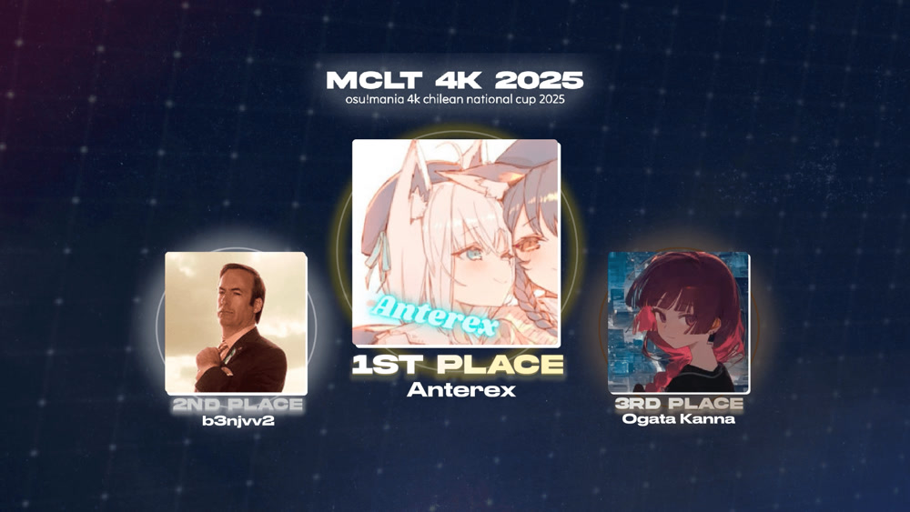

---
tags:
  - MCLT2025
  - MCLT 2025
  - MCLT4K 2025
  - MCLT 4K 2025
---

# osu!mania 4K Chilean National Cup 2025

The **osu!mania 4K Chilean National Cup 2025** (***MCLT 4K 2025***) was a 1v1, double-elimination, Chilean-only open rank osu! tournament hosted by ::{ flag=CL }:: [myucchii](https://osu.ppy.sh/users/10072733) and ::{ flag=CL }:: [nyawaa](https://osu.ppy.sh/users/10235085). It was the first instalment of the osu!mania 4K Chilean National Cup.

## Tournament schedule

| Event | Timestamp |
| --: | :-- |
| Registration phase | 2024-12-27 (21:00 CLST) / 2025-01-12 (21:00 CLST) |
| Qualifier showcase | 2025-01-19 |
| Qualifier stage | 2025-01-25/2025-01-26 |
| Round of 16 | 2025-02-01/2025-02-02 |
| Quarterfinals | 2025-02-07/2025-02-08 |
| Semifinals | 2025-02-14/2025-02-15 |
| Finals | 2025-02-22/2025-02-23 |
| Grand Finals | 2025-03-01/2025-03-02 |

## Prizes

| Placing | Prize(s) |
| :-: | :-- |
|  | Profile badge (pending), 1 year of osu!supporter, profile banner |
|  | 6 months of osu!supporter, profile banner |
|  | 3 months of osu!supporter, profile banner |

 

## Organisation

The osu!mania 4K Chilean National Cup 2025 was run by various community members.

| Position | Member(s) |
| :-- | :-- |
| Organiser | ::{ flag=CL }:: [myucchii](https://osu.ppy.sh/users/10072733), ::{ flag=CL }:: [nyawaa](https://osu.ppy.sh/users/10235085) |
| Mappool selector | ::{ flag=CL }:: [myucchii](https://osu.ppy.sh/users/10072733), ::{ flag=CL }:: [nyawaa](https://osu.ppy.sh/users/10235085), ::{ flag=CL }:: [MyAngelKokomi](https://osu.ppy.sh/users/8880797), ::{ flag=CN }:: [[GB]nyasunwaifu](https://osu.ppy.sh/users/26031439) |
| Mappool scouter | ::{ flag=CN }:: [Blue_Potion](https://osu.ppy.sh/users/13094831), ::{ flag=VN }:: [--Glitchy--](https://osu.ppy.sh/users/30644569) |
| Mappool playtester | ::{ flag=VN }:: [--Glitchy--](https://osu.ppy.sh/users/30644569), ::{ flag=CN }:: [[GB]nyasunwaifu](https://osu.ppy.sh/users/26031439), ::{ flag=CL }:: [[LS]bambi fnf](https://osu.ppy.sh/users/20360332), ::{ flag=US }:: [beta carotene](https://osu.ppy.sh/users/22839620), ::{ flag=MY }:: [cheewee10](https://osu.ppy.sh/users/4477497), ::{ flag=BR }:: [fefedk](https://osu.ppy.sh/users/18943504), ::{ flag=AR }:: [gxrl](https://osu.ppy.sh/users/13226626), ::{ flag=AR }:: [-hakitsu](https://osu.ppy.sh/users/25300387), ::{ flag=BR }:: [LeMarcinho](https://osu.ppy.sh/users/13347579), ::{ flag=US }:: [PeachMarrow](https://osu.ppy.sh/users/15926730), ::{ flag=CL }:: [nyawaa](https://osu.ppy.sh/users/10235085), ::{ flag=KR }:: [[GB]SuddenDeath](https://osu.ppy.sh/users/6699923), ::{ flag=CL }:: [Xan-](https://osu.ppy.sh/users/5919873), ::{ flag=CL }:: [MyAngelKokomi](https://osu.ppy.sh/users/8880797), ::{ flag=KR }:: [imyeeyee](https://osu.ppy.sh/users/26473894), ::{ flag=US }:: [EpsilonMaiagare](https://osu.ppy.sh/users/3855052), ::{ flag=US }:: [Hello_Son](https://osu.ppy.sh/users/17308009), ::{ flag=TH }:: [--Pavin--](https://osu.ppy.sh/users/12046267) |
| Mapper | ::{ flag=BR }:: [Davix150](https://osu.ppy.sh/users/26512810), ::{ flag=NZ }:: [Div](https://osu.ppy.sh/users/3751116), ::{ flag=US }:: [Nepijin](https://osu.ppy.sh/users/11734610), ::{ flag=US }:: [elexire](https://osu.ppy.sh/users/9206093), ::{ flag=CN }:: [Hylotl](https://osu.ppy.sh/users/18270260), ::{ flag=CL }:: [H4chyk0](https://osu.ppy.sh/users/17397748), ::{ flag=BR }:: [nayeonie bunny](https://osu.ppy.sh/users/15187174), ::{ flag=US }:: [ImperialTrinity](https://osu.ppy.sh/users/5066305), ::{ flag=US }:: [Logan636](https://osu.ppy.sh/users/9423766), ::{ flag=PE }:: [Miaurichesu](https://osu.ppy.sh/users/10055648), ::{ flag=CL }:: [NikoSek](https://osu.ppy.sh/users/4088977), ::{ flag=KR }:: [[GB]Oceanus](https://osu.ppy.sh/users/9164100), ::{ flag=CN }:: [[GB]R-Trigger](https://osu.ppy.sh/users/25308131), ::{ flag=US }:: [Smokydoh](https://osu.ppy.sh/users/20169884), ::{ flag=CN }:: [Blue_Potion](https://osu.ppy.sh/users/13094831), ::{ flag=CL }:: [Urusai](https://osu.ppy.sh/users/469808), ::{ flag=CN }:: [V1do-](https://osu.ppy.sh/users/17527968), ::{ flag=CL }:: [MyAngelKokomi](https://osu.ppy.sh/users/8880797) |
| Streamer | ::{ flag=CL }:: [Jeanne Da Rin](https://osu.ppy.sh/users/5214842), ::{ flag=CL }:: [Kioshinxs](https://osu.ppy.sh/users/14433939), ::{ flag=CL }:: [myucchii](https://osu.ppy.sh/users/10072733), ::{ flag=CL }:: [nyawaa](https://osu.ppy.sh/users/10235085), ::{ flag=IT }:: [ndrrr](https://osu.ppy.sh/users/4609767), ::{ flag=CL }:: [Shiny Froakie](https://osu.ppy.sh/users/6194830), ::{ flag=PH }:: [Silhoueska Elze](https://osu.ppy.sh/users/11517895), ::{ flag=US }:: [EpsilonMaiagare](https://osu.ppy.sh/users/3855052), ::{ flag=AR }:: [Limber](https://osu.ppy.sh/users/7093698) |
| Commentator | ::{ flag=CL }:: [Jeanne Da Rin](https://osu.ppy.sh/users/5214842), ::{ flag=CL }:: [myucchii](https://osu.ppy.sh/users/10072733), ::{ flag=CL }:: [Shiny Froakie](https://osu.ppy.sh/users/6194830), ::{ flag=CL }:: [-Ryu-](https://osu.ppy.sh/users/8440939), ::{ flag=AR }:: [Limber](https://osu.ppy.sh/users/7093698), ::{ flag=CL }:: [Kioshinxs](https://osu.ppy.sh/users/14433939), ::{ flag=CL }:: [Xan-](https://osu.ppy.sh/users/5919873), ::{ flag=AR }:: [gxrl](https://osu.ppy.sh/users/13226626), ::{ flag=CL }:: [Urusai](https://osu.ppy.sh/users/469808) |
| Referee | ::{ flag=VN }:: [--Glitchy--](https://osu.ppy.sh/users/30644569), ::{ flag=CL }:: [Bastaku](https://osu.ppy.sh/users/14351782), ::{ flag=CL }:: [chibamasu](https://osu.ppy.sh/users/16067522), ::{ flag=CL }:: [Isita](https://osu.ppy.sh/users/13973026), ::{ flag=CL }:: [myucchii](https://osu.ppy.sh/users/10072733), ::{ flag=IT }:: [ndrrr](https://osu.ppy.sh/users/4609767), ::{ flag=AR }:: [ottenst](https://osu.ppy.sh/users/13488325), ::{ flag=CL }:: [nyawaa](https://osu.ppy.sh/users/10235085), ::{ flag=CL }:: [Shiny Froakie](https://osu.ppy.sh/users/6194830), ::{ flag=CL }:: [ulko](https://osu.ppy.sh/users/1263669), ::{ flag=AR }:: [Limber](https://osu.ppy.sh/users/7093698) |
| Spreadsheet management | ::{ flag=CL }:: [myucchii](https://osu.ppy.sh/users/10072733), ::{ flag=CN }:: [CuteNatro](https://osu.ppy.sh/users/27233308) |
| Design team | ::{ flag=CL }:: [myucchii](https://osu.ppy.sh/users/10072733), ::{ flag=US }:: [mohca](https://osu.ppy.sh/users/14499702), ::{ flag=US }:: [Nepijin](https://osu.ppy.sh/users/11734610), ::{ flag=CL }:: [SmilingKey](https://osu.ppy.sh/users/10659178), ::{ flag=PH }:: [DD1amond](https://osu.ppy.sh/users/14705051) |

## Links

- **[Information spreadsheet](https://docs.google.com/spreadsheets/d/1N6ri1YN1-2lFDzPiyS4ap6i7mPepbsAu-q7mIcSWD5k/edit?gid=0#gid=0)**
- [Forum post](https://osu.ppy.sh/community/forums/topics/2020146?n=1)
- [Livestream](https://www.twitch.tv/mclt_osu)
- [Challonge bracket](https://challonge.com/es/mclt4k2025)
- [Discord server](https://discord.gg/aSTBgHBpSN)
- [VOD collection (YouTube)](https://www.youtube.com/@MCLT4K)

## Participants

| Seed | Player |
| :-: | :-- |
| 1 | ::{ flag=CL }:: [b3njvv2](https://osu.ppy.sh/users/23291631) |
| 2 | ::{ flag=CL }:: [Anterex](https://osu.ppy.sh/users/24548857) |
| 3 | ::{ flag=CL }:: [kuraaaFangirl](https://osu.ppy.sh/users/27989088) |
| 4 | ::{ flag=CL }:: [Hikikomori](https://osu.ppy.sh/users/27989088) |
| 5 | ::{ flag=CL }:: [Ogata Kanna](https://osu.ppy.sh/users/20234457) |
| 6 | ::{ flag=CL }:: [Shiny Sylveon](https://osu.ppy.sh/users/22813898) |
| 7 | ::{ flag=CL }:: [yukataa](https://osu.ppy.sh/users/24277812) |
| 8 | ::{ flag=CL }:: [Yor Fangirl](https://osu.ppy.sh/users/19088935) |
| 9 | ::{ flag=CL }:: [Best Sanallite](https://osu.ppy.sh/users/23315931) |
| 10 | ::{ flag=CL }:: [Jeanne Da Rin](https://osu.ppy.sh/users/5214842) |
| 11 | ::{ flag=CL }:: [NikitodeuS](https://osu.ppy.sh/users/25323782) |
| 12 | ::{ flag=CL }:: [TheTrixdo_YT](https://osu.ppy.sh/users/15428378) |
| 13 | ::{ flag=CL }:: [Horuszed](https://osu.ppy.sh/users/24181636) |
| 14 | ::{ flag=CL }:: [UQU](https://osu.ppy.sh/users/11012279) |
| 15 | ::{ flag=CL }:: [[REG]Levels](https://osu.ppy.sh/users/15421077) |
| 16 | ::{ flag=CL }:: [Wantaso](https://osu.ppy.sh/users/17363267) |
| 17 | ::{ flag=CL }:: [[REG]M1ST3R](https://osu.ppy.sh/users/21788629) |
| 18 | ::{ flag=CL }:: [-Kori](https://osu.ppy.sh/users/12490530) |
| 19 | ::{ flag=CL }:: [[AT] Funnies](https://osu.ppy.sh/users/31679332) |
| 20 | ::{ flag=CL }:: [Diprimm](https://osu.ppy.sh/users/12219285) |
| 21 | ::{ flag=CL }:: [brunaso](https://osu.ppy.sh/users/22386768) |
| 22 | ::{ flag=CL }:: [-Ryu-](https://osu.ppy.sh/users/8440939) |
| 23 | ::{ flag=CL }:: [YeaaBoiii](https://osu.ppy.sh/users/14630452) |
| 24 | ::{ flag=CL }:: [labotx](https://osu.ppy.sh/users/12434346) |

## Podium

## Mappools

### Grand Finals

**[Download the mappack here! (204 MB)](https://drive.usercontent.google.com/download?id=1N0kiPalXmwbn7ABcv21cpjWeW_h97qNx&export=download&authuser=0)**

- Rice
  1. [Yuaru - Asu no Yozora Shoukaihan (Miaurichesu) [melancholy 1.05x]](https://osu.ppy.sh/beatmapsets/2329282#mania/4994677)
  2. [KEMOMIMI EDM SQUAD - Breakcore Strikes Back (Smokydoh) [chicken why v2 // MCLT Edit [1.075]]](https://osu.ppy.sh/beatmapsets/2329144#mania/4994389)
  3. [LV.4 feat. Chiaki Iwasaki - B.O.L. ([GB]Oceanus) [Exigent (edit)]](https://osu.ppy.sh/beatmapsets/2329174#mania/4994454)
  4. [Anubasu-anubasu remixed by CELLON - The island of albatross -8bit Style RMX- (MyZterioN-) [awe 1.1x (165bpm)]](https://osu.ppy.sh/beatmapsets/1996250#mania/4148831)
  5. [Sillot - Dear Myuka (H4chyk0) [[MCLT Gran Final: myucchii vs [GS]Myuka]]](https://osu.ppy.sh/beatmapsets/2329236#mania/4994599)
  6. [Terminal 11 - The Ever Increasing Death Toll of Birds In My Life (Pizza69) [Extreme]](https://osu.ppy.sh/beatmapsets/1802944#mania/3697102)
  7. [Datach'i - LaByRa (Phil) [Thanatopsis 1.05x (208bpm)]](https://osu.ppy.sh/beatmapsets/2055649#mania/4295387)
  8. [Monster Siren Records - Arsonist (elexire) [Renegade (Cut)]](https://osu.ppy.sh/beatmapsets/2329178#mania/4994461)
- Hybrid
  1. [Rish feat. Choko - Punai Punai Sensou (V1do-) [Boin Boin]](https://osu.ppy.sh/beatmapsets/2329229#mania/4994590)
  2. [t+pazolite & Sakuzyo - Silentphobia (Uncut Edition) (H4chyk0) [Finale: Cataclysm]](https://osu.ppy.sh/beatmapsets/2329230#mania/4994591)
  3. [Ichika Nito feat. Feryquitous - Metaphor (ImperialTrinity) [Expert | Ethereal Resonance]](https://osu.ppy.sh/beatmapsets/2329261#mania/4994642)
- Long Note
  1. [KAF - Montage (Hylotl) [Cinematic]](https://osu.ppy.sh/beatmapsets/2329101#mania/4994314)
  2. [Hino Isuka - Dreamin' attraction!! ([Crz]Crysarlene) [Sidonia [1.1x Rate]]](https://osu.ppy.sh/beatmapsets/2006864#mania/4186382)
  3. [asteria - i didn't need you anyway (myucchii) [farewell (edit)]](https://osu.ppy.sh/beatmapsets/2231477#mania/4993235)
  4. [Culprate - Beast (Vorso Remix) ([Crz]Crysarlene) [Excelsior]](https://osu.ppy.sh/beatmapsets/2230642#mania/4733962)
  5. [-MSR/Adam Gubman/Holly Sedillos - Awaken (Nepijin) [SPALTER PLEASE SAVE ME]](https://osu.ppy.sh/beatmapsets/2329267#mania/4994652)
- Tiebreaker
  1. **[megaskzm - Pathos (myucchii) [Sentient Sorrow]](https://osu.ppy.sh/beatmapsets/2329317#mania/4994803)**

### Finals

**[Download the mappack here! (229 MB)](https://drive.google.com/file/d/1MHlLP_L5pX7Zco2PZZkbZWidQpTtFT_j/view)**

- Rice
  1. [SOUND HOLIC vs. dj TAKA feat. YURiCa - TIEFSEE (Polarin) [1.05x]](https://osu.ppy.sh/beatmapsets/1892755#mania/4588272)
  2. [Aitsuki Nakuru - Presenter* (YuEast 2018) [^^ x1.10]](https://osu.ppy.sh/beatmapsets/1896501#mania/3908503)
  3. [Falcom Sound Player jdk - Formidable Enemy (lemonguy) [Nightmare x1.1]](https://osu.ppy.sh/beatmapsets/1589255#mania/3246090)
  4. [Yooh - LiFE Garden (Oceanus) [x1.1]](https://osu.ppy.sh/beatmapsets/1971578#mania/4090794)
  5. [Camellia feat. Nana Takahashi - Mushi no Sumu Tokoro (nyawaa) [Trapped Within the Spider's Web 1.05x (edit)]](https://osu.ppy.sh/beatmapsets/2325362#mania/4984351)
  6. [Chesss Galea - Al Fine -Whispers of Destiny- (nyawaa) [ocean blue 1.05x]](https://osu.ppy.sh/beatmapsets/2325360#mania/4984345)
  7. [Dev/Null - Rage Template (0DZ0) [Fury]](https://osu.ppy.sh/beatmapsets/2218594#mania/4925322)
  8. [Sheena Ringo - Tsumi to batsu (nyawaa) [Sympathy x1.05 (edit)]](https://osu.ppy.sh/beatmapsets/2325363#mania/4984352)
- Hybrid
  1. [Nanahira - Shakunetsu? Candle Master? Tomoshi (V1do-) [Edit 1.05x]](https://osu.ppy.sh/beatmapsets/2313824#mania/4981878)
  2. [ChumuNote - BlueSunnyFish (feat. Twinfield) (chxu) [ABOVE YOU]](https://osu.ppy.sh/beatmapsets/2230516#mania/4733668)
  3. [technoplanet - Inscape [Extended Mix] (Toaph Daddy) [Eternal]](https://osu.ppy.sh/beatmapsets/1759394#mania/3600845)
- Long Note
  1. [Miyashita Yuu - Endgame (doctormango) [Dance of the Reaper]](https://osu.ppy.sh/beatmapsets/1856605#mania/3815684)
  2. [katagiri - RAINBOW GIRL (katagiri Remix) (YuEast 2018) [x1.00]](https://osu.ppy.sh/beatmapsets/2119804#mania/4453271)
  3. [sasakure.UK feat. Hatsune Miku + KAITO - AMARA (Daimirai Dennou) (MyZterioN-) [artificial language]](https://osu.ppy.sh/beatmapsets/1943025#mania/4099552)
  4. [RetBear (unknown Vo: 10fu) - Atamannaka DEAD END ([GB]sherweifa) [Hylotl's "Kuro" Edit]](https://osu.ppy.sh/beatmapsets/1899339#mania/4065021)
  5. [Crayvxn - Crank It (TheFunk) [Crankin (Edit) 1.1x]](https://osu.ppy.sh/beatmapsets/1849899#mania/4978046)
- Tiebreaker
  1. **[Kyutatsuki - SOUND ARCHITECT (V1do-) [Sanctum]](https://osu.ppy.sh/beatmapsets/2325289#mania/4984208)**

### Semifinals

**[Download the mappack here! (169 MB)](https://drive.usercontent.google.com/download?id=1JzvGBknj37Yug961OJVrgFWYrhc-76Ii&export=download&authuser=0)**

- Rice
  1. [Not A Clever Pony - All-Powerful (Trixie) (Extended Edit) (Blue_Potion) [Magic Streams 1.4x]](https://osu.ppy.sh/beatmapsets/2229568#mania/4730916)
  2. [YurryCanon feat. GUMI - humanly (Miaurichesu) [artificial]](https://osu.ppy.sh/beatmapsets/2321511#mania/4973660)
  3. [SHIKI - Angelic Layer (elexire) [Lapis (cut)]](https://osu.ppy.sh/beatmapsets/2196883#mania/4962381)
  4. [Kairiki Bear - Carnival Happy (Div) [Mayday x1.05]](https://osu.ppy.sh/beatmapsets/2321504#mania/4973616)
  5. [Voysol - ROGUE: MYTH (elexire) [XXII]](https://osu.ppy.sh/beatmapsets/1985425#mania/4141993)
  6. [Haraguchi Sasuke - Hito mania (CrewK) [osu mania 1.05x (158bpm) OD8]](https://osu.ppy.sh/beatmapsets/2081615#mania/4359444)
  7. [Terminal 11 - Fractured Sunshine (Reyi) [Rupture 1.05x (168bpm)]](https://osu.ppy.sh/beatmapsets/1906259#mania/3930847)
- Hybrid
  1. [Katagiri - Scattered Pancakes ([GB]V1do) [2024 Remake]](https://osu.ppy.sh/beatmapsets/1480059#mania/4942596)
  2. [meganeko - Feral (osu! edit) ([GB]Mafufu) [Blue_Potion's Meditation 1.0x]](https://osu.ppy.sh/beatmapsets/2226626#mania/4723468)
  3. [Kobaryo - Computer Cornflakes (ImperialTrinity) [Kellogg's]](https://osu.ppy.sh/beatmapsets/2321506#mania/4973623)
- Long Note
  1. [Three feat.Kagamine Len - Ego Rock (Raveille) [Nonsensu]](https://osu.ppy.sh/beatmapsets/1880547#mania/3871591)
  2. [Helblinde - Heaven's Fall (Polarin) [erm]](https://osu.ppy.sh/beatmapsets/2070275#mania/4736039)
  3. [technoplanet feat. Haruno - End of Fairytale (Raveille) [Stage 4: Parable]](https://osu.ppy.sh/beatmapsets/2039243#mania/4253496)
  4. [nitro - qualia -ideaesthesia- (doctormango) [interperception]](https://osu.ppy.sh/beatmapsets/1867902#mania/3842429)
- Tiebreaker
  1. **[takehirotei as ''Infinite Limit'' - Rules of the Chaos Dilemma ([GB]V1do) [Uncertainty Formula (w/ Lucky Clover)]](https://osu.ppy.sh/beatmapsets/1980017#mania/4111409)**

### Quarterfinals

**[Download the mappack here! (160 MB)](https://drive.usercontent.google.com/download?id=1PYgHLRmg0YShUxucZF7URphmQYs5UfKC&export=download&authuser=0)**

- Rice
  1. [Dimrain47 - At the Speed of Light (Cut Ver.) (Polarin) [Geometry Dash extreme demon BLOODBATH by Riot 100%.]](https://osu.ppy.sh/beatmapsets/1802127#mania/4713340)
  2. [katagiri - Buta Musou (H4chyk0) [you should play arknights]](https://osu.ppy.sh/beatmapsets/2317988#mania/4964321)
  3. [SAM Free Music - Up to you (PORTTAYER) [Sora]](https://osu.ppy.sh/beatmapsets/2290878#mania/4889812)
  4. [Laur - DANGEROOOOUS JUNGLE ([GB]R-Trigger) [Anc1ent F1re(nerf)]](https://osu.ppy.sh/beatmapsets/2317836#mania/4963907)
  5. [Nightmare - Dream to Nightmare (Shoegazer) [Paralysis 1.15x (205bpm)]](https://osu.ppy.sh/beatmapsets/1722773#mania/3658110)
  6. [Creepy Nuts - Bling-Bang-Bang-Born ([GB]sherweifa) [chou flex]](https://osu.ppy.sh/beatmapsets/2133864#mania/4489182)
  7. [Aaron Spectre - You Don't Know (aeoliancarp) [It Is a Mystery [1.25x]]](https://osu.ppy.sh/beatmapsets/1537106#mania/3142810)
- Hybrid
  1. [32ki feat. Hatsune Miku & Kasane Teto - Mesmerizer (H4chyk0) [Phosphoribosylaminoimidazolesuccinocarboxamide]](https://osu.ppy.sh/beatmapsets/2317987#mania/4964320)
  2. [Hino Isuka - Wonderful Paradise (lemonguy) [Stage 6: Utopia]](https://osu.ppy.sh/beatmapsets/1818125#mania/3730163)
  3. [Yuta Imai Vs. BEMANI Sound Player "L.E.D.-G" - THE PEERLESS UNDER HEAVEN (stupud man) [DIVINE PUNISHMENT]](https://osu.ppy.sh/beatmapsets/1849062#mania/3798338)
- Long Note
  1. [Memme feat. M2U - Sky of the Ocean (Logan636) [Logan x HowToPlayLN's Troposphere]](https://osu.ppy.sh/beatmapsets/1876041#mania/3860745)
  2. [t+pazolite - Angelic Jelly (-mint-) [Dessert]](https://osu.ppy.sh/beatmapsets/1877623#mania/3864769)
  3. [Pizuya's Cell - Let me be your cure (myucchii) [Hazel 1.05x (202bpm)]](https://osu.ppy.sh/beatmapsets/2318013#mania/4964356)
  4. [Kairiki Bear - Bug (Micleak) [Flawful]](https://osu.ppy.sh/beatmapsets/1854104#mania/3866387)
- Tiebreaker
  1. **[Rabbit House - Rabbit In The Black Room (2023 VIP) ([GB]R-Trigger) [Kuro (230BPM)]](https://osu.ppy.sh/beatmapsets/2317834#mania/4963904)**

### Round of 16

**[Download the mappack here! (129 MB)](https://drive.google.com/file/d/1-4k5NMAA6nVPYjp3351ootxMT20-ZYJk/view?usp=sharing)**

- Rice
  1. [Falcom Sound Player jdk - GENS D'ARMES (lemonguy) [Challenge x1.1]](https://osu.ppy.sh/beatmapsets/1722701#mania/3520824)
  2. [MIRIQO - Before Ascent (H4chyk0) [Prelude]](https://osu.ppy.sh/beatmapsets/2314271#mania/4952587)
  3. [sun3 - ApolloN (Shoegazer) [Voyager 1.3x (234bpm)]](https://osu.ppy.sh/beatmapsets/1637333#mania/3374559)
  4. [Yuiphex - My Red H3ad Girl (Davix150) [T3chnical Elegance]](https://osu.ppy.sh/beatmapsets/2314283#mania/4952600)
  5. [Portion Boys - Kylabaari (guden) [Humalassa 1.1x (168bpm)]](https://osu.ppy.sh/beatmapsets/1909954#mania/3939528)
  6. [Marina Saito - Crazy For You (Ska) [Yann]](https://osu.ppy.sh/beatmapsets/1589203#mania/3245969)
- Hybrid
  1. [BEMANI Sound Player "person09" - Puberty Dysthymia (arpia97) [EX]](https://osu.ppy.sh/beatmapsets/1792778#mania/3854386)
  2. [Yu-dachi - Shirohana no Tenshi (Hytex) [Sora]](https://osu.ppy.sh/beatmapsets/2038105#mania/4250977)
- Long Note
  1. [Wakeshima Kanon - Tsukinami (Cut Ver.) (nayeonie bunny) [lunar cycle]](https://osu.ppy.sh/beatmapsets/2314273#mania/4952589)
  2. [TAMAONSEN - Touhou Tanoshii feat. Matsu (YuEast 2018) [x1.00]](https://osu.ppy.sh/beatmapsets/1700387#mania/3474376)
  3. [DJ Noriken & aran - Comet Coaster (chxu) [Frizzle]](https://osu.ppy.sh/beatmapsets/1875722#mania/3859986)
  4. [Memme - Gaehwa (elexire) [Sakura Fubuki]](https://osu.ppy.sh/beatmapsets/2010275#mania/4182879)
- Tiebreaker
  1. **[Camellia - overcomplexification ("Quaternion" Long ver.) (myucchii) [disambiguation (edit)]](https://osu.ppy.sh/beatmapsets/2314301#mania/4952628)**

### Qualifiers

**[Download the mappack here! (35.9 MB)](https://drive.google.com/file/d/1MVv7cJl8Hy-OdeGu3zOG7ctkHHPsrKTE/view?usp=sharing)**

- Rice
  1. [RYOQUCHA - CYBERDREAM (Cut Ver.) (Urusai) [Stage 1: Future]](https://osu.ppy.sh/beatmapsets/2310771#osu/4943403)
  2. [Tanya Degurechaff (CV: Yuki Aoi) - Los! Los! Los! (NikoSek) [Stage 2: Tyranique]](https://osu.ppy.sh/beatmapsets/2310784#mania/4943432)
- Hybrid
  1. [technoplanet - Insomnia ([GB]V1do) [Stage 3: Restless]](https://osu.ppy.sh/beatmapsets/2310765#mania/4943385)
- Long Note
  1. [Sta - Iris (Nepijin) [Stage 4: Play Arknights]](https://osu.ppy.sh/beatmapsets/2310770#mania/4943401)
  2. [Yuikonnu - Genjitsu Game (Logan636) [Stage 5: Pursuit]](https://osu.ppy.sh/beatmapsets/2310746#mania/4943345)

## Match results

Detailed statistics for this round can be found [on this spreadsheet](https://docs.google.com/spreadsheets/d/15afg8Fbu8G_hfQ6OKf5zYPtRkDLnJNf3NvoZn-LGj8s).

### Grand Finals

Saturday, 1 March 2025:

| Team A |  |  | Team B | Match link | VOD link |
| --: | :-: | :-: | :-- | :-- | :-- |
| **b3njvv2** ::{ flag=CL }:: | **7** | 2 | ::{ flag=CL }:: Ogata Kanna | [#1](https://osu.ppy.sh/community/matches/117348510) | [#1](https://www.twitch.tv/videos/2394611266) |

Sunday, 2 March 2025:

| Team A |  |  | Team B | Match link | VOD link |
| --: | :-: | :-: | :-- | :-- | :-- |
| **Anterex** ::{ flag=CL }:: | **7** | 4 | ::{ flag=CL }:: b3njvv2 | [#1](https://osu.ppy.sh/community/matches/117360960) | [#1](https://www.twitch.tv/videos/2395541285) |

### Finals

Detailed statistics for this round can be found [on this spreadsheet](https://docs.google.com/spreadsheets/d/1sdBSTCFOd8dz-m2BjbqKU2sBu-1rUWjsD7hbDRfUBrg).

Saturday, 22 February 2025:

| Player A |  |  | Player B | Match link | VOD link |
| --: | :-: | :-: | :-- | :-- | :-- |
| b3njvv2 ::{ flag=CL }:: | 3 | **7** | ::{ flag=CL }:: Anterex | [#1](https://osu.ppy.sh/community/matches/117271579) | [#1](https://www.twitch.tv/videos/2389555020) |
| **Ogata Kanna** ::{ flag=CL }:: | **7** | 6 | ::{ flag=CL }:: Horuszed | [#1](https://osu.ppy.sh/community/matches/117272342) | [#1](https://www.twitch.tv/videos/2389555016) |
| kuraaaFangirl ::{ flag=CL }:: | 3 | **7** | ::{ flag=CL }:: **Hikikomori** | [#1](https://osu.ppy.sh/community/matches/117273169) | [#1](https://www.twitch.tv/videos/2389555018) |

Sunday, 23 February 2025:

| Player A |  |  | Player B | Match link | VOD link |
| --: | :-: | :-: | :-- | :-- | :-- |
| **Ogata Kanna** ::{ flag=CL }:: | **7** | 2 | ::{ flag=CL }:: Hikikomori | [#1](https://osu.ppy.sh/community/matches/117284604) | [#1](https://www.twitch.tv/videos/2389556997) |

### Semifinals

Detailed statistics for this round can be found [on this spreadsheet](https://docs.google.com/spreadsheets/d/104SI1Ce1smJyuuMexYcQhNE8m6NFognLMPfoMbuDKnE).

Saturday, 15 February 2025:

| Player A |  |  | Player B | Match link | VOD link |
| --: | :-: | :-: | :-- | :-- | :-- |
| **b3njvv2** ::{ flag=CL }:: | **6** | 4 | ::{ flag=CL }:: Ogata Kanna | [#1](https://osu.ppy.sh/community/matches/117188342) | [#1](https://www.twitch.tv/videos/2382390641) |
| **Hikikomori** ::{ flag=CL }:: | **6** | 5 | ::{ flag=CL }:: yukataa | [#1](https://osu.ppy.sh/community/matches/117190863) |  |
| Best Sanallite ::{ flag=CL }:: | 4 | **6** | ::{ flag=CL }:: **NikitodeuS** | [#1](https://osu.ppy.sh/community/matches/117191514) | [#1](https://www.twitch.tv/videos/2382390372) |
| Jeanne Da Rin ::{ flag=CL }:: | 4 | **6** | ::{ flag=CL }:: **Horuszed** | [#1](https://osu.ppy.sh/community/matches/117192708) | [#1](https://www.twitch.tv/videos/2382390103) |

Sunday, 16 February 2025:

| Player A |  |  | Player B | Match link | VOD link |
| --: | :-: | :-: | :-- | :-- | :-- |
| **Yor Fangirl** ::{ flag=CL }:: | **6** | -1 | ::{ flag=CL }:: Shiny Sylveon | *win by default* |  |
| **Anterex** ::{ flag=CL }:: | **6** | 0 | ::{ flag=CL }:: kuraaaFangirl | [#1](https://osu.ppy.sh/community/matches/117205295) | [#1](https://www.twitch.tv/videos/2383776915) |
| **Hikikomori** ::{ flag=CL }:: | **6** | 1 | ::{ flag=CL }:: NikitodeuS | [#1](https://osu.ppy.sh/community/matches/117205757) |  |
| Yor Fangirl ::{ flag=CL }:: | 3 | **6** | ::{ flag=CL }:: **Horuszed** | [#1](https://osu.ppy.sh/community/matches/117205794) | [#1](https://www.twitch.tv/videos/2383777114) |

### Quarterfinals

Detailed statistics for this round can be found [on this spreadsheet](https://docs.google.com/spreadsheets/d/1eIMFwHFejZ6zirpLnm0w7OTqA11JRqYPEszzkoSp1WQ).

Friday, 7 February 2025:

| Player A |  |  | Player B | Match link | VOD link |
| --: | :-: | :-: | :-- | :-- | :-- |
| **Anterex** ::{ flag=CL }:: | **6** | 0 | ::{ flag=CL }:: Jeanne Da Rin | [#1](https://osu.ppy.sh/community/matches/117093415) | [#1](https://www.twitch.tv/videos/2376058430) |
 
Saturday, 8 February 2025:

| Player A |  |  | Player B | Match link | VOD link |
| --: | :-: | :-: | :-- | :-- | :-- |
| Wantaso ::{ flag=CL }:: | -1 | **6** | ::{ flag=CL }:: **Yor Fangirl** | *win by default* |  |
| **Horuszed** ::{ flag=CL }:: | **6** | 3 | ::{ flag=CL }:: TheTrixdo_YT | [#1](https://osu.ppy.sh/community/matches/117105222) | [#1](https://www.twitch.tv/videos/2376058108) |
| [REG]Levels ::{ flag=CL }:: | 1 | **6** | ::{ flag=CL }:: **yukataa** | [#1](https://osu.ppy.sh/community/matches/117106043) | [#1](https://www.twitch.tv/videos/2376057639) |
| **b3njvv2** ::{ flag=CL }:: | **6** | 0 | ::{ flag=CL }:: Best Sanallite | [#1](https://osu.ppy.sh/community/matches/117108449) | [#1](https://www.twitch.tv/videos/2376056882) |
| UQU ::{ flag=CL }:: | -1 | **6** | ::{ flag=CL }:: **NikitodeuS** | [*win by default*](https://osu.ppy.sh/community/matches/117109269) |  |
| Hikikomori ::{ flag=CL }:: | 0 | **6** | ::{ flag=CL }:: **Ogata Kanna** | [#1](https://osu.ppy.sh/community/matches/117111498) | [#1](https://www.twitch.tv/videos/2377226704) |

Sunday, 9 February 2025:

| Player A |  |  | Player B | Match link | VOD link |
| --: | :-: | :-: | :-- | :-- | :-- |
| **kuraaaFangirl** ::{ flag=CL }:: | **6** | 1 | ::{ flag=CL }:: Shiny Sylveon | [#1](https://osu.ppy.sh/community/matches/117121756) | [#1](https://www.twitch.tv/videos/2377226956) |

### Round of 16

Detailed statistics for this round can be found [on this spreadsheet](https://docs.google.com/spreadsheets/d/1J5OpwDH6j5fTULnw9V1hEV9wwzoKgnDaQx_V6vYBV94).

Saturday, 1 February 2025:

| Player A |  |  | Player B | Match link | VOD link |
| --: | :-: | :-: | :-- | :-- | :-- |
| **b3njvv2** ::{ flag=CL }:: | **5** | -1 | ::{ flag=CL }:: Wantaso | *win by default* |  |
| Yor Fangirl ::{ flag=CL }:: | 1 | **5** | ::{ flag=CL }:: **Best Sanallite** | [#1](https://osu.ppy.sh/community/matches/117027474) | [#1](https://www.twitch.tv/videos/2369879732) |
| **Hikikomori** ::{ flag=CL }:: | **5** | -1 | ::{ flag=CL }:: Horuszed | [#1](https://osu.ppy.sh/community/matches/117028217) |  |
| **Ogata Kanna** ::{ flag=CL }:: | **5** | 2 | ::{ flag=CL }:: TheTrixdo_YT | [#1](https://osu.ppy.sh/community/matches/117029124) | [#1](https://www.twitch.tv/videos/2370163235) |
| **Anterex** ::{ flag=CL }:: | **5** | 0 | ::{ flag=CL }:: [REG]Levels | [#1](https://osu.ppy.sh/community/matches/117031119) | [#1](https://www.twitch.tv/videos/2370163448) |

Sunday, 2 February 2025:

| Player A |  |  | Player B | Match link | VOD link |
| --: | :-: | :-: | :-- | :-- | :-- |
| yukataa ::{ flag=CL }:: | 4 | **5** | ::{ flag=CL }:: **Jeanne Da Rin** | [#1](https://osu.ppy.sh/community/matches/117038115) | [#1](https://www.twitch.tv/videos/2370616128) |
| **kuraaaFangirl** ::{ flag=CL }:: | **5** | 1 | ::{ flag=CL }:: UQU | [#1](https://osu.ppy.sh/community/matches/117039635) | [#1](https://www.twitch.tv/videos/2370701940) |
| **Shiny Sylveon** ::{ flag=CL }:: | **5** | 4 | ::{ flag=CL }:: NikitodeuS | [#1](https://osu.ppy.sh/community/matches/117041804) | [#1](https://www.twitch.tv/videos/2371105628) |

### Qualifiers

The final standings for the Qualifier stage can be found in the following [spreadsheet](https://docs.google.com/spreadsheets/d/1-msr4rlozBQP-jWMIwBHAXzVtFRbS0wY7UxbO_wpy7I).

| Seed | Player | Average Rank[^qualifiers-seeding] | avg. score[^qualifiers-tiebreaker] |
| :-: | :-- | --: | --: |
| #1 | ::{ flag=CL }:: b3njvv2 | 2.4 | 988,095 |
| #2 | ::{ flag=CL }:: Anterex | 2.6 | 988,978 |
| #3 | ::{ flag=CL }:: kuraaaFangirl | 4.4 | 981.640 |
| #4 | ::{ flag=CL }:: Hikikomori | 4.4 | 980,398 |
| #5 | ::{ flag=CL }:: Ogata Kanna | 6.6 | 975.031 |
| #6 | ::{ flag=CL }:: Shiny Sylveon | 8.6 | 970.156 |
| #7 | ::{ flag=CL }:: yukataa | 8.6 | 968,687 |
| #8 | ::{ flag=CL }:: Yor Fangirl | 8.6 | 968,247 |
| #9 | ::{ flag=CL }:: Best Sanallite | 10.8 | 964,395 |
| #10 | ::{ flag=CL }:: Jeanne Da Rin | 11.2 | 963,878 |
| #11 | ::{ flag=CL }:: NikitodeuS | 12 | 958.823 |
| #12 | ::{ flag=CL }:: TheTrixdo_YT | 13.4 | 956,299 |
| #13 | ::{ flag=CL }:: Horuszed | 13.4 | 947,361 |
| #14 | ::{ flag=CL }:: UQU | 13.6 | 952,576 |
| #15 | ::{ flag=CL }:: [REG]Levels | 14.2 | 956,143 |
| #16 | ::{ flag=CL }:: Wantaso | 14.6 | 951,591 |
| #17 | ::{ flag=CL }:: [REG]M1ST3R | 14.6 | 947,731 |
| #18 | ::{ flag=CL }:: -Kori | 14.8 | 945,122 |
| #19 | ::{ flag=CL }:: [AT] Funnies | 15 | 938,504 |
| #20 | ::{ flag=CL }:: Diprimm | 16.2 | 942,849 |
| #21 | ::{ flag=CL }:: brunaso | 21.4 | 744,322 |
| #22 | ::{ flag=CL }:: -Ryu- | 21.6 | 736,307 |
| #23 | ::{ flag=CL }:: YeaaBoiii | 23 | 265,990 |
| #24 | ::{ flag=CL }:: labotx | 24 | 155,806 |

## Ruleset

### General

1. Only players with the Chilean flag visible on their osu! profile are eligible to enter the tournament.
2. [Tournament staff members](/wiki/Tournaments/Official_support#staff) must not participate as players in the tournament.
3. Tournament schedules are based on Chilean continental time (UTC-3).
4. To participate in the tournament, player **must** join [this Discord server](https://discord.gg/aSTBgHBpSN) after registration.
5. This tournament is a 1v1 double-elimination competition for the osu!mania game mode (4K variant).
6. Beatmap scoring is based on ScoreV2.
7. Players must adhere to the [osu! community rules](/wiki/Rules) at all times. Any violation of these rules may result in expulsion at the discretion of the tournament hosts.
8. Players are allowed to adjust visual settings to alter background opacity or disable beatmap elements, such as storyboards and skins.
9. Skin elements must not be used to alter key gameplay mechanics inappropriately.
10. The tournament hosts reserve the right to modify these rules at any moment. Any such changes will be announced in advance.

### Mappool information

1. Every stage will have its own mappool.
2. Each mappool consists of a fixed amount of maps, which will all be played under Free Mod conditions.
3. The mappool sizes are as follows:
   - Qualifiers: 5 beatmaps
   - Round of 16: 13 beatmaps
   - Quarterfinals and Semifinals: 15 beatmaps
   - Finals and Grand Finals: 17 beatmaps
4. Each mappool has one tiebreaker, except for the Qualifiers.
5. Possible mod choices for all beatmaps are [Hidden](/wiki/Gameplay/Game_modifier/Hidden), [Fade In](/wiki/Gameplay/Game_modifier/Fade_In), [Flashlight](/wiki/Gameplay/Game_modifier/Flashlight), and [Mirror](/wiki/Gameplay/Game_modifier/Mirror).
6. The tiebreaker will be played under Free Mod conditions.

### Qualifiers

1. A total of 8 lobbies will be available at different times. Custom lobbies can be requested if a player cannot participate in any of the designated lobbies.
2. Players will be invited 10 minutes before the start of each lobby. It is not necessary to join before this period, but players must be present at the scheduled time.
3. If a player does not show up within 5 minutes of the lobby's start time, they will be moved to another lobby.
4. Each lobby will consist of 5 consecutive maps, with a 2-minute break after each map. Once all maps are completed, there will be a 5-minute break where players can retry their maps.
5. The seeding method used will be Average Rank, based on the average ranking obtained in each map.

### After Qualifiers

1. On Sunday of the qualifiers week, at a previously announced time, the qualifier results and designated matches will be published.
2. If players qualify, they will advance to the double-elimination bracket stage, meaning that losing your first match does not eliminate you from the tournament. Starting from Quarterfinals, if you are in the losers' bracket, you will have to play two matches per week. If you lose in the losers' bracket, players will get eliminated from the tournament.

### Matches

1. A room will be created, and players will be invited 15 minutes before the match, with the format: `MCLT4K2025: {(Player 1)} vs {(Player 2)}`
2. Each match will be played using Score V2 and Team Vs format.
3. There will be no warm-up maps, following the same format as MWC matches.
4. Matches (with minor exceptions) will be played over the weekend (Friday to Sunday) at the times specified in the main sheet. Players are allowed to request reschedules up until a deadline announced in the tournament's Discord server.
5. The schedules for each match will be announced on Sundays each week in the main sheet.
6. Both players must be present in the room within a maximum of 10 minutes after the match's start time. If a player does not show up within this time, the opponent will be awarded the victory.
   - *If neither player shows up, they will be allowed to schedule an emergency reschedule within the same day.*
   - *If no suitable time can be found, the player with the higher seeding will advance.*
7. Once both players are present, the referee will ask them to perform `!roll`. The roll winner can choose between first protect or first ban. 
   - If the roll winner (Player A) chooses first protect, the order will be:
     - Protect A - Protect B - Ban B - Ban A - Pick A.
   - If the roll winner chooses first ban instead:
     - Protect B - Protect A - Ban A - Ban B - Pick A.
8. After the rolls, players can freely choose their maps.
9. Players have 2 minutes to select each map and ready up in the lobby. If a player exceeds this limit, the referee may issue a warning and enforce a tactical timeout if necessary. If this happens multiple times, the referee may perform a `!roll` to randomly select a map. In extreme cases, hosts and referees may take stricter actions.
10. Each round will require a certain amount of points in order to win the match, those being:
    - Round of 16: First to 5 points (BO9)
    - Quarterfinals and Semifinals: First to 6 points (BO11)
    - Finals and Grand Finals: First to 7 points (BO13)
11. Each player has one tactical timeout, which can only be used during their own pick. This allows the player to request an additional 2 minutes from the referee, on top of the regular 2-minute pick time.
12. In the rare case of a score tie on a map, the map will be replayed. If a tie occurs again, the map will continue to be replayed until a winner is determined.
13. If a match tie occurs, the tiebreaker map will be played automatically. If both players agree, an additional tactical timeout can be used before the tiebreaker.
14. Only the following mods are allowed during matches: Hidden (HD), Fade In, Flashlight (FL) and Mirror. All other mods **are strictly prohibited**.
15. A rematch can be requested if a player experiences technical issues within the first 30 seconds of a map. The referee may deny this request if deemed unnecessary.
16. If a player disconnects after the first 30 seconds, their opponent will win the point, unless:
    - A VOD, Twitch Stream or liveplay is provided showing the complete playthrough and result.
    - A replay file is submitted, with the timestamp matching exactly with the lobby's map start time.

### Extra

[^qualifiers-seeding]: Average rank between the 5 maps played during the Qualifiers stage.
[^qualifiers-tiebreaker]: Used as a tiebreaker when two Players have the same average rank in their Qualifiers result.
