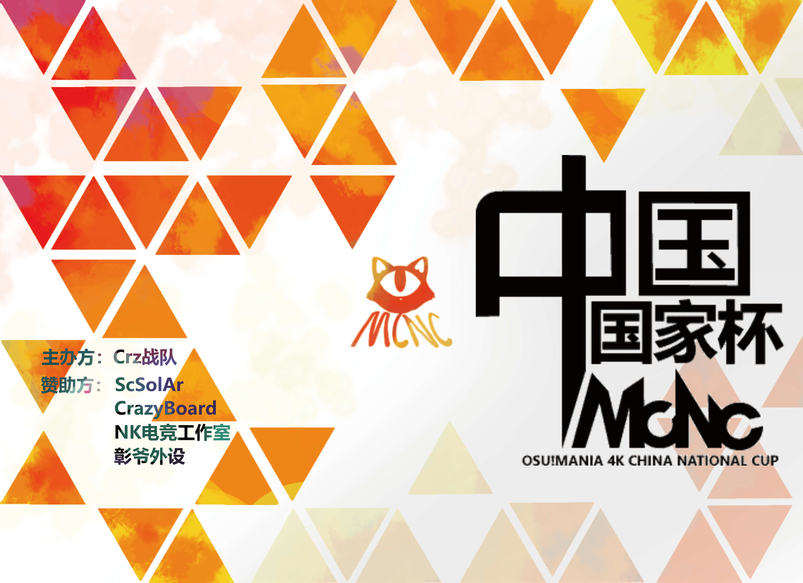
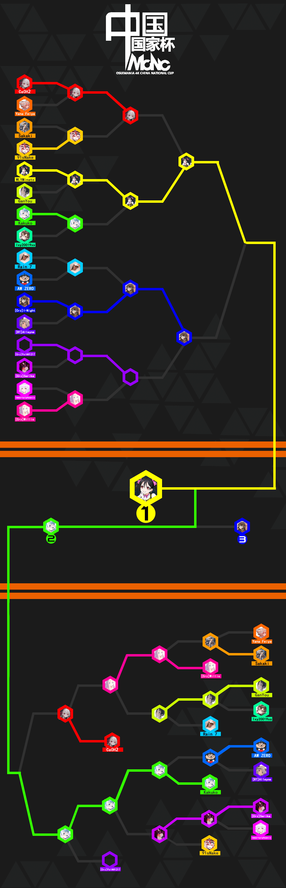
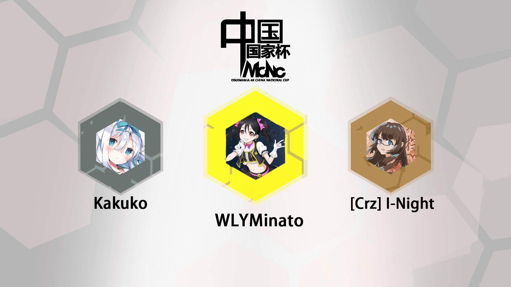

---
tags:
  - MCNC
  - MCNC2020
  - MCNC 2020
---

# osu!mania 4K Chinese National Cup 2020

The **osu!mania 4K Chinese National Cup 2020** (***MCNC 2020***) was a country-based osu!mania tournament hosted by the \[Crz\]Team. It was the second instalment of the osu!mania 4K Chinese National Cup.

## Tournament schedule

| Event | Timestamp |
| --: | :-- |
| Registration phase | 2020-03-23/2020-04-12 |
| Qualifying Contest | 2020-04-27/2020-04-30 |
| Live drawings | 2020-05-01 (20:00 UTC+8) |
| Group stage week 1 | 2020-05-02/2020-05-10 |
| Group stage week 2 | 2020-05-11/2020-05-17 |
| Round of 16 | 2020-05-18/2020-05-24 |
| Quarterfinals | 2020-05-25/2020-05-31 |
| Semifinals week 1 | 2020-06-01/2020-06-07 |
| Semifinals week 2 | 2020-06-08/2020-06-14 |
| Finals week 1 | 2020-06-15/2020-06-21 |
| Finals week 2 | 2020-06-22/2020-06-28 |

## Prizes

| Placing | Prizes |
| :-: | :-- |
|  | CNY 1,200, 15% off coupon for the New Crazyboard, unique profile badge, 4 months of osu!supporter |
|  | CNY 800, 10% off coupon for the New Crazyboard, 2 months of osu!supporter |
|  | CNY 400, 5% off coupon for the New Crazyboard, 1 months of osu!supporter |

## Organisation

The osu!mania 4K Chinese National Cup 2020 was run by various community members.

| Position | Member(s) |
| :-- | :-- |
| Manager | ::{ flag=CN }:: [\[Crz\]xz1z1z](https://osu.ppy.sh/users/10500832), ::{ flag=NZ }:: [\[Crz\]NucleoAP](https://osu.ppy.sh/users/9237208), ::{ flag=US }:: [dblade](https://osu.ppy.sh/users/4272841), ::{ flag=CN }:: [crazybrother](https://osu.ppy.sh/users/8045083) |
| Mappool selector | ::{ flag=CN }:: [\[Crz\]xz1z1z](https://osu.ppy.sh/users/10500832), ::{ flag=CN }:: [Sillyp](https://osu.ppy.sh/users/4556538), ::{ flag=CN }:: [\[Crz\]MemoryI](https://osu.ppy.sh/users/8179131), ::{ flag=CN }:: [\[Crz\]Satori](https://osu.ppy.sh/users/7082178), ::{ flag=MX }:: [\[Crz\]Noire](https://osu.ppy.sh/users/6031847), ::{ flag=MX }:: [Plutes](https://osu.ppy.sh/users/11188249), ::{ flag=MX }:: [\[OSC\]Amagai](https://osu.ppy.sh/users/9658070) |
| Streamer | ::{ flag=CN }:: [\[Crz\]xz1z1z](https://osu.ppy.sh/users/10500832), ::{ flag=CN }:: [crazybrother](https://osu.ppy.sh/users/8045083), ::{ flag=CN }:: [\[Crz\]Satori](https://osu.ppy.sh/users/7082178), ::{ flag=CN }:: [Rasis](https://osu.ppy.sh/users/1209363), ::{ flag=CN }:: [Ayase Eli](https://osu.ppy.sh/users/6764156) |
| Commentator | ::{ flag=CN }:: [\[Crz\]xz1z1z](https://osu.ppy.sh/users/10500832), ::{ flag=CN }:: [\[Crz\]Satori](https://osu.ppy.sh/users/7082178), ::{ flag=CN }:: [crazybrother](https://osu.ppy.sh/users/8045083), ::{ flag=CN }:: [Rasis](https://osu.ppy.sh/users/1209363), ::{ flag=CN }:: [Tamaki Iroha](https://osu.ppy.sh/users/11238501), ::{ flag=CN }:: [\[Crz\]HDRoop_7](https://osu.ppy.sh/users/6336721), ::{ flag=NZ }:: [\[Crz\]NucleoAP](https://osu.ppy.sh/users/9237208) |
| Designer | ::{ flag=CN }:: [Dr\_Tissues](https://osu.ppy.sh/users/5106681) |
| Referee | ::{ flag=CN }:: [\[Crz\]xz1z1z](https://osu.ppy.sh/users/10500832), ::{ flag=CN }:: [\[Crz\]Satori](https://osu.ppy.sh/users/7082178), ::{ flag=CN }:: [Another Flower](https://osu.ppy.sh/users/6854920), ::{ flag=CN }:: [Sonoaoi](https://osu.ppy.sh/users/9755808), ::{ flag=NZ }:: [\[Crz\]NucleoAP](https://osu.ppy.sh/users/9237208), ::{ flag=CN }:: [crazybrother](https://osu.ppy.sh/users/8045083) |
| Statistician | ::{ flag=CN }:: [Ayase Eli](https://osu.ppy.sh/users/6764156), ::{ flag=CN }:: [\[Crz\]xz1z1z](https://osu.ppy.sh/users/10500832) |

## Links

- [Discussion thread (English)](https://osu.ppy.sh/community/forums/topics/1039317)
- [Discussion thread (Chinese)](https://osu.ppy.sh/community/forums/topics/1039326)
- [Livestream](https://live.bilibili.com/2996250)
- [Challonge bracket](https://challonge.com/zh_CN/MCNC2020)
- **[Statistics sheet](https://docs.google.com/spreadsheets/d/18a6ZwQ5Q_EWvncpfzP3KIYFB6IeOIWiC_AbqYpuORBE)**

## Participants

| Seed | Player |
| :-: | :-- |
| #1 | ::{ flag=CN }:: [WLYMinato](https://osu.ppy.sh/users/12703319) |
| #2 | ::{ flag=CN }:: [Kakuko](https://osu.ppy.sh/users/10413362) |
| #3 | ::{ flag=CN }:: [\[Crz\]Serika](https://osu.ppy.sh/users/6701729) |
| #4 | ::{ flag=CN }:: [\[Crz\]I-Night](https://osu.ppy.sh/users/8790619) |
| #5 | ::{ flag=CN }:: [Rbpencil](https://osu.ppy.sh/users/8004085) |
| #6 | ::{ flag=CN }:: [CaOH2](https://osu.ppy.sh/users/10702235) |
| #7 | ::{ flag=CN }:: [91sNake](https://osu.ppy.sh/users/8726178) |
| #8 | ::{ flag=CN }:: [ImmortalphoeniX](https://osu.ppy.sh/users/7080633) |
| #9 | ::{ flag=CN }:: [lxy20019xs](https://osu.ppy.sh/users/7673726) |
| #10 | ::{ flag=CN }:: [\[Illustrious\]](https://osu.ppy.sh/users/4082595) |
| #11 | ::{ flag=CN }:: [gzdongsheng](https://osu.ppy.sh/users/8660315) |
| #12 | ::{ flag=CN }:: [Kagaku](https://osu.ppy.sh/users/11178148) |
| #13 | ::{ flag=CN }:: [Cloud18](https://osu.ppy.sh/users/15889859) |
| #14 | ::{ flag=CN }:: [- xiaoluoli -](https://osu.ppy.sh/users/9502281) |
| #15 | ::{ flag=HK }:: [Yana Feiya](https://osu.ppy.sh/users/7802517) |
| #16 | ::{ flag=TW }:: [Timewasdeapsea](https://osu.ppy.sh/users/8682905) |
| #17 | ::{ flag=TW }:: [Sakaki](https://osu.ppy.sh/users/2656856) |
| #18 | ::{ flag=TW }:: [\[Crz\]FolAH1217](https://osu.ppy.sh/users/6232458) |
| #19 | ::{ flag=CN }:: [\[ Emiya \]](https://osu.ppy.sh/users/4341197) |
| #20 | ::{ flag=CN }:: [Hx\_032](https://osu.ppy.sh/users/11603156) |
| #21 | ::{ flag=CN }:: [\[Crz\]Willis](https://osu.ppy.sh/users/6949941) |
| #22 | ::{ flag=CN }:: [\[RT\]Alleyne](https://osu.ppy.sh/users/11279273) |
| #23 | ::{ flag=CN }:: [Hidden is fun](https://osu.ppy.sh/users/10449071) |
| #24 | ::{ flag=CN }:: [Edward\_Tsui](https://osu.ppy.sh/users/8609627) |
| #25 | ::{ flag=CN }:: [CherryG](https://osu.ppy.sh/users/7719449) |
| #26 | ::{ flag=TW }:: [AW ZERO](https://osu.ppy.sh/users/4415146) |
| #27 | ::{ flag=CN }:: [yuwenhao1](https://osu.ppy.sh/users/14318312) |
| #28 | ::{ flag=CN }:: [GODV14138](https://osu.ppy.sh/users/13756517) |
| #29 | ::{ flag=CN }:: [Rain 7](https://osu.ppy.sh/users/9787146) |
| #30 | ::{ flag=CN }:: [3032656057](https://osu.ppy.sh/users/13844875) |
| #31 | ::{ flag=CN }:: [GanYou](https://osu.ppy.sh/users/10358203) |
| #32 | ::{ flag=CN }:: [spensll](https://osu.ppy.sh/users/4547744) |

## Groups

| Group A | Group B | Group C | Group D | Group E | Group F | Group G | Group H |
| :-- | :-- | :-- | :-- | :-- | :-- | :-- | :-- |
| CaOH2 | Rain 7 | WLYMinato | \[Crz\]FolAH1217 | Kakuko | ImmortalphoeniX | Sakaki | Yana Feiya |
| \[RT\]Alleyne | 91sNake | \[Crz\]Willis | lxy20019xs | \[Crz\]Serika | GanYou | AW ZERO | Hx\_032 |
| CherryG | Rbpencil | gzdongsheng | Edward\_Tsui | yuwenhao1 | \[Illustrious\] | spensll | \[Crz\]I-Night |
| \[ Emiya \] | Timewasdeapsea | - xiaoluoli - | Cloud18 | Hidden is fun | GODV14138 | 3032656057 | Kagaku |

## Podium

## Mappools

### Finals

**[Download the mappack here! (201 MB)](https://www.dropbox.com/s/p4daduyfm4us6m4/MCNC20%20%E5%86%B3%E8%B5%9B%E5%9B%BE%E5%8C%85.rar?dl=0)**

- FreeMod
  1. Aquellex - Tachyon Beam Cannon (Plutes) Gekido-'s \[Destruction 1.1x\]
  2. [Camellia - \* Erm, could it be a Spatiotemporal ShockWAVE Syndrome…? (Sillyp) \[NIGHTMARE\]](https://osu.ppy.sh/beatmapsets/1191781#mania/2483411)
  3. [Camellia - INSANE INFLAME (Evening) \[FINAL IGNITION \[1.1x Rate\]\]](https://osu.ppy.sh/beatmapsets/1188925#mania/2477432)
  4. [Camellia - SECRET BOSS (Kamuy) \[CATASTROPHE\]](https://osu.ppy.sh/beatmapsets/1102116#mania/2302409)
  5. [DJ SHARPNEL - Shihen (\[Crz\]MemoryI) \[Challenge x1.25\]](https://osu.ppy.sh/beatmapsets/1188298#mania/2476268)
  6. Frums - Pictured as Perfect and Plus (\[Crz\]Noire) \[mint's Daze // 4K 1.1x\]
  7. Hige Driver - Ukigumo (\[Crz\]xz1z1z) \[DDMythical's Challenge\]
  8. [Hino Isuka - Dreamin' attraction!!(Extended) (Daikyi) \[Fanatical Allure!!\]](https://osu.ppy.sh/beatmapsets/456887#mania/978989)
  9. [Imperial Circus Dead Decadence - Gekiai no Yobigoe ga Dekiai no Kyougoe wo Kurau (MintApril) \[RE=SINSE-\[..\]/-c\]](https://osu.ppy.sh/beatmapsets/722071#mania/1525505)
  10. [Ke-ji feat. Nanahira - Ange du Blanc Pur (eZmmR) \[Je prie au nom de " Nanahira ".\]](https://osu.ppy.sh/beatmapsets/1038916#mania/2171704)
  11. [Nekomata Master - Avalon no oka (Niro-) \[LN Deluge\]](https://osu.ppy.sh/beatmapsets/853427#mania/1783653)
  12. [PinocchioP - All I Need are Things I Like (\[Illustrious\]) \[Jacks I Like \[1.05x Rate\]\]](https://osu.ppy.sh/beatmapsets/1185980#mania/2471999)
  13. [PSYQUI - Hysteric Night Girl feat. Such (android52 Edit) (Evening) \[whiskey 1.2x\]](https://osu.ppy.sh/beatmapsets/1086072#mania/2476306)
  14. [SasakureP - bokura no 16bit warz (Niro-) \[LN Challenge\]](https://osu.ppy.sh/beatmapsets/621835#mania/1311149)
  15. [Se-U-Ra - LOSHAXI -HACK- (Sillyp) \[LUST\]](https://osu.ppy.sh/beatmapsets/1191778#mania/2483407)
- Tiebreaker
  1. **[Camellia - Tojita Sekai (\[Crz\]xz1z1z) \[End of Voice\]](https://osu.ppy.sh/beatmapsets/1184317#mania/2468878)**

### Semifinals

**[Download the mappack here! (189 MB)](https://www.dropbox.com/s/joxo6t1cxgqakrl/MCNC20%20%E5%8D%8A%E5%86%B3%E8%B5%9B%E5%9B%BE%E5%8C%85.rar?dl=0)**

- FreeMod
  1. [CALL - Du Bist (Sillyp) \[EXEXEX\]](https://osu.ppy.sh/beatmapsets/1179739#mania/2460233)
  2. [Camellia - Ultimate Ascension (\[Crz\]MemoryI) \[owo sv\]](https://osu.ppy.sh/beatmapsets/1179768#mania/2460090)
  3. [EBIMAYO - Firefly City (Short edit) (LeiN-) \[Light Swarm\]](https://osu.ppy.sh/beatmapsets/570904#mania/1210020)
  4. [evOke - Edison (Elekton) \[Challenge 1.2\]](https://osu.ppy.sh/beatmapsets/1157050#mania/2414492)
  5. [Fish Leong - Nuan Nuan (\[Crz\]xz1z1z) \[xz1z1z's Remake 1.08x\]](https://osu.ppy.sh/beatmapsets/1179746#mania/2460032)
  6. [gems - Gems Pack 18 - Future (gemboyong) \[(Marathon) 17 - Undertale - Asgore (Dj Jo Remix)Bergentruckung LN\]](https://osu.ppy.sh/beatmapsets/637904#mania/1356875)
  7. [Hatsuki Yura - Dancer of Saramandora (Raveille) \[Sprites\]](https://osu.ppy.sh/beatmapsets/836808#mania/1752295)
  8. [Hige Driver - 498 Tokio (LeiN-) \[Only Thing That Never Be Changed\]](https://osu.ppy.sh/beatmapsets/1015983#mania/2126497)
  9. [LeaF - MEPHISTO (arcwinolivirus) \[4K LN Massacre\]](https://osu.ppy.sh/beatmapsets/535700#mania/1134593)
  10. [Lv.4 - Aestivalis (Leo137) \[25 x1.2\]](https://osu.ppy.sh/beatmapsets/1180304#mania/2461211)
  11. [MOSAIC.WAV - Saikyou OX Keikaku  (Leo137) \[Nixo 00 Pack x1.05\]](https://osu.ppy.sh/beatmapsets/1178087#mania/2456897)
  12. [Pan Weibo / Zhang Shaohan - Kuai Le Chong Bai (Doshowz) \[Come on x1.1_P\]](https://osu.ppy.sh/beatmapsets/1179698#mania/2459944)
  13. [Sta & Sakuzyo - Fracture Ray (pt. St-Zy) (Sillyp) \[Insane\]](https://osu.ppy.sh/beatmapsets/1160847#mania/2460295)
  14. [Various Artists - Jack Dumps (Seiryuu) \[Xceon feat. Mayumi Morinaga - Sakurayozora\]](https://osu.ppy.sh/beatmapsets/675918#mania/1429737)
  15. [Zef - Gambit (Gekido-) \[8-Bit Insanity\]](https://osu.ppy.sh/beatmapsets/735762#mania/1552957)
- Tiebreaker
  1. **[Camellia - Looking for Edge of Ground (\[OSC\]Amagai) \[Looking for the Beginning of the End\]](https://osu.ppy.sh/beatmapsets/1171064#mania/2442845)**

### Quarterfinals

**[Download the mappack here! (156 MB)](https://www.dropbox.com/s/09beh96ojmjnkzb/MCNC20%20%E5%9B%9B%E5%88%86%E4%B9%8B%E4%B8%80%E5%86%B3%E8%B5%9B%E5%9B%BE%E5%8C%85.rar?dl=0)**

- FreeMod
  1. [Dyako/UsadaPekora - usadapekora (\[Crz\]xz1z1z) \[pekopekopeko\]](https://osu.ppy.sh/beatmapsets/1168838#mania/2438605)
  2. [Hatsune Miku&Megurine Luka - Magnet (\[Crz\]Rachel) \[1.0x \[1.15x Rate\]\]](https://osu.ppy.sh/beatmapsets/1174224#mania/2449052)
  3. [iconoclasm - Zirkfied (\[Crz\]MemoryI) \[Tournament 2\]](https://osu.ppy.sh/beatmapsets/1164346#mania/2447686)
  4. [LV.4 - Spriggan (\[Crz\]Crysarlene) \[Valkyrie Dimension 1.1x\]](https://osu.ppy.sh/beatmapsets/796372#mania/1672285)
  5. [Memme - Bspower BigBang (Sillyp) \[Goat Muscle Nuclear Bomb\]](https://osu.ppy.sh/beatmapsets/1176436#mania/2453733)
  6. [PinocchioP - Kusaregedou to Chocolate (Mat) \[Psychotic\]](https://osu.ppy.sh/beatmapsets/651802#mania/1382223)
  7. [sakuraburst - serotonin (Sillyp) \[Injection\]](https://osu.ppy.sh/beatmapsets/1176176#mania/2453163)
  8. [Senya - Yureru Koi wa Nami no Gotoku (-Muses-) \[OD6 For MCNC\]](https://osu.ppy.sh/beatmapsets/775892#mania/2455045)
  9. [Street - Sakura Fubuki (Ata Remix) (Todestrieb) \[Bloom\]](https://osu.ppy.sh/beatmapsets/608292#mania/1284684)
  10. [Team Grimoire - Caliburne \~Story of the Legendary sword\~ (\[Crz\]Satori) \[LN\]](https://osu.ppy.sh/beatmapsets/1130685#mania/2361834)
  11. [The Flashbulb - Stinger (Gekido-) \[Challenge\]](https://osu.ppy.sh/beatmapsets/970202#mania/2030336)
  12. The H.K.Mushrooms - Qianwan (\[Crz\]xz1z1z) \[Charoi's Beginner\]
  13. [Various Artist - Jungdongjin's 7th 4k LN Pack (Jungdongjin) \[FELT - Pulse\]](https://osu.ppy.sh/beatmapsets/625374#mania/1319488)
- Tiebreaker
  1. **[Gram - Sigmund (tpz Overheat Remix) / Ending (Wadu) \[Wrath of Ragnarok\]](https://osu.ppy.sh/beatmapsets/784443#mania/1646980)**

### Round of 16

**[Download the mappack here! (113 MB)](https://www.dropbox.com/s/ie7xz0i9zw0d485/MCNC20%20RO16%E5%9B%BE%E5%8C%85.rar?dl=0)**

- FreeMod
  1. [(G)I-DLE - WHAT'S YOUR NAME (Skochan) \[My name\]](https://osu.ppy.sh/beatmapsets/932956#mania/1947823)
  2. [Aero Chord & Fractal - Until The End ft. Q'AILA (selaretsa) \[remind me of who I really am\]](https://osu.ppy.sh/beatmapsets/905894#mania/1890595)
  3. [ChunbaiP - Guang (\[Crz\]xz1z1z) \[Charoi's Medium 1.1x\]](https://osu.ppy.sh/beatmapsets/1167608#mania/2436144)
  4. [Denpagumi.inc - Den Den Passion (frolica) \[x1.1\]](https://osu.ppy.sh/beatmapsets/1067565#mania/2235083)
  5. [DJ Myosuke - Anguish (Guilhermeziat) \[Calamity\]](https://osu.ppy.sh/beatmapsets/690323#mania/1461055)
  6. [FELT - OUR SHIP (Imperial Wolf) \[Ark\]](https://osu.ppy.sh/beatmapsets/1163003#mania/2426038)
  7. [Zekk - Fluctuation (Urusai) \[Stage 4: Variation\]](https://osu.ppy.sh/beatmapsets/1161635#mania/2423454)
  8. [Paul Bazooka - Drunken Stein (Sillyp) \[KUNNAN BIANSU\]](https://osu.ppy.sh/beatmapsets/1164662#mania/2429361)
  9. [PSYQUI feat. Mikanzil - Endroll (Macan0133) \[x1.0\]](https://osu.ppy.sh/beatmapsets/1126516#mania/2353780)
  10. [SHIKI - Angelic layer (Madoka2574) \[sc\]](https://osu.ppy.sh/beatmapsets/643358#mania/2332060)
  11. [Sobrem feat.Sound piercer - HoneyButterBass (Sillyp) \[4k Extra\]](https://osu.ppy.sh/beatmapsets/992144#mania/2436739)
  12. [VerseQuence - Wilt (Guilhermeziat) \[Unweave\]](https://osu.ppy.sh/beatmapsets/592501#mania/1253611)
  13. [ZYTOKINE - DESIRE DREAM feat. Itori - FELT Remix (\_underjoy) \[Melancholia\]](https://osu.ppy.sh/beatmapsets/836634#mania/1751934)
- Tiebreaker
  1. **[Nizikawa ft. Nayuta - Babel (\_VianK\_) \[Birdcage\]](https://osu.ppy.sh/beatmapsets/1048148#mania/2190865)**

### Group stage

**[Download the mappack here! (121 MB)](https://www.dropbox.com/s/lqde07vuqftq579/MCNC20%20%E5%B0%8F%E7%BB%84%E8%B5%9B%E5%9B%BE%E5%8C%85.rar?dl=0)**

- FreeMod
  1. [Bring Me The Horizon - ouch (Sillyp) \[Tears\]](https://osu.ppy.sh/beatmapsets/1156490#mania/2413394)
  2. [ck - Carnation (ck remix) (Tamaki Iroha) \[Cyaegha\]](https://osu.ppy.sh/beatmapsets/1117095#mania/2333548)
  3. [Bullet For My Valentine - Waking The Demon (Shoegazer) \[Expert\]](https://osu.ppy.sh/beatmapsets/789038#mania/2159735)
  4. [Puru - Filament (Sillyp) \[Insane\]](https://osu.ppy.sh/beatmapsets/1071184#mania/2242164)
  5. [Various - SN3RM Collection - 4K LN (Minseo2000) \[Killerblood - Theme of Kingdom No. 8\]](https://osu.ppy.sh/beatmapsets/661054#mania/1399606)
  6. [Dreamcatcher - Endless Night (LovelyN) \[Finite\]](https://osu.ppy.sh/beatmapsets/1120152#mania/2340614)
  7. [SUWAKI - Shungiku (-mint-) \[Chrysanthemum\]](https://osu.ppy.sh/beatmapsets/1097764#mania/2293711)
  8. [Hong Liu Zhi Yuan - Mouse Wizard (\[RT\]Alleyne) \[Mouse\]](https://osu.ppy.sh/beatmapsets/1016031#mania/2126573)
  9. [Hommarju - BEAST BASS BOMB (-MysticEyes) \[MAXIMUM\]](https://osu.ppy.sh/beatmapsets/929247#mania/1940816)
  10. [Nanawo Akari - DaDaDaDa Tenshi (Xingyue-) \[Dame\]](https://osu.ppy.sh/beatmapsets/1126038#mania/2352772)
  11. [ITSUHA. - Klouz of Reveria (Elekton) \[cascade\]](https://osu.ppy.sh/beatmapsets/716823#mania/1514656)
- Tiebreaker
  1. **[Camellia - Tornado (Dubstek) \[Disaster\]](https://osu.ppy.sh/beatmapsets/965851#mania/2021759)**

### Qualifiers

**[Download the mappack here! (14 MB)](https://www.dropbox.com/s/xwvugt6bvhy6d20/MCNC20%20%E8%B5%84%E6%A0%BC%E8%B5%9B%E5%9B%BE%E5%8C%85.rar?dl=0)**

- NoMod
  1. [DASU - 8 6 (\[Crz\]xz1z1z) \[SV\]](https://osu.ppy.sh/beatmapsets/1093579#mania/2285630)
  2. [Falk - Mach Sigma - For Dream Dance Act 1 (shuniki) \[ShuChan!!\]](https://osu.ppy.sh/beatmapsets/951143#mania/1996937)
  3. [AKINO from bless4 - Miiro (Mat) \[Acc Meme\]](https://osu.ppy.sh/beatmapsets/840693#mania/1759637)
  4. [KBSM - Blue Rose (LegendXYZ) \[Hard\]](https://osu.ppy.sh/beatmapsets/86961#mania/237790)

## Match results

### Finals

| Player 1 |  |  | Player 2 | Match link |
| --: | :-: | :-: | :-- | :-- |
| **WLYMinato** | **7** | 6 | Kakuko | [#1](https://osu.ppy.sh/community/matches/63433126) |
| \[Crz\]I-Night | 1 | **7** | **Kakuko** | [#1](https://osu.ppy.sh/community/matches/63350975) |
| CaOH2 | 5 | **7** | **Kakuko** | [#1](https://osu.ppy.sh/community/matches/63202940) |
| **WLYMinato** | **7** | 3 | \[Crz\]I-Night | [#1](https://osu.ppy.sh/community/matches/63202940) |
| \[Crz\]FolAH1217 | 4 | **7** | **Kakuko** | [#1](https://osu.ppy.sh/community/matches/63120114) |
| **CaOH2** | **7** | 0 | \[Crz\]Willis | [#1](https://osu.ppy.sh/community/matches/63076376) |

### Semifinals

| Player 1 |  |  | Player 2 | Match link |
| --: | :-: | :-: | :-- | :-- |
| **Kakuko** | **7** | 1 | \[Crz\]Serika | [#1](https://osu.ppy.sh/community/matches/62788036) |
| CaOH2 | 6 | **7** | **WLYMinato** | [#1](https://osu.ppy.sh/community/matches/62623376) |
| 91sNake | 3 | **7** | **\[Crz\]Serika** | [#1](https://osu.ppy.sh/community/matches/62582037) |
| **\[Crz\]Willis** | **7** | 3 | GanYou | [#1](https://osu.ppy.sh/community/matches/62573512) |
| **\[Crz\]Willis** | **7** | 3 | Sakaki | [#1](https://osu.ppy.sh/community/matches/62533644) |
| **\[Crz\]I-Night** | **7** | 4 | \[Crz\]FolAH1217 | [#1](https://osu.ppy.sh/community/matches/62528816) |
| **Kakuko** | **7** | 2 | AW ZERO | [#1](https://osu.ppy.sh/community/matches/62447269) |
| Rain 7 | 0 | **7** | **GanYou** | *win by default* |

### Quarterfinals

| Player 1 |  |  | Player 2 | Match link |
| --: | :-: | :-: | :-- | :-- |
| **AW ZERO** | **6** | 3 | \[RT\]Alleyne | [#1](https://osu.ppy.sh/community/matches/62325859) |
| **\[Crz\]Serika** | **6** | 0 | ImmortalphoeniX | [#1](https://osu.ppy.sh/community/matches/62290117) |
| Yana Feiya | 4 | **6** | **Sakaki** | [#1](https://osu.ppy.sh/community/matches/62283027) |
| **CaOH2** | **6** | 0 | CaOH2 | [#1](https://osu.ppy.sh/community/matches/62248597) |
| **\[Crz\]FolAH1217** | **6** | 0 | \[Crz\]Wills | [#1](https://osu.ppy.sh/community/matches/62247573) |
| **WLYMinato** | **6** | 3 | Kakuko | [#1](https://osu.ppy.sh/community/matches/62244510) |
| Rain 7 | 3 | **6** | **\[Crz\]I-Night** | [#1](https://osu.ppy.sh/community/matches/62124562) |
| **GanYou** | **6** | 1 | lxy20019xs | [#1](https://osu.ppy.sh/community/matches/62122623) |

### Round of 16

| Player 1 |  |  | Player 2 | Match link |
| --: | :-: | :-: | :-- | :-- |
| **WLYMinato** | **6** | 0 | GanYou | [#1](https://osu.ppy.sh/community/matches/62043764) |
| **Rain 7** | **6** | 4 | AW ZERO | [#1](https://osu.ppy.sh/community/matches/62041002) |
| **CaOH2** | **6** | 3 | Yana Feiya | [#1](https://osu.ppy.sh/community/matches/62039738) |
| **\[Crz\]I-Night** | **6** | 0 | \[RT\]Alleyne | [#1](https://osu.ppy.sh/community/matches/61995411) |
| ImmortalphoeniX | 3 | **6** | **\[Crz\]Wills** | [#1](https://osu.ppy.sh/community/matches/61990866) |
| **\[Crz\]FolAH1217** | **6** | 2 | \[Crz\]Serika | [#1](https://osu.ppy.sh/community/matches/61968097) |
| Sakaki | 4 | **6** | **91sNake** | [#1](https://osu.ppy.sh/community/matches/61924476) |
| **Kakuko** | **6** | 2 | lxy20019xs | [#1](https://osu.ppy.sh/community/matches/61917219) |

### Group stage

| Player 1 |  |  | Player 2 | Match link |
| --: | :-: | :-: | :-- | :-- |
| **WLYMinato** | **5** | 1 | - xiaoluoli - | [#1](https://osu.ppy.sh/community/matches/61774138) |
| **WLYMinato** | **5** | 0 | \[Crz\]Willis | [#1](https://osu.ppy.sh/community/matches/61773028) |
| **Sakaki** | **5** | 1 | AW ZERO | [#1](https://osu.ppy.sh/community/matches/61768100) |
| **GanYou** | **5** | 0 | GODV14138 | *win by default* |
| **Rain 7** | **5** | 3 | 91sNake | [#1](https://osu.ppy.sh/community/matches/61652103) |
| **91sNake** | **5** | 0 | RBpencil | [#1](https://osu.ppy.sh/community/matches/61568705) |
| **Sakaki** | **5** | 0 | 3032656057 | [#1](https://osu.ppy.sh/community/matches/61527778) |
| **GanYou** | **5** | 4 | \[Illustrious\] | [#1](https://osu.ppy.sh/community/matches/61491269) |
| **91sNake** | **5** | 0 | Timewasdeepsea | [#1](https://osu.ppy.sh/community/matches/61490636) |
| **\[Illustrious\]** | **5** | 0 | GODV14138 | [#1](https://osu.ppy.sh/community/matches/61489582) |
| **\[Crz\]FolAH1217** | **5** | 0 | lxy20019xs | [#1](https://osu.ppy.sh/community/matches/61489670) |
| **Rbpencil** | **5** | 0 | Timewasdeepsea | [#1](https://osu.ppy.sh/community/matches/61489433) |
| **AW ZERO** | **5** | 0 | 3032656057 | [#1](https://osu.ppy.sh/community/matches/61488845) |
| **Rain 7** | **5** | 0 | Timewasdeepsea | [#1](https://osu.ppy.sh/community/matches/61487959) |
| **\[Crz\]Serika** | **5** | 2 | yuwenhao1 | [#1](https://osu.ppy.sh/community/matches/61484300) |
| **AW ZERO** | **5** | 1 | spensll | [#1](https://osu.ppy.sh/community/matches/61483220) |
| **Kakuko** | **5** | 1 | yuwenhao1 | [#1](https://osu.ppy.sh/community/matches/61482953) |
| **yuwenhao1** | **5** | 0 | Hidden is fun | [#1](https://osu.ppy.sh/community/matches/61481734) |
| **CaOH2** | **5** | 1 | \[RT\]Alleyne | [#1](https://osu.ppy.sh/community/matches/61450678) |
| **lxy20019xs** | **5** | 3 | Edward\_Tsui | [#1](https://osu.ppy.sh/community/matches/61448780) |
| **CherryG** | **5** | 0 | \[ Emiya \] | *win by default* |
| **Yana Feiya** | **5** | 1 | Hx\_032 | [#1](https://osu.ppy.sh/community/matches/61443303) |
| Yana Feiya | 0 | **5** | **Kagaku** | *win by default* |
| **\[Crz\]FolAH1217** | **5** | 0 | Edward\_Tsui | [#1](https://osu.ppy.sh/community/matches/61408636) |
| **CaOH2** | **5** | 0 | CherryG | [#1](https://osu.ppy.sh/community/matches/61408071) |
| **Sakaki** | **5** | 0 | spensll | [#1](https://osu.ppy.sh/community/matches/61406411) |
| **ImmortalphoeniX** | **5** | 0 | GanYou | [#1](https://osu.ppy.sh/community/matches/61396980) |
| **\[Crz\]Willis** | **5** | 1 | gzdongsheng | [#1](https://osu.ppy.sh/community/matches/61367564) |
| **Rain 7** | **5** | 0 | RBpencil | [#1](https://osu.ppy.sh/community/matches/61326151) |
| **gzdongsheng** | **5** | 4 | - xiaoluoli - | [#1](https://osu.ppy.sh/community/matches/61319107) |
| **spensll** | **5** | 1 | 3032656057 | [#1](https://osu.ppy.sh/community/matches/61318858) |
| **WLYMinato** | **5** | 1 | gzdongsheng | [#1](https://osu.ppy.sh/community/matches/61287330) |
| **\[Crz\]Serika** | **5** | 0 | Hidden is fun | [#1](https://osu.ppy.sh/community/matches/61285336) |
| **\[Crz\]I-Night** | **5** | 0 | Hx\_032 | [#1](https://osu.ppy.sh/community/matches/61277958) |
| **Kakuko** | **5** | 0 | Hidden is fun | [#1](https://osu.ppy.sh/community/matches/61277963) |
| **Yana\_Feiya** | **5** | 1 | \[Crz\]I-Night | [#1](https://osu.ppy.sh/community/matches/61246404) |
| **Kakuko** | **5** | 2 | \[Crz\]Serika | [#1](https://osu.ppy.sh/community/matches/61247590) |
| **ImmortalphoeniX** | **5** | 1 | \[Illustrious\] | [#1](https://osu.ppy.sh/community/matches/61247471) |
| **Edward\_Tsui** | **5** | 1 | Cloud18 | [#1](https://osu.ppy.sh/community/matches/61248259) |
| **lxy20019xs** | **5** | 1 | Cloud18 | [#1](https://osu.ppy.sh/community/matches/61245327) |
| **\[Crz\]Willis** | **5** | 0 | - xiaoluoli - | [#1](https://osu.ppy.sh/community/matches/61244894) |
| **\[Crz\]I-Night** | **5** | 0 | Kagaku | [#1](https://osu.ppy.sh/community/matches/61238984) |
| **ImmortalphoeniX** | **5** | 1 | GODV14138 | [#1](https://osu.ppy.sh/community/matches/61236550) |
| **CaOH2** | **5** | 0 | \[ Emiya \] | [#1](https://osu.ppy.sh/community/matches/61209240) |
| **\[Crz\]FolAH1217** | **5** | 0 | Cloud18 | [#1](https://osu.ppy.sh/community/matches/61206938) |
| **\[RT\]Alleyne** | **5** | 0 | \[ Emiya \] | *win by default* |
| **Hx\_032** | **5** | 0 | Kagaku | [#1](https://osu.ppy.sh/community/matches/61201441) |
| **\[RT\]Alleyne** | **5** | 1 | CherryG | [#1](https://osu.ppy.sh/community/matches/61200581) |

## Ruleset

### Tournament rules

1. This is a osu!mania head-to-head individual tournament for Chinese players.
2. This tourney will be using 4-key score v2, and will have three stages: a qualifiers stage, a double elimination group stage followed by a double elimination bracket stage.
3. There is no limit on the number of the players that will enter. Any and all whom we deem as a "cheater" or "suspicious", screened by both the tourney and the official osu! staff, will not be allowed entry into the tournament. Note that failure to read the entire forum post during sign-up may cause the player to not be eligible until the issue is resolved, so please read the entire post first!
4. This tournament is for Chinese players only, including players from Mainland Chinese territories, Taiwan territories, Hong Kong territories, Macau territories. Please note that this tournament has nothing to do with politics and views about the territories of China. Only players with the flags of the territories listed above is eligible for playing.
5. The discord server will be the source of pretty much all the information for this tournament, so if you're joining, either as player, staff, or even as a spectator, you'll want to join for all of the latest updates. Players are required to join the official discord to be eligible of playing in the tournament. For those who cannot access discord, we have a QQ server containing the methods which could help you better access discord. QQ server number: 597317576.
6. For all of the details of the rules of the tourney, refer to the Information document here or in the discord channel. The discord channel and that document will have all the information you need, and the discord channel will be where future announcements will be made! So make sure you join the channel if you are participating.

### Tournament registration

1. There is no rank range for this tournament, players from all skill levels are free to participate.
2. To be eligible for playing, one must:
   - Have not been banned/majorly restricted in the past year.
   - Pass a background check by osu!staff and the tournament staff.
   - Include the answer "SETUgkd" in the question "Do you have anything else to say?"
3. Players need to have a live broadcast environment, if necessary, must be able to stream to show the hands.
4. We reserve the right to deny any and all suspicious accounts/players from participating in the tournament. Players must abide to the osu! terms of service.

### Stage instructions

1. In the first stage (Group Stage), the players will be divided into 8 groups of 4 players.
   - This may change depending on how many players are accepted into the competition at the end.
2. All the players from each group will face each other.
3. Rankings of each group are determined by sorting the results of each player's performance in the following priority:
   - Most matches won.
   - Have higher `{(the number of beatmaps won) - (the number of beatmaps defeated)}`.
   - Most beatmaps won.
   - **Winner of the match played previously between the tied players.**
   - In the event of a triple tie:
     - Have higher `∑{(total score difference) / (maximum score)}`.
     - Winner of the rematch.
4. The top 2 players of each group will move on to the knock-out stages.
   - This may change with the actual Group Stage setup.
5. Following stages are double elimination stages. This means that the winner moves on to the next stage and the losing player gets moved to the losers' bracket.
6. The **Winning conditions** for each stage will be:
   - In Group Stage, you need to win 5 beatmaps to win a match. (best of 9)
   - In the Round of 16 and the Quarterfinals, you need to win 6 beatmaps to win a match. (best of 11)
   - In Semifinals, **Finals and Grand Finals**, you need to win 7 beatmaps to win a match. (best of 13)

### Match instructions

1. A referee will create a multiplayer room 15 minutes in advance. Players must gather during this period. Room settings are osu!mania, Head-To-Head, Win Condition: "ScoreV2". Room name must be "MCNC: (Red) vs (Blue)".
2. Warmups during the Group Stages may not have a length higher than 5 minutes. Bracket Stages may be no longer than 6 minutes (unless agreed by both side). Warmups are optional when allowed.
3. Players are allowed to ban 1 map each for each match alternating between the players with no restrictions except that each player must ban from mappool. Before matches will start, the captain of each player will roll and the one with the highest roll will pick maps from the mappool first and ban one map from the mappool second. Picks will alternate as well.
4. Players will be given at most 2 minutes for picking/banning each map. Players taking to long to make a ban/pick will result in losing their ban/pick. Continued stalling will result in the other player's banning/picking instead.
5. Players will be given at most 3 minutes for fielding the desired roster for the map. The map will start 3 minutes after the map has been chosen, with no exceptions barring technical issues.
6. For free mod picks, mod is optional for either of the player, with selectable mods being HD, FI, and FL.
7. Should both players be at match point, or in other words should both players be one point away from winning, the tiebreaker is played as the last map instead. The tiebreaker map shares the same rule as the free mod maps.
8. There are no restrictions on what a player can or cannot pick, with the exception that the map being picked must be from the mappool for that match, has not been picked during the match, and cannot have been banned prior to the pick phase.
9. In the event of a tie during a map, the map is to be replayed. Should the map need to be replayed more than twice, then the player who selected that map may select another map with the replayed map being banned for the rest of the match. Should the pool run out of eligible maps this way, any nonbanned map may be picked again, overruling the previous rule of "maps picked cannot have been picked during the match yet".
10. Both players are allowed to restart a map at most once due to disconnects and other technical issues if the map has not proceeded for 30 seconds or longer. Same mods and roster must be used should a restart commence. Please try to fix any and all issues as much as possible prior to the match.
11. The referees may nullify rules at their discretion if necessary, and have the final say in what occurs during the match.
