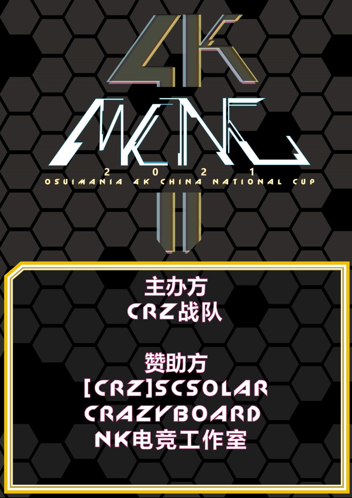
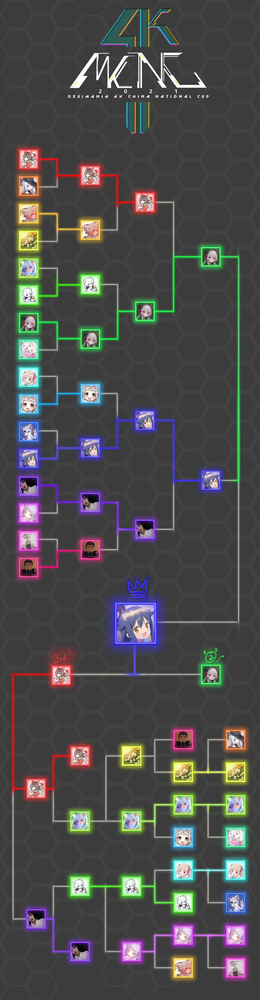
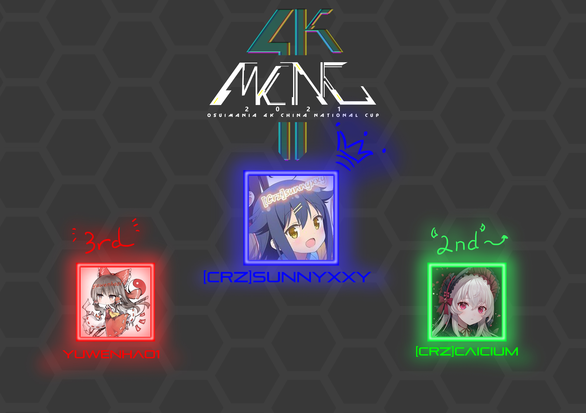

---
tags:
  - MCNC
  - MCNC2021
  - MCNC 2021
---

# osu!mania 4K Chinese National Cup 2021

The **osu!mania 4K Chinese National Cup 2021** (***MCNC 2021***) was a country-based osu!mania tournament hosted by the \[Crz\]Team. It was the third instalment of the osu!mania 4K Chinese National Cup.

## Tournament schedule

| Event | Timestamp |
| --: | :-- |
| Registration phase | 2021-03-01/2021-03-31 |
| Qualifiers | 2021-04-05/2021-04-11 |
| Live drawings | 2021-04-11 (20:00 UTC+8) |
| Group stage week 1 | 2021-04-12/2021-04-18 |
| Group stage week 2 | 2021-04-19/2021-04-25 |
| Round of 16 | 2021-04-26/2021-05-02 |
| Quarterfinals | 2021-05-03/2021-05-09 |
| Semifinals week 1 | 2021-05-10/2021-05-16 |
| Semifinals week 2 | 2021-05-17/2021-05-23 |
| Finals week 1 | 2021-05-24/2021-05-30 |
| Finals week 2 | 2021-05-31/2021-06-06 |

## Prizes

| Placing | Prizes |
| :-: | :-- |
|  | CNY 2,500, unique profile badge, 4 months of osu!supporter |
|  | CNY 1,500, 2 months of osu!supporter |
|  | CNY 800, 1 month of osu!supporter |

## Organisation

The osu!mania 4K Chinese National Cup 2021 was run by various community members.

| Position | Member(s) |
| :-- | :-- |
| Manager | ::{ flag=CN }:: [\[Crz\]xz1z1z](https://osu.ppy.sh/users/10500832), ::{ flag=US }:: [dblade](https://osu.ppy.sh/users/4272841) |
| Mappool selector | ::{ flag=CN }:: [\[Crz\]xz1z1z](https://osu.ppy.sh/users/10500832), ::{ flag=CN }:: [\[Illustrious\]](https://osu.ppy.sh/users/4082595), ::{ flag=CN }:: [Muses](https://osu.ppy.sh/users/9705896), ::{ flag=CN }:: [\[Crz\]MemoryI](https://osu.ppy.sh/users/8179131), ::{ flag=CN }:: [\[Crz\]Satori](https://osu.ppy.sh/users/7082178), ::{ flag=MX }:: [\[Crz\]Noire](https://osu.ppy.sh/users/6031847), ::{ flag=MX }:: [\[OSC\]Amagai](https://osu.ppy.sh/users/9658070) |
| Streamer | ::{ flag=CN }:: [\[Crz\]xz1z1z](https://osu.ppy.sh/users/10500832), ::{ flag=CN }:: [\[Crz\]Satori](https://osu.ppy.sh/users/7082178), ::{ flag=CN }:: [\[Illustrious\]](https://osu.ppy.sh/users/4082595), ::{ flag=CN }:: [Sonoaoi](https://osu.ppy.sh/users/9755808), ::{ flag=CN }:: [110](https://osu.ppy.sh/users/4524921), ::{ flag=CN }:: [\[Crz\]Mix0130](https://osu.ppy.sh/users/7215250) |
| Commentator | ::{ flag=CN }:: [\[Crz\]xz1z1z](https://osu.ppy.sh/users/10500832), ::{ flag=CN }:: [\[Crz\]Satori](https://osu.ppy.sh/users/7082178), ::{ flag=CN }:: [\[Illustrious\]](https://osu.ppy.sh/users/4082595), ::{ flag=CN }:: [\[Crz\]Mix0130](https://osu.ppy.sh/users/7215250) |
| Designer | ::{ flag=CN }:: [Dr\_Tissues](https://osu.ppy.sh/users/5106681) |
| Referee | ::{ flag=CN }:: [\[Crz\]xz1z1z](https://osu.ppy.sh/users/10500832), ::{ flag=CN }:: [\[Crz\]Satori](https://osu.ppy.sh/users/7082178), ::{ flag=CN }:: [\[Illustrious\]](https://osu.ppy.sh/users/4082595), ::{ flag=CN }:: [\[Crz\]MemoryI](https://osu.ppy.sh/users/8179131), ::{ flag=CN }:: [Ayase Eli](https://osu.ppy.sh/users/6764156) |
| Statistician | ::{ flag=CN }:: [Ayase Eli](https://osu.ppy.sh/users/6764156), ::{ flag=CN }:: [\[Crz\]xz1z1z](https://osu.ppy.sh/users/10500832), ::{ flag=CN }:: [\[RT\]Alleyne](https://osu.ppy.sh/users/11279273) |

## Links

- [Discussion thread (English)](https://osu.ppy.sh/community/forums/topics/1260186)
- [Discussion thread (Chinese)](https://osu.ppy.sh/community/forums/topics/1260175)
- [Livestream](https://live.bilibili.com/2996250)
- [Discord Server](https://discord.gg/uBHK5vq)
- [Challonge bracket](https://challonge.com/zh_CN/MCNC2021)
- **[Statistics sheet](https://docs.google.com/spreadsheets/d/1xgxKNKoJNEQz_zlPUf-4fyxeBDpuhfkgqxXyOxaIkpU)**

## Participants

| Seed | Player |
| :-: | :-- |
| #1 | ::{ flag=CN }:: [- xiaoluoli -](https://osu.ppy.sh/users/9502281) |
| #2 | ::{ flag=CN }:: [\[Crz\]Caicium](https://osu.ppy.sh/users/10702235) |
| #3 | ::{ flag=CN }:: [Sillyp](https://osu.ppy.sh/users/4556538) |
| #4 | ::{ flag=CN }:: [gzdongsheng](https://osu.ppy.sh/users/8660315) |
| #5 | ::{ flag=CN }:: [gluefly](https://osu.ppy.sh/users/8715409) |
| #6 | ::{ flag=HK }:: [Irone OSU](https://osu.ppy.sh/users/10678230) |
| #7 | ::{ flag=CN }:: [shade0214](https://osu.ppy.sh/users/14665128) |
| #8 | ::{ flag=CN }:: [observer233](https://osu.ppy.sh/users/15303552) |
| #9 | ::{ flag=CN }:: [\[Crz\]Makii](https://osu.ppy.sh/users/5242158) |
| #10 | ::{ flag=CN }:: [yuwenhao1](https://osu.ppy.sh/users/14318312) |
| #11 | ::{ flag=TW }:: [\[Rweiru\]](https://osu.ppy.sh/users/11234907) |
| #12 | ::{ flag=HK }:: [MCPXiaoBai](https://osu.ppy.sh/users/11259611) |
| #13 | ::{ flag=CN }:: [ketsuyo233](https://osu.ppy.sh/users/13844875) |
| #14 | ::{ flag=HK }:: [Lucas\_Kan](https://osu.ppy.sh/users/15755065) |
| #15 | ::{ flag=TW }:: [murorachi](https://osu.ppy.sh/users/8682905) |
| #16 | ::{ flag=CN }:: [\[Crz\]Liusecy](https://osu.ppy.sh/users/9082105) |
| #17 | ::{ flag=CN }:: [\[Crz\]sunnyxxy](https://osu.ppy.sh/users/10333739) |
| #18 | ::{ flag=CN }:: [karzexcc](https://osu.ppy.sh/users/5144698) |
| #19 | ::{ flag=CN }:: [Molli](https://osu.ppy.sh/users/8893772) |
| #20 | ::{ flag=CN }:: [MsD_Mafufu](https://osu.ppy.sh/users/10884561) |
| #21 | ::{ flag=CN }:: [\[1552828\]](https://osu.ppy.sh/users/8208288) |
| #22 | ::{ flag=CN }:: [U1d](https://osu.ppy.sh/users/10125072) |
| #23 | ::{ flag=CN }:: [\[JbL\]Hx_032](https://osu.ppy.sh/users/11603156) |
| #24 | ::{ flag=HK }:: [Yana Feiya](https://osu.ppy.sh/users/7802517) |
| #25 | ::{ flag=CN }:: [Littlesheep37](https://osu.ppy.sh/users/14742881) |
| #26 | ::{ flag=CN }:: [Sern888](https://osu.ppy.sh/users/2089244) |
| #27 | ::{ flag=MO }:: [\[Crz\]macaoleaf](https://osu.ppy.sh/users/7082716) |
| #28 | ::{ flag=CN }:: [spensll](https://osu.ppy.sh/users/4547744) |
| #29 | ::{ flag=CN }:: [\[Paw\]Chuixing](https://osu.ppy.sh/users/14906054) |
| #30 | ::{ flag=TW }:: [Ha0201](https://osu.ppy.sh/users/12243730) |
| #31 | ::{ flag=TW }:: [Joylintp](https://osu.ppy.sh/users/13579078) |
| #32 | ::{ flag=CN }:: [4kGameBye](https://osu.ppy.sh/users/89545) |

## Groups

| Group A | Group B | Group C | Group D | Group E | Group F | Group G | Group H |
| :-- | :-- | :-- | :-- | :-- | :-- | :-- | :-- |
| yuwenhao1 | \[Crz\]Caicium | \[Rweiru\] | \[Crz\]sunnyxxy | Ha0201 | Yana Feiya | Irone OSU | \[Crz\]Liusecy |
| karzexcc | MCPXiaoBai | gzdongsheng | MsD_Mafufu | \[Paw\]Chuixing | U1d | \[Crz\]macaoleaf | shade0214 |
| ketsuyo233 | Molli | - xiaoluoli - | Joylintp | Sern888 | murorachi | gluefly | spensll |
| observer233 | \[JbL\]Hx_032 | Lucas\_Kan | Sillyp | Littlesheep37 | \[Crz\]Makii | 4kGameBye | \[1552828\] |

## Podium

## Mappools

### Finals

**[Download the mappack here! (255 MB)](https://drive.google.com/file/d/1Fb0s3GTJzZ0v2LgCJLhtjphwpXXPYpkl/view?usp=sharing)**

- FreeMod
  1. [Camellia - Racemization (Ayase Eli) \[ELPIS' Racemization 1.15x\]](https://osu.ppy.sh/beatmapsets/1484517#mania/3044452)
  2. [sakuzyo - PANDORA PARADOXXX (Imperial Wolf) \[4K Re:MASTER LV.15\]](https://osu.ppy.sh/beatmapsets/1483812#mania/3043161)
  3. [Camellia - Flamewall (Cut ver.) (\[Crz\]xz1z1z) \[AlexDunk's FINAL REBELLION (Cut Edit) \[1.05x Rate\]\]](https://osu.ppy.sh/beatmapsets/1462775#mania/3019256)
  4. [MAX MAXIMIZER - Tortura (\[Crz\]Crysarlene) \[Distress\]](https://osu.ppy.sh/beatmapsets/1065944#mania/2232022)
  5. [Hatsuki Yura - Halloween of the Dead (Truth you left) \[Skwid's Challenge 1.05x\]](https://osu.ppy.sh/beatmapsets/1485450#mania/3046055)
  6. [Juggernaut - OPLHEUX (lemonguy) \[MAXIMUM\]](https://osu.ppy.sh/beatmapsets/1450331#mania/2981829)
  7. [SHK - Super Capriccio (\[Crz\]xz1z1z) \[Super Jacks 1.1x\]](https://osu.ppy.sh/beatmapsets/1482423#mania/3040646)
  8. [lapix - Horizon Blue feat. Kanata.N (Sillyp) \[4k Horizon\]](https://osu.ppy.sh/beatmapsets/1082497#mania/2264280)
  9. [konomi suzuki - CHOIR JAIL (Muses) \[Sin edit\]](https://osu.ppy.sh/beatmapsets/1392626#mania/3038977)
  10. [Boys Like Girls - The Great Escape (Shoegazer) \[Departure 1.2x\]](https://osu.ppy.sh/beatmapsets/1186973#mania/2476815)
  11. [Camellia - Kamah (Scythe) (Ticle) \[Set them free\]](https://osu.ppy.sh/beatmapsets/1314013#mania/2723400)
  12. [LV.4 - Angel Dust (2008 Mix) (\[Crz\]xz1z1z) \[Cut Edit\]](https://osu.ppy.sh/beatmapsets/1382971#mania/3019151)
  13. [Hatsuki Yura - Hameln (Muses) \[Fanger\]](https://osu.ppy.sh/beatmapsets/1481462#mania/3038941)
  14. [Falcom Sound Team jdk - GENS D'ARMES (lemonguy) \[Gendarme\]](https://osu.ppy.sh/beatmapsets/1199166#mania/2497240)
  15. [Camellia - B L A C K - R A Y (Toaph Daddy) \[D A R K - M A G I C I A N x1.1\]](https://osu.ppy.sh/beatmapsets/1306124#mania/2707897)
  16. [Chroma - Lost found melody (Ciel) \[Found\]](https://osu.ppy.sh/beatmapsets/1051052#mania/2196635)
- Tiebreaker
  1. **[Camellia - NIGHTMARE CITY (\[Crz\]xz1z1z) \[NIGHTMARE\]](https://osu.ppy.sh/beatmapsets/1486342#mania/3047677)**

### Semifinals

**[Download the mappack here! (160 MB)](https://drive.google.com/file/d/1tj0Q6dEO1YGqvsXZQ5huJkZAckPSh4fS/view?usp=sharing)**

- FreeMod
  1. [Oohashi Ayaka - NOISY LOVE POWER (\[Crz\]Serika) \[Fight for Love!! \[1.05x Rate\]\]](https://osu.ppy.sh/beatmapsets/1046203#mania/2187192)
  2. [Chroma - I (Raveille) \[HEAVENLY\]](https://osu.ppy.sh/beatmapsets/739919#mania/1561119)
  3. [Various Artist - Rachel's Hard Jack Pack (\[Crz\]Rachel\]) \[Paranoia Lv.26 (Marathon)\]](https://osu.ppy.sh/beatmapsets/998210#mania/2087898)
  4. [Lime - 8bit Voyager (Muses) \[LN Voyager \[Kamikaze edit\]\]](https://osu.ppy.sh/beatmapsets/1327056#mania/3004121)
  5. [Venetian Snares - Sinthasomphone (Gekido-) \[Challenge\]](https://osu.ppy.sh/beatmapsets/872435#mania/2595136)
  6. [Kairiki Bear & MARETU feat. Hatsune Miku - Inai Inai Izonshou (Ayase Eli) \[Ticle's Hierarchie\]](https://osu.ppy.sh/beatmapsets/1462717#mania/3004798)
  7. [Rissyuu feat. Cyoko - Take (Ayase Eli) \[xz1z1z's Challenge\]](https://osu.ppy.sh/beatmapsets/1323263#mania/2852089)
  8. [Squarion - Fallen Kingdom (Claren) \[The Kingdom Is In Ruins... (SV)\]]( https://osu.ppy.sh/beatmapsets/1431250#mania/2946215)
  9. [YOASOBI - Ano Yume o Nazotte (Muses) \[Fall into the Night\]](https://osu.ppy.sh/beatmapsets/1135500#mania/2474910)
  10. [Train - 50 Ways to Say Goodbye (\[Crz\]xz1z1z) \[Muses was my everything\]]( https://osu.ppy.sh/beatmapsets/1459444#mania/2998939)
  11. [Feryquitous - Arcahv (Abraxos) \[Rend\]]( https://osu.ppy.sh/beatmapsets/1184106#mania/2468487)
  12. [Aoi Eir - Cynthia No Hikari (Ayase Eli) \[arpia97's Illumination 4K 1.21x\]](https://osu.ppy.sh/beatmapsets/1462729#mania/3004812)
  13. [Shiraishi - True Millennium Queen (Muses) \[Scathach\]]( https://osu.ppy.sh/beatmapsets/1461646#mania/3002911)
  14. [Saitama Saisyu Heiki - L.L. Infinite Beating.ver (\[Illustrious\]) \[320% 1.1x\]](https://osu.ppy.sh/beatmapsets/1223208#mania/2562631)
  15. [Frums - dropdead (Chrubble) \[fatality\]](https://osu.ppy.sh/beatmapsets/957823#mania/2186287)
  16. [ONE – Future (arcwinolivirus) \[4K SV Innovation\]](https://osu.ppy.sh/beatmapsets/708785#mania/1498464)
- Tiebreaker
  1. **[Camellia vs. lapix - Solvicious (Mameyodoufu Remix) (Dubstek) \[Cybernetic Extinction\]](https://osu.ppy.sh/beatmapsets/933845#mania/1949498)**

### Quarterfinals

**[Download the mappack here! (112 MB)](https://drive.google.com/file/d/12P98_uqoBN5qaqL6-4DSFtxyFwcrjtVo/view?usp=sharing)**

- FreeMod
  1. [Dimrain47 – Infernoplex (\[Crz\]xz1z1z) \[Mat's Insane 1.35x\]](https://osu.ppy.sh/beatmapsets/https://osu.ppy.sh/beatmapsets/1454397#mania/2989914)
  2. [Camellia - Alone intelligence (guden) \[Solace\]](https://osu.ppy.sh/beatmapsets/1235533#mania/2568385)
  3. [Junk - Life is PIANO (Muses & xz's Life is JACKKK) \[\[Crz\]xz1z1z\]](https://osu.ppy.sh/beatmapsets/1369788#mania/2832368)
  4. [Hino Isuka - #be\_fortunate (HowToPlayLN) \[#be\_edited\]](https://osu.ppy.sh/beatmapsets/1099229#mania/2349916)
  5. [Silentroom - Shuu no Hazama (Cut ver.) (Monheim) \[April's Abendregen\]](https://osu.ppy.sh/beatmapsets/1321003#mania/2736532)
  6. [lapix - Outer Space (Evening) \[current\]](https://osu.ppy.sh/beatmapsets/1071822#mania/2243437)
  7. [sakuraburst – dragonlands (Toaph Daddy) \[myth\]](https://osu.ppy.sh/beatmapsets/808881#mania/1697375)
  8. [Morimori – PUPA (Fullerene-) \[Metamorphosis\]](https://osu.ppy.sh/beatmapsets/492056#mania/1048321)
  9. [Yooh – Heracles (Sherie) \[Confusion\]](https://osu.ppy.sh/beatmapsets/1135500#mania/2474910)
  10. [Honda Michiyo - close your eyes (\[Crz\]xz1z1z) \[Charoi's Beginner 1.1x\]](https://osu.ppy.sh/beatmapsets/1454360#mania/2989810)
  11. [WolF.R - Snow Wish (Muses) \[Frozen edit\]](https://osu.ppy.sh/beatmapsets/1451720#mania/2985094)
  12. [Sangatsu no Phantasia – Rendezvous (Muses) \[Jump! Peace! Shine! \[1.1x Rate\]\]](https://osu.ppy.sh/beatmapsets/1453455#mania/2988127)
  13. [SHK - Wedding Crashers (\[Crz\]xz1z1z) \[NTR\]](https://osu.ppy.sh/beatmapsets/1454389#mania/2989898)
  14. [sakuraburst – anticrystal (Mipha-) \[spooky\]](https://osu.ppy.sh/beatmapsets/1223208#mania/2562631)
- Tiebreaker
  1. **[rejection - Signal (feat. Such) (Mameyodoufu Remix) (\[OSC\]Amagai) \[ Keen Perception \[Revised Again\]\]](https://osu.ppy.sh/beatmapsets/1404380#mania/2993544)**

### Round of 16

**[Download the mappack here! (123 MB)](https://drive.google.com/file/d/1VDpFnjGwhyzIp0SvqUu6XEizSJ9FfGiD/view?usp=sharing)**

- FreeMod
  1. [TUYU - Doro no Bunzai de Watashidake no Taisetsu o Ubaouda Nante (flashnias) \[11Bit's Fallen Angel\]](https://osu.ppy.sh/beatmapsets/1248382#mania/2597083)
  2. [MYUKKE - BUNA\*SYNERGY!!! (Muses) \[M \[1.1x Rate\]\]](https://osu.ppy.sh/beatmapsets/1398645#mania/2885985)
  3. [yuiko - Inai sekai (\[Crz\]MemoryI) \[Disappear\]](https://osu.ppy.sh/beatmapsets/1400666#mania/2889624)
  4. [EGOIST - Namae no Nai Kaibutsu (TV Size) (Muses) \[P for Psychotherapy\]](https://osu.ppy.sh/beatmapsets/1426939#mania/2963439)
  5. [Creaky Jackals - PLVCK (Flexo123) \[Extra\]](https://osu.ppy.sh/beatmapsets/409921#mania/889671)
  6. [Camellia - Heart of Android : Even If It's Only By Mechanism (Cut ver.) (AlexDunk) \[Machinery love (Cut ver.)\]](https://osu.ppy.sh/beatmapsets/1444836#mania/2972051)
  7. [C-show - GIMME DA BLOOD (H1Pur) \[GIMME DA SV\]](https://osu.ppy.sh/beatmapsets/1428709#mania/2941393)
  8. [Fractal Dreamers - Gardens Under a Spring Sky (\[Crz\]xz1z1z) \[Vernal\]](https://osu.ppy.sh/beatmapsets/1398608#mania/2885730)
  9. [YOASOBI - Yoru ni Kakeru (11Bit) \[a longly night... 1.1x\]](https://osu.ppy.sh/beatmapsets/1211012#mania/2573485)
  10. [Mian - Present (Doshowz) \[Hard\]](https://osu.ppy.sh/beatmapsets/1444039#mania/2970437)
  11. [Erehamonika - Der Wald (\_underjoy) \[Verloren\]](https://osu.ppy.sh/beatmapsets/1319005#mania/2732397)
  12. [Hanatan - Palette (Lynessa) \[x1.0\]](https://osu.ppy.sh/beatmapsets/1413004#mania/2912596)
  13. [M2U - Felis (Nyakkeru) \[xz1z1z's Scurrying\]](https://osu.ppy.sh/beatmapsets/1321042#mania/2773340)
  14. [sakuzyo - Hodia (Tidek) \[Vivace\]](https://osu.ppy.sh/beatmapsets/924601#mania/1931227)
- Tiebreaker
  1. **[Kanone vs Yooh - Cold Inflaction (Extended Mix) (\[Crz\]xz1z1z) \[Cold But With You\]](https://osu.ppy.sh/beatmapsets/1274517#mania/2648242)**

### Group Stage

**[Download the mappack here! (83 MB)](https://drive.google.com/file/d/13I8C26KAv3xVXBov1fRHuWR80Hskzi6T/view?usp=sharing)**

- FreeMod
  1. [LeaF - Paraclete (Wonki) \[Another\]](https://osu.ppy.sh/beatmapsets/515734#mania/1095177)
  2. [Zekk - MEJIRUSHI (FAMoss) \[PROFESSIONA\]](https://osu.ppy.sh/beatmapsets/1159152#mania/2418797)
  3. [Neru - Nihiru to Suibotsutoshi (Muses) \[xz & Muse's Illusion\]](https://osu.ppy.sh/beatmapsets/1404700#mania/2897064)
  4. [Tezuka feat. Amimi Oonishi - Suisou no kujira (ATing) \[Touru's MIAN\]](https://osu.ppy.sh/beatmapsets/1167144#mania/2436346)
  5. [iconoclasm - perditus paradisus (lemonguy) \[Another\]](https://osu.ppy.sh/beatmapsets/1302861#mania/2845681)
  6. [Helblinde - Above The Clouds (\[Crz\]xz1z1z) \[Tidek's Heaven (Edit)\]](https://osu.ppy.sh/beatmapsets/1427003#mania/2938278)
  7. [xi - Fiat Lux (\[Crz\]MemoryI) \[on the same horizon\]](https://osu.ppy.sh/beatmapsets/1425149#mania/2934737)
  8. [Sta - The Silence (Wh1teh) \[Tranquility\]](https://osu.ppy.sh/beatmapsets/451169#mania/967884)
  9. [Unlucky Morpheus - Danzai wa Amaneku Ningen no Motto ni (\[Illustrious\]) \[kami no breeze\]](https://osu.ppy.sh/beatmapsets/1018449#mania/2902249)
  10. [nameless x toa - Patchwork Staccato (\[Crz\]Satori) \[ln\]](https://osu.ppy.sh/beatmapsets/1426977#mania/2938241)
  11. [succducc - me & u (Shoegazer) \[yume\]](https://osu.ppy.sh/beatmapsets/781107#mania/1640584)
  12. [Elijah Hill - Better (H1Pur) \[nearing perfection\]](https://osu.ppy.sh/beatmapsets/1376566#mania/2845109)
- Tiebreaker
  1. **[Camellia - Dance with Silence (\[Crz\]xz1z1z) \[Silence\]](https://osu.ppy.sh/beatmapsets/1405229#mania/2934744)**

### Qualifiers

**[Download the mappack here! (18 MB)](https://drive.google.com/file/d/1KYzdeiVoa11U0FYwjzqu-EKnDiA8DFr4/view?usp=sharing)**

- FreeMod
  1. [Petit Rabbit's - Tenkuu Cafeteria (TV Size) (Hidden is fun) \[BLOOM! (No LN)\]](https://osu.ppy.sh/beatmapsets/1418929#mania/2923231)
  2. [Makoto (CV: Komatsu Mikako) / Kasumi (CV: Minase Inori) - Mikaiketsuna omoi (\[Crz\]Satori) \[ln\]](https://osu.ppy.sh/beatmapsets/1419855#mania/2924900)
  3. [Synthwulf - Passacaglia (\[Illustrious\]) \[Insane\]](https://osu.ppy.sh/beatmapsets/1409526#mania/2906275)
  4. [Applesoda - Tales of Pumpnia (\[Crz\]xz1z1z) \[Battle\]](https://osu.ppy.sh/beatmapsets/1418376#mania/2922271)

## Match results

### Finals

| Player 1 |  |  | Player 2 | Match link |
| --: | :-: | :-: | :-- | :-- |
| **U1d** | **7** | 0 | MsD_Mafufu | *win by default* |
| **yuwenhao1** | **7** | 4 | Ha0201 | [#1](https://osu.ppy.sh/community/matches/85806522) |
| **yuwenhao1** | **7** | 2 | U1d | [#1](https://osu.ppy.sh/community/matches/85927717) |
| **\[Crz\]Caicium** | **7** | 5 | \[Crz\]sunnyxxy | [#1](https://osu.ppy.sh/community/matches/85929706) |
| **\[Crz\]sunnyxxy** | **7** | 3 | yuwenhao1 | [#1](https://osu.ppy.sh/community/matches/86292551) |
| \[Crz\]Caicium | 4 | **7** | **\[Crz\]sunnyxxy** | [#1](https://osu.ppy.sh/community/matches/86361944) |
| \[Crz\]Caicium | 3 | **7** | **\[Crz\]sunnyxxy** | [#1](https://osu.ppy.sh/community/matches/86365187) |

### Semifinals

| Player 1 |  |  | Player 2 | Match link |
| --: | :-: | :-: | :-- | :-- |
| Irone OSU | 0 | **7** | **Ha0201** | [#1](https://osu.ppy.sh/community/matches/83623070) |
| **\[Crz\]sunnyxxy** | **7** | 3 | U1d | [#1](https://osu.ppy.sh/community/matches/83691737) |
| Yana Feiya | 0 | **7** | **\[Rweiru\]** | *win by default* |
| yuwenhao1 | 2 | **7** | **\[Crz\]Caicium** | [#1](https://osu.ppy.sh/community/matches/84030240) |
| **MsD_Mafufu** | **7** | 5 | \[Rweiru\] | [#1](https://osu.ppy.sh/community/matches/84480806) |
| gzdongsheng | 0 | **7** | **Ha0201** | [#1](https://osu.ppy.sh/community/matches/84555810) |
| **MsD_Mafufu** | **7** | 0 | MCPXiaoBai | *win by default* |
| [Crz]Liusecy | 0 | **7** | **gzdongsheng** | *win by default* |

### Quarterfinals

| Player 1 |  |  | Player 2 | Match link |
| --: | :-: | :-: | :-- | :-- |
| **MCPXiaoBai** | **6** | 2 | \[Paw\]Chuixing | [#1](https://osu.ppy.sh/community/matches/83394250) |
| Irone OSU | 0 | **6** | **\[Crz\]sunnyxxy** | [#1](https://osu.ppy.sh/community/matches/62290117) |
| MsD_Mafufu | 3 | **6** | **[Crz]Caicium** | [#1](https://osu.ppy.sh/community/matches/83467939) |
| **Ha0201** | **6** | 0 | \[Crz\]macaoleaf | *win by default* |
| **yuwenhao1** | **6** | 3 | Yana Feiya | [#1](https://osu.ppy.sh/community/matches/83470730) |
| shade0214 | 0 | **6** | **gzdongsheng** | [#1](https://osu.ppy.sh/community/matches/83470730) |
| **U1d** | **6** | 1 | \[Crz\]Liusecy | [#1](https://osu.ppy.sh/community/matches/83477738) |
| **\[Rweiru\]** | **6** | 0 | karzexcc | *win by default* |

### Round of 16

| Player 1 |  |  | Player 2 | Match link |
| --: | :-: | :-: | :-- | :-- |
| **\[Crz\]Caicium** | **6** | 1 | [Crz]macaoleaf | [#1](https://osu.ppy.sh/community/matches/82672651) |
| **\[Crz\]Liusecy** | **6** | 0 | karzexcc | *win by default* |
| **Irone OSU** | **6** | 3 | MCPXiaoBai | [#1](https://osu.ppy.sh/community/matches/82833219) |
| \[Rweiru\] | 0 | **6** | **U1d** | [#1](https://osu.ppy.sh/community/matches/82923373) |
| **yuwenhao1** | **6** | 0 | shade0214 | *win by default* |
| Ha0201 | 4 | **6** | **MsD_Mafufu** | [#1](https://osu.ppy.sh/community/matches/82919114) |
| **\[Crz\]sunnyxxy** | **6** | 0 | \[Paw\]Chuixing | [#1](https://osu.ppy.sh/community/matches/82928188) |
| **Yana Feiya** | **6** | 2 | gzdongsheng | [#1](https://osu.ppy.sh/community/matches/82929574) |

### Group stage

| Player 1 |  |  | Player 2 | Match link |
| --: | :-: | :-: | :-- | :-- |
| **\[Crz\]Caicium** | **5** | 1 | MCPXiaoBai | [#1](https://osu.ppy.sh/community/matches/81572198) |
| **\[Crz\]Caicium** | **5** | 0 | Molli | [#1](https://osu.ppy.sh/community/matches/81575767) |
| **\[Crz\]sunnyxxy** | **5** | 0 | Sillyp | [#1](https://osu.ppy.sh/community/matches/81653325) |
| **\[Crz\]sunnyxxy** | **5** | 1 | MSD_Mafufu | [#1](https://osu.ppy.sh/community/matches/81656386) |
| **yuwenhao1** | **5** | 0 | ketsuyo233 | [#1](https://osu.ppy.sh/community/matches/81657719) |
| Sillyp | 0 | **5** | **MsD_Mafufu** | [#1](https://osu.ppy.sh/community/matches/81659028) |
| gluefly | 1 | **5** | **Irone OSU** | [#1](https://osu.ppy.sh/community/matches/81658993) |
| U1d | 3 | **5** | **Yana Feiya** | [#1](https://osu.ppy.sh/community/matches/81658921) |
| **Yana Feiya** | **5** | 0 | murorachi | [#1](https://osu.ppy.sh/community/matches/81661033) |
| **\[Crz\]macaoleaf** | **5** | 3 | gluefly | [#1](https://osu.ppy.sh/community/matches/81661029) |
| murorachi | 0 | **5** | **U1d** | [#1](https://osu.ppy.sh/community/matches/81663065) |
| Lucas_Kan | 3 | **5** | **\[Rweiru\]** | [#1](https://osu.ppy.sh/community/matches/81665236) |
| **Ha0201** | **5** | 0 | \[Paw\]Chuixing | [#1](https://osu.ppy.sh/community/matches/81667544) |
| Lucas_Kan | 1 | **5** | **- Xiaoluoli -** | [#1](https://osu.ppy.sh/community/matches/81668704) |
| \[JbL\]Hx\_032 | 0 | **5** | **\[Crz\]Caicium** | [#1](https://osu.ppy.sh/community/matches/81670334) |
| **yuwenhao1** | **5** | 2 | karzexcc | [#1](https://osu.ppy.sh/community/matches/81670242) |
| **yuwenhao1** | **5** | 0 | observer233 | [#1](https://osu.ppy.sh/community/matches/81673951) |
| **Irone OSU** | **5** | 0 | \[Crz\]macaoleaf | [#1](https://osu.ppy.sh/community/matches/81673389) |
| **Molli** | **5** | 0 | \[JbL\]Hx\_032 | [#1](https://osu.ppy.sh/community/matches/81673096) |
| **MCPXiaoBai** | **5** | 3 | \[JbL\]Hx\_032 | [#1](https://osu.ppy.sh/community/matches/81678940) |
| **Joylintp** | **5** | 0 | Sillyp | [#1](https://osu.ppy.sh/community/matches/81745198) |
| - xiaoluoli - | 0 | **5** | **gzdongsheng** | [#1](https://osu.ppy.sh/community/matches/81747783) |
| Molli | 2 | **5** | **MCPXiaoBai** | [#1](https://osu.ppy.sh/community/matches/81749543) |
| Lucas_Kan | 3 | **5** | **gzdongsheng** | [#1](https://osu.ppy.sh/community/matches/81750807) |
| observer233 | 0 | **5** | **karzexcc** | [#1](https://osu.ppy.sh/community/matches/81758822) |
| **\[Rweiru\]** | **5** | 1 | gzdongsheng | [#1](https://osu.ppy.sh/community/matches/81759366) |
| shade0214 | 1 | **5** | **\[Crz\]Liusecy** | [#1](https://osu.ppy.sh/community/matches/81758857) |
| Joylintp | 2 | **5** | **\[Crz\]sunnyxxy** | [#1](https://osu.ppy.sh/community/matches/81761705) |
| spensll | 0 | **5** | **\[Crz\]Liusecy** | [#1](https://osu.ppy.sh/community/matches/81761677) |
| **\[Rweiru\]** | **5** | 3 | - xiaoluoli - | [#1](https://osu.ppy.sh/community/matches/81763496) |
| \[1552828\] | 2 | **5** | **\[Crz\]Liusecy** | [#1](https://osu.ppy.sh/community/matches/81765240) |
| **U1d** | **5** | 0 | \[Crz\]Makii | [#1](https://osu.ppy.sh/community/matches/81831190) |
| **ketsuyo233** | **5** | 2 | observer233 | [#1](https://osu.ppy.sh/community/matches/81838133) |
| spensll | 3 | **5** | **shade0214** | [#1](https://osu.ppy.sh/community/matches/81911498) |
| **karzexcc** | **5** | 0 | ketsuyo233 | [#1](https://osu.ppy.sh/community/matches/81916515) |
| \[Crz\]Makii | 0 | **5** | **Yana Feiya** | [#1](https://osu.ppy.sh/community/matches/81917676) |
| **murorachi** | **5** | 4 | \[Crz\]Makii | [#1](https://osu.ppy.sh/community/matches/81997759) |
| \[1552828\] | 0 | **5** | **spensll** | [#1](https://osu.ppy.sh/community/matches/81997619) |
| **MsD_Mafufu** | **5** | 0 | Joylintp | [#1](https://osu.ppy.sh/community/matches/82177009) |
| Sern888 | 0 | 0 | Littlesheep37 | *win by default* |

## Ruleset

### Tournament rules

1. This is a osu!mania head-to-head individual tournament for Chinese players.
2. This tourney will be using 4-key score v2, and will have three stages: a qualifiers stage, a double elimination group stage followed by a double elimination bracket stage.
3. There is no limit on the number of the players that will enter. Any and all whom we deem as a "cheater" or "suspicious", screened by both the tourney and the official osu! staff, will not be allowed entry into the tournament. Note that failure to read the entire forum post during sign-up may cause the player to not be eligible until the issue is resolved, so please read the entire post first!
4. This tournament is for Chinese players only, including players from Mainland Chinese territories, Taiwan territories, Hong Kong territories, Macau territories. Please note that this tournament has nothing to do with politics and views about the territories of China. Only players with the flags of the territories listed above is eligible for playing.
5. The Discord server will be the source of pretty much all the information for this tournament, so if you're joining, either as player, staff, or even as a spectator, you'll want to join for all of the latest updates. Players are required to join the official Discord to be eligible of playing in the tournament. For those who cannot access Discord, we have a QQ server containing the methods which could help you better access Discord. QQ server number: 597317576.
6. For all of the details of the rules of the tourney, refer to the Information document here or in the Discord channel. The Discord channel and that document will have all the information you need, and the Discord channel will be where future announcements will be made! So make sure you join the channel if you are participating.

### Tournament registration

1. There is no rank range for this tournament, players from all skill levels are free to participate.
2. To be eligible for playing, one must:
   - Have not been banned/majorly restricted in the past year.
   - Pass a background check by osu!staff and the tournament staff.
   - Include the answer "金发美少女" in the question "Do you have anything else to say?"
3. Players need to have a live broadcast environment, if necessary, must be able to stream to show the hands.
4. We reserve the right to deny any and all suspicious accounts/players from participating in the tournament. Players must abide to the osu! terms of service.

### Stage instructions

1. In the first stage (Group Stage), the players will be divided into 8 groups of 4 players.
   - This may change depending on how many players are accepted into the competition at the end.
2. All the players from each group will face each other.
3. Rankings of each group are determined by sorting the results of each player's performance in the following priority:
   - Most matches won.
   - Have higher `{(the number of beatmaps won) - (the number of beatmaps defeated)}`.
   - Most beatmaps won.
   - **Winner of the match played previously between the tied players.**
   - In the event of a triple tie:
     - Have higher `∑{(total score difference) / (maximum score)}`.
     - Winner of the rematch.
4. The top 2 players of each group will move on to the knock-out stages.
   - This may change with the actual Group Stage setup.
5. Following stages are double elimination stages. This means that the winner moves on to the next stage and the losing player gets moved to the losers' bracket.
6. The **Winning conditions** for each stage will be:
   - In Group Stage, you need to win 5 beatmaps to win a match. (best of 9)
   - In the Round of 16 and the Quarterfinals, you need to win 6 beatmaps to win a match. (best of 11)
   - In Semifinals, **Finals and Grand Finals**, you need to win 7 beatmaps to win a match. (best of 13)

### Match instructions

1. A referee will create a multiplayer room 15 minutes in advance. Players must gather during this period. Room settings are osu!mania, Head-To-Head, Win Condition: "ScoreV2". Room name must be "MCNC: (Red) vs (Blue)".
2. Warmups during the Group Stages may not have a length higher than 5 minutes. Bracket Stages may be no longer than 6 minutes. Warmups are optional when allowed.
3. Players are allowed to ban 1 map each for each match alternating between the players with no restrictions except that each player must ban from mappool. Before matches will start, the captain of each player will roll and the one with the highest roll will pick maps from the mappool first and ban one map from the mappool second. Picks will alternate as well.
4. Players will be given at most 2 minutes for picking/banning each map. Players taking to long to make a ban/pick will result in losing their ban/pick. Continued stalling will result in the other player's banning/picking instead.
5. Players will be given at most 3 minutes for fielding the desired roster for the map. The map will start 3 minutes after the map has been chosen, with no exceptions barring technical issues.
6. For FreeMod picks, mod is optional for either of the player, with selectable mods being MR, HD, FI, and FL.
7. Should both players be at match point, or in other words should both players be one point away from winning, the tiebreaker is played as the last map instead. The tiebreaker map shares the same rule as the FreeMod maps.
8. There are no restrictions on what a player can or cannot pick, with the exception that the map being picked must be from the mappool for that match, has not been picked during the match, and cannot have been banned prior to the pick phase.
9. In the event of a tie during a map, the map is to be replayed. Should the map need to be replayed more than twice, then the player who selected that map may select another map with the replayed map being banned for the rest of the match. Should the pool run out of eligible maps this way, any nonbanned map may be picked again, overruling the previous rule of "maps picked cannot have been picked during the match yet".
10. Both players are allowed to restart a map at most once due to disconnects and other technical issues if the map has not proceeded for 30 seconds or longer. Same mods and roster must be used should a restart commence. Please try to fix any and all issues as much as possible prior to the match.
11. The referees may nullify rules at their discretion if necessary, and have the final say in what occurs during the match.
